--- 
title: "Environmental Informatics Using Research Infrastructures and their Data"
author: "Dr. Katharyn Duffy, Dr. Ben Ruddell"
#date: "2020 Edition"
cover-image: "/Users/rohan/Environmental-Informatics-Using-Research-Infrastructures-and-their-Data/images/EcoInfo4.png"
site: bookdown::bookdown_site
output: bookdown::gitbook
documentclass: book
github-repo: 'rdboone/Environmental-Informatics-Using-Research-Infrastructures-and-their-Data'
description: "Course text for NAU INF 550"
always_allow_html: true
---
>2020 Edition

# Preface {-}

This textbook provides an introduction to environmental and ecological informatics in the context of "big science"- that is, in the context of research infrastructures and observatories that collect and publish reams of observations and derived data products about the earth and its environment. The reader will learn how to make use of environmental infrastructures' data products. 

This textbook introduces a framework of learning outcomes that covers the broad context of these data products that is necessary to make proper use of the information: 

  * The infrastructure's organizational structure and scientific scope;
  * Instrumentation, quality control, metadata, data catalogs, API's, and data products;
  * Key references, key tutorials, and informatics best practices;
  * Professional career tracks in informatics;
  
This textbook is intended primarily for graduate students enrolled in computer science and informatics programs but engaged in studies and research on environmental and geoscience topics- with a special emphasis on ecological topics. Advanced undergraduates and other graduate students enrolled in STEM programs may also be well-served if they have a strong background in programming and computing. Additionally, professional scientists may find this textbook useful as a reference and as a training manual when they encounter the need to make use of the research infrastructures and data that are directly covered by the book's content- or find the need to train a junior scientist on the use of these infrastructures' data.  

The scope of the infrastructures and data products is mostly U.S. focused in this edition, but some of these infrastructures have a global reach, and the material is almost as useful for students in other countries as for U.S. students. The textbook can be tackled one unit at a time as a lab manual within a university course, or- in its intended application- a standard semester-long three-credit-hour graduate course should be offered to cover the entire textbook from start to finish. Digital supplements are provided with examples of successful projects. 

Efforts have been made to select activities using data products, software, and tools that are relatively mature and stable. Even so, because this textbook covers a rapidly moving field, portions will, unfortunately, become dated quickly. It is the authors' intent to release frequent editions that update and expand the material to keep pace with the rapid development of our field.

Informatics is arguably *the key scientific discipline* of the 21st century, and research infrastructures are the source of the raw natural resource fueling the informatics revolution: observational data. Most 21st century scientists and scientific staff will spend their careers immersed in the data revolution. We sincerely hope that this textbook provides the launchpad you need for your career or for your next project in environmental science.


## Acknowledgements {-}

This first version of the textbook was developed to offer INF550, a graduate course in the School of Informatics Computing and Cyber Systems at Northern Arizona University in Fall 2020, with funding and leadership from the National Science Foundation funded National Research Traineeship "T3" option in Ecological and Environmental Informatics within a PhD program in Informatics and Computing *(NRT-HDR #1829075, PI's Ogle, Barber, Richardson, Ruddell, and Sankey)*. Our research infrastructure partners were critical to the creation of the material. Our partners at NEON - Battelle deserve special gratitude for anchoring the project. The opinions expressed are those of the researchers, and not necessarily the funding agencies.  Special thanks to Megan Jones and Donal O'Leary at NEON-Battelle for their support in pulling NEON materials. 

### Key Contributors {-}

*Alphabetized by organization, then last name:*

* Alycia Crall, *NEON - Battelle*
* Chris Florian, *NEON - Battelle*
* Megan Jones, *NEON - Battelle*
* Hank Loescher, *NEON - Battelle*
* Paula Mabee, *NEON - Battelle*
* Donal O'Leary, *NEON - Battelle*
* Kate Thibault, *NEON - Battelle*
* Andrew Richardson,  *PhenoCam - NAU*
* Bijan Seyednasrollah,  *PhenoCam - NAU*
* Theresa Crimmons, *USA-NPN*
* Kathy Gerst, *USA-NPN*
* Lee Marsh,  *USA-NPN*

<a rel="license" href="http://creativecommons.org/licenses/by-nc-sa/4.0/"></a><br />This work is licensed under a <a rel="license" href="http://creativecommons.org/licenses/by-nc-sa/4.0/">Creative Commons Attribution-NonCommercial-ShareAlike 4.0 International License</a>.

<!--chapter:end:index.Rmd-->

---
editor_options:
  markdown:
    wrap: 72
output: pdf_document
---

# Pre-Course Setup: EcoInformatics Tools {.unnumbered}

The purpose of this course is to train you in key ecoinformatics
practices.

Therefore, as an Ecoinformatician you *need* to be able to:

1.  Pull data from Application Programming Interfaces (APIs)

    -   More on this in Chapter 2

2.  Organize and document your code and data

3.  Version control your code to avoid disaster and make it reproducible

    -   For you, your collaborators, and/or the wider community

4.  Push your code up to public-facing repositories

5.  Pull others code from public repositories.

More thoughts on the benefits and power of reproducibility [can be found
here](https://github.com/katharynduffy/ECOSS_reproducible_science)

To be successful, both in this course and in your careers you will need
these skills. This is why **they are a requirement** for this course. If
you are already using these skills on a daily basis, fantastic! If you
don't feel that you have mastery in the workflows listed above we have
placed lesson links throughout this chapter so that you can build these
skills and be successful in this course.

## Pre-Course Skills & Setup

For the purpose of this course we will largely be using the following
tools to access, pull, and explore data:

1.  R & Rstudio
2.  Git, GitHub, & Atom.io
3.  Markdown & Rmarkdown

As such we will need to install and/or update these tools on your
personal computer *before* our first day of class. While we chose R for
this course, nearly all of the packages and data are fully available and
transferable to Python or other languages. If you'd like to brush up on
your R skills I highly recommend Data Carpentry Boot camp's free [R for
Reproducible Scientific
Analysis](http://swcarpentry.github.io/r-novice-gapminder) course.

### Installing or Updating R

Please check your version of R. You will need R 3.6.0+

How to check your version in R or RStudio if you already have it:

    > version
                   _                           
    platform       x86_64-apple-darwin15.6.0   
    arch           x86_64                      
    os             darwin15.6.0                
    system         x86_64, darwin15.6.0        
    status                                     
    major          3                           
    minor          5.1                         
    year           2018                        
    month          07                          
    day            02                          
    svn rev        74947                       
    language       R                           
    version.string R version 3.5.1 (2018-07-02)
    nickname       Feather Spray  

If you don't already have R or need to update it [do so
here.](https://cran.rstudio.com/)

### Windows R/RStudio Setup

After you have downloaded R, run the .exe file that was just downloaded
Go to the [RStudio Download
page](https://www.rstudio.com/products/rstudio/download/#download) Under
Installers select RStudio X.XX.XXX - e.g. Windows Vista/7/8/10 Double
click the file to install it Once R and RStudio are installed, click to
open RStudio. If you don't get any error messages you are set. If there
is an error message, you will need to re-install the program.

### Mac R/RStudio Setup

After you have downloaded R, double click on the file that was
downloaded and R will install Go to the [RStudio Download
page](https://www.rstudio.com/products/rstudio/download/#download) Under
Installers select RStudio 1.2.1135 - Mac OS X XX.X (64-bit) to download
it. Once it's downloaded, double click the file to install it. Once R
and RStudio are installed, click to open RStudio. If you don't get any
error messages you are set. If there is an error message, you will need
to re-install the program.

## Linux R/RStudio Setup

R is available through most Linux package managers. You can download the
binary files for your distribution from CRAN. Or you can use your
package manager. e.g. for Debian/Ubuntu

      run sudo apt-get install r-base

and for Fedora

      run sudo yum install R

To install RStudio, go to the [RStudio Download
page](https://www.rstudio.com/products/rstudio/download/#download) Under
Installers select the version for your distribution. Once it's
downloaded, double click the file to install it Once R and RStudio are
installed, click to open RStudio. If you don't get any error messages
you are set. If there is an error message, you will need to re-install
the program.

### Install basic packages for this course

You can run the following script to make sure all the required packages
are properly installed on your computer.


```r
# list of required packages
list.of.packages <- c(
  'data.table',
  'tidyverse',
  'jsonlite',
  'jpeg',
  'png',
  'raster',
  'rgdal',
  'rmarkdown', 
  'knitr'
)

# identify new (not installed) packages
new.packages <- list.of.packages[!(list.of.packages %in% installed.packages()[,"Package"])]

# install new (not installed) packages
if(length(new.packages)) 
  install.packages(new.packages, 
                   repos='http://cran.rstudio.com/')

# load all of the required libraries
sapply(list.of.packages, library, character.only = T)
```

**Note**: On some operating systems, you may need to install the
Geospatial Data Abstraction Library (GDAL). More information about GDAL
can be found from
[here](https://trac.osgeo.org/gdal/wiki/DownloadingGdalBinaries).

## Installing and Setting up Git & Github on Your Machine

For this course you will need: 1. Git installed on your local machine 2.
Very basic bash scripting 3. A linked GitHub account 4. To link RStudio
to git via RStudio or Atom.io

As we will be using these skills constantly, they are a *pre-requisite*
for this course. If you don't yet have these skills it's okay! You can
learn everything that you need to know via the following freely
available resources:

-   [The Unix Shell](http://swcarpentry.github.io/shell-novice)

-   [Version Control with Git](http://swcarpentry.github.io/git-novice)

-   [Happy Git with R](https://happygitwithr.com/)

If you are learning these skills from scratch I estimate that you will
need to devote \~4-6 hours to get set up and comfortable with the
various workflows. Also remember that I have code office hours every
week and that Stack Exchange is your friend.

## Installing Atom

[Atom.io](https://atom.io/) is a powerful and useful text editor for the
following reasons:

1.  It is language agnostic

2.  It fully integrates with git and github + You can use it to
    push/pull/resolve conflicts and write code all in one space.

## Linking RStudio to Git

[Happy Git with R](https://happygitwithr.com/rstudio-git-github.html)
has a fantastic tutorial to help you link Rstudio-Git-Github on your
local machine and push/pull from or to public repositories.

## How we will be Conducting this Course

If you find a **broken link or error** in this course text [submit an
issue on the course github
repository](https://github.com/katharynduffy/katharynduffy.github.io/issues).

At the end of each chapter you will find a set of **Exercises**. At the
end of the assigned chapter you will be expected to submit two files to
the course webdrive:

1.  An [RMarkdown
    file](https://rstudio.com/wp-content/uploads/2015/02/rmarkdown-cheatsheet.pdf)
    with the naming convention: LASTNAME_COURSECODE_Section#.Rmd, and

2.  A knitted .PDF with the same naming convention:
    LASTNAME_COURSECODE_Section#.pdf

To generate these files you have two options:

1.  Click on the pencil and pad logo in the top of this text, copy the
    exercise section code, and drop it into your own .Rmd.

2.  Git clone our [course Github
    Repository](https://github.com/katharynduffy/katharynduffy.github.io),
    navigate to the '\_Exercises' folder, and use that .Rmd as a
    template.

*Note: Exercises submitted in any other format, or those missing
questions will not be graded*

To generate your .PDF to upload, in your RMarkdown file simply push the
'Knit' button at the top of your document.

## Exercises:

### Exercise 0.1: A git introduction

1.  Navigate to our [course
    github](https://github.com/katharynduffy/Environmental-Informatics-Using-Research-Infrastructures-and-their-Data)
2.  `git fork` our repo onto your own personal github account.
3.  `git clone` the repo onto your own personal machine in a place that
    is functional and not temporary *(e.g. not your downloads folder)*.

<!-- -->

    #hints
    cd `Your/Path/Here'
    git clone 'repo HTTPS'

4.  Add 2-3 sentences introducing yourself in the `_Course-participants`
    folder. For example:

<!-- -->

    ***
    Hi, I'm Dr. Katharyn Duffy.  I have a Ph.D in Earth Science from Northern Arizona University.  Over the past two years I've worked as an open-source software engineer in the PhenoCam lab, and now I'm the coding and lab support for your course.  I really look forward to working with all of you!
    ***

5.  Submit a `pull request` to add your introduction to our course
    participants folder.

<!-- -->

    #hints
    git add ...
    git commit ...
    git status....
    git push --set-upstream
    git remote -v
    git remote add upstream...

**Note:** *You may complete these either on the command line or via a
program like Atom.io. If you haven't yet made commits to a remote
repository or submitted pull requests please reference the resources
listed above.*

# Why 'EcoInformatics'?

*Portions of the following introduction were adapted from [Michener &
Jones 2012, Trends in Ecology & Evolution 'Ecoinformatics: supporting
ecology as a data-intensive
science](https://www.cell.com/trends/ecology-evolution/fulltext/S0169-5347(11)00339-9)*

Ecology is increasingly becoming a data-intensive science, relying on
massive amounts of data collected by both remote-sensing platforms and
sensor networks embedded in the environment. New observatory networks,
such as the US National Ecological Observatory Network (NEON), provide
research platforms that enable scientists to examine phenomena across
diverse ecosystem types through access to thousands of sensors
collecting diverse environmental observations. These networks spatially
and temporaly overlap with a number of other networks and
infrastructures ranging from remote sensing, to citizen science, and so
on.

It has been argued that **data-intensive science represents the fourth
scientific paradigm** following the empirical *(i.e. description of
natural phenomena)*, theoretical *(e.g. modeling and generalization)*
and computational *(e.g. simulation)* scientific approaches, and
comprises an approach for unifying theory, experimentation and
simulation.

Ecologists increasingly address questions at broader scales that have
both scientific and societal relevance. For example, the [40 top
priorities for science that can inform conservation and management
policy in the
USA](https://academic.oup.com/bioscience/article/61/4/290/324883) rely
principally on a sound foundation of ecological research, and the
ability to scale knowledge and inter-connect data.


> Continental-scale patterns and dynamics result from climate and people
> as broad-scale drivers interacting with finer-scale vectors that
> redistribute materials within and among linked terrestrial and aquatic
> systems. Climate and land-use change interact with patterns and
> processes at multiple, finer scales (blue arrows). (a) These drivers
> can influence broad-scale patterns directly, and these constraints may
> act to overwhelm heterogeneity and processes at (b) mesoscales and at
> (c) the finer scale of local sites. Broad-scale drivers can also exert
> an indirect impact on broad-scale patterns through their interactions
> with disturbances, including (d) the spread of invasive species, (e)
> pattern--process relationships at meso-scales, or (f) at finer scales
> within a site. Connectivity imparted by the transfer of materials
> occurs both at (g) the meso-scale and at (h) finer scales within sites
> where terrestrial and aquatic systems are connected. These dynamics at
> fine scales can propagate to influence larger spatial extents (red
> arrows). Feedbacks occur throughout the system. The term "drivers"
> refers to both forcing functions that are part of the system and to
> external drivers. [Peters et al.,
> 2008](https://esajournals.onlinelibrary.wiley.com/doi/pdf/10.1890/070098)

**Ecology is also affected by changes that are occurring throughout
science as a whole.**

In particular, scientists, professional societies and research sponsors
are recognizing the value of data as a product of the scientific
enterprise and placing increased emphasis on data stewardship, data
sharing, openness and supporting study repeatability.


> Data on ecological and environmental systems are (A) acquired, checked
> for quality, documented using an acquisition workflow, and then both
> the raw and derived data products are versioned and deposited in the
> DataONE federated data archive (red dashed arrows). Researchers
> discover and access data from the federation and then (B) integrate
> and process the data in an analysis workflow, resulting in derived
> data products, visualizations, and scholarly papers that are in turn
> archived in the data federation (red dashed arrows). Other researchers
> directly cite any of the versioned data, workflows, and visualizations
> that are archived in the DataONE federation. [Richman et al.,
> 2011](https://science.sciencemag.org/content/sci/331/6018/703.full.pdf?casa_token=dDumP2G8NpEAAAAA:8Zrx01SOGOQK79my5SKJdsy5buDQAOd_wVclvlq2eFJZ0MWpeUlHQ7zx3ygkfoQOXSyRLhgx0FDO9V4)

**The changes that are occurring in ecology create challenges with
respect to acquiring, managing and analyzing the large volumes of data
that are collected by scientists worldwide.**

One challenge that is particularly daunting lies in dealing with the
scope of ecology and the enormous variability in scales that is
encountered, spanning microbial community dynamics, communities of
organisms inhabiting a single plant or square meter, and ecological
processes occurring at the scale of the continent and biosphere. The
diversity in scales studied and the ways in which studies are carried
out results in large numbers of [small, idiosyncratic data
sets](https://muse.jhu.edu/article/262029/pdf?casa_token=8ysDn-0aPmAAAAAA:kqtGap8fEbZOvCZE_tcp4sjof-RwcLsiNvk0kk4fpx90jv4npnStRQAPQOb4jb9UC-JINBLlCEw)
that accumulate from the thousands of scientists that collect relevant
biological, ecological and environmental data.


> A proposed high-level architecture for ecological and environmental
> data management is shown consisting of three primary levels. Data
> stored within distributed data repositories (a) is mediated by
> standard metadata and ontologies (b) to power software tools used by
> scientists and data managers (c). Software applications use
> community-endorsed ontologies and metadata standards from the middle
> level to provide tools that are more effective for publishing,
> querying, integrating and analyzing data. Ontologies are separated
> into framework ontologies and domain-specific extensions, enabling
> contributions from multiple research groups, disciplines and
> individuals. Cross-disciplinary data are maintained in local
> repositories, but made accessible to the broader research community
> through distributed systems based on shared, open protocols (such as
> Metacat). Example repositories include the LTER network, National
> Ecological Observatory Network, United States Geographical Survey and
> SEEK's EarthGrid. [Madin et al.
> 2008,](https://www.sciencedirect.com/science/article/pii/S0169534708000384?casa_token=b8GX-9jkuLwAAAAA:nQtJlhAUGyZdcokpQLEtho3OfVeDUKhENueO0k8H7dWPmPmXOUFYhGR6sKNtT04rEgJNR_HNlqg)

**Ecoinformatics is a framework** that enables scientists to generate
new knowledge through innovative tools and approaches for:

-   discovering,
-   managing,
-   integrating,
-   analyzing,
-   visualizing,
-   and preserving

relevant biological, environmental, and socioeconomic data and
information. Many ecoinformatics solutions have been developed *over the
past decade*, increasing scientists' efficiency and supporting faster
and easier data discovery, integration and analysis; however, many
challenges remain, especially in relation to installing ecoinformatics
practices into mainstream research and education.

And that, course participants, is why we are here.

## The Framework of this Course

Over the duration of this course we will survey a wide array of
observation platforms and networks and build hands-on experience with
the framework of Ecoinformatics. For coherance we will cover the
following overarching themes:

> 1.  Each network's **mission and design**
> 2.  Each network's **spatial design**
>
> -   e.g. opprtunistic vs. planned, citizen science vs. orbital sensors
>
> 3.  The **types of data** that stream from each network
>
> -   e.g. sensors, derived products, metadata
>
> 4.  **How to access that data**
>
> -   e.g. APIs, landing pages, r packages etc.
>
> 5.  Opportunities to interact with or contribute to each network
>
> -   e.g. RFP's coming down the pipeline, internships, and
>     post-doctoral scholar programs.

At the conclusion of each network's section you will be asked to write a
1-page summary reviewing the above framework for each network, and
highlight how it potentially aligns with your own research. These series
of 1-page summaries will then culminate into a final presentation where
you propose to derive your own data product for your own research
*touching upon multiple networks* and *accounting for differences in
spatial footprints, frequency of observations, and important data
cross-walks*.

## Final Course Project: Proposed Derived Data Product

For your final project, you will present a **4-6 minute IGNITE-style
derived data product pitch**, followed by *2-3 minutes of questions from
your audience* (which will include members from the infrastrures we've
covered). Think of this project as your *'sales pitch'* to the research
infrastructure whose data you are using, and/or the scientific community
as a whole. In the IGNITE theme of *'Enlighten us but make it quick'*,
you will construct a series of slides that auto-advance every 30
seconds. Specific instructions for the content of each slide are below.

Ideally, this final presentation will feed upon a number of the
'culmination write-ups' you have conducted over the course of the
semester. Ideally, this derived data product will utilize data from a
number of sources, either covered within this course or external to it.
Ideally, it will also convince your audience that your idea is **novel,
useful,** *and* **possible**.

In order to complete this presentation, you will need to have worked
with the various data products you propose, have an in-depth
understanding of them, and their challenges, along with original, clean,
high-level summary graphics. Further, giving an IGNITE-style
presentation takes practice. IGNITE-style presentations are powerful, as
they keep *you* moving forward, and give your audience a *high-level
understanding* of your topic. We fully recommend rehearsing your
presentation **many times** before giving it live and recording yourself
to learn how you can improve.

Here's an example (of an even faster) ignite talk from one of your
book's authors:

<iframe width="560" height="315" src="https://www.youtube.com/embed/JOlVcHrtl8M" frameborder="0" allow="accelerometer; autoplay; encrypted-media; gyroscope; picture-in-picture" allowfullscreen>

</iframe>

**In your derived data product pitch you will cover these themes:**

1.  The need for the derived data that you are proposing to produce.

2.  What data you will use to derive this product, including the
    justification for this exact data.

3.  The processing pipeline for this product, along with estimates for a
    timeline.

4.  Potential hurdles you will have to overcome.

5.  How this product will serve the infrastructure and/or the scientific
    community.

**Specific slide criteria are as follows:**

**Slide 1:** Title, authors (including contacts at infrastructures
covered if applicable)

**Slide 2:** Justification for the derived data product; the gap or need
that it fills

**Slides 3-x:**

1 slide per data product used including:

-   The exact data product (e.g. NEON data product id and full title)

-   A 1 sentence summary of the data product and its justification for
    this purpose

-   An original, clean, polished high-level plot, gif or .mp4 of the
    data

**Slide x + 1:** A high-level workflow diagram of the processing
pipeline *E.g.: Original data and how you pull it in (API, r-package
etc)*

-   Filtering process using QA/QC or metadata

-   Orthorectification in time or space

Example generated using [draw.io](https://app.diagrams.net/):


**Slide x + 2:** A clean plot of all of the data you mentioned together,
and/or the derived data product itself with a 1 sentence summary

Example:


**Slide x+3:** Summary: Circle back on how this derived data product
serves your research, the infrastructure, and the wider science
community (no more than 10 words, suggestion: graphics or bullet points)

**Slide x + 4:** Data citations for all data used in proposed derived
data product

**An example slide deck with specific ideas** [**can be found
here**](https://docs.google.com/presentation/d/16vRomNXmdyGrKQ_bdsGaOfbbU-CW_ZGi5-MPhzDBclY/edit?usp=sharing)

**The rubric for your final presentation grade is as follows:**

Presentation meets all requirements and criteria: 60%

Aesthetics and craft of presentation: 10%

Live presentation of materials: 30%

<!--chapter:end:01_Pre-Course_Skills.Rmd-->

---
editor_options:
  markdown:
    wrap: 72
output:
  html_document:
    df_print: paged
---

# Introduction to NEON & its Data

> Estimated Time: 2 hours

**Course participants**: As you review this information, please consider
the final course project that you will work on the over this semester.
At the end of this section you will document an initial research
question, or idea and associated data needed to address that question,
that you may want to explore while pursuing this course.

## Learning Objectives

At the end of this activity, you will be able to:

-   Explain the mission of the National Ecological Observatory Network
    (NEON).
-   Explain the how sites are located within the NEON project design.
-   Determine how the different types of data that are collected and
    provided by NEON, and how they align with your own research.
-   Pull NEON data from the API and `neonUtilities` package
    [@R-neonUtilites]

## The NEON Project Mission & Design

To capture ecological heterogeneity across the United States, [NEON's
design](https://www.neonscience.org/neon-project-science-brochure)
divides the continent into 20 statistically different eco-climatic
domains. Each NEON field site is located within an eco-climatic domain.

## The Science and Design of NEON

To gain a better understanding of the broad scope of NEON watch this
4:08 minute long video.

<iframe width="560" height="315" src="https://www.youtube.com/embed/39YrzpxVRF8" frameborder="0" allow="autoplay; encrypted-media" allowfullscreen>

</iframe>

## NEON's Spatial Design

Watch this 4:22 minute video exploring the spatial design of NEON field
sites.

<iframe width="640" height="360" src="https://www.youtube.com/embed/zYr9vII-iu4" frameborder="0" allowfullscreen>

</iframe>

Please read the following page about NEON's Spatial Design:

-   <a href="https://www.neonscience.org/observatory/observatory-blog/primer-neon-sampling-design" target="_blank">
    Read this primer on NEON's Sampling Design</a>

-   <a href="https://www.neonscience.org/field-sites/spatiotemporal-design" target="_blank">
    Read about the different types of field sites - core and
    relocatable</a>

### NEON Samples All 20 Eco-Regions

Explore the NEON Field Site map taking note of the locations of:

1.  Aquatic & terrestrial field sites.
2.  Core & relocatable field sites.

<a class="link--button link--arrow" href="https://www.neonscience.org/field-sites/field-sites-map" target="_blank">
Click here to view the NEON Field Site Map</a>

Explore the NEON field site map. Do the following:

-   Zoom in on a study area of interest to see if there are any NEON
    field sites that are nearby.
-   Click the "More" button in the **upper right hand** corner of the
    map to filter sites by name, site host, domain or state.
-   Select one field site of interest.
    -   Click on the marker in the map.
    -   Then click on the name of the field site to jump to the field
        site landing page.

::: {#ds-dataTip markdown="1"}
<i class="fa fa-star"></i> **Data Tip:** You can download
<a href="https://www.neonscience.org/data/maps-spatial-data" target="_blank">maps,
kmz, or shapefiles of the field sites here</a>.
:::

## How NEON Collects Data

Watch this 3:06 minute video exploring the data that NEON collects.
<iframe width="640" height="360" src="https://www.youtube.com/embed/9IbbdQC1N3A" frameborder="0" allowfullscreen></iframe>

Read the
<a href="https://www.neonscience.org/data-collection" target="_blank">
Data Collection Methods</a> page to learn more about the different types
of data that NEON collects and provides. Then, follow the links below to
learn more about each collection method:

-   <a href="https://www.neonscience.org/data-collection/aquatic-observations" target="_blank">Aquatic
    Observation System (AOS) </a>
-   <a href="https://www.neonscience.org/data-collection/aquatic-sensor-measurements" target="_blank">Aquatic
    Instrument System (AIS) </a>
-   <a href="https://www.neonscience.org/data-collection/flux-tower-measurements" target="_blank">
    Terrestrial Instrument System (TIS) -- Flux Tower </a>
-   <a href="https://www.neonscience.org/data-collection/soil-sensors-measurements" target="_blank">
    Terrestrial Instrument System (TIS) -- Soil Sensors and Measurements
    </a>
-   <a href="https://www.neonscience.org/data-collection/terrestrial-organismal-sampling" target="_blank">
    Terrestrial Organismal System (TOS) </a>
-   <a href="https://www.neonscience.org/data-collection/airborne-remote-sensing" target="_blank">
    Airborne Observation Platform (AOP) </a>

All data collection protocols and processing documents are publicly
available. Read more about
<a href="https://www.neonscience.org/data-collection/protocols-standardized-methods" target="_blank">the
standardized protocols and how to access these documents</a>.

### Specimens & Samples

NEON also collects samples and specimens from which the other data
products are based. These samples are also available for research and
education purposes. Learn more:
<a href="https://www.neonscience.org/data/archival-samples/archival-samples-catalog" target="_blank">
NEON Biorepository</a>.

### Airborne Remote Sensing

Watch this 4:02 minute video to better understand the NEON Airborne
Observation Platform (AOP).

<iframe width="560" height="315" src="https://www.youtube.com/watch?v=etnU4xFMTQo" frameborder="0" allow="autoplay; encrypted-media" allowfullscreen>

</iframe>

::: {markdown="1"}
<i class="fa fa-star"></i> **Data Tip:** NEON also provides support to
your own research including proposals to fly the AOP over other study
sites, a mobile tower/instrumentation setup and others. Learn more here
the
<a href="https://www.neonscience.org/opportunities/assignable-assets" target="_blank">Assignable
Assets programs </a>.
:::

## Accessing NEON Data

NEON data are processed and go through quality assurance quality control
checks at NEON headquarters in Boulder, CO. NEON carefully documents
every aspect of sampling design, data collection, processing and
delivery. This documentation is freely available through the NEON data
portal.

-   Visit the
    <a href="http://data.neonscience.org/home" target="_blank">NEON Data
    Portal - data.neonscience.org </a>
-   Read more about the
    <a href="https://www.neonscience.org/data/data-processing" target="_blank">quality
    assurance and quality control processes for NEON data</a> and how
    the data are processed from raw data to higher level data products.
-   <a href="http://data.neonscience.org/data-products/explore" target="_blank">Explore
    NEON Data Products</a>. On the page for each data product in the
    catalog you can find the basic information about the product, find
    the data collection and processing protocols, and link directly to
    downloading the data.
-   Additionally, some types of NEON data are also available through the
    data portals of other organizations. For example,
    <a href="http://www.ibol.org/dna-barcodes-for-neons-terrestrial-insects/" target="_blank">
    NEON Terrestrial Insect DNA Barcoding Data</a> is available through
    the
    <a href="http://www.boldsystems.org/index.php/databases" target="_blank">
    Barcode of Life Datasystem (BOLD)</a>. Or NEON phenocam images are
    available from the
    <a href="https://phenocam.sr.unh.edu/webcam/network/search/?sitename=neon&type=&primary_vegtype=&dominant_species=&active=1&fluxdata=1" target="_blank">Phenocam
    network site</a>. More details on where else the data are available
    from can be found in the Availability and Download section on the
    Product Details page for each data product (visit
    <a href="http://data.neonscience.org/data-products/explore" target="_blank">Explore
    Data Products</a> to access individual Product Details pages).

### Pathways to access NEON Data

There are several ways to access data from NEON:

1.  Via the
    <a href="http://data.neonscience.org/home" target="_blank">NEON data
    portal</a>. Explore and download data. Note that much of the tabular
    data is available in zipped .csv files for each month and site of
    interest. To combine these files, use the neonUtilities package
    (<a href="https://www.neonscience.org/neonDataStackR" target="_blank">R
    tutorial</a>,
    <a href="https://www.neonscience.org/neon-utilities-python" target="_blank">Python
    tutorial</a>).\
2.  Use R or Python to programmatically access the data. NEON and
    community members have created code packages to directly access the
    data through an API. Learn more about the available resources by
    reading the
    <a href="https://www.neonscience.org/data/code-resources" target="_blank">Code
    Resources page</a> or visiting the
    <a href="https://github.com/NEONScience" target="_blank">NEONScience
    GitHub repo</a>.\
3.  Using the
    <a href="http://data.neonscience.org/data-api" target="_blank">NEON
    API</a>. Access NEON data directly using a custom API call.
4.  Access NEON data through partner's portals. Where NEON data directly
    overlap with other community resources, NEON data can be accessed
    through the portals. Examples include Phenocam, BOLD, Ameriflux, and
    others. You can learn more in the documentation for individual data
    products.

## Hands on: Accessing NEON Data & User Tokens

### Via the NEON API, with your User Token

NEON data can be downloaded from either the NEON Data Portal or the NEON
API. When downloading from the Data Portal, you can create a user
account. Read about the benefits of an account on the
<a href="https://www.neonscience.org/data/about-data/data-portal-user-accounts" target="_blank">User
Account page</a>. You can also use your account to create a token for
using the API. Your token is unique to your account, so don't share it.

While using a token is optional in general, it is required for this
course. Using a token when downloading data via the API, including when
using the neonUtilities package, links your downloads to your user
account, as well as enabling faster download speeds. For more
information about token usage and benefits, see the
<a href="https://data.neonscience.org/data-api" target="_blank">NEON API
documentation</a> page.

For now, in addition to faster downloads, using a token helps NEON to
track data downloads. Using **anonymized** user information, they can
then calculate data access statistics, such as which data products are
downloaded most frequently, which data products are downloaded in groups
by the same users, and how many users in total are downloading data.
This information helps NEON to evaluate the growth and reach of the
observatory, and to advocate for training activities, workshops, and
software development.

Tokens can (and should) be used whenever you use the NEON API. In this
tutorial, we'll focus on using tokens with the neonUtilities R package.

::: {#ds-objectives markdown="1"}
### Objectives

After completing this section, you will be able to:

-   Create a NEON API token
-   Use your token when downloading data with neonUtilities

### Things You'll Need To Complete This Tutorial

You will need a version of R (3.4.1 or higher) and `RStudio` loaded on
your computer.

### Install R Packages

1.  **neonUtilities:** `install.packages("neonUtilities")`

## Additional Resources

2.  NEON <a href="http://data.neonscience.org" target="_blank"> Data
    Portal </a>
3.  <a href="https://github.com/NEONScience" target="_blank">NEONScience
    GitHub Organization</a>
4.  <a href="https://www.neonscience.org/neonDataStackR" target="_blank">neonUtilities
    tutorial</a>
:::

If you've never downloaded NEON data using the neonUtilities package
before, we recommend starting with the
<a href="https://www.neonscience.org/download-explore-neon-data" target="_blank">Download
and Explore tutorial</a> before proceeding with this tutorial.

In the next sections, we'll get an API token from the NEON Data Portal,
and then use it in neonUtilities when downloading data.

### Get a NEON API Token

The first step is create a NEON user account, if you don't have one.
Follow the instructions on the
<a href="https://www.neonscience.org/data/about-data/data-portal-user-accounts" target="_blank">Data
Portal User Accounts</a> page. If you do already have an account, go to
<a href="https://data.neonscience.org/home" target="_blank">the NEON
Data Portal</a>, sign in, and go to your My Account profile page.

Once you have an account, you can create an API token for yourself. At
the bottom of the My Account page, you should see this bar:


Click the 'GET API TOKEN' button. After a moment, you should see this:


Click on the Copy button to copy your API token to the clipboard.

### Use the API token in neonUtilities

In the next section, we'll walk through saving your token somewhere
secure but accessible to your code. But first let's try out using the
token the easy way.

First, we need to load the `neonUtilities` package and set the working
directory:


```r
# install neonUtilities - can skip if already installed, but
# API tokens are only enabled in neonUtilities v1.3.4 and higher
# if your version number is lower, re-install
install.packages("neonUtilities")
# load neonUtilities
library(neonUtilities)
# set working directory
wd <- "~/data" # this will depend on your local machine
setwd(wd)
```

NEON API tokens are very long, so it would be annoying to keep pasting
the entire text string into functions. Assign your token an object name:


```r
NEON_TOKEN <- "PASTE YOUR TOKEN HERE"
```

Now we'll use the `loadByProduct()` function to download data. Your API
token is entered as the optional `token` input parameter. For this
example, we'll download Plant foliar traits (DP1.10026.001).


```r
foliar <- loadByProduct(dpID="DP1.10026.001", site="all", 
                        package="expanded", check.size=F,
                        token=NEON_TOKEN)
```

You should now have data saved in the `foliar` object; the API silently
used your token. If you've downloaded data without a token before, you
may notice this is faster!

This format applies to all `neonUtilities` functions that involve
downloading data or otherwise accessing the API; you can use the `token`
input with all of them. For example, when downloading remote sensing
data:


```r
chm <- byTileAOP(dpID="DP3.30015.001", site="WREF", 
                 year=2017, check.size=F,
                 easting=c(571000,578000), 
                 northing=c(5079000,5080000), 
                 savepath=wd,
                 token=NEON_TOKEN)
```

### Token management for open code

Your API token is unique to your account, so don't share it!

If you're writing code that will be shared with colleagues or available
publicly, such as in a GitHub repository or supplemental materials of a
published paper, you can't include the line of code above where we
assigned your token to `NEON_TOKEN`, since your token is fully visible
in the code there. Instead, you'll need to save your token locally on
your computer, and pull it into your code without displaying it. There
are a few ways to do this, we'll show two options here.

-   Option 1: Save the token in a local file, and `source()` that file
    at the start of every script. This is fairly simple but requires a
    line of code in every script.

-   Option 2: Add the token to a `.Renviron` file to create an
    environment variable that gets loaded when you open R. This is a
    little harder to set up initially, but once it's done, it's done
    globally, and it will work in every script you run.

#### Option 1: Save token in a local file

Open a new, empty R script (.R). Put a single line of code in the
script:


```r
NEON_TOKEN <- "PASTE YOUR TOKEN HERE"
```

Save this file within your current R project and call the file
`neon_token_source.R`. So that you don't accidently push your token up
to GitHub, move over to the command line or Atom.io and add it to your
`.gitignore` file:


```r
knitr::include_graphics('./docs/images/git_ignore.png')
```


Now, whenever you want to pull NEON data via the API, at the start of
any analysis you would place this line of code:


```r
source('neon_token_source.R')
```

Then you'll be able to use `token=NEON_TOKEN` when you run
`neonUtilities` functions, and you can share your code without
accidentally sharing your token.

#### Option 2: Save your toekn to your R environment

Instructions for finding and editing your .Renviron can be found in this
tutorial in [NEON's Data Tutorials
section.](https://www.neonscience.org/neon-api-tokens-tutorial)

## Hands on: NEON TOS Data

### Pull in Tree Data from NEON's TOS and investigate relationships

> Adapted from [Claire Lunch's 'Compare tree height measured from the
> ground to a Lidar-based Canopy Height
> Model'](https://www.neonscience.org/tree-heights-veg-structure-chm)
> tutorial

Later in this course we will be working with NEON's LiDAR-based Canopy
Height Model (CHM) data from their extensive Airborne Observation
Platform (AOP). In this section we will pull in **DP1.10098.001, Woody
plant vegetation structure** from NEON's Terrestrial Observation
Sampling (TOS) data and explore the data, from requesting it to plotting
it.


> Generalized TOS sampling schematic, showing the placement of
> Distributed, Tower, and Gradient Plots from the [NEON GUIDE TO WOODY
> PLANT VEGETATION STRUCTURE,
> 2018](https://www.google.com/url?sa=i&url=http%3A%2F%2Fdata.neonscience.org%2Fapi%2Fv0%2Fdocuments%2FNEON_vegStructure_userGuide_vA&psig=AOvVaw32PujoEegMkzIWVuL_Scwn&ust=1597765301177000&source=images&cd=vfe&ved=0CA0QjhxqFwoTCOjFiN_JousCFQAAAAAdAAAAABAU)

The [vegetation structure
data](https://data.neonscience.org/data-products/DP1.10098.001) are
collected by by field staff on the ground. This data product contains
the quality-controlled, native sampling resolution data from in-situ
measurements of live and standing dead woody individuals and shrub
groups, from all terrestrial NEON sites with qualifying woody
vegetation. The exact measurements collected per individual depend on
growth form, and these measurements are focused on enabling biomass and
productivity estimation, estimation of shrub volume and biomass, and
calibration / validation of multiple NEON airborne remote-sensing data
products. In general, comparatively large individuals that are visible
to remote-sensing instruments are mapped, tagged and measured, and other
smaller individuals are tagged and measured but not mapped. Smaller
individuals may be subsampled according to a nested subplot approach in
order to standardize the per plot sampling effort. Structure and mapping
data are reported per individual per plot; sampling metadata, such as
per growth form sampling area, are reported per plot.


> Illustration of a 20 m x 20 m Distributed/Gradient/Tower base plot
> (left), a 40 m x 40 m Tower base plot (right), and associated nested
> subplots used for measuring woody stem vegetation. Locations of
> subplots are denoted with plain text numbers, and locations of nested
> subplots are denoted with italic numbers from the [NEON GUIDE TO WOODY
> PLANT VEGETATION STRUCTURE,
> 2018](https://www.google.com/url?sa=i&url=http%3A%2F%2Fdata.neonscience.org%2Fapi%2Fv0%2Fdocuments%2FNEON_vegStructure_userGuide_vA&psig=AOvVaw32PujoEegMkzIWVuL_Scwn&ust=1597765301177000&source=images&cd=vfe&ved=0CA0QjhxqFwoTCOjFiN_JousCFQAAAAAdAAAAABAU)

For the purpose of this hands-on activity we will be using data from the
Wind River Experimental Forest NEON field site located in Washington
state. The predominant vegetation at that site is tall evergreen
conifers.

*Note: this is also a core site for many other networks such as
[AmeriFlux and
FLUXNET](https://ameriflux.lbl.gov/sites/siteinfo/US-Wrc), which we will
cover later*.


> Image of the Wind River Crane Flux Tower from
> [Ameriflux](https://ameriflux.lbl.gov/sites/siteinfo/US-Wrc)

Let's begin by:

1.  Installing the `geoNEON` package
2.  Making sure that the packages that we need are loaded, and
3.  Supressing 'strings as factors' in R, as factors make all sorts of
    functions in R 'cranky'.


```r
options(stringsAsFactors=F)

#install.packages("devtools") #uncomment if you don't yet have devtools
#devtools::install_github("NEONScience/NEON-geolocation/geoNEON")

library(neonUtilities)
library(geoNEON)
library(sp)
```

Now lets begin by pulling in the **vegetation structure data** using the
`loadByProduct()` function in the `neonUtilities` package. Inputs needed
to the function are:

-   dpID: data product ID; (woody vegetation structure = DP1.10098.001

-   site: 4-letter site code; Wind River = WREF

-   package: basic or expanded; we'll begin with a `basic` here


```r
veglist <- loadByProduct(dpID="DP1.10098.001", site="WREF", package="basic", check.size=FALSE, token = NEON_TOKEN)
```

```
## Finding available files
## 
  |                                                                            
  |                                                                      |   0%
  |                                                                            
  |=====                                                                 |   7%
  |                                                                            
  |=========                                                             |  13%
  |                                                                            
  |==============                                                        |  20%
  |                                                                            
  |===================                                                   |  27%
  |                                                                            
  |=======================                                               |  33%
  |                                                                            
  |============================                                          |  40%
  |                                                                            
  |=================================                                     |  47%
  |                                                                            
  |=====================================                                 |  53%
  |                                                                            
  |==========================================                            |  60%
  |                                                                            
  |===============================================                       |  67%
  |                                                                            
  |===================================================                   |  73%
  |                                                                            
  |========================================================              |  80%
  |                                                                            
  |=============================================================         |  87%
  |                                                                            
  |=================================================================     |  93%
  |                                                                            
  |======================================================================| 100%
## 
## Downloading files totaling approximately 18.79386 MB
## Downloading 15 files
## 
  |                                                                            
  |                                                                      |   0%
  |                                                                            
  |=====                                                                 |   7%
  |                                                                            
  |==========                                                            |  14%
  |                                                                            
  |===============                                                       |  21%
  |                                                                            
  |====================                                                  |  29%
  |                                                                            
  |=========================                                             |  36%
  |                                                                            
  |==============================                                        |  43%
  |                                                                            
  |===================================                                   |  50%
  |                                                                            
  |========================================                              |  57%
  |                                                                            
  |=============================================                         |  64%
  |                                                                            
  |==================================================                    |  71%
  |                                                                            
  |=======================================================               |  79%
  |                                                                            
  |============================================================          |  86%
  |                                                                            
  |=================================================================     |  93%
  |                                                                            
  |======================================================================| 100%
## 
## Unpacking zip files using 1 cores.
## Stacking operation across a single core.
## Stacking table vst_apparentindividual
## Stacking table vst_mappingandtagging
## Stacking table vst_perplotperyear
## Stacking table vst_non-woody
## Copied the most recent publication of validation file to /stackedFiles
## Copied the most recent publication of categoricalCodes file to /stackedFiles
## Copied the most recent publication of variable definition file to /stackedFiles
## Finished: Stacked 4 data tables and 4 metadata tables!
## Stacking took 0.711849 secs
```

Now, use the `getLocTOS()` function in the `geoNEON` package to get
precise locations for the tagged plants. You can refer to the package
documentation for more details.


```r
vegmap <- getLocTOS(veglist$vst_mappingandtagging, 
                          "vst_mappingandtagging")
```

```
## 
  |                                                                            
  |                                                                      |   0%
  |                                                                            
  |                                                                      |   1%
  |                                                                            
  |=                                                                     |   1%
  |                                                                            
  |=                                                                     |   2%
  |                                                                            
  |==                                                                    |   2%
  |                                                                            
  |==                                                                    |   3%
  |                                                                            
  |===                                                                   |   4%
  |                                                                            
  |====                                                                  |   5%
  |                                                                            
  |====                                                                  |   6%
  |                                                                            
  |=====                                                                 |   7%
  |                                                                            
  |=====                                                                 |   8%
  |                                                                            
  |======                                                                |   8%
  |                                                                            
  |======                                                                |   9%
  |                                                                            
  |=======                                                               |   9%
  |                                                                            
  |=======                                                               |  10%
  |                                                                            
  |=======                                                               |  11%
  |                                                                            
  |========                                                              |  11%
  |                                                                            
  |========                                                              |  12%
  |                                                                            
  |=========                                                             |  12%
  |                                                                            
  |=========                                                             |  13%
  |                                                                            
  |==========                                                            |  14%
  |                                                                            
  |==========                                                            |  15%
  |                                                                            
  |===========                                                           |  16%
  |                                                                            
  |============                                                          |  17%
  |                                                                            
  |============                                                          |  18%
  |                                                                            
  |=============                                                         |  18%
  |                                                                            
  |=============                                                         |  19%
  |                                                                            
  |==============                                                        |  19%
  |                                                                            
  |==============                                                        |  20%
  |                                                                            
  |==============                                                        |  21%
  |                                                                            
  |===============                                                       |  21%
  |                                                                            
  |===============                                                       |  22%
  |                                                                            
  |================                                                      |  22%
  |                                                                            
  |================                                                      |  23%
  |                                                                            
  |=================                                                     |  24%
  |                                                                            
  |==================                                                    |  25%
  |                                                                            
  |==================                                                    |  26%
  |                                                                            
  |===================                                                   |  27%
  |                                                                            
  |===================                                                   |  28%
  |                                                                            
  |====================                                                  |  28%
  |                                                                            
  |====================                                                  |  29%
  |                                                                            
  |=====================                                                 |  29%
  |                                                                            
  |=====================                                                 |  30%
  |                                                                            
  |=====================                                                 |  31%
  |                                                                            
  |======================                                                |  31%
  |                                                                            
  |======================                                                |  32%
  |                                                                            
  |=======================                                               |  32%
  |                                                                            
  |=======================                                               |  33%
  |                                                                            
  |========================                                              |  34%
  |                                                                            
  |========================                                              |  35%
  |                                                                            
  |=========================                                             |  36%
  |                                                                            
  |==========================                                            |  37%
  |                                                                            
  |==========================                                            |  38%
  |                                                                            
  |===========================                                           |  38%
  |                                                                            
  |===========================                                           |  39%
  |                                                                            
  |============================                                          |  39%
  |                                                                            
  |============================                                          |  40%
  |                                                                            
  |============================                                          |  41%
  |                                                                            
  |=============================                                         |  41%
  |                                                                            
  |=============================                                         |  42%
  |                                                                            
  |==============================                                        |  42%
  |                                                                            
  |==============================                                        |  43%
  |                                                                            
  |===============================                                       |  44%
  |                                                                            
  |================================                                      |  45%
  |                                                                            
  |================================                                      |  46%
  |                                                                            
  |=================================                                     |  47%
  |                                                                            
  |=================================                                     |  48%
  |                                                                            
  |==================================                                    |  48%
  |                                                                            
  |==================================                                    |  49%
  |                                                                            
  |===================================                                   |  49%
  |                                                                            
  |===================================                                   |  50%
  |                                                                            
  |===================================                                   |  51%
  |                                                                            
  |====================================                                  |  51%
  |                                                                            
  |====================================                                  |  52%
  |                                                                            
  |=====================================                                 |  52%
  |                                                                            
  |=====================================                                 |  53%
  |                                                                            
  |======================================                                |  54%
  |                                                                            
  |======================================                                |  55%
  |                                                                            
  |=======================================                               |  56%
  |                                                                            
  |========================================                              |  57%
  |                                                                            
  |========================================                              |  58%
  |                                                                            
  |=========================================                             |  58%
  |                                                                            
  |=========================================                             |  59%
  |                                                                            
  |==========================================                            |  59%
  |                                                                            
  |==========================================                            |  60%
  |                                                                            
  |==========================================                            |  61%
  |                                                                            
  |===========================================                           |  61%
  |                                                                            
  |===========================================                           |  62%
  |                                                                            
  |============================================                          |  62%
  |                                                                            
  |============================================                          |  63%
  |                                                                            
  |=============================================                         |  64%
  |                                                                            
  |==============================================                        |  65%
  |                                                                            
  |==============================================                        |  66%
  |                                                                            
  |===============================================                       |  67%
  |                                                                            
  |===============================================                       |  68%
  |                                                                            
  |================================================                      |  68%
  |                                                                            
  |================================================                      |  69%
  |                                                                            
  |=================================================                     |  69%
  |                                                                            
  |=================================================                     |  70%
  |                                                                            
  |=================================================                     |  71%
  |                                                                            
  |==================================================                    |  71%
  |                                                                            
  |==================================================                    |  72%
  |                                                                            
  |===================================================                   |  72%
  |                                                                            
  |===================================================                   |  73%
  |                                                                            
  |====================================================                  |  74%
  |                                                                            
  |====================================================                  |  75%
  |                                                                            
  |=====================================================                 |  76%
  |                                                                            
  |======================================================                |  77%
  |                                                                            
  |======================================================                |  78%
  |                                                                            
  |=======================================================               |  78%
  |                                                                            
  |=======================================================               |  79%
  |                                                                            
  |========================================================              |  79%
  |                                                                            
  |========================================================              |  80%
  |                                                                            
  |========================================================              |  81%
  |                                                                            
  |=========================================================             |  81%
  |                                                                            
  |=========================================================             |  82%
  |                                                                            
  |==========================================================            |  82%
  |                                                                            
  |==========================================================            |  83%
  |                                                                            
  |===========================================================           |  84%
  |                                                                            
  |============================================================          |  85%
  |                                                                            
  |============================================================          |  86%
  |                                                                            
  |=============================================================         |  87%
  |                                                                            
  |=============================================================         |  88%
  |                                                                            
  |==============================================================        |  88%
  |                                                                            
  |==============================================================        |  89%
  |                                                                            
  |===============================================================       |  89%
  |                                                                            
  |===============================================================       |  90%
  |                                                                            
  |===============================================================       |  91%
  |                                                                            
  |================================================================      |  91%
  |                                                                            
  |================================================================      |  92%
  |                                                                            
  |=================================================================     |  92%
  |                                                                            
  |=================================================================     |  93%
  |                                                                            
  |==================================================================    |  94%
  |                                                                            
  |==================================================================    |  95%
  |                                                                            
  |===================================================================   |  96%
  |                                                                            
  |====================================================================  |  97%
  |                                                                            
  |====================================================================  |  98%
  |                                                                            
  |===================================================================== |  98%
  |                                                                            
  |===================================================================== |  99%
  |                                                                            
  |======================================================================|  99%
  |                                                                            
  |======================================================================| 100%
```

Now we need to merge the mapped locations of individuals (the
`vst_mappingandtagging table`) with the annual measurements of height,
diameter, etc (the `vst_apparentindividual table`). The two tables join
based on *individualID*, the identifier for each tagged plant, but we'll
include namedLocation, domainID, siteID, and plotID in the list of
variables to merge on, to avoid ending up with duplicates of each of
those columns. Refer to the variables table and to the Data Product User
Guide for Woody plant vegetation structure for more information about
the contents of each data table.


```r
veg <- merge(veglist$vst_apparentindividual, vegmap, 
             by=c("individualID","namedLocation",
                  "domainID","siteID","plotID"))
```

What did you just pull in? Are you sure you know what you're working
with? A **best practice** is to *always* do a quick visualization to
make sure that you have the right data and that you understand its
spread:


```r
symbols(veg$adjEasting[which(veg$plotID=="WREF_075")], 
        veg$adjNorthing[which(veg$plotID=="WREF_075")], 
        circles=veg$stemDiameter[which(veg$plotID=="WREF_075")]/100/2, 
        inches=F, xlab="Easting", ylab="Northing")
```

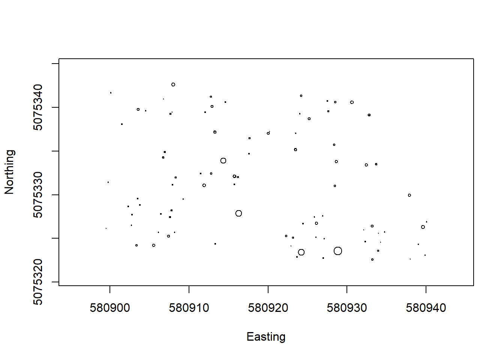

A key component of any measurement, and therefore a reoccuring theme in
this course, is an **estimate of uncertainty**. Let's overlay estimates
of uncertainty for the location of each stem in blue:


```r
symbols(veg$adjEasting[which(veg$plotID=="WREF_075")], 
        veg$adjNorthing[which(veg$plotID=="WREF_075")], 
        circles=veg$stemDiameter[which(veg$plotID=="WREF_075")]/100/2, 
        inches=F, xlab="Easting", ylab="Northing")
symbols(veg$adjEasting[which(veg$plotID=="WREF_075")], 
        veg$adjNorthing[which(veg$plotID=="WREF_075")], 
        circles=veg$adjCoordinateUncertainty[which(veg$plotID=="WREF_075")], 
        inches=F, add=T, fg="lightblue")
```

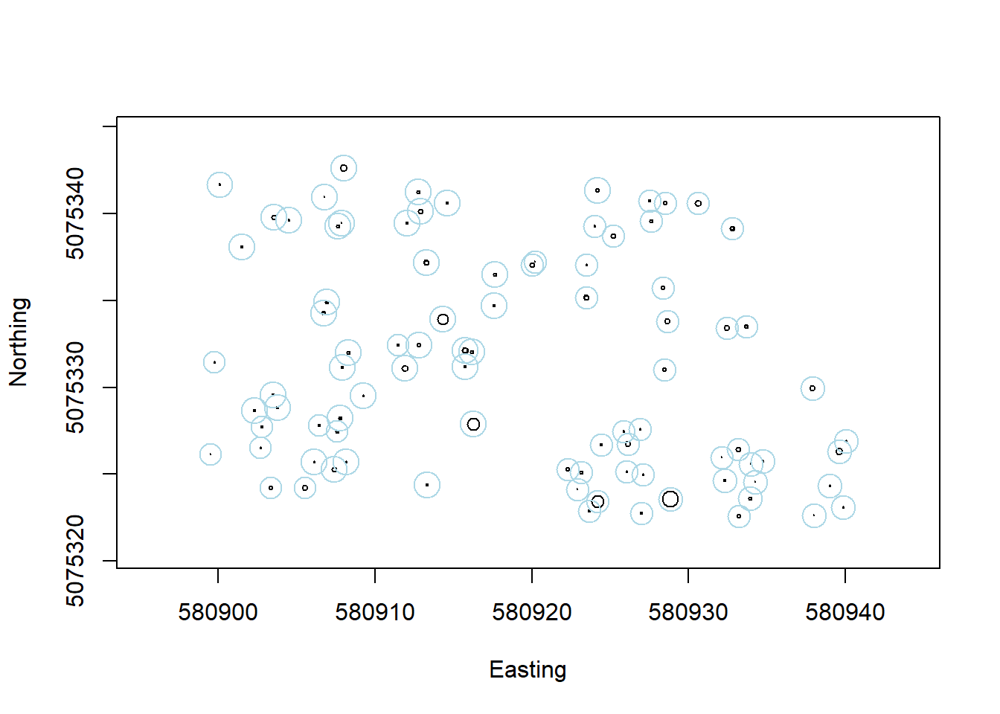

## Intro to NEON Exercises Part 1

### Exercise 2.1: NEON Coding Lab - TOS Vegetation Structure

#### Part 1: Sign up for and Use an NEON API Token:

1.  Submit via .Rmd and .pdf a simple script that uses a *HIDDEN* token
    to access NEON data.

Example:


```r
source('neon_token_source.R')
veglist <- loadByProduct(dpID="DP1.10098.001", site="WREF", package="basic", check.size=FALSE, token = NEON_TOKEN)
```

```
## Finding available files
## 
  |                                                                            
  |                                                                      |   0%
  |                                                                            
  |=====                                                                 |   7%
  |                                                                            
  |=========                                                             |  13%
  |                                                                            
  |==============                                                        |  20%
  |                                                                            
  |===================                                                   |  27%
  |                                                                            
  |=======================                                               |  33%
  |                                                                            
  |============================                                          |  40%
  |                                                                            
  |=================================                                     |  47%
  |                                                                            
  |=====================================                                 |  53%
  |                                                                            
  |==========================================                            |  60%
  |                                                                            
  |===============================================                       |  67%
  |                                                                            
  |===================================================                   |  73%
  |                                                                            
  |========================================================              |  80%
  |                                                                            
  |=============================================================         |  87%
  |                                                                            
  |=================================================================     |  93%
  |                                                                            
  |======================================================================| 100%
## 
## Downloading files totaling approximately 18.79386 MB
## Downloading 15 files
## 
  |                                                                            
  |                                                                      |   0%
  |                                                                            
  |=====                                                                 |   7%
  |                                                                            
  |==========                                                            |  14%
  |                                                                            
  |===============                                                       |  21%
  |                                                                            
  |====================                                                  |  29%
  |                                                                            
  |=========================                                             |  36%
  |                                                                            
  |==============================                                        |  43%
  |                                                                            
  |===================================                                   |  50%
  |                                                                            
  |========================================                              |  57%
  |                                                                            
  |=============================================                         |  64%
  |                                                                            
  |==================================================                    |  71%
  |                                                                            
  |=======================================================               |  79%
  |                                                                            
  |============================================================          |  86%
  |                                                                            
  |=================================================================     |  93%
  |                                                                            
  |======================================================================| 100%
## 
## Unpacking zip files using 1 cores.
## Stacking operation across a single core.
## Stacking table vst_apparentindividual
## Stacking table vst_mappingandtagging
## Stacking table vst_perplotperyear
## Stacking table vst_non-woody
## Copied the most recent publication of validation file to /stackedFiles
## Copied the most recent publication of categoricalCodes file to /stackedFiles
## Copied the most recent publication of variable definition file to /stackedFiles
## Finished: Stacked 4 data tables and 4 metadata tables!
## Stacking took 0.6172729 secs
```

```r
summary(veglist)
```

```
##                        Length Class      Mode
## categoricalCodes_10098  5     data.table list
## issueLog_10098          9     data.table list
## readme_10098            1     data.frame list
## validation_10098        8     data.table list
## variables_10098         9     data.table list
## vst_apparentindividual 41     data.frame list
## vst_mappingandtagging  30     data.frame list
## vst_non-woody          47     data.frame list
## vst_perplotperyear     43     data.frame list
```

#### Part 2: Further Investigation of NEON TOS Vegetation Structure Data

**Suggested Timing: Complete this exercise before our next class
session**

*In the following section all demonstration code uses the `iris` dataset
for R as examples. In this exercise the `iris` data is merely used for
example code to get your started, you will complete all plots and models
using the NEON TOS vegetation structure data*

1.  Convert the above diameter plot into a ggplot: If you need some
    refreshers on ggplot [Derek Sonderegger's Introductory Data Science
    using R: Graphing Part
    II](https://dereksonderegger.github.io/444/14-graphing-part-ii.html)
    is a wonderful resource. I've pulled some of his plotting examples
    here.


```r
library(ggplot2)
print ('your code here')
```

```
## [1] "your code here"
```

2.  Set the color your circles to be a function of each species:


```r
#hints:
data("iris")
ggplot(iris, aes(x=Sepal.Length, y=Petal.Length, color=Species)) +
  geom_point() 
```

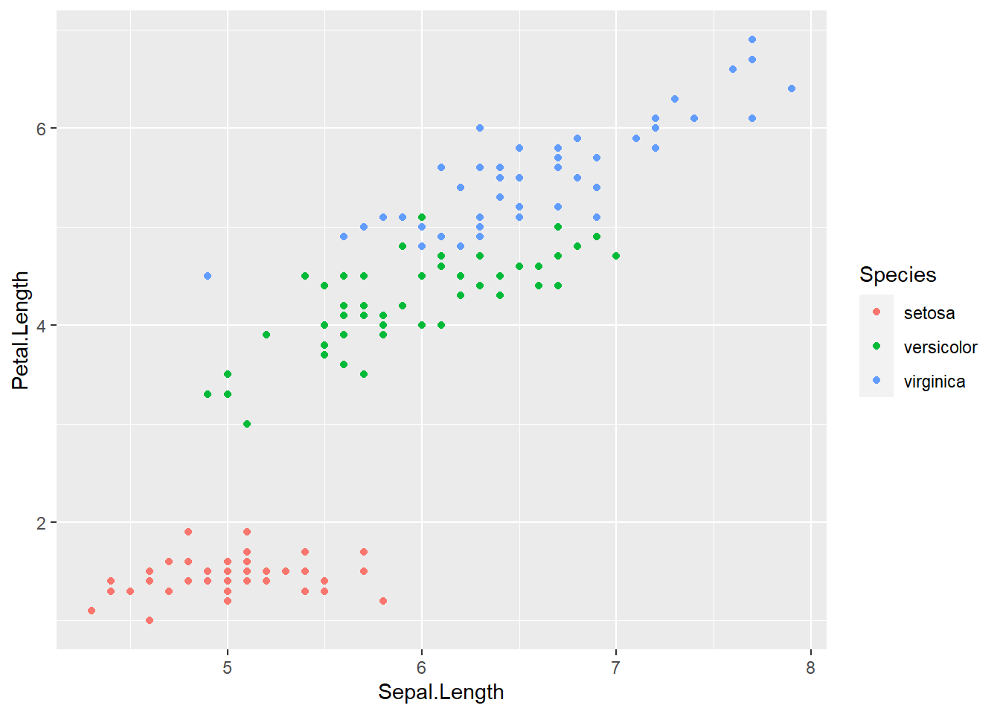

3.  Generate a histogram of tree heights for each plot. Color your
    stacked bar as a function of each species:


```r
#hints for faceting: 
ggplot(iris, aes(x=Sepal.Length, y=Petal.Length)) +
  geom_point() +
  facet_grid( . ~ Species )
```


4.  Use `dplyr` to remove dead trees:


```r
library(dplyr)
```

```
## 
## Attaching package: 'dplyr'
```

```
## The following objects are masked from 'package:stats':
## 
##     filter, lag
```

```
## The following objects are masked from 'package:base':
## 
##     intersect, setdiff, setequal, union
```

```r
#hints:
#veg=veg%>%
#filter(..... !=....)
```

5.  Create a simple linear model that uses Diameter at Breast Height
    (DBH) and height to predict allometries. Print the summary
    information of your model:


```r
#hints
mdl=lm(Some_diameter + Some_height, data=something) #Question: looking at the metadata which 'height' and 'diameter' variables should you use?
print(mdl)
```

6.  Plot your linear model:


```r
# hints:
mdl <- lm( Petal.Length ~ Sepal.Length * Species, data = iris ) 
iris <- iris %>%
  select( -matches('fit'), -matches('lwr'), -matches('upr') ) %>%
  cbind( predict(mdl, newdata=., interval='confidence') )       

head(iris, n=3)
```

```
##   Sepal.Length Sepal.Width Petal.Length Petal.Width Species      fit      lwr
## 1          5.1         3.5          1.4         0.2  setosa 1.474373 1.398783
## 2          4.9         3.0          1.4         0.2  setosa 1.448047 1.371765
## 3          4.7         3.2          1.3         0.2  setosa 1.421721 1.324643
##        upr
## 1 1.549964
## 2 1.524329
## 3 1.518798
```

```r
ggplot(iris, aes(x=Sepal.Length, y=Petal.Length, color=Species)) +
  geom_point() +
  geom_line( aes(y=fit) ) +
  geom_ribbon( aes( ymin=lwr, ymax=upr, fill=Species), alpha=.3 )   # alpha is the ribbon transparency
```

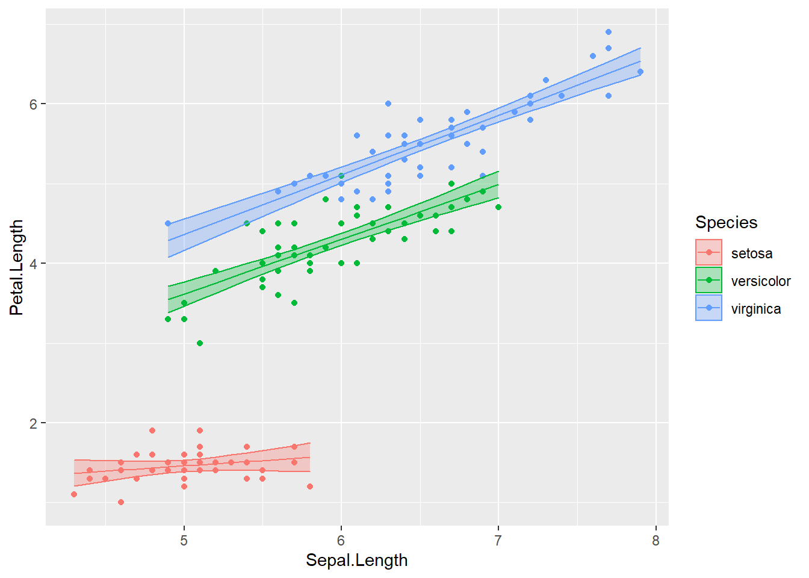

7.  Answer the following questions:

-   What do you think about your simile linear model? What are its
    limitations?
-   How many `unique` species are present at `WREF`?
-   What are the `top_5` trees based on height? Diameter?
-   What proportion of sampled trees are dead?

## Hands on: Pulling NEON Data via the API

This section covers pulling data from the NEON API or Application
Programming Interface using R and the R package httr, but the core
information about the API is applicable to other languages and
approaches.

**As a reminder, there are 3 basic categories of NEON data:**

1.  Observational - Data collected by a human in the field, or in an
    analytical laboratory, e.g. beetle identification, foliar isotopes
2.  Instrumentation - Data collected by an automated, streaming sensor,
    e.g. net radiation, soil carbon dioxide
3.  Remote sensing - Data collected by the airborne observation
    platform, e.g. LIDAR, surface reflectance

This lab covers all three types of data, it is required to complete
these sections in order and not skip ahead, since the query principles
are explained in the first section, on observational data.

::: {markdown="1"}
### Objectives

After completing this activity, you will be able to:

-   Pull observational, instrumentation, and geolocation data from the
    NEON API.
-   Transform API-accessed data from JSON to tabular format for
    analyses.

### Things You'll Need To Complete This Section

To complete this tutorial you will need the most current version of R
and, preferably, RStudio loaded on your computer.

#### Install R Packages

-   **httr:** `install.packages("httr")`
-   **jsonlite:** `install.packages("jsonlite")`
-   **dplyr:** `install.packages("dplyr")`
-   **devtools:** `install.packages("devtools")`
-   **downloader:** `install.packages("downloader")`
-   **geoNEON:**
    `devtools::install_github("NEONScience/NEON-geolocation/geoNEON")`
-   **neonUtilities:**
    `devtools::install_github("NEONScience/NEON-utilities/neonUtilities")`

Note, you must have devtools installed & loaded, prior to loading
geoNEON or neonUtilities.

#### Additional Resources

-   <a href="http://data.neonscience.org/data-api" target="_blank">Webpage
    for the NEON API</a>
-   <a href="https://github.com/NEONScience/neon-data-api" target="_blank">GitHub
    repository for the NEON API</a>
-   <a href="https://github.com/ropenscilabs/nneo" target="_blank">
    ROpenSci wrapper for the NEON API</a> (not covered in this tutorial)
:::

## What is an API?

<iframe width="560" height="315" src="https://www.youtube.com/embed/s7wmiS2mSXY" frameborder="0" allow="accelerometer; autoplay; encrypted-media; gyroscope; picture-in-picture" allowfullscreen>

</iframe>

> The following material was adapted from: "Using the NEON API in R"
> description: "Tutorial for getting data from the NEON API, using R and
> the R package httr" dateCreated: 2017-07-07 authors: [Claire K. Lunch]
> contributors: [Christine Laney, Megan A. Jones]

If you are unfamiliar with the concept of an API, think of an API as a
'middle person' that provides a communication path for a software
application to obtain information from a digital data source. APIs are
becoming a very common means of sharing digital information. Many of the
apps that you use on your computer or mobile device to produce maps,
charts, reports, and other useful forms of information pull data from
multiple sources using APIs. In the ecological and environmental
sciences, many researchers use APIs to programmatically pull data into
their analyses. (Quoted from the NEON Observatory Blog story:
<a href="https://www.neonscience.org/observatory/observatory-blog/api-data-availability-viewer-now-live-neon-data-portal" target ="_blank">
API and data availability viewer now live on the NEON data portal</a>.)

There are actually many types or constructions of APIs. If you're
interested you can [read a little more about them
here](https://stoplight.io/api-types/)

### Anatomy of an API call

An example API call:
<http://data.neonscience.org/api/v0/data/DP1.10003.001/WOOD/2015-07>

This includes the base URL, endpoint, and target.

#### Base URL:

[<http://data.neonscience.org/api/v0>]{style="color:#A00606;font-weight:bold"}[/data/DP1.10003.001/WOOD/2015-07]{style="color:#A2A4A3"}

Specifics are appended to this in order to get the data or metadata
you're looking for, but all calls to this API will include the base URL.
For the NEON API, this is <http://data.neonscience.org/api/v0> -- not
clickable, because the base URL by itself will take you nowhere!

#### Endpoints:

[<http://data.neonscience.org/api/v0>]{style="color:#A2A4A3"}[/data]{style="color:#A00606;font-weight:bold"}[/DP1.10003.001/WOOD/2015-07]{style="color:#A2A4A3"}

What type of data or metadata are you looking for?

-   **\~/products** Information about one or all of NEON's data products

-   **\~/sites** Information about data availability at the site
    specified in the call

-   **\~/locations** Spatial data for the NEON locations specified in
    the call

-   **\~/data** Data! By product, site, and date (in monthly chunks).

### Targets:

[<http://data.neonscience.org/api/v0/data>]{style="color:#A2A4A3"}[/DP1.10003.001/WOOD/2015-07]{style="color:#A00606;font-weight:bold"}

The specific data product, site, or location you want to get data for.

### Observational data (OS)

Which product do you want to get data for? Consult the
<a href="http://data.neonscience.org/data-products/explore" target="_blank">Explore
Data Products page</a>.

We'll pick Breeding landbird point counts, DP1.10003.001

First query the products endpoint of the API to find out which sites and
dates have data available. In the products endpoint, the target is the
numbered identifier for the data product:


```r
# Load the necessary libraries
library(httr)
library(jsonlite)
library(dplyr, quietly=T)
library(downloader)

# Request data using the GET function & the API call
req <- GET("http://data.neonscience.org/api/v0/products/DP1.10003.001")
req
```

```
## Response [https://data.neonscience.org/api/v0/products/DP1.10003.001]
##   Date: 2022-10-12 19:03
##   Status: 200
##   Content-Type: application/json;charset=UTF-8
##   Size: 47.6 kB
```

The object returned from `GET()` has many layers of information.
Entering the name of the object gives you some basic information about
what you downloaded.

The `content()` function returns the contents in the form of a highly
nested list. This is typical of JSON-formatted data returned by APIs. We
can use the `names()` function to view the different types of
information within this list.


```r
# View requested data
req.content <- content(req, as="parsed")
names(req.content$data)
```

```
##  [1] "productCodeLong"              "productCode"                 
##  [3] "productCodePresentation"      "productName"                 
##  [5] "productDescription"           "productStatus"               
##  [7] "productCategory"              "productHasExpanded"          
##  [9] "productScienceTeamAbbr"       "productScienceTeam"          
## [11] "productPublicationFormatType" "productAbstract"             
## [13] "productDesignDescription"     "productStudyDescription"     
## [15] "productBasicDescription"      "productExpandedDescription"  
## [17] "productSensor"                "productRemarks"              
## [19] "themes"                       "changeLogs"                  
## [21] "specs"                        "keywords"                    
## [23] "releases"                     "siteCodes"
```

You can see all of the information by running the line
`print(req.content)`, but this will result in a very long printout in
your console. Instead, you can view list items individually. Here, we
highlight a couple of interesting examples:


```r
# View Abstract
req.content$data$productAbstract
```

```
## [1] "This data product contains the quality-controlled, native sampling resolution data from NEON's breeding landbird sampling. Breeding landbirds are defined as “smaller birds (usually exclusive of raptors and upland game birds) not usually associated with aquatic habitats” (Ralph et al. 1993). The breeding landbird point counts product provides records of species identification of all individuals observed during the 6-minute count period, as well as metadata which can be used to model detectability, e.g., weather, distances from observers to birds, and detection methods. The NEON point count method is adapted from the Integrated Monitoring in Bird Conservation Regions (IMBCR): Field protocol for spatially-balanced sampling of landbird populations (Hanni et al. 2017; http://bit.ly/2u2ChUB). For additional details, see protocol [NEON.DOC.014041](http://data.neonscience.org/api/v0/documents/NEON.DOC.014041vF): TOS Protocol and Procedure: Breeding Landbird Abundance and Diversity and science design [NEON.DOC.000916](http://data.neonscience.org/api/v0/documents/NEON.DOC.000916vB): TOS Science Design for Breeding Landbird Abundance and Diversity.\n\nLatency: The expected time from data and/or sample collection in the field to data publication is as follows, for each of the data tables (in days) in the downloaded data package. See the Data Product User Guide for more information.\n \nbrd_countdata: 120\n\nbrd_perpoint: 120\n\nbrd_personnel: 120\n\nbrd_references: 120"
```

```r
# View Available months and associated URLs for Onaqui, Utah - ONAQ
req.content$data$siteCodes[[27]]
```

```
## $siteCode
## [1] "ONAQ"
## 
## $availableMonths
## $availableMonths[[1]]
## [1] "2017-05"
## 
## $availableMonths[[2]]
## [1] "2018-05"
## 
## $availableMonths[[3]]
## [1] "2018-06"
## 
## $availableMonths[[4]]
## [1] "2019-05"
## 
## $availableMonths[[5]]
## [1] "2020-05"
## 
## $availableMonths[[6]]
## [1] "2021-06"
## 
## 
## $availableDataUrls
## $availableDataUrls[[1]]
## [1] "https://data.neonscience.org/api/v0/data/DP1.10003.001/ONAQ/2017-05"
## 
## $availableDataUrls[[2]]
## [1] "https://data.neonscience.org/api/v0/data/DP1.10003.001/ONAQ/2018-05"
## 
## $availableDataUrls[[3]]
## [1] "https://data.neonscience.org/api/v0/data/DP1.10003.001/ONAQ/2018-06"
## 
## $availableDataUrls[[4]]
## [1] "https://data.neonscience.org/api/v0/data/DP1.10003.001/ONAQ/2019-05"
## 
## $availableDataUrls[[5]]
## [1] "https://data.neonscience.org/api/v0/data/DP1.10003.001/ONAQ/2020-05"
## 
## $availableDataUrls[[6]]
## [1] "https://data.neonscience.org/api/v0/data/DP1.10003.001/ONAQ/2021-06"
## 
## 
## $availableReleases
## $availableReleases[[1]]
## $availableReleases[[1]]$release
## [1] "PROVISIONAL"
## 
## $availableReleases[[1]]$availableMonths
## $availableReleases[[1]]$availableMonths[[1]]
## [1] "2021-06"
## 
## 
## 
## $availableReleases[[2]]
## $availableReleases[[2]]$release
## [1] "RELEASE-2022"
## 
## $availableReleases[[2]]$availableMonths
## $availableReleases[[2]]$availableMonths[[1]]
## [1] "2017-05"
## 
## $availableReleases[[2]]$availableMonths[[2]]
## [1] "2018-05"
## 
## $availableReleases[[2]]$availableMonths[[3]]
## [1] "2018-06"
## 
## $availableReleases[[2]]$availableMonths[[4]]
## [1] "2019-05"
## 
## $availableReleases[[2]]$availableMonths[[5]]
## [1] "2020-05"
```

To get a more accessible view of which sites have data for which months,
you'll need to extract data from the nested list. There are a variety of
ways to do this, in this tutorial we'll explore a couple of them. Here
we'll use `fromJSON()`, in the jsonlite package, which doesn't fully
flatten the nested list, but gets us the part we need. To use it, we
need a text version of the content. The text version is not as human
readable but is readable by the `fromJSON()` function.


```r
# make this JSON readable -> "text"
req.text <- content(req, as="text")

# Flatten data frame to see available data. 
avail <- jsonlite::fromJSON(req.text, simplifyDataFrame=T, flatten=T)
avail
```

```
## $data
## $data$productCodeLong
## [1] "NEON.DOM.SITE.DP1.10003.001"
## 
## $data$productCode
## [1] "DP1.10003.001"
## 
## $data$productCodePresentation
## [1] "NEON.DP1.10003"
## 
## $data$productName
## [1] "Breeding landbird point counts"
## 
## $data$productDescription
## [1] "Count, distance from observer, and taxonomic identification of breeding landbirds observed during point counts"
## 
## $data$productStatus
## [1] "ACTIVE"
## 
## $data$productCategory
## [1] "Level 1 Data Product"
## 
## $data$productHasExpanded
## [1] TRUE
## 
## $data$productScienceTeamAbbr
## [1] "TOS"
## 
## $data$productScienceTeam
## [1] "Terrestrial Observation System (TOS)"
## 
## $data$productPublicationFormatType
## [1] "TOS Data Product Type"
## 
## $data$productAbstract
## [1] "This data product contains the quality-controlled, native sampling resolution data from NEON's breeding landbird sampling. Breeding landbirds are defined as “smaller birds (usually exclusive of raptors and upland game birds) not usually associated with aquatic habitats” (Ralph et al. 1993). The breeding landbird point counts product provides records of species identification of all individuals observed during the 6-minute count period, as well as metadata which can be used to model detectability, e.g., weather, distances from observers to birds, and detection methods. The NEON point count method is adapted from the Integrated Monitoring in Bird Conservation Regions (IMBCR): Field protocol for spatially-balanced sampling of landbird populations (Hanni et al. 2017; http://bit.ly/2u2ChUB). For additional details, see protocol [NEON.DOC.014041](http://data.neonscience.org/api/v0/documents/NEON.DOC.014041vF): TOS Protocol and Procedure: Breeding Landbird Abundance and Diversity and science design [NEON.DOC.000916](http://data.neonscience.org/api/v0/documents/NEON.DOC.000916vB): TOS Science Design for Breeding Landbird Abundance and Diversity.\n\nLatency: The expected time from data and/or sample collection in the field to data publication is as follows, for each of the data tables (in days) in the downloaded data package. See the Data Product User Guide for more information.\n \nbrd_countdata: 120\n\nbrd_perpoint: 120\n\nbrd_personnel: 120\n\nbrd_references: 120"
## 
## $data$productDesignDescription
## [1] "Depending on the size of the site, sampling for this product occurs at either randomly distributed individual points or grids of nine points each. At larger sites, point count sampling occurs at five to ten 9-point grids, with grid centers collocated with distributed base plot centers (where plant, beetle, and/or soil sampling may also occur), if possible. At smaller sites (i.e., sites that cannot accommodate a minimum of 5 grids) point counts occur at the southwest corner (point 21) of 5-25 distributed base plots. Point counts are conducted once per breeding season at large sites and twice per breeding season at smaller sites. Point counts are six minutes long, with each minute tracked by the observer, following a two-minute settling-in period. All birds are recorded to species and sex, whenever possible, and the distance to each individual or flock is measured with a laser rangefinder, except in the case of flyovers."
## 
## $data$productStudyDescription
## [1] "This sampling occurs at all NEON terrestrial sites."
## 
## $data$productBasicDescription
## [1] "The basic package contains the per point metadata table that includes data pertaining to the observer and the weather conditions and the count data table that includes all of the observational data."
## 
## $data$productExpandedDescription
## [1] "The expanded package includes two additional tables and two additional fields within the count data table. The personnel table provides institutional information about each observer, as well as their performance on identification quizzes, where available. The references tables provides the list of resources used by an observer to identify birds. The additional fields in the countdata table are family and nativeStatusCode, which are derived from the NEON master list of birds."
## 
## $data$productSensor
## [1] ""
## 
## $data$productRemarks
## [1] "Queries for this data product will return data collected during the date range specified for `brd_perpoint` and `brd_countdata`, but will return data from all dates for `brd_personnel` (quiz scores may occur over time periods which are distinct from when sampling occurs) and `brd_references` (which apply to a broad range of sampling dates). A record from `brd_perPoint` should have 6+ child records in `brd_countdata`, at least one per pointCountMinute. Duplicates or missing data may exist where protocol and/or data entry aberrations have occurred; users should check data carefully for anomalies before joining tables. Taxonomic IDs of species of concern have been 'fuzzed'; see data package readme files for more information."
## 
## $data$themes
## [1] "Organisms, Populations, and Communities"
## 
## $data$changeLogs
##      id parentIssueID            issueDate         resolvedDate
## 1 16607            NA 2020-10-28T00:00:00Z 2020-01-01T00:00:00Z
## 2 17938            NA 2021-01-06T00:00:00Z 2021-12-31T00:00:00Z
## 3 25404            NA 2021-06-24T00:00:00Z 2018-03-28T00:00:00Z
## 4 37004            NA 2021-12-03T00:00:00Z 2021-12-31T00:00:00Z
## 5 38204            NA 2021-12-09T00:00:00Z 2021-12-31T00:00:00Z
## 6 67504            NA 2022-09-13T00:00:00Z                 <NA>
## 7 67505            NA 2022-09-13T00:00:00Z                 <NA>
##         dateRangeStart         dateRangeEnd locationAffected
## 1 2013-01-01T00:00:00Z 2020-01-01T00:00:00Z              All
## 2 2020-03-23T00:00:00Z 2021-12-31T00:00:00Z              All
## 3 2012-01-01T00:00:00Z 2018-03-28T00:00:00Z              All
## 4 2015-01-01T00:00:00Z 2021-12-31T00:00:00Z              All
## 5 2012-01-01T00:00:00Z 2021-12-31T00:00:00Z              All
## 6 2020-03-23T00:00:00Z 2022-12-31T00:00:00Z             TOOL
## 7 2022-06-12T00:00:00Z 2022-12-31T00:00:00Z             YELL
##                                                                                                                                                                                                                                                                                                                                                                                                                                                                                                                              issue
## 1                                                                                                                                                                                                                                                                                                                                                                                                                                                   There was not a way to indicate that a scheduled sampling event did not occur.
## 2                                                                                                                                                                                                                                                                                                                     Safety measures to protect personnel during the COVID-19 pandemic resulted in reduced or canceled sampling activities for extended periods at NEON sites. Data availability may be reduced during this time.
## 3                                                                                                                                                                                                                                                                                                                                                                                                                                                                     It was too expensive to have a maximum of 15 grids per site.
## 4                                                                                                                                                                                                                                                                                                                                                                                                                                                      EventIDs in `brd_perpoint` and `brd_countdata` records didn't always match.
## 5                                                                                                                                                                                Prior to the 2022 data release, publication of species identifications were obfuscated to a higher taxonomic rank when the taxon was found to be listed as threatened, endangered, or sensitive at the state level where the observation was recorded. Obfuscating state-listed taxa has created challenges for data users studying biodiversity.
## 6 Toolik Field Station required a quarantine period prior to starting work in the 2020, 2021, and 2022 field seasons to protect all personnel during the COVID-19 pandemic. This complicated NEON field scheduling logistics, which typically involves repeated travel across the state on short time frames. Consequently, NEON reduced staffing traveling to Toolik and was thus unable to complete all planned sampling efforts. Missed data collection events are indicated in data records via the samplingImpractical field.
## 7                                                                                                                                                                                                                      Severe flooding destroyed several roads into Yellowstone National Park in June 2022, making the YELL and BLDE sites inaccessible to NEON staff. Observational data collection was halted during this time. Canceled data collection events are indicated in data records via the samplingImpractical field.
##                                                                                                                                                                                                                                                                                                                                                                                                                  resolution
## 1                                                                                The fields samplingImpracticalRemarks and samplingImpractical were added prior to the 2020 field season. The contractor supplies the samplingImpracticalRemarks field, and this field autopopulates the samplingImpractical field. The samplingImpractical field has a value other than OK if something prevented sampling from occurring.
## 2 The primary impact of the pandemic on observational data was reduced data collection. Training procedures and data quality reviews were maintained throughout the pandemic, although some previously in-person training was conducted virtually.  Scheduled measurements and sampling that were not carried out due to COVID-19 or any other causes are indicated in data records via the samplingImpractical data field.
## 3                                                                                                                                                                                                                                                                                                                           In version J of the bird protocol NEON reduced the maximum number grids per site from 15 to 10.
## 4                                                                                                                                                                                                                                                                                         The inconsistent time zone issue within the date component of the eventID was resolved by stripping time of day from the eventID.
## 5                                        The state-level obfuscation routine was removed from the data publication process at all locations excluding sites located in D01 and D20. Data have been reprocessed to remove the obfuscation of state-listed taxa. Federally listed threatened and endangered or sensitive species remain obfuscated at all sites and sensitive species remain redacted at National Park sites.
## 6                                                                                                                                                                                                                                                                                                                                                                                                                          
## 7                                                                                                                                                                                                                                                                                                                                                                                                                          
## 
## $data$specs
##    specId               specNumber        specType specSize
## 1    5844        NEON.DOC.014041vK application/pdf  3778463
## 2    7294        NEON.DOC.000916vD application/pdf  1654075
## 3    7352   NEON_bird_userGuide_vC application/pdf   297054
## 4 QSG:165 NEON.QSG.DP1.10003.001v1 application/pdf   241528
##                                                               specDescription
## 1 TOS Protocol and Procedure: BRD – Breeding Landbird Abundance and Diversity
## 2            TOS Science Design for Breeding Landbird Abundance and Diversity
## 3           NEON User Guide to Breeding Landbird Point Counts (DP1.10003.001)
## 4        Quick Start Guide for Breeding landbird point counts (DP1.10003.001)
##                                                                                     specUrl
## 1                           https://data.neonscience.org/api/v0/documents/NEON.DOC.014041vK
## 2                           https://data.neonscience.org/api/v0/documents/NEON.DOC.000916vD
## 3                      https://data.neonscience.org/api/v0/documents/NEON_bird_userGuide_vC
## 4 https://data.neonscience.org/api/v0/documents/quick-start-guides/NEON.QSG.DP1.10003.001v1
## 
## $data$keywords
##  [1] "vertebrates"           "diversity"             "species composition"  
##  [4] "point counts"          "landbirds"             "invasive"             
##  [7] "distance sampling"     "Aves"                  "animals"              
## [10] "birds"                 "avian"                 "Chordata"             
## [13] "Animalia"              "taxonomy"              "population"           
## [16] "introduced"            "community composition" "native"               
## 
## $data$releases
##        release       generationDate
## 1 RELEASE-2021 2021-01-23T02:30:02Z
## 2 RELEASE-2022 2022-01-20T17:39:46Z
##                                                         url
## 1 https://data.neonscience.org/api/v0/releases/RELEASE-2021
## 2 https://data.neonscience.org/api/v0/releases/RELEASE-2022
##   productDoi.generationDate                     productDoi.url
## 1      2021-01-25T18:14:30Z https://doi.org/10.48443/s730-dy13
## 2      2022-01-21T02:53:07Z https://doi.org/10.48443/88sy-ah40
## 
## $data$siteCodes
##    siteCode
## 1      ABBY
## 2      BARR
## 3      BART
## 4      BLAN
## 5      BONA
## 6      CLBJ
## 7      CPER
## 8      DCFS
## 9      DEJU
## 10     DELA
## 11     DSNY
## 12     GRSM
## 13     GUAN
## 14     HARV
## 15     HEAL
## 16     JERC
## 17     JORN
## 18     KONA
## 19     KONZ
## 20     LAJA
## 21     LENO
## 22     MLBS
## 23     MOAB
## 24     NIWO
## 25     NOGP
## 26     OAES
## 27     ONAQ
## 28     ORNL
## 29     OSBS
## 30     PUUM
## 31     RMNP
## 32     SCBI
## 33     SERC
## 34     SJER
## 35     SOAP
## 36     SRER
## 37     STEI
## 38     STER
## 39     TALL
## 40     TEAK
## 41     TOOL
## 42     TREE
## 43     UKFS
## 44     UNDE
## 45     WOOD
## 46     WREF
## 47     YELL
##                                                                                               availableMonths
## 1                                               2017-05, 2017-06, 2018-06, 2018-07, 2019-05, 2020-06, 2021-05
## 2                                                                 2017-07, 2018-07, 2019-06, 2020-07, 2021-06
## 3                                      2015-06, 2016-06, 2017-06, 2018-06, 2019-06, 2020-06, 2020-07, 2021-06
## 4                                      2017-05, 2017-06, 2018-05, 2018-06, 2019-05, 2019-06, 2020-06, 2021-05
## 5                                               2017-06, 2018-06, 2018-07, 2019-06, 2020-06, 2020-07, 2021-06
## 6                                      2017-05, 2018-04, 2019-04, 2019-05, 2020-04, 2020-05, 2021-04, 2021-05
## 7                    2013-06, 2015-05, 2016-05, 2017-05, 2017-06, 2018-05, 2019-06, 2020-05, 2021-05, 2021-06
## 8                                               2017-06, 2017-07, 2018-07, 2019-06, 2019-07, 2020-07, 2021-07
## 9                                                                 2017-06, 2018-06, 2019-06, 2020-06, 2021-06
## 10                                                       2015-06, 2017-06, 2018-05, 2019-06, 2020-05, 2021-05
## 11                                              2015-06, 2016-05, 2017-05, 2018-05, 2019-05, 2020-05, 2021-05
## 12                                              2016-06, 2017-05, 2017-06, 2018-05, 2019-05, 2020-06, 2021-06
## 13                                              2015-05, 2017-05, 2018-05, 2019-05, 2019-06, 2020-07, 2021-06
## 14                                     2015-05, 2015-06, 2016-06, 2017-06, 2018-06, 2019-06, 2020-06, 2021-06
## 15                                              2017-06, 2018-06, 2018-07, 2019-06, 2019-07, 2020-06, 2021-06
## 16                                                       2016-06, 2017-05, 2018-06, 2019-06, 2020-05, 2021-05
## 17                                     2017-04, 2017-05, 2018-04, 2018-05, 2019-04, 2020-05, 2021-04, 2021-05
## 18                                                       2018-05, 2018-06, 2019-06, 2020-05, 2020-06, 2021-06
## 19                                                       2017-06, 2018-05, 2018-06, 2019-06, 2020-05, 2021-06
## 20                                                       2017-05, 2018-05, 2019-05, 2019-06, 2020-07, 2021-06
## 21                                                                2017-06, 2018-05, 2019-06, 2020-05, 2021-05
## 22                                                                2018-06, 2019-05, 2020-05, 2021-05, 2021-06
## 23                                              2015-06, 2017-05, 2018-05, 2019-05, 2020-05, 2020-06, 2021-06
## 24                                                       2015-07, 2017-07, 2018-07, 2019-07, 2020-07, 2021-07
## 25                                                                2017-07, 2018-07, 2019-07, 2020-07, 2021-07
## 26                                              2017-05, 2017-06, 2018-04, 2018-05, 2019-05, 2020-05, 2021-05
## 27                                                       2017-05, 2018-05, 2018-06, 2019-05, 2020-05, 2021-06
## 28                                     2016-05, 2016-06, 2017-05, 2018-06, 2019-05, 2020-05, 2021-05, 2021-06
## 29                                                       2016-05, 2017-05, 2018-05, 2019-05, 2020-06, 2021-05
## 30                                                                                           2018-04, 2021-03
## 31                   2017-06, 2017-07, 2018-06, 2018-07, 2019-06, 2019-07, 2020-06, 2020-07, 2021-06, 2021-07
## 32 2015-06, 2016-05, 2016-06, 2017-05, 2017-06, 2018-05, 2018-06, 2019-05, 2019-06, 2020-05, 2020-06, 2021-05
## 33                                              2017-05, 2017-06, 2018-05, 2019-05, 2020-05, 2020-06, 2021-06
## 34                                                                2017-04, 2018-04, 2019-04, 2020-04, 2021-04
## 35                                                                2017-05, 2018-05, 2019-05, 2020-05, 2021-05
## 36                                                       2017-05, 2018-04, 2018-05, 2019-04, 2020-04, 2021-04
## 37                   2016-05, 2016-06, 2017-06, 2018-05, 2018-06, 2019-05, 2019-06, 2020-06, 2021-05, 2021-06
## 38                            2013-06, 2015-05, 2016-05, 2017-05, 2018-05, 2019-05, 2019-06, 2020-06, 2021-05
## 39                                     2015-06, 2016-07, 2017-06, 2018-06, 2019-05, 2020-05, 2020-06, 2021-05
## 40                                                       2017-06, 2018-06, 2019-06, 2019-07, 2020-06, 2021-06
## 41                                                                2017-06, 2018-07, 2019-06, 2020-06, 2021-06
## 42                                                       2016-06, 2017-06, 2018-06, 2019-06, 2020-06, 2021-06
## 43                                                       2017-06, 2018-06, 2019-06, 2020-05, 2020-06, 2021-06
## 44                                              2016-06, 2016-07, 2017-06, 2018-06, 2019-06, 2020-06, 2021-06
## 45                                              2015-07, 2017-07, 2018-07, 2019-06, 2019-07, 2020-07, 2021-07
## 46                                                                2018-06, 2019-05, 2019-06, 2020-06, 2021-05
## 47                                                                         2018-06, 2019-06, 2020-06, 2021-07
##                                                                                                                                                                                                                                                                                                                                                                                                                                                                                                                                                                                                                                                                                                                                                                                                                                             availableDataUrls
## 1                                                                                                                                                                                                                                                                                                                                                           https://data.neonscience.org/api/v0/data/DP1.10003.001/ABBY/2017-05, https://data.neonscience.org/api/v0/data/DP1.10003.001/ABBY/2017-06, https://data.neonscience.org/api/v0/data/DP1.10003.001/ABBY/2018-06, https://data.neonscience.org/api/v0/data/DP1.10003.001/ABBY/2018-07, https://data.neonscience.org/api/v0/data/DP1.10003.001/ABBY/2019-05, https://data.neonscience.org/api/v0/data/DP1.10003.001/ABBY/2020-06, https://data.neonscience.org/api/v0/data/DP1.10003.001/ABBY/2021-05
## 2                                                                                                                                                                                                                                                                                                                                                                                                                                                                                                     https://data.neonscience.org/api/v0/data/DP1.10003.001/BARR/2017-07, https://data.neonscience.org/api/v0/data/DP1.10003.001/BARR/2018-07, https://data.neonscience.org/api/v0/data/DP1.10003.001/BARR/2019-06, https://data.neonscience.org/api/v0/data/DP1.10003.001/BARR/2020-07, https://data.neonscience.org/api/v0/data/DP1.10003.001/BARR/2021-06
## 3                                                                                                                                                                                                                                                                                      https://data.neonscience.org/api/v0/data/DP1.10003.001/BART/2015-06, https://data.neonscience.org/api/v0/data/DP1.10003.001/BART/2016-06, https://data.neonscience.org/api/v0/data/DP1.10003.001/BART/2017-06, https://data.neonscience.org/api/v0/data/DP1.10003.001/BART/2018-06, https://data.neonscience.org/api/v0/data/DP1.10003.001/BART/2019-06, https://data.neonscience.org/api/v0/data/DP1.10003.001/BART/2020-06, https://data.neonscience.org/api/v0/data/DP1.10003.001/BART/2020-07, https://data.neonscience.org/api/v0/data/DP1.10003.001/BART/2021-06
## 4                                                                                                                                                                                                                                                                                      https://data.neonscience.org/api/v0/data/DP1.10003.001/BLAN/2017-05, https://data.neonscience.org/api/v0/data/DP1.10003.001/BLAN/2017-06, https://data.neonscience.org/api/v0/data/DP1.10003.001/BLAN/2018-05, https://data.neonscience.org/api/v0/data/DP1.10003.001/BLAN/2018-06, https://data.neonscience.org/api/v0/data/DP1.10003.001/BLAN/2019-05, https://data.neonscience.org/api/v0/data/DP1.10003.001/BLAN/2019-06, https://data.neonscience.org/api/v0/data/DP1.10003.001/BLAN/2020-06, https://data.neonscience.org/api/v0/data/DP1.10003.001/BLAN/2021-05
## 5                                                                                                                                                                                                                                                                                                                                                           https://data.neonscience.org/api/v0/data/DP1.10003.001/BONA/2017-06, https://data.neonscience.org/api/v0/data/DP1.10003.001/BONA/2018-06, https://data.neonscience.org/api/v0/data/DP1.10003.001/BONA/2018-07, https://data.neonscience.org/api/v0/data/DP1.10003.001/BONA/2019-06, https://data.neonscience.org/api/v0/data/DP1.10003.001/BONA/2020-06, https://data.neonscience.org/api/v0/data/DP1.10003.001/BONA/2020-07, https://data.neonscience.org/api/v0/data/DP1.10003.001/BONA/2021-06
## 6                                                                                                                                                                                                                                                                                      https://data.neonscience.org/api/v0/data/DP1.10003.001/CLBJ/2017-05, https://data.neonscience.org/api/v0/data/DP1.10003.001/CLBJ/2018-04, https://data.neonscience.org/api/v0/data/DP1.10003.001/CLBJ/2019-04, https://data.neonscience.org/api/v0/data/DP1.10003.001/CLBJ/2019-05, https://data.neonscience.org/api/v0/data/DP1.10003.001/CLBJ/2020-04, https://data.neonscience.org/api/v0/data/DP1.10003.001/CLBJ/2020-05, https://data.neonscience.org/api/v0/data/DP1.10003.001/CLBJ/2021-04, https://data.neonscience.org/api/v0/data/DP1.10003.001/CLBJ/2021-05
## 7                                                                                                                                            https://data.neonscience.org/api/v0/data/DP1.10003.001/CPER/2013-06, https://data.neonscience.org/api/v0/data/DP1.10003.001/CPER/2015-05, https://data.neonscience.org/api/v0/data/DP1.10003.001/CPER/2016-05, https://data.neonscience.org/api/v0/data/DP1.10003.001/CPER/2017-05, https://data.neonscience.org/api/v0/data/DP1.10003.001/CPER/2017-06, https://data.neonscience.org/api/v0/data/DP1.10003.001/CPER/2018-05, https://data.neonscience.org/api/v0/data/DP1.10003.001/CPER/2019-06, https://data.neonscience.org/api/v0/data/DP1.10003.001/CPER/2020-05, https://data.neonscience.org/api/v0/data/DP1.10003.001/CPER/2021-05, https://data.neonscience.org/api/v0/data/DP1.10003.001/CPER/2021-06
## 8                                                                                                                                                                                                                                                                                                                                                           https://data.neonscience.org/api/v0/data/DP1.10003.001/DCFS/2017-06, https://data.neonscience.org/api/v0/data/DP1.10003.001/DCFS/2017-07, https://data.neonscience.org/api/v0/data/DP1.10003.001/DCFS/2018-07, https://data.neonscience.org/api/v0/data/DP1.10003.001/DCFS/2019-06, https://data.neonscience.org/api/v0/data/DP1.10003.001/DCFS/2019-07, https://data.neonscience.org/api/v0/data/DP1.10003.001/DCFS/2020-07, https://data.neonscience.org/api/v0/data/DP1.10003.001/DCFS/2021-07
## 9                                                                                                                                                                                                                                                                                                                                                                                                                                                                                                     https://data.neonscience.org/api/v0/data/DP1.10003.001/DEJU/2017-06, https://data.neonscience.org/api/v0/data/DP1.10003.001/DEJU/2018-06, https://data.neonscience.org/api/v0/data/DP1.10003.001/DEJU/2019-06, https://data.neonscience.org/api/v0/data/DP1.10003.001/DEJU/2020-06, https://data.neonscience.org/api/v0/data/DP1.10003.001/DEJU/2021-06
## 10                                                                                                                                                                                                                                                                                                                                                                                                                               https://data.neonscience.org/api/v0/data/DP1.10003.001/DELA/2015-06, https://data.neonscience.org/api/v0/data/DP1.10003.001/DELA/2017-06, https://data.neonscience.org/api/v0/data/DP1.10003.001/DELA/2018-05, https://data.neonscience.org/api/v0/data/DP1.10003.001/DELA/2019-06, https://data.neonscience.org/api/v0/data/DP1.10003.001/DELA/2020-05, https://data.neonscience.org/api/v0/data/DP1.10003.001/DELA/2021-05
## 11                                                                                                                                                                                                                                                                                                                                                          https://data.neonscience.org/api/v0/data/DP1.10003.001/DSNY/2015-06, https://data.neonscience.org/api/v0/data/DP1.10003.001/DSNY/2016-05, https://data.neonscience.org/api/v0/data/DP1.10003.001/DSNY/2017-05, https://data.neonscience.org/api/v0/data/DP1.10003.001/DSNY/2018-05, https://data.neonscience.org/api/v0/data/DP1.10003.001/DSNY/2019-05, https://data.neonscience.org/api/v0/data/DP1.10003.001/DSNY/2020-05, https://data.neonscience.org/api/v0/data/DP1.10003.001/DSNY/2021-05
## 12                                                                                                                                                                                                                                                                                                                                                          https://data.neonscience.org/api/v0/data/DP1.10003.001/GRSM/2016-06, https://data.neonscience.org/api/v0/data/DP1.10003.001/GRSM/2017-05, https://data.neonscience.org/api/v0/data/DP1.10003.001/GRSM/2017-06, https://data.neonscience.org/api/v0/data/DP1.10003.001/GRSM/2018-05, https://data.neonscience.org/api/v0/data/DP1.10003.001/GRSM/2019-05, https://data.neonscience.org/api/v0/data/DP1.10003.001/GRSM/2020-06, https://data.neonscience.org/api/v0/data/DP1.10003.001/GRSM/2021-06
## 13                                                                                                                                                                                                                                                                                                                                                          https://data.neonscience.org/api/v0/data/DP1.10003.001/GUAN/2015-05, https://data.neonscience.org/api/v0/data/DP1.10003.001/GUAN/2017-05, https://data.neonscience.org/api/v0/data/DP1.10003.001/GUAN/2018-05, https://data.neonscience.org/api/v0/data/DP1.10003.001/GUAN/2019-05, https://data.neonscience.org/api/v0/data/DP1.10003.001/GUAN/2019-06, https://data.neonscience.org/api/v0/data/DP1.10003.001/GUAN/2020-07, https://data.neonscience.org/api/v0/data/DP1.10003.001/GUAN/2021-06
## 14                                                                                                                                                                                                                                                                                     https://data.neonscience.org/api/v0/data/DP1.10003.001/HARV/2015-05, https://data.neonscience.org/api/v0/data/DP1.10003.001/HARV/2015-06, https://data.neonscience.org/api/v0/data/DP1.10003.001/HARV/2016-06, https://data.neonscience.org/api/v0/data/DP1.10003.001/HARV/2017-06, https://data.neonscience.org/api/v0/data/DP1.10003.001/HARV/2018-06, https://data.neonscience.org/api/v0/data/DP1.10003.001/HARV/2019-06, https://data.neonscience.org/api/v0/data/DP1.10003.001/HARV/2020-06, https://data.neonscience.org/api/v0/data/DP1.10003.001/HARV/2021-06
## 15                                                                                                                                                                                                                                                                                                                                                          https://data.neonscience.org/api/v0/data/DP1.10003.001/HEAL/2017-06, https://data.neonscience.org/api/v0/data/DP1.10003.001/HEAL/2018-06, https://data.neonscience.org/api/v0/data/DP1.10003.001/HEAL/2018-07, https://data.neonscience.org/api/v0/data/DP1.10003.001/HEAL/2019-06, https://data.neonscience.org/api/v0/data/DP1.10003.001/HEAL/2019-07, https://data.neonscience.org/api/v0/data/DP1.10003.001/HEAL/2020-06, https://data.neonscience.org/api/v0/data/DP1.10003.001/HEAL/2021-06
## 16                                                                                                                                                                                                                                                                                                                                                                                                                               https://data.neonscience.org/api/v0/data/DP1.10003.001/JERC/2016-06, https://data.neonscience.org/api/v0/data/DP1.10003.001/JERC/2017-05, https://data.neonscience.org/api/v0/data/DP1.10003.001/JERC/2018-06, https://data.neonscience.org/api/v0/data/DP1.10003.001/JERC/2019-06, https://data.neonscience.org/api/v0/data/DP1.10003.001/JERC/2020-05, https://data.neonscience.org/api/v0/data/DP1.10003.001/JERC/2021-05
## 17                                                                                                                                                                                                                                                                                     https://data.neonscience.org/api/v0/data/DP1.10003.001/JORN/2017-04, https://data.neonscience.org/api/v0/data/DP1.10003.001/JORN/2017-05, https://data.neonscience.org/api/v0/data/DP1.10003.001/JORN/2018-04, https://data.neonscience.org/api/v0/data/DP1.10003.001/JORN/2018-05, https://data.neonscience.org/api/v0/data/DP1.10003.001/JORN/2019-04, https://data.neonscience.org/api/v0/data/DP1.10003.001/JORN/2020-05, https://data.neonscience.org/api/v0/data/DP1.10003.001/JORN/2021-04, https://data.neonscience.org/api/v0/data/DP1.10003.001/JORN/2021-05
## 18                                                                                                                                                                                                                                                                                                                                                                                                                               https://data.neonscience.org/api/v0/data/DP1.10003.001/KONA/2018-05, https://data.neonscience.org/api/v0/data/DP1.10003.001/KONA/2018-06, https://data.neonscience.org/api/v0/data/DP1.10003.001/KONA/2019-06, https://data.neonscience.org/api/v0/data/DP1.10003.001/KONA/2020-05, https://data.neonscience.org/api/v0/data/DP1.10003.001/KONA/2020-06, https://data.neonscience.org/api/v0/data/DP1.10003.001/KONA/2021-06
## 19                                                                                                                                                                                                                                                                                                                                                                                                                               https://data.neonscience.org/api/v0/data/DP1.10003.001/KONZ/2017-06, https://data.neonscience.org/api/v0/data/DP1.10003.001/KONZ/2018-05, https://data.neonscience.org/api/v0/data/DP1.10003.001/KONZ/2018-06, https://data.neonscience.org/api/v0/data/DP1.10003.001/KONZ/2019-06, https://data.neonscience.org/api/v0/data/DP1.10003.001/KONZ/2020-05, https://data.neonscience.org/api/v0/data/DP1.10003.001/KONZ/2021-06
## 20                                                                                                                                                                                                                                                                                                                                                                                                                               https://data.neonscience.org/api/v0/data/DP1.10003.001/LAJA/2017-05, https://data.neonscience.org/api/v0/data/DP1.10003.001/LAJA/2018-05, https://data.neonscience.org/api/v0/data/DP1.10003.001/LAJA/2019-05, https://data.neonscience.org/api/v0/data/DP1.10003.001/LAJA/2019-06, https://data.neonscience.org/api/v0/data/DP1.10003.001/LAJA/2020-07, https://data.neonscience.org/api/v0/data/DP1.10003.001/LAJA/2021-06
## 21                                                                                                                                                                                                                                                                                                                                                                                                                                                                                                    https://data.neonscience.org/api/v0/data/DP1.10003.001/LENO/2017-06, https://data.neonscience.org/api/v0/data/DP1.10003.001/LENO/2018-05, https://data.neonscience.org/api/v0/data/DP1.10003.001/LENO/2019-06, https://data.neonscience.org/api/v0/data/DP1.10003.001/LENO/2020-05, https://data.neonscience.org/api/v0/data/DP1.10003.001/LENO/2021-05
## 22                                                                                                                                                                                                                                                                                                                                                                                                                                                                                                    https://data.neonscience.org/api/v0/data/DP1.10003.001/MLBS/2018-06, https://data.neonscience.org/api/v0/data/DP1.10003.001/MLBS/2019-05, https://data.neonscience.org/api/v0/data/DP1.10003.001/MLBS/2020-05, https://data.neonscience.org/api/v0/data/DP1.10003.001/MLBS/2021-05, https://data.neonscience.org/api/v0/data/DP1.10003.001/MLBS/2021-06
## 23                                                                                                                                                                                                                                                                                                                                                          https://data.neonscience.org/api/v0/data/DP1.10003.001/MOAB/2015-06, https://data.neonscience.org/api/v0/data/DP1.10003.001/MOAB/2017-05, https://data.neonscience.org/api/v0/data/DP1.10003.001/MOAB/2018-05, https://data.neonscience.org/api/v0/data/DP1.10003.001/MOAB/2019-05, https://data.neonscience.org/api/v0/data/DP1.10003.001/MOAB/2020-05, https://data.neonscience.org/api/v0/data/DP1.10003.001/MOAB/2020-06, https://data.neonscience.org/api/v0/data/DP1.10003.001/MOAB/2021-06
## 24                                                                                                                                                                                                                                                                                                                                                                                                                               https://data.neonscience.org/api/v0/data/DP1.10003.001/NIWO/2015-07, https://data.neonscience.org/api/v0/data/DP1.10003.001/NIWO/2017-07, https://data.neonscience.org/api/v0/data/DP1.10003.001/NIWO/2018-07, https://data.neonscience.org/api/v0/data/DP1.10003.001/NIWO/2019-07, https://data.neonscience.org/api/v0/data/DP1.10003.001/NIWO/2020-07, https://data.neonscience.org/api/v0/data/DP1.10003.001/NIWO/2021-07
## 25                                                                                                                                                                                                                                                                                                                                                                                                                                                                                                    https://data.neonscience.org/api/v0/data/DP1.10003.001/NOGP/2017-07, https://data.neonscience.org/api/v0/data/DP1.10003.001/NOGP/2018-07, https://data.neonscience.org/api/v0/data/DP1.10003.001/NOGP/2019-07, https://data.neonscience.org/api/v0/data/DP1.10003.001/NOGP/2020-07, https://data.neonscience.org/api/v0/data/DP1.10003.001/NOGP/2021-07
## 26                                                                                                                                                                                                                                                                                                                                                          https://data.neonscience.org/api/v0/data/DP1.10003.001/OAES/2017-05, https://data.neonscience.org/api/v0/data/DP1.10003.001/OAES/2017-06, https://data.neonscience.org/api/v0/data/DP1.10003.001/OAES/2018-04, https://data.neonscience.org/api/v0/data/DP1.10003.001/OAES/2018-05, https://data.neonscience.org/api/v0/data/DP1.10003.001/OAES/2019-05, https://data.neonscience.org/api/v0/data/DP1.10003.001/OAES/2020-05, https://data.neonscience.org/api/v0/data/DP1.10003.001/OAES/2021-05
## 27                                                                                                                                                                                                                                                                                                                                                                                                                               https://data.neonscience.org/api/v0/data/DP1.10003.001/ONAQ/2017-05, https://data.neonscience.org/api/v0/data/DP1.10003.001/ONAQ/2018-05, https://data.neonscience.org/api/v0/data/DP1.10003.001/ONAQ/2018-06, https://data.neonscience.org/api/v0/data/DP1.10003.001/ONAQ/2019-05, https://data.neonscience.org/api/v0/data/DP1.10003.001/ONAQ/2020-05, https://data.neonscience.org/api/v0/data/DP1.10003.001/ONAQ/2021-06
## 28                                                                                                                                                                                                                                                                                     https://data.neonscience.org/api/v0/data/DP1.10003.001/ORNL/2016-05, https://data.neonscience.org/api/v0/data/DP1.10003.001/ORNL/2016-06, https://data.neonscience.org/api/v0/data/DP1.10003.001/ORNL/2017-05, https://data.neonscience.org/api/v0/data/DP1.10003.001/ORNL/2018-06, https://data.neonscience.org/api/v0/data/DP1.10003.001/ORNL/2019-05, https://data.neonscience.org/api/v0/data/DP1.10003.001/ORNL/2020-05, https://data.neonscience.org/api/v0/data/DP1.10003.001/ORNL/2021-05, https://data.neonscience.org/api/v0/data/DP1.10003.001/ORNL/2021-06
## 29                                                                                                                                                                                                                                                                                                                                                                                                                               https://data.neonscience.org/api/v0/data/DP1.10003.001/OSBS/2016-05, https://data.neonscience.org/api/v0/data/DP1.10003.001/OSBS/2017-05, https://data.neonscience.org/api/v0/data/DP1.10003.001/OSBS/2018-05, https://data.neonscience.org/api/v0/data/DP1.10003.001/OSBS/2019-05, https://data.neonscience.org/api/v0/data/DP1.10003.001/OSBS/2020-06, https://data.neonscience.org/api/v0/data/DP1.10003.001/OSBS/2021-05
## 30                                                                                                                                                                                                                                                                                                                                                                                                                                                                                                                                                                                                                                                                                                                   https://data.neonscience.org/api/v0/data/DP1.10003.001/PUUM/2018-04, https://data.neonscience.org/api/v0/data/DP1.10003.001/PUUM/2021-03
## 31                                                                                                                                           https://data.neonscience.org/api/v0/data/DP1.10003.001/RMNP/2017-06, https://data.neonscience.org/api/v0/data/DP1.10003.001/RMNP/2017-07, https://data.neonscience.org/api/v0/data/DP1.10003.001/RMNP/2018-06, https://data.neonscience.org/api/v0/data/DP1.10003.001/RMNP/2018-07, https://data.neonscience.org/api/v0/data/DP1.10003.001/RMNP/2019-06, https://data.neonscience.org/api/v0/data/DP1.10003.001/RMNP/2019-07, https://data.neonscience.org/api/v0/data/DP1.10003.001/RMNP/2020-06, https://data.neonscience.org/api/v0/data/DP1.10003.001/RMNP/2020-07, https://data.neonscience.org/api/v0/data/DP1.10003.001/RMNP/2021-06, https://data.neonscience.org/api/v0/data/DP1.10003.001/RMNP/2021-07
## 32 https://data.neonscience.org/api/v0/data/DP1.10003.001/SCBI/2015-06, https://data.neonscience.org/api/v0/data/DP1.10003.001/SCBI/2016-05, https://data.neonscience.org/api/v0/data/DP1.10003.001/SCBI/2016-06, https://data.neonscience.org/api/v0/data/DP1.10003.001/SCBI/2017-05, https://data.neonscience.org/api/v0/data/DP1.10003.001/SCBI/2017-06, https://data.neonscience.org/api/v0/data/DP1.10003.001/SCBI/2018-05, https://data.neonscience.org/api/v0/data/DP1.10003.001/SCBI/2018-06, https://data.neonscience.org/api/v0/data/DP1.10003.001/SCBI/2019-05, https://data.neonscience.org/api/v0/data/DP1.10003.001/SCBI/2019-06, https://data.neonscience.org/api/v0/data/DP1.10003.001/SCBI/2020-05, https://data.neonscience.org/api/v0/data/DP1.10003.001/SCBI/2020-06, https://data.neonscience.org/api/v0/data/DP1.10003.001/SCBI/2021-05
## 33                                                                                                                                                                                                                                                                                                                                                          https://data.neonscience.org/api/v0/data/DP1.10003.001/SERC/2017-05, https://data.neonscience.org/api/v0/data/DP1.10003.001/SERC/2017-06, https://data.neonscience.org/api/v0/data/DP1.10003.001/SERC/2018-05, https://data.neonscience.org/api/v0/data/DP1.10003.001/SERC/2019-05, https://data.neonscience.org/api/v0/data/DP1.10003.001/SERC/2020-05, https://data.neonscience.org/api/v0/data/DP1.10003.001/SERC/2020-06, https://data.neonscience.org/api/v0/data/DP1.10003.001/SERC/2021-06
## 34                                                                                                                                                                                                                                                                                                                                                                                                                                                                                                    https://data.neonscience.org/api/v0/data/DP1.10003.001/SJER/2017-04, https://data.neonscience.org/api/v0/data/DP1.10003.001/SJER/2018-04, https://data.neonscience.org/api/v0/data/DP1.10003.001/SJER/2019-04, https://data.neonscience.org/api/v0/data/DP1.10003.001/SJER/2020-04, https://data.neonscience.org/api/v0/data/DP1.10003.001/SJER/2021-04
## 35                                                                                                                                                                                                                                                                                                                                                                                                                                                                                                    https://data.neonscience.org/api/v0/data/DP1.10003.001/SOAP/2017-05, https://data.neonscience.org/api/v0/data/DP1.10003.001/SOAP/2018-05, https://data.neonscience.org/api/v0/data/DP1.10003.001/SOAP/2019-05, https://data.neonscience.org/api/v0/data/DP1.10003.001/SOAP/2020-05, https://data.neonscience.org/api/v0/data/DP1.10003.001/SOAP/2021-05
## 36                                                                                                                                                                                                                                                                                                                                                                                                                               https://data.neonscience.org/api/v0/data/DP1.10003.001/SRER/2017-05, https://data.neonscience.org/api/v0/data/DP1.10003.001/SRER/2018-04, https://data.neonscience.org/api/v0/data/DP1.10003.001/SRER/2018-05, https://data.neonscience.org/api/v0/data/DP1.10003.001/SRER/2019-04, https://data.neonscience.org/api/v0/data/DP1.10003.001/SRER/2020-04, https://data.neonscience.org/api/v0/data/DP1.10003.001/SRER/2021-04
## 37                                                                                                                                           https://data.neonscience.org/api/v0/data/DP1.10003.001/STEI/2016-05, https://data.neonscience.org/api/v0/data/DP1.10003.001/STEI/2016-06, https://data.neonscience.org/api/v0/data/DP1.10003.001/STEI/2017-06, https://data.neonscience.org/api/v0/data/DP1.10003.001/STEI/2018-05, https://data.neonscience.org/api/v0/data/DP1.10003.001/STEI/2018-06, https://data.neonscience.org/api/v0/data/DP1.10003.001/STEI/2019-05, https://data.neonscience.org/api/v0/data/DP1.10003.001/STEI/2019-06, https://data.neonscience.org/api/v0/data/DP1.10003.001/STEI/2020-06, https://data.neonscience.org/api/v0/data/DP1.10003.001/STEI/2021-05, https://data.neonscience.org/api/v0/data/DP1.10003.001/STEI/2021-06
## 38                                                                                                                                                                                                                https://data.neonscience.org/api/v0/data/DP1.10003.001/STER/2013-06, https://data.neonscience.org/api/v0/data/DP1.10003.001/STER/2015-05, https://data.neonscience.org/api/v0/data/DP1.10003.001/STER/2016-05, https://data.neonscience.org/api/v0/data/DP1.10003.001/STER/2017-05, https://data.neonscience.org/api/v0/data/DP1.10003.001/STER/2018-05, https://data.neonscience.org/api/v0/data/DP1.10003.001/STER/2019-05, https://data.neonscience.org/api/v0/data/DP1.10003.001/STER/2019-06, https://data.neonscience.org/api/v0/data/DP1.10003.001/STER/2020-06, https://data.neonscience.org/api/v0/data/DP1.10003.001/STER/2021-05
## 39                                                                                                                                                                                                                                                                                     https://data.neonscience.org/api/v0/data/DP1.10003.001/TALL/2015-06, https://data.neonscience.org/api/v0/data/DP1.10003.001/TALL/2016-07, https://data.neonscience.org/api/v0/data/DP1.10003.001/TALL/2017-06, https://data.neonscience.org/api/v0/data/DP1.10003.001/TALL/2018-06, https://data.neonscience.org/api/v0/data/DP1.10003.001/TALL/2019-05, https://data.neonscience.org/api/v0/data/DP1.10003.001/TALL/2020-05, https://data.neonscience.org/api/v0/data/DP1.10003.001/TALL/2020-06, https://data.neonscience.org/api/v0/data/DP1.10003.001/TALL/2021-05
## 40                                                                                                                                                                                                                                                                                                                                                                                                                               https://data.neonscience.org/api/v0/data/DP1.10003.001/TEAK/2017-06, https://data.neonscience.org/api/v0/data/DP1.10003.001/TEAK/2018-06, https://data.neonscience.org/api/v0/data/DP1.10003.001/TEAK/2019-06, https://data.neonscience.org/api/v0/data/DP1.10003.001/TEAK/2019-07, https://data.neonscience.org/api/v0/data/DP1.10003.001/TEAK/2020-06, https://data.neonscience.org/api/v0/data/DP1.10003.001/TEAK/2021-06
## 41                                                                                                                                                                                                                                                                                                                                                                                                                                                                                                    https://data.neonscience.org/api/v0/data/DP1.10003.001/TOOL/2017-06, https://data.neonscience.org/api/v0/data/DP1.10003.001/TOOL/2018-07, https://data.neonscience.org/api/v0/data/DP1.10003.001/TOOL/2019-06, https://data.neonscience.org/api/v0/data/DP1.10003.001/TOOL/2020-06, https://data.neonscience.org/api/v0/data/DP1.10003.001/TOOL/2021-06
## 42                                                                                                                                                                                                                                                                                                                                                                                                                               https://data.neonscience.org/api/v0/data/DP1.10003.001/TREE/2016-06, https://data.neonscience.org/api/v0/data/DP1.10003.001/TREE/2017-06, https://data.neonscience.org/api/v0/data/DP1.10003.001/TREE/2018-06, https://data.neonscience.org/api/v0/data/DP1.10003.001/TREE/2019-06, https://data.neonscience.org/api/v0/data/DP1.10003.001/TREE/2020-06, https://data.neonscience.org/api/v0/data/DP1.10003.001/TREE/2021-06
## 43                                                                                                                                                                                                                                                                                                                                                                                                                               https://data.neonscience.org/api/v0/data/DP1.10003.001/UKFS/2017-06, https://data.neonscience.org/api/v0/data/DP1.10003.001/UKFS/2018-06, https://data.neonscience.org/api/v0/data/DP1.10003.001/UKFS/2019-06, https://data.neonscience.org/api/v0/data/DP1.10003.001/UKFS/2020-05, https://data.neonscience.org/api/v0/data/DP1.10003.001/UKFS/2020-06, https://data.neonscience.org/api/v0/data/DP1.10003.001/UKFS/2021-06
## 44                                                                                                                                                                                                                                                                                                                                                          https://data.neonscience.org/api/v0/data/DP1.10003.001/UNDE/2016-06, https://data.neonscience.org/api/v0/data/DP1.10003.001/UNDE/2016-07, https://data.neonscience.org/api/v0/data/DP1.10003.001/UNDE/2017-06, https://data.neonscience.org/api/v0/data/DP1.10003.001/UNDE/2018-06, https://data.neonscience.org/api/v0/data/DP1.10003.001/UNDE/2019-06, https://data.neonscience.org/api/v0/data/DP1.10003.001/UNDE/2020-06, https://data.neonscience.org/api/v0/data/DP1.10003.001/UNDE/2021-06
## 45                                                                                                                                                                                                                                                                                                                                                          https://data.neonscience.org/api/v0/data/DP1.10003.001/WOOD/2015-07, https://data.neonscience.org/api/v0/data/DP1.10003.001/WOOD/2017-07, https://data.neonscience.org/api/v0/data/DP1.10003.001/WOOD/2018-07, https://data.neonscience.org/api/v0/data/DP1.10003.001/WOOD/2019-06, https://data.neonscience.org/api/v0/data/DP1.10003.001/WOOD/2019-07, https://data.neonscience.org/api/v0/data/DP1.10003.001/WOOD/2020-07, https://data.neonscience.org/api/v0/data/DP1.10003.001/WOOD/2021-07
## 46                                                                                                                                                                                                                                                                                                                                                                                                                                                                                                    https://data.neonscience.org/api/v0/data/DP1.10003.001/WREF/2018-06, https://data.neonscience.org/api/v0/data/DP1.10003.001/WREF/2019-05, https://data.neonscience.org/api/v0/data/DP1.10003.001/WREF/2019-06, https://data.neonscience.org/api/v0/data/DP1.10003.001/WREF/2020-06, https://data.neonscience.org/api/v0/data/DP1.10003.001/WREF/2021-05
## 47                                                                                                                                                                                                                                                                                                                                                                                                                                                                                                                                                                         https://data.neonscience.org/api/v0/data/DP1.10003.001/YELL/2018-06, https://data.neonscience.org/api/v0/data/DP1.10003.001/YELL/2019-06, https://data.neonscience.org/api/v0/data/DP1.10003.001/YELL/2020-06, https://data.neonscience.org/api/v0/data/DP1.10003.001/YELL/2021-07
##                                                                                                                        availableReleases
## 1                                               PROVISIONAL, RELEASE-2022, 2020-06, 2021-05, 2017-05, 2017-06, 2018-06, 2018-07, 2019-05
## 2                                                                 PROVISIONAL, RELEASE-2022, 2020-07, 2021-06, 2017-07, 2018-07, 2019-06
## 3                                      PROVISIONAL, RELEASE-2022, 2021-06, 2015-06, 2016-06, 2017-06, 2018-06, 2019-06, 2020-06, 2020-07
## 4                                      PROVISIONAL, RELEASE-2022, 2021-05, 2017-05, 2017-06, 2018-05, 2018-06, 2019-05, 2019-06, 2020-06
## 5                                               PROVISIONAL, RELEASE-2022, 2021-06, 2017-06, 2018-06, 2018-07, 2019-06, 2020-06, 2020-07
## 6                                      PROVISIONAL, RELEASE-2022, 2021-04, 2021-05, 2017-05, 2018-04, 2019-04, 2019-05, 2020-04, 2020-05
## 7                    PROVISIONAL, RELEASE-2022, 2021-05, 2021-06, 2013-06, 2015-05, 2016-05, 2017-05, 2017-06, 2018-05, 2019-06, 2020-05
## 8                                               PROVISIONAL, RELEASE-2022, 2021-07, 2017-06, 2017-07, 2018-07, 2019-06, 2019-07, 2020-07
## 9                                                                 PROVISIONAL, RELEASE-2022, 2021-06, 2017-06, 2018-06, 2019-06, 2020-06
## 10                                                       PROVISIONAL, RELEASE-2022, 2021-05, 2015-06, 2017-06, 2018-05, 2019-06, 2020-05
## 11                                              PROVISIONAL, RELEASE-2022, 2020-05, 2021-05, 2015-06, 2016-05, 2017-05, 2018-05, 2019-05
## 12                                              PROVISIONAL, RELEASE-2022, 2021-06, 2016-06, 2017-05, 2017-06, 2018-05, 2019-05, 2020-06
## 13                                              PROVISIONAL, RELEASE-2022, 2021-06, 2015-05, 2017-05, 2018-05, 2019-05, 2019-06, 2020-07
## 14                                     PROVISIONAL, RELEASE-2022, 2021-06, 2015-05, 2015-06, 2016-06, 2017-06, 2018-06, 2019-06, 2020-06
## 15                                              PROVISIONAL, RELEASE-2022, 2021-06, 2017-06, 2018-06, 2018-07, 2019-06, 2019-07, 2020-06
## 16                                                       PROVISIONAL, RELEASE-2022, 2021-05, 2016-06, 2017-05, 2018-06, 2019-06, 2020-05
## 17                                     PROVISIONAL, RELEASE-2022, 2021-04, 2021-05, 2017-04, 2017-05, 2018-04, 2018-05, 2019-04, 2020-05
## 18                                                       PROVISIONAL, RELEASE-2022, 2021-06, 2018-05, 2018-06, 2019-06, 2020-05, 2020-06
## 19                                                       PROVISIONAL, RELEASE-2022, 2021-06, 2017-06, 2018-05, 2018-06, 2019-06, 2020-05
## 20                                                       PROVISIONAL, RELEASE-2022, 2021-06, 2017-05, 2018-05, 2019-05, 2019-06, 2020-07
## 21                                                                PROVISIONAL, RELEASE-2022, 2021-05, 2017-06, 2018-05, 2019-06, 2020-05
## 22                                                                PROVISIONAL, RELEASE-2022, 2021-05, 2021-06, 2018-06, 2019-05, 2020-05
## 23                                              PROVISIONAL, RELEASE-2022, 2021-06, 2015-06, 2017-05, 2018-05, 2019-05, 2020-05, 2020-06
## 24                                                       PROVISIONAL, RELEASE-2022, 2021-07, 2015-07, 2017-07, 2018-07, 2019-07, 2020-07
## 25                                                                PROVISIONAL, RELEASE-2022, 2021-07, 2017-07, 2018-07, 2019-07, 2020-07
## 26                                              PROVISIONAL, RELEASE-2022, 2021-05, 2017-05, 2017-06, 2018-04, 2018-05, 2019-05, 2020-05
## 27                                                       PROVISIONAL, RELEASE-2022, 2021-06, 2017-05, 2018-05, 2018-06, 2019-05, 2020-05
## 28                                     PROVISIONAL, RELEASE-2022, 2021-05, 2021-06, 2016-05, 2016-06, 2017-05, 2018-06, 2019-05, 2020-05
## 29                                                       PROVISIONAL, RELEASE-2022, 2021-05, 2016-05, 2017-05, 2018-05, 2019-05, 2020-06
## 30                                                                                           PROVISIONAL, RELEASE-2022, 2021-03, 2018-04
## 31                   PROVISIONAL, RELEASE-2022, 2021-06, 2021-07, 2017-06, 2017-07, 2018-06, 2018-07, 2019-06, 2019-07, 2020-06, 2020-07
## 32 PROVISIONAL, RELEASE-2022, 2021-05, 2015-06, 2016-05, 2016-06, 2017-05, 2017-06, 2018-05, 2018-06, 2019-05, 2019-06, 2020-05, 2020-06
## 33                                              PROVISIONAL, RELEASE-2022, 2021-06, 2017-05, 2017-06, 2018-05, 2019-05, 2020-05, 2020-06
## 34                                                                PROVISIONAL, RELEASE-2022, 2020-04, 2021-04, 2017-04, 2018-04, 2019-04
## 35                                                                PROVISIONAL, RELEASE-2022, 2020-05, 2021-05, 2017-05, 2018-05, 2019-05
## 36                                                       PROVISIONAL, RELEASE-2022, 2021-04, 2017-05, 2018-04, 2018-05, 2019-04, 2020-04
## 37                   PROVISIONAL, RELEASE-2022, 2021-05, 2021-06, 2016-05, 2016-06, 2017-06, 2018-05, 2018-06, 2019-05, 2019-06, 2020-06
## 38                            PROVISIONAL, RELEASE-2022, 2021-05, 2013-06, 2015-05, 2016-05, 2017-05, 2018-05, 2019-05, 2019-06, 2020-06
## 39                                     PROVISIONAL, RELEASE-2022, 2021-05, 2015-06, 2016-07, 2017-06, 2018-06, 2019-05, 2020-05, 2020-06
## 40                                                       PROVISIONAL, RELEASE-2022, 2020-06, 2021-06, 2017-06, 2018-06, 2019-06, 2019-07
## 41                                                                PROVISIONAL, RELEASE-2022, 2020-06, 2021-06, 2017-06, 2018-07, 2019-06
## 42                                                       PROVISIONAL, RELEASE-2022, 2021-06, 2016-06, 2017-06, 2018-06, 2019-06, 2020-06
## 43                                                       PROVISIONAL, RELEASE-2022, 2021-06, 2017-06, 2018-06, 2019-06, 2020-05, 2020-06
## 44                                              PROVISIONAL, RELEASE-2022, 2021-06, 2016-06, 2016-07, 2017-06, 2018-06, 2019-06, 2020-06
## 45                                              PROVISIONAL, RELEASE-2022, 2021-07, 2015-07, 2017-07, 2018-07, 2019-06, 2019-07, 2020-07
## 46                                                                PROVISIONAL, RELEASE-2022, 2020-06, 2021-05, 2018-06, 2019-05, 2019-06
## 47                                                                         PROVISIONAL, RELEASE-2022, 2021-07, 2018-06, 2019-06, 2020-06
```

The object contains a lot of information about the data product,
including:

-   keywords under `$data$keywords`,
-   references for documentation under `$data$specs`,
-   data availability by site and month under `$data$siteCodes`, and
-   specific URLs for the API calls for each site and month under
    `$data$siteCodes$availableDataUrls`.

We need `$data$siteCodes` to tell us what we can download.
`$data$siteCodes$availableDataUrls` allows us to avoid writing the API
calls ourselves in the next steps.


```r
# get data availability list for the product
bird.urls <- unlist(avail$data$siteCodes$availableDataUrls)
length(bird.urls) #total number of URLs
```

```
## [1] 314
```

```r
bird.urls[1:10] #show first 10 URLs available
```

```
##  [1] "https://data.neonscience.org/api/v0/data/DP1.10003.001/ABBY/2017-05"
##  [2] "https://data.neonscience.org/api/v0/data/DP1.10003.001/ABBY/2017-06"
##  [3] "https://data.neonscience.org/api/v0/data/DP1.10003.001/ABBY/2018-06"
##  [4] "https://data.neonscience.org/api/v0/data/DP1.10003.001/ABBY/2018-07"
##  [5] "https://data.neonscience.org/api/v0/data/DP1.10003.001/ABBY/2019-05"
##  [6] "https://data.neonscience.org/api/v0/data/DP1.10003.001/ABBY/2020-06"
##  [7] "https://data.neonscience.org/api/v0/data/DP1.10003.001/ABBY/2021-05"
##  [8] "https://data.neonscience.org/api/v0/data/DP1.10003.001/BARR/2017-07"
##  [9] "https://data.neonscience.org/api/v0/data/DP1.10003.001/BARR/2018-07"
## [10] "https://data.neonscience.org/api/v0/data/DP1.10003.001/BARR/2019-06"
```

These are the URLs showing us what files are available for each month
where there are data.

Let's look at the bird data from Woodworth (WOOD) site from July 2015.
We can do this by using the above code but now specifying which
site/date we want using the `grep()` function.

Note that if there were only one month of data from a site, you could
leave off the date in the function. If you want data from more than one
site/month you need to iterate this code, GET fails if you give it more
than one URL.


```r
# get data availability for WOOD July 2015
brd <- GET(bird.urls[grep("WOOD/2015-07", bird.urls)])
brd.files <- jsonlite::fromJSON(content(brd, as="text"))

# view just the available data files 
brd.files$data$files
```

```
##                                                                               name
## 1                       NEON.D09.WOOD.DP1.10003.001.variables.20211222T043153Z.csv
## 2         NEON.D09.WOOD.DP1.10003.001.brd_references.expanded.20211222T043153Z.csv
## 3           NEON.D09.WOOD.DP1.10003.001.EML.20150701-20150705.20220120T173946Z.xml
## 4                      NEON.D09.WOOD.DP0.10003.001.validation.20211222T043153Z.csv
## 5   NEON.D09.WOOD.DP1.10003.001.brd_perpoint.2015-07.expanded.20211222T043153Z.csv
## 6          NEON.Bird_Conservancy_of_the_Rockies.brd_personnel.20211222T043153Z.csv
## 7  NEON.D09.WOOD.DP1.10003.001.brd_countdata.2015-07.expanded.20211222T043153Z.csv
## 8                NEON.D09.WOOD.DP0.10003.001.categoricalCodes.20211222T043153Z.csv
## 9                          NEON.D09.WOOD.DP1.10003.001.readme.20220120T173946Z.txt
## 10                      NEON.D09.WOOD.DP1.10003.001.variables.20211222T043153Z.csv
## 11               NEON.D09.WOOD.DP0.10003.001.categoricalCodes.20211222T043153Z.csv
## 12    NEON.D09.WOOD.DP1.10003.001.brd_countdata.2015-07.basic.20211222T043153Z.csv
## 13                         NEON.D09.WOOD.DP1.10003.001.readme.20220120T173946Z.txt
## 14          NEON.D09.WOOD.DP1.10003.001.EML.20150701-20150705.20220120T173946Z.xml
## 15     NEON.D09.WOOD.DP1.10003.001.brd_perpoint.2015-07.basic.20211222T043153Z.csv
## 16                     NEON.D09.WOOD.DP0.10003.001.validation.20211222T043153Z.csv
##      size                              md5 crc32 crc32c
## 1    8670 437dd6434e1cd8538dc9676dcf6ca7f9    NA     NA
## 2    1410 9835f082c527eb1b4b136b853ba9b074    NA     NA
## 3  187787 345ae36c459945f243900995cd0d7f2f    NA     NA
## 4   11700 d1296d18260b4f83e8605ad078fbf967    NA     NA
## 5   22623 3850ca4f9abcfc0544bc5722f1e07a1a    NA     NA
## 6   83076 31e36079cd2f74d0899cd01d835350f5    NA     NA
## 7  343356 5a199b5f04b6d8cf11c22840d82de24a    NA     NA
## 8   10522 1ccac9924bee55f42ca37e2d7d07746f    NA     NA
## 9   11152 2b6beae1df3c37a100bfae9f82bc93de    NA     NA
## 10   8670 437dd6434e1cd8538dc9676dcf6ca7f9    NA     NA
## 11  10522 1ccac9924bee55f42ca37e2d7d07746f    NA     NA
## 12 322242 fed00f0da15c2370158464c6c179a1c0    NA     NA
## 13  10858 8c23069bf1ac232e89eaf4e8da8bf848    NA     NA
## 14 170547 2237727df2560081f4f5e3f33e3c2ba5    NA     NA
## 15  22623 3850ca4f9abcfc0544bc5722f1e07a1a    NA     NA
## 16  11700 d1296d18260b4f83e8605ad078fbf967    NA     NA
##                                                                                                                                                                                                                           url
## 1                                       https://storage.googleapis.com/neon-publication/NEON.DOM.SITE.DP1.10003.001/WOOD/20150701T000000--20150801T000000/expanded/NEON.D09.WOOD.DP1.10003.001.variables.20211222T043153Z.csv
## 2                         https://storage.googleapis.com/neon-publication/NEON.DOM.SITE.DP1.10003.001/WOOD/20150701T000000--20150801T000000/expanded/NEON.D09.WOOD.DP1.10003.001.brd_references.expanded.20211222T043153Z.csv
## 3  https://storage.googleapis.com/neon-publication/release/tag/RELEASE-2022/NEON.DOM.SITE.DP1.10003.001/WOOD/20150701T000000--20150801T000000/expanded/NEON.D09.WOOD.DP1.10003.001.EML.20150701-20150705.20220120T173946Z.xml
## 4                                      https://storage.googleapis.com/neon-publication/NEON.DOM.SITE.DP1.10003.001/WOOD/20150701T000000--20150801T000000/expanded/NEON.D09.WOOD.DP0.10003.001.validation.20211222T043153Z.csv
## 5                   https://storage.googleapis.com/neon-publication/NEON.DOM.SITE.DP1.10003.001/WOOD/20150701T000000--20150801T000000/expanded/NEON.D09.WOOD.DP1.10003.001.brd_perpoint.2015-07.expanded.20211222T043153Z.csv
## 6                          https://storage.googleapis.com/neon-publication/NEON.DOM.SITE.DP1.10003.001/WOOD/20150701T000000--20150801T000000/expanded/NEON.Bird_Conservancy_of_the_Rockies.brd_personnel.20211222T043153Z.csv
## 7                  https://storage.googleapis.com/neon-publication/NEON.DOM.SITE.DP1.10003.001/WOOD/20150701T000000--20150801T000000/expanded/NEON.D09.WOOD.DP1.10003.001.brd_countdata.2015-07.expanded.20211222T043153Z.csv
## 8                                https://storage.googleapis.com/neon-publication/NEON.DOM.SITE.DP1.10003.001/WOOD/20150701T000000--20150801T000000/expanded/NEON.D09.WOOD.DP0.10003.001.categoricalCodes.20211222T043153Z.csv
## 9                 https://storage.googleapis.com/neon-publication/release/tag/RELEASE-2022/NEON.DOM.SITE.DP1.10003.001/WOOD/20150701T000000--20150801T000000/expanded/NEON.D09.WOOD.DP1.10003.001.readme.20220120T173946Z.txt
## 10                                         https://storage.googleapis.com/neon-publication/NEON.DOM.SITE.DP1.10003.001/WOOD/20150701T000000--20150801T000000/basic/NEON.D09.WOOD.DP1.10003.001.variables.20211222T043153Z.csv
## 11                                  https://storage.googleapis.com/neon-publication/NEON.DOM.SITE.DP1.10003.001/WOOD/20150701T000000--20150801T000000/basic/NEON.D09.WOOD.DP0.10003.001.categoricalCodes.20211222T043153Z.csv
## 12                       https://storage.googleapis.com/neon-publication/NEON.DOM.SITE.DP1.10003.001/WOOD/20150701T000000--20150801T000000/basic/NEON.D09.WOOD.DP1.10003.001.brd_countdata.2015-07.basic.20211222T043153Z.csv
## 13                   https://storage.googleapis.com/neon-publication/release/tag/RELEASE-2022/NEON.DOM.SITE.DP1.10003.001/WOOD/20150701T000000--20150801T000000/basic/NEON.D09.WOOD.DP1.10003.001.readme.20220120T173946Z.txt
## 14    https://storage.googleapis.com/neon-publication/release/tag/RELEASE-2022/NEON.DOM.SITE.DP1.10003.001/WOOD/20150701T000000--20150801T000000/basic/NEON.D09.WOOD.DP1.10003.001.EML.20150701-20150705.20220120T173946Z.xml
## 15                        https://storage.googleapis.com/neon-publication/NEON.DOM.SITE.DP1.10003.001/WOOD/20150701T000000--20150801T000000/basic/NEON.D09.WOOD.DP1.10003.001.brd_perpoint.2015-07.basic.20211222T043153Z.csv
## 16                                        https://storage.googleapis.com/neon-publication/NEON.DOM.SITE.DP1.10003.001/WOOD/20150701T000000--20150801T000000/basic/NEON.D09.WOOD.DP0.10003.001.validation.20211222T043153Z.csv
```

In this output, `name` and `url` are key fields. It provides us with the
names of the files available for this site and month, and URLs where we
can get the files. We'll use the file names to pick which ones we want.

The available files include both **data** and **metadata**, and both the
**basic** and **expanded** data packages. Typically the expanded package
includes additional quality or uncertainty data, either in additional
files or additional fields than in the basic files. Basic and expanded
data packages are available for most NEON data products (some only have
basic). Metadata are described by file name below.

The format for most of the file names is:

**NEON.[domain number].[site code].[data product ID].[file-specific
name]. [date of file creation]**

Some files omit the domain and site, since they're not specific to a
location, like the data product readme. The date of file creation uses
the ISO6801 format, in this case 20170720T182547Z, and can be used to
determine whether data have been updated since the last time you
downloaded.

Available files in our query for July 2015 at Woodworth are all of the
following (leaving off the initial NEON.D09.WOOD.10003.001):

-   **\~.2015-07.expanded.20170720T182547Z.zip:** zip of all files in
    the expanded package

-   **\~.brd_countdata.2015-07.expanded.20170720T182547Z.csv:** count
    data table, expanded package version: counts of birds at each point

-   **\~.brd_perpoint.2015-07.expanded.20170720T182547Z.csv:** point
    data table, expanded package version: metadata at each observation
    point

-   **NEON.Bird Conservancy of the Rockies.brd_personnel.csv:**
    personnel data table, accuracy scores for bird observers

-   **\~.2015-07.basic.20170720T182547Z.zip:** zip of all files in the
    basic package

-   **\~.brd_countdata.2015-07.basic.20170720T182547Z.csv:** count data
    table, basic package version: counts of birds at each point

-   **\~.brd_perpoint.2015-07.basic.20170720T182547Z.csv:** point data
    table, basic package version: metadata at each observation point

-   **NEON.DP1.10003.001_readme.txt:** readme for the data product (not
    specific to dates or location). Appears twice in the list, since
    it's in both the basic and expanded package

-   **\~.20150101-20160613.xml:** Ecological Metadata Language (EML)
    file. Appears twice in the list, since it's in both the basic and
    expanded package

-   **\~.validation.20170720T182547Z.csv:** validation file for the data
    product, lists input data and data entry rules. Appears twice in the
    list, since it's in both the basic and expanded package

-   **\~.variables.20170720T182547Z.csv:** variables file for the data
    product, lists data fields in downloaded tables. Appears twice in
    the list, since it's in both the basic and expanded package

We'll get the data tables for the point data and count data in the basic
package. The list of files doesn't return in the same order every time,
so we won't use position in the list to select. Plus, we want code we
can re-use when getting data from other sites and other months. So we
select files based on the data table name and the package name.


```r
# Get both files
brd.count <- read.delim(brd.files$data$files$url
                        [intersect(grep("countdata", 
                                        brd.files$data$files$name),
                                    grep("basic", 
                                         brd.files$data$files$name))], 
                        sep=",")

brd.point <- read.delim(brd.files$data$files$url
                        [intersect(grep("perpoint", 
                                        brd.files$data$files$name),
                                    grep("basic", 
                                         brd.files$data$files$name))], 
                        sep=",")
```

Now we have the data and can access it in R. Just to show that the files
we pulled have actual data in them, let's make a quick graphic:


```r
# Cluster by species 
clusterBySp <- brd.count %>%
  dplyr::group_by(scientificName) %>%
  dplyr::summarise(total=sum(clusterSize, na.rm=T))

# Reorder so list is ordered most to least abundance
clusterBySp <- clusterBySp[order(clusterBySp$total, decreasing=T),]

# Plot
barplot(clusterBySp$total, names.arg=clusterBySp$scientificName, 
        ylab="Total", cex.names=0.5, las=2)
```

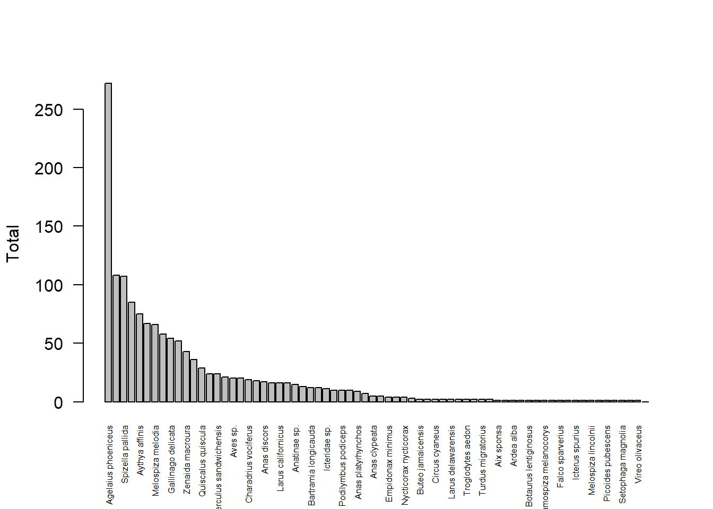

Wow! There are lots of *Agelaius phoeniceus* (Red-winged Blackbirds) at
WOOD in July.

### Instrumentation data (IS)

The process is essentially the same for sensor data. We'll do the same
series of queries for Soil Temperature, DP1.00041.001. Let's use data
from Moab in June 2017 this time.


```r
# Request soil temperature data availability info
req.soil <- GET("http://data.neonscience.org/api/v0/products/DP1.00041.001")

# make this JSON readable
# Note how we've change this from two commands into one here
avail.soil <- jsonlite::fromJSON(content(req.soil, as="text"), simplifyDataFrame=T, flatten=T)

# get data availability list for the product
temp.urls <- unlist(avail.soil$data$siteCodes$availableDataUrls)

# get data availability from location/date of interest
tmp <- GET(temp.urls[grep("MOAB/2017-06", temp.urls)])
tmp.files <- jsonlite::fromJSON(content(tmp, as="text"))
length(tmp.files$data$files$name) # There are a lot of available files
```

```
## [1] 188
```

```r
tmp.files$data$files$name[1:10]   # Let's print the first 10
```

```
##  [1] "NEON.D13.MOAB.DP1.00041.001.001.506.001.ST_1_minute.2017-06.basic.20211210T224045Z.csv" 
##  [2] "NEON.D13.MOAB.DP1.00041.001.004.505.001.ST_1_minute.2017-06.basic.20211210T224045Z.csv" 
##  [3] "NEON.D13.MOAB.DP1.00041.001.004.508.030.ST_30_minute.2017-06.basic.20211210T224045Z.csv"
##  [4] "NEON.D13.MOAB.DP1.00041.001.004.502.030.ST_30_minute.2017-06.basic.20211210T224045Z.csv"
##  [5] "NEON.D13.MOAB.DP1.00041.001.004.502.001.ST_1_minute.2017-06.basic.20211210T224045Z.csv" 
##  [6] "NEON.D13.MOAB.DP1.00041.001.readme.20220120T173946Z.txt"                                
##  [7] "NEON.D13.MOAB.DP1.00041.001.005.504.001.ST_1_minute.2017-06.basic.20211210T224045Z.csv" 
##  [8] "NEON.D13.MOAB.DP1.00041.001.001.506.030.ST_30_minute.2017-06.basic.20211210T224045Z.csv"
##  [9] "NEON.D13.MOAB.DP1.00041.001.001.504.001.ST_1_minute.2017-06.basic.20211210T224045Z.csv" 
## [10] "NEON.D13.MOAB.DP1.00041.001.005.509.001.ST_1_minute.2017-06.basic.20211210T224045Z.csv"
```

These file names start and end the same way as the observational files,
but the middle is a little more cryptic. The structure from beginning to
end is:

**NEON.[domain number].[site code].[data product ID].00000. [soil plot
number].[depth].[averaging interval].[data table name].
[year]-[month].[data package].[date of file creation]**

So
**"NEON.D13.MOAB.DP1.00041.001.003.507.030.ST_30_minute.2017-06.expanded.20200620T070859Z.csv"**
is the:

-   NEON (`NEON.`)
-   Domain 13 (`.D13.`)
-   Moab field site (`.MOAB.`)
-   soil temperature data (`.DP1.00041.001.`)
-   collected in Soil Plot 2, (`.002.`)
-   at the 7th depth below the surface (`.507.`)
-   and reported as a 30-minute mean of (`.030.` and `.ST_30_minute.`)
-   only for the period of June 2017 (`.2017-06.`)
-   and provided in a expanded data package (`.basic.`)
-   published on June 20th, 2020 (`.0200620T070859Z.`).

More information about interpreting file names can be found in the
readme that accompanies each download.

Let's get data (and the URL) for only the 2nd depth described above by
selecting `002.502.030` and the word `basic` in the file name.

Go get it:


```r
soil.temp <- read.delim(tmp.files$data$files$url
                        [intersect(grep("002.502.030", 
                                        tmp.files$data$files$name),
                                   grep("basic", 
                                        tmp.files$data$files$name))], 
                        sep=",")
```

Now we have the data and can use it to conduct our analyses. To take a
quick look at it, let's plot the mean soil temperature by date.


```r
# plot temp ~ date
plot(soil.temp$soilTempMean~as.POSIXct(soil.temp$startDateTime, 
                                       format="%Y-%m-%d T %H:%M:%S Z"), 
     pch=".", xlab="Date", ylab="T")
```

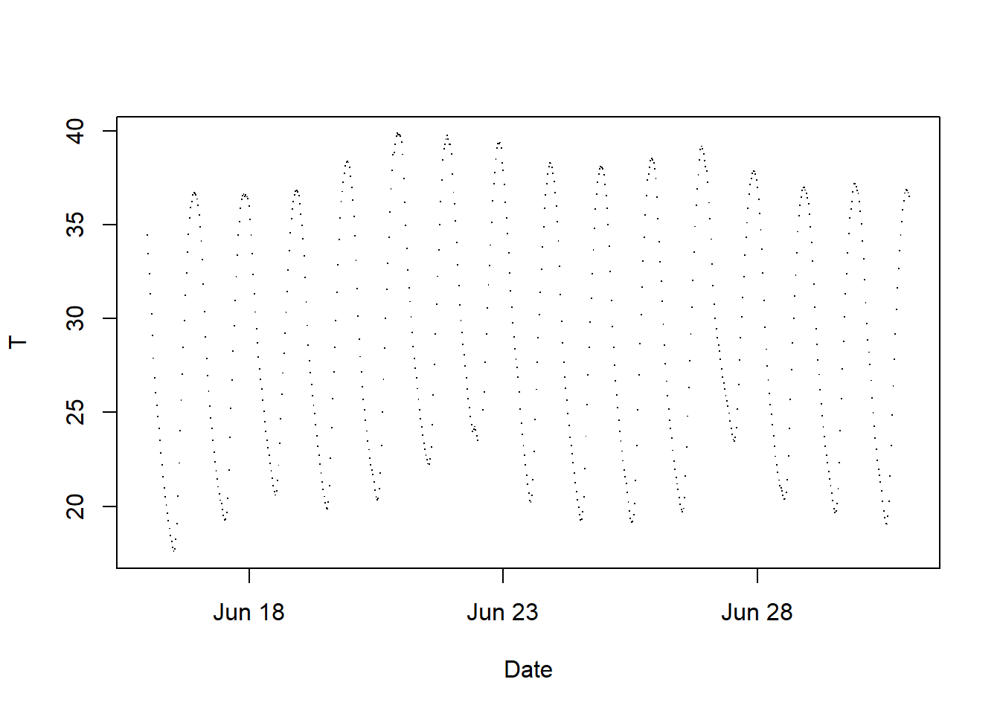

As we'd expect we see daily fluctuation in soil temperature.

### Remote sensing data (AOP)

Again, the process of determining which sites and time periods have
data, and finding the URLs for those data, is the same as for the other
data types. We'll go looking for High resolution orthorectified camera
imagery, DP1.30010.001, and we'll look at the flight over San Joaquin
Experimental Range (SJER) in March 2017.


```r
# Request camera data availability info
req.aop <- GET("http://data.neonscience.org/api/v0/products/DP1.30010.001")

# make this JSON readable
# Note how we've changed this from two commands into one here
avail.aop <- jsonlite::fromJSON(content(req.aop, as="text"), 
                      simplifyDataFrame=T, flatten=T)

# get data availability list for the product
cam.urls <- unlist(avail.aop$data$siteCodes$availableDataUrls)

# get data availability from location/date of interest
cam <- GET(cam.urls[intersect(grep("SJER", cam.urls),
                              grep("2017", cam.urls))])
cam.files <- jsonlite::fromJSON(content(cam, as="text"))

# this list of files is very long, so we'll just look at the first ten
head(cam.files$data$files$name, 10)
```

```
##  [1] "17032816_EH021656(20170328201220)-1213_ort.tif"
##  [2] "17032816_EH021656(20170328195926)-1146_ort.tif"
##  [3] "17032816_EH021656(20170328200315)-1163_ort.tif"
##  [4] "17032816_EH021656(20170328201328)-1228_ort.tif"
##  [5] "17032816_EH021656(20170328181147)-0245_ort.tif"
##  [6] "17032816_EH021656(20170328185925)-0618_ort.tif"
##  [7] "17032816_EH021656(20170328175140)-0064_ort.tif"
##  [8] "17032816_EH021656(20170328184137)-0482_ort.tif"
##  [9] "17032816_EH021656(20170328184652)-0514_ort.tif"
## [10] "17032816_EH021656(20170328181633)-0279_ort.tif"
```

File names for AOP data are more variable than for IS or OS data;
different AOP data products use different naming conventions. File
formats differ by product as well.

This particular product, camera imagery, is stored in TIFF files.

Instead of reading a TIFF into R, we'll download it to the working
directory. This is one option for getting AOP files from the API.

To download the TIFF file, we use the `downloader` package, and we'll
select a file based on the time stamp in the file name: `20170328192931`


```r
download(cam.files$data$files$url[grep("20170328192931", 
                                       cam.files$data$files$name)],
         paste(getwd(), "/SJER_image.tif", sep=""), mode="wb")
```

The image, below, of the San Joaquin Experimental Range should now be in
your working directory.


> An example of camera data (DP1.30010.001) from the San Joaquin
> Experimental Range. Source: National Ecological Observatory Network
> (NEON)

### Geolocation data

You may have noticed some of the spatial data referenced above are a bit
vague, e.g. "soil plot 2, 4th depth below the surface."

This section describes how to get spatial data and what to do with it
depends on which type of data you're working with.

#### Instrumentation data (both aquatic and terrestrial)

Downloads of instrument system (IS) data include a file called
sensor_positions.csv. The sensor positions file contains information
about the coordinates of each sensor, relative to a reference location.

While the specifics vary, techniques are generalizable for working with
sensor data and the sensor_positions.csv file. Let's look at the sensor
locations for photosynthetically active radiation (PAR; DP1.00024.001)
at the NEON Treehaven site (TREE) in July 2018. To reduce our file size,
we'll use the 30 minute averaging interval. Our final product from this
section is to create a spatially explicit picture of light attenuation
through the canopy.


```r
# load PAR data of interest 
par <- loadByProduct(dpID="DP1.00024.001", site="TREE",
                    startdate="2018-07", enddate="2018-07",
                    avg=30, check.size=F, token=NEON_TOKEN)
```

```
## Input parameter avg is deprecated; use timeIndex to download by time interval.
## Finding available files
## 
  |                                                                            
  |                                                                      |   0%
  |                                                                            
  |======================================================================| 100%
## 
## Downloading files totaling approximately 0.963266 MB
## Downloading 9 files
## 
  |                                                                            
  |                                                                      |   0%
  |                                                                            
  |=========                                                             |  12%
  |                                                                            
  |==================                                                    |  25%
  |                                                                            
  |==========================                                            |  38%
  |                                                                            
  |===================================                                   |  50%
  |                                                                            
  |============================================                          |  62%
  |                                                                            
  |====================================================                  |  75%
  |                                                                            
  |=============================================================         |  88%
  |                                                                            
  |======================================================================| 100%
## 
## Stacking operation across a single core.
## Stacking table PARPAR_30min
## Merged the most recent publication of sensor position files for each site and saved to /stackedFiles
## Copied the most recent publication of variable definition file to /stackedFiles
## Finished: Stacked 1 data tables and 3 metadata tables!
## Stacking took 0.3274581 secs
```

**Now we can specifically look at the sensor positions file:**


```r
# create object for sens. pos. file
pos <- par$sensor_positions_00024

# view names
names(pos)
```

```
##  [1] "siteID"               "HOR.VER"              "name"                
##  [4] "description"          "start"                "end"                 
##  [7] "referenceName"        "referenceDescription" "referenceStart"      
## [10] "referenceEnd"         "xOffset"              "yOffset"             
## [13] "zOffset"              "pitch"                "roll"                
## [16] "azimuth"              "referenceLatitude"    "referenceLongitude"  
## [19] "referenceElevation"   "eastOffset"           "northOffset"         
## [22] "xAzimuth"             "yAzimuth"             "publicationDate"
```

The sensor locations are indexed by the [HOR.VER
variable](https://data.neonscience.org/file-naming-conventions) - see
the file naming conventions page for more details.

Using unique() we can view all the locations indexes in this file.


```r
# view names
unique(pos$HOR.VER)
```

```
## [1] "000.010" "000.020" "000.030" "000.040" "000.050" "000.060"
```

PAR data are collected at multiple levels of the NEON tower but along a
single vertical plane. We see this reflected in the data where HOR=000
(all data collected) at the tower location. The VER index varies (VER =
010 to 060) showing that the vertical position is changing and that PAR
is measured at six different levels.

The x, y, and z offsets in the sensor positions file are the relative
distance, in meters, to the reference latitude, longitude, and elevation
in the file.

The HOR and VER indices in the sensor positions file correspond to the
verticalPosition and horizontalPosition fields in par\$PARPAR_30min.

Say we wanted to plot a profile of the PAR through the canopy, we would
need to start by using the aggregate() function to calculate mean PAR at
each vertical position on the tower over the month:


```r
# calc mean PAR at each level
parMean <- aggregate(par$PARPAR_30min$PARMean, 
                   by=list(par$PARPAR_30min$verticalPosition),
                   FUN=mean, na.rm=T)
```

Now we can plot mean PAR relative to height on the tower (or the
zOffset):


```r
# plot PAR
plot(parMean$x, parMean$Group.1, type="b", pch=20,
     xlab="Photosynthetically active radiation",
     ylab="Height above tower base (m)")
```

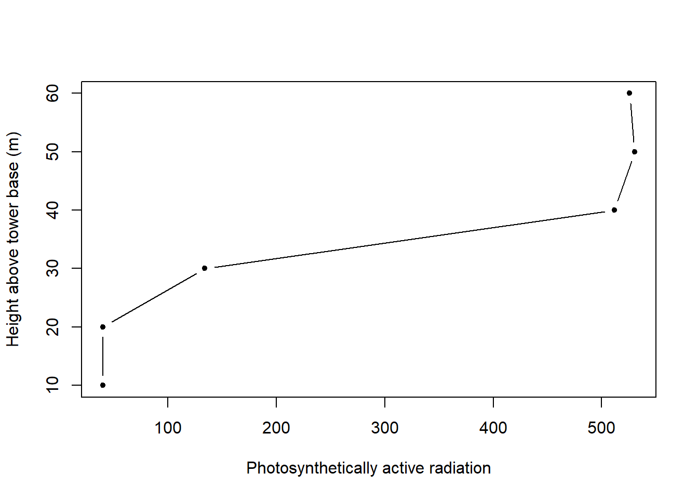

#### Observational data - Terrestrial

Latitude, longitude, elevation, and associated uncertainties are
included in data downloads *(Remember NEON COding Lab part 1?)*. These
are the coordinates and uncertainty of the sampling plot; for many
protocols it is possible to calculate a more precise location.
Instructions for doing this are in the respective data product user
guides, and code is in the `geoNEON` package on GitHub.

### Querying a single named location

Let's look at the named locations in the bird data we downloaded above.
To do this, look for the field called `namedLocation`, which is present
in all observational data products, both aquatic and terrestrial.


```r
# view named location
head(brd.point$namedLocation)
```

```
## [1] "WOOD_013.birdGrid.brd" "WOOD_013.birdGrid.brd" "WOOD_013.birdGrid.brd"
## [4] "WOOD_013.birdGrid.brd" "WOOD_013.birdGrid.brd" "WOOD_013.birdGrid.brd"
```

Here we see the first six entries in the `namedLocation` column which
tells us the names of the Terrestrial Observation plots where the bird
surveys were conducted.

We can query the locations endpoint of the API for the first named
location, `WOOD_013.birdGrid.brd`.


```r
# location data 
req.loc <- GET("http://data.neonscience.org/api/v0/locations/WOOD_013.birdGrid.brd")

# make this JSON readable
brd.WOOD_013 <- jsonlite::fromJSON(content(req.loc, as="text"))
brd.WOOD_013
```

```
## $data
## $data$locationName
## [1] "WOOD_013.birdGrid.brd"
## 
## $data$locationDescription
## [1] "Plot \"WOOD_013\" at site \"WOOD\""
## 
## $data$locationType
## [1] "OS Plot - brd"
## 
## $data$domainCode
## [1] "D09"
## 
## $data$siteCode
## [1] "WOOD"
## 
## $data$locationDecimalLatitude
## [1] 47.13912
## 
## $data$locationDecimalLongitude
## [1] -99.23243
## 
## $data$locationElevation
## [1] 579.31
## 
## $data$locationUtmEasting
## [1] 482375.7
## 
## $data$locationUtmNorthing
## [1] 5220650
## 
## $data$locationUtmHemisphere
## [1] "N"
## 
## $data$locationUtmZone
## [1] 14
## 
## $data$alphaOrientation
## [1] 0
## 
## $data$betaOrientation
## [1] 0
## 
## $data$gammaOrientation
## [1] 0
## 
## $data$xOffset
## [1] 0
## 
## $data$yOffset
## [1] 0
## 
## $data$zOffset
## [1] 0
## 
## $data$offsetLocation
## NULL
## 
## $data$locationProperties
##                             locationPropertyName locationPropertyValue
## 1                    Value for Coordinate source            GeoXH 6000
## 2               Value for Coordinate uncertainty                  0.28
## 3                              Value for Country          unitedStates
## 4                               Value for County              Stutsman
## 5                Value for Elevation uncertainty                  0.48
## 6                   Value for Filtered positions                   121
## 7                       Value for Geodetic datum                 WGS84
## 8     Value for Horizontal dilution of precision                     1
## 9                    Value for Maximum elevation                579.31
## 10                   Value for Minimum elevation                569.79
## 11 Value for National Land Cover Database (2001)   grasslandHerbaceous
## 12                     Value for Plot dimensions           500m x 500m
## 13                             Value for Plot ID              WOOD_013
## 14                           Value for Plot size                250000
## 15                        Value for Plot subtype              birdGrid
## 16                           Value for Plot type           distributed
## 17    Value for Positional dilution of precision                   2.4
## 18            Value for Reference Point Position                    B2
## 19                        Value for Slope aspect                238.91
## 20                      Value for Slope gradient                  2.83
## 21                     Value for Soil type order             Mollisols
## 22                      Value for State province                    ND
## 23               Value for Subtype Specification            ninePoints
## 24                            Value for UTM Zone                   14N
## 
## $data$locationParent
## [1] "WOOD"
## 
## $data$locationParentUrl
## [1] "https://data.neonscience.org/api/v0/locations/WOOD"
## 
## $data$locationChildren
## [1] "WOOD_013.birdGrid.brd.C3" "WOOD_013.birdGrid.brd.B2"
## [3] "WOOD_013.birdGrid.brd.A3" "WOOD_013.birdGrid.brd.A2"
## [5] "WOOD_013.birdGrid.brd.A1" "WOOD_013.birdGrid.brd.C2"
## [7] "WOOD_013.birdGrid.brd.B1" "WOOD_013.birdGrid.brd.B3"
## [9] "WOOD_013.birdGrid.brd.C1"
## 
## $data$locationChildrenUrls
## [1] "https://data.neonscience.org/api/v0/locations/WOOD_013.birdGrid.brd.C3"
## [2] "https://data.neonscience.org/api/v0/locations/WOOD_013.birdGrid.brd.B2"
## [3] "https://data.neonscience.org/api/v0/locations/WOOD_013.birdGrid.brd.A3"
## [4] "https://data.neonscience.org/api/v0/locations/WOOD_013.birdGrid.brd.A2"
## [5] "https://data.neonscience.org/api/v0/locations/WOOD_013.birdGrid.brd.A1"
## [6] "https://data.neonscience.org/api/v0/locations/WOOD_013.birdGrid.brd.C2"
## [7] "https://data.neonscience.org/api/v0/locations/WOOD_013.birdGrid.brd.B1"
## [8] "https://data.neonscience.org/api/v0/locations/WOOD_013.birdGrid.brd.B3"
## [9] "https://data.neonscience.org/api/v0/locations/WOOD_013.birdGrid.brd.C1"
```

Note spatial information under `$data$[nameOfCoordinate]` and under
`$data$locationProperties`. Also note `$data$locationChildren`: these
are the finer scale locations that can be used to calculate precise
spatial data for bird observations.

For convenience, we'll use the `geoNEON` package to make the
calculations. First we'll use `getLocByName()` to get the additional
spatial information available through the API, and look at the spatial
resolution available in the initial download:


```r
# load the geoNEON package
library(geoNEON)

# extract the spatial data
brd.point.loc <- getLocByName(brd.point)
```

```
## 
  |                                                                            
  |                                                                      |   0%
  |                                                                            
  |==========                                                            |  14%
  |                                                                            
  |====================                                                  |  29%
  |                                                                            
  |==============================                                        |  43%
  |                                                                            
  |========================================                              |  57%
  |                                                                            
  |==================================================                    |  71%
  |                                                                            
  |============================================================          |  86%
  |                                                                            
  |======================================================================| 100%
```

```r
# plot bird point locations 
# note that decimal degrees is also an option in the data
symbols(brd.point.loc$easting, brd.point.loc$northing, 
        circles=brd.point.loc$coordinateUncertainty, 
        xlab="Easting", ylab="Northing", tck=0.01, inches=F)
```

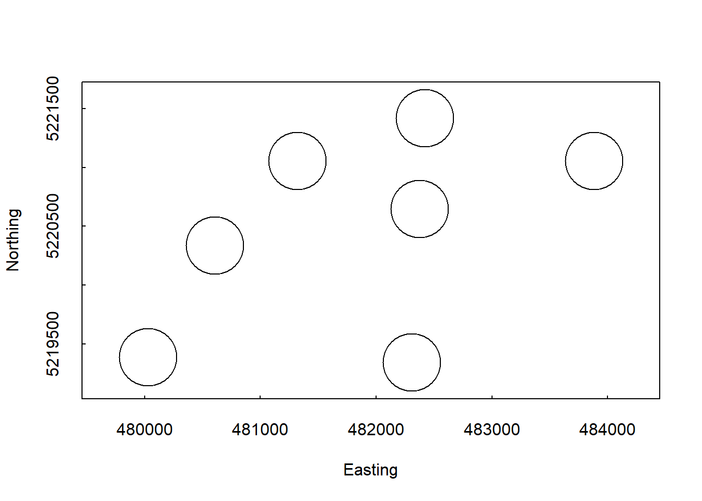

And use `getLocTOS()` to calculate the point locations of observations.


```r
brd.point.pt <- getLocTOS(brd.point, "brd_perpoint")
```

```
## 
  |                                                                            
  |                                                                      |   0%
  |                                                                            
  |=                                                                     |   2%
  |                                                                            
  |==                                                                    |   3%
  |                                                                            
  |===                                                                   |   5%
  |                                                                            
  |====                                                                  |   6%
  |                                                                            
  |======                                                                |   8%
  |                                                                            
  |=======                                                               |  10%
  |                                                                            
  |========                                                              |  11%
  |                                                                            
  |=========                                                             |  13%
  |                                                                            
  |==========                                                            |  14%
  |                                                                            
  |===========                                                           |  16%
  |                                                                            
  |============                                                          |  17%
  |                                                                            
  |=============                                                         |  19%
  |                                                                            
  |==============                                                        |  21%
  |                                                                            
  |================                                                      |  22%
  |                                                                            
  |=================                                                     |  24%
  |                                                                            
  |==================                                                    |  25%
  |                                                                            
  |===================                                                   |  27%
  |                                                                            
  |====================                                                  |  29%
  |                                                                            
  |=====================                                                 |  30%
  |                                                                            
  |======================                                                |  32%
  |                                                                            
  |=======================                                               |  33%
  |                                                                            
  |========================                                              |  35%
  |                                                                            
  |==========================                                            |  37%
  |                                                                            
  |===========================                                           |  38%
  |                                                                            
  |============================                                          |  40%
  |                                                                            
  |=============================                                         |  41%
  |                                                                            
  |==============================                                        |  43%
  |                                                                            
  |===============================                                       |  44%
  |                                                                            
  |================================                                      |  46%
  |                                                                            
  |=================================                                     |  48%
  |                                                                            
  |==================================                                    |  49%
  |                                                                            
  |====================================                                  |  51%
  |                                                                            
  |=====================================                                 |  52%
  |                                                                            
  |======================================                                |  54%
  |                                                                            
  |=======================================                               |  56%
  |                                                                            
  |========================================                              |  57%
  |                                                                            
  |=========================================                             |  59%
  |                                                                            
  |==========================================                            |  60%
  |                                                                            
  |===========================================                           |  62%
  |                                                                            
  |============================================                          |  63%
  |                                                                            
  |==============================================                        |  65%
  |                                                                            
  |===============================================                       |  67%
  |                                                                            
  |================================================                      |  68%
  |                                                                            
  |=================================================                     |  70%
  |                                                                            
  |==================================================                    |  71%
  |                                                                            
  |===================================================                   |  73%
  |                                                                            
  |====================================================                  |  75%
  |                                                                            
  |=====================================================                 |  76%
  |                                                                            
  |======================================================                |  78%
  |                                                                            
  |========================================================              |  79%
  |                                                                            
  |=========================================================             |  81%
  |                                                                            
  |==========================================================            |  83%
  |                                                                            
  |===========================================================           |  84%
  |                                                                            
  |============================================================          |  86%
  |                                                                            
  |=============================================================         |  87%
  |                                                                            
  |==============================================================        |  89%
  |                                                                            
  |===============================================================       |  90%
  |                                                                            
  |================================================================      |  92%
  |                                                                            
  |==================================================================    |  94%
  |                                                                            
  |===================================================================   |  95%
  |                                                                            
  |====================================================================  |  97%
  |                                                                            
  |===================================================================== |  98%
  |                                                                            
  |======================================================================| 100%
```

```r
# plot bird point locations 
# note that decimal degrees is also an option in the data
symbols(brd.point.pt$adjEasting, brd.point.pt$adjNorthing,
        circles=brd.point.pt$adjCoordinateUncertainty,
        xlab="Easting", ylab="Northing", tck=0.01, inches=F)
```

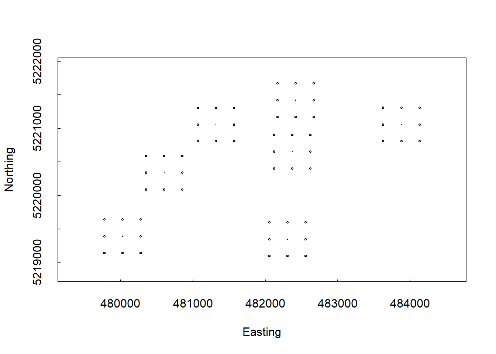

Now you can see the individual points where the respective point counts
were located.

### Taxonomy

NEON maintains accepted taxonomies for many of the taxonomic
identification data we collect. NEON taxonomies are available for query
via the API; they are also provided via an interactive user interface,
the [Taxon Viewer](http://data.neonscience.org/static/taxon.html).

NEON taxonomy data provides the reference information for how NEON
validates taxa; an identification must appear in the taxonomy lists in
order to be accepted into the NEON database. Additions to the lists are
reviewed regularly. The taxonomy lists also provide the author of the
scientific name, and the reference text used.

The taxonomy endpoint of the API works a little bit differently from the
other endpoints. In the "Anatomy of an API Call" section above, each
endpoint has a single type of target - a data product number, a named
location name, etc. For taxonomic data, there are multiple query
options, and some of them can be used in combination. For example, a
query for taxa in the Pinaceae family:

[<http://data.neonscience.org/api/v0/taxonomy>]{style="color:#A2A4A3"}[/?family=Pinaceae]{style="color:#A00606;font-weight:bold"}

The available types of queries are listed in the
<a href="http://data.neonscience.org/data-api#!/taxonomy/Get_taxonomy" target="_blank">taxonomy
section</a> of the API web page. Briefly, they are:

-   `taxonTypeCode`: Which of the taxonomies maintained by NEON are you
    looking for? BIRD, FISH, PLANT, etc. Cannot be used in combination
    with the taxonomic rank queries.
-   each of the major taxonomic ranks from genus through kingdom
-   `scientificname`: Genus + specific epithet (+ authority). Search is
    by exact match only, see final example below.
-   `verbose`: Do you want the short (`false`) or long (`true`) response
-   `offset`: Skip this number of items in the list. Defaults to 50.
-   `limit`: Result set will be truncated at this length. Defaults to
    50. 

Staff on the NEON project have plans to modify the settings for `offset`
and `limit`, such that `offset` will default to 0 and `limit` will
default to ∞, but in the meantime users will want to set these manually.
They are set to non-default values in the examples below.

For the first example, let's query for the loon family, Gaviidae, in the
bird taxonomy. Note that query parameters are case-sensitive.


```r
loon.req <- GET("http://data.neonscience.org/api/v0/taxonomy/?family=Gaviidae&offset=0&limit=500")
```

Parse the results into a list using `fromJSON()`:


```r
loon.list <- jsonlite::fromJSON(content(loon.req, as="text"))
```

And look at the `$data` element of the results, which contains:

-   The full taxonomy of each taxon
-   The short taxon code used by NEON (taxonID/acceptedTaxonID)
-   The author of the scientific name (scientificNameAuthorship)
-   The vernacular name, if applicable
-   The reference text used (nameAccordingToID)

The terms used for each field are matched to Darwin Core (dwc) and the
Global Biodiversity Information Facility (gbif) terms, where possible,
and the matches are indicated in the column headers.


```r
loon.list$data
```

```
##   taxonTypeCode taxonID acceptedTaxonID dwc:scientificName
## 1          BIRD    ARLO            ARLO      Gavia arctica
## 2          BIRD    COLO            COLO        Gavia immer
## 3          BIRD    PALO            PALO     Gavia pacifica
## 4          BIRD    RTLO            RTLO     Gavia stellata
## 5          BIRD    UNLN            UNLN          Gavia sp.
## 6          BIRD    YBLO            YBLO      Gavia adamsii
##   dwc:scientificNameAuthorship dwc:taxonRank dwc:vernacularName
## 1                   (Linnaeus)       species        Arctic Loon
## 2                   (Brunnich)       species        Common Loon
## 3                   (Lawrence)       species       Pacific Loon
## 4                (Pontoppidan)       species  Red-throated Loon
## 5                         <NA>         genus       Unknown Loon
## 6                 (G. R. Gray)       species Yellow-billed Loon
##                                  dwc:nameAccordingToID dwc:kingdom dwc:phylum
## 1                             doi: 10.1642/AUK-15-73.1    Animalia   Chordata
## 2                             doi: 10.1642/AUK-15-73.1    Animalia   Chordata
## 3                             doi: 10.1642/AUK-15-73.1    Animalia   Chordata
## 4                             doi: 10.1642/AUK-15-73.1    Animalia   Chordata
## 5 http://www.birdconservancy.org/ (accessed 5/16/2016)    Animalia   Chordata
## 6                             doi: 10.1642/AUK-15-73.1    Animalia   Chordata
##   dwc:class   dwc:order dwc:family dwc:genus gbif:subspecies gbif:variety
## 1      Aves Gaviiformes   Gaviidae     Gavia              NA           NA
## 2      Aves Gaviiformes   Gaviidae     Gavia              NA           NA
## 3      Aves Gaviiformes   Gaviidae     Gavia              NA           NA
## 4      Aves Gaviiformes   Gaviidae     Gavia              NA           NA
## 5      Aves Gaviiformes   Gaviidae     Gavia              NA           NA
## 6      Aves Gaviiformes   Gaviidae     Gavia              NA           NA
```

To get the entire list for a particular taxonomic type, use the
`taxonTypeCode` query. Be cautious with this query, the PLANT taxonomic
list has several hundred thousand entries.

For an example, let's look up the small mammal taxonomic list, which is
one of the shorter ones, and use the `verbose=true` option to see a more
extensive list of taxon data, including many taxon ranks that aren't
populated for these taxa. For space here, we display only the first 10
taxa:


```r
mam.req <- GET("http://data.neonscience.org/api/v0/taxonomy/?taxonTypeCode=SMALL_MAMMAL&offset=0&limit=500&verbose=true")
mam.list <- jsonlite::fromJSON(content(mam.req, as="text"))
mam.list$data[1:10,]
```

```
##    taxonTypeCode taxonID acceptedTaxonID               dwc:scientificName
## 1   SMALL_MAMMAL    AMHA            AMHA        Ammospermophilus harrisii
## 2   SMALL_MAMMAL    AMIN            AMIN       Ammospermophilus interpres
## 3   SMALL_MAMMAL    AMLE            AMLE        Ammospermophilus leucurus
## 4   SMALL_MAMMAL    AMLT            AMLT Ammospermophilus leucurus tersus
## 5   SMALL_MAMMAL    AMNE            AMNE         Ammospermophilus nelsoni
## 6   SMALL_MAMMAL    AMSP            AMSP             Ammospermophilus sp.
## 7   SMALL_MAMMAL    APRN            APRN            Aplodontia rufa nigra
## 8   SMALL_MAMMAL    APRU            APRU                  Aplodontia rufa
## 9   SMALL_MAMMAL    ARAL            ARAL                Arborimus albipes
## 10  SMALL_MAMMAL    ARLO            ARLO            Arborimus longicaudus
##    dwc:scientificNameAuthorship dwc:taxonRank            dwc:vernacularName
## 1           Audubon and Bachman       species     Harriss Antelope Squirrel
## 2                       Merriam       species       Texas Antelope Squirrel
## 3                       Merriam       species Whitetailed Antelope Squirrel
## 4                       Goldman    subspecies                          <NA>
## 5                       Merriam       species     Nelsons Antelope Squirrel
## 6                          <NA>         genus                          <NA>
## 7                        Taylor    subspecies                          <NA>
## 8                    Rafinesque       species                      Sewellel
## 9                       Merriam       species              Whitefooted Vole
## 10                         True       species                 Red Tree Vole
##    taxonProtocolCategory dwc:nameAccordingToID
## 1          opportunistic  isbn: 978 0801882210
## 2          opportunistic  isbn: 978 0801882210
## 3          opportunistic  isbn: 978 0801882210
## 4          opportunistic  isbn: 978 0801882210
## 5          opportunistic  isbn: 978 0801882210
## 6          opportunistic  isbn: 978 0801882210
## 7             non-target  isbn: 978 0801882210
## 8             non-target  isbn: 978 0801882210
## 9                 target  isbn: 978 0801882210
## 10                target  isbn: 978 0801882210
##                                                                                                                                                 dwc:nameAccordingToTitle
## 1  Wilson D. E. and D. M. Reeder. 2005. Mammal Species of the World; A Taxonomic and Geographic Reference. Third edition. Johns Hopkins University Press; Baltimore, MD.
## 2  Wilson D. E. and D. M. Reeder. 2005. Mammal Species of the World; A Taxonomic and Geographic Reference. Third edition. Johns Hopkins University Press; Baltimore, MD.
## 3  Wilson D. E. and D. M. Reeder. 2005. Mammal Species of the World; A Taxonomic and Geographic Reference. Third edition. Johns Hopkins University Press; Baltimore, MD.
## 4  Wilson D. E. and D. M. Reeder. 2005. Mammal Species of the World; A Taxonomic and Geographic Reference. Third edition. Johns Hopkins University Press; Baltimore, MD.
## 5  Wilson D. E. and D. M. Reeder. 2005. Mammal Species of the World; A Taxonomic and Geographic Reference. Third edition. Johns Hopkins University Press; Baltimore, MD.
## 6  Wilson D. E. and D. M. Reeder. 2005. Mammal Species of the World; A Taxonomic and Geographic Reference. Third edition. Johns Hopkins University Press; Baltimore, MD.
## 7  Wilson D. E. and D. M. Reeder. 2005. Mammal Species of the World; A Taxonomic and Geographic Reference. Third edition. Johns Hopkins University Press; Baltimore, MD.
## 8  Wilson D. E. and D. M. Reeder. 2005. Mammal Species of the World; A Taxonomic and Geographic Reference. Third edition. Johns Hopkins University Press; Baltimore, MD.
## 9  Wilson D. E. and D. M. Reeder. 2005. Mammal Species of the World; A Taxonomic and Geographic Reference. Third edition. Johns Hopkins University Press; Baltimore, MD.
## 10 Wilson D. E. and D. M. Reeder. 2005. Mammal Species of the World; A Taxonomic and Geographic Reference. Third edition. Johns Hopkins University Press; Baltimore, MD.
##    dwc:kingdom gbif:subkingdom gbif:infrakingdom gbif:superdivision
## 1     Animalia              NA                NA                 NA
## 2     Animalia              NA                NA                 NA
## 3     Animalia              NA                NA                 NA
## 4     Animalia              NA                NA                 NA
## 5     Animalia              NA                NA                 NA
## 6     Animalia              NA                NA                 NA
## 7     Animalia              NA                NA                 NA
## 8     Animalia              NA                NA                 NA
## 9     Animalia              NA                NA                 NA
## 10    Animalia              NA                NA                 NA
##    gbif:division gbif:subdivision gbif:infradivision gbif:parvdivision
## 1             NA               NA                 NA                NA
## 2             NA               NA                 NA                NA
## 3             NA               NA                 NA                NA
## 4             NA               NA                 NA                NA
## 5             NA               NA                 NA                NA
## 6             NA               NA                 NA                NA
## 7             NA               NA                 NA                NA
## 8             NA               NA                 NA                NA
## 9             NA               NA                 NA                NA
## 10            NA               NA                 NA                NA
##    gbif:superphylum dwc:phylum gbif:subphylum gbif:infraphylum gbif:superclass
## 1                NA   Chordata             NA               NA              NA
## 2                NA   Chordata             NA               NA              NA
## 3                NA   Chordata             NA               NA              NA
## 4                NA   Chordata             NA               NA              NA
## 5                NA   Chordata             NA               NA              NA
## 6                NA   Chordata             NA               NA              NA
## 7                NA   Chordata             NA               NA              NA
## 8                NA   Chordata             NA               NA              NA
## 9                NA   Chordata             NA               NA              NA
## 10               NA   Chordata             NA               NA              NA
##    dwc:class gbif:subclass gbif:infraclass gbif:superorder dwc:order
## 1   Mammalia            NA              NA              NA  Rodentia
## 2   Mammalia            NA              NA              NA  Rodentia
## 3   Mammalia            NA              NA              NA  Rodentia
## 4   Mammalia            NA              NA              NA  Rodentia
## 5   Mammalia            NA              NA              NA  Rodentia
## 6   Mammalia            NA              NA              NA  Rodentia
## 7   Mammalia            NA              NA              NA  Rodentia
## 8   Mammalia            NA              NA              NA  Rodentia
## 9   Mammalia            NA              NA              NA  Rodentia
## 10  Mammalia            NA              NA              NA  Rodentia
##    gbif:suborder gbif:infraorder gbif:section gbif:subsection gbif:superfamily
## 1             NA              NA           NA              NA               NA
## 2             NA              NA           NA              NA               NA
## 3             NA              NA           NA              NA               NA
## 4             NA              NA           NA              NA               NA
## 5             NA              NA           NA              NA               NA
## 6             NA              NA           NA              NA               NA
## 7             NA              NA           NA              NA               NA
## 8             NA              NA           NA              NA               NA
## 9             NA              NA           NA              NA               NA
## 10            NA              NA           NA              NA               NA
##       dwc:family gbif:subfamily gbif:tribe gbif:subtribe        dwc:genus
## 1      Sciuridae        Xerinae  Marmotini            NA Ammospermophilus
## 2      Sciuridae        Xerinae  Marmotini            NA Ammospermophilus
## 3      Sciuridae        Xerinae  Marmotini            NA Ammospermophilus
## 4      Sciuridae        Xerinae  Marmotini            NA Ammospermophilus
## 5      Sciuridae        Xerinae  Marmotini            NA Ammospermophilus
## 6      Sciuridae        Xerinae  Marmotini            NA Ammospermophilus
## 7  Aplodontiidae           <NA>       <NA>            NA       Aplodontia
## 8  Aplodontiidae           <NA>       <NA>            NA       Aplodontia
## 9     Cricetidae    Arvicolinae       <NA>            NA        Arborimus
## 10    Cricetidae    Arvicolinae       <NA>            NA        Arborimus
##    dwc:subgenus gbif:subspecies gbif:variety gbif:subvariety gbif:form
## 1          <NA>              NA           NA              NA        NA
## 2          <NA>              NA           NA              NA        NA
## 3          <NA>              NA           NA              NA        NA
## 4          <NA>              NA           NA              NA        NA
## 5          <NA>              NA           NA              NA        NA
## 6          <NA>              NA           NA              NA        NA
## 7          <NA>              NA           NA              NA        NA
## 8          <NA>              NA           NA              NA        NA
## 9          <NA>              NA           NA              NA        NA
## 10         <NA>              NA           NA              NA        NA
##    gbif:subform speciesGroup dwc:specificEpithet dwc:infraspecificEpithet
## 1            NA         <NA>            harrisii                     <NA>
## 2            NA         <NA>           interpres                     <NA>
## 3            NA         <NA>            leucurus                     <NA>
## 4            NA         <NA>            leucurus                   tersus
## 5            NA         <NA>             nelsoni                     <NA>
## 6            NA         <NA>                 sp.                     <NA>
## 7            NA         <NA>                rufa                    nigra
## 8            NA         <NA>                rufa                     <NA>
## 9            NA         <NA>             albipes                     <NA>
## 10           NA         <NA>         longicaudus                     <NA>
```

To get information about a single taxon, use the `scientificname` query.
This query will not do a 'fuzzy match', so you need to query the exact
name of the taxon in the NEON taxonomy. Because of this, the query will
be most useful when you already have NEON data in hand and are looking
for more information about a specific taxon. Querying on
`scientificname` is unlikely to be an efficient way to figure out if
NEON recognizes a particular taxon.

In addition, scientific names contain spaces, which are not allowed in a
URL. The spaces need to be replaced with the URL encoding replacement,
%20.

For an example, let's look up the little sand verbena, *Abronia minor
Standl.* Searching for *Abronia minor* will fail, because the NEON
taxonomy for this species includes the authority. The search will also
fail with spaces. Search for `Abronia%20minor%20Standl.`, and in this
case we can omit `offset` and `limit` because we know there can only be
a single result:


```r
am.req <- GET("http://data.neonscience.org/api/v0/taxonomy/?scientificname=Abronia%20minor%20Standl.")
am.list <- jsonlite::fromJSON(content(am.req, as="text"))
am.list$data
```

```
##   taxonTypeCode taxonID acceptedTaxonID    dwc:scientificName
## 1         PLANT   ABMI2           ABMI2 Abronia minor Standl.
##   dwc:scientificNameAuthorship dwc:taxonRank  dwc:vernacularName
## 1                      Standl.       species little sand verbena
##                         dwc:nameAccordingToID dwc:kingdom    dwc:phylum
## 1 http://plants.usda.gov (accessed 8/25/2014)     Plantae Magnoliophyta
##       dwc:class      dwc:order    dwc:family dwc:genus gbif:subspecies
## 1 Magnoliopsida Caryophyllales Nyctaginaceae   Abronia              NA
##   gbif:variety
## 1           NA
```

## Stacking NEON data

At the top of this tutorial, we installed the `neonUtilities` package.
This is a custom R package that stacks the monthly files provided by the
NEON data portal into a single continuous file for each type of data
table in the download. It currently handles files downloaded from the
data portal, but not files pulled from the API.

For a guide to using `neonUtilities` on data downloaded from the portal,
look
<a href="https://www.neonscience.org/neonDataStackR" target="_blank">here</a>.

## Intro to NEON Exercises Part 2

### Exercise 2.2: Written questions

**Suggested Timing: Complete this exercise before our next class
meeting**

**Question 1:** How does NEON address 'dark data' (Chapter 1)?

**Question 2:** How might or does the NEON project intersect with your
current research or future career goals? *(1 paragraph)*

</div>

::: {#ds-challenge markdown="1"}
**Question 3:** Use the map in **Chapter 2:Intro to NEON** to answer the
following questions. Consider the research question that you may explore
as your final semester project or a current project that you are working
on and answer each of the following questions:

-   Are there NEON field sites that are in study regions of interest to
    you?\
-   What domains are the sites located in?\
-   What NEON field sites do your current research or Capstone Project
    ideas coincide with?\
-   Is the site or sites core or relocatable?\
-   Are they terrestrial or aquatic?\
-   Are there data available for the NEON field site(s) that you are
    most interested in? What kind of data are available?
:::

::: {markdown="1"}
**Question 4:** Consider either your current or future research, or a
question you'd like to address durring this course and answer *each* of
the following questions:

-   Which types of NEON data may be more useful to address these
    questions?
-   What non-NEON data resources could be combined with NEON data to
    help address your question?
-   What challenges, if any, could you foresee when beginning to work
    with these data?
:::

::: {markdown="1"}
**Question 5:** Use the Data Portal tools to investigate the data
availability for the field sites you've already identified in the
previous sections and answer *each* of the following questions:

-   What types of aquatic or terrestrial data are currently available?
    Remote sensing data?\
-   Of these, what type of data are you most interested in working with
    for your project during this course?\
-   For what time period does the data cover?\
-   What format is the downloadable file available in?\
-   Where is the metadata to support this data?\
:::

<div id="ds-challenge" markdown="1">

### Exercise 2.3: NEON Coding Lab - Further Exploration of NEON Data

**Suggested Timing: Complete this exercise a few days before your NEON
clumination write up**

1.  Use the answers that you've provided above in Exercise 2.2 to select
    a *single* NEON site.

e.g. `ONAQ`

2.  Use the answers that you've provided above to select **3 NEON data
    products** from either the TOS, TIS or ARS (AOP) collection methods.
    Sumarize each product with its NEON identifier, along with a
    sumarry.

e.g.:

`**DP1.10055.001**: Plant phenology observations: phenophase status and insensity of tagged plants.  This data product contains the quality-controlled, native sampling resolution data from in-situ observations of plant leaf development and reproductive phenophases, at **D15.ONAQ**.`

3.  Using the NEON Ulitites package or the API pull in those data along
    with metadata.

4.  Organize your data into `data.frames` and produce summaries for each
    of your data:

5.  Filter your data based on metadata and quality flags:

> **DP1.10055.001**: Plant phenology observations: phenophase status and
> intensity of tagged plants. This data product contains the
> quality-controlled, native sampling resolution data from in-situ
> observations of plant leaf development and reproductive phenophases,
> at **D15.ONAQ**. Here I will focus on the phenophase intensity data,
> which is a measure of how prevalent that particular phenophase is in
> the sampled plants.

6.  Using the NEON Ulitites package or the API pull in those data along
    with metadata.


```r
sitesOfInterest <- c("ONAQ")

dpid <- as.character('DP1.10055.001') #phe data
 
pheDat <- loadByProduct(dpID="DP1.10055.001",
                     site = sitesOfInterest,
                     package = "basic",
                     check.size = FALSE, 
                     token=NEON_TOKEN)
```

7.  Organize your data into `data.frames` and produce summaries for each
    of your data:


```r
#NEON sends the data as a nested list, so I need to undo that
# unlist all data frames
list2env(pheDat ,.GlobalEnv)
summary(phe_perindividualperyear)
summary(phe_statusintensity)
```

8.  Filter and format your data based on metadata and quality flags:


```r
#remove duplicate records
phe_statusintensity <- select(phe_statusintensity, -uid)
phe_statusintensity <- distinct(phe_statusintensity)
#Format dates (native format is 'factor' silly R)
phe_statusintensity$date <- as.Date(phe_statusintensity$date, "%Y-%m-%d")
phe_statusintensity$editedDate <- as.Date(phe_statusintensity$editedDate, "%Y-%m-%d")
phe_statusintensity$year <- substr(phe_statusintensity$date, 1, 4)
phe_statusintensity$monthDay <- format(phe_statusintensity$date, format="%m-%d")
```

Now I want to remove NA values so I can see what's really going on:


```r
phe_statusintensity=phe_statusintensity%>%
  filter(!is.na(phe_statusintensity$phenophaseIntensity))
```

9.  Create minimum of 1 plot per data type (minimum of 3 plots total).
    These will vary based on that data that you've chosen.

A non-exhastive list of ideas: 1. Your data as a function of height on
the tower (FPAR example) 2. A map of the locations where your data is
sampled (TOS tree example, bird example) 3. A model based on the data
you're interested in working work (Coding lab 1 example) 4. A timeseries
of your data (example below)

10. What is the temporal frequency of observations in the data you
    decided was of interest? How do the data align to answer a central
    question? What challenges did you run into when investigating these
    data? How will you address these challenges and document your code?
    *One to two paragraphs*

### Exercise 2.4: Intro to NEON Culmination Activity

**Due before we start Chapter 3: USA-NPN**

Write up a 1-page summary of **a project that you might want to explore
using NEON** data over the duration of this course. Include:

1.  the types of NEON (and other data) that you will need to implement
    this project, including data product id numbers.
2.  If in your NEON coding lab part 2 you highlighted challenges to
    using these data, discuss methods to address those challenges.
    \*e.g. If your site doesn't yet have a long data recocrd, is it
    located close to a longer lived site from another network? (LTER,
    Ameriflux, LTAR etc)
3.  One high-level summary graphic including all of your data from the
    NEON Coding Lab Part 2

Save this summary as you will be refining and adding to your ideas over
the course of the semester.

<!--chapter:end:02_Introduction_to_NEON.Rmd-->

---
editor_options:
  markdown:
    wrap: 72
---

# Introduction to USA-NPN & its Data

> Estimated Time: 2 hours

::: {#ds-challenge markdown="1"}
**Course participants**: As you review this information, please consider
the final course project that you will build upon over this semester. At
the end of this section, you will document an initial research question
or idea and associated data needed to address that question, that you
may want to explore while pursuing this course.

## USA-NPN Learning Objectives

At the end of this activity, you will be able to:

-   Understand the mission and purpose of the USA-National Phenology
    Network (USA-NPN) and the nature of the citizen science program from
    which the data is derived

-   Access all of the various tools & resources that are available to
    pull USA-NPN geospatial and observational data

-   Effectively use the rNPN package to integrate and analyze NPN data
    with other similar datasets

## USA-NPN Project Mission & Design:

<iframe width="560" height="315" src="https://www.youtube.com/embed/i_l3miEF7Dk" frameborder="0" allow="accelerometer; autoplay; encrypted-media; gyroscope; picture-in-picture" allowfullscreen>

</iframe>

The [USA National Phenology Network (USA-NPN)](www.usanpn.org) collects,
organizes, and shares phenological data and information to aid
decision-making, scientific discovery, and a broader understanding of
phenology from a diversity of perspectives. The USA National Phenology
Network consists of a National Coordinating Office (NCO), thousands of
volunteer observers and many partners, including research scientists,
resource managers, educators, and policy-makers. Anyone who participates
in Nature's Notebook or collaborates with NCO staff to advance the
science of phenology or to inform decisions is part of the USA-NPN.

## Vision & Mission

USA-NPN's vision is to provide data and information on the timing of
seasonal events in plants and animals to ensure the well-being of
humans, ecosystems, and natural resources. To support this and its
mission the USA-NPN collects, organizes, and shares phenological data
and information to aid decision-making, scientific discovery, and a
broader understanding of phenology from a diversity of perspectives.

### Relevant documents & background information:

1.  [USA-NPN Strategic
    Plan](https://usanpn.org/files/npn/reports/USA-NPN_StrategicPlan_2019-2024.pdf)

2.  [USA-NPN Information Sheet: Tracking seasonal changes to support
    science, natural resource management, and
    society](https://usanpn.org/files/npn/reports/USA-NPN_InfoSheet_2020.pdf)

3.  [2019 USA-NPN Annual
    Report](https://www.usanpn.org/files/npn/reports/USA-NPN_AnnualReport2021.pdf)

## USA-NPN's Spatial design:

<iframe width="560" height="315" src="https://www.youtube.com/embed/VqyCUlXxFQo" frameborder="0" allow="accelerometer; autoplay; encrypted-media; gyroscope; picture-in-picture" allowfullscreen>

</iframe>

Phenology datasets that are best suited for supporting scientific
discovery and decision making are those that consist of observations of
multiple life-cycle stages collected at regular intervals at the same
locations over multiple years. The USA-NPN collects, stores, and shares
high-quality observations of plant and animal phenology at a national
scale by engaging observers in Nature's Notebook, a national-scale,
multi-taxon phenology observing program appropriate for both
professional and volunteer participants. Because observations are
entirely voluntary, the sampling design for observations is
opportunistic. The Nature's Notebook program has been adopted widely;
data are collected at over 100 academic institutions, 78 National
Ecological Observatory Network (NEON) sites, and by hundreds of
researchers to contribute observations to support scientific discovery.
The program is also used by tens of thousands of individual observers
and members of federal, state, NGO, and private sector organizations as
well as K-12 and higher-ed institutions.

A unique aspect of Nature's Notebook is that monitoring can be
undertaken by individuals as well as by community or
regionally-organized groups referred to as Local Phenology Programs
(LPP). Organizations such as nature centers, arboreta, land
conservancies, and National Wildlife Refuges use Nature's Notebook to
meet a diversity of outcomes, including asking and answering scientific
questions about the impact of environmental change, informing natural
resource management and decision-making, and educating and engaging the
public.

## Types of USA-NPN Data:


### Observational

Observational phenology data, consisting of observations made of
phenological status on individual organisms, are collected and submitted
by professional and citizen scientists, primarily through the USA-NPN
plant and animal phenology observing program, [Nature's
Notebook](http://www.naturesnotebook.org/). These data are submitted to
the USA-NPN and serve as the backbone of all USA-NPN observational data
products.

Observation protocols consist of status monitoring, in which observers
visit a site at regular intervals to evaluate the phenological status of
marked individual plants (or patches of plants) and animal species The
protocols are described fully in [Denny et al.
(2014)](https://link.springer.com/article/10.1007/s00484-014-0789-5).

In this system, phenological status is reported by yes or no answers to
a series of questions, for example, "Do you see leaves?" or "Do you see
active individuals?". In addition to "Yes" or "No," observers may also
report "?", indicating that they are uncertain of the phenophase status.
Observers are also invited to document the degree to which the
phenophase is expressed on an individual plant, or for animals, at a
site. This intensity or abundance question takes the form of a count or
percentage - for example, "95--100 percent" of a beech tree's canopy is
full with "Leaves," or 12 "Active individual" robins are seen.

USA-NPN observational data and derivative products are described in USA
National Phenology Network Observational Data Documentation [(Rosemartin
et al. 2018)](https://pubs.usgs.gov/of/2018/1060/ofr20181060.pdf). The
three formats in which the USA-NPN observational data are made available
include: *status and intensity data*, *individual phenometrics*, and
*site-level phenometrics*.


> Visual comparison of data collected by monitoring phenological events,
> phenophase status, and phenophase status plus intensity. Event
> monitoring captures onset of a given phenophase, whereas status
> monitoring captures onset and duration. Status monitoring with
> intensity (or abundance) captures onset, duration, and magnitude of a
> phenophase. Examples are derived from 2012 data submitted in Nature's
> Notebook for (a) sugar maple (Acer saccharum) leafing for one
> individual plant in Maine, and (b) forsythia flowering (Forsythia sp.)
> for one individual plant in Massachusetts. Each point represents one
> observation; black points indicate presence of the phenophase while
> white points indicate absence. (a) illustrates the date on which the
> first leaf appears (event), the period during which leaves are present
> (status), and the period and rate at which the canopy fills from 0 to
> 100 % capacity and then, empties back to 0 with leaf fall
> (status + intensity, circles and solid line) using estimates of canopy
> fullness. Also illustrated is the period and rate at which the canopy
> fills and empties of autumn colored leaves (status + intensity,
> triangles and dashed line). (b) illustrates the date on which the
> first open flower appears (event), the periods during which open
> flowers are present on the plant (status), and an estimate of the
> number of open flowers on the plant over the periods in which they are
> present (status + intensity). In both examples, the event point is
> calculated as the first date of the year where the phenophase was
> reported as present. Note that in (b) there are two distinct periods
> of flowering, the second of which would not have been captured using
> event monitoring alone. (Denny et al., 2014)

### Status & Intensity Data

Status and intensity data consist of presence/absence records for
individual phenophases on individual plants or species of animals at a
site on a single visit. These records also include intensity and
abundance measures. Individual Phenometrics and Site Phenometrics, which
are synthesized sequentially from Status and Intensity data, provide
estimated phenophase onset and end dates. Individual Phenometrics are
derived estimates of phenophase onset and end dates for organisms within
a given period of interest. Site Phenometrics are summary metrics of the
onset and end date of phenophase activity across multiple individuals of
the same species at a site within a given period of interest. Magnitude
Phenometrics provide measures of the extent to which a phenophase is
expressed across multiple individuals or sites, for a given time
interval.

These metrics include several approaches for capturing the shape of
seasonal activity curves. In Nature's Notebook, plants are marked and
tracked through time, while animals are not, resulting in several key
differences between the phenometric data types for plants and for
animals. Individual Phenometrics and Site Phenometrics are nearly
identical for animals, while for plants the former provide data for
individual plants and the latter aggregate data across plants of the
same species at a site. Magnitude Phenometrics provide additional
information on animals, including correcting abundance values by search
time and search area, which is not relevant for plants. As additional
observational phenology data types are created by the USA-NPN, they are
described at www.usanpn.org/data/new_data_products.


> USA-NPN Animal Phenological Data by Type from Rosemartin et al.,2018

### Gridded Raster Data

The USA-NPN offers a growing suite of gridded (raster) maps of
phenological events, patterns, and trends. These products include
historical, real-time, and short-term forecasts and anomalies in the
timing of events such as the [start of the spring
season](https://www.usanpn.org/data/spring_indices), and [growing degree
days](https://www.usanpn.org/data/agdd_maps). These products are
described in the USA National Phenology Network gridded products
documentation [(Crimmins et al.
2017)](https://pubs.usgs.gov/of/2017/1003/ofr20171003.pdf)


### Pheno-Forecasts

[**USA-NPN Pheno-Forecasts**](https://www.usanpn.org/data/forecasts)
include real-time maps and short-term forecasts of insect pest activity
at management-relevant spatial and temporal resolutions and are based on
accumulated temperature thresholds associated with critical life-cycle
stages of econmically important pests. Pheno Forecasts indicate, for a
specified day, the status of the insect's target life-cycle stage in
real time across the contiguous United States. The maps are available
for 12 insect pest species including the invasive emerald ash borer,
hemlock woolly adelgid, and gypsy moth. These products are described in
"Short-term forecasts of insect phenology inform pest management"
[(Crimmins et al.
2020)](https://academic.oup.com/aesa/article/113/2/139/5727873)


> Example of USA-NPN's Hemlock Wolly Adelgid Pheno-Forecast for August,
> 2020.

Pheno-Forecasts are also available for an invasive grasses, such as
buffelgrass. The [buffelgrass
Pheno-Forecast](https://usanpn.org/data/forecasts/Buffelgrass) is based
on known precipitation thresholds for triggering green-up to a level
where management actions are most effective. These maps are updated
daily and predict green-up one to two weeks in the future.


Land Surface Phenology products

The USA-NPN offers [maps derived from MODIS 6 land surface phenology
data](https://www.usanpn.org/data/land_surface_phenology). Satellite
observations can be linked to in-situ observations to help understand
vegetation dynamics across large spatial scales.

The MODIS Land Cover Dynamics Product (MLCD) provides global land
surface phenology (LSP) data from 2001-present. MLCD serves a wide
variety of applications and is currently the only source of
operationally produced global LSP data. MLCD data have enabled important
discoveries about the role of climate in driving seasonal vegetation
changes, helped to create improved maps of land cover, and support
ecosystem modeling efforts, among many other important applications.

The LSP Climate Indicators (LSP-CI) dataset is a curated collection of
the most relevant phenological indicators: a measure of spring and
autumn timing and a measure of seasonal productivity. Statistically
robust estimates of long-term normals (median and median absolute
deviation, MAD), significance-screened trends (Theil-Sen slope magnitude
where p\<=0.05), and interannual anomalies (in days as well as multiples
of MAD) have been computed for these three phenological indicators. The
data have been mosaiced across CONUS, reprojected and resampled to a
more familiar spatial reference system that matches complementary
datasets and delivered in the universally accessible GeoTIFF format.

## How to Access USA-NPN Data:

The USA-NPN makes the data they produce available through a number of
different channels and tools. This is partly driven by the format of the
data; GIS data, in many ways, can and should be managed differently than
observational records, which can more easily be managed in a relational
database. However, the need for these different venues is also driven by
end-user need. The different tiers of tools makes the data accessible to
anyone regardless of their level of technical experience. This is true
from the casual observer that would like to use the visualization tool
to see how their contributions to citizen science relate to the broader
world, all the way to the data scientist that needs simple and standard
APIs to integrate USA-NPN data into larger applications and analyses.

### The USA-NPN Landing page

A concise list of all available NPN data sets, tools, products.

### APIs

This is a set of standard web service calls that allows for programmatic
access to NPN data independent of any particular programming language.

\*[USA-NPN Web Service API
Documentation](https://docs.google.com/document/d/1yNjupricKOAXn6tY1sI7-EwkcfwdGUZ7lxYv7fcPjO8/edit?hl=en_US)

\*[USA-NPN Geoserver
Documentation](https://docs.google.com/document/d/1n409GY931Pf14vNqCaeQx-Ck_5VVLH5-dVUKZ5ylVpQ/edit?usp=sharing)

\*[USA-NPN GeoServer API](http://geoserver.usanpn.org/geoserver/)

### Rnpn package

This suite of R functions allows for programmatic access to both gridded
and in-situ NPN data sets in an R environment. Full documentation
available here: <https://cran.r-project.org/web/packages/rnpn/rnpn.pdf>

### Phenology Observation Portal (for observational data)

[This tool](https://www.usanpn.org/data/observational) allows users to
download customized datasets of observational data from the National
Phenology Database, which includes phenology data collected via the
Nature's Notebook phenology program (2009-present for the United
States), and additional integrated datasets, such as historical lilac
and honeysuckle data (1955-present). Filters are available to specify
dates, regions, species and phenophases of interest. This provides
access to all phenometrics, which represents varying degrees of data
aggregation.

### Geospatial Request Builder (for raster data and image files)

[This tool](https://www.usanpn.org/geoserver-request-builder) simplifies
the process of accessing NPN gridded data through standard WMS and WCS
services. WMS services provide the data as basic graphic images, such as
PNGs or TIFFs, whereas WCS services provide the same data in formats
accessible to GIS applications.

### Visualization Tool

[The Visualization Tool](https://data.usanpn.org/vis-tool/#/) provides
an easier way to explore phenology data and maps. The user-friendly
interface is intended to allow for searching for comparing general
trends and quick-and-easy access to map data/products.

## USA-NPN Written Questions

**Suggested timing: Complete before lecture 2 of USA-NPN Hands on Coding
Exercises**

**Question 1:** How might or does USA-NPN intersect with your current
research or future career goals? *(1 paragraph)*
:::

<div id="ds-challenge" markdown="1">

**Question 2:** Use the USA-NPN visualization tool
( <www.usanpn.org/data/visualizations> ) to answer the following questions.
Consider the research question that you may explore as your final
semester project or a current project that you are working on and answer
each of the following questions:

· Are there species, regions, or phenophases of interest to you?

· Is there geospatial phenology data that is useful for your work (e.g.
Spring Indices or Growing Degree Days)?

· What is the timeframe of data you will need to address your research
interests?

· What is the spatial extent of data you will need?

**Question 3:** Consider either your current or future research, or a
question you'd like to address during this course:

· What climate data or additional phenological datasets would be
valuable to address your research interests?

· What challenges, if any, could you foresee when beginning to work with
these data?

<div id="ds-challenge" markdown="1">

## Hands on: Accessing USA-NPN Data via rNPN

### Introduction

The USA National Phenology Network (USA-NPN) is a USGS funded
organization that collects phenological observation records from
volunteer and professional scientists to better understand the impact of
changes in the environment on the timing of species' life cycles. The
USA-NPN also provides a number of raster-based climatological data sets
and phenological models. These in-situ observation and geospatial,
modeled datasets are available through a number of tools and data
services.

The USA-NPN R library, "rnpn", is primarily a data access service for
USA-NPN data products, serving as a wrapper to the [USA-NPN REST based
web services](). This guide details how to use the library to access and
work with all USA-NPN data types.


```r
install.packages("devtools")
library('devtools')
devtools::install_github("usa-npn/rnpn")
```


```r
library('rnpn')
```

### Accessing USA-NPN Observational Data

USA-NPN Observational data are collected on the ground by citizen and
professional observers following standardized protocols, using the
Nature's Notebook platform. The data are available 2009 to present, and
come in four formats or data types: Status & Intensity, Individual
Phenometrics, Site Phenometrics and Magnitude Phenometrics. An overview
of the differences is provided in the figure below, and each type is
detailed in the following sections. For a complete description of the
USA-NPN approach and notes for working with each data type see the [Open
File Report on USA-NPN Observational
Data](https://pubs.usgs.gov/of/2018/1060/ofr20181060.pdf).

In Nature's Notebook, observers register a location, and then at each
location they register any number of individual plants or animal
species. The expectation is that the user then takes regular
observations on each individual/species at a regular interval.
Phenological status is reported by yes or no answers to a series of
questions, for example, "Do you see leaves?" or "Do you see active
individuals?". In contrast to traditional monitoring of annual "first"
events (for example, date of first leaf or first robin), this approach
captures absence data when the phenophase is not occurring and repeat
events. Each observation is comprised of a series of 1, 0 and -1 values,
representing yes/no/uncertain for each possible phenophase for the plant
on that date. To explore data in this native "Status and Intensity"
format, see the vignette by the same name.

A few considerations and functions apply across all USA-NPN
Observational data types.

#### Basic format for for Observational data calls

The basic format for an observational data call in the rnpn library is:


```r
npn_download_[NAME OF DATA TYPE] (
  request_source = [NULL]
  year =  [NULL]
  species_ID = [NULL]
)                  
```

'Request source' should usually be populated with your full name or the
name of the organization you represent. Species_ID is the unique
identifier for all the available plants and animals in the USA-NPN
database. You can create a table of all available species and their ID
numbers:


```r
species <- npn_species()
```

Search for a species by common name from the full list:


```r
species[species$common_name=="red maple",]
```

```
## # A tibble: 1 × 19
##   specie…¹ commo…² genus genus…³ genus…⁴ species kingdom itis_…⁵ funct…⁶ class…⁷
##      <int> <chr>   <chr>   <int> <chr>   <chr>   <chr>     <int> <chr>     <int>
## 1        3 red ma… Acer      372 Maples… rubrum  Plantae   28728 Decidu…      15
## # … with 9 more variables: class_common_name <chr>, class_name <chr>,
## #   order_id <int>, order_common_name <chr>, order_name <chr>, family_id <int>,
## #   family_name <chr>, family_common_name <chr>, species_type <list>, and
## #   abbreviated variable names ¹​species_id, ²​common_name, ³​genus_id,
## #   ⁴​genus_common_name, ⁵​itis_taxonomic_sn, ⁶​functional_type, ⁷​class_id
```

There are many parameters which can be set beyond these basic ones,
depending on the data type, and further detailed in the other vignettes
featured in this package.

#### Required Parameters

Note that specifying the year(s) of interest is a required parameter.

There's also another required field, "request_source", which is a
user-provided, self-identifying string. This allows the client to
provide some information about who is accessing the data. Knowing who is
using the data is very helpful for our staff to report the impact of the
USA-NPN to the scientific community. The input provided here is entirely
honor-based.

#### Find stations at which a species has been observed

You can also now look up which stations have a registered plant for a
particular species. In the example below, we use the species ID for red
maple, which we were able to find through the npn_species() function, to
find all stations with that species.


```r
npn_stations_with_spp (3)
```

### Status and Intensity Data

The Status and Intensity data type is the most direct presentation of
the phenology data stored in the NPDb. Each row is comprised of a single
record of the status (1/present/"Yes", 0/absent/"No" or
-1/uncertain/"?") of a single phenophase on an individual plant or
species of animal at a site on a single site visit, as well as the
estimated intensity or abundance e.g., percent canopy fullness or number
of individual robins observed respectively.

Retrieving this kind of data using this package is easy, and heavily
parameterized. It's possible to filter data using a number of including
year, geographic extent and species. In this example we get all records
of bird observations in the New England states from 2018.


```r
npn_download_status_data(
  request_source = 'Your Name Here',
  years = c('2018'),
  states = c("NY","PA","VT","MA"),
  functional_types = 'Bird'
)
```

'states' is an example of an optional parameter that allows you to
filter data based on geographic location. Another example is
'functional_types' which allows you to get all available data for a
group of similar species (e.g., all birds, shrubs or invasive species).
The best place to review **all** available optional filters is the
autogenerated package description.

Another important optional parameter is called 'download_path'. By
default requests for data from the services are returned as a data frame
that gets stored in memory as a variable. In some cases, it makes more
sense to save the data to file for easy and fast retrieval later. The
download_path parameter allows you to specify a file path to redirect
the output from the service, without having to fuss with pesky I/O
operations. Additionally, requests made this way streams the data
returned, so if the dataset you're working with is particularly large,
it's possible to redirect the stream of data to file instead of loading
it all into memory which can be useful if your environment doesn't have
enough RAM to store the entire data set at once.


```r
npn_download_status_data(
  request_source = 'Your Name Here', 
  years = c('2018'), 
  functional_types = 'Bird', 
  additional_fields = 'Site_Name', 
  download_path ='Bird_data_2018_SiteName.csv'
)
```

Using this function to get observational records is the most basic
presentation of the data, and is the most robust for doing analysis, but
there are a number of other products offered through the data service
which provide additional value to data end users, outlined in the next
vignettes.

### Individual Phenometrics

While Status and Intensity data provide a direct and complete look at
the observational data, some analyses rely on more synthesized output.
Individual Phenometrics are derived from phenophase status data and
provide estimates of phenophase onset and end dates based on the first
and last "Yes" status values for organisms within a specified season of
interest. Each row in this data type is comprised of values that are
derived from a string of consecutive "Yes" status reports without an
intervening "No" status report for a single phenophase for an individual
plant or animal species at a site, called a "series". For plants, this
data type provides information on the onset and end of a phenophase on
an individual plant. For animals, it provides information on the onset
and end of the presence of an animal species at a site. As animal
presence at a site is much more likely to be interrupted by absence than
the presence of a phenophase on a plant, Status and Intensity data or
Site Phenometrics may be more appropriate for investigating animal
phenology. However, we provide animal phenology in the same format as
individual plants in this data type to allow users to readily compare
individual plant phenology with animal activity.

Note that more than one series may exist for a given phenophase in an
individual plant or animal species within a single growing season or
year, this might occur in the case of leaf bud break followed by a
killing frost and second round of breaking leaf buds. It could also
occur at group sites where two or more observers are reporting on the
same plant on sequential days but are not in agreement on phenophase
status.

Any call for individual phenometrics requires chronological bounds,
usually a calendar year, as determining onset and end depend on knowing
what the time frame of interest is. If you query the services directly
(without the benefit of this library) it's possible to specify arbitrary
dates, in contrast this library allows you to specify a series of
calendar years as input.

Here's an example of how to query the services for individual
phenometrics data. Note that the overall structure and parameters are
very similar to the call for status data. The biggest difference in this
case is that start and end date parameters are now replaced with a
'years' array, which predictably takes a set of year values with which
to query the service.


```r
npn_download_individual_phenometrics(
  request_source='Your Name Here', 
  years=c(2013,2014,2015,2016), 
  species_id=c(210), 
  download_path="saguaro_data_2013_2016.csv"
)
```

```
## using a custom handler function.
```

```
## opening curl input connection.
```

```
## 
 Found 96 records...
```

```
## closing curl input connection.
```

```
## using a custom handler function.
```

```
## opening curl input connection.
```

```
## 
 Found 136 records...
```

```
## closing curl input connection.
```

```
## using a custom handler function.
```

```
## opening curl input connection.
```

```
## 
 Found 145 records...
```

```
## closing curl input connection.
```

```
## using a custom handler function.
```

```
## opening curl input connection.
```

```
## 
 Found 102 records...
```

```
## closing curl input connection.
```

```
## NULL
```

In this example, we're able to see individual saguaro phenology for 2013
through 2016. The results returned from the service is a tabular set of
records, giving start and end date by individual saguaro plant. By
default, each record contains information about the location, species,
phenophase, and start and end dates.

Climate data from DayMet can also be acquired with Status & Intensity,
Individual Phenometrics and Site Phenometric data types, by setting the
climate_data parameter to true. In this example, we are getting colored
leaves (phenophase ID is 498) data for birches, using the four birch
species IDs, for 2015:


```r
npn_download_individual_phenometrics(
  request_source = 'Your Name Here', 
  years = c('2015'), 
  species_ids = c(97, 98, 99, 430), 
  phenophase_ids = c(498), 
  climate_data = TRUE,
  download_path = 'Betula_data_2015.csv'
)
```

```
## using a custom handler function.
```

```
## opening curl input connection.
```

```
## 
 Found 146 records...
```

```
## closing curl input connection.
```

```
## NULL
```

To show what this looks like, we can plot the day of year of the first
observation of colored leaves in birches (genus Betula) against summer
Tmax.


```r
BetulaLeaf <-read.csv(
  'Betula_data_2015.csv', 
  header = TRUE, 
  na=-9999, 
  stringsAsFactors = FALSE
)
plot(
  first_yes_doy~tmax_summer, 
  data=BetulaLeaf, 
  ylab=c("Day of Year"), 
  xlab=c("Tmax Summer"),
  cex=2, 
  cex.axis=1.5, 
  cex.lab=1.5, 
  pch=21
)
```

### Site Phenometrics

Site Phenometrics, derived from Individual Phenometrics, provide summary
metrics of the onset and end date of phenophase activity for a species
at a site. Observers are directed to create sites that represent uniform
habitat and are no larger than 15 acres. For plants, this metric is
calculated as an average for all individuals of a species at the site.
For animals, where individuals are not tracked, this metric represents
the first and last recorded appearance of the species during the season
of interest. For instance, if you asked for red maple leafing data, and
there was a site with three red maple trees being observed, then the
data would be the average onset date for all three of those red maple
trees at that site.

Here's an example of how to query the services for site phenometrics
data, for cloned lilacs, breaking leaf buds, 2013. The call is very
similar to the call for individual phenometrics data, however, in
addition you can supply the quality control filter for the number of
days between a yes record and preceding no record (also applies to the
last yes and following no), for the observation to be included in the
calculations. Typically this is set to 7, 14 or 30, as when downloading
data using the USA-NPN Phenology Observation Portal. If you do not set
this parameter, it defaults to 30 days. Note that in this example the
results are stored in memory, rather than output as a file.


```r
LilacLeafPoints2013<-npn_download_site_phenometrics(
  request_source = 'Your Name Here', 
  years = c('2013'),
  num_days_quality_filter = '30',
  species_ids = '35',
  phenophase_ids = '373'
)
```

In this example we're able to see the date of the first observation of
breaking leaf buds for cloned lilacs, averaged across individuals within
sites. If any observation did not have a preceding no record within 30
days it was excluded from the calculations.

We can now plot our cloned lilac site phenometric onset data by
latitude.


```r
plot(
  mean_first_yes_doy~latitude, 
  data=LilacLeafPoints2013, 
  ylab=c("Day of Year"), 
  xlab=c("Latitude"),
  cex=2, 
  cex.axis=1.5, 
  cex.lab=1.5, 
  pch=21, 
  xlim=c(30,55), 
  ylim=c(0,200)
)
```

### Magnitude Phenometrics

Magnitude Phenometrics are a suite of eight metrics derived from Status
and Intensity data. This data type provides information on the extent to
which a phenophase is expressed across multiple individuals or sites,
for a given set of sequential time intervals. The data user may select a
weekly, bi-weekly, monthly, or custom time interval to summarize the
metrics. Two metrics are available for both plants and animals, one
metric is available for plants alone and five metrics are available for
animals alone (table 1). Three of the five animal metrics correct animal
abundance values for observer effort in time and space.

Here's an example of how to query for Magnitude Phenometrics, for the
active individuals phenophase for black-capped chickadee data, in 2018.
Requirements are similar to other data types. You must additionally
specify the time interval by which the data should be summarized.
Typically this is weekly, biweekly or monthly, as in the POP and
Visualization Tool. The interval chosen in this example is 7 days.


```r
npn_download_magnitude_phenometrics(
  request_source = 'Your Name Here', 
  years = '2018',
  period_frequency = "7",
  species_ids = '245', 
  phenophase_ids = '292', 
  download_path = 'MPM_BCC_ActInd_2018.csv'
)
```

In this example we're able to see all of the magnitude phenometric
fields, including proportion_yes_records, and mean_num_animals_in-phase.
See the
[https://pubs.usgs.gov/of/2018/1060/ofr20181060.pdf](Open%20File%20Report%20on%20USA-NPN%20Observational%20Data)
for full field descriptions.

From this dataset we can view the Proportion_Yes_Records (of all the
records submitted on this species, what proportion are positive/yes
records) by weekly interval:


```r
BCC_AI<-read.csv(
  'MPM_BCC_ActInd_2018.csv', 
  header = TRUE, 
  na=-9999, 
  stringsAsFactors = FALSE
)
plot(
  BCC_AI$proportion_yes_record~as.Date(BCC_AI$start_date,"%Y-%m-%d"), 
  ylab=c("Proportion Yes Records"), 
  xlab=c("Date"),
  cex=2, 
  cex.axis=1.5, 
  cex.lab=1.5, 
  pch=21,
  xlim=as.Date(c("2018-01-01", "2018-08-01")),
  ylim=c(0,1)
)
```

### USA-NPN Geospatial Data

USA-NPN provides phenology-relevant climate data in raster format. There
are two main suites of products in this category: Accumulated Growing
Degree Days and Extended Spring Indices. Accumulated Growing Degree Days
and the Extended Spring Indices are both representations of accumulated
temperature. As accumulated winter and spring heat drives many spring
season phenological events in much of the country, these products can be
used to better understand patterns in the current and historical timing
of these events across the landscape. For a complete description of the
USA-NPN approach and notes for working with each data type see the [Open
File Report](https://pubs.usgs.gov/of/2017/1003/ofr20171003.pdf) on
USA-NPN Gridded Data.

Both suites are available as:

-   Current year value, with a 6-day forecast
-   Current year anomaly, with a 6-day forecast
-   Long-term (30 year) average
-   Historical years
    -   AGDD - 2016-Prior Year
    -   Extended Spring Index - 1880-Prior Year

All of these products can be downloaded using the
npn_download_geospatial call. There is a number of other products and
permutations of the above listed AGDD and Spring Index products, so you
can get a complete list of available layers and additional details about
them including resolution, extent and the abstract/layer description.


```r
layers <- npn_get_layer_details()
```

The following sections describe how to parameterize calls for both AGDD
and Spring Index layers. These calls result in raster data sets for the
contiguous United States.

If you are interested in how many GDDs had accumulated when the red
maple in your backyard leafed out, or what day the Spring Index
requirements for leaf out were met for your location, you may wish to
query the layers for these values, based on location and date. There are
two ways to accomplish this, using the npn_get_point_data function which
works for all layers and the npn_get_AGDD_point_data function, which
only works for AGDD layers and provides a more precise result.


```r
npn_get_agdd_point_data(
 'gdd:agdd_50f', 
 '38', 
 '-90', 
 '2019-02-25'
)
```

This returns a value of 7.64098 GDD, base 50F, for the coordinates 38
north, -90 west on February 25th, 2019.


```r
npn_get_point_data(
 'si-x:lilac_bloom_ncep', 
 '30', 
 '-90', 
 '2019-02-25'
)
```

```
## 
Downloading: 980 B     
Downloading: 980 B     
Downloading: 990 B     
Downloading: 990 B     
Downloading: 990 B     
Downloading: 990 B
```

```
## No encoding supplied: defaulting to UTF-8.
```

```
## [1] -9999
```

This returns a value for lilac bloom of day 48, for the coordinates 30
north, -90 west, as of February 25th, 2019.

The above mentioned AGDD products use base temperatures of 32F or 50F
and are managed through WCS services. There is also a function to get
dynamic AGDD calculations based on a user defined base temperature and a
number of other parameters.


```r
custom_agdd_raster <- npn_get_custom_agdd_raster(
 method = 'double-sine',
 climate_data_source = 'NCEP',
 temp_unit = 'fahrenheit',
 start_date = '2019-01-01',
 end_date = '2019-05-10',
 base_temp = 20,
 upper_threshold = 90
)
```

## Accumulated Growing Degree Day Products

Heat accumulation is commonly used as a way of predicting the timing of
phenological transitions in plants and animals, including when plants
exhibit leaf out, flowering, or fruit ripening, or when insects emerge
from dormancy. This is typically expressed as accumulated heat units,
either Growing Degree Hours or Growing Degree Days. Growing degree day
thresholds have been established for many species, and are commonly used
in agriculture, horticulture, and pest management to schedule activities
such as harvesting, pesticide treatment, and flower collection. The
USA-NPN is currently generating Accumulated Growing Degree Days (AGDD)
rasters using a January 1 start date, calculated using simple averaging.
These are available calculated using two base temperatures, 32 degrees
Fahrenheit (F) and 50 F.

When querying certain layers, the underlying data is agnostic about the
specific year, and in these cases it makes sense to use the day of year
to request data, since that will provide a standardized result, (i.e.,
April 1st is day 91 in some years and day 92 in others).


```r
npn_download_geospatial(
 'gdd:30yr_avg_agdd_50f', 
 95
)
```

But if you're looking at a specific year, such as a current year layer,
it makes sense to use a specific calendar date (formatted YYYY-MM-DD).
It's also possible to save the raster directly to file instead of
loading it into memory.


```r
npn_download_geospatial(
 'gdd:agdd', 
 '2018-05-05',
 output_path='20180505-agdd-value.tiff'
)
```

In the case of the historic Spring Index layers, however, the product
represents the overall outcome for the entire year, so while the year
component of the date matters, the month and day do not. In this case,
specify January 1 as the month and date.


```r
npn_download_geospatial(
 "si-x:average_bloom_prism",
 "1995-01-01"
)
```

The dimension.range value, returned in the npn_get_layer_details()
function, clarifies the full set of applicable dates for each layer.

Of course, it's also easy to grab raster data and load it into a visual
plot as in this example, showing a map of AGDD base 50 on 2019-06-25:


```r
AGDDJun2019<-npn_download_geospatial(
 'gdd:agdd_50f', 
 '2019-06-25'
)
```


```r
plot(
 AGDDJun2019, 
 main = "AGDD base 50 on June 25th, 2019"
)
```

An important layer to know of is the 30 year average for AGDD products.
This is useful for many comparative analyses. This layer takes DOY as
the date input, since it's the average AGDD value for each day of year
for 1981 - 2010.


```r
average_30yr <- npn_download_geospatial(
 "gdd:30yr_avg_agdd",
 45
)
```

## Extended Spring Indices

The Extended Spring Indices are mathematical models that predict the
"start of spring" (timing of first leaf or first bloom) at a particular
location. These models were constructed using historical observations of
the timing of first leaf and first bloom in a cloned lilac cultivar
(Syringa X chinensis 'Red Rothomagensis') and two cloned honeysuckle
cultivars (Lonicera tatarica L. 'Arnold Red' and Lonicera korolkowii
Stapf, also known as 'Zabelii'), which were selected based on the
availability of historical observations from across a wide geographic
area. Primary inputs to the model are temperature and weather events,
beginning January 1 of each year. The model outputs are first leaf and
first bloom date for a given location.

Data for the Spring Index is available through an enumeration of layers
that represents each of the three sub-models as well as an 'average'
model which represents the aggregation of the three sub-models. These
layers are further enumerated by both of the represented phenophases,
leaf and bloom. In the example below, first the layer representing only
the Arnold Red model for 1987 is retrieved, while the second function
call gets the model averaging all three of the models for the same year.


```r
npn_download_geospatial(
 "si-x:arnoldred_bloom_prism",
 "1987-01-01"
)
average_model <- npn_download_geospatial(
 "si-x:average_bloom_prism",
 "1987-01-01"
)
```

The Spring Indices are also unique in that the algorithm has been run
against the BEST climate data set, so historic data going back to 1880
is available.


```r
BESTSIxData1905 <- npn_download_geospatial(
 'si-x:average_bloom_best', 
 '1905-01-01'
)
NAvalue(BESTSIxData1905) <- -9999
```


```r
plot(
 BESTSIxData1905, 
 main = "Spring Index, 1905"
)
```

### Other Layers

Besides the AGDD and Spring Index layers there are a number of other
useful layers available through these services, including daily
temperature minimum and maximums and aggregated MODISv6 phenometrics.

The daily temperature minimum and maximum values are the underlying
climate data used to generate current year AGDD and Spring Index maps.
These data are generated by NOAA's National Centers for Environmental
Prediction (NCEP) and are reserved through NPN's geospatial services.


```r
daily_max_20190505 <- npn_download_geospatial(
 'climate:tmax', 
 '2019-05-05'
)
plot(
 daily_max_20190505, 
 main = "Daily Temperature Max (C), May 5th, 2019"
)
```

The MODISv6 layers are aggregate values for remote sensing values from
the MODISv6 data set, representing a subset of the following
phenometrics, aggregated across 2001 - 2017: EVI Area, Mid-Greenup,
Mid-Greendown. The available aggregate values for each layer are:
median, TSslope, and mean absolute deviation. This example shows the
median green up value, as DOY. Note that because this layer has a fixed
date, the date parameter is input as a blank string.


```r
median_greenup <- npn_download_geospatial(
 'inca:midgup_median_nad83_02deg',
 ''
)
plot(
 median_greenup, 
 main = "MODIS Median Mid-Greenup, 2001 - 2017"
)
```

## Putting it all together:

## Combine Point and Raster Data

Observational and gridded data can be visualized or analyzed together
for a variety of purposes. Users may want to identify spatial patterns
in the alignment of dogwood bloom and the Spring Index bloom model. The
current year's lilac leaf out observations may be compared to the 30
year average lilac sub-model of the spring index to see how well the
model predicts the observations.

This example shows several data access calls to assemble observational
and gridded data.

Option 1: You can add a parameter to an observational data call to
additionally get a gridded layer value for each observation
location/date. Note that if you don't specify which sub model of the
Spring Index you want, you will get the SI-x Average layers.


```r
npn_download_site_phenometrics(
  request_source = 'Your Name Here', 
  years = '2013',
  num_days_quality_filter = '30', 
  species_ids = '35',
  phenophase_ids = '373', 
  download_path = 'cl_lilac_data_2013_SIxLeaf.csv',
  six_leaf_layer = TRUE,
  six_sub_model = 'lilac'
)
```

If you want to append raster data other than Spring Index, Leaf values,
there's alternative boolean flags that can be set, including
six_bloom_layer for Spring Index, Bloom data, and agdd_layer. Instead of
TRUE or FALSE agdd_layer takes 32 or 50 and will correlate each data
point with the corresponding AGDD value for the given date using either
32 or 50 base temperature.

Option 2: You can create a combined plot of observational data with
modeled/raster data.

Building on the approach for accessing point data from earlier vignettes
describing Individual Phenometrics and getting raster data, we can
access and plot these products together. In this example, we will look
at how well cloned lilac leaf out observations in 2018 are predicted by
the lilac leaf sub model of the Spring Index.

### Step 1: Get the data


```r
LilacLeaf2018<-npn_download_geospatial(
  'si-x:lilac_leaf_ncep', 
  '2018-12-31', 
)
LilacLeaf2018Obs <-npn_download_individual_phenometrics(
  request_source = 'Your Name Here', 
  years = '2018',
  species_ids = '35',
  phenophase_ids = '373' 
)
```

### Step 2: Preparing the data


```r
coords <- LilacLeaf2018Obs[ , c("longitude", "latitude")]
data <- as.data.frame(LilacLeaf2018Obs$first_yes_doy)
crs <- CRS("+proj=utm +zone=18 +datum=WGS84 +units=m +no_defs 
                 +ellps=WGS84 +towgs84=0,0,0")
LL_spdf <- SpatialPointsDataFrame(
  coords = coords,
  data = data, 
  proj4string = crs
)
```

### Step 3: Define style options and create graph


```r
my.palette <- brewer.pal(n=9,name="OrRd")
plot(
  LilacLeaf2018, 
  col = my.palette,
  main="2018 Observed and Predicted Lilac Leaf Out"
)
plot(
  LL_spdf,
  main="Lilac Obs",
  pch = 21,
  bg = my.palette,
  col = 'black',
  xlim=c(-125.0208,-66.47917),
  ylim=c(24.0625 ,49.9375),
  add = TRUE
)
legend(
  "bottomright", 
  legend=c("Cloned Lilac Leaf Out Observations"),
  pch = 21,
  bg = 'white',
  col = 'black',
  bty="n", 
  cex=.8
)
```

## Live Demo Code with Lee Marsh of USA-NPN

### Basic Utility Functions


```r
species <- npn_species()
phenophases <- npn_phenophases()

layer_details <- npn_get_layer_details()
```


```r
quick_get_phenophase <- function(species_id, date,phenophase_name){
  phenophases<-npn_phenophases_by_species(c(species_id),date=date)
  phenophases_species <- phenophases[phenophases$species_id==species_id]$phenophases[[1]]
  phenophases_species[phenophases_species$phenophase_name==phenophase_name,]$phenophase_id
}

quick_get_species <- function(species_name){
  species[species$common_name==species_name,]$species_id
}
```

### Download Observational Data


```r
white_oak_id <- quick_get_species("white oak")
fruits_id<- quick_get_phenophase(white_oak_id,"2017-05-15","Fruits")

# Raw data download
s2017_white_oak_raw <- npn_download_status_data(
  request_source = "R Demo",
  years = c(2017),
  species_ids = c(white_oak_id),
  phenophase_ids = c(fruits_id)
)
```

### Magnitude Data


```r
m2017_white_oak_magnitude <- npn_download_magnitude_phenometrics(
  request_source = "INF550",
  years = c(2017),
  species_ids = c(white_oak_id),
  phenophase_ids = c(fruits_id),
  period_frequency = "14"
)

datasets <- npn_datasets()

# NEON data, file download, additional fields
npn_download_status_data(
  request_source = "R Demo",
  years = c(2018:2020),
  states = c("CO"),
  dataset_ids = c(16),
  additional_fields = c("Site_Name"),
  download_path = "NEON_CO_Data_2018-2010.csv"
)
```

### Downloading Geospatial Data


```r
SIXBloom2018 <- npn_download_geospatial(
  'si-x:average_bloom_ncep', 
  '2018-12-31'
)


npn_download_geospatial(
  'gdd:agdd', 
  '2018-04-15',
  output_path = "20180415-32-agdd.tiff"
)


my_point <- npn_get_point_data("gdd:agdd_50f", 33.649, -111.861, "2017-05-15")
```

### Putting it together


```r
dogwood_id <- quick_get_species("flowering dogwood")
dogwood_flowering_id <-
  quick_get_phenophase(dogwood_id,"2018-05-05","Flowers or flower buds")

dogwood_data <- npn_download_site_phenometrics(
  request_source = 'Demo', 
  years = '2018',
  species_ids = dogwood_id,
  phenophase_ids = dogwood_flowering_id, 
  six_leaf_layer = TRUE,
  agdd=32
)
```

### Other Data Sources, e.g. Daymet, MODIS


```r
add_fields <- npn_download_status_data(
  request_source = "INF550",
  years = c(2014),
  species_id = c(4),
  additional_fields = c("tmaxf","Greenup_0","MidGreenup_0")
)
```

## USA-NPN Coding Lab


```r
library(rnpn)
library(ggplot2)
library(neonUtilities)
library(dplyr)
```

```
## 
## Attaching package: 'dplyr'
```

```
## The following objects are masked from 'package:stats':
## 
##     filter, lag
```

```
## The following objects are masked from 'package:base':
## 
##     intersect, setdiff, setequal, union
```

```r
source('/Users/rohan/Environmental-Informatics-Using-Research-Infrastructures-and-their-Data/neon_token_source.R')
```

1.  For the purposes of this exercise we will be focusing on two NEON
    sites: `HARV` and `CPER`. Save these two sites into your workplace
    so that you can feed them into functions and packages.

2.  Define AGDD and write the equation using LaTeX. What is an
    appropriate time interval over which we should calculate AGDD? *This
    will be relevant for following questions*

3.  Use the `neonUtilities` package to pull plant phenology observations
    (DP1.10055.001). We will work with the `statusintensity` data:

Hints:


```r
#TOS Phenology Data
sitesOfInterest <- c("HARV")

dpid <- as.character('DP1.10055.001') #phe data
 
pheDat <- loadByProduct(dpID="DP1.10055.001",
                     site = sitesOfInterest,
                     package = "basic",
                     check.size = FALSE, 
                     token=NEON_TOKEN)

#NEON sends the data as a nested list, so I need to undo that
# unlist all data frames
list2env(pheDat ,.GlobalEnv)
summary(phe_perindividualperyear)
summary(phe_statusintensity)

#remove duplicate records
phe_statusintensity <- select(phe_statusintensity, -uid)
phe_statusintensity <- distinct(phe_statusintensity)
```


```r
library(lubridate)
```

```
## 
## Attaching package: 'lubridate'
```

```
## The following objects are masked from 'package:base':
## 
##     date, intersect, setdiff, union
```

```r
#Format dates
phe_statusintensity$date <- as.Date(phe_statusintensity$date, "%Y-%m-%d")
```

```
## Warning in as.POSIXlt.POSIXct(x, tz = tz): unknown timezone '%Y-%m-%d'
```

```r
phe_statusintensity$editedDate <- as.Date(phe_statusintensity$editedDate, "%Y-%m-%d")
```

```
## Warning in as.POSIXlt.POSIXct(x, tz = tz): unknown timezone '%Y-%m-%d'
```

```r
phe_statusintensity$year <- as.numeric(substr(phe_statusintensity$date, 1, 4))
phe_statusintensity$month <- as.numeric(format(phe_statusintensity$date, format="%m"))
```

In your `phe_statusintensity` data.frame pick a phenophase name of
interest:


```r
unique(phe_statusintensity$phenophaseName)
```

```
##  [1] "Colored leaves"       "Falling leaves"       "Leaves"              
##  [4] "Breaking leaf buds"   "Increasing leaf size" "Open flowers"        
##  [7] "Initial growth"       "Young needles"        "Breaking needle buds"
## [10] "Open pollen cones"    "Emerging needles"     "Young leaves"
```

And select a single taxon:


```r
unique(phe_perindividual$taxonID)
```

```
##  [1] "QURU"  "ACRU"  "ARNU2" "TRBOB" "UVSE"  "MEVI"  "MACA4" "MIRE"  "MARAR"
## [10] "PRSES" "BEAL2" "PIST"  "ACPE"  "FAGR"  "VACO"  "VIAC"  "BELE"  "FRAM2"
## [19] "ACSAS" "TSCA"
```

Now create a new, filtered `dataframe` only including those observations
and print a summary. You'll also want to filter for typical things like
`NA` values, and think about how you'll work with data that comes in
factors or strings. Are there ways you could extract numerical values
for plotting? Could you `count` data? Summarize your strategy.

4.  Using dpid **DP1.00002.001** Single Aspirated Air Temperature
    calculate AGDD based on NEON tower data over the time period you
    decidided upon in question 1. To save you time and frustration I've
    placed some **mostly complete** example code for *one* height on the
    tower *just for Harvard*. **You will need to determine which height
    you think it best and conmplete these calculations for both sites.**
    You will also need to consder things like filtering your temperature
    data for quality flags, and converting from GMT (Greenwich Mean
    Time) to [your location's
    time](https://stackoverflow.com/questions/1395117/how-do-you-convert-dates-times-from-one-time-zone-to-another-in-r):


```r
##load libraries
#library(tidyverse)
library(neonUtilities)
#install.packages('mgcv')
library(mgcv)
```


```r
dpid <- as.character('DP1.00002.001')  ##single aspirated air temperature

tempDat <- loadByProduct(dpID=dpid,
                        site = "HARV", 
                        startdate = "2017-01",
                        enddate="2017-12",
                        avg=30,
                        package = "basic",
                        check.size = FALSE)

df <- tempDat$SAAT_30min
```


```r
# GDD typically reported in F
# convert df temps
df$meanTempF=df$tempSingleMean*1.8+32

#pull date value from dateTime
df$date <- substr(df$endDateTime, 1, 10)
```

**Group data and summarize values**

Here, I will group the 30-minute temperature averages by data (to get
daily values)

**You will want to consider which vertical position is most appropriate
to use for your analysis.**

You can view the sensor position data in the sensor_positions table
downloaded above, where HOR.VER are the horizontal and vertical position
indices (separated by a period),and zOffset is in meters above the
ground:


```r
  select(tempDat$sensor_positions_00002, c(HOR.VER, zOffset))
```

you can also view all of the sensor position info with the following
line:


```r
head(tempDat$sensor_positions_00002)
```

For example, the lowest position sensor (verticalPosition == 010) may be
most appropriate for comparison with the phenological state of very
short plants, while the highest verticalPosition may be better for
comparison with canopy trees.

Here I'll select level 1 for demonstration


```r
day_temp <- df%>%
  filter(verticalPosition=="010")%>%
  group_by(siteID, date)%>%
  mutate(dayMaxTemp=max(meanTempF), dayMinTemp=min(meanTempF),
         dayMeanTemp=mean(meanTempF))%>%
  select(siteID, date, dayMaxTemp, dayMinTemp, dayMeanTemp)%>%
  distinct()

##alternative, simplified mean, consistent with many GDD calculations 
### does accumulation differ for true mean vs. simplified mean?
day_temp$mean2 <- (day_temp$dayMinTemp + day_temp$dayMaxTemp)/2
```

**Caluculate daily GDD for a true mean**

*50 degrees F is a common base temperature used to calculate plant
specific GDD. When might you select a different base temp?*

*How might you want to deal with different 'means' of temperature? A
couple of options below:*


```r
day_temp$GDD1 <- ifelse(day_temp$dayMeanTemp-50 < 0, 0, round(day_temp$dayMeanTemp-50, 0))
day_temp$GDD2 <- ifelse(day_temp$mean2-50 < 0, 0, round(day_temp$mean2-50, 0))
day_temp$GDD3 <- ifelse(day_temp$dayMeanTemp-50 < 0, 0, round(day_temp$mean2-50, 0))
```


```r
# define year
day_temp$year <- substr(day_temp$date, 1, 4)

#function to add daily GDD values
sumr.2 <- function(x) {
	sapply(1:length(x), function(i) sum(x[1:i]))
}

#calculate Accumlated GDD
day_temp$AGDD3 <- sumr.2(x=day_temp$GDD3)
day_temp$AGDD2 <- sumr.2(x=day_temp$GDD2)
day_temp$AGDD1 <- sumr.2(x=day_temp$GDD1)
day_temp <- ungroup(day_temp)
```


```r
library(plotly)


p = plot_ly() %>%
    add_trace(
      x= ~day_temp$date,
      y = ~ day_temp$AGDD1,
      type= 'scatter',
      mode = "lines",
      line = list(width = 1, color = "rgb(120,120,120)"),
      name = "Calculated Mean Temp",
      showlegend = TRUE, 
      opacity=.5
    )%>%
  add_trace(
      data = day_temp,
    x = ~ date,
    y = ~ AGDD2,
    name= 'Simplified Mean Temp',
    showlegend = TRUE,
    type = 'scatter',
    mode = 'lines',
    line = list(width = 1),
    opacity=.5)%>%
  add_trace(
      data = day_temp,
    x = ~ date,
    y = ~ AGDD3,
    name= 'Filtered Using Both',
    showlegend = TRUE,
    type = 'scatter',
    mode = 'lines',
    line = list(width = 1),
    opacity=.2)
p
```

5.  Plot your calculated AGDD and comment on your calculations. Do you
    need to revise your time horizon or sensor height?

6.  Now we're going to build a model to see how AGDD impacts
    phenological status. But Wait. Is phenology **all** driven by
    temperature? Should you consider any other variables? What about
    AGDD **and** just plain temperature? Also, we have one very
    temperate site, and another that is a semi-arid grassland. Should
    water availability of any sort be considered? Any other variables or
    data?

Create a [GAM (Generalized Additive
Model)](https://dereksonderegger.github.io/578/7-beyond-linearity.html#gams)
for your phenological data including any variables you think might be
relevant.

One of the bonuses of a GAM is that it will tell you which variables are
relevant and which aren't so you can iterate a bit on your model and
revise it. You might want to test a few positions on your asipirated air
temperature, or a few other additional variables. Your selection is up
to you, but you must document and justify your decision.

Hints:

    library(mgcv)
    model <- mgcv::gam(phenological_status_you_picked ~ AGDD + s(temp or maybe precip) + s(doy), data=your_data)
    mgcv::summary.gam(model) 

and plot your models for each site: Hint:

    mgcv::plot.gam(model, pages=1 )

7.  Now that we have a model for NEON data, let's use the rnpn package
    to see how adding additional data could improve our fit. Use the
    `taxonID` that you selected at each NEON tower, and feed that to the
    `rnpn` package to grab observational data and increase your number
    of observations.

Hints:

-   Feeding a state or other region will make the data more congruent
-   You'll likely need to either request the phenophase that you
    selected from NEON, or filter again.
-   It might make your life easier to request the NEON data from `rnpn`
    as they host it as well.

8.  Pull AGDD from USA-NPN based on the observations you just pulled.

9.  Combine your NEON and USA-NPN data into the same data.frame and
    re-fit your GAM.

-   Summarize your new model
-   Plot your new model
-   Comment on your new model: was it improved? If so how?

<div id="ds-challenge" markdown="1">

## NEON TOS Phenology Data Lecture

<iframe width="560" height="315" src="https://www.youtube.com/embed/aSapVSBoUA8" frameborder="0" allow="accelerometer; autoplay; encrypted-media; gyroscope; picture-in-picture" allowfullscreen>

</iframe>

> Please watch the recorded lecture with Dr. Katie Jones, lead plant
> ecologist with NEON Battelle

## Understanding Observation Biases and Censoring in Citizen Science Data

> The following information was adapted from Zachmann et al. (in prep)
> and is not to be distributed or used beyond this course.

One significant barrier to advancing our understanding and utilization
of phenology information is wrapped up in the ability of existing models
to represent drivers of phenology and phenological shifts appropriately.


The specific timing of phenological events, such as first leaf or first
flower in plants, is affected by multiple, potentially interacting
climatic and geophysical factors. For example, soil moisture supply,
atmospheric demand for water, frost events, day length, and terrain have
all been shown to influence species' phenology. **Many of these factors
vary over time as well as space.** Additionally, some of their *effects
may themselves* vary over time as a result of interactions among
controls on phenology.

**For instance:**

-   Precipitation and temperature likely interact to initiate
    phenological events;

-   Precipitation triggers a state change only after enough heat has
    accumulated at a given site over the course of the growing season.

Phenological predictions, specifically, consist of estimates of the
anticipated onset dates of key events: *bud break and the arrival of
spring, for example, or plant senescence in the fall*.

In order to track anomalies in real-time, we need forecasts of
phenology. Further, we need forecasts of long-term shifts in phenology
as a result of climate change. However, making any such predictions
requires both **reasonable** *and* **skillful** models of phenology.

> By "reasonable" we refer to models that are appropriate for the data
> -- including any "nonignorable" aspects of the sampling design, Gelman
> et al. (2013) -- and the underlying ecological process, while by
> "skillful" we mean that the model has adequate predictive performance.

### Many existing modeling approaches fail in one (or both) regards.

Much of the existing work relies on models that implicitly or explicitly
ignore key characteristics of phenological data and the ecological
process of phenology. For example, many studies ignore censoring and
other aspects of the sampling design underlying observations, including
the location and nestedness of sampling units, or incompletely account
for the dynamic nature of phenological drivers. Efforts that fail to
account for these features of the data are liable to misrepresent the
ecological process, thereby making predictions that are demonstrably
wrong and potentially biased. Though it can be argued that some
information is better than no information, scientific understanding and
consequential management actions require the right information. In other
words, **it is better to be ignorant than misled.**

### Censoring

Time-to-event data are rarely recorded accurately, in which case
observations are said to be censored. There are several types of
censoring we must consider. In the context of plant phenology, perhaps
the most common is **interval censoring**, which occurs when a
**phenological event transpires between visits to a site**.


> Illustration of the types of censoring that are relevant to analyses
> of phenological data. Although shown extending from zero to positive
> infinity, the x-axis for most phenological events spans the length of
> a growing season and starts on Jan. 1. The timing, ti, of the event
> (e.g., first leaf), in relation to interval boundaries li and ri, is
> indicated by the position of the leaf along the x- axis, while actual
> site visits are represented by the presence of the person. Note that -
> in the case of right-censoring -- the event need not occur, hence the
> question mark. Phenological observations are almost never observed
> exactly, as depicted on the bottom-most timeline for uncensored
> observations. (Zachmann et al, in prep)

Taking first leaf as an example, a deciduous shrub at site i might be
completely leafless at the time of the first visit, li, but could have
several emerging leaves at time of the second visit ri. The size of the
interval depends on how frequently the site is visited, and may span
days or weeks. All that is known is that the event of interest happened
in (li,ri), rather than an exact time.

Censoring is often ignored in analysis, or it is addressed, potentially
inappropriately, using imputation techniques. When the intervals are
small relative to the full timespan of interest, the bias introduced by
interval censored observations may be small enough to be safely ignored.
Either such assumptions must be tested or statistical methods that
account for this feature of the sampling design must be used.

## So then how can we model censored data?


> An extension of the ontology developed above, this figure shows a
> simulated set of observations for eight sites chosen at random from
> the N = 100 sites used to develop the concept figures. Three types of
> censoring can be seen in this figure. Not all phenological
> observations are created equally, nor systematically! (Zachmann et al,
> in prep)

For logistical or other reasons, record-keeping at some sites starts
earlier than others. Additionally, some of the observers make visits to
sites more frequently than others. Analyses that do not account for this
sampling process explicitly are somewhat impaired --- they must filter
the observations for known events (times represented by visits shown in
purple) and must discard others (e.g., the data for sites 30 and 77), or
must impute times using single-point imputation techniques, which have
been shown to lead to invalid inference.


> The histogram seen in the upper panel is constructed on the basis of
> the true, unobserved leaf out dates. Metaphorically speaking, it is
> the pile of leaves that would be formed if each leaf (in addition to
> the other 92 sites not shown) were to fall straight to the bottom of
> the plot. The histogram on the bottom (in purple) is created using
> actual first leaf observations (the event dates corresponding to the
> purple "botanists" above). (Zachmann et al, in prep)

Here the authors seek to model the latent distribution of event times
(the green line overlaying the histogram in the upper panel) that gives
rise to the observations seen in the lower panel. As they begin to
introduce both greater complexity, realism, and utility, they can model
the moments (or parameters) of the latent distribution using
well-established deterministic models involving climatic and other
phenological forcings.

## Intro to USA-NPN Culmination Activity

**Note: Phenology data may not be relevant everyone. Here are a couple of suggestions:**


1.  Be creative, example: Say you work with ground water hydrology, how
    could leaves on trees perhaps be relevant to groundwater recharge
    rate? Might there be a lag? Etc etc.

2.  I will fully accept alternate citizen-science-based datasets and
    project proposals based on those. The challenge of taking this
    option is that we have not covered that data.

Write up a 1-page **derived data product or research pipeline proposal**
summary of a project that you might want to explore using USA-NPN data.
Include the types of USA-NPN (and other data) that you will need to
implement this project. Save this summary as you will be refining and
adding to your ideas over the course of the semester.

Sugestions:

1.  Tables or bullet lists of **specific** data products

2.  An **overarching high-quality figure** to show how these data align

3.  One paragaph summarizing *how* this data or analysis is useful to
    **you and/or the infrastructure**.

<!--chapter:end:03-USA-NPN.Rmd-->


# PhenoCam: Digital Repeat Photography Networks & Methods

> Estimated Time: 4 hours


**Course participants**: As you review this information, please
consider the final course project
that you will work on at the over this semester. At the end of this section, you will
document an initial research question or idea and associated data needed to
address that question, that you may want to explore while pursuing this course.


## Digital Repeat Photography Networks Learning Objectives

At the end of this activity, you will be able to:

  1. Understand how phenology is a large driver of biosphere-atmosphere interactions, and is a sensitive indicator of climate change.
  
  2. Summarize data which can be pulled out of digital repeat imagery
  
  3. Describe basic processing of digital repeat photography
  
  3. Perform basic image processing.

  4. Estimate image haziness as an indication of fog, cloud or other natural or artificial factors using the `hazer`R package.

  5. Define and use a Region of Interest, or ROI, for digitial repeat photography methods.

  6. Handle Field-of-View (FOV) shifts in digital repeat photography.

  7. Extract timeseries data from a stack of images using color-based metrics.
  
### Guest Lectures

#### PhenoCam, marrying phenology and fluxes

<iframe width="560" height="315" src="https://www.youtube.com/embed/_4uHLXL1yZA" frameborder="0" allow="accelerometer; autoplay; encrypted-media; gyroscope; picture-in-picture" allowfullscreen></iframe>

*This is not the correct video, it is a placeholder*

>(1 hour, 12 minutes)

**Andrew Richardson**, Regents Professor at Northern Arizona University's Center of Ecosystem Science and Society ([Ecoss](https://ecoss.nau.edu/)) and School of Informatics, Computing and Cyber Systems ([SICCS](https://ecoinfo.nau.edu/)), and Principal Investigator of PhenoCam explains the background of PhenoCam, its conception, and its spacial design.


#### Digital repeat photography methods

<iframe width="560" height="315" src="https://www.youtube.com/embed/sJTEKEHZNVs" title="YouTube video player" frameborder="0" allow="accelerometer; autoplay; clipboard-write; encrypted-media; gyroscope; picture-in-picture" allowfullscreen></iframe>

>(1 hour, 11 minutes)

**Bijan Seyednasrollah**, Post-doctoral scholar at Northern Arizona University, School of Informatics, Computing, and Cyber Systems, and lead developer of phenocamapi, covers digital repeat photography methods and the phenocamapi R package.


### Assignments in this chapter

  - *Digital Repeat Photography Written Questions* Demonstrate your knowledge of PhenoCam's philosophy and practices, and identify how these intersect with your own research interests (4.4).
  
  - *Digital Repeat Photography Coding Lab* Download and Manipulate digital repeat photography data using the R packages covered in this chapter (4.13).
  
  - *PhenoCam culmination activity* Summarize a project you might explore using PhenoCam (4.14). 
  
  

## The PhenoCam Network Mission & Design

<iframe width="560" height="315" src="https://www.youtube.com/embed/_4uHLXL1yZA" frameborder="0" allow="accelerometer; autoplay; encrypted-media; gyroscope; picture-in-picture" allowfullscreen></iframe>

**Since its inception, the objective of the PhenoCam network has been to serve as a repository for phenologically-relevant, digital, repeat (time-lapse) imagery, and to make that imagery, and derived data products, freely available to a wide array of third-party data end-users, including researchers, educators, and the general public.**


"Thus, imagery from the PhenoCam archive is made publicly available, without restriction, and we encourage you to download imagery and datasets for use in your own research and teaching. In return, we ask that you acknowledge the source of the data and imagery, and abide by the terms of the Creative Commons CC BY Attribution License." 


### Relevant documents & background information:

* [The PhenoCam Gallery](https://phenocam.sr.unh.edu/webcam/gallery/)

* [A map of PhenoCam locations](https://phenocam.sr.unh.edu/webcam/network/map/)

* [A site table of all PhenoCams](https://phenocam.sr.unh.edu/webcam/network/table/)

* [PhenoCam metadata](https://phenocam.sr.unh.edu/webcam/tools/site_metadata_format/)

## PhenoCam’s Spatial design:

The PhenoCam Network is:

* A voluntary 'opt in' network with collaborators who are varied, including: 

  + Individual research labs or field sites in North America, Europe, Asia, Africa, South America

  + Individuals who think it would be cool to be part of a network like this
  


The project is largely run by the Richardson Lab at NAU, with support from key collaborators at the University of New Hampshire who provide server and website management.

Anyone can buy a relatively inexpensive camera, run some simple scripts to correct for things like auto-white balance (which we will cover later), and patch in to the netowrk.  PhenoCam then retrieves, archieves and processess imagery for distribution.


### PhenoCam as a Near Surface Remote Sensing Technique

<iframe width="560" height="315" src="https://www.youtube.com/embed/l3d3shbF2_s" frameborder="0" allow="accelerometer; autoplay; encrypted-media; gyroscope; picture-in-picture" allowfullscreen></iframe>

> 6 years of PhenoCam imagery at Harvard Forest


* PhenoCam uses imagery from networked digital cameras for continuous monitoring of plant canopies

* Images are recorded approximately every 30 minutes (every 15 minutes for NEON), sunrise to sunset, 365 days a year

* The scale of observations is comparable to that of tower-based land-atmosphere flux measurements

* PhenoCams provide a direct link between what is happening on the ground and what is seen by satellites
PhenoCams cover a wide array of:

* Plant Funtional Types (PFTs)


* Ecoregions


> Spatial distribution of PhenoCam data across ecological regions of North America. Background map
illustrates USA Environmental Protection Agency Level I Ecoregions. Data counts have been aggregated to
a spatial resolution of 4°, and the size of each circle corresponds to the number of site-years of data in the 4×4°
grid cell. Sites in Hawaii, Puerto Rico, Central and South America, Europe, Asia and Africa (total of 88 site
years) are not shown. (Seyednasrollah et al., 2019)

* Co-Located Networks
 
 + [Flux towers](https://phenocam.sr.unh.edu/webcam/network/search/?sitename=spruce&type=I&primary_vegtype=&dominant_species=&active=unknown&fluxdata=unknown&group=)
 
 + [NEON](https://phenocam.sr.unh.edu/webcam/network/search/?sitename=&type=I&primary_vegtype=&dominant_species=&active=unknown&fluxdata=false&group=NEON)
 
 + [LTER/LTAR](https://phenocam.sr.unh.edu/webcam/network/search/?sitename=&type=I&primary_vegtype=&dominant_species=&active=unknown&fluxdata=false&group=LTAR)

* Ambient vs. Experimental set ups


  - [SEGA sites](https://phenocam.sr.unh.edu/webcam/network/search/?sitename=sega&type=I&primary_vegtype=&dominant_species=&active=unknown&fluxdata=unknown&group=)

  - [SPRUCE Experiment](https://phenocam.sr.unh.edu/webcam/network/search/?sitename=spruce&type=I&primary_vegtype=&dominant_species=&active=unknown&fluxdata=unknown&group=)

### How PhenoCams Pull Data


### Leveraging camera near-infrared (NIR) capabilities

[Petach et al., Agricultural & Forest Meteorology 2014](http://harvardforest.fas.harvard.edu/publications/pdfs/Petach_AgriForestMeteor_2014.pdf)

CMOS sensor is sensitive to \lambda > 700 nm


A software-controlled filter enables sequential VIS (RGB color) and VIS+NIR (monochrome) images
Potential applications:

* false color images

* “camera NDVI” as alternative to GCC


## Digital Repeat Photography Written Questions


*Suggested completion: Before Digital Repeat Photography methods (day 2 PhenoCam)*

**Question 1:** What do you see as the value of the images themselves?  The 1 or 3-day products, the transition dates?  How could they be used for different applications?

**Question 2:** Why does PhenoCam take photos every 15-30 minutes, but summarize to 1 or 3-day products?

**Question 3:** Why does canopy color coordinate with photosynthesis in many ecosystems?  Name an example of a situation where it wouldn't and explain why.

**Question 4:** Why are there sometimes multiple **Regions of Interest (ROIs)** for a PhenoCam?

**Question 5:** How might or does the PhenoCam project
intersect with your current research or future career goals? *(1 paragraph)*

**Question 6:**
Use the map on the [PhenoCam website](https://phenocam.sr.unh.edu/webcam/network/map/) to answer the following questions. Consider the research question that you may explore as your final semester project or a current project that you are working on and answer each of the following questions:

* Are there PhenoCams that are in study regions of interest to you?  
* Which PhenoCam sites does your current research or final project ideas
coincide with?  
* Are they connected to other networks (e.g. LTAR, NEON, Fluxnet)?  
* What is the data record length for the sites you're interested in?

**Question 7:**
Consider either your current or future research, or a question you’d like to
address during this course:

* Which types of PhenoCam data may be more useful to address these questions?
* What non-PhenoCam data resources could be combined to help address your question?
* What challenges, if any, could you foresee when beginning to work with these
data?


## Introduction to Digital Repeat Photography Methods

The concept of repeat photography for studying environmental has been
introduced to scientists long time ago (See Stephens et al., 1987).
But in the past decade the idea has gained much popularity for monitoring
environmental change (e.g., Sonnentag et al., 2012).
One of the main applications of digital repeat photography is studying vegetation
phenology for a diverse range of ecosystems and biomes (Richardson et al., 2019).
The methods has also shown great applicability in other fields such as:

1. assessing the seasonality of gross primary production,

2. salt marsh restoration,

3. monitoring tidal wetlands,

4. investigating growth in croplands, and

5. evaluating phenological data products derived from satellite remote sensing.

Obtaining quantitative data from digital repeat photography images is usually
performed by defining appropriate region of interest, also know as ROI's,
and for the red (R), green (G) and blue (B) color channels, calculating
pixel value (intensity) statistics across the pixels within each ROI.
ROI boundaries are delineated by mask files which define which pixels
are included and which are excluded from these calculations.

The masks are then used to extract color-based time series from a stack of images.
Following the time-series, statistical metrics are used to obtain
1-day and 3-day summary time series.
From the summary product time series, phenological transition dates
corresponding to the start and the end of green-up and green-down
phenological phases are calculated.
In this chapter we explain this process by starting from general
image processing tools and then to phenocam-based software applications.

For more details about digital repeat photogrpahy you can check out the following publications:
- <a href="https://bnasr.github.io/papers/Seyednasrollah_et_al_2019_SciData.pdf">Seyednarollah, et al. 2019, "Tracking vegetation phenology across diverse biomes using Version 2.0 of the PhenoCam Dataset "</a>.
- <a href="https://bnasr.github.io/papers/Seyednasrollah_et_al_2019_PRS.pdf">Seyednarollah, et al. 2019, "Data extraction from digital repeat photography using xROI: An interactive framework to facilitate the process"</a>.

## Pulling Data via the *phenocamapi* Package

The <https://github.com/bnasr/phenocamapi> *phenocamapi* R package</a>
is developed to simplify interacting with the
<a href="https://phenocam.sr.unh.edu" target="_blank">PhenoCam network</a>
dataset and perform data wrangling steps on PhenoCam sites' data and metadata.

This tutorial will show you the basic commands for accessing PhenoCam data
through the PhenoCam API. The *phenocampapi* R package is developed and maintained by
<a href="https://bnasr.github.io/" target="_blank">Bijan Seyednarollah</a>.
The most recent release is available on GitHub (<a href="https://github.com/bnasr/phenocamapi" target="_blank">PhenocamAPI</a>).
<a href="https://github.com/bnasr/phenocamapi/tree/master/vignettes" target ="_blank">Additional vignettes</a>
can be found on how to merge external time-series (e.g. Flux data) with the
PhenoCam time-series.

We begin with several useful skills and tools for extracting PhenoCam data
directly from the server:

- Exploring the PhenoCam metadata
- Filtering the dataset by site attributes
- Extracting the list of midday images
- Downloading midday images for a given time range

## Exploring PhenoCam metadata

Each PhenoCam site has specific metadata including but not limited to how a site
is set up and where it is located, what vegetation type is visible from the
camera, and its climate regime. Each PhenoCam may have zero to several Regions
of Interest (ROIs) per vegetation type. The *phenocamapi* package is an
interface to interact with the PhenoCam server to extract those data and
process them in an R environment.

To explore the PhenoCam data, we'll use several packages for this tutorial.


```r
library(data.table)
library(phenocamapi)
```

```
## Loading required package: rjson
```

```
## Loading required package: RCurl
```

```r
library(lubridate)
```

```
## 
## Attaching package: 'lubridate'
```

```
## The following objects are masked from 'package:data.table':
## 
##     hour, isoweek, mday, minute, month, quarter, second, wday, week,
##     yday, year
```

```
## The following objects are masked from 'package:base':
## 
##     date, intersect, setdiff, union
```

```r
library(jpeg)
```


We can obtain an up-to-date `data.frame` of the metadata of the entire PhenoCam
network using the `get_phenos()` function. The returning value would be a
`data.table` in order to simplify further data exploration.


```r
# obtaining the phenocam site metadata from the server as data.table
phenos <- phenocamapi::get_phenos()

# checking out the first few sites
head(phenos$site)
```

```
## [1] "aafcottawacfiaf14e" "aafcottawacfiaf14n" "aafcottawacfiaf14w"
## [4] "acadia"             "admixpasture"       "adrycpasture"
```

```r
# checking out the columns
colnames(phenos)
```

```
##  [1] "site"                      "lat"                      
##  [3] "lon"                       "elev"                     
##  [5] "active"                    "utc_offset"               
##  [7] "date_first"                "date_last"                
##  [9] "infrared"                  "contact1"                 
## [11] "contact2"                  "site_description"         
## [13] "site_type"                 "group"                    
## [15] "camera_description"        "camera_orientation"       
## [17] "flux_data"                 "flux_networks"            
## [19] "flux_sitenames"            "dominant_species"         
## [21] "primary_veg_type"          "secondary_veg_type"       
## [23] "site_meteorology"          "MAT_site"                 
## [25] "MAP_site"                  "MAT_daymet"               
## [27] "MAP_daymet"                "MAT_worldclim"            
## [29] "MAP_worldclim"             "koeppen_geiger"           
## [31] "ecoregion"                 "landcover_igbp"           
## [33] "dataset_version1"          "site_acknowledgements"    
## [35] "modified"                  "flux_networks_name"       
## [37] "flux_networks_url"         "flux_networks_description"
```

Now we have a better idea of the types of metadata that are available for the
Phenocams.

### Remove null values

We may want to explore some of the patterns in the metadata before we jump into
specific locations.

Let's look at Mean Annual Precipitation (MAP) and Mean Annual
Temperature (MAT) across the different field site and classify those by the
primary vegetation type (`primary_veg_type`) for each site. We can find out what
the abbreviations for the vegetation types mean from the following table:


|Abbreviation|Description|
|-|-|
| AG |	agriculture |
| DB |	deciduous broadleaf |
| DN |	deciduous needleleaf |
| EB |	evergreen broadleaf |
| EN |	evergreen needleleaf |
| GR |	grassland |
| MX |	mixed vegetation (generally EN/DN, DB/EN, or DB/EB) |
| SH |	shrubs |
| TN |	tundra (includes sedges, lichens, mosses, etc.) |
| WT |	wetland |
| NV |	non-vegetated |
| RF |	reference panel | 	 
| XX |	unspecified |


To do this we'd first want to remove the sites where there is not data and then
plot the data.


```r
# removing the sites with unkown MAT and MAP values
phenos <- phenos[!((MAT_worldclim == -9999)|(MAP_worldclim == -9999))]

# extracting the PhenoCam climate space based on the WorldClim dataset
# and plotting the sites across the climate space different vegetation type as different symbols and colors
phenos[primary_veg_type=='DB', plot(MAT_worldclim, MAP_worldclim, pch = 19, col = 'green', xlim = c(-5, 27), ylim = c(0, 4000))]
```

```
## NULL
```

```r
phenos[primary_veg_type=='DN', points(MAT_worldclim, MAP_worldclim, pch = 1, col = 'darkgreen')]
```

```
## NULL
```

```r
phenos[primary_veg_type=='EN', points(MAT_worldclim, MAP_worldclim, pch = 17, col = 'brown')]
```

```
## NULL
```

```r
phenos[primary_veg_type=='EB', points(MAT_worldclim, MAP_worldclim, pch = 25, col = 'orange')]
```

```
## NULL
```

```r
phenos[primary_veg_type=='AG', points(MAT_worldclim, MAP_worldclim, pch = 12, col = 'yellow')]
```

```
## NULL
```

```r
phenos[primary_veg_type=='SH', points(MAT_worldclim, MAP_worldclim, pch = 23, col = 'red')]
```

```
## NULL
```

```r
legend('topleft', legend = c('DB','DN', 'EN','EB','AG', 'SH'),
       pch = c(19, 1, 17, 25, 12, 23),
       col =  c('green', 'darkgreen', 'brown',  'orange',  'yellow',  'red' ))
```

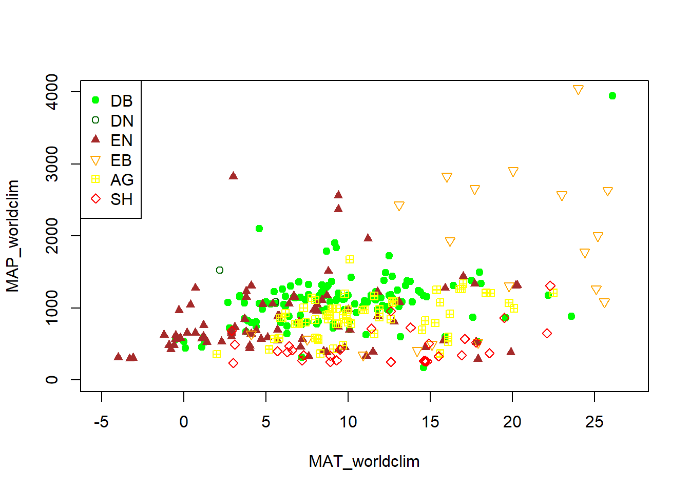


### Filtering using attributes

Alternatively, we may want to only include Phenocams with certain attributes in
our datasets. For example, we may be interested only in sites with a co-located
flux tower. For this, we'd want to filter for those with a flux tower using the
`flux_sitenames` attribute in the metadata.


```r
# store sites with flux_data available and the FLUX site name is specified
phenofluxsites <- phenos[flux_data==TRUE&!is.na(flux_sitenames)&flux_sitenames!='',
                         .(PhenoCam=site, Flux=flux_sitenames)] # return as table
#and specify which variables to retain

phenofluxsites <- phenofluxsites[Flux!='']

# see the first few rows
head(phenofluxsites)
```

```
##            PhenoCam                               Flux
## 1:     admixpasture                             NZ-ADw
## 2:   alligatorriver                             US-NC4
## 3: arkansaswhitaker                             US-RGW
## 4:      arsbrooks10 US-Br1: Brooks Field Site 10- Ames
## 5:      arsbrooks11 US-Br3: Brooks Field Site 11- Ames
## 6:    arscolesnorth                               LTAR
```

We could further identify which of those Phenocams with a flux tower and in
deciduous broadleaf forests (`primary_veg_type=='DB'`).


```r
#list deciduous broadleaf sites with flux tower
DB.flux <- phenos[flux_data==TRUE&primary_veg_type=='DB',
                  site]  # return just the site names as a list

# see the first few rows
head(DB.flux)
```

```
## [1] "alligatorriver" "bartlett"       "bartlettir"     "bbc1"          
## [5] "bbc2"           "bbc3"
```


## Download midday images

While PhenoCam sites may have many images in a given day, many simple analyses
can use just the midday image when the sun is most directly overhead the canopy.
Therefore, extracting a list of midday images (only one image a day) can be useful.


```r
# obtaining midday_images for dukehw
duke_middays <- get_midday_list('dukehw')

# see the first few rows
head(duke_middays)
```

```
## [1] "http://phenocam.nau.edu/data/archive/dukehw/2013/05/dukehw_2013_05_31_150331.jpg"
## [2] "http://phenocam.nau.edu/data/archive/dukehw/2013/06/dukehw_2013_06_01_120111.jpg"
## [3] "http://phenocam.nau.edu/data/archive/dukehw/2013/06/dukehw_2013_06_02_120109.jpg"
## [4] "http://phenocam.nau.edu/data/archive/dukehw/2013/06/dukehw_2013_06_03_120110.jpg"
## [5] "http://phenocam.nau.edu/data/archive/dukehw/2013/06/dukehw_2013_06_04_120119.jpg"
## [6] "http://phenocam.nau.edu/data/archive/dukehw/2013/06/dukehw_2013_06_05_120110.jpg"
```

Now we have a list of all the midday images from this Phenocam. Let's download
them and plot


```r
# download a file
destfile <- tempfile(fileext = '.jpg')

# download only the first available file
# modify the `[1]` to download other images
download.file(duke_middays[1], destfile = destfile, mode = 'wb')

# plot the image
img <- try(readJPEG(destfile))
if(class(img)!='try-error'){
  par(mar= c(0,0,0,0))
  plot(0:1,0:1, type='n', axes= FALSE, xlab= '', ylab = '')
  rasterImage(img, 0, 0, 1, 1)
}
```

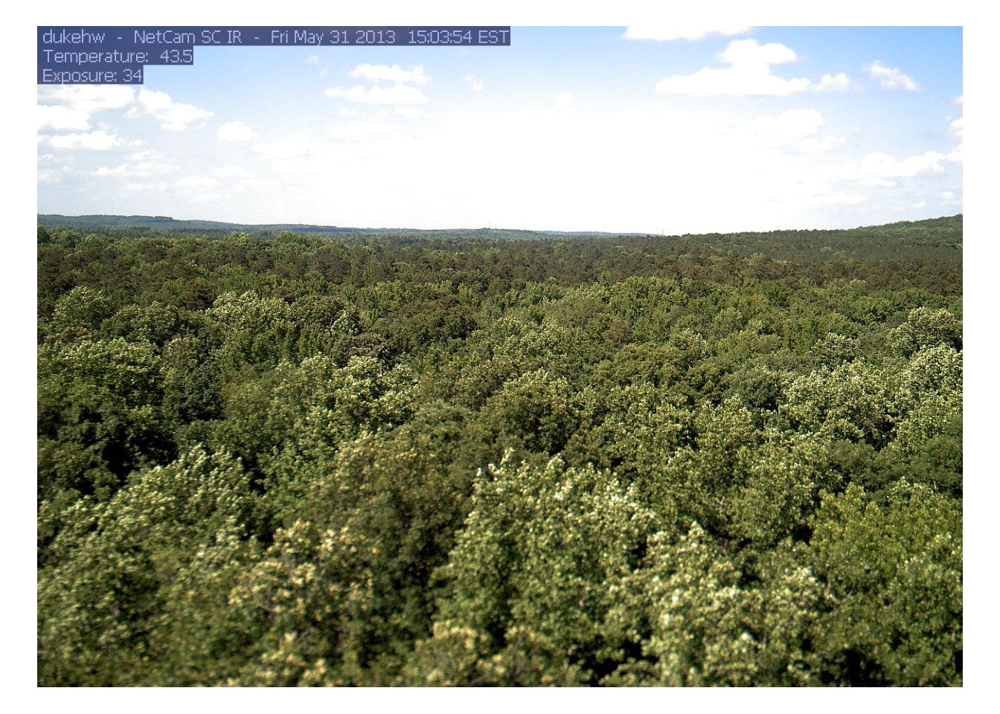


### Download midday images for a given time range

Now we can access all the midday images and download them one at a time. However,
we frequently want all the images within a specific time range of interest. We'll
learn how to do that next.


```r
# open a temporary directory
tmp_dir <- tempdir()

# download a subset. Example dukehw 2017
download_midday_images(site = 'dukehw', # which site
                       y = 2017, # which year(s)
                       months = 1:12, # which month(s)
                       days = 15, # which days on month(s)
                       download_dir = tmp_dir) # where on your computer
```

```
## 
  |                                                                            
  |                                                                      |   0%
  |                                                                            
  |======                                                                |   8%
  |                                                                            
  |============                                                          |  17%
  |                                                                            
  |==================                                                    |  25%
  |                                                                            
  |=======================                                               |  33%
  |                                                                            
  |=============================                                         |  42%
  |                                                                            
  |===================================                                   |  50%
  |                                                                            
  |=========================================                             |  58%
  |                                                                            
  |===============================================                       |  67%
  |                                                                            
  |====================================================                  |  75%
  |                                                                            
  |==========================================================            |  83%
  |                                                                            
  |================================================================      |  92%
  |                                                                            
  |======================================================================| 100%
```

```
## [1] "C:\\Users\\rohan\\AppData\\Local\\Temp\\Rtmp2Xnitu"
```

```r
# list of downloaded files
duke_middays_path <- dir(tmp_dir, pattern = 'dukehw*', full.names = TRUE)

head(duke_middays_path)
```

```
## [1] "C:\\Users\\rohan\\AppData\\Local\\Temp\\Rtmp2Xnitu/dukehw_2017_01_15_120109.jpg"
## [2] "C:\\Users\\rohan\\AppData\\Local\\Temp\\Rtmp2Xnitu/dukehw_2017_02_15_120108.jpg"
## [3] "C:\\Users\\rohan\\AppData\\Local\\Temp\\Rtmp2Xnitu/dukehw_2017_03_15_120151.jpg"
## [4] "C:\\Users\\rohan\\AppData\\Local\\Temp\\Rtmp2Xnitu/dukehw_2017_04_15_120110.jpg"
## [5] "C:\\Users\\rohan\\AppData\\Local\\Temp\\Rtmp2Xnitu/dukehw_2017_05_15_120108.jpg"
## [6] "C:\\Users\\rohan\\AppData\\Local\\Temp\\Rtmp2Xnitu/dukehw_2017_06_15_120120.jpg"
```

We can demonstrate the seasonality of Duke forest observed from the camera. (Note
this code may take a while to run through the loop).


```r
n <- length(duke_middays_path)
par(mar= c(0,0,0,0), mfrow=c(4,3), oma=c(0,0,3,0))

for(i in 1:n){
  img <- readJPEG(duke_middays_path[i])
  plot(0:1,0:1, type='n', axes= FALSE, xlab= '', ylab = '')
  rasterImage(img, 0, 0, 1, 1)
  mtext(month.name[i], line = -2)
}
mtext('Seasonal variation of forest at Duke Hardwood Forest', font = 2, outer = TRUE)
```

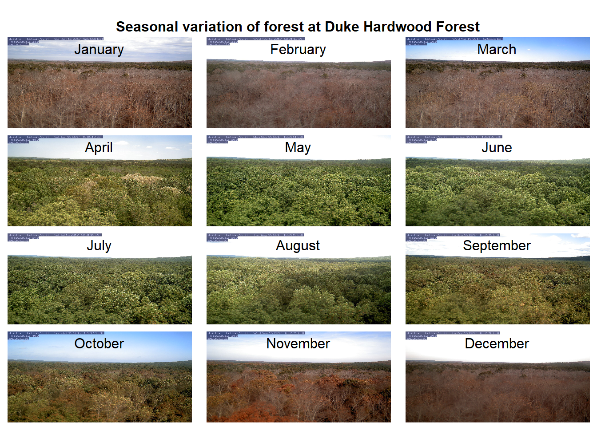


The goal of this section was to show how to download a limited number of midday images from the PhenoCam server. However, more extensive datasets should be downloaded from the <a href="https://phenocam.sr.unh.edu/webcam/network/download/"> PhenoCam </a>.


The *phenocamapi* R package is developed and maintained by
<a href="https://bnasr.github.io/">Bijan Seyednarollah</a>.
The most recent release is available from
<a href="https://github.com/bnasr/phenocamapi" target="_blank">https://github.com/bnasr/phenocamapi</a>.

## Detecting Foggy Images using the 'hazer' R Package

#### Read & Plot an Image

We will use several packages in this tutorial. All are available from CRAN.


```r
# load packages
library(hazer)
library(jpeg)
library(data.table)
library(dplyr)
```

```
## 
## Attaching package: 'dplyr'
```

```
## The following objects are masked from 'package:data.table':
## 
##     between, first, last
```

```
## The following objects are masked from 'package:stats':
## 
##     filter, lag
```

```
## The following objects are masked from 'package:base':
## 
##     intersect, setdiff, setequal, union
```


Before we start the image processing steps, let's read in and plot an image. This
image is an example image that comes with the *hazer* package.


```r
# read the path to the example image
jpeg_file <- system.file(package = 'hazer', 'pointreyes.jpg')

# read the image as an array
rgb_array <- jpeg::readJPEG(jpeg_file)

# plot the RGB array on the active device panel


# first set the margin in this order:(bottom, left, top, right)
par(mar=c(0,0,3,0))  
plotRGBArray(rgb_array, bty = 'n', main = 'Point Reyes National Seashore')
```

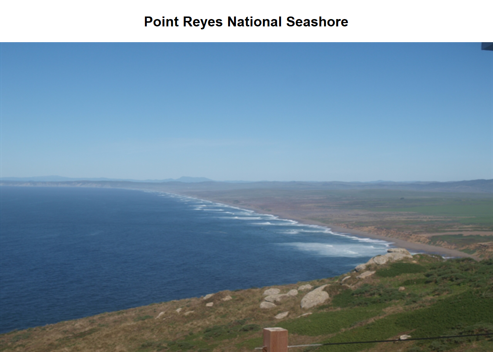


When we work with images, all data we work with is generally on the scale of each
individual pixel in the image. Therefore, for large images we will be working with
large matrices that hold the value for each pixel. Keep this in mind before opening
some of the matrices we'll be creating this tutorial as it can take a while for
them to load.

#### Histogram of RGB channels

A histogram of the colors can be useful to understanding what our image is made
up of. Using the `density()` function from the base *stats* package, we can extract
density distribution of each color channel.


```r
# color channels can be extracted from the matrix
red_vector <- rgb_array[,,1]
green_vector <- rgb_array[,,2]
blue_vector <- rgb_array[,,3]

# plotting
par(mar=c(5,4,4,2))
plot(density(red_vector), col = 'red', lwd = 2,
     main = 'Density function of the RGB channels', ylim = c(0,5))
lines(density(green_vector), col = 'green', lwd = 2)
lines(density(blue_vector), col = 'blue', lwd = 2)
```

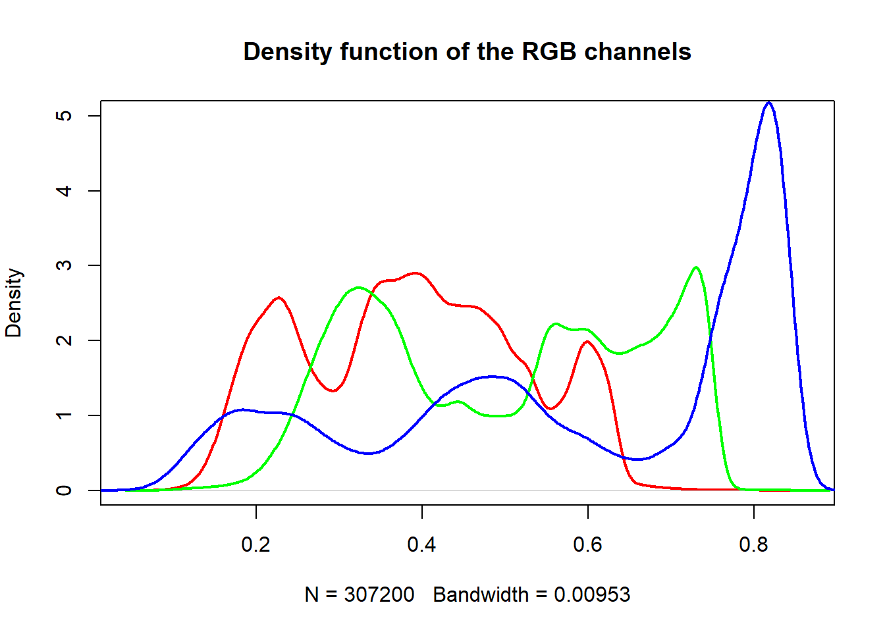


In *hazer* we can also extract three basic elements of an RGB image :

1. Brightness
2. Darkness
3. Contrast

#### Brightness

The brightness matrix comes from the maximum value of the R, G, or B channel. We
can extract and show the brightness matrix using the `getBrightness()` function.


```r
# extracting the brightness matrix
brightness_mat <- getBrightness(rgb_array)

# unlike the RGB array which has 3 dimensions, the brightness matrix has only two
# dimensions and can be shown as a grayscale image,
# we can do this using the same plotRGBArray function
par(mar=c(0,0,3,0))
plotRGBArray(brightness_mat, bty = 'n', main = 'Brightness matrix')
```

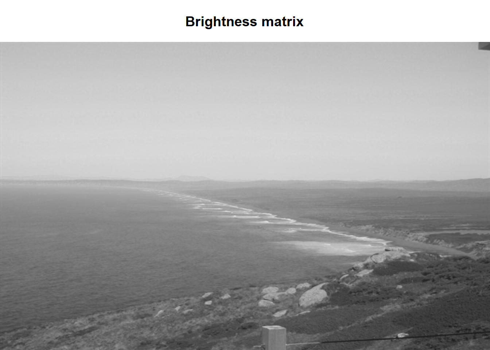


Here the grayscale is used to show the value of each pixel's maximum brightness
of the R, G or B color channel.

To extract a single brightness value for the image, depending on our needs we can
perform some statistics or we can just use the mean of this matrix.


```r
# the main quantiles
quantile(brightness_mat)
```

```
##         0%        25%        50%        75%       100% 
## 0.09019608 0.43529412 0.62745098 0.80000000 0.91764706
```


```r
# create histogram
par(mar=c(5,4,4,2))
hist(brightness_mat)
```

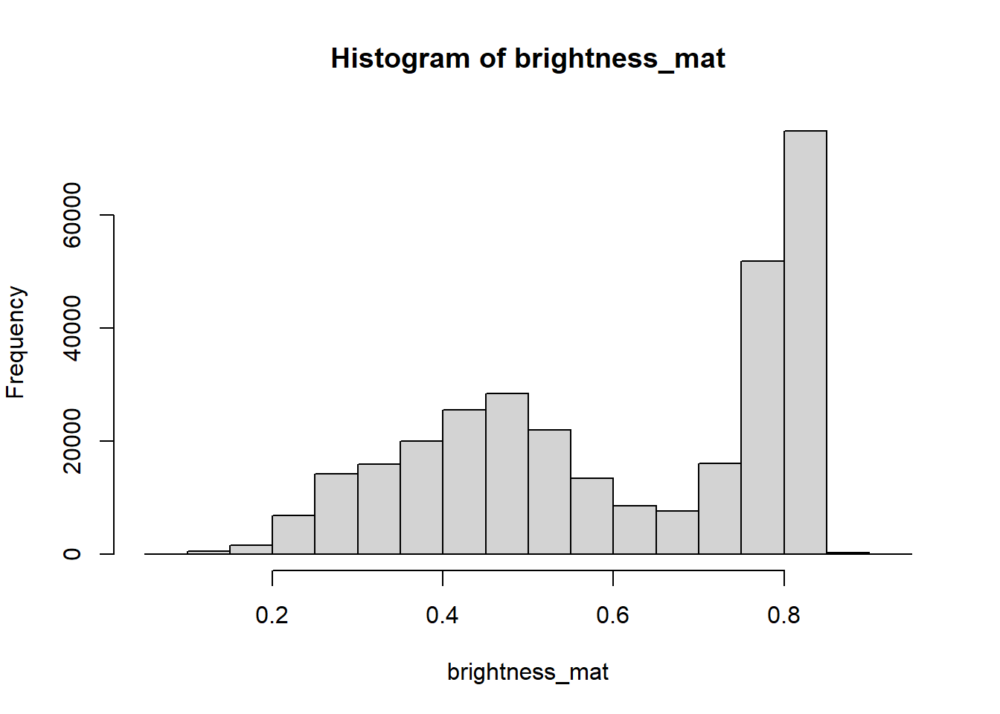


**Question for the class:** Why are we getting so many images up in the high range of the brightness? Where
does this correlate to on the RGB image?

#### Darkness

Darkness is determined by the minimum of the R, G or B color channel. In the
Similarly, we can extract and show the darkness matrix using the `getDarkness()` function.


```r
# extracting the darkness matrix
darkness_mat <- getDarkness(rgb_array)

# the darkness matrix has also two dimensions and can be shown as a grayscale image
par(mar=c(0,0,3,0))
plotRGBArray(darkness_mat, bty = 'n', main = 'Darkness matrix')
```

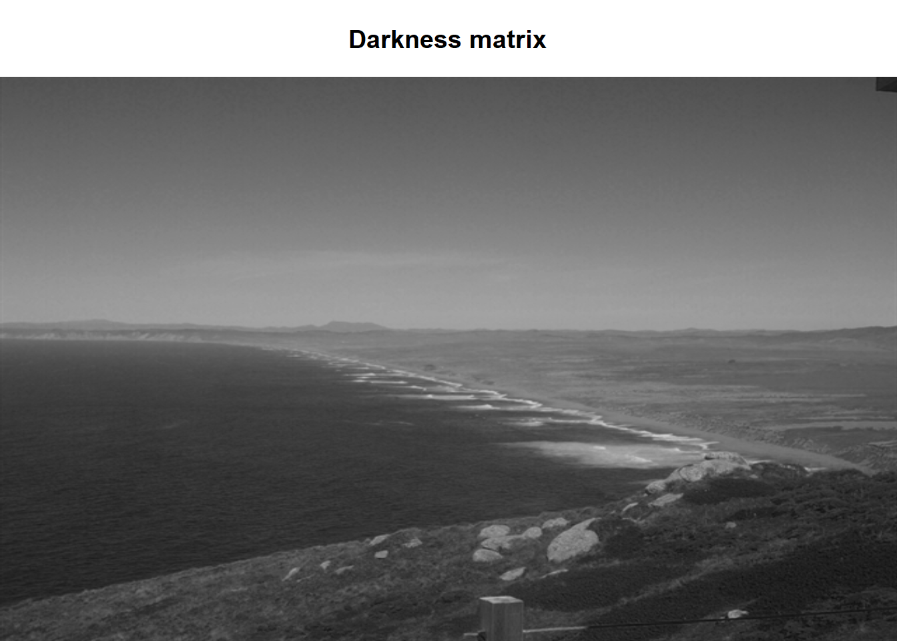

```r
# main quantiles
quantile(darkness_mat)
```

```
##         0%        25%        50%        75%       100% 
## 0.03529412 0.23137255 0.36470588 0.47843137 0.83529412
```


```r
# histogram
par(mar=c(5,4,4,2))
hist(darkness_mat)
```

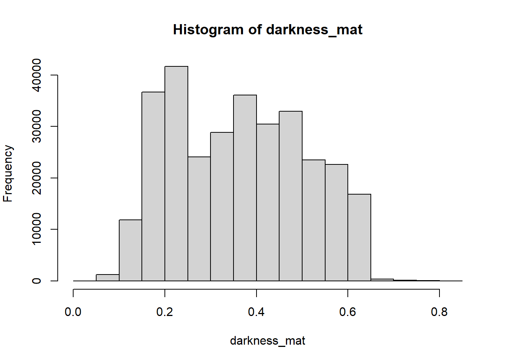


#### Contrast

The contrast of an image is the difference between the darkness and brightness
of the image. The contrast matrix is calculated by difference between the
darkness and brightness matrices.

The contrast of the image can quickly be extracted using the `getContrast()` function.


```r
# extracting the contrast matrix
contrast_mat <- getContrast(rgb_array)

# the contrast matrix has also 2D and can be shown as a grayscale image
par(mar=c(0,0,3,0))
plotRGBArray(contrast_mat, bty = 'n', main = 'Contrast matrix')
```

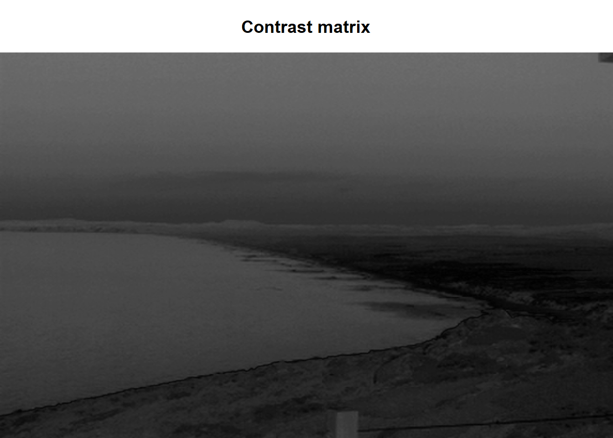

```r
# main quantiles
quantile(contrast_mat)
```

```
##        0%       25%       50%       75%      100% 
## 0.0000000 0.1450980 0.2470588 0.3333333 0.4509804
```


```r
# histogram
par(mar=c(5,4,4,2))
hist(contrast_mat)
```

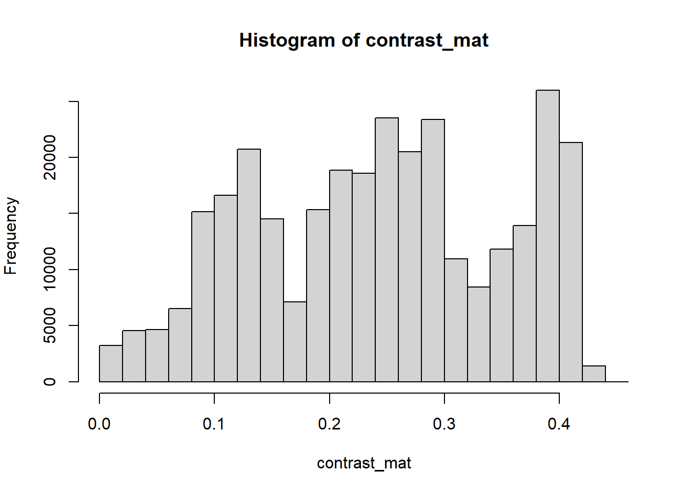


#### Image fogginess & haziness

Haziness of an image can be estimated using the `getHazeFactor()` function. This
function is based on the method described in
<a href="https://www.omicsonline.org/open-access/detecting-foggy-images-and-estimating-the-haze-degree-factor-jcsb.1000226.pdf">Mao et al. (2014)</a>.
The technique was originally developed to for *"detecting foggy images and
estimating the haze degree factor"* for a wide range of outdoor conditions.

The function returns a vector of two numeric values:

1.  **haze** as the haze degree and
2.  **A0** as the global atmospheric light, as it is explained in the original paper.

The PhenoCam standards classify any image with the haze degree greater
than 0.4 as a significantly foggy image.


```r
# extracting the haze matrix
haze_degree <- getHazeFactor(rgb_array)

print(haze_degree)
```

```
## $haze
## [1] 0.2251633
## 
## $A0
## [1] 0.7105258
```


Here we have the haze values for our image. Note that the values might be
slightly different due to rounding errors on different platforms.

#### Process sets of images

We can use `for` loops or the `lapply` functions to extract the haze values for
a stack of images.

You can download the related datasets from
<a href="http://bit.ly/2F8w2Ia">here (direct download)</a>.
Download and extract the zip file to be used as input data for the following step.


```r
#pointreyes_url <- 'http://bit.ly/2F8w2Ia'

# set up the input image directory
data_dir <- 'data/'
#dir.create(data_dir, showWarnings = F)

#pointreyes_zip <- paste0(data_dir, 'pointreyes.zip')
pointreyes_dir <- paste0(data_dir, 'pointreyes')

#download zip file
#download.file(pointreyes_url, destfile = pointreyes_zip)
#unzip(pointreyes_zip, exdir = data_dir)

# get a list of all .jpg files in the directory
pointreyes_images <- dir(path = 'data/pointreyes',
                         pattern = '*.jpg',
                         ignore.case = TRUE,
                         full.names = TRUE)
```


Now we can use a for loop to process all of the images to get the haze and A0
values.


```r
# number of images
n <- length(pointreyes_images)

# create an empty matrix to fill with haze and A0 values
haze_mat <- data.frame()

# the process takes a bit, a progress bar lets us know it is working.
pb <- txtProgressBar(0, n, style = 3)
```

```
## 
  |                                                                            
  |                                                                      |   0%
```


```r
for(i in 1:n) {
  image_path <- pointreyes_images[i]
  img <- jpeg::readJPEG(image_path)
  hz <- getHazeFactor(img)

  haze_mat <- rbind(haze_mat,
                    data.frame(file = as.character(image_path),
                               haze = hz[1],
                               A0 = hz[2]))

  setTxtProgressBar(pb, i)
}
```

```
## 
  |                                                                            
  |=                                                                     |   1%
  |                                                                            
  |==                                                                    |   3%
  |                                                                            
  |===                                                                   |   4%
  |                                                                            
  |====                                                                  |   6%
  |                                                                            
  |=====                                                                 |   7%
  |                                                                            
  |======                                                                |   8%
  |                                                                            
  |=======                                                               |  10%
  |                                                                            
  |========                                                              |  11%
  |                                                                            
  |=========                                                             |  13%
  |                                                                            
  |==========                                                            |  14%
  |                                                                            
  |===========                                                           |  15%
  |                                                                            
  |============                                                          |  17%
  |                                                                            
  |=============                                                         |  18%
  |                                                                            
  |==============                                                        |  20%
  |                                                                            
  |===============                                                       |  21%
  |                                                                            
  |================                                                      |  23%
  |                                                                            
  |=================                                                     |  24%
  |                                                                            
  |==================                                                    |  25%
  |                                                                            
  |===================                                                   |  27%
  |                                                                            
  |====================                                                  |  28%
  |                                                                            
  |=====================                                                 |  30%
  |                                                                            
  |======================                                                |  31%
  |                                                                            
  |=======================                                               |  32%
  |                                                                            
  |========================                                              |  34%
  |                                                                            
  |=========================                                             |  35%
  |                                                                            
  |==========================                                            |  37%
  |                                                                            
  |===========================                                           |  38%
  |                                                                            
  |============================                                          |  39%
  |                                                                            
  |=============================                                         |  41%
  |                                                                            
  |==============================                                        |  42%
  |                                                                            
  |===============================                                       |  44%
  |                                                                            
  |================================                                      |  45%
  |                                                                            
  |=================================                                     |  46%
  |                                                                            
  |==================================                                    |  48%
  |                                                                            
  |===================================                                   |  49%
  |                                                                            
  |===================================                                   |  51%
  |                                                                            
  |====================================                                  |  52%
  |                                                                            
  |=====================================                                 |  54%
  |                                                                            
  |======================================                                |  55%
  |                                                                            
  |=======================================                               |  56%
  |                                                                            
  |========================================                              |  58%
  |                                                                            
  |=========================================                             |  59%
  |                                                                            
  |==========================================                            |  61%
  |                                                                            
  |===========================================                           |  62%
  |                                                                            
  |============================================                          |  63%
  |                                                                            
  |=============================================                         |  65%
  |                                                                            
  |==============================================                        |  66%
  |                                                                            
  |===============================================                       |  68%
  |                                                                            
  |================================================                      |  69%
  |                                                                            
  |=================================================                     |  70%
  |                                                                            
  |==================================================                    |  72%
  |                                                                            
  |===================================================                   |  73%
  |                                                                            
  |====================================================                  |  75%
  |                                                                            
  |=====================================================                 |  76%
  |                                                                            
  |======================================================                |  77%
  |                                                                            
  |=======================================================               |  79%
  |                                                                            
  |========================================================              |  80%
  |                                                                            
  |=========================================================             |  82%
  |                                                                            
  |==========================================================            |  83%
  |                                                                            
  |===========================================================           |  85%
  |                                                                            
  |============================================================          |  86%
  |                                                                            
  |=============================================================         |  87%
  |                                                                            
  |==============================================================        |  89%
  |                                                                            
  |===============================================================       |  90%
  |                                                                            
  |================================================================      |  92%
  |                                                                            
  |=================================================================     |  93%
  |                                                                            
  |==================================================================    |  94%
  |                                                                            
  |===================================================================   |  96%
  |                                                                            
  |====================================================================  |  97%
  |                                                                            
  |===================================================================== |  99%
  |                                                                            
  |======================================================================| 100%
```


Now we have a matrix with haze and A0 values for all our images. Let's
compare top three images with low and high haze values.


```r
top10_high_haze <- haze_mat %>%
  dplyr::arrange(desc(haze)) %>%
  slice(1:3)
top10_low_haze <-  haze_mat %>%
  arrange(haze)%>%
  slice(1:3)


par(mar= c(0,0,0,0), mfrow=c(3,2), oma=c(0,0,3,0))

for(i in 1:3){
  img <- readJPEG(as.character(top10_low_haze$file[i]))
  plot.new()
  rasterImage(img, par()$usr[1], par()$usr[3], par()$usr[2], par()$usr[4])

  img <- readJPEG(as.character(top10_high_haze$file[i]))
  plot.new()
  rasterImage(img, par()$usr[1], par()$usr[3], par()$usr[2], par()$usr[4])

}
mtext('Top images with low (left) and high (right) haze values at Point Reyes', font = 2, outer = TRUE)
```

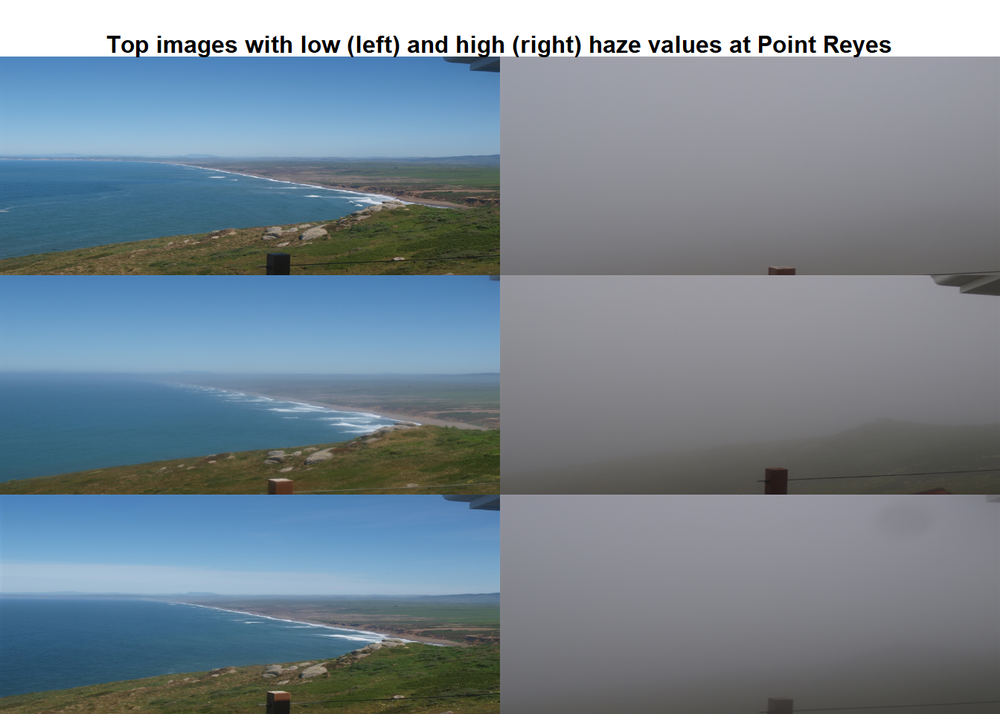


Let's classify those into hazy and non-hazy as per the PhenoCam standard of 0.4.


```r
# classify image as hazy: T/F
haze_mat=haze_mat%>%
  mutate(haze_mat, foggy=ifelse(haze>.4, TRUE, FALSE))

head(haze_mat)
```

```
##                                               file      haze        A0 foggy
## 1 data/pointreyes/pointreyes_2017_01_01_120056.jpg 0.2249810 0.6970257 FALSE
## 2 data/pointreyes/pointreyes_2017_01_06_120210.jpg 0.2339372 0.6826148 FALSE
## 3 data/pointreyes/pointreyes_2017_01_16_120105.jpg 0.2312940 0.7009978 FALSE
## 4 data/pointreyes/pointreyes_2017_01_21_120105.jpg 0.4536108 0.6209055  TRUE
## 5 data/pointreyes/pointreyes_2017_01_26_120106.jpg 0.2297961 0.6813884 FALSE
## 6 data/pointreyes/pointreyes_2017_01_31_120125.jpg 0.4206842 0.6315728  TRUE
```


Now we can save all the foggy images to a new folder that will retain the
foggy images but keep them separate from the non-foggy ones that we want to
analyze.


```r
# identify directory to move the foggy images to
foggy_dir <- paste0(pointreyes_dir, 'foggy')
clear_dir <- paste0(pointreyes_dir, 'clear')

# if a new directory, create new directory at this file path
dir.create(foggy_dir,  showWarnings = FALSE)
dir.create(clear_dir,  showWarnings = FALSE)

# copy the files to the new directories
#file.copy(haze_mat[foggy==TRUE,file], to = foggy_dir)

#file.copy(haze_mat[foggy==FALSE,file], to = clear_dir)
```

Now that we have our images separated, we can get the full list of haze
values only for those images that are not classified as "foggy".  


```r
# this is an alternative approach instead of a for loop

# loading all the images as a list of arrays
pointreyes_clear_images <- dir(path = clear_dir,
                               pattern = '*.jpg',
                               ignore.case = TRUE,
                               full.names = TRUE)

img_list <- lapply(pointreyes_clear_images, FUN = jpeg::readJPEG)

# getting the haze value for the list
# patience - this takes a bit of time
haze_list <- t(sapply(img_list, FUN = getHazeFactor))

# view first few entries
head(haze_list)
```

```
##      haze      A0       
## [1,] 0.224981  0.6970257
## [2,] 0.2339372 0.6826148
## [3,] 0.231294  0.7009978
## [4,] 0.2297961 0.6813884
## [5,] 0.2152078 0.6949932
## [6,] 0.345584  0.6789334
```


We can then use these values for further analyses and data correction.


***

The *hazer* R package is developed and maintained by
<a href="https://bnasr.github.io/">Bijan Seyednarollah</a>.
The most recent release is available from
<a href="https://github.com/bnasr/hazer" target="_blank">https://github.com/bnasr/hazer</a>.


## Extracting Timeseries from Images using the xROI R Package

In this section, we'll learn how to use an interactive open-source toolkit, the
<a href="https://cran.r-project.org/web/packages/xROI/index.html" target="_blank">xROI R package</a>
that facilitates the process of time series extraction and improves the quality
of the final data. The xROI package provides a responsive environment for
scientists to interactively:

a) delineate regions of interest (ROIs),
b) handle field of view (FOV) shifts, and
c) extract and export time series data characterizing color-based metrics.

Using the *xROI* R package, the user can detect FOV shifts with minimal difficulty.
The software gives user the opportunity to re-adjust mask files or redraw new
ones every time an FOV shift occurs.


### xROI Design


The R language and Shiny package were used as the main development tool for xROI,
while Markdown, HTML, CSS and JavaScript languages were used to improve the
interactivity. While Shiny apps are primarily used for web-based applications to
be used online, the package authors used Shiny for its graphical user interface
capabilities. In other words, both the User Interface (UI) and server modules are run
locally from the same machine and hence no internet connection is required (after
installation). The xROI's UI element presents a side-panel for data entry and
three main tab-pages, each responsible for a specific task. The server-side
element consists of R and bash scripts. Image processing and geospatial features
were performed using the `Geospatial Data Abstraction Library (GDAL)` and the
`rgdal` and `raster` R packages.

### Install xROI

The xROI R package has been published on The Comprehensive R Archive Network (CRAN).
The latest tested xROI package can be installed from the
<a href="https://cran.r-project.org/package=xROI" target="_blank">CRAN packages repository</a> by running the following command in an R environment.


```r
utils::install.packages('xROI', repos = "http://cran.us.r-project.org" )
```

Alternatively, the latest beta release of xROI can be directly downloaded and
installed from the development GitHub repository.


```r
# install devtools first
utils::install.packages('devtools', repos = "http://cran.us.r-project.org" )

# use devtools to install from GitHub
devtools::install_github("bnasr/xROI")
```

xROI depends on many R packages including: `raster`, `rgdal`, `sp`, `jpeg`,
`tiff`, `shiny`, `shinyjs`, `shinyBS`, `shinyAce`, `shinyTime`, `shinyFiles`,
`shinydashboard`, `shinythemes`, `colourpicker`, `rjson`, `stringr`, `data.table`,
`lubridate`, `plotly`, `moments`, and `RCurl`. All the required libraries and
packages will be automatically installed with installation of *xROI*. The package
offers a fully interactive high-level interface as well as a set of low-level
functions for ROI processing.

### Launch xROI

A comprehensive user manual for low-level image processing using *xROI* is available from
<a href="https://cran.r-project.org/package=xROI/xROI.pdf" target="_blank">CRAN xROI.pdf</a>.
While the user manual includes a set of examples for each function; here we
will learn to use the graphical interactive mode.

Calling the `Launch()` function, as we'll do below, opens up the interactive
mode in your operating system’s default web browser. The landing page offers an
example dataset to explore different modules or upload a new dataset of images.

You can launch the interactive mode can be launched from an interactive R environment.


```r
# load xROI
library(xROI)

# launch xROI
Launch()
```

Or from the command line (e.g. bash in Linux, Terminal in macOS and Command
Prompt in Windows machines) where an R engine is already installed.


```bash

Rscript -e “xROI::Launch(Interactive = TRUE)”

```


### End xROI

When you are done with the xROI interface you can close the tab in your browser
and end the session in R by using one of the following options

**In RStudio:** Press the <Esc> key on your keyboard.
**In R Terminal:** Press <Ctrl + C> on your keyboard.

### Use xROI

To get some hands-on experience with `xROI`, we can analyze images from the
<a href="https://phenocam.sr.unh.edu/webcam/sites/dukehw/">dukehw</a>
of the PhenoCam network.

You can download the data set from
<a href="http://bit.ly/2PzZ2fL">this link (direct download)</a>.

Follow the steps below:

First,save and extract (unzip) the file on your computer.

Second, open the data set in `xROI` by setting the file path to your data


```r
# launch data in ROI
# first edit the path below to the dowloaded directory you just extracted
xROI::Launch('/path/to/extracted/directory')

# alternatively, you can run without specifying a path and use the interface to browse
```

Now, draw an ROI and the metadata.

Then, save the metadata and explore its content.

Now we can explore if there is any FOV shift in the dataset using the `CLI processer` tab.

Finally, we can go to the `Time series extraction` tab. Extract the time-series. Save the output and explore the dataset in R.


## Documentation and Citation

More documentation about **xROI** can be found from: <a href="https://bnasr.github.io/papers/Seyednasrollah_et_al_2019_PRS.pdf">Seyednarollah, et al. 2019</a>.


```r
knitr::include_graphics('docs/images/xROI-ms2019.png')
```


>xROI published in ISPRS Journal of Photogrammetry and Remote Sensing, 2019

### Challenge: Use xROI

Let's use xROI on a little more challenging site with field of view shifts.

Download and extract the data set from
<a href="http://bit.ly/2DrZgA1">this link (direct download, 218 MB)</a>
and follow the above steps to extract the time-series.


The *xROI* R package is developed and maintained by
<a href="https://bnasr.github.io/">Bijan Seyednarollah</a>.
The most recent release is available from <a href="https://github.com/bnasr/xROI" target="_blank">https://github.com/bnasr/xROI</a>.


## Hands on: Digital Repeat Photography Computational
First let's load some packages:


```r
library(jsonlite)
```

```
## 
## Attaching package: 'jsonlite'
```

```
## The following objects are masked from 'package:rjson':
## 
##     fromJSON, toJSON
```

```r
library(phenocamapi)
library(plotly)
```

```
## Loading required package: ggplot2
```

```
## 
## Attaching package: 'plotly'
```

```
## The following object is masked from 'package:ggplot2':
## 
##     last_plot
```

```
## The following object is masked from 'package:stats':
## 
##     filter
```

```
## The following object is masked from 'package:graphics':
## 
##     layout
```

```r
library(phenocamr)
library(dplyr)
```

As a refresher, there are two main ways to pull in PhenoCam data.  First, directly via the API:


```r
c      = jsonlite::fromJSON('https://phenocam.sr.unh.edu/api/cameras/?format=json&limit=2000')
c = c$results
c_m=c$sitemetadata
c$sitemetadata=NULL
cams_=cbind(c, c_m)
cams_[is.na(cams_)] = 'N'
cams_[, 2:4] <- sapply(cams_[, 2:4], as.numeric) #changing lat/lon/elev from string values into numeric
head(cams_)
```

```
##             Sitename       Lat       Lon Elev active utc_offset date_first
## 1 aafcottawacfiaf14e  45.29210 -75.76640   90   TRUE         -5 2020-04-27
## 2 aafcottawacfiaf14n  45.29290 -75.76700   90   TRUE         -5 2021-09-03
## 3 aafcottawacfiaf14w  45.29210 -75.76640   90   TRUE         -5 2020-05-01
## 4             acadia  44.37694 -68.26083  158  FALSE         -5 2007-03-15
## 5       admixpasture -43.64930 172.34950   33   TRUE         12 2021-03-04
## 6       adrycpasture -43.65130 172.35010   31   TRUE         12 2021-03-02
##    date_last infrared
## 1 2022-10-03        N
## 2 2022-10-03        Y
## 3 2022-10-03        N
## 4 2022-01-07        N
## 5 2022-09-08        Y
## 6 2022-09-08        Y
##                                                       contact1
## 1     Elizabeth Pattey <elizabeth DOT pattey AT canada DOT ca>
## 2 Elizabeth Pattey <elizabeth DOT pattey AT agr DOT gc DOT ca>
## 3     Elizabeth Pattey <elizabeth DOT pattey AT canada DOT ca>
## 4                         Dee Morse <dee_morse AT nps DOT gov>
## 5          John Hunt <huntj AT landcareresearch DOT co DOT nz>
## 6          John Hunt <huntj AT landcareresearch DOT co DOT nz>
##                                                   contact2
## 1      Luc Pelletier <luc DOT pelletier3 AT canada DOT ca>
## 2  Luc Pelletier <luc DOT pelletier3 AT agr DOT gc DOT ca>
## 3      Luc Pelletier <luc DOT pelletier3 AT canada DOT ca>
## 4                   John Gross <John_Gross AT nps DOT gov>
## 5 Scott Graham <grahams AT landcareresearch DOT co DOT nz>
## 6 Scott Graham <grahams AT landcareresearch DOT co DOT nz>
##                                                                                                           site_description
## 1                                                             AAFC Site - Ottawa (On) - CFIA - Field F14 - East Flux Tower
## 2                                                               AAFC Site - Ottawa (On) - CFIA - Field F14 - North Section
## 3                                                             AAFC Site - Ottawa (On) - CFIA - Field F14 - West Flux Tower
## 4                                                             Acadia National Park, McFarland Hill, near Bar Harbor, Maine
## 5 Eddy site, mixed species irrigated dairy pasture,  Ashley Dene Research & Development Station, South Island, New Zealand
## 6           Ryegrass-clover irrigated dairy pasture, Ashley Dene Research & Development Station, South Island, New Zealand
##   site_type                 group       camera_description camera_orientation
## 1        II                     N Campbell Scientific CCFC                 NE
## 2         I                     N        StarDot NetCam SC                NNW
## 3        II                     N Campbell Scientific CCFC                WNW
## 4       III National Park Service                  unknown                 NE
## 5         I                     N        StarDot NetCam SC                   
## 6         I                     N         StarDot NetCamSC                   
##   flux_data               flux_networks flux_sitenames
## 1      TRUE                        NULL              N
## 2      TRUE                        NULL               
## 3      TRUE OTHER, , Other/Unaffiliated              N
## 4     FALSE                        NULL               
## 5      TRUE                        NULL         NZ-ADw
## 6      TRUE                        NULL               
##                                                                                dominant_species
## 1                                      Zea mays, Triticum aestivum, Brassica napus, Glycine max
## 2                                      Zea mays, Triticum aestivum, Brassica napus, Glycine max
## 3                                      Zea mays, Triticum aestivum, Brassica napus, Glycine max
## 4                                                                                              
## 5 Lolium perenne, Lolium multiflorum, Trifolium pratense, Trifolium repens, Plantago lanceolata
## 6                                                              Lolium perenne, Trifolium repens
##   primary_veg_type secondary_veg_type site_meteorology MAT_site MAP_site
## 1               AG                 AG             TRUE      6.4      943
## 2               AG                 AG             TRUE      6.4      943
## 3               AG                 AG             TRUE      6.4      943
## 4               DB                 EN            FALSE        N        N
## 5               AG                                TRUE        N        N
## 6               AG                                TRUE        N        N
##   MAT_daymet MAP_daymet MAT_worldclim MAP_worldclim koeppen_geiger ecoregion
## 1        6.3        952             6           863            Dfb         8
## 2        6.3        953           5.9           863            Dfb         8
## 3        6.3        952             6           863            Dfb         8
## 4       7.05       1439           6.5          1303            Dfb         8
## 5          N          N          11.6           640            Cfb         N
## 6          N          N          11.6           639            Cfb         N
##   landcover_igbp
## 1             12
## 2             12
## 3             12
## 4              5
## 5              N
## 6              N
##                                                                                                                                                                                                                                                                                                                         site_acknowledgements
## 1  Camera funded by Agriculture and Agri-Food Canada (AAFC) Project J-001735 - Commercial inhibitors’ impact on crop productivity and emissions of nitrous oxide led by Dr. Elizabeth Pattey; Support provided by Drs, Luc Pelletier and Elizabeth  Pattey, Micrometeorologiccal Laboratory of AAFC - Ottawa Research and Development Centre.
## 2 Cameras funded by Agriculture and Agri-Food Canada (AAFC) Project J-001735 - Commercial inhibitors’ impact on crop productivity and emissions of nitrous oxide led by Dr. Elizabeth Pattey; Support provided by Drs, Luc Pelletier and Elizabeth  Pattey, Micrometeorologiccal Laboratory of AAFC - Ottawa Research and Development Centre.
## 3 Cameras funded by Agriculture and Agri-Food Canada (AAFC) Project J-001735 - Commercial inhibitors’ impact on crop productivity and emissions of nitrous oxide led by Dr. Elizabeth Pattey; Support provided by Drs, Luc Pelletier and Elizabeth  Pattey, Micrometeorologiccal Laboratory of AAFC - Ottawa Research and Development Centre.
## 4                                                                                                                                                                                                                           Camera images from Acadia National Park are provided courtesy of the National Park Service Air Resources Program.
## 5                                                                                                                                                                                                                    Ministry of Business, Innovation and Employment; New Zealand Agricultural Greenhouse Gas Research Centre; Manaaki Whenua
## 6                                                                                                                                                                                                                    Ministry of Business, Innovation and Employment; New Zealand Agricultural Greenhouse Gas Research Centre; Manaaki Whenua
##                           modified
## 1 2021-08-23T12:12:59.295391-04:00
## 2 2021-08-13T10:49:30.502306-04:00
## 3 2021-08-23T12:13:11.193254-04:00
## 4 2016-11-01T15:42:15.016778-04:00
## 5 2021-03-09T17:03:10.816039-05:00
## 6 2021-03-09T17:03:11.773814-05:00
```

And second, via the phenocamapi package:


```r
phenos=get_phenos()
head(phenos)
```

```
##                  site       lat       lon elev active utc_offset date_first
## 1: aafcottawacfiaf14e  45.29210 -75.76640   90   TRUE         -5 2020-04-27
## 2: aafcottawacfiaf14n  45.29290 -75.76700   90   TRUE         -5 2021-09-03
## 3: aafcottawacfiaf14w  45.29210 -75.76640   90   TRUE         -5 2020-05-01
## 4:             acadia  44.37694 -68.26083  158  FALSE         -5 2007-03-15
## 5:       admixpasture -43.64930 172.34950   33   TRUE         12 2021-03-04
## 6:       adrycpasture -43.65130 172.35010   31   TRUE         12 2021-03-02
##     date_last infrared                                      contact1
## 1: 2022-10-03        N Elizabeth Pattey <elizabeth.pattey@canada.ca>
## 2: 2022-10-03        Y Elizabeth Pattey <elizabeth.pattey@agr.gc.ca>
## 3: 2022-10-03        N Elizabeth Pattey <elizabeth.pattey@canada.ca>
## 4: 2022-01-07        N                 Dee Morse <dee_morse@nps.gov>
## 5: 2022-09-08        Y      John Hunt <huntj@landcareresearch.co.nz>
## 6: 2022-09-08        Y      John Hunt <huntj@landcareresearch.co.nz>
##                                         contact2
## 1:      Luc Pelletier <luc.pelletier3@canada.ca>
## 2:      Luc Pelletier <luc.pelletier3@agr.gc.ca>
## 3:      Luc Pelletier <luc.pelletier3@canada.ca>
## 4:               John Gross <John_Gross@nps.gov>
## 5: Scott Graham <grahams@landcareresearch.co.nz>
## 6: Scott Graham <grahams@landcareresearch.co.nz>
##                                                                                                            site_description
## 1:                                                             AAFC Site - Ottawa (On) - CFIA - Field F14 - East Flux Tower
## 2:                                                               AAFC Site - Ottawa (On) - CFIA - Field F14 - North Section
## 3:                                                             AAFC Site - Ottawa (On) - CFIA - Field F14 - West Flux Tower
## 4:                                                             Acadia National Park, McFarland Hill, near Bar Harbor, Maine
## 5: Eddy site, mixed species irrigated dairy pasture,  Ashley Dene Research & Development Station, South Island, New Zealand
## 6:           Ryegrass-clover irrigated dairy pasture, Ashley Dene Research & Development Station, South Island, New Zealand
##    site_type                 group       camera_description camera_orientation
## 1:        II                  <NA> Campbell Scientific CCFC                 NE
## 2:         I                  <NA>        StarDot NetCam SC                NNW
## 3:        II                  <NA> Campbell Scientific CCFC                WNW
## 4:       III National Park Service                  unknown                 NE
## 5:         I                  <NA>        StarDot NetCam SC                   
## 6:         I                  <NA>         StarDot NetCamSC                   
##    flux_data flux_networks flux_sitenames
## 1:      TRUE     <list[0]>           <NA>
## 2:      TRUE     <list[0]>               
## 3:      TRUE     <list[1]>           <NA>
## 4:     FALSE     <list[0]>               
## 5:      TRUE     <list[0]>         NZ-ADw
## 6:      TRUE     <list[0]>               
##                                                                                 dominant_species
## 1:                                      Zea mays, Triticum aestivum, Brassica napus, Glycine max
## 2:                                      Zea mays, Triticum aestivum, Brassica napus, Glycine max
## 3:                                      Zea mays, Triticum aestivum, Brassica napus, Glycine max
## 4:                                                                                              
## 5: Lolium perenne, Lolium multiflorum, Trifolium pratense, Trifolium repens, Plantago lanceolata
## 6:                                                              Lolium perenne, Trifolium repens
##    primary_veg_type secondary_veg_type site_meteorology MAT_site MAP_site
## 1:               AG                 AG             TRUE      6.4      943
## 2:               AG                 AG             TRUE      6.4      943
## 3:               AG                 AG             TRUE      6.4      943
## 4:               DB                 EN            FALSE       NA       NA
## 5:               AG                                TRUE       NA       NA
## 6:               AG                                TRUE       NA       NA
##    MAT_daymet MAP_daymet MAT_worldclim MAP_worldclim koeppen_geiger ecoregion
## 1:       6.30        952           6.0           863            Dfb         8
## 2:       6.30        953           5.9           863            Dfb         8
## 3:       6.30        952           6.0           863            Dfb         8
## 4:       7.05       1439           6.5          1303            Dfb         8
## 5:         NA         NA          11.6           640            Cfb        NA
## 6:         NA         NA          11.6           639            Cfb        NA
##    landcover_igbp dataset_version1
## 1:             12               NA
## 2:             12               NA
## 3:             12               NA
## 4:              5               NA
## 5:             NA               NA
## 6:             NA               NA
##                                                                                                                                                                                                                                                                                                                          site_acknowledgements
## 1:  Camera funded by Agriculture and Agri-Food Canada (AAFC) Project J-001735 - Commercial inhibitors’ impact on crop productivity and emissions of nitrous oxide led by Dr. Elizabeth Pattey; Support provided by Drs, Luc Pelletier and Elizabeth  Pattey, Micrometeorologiccal Laboratory of AAFC - Ottawa Research and Development Centre.
## 2: Cameras funded by Agriculture and Agri-Food Canada (AAFC) Project J-001735 - Commercial inhibitors’ impact on crop productivity and emissions of nitrous oxide led by Dr. Elizabeth Pattey; Support provided by Drs, Luc Pelletier and Elizabeth  Pattey, Micrometeorologiccal Laboratory of AAFC - Ottawa Research and Development Centre.
## 3: Cameras funded by Agriculture and Agri-Food Canada (AAFC) Project J-001735 - Commercial inhibitors’ impact on crop productivity and emissions of nitrous oxide led by Dr. Elizabeth Pattey; Support provided by Drs, Luc Pelletier and Elizabeth  Pattey, Micrometeorologiccal Laboratory of AAFC - Ottawa Research and Development Centre.
## 4:                                                                                                                                                                                                                           Camera images from Acadia National Park are provided courtesy of the National Park Service Air Resources Program.
## 5:                                                                                                                                                                                                                    Ministry of Business, Innovation and Employment; New Zealand Agricultural Greenhouse Gas Research Centre; Manaaki Whenua
## 6:                                                                                                                                                                                                                    Ministry of Business, Innovation and Employment; New Zealand Agricultural Greenhouse Gas Research Centre; Manaaki Whenua
##                            modified flux_networks_name flux_networks_url
## 1: 2021-08-23T12:12:59.295391-04:00               <NA>              <NA>
## 2: 2021-08-13T10:49:30.502306-04:00               <NA>              <NA>
## 3: 2021-08-23T12:13:11.193254-04:00              OTHER                  
## 4: 2016-11-01T15:42:15.016778-04:00               <NA>              <NA>
## 5: 2021-03-09T17:03:10.816039-05:00               <NA>              <NA>
## 6: 2021-03-09T17:03:11.773814-05:00               <NA>              <NA>
##    flux_networks_description
## 1:                      <NA>
## 2:                      <NA>
## 3:        Other/Unaffiliated
## 4:                      <NA>
## 5:                      <NA>
## 6:                      <NA>
```

To familiarize yourself with the phenocam API, let's explore the structure:
[https://phenocam.sr.unh.edu/api/](https://phenocam.sr.unh.edu/api/)

Explore the options for filtering, file type and so forth.

### PhenoCam time series

PhenoCam time series are extracted time series data obtained from ROI's for a
given site.

### Obtain ROIs
To download the phenological time series from the PhenoCam, we need to know the
site name, vegetation type and ROI ID. This information can be obtained from each
specific PhenoCam page on the
<a href="https://phenocam.sr.unh.edu/webcam/gallery/" target="_blank">PhenoCam website</a>
or by using the `get_rois()` function.


```r
# obtaining the list of all the available ROI's on the PhenoCam server

# first, changing timeout option to prevent get_rois() from failing to connect 
# to the PhenoCam API due to timeout 
getOption('timeout')
```

```
## [1] 60
```

```r
options(timeout = 300)

rois <- get_rois()

# view what information is returned
colnames(rois)
```

```
##  [1] "roi_name"          "site"              "lat"              
##  [4] "lon"               "roitype"           "active"           
##  [7] "show_link"         "show_data_link"    "sequence_number"  
## [10] "description"       "first_date"        "last_date"        
## [13] "site_years"        "missing_data_pct"  "roi_page"         
## [16] "roi_stats_file"    "one_day_summary"   "three_day_summary"
## [19] "data_release"
```

```r
# view first few locations
head(rois$roi_name)
```

```
## [1] "aafcottawacfiaf14n_AG_1000" "admixpasture_AG_1000"      
## [3] "adrycpasture_AG_1000"       "alligatorriver_DB_1000"    
## [5] "arbutuslake_DB_1000"        "arbutuslakeinlet_DB_1000"
```

### Download time series

The `get_pheno_ts()` function can download a time series and return the result
as a `data.table`.
Let's work with the
<a href="https://phenocam.sr.unh.edu/data/archive/dukehw/ROI/dukehw_DB_1000.html">Duke Forest Hardwood Stand (`dukehw`) PhenoCam</a>
and specifically the ROI
<a href="https://phenocam.sr.unh.edu/data/archive/dukehw/ROI/dukehw_DB_1000.html">`DB_1000`</a>
we can run the following code.


```r
# list ROIs for dukehw
rois[site=='dukehw',]
```

```
##          roi_name   site      lat       lon roitype active show_link
## 1: dukehw_DB_1000 dukehw 35.97358 -79.10037      DB   TRUE      TRUE
##    show_data_link sequence_number                                   description
## 1:           TRUE            1000 canopy level DB forest at awesome Duke forest
##    first_date  last_date site_years missing_data_pct
## 1: 2013-06-01 2022-10-11        8.5              9.0
##                                               roi_page
## 1: https://phenocam.nau.edu/webcam/roi/dukehw/DB_1000/
##                                                                  roi_stats_file
## 1: https://phenocam.nau.edu/data/archive/dukehw/ROI/dukehw_DB_1000_roistats.csv
##                                                             one_day_summary
## 1: https://phenocam.nau.edu/data/archive/dukehw/ROI/dukehw_DB_1000_1day.csv
##                                                           three_day_summary
## 1: https://phenocam.nau.edu/data/archive/dukehw/ROI/dukehw_DB_1000_3day.csv
##    data_release
## 1:           NA
```

```r
# to obtain the DB 1000 from dukehw
dukehw_DB_1000 <- get_pheno_ts(site = 'dukehw', vegType = 'DB', roiID = 1000, type = '3day')

# what data are available
str(dukehw_DB_1000)
```

```
## Classes 'data.table' and 'data.frame':	1143 obs. of  35 variables:
##  $ date                : chr  "2013-06-01" "2013-06-04" "2013-06-07" "2013-06-10" ...
##  $ year                : int  2013 2013 2013 2013 2013 2013 2013 2013 2013 2013 ...
##  $ doy                 : int  152 155 158 161 164 167 170 173 176 179 ...
##  $ image_count         : int  57 76 77 77 77 78 21 0 0 0 ...
##  $ midday_filename     : chr  "dukehw_2013_06_01_120111.jpg" "dukehw_2013_06_04_120119.jpg" "dukehw_2013_06_07_120112.jpg" "dukehw_2013_06_10_120108.jpg" ...
##  $ midday_r            : num  91.3 76.4 60.6 76.5 88.9 ...
##  $ midday_g            : num  97.9 85 73.2 82.2 95.7 ...
##  $ midday_b            : num  47.4 33.6 35.6 37.1 51.4 ...
##  $ midday_gcc          : num  0.414 0.436 0.432 0.42 0.406 ...
##  $ midday_rcc          : num  0.386 0.392 0.358 0.391 0.377 ...
##  $ r_mean              : num  87.6 79.9 72.7 80.9 83.8 ...
##  $ r_std               : num  5.9 6 9.5 8.23 5.89 ...
##  $ g_mean              : num  92.1 86.9 84 88 89.7 ...
##  $ g_std               : num  6.34 5.26 7.71 7.77 6.47 ...
##  $ b_mean              : num  46.1 38 39.6 43.1 46.7 ...
##  $ b_std               : num  4.48 3.42 5.29 4.73 4.01 ...
##  $ gcc_mean            : num  0.408 0.425 0.429 0.415 0.407 ...
##  $ gcc_std             : num  0.00859 0.0089 0.01318 0.01243 0.01072 ...
##  $ gcc_50              : num  0.408 0.427 0.431 0.416 0.407 ...
##  $ gcc_75              : num  0.414 0.431 0.435 0.424 0.415 ...
##  $ gcc_90              : num  0.417 0.434 0.44 0.428 0.421 ...
##  $ rcc_mean            : num  0.388 0.39 0.37 0.381 0.38 ...
##  $ rcc_std             : num  0.01176 0.01032 0.01326 0.00881 0.00995 ...
##  $ rcc_50              : num  0.387 0.391 0.373 0.383 0.382 ...
##  $ rcc_75              : num  0.391 0.396 0.378 0.388 0.385 ...
##  $ rcc_90              : num  0.397 0.399 0.382 0.391 0.389 ...
##  $ max_solar_elev      : num  76 76.3 76.6 76.8 76.9 ...
##  $ snow_flag           : logi  NA NA NA NA NA NA ...
##  $ outlierflag_gcc_mean: logi  NA NA NA NA NA NA ...
##  $ outlierflag_gcc_50  : logi  NA NA NA NA NA NA ...
##  $ outlierflag_gcc_75  : logi  NA NA NA NA NA NA ...
##  $ outlierflag_gcc_90  : logi  NA NA NA NA NA NA ...
##  $ YEAR                : int  2013 2013 2013 2013 2013 2013 2013 2013 2013 2013 ...
##  $ DOY                 : int  152 155 158 161 164 167 170 173 176 179 ...
##  $ YYYYMMDD            : chr  "2013-06-01" "2013-06-04" "2013-06-07" "2013-06-10" ...
##  - attr(*, ".internal.selfref")=<externalptr>
```

We now have a variety of data related to this ROI from the Hardwood Stand at Duke
Forest.

Green Chromatic Coordinate (GCC) is a measure of "greenness" of an area and is
widely used in Phenocam images as an indicator of the green pigment in vegetation.
Let's use this measure to look at changes in GCC over time at this site. Looking
back at the available data, we have several options for GCC. `gcc90` is the 90th
quantile of GCC in the pixels across the ROI (for more details,
<a href="https://daac.ornl.gov/VEGETATION/guides/PhenoCam_V1.html" target="_blank"> PhenoCam v1 description</a>).
We'll use this as it tracks the upper greenness values while not including many
outliners.  

Before we can plot `gcc-90` we do need to fix our dates and convert them from
Factors to Date to correctly plot.


```r
# date variable into date format
dukehw_DB_1000[,date:=as.Date(date)]

# plot gcc_90
dukehw_DB_1000[,plot(date, gcc_90, col = 'green', type = 'b')]
```

```
## NULL
```

```r
mtext('Duke Forest, Hardwood', font = 2)
```


Now, based on either direct API access or via the phenocamapi package, generate a dataframe of phenocam sites.  Select two phenocam sites from *different* plant functional types to explore (e.g. one grassland site and one evergreen needleleaf site)


```r
#example
GrassSites=cams_%>%
  filter(cams_$primary_veg_type=='GR')
head(GrassSites)
```

```
##              Sitename      Lat        Lon Elev active utc_offset date_first
## 1       archboldbahia 27.16560  -81.21611    8   TRUE         -5 2017-03-21
## 2            arsgacp2 31.43950  -83.59146  101  FALSE          2 2016-04-27
## 3      bitterbrush001 48.15400 -119.94560  667   TRUE         -8 2020-09-20
## 4 blueoakheadquarters 37.38270 -121.73930  572   TRUE         -8 2022-01-24
## 5             bozeman 45.78306 -110.77778 2332  FALSE         -7 2015-08-16
## 6               butte 45.95304 -112.47964 1682   TRUE         -7 2008-04-01
##    date_last infrared                                              contact1
## 1 2022-10-11        Y      Amartya Saha <asaha AT archbold-station DOT org>
## 2 2018-01-23        Y David Bosch <David DOT Bosch AT ars DOT usda DOT gov>
## 3 2022-09-03        Y      Brandon Sackmann <bssackmann AT gsi-net DOT com>
## 4 2022-10-11        Y      Zachariah Tuhtill <ztuthill AT berkeley DOT edu>
## 5 2019-12-18        Y            Paul Stoy <paul DOT stoy AT gmail DOT com>
## 6 2022-10-11        N       James Gallagher <jgallagher AT opendap DOT org>
##                                                     contact2
## 1 Elizabeth Boughton <eboughton AT archbold-station DOT org>
## 2                                                           
## 3            Brandon Sackmann <bssackmann AT gsienv DOT com>
## 4                Zachary Harlow <harlow AT berkeley DOT edu>
## 5                                                           
## 6                     Martha Apple <MApple AT mtech DOT edu>
##                                                                        site_description
## 1                                             Archbold Biological Station, Florida, USA
## 2                           Southeast Watershed Research Laboratory EC2 Tifton, Georgia
## 3 Parcel 1 East at Midpoint (Shrub-Steppe - Post Wildfire ca. 2014), Methow, Washington
## 4                      Residence Meadow, Blue Oak Ranch Reserve, Santa Clara County, CA
## 5                                Bangtail Study Area, Montana State University, Montana
## 6                                                    Continental Divide, Butte, Montana
##   site_type                 group camera_description camera_orientation
## 1         I                  LTAR  StarDot NetCam SC                  N
## 2         I                  LTAR                  N                  N
## 3         I                     N  StarDot NetCam SC                  W
## 4         I                     N  StarDot NetCam SC                  N
## 5         I AmericaView AMERIFLUX  StarDot NetCam SC                  N
## 6         I              PhenoCam  StarDot NetCam SC                  E
##   flux_data                                          flux_networks
## 1     FALSE                                                   NULL
## 2     FALSE                                                   NULL
## 3     FALSE                                                   NULL
## 4     FALSE                                                   NULL
## 5      TRUE AMERIFLUX, http://ameriflux.lbl.gov, AmeriFlux Network
## 6     FALSE                                                   NULL
##         flux_sitenames
## 1                    N
## 2                    N
## 3                     
## 4                     
## 5 US-MTB (forthcoming)
## 6                     
##                                                                                                                                                                                                                                                                dominant_species
## 1                                                                                                                                                                                                                                                                              
## 2                                                                                                                                                                                                                                                                              
## 3                                                                                                                                                                                                                                                                              
## 4                                                                                                                                                                                                                               Avena spp., Quercus lobata, Elymus trachycaulus
## 5                                                                                                                                                                                                                                                            Festuca idahoensis
## 6 Agropyron cristatum, Poa pratensis, Phalaris arundinaceae, Carex. sp., Geum triflorum, Ericameria nauseousa, Centaurea macula, Achillea millefolium, Senecio sp., Lupinus sp., Penstemon sp., Linaria vulgaris, Cirsium arvense; Alnus incana, Salix sp., Populus tremuloides
##   primary_veg_type secondary_veg_type site_meteorology MAT_site MAP_site
## 1               GR                  N            FALSE        N        N
## 2               GR                  N            FALSE        N        N
## 3               GR                 SH            FALSE      8.7      323
## 4               GR                 DB            FALSE     13.4      600
## 5               GR                 EN            FALSE        5      850
## 6               GR                 SH            FALSE        N        N
##   MAT_daymet MAP_daymet MAT_worldclim MAP_worldclim koeppen_geiger ecoregion
## 1      22.85       1302          22.5          1208            Cfa         8
## 2         19       1251          18.7          1213            Cfa         8
## 3       8.35        420           7.3           340            Dsb        10
## 4      14.35        501          14.3           646            Csb        11
## 5        2.3        981           0.9           728            Dfb         6
## 6       5.05        365           4.3           311            BSk         6
##   landcover_igbp
## 1             14
## 2             14
## 3              1
## 4              8
## 5             10
## 6             10
##                                                                                                                                                                                                                                                 site_acknowledgements
## 1                                                                                                                                                                                                                                                                    
## 2                                                                                                                                                                                                                                                                    
## 3                                                                                                                                                                 Research at this site is supported by GSI Environmental Inc. (http://www.gsi-net.com), Olympia, WA.
## 4                                                                                                     Blue Oak Ranch Reserve is part of the University of California Natural Reserve System. Blue Oak Ranch is administered bu the University of California, Berkeley
## 5 Research at the Bozeman site is supported by Colorado State University and the AmericaView program (grants G13AC00393, G11AC20461, G15AC00056) with phenocam equipment and deployment sponsored by the Department of Interior North Central Climate Science Center.
## 6                                                         Research at the Continental Divide PhenoCam Site in Butte, Montana is supported by the National Science Foundation-EPSCoR (grant NSF-0701906), OpenDap, Inc., and Montana Tech of the University of Montana
##                           modified
## 1 2019-01-07T18:36:07.631244-05:00
## 2 2018-06-18T20:27:17.280524-04:00
## 3 2020-10-30T10:48:53.990761-04:00
## 4 2021-04-12T09:54:24.431967-04:00
## 5 2016-11-01T15:42:19.771057-04:00
## 6 2016-11-01T15:42:19.846100-04:00
```


```r
FirstSite=GrassSites[5, ] #randomly chose the fifth site in the table
FirstSite
```

```
##   Sitename      Lat       Lon Elev active utc_offset date_first  date_last
## 5  bozeman 45.78306 -110.7778 2332  FALSE         -7 2015-08-16 2019-12-18
##   infrared                                   contact1 contact2
## 5        Y Paul Stoy <paul DOT stoy AT gmail DOT com>         
##                                         site_description site_type
## 5 Bangtail Study Area, Montana State University, Montana         I
##                   group camera_description camera_orientation flux_data
## 5 AmericaView AMERIFLUX  StarDot NetCam SC                  N      TRUE
##                                            flux_networks       flux_sitenames
## 5 AMERIFLUX, http://ameriflux.lbl.gov, AmeriFlux Network US-MTB (forthcoming)
##     dominant_species primary_veg_type secondary_veg_type site_meteorology
## 5 Festuca idahoensis               GR                 EN            FALSE
##   MAT_site MAP_site MAT_daymet MAP_daymet MAT_worldclim MAP_worldclim
## 5        5      850        2.3        981           0.9           728
##   koeppen_geiger ecoregion landcover_igbp
## 5            Dfb         6             10
##                                                                                                                                                                                                                                                 site_acknowledgements
## 5 Research at the Bozeman site is supported by Colorado State University and the AmericaView program (grants G13AC00393, G11AC20461, G15AC00056) with phenocam equipment and deployment sponsored by the Department of Interior North Central Climate Science Center.
##                           modified
## 5 2016-11-01T15:42:19.771057-04:00
```

Chose your own sites and build out your code chunk here:


```r
print('build your code here')
```

```
## [1] "build your code here"
```

[Koen Huffkens](https://khufkens.com/) developed the [phenocamr package](https://cran.r-project.org/web/packages/phenocamr/index.html), which streamlines access to quality controlled data.  We will now use this package to download and process site based data according to a standardized methodology.

A full description of the methodology is provided in [Scientific Data: Tracking vegetation phenology across diverse North American biomes using PhenoCam imagery (Richardson et al. 2018)](https://www.nature.com/articles/sdata201828).


```r
#uncomment if you need to install via devtools
#if(!require(devtools)){install.package(devtools)}
#devtools::install_github("khufkens/phenocamr")
library(phenocamr)
```


Use the dataframe of sites that you want to analyze to feed the phenocamr package.
*Note: you can choose either a 1 or 3 day product*


```r
dir.create('data/', showWarnings = F)

phenocamr::download_phenocam(
  frequency = 3,
  veg_type = 'DB',
  roi_id = 1000,
  site = 'harvard',
  phenophase = TRUE,
  out_dir = "data/"
)
```

```
## Downloading: harvard_DB_1000_3day.csv
```

```
## -- Flagging outliers!
```

```
## -- Smoothing time series!
```

```
## -- Estimating transition dates!
```

```
## Downloading: harvardbarn_DB_1000_3day.csv
```

```
## -- Flagging outliers!
```

```
## -- Smoothing time series!
```

```
## -- Estimating transition dates!
```

```
## Downloading: harvardbarn2_DB_1000_3day.csv
```

```
## -- Flagging outliers!
```

```
## -- Smoothing time series!
```

```
## -- Estimating transition dates!
```

```
## Downloading: harvardems2_DB_1000_3day.csv
```

```
## -- Flagging outliers!
```

```
## -- Smoothing time series!
```

```
## -- Estimating transition dates!
```

```
## Downloading: harvardfarmsouth_DB_1000_3day.csv
```

```
## -- Flagging outliers!
```

```
## -- Smoothing time series!
```

```
## -- Estimating transition dates!
```

```
## Downloading: harvardhemlock_DB_1000_3day.csv
```

```
## -- Flagging outliers!
```

```
## -- Smoothing time series!
```

```
## -- Estimating transition dates!
```

```
## Downloading: harvardlph_DB_1000_3day.csv
```

```
## -- Flagging outliers!
```

```
## -- Smoothing time series!
```

```
## -- Estimating transition dates!
```

```r
#> Downloading: harvard_DB_1000_3day.csv
#> -- Flagging outliers!
#> -- Smoothing time series!
#> -- Estimating transition dates!
```

Now look in your working directory.  You have data!  Read it in:


```r
# load the time series data but replace the csv filename with whatever you downloaded
df <- read.table("data/harvard_DB_1000_3day.csv", header = TRUE, sep = ",")

# read in the transition date file
td <- read.table("data/harvard_DB_1000_3day_transition_dates.csv",
                header = TRUE,
                sep = ",")
```

Let's take a look at the data:


```r
p = plot_ly() %>%
  add_trace(
    data = df,
    x = ~ as.Date(date),
    y = ~ smooth_gcc_90,
    name = 'Smoothed GCC',
    showlegend = TRUE,
    type = 'scatter',
    mode = 'line'
  ) %>% add_markers(
    data=df,
    x ~ as.Date(date),
    y = ~gcc_90,
    name = 'GCC',
    type = 'scatter',
    color ='#07A4B5',
    opacity=.5
  )
p
```

```
## Warning: Ignoring 3724 observations
```

```
## Warning in RColorBrewer::brewer.pal(N, "Set2"): minimal value for n is 3, returning requested palette with 3 different levels

## Warning in RColorBrewer::brewer.pal(N, "Set2"): minimal value for n is 3, returning requested palette with 3 different levels
```

```{=html}
<div id="htmlwidget-b788ba9d597c61ac1348" style="width:672px;height:480px;" class="plotly html-widget"></div>
<script type="application/json" data-for="htmlwidget-b788ba9d597c61ac1348">{"x":{"visdat":{"58302ac076a0":["function () ","plotlyVisDat"],"583057b2f46":["function () ","data"],"583048a7267":["function () ","data"]},"cur_data":"583048a7267","attrs":{"583057b2f46":{"alpha_stroke":1,"sizes":[10,100],"spans":[1,20],"x":{},"y":{},"name":"Smoothed GCC","showlegend":true,"type":"scatter","mode":"line","inherit":true},"583048a7267":{"alpha_stroke":1,"sizes":[10,100],"spans":[1,20],"x":{},"y":{},"type":"scatter","mode":"markers","name":"GCC","color":"#07A4B5","opacity":0.5,"inherit":true}},"layout":{"margin":{"b":40,"l":60,"t":25,"r":10},"xaxis":{"domain":[0,1],"automargin":true,"title":"as.Date(date)"},"yaxis":{"domain":[0,1],"automargin":true,"title":"smooth_gcc_90"},"hovermode":"closest","showlegend":true},"source":"A","config":{"modeBarButtonsToAdd":["hoverclosest","hovercompare"],"showSendToCloud":false},"data":[{"x":["2008-01-05","2008-01-06","2008-01-07","2008-01-08","2008-01-09","2008-01-10","2008-01-11","2008-01-12","2008-01-13","2008-01-14","2008-01-15","2008-01-16","2008-01-17","2008-01-18","2008-01-19","2008-01-20","2008-01-21","2008-01-22","2008-01-23","2008-01-24","2008-01-25","2008-01-26","2008-01-27","2008-01-28","2008-01-29","2008-01-30","2008-01-31","2008-02-01","2008-02-02","2008-02-03","2008-02-04","2008-02-05","2008-02-06","2008-02-07","2008-02-08","2008-02-09","2008-02-10","2008-02-11","2008-02-12","2008-02-13","2008-02-14","2008-02-15","2008-02-16","2008-02-17","2008-02-18","2008-02-19","2008-02-20","2008-02-21","2008-02-22","2008-02-23","2008-02-24","2008-02-25","2008-02-26","2008-02-27","2008-02-28","2008-02-29","2008-03-01","2008-03-02","2008-03-03","2008-03-04","2008-03-05","2008-03-06","2008-03-07","2008-03-08","2008-03-09","2008-03-10","2008-03-11","2008-03-12","2008-03-13","2008-03-14","2008-03-15","2008-03-16","2008-03-17","2008-03-18","2008-03-19","2008-03-20","2008-03-21","2008-03-22","2008-03-23","2008-03-24","2008-03-25","2008-03-26","2008-03-27","2008-03-28","2008-03-29","2008-03-30","2008-03-31","2008-04-01","2008-04-02","2008-04-03","2008-04-04","2008-04-05","2008-04-06","2008-04-07","2008-04-08","2008-04-09","2008-04-10","2008-04-11","2008-04-12","2008-04-13","2008-04-14","2008-04-15","2008-04-16","2008-04-17","2008-04-18","2008-04-19","2008-04-20","2008-04-21","2008-04-22","2008-04-23","2008-04-24","2008-04-25","2008-04-26","2008-04-27","2008-04-28","2008-04-29","2008-04-30","2008-05-01","2008-05-02","2008-05-03","2008-05-04","2008-05-05","2008-05-06","2008-05-07","2008-05-08","2008-05-09","2008-05-10","2008-05-11","2008-05-12","2008-05-13","2008-05-14","2008-05-15","2008-05-16","2008-05-17","2008-05-18","2008-05-19","2008-05-20","2008-05-21","2008-05-22","2008-05-23","2008-05-24","2008-05-25","2008-05-26","2008-05-27","2008-05-28","2008-05-29","2008-05-30","2008-05-31","2008-06-01","2008-06-02","2008-06-03","2008-06-04","2008-06-05","2008-06-06","2008-06-07","2008-06-08","2008-06-09","2008-06-10","2008-06-11","2008-06-12","2008-06-13","2008-06-14","2008-06-15","2008-06-16","2008-06-17","2008-06-18","2008-06-19","2008-06-20","2008-06-21","2008-06-22","2008-06-23","2008-06-24","2008-06-25","2008-06-26","2008-06-27","2008-06-28","2008-06-29","2008-06-30","2008-07-01","2008-07-02","2008-07-03","2008-07-04","2008-07-05","2008-07-06","2008-07-07","2008-07-08","2008-07-09","2008-07-10","2008-07-11","2008-07-12","2008-07-13","2008-07-14","2008-07-15","2008-07-16","2008-07-17","2008-07-18","2008-07-19","2008-07-20","2008-07-21","2008-07-22","2008-07-23","2008-07-24","2008-07-25","2008-07-26","2008-07-27","2008-07-28","2008-07-29","2008-07-30","2008-07-31","2008-08-01","2008-08-02","2008-08-03","2008-08-04","2008-08-05","2008-08-06","2008-08-07","2008-08-08","2008-08-09","2008-08-10","2008-08-11","2008-08-12","2008-08-13","2008-08-14","2008-08-15","2008-08-16","2008-08-17","2008-08-18","2008-08-19","2008-08-20","2008-08-21","2008-08-22","2008-08-23","2008-08-24","2008-08-25","2008-08-26","2008-08-27","2008-08-28","2008-08-29","2008-08-30","2008-08-31","2008-09-01","2008-09-02","2008-09-03","2008-09-04","2008-09-05","2008-09-06","2008-09-07","2008-09-08","2008-09-09","2008-09-10","2008-09-11","2008-09-12","2008-09-13","2008-09-14","2008-09-15","2008-09-16","2008-09-17","2008-09-18","2008-09-19","2008-09-20","2008-09-21","2008-09-22","2008-09-23","2008-09-24","2008-09-25","2008-09-26","2008-09-27","2008-09-28","2008-09-29","2008-09-30","2008-10-01","2008-10-02","2008-10-03","2008-10-04","2008-10-05","2008-10-06","2008-10-07","2008-10-08","2008-10-09","2008-10-10","2008-10-11","2008-10-12","2008-10-13","2008-10-14","2008-10-15","2008-10-16","2008-10-17","2008-10-18","2008-10-19","2008-10-20","2008-10-21","2008-10-22","2008-10-23","2008-10-24","2008-10-25","2008-10-26","2008-10-27","2008-10-28","2008-10-29","2008-10-30","2008-10-31","2008-11-01","2008-11-02","2008-11-03","2008-11-04","2008-11-05","2008-11-06","2008-11-07","2008-11-08","2008-11-09","2008-11-10","2008-11-11","2008-11-12","2008-11-13","2008-11-14","2008-11-15","2008-11-16","2008-11-17","2008-11-18","2008-11-19","2008-11-20","2008-11-21","2008-11-22","2008-11-23","2008-11-24","2008-11-25","2008-11-26","2008-11-27","2008-11-28","2008-11-29","2008-11-30","2008-12-01","2008-12-02","2008-12-03","2008-12-04","2008-12-05","2008-12-06","2008-12-07","2008-12-08","2008-12-09","2008-12-10","2008-12-11","2008-12-12","2008-12-13","2008-12-14","2008-12-15","2008-12-16","2008-12-17","2008-12-18","2008-12-19","2008-12-20","2008-12-21","2008-12-22","2008-12-23","2008-12-24","2008-12-25","2008-12-26","2008-12-27","2008-12-28","2008-12-29","2008-12-30","2008-12-31","2009-01-01","2009-01-02","2009-01-03","2009-01-04","2009-01-05","2009-01-06","2009-01-07","2009-01-08","2009-01-09","2009-01-10","2009-01-11","2009-01-12","2009-01-13","2009-01-14","2009-01-15","2009-01-16","2009-01-17","2009-01-18","2009-01-19","2009-01-20","2009-01-21","2009-01-22","2009-01-23","2009-01-24","2009-01-25","2009-01-26","2009-01-27","2009-01-28","2009-01-29","2009-01-30","2009-01-31","2009-02-01","2009-02-02","2009-02-03","2009-02-04","2009-02-05","2009-02-06","2009-02-07","2009-02-08","2009-02-09","2009-02-10","2009-02-11","2009-02-12","2009-02-13","2009-02-14","2009-02-15","2009-02-16","2009-02-17","2009-02-18","2009-02-19","2009-02-20","2009-02-21","2009-02-22","2009-02-23","2009-02-24","2009-02-25","2009-02-26","2009-02-27","2009-02-28","2009-03-01","2009-03-02","2009-03-03","2009-03-04","2009-03-05","2009-03-06","2009-03-07","2009-03-08","2009-03-09","2009-03-10","2009-03-11","2009-03-12","2009-03-13","2009-03-14","2009-03-15","2009-03-16","2009-03-17","2009-03-18","2009-03-19","2009-03-20","2009-03-21","2009-03-22","2009-03-23","2009-03-24","2009-03-25","2009-03-26","2009-03-27","2009-03-28","2009-03-29","2009-03-30","2009-03-31","2009-04-01","2009-04-02","2009-04-03","2009-04-04","2009-04-05","2009-04-06","2009-04-07","2009-04-08","2009-04-09","2009-04-10","2009-04-11","2009-04-12","2009-04-13","2009-04-14","2009-04-15","2009-04-16","2009-04-17","2009-04-18","2009-04-19","2009-04-20","2009-04-21","2009-04-22","2009-04-23","2009-04-24","2009-04-25","2009-04-26","2009-04-27","2009-04-28","2009-04-29","2009-04-30","2009-05-01","2009-05-02","2009-05-03","2009-05-04","2009-05-05","2009-05-06","2009-05-07","2009-05-08","2009-05-09","2009-05-10","2009-05-11","2009-05-12","2009-05-13","2009-05-14","2009-05-15","2009-05-16","2009-05-17","2009-05-18","2009-05-19","2009-05-20","2009-05-21","2009-05-22","2009-05-23","2009-05-24","2009-05-25","2009-05-26","2009-05-27","2009-05-28","2009-05-29","2009-05-30","2009-05-31","2009-06-01","2009-06-02","2009-06-03","2009-06-04","2009-06-05","2009-06-06","2009-06-07","2009-06-08","2009-06-09","2009-06-10","2009-06-11","2009-06-12","2009-06-13","2009-06-14","2009-06-15","2009-06-16","2009-06-17","2009-06-18","2009-06-19","2009-06-20","2009-06-21","2009-06-22","2009-06-23","2009-06-24","2009-06-25","2009-06-26","2009-06-27","2009-06-28","2009-06-29","2009-06-30","2009-07-01","2009-07-02","2009-07-03","2009-07-04","2009-07-05","2009-07-06","2009-07-07","2009-07-08","2009-07-09","2009-07-10","2009-07-11","2009-07-12","2009-07-13","2009-07-14","2009-07-15","2009-07-16","2009-07-17","2009-07-18","2009-07-19","2009-07-20","2009-07-21","2009-07-22","2009-07-23","2009-07-24","2009-07-25","2009-07-26","2009-07-27","2009-07-28","2009-07-29","2009-07-30","2009-07-31","2009-08-01","2009-08-02","2009-08-03","2009-08-04","2009-08-05","2009-08-06","2009-08-07","2009-08-08","2009-08-09","2009-08-10","2009-08-11","2009-08-12","2009-08-13","2009-08-14","2009-08-15","2009-08-16","2009-08-17","2009-08-18","2009-08-19","2009-08-20","2009-08-21","2009-08-22","2009-08-23","2009-08-24","2009-08-25","2009-08-26","2009-08-27","2009-08-28","2009-08-29","2009-08-30","2009-08-31","2009-09-01","2009-09-02","2009-09-03","2009-09-04","2009-09-05","2009-09-06","2009-09-07","2009-09-08","2009-09-09","2009-09-10","2009-09-11","2009-09-12","2009-09-13","2009-09-14","2009-09-15","2009-09-16","2009-09-17","2009-09-18","2009-09-19","2009-09-20","2009-09-21","2009-09-22","2009-09-23","2009-09-24","2009-09-25","2009-09-26","2009-09-27","2009-09-28","2009-09-29","2009-09-30","2009-10-01","2009-10-02","2009-10-03","2009-10-04","2009-10-05","2009-10-06","2009-10-07","2009-10-08","2009-10-09","2009-10-10","2009-10-11","2009-10-12","2009-10-13","2009-10-14","2009-10-15","2009-10-16","2009-10-17","2009-10-18","2009-10-19","2009-10-20","2009-10-21","2009-10-22","2009-10-23","2009-10-24","2009-10-25","2009-10-26","2009-10-27","2009-10-28","2009-10-29","2009-10-30","2009-10-31","2009-11-01","2009-11-02","2009-11-03","2009-11-04","2009-11-05","2009-11-06","2009-11-07","2009-11-08","2009-11-09","2009-11-10","2009-11-11","2009-11-12","2009-11-13","2009-11-14","2009-11-15","2009-11-16","2009-11-17","2009-11-18","2009-11-19","2009-11-20","2009-11-21","2009-11-22","2009-11-23","2009-11-24","2009-11-25","2009-11-26","2009-11-27","2009-11-28","2009-11-29","2009-11-30","2009-12-01","2009-12-02","2009-12-03","2009-12-04","2009-12-05","2009-12-06","2009-12-07","2009-12-08","2009-12-09","2009-12-10","2009-12-11","2009-12-12","2009-12-13","2009-12-14","2009-12-15","2009-12-16","2009-12-17","2009-12-18","2009-12-19","2009-12-20","2009-12-21","2009-12-22","2009-12-23","2009-12-24","2009-12-25","2009-12-26","2009-12-27","2009-12-28","2009-12-29","2009-12-30","2009-12-31","2010-01-01","2010-01-02","2010-01-03","2010-01-04","2010-01-05","2010-01-06","2010-01-07","2010-01-08","2010-01-09","2010-01-10","2010-01-11","2010-01-12","2010-01-13","2010-01-14","2010-01-15","2010-01-16","2010-01-17","2010-01-18","2010-01-19","2010-01-20","2010-01-21","2010-01-22","2010-01-23","2010-01-24","2010-01-25","2010-01-26","2010-01-27","2010-01-28","2010-01-29","2010-01-30","2010-01-31","2010-02-01","2010-02-02","2010-02-03","2010-02-04","2010-02-05","2010-02-06","2010-02-07","2010-02-08","2010-02-09","2010-02-10","2010-02-11","2010-02-12","2010-02-13","2010-02-14","2010-02-15","2010-02-16","2010-02-17","2010-02-18","2010-02-19","2010-02-20","2010-02-21","2010-02-22","2010-02-23","2010-02-24","2010-02-25","2010-02-26","2010-02-27","2010-02-28","2010-03-01","2010-03-02","2010-03-03","2010-03-04","2010-03-05","2010-03-06","2010-03-07","2010-03-08","2010-03-09","2010-03-10","2010-03-11","2010-03-12","2010-03-13","2010-03-14","2010-03-15","2010-03-16","2010-03-17","2010-03-18","2010-03-19","2010-03-20","2010-03-21","2010-03-22","2010-03-23","2010-03-24","2010-03-25","2010-03-26","2010-03-27","2010-03-28","2010-03-29","2010-03-30","2010-03-31","2010-04-01","2010-04-02","2010-04-03","2010-04-04","2010-04-05","2010-04-06","2010-04-07","2010-04-08","2010-04-09","2010-04-10","2010-04-11","2010-04-12","2010-04-13","2010-04-14","2010-04-15","2010-04-16","2010-04-17","2010-04-18","2010-04-19","2010-04-20","2010-04-21","2010-04-22","2010-04-23","2010-04-24","2010-04-25","2010-04-26","2010-04-27","2010-04-28","2010-04-29","2010-04-30","2010-05-01","2010-05-02","2010-05-03","2010-05-04","2010-05-05","2010-05-06","2010-05-07","2010-05-08","2010-05-09","2010-05-10","2010-05-11","2010-05-12","2010-05-13","2010-05-14","2010-05-15","2010-05-16","2010-05-17","2010-05-18","2010-05-19","2010-05-20","2010-05-21","2010-05-22","2010-05-23","2010-05-24","2010-05-25","2010-05-26","2010-05-27","2010-05-28","2010-05-29","2010-05-30","2010-05-31","2010-06-01","2010-06-02","2010-06-03","2010-06-04","2010-06-05","2010-06-06","2010-06-07","2010-06-08","2010-06-09","2010-06-10","2010-06-11","2010-06-12","2010-06-13","2010-06-14","2010-06-15","2010-06-16","2010-06-17","2010-06-18","2010-06-19","2010-06-20","2010-06-21","2010-06-22","2010-06-23","2010-06-24","2010-06-25","2010-06-26","2010-06-27","2010-06-28","2010-06-29","2010-06-30","2010-07-01","2010-07-02","2010-07-03","2010-07-04","2010-07-05","2010-07-06","2010-07-07","2010-07-08","2010-07-09","2010-07-10","2010-07-11","2010-07-12","2010-07-13","2010-07-14","2010-07-15","2010-07-16","2010-07-17","2010-07-18","2010-07-19","2010-07-20","2010-07-21","2010-07-22","2010-07-23","2010-07-24","2010-07-25","2010-07-26","2010-07-27","2010-07-28","2010-07-29","2010-07-30","2010-07-31","2010-08-01","2010-08-02","2010-08-03","2010-08-04","2010-08-05","2010-08-06","2010-08-07","2010-08-08","2010-08-09","2010-08-10","2010-08-11","2010-08-12","2010-08-13","2010-08-14","2010-08-15","2010-08-16","2010-08-17","2010-08-18","2010-08-19","2010-08-20","2010-08-21","2010-08-22","2010-08-23","2010-08-24","2010-08-25","2010-08-26","2010-08-27","2010-08-28","2010-08-29","2010-08-30","2010-08-31","2010-09-01","2010-09-02","2010-09-03","2010-09-04","2010-09-05","2010-09-06","2010-09-07","2010-09-08","2010-09-09","2010-09-10","2010-09-11","2010-09-12","2010-09-13","2010-09-14","2010-09-15","2010-09-16","2010-09-17","2010-09-18","2010-09-19","2010-09-20","2010-09-21","2010-09-22","2010-09-23","2010-09-24","2010-09-25","2010-09-26","2010-09-27","2010-09-28","2010-09-29","2010-09-30","2010-10-01","2010-10-02","2010-10-03","2010-10-04","2010-10-05","2010-10-06","2010-10-07","2010-10-08","2010-10-09","2010-10-10","2010-10-11","2010-10-12","2010-10-13","2010-10-14","2010-10-15","2010-10-16","2010-10-17","2010-10-18","2010-10-19","2010-10-20","2010-10-21","2010-10-22","2010-10-23","2010-10-24","2010-10-25","2010-10-26","2010-10-27","2010-10-28","2010-10-29","2010-10-30","2010-10-31","2010-11-01","2010-11-02","2010-11-03","2010-11-04","2010-11-05","2010-11-06","2010-11-07","2010-11-08","2010-11-09","2010-11-10","2010-11-11","2010-11-12","2010-11-13","2010-11-14","2010-11-15","2010-11-16","2010-11-17","2010-11-18","2010-11-19","2010-11-20","2010-11-21","2010-11-22","2010-11-23","2010-11-24","2010-11-25","2010-11-26","2010-11-27","2010-11-28","2010-11-29","2010-11-30","2010-12-01","2010-12-02","2010-12-03","2010-12-04","2010-12-05","2010-12-06","2010-12-07","2010-12-08","2010-12-09","2010-12-10","2010-12-11","2010-12-12","2010-12-13","2010-12-14","2010-12-15","2010-12-16","2010-12-17","2010-12-18","2010-12-19","2010-12-20","2010-12-21","2010-12-22","2010-12-23","2010-12-24","2010-12-25","2010-12-26","2010-12-27","2010-12-28","2010-12-29","2010-12-30","2010-12-31","2011-01-01","2011-01-02","2011-01-03","2011-01-04","2011-01-05","2011-01-06","2011-01-07","2011-01-08","2011-01-09","2011-01-10","2011-01-11","2011-01-12","2011-01-13","2011-01-14","2011-01-15","2011-01-16","2011-01-17","2011-01-18","2011-01-19","2011-01-20","2011-01-21","2011-01-22","2011-01-23","2011-01-24","2011-01-25","2011-01-26","2011-01-27","2011-01-28","2011-01-29","2011-01-30","2011-01-31","2011-02-01","2011-02-02","2011-02-03","2011-02-04","2011-02-05","2011-02-06","2011-02-07","2011-02-08","2011-02-09","2011-02-10","2011-02-11","2011-02-12","2011-02-13","2011-02-14","2011-02-15","2011-02-16","2011-02-17","2011-02-18","2011-02-19","2011-02-20","2011-02-21","2011-02-22","2011-02-23","2011-02-24","2011-02-25","2011-02-26","2011-02-27","2011-02-28","2011-03-01","2011-03-02","2011-03-03","2011-03-04","2011-03-05","2011-03-06","2011-03-07","2011-03-08","2011-03-09","2011-03-10","2011-03-11","2011-03-12","2011-03-13","2011-03-14","2011-03-15","2011-03-16","2011-03-17","2011-03-18","2011-03-19","2011-03-20","2011-03-21","2011-03-22","2011-03-23","2011-03-24","2011-03-25","2011-03-26","2011-03-27","2011-03-28","2011-03-29","2011-03-30","2011-03-31","2011-04-01","2011-04-02","2011-04-03","2011-04-04","2011-04-05","2011-04-06","2011-04-07","2011-04-08","2011-04-09","2011-04-10","2011-04-11","2011-04-12","2011-04-13","2011-04-14","2011-04-15","2011-04-16","2011-04-17","2011-04-18","2011-04-19","2011-04-20","2011-04-21","2011-04-22","2011-04-23","2011-04-24","2011-04-25","2011-04-26","2011-04-27","2011-04-28","2011-04-29","2011-04-30","2011-05-01","2011-05-02","2011-05-03","2011-05-04","2011-05-05","2011-05-06","2011-05-07","2011-05-08","2011-05-09","2011-05-10","2011-05-11","2011-05-12","2011-05-13","2011-05-14","2011-05-15","2011-05-16","2011-05-17","2011-05-18","2011-05-19","2011-05-20","2011-05-21","2011-05-22","2011-05-23","2011-05-24","2011-05-25","2011-05-26","2011-05-27","2011-05-28","2011-05-29","2011-05-30","2011-05-31","2011-06-01","2011-06-02","2011-06-03","2011-06-04","2011-06-05","2011-06-06","2011-06-07","2011-06-08","2011-06-09","2011-06-10","2011-06-11","2011-06-12","2011-06-13","2011-06-14","2011-06-15","2011-06-16","2011-06-17","2011-06-18","2011-06-19","2011-06-20","2011-06-21","2011-06-22","2011-06-23","2011-06-24","2011-06-25","2011-06-26","2011-06-27","2011-06-28","2011-06-29","2011-06-30","2011-07-01","2011-07-02","2011-07-03","2011-07-04","2011-07-05","2011-07-06","2011-07-07","2011-07-08","2011-07-09","2011-07-10","2011-07-11","2011-07-12","2011-07-13","2011-07-14","2011-07-15","2011-07-16","2011-07-17","2011-07-18","2011-07-19","2011-07-20","2011-07-21","2011-07-22","2011-07-23","2011-07-24","2011-07-25","2011-07-26","2011-07-27","2011-07-28","2011-07-29","2011-07-30","2011-07-31","2011-08-01","2011-08-02","2011-08-03","2011-08-04","2011-08-05","2011-08-06","2011-08-07","2011-08-08","2011-08-09","2011-08-10","2011-08-11","2011-08-12","2011-08-13","2011-08-14","2011-08-15","2011-08-16","2011-08-17","2011-08-18","2011-08-19","2011-08-20","2011-08-21","2011-08-22","2011-08-23","2011-08-24","2011-08-25","2011-08-26","2011-08-27","2011-08-28","2011-08-29","2011-08-30","2011-08-31","2011-09-01","2011-09-02","2011-09-03","2011-09-04","2011-09-05","2011-09-06","2011-09-07","2011-09-08","2011-09-09","2011-09-10","2011-09-11","2011-09-12","2011-09-13","2011-09-14","2011-09-15","2011-09-16","2011-09-17","2011-09-18","2011-09-19","2011-09-20","2011-09-21","2011-09-22","2011-09-23","2011-09-24","2011-09-25","2011-09-26","2011-09-27","2011-09-28","2011-09-29","2011-09-30","2011-10-01","2011-10-02","2011-10-03","2011-10-04","2011-10-05","2011-10-06","2011-10-07","2011-10-08","2011-10-09","2011-10-10","2011-10-11","2011-10-12","2011-10-13","2011-10-14","2011-10-15","2011-10-16","2011-10-17","2011-10-18","2011-10-19","2011-10-20","2011-10-21","2011-10-22","2011-10-23","2011-10-24","2011-10-25","2011-10-26","2011-10-27","2011-10-28","2011-10-29","2011-10-30","2011-10-31","2011-11-01","2011-11-02","2011-11-03","2011-11-04","2011-11-05","2011-11-06","2011-11-07","2011-11-08","2011-11-09","2011-11-10","2011-11-11","2011-11-12","2011-11-13","2011-11-14","2011-11-15","2011-11-16","2011-11-17","2011-11-18","2011-11-19","2011-11-20","2011-11-21","2011-11-22","2011-11-23","2011-11-24","2011-11-25","2011-11-26","2011-11-27","2011-11-28","2011-11-29","2011-11-30","2011-12-01","2011-12-02","2011-12-03","2011-12-04","2011-12-05","2011-12-06","2011-12-07","2011-12-08","2011-12-09","2011-12-10","2011-12-11","2011-12-12","2011-12-13","2011-12-14","2011-12-15","2011-12-16","2011-12-17","2011-12-18","2011-12-19","2011-12-20","2011-12-21","2011-12-22","2011-12-23","2011-12-24","2011-12-25","2011-12-26","2011-12-27","2011-12-28","2011-12-29","2011-12-30","2011-12-31","2012-01-01","2012-01-02","2012-01-03","2012-01-04","2012-01-05","2012-01-06","2012-01-07","2012-01-08","2012-01-09","2012-01-10","2012-01-11","2012-01-12","2012-01-13","2012-01-14","2012-01-15","2012-01-16","2012-01-17","2012-01-18","2012-01-19","2012-01-20","2012-01-21","2012-01-22","2012-01-23","2012-01-24","2012-01-25","2012-01-26","2012-01-27","2012-01-28","2012-01-29","2012-01-30","2012-01-31","2012-02-01","2012-02-02","2012-02-03","2012-02-04","2012-02-05","2012-02-06","2012-02-07","2012-02-08","2012-02-09","2012-02-10","2012-02-11","2012-02-12","2012-02-13","2012-02-14","2012-02-15","2012-02-16","2012-02-17","2012-02-18","2012-02-19","2012-02-20","2012-02-21","2012-02-22","2012-02-23","2012-02-24","2012-02-25","2012-02-26","2012-02-27","2012-02-28","2012-02-29","2012-03-01","2012-03-02","2012-03-03","2012-03-04","2012-03-05","2012-03-06","2012-03-07","2012-03-08","2012-03-09","2012-03-10","2012-03-11","2012-03-12","2012-03-13","2012-03-14","2012-03-15","2012-03-16","2012-03-17","2012-03-18","2012-03-19","2012-03-20","2012-03-21","2012-03-22","2012-03-23","2012-03-24","2012-03-25","2012-03-26","2012-03-27","2012-03-28","2012-03-29","2012-03-30","2012-03-31","2012-04-01","2012-04-02","2012-04-03","2012-04-04","2012-04-05","2012-04-06","2012-04-07","2012-04-08","2012-04-09","2012-04-10","2012-04-11","2012-04-12","2012-04-13","2012-04-14","2012-04-15","2012-04-16","2012-04-17","2012-04-18","2012-04-19","2012-04-20","2012-04-21","2012-04-22","2012-04-23","2012-04-24","2012-04-25","2012-04-26","2012-04-27","2012-04-28","2012-04-29","2012-04-30","2012-05-01","2012-05-02","2012-05-03","2012-05-04","2012-05-05","2012-05-06","2012-05-07","2012-05-08","2012-05-09","2012-05-10","2012-05-11","2012-05-12","2012-05-13","2012-05-14","2012-05-15","2012-05-16","2012-05-17","2012-05-18","2012-05-19","2012-05-20","2012-05-21","2012-05-22","2012-05-23","2012-05-24","2012-05-25","2012-05-26","2012-05-27","2012-05-28","2012-05-29","2012-05-30","2012-05-31","2012-06-01","2012-06-02","2012-06-03","2012-06-04","2012-06-05","2012-06-06","2012-06-07","2012-06-08","2012-06-09","2012-06-10","2012-06-11","2012-06-12","2012-06-13","2012-06-14","2012-06-15","2012-06-16","2012-06-17","2012-06-18","2012-06-19","2012-06-20","2012-06-21","2012-06-22","2012-06-23","2012-06-24","2012-06-25","2012-06-26","2012-06-27","2012-06-28","2012-06-29","2012-06-30","2012-07-01","2012-07-02","2012-07-03","2012-07-04","2012-07-05","2012-07-06","2012-07-07","2012-07-08","2012-07-09","2012-07-10","2012-07-11","2012-07-12","2012-07-13","2012-07-14","2012-07-15","2012-07-16","2012-07-17","2012-07-18","2012-07-19","2012-07-20","2012-07-21","2012-07-22","2012-07-23","2012-07-24","2012-07-25","2012-07-26","2012-07-27","2012-07-28","2012-07-29","2012-07-30","2012-07-31","2012-08-01","2012-08-02","2012-08-03","2012-08-04","2012-08-05","2012-08-06","2012-08-07","2012-08-08","2012-08-09","2012-08-10","2012-08-11","2012-08-12","2012-08-13","2012-08-14","2012-08-15","2012-08-16","2012-08-17","2012-08-18","2012-08-19","2012-08-20","2012-08-21","2012-08-22","2012-08-23","2012-08-24","2012-08-25","2012-08-26","2012-08-27","2012-08-28","2012-08-29","2012-08-30","2012-08-31","2012-09-01","2012-09-02","2012-09-03","2012-09-04","2012-09-05","2012-09-06","2012-09-07","2012-09-08","2012-09-09","2012-09-10","2012-09-11","2012-09-12","2012-09-13","2012-09-14","2012-09-15","2012-09-16","2012-09-17","2012-09-18","2012-09-19","2012-09-20","2012-09-21","2012-09-22","2012-09-23","2012-09-24","2012-09-25","2012-09-26","2012-09-27","2012-09-28","2012-09-29","2012-09-30","2012-10-01","2012-10-02","2012-10-03","2012-10-04","2012-10-05","2012-10-06","2012-10-07","2012-10-08","2012-10-09","2012-10-10","2012-10-11","2012-10-12","2012-10-13","2012-10-14","2012-10-15","2012-10-16","2012-10-17","2012-10-18","2012-10-19","2012-10-20","2012-10-21","2012-10-22","2012-10-23","2012-10-24","2012-10-25","2012-10-26","2012-10-27","2012-10-28","2012-10-29","2012-10-30","2012-10-31","2012-11-01","2012-11-02","2012-11-03","2012-11-04","2012-11-05","2012-11-06","2012-11-07","2012-11-08","2012-11-09","2012-11-10","2012-11-11","2012-11-12","2012-11-13","2012-11-14","2012-11-15","2012-11-16","2012-11-17","2012-11-18","2012-11-19","2012-11-20","2012-11-21","2012-11-22","2012-11-23","2012-11-24","2012-11-25","2012-11-26","2012-11-27","2012-11-28","2012-11-29","2012-11-30","2012-12-01","2012-12-02","2012-12-03","2012-12-04","2012-12-05","2012-12-06","2012-12-07","2012-12-08","2012-12-09","2012-12-10","2012-12-11","2012-12-12","2012-12-13","2012-12-14","2012-12-15","2012-12-16","2012-12-17","2012-12-18","2012-12-19","2012-12-20","2012-12-21","2012-12-22","2012-12-23","2012-12-24","2012-12-25","2012-12-26","2012-12-27","2012-12-28","2012-12-29","2012-12-30","2012-12-31","2013-01-01","2013-01-02","2013-01-03","2013-01-04","2013-01-05","2013-01-06","2013-01-07","2013-01-08","2013-01-09","2013-01-10","2013-01-11","2013-01-12","2013-01-13","2013-01-14","2013-01-15","2013-01-16","2013-01-17","2013-01-18","2013-01-19","2013-01-20","2013-01-21","2013-01-22","2013-01-23","2013-01-24","2013-01-25","2013-01-26","2013-01-27","2013-01-28","2013-01-29","2013-01-30","2013-01-31","2013-02-01","2013-02-02","2013-02-03","2013-02-04","2013-02-05","2013-02-06","2013-02-07","2013-02-08","2013-02-09","2013-02-10","2013-02-11","2013-02-12","2013-02-13","2013-02-14","2013-02-15","2013-02-16","2013-02-17","2013-02-18","2013-02-19","2013-02-20","2013-02-21","2013-02-22","2013-02-23","2013-02-24","2013-02-25","2013-02-26","2013-02-27","2013-02-28","2013-03-01","2013-03-02","2013-03-03","2013-03-04","2013-03-05","2013-03-06","2013-03-07","2013-03-08","2013-03-09","2013-03-10","2013-03-11","2013-03-12","2013-03-13","2013-03-14","2013-03-15","2013-03-16","2013-03-17","2013-03-18","2013-03-19","2013-03-20","2013-03-21","2013-03-22","2013-03-23","2013-03-24","2013-03-25","2013-03-26","2013-03-27","2013-03-28","2013-03-29","2013-03-30","2013-03-31","2013-04-01","2013-04-02","2013-04-03","2013-04-04","2013-04-05","2013-04-06","2013-04-07","2013-04-08","2013-04-09","2013-04-10","2013-04-11","2013-04-12","2013-04-13","2013-04-14","2013-04-15","2013-04-16","2013-04-17","2013-04-18","2013-04-19","2013-04-20","2013-04-21","2013-04-22","2013-04-23","2013-04-24","2013-04-25","2013-04-26","2013-04-27","2013-04-28","2013-04-29","2013-04-30","2013-05-01","2013-05-02","2013-05-03","2013-05-04","2013-05-05","2013-05-06","2013-05-07","2013-05-08","2013-05-09","2013-05-10","2013-05-11","2013-05-12","2013-05-13","2013-05-14","2013-05-15","2013-05-16","2013-05-17","2013-05-18","2013-05-19","2013-05-20","2013-05-21","2013-05-22","2013-05-23","2013-05-24","2013-05-25","2013-05-26","2013-05-27","2013-05-28","2013-05-29","2013-05-30","2013-05-31","2013-06-01","2013-06-02","2013-06-03","2013-06-04","2013-06-05","2013-06-06","2013-06-07","2013-06-08","2013-06-09","2013-06-10","2013-06-11","2013-06-12","2013-06-13","2013-06-14","2013-06-15","2013-06-16","2013-06-17","2013-06-18","2013-06-19","2013-06-20","2013-06-21","2013-06-22","2013-06-23","2013-06-24","2013-06-25","2013-06-26","2013-06-27","2013-06-28","2013-06-29","2013-06-30","2013-07-01","2013-07-02","2013-07-03","2013-07-04","2013-07-05","2013-07-06","2013-07-07","2013-07-08","2013-07-09","2013-07-10","2013-07-11","2013-07-12","2013-07-13","2013-07-14","2013-07-15","2013-07-16","2013-07-17","2013-07-18","2013-07-19","2013-07-20","2013-07-21","2013-07-22","2013-07-23","2013-07-24","2013-07-25","2013-07-26","2013-07-27","2013-07-28","2013-07-29","2013-07-30","2013-07-31","2013-08-01","2013-08-02","2013-08-03","2013-08-04","2013-08-05","2013-08-06","2013-08-07","2013-08-08","2013-08-09","2013-08-10","2013-08-11","2013-08-12","2013-08-13","2013-08-14","2013-08-15","2013-08-16","2013-08-17","2013-08-18","2013-08-19","2013-08-20","2013-08-21","2013-08-22","2013-08-23","2013-08-24","2013-08-25","2013-08-26","2013-08-27","2013-08-28","2013-08-29","2013-08-30","2013-08-31","2013-09-01","2013-09-02","2013-09-03","2013-09-04","2013-09-05","2013-09-06","2013-09-07","2013-09-08","2013-09-09","2013-09-10","2013-09-11","2013-09-12","2013-09-13","2013-09-14","2013-09-15","2013-09-16","2013-09-17","2013-09-18","2013-09-19","2013-09-20","2013-09-21","2013-09-22","2013-09-23","2013-09-24","2013-09-25","2013-09-26","2013-09-27","2013-09-28","2013-09-29","2013-09-30","2013-10-01","2013-10-02","2013-10-03","2013-10-04","2013-10-05","2013-10-06","2013-10-07","2013-10-08","2013-10-09","2013-10-10","2013-10-11","2013-10-12","2013-10-13","2013-10-14","2013-10-15","2013-10-16","2013-10-17","2013-10-18","2013-10-19","2013-10-20","2013-10-21","2013-10-22","2013-10-23","2013-10-24","2013-10-25","2013-10-26","2013-10-27","2013-10-28","2013-10-29","2013-10-30","2013-10-31","2013-11-01","2013-11-02","2013-11-03","2013-11-04","2013-11-05","2013-11-06","2013-11-07","2013-11-08","2013-11-09","2013-11-10","2013-11-11","2013-11-12","2013-11-13","2013-11-14","2013-11-15","2013-11-16","2013-11-17","2013-11-18","2013-11-19","2013-11-20","2013-11-21","2013-11-22","2013-11-23","2013-11-24","2013-11-25","2013-11-26","2013-11-27","2013-11-28","2013-11-29","2013-11-30","2013-12-01","2013-12-02","2013-12-03","2013-12-04","2013-12-05","2013-12-06","2013-12-07","2013-12-08","2013-12-09","2013-12-10","2013-12-11","2013-12-12","2013-12-13","2013-12-14","2013-12-15","2013-12-16","2013-12-17","2013-12-18","2013-12-19","2013-12-20","2013-12-21","2013-12-22","2013-12-23","2013-12-24","2013-12-25","2013-12-26","2013-12-27","2013-12-28","2013-12-29","2013-12-30","2013-12-31","2014-01-01","2014-01-02","2014-01-03","2014-01-04","2014-01-05","2014-01-06","2014-01-07","2014-01-08","2014-01-09","2014-01-10","2014-01-11","2014-01-12","2014-01-13","2014-01-14","2014-01-15","2014-01-16","2014-01-17","2014-01-18","2014-01-19","2014-01-20","2014-01-21","2014-01-22","2014-01-23","2014-01-24","2014-01-25","2014-01-26","2014-01-27","2014-01-28","2014-01-29","2014-01-30","2014-01-31","2014-02-01","2014-02-02","2014-02-03","2014-02-04","2014-02-05","2014-02-06","2014-02-07","2014-02-08","2014-02-09","2014-02-10","2014-02-11","2014-02-12","2014-02-13","2014-02-14","2014-02-15","2014-02-16","2014-02-17","2014-02-18","2014-02-19","2014-02-20","2014-02-21","2014-02-22","2014-02-23","2014-02-24","2014-02-25","2014-02-26","2014-02-27","2014-02-28","2014-03-01","2014-03-02","2014-03-03","2014-03-04","2014-03-05","2014-03-06","2014-03-07","2014-03-08","2014-03-09","2014-03-10","2014-03-11","2014-03-12","2014-03-13","2014-03-14","2014-03-15","2014-03-16","2014-03-17","2014-03-18","2014-03-19","2014-03-20","2014-03-21","2014-03-22","2014-03-23","2014-03-24","2014-03-25","2014-03-26","2014-03-27","2014-03-28","2014-03-29","2014-03-30","2014-03-31","2014-04-01","2014-04-02","2014-04-03","2014-04-04","2014-04-05","2014-04-06","2014-04-07","2014-04-08","2014-04-09","2014-04-10","2014-04-11","2014-04-12","2014-04-13","2014-04-14","2014-04-15","2014-04-16","2014-04-17","2014-04-18","2014-04-19","2014-04-20","2014-04-21","2014-04-22","2014-04-23","2014-04-24","2014-04-25","2014-04-26","2014-04-27","2014-04-28","2014-04-29","2014-04-30","2014-05-01","2014-05-02","2014-05-03","2014-05-04","2014-05-05","2014-05-06","2014-05-07","2014-05-08","2014-05-09","2014-05-10","2014-05-11","2014-05-12","2014-05-13","2014-05-14","2014-05-15","2014-05-16","2014-05-17","2014-05-18","2014-05-19","2014-05-20","2014-05-21","2014-05-22","2014-05-23","2014-05-24","2014-05-25","2014-05-26","2014-05-27","2014-05-28","2014-05-29","2014-05-30","2014-05-31","2014-06-01","2014-06-02","2014-06-03","2014-06-04","2014-06-05","2014-06-06","2014-06-07","2014-06-08","2014-06-09","2014-06-10","2014-06-11","2014-06-12","2014-06-13","2014-06-14","2014-06-15","2014-06-16","2014-06-17","2014-06-18","2014-06-19","2014-06-20","2014-06-21","2014-06-22","2014-06-23","2014-06-24","2014-06-25","2014-06-26","2014-06-27","2014-06-28","2014-06-29","2014-06-30","2014-07-01","2014-07-02","2014-07-03","2014-07-04","2014-07-05","2014-07-06","2014-07-07","2014-07-08","2014-07-09","2014-07-10","2014-07-11","2014-07-12","2014-07-13","2014-07-14","2014-07-15","2014-07-16","2014-07-17","2014-07-18","2014-07-19","2014-07-20","2014-07-21","2014-07-22","2014-07-23","2014-07-24","2014-07-25","2014-07-26","2014-07-27","2014-07-28","2014-07-29","2014-07-30","2014-07-31","2014-08-01","2014-08-02","2014-08-03","2014-08-04","2014-08-05","2014-08-06","2014-08-07","2014-08-08","2014-08-09","2014-08-10","2014-08-11","2014-08-12","2014-08-13","2014-08-14","2014-08-15","2014-08-16","2014-08-17","2014-08-18","2014-08-19","2014-08-20","2014-08-21","2014-08-22","2014-08-23","2014-08-24","2014-08-25","2014-08-26","2014-08-27","2014-08-28","2014-08-29","2014-08-30","2014-08-31","2014-09-01","2014-09-02","2014-09-03","2014-09-04","2014-09-05","2014-09-06","2014-09-07","2014-09-08","2014-09-09","2014-09-10","2014-09-11","2014-09-12","2014-09-13","2014-09-14","2014-09-15","2014-09-16","2014-09-17","2014-09-18","2014-09-19","2014-09-20","2014-09-21","2014-09-22","2014-09-23","2014-09-24","2014-09-25","2014-09-26","2014-09-27","2014-09-28","2014-09-29","2014-09-30","2014-10-01","2014-10-02","2014-10-03","2014-10-04","2014-10-05","2014-10-06","2014-10-07","2014-10-08","2014-10-09","2014-10-10","2014-10-11","2014-10-12","2014-10-13","2014-10-14","2014-10-15","2014-10-16","2014-10-17","2014-10-18","2014-10-19","2014-10-20","2014-10-21","2014-10-22","2014-10-23","2014-10-24","2014-10-25","2014-10-26","2014-10-27","2014-10-28","2014-10-29","2014-10-30","2014-10-31","2014-11-01","2014-11-02","2014-11-03","2014-11-04","2014-11-05","2014-11-06","2014-11-07","2014-11-08","2014-11-09","2014-11-10","2014-11-11","2014-11-12","2014-11-13","2014-11-14","2014-11-15","2014-11-16","2014-11-17","2014-11-18","2014-11-19","2014-11-20","2014-11-21","2014-11-22","2014-11-23","2014-11-24","2014-11-25","2014-11-26","2014-11-27","2014-11-28","2014-11-29","2014-11-30","2014-12-01","2014-12-02","2014-12-03","2014-12-04","2014-12-05","2014-12-06","2014-12-07","2014-12-08","2014-12-09","2014-12-10","2014-12-11","2014-12-12","2014-12-13","2014-12-14","2014-12-15","2014-12-16","2014-12-17","2014-12-18","2014-12-19","2014-12-20","2014-12-21","2014-12-22","2014-12-23","2014-12-24","2014-12-25","2014-12-26","2014-12-27","2014-12-28","2014-12-29","2014-12-30","2014-12-31","2015-01-01","2015-01-02","2015-01-03","2015-01-04","2015-01-05","2015-01-06","2015-01-07","2015-01-08","2015-01-09","2015-01-10","2015-01-11","2015-01-12","2015-01-13","2015-01-14","2015-01-15","2015-01-16","2015-01-17","2015-01-18","2015-01-19","2015-01-20","2015-01-21","2015-01-22","2015-01-23","2015-01-24","2015-01-25","2015-01-26","2015-01-27","2015-01-28","2015-01-29","2015-01-30","2015-01-31","2015-02-01","2015-02-02","2015-02-03","2015-02-04","2015-02-05","2015-02-06","2015-02-07","2015-02-08","2015-02-09","2015-02-10","2015-02-11","2015-02-12","2015-02-13","2015-02-14","2015-02-15","2015-02-16","2015-02-17","2015-02-18","2015-02-19","2015-02-20","2015-02-21","2015-02-22","2015-02-23","2015-02-24","2015-02-25","2015-02-26","2015-02-27","2015-02-28","2015-03-01","2015-03-02","2015-03-03","2015-03-04","2015-03-05","2015-03-06","2015-03-07","2015-03-08","2015-03-09","2015-03-10","2015-03-11","2015-03-12","2015-03-13","2015-03-14","2015-03-15","2015-03-16","2015-03-17","2015-03-18","2015-03-19","2015-03-20","2015-03-21","2015-03-22","2015-03-23","2015-03-24","2015-03-25","2015-03-26","2015-03-27","2015-03-28","2015-03-29","2015-03-30","2015-03-31","2015-04-01","2015-04-02","2015-04-03","2015-04-04","2015-04-05","2015-04-06","2015-04-07","2015-04-08","2015-04-09","2015-04-10","2015-04-11","2015-04-12","2015-04-13","2015-04-14","2015-04-15","2015-04-16","2015-04-17","2015-04-18","2015-04-19","2015-04-20","2015-04-21","2015-04-22","2015-04-23","2015-04-24","2015-04-25","2015-04-26","2015-04-27","2015-04-28","2015-04-29","2015-04-30","2015-05-01","2015-05-02","2015-05-03","2015-05-04","2015-05-05","2015-05-06","2015-05-07","2015-05-08","2015-05-09","2015-05-10","2015-05-11","2015-05-12","2015-05-13","2015-05-14","2015-05-15","2015-05-16","2015-05-17","2015-05-18","2015-05-19","2015-05-20","2015-05-21","2015-05-22","2015-05-23","2015-05-24","2015-05-25","2015-05-26","2015-05-27","2015-05-28","2015-05-29","2015-05-30","2015-05-31","2015-06-01","2015-06-02","2015-06-03","2015-06-04","2015-06-05","2015-06-06","2015-06-07","2015-06-08","2015-06-09","2015-06-10","2015-06-11","2015-06-12","2015-06-13","2015-06-14","2015-06-15","2015-06-16","2015-06-17","2015-06-18","2015-06-19","2015-06-20","2015-06-21","2015-06-22","2015-06-23","2015-06-24","2015-06-25","2015-06-26","2015-06-27","2015-06-28","2015-06-29","2015-06-30","2015-07-01","2015-07-02","2015-07-03","2015-07-04","2015-07-05","2015-07-06","2015-07-07","2015-07-08","2015-07-09","2015-07-10","2015-07-11","2015-07-12","2015-07-13","2015-07-14","2015-07-15","2015-07-16","2015-07-17","2015-07-18","2015-07-19","2015-07-20","2015-07-21","2015-07-22","2015-07-23","2015-07-24","2015-07-25","2015-07-26","2015-07-27","2015-07-28","2015-07-29","2015-07-30","2015-07-31","2015-08-01","2015-08-02","2015-08-03","2015-08-04","2015-08-05","2015-08-06","2015-08-07","2015-08-08","2015-08-09","2015-08-10","2015-08-11","2015-08-12","2015-08-13","2015-08-14","2015-08-15","2015-08-16","2015-08-17","2015-08-18","2015-08-19","2015-08-20","2015-08-21","2015-08-22","2015-08-23","2015-08-24","2015-08-25","2015-08-26","2015-08-27","2015-08-28","2015-08-29","2015-08-30","2015-08-31","2015-09-01","2015-09-02","2015-09-03","2015-09-04","2015-09-05","2015-09-06","2015-09-07","2015-09-08","2015-09-09","2015-09-10","2015-09-11","2015-09-12","2015-09-13","2015-09-14","2015-09-15","2015-09-16","2015-09-17","2015-09-18","2015-09-19","2015-09-20","2015-09-21","2015-09-22","2015-09-23","2015-09-24","2015-09-25","2015-09-26","2015-09-27","2015-09-28","2015-09-29","2015-09-30","2015-10-01","2015-10-02","2015-10-03","2015-10-04","2015-10-05","2015-10-06","2015-10-07","2015-10-08","2015-10-09","2015-10-10","2015-10-11","2015-10-12","2015-10-13","2015-10-14","2015-10-15","2015-10-16","2015-10-17","2015-10-18","2015-10-19","2015-10-20","2015-10-21","2015-10-22","2015-10-23","2015-10-24","2015-10-25","2015-10-26","2015-10-27","2015-10-28","2015-10-29","2015-10-30","2015-10-31","2015-11-01","2015-11-02","2015-11-03","2015-11-04","2015-11-05","2015-11-06","2015-11-07","2015-11-08","2015-11-09","2015-11-10","2015-11-11","2015-11-12","2015-11-13","2015-11-14","2015-11-15","2015-11-16","2015-11-17","2015-11-18","2015-11-19","2015-11-20","2015-11-21","2015-11-22","2015-11-23","2015-11-24","2015-11-25","2015-11-26","2015-11-27","2015-11-28","2015-11-29","2015-11-30","2015-12-01","2015-12-02","2015-12-03","2015-12-04","2015-12-05","2015-12-06","2015-12-07","2015-12-08","2015-12-09","2015-12-10","2015-12-11","2015-12-12","2015-12-13","2015-12-14","2015-12-15","2015-12-16","2015-12-17","2015-12-18","2015-12-19","2015-12-20","2015-12-21","2015-12-22","2015-12-23","2015-12-24","2015-12-25","2015-12-26","2015-12-27","2015-12-28","2015-12-29","2015-12-30","2015-12-31","2016-01-01","2016-01-02","2016-01-03","2016-01-04","2016-01-05","2016-01-06","2016-01-07","2016-01-08","2016-01-09","2016-01-10","2016-01-11","2016-01-12","2016-01-13","2016-01-14","2016-01-15","2016-01-16","2016-01-17","2016-01-18","2016-01-19","2016-01-20","2016-01-21","2016-01-22","2016-01-23","2016-01-24","2016-01-25","2016-01-26","2016-01-27","2016-01-28","2016-01-29","2016-01-30","2016-01-31","2016-02-01","2016-02-02","2016-02-03","2016-02-04","2016-02-05","2016-02-06","2016-02-07","2016-02-08","2016-02-09","2016-02-10","2016-02-11","2016-02-12","2016-02-13","2016-02-14","2016-02-15","2016-02-16","2016-02-17","2016-02-18","2016-02-19","2016-02-20","2016-02-21","2016-02-22","2016-02-23","2016-02-24","2016-02-25","2016-02-26","2016-02-27","2016-02-28","2016-02-29","2016-03-01","2016-03-02","2016-03-03","2016-03-04","2016-03-05","2016-03-06","2016-03-07","2016-03-08","2016-03-09","2016-03-10","2016-03-11","2016-03-12","2016-03-13","2016-03-14","2016-03-15","2016-03-16","2016-03-17","2016-03-18","2016-03-19","2016-03-20","2016-03-21","2016-03-22","2016-03-23","2016-03-24","2016-03-25","2016-03-26","2016-03-27","2016-03-28","2016-03-29","2016-03-30","2016-03-31","2016-04-01","2016-04-02","2016-04-03","2016-04-04","2016-04-05","2016-04-06","2016-04-07","2016-04-08","2016-04-09","2016-04-10","2016-04-11","2016-04-12","2016-04-13","2016-04-14","2016-04-15","2016-04-16","2016-04-17","2016-04-18","2016-04-19","2016-04-20","2016-04-21","2016-04-22","2016-04-23","2016-04-24","2016-04-25","2016-04-26","2016-04-27","2016-04-28","2016-04-29","2016-04-30","2016-05-01","2016-05-02","2016-05-03","2016-05-04","2016-05-05","2016-05-06","2016-05-07","2016-05-08","2016-05-09","2016-05-10","2016-05-11","2016-05-12","2016-05-13","2016-05-14","2016-05-15","2016-05-16","2016-05-17","2016-05-18","2016-05-19","2016-05-20","2016-05-21","2016-05-22","2016-05-23","2016-05-24","2016-05-25","2016-05-26","2016-05-27","2016-05-28","2016-05-29","2016-05-30","2016-05-31","2016-06-01","2016-06-02","2016-06-03","2016-06-04","2016-06-05","2016-06-06","2016-06-07","2016-06-08","2016-06-09","2016-06-10","2016-06-11","2016-06-12","2016-06-13","2016-06-14","2016-06-15","2016-06-16","2016-06-17","2016-06-18","2016-06-19","2016-06-20","2016-06-21","2016-06-22","2016-06-23","2016-06-24","2016-06-25","2016-06-26","2016-06-27","2016-06-28","2016-06-29","2016-06-30","2016-07-01","2016-07-02","2016-07-03","2016-07-04","2016-07-05","2016-07-06","2016-07-07","2016-07-08","2016-07-09","2016-07-10","2016-07-11","2016-07-12","2016-07-13","2016-07-14","2016-07-15","2016-07-16","2016-07-17","2016-07-18","2016-07-19","2016-07-20","2016-07-21","2016-07-22","2016-07-23","2016-07-24","2016-07-25","2016-07-26","2016-07-27","2016-07-28","2016-07-29","2016-07-30","2016-07-31","2016-08-01","2016-08-02","2016-08-03","2016-08-04","2016-08-05","2016-08-06","2016-08-07","2016-08-08","2016-08-09","2016-08-10","2016-08-11","2016-08-12","2016-08-13","2016-08-14","2016-08-15","2016-08-16","2016-08-17","2016-08-18","2016-08-19","2016-08-20","2016-08-21","2016-08-22","2016-08-23","2016-08-24","2016-08-25","2016-08-26","2016-08-27","2016-08-28","2016-08-29","2016-08-30","2016-08-31","2016-09-01","2016-09-02","2016-09-03","2016-09-04","2016-09-05","2016-09-06","2016-09-07","2016-09-08","2016-09-09","2016-09-10","2016-09-11","2016-09-12","2016-09-13","2016-09-14","2016-09-15","2016-09-16","2016-09-17","2016-09-18","2016-09-19","2016-09-20","2016-09-21","2016-09-22","2016-09-23","2016-09-24","2016-09-25","2016-09-26","2016-09-27","2016-09-28","2016-09-29","2016-09-30","2016-10-01","2016-10-02","2016-10-03","2016-10-04","2016-10-05","2016-10-06","2016-10-07","2016-10-08","2016-10-09","2016-10-10","2016-10-11","2016-10-12","2016-10-13","2016-10-14","2016-10-15","2016-10-16","2016-10-17","2016-10-18","2016-10-19","2016-10-20","2016-10-21","2016-10-22","2016-10-23","2016-10-24","2016-10-25","2016-10-26","2016-10-27","2016-10-28","2016-10-29","2016-10-30","2016-10-31","2016-11-01","2016-11-02","2016-11-03","2016-11-04","2016-11-05","2016-11-06","2016-11-07","2016-11-08","2016-11-09","2016-11-10","2016-11-11","2016-11-12","2016-11-13","2016-11-14","2016-11-15","2016-11-16","2016-11-17","2016-11-18","2016-11-19","2016-11-20","2016-11-21","2016-11-22","2016-11-23","2016-11-24","2016-11-25","2016-11-26","2016-11-27","2016-11-28","2016-11-29","2016-11-30","2016-12-01","2016-12-02","2016-12-03","2016-12-04","2016-12-05","2016-12-06","2016-12-07","2016-12-08","2016-12-09","2016-12-10","2016-12-11","2016-12-12","2016-12-13","2016-12-14","2016-12-15","2016-12-16","2016-12-17","2016-12-18","2016-12-19","2016-12-20","2016-12-21","2016-12-22","2016-12-23","2016-12-24","2016-12-25","2016-12-26","2016-12-27","2016-12-28","2016-12-29","2016-12-30","2016-12-31","2017-01-01","2017-01-02","2017-01-03","2017-01-04","2017-01-05","2017-01-06","2017-01-07","2017-01-08","2017-01-09","2017-01-10","2017-01-11","2017-01-12","2017-01-13","2017-01-14","2017-01-15","2017-01-16","2017-01-17","2017-01-18","2017-01-19","2017-01-20","2017-01-21","2017-01-22","2017-01-23","2017-01-24","2017-01-25","2017-01-26","2017-01-27","2017-01-28","2017-01-29","2017-01-30","2017-01-31","2017-02-01","2017-02-02","2017-02-03","2017-02-04","2017-02-05","2017-02-06","2017-02-07","2017-02-08","2017-02-09","2017-02-10","2017-02-11","2017-02-12","2017-02-13","2017-02-14","2017-02-15","2017-02-16","2017-02-17","2017-02-18","2017-02-19","2017-02-20","2017-02-21","2017-02-22","2017-02-23","2017-02-24","2017-02-25","2017-02-26","2017-02-27","2017-02-28","2017-03-01","2017-03-02","2017-03-03","2017-03-04","2017-03-05","2017-03-06","2017-03-07","2017-03-08","2017-03-09","2017-03-10","2017-03-11","2017-03-12","2017-03-13","2017-03-14","2017-03-15","2017-03-16","2017-03-17","2017-03-18","2017-03-19","2017-03-20","2017-03-21","2017-03-22","2017-03-23","2017-03-24","2017-03-25","2017-03-26","2017-03-27","2017-03-28","2017-03-29","2017-03-30","2017-03-31","2017-04-01","2017-04-02","2017-04-03","2017-04-04","2017-04-05","2017-04-06","2017-04-07","2017-04-08","2017-04-09","2017-04-10","2017-04-11","2017-04-12","2017-04-13","2017-04-14","2017-04-15","2017-04-16","2017-04-17","2017-04-18","2017-04-19","2017-04-20","2017-04-21","2017-04-22","2017-04-23","2017-04-24","2017-04-25","2017-04-26","2017-04-27","2017-04-28","2017-04-29","2017-04-30","2017-05-01","2017-05-02","2017-05-03","2017-05-04","2017-05-05","2017-05-06","2017-05-07","2017-05-08","2017-05-09","2017-05-10","2017-05-11","2017-05-12","2017-05-13","2017-05-14","2017-05-15","2017-05-16","2017-05-17","2017-05-18","2017-05-19","2017-05-20","2017-05-21","2017-05-22","2017-05-23","2017-05-24","2017-05-25","2017-05-26","2017-05-27","2017-05-28","2017-05-29","2017-05-30","2017-05-31","2017-06-01","2017-06-02","2017-06-03","2017-06-04","2017-06-05","2017-06-06","2017-06-07","2017-06-08","2017-06-09","2017-06-10","2017-06-11","2017-06-12","2017-06-13","2017-06-14","2017-06-15","2017-06-16","2017-06-17","2017-06-18","2017-06-19","2017-06-20","2017-06-21","2017-06-22","2017-06-23","2017-06-24","2017-06-25","2017-06-26","2017-06-27","2017-06-28","2017-06-29","2017-06-30","2017-07-01","2017-07-02","2017-07-03","2017-07-04","2017-07-05","2017-07-06","2017-07-07","2017-07-08","2017-07-09","2017-07-10","2017-07-11","2017-07-12","2017-07-13","2017-07-14","2017-07-15","2017-07-16","2017-07-17","2017-07-18","2017-07-19","2017-07-20","2017-07-21","2017-07-22","2017-07-23","2017-07-24","2017-07-25","2017-07-26","2017-07-27","2017-07-28","2017-07-29","2017-07-30","2017-07-31","2017-08-01","2017-08-02","2017-08-03","2017-08-04","2017-08-05","2017-08-06","2017-08-07","2017-08-08","2017-08-09","2017-08-10","2017-08-11","2017-08-12","2017-08-13","2017-08-14","2017-08-15","2017-08-16","2017-08-17","2017-08-18","2017-08-19","2017-08-20","2017-08-21","2017-08-22","2017-08-23","2017-08-24","2017-08-25","2017-08-26","2017-08-27","2017-08-28","2017-08-29","2017-08-30","2017-08-31","2017-09-01","2017-09-02","2017-09-03","2017-09-04","2017-09-05","2017-09-06","2017-09-07","2017-09-08","2017-09-09","2017-09-10","2017-09-11","2017-09-12","2017-09-13","2017-09-14","2017-09-15","2017-09-16","2017-09-17","2017-09-18","2017-09-19","2017-09-20","2017-09-21","2017-09-22","2017-09-23","2017-09-24","2017-09-25","2017-09-26","2017-09-27","2017-09-28","2017-09-29","2017-09-30","2017-10-01","2017-10-02","2017-10-03","2017-10-04","2017-10-05","2017-10-06","2017-10-07","2017-10-08","2017-10-09","2017-10-10","2017-10-11","2017-10-12","2017-10-13","2017-10-14","2017-10-15","2017-10-16","2017-10-17","2017-10-18","2017-10-19","2017-10-20","2017-10-21","2017-10-22","2017-10-23","2017-10-24","2017-10-25","2017-10-26","2017-10-27","2017-10-28","2017-10-29","2017-10-30","2017-10-31","2017-11-01","2017-11-02","2017-11-03","2017-11-04","2017-11-05","2017-11-06","2017-11-07","2017-11-08","2017-11-09","2017-11-10","2017-11-11","2017-11-12","2017-11-13","2017-11-14","2017-11-15","2017-11-16","2017-11-17","2017-11-18","2017-11-19","2017-11-20","2017-11-21","2017-11-22","2017-11-23","2017-11-24","2017-11-25","2017-11-26","2017-11-27","2017-11-28","2017-11-29","2017-11-30","2017-12-01","2017-12-02","2017-12-03","2017-12-04","2017-12-05","2017-12-06","2017-12-07","2017-12-08","2017-12-09","2017-12-10","2017-12-11","2017-12-12","2017-12-13","2017-12-14","2017-12-15","2017-12-16","2017-12-17","2017-12-18","2017-12-19","2017-12-20","2017-12-21","2017-12-22","2017-12-23","2017-12-24","2017-12-25","2017-12-26","2017-12-27","2017-12-28","2017-12-29","2017-12-30","2017-12-31","2018-01-01","2018-01-02","2018-01-03","2018-01-04","2018-01-05","2018-01-06","2018-01-07","2018-01-08","2018-01-09","2018-01-10","2018-01-11","2018-01-12","2018-01-13","2018-01-14","2018-01-15","2018-01-16","2018-01-17","2018-01-18","2018-01-19","2018-01-20","2018-01-21","2018-01-22","2018-01-23","2018-01-24","2018-01-25","2018-01-26","2018-01-27","2018-01-28","2018-01-29","2018-01-30","2018-01-31","2018-02-01","2018-02-02","2018-02-03","2018-02-04","2018-02-05","2018-02-06","2018-02-07","2018-02-08","2018-02-09","2018-02-10","2018-02-11","2018-02-12","2018-02-13","2018-02-14","2018-02-15","2018-02-16","2018-02-17","2018-02-18","2018-02-19","2018-02-20","2018-02-21","2018-02-22","2018-02-23","2018-02-24","2018-02-25","2018-02-26","2018-02-27","2018-02-28","2018-03-01","2018-03-02","2018-03-03","2018-03-04","2018-03-05","2018-03-06","2018-03-07","2018-03-08","2018-03-09","2018-03-10","2018-03-11","2018-03-12","2018-03-13","2018-03-14","2018-03-15","2018-03-16","2018-03-17","2018-03-18","2018-03-19","2018-03-20","2018-03-21","2018-03-22","2018-03-23","2018-03-24","2018-03-25","2018-03-26","2018-03-27","2018-03-28","2018-03-29","2018-03-30","2018-03-31","2018-04-01","2018-04-02","2018-04-03","2018-04-04","2018-04-05","2018-04-06","2018-04-07","2018-04-08","2018-04-09","2018-04-10","2018-04-11","2018-04-12","2018-04-13","2018-04-14","2018-04-15","2018-04-16","2018-04-17","2018-04-18","2018-04-19","2018-04-20","2018-04-21","2018-04-22","2018-04-23","2018-04-24","2018-04-25","2018-04-26","2018-04-27","2018-04-28","2018-04-29","2018-04-30","2018-05-01","2018-05-02","2018-05-03","2018-05-04","2018-05-05","2018-05-06","2018-05-07","2018-05-08","2018-05-09","2018-05-10","2018-05-11","2018-05-12","2018-05-13","2018-05-14","2018-05-15","2018-05-16","2018-05-17","2018-05-18","2018-05-19","2018-05-20","2018-05-21","2018-05-22","2018-05-23","2018-05-24","2018-05-25","2018-05-26","2018-05-27","2018-05-28","2018-05-29","2018-05-30","2018-05-31","2018-06-01","2018-06-02","2018-06-03","2018-06-04","2018-06-05","2018-06-06","2018-06-07","2018-06-08","2018-06-09","2018-06-10","2018-06-11","2018-06-12","2018-06-13","2018-06-14","2018-06-15","2018-06-16","2018-06-17","2018-06-18","2018-06-19","2018-06-20","2018-06-21","2018-06-22","2018-06-23","2018-06-24","2018-06-25","2018-06-26","2018-06-27","2018-06-28","2018-06-29","2018-06-30","2018-07-01","2018-07-02","2018-07-03","2018-07-04","2018-07-05","2018-07-06","2018-07-07","2018-07-08","2018-07-09","2018-07-10","2018-07-11","2018-07-12","2018-07-13","2018-07-14","2018-07-15","2018-07-16","2018-07-17","2018-07-18","2018-07-19","2018-07-20","2018-07-21","2018-07-22","2018-07-23","2018-07-24","2018-07-25","2018-07-26","2018-07-27","2018-07-28","2018-07-29","2018-07-30","2018-07-31","2018-08-01","2018-08-02","2018-08-03","2018-08-04","2018-08-05","2018-08-06","2018-08-07","2018-08-08","2018-08-09","2018-08-10","2018-08-11","2018-08-12","2018-08-13","2018-08-14","2018-08-15","2018-08-16","2018-08-17","2018-08-18","2018-08-19","2018-08-20","2018-08-21","2018-08-22","2018-08-23","2018-08-24","2018-08-25","2018-08-26","2018-08-27","2018-08-28","2018-08-29","2018-08-30","2018-08-31","2018-09-01","2018-09-02","2018-09-03","2018-09-04","2018-09-05","2018-09-06","2018-09-07","2018-09-08","2018-09-09","2018-09-10","2018-09-11","2018-09-12","2018-09-13","2018-09-14","2018-09-15","2018-09-16","2018-09-17","2018-09-18","2018-09-19","2018-09-20","2018-09-21","2018-09-22","2018-09-23","2018-09-24","2018-09-25","2018-09-26","2018-09-27","2018-09-28","2018-09-29","2018-09-30","2018-10-01","2018-10-02","2018-10-03","2018-10-04","2018-10-05","2018-10-06","2018-10-07","2018-10-08","2018-10-09","2018-10-10","2018-10-11","2018-10-12","2018-10-13","2018-10-14","2018-10-15","2018-10-16","2018-10-17","2018-10-18","2018-10-19","2018-10-20","2018-10-21","2018-10-22","2018-10-23","2018-10-24","2018-10-25","2018-10-26","2018-10-27","2018-10-28","2018-10-29","2018-10-30","2018-10-31","2018-11-01","2018-11-02","2018-11-03","2018-11-04","2018-11-05","2018-11-06","2018-11-07","2018-11-08","2018-11-09","2018-11-10","2018-11-11","2018-11-12","2018-11-13","2018-11-14","2018-11-15","2018-11-16","2018-11-17","2018-11-18","2018-11-19","2018-11-20","2018-11-21","2018-11-22","2018-11-23","2018-11-24","2018-11-25","2018-11-26","2018-11-27","2018-11-28","2018-11-29","2018-11-30","2018-12-01","2018-12-02","2018-12-03","2018-12-04","2018-12-05","2018-12-06","2018-12-07","2018-12-08","2018-12-09","2018-12-10","2018-12-11","2018-12-12","2018-12-13","2018-12-14","2018-12-15","2018-12-16","2018-12-17","2018-12-18","2018-12-19","2018-12-20","2018-12-21","2018-12-22","2018-12-23","2018-12-24","2018-12-25","2018-12-26","2018-12-27","2018-12-28","2018-12-29","2018-12-30","2018-12-31","2019-01-01","2019-01-02","2019-01-03","2019-01-04","2019-01-05","2019-01-06","2019-01-07","2019-01-08","2019-01-09","2019-01-10","2019-01-11","2019-01-12","2019-01-13","2019-01-14","2019-01-15","2019-01-16","2019-01-17","2019-01-18","2019-01-19","2019-01-20","2019-01-21","2019-01-22","2019-01-23","2019-01-24","2019-01-25","2019-01-26","2019-01-27","2019-01-28","2019-01-29","2019-01-30","2019-01-31","2019-02-01","2019-02-02","2019-02-03","2019-02-04","2019-02-05","2019-02-06","2019-02-07","2019-02-08","2019-02-09","2019-02-10","2019-02-11","2019-02-12","2019-02-13","2019-02-14","2019-02-15","2019-02-16","2019-02-17","2019-02-18","2019-02-19","2019-02-20","2019-02-21","2019-02-22","2019-02-23","2019-02-24","2019-02-25","2019-02-26","2019-02-27","2019-02-28","2019-03-01","2019-03-02","2019-03-03","2019-03-04","2019-03-05","2019-03-06","2019-03-07","2019-03-08","2019-03-09","2019-03-10","2019-03-11","2019-03-12","2019-03-13","2019-03-14","2019-03-15","2019-03-16","2019-03-17","2019-03-18","2019-03-19","2019-03-20","2019-03-21","2019-03-22","2019-03-23","2019-03-24","2019-03-25","2019-03-26","2019-03-27","2019-03-28","2019-03-29","2019-03-30","2019-03-31","2019-04-01","2019-04-02","2019-04-03","2019-04-04","2019-04-05","2019-04-06","2019-04-07","2019-04-08","2019-04-09","2019-04-10","2019-04-11","2019-04-12","2019-04-13","2019-04-14","2019-04-15","2019-04-16","2019-04-17","2019-04-18","2019-04-19","2019-04-20","2019-04-21","2019-04-22","2019-04-23","2019-04-24","2019-04-25","2019-04-26","2019-04-27","2019-04-28","2019-04-29","2019-04-30","2019-05-01","2019-05-02","2019-05-03","2019-05-04","2019-05-05","2019-05-06","2019-05-07","2019-05-08","2019-05-09","2019-05-10","2019-05-11","2019-05-12","2019-05-13","2019-05-14","2019-05-15","2019-05-16","2019-05-17","2019-05-18","2019-05-19","2019-05-20","2019-05-21","2019-05-22","2019-05-23","2019-05-24","2019-05-25","2019-05-26","2019-05-27","2019-05-28","2019-05-29","2019-05-30","2019-05-31","2019-06-01","2019-06-02","2019-06-03","2019-06-04","2019-06-05","2019-06-06","2019-06-07","2019-06-08","2019-06-09","2019-06-10","2019-06-11","2019-06-12","2019-06-13","2019-06-14","2019-06-15","2019-06-16","2019-06-17","2019-06-18","2019-06-19","2019-06-20","2019-06-21","2019-06-22","2019-06-23","2019-06-24","2019-06-25","2019-06-26","2019-06-27","2019-06-28","2019-06-29","2019-06-30","2019-07-01","2019-07-02","2019-07-03","2019-07-04","2019-07-05","2019-07-06","2019-07-07","2019-07-08","2019-07-09","2019-07-10","2019-07-11","2019-07-12","2019-07-13","2019-07-14","2019-07-15","2019-07-16","2019-07-17","2019-07-18","2019-07-19","2019-07-20","2019-07-21","2019-07-22","2019-07-23","2019-07-24","2019-07-25","2019-07-26","2019-07-27","2019-07-28","2019-07-29","2019-07-30","2019-07-31","2019-08-01","2019-08-02","2019-08-03","2019-08-04","2019-08-05","2019-08-06","2019-08-07","2019-08-08","2019-08-09","2019-08-10","2019-08-11","2019-08-12","2019-08-13","2019-08-14","2019-08-15","2019-08-16","2019-08-17","2019-08-18","2019-08-19","2019-08-20","2019-08-21","2019-08-22","2019-08-23","2019-08-24","2019-08-25","2019-08-26","2019-08-27","2019-08-28","2019-08-29","2019-08-30","2019-08-31","2019-09-01","2019-09-02","2019-09-03","2019-09-04","2019-09-05","2019-09-06","2019-09-07","2019-09-08","2019-09-09","2019-09-10","2019-09-11","2019-09-12","2019-09-13","2019-09-14","2019-09-15","2019-09-16","2019-09-17","2019-09-18","2019-09-19","2019-09-20","2019-09-21","2019-09-22","2019-09-23","2019-09-24","2019-09-25","2019-09-26","2019-09-27","2019-09-28","2019-09-29","2019-09-30","2019-10-01","2019-10-02","2019-10-03","2019-10-04","2019-10-05","2019-10-06","2019-10-07","2019-10-08","2019-10-09","2019-10-10","2019-10-11","2019-10-12","2019-10-13","2019-10-14","2019-10-15","2019-10-16","2019-10-17","2019-10-18","2019-10-19","2019-10-20","2019-10-21","2019-10-22","2019-10-23","2019-10-24","2019-10-25","2019-10-26","2019-10-27","2019-10-28","2019-10-29","2019-10-30","2019-10-31","2019-11-01","2019-11-02","2019-11-03","2019-11-04","2019-11-05","2019-11-06","2019-11-07","2019-11-08","2019-11-09","2019-11-10","2019-11-11","2019-11-12","2019-11-13","2019-11-14","2019-11-15","2019-11-16","2019-11-17","2019-11-18","2019-11-19","2019-11-20","2019-11-21","2019-11-22","2019-11-23","2019-11-24","2019-11-25","2019-11-26","2019-11-27","2019-11-28","2019-11-29","2019-11-30","2019-12-01","2019-12-02","2019-12-03","2019-12-04","2019-12-05","2019-12-06","2019-12-07","2019-12-08","2019-12-09","2019-12-10","2019-12-11","2019-12-12","2019-12-13","2019-12-14","2019-12-15","2019-12-16","2019-12-17","2019-12-18","2019-12-19","2019-12-20","2019-12-21","2019-12-22","2019-12-23","2019-12-24","2019-12-25","2019-12-26","2019-12-27","2019-12-28","2019-12-29","2019-12-30","2019-12-31","2020-01-01","2020-01-02","2020-01-03","2020-01-04","2020-01-05","2020-01-06","2020-01-07","2020-01-08","2020-01-09","2020-01-10","2020-01-11","2020-01-12","2020-01-13","2020-01-14","2020-01-15","2020-01-16","2020-01-17","2020-01-18","2020-01-19","2020-01-20","2020-01-21","2020-01-22","2020-01-23","2020-01-24","2020-01-25","2020-01-26","2020-01-27","2020-01-28","2020-01-29","2020-01-30","2020-01-31","2020-02-01","2020-02-02","2020-02-03","2020-02-04","2020-02-05","2020-02-06","2020-02-07","2020-02-08","2020-02-09","2020-02-10","2020-02-11","2020-02-12","2020-02-13","2020-02-14","2020-02-15","2020-02-16","2020-02-17","2020-02-18","2020-02-19","2020-02-20","2020-02-21","2020-02-22","2020-02-23","2020-02-24","2020-02-25","2020-02-26","2020-02-27","2020-02-28","2020-02-29","2020-03-01","2020-03-02","2020-03-03","2020-03-04","2020-03-05","2020-03-06","2020-03-07","2020-03-08","2020-03-09","2020-03-10","2020-03-11","2020-03-12","2020-03-13","2020-03-14","2020-03-15","2020-03-16","2020-03-17","2020-03-18","2020-03-19","2020-03-20","2020-03-21","2020-03-22","2020-03-23","2020-03-24","2020-03-25","2020-03-26","2020-03-27","2020-03-28","2020-03-29","2020-03-30","2020-03-31","2020-04-01","2020-04-02","2020-04-03","2020-04-04","2020-04-05","2020-04-06","2020-04-07","2020-04-08","2020-04-09","2020-04-10","2020-04-11","2020-04-12","2020-04-13","2020-04-14","2020-04-15","2020-04-16","2020-04-17","2020-04-18","2020-04-19","2020-04-20","2020-04-21","2020-04-22","2020-04-23","2020-04-24","2020-04-25","2020-04-26","2020-04-27","2020-04-28","2020-04-29","2020-04-30","2020-05-01","2020-05-02","2020-05-03","2020-05-04","2020-05-05","2020-05-06","2020-05-07","2020-05-08","2020-05-09","2020-05-10","2020-05-11","2020-05-12","2020-05-13","2020-05-14","2020-05-15","2020-05-16","2020-05-17","2020-05-18","2020-05-19","2020-05-20","2020-05-21","2020-05-22","2020-05-23","2020-05-24","2020-05-25","2020-05-26","2020-05-27","2020-05-28","2020-05-29","2020-05-30","2020-05-31","2020-06-01","2020-06-02","2020-06-03","2020-06-04","2020-06-05","2020-06-06","2020-06-07","2020-06-08","2020-06-09","2020-06-10","2020-06-11","2020-06-12","2020-06-13","2020-06-14","2020-06-15","2020-06-16","2020-06-17","2020-06-18","2020-06-19","2020-06-20","2020-06-21","2020-06-22","2020-06-23","2020-06-24","2020-06-25","2020-06-26","2020-06-27","2020-06-28","2020-06-29","2020-06-30","2020-07-01","2020-07-02","2020-07-03","2020-07-04","2020-07-05","2020-07-06","2020-07-07","2020-07-08","2020-07-09","2020-07-10","2020-07-11","2020-07-12","2020-07-13","2020-07-14","2020-07-15","2020-07-16","2020-07-17","2020-07-18","2020-07-19","2020-07-20","2020-07-21","2020-07-22","2020-07-23","2020-07-24","2020-07-25","2020-07-26","2020-07-27","2020-07-28","2020-07-29","2020-07-30","2020-07-31","2020-08-01","2020-08-02","2020-08-03","2020-08-04","2020-08-05","2020-08-06","2020-08-07","2020-08-08","2020-08-09","2020-08-10","2020-08-11","2020-08-12","2020-08-13","2020-08-14","2020-08-15","2020-08-16","2020-08-17","2020-08-18","2020-08-19","2020-08-20","2020-08-21","2020-08-22","2020-08-23","2020-08-24","2020-08-25","2020-08-26","2020-08-27","2020-08-28","2020-08-29","2020-08-30","2020-08-31","2020-09-01","2020-09-02","2020-09-03","2020-09-04","2020-09-05","2020-09-06","2020-09-07","2020-09-08","2020-09-09","2020-09-10","2020-09-11","2020-09-12","2020-09-13","2020-09-14","2020-09-15","2020-09-16","2020-09-17","2020-09-18","2020-09-19","2020-09-20","2020-09-21","2020-09-22","2020-09-23","2020-09-24","2020-09-25","2020-09-26","2020-09-27","2020-09-28","2020-09-29","2020-09-30","2020-10-01","2020-10-02","2020-10-03","2020-10-04","2020-10-05","2020-10-06","2020-10-07","2020-10-08","2020-10-09","2020-10-10","2020-10-11","2020-10-12","2020-10-13","2020-10-14","2020-10-15","2020-10-16","2020-10-17","2020-10-18","2020-10-19","2020-10-20","2020-10-21","2020-10-22","2020-10-23","2020-10-24","2020-10-25","2020-10-26","2020-10-27","2020-10-28","2020-10-29","2020-10-30","2020-10-31","2020-11-01","2020-11-02","2020-11-03","2020-11-04","2020-11-05","2020-11-06","2020-11-07","2020-11-08","2020-11-09","2020-11-10","2020-11-11","2020-11-12","2020-11-13","2020-11-14","2020-11-15","2020-11-16","2020-11-17","2020-11-18","2020-11-19","2020-11-20","2020-11-21","2020-11-22","2020-11-23","2020-11-24","2020-11-25","2020-11-26","2020-11-27","2020-11-28","2020-11-29","2020-11-30","2020-12-01","2020-12-02","2020-12-03","2020-12-04","2020-12-05","2020-12-06","2020-12-07","2020-12-08","2020-12-09","2020-12-10","2020-12-11","2020-12-12","2020-12-13","2020-12-14","2020-12-15","2020-12-16","2020-12-17","2020-12-18","2020-12-19","2020-12-20","2020-12-21","2020-12-22","2020-12-23","2020-12-24","2020-12-25","2020-12-26","2020-12-27","2020-12-28","2020-12-29","2020-12-30","2020-12-31","2021-01-01","2021-01-02","2021-01-03","2021-01-04","2021-01-05","2021-01-06","2021-01-07","2021-01-08","2021-01-09","2021-01-10","2021-01-11","2021-01-12","2021-01-13","2021-01-14","2021-01-15","2021-01-16","2021-01-17","2021-01-18","2021-01-19","2021-01-20","2021-01-21","2021-01-22","2021-01-23","2021-01-24","2021-01-25","2021-01-26","2021-01-27","2021-01-28","2021-01-29","2021-01-30","2021-01-31","2021-02-01","2021-02-02","2021-02-03","2021-02-04","2021-02-05","2021-02-06","2021-02-07","2021-02-08","2021-02-09","2021-02-10","2021-02-11","2021-02-12","2021-02-13","2021-02-14","2021-02-15","2021-02-16","2021-02-17","2021-02-18","2021-02-19","2021-02-20","2021-02-21","2021-02-22","2021-02-23","2021-02-24","2021-02-25","2021-02-26","2021-02-27","2021-02-28","2021-03-01","2021-03-02","2021-03-03","2021-03-04","2021-03-05","2021-03-06","2021-03-07","2021-03-08","2021-03-09","2021-03-10","2021-03-11","2021-03-12","2021-03-13","2021-03-14","2021-03-15","2021-03-16","2021-03-17","2021-03-18","2021-03-19","2021-03-20","2021-03-21","2021-03-22","2021-03-23","2021-03-24","2021-03-25","2021-03-26","2021-03-27","2021-03-28","2021-03-29","2021-03-30","2021-03-31","2021-04-01","2021-04-02","2021-04-03","2021-04-04","2021-04-05","2021-04-06","2021-04-07","2021-04-08","2021-04-09","2021-04-10","2021-04-11","2021-04-12","2021-04-13","2021-04-14","2021-04-15","2021-04-16","2021-04-17","2021-04-18","2021-04-19","2021-04-20","2021-04-21","2021-04-22","2021-04-23","2021-04-24","2021-04-25","2021-04-26","2021-04-27","2021-04-28","2021-04-29","2021-04-30","2021-05-01","2021-05-02","2021-05-03","2021-05-04","2021-05-05","2021-05-06","2021-05-07","2021-05-08","2021-05-09","2021-05-10","2021-05-11","2021-05-12","2021-05-13","2021-05-14","2021-05-15","2021-05-16","2021-05-17","2021-05-18","2021-05-19","2021-05-20","2021-05-21","2021-05-22","2021-05-23","2021-05-24","2021-05-25","2021-05-26","2021-05-27","2021-05-28","2021-05-29","2021-05-30","2021-05-31","2021-06-01","2021-06-02","2021-06-03","2021-06-04","2021-06-05","2021-06-06","2021-06-07","2021-06-08","2021-06-09","2021-06-10","2021-06-11","2021-06-12","2021-06-13","2021-06-14","2021-06-15","2021-06-16","2021-06-17","2021-06-18","2021-06-19","2021-06-20","2021-06-21","2021-06-22","2021-06-23","2021-06-24","2021-06-25","2021-06-26","2021-06-27","2021-06-28","2021-06-29","2021-06-30","2021-07-01","2021-07-02","2021-07-03","2021-07-04","2021-07-05","2021-07-06","2021-07-07","2021-07-08","2021-07-09","2021-07-10","2021-07-11","2021-07-12","2021-07-13","2021-07-14","2021-07-15","2021-07-16","2021-07-17","2021-07-18","2021-07-19","2021-07-20","2021-07-21","2021-07-22","2021-07-23","2021-07-24","2021-07-25","2021-07-26","2021-07-27","2021-07-28","2021-07-29","2021-07-30","2021-07-31","2021-08-01","2021-08-02","2021-08-03","2021-08-04","2021-08-05","2021-08-06","2021-08-07","2021-08-08","2021-08-09","2021-08-10","2021-08-11","2021-08-12","2021-08-13","2021-08-14","2021-08-15","2021-08-16","2021-08-17","2021-08-18","2021-08-19","2021-08-20","2021-08-21","2021-08-22","2021-08-23","2021-08-24","2021-08-25","2021-08-26","2021-08-27","2021-08-28","2021-08-29","2021-08-30","2021-08-31","2021-09-01","2021-09-02","2021-09-03","2021-09-04","2021-09-05","2021-09-06","2021-09-07","2021-09-08","2021-09-09","2021-09-10","2021-09-11","2021-09-12","2021-09-13","2021-09-14","2021-09-15","2021-09-16","2021-09-17","2021-09-18","2021-09-19","2021-09-20","2021-09-21","2021-09-22","2021-09-23","2021-09-24","2021-09-25","2021-09-26","2021-09-27","2021-09-28","2021-09-29","2021-09-30","2021-10-01","2021-10-02","2021-10-03","2021-10-04","2021-10-05","2021-10-06","2021-10-07","2021-10-08","2021-10-09","2021-10-10","2021-10-11","2021-10-12","2021-10-13","2021-10-14","2021-10-15","2021-10-16","2021-10-17","2021-10-18","2021-10-19","2021-10-20","2021-10-21","2021-10-22","2021-10-23","2021-10-24","2021-10-25","2021-10-26","2021-10-27","2021-10-28","2021-10-29","2021-10-30","2021-10-31","2021-11-01","2021-11-02","2021-11-03","2021-11-04","2021-11-05","2021-11-06","2021-11-07","2021-11-08","2021-11-09","2021-11-10","2021-11-11","2021-11-12","2021-11-13","2021-11-14","2021-11-15","2021-11-16","2021-11-17","2021-11-18","2021-11-19","2021-11-20","2021-11-21","2021-11-22","2021-11-23","2021-11-24","2021-11-25","2021-11-26","2021-11-27","2021-11-28","2021-11-29","2021-11-30","2021-12-01","2021-12-02","2021-12-03","2021-12-04","2021-12-05","2021-12-06","2021-12-07","2021-12-08","2021-12-09","2021-12-10","2021-12-11","2021-12-12","2021-12-13","2021-12-14","2021-12-15","2021-12-16","2021-12-17","2021-12-18","2021-12-19","2021-12-20","2021-12-21","2021-12-22","2021-12-23","2021-12-24","2021-12-25","2021-12-26","2021-12-27","2021-12-28","2021-12-29","2021-12-30","2021-12-31","2022-01-01","2022-01-02","2022-01-03","2022-01-04","2022-01-05","2022-01-06","2022-01-07","2022-01-08","2022-01-09","2022-01-10","2022-01-11","2022-01-12","2022-01-13","2022-01-14","2022-01-15","2022-01-16","2022-01-17","2022-01-18","2022-01-19","2022-01-20","2022-01-21","2022-01-22","2022-01-23","2022-01-24","2022-01-25","2022-01-26","2022-01-27","2022-01-28","2022-01-29","2022-01-30","2022-01-31","2022-02-01","2022-02-02","2022-02-03","2022-02-04","2022-02-05","2022-02-06","2022-02-07","2022-02-08","2022-02-09","2022-02-10","2022-02-11","2022-02-12","2022-02-13","2022-02-14","2022-02-15","2022-02-16","2022-02-17","2022-02-18","2022-02-19","2022-02-20","2022-02-21","2022-02-22","2022-02-23","2022-02-24","2022-02-25","2022-02-26","2022-02-27","2022-02-28","2022-03-01","2022-03-02","2022-03-03","2022-03-04","2022-03-05","2022-03-06","2022-03-07","2022-03-08","2022-03-09","2022-03-10","2022-03-11","2022-03-12","2022-03-13","2022-03-14","2022-03-15","2022-03-16","2022-03-17","2022-03-18","2022-03-19","2022-03-20","2022-03-21","2022-03-22","2022-03-23","2022-03-24","2022-03-25","2022-03-26","2022-03-27","2022-03-28","2022-03-29","2022-03-30","2022-03-31","2022-04-01","2022-04-02","2022-04-03","2022-04-04","2022-04-05","2022-04-06","2022-04-07","2022-04-08","2022-04-09","2022-04-10","2022-04-11","2022-04-12","2022-04-13","2022-04-14","2022-04-15","2022-04-16","2022-04-17","2022-04-18","2022-04-19","2022-04-20","2022-04-21","2022-04-22","2022-04-23","2022-04-24","2022-04-25","2022-04-26","2022-04-27","2022-04-28","2022-04-29","2022-04-30","2022-05-01","2022-05-02","2022-05-03","2022-05-04","2022-05-05","2022-05-06","2022-05-07","2022-05-08","2022-05-09","2022-05-10","2022-05-11","2022-05-12","2022-05-13","2022-05-14","2022-05-15","2022-05-16","2022-05-17","2022-05-18","2022-05-19","2022-05-20","2022-05-21","2022-05-22","2022-05-23","2022-05-24","2022-05-25","2022-05-26","2022-05-27","2022-05-28","2022-05-29","2022-05-30","2022-05-31","2022-06-01","2022-06-02","2022-06-03","2022-06-04","2022-06-05","2022-06-06","2022-06-07","2022-06-08","2022-06-09","2022-06-10","2022-06-11","2022-06-12","2022-06-13","2022-06-14","2022-06-15","2022-06-16","2022-06-17","2022-06-18","2022-06-19","2022-06-20","2022-06-21","2022-06-22","2022-06-23","2022-06-24","2022-06-25","2022-06-26","2022-06-27","2022-06-28","2022-06-29","2022-06-30","2022-07-01","2022-07-02","2022-07-03","2022-07-04","2022-07-05","2022-07-06","2022-07-07","2022-07-08","2022-07-09","2022-07-10","2022-07-11","2022-07-12","2022-07-13","2022-07-14","2022-07-15","2022-07-16","2022-07-17","2022-07-18","2022-07-19","2022-07-20","2022-07-21","2022-07-22","2022-07-23","2022-07-24","2022-07-25","2022-07-26","2022-07-27","2022-07-28","2022-07-29","2022-07-30","2022-07-31","2022-08-01","2022-08-02","2022-08-03","2022-08-04","2022-08-05","2022-08-06","2022-08-07","2022-08-08","2022-08-09","2022-08-10","2022-08-11","2022-08-12","2022-08-13","2022-08-14","2022-08-15","2022-08-16","2022-08-17","2022-08-18","2022-08-19","2022-08-20","2022-08-21","2022-08-22","2022-08-23","2022-08-24","2022-08-25","2022-08-26","2022-08-27","2022-08-28","2022-08-29","2022-08-30","2022-08-31","2022-09-01","2022-09-02","2022-09-03","2022-09-04","2022-09-05","2022-09-06","2022-09-07","2022-09-08","2022-09-09","2022-09-10","2022-09-11","2022-09-12","2022-09-13","2022-09-14","2022-09-15","2022-09-16","2022-09-17","2022-09-18","2022-09-19","2022-09-20","2022-09-21","2022-09-22","2022-09-23","2022-09-24","2022-09-25","2022-09-26","2022-09-27","2022-09-28","2022-09-29","2022-09-30","2022-10-01","2022-10-02","2022-10-03","2022-10-04","2022-10-05","2022-10-06","2022-10-07","2022-10-08","2022-10-09","2022-10-10","2022-10-11","2022-10-12","2022-10-13","2022-10-14","2022-10-15","2022-10-16","2022-10-17","2022-10-18","2022-10-19","2022-10-20","2022-10-21","2022-10-22","2022-10-23","2022-10-24","2022-10-25","2022-10-26","2022-10-27","2022-10-28","2022-10-29","2022-10-30","2022-10-31","2022-11-01","2022-11-02","2022-11-03","2022-11-04","2022-11-05","2022-11-06","2022-11-07","2022-11-08","2022-11-09","2022-11-10","2022-11-11","2022-11-12","2022-11-13","2022-11-14","2022-11-15","2022-11-16","2022-11-17","2022-11-18","2022-11-19","2022-11-20","2022-11-21","2022-11-22","2022-11-23","2022-11-24","2022-11-25","2022-11-26","2022-11-27","2022-11-28","2022-11-29","2022-11-30","2022-12-01","2022-12-02","2022-12-03","2022-12-04","2022-12-05","2022-12-06","2022-12-07","2022-12-08","2022-12-09","2022-12-10","2022-12-11","2022-12-12","2022-12-13","2022-12-14","2022-12-15","2022-12-16","2022-12-17","2022-12-18","2022-12-19","2022-12-20","2022-12-21","2022-12-22","2022-12-23","2022-12-24","2022-12-25","2022-12-26","2022-12-27","2022-12-28","2022-12-29","2022-12-30","2022-12-31","2023-01-01","2023-01-02","2023-01-03","2023-01-04","2023-01-05","2023-01-06","2023-01-07","2023-01-08","2023-01-09"],"y":[0.3732,0.37314,0.37308,0.37302,0.37297,0.37292,0.37287,0.37282,0.37278,0.37273,0.37269,0.37265,0.37261,0.37258,0.37254,0.37251,0.37248,0.37245,0.37242,0.37239,0.37236,0.37234,0.37231,0.37229,0.37227,0.37225,0.37223,0.37222,0.37222,0.37222,0.37223,0.37224,0.37225,0.37226,0.37228,0.3723,0.37232,0.37235,0.37238,0.37241,0.37244,0.37246,0.37249,0.37251,0.37253,0.37256,0.37258,0.37261,0.37265,0.37269,0.37273,0.37278,0.37283,0.37288,0.37294,0.373,0.37306,0.37312,0.37318,0.37325,0.37332,0.37339,0.37346,0.37353,0.3733,0.3726,0.37163,0.37056,0.36958,0.36889,0.36804,0.36664,0.36497,0.36328,0.36184,0.36091,0.36032,0.35976,0.35925,0.35882,0.35848,0.35827,0.35822,0.35834,0.35866,0.35905,0.35937,0.35968,0.36004,0.36051,0.36113,0.36186,0.36259,0.36331,0.36402,0.36471,0.36539,0.36595,0.36636,0.36668,0.36696,0.36726,0.36765,0.36789,0.36784,0.36765,0.36751,0.36758,0.36803,0.36858,0.36896,0.3693,0.36975,0.37047,0.3716,0.37304,0.37459,0.37627,0.37808,0.38003,0.38212,0.38452,0.3873,0.39039,0.39369,0.39713,0.40063,0.40409,0.40743,0.41058,0.41399,0.41797,0.42222,0.42644,0.43035,0.43365,0.43677,0.44021,0.44374,0.44711,0.4501,0.45247,0.45432,0.45591,0.45727,0.45841,0.45937,0.46016,0.46081,0.46133,0.46175,0.46177,0.46123,0.46035,0.45937,0.45851,0.458,0.45744,0.45642,0.45514,0.45383,0.45268,0.45191,0.45141,0.45095,0.45052,0.45012,0.44973,0.44937,0.44901,0.44867,0.44833,0.4481,0.44804,0.44807,0.44811,0.44807,0.44788,0.44751,0.44701,0.44644,0.44587,0.44535,0.44494,0.44456,0.44411,0.44363,0.44314,0.44269,0.44232,0.44202,0.44176,0.44153,0.44132,0.44111,0.44088,0.44067,0.44051,0.44039,0.44027,0.44015,0.43999,0.43984,0.43974,0.43968,0.4396,0.4395,0.43933,0.43909,0.43879,0.43845,0.43808,0.4377,0.43732,0.43696,0.43662,0.43633,0.43606,0.43577,0.43549,0.43521,0.43497,0.43476,0.43456,0.43434,0.43411,0.43389,0.43371,0.43358,0.43352,0.43351,0.43355,0.43363,0.43373,0.43384,0.43395,0.43405,0.43414,0.4343,0.43458,0.43493,0.43527,0.43553,0.43566,0.43565,0.43557,0.43545,0.43532,0.43523,0.43519,0.43522,0.43527,0.43535,0.43543,0.4355,0.43555,0.43557,0.43554,0.43546,0.43545,0.4356,0.4358,0.43595,0.43594,0.43567,0.43539,0.43533,0.43533,0.43522,0.43486,0.43409,0.43301,0.43185,0.43058,0.4292,0.42768,0.426,0.42416,0.42213,0.4199,0.41722,0.414,0.41046,0.40682,0.40328,0.40007,0.39659,0.39235,0.38776,0.3832,0.37909,0.3758,0.37295,0.36994,0.36686,0.36381,0.3609,0.35822,0.35586,0.35393,0.35252,0.35173,0.3515,0.35162,0.35193,0.35224,0.35237,0.35283,0.35402,0.35563,0.35734,0.35885,0.35983,0.36063,0.36171,0.36298,0.36437,0.36578,0.36712,0.3683,0.36924,0.36984,0.37007,0.37002,0.3698,0.36951,0.36925,0.36914,0.36901,0.36869,0.36826,0.36781,0.36743,0.36721,0.36706,0.36686,0.36664,0.3664,0.36616,0.36595,0.36576,0.36562,0.36554,0.36553,0.36557,0.36563,0.3657,0.36576,0.3658,0.3659,0.36612,0.36639,0.36666,0.36688,0.36698,0.36703,0.3671,0.36717,0.36724,0.36728,0.36728,0.36719,0.367,0.36675,0.3665,0.36628,0.36615,0.36604,0.36588,0.36569,0.36551,0.36536,0.36527,0.36523,0.36519,0.36516,0.36514,0.36514,0.36516,0.36522,0.36532,0.36545,0.36561,0.36578,0.36596,0.36614,0.36631,0.36646,0.36661,0.36679,0.36699,0.36719,0.36736,0.3675,0.36763,0.36777,0.36792,0.36806,0.36818,0.36827,0.36833,0.36838,0.36842,0.36845,0.36848,0.36849,0.3685,0.3685,0.36851,0.36846,0.36835,0.3682,0.36805,0.36793,0.36788,0.36786,0.36781,0.36776,0.36772,0.36769,0.36771,0.36777,0.36787,0.36801,0.36817,0.36833,0.3685,0.36866,0.36879,0.36889,0.369,0.36914,0.3693,0.36945,0.36957,0.36965,0.36969,0.36969,0.36968,0.36966,0.36965,0.36965,0.36964,0.36959,0.36951,0.36941,0.36931,0.36922,0.36916,0.36913,0.36914,0.36919,0.36923,0.36928,0.36935,0.36942,0.36952,0.36961,0.36965,0.36969,0.36976,0.36987,0.37007,0.37024,0.37027,0.37023,0.37017,0.37015,0.37023,0.37047,0.37091,0.37163,0.37238,0.373,0.37363,0.37438,0.37539,0.3768,0.37858,0.38056,0.38272,0.38502,0.38743,0.38992,0.39274,0.39608,0.39981,0.4038,0.40791,0.41201,0.41598,0.41967,0.42296,0.42635,0.43025,0.43436,0.43837,0.442,0.44495,0.44748,0.44998,0.4524,0.45466,0.45669,0.45841,0.45974,0.46068,0.4613,0.46168,0.46187,0.46195,0.46198,0.46205,0.4622,0.4622,0.46182,0.46122,0.46055,0.45995,0.45959,0.45938,0.45915,0.45887,0.45856,0.45819,0.45777,0.45737,0.45703,0.4567,0.45633,0.45586,0.45523,0.4544,0.45339,0.45228,0.45113,0.45002,0.44902,0.44789,0.44648,0.44494,0.44339,0.44201,0.44093,0.43991,0.43869,0.43739,0.43615,0.43509,0.43435,0.43392,0.43369,0.43362,0.43368,0.43382,0.43401,0.43421,0.43438,0.43449,0.43476,0.43536,0.43613,0.43691,0.43754,0.43786,0.43801,0.43818,0.43836,0.43851,0.43861,0.43862,0.43849,0.43824,0.43788,0.43746,0.437,0.43654,0.4361,0.43573,0.43545,0.43518,0.43484,0.43448,0.43412,0.4338,0.43355,0.43342,0.4334,0.43344,0.43348,0.43347,0.43335,0.43315,0.43294,0.43273,0.43251,0.4323,0.43208,0.43186,0.43165,0.43144,0.43121,0.43095,0.43067,0.43039,0.43011,0.42984,0.42955,0.42922,0.42885,0.4285,0.42817,0.4279,0.4277,0.42754,0.42742,0.42732,0.42723,0.42714,0.42704,0.42692,0.42676,0.42663,0.42659,0.42658,0.42655,0.42646,0.42626,0.42607,0.42598,0.42592,0.42581,0.42557,0.42513,0.42469,0.42443,0.42426,0.42411,0.42388,0.42349,0.42285,0.42187,0.42047,0.41859,0.41632,0.41379,0.41112,0.40845,0.40592,0.40295,0.39915,0.39493,0.39071,0.38689,0.38389,0.38124,0.37828,0.37515,0.37196,0.36885,0.36595,0.36337,0.36126,0.35972,0.35883,0.35843,0.35838,0.35849,0.35863,0.35862,0.359,0.3602,0.36186,0.36362,0.36513,0.36603,0.36661,0.36735,0.3682,0.3691,0.37001,0.37086,0.3716,0.37218,0.37254,0.37263,0.37248,0.37219,0.37186,0.37158,0.37146,0.3714,0.37127,0.37109,0.37091,0.37074,0.37062,0.37054,0.37047,0.37041,0.37034,0.37027,0.37018,0.37009,0.37003,0.36998,0.36991,0.36983,0.3697,0.36952,0.36929,0.36903,0.36876,0.36851,0.36829,0.36803,0.36769,0.36732,0.36695,0.36664,0.36644,0.3663,0.36618,0.36608,0.36599,0.36592,0.36587,0.36584,0.36584,0.36589,0.36601,0.36617,0.36633,0.36648,0.36659,0.36673,0.36694,0.3672,0.36746,0.36768,0.36783,0.36791,0.36799,0.36805,0.3681,0.36814,0.36817,0.36819,0.36821,0.36821,0.36819,0.36813,0.36805,0.36797,0.36789,0.36783,0.3678,0.36777,0.36775,0.36773,0.3677,0.36766,0.3676,0.36752,0.36743,0.36732,0.36722,0.36712,0.36703,0.36695,0.3669,0.36683,0.3667,0.36656,0.36643,0.36635,0.36634,0.36638,0.36643,0.3665,0.36658,0.36668,0.36681,0.36698,0.36722,0.36749,0.36778,0.36806,0.36831,0.36861,0.36899,0.36943,0.36987,0.37026,0.37056,0.37081,0.37108,0.37135,0.37161,0.37186,0.37207,0.37222,0.37229,0.37232,0.37235,0.37241,0.37253,0.3727,0.37287,0.37305,0.37323,0.37341,0.37359,0.37377,0.37394,0.37411,0.37423,0.3743,0.37435,0.37441,0.37451,0.37468,0.37472,0.3745,0.37418,0.37392,0.37388,0.37421,0.37465,0.37491,0.37508,0.37527,0.37557,0.37607,0.37687,0.37806,0.37975,0.38197,0.38461,0.38753,0.39059,0.39366,0.39659,0.39991,0.40397,0.40844,0.41298,0.41723,0.42085,0.42439,0.42848,0.43292,0.43754,0.44215,0.44654,0.45054,0.45395,0.45659,0.45863,0.46037,0.46187,0.46314,0.46422,0.46515,0.46557,0.4653,0.4646,0.46372,0.46294,0.46252,0.46208,0.46118,0.46003,0.4588,0.45769,0.45689,0.45623,0.45545,0.4546,0.45374,0.45293,0.45221,0.45156,0.45091,0.45027,0.44965,0.44903,0.44842,0.44787,0.4474,0.44696,0.44654,0.4461,0.4456,0.44501,0.44432,0.44358,0.44281,0.44205,0.44132,0.44067,0.44012,0.43971,0.43942,0.43918,0.43899,0.43883,0.43869,0.43855,0.43855,0.43878,0.43914,0.4395,0.43978,0.43985,0.43982,0.43983,0.43987,0.43992,0.43996,0.43998,0.43994,0.43985,0.43967,0.43936,0.43891,0.43837,0.43782,0.43731,0.43691,0.43648,0.43589,0.43522,0.43455,0.43397,0.43355,0.43325,0.43299,0.43276,0.43256,0.4324,0.43226,0.43215,0.43207,0.43201,0.43209,0.43234,0.43268,0.43302,0.43328,0.43337,0.43338,0.43344,0.43351,0.43357,0.43357,0.43349,0.43332,0.43307,0.43277,0.43244,0.43208,0.43173,0.4314,0.43111,0.43087,0.43064,0.43037,0.43007,0.42977,0.42948,0.42923,0.42896,0.42864,0.4283,0.42796,0.42767,0.42744,0.42732,0.42731,0.42738,0.4275,0.42764,0.42778,0.42789,0.42794,0.4279,0.42797,0.42829,0.42869,0.42904,0.42916,0.42893,0.42858,0.42838,0.42821,0.42792,0.42739,0.42649,0.42524,0.42381,0.4222,0.42044,0.41856,0.41657,0.4145,0.41237,0.4102,0.4076,0.40438,0.40081,0.3972,0.39383,0.391,0.38814,0.38475,0.38111,0.37756,0.3744,0.37194,0.37,0.36817,0.36647,0.36493,0.36354,0.36232,0.3613,0.36047,0.35986,0.35967,0.35997,0.36057,0.36129,0.36195,0.36237,0.36293,0.364,0.36534,0.36673,0.36794,0.36874,0.36943,0.37038,0.37143,0.37247,0.37334,0.37391,0.37421,0.37438,0.37447,0.37449,0.3745,0.37452,0.37442,0.37408,0.37362,0.37313,0.3727,0.37242,0.37218,0.37184,0.37143,0.37103,0.37069,0.37046,0.37031,0.37017,0.37005,0.36994,0.36984,0.36975,0.36969,0.36964,0.36961,0.36964,0.36973,0.36987,0.37001,0.37013,0.3702,0.37028,0.37042,0.37059,0.37075,0.37087,0.37093,0.37094,0.37094,0.37094,0.37093,0.37091,0.37086,0.37079,0.3707,0.37054,0.37032,0.37006,0.36978,0.36953,0.36933,0.36912,0.36884,0.36854,0.36823,0.36797,0.36779,0.36765,0.36751,0.36738,0.36726,0.36715,0.36705,0.36699,0.36695,0.36694,0.36697,0.36704,0.36713,0.36724,0.36736,0.36747,0.36763,0.36786,0.36813,0.3684,0.36866,0.36886,0.36905,0.36928,0.36954,0.36981,0.37008,0.37034,0.37056,0.37075,0.37087,0.37096,0.37104,0.37111,0.37116,0.37119,0.37121,0.37116,0.37105,0.3709,0.37075,0.37061,0.37052,0.37045,0.37033,0.37018,0.37002,0.36985,0.3697,0.36956,0.36947,0.36942,0.36943,0.36948,0.36955,0.36963,0.36971,0.36976,0.36981,0.3699,0.37001,0.37013,0.37023,0.37032,0.37038,0.37044,0.37051,0.37057,0.37063,0.3707,0.37078,0.37086,0.37095,0.37103,0.37111,0.37117,0.37125,0.37133,0.37143,0.37154,0.37165,0.37176,0.37188,0.37202,0.37217,0.37232,0.37244,0.37254,0.37265,0.37276,0.3729,0.37308,0.3733,0.37359,0.37371,0.37356,0.37331,0.37313,0.37318,0.37365,0.37418,0.37445,0.37467,0.37504,0.37576,0.37704,0.37879,0.38074,0.38289,0.3852,0.38767,0.39025,0.39329,0.39695,0.40098,0.40511,0.4091,0.41269,0.41656,0.4213,0.42646,0.43159,0.43624,0.43998,0.44337,0.44712,0.45097,0.45467,0.45795,0.46056,0.46253,0.46409,0.4653,0.46622,0.46692,0.46746,0.46788,0.46827,0.46867,0.4688,0.46845,0.46781,0.46705,0.46635,0.4659,0.46544,0.46469,0.46375,0.46276,0.46184,0.46109,0.46046,0.45978,0.45908,0.45835,0.45761,0.45687,0.45614,0.45543,0.45474,0.45399,0.45311,0.45216,0.45122,0.45034,0.44959,0.44888,0.44811,0.44732,0.44656,0.44588,0.44532,0.44489,0.44453,0.44423,0.44399,0.44378,0.4436,0.44344,0.4433,0.44314,0.44308,0.44315,0.4433,0.44346,0.44357,0.44357,0.44349,0.44343,0.44338,0.44333,0.44327,0.4432,0.44312,0.44304,0.44296,0.44288,0.4428,0.44272,0.44262,0.44253,0.44242,0.44231,0.44219,0.44207,0.44194,0.44178,0.44161,0.44142,0.44123,0.44104,0.44085,0.44065,0.44044,0.4402,0.43994,0.43966,0.43936,0.43907,0.43878,0.4385,0.43825,0.43803,0.43783,0.43763,0.43742,0.43721,0.437,0.43678,0.43656,0.43634,0.43613,0.43592,0.43573,0.43555,0.43539,0.43525,0.43514,0.43503,0.43494,0.43485,0.43476,0.43466,0.43456,0.4345,0.43451,0.43455,0.43457,0.43453,0.43438,0.43423,0.43417,0.43415,0.43409,0.43394,0.43361,0.43321,0.43283,0.43246,0.43206,0.43162,0.43111,0.43051,0.42979,0.42893,0.42792,0.42679,0.42557,0.42427,0.42291,0.42151,0.41998,0.41828,0.41646,0.41458,0.41271,0.4109,0.40903,0.40698,0.40483,0.40266,0.40054,0.39855,0.39645,0.39406,0.39153,0.38904,0.38674,0.3848,0.38291,0.38079,0.3786,0.37649,0.37464,0.3732,0.37211,0.37119,0.37041,0.36974,0.36916,0.36865,0.36836,0.36838,0.36866,0.36911,0.36967,0.37026,0.37081,0.37126,0.37152,0.37184,0.37242,0.37313,0.37385,0.37445,0.3748,0.37497,0.3751,0.3752,0.37527,0.37532,0.37535,0.37532,0.3752,0.37501,0.37477,0.37451,0.37424,0.37398,0.37376,0.37359,0.37343,0.37323,0.37302,0.37281,0.37262,0.37248,0.37237,0.37227,0.37218,0.3721,0.37203,0.37198,0.37195,0.37194,0.37195,0.37197,0.372,0.37203,0.37205,0.37207,0.37206,0.37208,0.37212,0.37218,0.37223,0.37224,0.37223,0.37222,0.3722,0.37219,0.37218,0.37217,0.37214,0.37208,0.37201,0.37194,0.37188,0.37185,0.37183,0.3718,0.37177,0.37174,0.37171,0.3717,0.37172,0.37178,0.37185,0.37193,0.37199,0.372,0.372,0.37201,0.37202,0.37202,0.37202,0.372,0.37195,0.37188,0.3718,0.3717,0.3716,0.37149,0.37139,0.37128,0.37119,0.37105,0.37086,0.37064,0.37042,0.37025,0.37015,0.37007,0.36997,0.36985,0.36976,0.36971,0.36973,0.36981,0.36992,0.37006,0.37023,0.37042,0.37063,0.37085,0.37108,0.37132,0.37162,0.37202,0.37247,0.37293,0.37334,0.37367,0.37399,0.3744,0.37485,0.37529,0.37566,0.37593,0.37609,0.37619,0.37623,0.37624,0.37622,0.3762,0.37618,0.37618,0.37622,0.37619,0.37605,0.37586,0.37567,0.37556,0.37559,0.37567,0.37571,0.37574,0.3758,0.37593,0.37614,0.37639,0.37663,0.37688,0.37717,0.37753,0.37801,0.37839,0.37856,0.37868,0.37889,0.37934,0.3802,0.38115,0.38191,0.38266,0.38356,0.3848,0.38654,0.38875,0.39123,0.39393,0.39679,0.39975,0.40277,0.40623,0.41041,0.41511,0.42015,0.42531,0.43041,0.43524,0.4396,0.44331,0.44706,0.45145,0.45607,0.46053,0.46442,0.46734,0.46949,0.47135,0.47294,0.47429,0.47541,0.47634,0.47678,0.47653,0.47574,0.47456,0.47314,0.47162,0.47017,0.46894,0.46806,0.46713,0.46576,0.46416,0.46253,0.46108,0.46002,0.45922,0.45843,0.45766,0.45692,0.45622,0.45556,0.45497,0.45448,0.45405,0.45368,0.45334,0.45301,0.45268,0.45233,0.45194,0.45149,0.45102,0.45054,0.45008,0.44965,0.44929,0.44894,0.44857,0.44821,0.44787,0.44758,0.44735,0.4472,0.4471,0.44705,0.44703,0.44704,0.44708,0.44712,0.44717,0.44721,0.44733,0.44756,0.44785,0.44815,0.4484,0.44856,0.44868,0.44886,0.44907,0.44926,0.44942,0.4495,0.44955,0.44962,0.4497,0.44977,0.44982,0.44984,0.44982,0.44974,0.44959,0.44937,0.44908,0.44875,0.44838,0.44801,0.44765,0.44719,0.44659,0.44591,0.44523,0.44461,0.44413,0.44374,0.44332,0.4429,0.44248,0.44207,0.44168,0.44132,0.441,0.44074,0.44058,0.44054,0.44055,0.44057,0.44053,0.44038,0.4402,0.44009,0.44001,0.43993,0.43981,0.43962,0.43937,0.43908,0.43877,0.43844,0.4381,0.43775,0.4374,0.43705,0.43672,0.43643,0.43618,0.43594,0.43567,0.43533,0.43489,0.4345,0.43427,0.43408,0.43386,0.43349,0.43287,0.43226,0.43187,0.43155,0.43113,0.43046,0.42938,0.42791,0.42622,0.42436,0.42237,0.42032,0.41825,0.41574,0.41257,0.40905,0.40551,0.40226,0.39963,0.3971,0.39411,0.39094,0.38784,0.3851,0.38296,0.3813,0.37977,0.37837,0.37711,0.37598,0.37498,0.3741,0.37333,0.37269,0.37244,0.37273,0.37333,0.37403,0.3746,0.37484,0.37511,0.3758,0.37671,0.37764,0.37838,0.37874,0.37877,0.37867,0.37848,0.37822,0.37791,0.37759,0.37727,0.37699,0.37677,0.37657,0.37632,0.37606,0.37579,0.37554,0.37532,0.37512,0.37489,0.37467,0.37444,0.37422,0.37403,0.37385,0.37367,0.37349,0.37332,0.37315,0.37299,0.37285,0.37271,0.37259,0.37249,0.37239,0.3723,0.37222,0.37214,0.37207,0.37201,0.37194,0.37188,0.37182,0.37178,0.37175,0.37175,0.37178,0.37182,0.37188,0.37194,0.37201,0.37207,0.37213,0.37216,0.37221,0.37229,0.37239,0.37249,0.37256,0.37259,0.3726,0.37261,0.37261,0.37261,0.37259,0.37256,0.3725,0.3724,0.37228,0.37214,0.372,0.37186,0.37172,0.37161,0.37152,0.37142,0.37126,0.37109,0.37092,0.37078,0.37072,0.3707,0.3707,0.37072,0.37075,0.37079,0.37084,0.37093,0.37109,0.3713,0.37153,0.37177,0.372,0.3722,0.37235,0.37243,0.37246,0.37247,0.37247,0.37247,0.37245,0.37243,0.37237,0.37223,0.37206,0.37189,0.37175,0.37167,0.37162,0.37156,0.37148,0.37139,0.37131,0.37124,0.37117,0.37113,0.37112,0.37115,0.37121,0.37129,0.37139,0.37148,0.37155,0.37163,0.37176,0.37191,0.37207,0.37221,0.37232,0.3724,0.37245,0.3725,0.37255,0.3726,0.37267,0.37274,0.37279,0.37282,0.37287,0.37292,0.373,0.3731,0.37322,0.37334,0.37347,0.3736,0.37374,0.37389,0.37405,0.37423,0.37441,0.37459,0.37476,0.37486,0.37483,0.37473,0.37459,0.37445,0.37436,0.37436,0.37449,0.37479,0.3749,0.37461,0.37418,0.37388,0.37398,0.37474,0.37592,0.37714,0.37846,0.37995,0.38168,0.38371,0.3862,0.38918,0.39255,0.3962,0.40003,0.40392,0.40778,0.4115,0.41497,0.41882,0.42349,0.42855,0.43358,0.43817,0.44189,0.44525,0.4489,0.45261,0.45617,0.45935,0.46195,0.46396,0.4656,0.46692,0.46797,0.46881,0.46948,0.47006,0.47058,0.47111,0.47145,0.47145,0.47121,0.47086,0.4705,0.47025,0.46982,0.46899,0.46792,0.46679,0.46577,0.46503,0.46446,0.46382,0.46313,0.4624,0.46167,0.46093,0.46022,0.45955,0.45894,0.45835,0.45773,0.4571,0.45648,0.45587,0.45529,0.45475,0.45425,0.45377,0.45331,0.45284,0.45236,0.45186,0.45137,0.45087,0.45038,0.4499,0.44943,0.44897,0.44852,0.44809,0.44765,0.44718,0.4467,0.44622,0.44578,0.44538,0.445,0.4446,0.4442,0.44384,0.44352,0.44327,0.4431,0.44301,0.44297,0.44298,0.44301,0.44304,0.44306,0.44305,0.443,0.44295,0.44292,0.44292,0.44291,0.44289,0.44283,0.4427,0.44251,0.44229,0.44209,0.44194,0.44187,0.44189,0.44197,0.44208,0.44222,0.44236,0.4425,0.4426,0.44267,0.44267,0.44266,0.44268,0.44271,0.44272,0.44269,0.4426,0.44254,0.4426,0.44271,0.44279,0.44277,0.44259,0.44226,0.44186,0.44141,0.44092,0.44039,0.43985,0.43916,0.43826,0.43723,0.43618,0.4352,0.43438,0.43365,0.43286,0.43206,0.43125,0.43048,0.42975,0.42919,0.42882,0.42854,0.42824,0.42781,0.42715,0.42641,0.42579,0.42523,0.42468,0.42407,0.42335,0.42246,0.42134,0.41994,0.41818,0.41611,0.41385,0.41152,0.40922,0.40709,0.40471,0.40178,0.39856,0.39535,0.39241,0.39002,0.38787,0.38553,0.38307,0.38059,0.37817,0.37589,0.37384,0.37211,0.37076,0.36986,0.36933,0.36903,0.36888,0.36875,0.36853,0.36857,0.36912,0.36996,0.37087,0.37165,0.37206,0.3723,0.37265,0.3731,0.3736,0.37411,0.3746,0.37503,0.37537,0.37557,0.37569,0.37579,0.37586,0.3759,0.37593,0.37592,0.37584,0.37564,0.37538,0.3751,0.37486,0.37469,0.3745,0.37421,0.37387,0.37354,0.37326,0.37311,0.37304,0.37302,0.37302,0.37303,0.37305,0.37305,0.3731,0.37322,0.37338,0.37353,0.37365,0.3737,0.37372,0.37375,0.37378,0.37382,0.37384,0.37384,0.3738,0.37374,0.37365,0.37356,0.37345,0.37335,0.37325,0.37317,0.37311,0.37303,0.37292,0.37279,0.37268,0.37259,0.37254,0.37252,0.3725,0.3725,0.37249,0.37248,0.37247,0.37248,0.3725,0.37254,0.37258,0.37262,0.37266,0.37269,0.37271,0.37273,0.37275,0.37276,0.37277,0.37277,0.37276,0.37274,0.37272,0.37269,0.37267,0.37263,0.3726,0.37255,0.3725,0.37244,0.37238,0.37232,0.37227,0.37222,0.37218,0.37215,0.37211,0.37203,0.37194,0.37185,0.37178,0.37175,0.37174,0.37174,0.37175,0.37177,0.3718,0.37184,0.37192,0.37205,0.37222,0.37239,0.37254,0.37265,0.37274,0.37285,0.37298,0.3731,0.37319,0.37326,0.37327,0.37326,0.37323,0.3732,0.37317,0.37316,0.37315,0.37312,0.37308,0.37304,0.37301,0.37301,0.37299,0.37295,0.37289,0.37282,0.37275,0.3727,0.37266,0.37266,0.3727,0.37277,0.37287,0.37298,0.37311,0.37324,0.37338,0.37354,0.37376,0.374,0.37425,0.37449,0.37469,0.37488,0.37508,0.37528,0.37549,0.3757,0.37591,0.37611,0.3763,0.37648,0.37652,0.37634,0.37608,0.37585,0.37576,0.37594,0.37598,0.37557,0.37501,0.37456,0.37452,0.37517,0.37626,0.37739,0.37862,0.37999,0.38154,0.38332,0.38539,0.38778,0.39055,0.39408,0.39849,0.4034,0.40844,0.41324,0.41742,0.42185,0.42729,0.43323,0.43913,0.44448,0.44876,0.45244,0.45628,0.46019,0.46404,0.46773,0.47116,0.47422,0.4768,0.4788,0.48006,0.48064,0.48077,0.48064,0.48049,0.48051,0.4802,0.47912,0.47758,0.47591,0.47444,0.47347,0.47271,0.47167,0.47045,0.46911,0.46773,0.46639,0.46517,0.46413,0.46337,0.46276,0.46218,0.46163,0.46111,0.46063,0.4602,0.45991,0.4598,0.45979,0.45982,0.4598,0.45968,0.45953,0.45946,0.45946,0.4595,0.45956,0.4596,0.45962,0.45958,0.45947,0.45923,0.45888,0.45847,0.45806,0.4577,0.45745,0.45727,0.4571,0.45694,0.45678,0.45662,0.45647,0.45634,0.45626,0.45621,0.45618,0.45615,0.45612,0.45608,0.456,0.45588,0.45572,0.45554,0.45534,0.45515,0.45496,0.45479,0.45461,0.45438,0.45414,0.45389,0.45367,0.45347,0.45329,0.45309,0.45288,0.45267,0.45248,0.45232,0.45219,0.45207,0.45197,0.45187,0.45179,0.45172,0.45172,0.4518,0.45192,0.45205,0.45212,0.4521,0.45205,0.45206,0.45209,0.45209,0.45204,0.4519,0.45165,0.4513,0.45089,0.45045,0.44998,0.44954,0.44913,0.44878,0.44853,0.44839,0.44833,0.44831,0.44829,0.4482,0.44801,0.44794,0.44816,0.44848,0.44874,0.44877,0.44839,0.44787,0.44749,0.44717,0.44685,0.44642,0.44582,0.44495,0.44374,0.44211,0.43993,0.43727,0.4343,0.43118,0.42809,0.42519,0.42188,0.41771,0.41308,0.40842,0.40415,0.40067,0.39755,0.39414,0.39057,0.38696,0.38342,0.38009,0.37706,0.37448,0.37244,0.37095,0.36984,0.369,0.36835,0.36779,0.36721,0.36695,0.36724,0.36789,0.36867,0.36937,0.36977,0.37014,0.3708,0.37169,0.37272,0.37381,0.37487,0.37583,0.37661,0.37712,0.37751,0.37794,0.37838,0.37877,0.37908,0.37924,0.37923,0.37905,0.37877,0.37845,0.37816,0.37796,0.37775,0.37741,0.37698,0.37649,0.37598,0.37548,0.37503,0.37466,0.3744,0.3742,0.37399,0.37377,0.37356,0.37338,0.37325,0.37323,0.37334,0.37352,0.37372,0.37387,0.37393,0.37396,0.37403,0.37414,0.37426,0.37438,0.37448,0.37455,0.37457,0.37452,0.37435,0.37405,0.3737,0.37339,0.37317,0.373,0.37275,0.37248,0.37222,0.37199,0.37185,0.37178,0.37175,0.37175,0.37177,0.37181,0.37185,0.37189,0.37192,0.37193,0.37199,0.37212,0.37229,0.37245,0.37257,0.37261,0.37257,0.37252,0.37245,0.37237,0.37229,0.3722,0.37206,0.37183,0.37157,0.3713,0.37107,0.37091,0.37076,0.37056,0.37034,0.37013,0.36995,0.36984,0.36978,0.36973,0.36968,0.36965,0.36965,0.36966,0.36973,0.36985,0.37,0.37017,0.37034,0.37047,0.37061,0.3708,0.37103,0.37127,0.37152,0.37175,0.37197,0.37214,0.37227,0.37235,0.37243,0.3725,0.37257,0.37262,0.37266,0.37268,0.37265,0.37261,0.37257,0.37253,0.37252,0.3725,0.37244,0.37236,0.37226,0.37216,0.37206,0.37198,0.37194,0.37194,0.37196,0.37198,0.372,0.37203,0.37209,0.37219,0.37234,0.37256,0.37281,0.37308,0.37333,0.37354,0.37372,0.3739,0.37409,0.37428,0.37447,0.37467,0.37487,0.37506,0.37526,0.37526,0.37496,0.37455,0.37419,0.37405,0.3743,0.37455,0.37446,0.37427,0.37421,0.37453,0.37546,0.37693,0.37866,0.38063,0.3828,0.38513,0.3876,0.39017,0.39282,0.39549,0.39863,0.40246,0.40667,0.41095,0.41498,0.41845,0.42193,0.42599,0.43032,0.4346,0.43852,0.44177,0.44454,0.44724,0.44984,0.45231,0.45464,0.4568,0.45877,0.46053,0.46206,0.4632,0.46393,0.46439,0.46472,0.46505,0.46554,0.46603,0.46632,0.46648,0.46654,0.46658,0.46665,0.46663,0.46641,0.46604,0.46555,0.46498,0.46438,0.46379,0.46325,0.46279,0.46233,0.46177,0.46115,0.46053,0.45995,0.45945,0.459,0.4585,0.45798,0.45747,0.45698,0.45654,0.45612,0.45569,0.45524,0.4548,0.45438,0.45397,0.45359,0.45325,0.45296,0.45275,0.45261,0.45253,0.45247,0.45238,0.45225,0.45211,0.45201,0.45193,0.45185,0.45176,0.45163,0.45143,0.45118,0.45091,0.45065,0.45043,0.45028,0.45017,0.45006,0.44994,0.44985,0.44978,0.44976,0.44981,0.44991,0.45005,0.45019,0.45031,0.4504,0.45053,0.45079,0.45111,0.45142,0.45165,0.45174,0.45173,0.45168,0.45161,0.45152,0.4514,0.45128,0.45114,0.45099,0.45085,0.45059,0.45019,0.44971,0.44923,0.44883,0.44858,0.44846,0.44837,0.4483,0.44822,0.44814,0.44802,0.44792,0.44787,0.44785,0.44785,0.44786,0.44786,0.44784,0.44779,0.4477,0.44757,0.44745,0.44734,0.44721,0.44709,0.44695,0.44682,0.44671,0.4466,0.44646,0.44627,0.44602,0.44577,0.4456,0.44547,0.44534,0.44519,0.44497,0.44466,0.44421,0.4436,0.44302,0.44261,0.44223,0.44177,0.4411,0.44009,0.43884,0.43751,0.43606,0.43448,0.43276,0.43085,0.42857,0.42585,0.42287,0.41982,0.41689,0.41426,0.41151,0.40828,0.40481,0.40138,0.39824,0.39565,0.3932,0.39044,0.38757,0.38481,0.38236,0.38041,0.37889,0.37752,0.37629,0.3752,0.37423,0.37335,0.37277,0.3726,0.37276,0.37316,0.37369,0.37429,0.37484,0.37526,0.37546,0.37567,0.37612,0.37669,0.37727,0.37773,0.37797,0.37792,0.37768,0.37732,0.37693,0.3766,0.37643,0.37634,0.37624,0.37612,0.376,0.37588,0.37576,0.37567,0.37559,0.37555,0.37554,0.37556,0.37559,0.37563,0.37566,0.37567,0.37568,0.37574,0.37581,0.37588,0.37593,0.37594,0.37593,0.37593,0.37592,0.3759,0.37588,0.37586,0.37582,0.37577,0.3757,0.37562,0.37552,0.37541,0.37529,0.37516,0.375,0.37479,0.37455,0.37431,0.3741,0.37394,0.37378,0.37357,0.37335,0.37315,0.37298,0.37288,0.37284,0.37283,0.37284,0.37286,0.37289,0.3729,0.37296,0.37308,0.37324,0.3734,0.37353,0.37358,0.3736,0.37364,0.37367,0.37371,0.37374,0.37375,0.37375,0.37371,0.37366,0.3736,0.37353,0.37346,0.3734,0.37335,0.37332,0.37328,0.3732,0.37311,0.37302,0.37295,0.37292,0.37293,0.37294,0.37297,0.37301,0.37306,0.37313,0.37322,0.37335,0.37351,0.37369,0.37388,0.37407,0.37424,0.37439,0.37451,0.37461,0.37471,0.37481,0.3749,0.37498,0.37505,0.37513,0.37521,0.3753,0.37538,0.37546,0.37552,0.37556,0.37558,0.37558,0.37557,0.37555,0.37553,0.37552,0.37551,0.37551,0.37547,0.37538,0.37525,0.37514,0.37506,0.37505,0.3751,0.37515,0.37521,0.37528,0.37538,0.37551,0.37567,0.37587,0.3761,0.37636,0.37663,0.3769,0.37716,0.3774,0.37761,0.3778,0.37796,0.37812,0.37829,0.37847,0.37869,0.37876,0.37861,0.37836,0.37816,0.37815,0.37847,0.37886,0.37903,0.3791,0.37915,0.37929,0.37961,0.38021,0.3812,0.38266,0.38447,0.38644,0.38859,0.39094,0.39349,0.39627,0.39968,0.40392,0.40862,0.41344,0.41802,0.422,0.42598,0.43063,0.43574,0.44108,0.44642,0.45156,0.45627,0.46033,0.46352,0.46618,0.46873,0.47112,0.47328,0.47513,0.47661,0.47743,0.4775,0.47709,0.47649,0.47595,0.47575,0.47547,0.47462,0.47334,0.47178,0.47007,0.46837,0.46682,0.46557,0.46476,0.46416,0.46351,0.46285,0.46225,0.46174,0.46139,0.46128,0.46138,0.46161,0.46189,0.46213,0.46224,0.46241,0.4628,0.46329,0.46378,0.46415,0.46431,0.46433,0.46435,0.46436,0.46436,0.46431,0.46422,0.46404,0.46376,0.46343,0.4631,0.46279,0.46257,0.46237,0.46213,0.46188,0.46161,0.46134,0.46109,0.46084,0.46055,0.46025,0.45993,0.45961,0.45929,0.45899,0.45872,0.45848,0.45836,0.45837,0.45845,0.45853,0.45853,0.45839,0.4581,0.45774,0.45734,0.45692,0.45652,0.45616,0.45576,0.45526,0.45469,0.45409,0.45348,0.45291,0.4524,0.45199,0.45171,0.45159,0.45159,0.45165,0.45174,0.45179,0.45175,0.45165,0.45159,0.45153,0.45149,0.45145,0.45141,0.4514,0.45145,0.45154,0.45165,0.45177,0.45189,0.45198,0.45203,0.45202,0.45194,0.45178,0.45158,0.45137,0.4512,0.45108,0.45104,0.45105,0.45109,0.45112,0.45111,0.45101,0.45101,0.45122,0.45157,0.45197,0.45235,0.45262,0.45271,0.45252,0.45199,0.45126,0.45053,0.44973,0.44879,0.44767,0.4463,0.44462,0.44268,0.44054,0.43829,0.436,0.43375,0.43136,0.42862,0.42562,0.42244,0.41914,0.41581,0.41252,0.40934,0.40637,0.40315,0.39942,0.39545,0.39154,0.38798,0.38506,0.38239,0.37953,0.37664,0.37391,0.37151,0.36964,0.36822,0.36708,0.36618,0.36548,0.36495,0.36456,0.36428,0.36407,0.3639,0.36412,0.36492,0.36605,0.36729,0.36838,0.36907,0.36982,0.37105,0.37254,0.37403,0.3753,0.37609,0.37649,0.37675,0.37689,0.37695,0.37693,0.37688,0.37681,0.37676,0.37674,0.37666,0.37645,0.37617,0.37587,0.37562,0.37547,0.3754,0.37533,0.37526,0.37518,0.3751,0.37501,0.37489,0.37475,0.3746,0.37445,0.37431,0.3742,0.37408,0.37394,0.37379,0.37366,0.37354,0.37347,0.37342,0.37338,0.37335,0.37333,0.37331,0.37329,0.37327,0.37327,0.37327,0.37327,0.37328,0.37328,0.37331,0.37337,0.37346,0.37357,0.37369,0.3738,0.37391,0.37399,0.37404,0.37408,0.37412,0.37417,0.37421,0.37422,0.3742,0.37413,0.374,0.37384,0.37367,0.37352,0.37341,0.37332,0.37318,0.37303,0.37286,0.3727,0.37256,0.37245,0.37239,0.37239,0.37243,0.37251,0.3726,0.37271,0.37281,0.37292,0.37307,0.3733,0.37357,0.37385,0.37409,0.37426,0.37441,0.37459,0.37481,0.37503,0.37525,0.37545,0.37562,0.37574,0.3758,0.37575,0.3756,0.3754,0.37519,0.37501,0.3749,0.3748,0.37463,0.37441,0.3742,0.37402,0.37392,0.37388,0.37385,0.37384,0.37384,0.37385,0.37387,0.37389,0.37393,0.37397,0.37402,0.37409,0.37417,0.37426,0.37437,0.37448,0.37462,0.37478,0.37496,0.37515,0.37533,0.3755,0.37563,0.37574,0.37584,0.37592,0.37601,0.37612,0.37625,0.37641,0.37661,0.3768,0.37693,0.37705,0.3772,0.37743,0.37778,0.37814,0.37843,0.37871,0.37904,0.37947,0.38006,0.38059,0.38087,0.38102,0.38113,0.38133,0.38172,0.38242,0.38353,0.38517,0.38715,0.38926,0.39154,0.39403,0.39677,0.39981,0.40353,0.40805,0.41304,0.41815,0.42304,0.42735,0.43176,0.43697,0.44274,0.4488,0.45489,0.46075,0.46613,0.47077,0.4744,0.47756,0.4808,0.48396,0.48683,0.48925,0.49102,0.49184,0.49175,0.49106,0.4901,0.48917,0.48861,0.48773,0.4859,0.48354,0.48103,0.47876,0.47714,0.47568,0.47376,0.47162,0.46947,0.46754,0.46605,0.46482,0.46354,0.46227,0.46106,0.45997,0.45906,0.45839,0.45793,0.4576,0.45733,0.45704,0.45665,0.45626,0.45596,0.45574,0.45558,0.45546,0.45534,0.45522,0.45506,0.45485,0.45468,0.45465,0.45469,0.45474,0.45472,0.45459,0.45434,0.45403,0.45369,0.45333,0.45299,0.45268,0.45237,0.45201,0.45162,0.45122,0.4508,0.4504,0.45002,0.44968,0.44939,0.44917,0.44902,0.4489,0.44879,0.44866,0.44849,0.4483,0.44815,0.44801,0.44787,0.4477,0.44748,0.44723,0.44694,0.44664,0.44633,0.44602,0.44572,0.44542,0.44515,0.44491,0.44468,0.44442,0.44414,0.44388,0.44363,0.44341,0.44318,0.44291,0.44262,0.44234,0.44211,0.44195,0.44185,0.44176,0.44169,0.44164,0.44161,0.44162,0.44174,0.442,0.44234,0.44269,0.44298,0.44314,0.44324,0.44335,0.44347,0.44358,0.44367,0.44371,0.44373,0.44375,0.44375,0.44375,0.44375,0.44373,0.44375,0.44382,0.44393,0.44404,0.44413,0.44417,0.44414,0.444,0.44375,0.44344,0.44316,0.44287,0.44252,0.44207,0.44149,0.44089,0.44038,0.43987,0.43928,0.43854,0.43756,0.43639,0.43513,0.43377,0.4323,0.43072,0.42903,0.42722,0.42528,0.42322,0.42077,0.41783,0.41463,0.41137,0.4083,0.40563,0.4029,0.39969,0.39627,0.3929,0.38986,0.38742,0.38533,0.38322,0.38112,0.37908,0.37714,0.37537,0.37379,0.37246,0.37143,0.37088,0.37085,0.37113,0.37154,0.37188,0.37196,0.37219,0.37298,0.37407,0.3752,0.37613,0.3766,0.3768,0.37706,0.37733,0.37758,0.37778,0.37788,0.3778,0.37757,0.37723,0.37687,0.37655,0.37635,0.37619,0.37598,0.37574,0.37549,0.37526,0.37508,0.37492,0.37474,0.37455,0.37436,0.37421,0.37409,0.37401,0.37396,0.37394,0.37393,0.37395,0.37397,0.374,0.37403,0.37406,0.37409,0.37413,0.37417,0.37421,0.37424,0.37429,0.37436,0.37444,0.37453,0.37461,0.37468,0.37477,0.37489,0.37504,0.3752,0.37536,0.3755,0.37562,0.37571,0.37575,0.37573,0.37567,0.37558,0.37547,0.37537,0.37529,0.37519,0.37503,0.37484,0.37466,0.3745,0.37441,0.37435,0.37427,0.37418,0.37409,0.374,0.37394,0.37389,0.37388,0.37391,0.37401,0.37419,0.37441,0.37463,0.37483,0.37496,0.37512,0.3754,0.37572,0.37602,0.37627,0.37638,0.3764,0.37638,0.37633,0.37625,0.37616,0.37605,0.37593,0.37581,0.3757,0.3755,0.37518,0.37479,0.37441,0.37408,0.37387,0.37372,0.37352,0.37331,0.37311,0.37295,0.37287,0.37288,0.37296,0.3731,0.37329,0.37349,0.3737,0.3739,0.37406,0.37417,0.37427,0.37441,0.37456,0.37472,0.37486,0.37496,0.37501,0.37503,0.37502,0.37501,0.37501,0.37504,0.37507,0.37506,0.37502,0.37497,0.37491,0.37488,0.37487,0.37491,0.37501,0.37509,0.37511,0.37512,0.37515,0.37527,0.37551,0.37567,0.37561,0.37548,0.37543,0.37561,0.37618,0.3769,0.37748,0.37801,0.37857,0.37927,0.38018,0.38139,0.383,0.38508,0.38774,0.39088,0.39437,0.39802,0.40168,0.40519,0.40919,0.41414,0.41957,0.42505,0.43012,0.43433,0.43851,0.44347,0.44875,0.45392,0.45851,0.46208,0.46504,0.46803,0.47092,0.47357,0.47586,0.47764,0.47868,0.47898,0.47881,0.4784,0.47802,0.47792,0.47751,0.47625,0.47451,0.47266,0.47107,0.47008,0.46943,0.46861,0.46768,0.46668,0.46567,0.4647,0.46383,0.46309,0.46255,0.46223,0.46205,0.46197,0.46191,0.46181,0.46162,0.46146,0.46146,0.46155,0.46165,0.46167,0.46156,0.46131,0.46099,0.46063,0.46024,0.45985,0.45946,0.4591,0.45878,0.45852,0.45825,0.45792,0.45756,0.45721,0.4569,0.45669,0.45658,0.45653,0.45652,0.45654,0.45654,0.4565,0.45649,0.45658,0.45672,0.45691,0.45711,0.45729,0.45744,0.45751,0.45748,0.45744,0.45743,0.45744,0.45741,0.45732,0.45712,0.4568,0.45638,0.45589,0.45538,0.45487,0.4544,0.45389,0.45327,0.45257,0.45183,0.45107,0.45033,0.44965,0.44905,0.44856,0.44809,0.44752,0.44692,0.44635,0.44588,0.44556,0.44536,0.44523,0.44515,0.44511,0.4451,0.44511,0.44522,0.44549,0.44588,0.44635,0.44686,0.44736,0.44781,0.44817,0.4484,0.44856,0.44874,0.44891,0.44907,0.4492,0.44929,0.44932,0.4493,0.44926,0.44919,0.44913,0.44908,0.44909,0.44915,0.44924,0.44933,0.4494,0.44942,0.44936,0.44919,0.44889,0.44854,0.44821,0.44787,0.44747,0.44698,0.44637,0.44565,0.44488,0.44406,0.44317,0.44223,0.44121,0.44013,0.43896,0.43771,0.43639,0.435,0.43353,0.432,0.43039,0.42871,0.42698,0.42518,0.42332,0.42139,0.41938,0.41729,0.4152,0.41315,0.41109,0.40895,0.40667,0.4042,0.40125,0.39779,0.39412,0.39057,0.38741,0.38497,0.38277,0.38026,0.37766,0.3752,0.37309,0.37156,0.37067,0.37025,0.37012,0.37014,0.37014,0.36996,0.37025,0.37148,0.37323,0.37507,0.37658,0.37733,0.37755,0.37777,0.37798,0.37818,0.37836,0.37852,0.37865,0.37875,0.37882,0.37883,0.37878,0.37867,0.37855,0.37843,0.37833,0.37825,0.37816,0.37806,0.37797,0.37788,0.37782,0.37778,0.37776,0.37777,0.37778,0.37779,0.37781,0.37781,0.37779,0.37775,0.37769,0.37764,0.37759,0.37753,0.37745,0.37736,0.37726,0.37716,0.37706,0.37695,0.37682,0.37667,0.37648,0.37627,0.37603,0.37579,0.37556,0.37533,0.37514,0.37498,0.3748,0.37458,0.37434,0.37412,0.37395,0.37386,0.37386,0.37393,0.37404,0.37417,0.37429,0.37436,0.37444,0.37457,0.37473,0.37491,0.37511,0.37529,0.37544,0.37556,0.37563,0.37566,0.3757,0.37573,0.37575,0.37577,0.37577,0.37575,0.37569,0.37561,0.37552,0.37543,0.37536,0.37528,0.37515,0.37499,0.37482,0.37464,0.37447,0.37433,0.37424,0.37419,0.3742,0.37424,0.37431,0.37439,0.37446,0.37453,0.3746,0.37469,0.37479,0.37491,0.37501,0.37511,0.37521,0.37533,0.37546,0.37561,0.37576,0.37591,0.37605,0.37618,0.3763,0.3764,0.37648,0.37657,0.37665,0.37674,0.37683,0.3769,0.37692,0.37692,0.37692,0.37695,0.37704,0.37717,0.37732,0.37748,0.37766,0.37785,0.37805,0.37825,0.37845,0.37866,0.37889,0.37913,0.37939,0.37965,0.37992,0.38016,0.38035,0.38045,0.38052,0.38061,0.38077,0.38105,0.38129,0.38136,0.38137,0.38144,0.38167,0.38217,0.38269,0.38298,0.38322,0.38357,0.38419,0.38525,0.38652,0.38772,0.38897,0.39039,0.39209,0.3942,0.39682,0.39992,0.40333,0.40688,0.41042,0.4138,0.41746,0.42184,0.42673,0.4319,0.43716,0.44227,0.44702,0.45121,0.45461,0.45775,0.46113,0.46453,0.46775,0.47057,0.47276,0.47431,0.47544,0.47625,0.47684,0.47733,0.47781,0.47798,0.47751,0.47656,0.47526,0.47376,0.47221,0.47073,0.46947,0.46858,0.46778,0.46676,0.46563,0.4645,0.46346,0.46263,0.46199,0.46144,0.46095,0.46048,0.46,0.45948,0.4589,0.45827,0.4576,0.45692,0.45626,0.45563,0.45505,0.45455,0.45415,0.45385,0.45363,0.45346,0.45331,0.45317,0.45301,0.45294,0.45301,0.45316,0.45332,0.45343,0.45342,0.45336,0.45337,0.45341,0.45344,0.45343,0.45336,0.45322,0.45307,0.45291,0.45273,0.45254,0.45234,0.4521,0.45178,0.45141,0.45104,0.45069,0.45041,0.45014,0.44984,0.44952,0.4492,0.4489,0.44862,0.44837,0.44811,0.44786,0.44761,0.44738,0.44715,0.44693,0.44673,0.44655,0.44634,0.44608,0.44582,0.44557,0.44537,0.44525,0.44524,0.44533,0.44547,0.44562,0.44574,0.44578,0.44582,0.44592,0.44608,0.44625,0.44643,0.44658,0.44668,0.44671,0.44664,0.44648,0.44626,0.44601,0.44574,0.44548,0.44526,0.44501,0.44468,0.44431,0.44393,0.44357,0.44326,0.44305,0.44295,0.44292,0.44292,0.4429,0.44282,0.44264,0.44231,0.4418,0.44146,0.44153,0.44173,0.4418,0.44145,0.44043,0.43888,0.43714,0.43523,0.43315,0.43093,0.42856,0.42548,0.42141,0.41683,0.41218,0.40794,0.40456,0.40115,0.39683,0.39211,0.38749,0.38347,0.38055,0.37837,0.37625,0.37427,0.37246,0.37091,0.36966,0.36902,0.36906,0.36954,0.3702,0.37079,0.37105,0.37137,0.37219,0.3734,0.37485,0.37641,0.37794,0.3793,0.38037,0.38099,0.38128,0.38145,0.38153,0.38155,0.38153,0.38151,0.38138,0.38109,0.38069,0.38025,0.37983,0.37949,0.37915,0.37867,0.37811,0.37749,0.37686,0.37625,0.3757,0.37525,0.37493,0.37464,0.37431,0.37396,0.37363,0.37337,0.37322,0.37321,0.37332,0.37351,0.37372,0.3739,0.37399,0.37407,0.37422,0.37442,0.37466,0.37492,0.37518,0.37543,0.37564,0.3758,0.37593,0.37605,0.37617,0.37627,0.37636,0.37642,0.37641,0.3763,0.37615,0.37602,0.37598,0.37601,0.37607,0.37615,0.37625,0.37636,0.37647,0.37658,0.37667,0.37674,0.37685,0.37702,0.3772,0.37738,0.3775,0.37753,0.37745,0.37729,0.37709,0.37687,0.37667,0.3765,0.37633,0.37612,0.37587,0.3756,0.37533,0.37508,0.37486,0.37469,0.37459,0.37449,0.37437,0.37422,0.3741,0.37401,0.37399,0.37404,0.37414,0.37428,0.37443,0.37459,0.37473,0.37491,0.37517,0.37548,0.37583,0.37621,0.37657,0.37691,0.37721,0.37744,0.37764,0.37785,0.37806,0.37826,0.37843,0.37855,0.37863,0.37866,0.37866,0.37866,0.37865,0.37867,0.37867,0.37863,0.37857,0.37849,0.3784,0.37831,0.37824,0.37819,0.37818,0.37816,0.37809,0.37801,0.37793,0.37789,0.3779,0.37798,0.37808,0.37821,0.37835,0.37848,0.3786,0.37877,0.37901,0.37929,0.37957,0.37982,0.38,0.38015,0.38034,0.38054,0.38072,0.38086,0.38094,0.38097,0.38099,0.381,0.381,0.38101,0.38103,0.38102,0.38095,0.38084,0.38073,0.38065,0.38061,0.38033,0.37959,0.37855,0.37733,0.37611,0.37501,0.37419,0.37379,0.37397,0.37421,0.37408,0.37386,0.37383,0.37426,0.37543,0.37723,0.37932,0.38164,0.38414,0.38676,0.38944,0.3926,0.39656,0.4011,0.40604,0.41118,0.41631,0.42124,0.42576,0.42967,0.43363,0.43819,0.44297,0.44762,0.45177,0.45507,0.45785,0.46063,0.46329,0.46573,0.46782,0.46946,0.47043,0.47068,0.47036,0.46963,0.46865,0.46757,0.46654,0.46572,0.46527,0.46479,0.46391,0.46281,0.46166,0.46066,0.45998,0.4595,0.45898,0.45845,0.45793,0.45744,0.457,0.45663,0.45632,0.45607,0.45586,0.45567,0.45549,0.4553,0.4551,0.45487,0.45463,0.45441,0.45419,0.45398,0.45375,0.45349,0.45316,0.45277,0.45234,0.45192,0.45152,0.4512,0.45093,0.4507,0.45048,0.45027,0.45008,0.4499,0.44972,0.44953,0.44934,0.44913,0.44887,0.4486,0.44834,0.44811,0.44792,0.44776,0.44759,0.44741,0.44725,0.44713,0.44704,0.447,0.447,0.44703,0.44708,0.44716,0.44725,0.44736,0.44748,0.4476,0.44781,0.44813,0.44852,0.44889,0.44921,0.4494,0.44956,0.44979,0.45006,0.4503,0.45048,0.45055,0.45054,0.45049,0.45043,0.45033,0.4502,0.45003,0.44984,0.44961,0.44934,0.4489,0.44825,0.44749,0.44672,0.44604,0.44557,0.44519,0.44475,0.44427,0.44381,0.44342,0.44312,0.443,0.44307,0.44322,0.44338,0.44346,0.44337,0.44333,0.44353,0.44382,0.44408,0.44415,0.4439,0.44371,0.44387,0.44416,0.44432,0.44413,0.44334,0.44214,0.44085,0.43944,0.43785,0.43603,0.43394,0.43128,0.42792,0.42402,0.4198,0.41543,0.4111,0.407,0.40331,0.40024,0.39715,0.39351,0.38967,0.38594,0.38267,0.38017,0.37819,0.37627,0.37449,0.37289,0.37153,0.37046,0.36994,0.37006,0.37069,0.37168,0.37288,0.37415,0.37534,0.37631,0.37691,0.37755,0.37859,0.37984,0.38108,0.38212,0.38275,0.38305,0.38325,0.38337,0.38343,0.38345,0.38345,0.38337,0.38314,0.38279,0.38237,0.38191,0.38144,0.381,0.38063,0.38036,0.38009,0.37973,0.37932,0.37892,0.37858,0.37835,0.37818,0.37802,0.37785,0.37771,0.37759,0.37751,0.37752,0.37761,0.37777,0.37797,0.3782,0.37843,0.37864,0.3788,0.3789,0.37899,0.37913,0.37928,0.37943,0.37954,0.3796,0.37957,0.37949,0.37937,0.37923,0.37911,0.37903,0.37897,0.37891,0.37884,0.37876,0.37868,0.37858,0.37848,0.37837,0.37825,0.37812,0.37798,0.37783,0.37767,0.37751,0.37735,0.37717,0.37695,0.37671,0.37648,0.37626,0.37609,0.37593,0.37576,0.37558,0.37539,0.37521,0.37504,0.37488,0.37476,0.37466,0.37459,0.37454,0.3745,0.37448,0.37446,0.37446,0.3745,0.37459,0.37471,0.37485,0.37497,0.37505,0.37512,0.37518,0.37526,0.37533,0.37541,0.37549,0.37557,0.37565,0.37572,0.37579,0.37585,0.3759,0.37596,0.37602,0.37611,0.37619,0.37627,0.37636,0.37645,0.37655,0.37667,0.37681,0.37697,0.37713,0.37731,0.37748,0.37764,0.37783,0.37805,0.37828,0.37852,0.37874,0.37891,0.37906,0.37922,0.37938,0.37954,0.37969,0.37982,0.37993,0.38002,0.38009,0.38015,0.38022,0.38031,0.3804,0.38046,0.3805,0.38053,0.38056,0.3806,0.38065,0.38071,0.38081,0.38091,0.38098,0.38105,0.38113,0.38124,0.3814,0.38158,0.38175,0.38192,0.38211,0.38234,0.38262,0.38277,0.38266,0.3824,0.38208,0.38179,0.38165,0.38173,0.38215,0.383,0.38395,0.38472,0.3855,0.38647,0.38781,0.38972,0.3923,0.39539,0.39882,0.40242,0.40602,0.40943,0.41318,0.41775,0.4229,0.4284,0.434,0.43948,0.44458,0.44909,0.45275,0.45623,0.46013,0.46414,0.46795,0.47125,0.47373,0.47534,0.47636,0.47696,0.47731,0.47759,0.47796,0.47783,0.47674,0.47509,0.47329,0.47175,0.47086,0.47009,0.4688,0.46723,0.46566,0.46435,0.46354,0.4631,0.46268,0.4623,0.46198,0.46173,0.46156,0.46164,0.46203,0.46259,0.46319,0.46368,0.46391,0.46408,0.4644,0.46483,0.46531,0.46578,0.46619,0.46649,0.46662,0.46652,0.46623,0.46581,0.46531,0.46475,0.46418,0.46362,0.46292,0.46197,0.46088,0.45975,0.45871,0.45786,0.45705,0.4561,0.45505,0.45397,0.45288,0.45185,0.45092,0.45013,0.44955,0.44911,0.44873,0.4484,0.44813,0.44792,0.44775,0.44771,0.44785,0.44809,0.44837,0.44863,0.44881,0.44901,0.44937,0.44984,0.45036,0.45091,0.45142,0.45187,0.45219,0.45235,0.45241,0.45247,0.45251,0.45253,0.4525,0.45243,0.45224,0.4519,0.45148,0.45104,0.45064,0.45034,0.45002,0.44958,0.44907,0.44856,0.44811,0.44779,0.44754,0.44726,0.44698,0.44671,0.44647,0.44629,0.44623,0.44631,0.44648,0.44666,0.44678,0.44678,0.44672,0.4467,0.44668,0.44666,0.44662,0.44654,0.44646,0.4464,0.44637,0.44633,0.44628,0.4462,0.44607,0.44589,0.44563,0.44531,0.44496,0.44458,0.44417,0.44372,0.44323,0.44274,0.44226,0.44176,0.44123,0.44065,0.43999,0.43937,0.43887,0.43842,0.43797,0.43746,0.43683,0.43602,0.43498,0.43364,0.43205,0.43032,0.42846,0.42649,0.42443,0.42229,0.41978,0.41677,0.41347,0.41014,0.407,0.4043,0.40165,0.39858,0.39523,0.39175,0.38829,0.38499,0.38198,0.37942,0.37744,0.37591,0.37455,0.37337,0.37235,0.37148,0.37075,0.3705,0.37092,0.37172,0.37265,0.37345,0.37385,0.37415,0.37475,0.37559,0.37657,0.3776,0.37862,0.37952,0.38023,0.38066,0.38089,0.38103,0.38112,0.38116,0.38117,0.38116,0.3811,0.38094,0.38072,0.38047,0.38022,0.38001,0.37978,0.37948,0.37911,0.37871,0.37829,0.37787,0.37748,0.37713,0.37684,0.37655,0.37619,0.37581,0.37545,0.37513,0.37491,0.37475,0.3746,0.37448,0.37438,0.3743,0.37428,0.37434,0.37446,0.37462,0.37481,0.37499,0.37516,0.3753,0.37538,0.37546,0.37556,0.37568,0.3758,0.37588,0.37593,0.37591,0.37586,0.37578,0.3757,0.37563,0.37559,0.37555,0.37549,0.37542,0.37533,0.37525,0.37517,0.37512,0.37509,0.3751,0.37515,0.37525,0.37536,0.37548,0.37559,0.37566,0.37574,0.37584,0.37596,0.37608,0.37618,0.37625,0.37631,0.37636,0.37642,0.37648,0.37653,0.37657,0.37658,0.37656,0.37651,0.37646,0.37643,0.37643,0.37644,0.37641,0.37636,0.37632,0.3763,0.37633,0.37642,0.37655,0.37671,0.37688,0.37703,0.37714,0.37724,0.37737,0.37751,0.37766,0.37781,0.37795,0.37808,0.37819,0.37827,0.37831,0.37831,0.37828,0.37826,0.37825,0.37828,0.37831,0.37832,0.37831,0.37831,0.37832,0.37836,0.37843,0.3785,0.37858,0.37867,0.37876,0.37885,0.37895,0.37906,0.37916,0.3793,0.37948,0.37968,0.37988,0.38006,0.38021,0.3803,0.38035,0.38038,0.38042,0.38047,0.38058,0.38049,0.38004,0.37935,0.37856,0.3778,0.37721,0.37692,0.37706,0.37776,0.37866,0.37944,0.38026,0.38129,0.38271,0.38468,0.38745,0.39094,0.39487,0.39896,0.40293,0.4065,0.41027,0.4149,0.42012,0.42569,0.43135,0.43684,0.44191,0.44631,0.44978,0.45288,0.4562,0.45952,0.46261,0.46527,0.46728,0.46837,0.46864,0.46839,0.46789,0.46746,0.46737,0.46717,0.46632,0.46498,0.46333,0.46152,0.45973,0.45811,0.45684,0.45608,0.45565,0.45524,0.45488,0.45454,0.45424,0.45397,0.45386,0.45394,0.45414,0.45437,0.45452,0.45452,0.45442,0.45435,0.4543,0.45427,0.45424,0.45421,0.45416,0.4541,0.45402,0.45387,0.45367,0.45343,0.45319,0.45298,0.45282,0.45269,0.45255,0.4524,0.45225,0.45211,0.45197,0.45187,0.45181,0.45177,0.45176,0.45175,0.45175,0.45173,0.4517,0.45163,0.45154,0.45146,0.45138,0.45128,0.45118,0.45107,0.45089,0.45062,0.45031,0.45,0.44973,0.44955,0.44942,0.44931,0.44921,0.44912,0.44904,0.44896,0.44891,0.44889,0.44889,0.4489,0.44891,0.4489,0.44888,0.44887,0.44886,0.44885,0.44885,0.44886,0.44894,0.44911,0.44931,0.44951,0.44965,0.44969,0.44965,0.44958,0.4495,0.4494,0.44928,0.44916,0.44902,0.44888,0.44874,0.44861,0.4485,0.4484,0.44827,0.44812,0.44791,0.44769,0.44747,0.44725,0.447,0.44672,0.44637,0.446,0.44565,0.44531,0.44495,0.44457,0.44414,0.44366,0.44311,0.44247,0.44185,0.4413,0.44076,0.44014,0.43936,0.43835,0.43716,0.43586,0.43447,0.433,0.43146,0.42985,0.42812,0.42623,0.42417,0.42194,0.41955,0.41699,0.41427,0.41139,0.40834,0.40557,0.40334,0.40142,0.39955,0.3975,0.39501,0.39233,0.38984,0.38757,0.38551,0.38367,0.38205,0.38055,0.37905,0.3776,0.37621,0.37492,0.37376,0.37276,0.37195,0.37135,0.3711,0.37119,0.3715,0.37188,0.3722,0.37232,0.37247,0.37286,0.3734,0.37396,0.37443,0.37469,0.37483,0.375,0.37519,0.37538,0.37557,0.37573,0.37586,0.37595,0.37597,0.3759,0.37572,0.37549,0.37525,0.37504,0.3749,0.37478,0.37461,0.37441,0.37421,0.37404,0.37392,0.37384,0.37378,0.37372,0.37368,0.37364,0.3736,0.37357,0.37352,0.37347,0.37342,0.37338,0.37334,0.3733,0.37326,0.37322,0.37319,0.37315,0.37312,0.37309,0.37306,0.37303,0.37299,0.37295,0.37291,0.37287,0.37283,0.37278,0.37274,0.37269,0.37269],"name":"Smoothed GCC","showlegend":true,"type":"scatter","mode":"line","marker":{"color":"rgba(31,119,180,1)","line":{"color":"rgba(31,119,180,1)"}},"error_y":{"color":"rgba(31,119,180,1)"},"error_x":{"color":"rgba(31,119,180,1)"},"line":{"color":"rgba(31,119,180,1)"},"xaxis":"x","yaxis":"y","frame":null},{"x":["2008-04-04","2008-04-07","2008-04-10","2008-04-13","2008-04-16","2008-04-19","2008-04-22","2008-04-25","2008-04-28","2008-05-01","2008-05-04","2008-05-07","2008-05-10","2008-05-13","2008-05-16","2008-05-19","2008-05-22","2008-05-25","2008-05-28","2008-05-31","2008-06-03","2008-06-06","2008-06-09","2008-06-12","2008-06-15","2008-06-18","2008-06-21","2008-06-24","2008-06-27","2008-06-30","2008-07-03","2008-07-06","2008-07-09","2008-07-12","2008-07-15","2008-07-18","2008-07-21","2008-07-24","2008-07-27","2008-07-30","2008-08-02","2008-08-05","2008-08-08","2008-08-11","2008-08-14","2008-08-17","2008-08-20","2008-08-23","2008-08-26","2008-08-29","2008-09-01","2008-09-04","2008-09-07","2008-09-10","2008-09-13","2008-09-16","2008-09-19","2008-09-22","2008-09-25","2008-09-28","2008-10-01","2008-10-04","2008-10-07","2008-10-10","2008-10-13","2008-10-16","2008-10-19","2008-10-22","2008-10-25","2008-10-28","2008-10-31","2008-11-03","2008-11-06","2008-11-09","2008-11-12","2008-11-15","2008-11-18","2008-11-21","2008-11-24","2008-11-27","2008-11-30","2008-12-03","2008-12-06","2008-12-09","2008-12-12","2008-12-15","2008-12-18","2008-12-21","2008-12-24","2008-12-27","2008-12-30","2009-01-02","2009-01-05","2009-01-08","2009-01-11","2009-01-14","2009-01-17","2009-01-20","2009-01-23","2009-01-26","2009-01-29","2009-02-01","2009-02-04","2009-02-07","2009-02-10","2009-02-13","2009-02-16","2009-02-19","2009-02-22","2009-02-25","2009-02-28","2009-03-03","2009-03-06","2009-03-09","2009-03-12","2009-03-15","2009-03-18","2009-03-21","2009-03-24","2009-03-27","2009-03-30","2009-04-02","2009-04-05","2009-04-08","2009-04-11","2009-04-14","2009-04-17","2009-04-20","2009-04-23","2009-04-26","2009-04-29","2009-05-02","2009-05-05","2009-05-08","2009-05-11","2009-05-14","2009-05-17","2009-05-20","2009-05-23","2009-05-26","2009-05-29","2009-06-01","2009-06-04","2009-06-07","2009-06-10","2009-06-13","2009-06-16","2009-06-19","2009-06-22","2009-06-25","2009-06-28","2009-07-01","2009-07-04","2009-07-07","2009-07-10","2009-07-13","2009-07-16","2009-07-19","2009-07-22","2009-07-25","2009-07-28","2009-07-31","2009-08-03","2009-08-06","2009-08-09","2009-08-12","2009-08-15","2009-08-18","2009-08-21","2009-08-24","2009-08-27","2009-08-30","2009-09-02","2009-09-05","2009-09-08","2009-09-11","2009-09-14","2009-09-17","2009-09-20","2009-09-23","2009-09-26","2009-09-29","2009-10-02","2009-10-05","2009-10-08","2009-10-11","2009-10-14","2009-10-17","2009-10-20","2009-10-23","2009-10-26","2009-10-29","2009-11-01","2009-11-04","2009-11-07","2009-11-10","2009-11-13","2009-11-16","2009-11-19","2009-11-22","2009-11-25","2009-11-28","2009-12-01","2009-12-04","2009-12-07","2009-12-10","2009-12-13","2009-12-16","2009-12-19","2009-12-22","2009-12-25","2009-12-28","2009-12-31","2010-01-02","2010-01-05","2010-01-08","2010-01-11","2010-01-14","2010-01-17","2010-01-20","2010-01-23","2010-01-26","2010-01-29","2010-02-01","2010-02-04","2010-02-07","2010-02-10","2010-02-13","2010-02-16","2010-02-19","2010-02-22","2010-02-25","2010-02-28","2010-03-03","2010-03-06","2010-03-09","2010-03-12","2010-03-15","2010-03-18","2010-03-21","2010-03-24","2010-03-27","2010-03-30","2010-04-02","2010-04-05","2010-04-08","2010-04-11","2010-04-14","2010-04-17","2010-04-20","2010-04-23","2010-04-26","2010-04-29","2010-05-02","2010-05-05","2010-05-11","2010-05-14","2010-05-17","2010-05-20","2010-05-23","2010-05-26","2010-05-29","2010-06-01","2010-06-04","2010-06-07","2010-06-10","2010-06-13","2010-06-16","2010-06-19","2010-06-22","2010-06-25","2010-06-28","2010-07-01","2010-07-04","2010-07-07","2010-07-10","2010-07-13","2010-07-16","2010-07-19","2010-07-22","2010-07-25","2010-07-28","2010-07-31","2010-08-03","2010-08-06","2010-08-09","2010-08-12","2010-08-15","2010-08-18","2010-08-21","2010-08-24","2010-08-27","2010-08-30","2010-09-02","2010-09-05","2010-09-08","2010-09-11","2010-09-14","2010-09-17","2010-09-20","2010-09-23","2010-09-26","2010-09-29","2010-10-02","2010-10-05","2010-10-08","2010-10-11","2010-10-14","2010-10-17","2010-10-20","2010-10-23","2010-10-26","2010-10-29","2010-11-01","2010-11-04","2010-11-07","2010-11-10","2010-11-13","2010-11-16","2010-11-19","2010-11-22","2010-11-25","2010-11-28","2010-12-01","2010-12-04","2010-12-07","2010-12-10","2010-12-13","2010-12-16","2010-12-19","2010-12-22","2010-12-25","2010-12-28","2010-12-31","2011-01-02","2011-01-05","2011-01-08","2011-01-11","2011-01-14","2011-01-17","2011-01-20","2011-01-23","2011-01-26","2011-01-29","2011-02-01","2011-02-04","2011-02-07","2011-02-10","2011-02-13","2011-02-16","2011-02-19","2011-02-22","2011-02-25","2011-02-28","2011-03-03","2011-03-06","2011-03-09","2011-03-12","2011-03-15","2011-03-18","2011-03-21","2011-03-24","2011-03-27","2011-03-30","2011-04-02","2011-04-05","2011-04-08","2011-04-11","2011-04-14","2011-04-17","2011-04-20","2011-04-23","2011-04-26","2011-04-29","2011-05-02","2011-05-05","2011-05-08","2011-05-11","2011-05-14","2011-05-17","2011-05-20","2011-05-23","2011-05-26","2011-05-29","2011-06-01","2011-06-04","2011-06-07","2011-06-10","2011-06-13","2011-06-16","2011-06-19","2011-06-22","2011-06-25","2011-06-28","2011-07-01","2011-07-04","2011-07-07","2011-07-10","2011-07-13","2011-07-16","2011-07-19","2011-07-22","2011-07-25","2011-07-28","2011-07-31","2011-08-03","2011-08-06","2011-08-09","2011-08-12","2011-08-15","2011-08-18","2011-08-21","2011-08-24","2011-08-27","2011-08-30","2011-09-02","2011-09-05","2011-09-08","2011-09-11","2011-09-14","2011-09-17","2011-09-20","2011-09-23","2011-09-26","2011-09-29","2011-10-02","2011-10-05","2011-10-08","2011-10-11","2011-10-14","2011-10-17","2011-10-20","2011-10-23","2011-10-26","2011-10-29","2011-11-01","2011-11-04","2011-11-07","2011-11-10","2011-11-13","2011-11-16","2011-11-19","2011-11-22","2011-11-25","2011-11-28","2011-12-01","2011-12-04","2011-12-07","2011-12-10","2011-12-13","2011-12-16","2011-12-19","2011-12-22","2011-12-25","2011-12-28","2011-12-31","2012-01-02","2012-01-05","2012-01-08","2012-01-11","2012-01-14","2012-01-17","2012-01-20","2012-01-23","2012-01-26","2012-01-29","2012-02-01","2012-02-04","2012-02-07","2012-02-10","2012-02-13","2012-02-16","2012-02-19","2012-02-22","2012-02-25","2012-02-28","2012-03-02","2012-03-05","2012-03-08","2012-03-11","2012-03-14","2012-03-17","2012-03-20","2012-03-23","2012-03-26","2012-03-29","2012-04-01","2012-04-04","2012-04-07","2012-04-10","2012-04-13","2012-04-16","2012-04-19","2012-04-22","2012-04-25","2012-04-28","2012-05-01","2012-05-04","2012-05-07","2012-05-10","2012-05-13","2012-05-16","2012-05-19","2012-05-22","2012-05-25","2012-05-28","2012-05-31","2012-06-03","2012-06-06","2012-06-09","2012-06-12","2012-06-15","2012-06-18","2012-06-21","2012-06-24","2012-06-27","2012-06-30","2012-07-03","2012-07-06","2012-07-09","2012-07-12","2012-07-15","2012-07-18","2012-07-21","2012-07-24","2012-07-27","2012-07-30","2012-08-02","2012-08-05","2012-08-08","2012-08-11","2012-08-14","2012-08-17","2012-08-20","2012-08-23","2012-08-26","2012-08-29","2012-09-01","2012-09-04","2012-09-07","2012-09-10","2012-09-13","2012-09-16","2012-09-19","2012-09-22","2012-09-25","2012-09-28","2012-10-01","2012-10-04","2012-10-07","2012-10-10","2012-10-13","2012-10-16","2012-10-19","2012-10-22","2012-10-25","2012-10-28","2012-10-31","2012-11-03","2012-11-06","2012-11-09","2012-11-12","2012-11-15","2012-11-18","2012-11-21","2012-11-24","2012-11-27","2012-11-30","2012-12-03","2012-12-06","2012-12-09","2012-12-12","2012-12-15","2012-12-18","2012-12-21","2012-12-24","2012-12-27","2012-12-30","2013-01-02","2013-01-05","2013-01-08","2013-01-11","2013-01-14","2013-01-17","2013-01-20","2013-01-23","2013-01-26","2013-01-29","2013-02-01","2013-02-04","2013-02-07","2013-02-10","2013-02-13","2013-02-16","2013-02-19","2013-02-22","2013-02-25","2013-02-28","2013-03-03","2013-03-06","2013-03-09","2013-03-12","2013-03-15","2013-03-18","2013-03-21","2013-03-24","2013-03-27","2013-03-30","2013-04-02","2013-04-05","2013-04-08","2013-04-11","2013-04-14","2013-04-17","2013-04-20","2013-04-23","2013-04-26","2013-04-29","2013-05-02","2013-05-05","2013-05-08","2013-05-11","2013-05-14","2013-05-17","2013-05-20","2013-05-23","2013-05-26","2013-05-29","2013-06-01","2013-06-04","2013-06-07","2013-06-10","2013-06-13","2013-06-16","2013-06-19","2013-06-22","2013-06-25","2013-06-28","2013-07-01","2013-07-04","2013-07-07","2013-07-10","2013-07-13","2013-07-16","2013-07-19","2013-07-22","2013-07-25","2013-07-28","2013-07-31","2013-08-03","2013-08-06","2013-08-09","2013-08-12","2013-08-15","2013-08-18","2013-08-21","2013-08-24","2013-08-27","2013-08-30","2013-09-02","2013-09-05","2013-09-08","2013-09-11","2013-09-14","2013-09-17","2013-09-20","2013-09-23","2013-09-26","2013-09-29","2013-10-02","2013-10-05","2013-10-08","2013-10-11","2013-10-14","2013-10-17","2013-10-20","2013-10-23","2013-10-26","2013-10-29","2013-11-01","2013-11-04","2013-11-07","2013-11-10","2013-11-13","2013-11-16","2013-11-19","2013-11-22","2013-11-25","2013-11-28","2013-12-01","2013-12-04","2013-12-07","2013-12-10","2013-12-13","2013-12-16","2013-12-19","2013-12-22","2013-12-25","2013-12-28","2013-12-31","2014-01-02","2014-01-05","2014-01-08","2014-01-11","2014-01-14","2014-01-17","2014-01-20","2014-01-23","2014-01-26","2014-01-29","2014-02-01","2014-02-04","2014-02-07","2014-02-10","2014-02-13","2014-02-16","2014-02-19","2014-02-22","2014-02-25","2014-02-28","2014-03-03","2014-03-06","2014-03-09","2014-03-12","2014-03-15","2014-03-18","2014-03-21","2014-03-24","2014-03-27","2014-03-30","2014-04-02","2014-04-05","2014-04-08","2014-04-11","2014-04-14","2014-04-17","2014-04-20","2014-04-23","2014-04-26","2014-04-29","2014-05-02","2014-05-05","2014-05-08","2014-05-11","2014-05-14","2014-05-17","2014-05-20","2014-05-23","2014-05-26","2014-05-29","2014-06-01","2014-06-04","2014-06-07","2014-06-10","2014-06-13","2014-06-16","2014-06-19","2014-06-22","2014-06-25","2014-06-28","2014-07-01","2014-07-04","2014-07-07","2014-07-10","2014-07-13","2014-07-16","2014-07-19","2014-07-22","2014-07-25","2014-07-28","2014-07-31","2014-08-03","2014-08-06","2014-08-09","2014-08-12","2014-08-15","2014-08-18","2014-08-21","2014-08-24","2014-08-27","2014-08-30","2014-09-02","2014-09-05","2014-09-08","2014-09-11","2014-09-14","2014-09-17","2014-09-20","2014-09-23","2014-09-26","2014-09-29","2014-10-02","2014-10-05","2014-10-08","2014-10-11","2014-10-14","2014-10-17","2014-10-20","2014-10-23","2014-10-26","2014-10-29","2014-11-01","2014-11-04","2014-11-07","2014-11-10","2014-11-13","2014-11-16","2014-11-19","2014-11-22","2014-11-25","2014-12-01","2014-12-04","2014-12-07","2014-12-10","2014-12-13","2014-12-16","2014-12-19","2014-12-22","2014-12-25","2014-12-28","2014-12-31","2015-01-02","2015-01-05","2015-01-08","2015-01-11","2015-01-14","2015-01-17","2015-01-20","2015-01-23","2015-01-26","2015-01-29","2015-02-01","2015-02-04","2015-02-07","2015-02-10","2015-02-13","2015-02-16","2015-02-19","2015-02-22","2015-02-25","2015-02-28","2015-03-03","2015-03-06","2015-03-09","2015-03-12","2015-03-15","2015-03-18","2015-03-21","2015-03-24","2015-03-27","2015-03-30","2015-04-02","2015-04-05","2015-04-08","2015-04-11","2015-04-14","2015-04-17","2015-04-20","2015-04-23","2015-04-26","2015-04-29","2015-05-02","2015-05-05","2015-05-08","2015-05-11","2015-05-14","2015-05-17","2015-05-20","2015-05-23","2015-05-26","2015-05-29","2015-06-01","2015-06-04","2015-06-07","2015-06-10","2015-06-13","2015-06-16","2015-06-19","2015-06-22","2015-06-25","2015-06-28","2015-07-01","2015-07-04","2015-07-07","2015-07-10","2015-07-13","2015-07-16","2015-07-19","2015-07-22","2015-07-25","2015-07-28","2015-07-31","2015-08-03","2015-08-06","2015-08-09","2015-08-12","2015-08-15","2015-08-18","2015-08-21","2015-08-24","2015-08-27","2015-08-30","2015-09-02","2015-09-05","2015-09-08","2015-09-11","2015-09-14","2015-09-17","2015-09-20","2015-09-23","2015-09-26","2015-09-29","2015-10-02","2015-10-05","2015-10-08","2015-10-11","2015-10-14","2015-10-17","2015-10-20","2015-10-23","2015-10-26","2015-10-29","2015-11-01","2015-11-04","2015-11-07","2015-11-10","2015-11-13","2015-11-16","2015-11-19","2015-11-22","2015-11-25","2015-11-28","2015-12-01","2015-12-04","2015-12-07","2015-12-10","2015-12-13","2015-12-16","2015-12-19","2015-12-22","2015-12-25","2015-12-28","2015-12-31","2016-01-02","2016-01-05","2016-01-08","2016-01-11","2016-01-14","2016-01-17","2016-01-20","2016-01-23","2016-01-26","2016-01-29","2016-02-01","2016-02-04","2016-02-07","2016-02-10","2016-02-13","2016-02-16","2016-02-19","2016-02-22","2016-02-25","2016-02-28","2016-03-02","2016-03-05","2016-03-08","2016-03-11","2016-03-14","2016-03-17","2016-03-20","2016-03-23","2016-03-26","2016-03-29","2016-04-01","2016-04-04","2016-04-07","2016-04-10","2016-04-13","2016-04-16","2016-04-19","2016-04-22","2016-04-25","2016-04-28","2016-05-01","2016-05-04","2016-05-07","2016-05-10","2016-05-13","2016-05-16","2016-05-19","2016-05-22","2016-05-25","2016-05-28","2016-05-31","2016-06-03","2016-06-06","2016-06-09","2016-06-12","2016-06-15","2016-06-18","2016-06-21","2016-06-24","2016-06-27","2016-06-30","2016-07-03","2016-07-06","2016-07-09","2016-07-12","2016-07-15","2016-07-18","2016-07-21","2016-07-24","2016-07-27","2016-07-30","2016-08-02","2016-08-05","2016-08-08","2016-08-11","2016-08-14","2016-08-17","2016-08-20","2016-08-23","2016-08-26","2016-08-29","2016-09-01","2016-09-04","2016-09-07","2016-09-10","2016-09-13","2016-09-16","2016-09-19","2016-09-22","2016-09-25","2016-09-28","2016-10-01","2016-10-04","2016-10-07","2016-10-10","2016-10-13","2016-10-16","2016-10-19","2016-10-22","2016-10-25","2016-10-28","2016-10-31","2016-11-03","2016-11-06","2016-11-09","2016-11-12","2016-11-15","2016-11-18","2016-11-21","2016-11-24","2016-11-27","2016-11-30","2016-12-03","2016-12-06","2016-12-09","2016-12-12","2016-12-15","2016-12-18","2016-12-21","2016-12-24","2016-12-27","2016-12-30","2017-01-02","2017-01-05","2017-01-08","2017-01-11","2017-01-14","2017-01-17","2017-01-20","2017-01-23","2017-01-26","2017-01-29","2017-02-01","2017-02-04","2017-02-07","2017-02-10","2017-02-13","2017-02-16","2017-02-19","2017-02-22","2017-02-25","2017-02-28","2017-03-03","2017-03-06","2017-03-09","2017-03-12","2017-03-15","2017-03-18","2017-03-21","2017-03-24","2017-03-27","2017-03-30","2017-04-02","2017-04-05","2017-04-08","2017-04-11","2017-04-14","2017-04-17","2017-04-20","2017-04-23","2017-04-26","2017-04-29","2017-05-02","2017-05-05","2017-05-08","2017-05-11","2017-05-14","2017-05-17","2017-05-20","2017-05-23","2017-05-26","2017-05-29","2017-06-01","2017-06-04","2017-06-07","2017-06-10","2017-06-13","2017-06-16","2017-06-19","2017-06-22","2017-06-25","2017-06-28","2017-07-01","2017-07-04","2017-07-07","2017-07-10","2017-07-13","2017-07-16","2017-07-19","2017-07-22","2017-07-25","2017-07-28","2017-07-31","2017-08-03","2017-08-06","2017-08-09","2017-08-12","2017-08-15","2017-08-18","2017-08-21","2017-08-24","2017-08-27","2017-08-30","2017-09-02","2017-09-05","2017-09-08","2017-09-11","2017-09-14","2017-09-17","2017-09-20","2017-09-23","2017-09-26","2017-09-29","2017-10-02","2017-10-05","2017-10-08","2017-10-11","2017-10-14","2017-10-17","2017-10-20","2017-10-23","2017-10-26","2017-10-29","2017-11-01","2017-11-04","2017-11-07","2017-11-10","2017-11-13","2017-11-16","2017-11-19","2017-11-22","2017-11-25","2017-11-28","2017-12-01","2017-12-04","2017-12-07","2017-12-10","2017-12-13","2017-12-16","2017-12-19","2017-12-22","2017-12-25","2017-12-28","2017-12-31","2018-01-02","2018-01-05","2018-01-08","2018-01-11","2018-01-14","2018-01-17","2018-01-20","2018-01-23","2018-01-26","2018-01-29","2018-02-01","2018-02-04","2018-02-07","2018-02-10","2018-02-13","2018-02-16","2018-02-19","2018-02-22","2018-02-25","2018-02-28","2018-03-03","2018-03-06","2018-03-09","2018-03-12","2018-03-15","2018-03-18","2018-03-21","2018-03-24","2018-03-27","2018-03-30","2018-04-02","2018-04-05","2018-04-08","2018-04-11","2018-04-14","2018-04-17","2018-04-20","2018-04-23","2018-04-26","2018-04-29","2018-05-02","2018-05-05","2018-05-08","2018-05-11","2018-05-14","2018-05-17","2018-05-20","2018-05-23","2018-05-26","2018-05-29","2018-06-01","2018-06-04","2018-06-07","2018-06-10","2018-06-13","2018-06-16","2018-06-19","2018-06-22","2018-06-25","2018-06-28","2018-07-01","2018-07-04","2018-07-07","2018-07-10","2018-07-13","2018-07-16","2018-07-19","2018-07-22","2018-07-25","2018-07-28","2018-07-31","2018-08-03","2018-08-06","2018-08-09","2018-08-12","2018-08-15","2018-08-18","2018-08-21","2018-08-24","2018-08-27","2018-08-30","2018-09-02","2018-09-05","2018-09-08","2018-09-11","2018-09-14","2018-09-17","2018-09-20","2018-09-23","2018-09-26","2018-09-29","2018-10-02","2018-10-05","2018-10-08","2018-10-11","2018-10-14","2018-10-17","2018-10-20","2018-10-23","2018-10-26","2018-10-29","2018-11-01","2018-11-04","2018-11-07","2018-11-10","2018-11-13","2018-11-28","2018-12-01","2018-12-04","2018-12-07","2018-12-10","2018-12-13","2018-12-16","2018-12-19","2018-12-22","2018-12-25","2018-12-28","2018-12-31","2019-01-02","2019-01-05","2019-01-08","2019-01-11","2019-01-14","2019-01-17","2019-01-20","2019-01-23","2019-01-29","2019-02-01","2019-02-04","2019-02-07","2019-02-10","2019-02-13","2019-02-16","2019-02-19","2019-02-22","2019-02-25","2019-02-28","2019-03-03","2019-03-06","2019-03-09","2019-03-12","2019-03-15","2019-03-18","2019-03-21","2019-03-24","2019-03-27","2019-03-30","2019-04-02","2019-04-05","2019-04-08","2019-04-11","2019-04-14","2019-04-17","2019-04-20","2019-04-23","2019-04-26","2019-04-29","2019-05-02","2019-05-05","2019-05-08","2019-05-11","2019-05-14","2019-05-17","2019-05-20","2019-05-23","2019-05-26","2019-05-29","2019-06-01","2019-06-04","2019-06-07","2019-06-10","2019-06-13","2019-06-16","2019-06-19","2019-06-22","2019-06-25","2019-06-28","2019-07-01","2019-07-04","2019-07-07","2019-07-10","2019-07-13","2019-07-16","2019-07-19","2019-07-22","2019-07-25","2019-07-28","2019-07-31","2019-08-03","2019-08-06","2019-08-09","2019-08-12","2019-08-15","2019-08-18","2019-08-21","2019-08-24","2019-08-27","2019-08-30","2019-09-02","2019-09-05","2019-09-08","2019-09-11","2019-09-14","2019-09-17","2019-09-20","2019-09-23","2019-09-26","2019-09-29","2019-10-02","2019-10-05","2019-10-08","2019-10-11","2019-10-14","2019-10-17","2019-10-23","2019-10-26","2019-10-29","2019-11-01","2019-11-04","2019-11-07","2019-11-10","2019-11-13","2019-11-16","2019-11-19","2019-11-22","2019-11-25","2019-11-28","2019-12-01","2019-12-04","2019-12-07","2019-12-10","2019-12-13","2019-12-16","2019-12-19","2019-12-22","2019-12-25","2019-12-28","2019-12-31","2020-01-02","2020-01-05","2020-01-08","2020-01-11","2020-01-14","2020-01-17","2020-01-20","2020-01-23","2020-01-26","2020-01-29","2020-02-01","2020-02-04","2020-02-07","2020-02-10","2020-02-13","2020-02-16","2020-02-19","2020-02-22","2020-02-25","2020-02-28","2020-03-02","2020-03-05","2020-03-08","2020-03-11","2020-03-14","2020-03-17","2020-03-20","2020-03-23","2020-03-26","2020-03-29","2020-04-01","2020-04-04","2020-04-07","2020-04-10","2020-04-13","2020-04-16","2020-04-19","2020-05-04","2020-05-07","2020-05-10","2020-05-13","2020-05-16","2020-05-19","2020-05-22","2020-05-25","2020-05-28","2020-05-31","2020-06-03","2020-06-06","2020-06-09","2020-06-12","2020-06-15","2020-06-18","2020-06-21","2020-06-24","2020-06-27","2020-06-30","2020-07-03","2020-07-06","2020-07-09","2020-07-12","2020-07-15","2020-07-18","2020-07-21","2020-07-24","2020-07-27","2020-07-30","2020-08-02","2020-08-05","2020-08-08","2020-08-11","2020-08-14","2020-08-17","2020-08-20","2020-08-23","2020-08-26","2020-08-29","2020-09-01","2020-09-04","2020-09-07","2020-09-10","2020-09-13","2020-09-16","2020-09-19","2020-09-22","2020-09-25","2020-09-28","2020-10-01","2020-10-04","2020-10-07","2020-10-10","2020-10-13","2020-10-16","2020-10-19","2020-10-22","2020-10-25","2020-10-28","2020-10-31","2020-11-03","2020-11-06","2020-11-09","2020-11-12","2020-11-15","2020-11-18","2020-11-21","2020-11-24","2020-11-27","2020-11-30","2020-12-03","2020-12-06","2020-12-09","2020-12-12","2020-12-15","2020-12-18","2020-12-21","2020-12-24","2020-12-27","2020-12-30","2021-01-02","2021-01-05","2021-01-08","2021-01-11","2021-01-14","2021-01-17","2021-01-20","2021-01-23","2021-01-26","2021-01-29","2021-02-01","2021-02-04","2021-02-07","2021-02-10","2021-02-13","2021-02-16","2021-02-19","2021-02-22","2021-02-25","2021-02-28","2021-03-03","2021-03-06","2021-03-09","2021-03-12","2021-03-15","2021-03-18","2021-03-21","2021-03-24","2021-03-27","2021-03-30","2021-04-02","2021-04-05","2021-04-08","2021-04-11","2021-04-14","2021-04-17","2021-04-20","2021-04-23","2021-04-26","2021-04-29","2021-05-02","2021-05-05","2021-05-08","2021-05-11","2021-05-14","2021-05-17","2021-05-20","2021-05-23","2021-05-26","2021-05-29","2021-06-01","2021-06-04","2021-06-07","2021-06-10","2021-06-13","2021-06-16","2021-06-19","2021-06-22","2021-06-25","2021-06-28","2021-07-01","2021-07-04","2021-07-07","2021-07-10","2021-07-13","2021-07-16","2021-07-19","2021-07-22","2021-07-25","2021-07-28","2021-07-31","2021-08-03","2021-08-06","2021-08-09","2021-08-12","2021-08-15","2021-08-18","2021-08-21","2021-08-24","2021-08-27","2021-08-30","2021-09-02","2021-09-05","2021-09-08","2021-09-11","2021-09-14","2021-09-17","2021-09-20","2021-09-23","2021-09-26","2021-09-29","2021-10-02","2021-10-05","2021-10-08","2021-10-11","2021-10-14","2021-10-17","2021-10-20","2021-10-23","2021-10-26","2021-10-29","2021-11-01","2021-11-04","2021-11-07","2021-11-10","2021-11-13","2021-11-16","2021-11-19","2021-11-22","2021-11-25","2021-11-28","2021-12-01","2021-12-04","2021-12-07","2021-12-10","2021-12-13","2021-12-16","2021-12-19","2021-12-22","2021-12-25","2021-12-28","2021-12-31","2022-01-02","2022-01-05","2022-01-08","2022-01-11","2022-01-14","2022-01-17","2022-01-20","2022-01-23","2022-01-26","2022-01-29","2022-02-01","2022-02-04","2022-02-07","2022-02-10","2022-02-13","2022-02-16","2022-02-19","2022-02-22","2022-02-25","2022-02-28","2022-03-03","2022-03-06","2022-03-09","2022-03-12","2022-03-15","2022-03-18","2022-03-21","2022-03-24","2022-03-27","2022-03-30","2022-04-02","2022-04-05","2022-04-08","2022-04-11","2022-04-14","2022-04-17","2022-04-20","2022-04-23","2022-04-26","2022-04-29","2022-05-02","2022-05-05","2022-05-08","2022-05-11","2022-05-14","2022-05-17","2022-05-20","2022-05-23","2022-05-26","2022-05-29","2022-06-01","2022-06-04","2022-06-07","2022-06-10","2022-06-13","2022-06-16","2022-06-19","2022-06-22","2022-06-25","2022-06-28","2022-07-01","2022-07-04","2022-07-07","2022-07-10","2022-07-13","2022-07-16","2022-07-19","2022-07-22","2022-07-25","2022-07-28","2022-07-31","2022-08-03","2022-08-06","2022-08-09","2022-08-12","2022-08-15","2022-08-18","2022-08-21","2022-08-24","2022-08-27","2022-08-30","2022-09-02","2022-09-05","2022-09-08","2022-09-11","2022-09-14","2022-09-17","2022-09-20","2022-09-23","2022-09-26","2022-09-29","2022-10-02","2022-10-05","2022-10-08","2022-10-11"],"y":[0.35984,0.36496,0.36583,0.36443,0.36946,0.37083,0.37055,0.37201,0.37095,0.3701,0.37184,0.39177,0.40051,0.41292,0.42653,0.43531,0.43907,0.44746,0.4593,0.47018,0.46655,0.47009,0.45292,0.44304,0.4517,0.44444,0.44606,0.45674,0.45301,0.44471,0.44664,0.44765,0.44063,0.43926,0.44165,0.43806,0.4434,0.44777,0.43538,0.43613,0.43782,0.43793,0.43836,0.43771,0.43415,0.43418,0.43041,0.43195,0.43379,0.43708,0.43347,0.43324,0.43644,0.43702,0.44338,0.43296,0.42434,0.42988,0.44157,0.44024,0.43354,0.4331,0.42395,0.42555,0.41176,0.40018,0.38459,0.38144,0.37459,0.34999,0.33895,0.3392,0.35227,0.36352,0.36669,0.36869,0.36908,0.36799,0.36649,0.36892,0.37039,0.36809,0.36821,0.36571,0.35906,0.36686,0.36578,0.36567,0.36893,0.36858,0.36768,0.36771,0.36714,0.362,0.36456,0.36536,0.36629,0.36371,0.36855,0.36777,0.36301,0.36877,0.3666,0.36869,0.37146,0.36782,0.36821,0.36845,0.36729,0.3679,0.36763,0.36586,0.36986,0.36855,0.36918,0.37089,0.36993,0.36966,0.36962,0.36965,0.36805,0.36904,0.36828,0.37033,0.37152,0.37195,0.37249,0.37191,0.37191,0.3762,0.37971,0.38658,0.39545,0.41293,0.42065,0.43609,0.45176,0.4512,0.46211,0.46585,0.46323,0.45872,0.45856,0.45421,0.46744,0.45158,0.45321,0.45647,0.4589,0.45214,0.44671,0.43976,0.43277,0.43061,0.43307,0.4307,0.43589,0.43433,0.43987,0.4447,0.43649,0.44193,0.4355,0.43215,0.43057,0.43671,0.43153,0.43122,0.4399,0.42992,0.42997,0.43826,0.42446,0.42287,0.42608,0.43694,0.42699,0.4273,0.41743,0.42819,0.42987,0.42401,0.42051,0.42298,0.42215,0.4194,0.40533,0.40433,0.39109,0.37846,0.34389,0.34683,0.35528,0.35939,0.36857,0.37403,0.37087,0.37256,0.37241,0.3717,0.36773,0.37135,0.371,0.37105,0.36956,0.37116,0.36954,0.36925,0.36627,0.36841,0.36892,0.36631,0.36592,0.3599,0.36673,0.36731,0.36811,0.37006,0.36915,0.36601,0.36866,0.36845,0.36618,0.36831,0.36808,0.36712,0.36833,0.36872,0.36278,0.36874,0.36869,0.3615,0.36682,0.36931,0.37099,0.3715,0.37031,0.37161,0.37365,0.37377,0.37361,0.37082,0.371,0.37593,0.37692,0.37737,0.37663,0.37703,0.37295,0.37806,0.382,0.38959,0.39105,0.44201,0.4398,0.46092,0.4598,0.46429,0.46924,0.46477,0.45821,0.45666,0.4517,0.44668,0.44756,0.45051,0.45843,0.44218,0.44073,0.43978,0.44358,0.43969,0.43143,0.4353,0.43999,0.44876,0.44319,0.43615,0.43861,0.43933,0.43414,0.42999,0.42961,0.4363,0.43143,0.43365,0.43134,0.43132,0.43158,0.43989,0.43955,0.4247,0.42353,0.43219,0.42458,0.42805,0.43173,0.42957,0.42711,0.42286,0.42308,0.4279,0.43106,0.43016,0.42278,0.4122,0.39697,0.3875,0.38075,0.37057,0.37071,0.35612,0.35501,0.35766,0.35982,0.36798,0.37304,0.37559,0.37443,0.37371,0.37478,0.37423,0.37106,0.37088,0.37004,0.3703,0.37118,0.36564,0.36973,0.37212,0.37225,0.36884,0.37026,0.37367,0.37012,0.36992,0.36966,0.36787,0.36852,0.3674,0.36519,0.36637,0.368,0.36729,0.36809,0.37038,0.36856,0.36806,0.37188,0.37342,0.37117,0.37018,0.3726,0.36836,0.37126,0.36537,0.37048,0.36953,0.36937,0.37311,0.37139,0.37,0.3701,0.37055,0.3713,0.37097,0.37332,0.37392,0.37383,0.37331,0.37359,0.37493,0.37649,0.37969,0.37982,0.38368,0.39105,0.40214,0.44258,0.44496,0.44671,0.46646,0.46472,0.4827,0.46651,0.45777,0.45705,0.47214,0.46109,0.4609,0.45007,0.46279,0.45154,0.44611,0.44298,0.45125,0.44317,0.44294,0.44233,0.44014,0.44405,0.44175,0.45193,0.44304,0.44002,0.4406,0.44085,0.44108,0.43619,0.45201,0.43777,0.43925,0.4362,0.43764,0.42932,0.4375,0.43859,0.44246,0.43196,0.43569,0.42544,0.43493,0.43814,0.4307,0.43215,0.43761,0.43564,0.41707,0.41429,0.42347,0.40856,0.41259,0.39792,0.38847,0.38546,0.37853,0.37551,0.36756,0.35838,0.37037,0.37063,0.37615,0.37396,0.37471,0.37744,0.37619,0.37432,0.37131,0.37377,0.37282,0.37374,0.3725,0.37298,0.37047,0.37061,0.37126,0.37317,0.37253,0.37372,0.3735,0.37027,0.37194,0.37102,0.36991,0.37315,0.37233,0.37387,0.37076,0.37167,0.37269,0.37054,0.36914,0.37073,0.37127,0.37017,0.37218,0.36395,0.37109,0.37371,0.37546,0.37494,0.3746,0.37781,0.37849,0.3767,0.37494,0.37396,0.37665,0.37546,0.37576,0.37835,0.38116,0.3809,0.38927,0.38589,0.38475,0.39768,0.40383,0.43325,0.44167,0.46189,0.47861,0.47115,0.48553,0.47944,0.46675,0.46123,0.46243,0.45853,0.45314,0.46501,0.44951,0.45343,0.45295,0.45264,0.448,0.44757,0.44532,0.45013,0.44479,0.44681,0.44838,0.44552,0.45413,0.44549,0.45491,0.44808,0.44591,0.45423,0.44172,0.45126,0.44509,0.44414,0.43719,0.43937,0.43954,0.43488,0.44082,0.44908,0.44529,0.4339,0.43012,0.43021,0.44154,0.4293,0.43251,0.43357,0.43813,0.42319,0.41219,0.41164,0.407,0.40099,0.38019,0.35536,0.3662,0.37609,0.38186,0.37898,0.37725,0.37819,0.37971,0.37675,0.37588,0.37707,0.37511,0.3733,0.37435,0.37497,0.37247,0.37077,0.37428,0.37242,0.36901,0.37327,0.37249,0.37354,0.36852,0.37277,0.37357,0.37309,0.37243,0.37356,0.37003,0.37485,0.36904,0.37017,0.36897,0.37255,0.37097,0.37143,0.37122,0.37393,0.37404,0.37401,0.3726,0.36625,0.37176,0.37084,0.37016,0.3734,0.3731,0.37259,0.37304,0.37049,0.37261,0.3727,0.37523,0.37282,0.37461,0.37498,0.37427,0.37579,0.37688,0.37747,0.37676,0.37804,0.37997,0.38203,0.38664,0.4186,0.44951,0.44288,0.4461,0.45813,0.48114,0.46893,0.47134,0.46781,0.46445,0.47403,0.46116,0.47118,0.45488,0.45765,0.4528,0.45739,0.45345,0.45877,0.44896,0.44637,0.45161,0.44384,0.44418,0.44463,0.44394,0.44665,0.44131,0.44078,0.4399,0.43889,0.45508,0.44219,0.43827,0.44234,0.43863,0.43792,0.44335,0.45118,0.4486,0.43497,0.43481,0.44163,0.4364,0.43068,0.42874,0.4259,0.42593,0.42436,0.41919,0.429,0.41641,0.41099,0.40639,0.38608,0.37441,0.36911,0.3694,0.36815,0.3725,0.36963,0.372,0.37391,0.37488,0.37853,0.37697,0.37599,0.37373,0.37407,0.37361,0.3754,0.37287,0.37127,0.37053,0.37311,0.37637,0.37714,0.3727,0.37465,0.37266,0.36824,0.374,0.37258,0.37246,0.37465,0.37327,0.37266,0.36995,0.37174,0.37237,0.3769,0.37208,0.37198,0.37256,0.37086,0.36948,0.37157,0.37388,0.37314,0.37306,0.37072,0.37265,0.37419,0.37436,0.37343,0.37328,0.37235,0.3717,0.37244,0.37345,0.37329,0.37328,0.37467,0.37611,0.37752,0.37407,0.37821,0.37787,0.37858,0.37701,0.37799,0.37848,0.38104,0.39414,0.40945,0.44137,0.44819,0.47904,0.47562,0.48108,0.47214,0.48751,0.46831,0.47754,0.47796,0.46096,0.45807,0.45635,0.46064,0.45861,0.46106,0.47003,0.45791,0.4543,0.45949,0.45855,0.45611,0.45554,0.45369,0.4604,0.45316,0.46192,0.45218,0.4495,0.45881,0.44963,0.44883,0.45922,0.44914,0.45062,0.45215,0.45217,0.45117,0.44679,0.45928,0.45303,0.44135,0.44527,0.44007,0.44583,0.45155,0.45331,0.4474,0.43588,0.42572,0.4196,0.40041,0.37829,0.37955,0.36965,0.36551,0.36391,0.36999,0.37128,0.3756,0.3776,0.37562,0.37743,0.37885,0.38109,0.37837,0.37809,0.37364,0.36654,0.37334,0.3756,0.37377,0.37537,0.37505,0.37562,0.37329,0.37521,0.37057,0.37047,0.3721,0.36953,0.37232,0.37327,0.37389,0.37146,0.37414,0.37245,0.36922,0.36953,0.37061,0.3686,0.36857,0.37166,0.37003,0.37184,0.37082,0.37132,0.3731,0.37418,0.37411,0.37194,0.37099,0.37077,0.374,0.37121,0.37135,0.37434,0.37301,0.3724,0.37477,0.37676,0.37783,0.3768,0.37712,0.37501,0.37629,0.37916,0.38376,0.40108,0.43205,0.43528,0.44797,0.45235,0.45064,0.4613,0.46137,0.47958,0.45992,0.46758,0.46178,0.46099,0.47103,0.45519,0.46705,0.45416,0.45473,0.45369,0.451,0.46023,0.4513,0.44978,0.44843,0.45817,0.44996,0.44821,0.45188,0.45068,0.44935,0.44637,0.44649,0.45987,0.44992,0.45156,0.45815,0.44856,0.44477,0.44547,0.44855,0.44303,0.44624,0.45686,0.45536,0.44361,0.44169,0.4407,0.43896,0.45021,0.45107,0.43995,0.44399,0.43043,0.43322,0.41968,0.41976,0.40907,0.39857,0.38529,0.33899,0.35047,0.37832,0.37855,0.37804,0.37803,0.377,0.376,0.37725,0.37785,0.37517,0.37566,0.37432,0.37556,0.37539,0.37745,0.37409,0.37657,0.37854,0.37366,0.37503,0.37493,0.37413,0.37547,0.37444,0.37356,0.36991,0.37198,0.37226,0.37451,0.37401,0.37677,0.37454,0.37372,0.3705,0.37019,0.37427,0.37454,0.37437,0.37292,0.37519,0.37157,0.3733,0.37697,0.37621,0.3767,0.37636,0.37376,0.37543,0.37395,0.37555,0.37906,0.3716,0.37747,0.3754,0.3764,0.37882,0.38088,0.38137,0.38018,0.37887,0.38064,0.38192,0.38129,0.3892,0.41292,0.41712,0.42994,0.45271,0.47167,0.48388,0.48015,0.47787,0.47992,0.46051,0.46814,0.4609,0.46133,0.46234,0.46052,0.46887,0.46152,0.45646,0.46066,0.48011,0.45833,0.46868,0.45852,0.45544,0.45843,0.45621,0.46304,0.46612,0.45571,0.44909,0.46145,0.45548,0.45559,0.45157,0.44539,0.45176,0.44805,0.45679,0.44998,0.45832,0.45529,0.44429,0.43976,0.46775,0.44953,0.43842,0.45621,0.45376,0.45437,0.43996,0.45234,0.43193,0.43167,0.40646,0.40545,0.38957,0.39766,0.37913,0.37621,0.34972,0.35148,0.36061,0.37262,0.37751,0.37591,0.37613,0.37614,0.37703,0.37742,0.37634,0.37411,0.37554,0.37432,0.37227,0.37572,0.37595,0.37615,0.37089,0.37038,0.37386,0.37067,0.37704,0.37474,0.37415,0.37469,0.37034,0.37536,0.37422,0.37349,0.37369,0.37328,0.36992,0.37112,0.37177,0.37542,0.37643,0.37761,0.37699,0.37374,0.37545,0.37552,0.37189,0.3714,0.37391,0.3753,0.37659,0.37433,0.37397,0.37601,0.37262,0.37621,0.37979,0.37843,0.3791,0.3772,0.37933,0.37929,0.38417,0.38923,0.39759,0.39379,0.39856,0.41316,0.44274,0.46638,0.49165,0.48661,0.50248,0.48392,0.49244,0.486,0.46645,0.46264,0.47005,0.47097,0.45595,0.45464,0.45211,0.45718,0.45144,0.46423,0.45224,0.46027,0.45032,0.44952,0.4472,0.45727,0.45091,0.44554,0.44646,0.45305,0.44402,0.44362,0.44915,0.44893,0.44371,0.441,0.43963,0.44274,0.44133,0.4467,0.43994,0.43946,0.44293,0.44444,0.44895,0.44302,0.44301,0.44636,0.43472,0.43827,0.45532,0.43881,0.4374,0.43069,0.42827,0.42445,0.41819,0.4092,0.40462,0.38529,0.37268,0.36394,0.36929,0.36975,0.3768,0.37708,0.37947,0.3784,0.37695,0.37831,0.37832,0.37321,0.37105,0.37456,0.37801,0.37462,0.37391,0.37326,0.37116,0.37464,0.37281,0.37849,0.37693,0.37414,0.37258,0.37844,0.37349,0.37719,0.37433,0.37403,0.37472,0.37149,0.37298,0.3753,0.37555,0.37635,0.37825,0.37772,0.37823,0.37301,0.37408,0.36922,0.37357,0.37243,0.37415,0.37422,0.37557,0.37589,0.37575,0.37496,0.37392,0.3735,0.37528,0.37775,0.37537,0.37544,0.37885,0.37865,0.3806,0.38406,0.38708,0.39504,0.42201,0.4269,0.44885,0.47607,0.48265,0.48004,0.47306,0.47851,0.47906,0.46484,0.46132,0.46618,0.45858,0.46147,0.46261,0.4586,0.46925,0.46116,0.45964,0.45812,0.45425,0.45755,0.45706,0.45044,0.45806,0.46481,0.45582,0.45459,0.45801,0.45736,0.45176,0.4549,0.45292,0.45076,0.44234,0.44203,0.44572,0.44615,0.44529,0.44566,0.44956,0.45188,0.44829,0.45118,0.45169,0.44154,0.4514,0.44391,0.45046,0.44852,0.44796,0.44621,0.43285,0.42661,0.42723,0.42628,0.41905,0.41587,0.40175,0.35075,0.35196,0.36978,0.37225,0.37894,0.37995,0.37874,0.37766,0.37715,0.37846,0.37997,0.37801,0.37631,0.37609,0.37814,0.37806,0.37706,0.37878,0.37625,0.37445,0.37485,0.37485,0.37272,0.37523,0.37203,0.37435,0.37903,0.37751,0.3758,0.37319,0.37701,0.37232,0.37627,0.37381,0.37523,0.37471,0.37209,0.37519,0.37595,0.37812,0.37538,0.37695,0.37604,0.37678,0.37833,0.37716,0.37682,0.37857,0.37817,0.38237,0.37897,0.38509,0.38167,0.38283,0.38309,0.3854,0.38559,0.39057,0.41048,0.40504,0.41805,0.43917,0.4581,0.46836,0.486,0.49061,0.47334,0.46674,0.46804,0.46734,0.46191,0.46837,0.45933,0.46443,0.45454,0.4543,0.45335,0.45365,0.45404,0.45073,0.45148,0.45294,0.46364,0.4484,0.45231,0.45026,0.44919,0.45043,0.44984,0.44614,0.44637,0.44923,0.44805,0.44275,0.44533,0.44114,0.44735,0.44882,0.44162,0.45405,0.45098,0.44037,0.43782,0.44112,0.44074,0.43702,0.44788,0.44078,0.43766,0.43471,0.42093,0.41274,0.36921,0.36304,0.35647,0.37066,0.38151,0.38079,0.38026,0.38001,0.38095,0.37961,0.38022,0.38022,0.38029,0.3761,0.37767,0.37521,0.36531,0.37201,0.37365,0.37489,0.37945,0.38004,0.37889,0.36713,0.37638,0.37408,0.37766,0.38083,0.37763,0.37326,0.37546,0.37886,0.37799,0.37605,0.3771,0.37549,0.37136,0.3692,0.37617,0.37575,0.37589,0.37716,0.37871,0.37657,0.37839,0.37748,0.38008,0.38029,0.37821,0.37804,0.37707,0.37661,0.37779,0.38028,0.3779,0.37997,0.38025,0.38309,0.38219,0.37975,0.37963,0.38,0.38181,0.38019,0.38164,0.38782,0.40785,0.43116,0.44974,0.46663,0.47043,0.46842,0.46971,0.46471,0.47327,0.45449,0.45643,0.45628,0.45489,0.45689,0.4642,0.45444,0.44895,0.4542,0.45168,0.4486,0.45637,0.44966,0.44724,0.44758,0.44777,0.45081,0.44527,0.44558,0.44612,0.45046,0.44871,0.44407,0.45083,0.45046,0.45659,0.45236,0.44582,0.44382,0.44935,0.44737,0.44044,0.43967,0.43922,0.43973,0.45042,0.45002,0.43793,0.43949,0.43084,0.43754,0.4169,0.4083,0.38759,0.36387,0.35711,0.37166,0.37641,0.37721,0.37902,0.38354,0.38294,0.38168,0.384,0.38161,0.38296,0.3825,0.38389,0.3703,0.37449,0.3798,0.37845,0.37792,0.38,0.38025,0.37935,0.37989,0.37886,0.3776,0.37861,0.37794,0.37805,0.37742,0.37862,0.37584,0.37616,0.37305,0.37355,0.37353,0.37686,0.37479,0.3748,0.37557,0.37533,0.37437,0.37751,0.37647,0.37684,0.37426,0.37819,0.37853,0.37717,0.37733,0.38054,0.38078,0.38121,0.382,0.37695,0.38,0.38184,0.38196,0.38152,0.37965,0.38652,0.38275,0.38194,0.38647,0.38819,0.39068,0.39024,0.39394,0.41637,0.43995,0.46342,0.47587,0.47491,0.48934,0.47013,0.47731,0.46569,0.46325,0.46486,0.45852,0.45894,0.46821,0.45881,0.46033,0.47349,0.47081,0.46421,0.46469,0.46492,0.45171,0.45768,0.44503,0.4513,0.45311,0.44406,0.44314,0.45204,0.45215,0.45207,0.44527,0.45352,0.46309,0.45225,0.44621,0.4482,0.44561,0.44497,0.44977,0.4446,0.44487,0.45178,0.44142,0.45497,0.44135,0.44386,0.43796,0.45295,0.44016,0.4423,0.43725,0.43284,0.42931,0.42395,0.43705,0.42264,0.40571,0.39144,0.38268,0.36926,0.36578,0.3656,0.37431,0.3803,0.38124,0.37851,0.37961,0.38157,0.38111,0.37806,0.3819,0.38238,0.37546,0.38073,0.36944,0.37792,0.37386,0.37115,0.3777,0.37348,0.37655,0.37568,0.3761,0.37623,0.37545,0.37574,0.37445,0.37663,0.37213,0.37474,0.37808,0.37612,0.37732,0.37667,0.37908,0.37306,0.37537,0.37677,0.37836,0.37579,0.37702,0.37748,0.38046,0.37926,0.37798,0.37805,0.37687,0.37832,0.37868,0.37964,0.3789,0.38195,0.38034,0.38061,0.38093,0.38258,0.37987,0.38167,0.38391,0.38101,0.38736,0.41854,0.44078,0.47099,0.46827,0.46802,0.47151,0.4643,0.45922,0.45692,0.45462,0.45343,0.45215,0.45056,0.45945,0.45393,0.45968,0.45318,0.45409,0.45059,0.44855,0.45225,0.45045,0.45677,0.45223,0.45292,0.44816,0.44861,0.44952,0.45018,0.45114,0.44707,0.44859,0.44678,0.45159,0.45165,0.44687,0.44671,0.4446,0.4634,0.44601,0.44493,0.44429,0.44303,0.44466,0.4523,0.4424,0.43756,0.43513,0.43848,0.43255,0.4221],"type":"scatter","mode":"markers","name":"GCC","opacity":0.5,"marker":{"color":"rgba(252,141,98,1)","line":{"color":"rgba(252,141,98,1)"}},"textfont":{"color":"rgba(252,141,98,1)"},"error_y":{"color":"rgba(252,141,98,1)"},"error_x":{"color":"rgba(252,141,98,1)"},"line":{"color":"rgba(252,141,98,1)"},"xaxis":"x","yaxis":"y","frame":null}],"highlight":{"on":"plotly_click","persistent":false,"dynamic":false,"selectize":false,"opacityDim":0.2,"selected":{"opacity":1},"debounce":0},"shinyEvents":["plotly_hover","plotly_click","plotly_selected","plotly_relayout","plotly_brushed","plotly_brushing","plotly_clickannotation","plotly_doubleclick","plotly_deselect","plotly_afterplot","plotly_sunburstclick"],"base_url":"https://plot.ly"},"evals":[],"jsHooks":[]}</script>
```


What patterns do you notice?  How would we go about determining say the start of spring? (SOS)

### Threshold values

Let's subset the transition date (td) for each year when 25% of the greenness amplitude (of the 90^th) percentile is reached (threshold_25).


```r
# select the rising (spring dates) for 25% threshold of Gcc 90
spring <- td[td$direction == "rising" & td$gcc_value == "gcc_90",]
```

Let's create a simple plot_ly line graph of the smooth Green Chromatic Coordinate (Gcc) and add points for transition dates:


```r
p = plot_ly() %>%
  add_trace(
    data = df,
    x = ~ as.Date(date),
    y = ~ smooth_gcc_90,
    name = 'PhenoCam GCC',
    showlegend = TRUE,
    type = 'scatter',
    mode = 'line'
  ) %>% add_markers(
    data= spring,
    x = ~ as.Date(spring$transition_25, origin = "1970-01-01"),
    y = ~ spring$threshold_25,
    type = 'scatter',
    mode = 'marker',
    name = 'Spring Dates')

p
```

```{=html}
<div id="htmlwidget-028841f3112caf6aae6b" style="width:672px;height:480px;" class="plotly html-widget"></div>
<script type="application/json" data-for="htmlwidget-028841f3112caf6aae6b">{"x":{"visdat":{"583067f86d8":["function () ","plotlyVisDat"],"5830744d791e":["function () ","data"],"5830774b524e":["function () ","data"]},"cur_data":"5830774b524e","attrs":{"5830744d791e":{"alpha_stroke":1,"sizes":[10,100],"spans":[1,20],"x":{},"y":{},"name":"PhenoCam GCC","showlegend":true,"type":"scatter","mode":"line","inherit":true},"5830774b524e":{"alpha_stroke":1,"sizes":[10,100],"spans":[1,20],"x":{},"y":{},"type":"scatter","mode":"markers","name":"Spring Dates","inherit":true}},"layout":{"margin":{"b":40,"l":60,"t":25,"r":10},"xaxis":{"domain":[0,1],"automargin":true,"title":"as.Date(date)"},"yaxis":{"domain":[0,1],"automargin":true,"title":"smooth_gcc_90"},"hovermode":"closest","showlegend":true},"source":"A","config":{"modeBarButtonsToAdd":["hoverclosest","hovercompare"],"showSendToCloud":false},"data":[{"x":["2008-01-05","2008-01-06","2008-01-07","2008-01-08","2008-01-09","2008-01-10","2008-01-11","2008-01-12","2008-01-13","2008-01-14","2008-01-15","2008-01-16","2008-01-17","2008-01-18","2008-01-19","2008-01-20","2008-01-21","2008-01-22","2008-01-23","2008-01-24","2008-01-25","2008-01-26","2008-01-27","2008-01-28","2008-01-29","2008-01-30","2008-01-31","2008-02-01","2008-02-02","2008-02-03","2008-02-04","2008-02-05","2008-02-06","2008-02-07","2008-02-08","2008-02-09","2008-02-10","2008-02-11","2008-02-12","2008-02-13","2008-02-14","2008-02-15","2008-02-16","2008-02-17","2008-02-18","2008-02-19","2008-02-20","2008-02-21","2008-02-22","2008-02-23","2008-02-24","2008-02-25","2008-02-26","2008-02-27","2008-02-28","2008-02-29","2008-03-01","2008-03-02","2008-03-03","2008-03-04","2008-03-05","2008-03-06","2008-03-07","2008-03-08","2008-03-09","2008-03-10","2008-03-11","2008-03-12","2008-03-13","2008-03-14","2008-03-15","2008-03-16","2008-03-17","2008-03-18","2008-03-19","2008-03-20","2008-03-21","2008-03-22","2008-03-23","2008-03-24","2008-03-25","2008-03-26","2008-03-27","2008-03-28","2008-03-29","2008-03-30","2008-03-31","2008-04-01","2008-04-02","2008-04-03","2008-04-04","2008-04-05","2008-04-06","2008-04-07","2008-04-08","2008-04-09","2008-04-10","2008-04-11","2008-04-12","2008-04-13","2008-04-14","2008-04-15","2008-04-16","2008-04-17","2008-04-18","2008-04-19","2008-04-20","2008-04-21","2008-04-22","2008-04-23","2008-04-24","2008-04-25","2008-04-26","2008-04-27","2008-04-28","2008-04-29","2008-04-30","2008-05-01","2008-05-02","2008-05-03","2008-05-04","2008-05-05","2008-05-06","2008-05-07","2008-05-08","2008-05-09","2008-05-10","2008-05-11","2008-05-12","2008-05-13","2008-05-14","2008-05-15","2008-05-16","2008-05-17","2008-05-18","2008-05-19","2008-05-20","2008-05-21","2008-05-22","2008-05-23","2008-05-24","2008-05-25","2008-05-26","2008-05-27","2008-05-28","2008-05-29","2008-05-30","2008-05-31","2008-06-01","2008-06-02","2008-06-03","2008-06-04","2008-06-05","2008-06-06","2008-06-07","2008-06-08","2008-06-09","2008-06-10","2008-06-11","2008-06-12","2008-06-13","2008-06-14","2008-06-15","2008-06-16","2008-06-17","2008-06-18","2008-06-19","2008-06-20","2008-06-21","2008-06-22","2008-06-23","2008-06-24","2008-06-25","2008-06-26","2008-06-27","2008-06-28","2008-06-29","2008-06-30","2008-07-01","2008-07-02","2008-07-03","2008-07-04","2008-07-05","2008-07-06","2008-07-07","2008-07-08","2008-07-09","2008-07-10","2008-07-11","2008-07-12","2008-07-13","2008-07-14","2008-07-15","2008-07-16","2008-07-17","2008-07-18","2008-07-19","2008-07-20","2008-07-21","2008-07-22","2008-07-23","2008-07-24","2008-07-25","2008-07-26","2008-07-27","2008-07-28","2008-07-29","2008-07-30","2008-07-31","2008-08-01","2008-08-02","2008-08-03","2008-08-04","2008-08-05","2008-08-06","2008-08-07","2008-08-08","2008-08-09","2008-08-10","2008-08-11","2008-08-12","2008-08-13","2008-08-14","2008-08-15","2008-08-16","2008-08-17","2008-08-18","2008-08-19","2008-08-20","2008-08-21","2008-08-22","2008-08-23","2008-08-24","2008-08-25","2008-08-26","2008-08-27","2008-08-28","2008-08-29","2008-08-30","2008-08-31","2008-09-01","2008-09-02","2008-09-03","2008-09-04","2008-09-05","2008-09-06","2008-09-07","2008-09-08","2008-09-09","2008-09-10","2008-09-11","2008-09-12","2008-09-13","2008-09-14","2008-09-15","2008-09-16","2008-09-17","2008-09-18","2008-09-19","2008-09-20","2008-09-21","2008-09-22","2008-09-23","2008-09-24","2008-09-25","2008-09-26","2008-09-27","2008-09-28","2008-09-29","2008-09-30","2008-10-01","2008-10-02","2008-10-03","2008-10-04","2008-10-05","2008-10-06","2008-10-07","2008-10-08","2008-10-09","2008-10-10","2008-10-11","2008-10-12","2008-10-13","2008-10-14","2008-10-15","2008-10-16","2008-10-17","2008-10-18","2008-10-19","2008-10-20","2008-10-21","2008-10-22","2008-10-23","2008-10-24","2008-10-25","2008-10-26","2008-10-27","2008-10-28","2008-10-29","2008-10-30","2008-10-31","2008-11-01","2008-11-02","2008-11-03","2008-11-04","2008-11-05","2008-11-06","2008-11-07","2008-11-08","2008-11-09","2008-11-10","2008-11-11","2008-11-12","2008-11-13","2008-11-14","2008-11-15","2008-11-16","2008-11-17","2008-11-18","2008-11-19","2008-11-20","2008-11-21","2008-11-22","2008-11-23","2008-11-24","2008-11-25","2008-11-26","2008-11-27","2008-11-28","2008-11-29","2008-11-30","2008-12-01","2008-12-02","2008-12-03","2008-12-04","2008-12-05","2008-12-06","2008-12-07","2008-12-08","2008-12-09","2008-12-10","2008-12-11","2008-12-12","2008-12-13","2008-12-14","2008-12-15","2008-12-16","2008-12-17","2008-12-18","2008-12-19","2008-12-20","2008-12-21","2008-12-22","2008-12-23","2008-12-24","2008-12-25","2008-12-26","2008-12-27","2008-12-28","2008-12-29","2008-12-30","2008-12-31","2009-01-01","2009-01-02","2009-01-03","2009-01-04","2009-01-05","2009-01-06","2009-01-07","2009-01-08","2009-01-09","2009-01-10","2009-01-11","2009-01-12","2009-01-13","2009-01-14","2009-01-15","2009-01-16","2009-01-17","2009-01-18","2009-01-19","2009-01-20","2009-01-21","2009-01-22","2009-01-23","2009-01-24","2009-01-25","2009-01-26","2009-01-27","2009-01-28","2009-01-29","2009-01-30","2009-01-31","2009-02-01","2009-02-02","2009-02-03","2009-02-04","2009-02-05","2009-02-06","2009-02-07","2009-02-08","2009-02-09","2009-02-10","2009-02-11","2009-02-12","2009-02-13","2009-02-14","2009-02-15","2009-02-16","2009-02-17","2009-02-18","2009-02-19","2009-02-20","2009-02-21","2009-02-22","2009-02-23","2009-02-24","2009-02-25","2009-02-26","2009-02-27","2009-02-28","2009-03-01","2009-03-02","2009-03-03","2009-03-04","2009-03-05","2009-03-06","2009-03-07","2009-03-08","2009-03-09","2009-03-10","2009-03-11","2009-03-12","2009-03-13","2009-03-14","2009-03-15","2009-03-16","2009-03-17","2009-03-18","2009-03-19","2009-03-20","2009-03-21","2009-03-22","2009-03-23","2009-03-24","2009-03-25","2009-03-26","2009-03-27","2009-03-28","2009-03-29","2009-03-30","2009-03-31","2009-04-01","2009-04-02","2009-04-03","2009-04-04","2009-04-05","2009-04-06","2009-04-07","2009-04-08","2009-04-09","2009-04-10","2009-04-11","2009-04-12","2009-04-13","2009-04-14","2009-04-15","2009-04-16","2009-04-17","2009-04-18","2009-04-19","2009-04-20","2009-04-21","2009-04-22","2009-04-23","2009-04-24","2009-04-25","2009-04-26","2009-04-27","2009-04-28","2009-04-29","2009-04-30","2009-05-01","2009-05-02","2009-05-03","2009-05-04","2009-05-05","2009-05-06","2009-05-07","2009-05-08","2009-05-09","2009-05-10","2009-05-11","2009-05-12","2009-05-13","2009-05-14","2009-05-15","2009-05-16","2009-05-17","2009-05-18","2009-05-19","2009-05-20","2009-05-21","2009-05-22","2009-05-23","2009-05-24","2009-05-25","2009-05-26","2009-05-27","2009-05-28","2009-05-29","2009-05-30","2009-05-31","2009-06-01","2009-06-02","2009-06-03","2009-06-04","2009-06-05","2009-06-06","2009-06-07","2009-06-08","2009-06-09","2009-06-10","2009-06-11","2009-06-12","2009-06-13","2009-06-14","2009-06-15","2009-06-16","2009-06-17","2009-06-18","2009-06-19","2009-06-20","2009-06-21","2009-06-22","2009-06-23","2009-06-24","2009-06-25","2009-06-26","2009-06-27","2009-06-28","2009-06-29","2009-06-30","2009-07-01","2009-07-02","2009-07-03","2009-07-04","2009-07-05","2009-07-06","2009-07-07","2009-07-08","2009-07-09","2009-07-10","2009-07-11","2009-07-12","2009-07-13","2009-07-14","2009-07-15","2009-07-16","2009-07-17","2009-07-18","2009-07-19","2009-07-20","2009-07-21","2009-07-22","2009-07-23","2009-07-24","2009-07-25","2009-07-26","2009-07-27","2009-07-28","2009-07-29","2009-07-30","2009-07-31","2009-08-01","2009-08-02","2009-08-03","2009-08-04","2009-08-05","2009-08-06","2009-08-07","2009-08-08","2009-08-09","2009-08-10","2009-08-11","2009-08-12","2009-08-13","2009-08-14","2009-08-15","2009-08-16","2009-08-17","2009-08-18","2009-08-19","2009-08-20","2009-08-21","2009-08-22","2009-08-23","2009-08-24","2009-08-25","2009-08-26","2009-08-27","2009-08-28","2009-08-29","2009-08-30","2009-08-31","2009-09-01","2009-09-02","2009-09-03","2009-09-04","2009-09-05","2009-09-06","2009-09-07","2009-09-08","2009-09-09","2009-09-10","2009-09-11","2009-09-12","2009-09-13","2009-09-14","2009-09-15","2009-09-16","2009-09-17","2009-09-18","2009-09-19","2009-09-20","2009-09-21","2009-09-22","2009-09-23","2009-09-24","2009-09-25","2009-09-26","2009-09-27","2009-09-28","2009-09-29","2009-09-30","2009-10-01","2009-10-02","2009-10-03","2009-10-04","2009-10-05","2009-10-06","2009-10-07","2009-10-08","2009-10-09","2009-10-10","2009-10-11","2009-10-12","2009-10-13","2009-10-14","2009-10-15","2009-10-16","2009-10-17","2009-10-18","2009-10-19","2009-10-20","2009-10-21","2009-10-22","2009-10-23","2009-10-24","2009-10-25","2009-10-26","2009-10-27","2009-10-28","2009-10-29","2009-10-30","2009-10-31","2009-11-01","2009-11-02","2009-11-03","2009-11-04","2009-11-05","2009-11-06","2009-11-07","2009-11-08","2009-11-09","2009-11-10","2009-11-11","2009-11-12","2009-11-13","2009-11-14","2009-11-15","2009-11-16","2009-11-17","2009-11-18","2009-11-19","2009-11-20","2009-11-21","2009-11-22","2009-11-23","2009-11-24","2009-11-25","2009-11-26","2009-11-27","2009-11-28","2009-11-29","2009-11-30","2009-12-01","2009-12-02","2009-12-03","2009-12-04","2009-12-05","2009-12-06","2009-12-07","2009-12-08","2009-12-09","2009-12-10","2009-12-11","2009-12-12","2009-12-13","2009-12-14","2009-12-15","2009-12-16","2009-12-17","2009-12-18","2009-12-19","2009-12-20","2009-12-21","2009-12-22","2009-12-23","2009-12-24","2009-12-25","2009-12-26","2009-12-27","2009-12-28","2009-12-29","2009-12-30","2009-12-31","2010-01-01","2010-01-02","2010-01-03","2010-01-04","2010-01-05","2010-01-06","2010-01-07","2010-01-08","2010-01-09","2010-01-10","2010-01-11","2010-01-12","2010-01-13","2010-01-14","2010-01-15","2010-01-16","2010-01-17","2010-01-18","2010-01-19","2010-01-20","2010-01-21","2010-01-22","2010-01-23","2010-01-24","2010-01-25","2010-01-26","2010-01-27","2010-01-28","2010-01-29","2010-01-30","2010-01-31","2010-02-01","2010-02-02","2010-02-03","2010-02-04","2010-02-05","2010-02-06","2010-02-07","2010-02-08","2010-02-09","2010-02-10","2010-02-11","2010-02-12","2010-02-13","2010-02-14","2010-02-15","2010-02-16","2010-02-17","2010-02-18","2010-02-19","2010-02-20","2010-02-21","2010-02-22","2010-02-23","2010-02-24","2010-02-25","2010-02-26","2010-02-27","2010-02-28","2010-03-01","2010-03-02","2010-03-03","2010-03-04","2010-03-05","2010-03-06","2010-03-07","2010-03-08","2010-03-09","2010-03-10","2010-03-11","2010-03-12","2010-03-13","2010-03-14","2010-03-15","2010-03-16","2010-03-17","2010-03-18","2010-03-19","2010-03-20","2010-03-21","2010-03-22","2010-03-23","2010-03-24","2010-03-25","2010-03-26","2010-03-27","2010-03-28","2010-03-29","2010-03-30","2010-03-31","2010-04-01","2010-04-02","2010-04-03","2010-04-04","2010-04-05","2010-04-06","2010-04-07","2010-04-08","2010-04-09","2010-04-10","2010-04-11","2010-04-12","2010-04-13","2010-04-14","2010-04-15","2010-04-16","2010-04-17","2010-04-18","2010-04-19","2010-04-20","2010-04-21","2010-04-22","2010-04-23","2010-04-24","2010-04-25","2010-04-26","2010-04-27","2010-04-28","2010-04-29","2010-04-30","2010-05-01","2010-05-02","2010-05-03","2010-05-04","2010-05-05","2010-05-06","2010-05-07","2010-05-08","2010-05-09","2010-05-10","2010-05-11","2010-05-12","2010-05-13","2010-05-14","2010-05-15","2010-05-16","2010-05-17","2010-05-18","2010-05-19","2010-05-20","2010-05-21","2010-05-22","2010-05-23","2010-05-24","2010-05-25","2010-05-26","2010-05-27","2010-05-28","2010-05-29","2010-05-30","2010-05-31","2010-06-01","2010-06-02","2010-06-03","2010-06-04","2010-06-05","2010-06-06","2010-06-07","2010-06-08","2010-06-09","2010-06-10","2010-06-11","2010-06-12","2010-06-13","2010-06-14","2010-06-15","2010-06-16","2010-06-17","2010-06-18","2010-06-19","2010-06-20","2010-06-21","2010-06-22","2010-06-23","2010-06-24","2010-06-25","2010-06-26","2010-06-27","2010-06-28","2010-06-29","2010-06-30","2010-07-01","2010-07-02","2010-07-03","2010-07-04","2010-07-05","2010-07-06","2010-07-07","2010-07-08","2010-07-09","2010-07-10","2010-07-11","2010-07-12","2010-07-13","2010-07-14","2010-07-15","2010-07-16","2010-07-17","2010-07-18","2010-07-19","2010-07-20","2010-07-21","2010-07-22","2010-07-23","2010-07-24","2010-07-25","2010-07-26","2010-07-27","2010-07-28","2010-07-29","2010-07-30","2010-07-31","2010-08-01","2010-08-02","2010-08-03","2010-08-04","2010-08-05","2010-08-06","2010-08-07","2010-08-08","2010-08-09","2010-08-10","2010-08-11","2010-08-12","2010-08-13","2010-08-14","2010-08-15","2010-08-16","2010-08-17","2010-08-18","2010-08-19","2010-08-20","2010-08-21","2010-08-22","2010-08-23","2010-08-24","2010-08-25","2010-08-26","2010-08-27","2010-08-28","2010-08-29","2010-08-30","2010-08-31","2010-09-01","2010-09-02","2010-09-03","2010-09-04","2010-09-05","2010-09-06","2010-09-07","2010-09-08","2010-09-09","2010-09-10","2010-09-11","2010-09-12","2010-09-13","2010-09-14","2010-09-15","2010-09-16","2010-09-17","2010-09-18","2010-09-19","2010-09-20","2010-09-21","2010-09-22","2010-09-23","2010-09-24","2010-09-25","2010-09-26","2010-09-27","2010-09-28","2010-09-29","2010-09-30","2010-10-01","2010-10-02","2010-10-03","2010-10-04","2010-10-05","2010-10-06","2010-10-07","2010-10-08","2010-10-09","2010-10-10","2010-10-11","2010-10-12","2010-10-13","2010-10-14","2010-10-15","2010-10-16","2010-10-17","2010-10-18","2010-10-19","2010-10-20","2010-10-21","2010-10-22","2010-10-23","2010-10-24","2010-10-25","2010-10-26","2010-10-27","2010-10-28","2010-10-29","2010-10-30","2010-10-31","2010-11-01","2010-11-02","2010-11-03","2010-11-04","2010-11-05","2010-11-06","2010-11-07","2010-11-08","2010-11-09","2010-11-10","2010-11-11","2010-11-12","2010-11-13","2010-11-14","2010-11-15","2010-11-16","2010-11-17","2010-11-18","2010-11-19","2010-11-20","2010-11-21","2010-11-22","2010-11-23","2010-11-24","2010-11-25","2010-11-26","2010-11-27","2010-11-28","2010-11-29","2010-11-30","2010-12-01","2010-12-02","2010-12-03","2010-12-04","2010-12-05","2010-12-06","2010-12-07","2010-12-08","2010-12-09","2010-12-10","2010-12-11","2010-12-12","2010-12-13","2010-12-14","2010-12-15","2010-12-16","2010-12-17","2010-12-18","2010-12-19","2010-12-20","2010-12-21","2010-12-22","2010-12-23","2010-12-24","2010-12-25","2010-12-26","2010-12-27","2010-12-28","2010-12-29","2010-12-30","2010-12-31","2011-01-01","2011-01-02","2011-01-03","2011-01-04","2011-01-05","2011-01-06","2011-01-07","2011-01-08","2011-01-09","2011-01-10","2011-01-11","2011-01-12","2011-01-13","2011-01-14","2011-01-15","2011-01-16","2011-01-17","2011-01-18","2011-01-19","2011-01-20","2011-01-21","2011-01-22","2011-01-23","2011-01-24","2011-01-25","2011-01-26","2011-01-27","2011-01-28","2011-01-29","2011-01-30","2011-01-31","2011-02-01","2011-02-02","2011-02-03","2011-02-04","2011-02-05","2011-02-06","2011-02-07","2011-02-08","2011-02-09","2011-02-10","2011-02-11","2011-02-12","2011-02-13","2011-02-14","2011-02-15","2011-02-16","2011-02-17","2011-02-18","2011-02-19","2011-02-20","2011-02-21","2011-02-22","2011-02-23","2011-02-24","2011-02-25","2011-02-26","2011-02-27","2011-02-28","2011-03-01","2011-03-02","2011-03-03","2011-03-04","2011-03-05","2011-03-06","2011-03-07","2011-03-08","2011-03-09","2011-03-10","2011-03-11","2011-03-12","2011-03-13","2011-03-14","2011-03-15","2011-03-16","2011-03-17","2011-03-18","2011-03-19","2011-03-20","2011-03-21","2011-03-22","2011-03-23","2011-03-24","2011-03-25","2011-03-26","2011-03-27","2011-03-28","2011-03-29","2011-03-30","2011-03-31","2011-04-01","2011-04-02","2011-04-03","2011-04-04","2011-04-05","2011-04-06","2011-04-07","2011-04-08","2011-04-09","2011-04-10","2011-04-11","2011-04-12","2011-04-13","2011-04-14","2011-04-15","2011-04-16","2011-04-17","2011-04-18","2011-04-19","2011-04-20","2011-04-21","2011-04-22","2011-04-23","2011-04-24","2011-04-25","2011-04-26","2011-04-27","2011-04-28","2011-04-29","2011-04-30","2011-05-01","2011-05-02","2011-05-03","2011-05-04","2011-05-05","2011-05-06","2011-05-07","2011-05-08","2011-05-09","2011-05-10","2011-05-11","2011-05-12","2011-05-13","2011-05-14","2011-05-15","2011-05-16","2011-05-17","2011-05-18","2011-05-19","2011-05-20","2011-05-21","2011-05-22","2011-05-23","2011-05-24","2011-05-25","2011-05-26","2011-05-27","2011-05-28","2011-05-29","2011-05-30","2011-05-31","2011-06-01","2011-06-02","2011-06-03","2011-06-04","2011-06-05","2011-06-06","2011-06-07","2011-06-08","2011-06-09","2011-06-10","2011-06-11","2011-06-12","2011-06-13","2011-06-14","2011-06-15","2011-06-16","2011-06-17","2011-06-18","2011-06-19","2011-06-20","2011-06-21","2011-06-22","2011-06-23","2011-06-24","2011-06-25","2011-06-26","2011-06-27","2011-06-28","2011-06-29","2011-06-30","2011-07-01","2011-07-02","2011-07-03","2011-07-04","2011-07-05","2011-07-06","2011-07-07","2011-07-08","2011-07-09","2011-07-10","2011-07-11","2011-07-12","2011-07-13","2011-07-14","2011-07-15","2011-07-16","2011-07-17","2011-07-18","2011-07-19","2011-07-20","2011-07-21","2011-07-22","2011-07-23","2011-07-24","2011-07-25","2011-07-26","2011-07-27","2011-07-28","2011-07-29","2011-07-30","2011-07-31","2011-08-01","2011-08-02","2011-08-03","2011-08-04","2011-08-05","2011-08-06","2011-08-07","2011-08-08","2011-08-09","2011-08-10","2011-08-11","2011-08-12","2011-08-13","2011-08-14","2011-08-15","2011-08-16","2011-08-17","2011-08-18","2011-08-19","2011-08-20","2011-08-21","2011-08-22","2011-08-23","2011-08-24","2011-08-25","2011-08-26","2011-08-27","2011-08-28","2011-08-29","2011-08-30","2011-08-31","2011-09-01","2011-09-02","2011-09-03","2011-09-04","2011-09-05","2011-09-06","2011-09-07","2011-09-08","2011-09-09","2011-09-10","2011-09-11","2011-09-12","2011-09-13","2011-09-14","2011-09-15","2011-09-16","2011-09-17","2011-09-18","2011-09-19","2011-09-20","2011-09-21","2011-09-22","2011-09-23","2011-09-24","2011-09-25","2011-09-26","2011-09-27","2011-09-28","2011-09-29","2011-09-30","2011-10-01","2011-10-02","2011-10-03","2011-10-04","2011-10-05","2011-10-06","2011-10-07","2011-10-08","2011-10-09","2011-10-10","2011-10-11","2011-10-12","2011-10-13","2011-10-14","2011-10-15","2011-10-16","2011-10-17","2011-10-18","2011-10-19","2011-10-20","2011-10-21","2011-10-22","2011-10-23","2011-10-24","2011-10-25","2011-10-26","2011-10-27","2011-10-28","2011-10-29","2011-10-30","2011-10-31","2011-11-01","2011-11-02","2011-11-03","2011-11-04","2011-11-05","2011-11-06","2011-11-07","2011-11-08","2011-11-09","2011-11-10","2011-11-11","2011-11-12","2011-11-13","2011-11-14","2011-11-15","2011-11-16","2011-11-17","2011-11-18","2011-11-19","2011-11-20","2011-11-21","2011-11-22","2011-11-23","2011-11-24","2011-11-25","2011-11-26","2011-11-27","2011-11-28","2011-11-29","2011-11-30","2011-12-01","2011-12-02","2011-12-03","2011-12-04","2011-12-05","2011-12-06","2011-12-07","2011-12-08","2011-12-09","2011-12-10","2011-12-11","2011-12-12","2011-12-13","2011-12-14","2011-12-15","2011-12-16","2011-12-17","2011-12-18","2011-12-19","2011-12-20","2011-12-21","2011-12-22","2011-12-23","2011-12-24","2011-12-25","2011-12-26","2011-12-27","2011-12-28","2011-12-29","2011-12-30","2011-12-31","2012-01-01","2012-01-02","2012-01-03","2012-01-04","2012-01-05","2012-01-06","2012-01-07","2012-01-08","2012-01-09","2012-01-10","2012-01-11","2012-01-12","2012-01-13","2012-01-14","2012-01-15","2012-01-16","2012-01-17","2012-01-18","2012-01-19","2012-01-20","2012-01-21","2012-01-22","2012-01-23","2012-01-24","2012-01-25","2012-01-26","2012-01-27","2012-01-28","2012-01-29","2012-01-30","2012-01-31","2012-02-01","2012-02-02","2012-02-03","2012-02-04","2012-02-05","2012-02-06","2012-02-07","2012-02-08","2012-02-09","2012-02-10","2012-02-11","2012-02-12","2012-02-13","2012-02-14","2012-02-15","2012-02-16","2012-02-17","2012-02-18","2012-02-19","2012-02-20","2012-02-21","2012-02-22","2012-02-23","2012-02-24","2012-02-25","2012-02-26","2012-02-27","2012-02-28","2012-02-29","2012-03-01","2012-03-02","2012-03-03","2012-03-04","2012-03-05","2012-03-06","2012-03-07","2012-03-08","2012-03-09","2012-03-10","2012-03-11","2012-03-12","2012-03-13","2012-03-14","2012-03-15","2012-03-16","2012-03-17","2012-03-18","2012-03-19","2012-03-20","2012-03-21","2012-03-22","2012-03-23","2012-03-24","2012-03-25","2012-03-26","2012-03-27","2012-03-28","2012-03-29","2012-03-30","2012-03-31","2012-04-01","2012-04-02","2012-04-03","2012-04-04","2012-04-05","2012-04-06","2012-04-07","2012-04-08","2012-04-09","2012-04-10","2012-04-11","2012-04-12","2012-04-13","2012-04-14","2012-04-15","2012-04-16","2012-04-17","2012-04-18","2012-04-19","2012-04-20","2012-04-21","2012-04-22","2012-04-23","2012-04-24","2012-04-25","2012-04-26","2012-04-27","2012-04-28","2012-04-29","2012-04-30","2012-05-01","2012-05-02","2012-05-03","2012-05-04","2012-05-05","2012-05-06","2012-05-07","2012-05-08","2012-05-09","2012-05-10","2012-05-11","2012-05-12","2012-05-13","2012-05-14","2012-05-15","2012-05-16","2012-05-17","2012-05-18","2012-05-19","2012-05-20","2012-05-21","2012-05-22","2012-05-23","2012-05-24","2012-05-25","2012-05-26","2012-05-27","2012-05-28","2012-05-29","2012-05-30","2012-05-31","2012-06-01","2012-06-02","2012-06-03","2012-06-04","2012-06-05","2012-06-06","2012-06-07","2012-06-08","2012-06-09","2012-06-10","2012-06-11","2012-06-12","2012-06-13","2012-06-14","2012-06-15","2012-06-16","2012-06-17","2012-06-18","2012-06-19","2012-06-20","2012-06-21","2012-06-22","2012-06-23","2012-06-24","2012-06-25","2012-06-26","2012-06-27","2012-06-28","2012-06-29","2012-06-30","2012-07-01","2012-07-02","2012-07-03","2012-07-04","2012-07-05","2012-07-06","2012-07-07","2012-07-08","2012-07-09","2012-07-10","2012-07-11","2012-07-12","2012-07-13","2012-07-14","2012-07-15","2012-07-16","2012-07-17","2012-07-18","2012-07-19","2012-07-20","2012-07-21","2012-07-22","2012-07-23","2012-07-24","2012-07-25","2012-07-26","2012-07-27","2012-07-28","2012-07-29","2012-07-30","2012-07-31","2012-08-01","2012-08-02","2012-08-03","2012-08-04","2012-08-05","2012-08-06","2012-08-07","2012-08-08","2012-08-09","2012-08-10","2012-08-11","2012-08-12","2012-08-13","2012-08-14","2012-08-15","2012-08-16","2012-08-17","2012-08-18","2012-08-19","2012-08-20","2012-08-21","2012-08-22","2012-08-23","2012-08-24","2012-08-25","2012-08-26","2012-08-27","2012-08-28","2012-08-29","2012-08-30","2012-08-31","2012-09-01","2012-09-02","2012-09-03","2012-09-04","2012-09-05","2012-09-06","2012-09-07","2012-09-08","2012-09-09","2012-09-10","2012-09-11","2012-09-12","2012-09-13","2012-09-14","2012-09-15","2012-09-16","2012-09-17","2012-09-18","2012-09-19","2012-09-20","2012-09-21","2012-09-22","2012-09-23","2012-09-24","2012-09-25","2012-09-26","2012-09-27","2012-09-28","2012-09-29","2012-09-30","2012-10-01","2012-10-02","2012-10-03","2012-10-04","2012-10-05","2012-10-06","2012-10-07","2012-10-08","2012-10-09","2012-10-10","2012-10-11","2012-10-12","2012-10-13","2012-10-14","2012-10-15","2012-10-16","2012-10-17","2012-10-18","2012-10-19","2012-10-20","2012-10-21","2012-10-22","2012-10-23","2012-10-24","2012-10-25","2012-10-26","2012-10-27","2012-10-28","2012-10-29","2012-10-30","2012-10-31","2012-11-01","2012-11-02","2012-11-03","2012-11-04","2012-11-05","2012-11-06","2012-11-07","2012-11-08","2012-11-09","2012-11-10","2012-11-11","2012-11-12","2012-11-13","2012-11-14","2012-11-15","2012-11-16","2012-11-17","2012-11-18","2012-11-19","2012-11-20","2012-11-21","2012-11-22","2012-11-23","2012-11-24","2012-11-25","2012-11-26","2012-11-27","2012-11-28","2012-11-29","2012-11-30","2012-12-01","2012-12-02","2012-12-03","2012-12-04","2012-12-05","2012-12-06","2012-12-07","2012-12-08","2012-12-09","2012-12-10","2012-12-11","2012-12-12","2012-12-13","2012-12-14","2012-12-15","2012-12-16","2012-12-17","2012-12-18","2012-12-19","2012-12-20","2012-12-21","2012-12-22","2012-12-23","2012-12-24","2012-12-25","2012-12-26","2012-12-27","2012-12-28","2012-12-29","2012-12-30","2012-12-31","2013-01-01","2013-01-02","2013-01-03","2013-01-04","2013-01-05","2013-01-06","2013-01-07","2013-01-08","2013-01-09","2013-01-10","2013-01-11","2013-01-12","2013-01-13","2013-01-14","2013-01-15","2013-01-16","2013-01-17","2013-01-18","2013-01-19","2013-01-20","2013-01-21","2013-01-22","2013-01-23","2013-01-24","2013-01-25","2013-01-26","2013-01-27","2013-01-28","2013-01-29","2013-01-30","2013-01-31","2013-02-01","2013-02-02","2013-02-03","2013-02-04","2013-02-05","2013-02-06","2013-02-07","2013-02-08","2013-02-09","2013-02-10","2013-02-11","2013-02-12","2013-02-13","2013-02-14","2013-02-15","2013-02-16","2013-02-17","2013-02-18","2013-02-19","2013-02-20","2013-02-21","2013-02-22","2013-02-23","2013-02-24","2013-02-25","2013-02-26","2013-02-27","2013-02-28","2013-03-01","2013-03-02","2013-03-03","2013-03-04","2013-03-05","2013-03-06","2013-03-07","2013-03-08","2013-03-09","2013-03-10","2013-03-11","2013-03-12","2013-03-13","2013-03-14","2013-03-15","2013-03-16","2013-03-17","2013-03-18","2013-03-19","2013-03-20","2013-03-21","2013-03-22","2013-03-23","2013-03-24","2013-03-25","2013-03-26","2013-03-27","2013-03-28","2013-03-29","2013-03-30","2013-03-31","2013-04-01","2013-04-02","2013-04-03","2013-04-04","2013-04-05","2013-04-06","2013-04-07","2013-04-08","2013-04-09","2013-04-10","2013-04-11","2013-04-12","2013-04-13","2013-04-14","2013-04-15","2013-04-16","2013-04-17","2013-04-18","2013-04-19","2013-04-20","2013-04-21","2013-04-22","2013-04-23","2013-04-24","2013-04-25","2013-04-26","2013-04-27","2013-04-28","2013-04-29","2013-04-30","2013-05-01","2013-05-02","2013-05-03","2013-05-04","2013-05-05","2013-05-06","2013-05-07","2013-05-08","2013-05-09","2013-05-10","2013-05-11","2013-05-12","2013-05-13","2013-05-14","2013-05-15","2013-05-16","2013-05-17","2013-05-18","2013-05-19","2013-05-20","2013-05-21","2013-05-22","2013-05-23","2013-05-24","2013-05-25","2013-05-26","2013-05-27","2013-05-28","2013-05-29","2013-05-30","2013-05-31","2013-06-01","2013-06-02","2013-06-03","2013-06-04","2013-06-05","2013-06-06","2013-06-07","2013-06-08","2013-06-09","2013-06-10","2013-06-11","2013-06-12","2013-06-13","2013-06-14","2013-06-15","2013-06-16","2013-06-17","2013-06-18","2013-06-19","2013-06-20","2013-06-21","2013-06-22","2013-06-23","2013-06-24","2013-06-25","2013-06-26","2013-06-27","2013-06-28","2013-06-29","2013-06-30","2013-07-01","2013-07-02","2013-07-03","2013-07-04","2013-07-05","2013-07-06","2013-07-07","2013-07-08","2013-07-09","2013-07-10","2013-07-11","2013-07-12","2013-07-13","2013-07-14","2013-07-15","2013-07-16","2013-07-17","2013-07-18","2013-07-19","2013-07-20","2013-07-21","2013-07-22","2013-07-23","2013-07-24","2013-07-25","2013-07-26","2013-07-27","2013-07-28","2013-07-29","2013-07-30","2013-07-31","2013-08-01","2013-08-02","2013-08-03","2013-08-04","2013-08-05","2013-08-06","2013-08-07","2013-08-08","2013-08-09","2013-08-10","2013-08-11","2013-08-12","2013-08-13","2013-08-14","2013-08-15","2013-08-16","2013-08-17","2013-08-18","2013-08-19","2013-08-20","2013-08-21","2013-08-22","2013-08-23","2013-08-24","2013-08-25","2013-08-26","2013-08-27","2013-08-28","2013-08-29","2013-08-30","2013-08-31","2013-09-01","2013-09-02","2013-09-03","2013-09-04","2013-09-05","2013-09-06","2013-09-07","2013-09-08","2013-09-09","2013-09-10","2013-09-11","2013-09-12","2013-09-13","2013-09-14","2013-09-15","2013-09-16","2013-09-17","2013-09-18","2013-09-19","2013-09-20","2013-09-21","2013-09-22","2013-09-23","2013-09-24","2013-09-25","2013-09-26","2013-09-27","2013-09-28","2013-09-29","2013-09-30","2013-10-01","2013-10-02","2013-10-03","2013-10-04","2013-10-05","2013-10-06","2013-10-07","2013-10-08","2013-10-09","2013-10-10","2013-10-11","2013-10-12","2013-10-13","2013-10-14","2013-10-15","2013-10-16","2013-10-17","2013-10-18","2013-10-19","2013-10-20","2013-10-21","2013-10-22","2013-10-23","2013-10-24","2013-10-25","2013-10-26","2013-10-27","2013-10-28","2013-10-29","2013-10-30","2013-10-31","2013-11-01","2013-11-02","2013-11-03","2013-11-04","2013-11-05","2013-11-06","2013-11-07","2013-11-08","2013-11-09","2013-11-10","2013-11-11","2013-11-12","2013-11-13","2013-11-14","2013-11-15","2013-11-16","2013-11-17","2013-11-18","2013-11-19","2013-11-20","2013-11-21","2013-11-22","2013-11-23","2013-11-24","2013-11-25","2013-11-26","2013-11-27","2013-11-28","2013-11-29","2013-11-30","2013-12-01","2013-12-02","2013-12-03","2013-12-04","2013-12-05","2013-12-06","2013-12-07","2013-12-08","2013-12-09","2013-12-10","2013-12-11","2013-12-12","2013-12-13","2013-12-14","2013-12-15","2013-12-16","2013-12-17","2013-12-18","2013-12-19","2013-12-20","2013-12-21","2013-12-22","2013-12-23","2013-12-24","2013-12-25","2013-12-26","2013-12-27","2013-12-28","2013-12-29","2013-12-30","2013-12-31","2014-01-01","2014-01-02","2014-01-03","2014-01-04","2014-01-05","2014-01-06","2014-01-07","2014-01-08","2014-01-09","2014-01-10","2014-01-11","2014-01-12","2014-01-13","2014-01-14","2014-01-15","2014-01-16","2014-01-17","2014-01-18","2014-01-19","2014-01-20","2014-01-21","2014-01-22","2014-01-23","2014-01-24","2014-01-25","2014-01-26","2014-01-27","2014-01-28","2014-01-29","2014-01-30","2014-01-31","2014-02-01","2014-02-02","2014-02-03","2014-02-04","2014-02-05","2014-02-06","2014-02-07","2014-02-08","2014-02-09","2014-02-10","2014-02-11","2014-02-12","2014-02-13","2014-02-14","2014-02-15","2014-02-16","2014-02-17","2014-02-18","2014-02-19","2014-02-20","2014-02-21","2014-02-22","2014-02-23","2014-02-24","2014-02-25","2014-02-26","2014-02-27","2014-02-28","2014-03-01","2014-03-02","2014-03-03","2014-03-04","2014-03-05","2014-03-06","2014-03-07","2014-03-08","2014-03-09","2014-03-10","2014-03-11","2014-03-12","2014-03-13","2014-03-14","2014-03-15","2014-03-16","2014-03-17","2014-03-18","2014-03-19","2014-03-20","2014-03-21","2014-03-22","2014-03-23","2014-03-24","2014-03-25","2014-03-26","2014-03-27","2014-03-28","2014-03-29","2014-03-30","2014-03-31","2014-04-01","2014-04-02","2014-04-03","2014-04-04","2014-04-05","2014-04-06","2014-04-07","2014-04-08","2014-04-09","2014-04-10","2014-04-11","2014-04-12","2014-04-13","2014-04-14","2014-04-15","2014-04-16","2014-04-17","2014-04-18","2014-04-19","2014-04-20","2014-04-21","2014-04-22","2014-04-23","2014-04-24","2014-04-25","2014-04-26","2014-04-27","2014-04-28","2014-04-29","2014-04-30","2014-05-01","2014-05-02","2014-05-03","2014-05-04","2014-05-05","2014-05-06","2014-05-07","2014-05-08","2014-05-09","2014-05-10","2014-05-11","2014-05-12","2014-05-13","2014-05-14","2014-05-15","2014-05-16","2014-05-17","2014-05-18","2014-05-19","2014-05-20","2014-05-21","2014-05-22","2014-05-23","2014-05-24","2014-05-25","2014-05-26","2014-05-27","2014-05-28","2014-05-29","2014-05-30","2014-05-31","2014-06-01","2014-06-02","2014-06-03","2014-06-04","2014-06-05","2014-06-06","2014-06-07","2014-06-08","2014-06-09","2014-06-10","2014-06-11","2014-06-12","2014-06-13","2014-06-14","2014-06-15","2014-06-16","2014-06-17","2014-06-18","2014-06-19","2014-06-20","2014-06-21","2014-06-22","2014-06-23","2014-06-24","2014-06-25","2014-06-26","2014-06-27","2014-06-28","2014-06-29","2014-06-30","2014-07-01","2014-07-02","2014-07-03","2014-07-04","2014-07-05","2014-07-06","2014-07-07","2014-07-08","2014-07-09","2014-07-10","2014-07-11","2014-07-12","2014-07-13","2014-07-14","2014-07-15","2014-07-16","2014-07-17","2014-07-18","2014-07-19","2014-07-20","2014-07-21","2014-07-22","2014-07-23","2014-07-24","2014-07-25","2014-07-26","2014-07-27","2014-07-28","2014-07-29","2014-07-30","2014-07-31","2014-08-01","2014-08-02","2014-08-03","2014-08-04","2014-08-05","2014-08-06","2014-08-07","2014-08-08","2014-08-09","2014-08-10","2014-08-11","2014-08-12","2014-08-13","2014-08-14","2014-08-15","2014-08-16","2014-08-17","2014-08-18","2014-08-19","2014-08-20","2014-08-21","2014-08-22","2014-08-23","2014-08-24","2014-08-25","2014-08-26","2014-08-27","2014-08-28","2014-08-29","2014-08-30","2014-08-31","2014-09-01","2014-09-02","2014-09-03","2014-09-04","2014-09-05","2014-09-06","2014-09-07","2014-09-08","2014-09-09","2014-09-10","2014-09-11","2014-09-12","2014-09-13","2014-09-14","2014-09-15","2014-09-16","2014-09-17","2014-09-18","2014-09-19","2014-09-20","2014-09-21","2014-09-22","2014-09-23","2014-09-24","2014-09-25","2014-09-26","2014-09-27","2014-09-28","2014-09-29","2014-09-30","2014-10-01","2014-10-02","2014-10-03","2014-10-04","2014-10-05","2014-10-06","2014-10-07","2014-10-08","2014-10-09","2014-10-10","2014-10-11","2014-10-12","2014-10-13","2014-10-14","2014-10-15","2014-10-16","2014-10-17","2014-10-18","2014-10-19","2014-10-20","2014-10-21","2014-10-22","2014-10-23","2014-10-24","2014-10-25","2014-10-26","2014-10-27","2014-10-28","2014-10-29","2014-10-30","2014-10-31","2014-11-01","2014-11-02","2014-11-03","2014-11-04","2014-11-05","2014-11-06","2014-11-07","2014-11-08","2014-11-09","2014-11-10","2014-11-11","2014-11-12","2014-11-13","2014-11-14","2014-11-15","2014-11-16","2014-11-17","2014-11-18","2014-11-19","2014-11-20","2014-11-21","2014-11-22","2014-11-23","2014-11-24","2014-11-25","2014-11-26","2014-11-27","2014-11-28","2014-11-29","2014-11-30","2014-12-01","2014-12-02","2014-12-03","2014-12-04","2014-12-05","2014-12-06","2014-12-07","2014-12-08","2014-12-09","2014-12-10","2014-12-11","2014-12-12","2014-12-13","2014-12-14","2014-12-15","2014-12-16","2014-12-17","2014-12-18","2014-12-19","2014-12-20","2014-12-21","2014-12-22","2014-12-23","2014-12-24","2014-12-25","2014-12-26","2014-12-27","2014-12-28","2014-12-29","2014-12-30","2014-12-31","2015-01-01","2015-01-02","2015-01-03","2015-01-04","2015-01-05","2015-01-06","2015-01-07","2015-01-08","2015-01-09","2015-01-10","2015-01-11","2015-01-12","2015-01-13","2015-01-14","2015-01-15","2015-01-16","2015-01-17","2015-01-18","2015-01-19","2015-01-20","2015-01-21","2015-01-22","2015-01-23","2015-01-24","2015-01-25","2015-01-26","2015-01-27","2015-01-28","2015-01-29","2015-01-30","2015-01-31","2015-02-01","2015-02-02","2015-02-03","2015-02-04","2015-02-05","2015-02-06","2015-02-07","2015-02-08","2015-02-09","2015-02-10","2015-02-11","2015-02-12","2015-02-13","2015-02-14","2015-02-15","2015-02-16","2015-02-17","2015-02-18","2015-02-19","2015-02-20","2015-02-21","2015-02-22","2015-02-23","2015-02-24","2015-02-25","2015-02-26","2015-02-27","2015-02-28","2015-03-01","2015-03-02","2015-03-03","2015-03-04","2015-03-05","2015-03-06","2015-03-07","2015-03-08","2015-03-09","2015-03-10","2015-03-11","2015-03-12","2015-03-13","2015-03-14","2015-03-15","2015-03-16","2015-03-17","2015-03-18","2015-03-19","2015-03-20","2015-03-21","2015-03-22","2015-03-23","2015-03-24","2015-03-25","2015-03-26","2015-03-27","2015-03-28","2015-03-29","2015-03-30","2015-03-31","2015-04-01","2015-04-02","2015-04-03","2015-04-04","2015-04-05","2015-04-06","2015-04-07","2015-04-08","2015-04-09","2015-04-10","2015-04-11","2015-04-12","2015-04-13","2015-04-14","2015-04-15","2015-04-16","2015-04-17","2015-04-18","2015-04-19","2015-04-20","2015-04-21","2015-04-22","2015-04-23","2015-04-24","2015-04-25","2015-04-26","2015-04-27","2015-04-28","2015-04-29","2015-04-30","2015-05-01","2015-05-02","2015-05-03","2015-05-04","2015-05-05","2015-05-06","2015-05-07","2015-05-08","2015-05-09","2015-05-10","2015-05-11","2015-05-12","2015-05-13","2015-05-14","2015-05-15","2015-05-16","2015-05-17","2015-05-18","2015-05-19","2015-05-20","2015-05-21","2015-05-22","2015-05-23","2015-05-24","2015-05-25","2015-05-26","2015-05-27","2015-05-28","2015-05-29","2015-05-30","2015-05-31","2015-06-01","2015-06-02","2015-06-03","2015-06-04","2015-06-05","2015-06-06","2015-06-07","2015-06-08","2015-06-09","2015-06-10","2015-06-11","2015-06-12","2015-06-13","2015-06-14","2015-06-15","2015-06-16","2015-06-17","2015-06-18","2015-06-19","2015-06-20","2015-06-21","2015-06-22","2015-06-23","2015-06-24","2015-06-25","2015-06-26","2015-06-27","2015-06-28","2015-06-29","2015-06-30","2015-07-01","2015-07-02","2015-07-03","2015-07-04","2015-07-05","2015-07-06","2015-07-07","2015-07-08","2015-07-09","2015-07-10","2015-07-11","2015-07-12","2015-07-13","2015-07-14","2015-07-15","2015-07-16","2015-07-17","2015-07-18","2015-07-19","2015-07-20","2015-07-21","2015-07-22","2015-07-23","2015-07-24","2015-07-25","2015-07-26","2015-07-27","2015-07-28","2015-07-29","2015-07-30","2015-07-31","2015-08-01","2015-08-02","2015-08-03","2015-08-04","2015-08-05","2015-08-06","2015-08-07","2015-08-08","2015-08-09","2015-08-10","2015-08-11","2015-08-12","2015-08-13","2015-08-14","2015-08-15","2015-08-16","2015-08-17","2015-08-18","2015-08-19","2015-08-20","2015-08-21","2015-08-22","2015-08-23","2015-08-24","2015-08-25","2015-08-26","2015-08-27","2015-08-28","2015-08-29","2015-08-30","2015-08-31","2015-09-01","2015-09-02","2015-09-03","2015-09-04","2015-09-05","2015-09-06","2015-09-07","2015-09-08","2015-09-09","2015-09-10","2015-09-11","2015-09-12","2015-09-13","2015-09-14","2015-09-15","2015-09-16","2015-09-17","2015-09-18","2015-09-19","2015-09-20","2015-09-21","2015-09-22","2015-09-23","2015-09-24","2015-09-25","2015-09-26","2015-09-27","2015-09-28","2015-09-29","2015-09-30","2015-10-01","2015-10-02","2015-10-03","2015-10-04","2015-10-05","2015-10-06","2015-10-07","2015-10-08","2015-10-09","2015-10-10","2015-10-11","2015-10-12","2015-10-13","2015-10-14","2015-10-15","2015-10-16","2015-10-17","2015-10-18","2015-10-19","2015-10-20","2015-10-21","2015-10-22","2015-10-23","2015-10-24","2015-10-25","2015-10-26","2015-10-27","2015-10-28","2015-10-29","2015-10-30","2015-10-31","2015-11-01","2015-11-02","2015-11-03","2015-11-04","2015-11-05","2015-11-06","2015-11-07","2015-11-08","2015-11-09","2015-11-10","2015-11-11","2015-11-12","2015-11-13","2015-11-14","2015-11-15","2015-11-16","2015-11-17","2015-11-18","2015-11-19","2015-11-20","2015-11-21","2015-11-22","2015-11-23","2015-11-24","2015-11-25","2015-11-26","2015-11-27","2015-11-28","2015-11-29","2015-11-30","2015-12-01","2015-12-02","2015-12-03","2015-12-04","2015-12-05","2015-12-06","2015-12-07","2015-12-08","2015-12-09","2015-12-10","2015-12-11","2015-12-12","2015-12-13","2015-12-14","2015-12-15","2015-12-16","2015-12-17","2015-12-18","2015-12-19","2015-12-20","2015-12-21","2015-12-22","2015-12-23","2015-12-24","2015-12-25","2015-12-26","2015-12-27","2015-12-28","2015-12-29","2015-12-30","2015-12-31","2016-01-01","2016-01-02","2016-01-03","2016-01-04","2016-01-05","2016-01-06","2016-01-07","2016-01-08","2016-01-09","2016-01-10","2016-01-11","2016-01-12","2016-01-13","2016-01-14","2016-01-15","2016-01-16","2016-01-17","2016-01-18","2016-01-19","2016-01-20","2016-01-21","2016-01-22","2016-01-23","2016-01-24","2016-01-25","2016-01-26","2016-01-27","2016-01-28","2016-01-29","2016-01-30","2016-01-31","2016-02-01","2016-02-02","2016-02-03","2016-02-04","2016-02-05","2016-02-06","2016-02-07","2016-02-08","2016-02-09","2016-02-10","2016-02-11","2016-02-12","2016-02-13","2016-02-14","2016-02-15","2016-02-16","2016-02-17","2016-02-18","2016-02-19","2016-02-20","2016-02-21","2016-02-22","2016-02-23","2016-02-24","2016-02-25","2016-02-26","2016-02-27","2016-02-28","2016-02-29","2016-03-01","2016-03-02","2016-03-03","2016-03-04","2016-03-05","2016-03-06","2016-03-07","2016-03-08","2016-03-09","2016-03-10","2016-03-11","2016-03-12","2016-03-13","2016-03-14","2016-03-15","2016-03-16","2016-03-17","2016-03-18","2016-03-19","2016-03-20","2016-03-21","2016-03-22","2016-03-23","2016-03-24","2016-03-25","2016-03-26","2016-03-27","2016-03-28","2016-03-29","2016-03-30","2016-03-31","2016-04-01","2016-04-02","2016-04-03","2016-04-04","2016-04-05","2016-04-06","2016-04-07","2016-04-08","2016-04-09","2016-04-10","2016-04-11","2016-04-12","2016-04-13","2016-04-14","2016-04-15","2016-04-16","2016-04-17","2016-04-18","2016-04-19","2016-04-20","2016-04-21","2016-04-22","2016-04-23","2016-04-24","2016-04-25","2016-04-26","2016-04-27","2016-04-28","2016-04-29","2016-04-30","2016-05-01","2016-05-02","2016-05-03","2016-05-04","2016-05-05","2016-05-06","2016-05-07","2016-05-08","2016-05-09","2016-05-10","2016-05-11","2016-05-12","2016-05-13","2016-05-14","2016-05-15","2016-05-16","2016-05-17","2016-05-18","2016-05-19","2016-05-20","2016-05-21","2016-05-22","2016-05-23","2016-05-24","2016-05-25","2016-05-26","2016-05-27","2016-05-28","2016-05-29","2016-05-30","2016-05-31","2016-06-01","2016-06-02","2016-06-03","2016-06-04","2016-06-05","2016-06-06","2016-06-07","2016-06-08","2016-06-09","2016-06-10","2016-06-11","2016-06-12","2016-06-13","2016-06-14","2016-06-15","2016-06-16","2016-06-17","2016-06-18","2016-06-19","2016-06-20","2016-06-21","2016-06-22","2016-06-23","2016-06-24","2016-06-25","2016-06-26","2016-06-27","2016-06-28","2016-06-29","2016-06-30","2016-07-01","2016-07-02","2016-07-03","2016-07-04","2016-07-05","2016-07-06","2016-07-07","2016-07-08","2016-07-09","2016-07-10","2016-07-11","2016-07-12","2016-07-13","2016-07-14","2016-07-15","2016-07-16","2016-07-17","2016-07-18","2016-07-19","2016-07-20","2016-07-21","2016-07-22","2016-07-23","2016-07-24","2016-07-25","2016-07-26","2016-07-27","2016-07-28","2016-07-29","2016-07-30","2016-07-31","2016-08-01","2016-08-02","2016-08-03","2016-08-04","2016-08-05","2016-08-06","2016-08-07","2016-08-08","2016-08-09","2016-08-10","2016-08-11","2016-08-12","2016-08-13","2016-08-14","2016-08-15","2016-08-16","2016-08-17","2016-08-18","2016-08-19","2016-08-20","2016-08-21","2016-08-22","2016-08-23","2016-08-24","2016-08-25","2016-08-26","2016-08-27","2016-08-28","2016-08-29","2016-08-30","2016-08-31","2016-09-01","2016-09-02","2016-09-03","2016-09-04","2016-09-05","2016-09-06","2016-09-07","2016-09-08","2016-09-09","2016-09-10","2016-09-11","2016-09-12","2016-09-13","2016-09-14","2016-09-15","2016-09-16","2016-09-17","2016-09-18","2016-09-19","2016-09-20","2016-09-21","2016-09-22","2016-09-23","2016-09-24","2016-09-25","2016-09-26","2016-09-27","2016-09-28","2016-09-29","2016-09-30","2016-10-01","2016-10-02","2016-10-03","2016-10-04","2016-10-05","2016-10-06","2016-10-07","2016-10-08","2016-10-09","2016-10-10","2016-10-11","2016-10-12","2016-10-13","2016-10-14","2016-10-15","2016-10-16","2016-10-17","2016-10-18","2016-10-19","2016-10-20","2016-10-21","2016-10-22","2016-10-23","2016-10-24","2016-10-25","2016-10-26","2016-10-27","2016-10-28","2016-10-29","2016-10-30","2016-10-31","2016-11-01","2016-11-02","2016-11-03","2016-11-04","2016-11-05","2016-11-06","2016-11-07","2016-11-08","2016-11-09","2016-11-10","2016-11-11","2016-11-12","2016-11-13","2016-11-14","2016-11-15","2016-11-16","2016-11-17","2016-11-18","2016-11-19","2016-11-20","2016-11-21","2016-11-22","2016-11-23","2016-11-24","2016-11-25","2016-11-26","2016-11-27","2016-11-28","2016-11-29","2016-11-30","2016-12-01","2016-12-02","2016-12-03","2016-12-04","2016-12-05","2016-12-06","2016-12-07","2016-12-08","2016-12-09","2016-12-10","2016-12-11","2016-12-12","2016-12-13","2016-12-14","2016-12-15","2016-12-16","2016-12-17","2016-12-18","2016-12-19","2016-12-20","2016-12-21","2016-12-22","2016-12-23","2016-12-24","2016-12-25","2016-12-26","2016-12-27","2016-12-28","2016-12-29","2016-12-30","2016-12-31","2017-01-01","2017-01-02","2017-01-03","2017-01-04","2017-01-05","2017-01-06","2017-01-07","2017-01-08","2017-01-09","2017-01-10","2017-01-11","2017-01-12","2017-01-13","2017-01-14","2017-01-15","2017-01-16","2017-01-17","2017-01-18","2017-01-19","2017-01-20","2017-01-21","2017-01-22","2017-01-23","2017-01-24","2017-01-25","2017-01-26","2017-01-27","2017-01-28","2017-01-29","2017-01-30","2017-01-31","2017-02-01","2017-02-02","2017-02-03","2017-02-04","2017-02-05","2017-02-06","2017-02-07","2017-02-08","2017-02-09","2017-02-10","2017-02-11","2017-02-12","2017-02-13","2017-02-14","2017-02-15","2017-02-16","2017-02-17","2017-02-18","2017-02-19","2017-02-20","2017-02-21","2017-02-22","2017-02-23","2017-02-24","2017-02-25","2017-02-26","2017-02-27","2017-02-28","2017-03-01","2017-03-02","2017-03-03","2017-03-04","2017-03-05","2017-03-06","2017-03-07","2017-03-08","2017-03-09","2017-03-10","2017-03-11","2017-03-12","2017-03-13","2017-03-14","2017-03-15","2017-03-16","2017-03-17","2017-03-18","2017-03-19","2017-03-20","2017-03-21","2017-03-22","2017-03-23","2017-03-24","2017-03-25","2017-03-26","2017-03-27","2017-03-28","2017-03-29","2017-03-30","2017-03-31","2017-04-01","2017-04-02","2017-04-03","2017-04-04","2017-04-05","2017-04-06","2017-04-07","2017-04-08","2017-04-09","2017-04-10","2017-04-11","2017-04-12","2017-04-13","2017-04-14","2017-04-15","2017-04-16","2017-04-17","2017-04-18","2017-04-19","2017-04-20","2017-04-21","2017-04-22","2017-04-23","2017-04-24","2017-04-25","2017-04-26","2017-04-27","2017-04-28","2017-04-29","2017-04-30","2017-05-01","2017-05-02","2017-05-03","2017-05-04","2017-05-05","2017-05-06","2017-05-07","2017-05-08","2017-05-09","2017-05-10","2017-05-11","2017-05-12","2017-05-13","2017-05-14","2017-05-15","2017-05-16","2017-05-17","2017-05-18","2017-05-19","2017-05-20","2017-05-21","2017-05-22","2017-05-23","2017-05-24","2017-05-25","2017-05-26","2017-05-27","2017-05-28","2017-05-29","2017-05-30","2017-05-31","2017-06-01","2017-06-02","2017-06-03","2017-06-04","2017-06-05","2017-06-06","2017-06-07","2017-06-08","2017-06-09","2017-06-10","2017-06-11","2017-06-12","2017-06-13","2017-06-14","2017-06-15","2017-06-16","2017-06-17","2017-06-18","2017-06-19","2017-06-20","2017-06-21","2017-06-22","2017-06-23","2017-06-24","2017-06-25","2017-06-26","2017-06-27","2017-06-28","2017-06-29","2017-06-30","2017-07-01","2017-07-02","2017-07-03","2017-07-04","2017-07-05","2017-07-06","2017-07-07","2017-07-08","2017-07-09","2017-07-10","2017-07-11","2017-07-12","2017-07-13","2017-07-14","2017-07-15","2017-07-16","2017-07-17","2017-07-18","2017-07-19","2017-07-20","2017-07-21","2017-07-22","2017-07-23","2017-07-24","2017-07-25","2017-07-26","2017-07-27","2017-07-28","2017-07-29","2017-07-30","2017-07-31","2017-08-01","2017-08-02","2017-08-03","2017-08-04","2017-08-05","2017-08-06","2017-08-07","2017-08-08","2017-08-09","2017-08-10","2017-08-11","2017-08-12","2017-08-13","2017-08-14","2017-08-15","2017-08-16","2017-08-17","2017-08-18","2017-08-19","2017-08-20","2017-08-21","2017-08-22","2017-08-23","2017-08-24","2017-08-25","2017-08-26","2017-08-27","2017-08-28","2017-08-29","2017-08-30","2017-08-31","2017-09-01","2017-09-02","2017-09-03","2017-09-04","2017-09-05","2017-09-06","2017-09-07","2017-09-08","2017-09-09","2017-09-10","2017-09-11","2017-09-12","2017-09-13","2017-09-14","2017-09-15","2017-09-16","2017-09-17","2017-09-18","2017-09-19","2017-09-20","2017-09-21","2017-09-22","2017-09-23","2017-09-24","2017-09-25","2017-09-26","2017-09-27","2017-09-28","2017-09-29","2017-09-30","2017-10-01","2017-10-02","2017-10-03","2017-10-04","2017-10-05","2017-10-06","2017-10-07","2017-10-08","2017-10-09","2017-10-10","2017-10-11","2017-10-12","2017-10-13","2017-10-14","2017-10-15","2017-10-16","2017-10-17","2017-10-18","2017-10-19","2017-10-20","2017-10-21","2017-10-22","2017-10-23","2017-10-24","2017-10-25","2017-10-26","2017-10-27","2017-10-28","2017-10-29","2017-10-30","2017-10-31","2017-11-01","2017-11-02","2017-11-03","2017-11-04","2017-11-05","2017-11-06","2017-11-07","2017-11-08","2017-11-09","2017-11-10","2017-11-11","2017-11-12","2017-11-13","2017-11-14","2017-11-15","2017-11-16","2017-11-17","2017-11-18","2017-11-19","2017-11-20","2017-11-21","2017-11-22","2017-11-23","2017-11-24","2017-11-25","2017-11-26","2017-11-27","2017-11-28","2017-11-29","2017-11-30","2017-12-01","2017-12-02","2017-12-03","2017-12-04","2017-12-05","2017-12-06","2017-12-07","2017-12-08","2017-12-09","2017-12-10","2017-12-11","2017-12-12","2017-12-13","2017-12-14","2017-12-15","2017-12-16","2017-12-17","2017-12-18","2017-12-19","2017-12-20","2017-12-21","2017-12-22","2017-12-23","2017-12-24","2017-12-25","2017-12-26","2017-12-27","2017-12-28","2017-12-29","2017-12-30","2017-12-31","2018-01-01","2018-01-02","2018-01-03","2018-01-04","2018-01-05","2018-01-06","2018-01-07","2018-01-08","2018-01-09","2018-01-10","2018-01-11","2018-01-12","2018-01-13","2018-01-14","2018-01-15","2018-01-16","2018-01-17","2018-01-18","2018-01-19","2018-01-20","2018-01-21","2018-01-22","2018-01-23","2018-01-24","2018-01-25","2018-01-26","2018-01-27","2018-01-28","2018-01-29","2018-01-30","2018-01-31","2018-02-01","2018-02-02","2018-02-03","2018-02-04","2018-02-05","2018-02-06","2018-02-07","2018-02-08","2018-02-09","2018-02-10","2018-02-11","2018-02-12","2018-02-13","2018-02-14","2018-02-15","2018-02-16","2018-02-17","2018-02-18","2018-02-19","2018-02-20","2018-02-21","2018-02-22","2018-02-23","2018-02-24","2018-02-25","2018-02-26","2018-02-27","2018-02-28","2018-03-01","2018-03-02","2018-03-03","2018-03-04","2018-03-05","2018-03-06","2018-03-07","2018-03-08","2018-03-09","2018-03-10","2018-03-11","2018-03-12","2018-03-13","2018-03-14","2018-03-15","2018-03-16","2018-03-17","2018-03-18","2018-03-19","2018-03-20","2018-03-21","2018-03-22","2018-03-23","2018-03-24","2018-03-25","2018-03-26","2018-03-27","2018-03-28","2018-03-29","2018-03-30","2018-03-31","2018-04-01","2018-04-02","2018-04-03","2018-04-04","2018-04-05","2018-04-06","2018-04-07","2018-04-08","2018-04-09","2018-04-10","2018-04-11","2018-04-12","2018-04-13","2018-04-14","2018-04-15","2018-04-16","2018-04-17","2018-04-18","2018-04-19","2018-04-20","2018-04-21","2018-04-22","2018-04-23","2018-04-24","2018-04-25","2018-04-26","2018-04-27","2018-04-28","2018-04-29","2018-04-30","2018-05-01","2018-05-02","2018-05-03","2018-05-04","2018-05-05","2018-05-06","2018-05-07","2018-05-08","2018-05-09","2018-05-10","2018-05-11","2018-05-12","2018-05-13","2018-05-14","2018-05-15","2018-05-16","2018-05-17","2018-05-18","2018-05-19","2018-05-20","2018-05-21","2018-05-22","2018-05-23","2018-05-24","2018-05-25","2018-05-26","2018-05-27","2018-05-28","2018-05-29","2018-05-30","2018-05-31","2018-06-01","2018-06-02","2018-06-03","2018-06-04","2018-06-05","2018-06-06","2018-06-07","2018-06-08","2018-06-09","2018-06-10","2018-06-11","2018-06-12","2018-06-13","2018-06-14","2018-06-15","2018-06-16","2018-06-17","2018-06-18","2018-06-19","2018-06-20","2018-06-21","2018-06-22","2018-06-23","2018-06-24","2018-06-25","2018-06-26","2018-06-27","2018-06-28","2018-06-29","2018-06-30","2018-07-01","2018-07-02","2018-07-03","2018-07-04","2018-07-05","2018-07-06","2018-07-07","2018-07-08","2018-07-09","2018-07-10","2018-07-11","2018-07-12","2018-07-13","2018-07-14","2018-07-15","2018-07-16","2018-07-17","2018-07-18","2018-07-19","2018-07-20","2018-07-21","2018-07-22","2018-07-23","2018-07-24","2018-07-25","2018-07-26","2018-07-27","2018-07-28","2018-07-29","2018-07-30","2018-07-31","2018-08-01","2018-08-02","2018-08-03","2018-08-04","2018-08-05","2018-08-06","2018-08-07","2018-08-08","2018-08-09","2018-08-10","2018-08-11","2018-08-12","2018-08-13","2018-08-14","2018-08-15","2018-08-16","2018-08-17","2018-08-18","2018-08-19","2018-08-20","2018-08-21","2018-08-22","2018-08-23","2018-08-24","2018-08-25","2018-08-26","2018-08-27","2018-08-28","2018-08-29","2018-08-30","2018-08-31","2018-09-01","2018-09-02","2018-09-03","2018-09-04","2018-09-05","2018-09-06","2018-09-07","2018-09-08","2018-09-09","2018-09-10","2018-09-11","2018-09-12","2018-09-13","2018-09-14","2018-09-15","2018-09-16","2018-09-17","2018-09-18","2018-09-19","2018-09-20","2018-09-21","2018-09-22","2018-09-23","2018-09-24","2018-09-25","2018-09-26","2018-09-27","2018-09-28","2018-09-29","2018-09-30","2018-10-01","2018-10-02","2018-10-03","2018-10-04","2018-10-05","2018-10-06","2018-10-07","2018-10-08","2018-10-09","2018-10-10","2018-10-11","2018-10-12","2018-10-13","2018-10-14","2018-10-15","2018-10-16","2018-10-17","2018-10-18","2018-10-19","2018-10-20","2018-10-21","2018-10-22","2018-10-23","2018-10-24","2018-10-25","2018-10-26","2018-10-27","2018-10-28","2018-10-29","2018-10-30","2018-10-31","2018-11-01","2018-11-02","2018-11-03","2018-11-04","2018-11-05","2018-11-06","2018-11-07","2018-11-08","2018-11-09","2018-11-10","2018-11-11","2018-11-12","2018-11-13","2018-11-14","2018-11-15","2018-11-16","2018-11-17","2018-11-18","2018-11-19","2018-11-20","2018-11-21","2018-11-22","2018-11-23","2018-11-24","2018-11-25","2018-11-26","2018-11-27","2018-11-28","2018-11-29","2018-11-30","2018-12-01","2018-12-02","2018-12-03","2018-12-04","2018-12-05","2018-12-06","2018-12-07","2018-12-08","2018-12-09","2018-12-10","2018-12-11","2018-12-12","2018-12-13","2018-12-14","2018-12-15","2018-12-16","2018-12-17","2018-12-18","2018-12-19","2018-12-20","2018-12-21","2018-12-22","2018-12-23","2018-12-24","2018-12-25","2018-12-26","2018-12-27","2018-12-28","2018-12-29","2018-12-30","2018-12-31","2019-01-01","2019-01-02","2019-01-03","2019-01-04","2019-01-05","2019-01-06","2019-01-07","2019-01-08","2019-01-09","2019-01-10","2019-01-11","2019-01-12","2019-01-13","2019-01-14","2019-01-15","2019-01-16","2019-01-17","2019-01-18","2019-01-19","2019-01-20","2019-01-21","2019-01-22","2019-01-23","2019-01-24","2019-01-25","2019-01-26","2019-01-27","2019-01-28","2019-01-29","2019-01-30","2019-01-31","2019-02-01","2019-02-02","2019-02-03","2019-02-04","2019-02-05","2019-02-06","2019-02-07","2019-02-08","2019-02-09","2019-02-10","2019-02-11","2019-02-12","2019-02-13","2019-02-14","2019-02-15","2019-02-16","2019-02-17","2019-02-18","2019-02-19","2019-02-20","2019-02-21","2019-02-22","2019-02-23","2019-02-24","2019-02-25","2019-02-26","2019-02-27","2019-02-28","2019-03-01","2019-03-02","2019-03-03","2019-03-04","2019-03-05","2019-03-06","2019-03-07","2019-03-08","2019-03-09","2019-03-10","2019-03-11","2019-03-12","2019-03-13","2019-03-14","2019-03-15","2019-03-16","2019-03-17","2019-03-18","2019-03-19","2019-03-20","2019-03-21","2019-03-22","2019-03-23","2019-03-24","2019-03-25","2019-03-26","2019-03-27","2019-03-28","2019-03-29","2019-03-30","2019-03-31","2019-04-01","2019-04-02","2019-04-03","2019-04-04","2019-04-05","2019-04-06","2019-04-07","2019-04-08","2019-04-09","2019-04-10","2019-04-11","2019-04-12","2019-04-13","2019-04-14","2019-04-15","2019-04-16","2019-04-17","2019-04-18","2019-04-19","2019-04-20","2019-04-21","2019-04-22","2019-04-23","2019-04-24","2019-04-25","2019-04-26","2019-04-27","2019-04-28","2019-04-29","2019-04-30","2019-05-01","2019-05-02","2019-05-03","2019-05-04","2019-05-05","2019-05-06","2019-05-07","2019-05-08","2019-05-09","2019-05-10","2019-05-11","2019-05-12","2019-05-13","2019-05-14","2019-05-15","2019-05-16","2019-05-17","2019-05-18","2019-05-19","2019-05-20","2019-05-21","2019-05-22","2019-05-23","2019-05-24","2019-05-25","2019-05-26","2019-05-27","2019-05-28","2019-05-29","2019-05-30","2019-05-31","2019-06-01","2019-06-02","2019-06-03","2019-06-04","2019-06-05","2019-06-06","2019-06-07","2019-06-08","2019-06-09","2019-06-10","2019-06-11","2019-06-12","2019-06-13","2019-06-14","2019-06-15","2019-06-16","2019-06-17","2019-06-18","2019-06-19","2019-06-20","2019-06-21","2019-06-22","2019-06-23","2019-06-24","2019-06-25","2019-06-26","2019-06-27","2019-06-28","2019-06-29","2019-06-30","2019-07-01","2019-07-02","2019-07-03","2019-07-04","2019-07-05","2019-07-06","2019-07-07","2019-07-08","2019-07-09","2019-07-10","2019-07-11","2019-07-12","2019-07-13","2019-07-14","2019-07-15","2019-07-16","2019-07-17","2019-07-18","2019-07-19","2019-07-20","2019-07-21","2019-07-22","2019-07-23","2019-07-24","2019-07-25","2019-07-26","2019-07-27","2019-07-28","2019-07-29","2019-07-30","2019-07-31","2019-08-01","2019-08-02","2019-08-03","2019-08-04","2019-08-05","2019-08-06","2019-08-07","2019-08-08","2019-08-09","2019-08-10","2019-08-11","2019-08-12","2019-08-13","2019-08-14","2019-08-15","2019-08-16","2019-08-17","2019-08-18","2019-08-19","2019-08-20","2019-08-21","2019-08-22","2019-08-23","2019-08-24","2019-08-25","2019-08-26","2019-08-27","2019-08-28","2019-08-29","2019-08-30","2019-08-31","2019-09-01","2019-09-02","2019-09-03","2019-09-04","2019-09-05","2019-09-06","2019-09-07","2019-09-08","2019-09-09","2019-09-10","2019-09-11","2019-09-12","2019-09-13","2019-09-14","2019-09-15","2019-09-16","2019-09-17","2019-09-18","2019-09-19","2019-09-20","2019-09-21","2019-09-22","2019-09-23","2019-09-24","2019-09-25","2019-09-26","2019-09-27","2019-09-28","2019-09-29","2019-09-30","2019-10-01","2019-10-02","2019-10-03","2019-10-04","2019-10-05","2019-10-06","2019-10-07","2019-10-08","2019-10-09","2019-10-10","2019-10-11","2019-10-12","2019-10-13","2019-10-14","2019-10-15","2019-10-16","2019-10-17","2019-10-18","2019-10-19","2019-10-20","2019-10-21","2019-10-22","2019-10-23","2019-10-24","2019-10-25","2019-10-26","2019-10-27","2019-10-28","2019-10-29","2019-10-30","2019-10-31","2019-11-01","2019-11-02","2019-11-03","2019-11-04","2019-11-05","2019-11-06","2019-11-07","2019-11-08","2019-11-09","2019-11-10","2019-11-11","2019-11-12","2019-11-13","2019-11-14","2019-11-15","2019-11-16","2019-11-17","2019-11-18","2019-11-19","2019-11-20","2019-11-21","2019-11-22","2019-11-23","2019-11-24","2019-11-25","2019-11-26","2019-11-27","2019-11-28","2019-11-29","2019-11-30","2019-12-01","2019-12-02","2019-12-03","2019-12-04","2019-12-05","2019-12-06","2019-12-07","2019-12-08","2019-12-09","2019-12-10","2019-12-11","2019-12-12","2019-12-13","2019-12-14","2019-12-15","2019-12-16","2019-12-17","2019-12-18","2019-12-19","2019-12-20","2019-12-21","2019-12-22","2019-12-23","2019-12-24","2019-12-25","2019-12-26","2019-12-27","2019-12-28","2019-12-29","2019-12-30","2019-12-31","2020-01-01","2020-01-02","2020-01-03","2020-01-04","2020-01-05","2020-01-06","2020-01-07","2020-01-08","2020-01-09","2020-01-10","2020-01-11","2020-01-12","2020-01-13","2020-01-14","2020-01-15","2020-01-16","2020-01-17","2020-01-18","2020-01-19","2020-01-20","2020-01-21","2020-01-22","2020-01-23","2020-01-24","2020-01-25","2020-01-26","2020-01-27","2020-01-28","2020-01-29","2020-01-30","2020-01-31","2020-02-01","2020-02-02","2020-02-03","2020-02-04","2020-02-05","2020-02-06","2020-02-07","2020-02-08","2020-02-09","2020-02-10","2020-02-11","2020-02-12","2020-02-13","2020-02-14","2020-02-15","2020-02-16","2020-02-17","2020-02-18","2020-02-19","2020-02-20","2020-02-21","2020-02-22","2020-02-23","2020-02-24","2020-02-25","2020-02-26","2020-02-27","2020-02-28","2020-02-29","2020-03-01","2020-03-02","2020-03-03","2020-03-04","2020-03-05","2020-03-06","2020-03-07","2020-03-08","2020-03-09","2020-03-10","2020-03-11","2020-03-12","2020-03-13","2020-03-14","2020-03-15","2020-03-16","2020-03-17","2020-03-18","2020-03-19","2020-03-20","2020-03-21","2020-03-22","2020-03-23","2020-03-24","2020-03-25","2020-03-26","2020-03-27","2020-03-28","2020-03-29","2020-03-30","2020-03-31","2020-04-01","2020-04-02","2020-04-03","2020-04-04","2020-04-05","2020-04-06","2020-04-07","2020-04-08","2020-04-09","2020-04-10","2020-04-11","2020-04-12","2020-04-13","2020-04-14","2020-04-15","2020-04-16","2020-04-17","2020-04-18","2020-04-19","2020-04-20","2020-04-21","2020-04-22","2020-04-23","2020-04-24","2020-04-25","2020-04-26","2020-04-27","2020-04-28","2020-04-29","2020-04-30","2020-05-01","2020-05-02","2020-05-03","2020-05-04","2020-05-05","2020-05-06","2020-05-07","2020-05-08","2020-05-09","2020-05-10","2020-05-11","2020-05-12","2020-05-13","2020-05-14","2020-05-15","2020-05-16","2020-05-17","2020-05-18","2020-05-19","2020-05-20","2020-05-21","2020-05-22","2020-05-23","2020-05-24","2020-05-25","2020-05-26","2020-05-27","2020-05-28","2020-05-29","2020-05-30","2020-05-31","2020-06-01","2020-06-02","2020-06-03","2020-06-04","2020-06-05","2020-06-06","2020-06-07","2020-06-08","2020-06-09","2020-06-10","2020-06-11","2020-06-12","2020-06-13","2020-06-14","2020-06-15","2020-06-16","2020-06-17","2020-06-18","2020-06-19","2020-06-20","2020-06-21","2020-06-22","2020-06-23","2020-06-24","2020-06-25","2020-06-26","2020-06-27","2020-06-28","2020-06-29","2020-06-30","2020-07-01","2020-07-02","2020-07-03","2020-07-04","2020-07-05","2020-07-06","2020-07-07","2020-07-08","2020-07-09","2020-07-10","2020-07-11","2020-07-12","2020-07-13","2020-07-14","2020-07-15","2020-07-16","2020-07-17","2020-07-18","2020-07-19","2020-07-20","2020-07-21","2020-07-22","2020-07-23","2020-07-24","2020-07-25","2020-07-26","2020-07-27","2020-07-28","2020-07-29","2020-07-30","2020-07-31","2020-08-01","2020-08-02","2020-08-03","2020-08-04","2020-08-05","2020-08-06","2020-08-07","2020-08-08","2020-08-09","2020-08-10","2020-08-11","2020-08-12","2020-08-13","2020-08-14","2020-08-15","2020-08-16","2020-08-17","2020-08-18","2020-08-19","2020-08-20","2020-08-21","2020-08-22","2020-08-23","2020-08-24","2020-08-25","2020-08-26","2020-08-27","2020-08-28","2020-08-29","2020-08-30","2020-08-31","2020-09-01","2020-09-02","2020-09-03","2020-09-04","2020-09-05","2020-09-06","2020-09-07","2020-09-08","2020-09-09","2020-09-10","2020-09-11","2020-09-12","2020-09-13","2020-09-14","2020-09-15","2020-09-16","2020-09-17","2020-09-18","2020-09-19","2020-09-20","2020-09-21","2020-09-22","2020-09-23","2020-09-24","2020-09-25","2020-09-26","2020-09-27","2020-09-28","2020-09-29","2020-09-30","2020-10-01","2020-10-02","2020-10-03","2020-10-04","2020-10-05","2020-10-06","2020-10-07","2020-10-08","2020-10-09","2020-10-10","2020-10-11","2020-10-12","2020-10-13","2020-10-14","2020-10-15","2020-10-16","2020-10-17","2020-10-18","2020-10-19","2020-10-20","2020-10-21","2020-10-22","2020-10-23","2020-10-24","2020-10-25","2020-10-26","2020-10-27","2020-10-28","2020-10-29","2020-10-30","2020-10-31","2020-11-01","2020-11-02","2020-11-03","2020-11-04","2020-11-05","2020-11-06","2020-11-07","2020-11-08","2020-11-09","2020-11-10","2020-11-11","2020-11-12","2020-11-13","2020-11-14","2020-11-15","2020-11-16","2020-11-17","2020-11-18","2020-11-19","2020-11-20","2020-11-21","2020-11-22","2020-11-23","2020-11-24","2020-11-25","2020-11-26","2020-11-27","2020-11-28","2020-11-29","2020-11-30","2020-12-01","2020-12-02","2020-12-03","2020-12-04","2020-12-05","2020-12-06","2020-12-07","2020-12-08","2020-12-09","2020-12-10","2020-12-11","2020-12-12","2020-12-13","2020-12-14","2020-12-15","2020-12-16","2020-12-17","2020-12-18","2020-12-19","2020-12-20","2020-12-21","2020-12-22","2020-12-23","2020-12-24","2020-12-25","2020-12-26","2020-12-27","2020-12-28","2020-12-29","2020-12-30","2020-12-31","2021-01-01","2021-01-02","2021-01-03","2021-01-04","2021-01-05","2021-01-06","2021-01-07","2021-01-08","2021-01-09","2021-01-10","2021-01-11","2021-01-12","2021-01-13","2021-01-14","2021-01-15","2021-01-16","2021-01-17","2021-01-18","2021-01-19","2021-01-20","2021-01-21","2021-01-22","2021-01-23","2021-01-24","2021-01-25","2021-01-26","2021-01-27","2021-01-28","2021-01-29","2021-01-30","2021-01-31","2021-02-01","2021-02-02","2021-02-03","2021-02-04","2021-02-05","2021-02-06","2021-02-07","2021-02-08","2021-02-09","2021-02-10","2021-02-11","2021-02-12","2021-02-13","2021-02-14","2021-02-15","2021-02-16","2021-02-17","2021-02-18","2021-02-19","2021-02-20","2021-02-21","2021-02-22","2021-02-23","2021-02-24","2021-02-25","2021-02-26","2021-02-27","2021-02-28","2021-03-01","2021-03-02","2021-03-03","2021-03-04","2021-03-05","2021-03-06","2021-03-07","2021-03-08","2021-03-09","2021-03-10","2021-03-11","2021-03-12","2021-03-13","2021-03-14","2021-03-15","2021-03-16","2021-03-17","2021-03-18","2021-03-19","2021-03-20","2021-03-21","2021-03-22","2021-03-23","2021-03-24","2021-03-25","2021-03-26","2021-03-27","2021-03-28","2021-03-29","2021-03-30","2021-03-31","2021-04-01","2021-04-02","2021-04-03","2021-04-04","2021-04-05","2021-04-06","2021-04-07","2021-04-08","2021-04-09","2021-04-10","2021-04-11","2021-04-12","2021-04-13","2021-04-14","2021-04-15","2021-04-16","2021-04-17","2021-04-18","2021-04-19","2021-04-20","2021-04-21","2021-04-22","2021-04-23","2021-04-24","2021-04-25","2021-04-26","2021-04-27","2021-04-28","2021-04-29","2021-04-30","2021-05-01","2021-05-02","2021-05-03","2021-05-04","2021-05-05","2021-05-06","2021-05-07","2021-05-08","2021-05-09","2021-05-10","2021-05-11","2021-05-12","2021-05-13","2021-05-14","2021-05-15","2021-05-16","2021-05-17","2021-05-18","2021-05-19","2021-05-20","2021-05-21","2021-05-22","2021-05-23","2021-05-24","2021-05-25","2021-05-26","2021-05-27","2021-05-28","2021-05-29","2021-05-30","2021-05-31","2021-06-01","2021-06-02","2021-06-03","2021-06-04","2021-06-05","2021-06-06","2021-06-07","2021-06-08","2021-06-09","2021-06-10","2021-06-11","2021-06-12","2021-06-13","2021-06-14","2021-06-15","2021-06-16","2021-06-17","2021-06-18","2021-06-19","2021-06-20","2021-06-21","2021-06-22","2021-06-23","2021-06-24","2021-06-25","2021-06-26","2021-06-27","2021-06-28","2021-06-29","2021-06-30","2021-07-01","2021-07-02","2021-07-03","2021-07-04","2021-07-05","2021-07-06","2021-07-07","2021-07-08","2021-07-09","2021-07-10","2021-07-11","2021-07-12","2021-07-13","2021-07-14","2021-07-15","2021-07-16","2021-07-17","2021-07-18","2021-07-19","2021-07-20","2021-07-21","2021-07-22","2021-07-23","2021-07-24","2021-07-25","2021-07-26","2021-07-27","2021-07-28","2021-07-29","2021-07-30","2021-07-31","2021-08-01","2021-08-02","2021-08-03","2021-08-04","2021-08-05","2021-08-06","2021-08-07","2021-08-08","2021-08-09","2021-08-10","2021-08-11","2021-08-12","2021-08-13","2021-08-14","2021-08-15","2021-08-16","2021-08-17","2021-08-18","2021-08-19","2021-08-20","2021-08-21","2021-08-22","2021-08-23","2021-08-24","2021-08-25","2021-08-26","2021-08-27","2021-08-28","2021-08-29","2021-08-30","2021-08-31","2021-09-01","2021-09-02","2021-09-03","2021-09-04","2021-09-05","2021-09-06","2021-09-07","2021-09-08","2021-09-09","2021-09-10","2021-09-11","2021-09-12","2021-09-13","2021-09-14","2021-09-15","2021-09-16","2021-09-17","2021-09-18","2021-09-19","2021-09-20","2021-09-21","2021-09-22","2021-09-23","2021-09-24","2021-09-25","2021-09-26","2021-09-27","2021-09-28","2021-09-29","2021-09-30","2021-10-01","2021-10-02","2021-10-03","2021-10-04","2021-10-05","2021-10-06","2021-10-07","2021-10-08","2021-10-09","2021-10-10","2021-10-11","2021-10-12","2021-10-13","2021-10-14","2021-10-15","2021-10-16","2021-10-17","2021-10-18","2021-10-19","2021-10-20","2021-10-21","2021-10-22","2021-10-23","2021-10-24","2021-10-25","2021-10-26","2021-10-27","2021-10-28","2021-10-29","2021-10-30","2021-10-31","2021-11-01","2021-11-02","2021-11-03","2021-11-04","2021-11-05","2021-11-06","2021-11-07","2021-11-08","2021-11-09","2021-11-10","2021-11-11","2021-11-12","2021-11-13","2021-11-14","2021-11-15","2021-11-16","2021-11-17","2021-11-18","2021-11-19","2021-11-20","2021-11-21","2021-11-22","2021-11-23","2021-11-24","2021-11-25","2021-11-26","2021-11-27","2021-11-28","2021-11-29","2021-11-30","2021-12-01","2021-12-02","2021-12-03","2021-12-04","2021-12-05","2021-12-06","2021-12-07","2021-12-08","2021-12-09","2021-12-10","2021-12-11","2021-12-12","2021-12-13","2021-12-14","2021-12-15","2021-12-16","2021-12-17","2021-12-18","2021-12-19","2021-12-20","2021-12-21","2021-12-22","2021-12-23","2021-12-24","2021-12-25","2021-12-26","2021-12-27","2021-12-28","2021-12-29","2021-12-30","2021-12-31","2022-01-01","2022-01-02","2022-01-03","2022-01-04","2022-01-05","2022-01-06","2022-01-07","2022-01-08","2022-01-09","2022-01-10","2022-01-11","2022-01-12","2022-01-13","2022-01-14","2022-01-15","2022-01-16","2022-01-17","2022-01-18","2022-01-19","2022-01-20","2022-01-21","2022-01-22","2022-01-23","2022-01-24","2022-01-25","2022-01-26","2022-01-27","2022-01-28","2022-01-29","2022-01-30","2022-01-31","2022-02-01","2022-02-02","2022-02-03","2022-02-04","2022-02-05","2022-02-06","2022-02-07","2022-02-08","2022-02-09","2022-02-10","2022-02-11","2022-02-12","2022-02-13","2022-02-14","2022-02-15","2022-02-16","2022-02-17","2022-02-18","2022-02-19","2022-02-20","2022-02-21","2022-02-22","2022-02-23","2022-02-24","2022-02-25","2022-02-26","2022-02-27","2022-02-28","2022-03-01","2022-03-02","2022-03-03","2022-03-04","2022-03-05","2022-03-06","2022-03-07","2022-03-08","2022-03-09","2022-03-10","2022-03-11","2022-03-12","2022-03-13","2022-03-14","2022-03-15","2022-03-16","2022-03-17","2022-03-18","2022-03-19","2022-03-20","2022-03-21","2022-03-22","2022-03-23","2022-03-24","2022-03-25","2022-03-26","2022-03-27","2022-03-28","2022-03-29","2022-03-30","2022-03-31","2022-04-01","2022-04-02","2022-04-03","2022-04-04","2022-04-05","2022-04-06","2022-04-07","2022-04-08","2022-04-09","2022-04-10","2022-04-11","2022-04-12","2022-04-13","2022-04-14","2022-04-15","2022-04-16","2022-04-17","2022-04-18","2022-04-19","2022-04-20","2022-04-21","2022-04-22","2022-04-23","2022-04-24","2022-04-25","2022-04-26","2022-04-27","2022-04-28","2022-04-29","2022-04-30","2022-05-01","2022-05-02","2022-05-03","2022-05-04","2022-05-05","2022-05-06","2022-05-07","2022-05-08","2022-05-09","2022-05-10","2022-05-11","2022-05-12","2022-05-13","2022-05-14","2022-05-15","2022-05-16","2022-05-17","2022-05-18","2022-05-19","2022-05-20","2022-05-21","2022-05-22","2022-05-23","2022-05-24","2022-05-25","2022-05-26","2022-05-27","2022-05-28","2022-05-29","2022-05-30","2022-05-31","2022-06-01","2022-06-02","2022-06-03","2022-06-04","2022-06-05","2022-06-06","2022-06-07","2022-06-08","2022-06-09","2022-06-10","2022-06-11","2022-06-12","2022-06-13","2022-06-14","2022-06-15","2022-06-16","2022-06-17","2022-06-18","2022-06-19","2022-06-20","2022-06-21","2022-06-22","2022-06-23","2022-06-24","2022-06-25","2022-06-26","2022-06-27","2022-06-28","2022-06-29","2022-06-30","2022-07-01","2022-07-02","2022-07-03","2022-07-04","2022-07-05","2022-07-06","2022-07-07","2022-07-08","2022-07-09","2022-07-10","2022-07-11","2022-07-12","2022-07-13","2022-07-14","2022-07-15","2022-07-16","2022-07-17","2022-07-18","2022-07-19","2022-07-20","2022-07-21","2022-07-22","2022-07-23","2022-07-24","2022-07-25","2022-07-26","2022-07-27","2022-07-28","2022-07-29","2022-07-30","2022-07-31","2022-08-01","2022-08-02","2022-08-03","2022-08-04","2022-08-05","2022-08-06","2022-08-07","2022-08-08","2022-08-09","2022-08-10","2022-08-11","2022-08-12","2022-08-13","2022-08-14","2022-08-15","2022-08-16","2022-08-17","2022-08-18","2022-08-19","2022-08-20","2022-08-21","2022-08-22","2022-08-23","2022-08-24","2022-08-25","2022-08-26","2022-08-27","2022-08-28","2022-08-29","2022-08-30","2022-08-31","2022-09-01","2022-09-02","2022-09-03","2022-09-04","2022-09-05","2022-09-06","2022-09-07","2022-09-08","2022-09-09","2022-09-10","2022-09-11","2022-09-12","2022-09-13","2022-09-14","2022-09-15","2022-09-16","2022-09-17","2022-09-18","2022-09-19","2022-09-20","2022-09-21","2022-09-22","2022-09-23","2022-09-24","2022-09-25","2022-09-26","2022-09-27","2022-09-28","2022-09-29","2022-09-30","2022-10-01","2022-10-02","2022-10-03","2022-10-04","2022-10-05","2022-10-06","2022-10-07","2022-10-08","2022-10-09","2022-10-10","2022-10-11","2022-10-12","2022-10-13","2022-10-14","2022-10-15","2022-10-16","2022-10-17","2022-10-18","2022-10-19","2022-10-20","2022-10-21","2022-10-22","2022-10-23","2022-10-24","2022-10-25","2022-10-26","2022-10-27","2022-10-28","2022-10-29","2022-10-30","2022-10-31","2022-11-01","2022-11-02","2022-11-03","2022-11-04","2022-11-05","2022-11-06","2022-11-07","2022-11-08","2022-11-09","2022-11-10","2022-11-11","2022-11-12","2022-11-13","2022-11-14","2022-11-15","2022-11-16","2022-11-17","2022-11-18","2022-11-19","2022-11-20","2022-11-21","2022-11-22","2022-11-23","2022-11-24","2022-11-25","2022-11-26","2022-11-27","2022-11-28","2022-11-29","2022-11-30","2022-12-01","2022-12-02","2022-12-03","2022-12-04","2022-12-05","2022-12-06","2022-12-07","2022-12-08","2022-12-09","2022-12-10","2022-12-11","2022-12-12","2022-12-13","2022-12-14","2022-12-15","2022-12-16","2022-12-17","2022-12-18","2022-12-19","2022-12-20","2022-12-21","2022-12-22","2022-12-23","2022-12-24","2022-12-25","2022-12-26","2022-12-27","2022-12-28","2022-12-29","2022-12-30","2022-12-31","2023-01-01","2023-01-02","2023-01-03","2023-01-04","2023-01-05","2023-01-06","2023-01-07","2023-01-08","2023-01-09"],"y":[0.3732,0.37314,0.37308,0.37302,0.37297,0.37292,0.37287,0.37282,0.37278,0.37273,0.37269,0.37265,0.37261,0.37258,0.37254,0.37251,0.37248,0.37245,0.37242,0.37239,0.37236,0.37234,0.37231,0.37229,0.37227,0.37225,0.37223,0.37222,0.37222,0.37222,0.37223,0.37224,0.37225,0.37226,0.37228,0.3723,0.37232,0.37235,0.37238,0.37241,0.37244,0.37246,0.37249,0.37251,0.37253,0.37256,0.37258,0.37261,0.37265,0.37269,0.37273,0.37278,0.37283,0.37288,0.37294,0.373,0.37306,0.37312,0.37318,0.37325,0.37332,0.37339,0.37346,0.37353,0.3733,0.3726,0.37163,0.37056,0.36958,0.36889,0.36804,0.36664,0.36497,0.36328,0.36184,0.36091,0.36032,0.35976,0.35925,0.35882,0.35848,0.35827,0.35822,0.35834,0.35866,0.35905,0.35937,0.35968,0.36004,0.36051,0.36113,0.36186,0.36259,0.36331,0.36402,0.36471,0.36539,0.36595,0.36636,0.36668,0.36696,0.36726,0.36765,0.36789,0.36784,0.36765,0.36751,0.36758,0.36803,0.36858,0.36896,0.3693,0.36975,0.37047,0.3716,0.37304,0.37459,0.37627,0.37808,0.38003,0.38212,0.38452,0.3873,0.39039,0.39369,0.39713,0.40063,0.40409,0.40743,0.41058,0.41399,0.41797,0.42222,0.42644,0.43035,0.43365,0.43677,0.44021,0.44374,0.44711,0.4501,0.45247,0.45432,0.45591,0.45727,0.45841,0.45937,0.46016,0.46081,0.46133,0.46175,0.46177,0.46123,0.46035,0.45937,0.45851,0.458,0.45744,0.45642,0.45514,0.45383,0.45268,0.45191,0.45141,0.45095,0.45052,0.45012,0.44973,0.44937,0.44901,0.44867,0.44833,0.4481,0.44804,0.44807,0.44811,0.44807,0.44788,0.44751,0.44701,0.44644,0.44587,0.44535,0.44494,0.44456,0.44411,0.44363,0.44314,0.44269,0.44232,0.44202,0.44176,0.44153,0.44132,0.44111,0.44088,0.44067,0.44051,0.44039,0.44027,0.44015,0.43999,0.43984,0.43974,0.43968,0.4396,0.4395,0.43933,0.43909,0.43879,0.43845,0.43808,0.4377,0.43732,0.43696,0.43662,0.43633,0.43606,0.43577,0.43549,0.43521,0.43497,0.43476,0.43456,0.43434,0.43411,0.43389,0.43371,0.43358,0.43352,0.43351,0.43355,0.43363,0.43373,0.43384,0.43395,0.43405,0.43414,0.4343,0.43458,0.43493,0.43527,0.43553,0.43566,0.43565,0.43557,0.43545,0.43532,0.43523,0.43519,0.43522,0.43527,0.43535,0.43543,0.4355,0.43555,0.43557,0.43554,0.43546,0.43545,0.4356,0.4358,0.43595,0.43594,0.43567,0.43539,0.43533,0.43533,0.43522,0.43486,0.43409,0.43301,0.43185,0.43058,0.4292,0.42768,0.426,0.42416,0.42213,0.4199,0.41722,0.414,0.41046,0.40682,0.40328,0.40007,0.39659,0.39235,0.38776,0.3832,0.37909,0.3758,0.37295,0.36994,0.36686,0.36381,0.3609,0.35822,0.35586,0.35393,0.35252,0.35173,0.3515,0.35162,0.35193,0.35224,0.35237,0.35283,0.35402,0.35563,0.35734,0.35885,0.35983,0.36063,0.36171,0.36298,0.36437,0.36578,0.36712,0.3683,0.36924,0.36984,0.37007,0.37002,0.3698,0.36951,0.36925,0.36914,0.36901,0.36869,0.36826,0.36781,0.36743,0.36721,0.36706,0.36686,0.36664,0.3664,0.36616,0.36595,0.36576,0.36562,0.36554,0.36553,0.36557,0.36563,0.3657,0.36576,0.3658,0.3659,0.36612,0.36639,0.36666,0.36688,0.36698,0.36703,0.3671,0.36717,0.36724,0.36728,0.36728,0.36719,0.367,0.36675,0.3665,0.36628,0.36615,0.36604,0.36588,0.36569,0.36551,0.36536,0.36527,0.36523,0.36519,0.36516,0.36514,0.36514,0.36516,0.36522,0.36532,0.36545,0.36561,0.36578,0.36596,0.36614,0.36631,0.36646,0.36661,0.36679,0.36699,0.36719,0.36736,0.3675,0.36763,0.36777,0.36792,0.36806,0.36818,0.36827,0.36833,0.36838,0.36842,0.36845,0.36848,0.36849,0.3685,0.3685,0.36851,0.36846,0.36835,0.3682,0.36805,0.36793,0.36788,0.36786,0.36781,0.36776,0.36772,0.36769,0.36771,0.36777,0.36787,0.36801,0.36817,0.36833,0.3685,0.36866,0.36879,0.36889,0.369,0.36914,0.3693,0.36945,0.36957,0.36965,0.36969,0.36969,0.36968,0.36966,0.36965,0.36965,0.36964,0.36959,0.36951,0.36941,0.36931,0.36922,0.36916,0.36913,0.36914,0.36919,0.36923,0.36928,0.36935,0.36942,0.36952,0.36961,0.36965,0.36969,0.36976,0.36987,0.37007,0.37024,0.37027,0.37023,0.37017,0.37015,0.37023,0.37047,0.37091,0.37163,0.37238,0.373,0.37363,0.37438,0.37539,0.3768,0.37858,0.38056,0.38272,0.38502,0.38743,0.38992,0.39274,0.39608,0.39981,0.4038,0.40791,0.41201,0.41598,0.41967,0.42296,0.42635,0.43025,0.43436,0.43837,0.442,0.44495,0.44748,0.44998,0.4524,0.45466,0.45669,0.45841,0.45974,0.46068,0.4613,0.46168,0.46187,0.46195,0.46198,0.46205,0.4622,0.4622,0.46182,0.46122,0.46055,0.45995,0.45959,0.45938,0.45915,0.45887,0.45856,0.45819,0.45777,0.45737,0.45703,0.4567,0.45633,0.45586,0.45523,0.4544,0.45339,0.45228,0.45113,0.45002,0.44902,0.44789,0.44648,0.44494,0.44339,0.44201,0.44093,0.43991,0.43869,0.43739,0.43615,0.43509,0.43435,0.43392,0.43369,0.43362,0.43368,0.43382,0.43401,0.43421,0.43438,0.43449,0.43476,0.43536,0.43613,0.43691,0.43754,0.43786,0.43801,0.43818,0.43836,0.43851,0.43861,0.43862,0.43849,0.43824,0.43788,0.43746,0.437,0.43654,0.4361,0.43573,0.43545,0.43518,0.43484,0.43448,0.43412,0.4338,0.43355,0.43342,0.4334,0.43344,0.43348,0.43347,0.43335,0.43315,0.43294,0.43273,0.43251,0.4323,0.43208,0.43186,0.43165,0.43144,0.43121,0.43095,0.43067,0.43039,0.43011,0.42984,0.42955,0.42922,0.42885,0.4285,0.42817,0.4279,0.4277,0.42754,0.42742,0.42732,0.42723,0.42714,0.42704,0.42692,0.42676,0.42663,0.42659,0.42658,0.42655,0.42646,0.42626,0.42607,0.42598,0.42592,0.42581,0.42557,0.42513,0.42469,0.42443,0.42426,0.42411,0.42388,0.42349,0.42285,0.42187,0.42047,0.41859,0.41632,0.41379,0.41112,0.40845,0.40592,0.40295,0.39915,0.39493,0.39071,0.38689,0.38389,0.38124,0.37828,0.37515,0.37196,0.36885,0.36595,0.36337,0.36126,0.35972,0.35883,0.35843,0.35838,0.35849,0.35863,0.35862,0.359,0.3602,0.36186,0.36362,0.36513,0.36603,0.36661,0.36735,0.3682,0.3691,0.37001,0.37086,0.3716,0.37218,0.37254,0.37263,0.37248,0.37219,0.37186,0.37158,0.37146,0.3714,0.37127,0.37109,0.37091,0.37074,0.37062,0.37054,0.37047,0.37041,0.37034,0.37027,0.37018,0.37009,0.37003,0.36998,0.36991,0.36983,0.3697,0.36952,0.36929,0.36903,0.36876,0.36851,0.36829,0.36803,0.36769,0.36732,0.36695,0.36664,0.36644,0.3663,0.36618,0.36608,0.36599,0.36592,0.36587,0.36584,0.36584,0.36589,0.36601,0.36617,0.36633,0.36648,0.36659,0.36673,0.36694,0.3672,0.36746,0.36768,0.36783,0.36791,0.36799,0.36805,0.3681,0.36814,0.36817,0.36819,0.36821,0.36821,0.36819,0.36813,0.36805,0.36797,0.36789,0.36783,0.3678,0.36777,0.36775,0.36773,0.3677,0.36766,0.3676,0.36752,0.36743,0.36732,0.36722,0.36712,0.36703,0.36695,0.3669,0.36683,0.3667,0.36656,0.36643,0.36635,0.36634,0.36638,0.36643,0.3665,0.36658,0.36668,0.36681,0.36698,0.36722,0.36749,0.36778,0.36806,0.36831,0.36861,0.36899,0.36943,0.36987,0.37026,0.37056,0.37081,0.37108,0.37135,0.37161,0.37186,0.37207,0.37222,0.37229,0.37232,0.37235,0.37241,0.37253,0.3727,0.37287,0.37305,0.37323,0.37341,0.37359,0.37377,0.37394,0.37411,0.37423,0.3743,0.37435,0.37441,0.37451,0.37468,0.37472,0.3745,0.37418,0.37392,0.37388,0.37421,0.37465,0.37491,0.37508,0.37527,0.37557,0.37607,0.37687,0.37806,0.37975,0.38197,0.38461,0.38753,0.39059,0.39366,0.39659,0.39991,0.40397,0.40844,0.41298,0.41723,0.42085,0.42439,0.42848,0.43292,0.43754,0.44215,0.44654,0.45054,0.45395,0.45659,0.45863,0.46037,0.46187,0.46314,0.46422,0.46515,0.46557,0.4653,0.4646,0.46372,0.46294,0.46252,0.46208,0.46118,0.46003,0.4588,0.45769,0.45689,0.45623,0.45545,0.4546,0.45374,0.45293,0.45221,0.45156,0.45091,0.45027,0.44965,0.44903,0.44842,0.44787,0.4474,0.44696,0.44654,0.4461,0.4456,0.44501,0.44432,0.44358,0.44281,0.44205,0.44132,0.44067,0.44012,0.43971,0.43942,0.43918,0.43899,0.43883,0.43869,0.43855,0.43855,0.43878,0.43914,0.4395,0.43978,0.43985,0.43982,0.43983,0.43987,0.43992,0.43996,0.43998,0.43994,0.43985,0.43967,0.43936,0.43891,0.43837,0.43782,0.43731,0.43691,0.43648,0.43589,0.43522,0.43455,0.43397,0.43355,0.43325,0.43299,0.43276,0.43256,0.4324,0.43226,0.43215,0.43207,0.43201,0.43209,0.43234,0.43268,0.43302,0.43328,0.43337,0.43338,0.43344,0.43351,0.43357,0.43357,0.43349,0.43332,0.43307,0.43277,0.43244,0.43208,0.43173,0.4314,0.43111,0.43087,0.43064,0.43037,0.43007,0.42977,0.42948,0.42923,0.42896,0.42864,0.4283,0.42796,0.42767,0.42744,0.42732,0.42731,0.42738,0.4275,0.42764,0.42778,0.42789,0.42794,0.4279,0.42797,0.42829,0.42869,0.42904,0.42916,0.42893,0.42858,0.42838,0.42821,0.42792,0.42739,0.42649,0.42524,0.42381,0.4222,0.42044,0.41856,0.41657,0.4145,0.41237,0.4102,0.4076,0.40438,0.40081,0.3972,0.39383,0.391,0.38814,0.38475,0.38111,0.37756,0.3744,0.37194,0.37,0.36817,0.36647,0.36493,0.36354,0.36232,0.3613,0.36047,0.35986,0.35967,0.35997,0.36057,0.36129,0.36195,0.36237,0.36293,0.364,0.36534,0.36673,0.36794,0.36874,0.36943,0.37038,0.37143,0.37247,0.37334,0.37391,0.37421,0.37438,0.37447,0.37449,0.3745,0.37452,0.37442,0.37408,0.37362,0.37313,0.3727,0.37242,0.37218,0.37184,0.37143,0.37103,0.37069,0.37046,0.37031,0.37017,0.37005,0.36994,0.36984,0.36975,0.36969,0.36964,0.36961,0.36964,0.36973,0.36987,0.37001,0.37013,0.3702,0.37028,0.37042,0.37059,0.37075,0.37087,0.37093,0.37094,0.37094,0.37094,0.37093,0.37091,0.37086,0.37079,0.3707,0.37054,0.37032,0.37006,0.36978,0.36953,0.36933,0.36912,0.36884,0.36854,0.36823,0.36797,0.36779,0.36765,0.36751,0.36738,0.36726,0.36715,0.36705,0.36699,0.36695,0.36694,0.36697,0.36704,0.36713,0.36724,0.36736,0.36747,0.36763,0.36786,0.36813,0.3684,0.36866,0.36886,0.36905,0.36928,0.36954,0.36981,0.37008,0.37034,0.37056,0.37075,0.37087,0.37096,0.37104,0.37111,0.37116,0.37119,0.37121,0.37116,0.37105,0.3709,0.37075,0.37061,0.37052,0.37045,0.37033,0.37018,0.37002,0.36985,0.3697,0.36956,0.36947,0.36942,0.36943,0.36948,0.36955,0.36963,0.36971,0.36976,0.36981,0.3699,0.37001,0.37013,0.37023,0.37032,0.37038,0.37044,0.37051,0.37057,0.37063,0.3707,0.37078,0.37086,0.37095,0.37103,0.37111,0.37117,0.37125,0.37133,0.37143,0.37154,0.37165,0.37176,0.37188,0.37202,0.37217,0.37232,0.37244,0.37254,0.37265,0.37276,0.3729,0.37308,0.3733,0.37359,0.37371,0.37356,0.37331,0.37313,0.37318,0.37365,0.37418,0.37445,0.37467,0.37504,0.37576,0.37704,0.37879,0.38074,0.38289,0.3852,0.38767,0.39025,0.39329,0.39695,0.40098,0.40511,0.4091,0.41269,0.41656,0.4213,0.42646,0.43159,0.43624,0.43998,0.44337,0.44712,0.45097,0.45467,0.45795,0.46056,0.46253,0.46409,0.4653,0.46622,0.46692,0.46746,0.46788,0.46827,0.46867,0.4688,0.46845,0.46781,0.46705,0.46635,0.4659,0.46544,0.46469,0.46375,0.46276,0.46184,0.46109,0.46046,0.45978,0.45908,0.45835,0.45761,0.45687,0.45614,0.45543,0.45474,0.45399,0.45311,0.45216,0.45122,0.45034,0.44959,0.44888,0.44811,0.44732,0.44656,0.44588,0.44532,0.44489,0.44453,0.44423,0.44399,0.44378,0.4436,0.44344,0.4433,0.44314,0.44308,0.44315,0.4433,0.44346,0.44357,0.44357,0.44349,0.44343,0.44338,0.44333,0.44327,0.4432,0.44312,0.44304,0.44296,0.44288,0.4428,0.44272,0.44262,0.44253,0.44242,0.44231,0.44219,0.44207,0.44194,0.44178,0.44161,0.44142,0.44123,0.44104,0.44085,0.44065,0.44044,0.4402,0.43994,0.43966,0.43936,0.43907,0.43878,0.4385,0.43825,0.43803,0.43783,0.43763,0.43742,0.43721,0.437,0.43678,0.43656,0.43634,0.43613,0.43592,0.43573,0.43555,0.43539,0.43525,0.43514,0.43503,0.43494,0.43485,0.43476,0.43466,0.43456,0.4345,0.43451,0.43455,0.43457,0.43453,0.43438,0.43423,0.43417,0.43415,0.43409,0.43394,0.43361,0.43321,0.43283,0.43246,0.43206,0.43162,0.43111,0.43051,0.42979,0.42893,0.42792,0.42679,0.42557,0.42427,0.42291,0.42151,0.41998,0.41828,0.41646,0.41458,0.41271,0.4109,0.40903,0.40698,0.40483,0.40266,0.40054,0.39855,0.39645,0.39406,0.39153,0.38904,0.38674,0.3848,0.38291,0.38079,0.3786,0.37649,0.37464,0.3732,0.37211,0.37119,0.37041,0.36974,0.36916,0.36865,0.36836,0.36838,0.36866,0.36911,0.36967,0.37026,0.37081,0.37126,0.37152,0.37184,0.37242,0.37313,0.37385,0.37445,0.3748,0.37497,0.3751,0.3752,0.37527,0.37532,0.37535,0.37532,0.3752,0.37501,0.37477,0.37451,0.37424,0.37398,0.37376,0.37359,0.37343,0.37323,0.37302,0.37281,0.37262,0.37248,0.37237,0.37227,0.37218,0.3721,0.37203,0.37198,0.37195,0.37194,0.37195,0.37197,0.372,0.37203,0.37205,0.37207,0.37206,0.37208,0.37212,0.37218,0.37223,0.37224,0.37223,0.37222,0.3722,0.37219,0.37218,0.37217,0.37214,0.37208,0.37201,0.37194,0.37188,0.37185,0.37183,0.3718,0.37177,0.37174,0.37171,0.3717,0.37172,0.37178,0.37185,0.37193,0.37199,0.372,0.372,0.37201,0.37202,0.37202,0.37202,0.372,0.37195,0.37188,0.3718,0.3717,0.3716,0.37149,0.37139,0.37128,0.37119,0.37105,0.37086,0.37064,0.37042,0.37025,0.37015,0.37007,0.36997,0.36985,0.36976,0.36971,0.36973,0.36981,0.36992,0.37006,0.37023,0.37042,0.37063,0.37085,0.37108,0.37132,0.37162,0.37202,0.37247,0.37293,0.37334,0.37367,0.37399,0.3744,0.37485,0.37529,0.37566,0.37593,0.37609,0.37619,0.37623,0.37624,0.37622,0.3762,0.37618,0.37618,0.37622,0.37619,0.37605,0.37586,0.37567,0.37556,0.37559,0.37567,0.37571,0.37574,0.3758,0.37593,0.37614,0.37639,0.37663,0.37688,0.37717,0.37753,0.37801,0.37839,0.37856,0.37868,0.37889,0.37934,0.3802,0.38115,0.38191,0.38266,0.38356,0.3848,0.38654,0.38875,0.39123,0.39393,0.39679,0.39975,0.40277,0.40623,0.41041,0.41511,0.42015,0.42531,0.43041,0.43524,0.4396,0.44331,0.44706,0.45145,0.45607,0.46053,0.46442,0.46734,0.46949,0.47135,0.47294,0.47429,0.47541,0.47634,0.47678,0.47653,0.47574,0.47456,0.47314,0.47162,0.47017,0.46894,0.46806,0.46713,0.46576,0.46416,0.46253,0.46108,0.46002,0.45922,0.45843,0.45766,0.45692,0.45622,0.45556,0.45497,0.45448,0.45405,0.45368,0.45334,0.45301,0.45268,0.45233,0.45194,0.45149,0.45102,0.45054,0.45008,0.44965,0.44929,0.44894,0.44857,0.44821,0.44787,0.44758,0.44735,0.4472,0.4471,0.44705,0.44703,0.44704,0.44708,0.44712,0.44717,0.44721,0.44733,0.44756,0.44785,0.44815,0.4484,0.44856,0.44868,0.44886,0.44907,0.44926,0.44942,0.4495,0.44955,0.44962,0.4497,0.44977,0.44982,0.44984,0.44982,0.44974,0.44959,0.44937,0.44908,0.44875,0.44838,0.44801,0.44765,0.44719,0.44659,0.44591,0.44523,0.44461,0.44413,0.44374,0.44332,0.4429,0.44248,0.44207,0.44168,0.44132,0.441,0.44074,0.44058,0.44054,0.44055,0.44057,0.44053,0.44038,0.4402,0.44009,0.44001,0.43993,0.43981,0.43962,0.43937,0.43908,0.43877,0.43844,0.4381,0.43775,0.4374,0.43705,0.43672,0.43643,0.43618,0.43594,0.43567,0.43533,0.43489,0.4345,0.43427,0.43408,0.43386,0.43349,0.43287,0.43226,0.43187,0.43155,0.43113,0.43046,0.42938,0.42791,0.42622,0.42436,0.42237,0.42032,0.41825,0.41574,0.41257,0.40905,0.40551,0.40226,0.39963,0.3971,0.39411,0.39094,0.38784,0.3851,0.38296,0.3813,0.37977,0.37837,0.37711,0.37598,0.37498,0.3741,0.37333,0.37269,0.37244,0.37273,0.37333,0.37403,0.3746,0.37484,0.37511,0.3758,0.37671,0.37764,0.37838,0.37874,0.37877,0.37867,0.37848,0.37822,0.37791,0.37759,0.37727,0.37699,0.37677,0.37657,0.37632,0.37606,0.37579,0.37554,0.37532,0.37512,0.37489,0.37467,0.37444,0.37422,0.37403,0.37385,0.37367,0.37349,0.37332,0.37315,0.37299,0.37285,0.37271,0.37259,0.37249,0.37239,0.3723,0.37222,0.37214,0.37207,0.37201,0.37194,0.37188,0.37182,0.37178,0.37175,0.37175,0.37178,0.37182,0.37188,0.37194,0.37201,0.37207,0.37213,0.37216,0.37221,0.37229,0.37239,0.37249,0.37256,0.37259,0.3726,0.37261,0.37261,0.37261,0.37259,0.37256,0.3725,0.3724,0.37228,0.37214,0.372,0.37186,0.37172,0.37161,0.37152,0.37142,0.37126,0.37109,0.37092,0.37078,0.37072,0.3707,0.3707,0.37072,0.37075,0.37079,0.37084,0.37093,0.37109,0.3713,0.37153,0.37177,0.372,0.3722,0.37235,0.37243,0.37246,0.37247,0.37247,0.37247,0.37245,0.37243,0.37237,0.37223,0.37206,0.37189,0.37175,0.37167,0.37162,0.37156,0.37148,0.37139,0.37131,0.37124,0.37117,0.37113,0.37112,0.37115,0.37121,0.37129,0.37139,0.37148,0.37155,0.37163,0.37176,0.37191,0.37207,0.37221,0.37232,0.3724,0.37245,0.3725,0.37255,0.3726,0.37267,0.37274,0.37279,0.37282,0.37287,0.37292,0.373,0.3731,0.37322,0.37334,0.37347,0.3736,0.37374,0.37389,0.37405,0.37423,0.37441,0.37459,0.37476,0.37486,0.37483,0.37473,0.37459,0.37445,0.37436,0.37436,0.37449,0.37479,0.3749,0.37461,0.37418,0.37388,0.37398,0.37474,0.37592,0.37714,0.37846,0.37995,0.38168,0.38371,0.3862,0.38918,0.39255,0.3962,0.40003,0.40392,0.40778,0.4115,0.41497,0.41882,0.42349,0.42855,0.43358,0.43817,0.44189,0.44525,0.4489,0.45261,0.45617,0.45935,0.46195,0.46396,0.4656,0.46692,0.46797,0.46881,0.46948,0.47006,0.47058,0.47111,0.47145,0.47145,0.47121,0.47086,0.4705,0.47025,0.46982,0.46899,0.46792,0.46679,0.46577,0.46503,0.46446,0.46382,0.46313,0.4624,0.46167,0.46093,0.46022,0.45955,0.45894,0.45835,0.45773,0.4571,0.45648,0.45587,0.45529,0.45475,0.45425,0.45377,0.45331,0.45284,0.45236,0.45186,0.45137,0.45087,0.45038,0.4499,0.44943,0.44897,0.44852,0.44809,0.44765,0.44718,0.4467,0.44622,0.44578,0.44538,0.445,0.4446,0.4442,0.44384,0.44352,0.44327,0.4431,0.44301,0.44297,0.44298,0.44301,0.44304,0.44306,0.44305,0.443,0.44295,0.44292,0.44292,0.44291,0.44289,0.44283,0.4427,0.44251,0.44229,0.44209,0.44194,0.44187,0.44189,0.44197,0.44208,0.44222,0.44236,0.4425,0.4426,0.44267,0.44267,0.44266,0.44268,0.44271,0.44272,0.44269,0.4426,0.44254,0.4426,0.44271,0.44279,0.44277,0.44259,0.44226,0.44186,0.44141,0.44092,0.44039,0.43985,0.43916,0.43826,0.43723,0.43618,0.4352,0.43438,0.43365,0.43286,0.43206,0.43125,0.43048,0.42975,0.42919,0.42882,0.42854,0.42824,0.42781,0.42715,0.42641,0.42579,0.42523,0.42468,0.42407,0.42335,0.42246,0.42134,0.41994,0.41818,0.41611,0.41385,0.41152,0.40922,0.40709,0.40471,0.40178,0.39856,0.39535,0.39241,0.39002,0.38787,0.38553,0.38307,0.38059,0.37817,0.37589,0.37384,0.37211,0.37076,0.36986,0.36933,0.36903,0.36888,0.36875,0.36853,0.36857,0.36912,0.36996,0.37087,0.37165,0.37206,0.3723,0.37265,0.3731,0.3736,0.37411,0.3746,0.37503,0.37537,0.37557,0.37569,0.37579,0.37586,0.3759,0.37593,0.37592,0.37584,0.37564,0.37538,0.3751,0.37486,0.37469,0.3745,0.37421,0.37387,0.37354,0.37326,0.37311,0.37304,0.37302,0.37302,0.37303,0.37305,0.37305,0.3731,0.37322,0.37338,0.37353,0.37365,0.3737,0.37372,0.37375,0.37378,0.37382,0.37384,0.37384,0.3738,0.37374,0.37365,0.37356,0.37345,0.37335,0.37325,0.37317,0.37311,0.37303,0.37292,0.37279,0.37268,0.37259,0.37254,0.37252,0.3725,0.3725,0.37249,0.37248,0.37247,0.37248,0.3725,0.37254,0.37258,0.37262,0.37266,0.37269,0.37271,0.37273,0.37275,0.37276,0.37277,0.37277,0.37276,0.37274,0.37272,0.37269,0.37267,0.37263,0.3726,0.37255,0.3725,0.37244,0.37238,0.37232,0.37227,0.37222,0.37218,0.37215,0.37211,0.37203,0.37194,0.37185,0.37178,0.37175,0.37174,0.37174,0.37175,0.37177,0.3718,0.37184,0.37192,0.37205,0.37222,0.37239,0.37254,0.37265,0.37274,0.37285,0.37298,0.3731,0.37319,0.37326,0.37327,0.37326,0.37323,0.3732,0.37317,0.37316,0.37315,0.37312,0.37308,0.37304,0.37301,0.37301,0.37299,0.37295,0.37289,0.37282,0.37275,0.3727,0.37266,0.37266,0.3727,0.37277,0.37287,0.37298,0.37311,0.37324,0.37338,0.37354,0.37376,0.374,0.37425,0.37449,0.37469,0.37488,0.37508,0.37528,0.37549,0.3757,0.37591,0.37611,0.3763,0.37648,0.37652,0.37634,0.37608,0.37585,0.37576,0.37594,0.37598,0.37557,0.37501,0.37456,0.37452,0.37517,0.37626,0.37739,0.37862,0.37999,0.38154,0.38332,0.38539,0.38778,0.39055,0.39408,0.39849,0.4034,0.40844,0.41324,0.41742,0.42185,0.42729,0.43323,0.43913,0.44448,0.44876,0.45244,0.45628,0.46019,0.46404,0.46773,0.47116,0.47422,0.4768,0.4788,0.48006,0.48064,0.48077,0.48064,0.48049,0.48051,0.4802,0.47912,0.47758,0.47591,0.47444,0.47347,0.47271,0.47167,0.47045,0.46911,0.46773,0.46639,0.46517,0.46413,0.46337,0.46276,0.46218,0.46163,0.46111,0.46063,0.4602,0.45991,0.4598,0.45979,0.45982,0.4598,0.45968,0.45953,0.45946,0.45946,0.4595,0.45956,0.4596,0.45962,0.45958,0.45947,0.45923,0.45888,0.45847,0.45806,0.4577,0.45745,0.45727,0.4571,0.45694,0.45678,0.45662,0.45647,0.45634,0.45626,0.45621,0.45618,0.45615,0.45612,0.45608,0.456,0.45588,0.45572,0.45554,0.45534,0.45515,0.45496,0.45479,0.45461,0.45438,0.45414,0.45389,0.45367,0.45347,0.45329,0.45309,0.45288,0.45267,0.45248,0.45232,0.45219,0.45207,0.45197,0.45187,0.45179,0.45172,0.45172,0.4518,0.45192,0.45205,0.45212,0.4521,0.45205,0.45206,0.45209,0.45209,0.45204,0.4519,0.45165,0.4513,0.45089,0.45045,0.44998,0.44954,0.44913,0.44878,0.44853,0.44839,0.44833,0.44831,0.44829,0.4482,0.44801,0.44794,0.44816,0.44848,0.44874,0.44877,0.44839,0.44787,0.44749,0.44717,0.44685,0.44642,0.44582,0.44495,0.44374,0.44211,0.43993,0.43727,0.4343,0.43118,0.42809,0.42519,0.42188,0.41771,0.41308,0.40842,0.40415,0.40067,0.39755,0.39414,0.39057,0.38696,0.38342,0.38009,0.37706,0.37448,0.37244,0.37095,0.36984,0.369,0.36835,0.36779,0.36721,0.36695,0.36724,0.36789,0.36867,0.36937,0.36977,0.37014,0.3708,0.37169,0.37272,0.37381,0.37487,0.37583,0.37661,0.37712,0.37751,0.37794,0.37838,0.37877,0.37908,0.37924,0.37923,0.37905,0.37877,0.37845,0.37816,0.37796,0.37775,0.37741,0.37698,0.37649,0.37598,0.37548,0.37503,0.37466,0.3744,0.3742,0.37399,0.37377,0.37356,0.37338,0.37325,0.37323,0.37334,0.37352,0.37372,0.37387,0.37393,0.37396,0.37403,0.37414,0.37426,0.37438,0.37448,0.37455,0.37457,0.37452,0.37435,0.37405,0.3737,0.37339,0.37317,0.373,0.37275,0.37248,0.37222,0.37199,0.37185,0.37178,0.37175,0.37175,0.37177,0.37181,0.37185,0.37189,0.37192,0.37193,0.37199,0.37212,0.37229,0.37245,0.37257,0.37261,0.37257,0.37252,0.37245,0.37237,0.37229,0.3722,0.37206,0.37183,0.37157,0.3713,0.37107,0.37091,0.37076,0.37056,0.37034,0.37013,0.36995,0.36984,0.36978,0.36973,0.36968,0.36965,0.36965,0.36966,0.36973,0.36985,0.37,0.37017,0.37034,0.37047,0.37061,0.3708,0.37103,0.37127,0.37152,0.37175,0.37197,0.37214,0.37227,0.37235,0.37243,0.3725,0.37257,0.37262,0.37266,0.37268,0.37265,0.37261,0.37257,0.37253,0.37252,0.3725,0.37244,0.37236,0.37226,0.37216,0.37206,0.37198,0.37194,0.37194,0.37196,0.37198,0.372,0.37203,0.37209,0.37219,0.37234,0.37256,0.37281,0.37308,0.37333,0.37354,0.37372,0.3739,0.37409,0.37428,0.37447,0.37467,0.37487,0.37506,0.37526,0.37526,0.37496,0.37455,0.37419,0.37405,0.3743,0.37455,0.37446,0.37427,0.37421,0.37453,0.37546,0.37693,0.37866,0.38063,0.3828,0.38513,0.3876,0.39017,0.39282,0.39549,0.39863,0.40246,0.40667,0.41095,0.41498,0.41845,0.42193,0.42599,0.43032,0.4346,0.43852,0.44177,0.44454,0.44724,0.44984,0.45231,0.45464,0.4568,0.45877,0.46053,0.46206,0.4632,0.46393,0.46439,0.46472,0.46505,0.46554,0.46603,0.46632,0.46648,0.46654,0.46658,0.46665,0.46663,0.46641,0.46604,0.46555,0.46498,0.46438,0.46379,0.46325,0.46279,0.46233,0.46177,0.46115,0.46053,0.45995,0.45945,0.459,0.4585,0.45798,0.45747,0.45698,0.45654,0.45612,0.45569,0.45524,0.4548,0.45438,0.45397,0.45359,0.45325,0.45296,0.45275,0.45261,0.45253,0.45247,0.45238,0.45225,0.45211,0.45201,0.45193,0.45185,0.45176,0.45163,0.45143,0.45118,0.45091,0.45065,0.45043,0.45028,0.45017,0.45006,0.44994,0.44985,0.44978,0.44976,0.44981,0.44991,0.45005,0.45019,0.45031,0.4504,0.45053,0.45079,0.45111,0.45142,0.45165,0.45174,0.45173,0.45168,0.45161,0.45152,0.4514,0.45128,0.45114,0.45099,0.45085,0.45059,0.45019,0.44971,0.44923,0.44883,0.44858,0.44846,0.44837,0.4483,0.44822,0.44814,0.44802,0.44792,0.44787,0.44785,0.44785,0.44786,0.44786,0.44784,0.44779,0.4477,0.44757,0.44745,0.44734,0.44721,0.44709,0.44695,0.44682,0.44671,0.4466,0.44646,0.44627,0.44602,0.44577,0.4456,0.44547,0.44534,0.44519,0.44497,0.44466,0.44421,0.4436,0.44302,0.44261,0.44223,0.44177,0.4411,0.44009,0.43884,0.43751,0.43606,0.43448,0.43276,0.43085,0.42857,0.42585,0.42287,0.41982,0.41689,0.41426,0.41151,0.40828,0.40481,0.40138,0.39824,0.39565,0.3932,0.39044,0.38757,0.38481,0.38236,0.38041,0.37889,0.37752,0.37629,0.3752,0.37423,0.37335,0.37277,0.3726,0.37276,0.37316,0.37369,0.37429,0.37484,0.37526,0.37546,0.37567,0.37612,0.37669,0.37727,0.37773,0.37797,0.37792,0.37768,0.37732,0.37693,0.3766,0.37643,0.37634,0.37624,0.37612,0.376,0.37588,0.37576,0.37567,0.37559,0.37555,0.37554,0.37556,0.37559,0.37563,0.37566,0.37567,0.37568,0.37574,0.37581,0.37588,0.37593,0.37594,0.37593,0.37593,0.37592,0.3759,0.37588,0.37586,0.37582,0.37577,0.3757,0.37562,0.37552,0.37541,0.37529,0.37516,0.375,0.37479,0.37455,0.37431,0.3741,0.37394,0.37378,0.37357,0.37335,0.37315,0.37298,0.37288,0.37284,0.37283,0.37284,0.37286,0.37289,0.3729,0.37296,0.37308,0.37324,0.3734,0.37353,0.37358,0.3736,0.37364,0.37367,0.37371,0.37374,0.37375,0.37375,0.37371,0.37366,0.3736,0.37353,0.37346,0.3734,0.37335,0.37332,0.37328,0.3732,0.37311,0.37302,0.37295,0.37292,0.37293,0.37294,0.37297,0.37301,0.37306,0.37313,0.37322,0.37335,0.37351,0.37369,0.37388,0.37407,0.37424,0.37439,0.37451,0.37461,0.37471,0.37481,0.3749,0.37498,0.37505,0.37513,0.37521,0.3753,0.37538,0.37546,0.37552,0.37556,0.37558,0.37558,0.37557,0.37555,0.37553,0.37552,0.37551,0.37551,0.37547,0.37538,0.37525,0.37514,0.37506,0.37505,0.3751,0.37515,0.37521,0.37528,0.37538,0.37551,0.37567,0.37587,0.3761,0.37636,0.37663,0.3769,0.37716,0.3774,0.37761,0.3778,0.37796,0.37812,0.37829,0.37847,0.37869,0.37876,0.37861,0.37836,0.37816,0.37815,0.37847,0.37886,0.37903,0.3791,0.37915,0.37929,0.37961,0.38021,0.3812,0.38266,0.38447,0.38644,0.38859,0.39094,0.39349,0.39627,0.39968,0.40392,0.40862,0.41344,0.41802,0.422,0.42598,0.43063,0.43574,0.44108,0.44642,0.45156,0.45627,0.46033,0.46352,0.46618,0.46873,0.47112,0.47328,0.47513,0.47661,0.47743,0.4775,0.47709,0.47649,0.47595,0.47575,0.47547,0.47462,0.47334,0.47178,0.47007,0.46837,0.46682,0.46557,0.46476,0.46416,0.46351,0.46285,0.46225,0.46174,0.46139,0.46128,0.46138,0.46161,0.46189,0.46213,0.46224,0.46241,0.4628,0.46329,0.46378,0.46415,0.46431,0.46433,0.46435,0.46436,0.46436,0.46431,0.46422,0.46404,0.46376,0.46343,0.4631,0.46279,0.46257,0.46237,0.46213,0.46188,0.46161,0.46134,0.46109,0.46084,0.46055,0.46025,0.45993,0.45961,0.45929,0.45899,0.45872,0.45848,0.45836,0.45837,0.45845,0.45853,0.45853,0.45839,0.4581,0.45774,0.45734,0.45692,0.45652,0.45616,0.45576,0.45526,0.45469,0.45409,0.45348,0.45291,0.4524,0.45199,0.45171,0.45159,0.45159,0.45165,0.45174,0.45179,0.45175,0.45165,0.45159,0.45153,0.45149,0.45145,0.45141,0.4514,0.45145,0.45154,0.45165,0.45177,0.45189,0.45198,0.45203,0.45202,0.45194,0.45178,0.45158,0.45137,0.4512,0.45108,0.45104,0.45105,0.45109,0.45112,0.45111,0.45101,0.45101,0.45122,0.45157,0.45197,0.45235,0.45262,0.45271,0.45252,0.45199,0.45126,0.45053,0.44973,0.44879,0.44767,0.4463,0.44462,0.44268,0.44054,0.43829,0.436,0.43375,0.43136,0.42862,0.42562,0.42244,0.41914,0.41581,0.41252,0.40934,0.40637,0.40315,0.39942,0.39545,0.39154,0.38798,0.38506,0.38239,0.37953,0.37664,0.37391,0.37151,0.36964,0.36822,0.36708,0.36618,0.36548,0.36495,0.36456,0.36428,0.36407,0.3639,0.36412,0.36492,0.36605,0.36729,0.36838,0.36907,0.36982,0.37105,0.37254,0.37403,0.3753,0.37609,0.37649,0.37675,0.37689,0.37695,0.37693,0.37688,0.37681,0.37676,0.37674,0.37666,0.37645,0.37617,0.37587,0.37562,0.37547,0.3754,0.37533,0.37526,0.37518,0.3751,0.37501,0.37489,0.37475,0.3746,0.37445,0.37431,0.3742,0.37408,0.37394,0.37379,0.37366,0.37354,0.37347,0.37342,0.37338,0.37335,0.37333,0.37331,0.37329,0.37327,0.37327,0.37327,0.37327,0.37328,0.37328,0.37331,0.37337,0.37346,0.37357,0.37369,0.3738,0.37391,0.37399,0.37404,0.37408,0.37412,0.37417,0.37421,0.37422,0.3742,0.37413,0.374,0.37384,0.37367,0.37352,0.37341,0.37332,0.37318,0.37303,0.37286,0.3727,0.37256,0.37245,0.37239,0.37239,0.37243,0.37251,0.3726,0.37271,0.37281,0.37292,0.37307,0.3733,0.37357,0.37385,0.37409,0.37426,0.37441,0.37459,0.37481,0.37503,0.37525,0.37545,0.37562,0.37574,0.3758,0.37575,0.3756,0.3754,0.37519,0.37501,0.3749,0.3748,0.37463,0.37441,0.3742,0.37402,0.37392,0.37388,0.37385,0.37384,0.37384,0.37385,0.37387,0.37389,0.37393,0.37397,0.37402,0.37409,0.37417,0.37426,0.37437,0.37448,0.37462,0.37478,0.37496,0.37515,0.37533,0.3755,0.37563,0.37574,0.37584,0.37592,0.37601,0.37612,0.37625,0.37641,0.37661,0.3768,0.37693,0.37705,0.3772,0.37743,0.37778,0.37814,0.37843,0.37871,0.37904,0.37947,0.38006,0.38059,0.38087,0.38102,0.38113,0.38133,0.38172,0.38242,0.38353,0.38517,0.38715,0.38926,0.39154,0.39403,0.39677,0.39981,0.40353,0.40805,0.41304,0.41815,0.42304,0.42735,0.43176,0.43697,0.44274,0.4488,0.45489,0.46075,0.46613,0.47077,0.4744,0.47756,0.4808,0.48396,0.48683,0.48925,0.49102,0.49184,0.49175,0.49106,0.4901,0.48917,0.48861,0.48773,0.4859,0.48354,0.48103,0.47876,0.47714,0.47568,0.47376,0.47162,0.46947,0.46754,0.46605,0.46482,0.46354,0.46227,0.46106,0.45997,0.45906,0.45839,0.45793,0.4576,0.45733,0.45704,0.45665,0.45626,0.45596,0.45574,0.45558,0.45546,0.45534,0.45522,0.45506,0.45485,0.45468,0.45465,0.45469,0.45474,0.45472,0.45459,0.45434,0.45403,0.45369,0.45333,0.45299,0.45268,0.45237,0.45201,0.45162,0.45122,0.4508,0.4504,0.45002,0.44968,0.44939,0.44917,0.44902,0.4489,0.44879,0.44866,0.44849,0.4483,0.44815,0.44801,0.44787,0.4477,0.44748,0.44723,0.44694,0.44664,0.44633,0.44602,0.44572,0.44542,0.44515,0.44491,0.44468,0.44442,0.44414,0.44388,0.44363,0.44341,0.44318,0.44291,0.44262,0.44234,0.44211,0.44195,0.44185,0.44176,0.44169,0.44164,0.44161,0.44162,0.44174,0.442,0.44234,0.44269,0.44298,0.44314,0.44324,0.44335,0.44347,0.44358,0.44367,0.44371,0.44373,0.44375,0.44375,0.44375,0.44375,0.44373,0.44375,0.44382,0.44393,0.44404,0.44413,0.44417,0.44414,0.444,0.44375,0.44344,0.44316,0.44287,0.44252,0.44207,0.44149,0.44089,0.44038,0.43987,0.43928,0.43854,0.43756,0.43639,0.43513,0.43377,0.4323,0.43072,0.42903,0.42722,0.42528,0.42322,0.42077,0.41783,0.41463,0.41137,0.4083,0.40563,0.4029,0.39969,0.39627,0.3929,0.38986,0.38742,0.38533,0.38322,0.38112,0.37908,0.37714,0.37537,0.37379,0.37246,0.37143,0.37088,0.37085,0.37113,0.37154,0.37188,0.37196,0.37219,0.37298,0.37407,0.3752,0.37613,0.3766,0.3768,0.37706,0.37733,0.37758,0.37778,0.37788,0.3778,0.37757,0.37723,0.37687,0.37655,0.37635,0.37619,0.37598,0.37574,0.37549,0.37526,0.37508,0.37492,0.37474,0.37455,0.37436,0.37421,0.37409,0.37401,0.37396,0.37394,0.37393,0.37395,0.37397,0.374,0.37403,0.37406,0.37409,0.37413,0.37417,0.37421,0.37424,0.37429,0.37436,0.37444,0.37453,0.37461,0.37468,0.37477,0.37489,0.37504,0.3752,0.37536,0.3755,0.37562,0.37571,0.37575,0.37573,0.37567,0.37558,0.37547,0.37537,0.37529,0.37519,0.37503,0.37484,0.37466,0.3745,0.37441,0.37435,0.37427,0.37418,0.37409,0.374,0.37394,0.37389,0.37388,0.37391,0.37401,0.37419,0.37441,0.37463,0.37483,0.37496,0.37512,0.3754,0.37572,0.37602,0.37627,0.37638,0.3764,0.37638,0.37633,0.37625,0.37616,0.37605,0.37593,0.37581,0.3757,0.3755,0.37518,0.37479,0.37441,0.37408,0.37387,0.37372,0.37352,0.37331,0.37311,0.37295,0.37287,0.37288,0.37296,0.3731,0.37329,0.37349,0.3737,0.3739,0.37406,0.37417,0.37427,0.37441,0.37456,0.37472,0.37486,0.37496,0.37501,0.37503,0.37502,0.37501,0.37501,0.37504,0.37507,0.37506,0.37502,0.37497,0.37491,0.37488,0.37487,0.37491,0.37501,0.37509,0.37511,0.37512,0.37515,0.37527,0.37551,0.37567,0.37561,0.37548,0.37543,0.37561,0.37618,0.3769,0.37748,0.37801,0.37857,0.37927,0.38018,0.38139,0.383,0.38508,0.38774,0.39088,0.39437,0.39802,0.40168,0.40519,0.40919,0.41414,0.41957,0.42505,0.43012,0.43433,0.43851,0.44347,0.44875,0.45392,0.45851,0.46208,0.46504,0.46803,0.47092,0.47357,0.47586,0.47764,0.47868,0.47898,0.47881,0.4784,0.47802,0.47792,0.47751,0.47625,0.47451,0.47266,0.47107,0.47008,0.46943,0.46861,0.46768,0.46668,0.46567,0.4647,0.46383,0.46309,0.46255,0.46223,0.46205,0.46197,0.46191,0.46181,0.46162,0.46146,0.46146,0.46155,0.46165,0.46167,0.46156,0.46131,0.46099,0.46063,0.46024,0.45985,0.45946,0.4591,0.45878,0.45852,0.45825,0.45792,0.45756,0.45721,0.4569,0.45669,0.45658,0.45653,0.45652,0.45654,0.45654,0.4565,0.45649,0.45658,0.45672,0.45691,0.45711,0.45729,0.45744,0.45751,0.45748,0.45744,0.45743,0.45744,0.45741,0.45732,0.45712,0.4568,0.45638,0.45589,0.45538,0.45487,0.4544,0.45389,0.45327,0.45257,0.45183,0.45107,0.45033,0.44965,0.44905,0.44856,0.44809,0.44752,0.44692,0.44635,0.44588,0.44556,0.44536,0.44523,0.44515,0.44511,0.4451,0.44511,0.44522,0.44549,0.44588,0.44635,0.44686,0.44736,0.44781,0.44817,0.4484,0.44856,0.44874,0.44891,0.44907,0.4492,0.44929,0.44932,0.4493,0.44926,0.44919,0.44913,0.44908,0.44909,0.44915,0.44924,0.44933,0.4494,0.44942,0.44936,0.44919,0.44889,0.44854,0.44821,0.44787,0.44747,0.44698,0.44637,0.44565,0.44488,0.44406,0.44317,0.44223,0.44121,0.44013,0.43896,0.43771,0.43639,0.435,0.43353,0.432,0.43039,0.42871,0.42698,0.42518,0.42332,0.42139,0.41938,0.41729,0.4152,0.41315,0.41109,0.40895,0.40667,0.4042,0.40125,0.39779,0.39412,0.39057,0.38741,0.38497,0.38277,0.38026,0.37766,0.3752,0.37309,0.37156,0.37067,0.37025,0.37012,0.37014,0.37014,0.36996,0.37025,0.37148,0.37323,0.37507,0.37658,0.37733,0.37755,0.37777,0.37798,0.37818,0.37836,0.37852,0.37865,0.37875,0.37882,0.37883,0.37878,0.37867,0.37855,0.37843,0.37833,0.37825,0.37816,0.37806,0.37797,0.37788,0.37782,0.37778,0.37776,0.37777,0.37778,0.37779,0.37781,0.37781,0.37779,0.37775,0.37769,0.37764,0.37759,0.37753,0.37745,0.37736,0.37726,0.37716,0.37706,0.37695,0.37682,0.37667,0.37648,0.37627,0.37603,0.37579,0.37556,0.37533,0.37514,0.37498,0.3748,0.37458,0.37434,0.37412,0.37395,0.37386,0.37386,0.37393,0.37404,0.37417,0.37429,0.37436,0.37444,0.37457,0.37473,0.37491,0.37511,0.37529,0.37544,0.37556,0.37563,0.37566,0.3757,0.37573,0.37575,0.37577,0.37577,0.37575,0.37569,0.37561,0.37552,0.37543,0.37536,0.37528,0.37515,0.37499,0.37482,0.37464,0.37447,0.37433,0.37424,0.37419,0.3742,0.37424,0.37431,0.37439,0.37446,0.37453,0.3746,0.37469,0.37479,0.37491,0.37501,0.37511,0.37521,0.37533,0.37546,0.37561,0.37576,0.37591,0.37605,0.37618,0.3763,0.3764,0.37648,0.37657,0.37665,0.37674,0.37683,0.3769,0.37692,0.37692,0.37692,0.37695,0.37704,0.37717,0.37732,0.37748,0.37766,0.37785,0.37805,0.37825,0.37845,0.37866,0.37889,0.37913,0.37939,0.37965,0.37992,0.38016,0.38035,0.38045,0.38052,0.38061,0.38077,0.38105,0.38129,0.38136,0.38137,0.38144,0.38167,0.38217,0.38269,0.38298,0.38322,0.38357,0.38419,0.38525,0.38652,0.38772,0.38897,0.39039,0.39209,0.3942,0.39682,0.39992,0.40333,0.40688,0.41042,0.4138,0.41746,0.42184,0.42673,0.4319,0.43716,0.44227,0.44702,0.45121,0.45461,0.45775,0.46113,0.46453,0.46775,0.47057,0.47276,0.47431,0.47544,0.47625,0.47684,0.47733,0.47781,0.47798,0.47751,0.47656,0.47526,0.47376,0.47221,0.47073,0.46947,0.46858,0.46778,0.46676,0.46563,0.4645,0.46346,0.46263,0.46199,0.46144,0.46095,0.46048,0.46,0.45948,0.4589,0.45827,0.4576,0.45692,0.45626,0.45563,0.45505,0.45455,0.45415,0.45385,0.45363,0.45346,0.45331,0.45317,0.45301,0.45294,0.45301,0.45316,0.45332,0.45343,0.45342,0.45336,0.45337,0.45341,0.45344,0.45343,0.45336,0.45322,0.45307,0.45291,0.45273,0.45254,0.45234,0.4521,0.45178,0.45141,0.45104,0.45069,0.45041,0.45014,0.44984,0.44952,0.4492,0.4489,0.44862,0.44837,0.44811,0.44786,0.44761,0.44738,0.44715,0.44693,0.44673,0.44655,0.44634,0.44608,0.44582,0.44557,0.44537,0.44525,0.44524,0.44533,0.44547,0.44562,0.44574,0.44578,0.44582,0.44592,0.44608,0.44625,0.44643,0.44658,0.44668,0.44671,0.44664,0.44648,0.44626,0.44601,0.44574,0.44548,0.44526,0.44501,0.44468,0.44431,0.44393,0.44357,0.44326,0.44305,0.44295,0.44292,0.44292,0.4429,0.44282,0.44264,0.44231,0.4418,0.44146,0.44153,0.44173,0.4418,0.44145,0.44043,0.43888,0.43714,0.43523,0.43315,0.43093,0.42856,0.42548,0.42141,0.41683,0.41218,0.40794,0.40456,0.40115,0.39683,0.39211,0.38749,0.38347,0.38055,0.37837,0.37625,0.37427,0.37246,0.37091,0.36966,0.36902,0.36906,0.36954,0.3702,0.37079,0.37105,0.37137,0.37219,0.3734,0.37485,0.37641,0.37794,0.3793,0.38037,0.38099,0.38128,0.38145,0.38153,0.38155,0.38153,0.38151,0.38138,0.38109,0.38069,0.38025,0.37983,0.37949,0.37915,0.37867,0.37811,0.37749,0.37686,0.37625,0.3757,0.37525,0.37493,0.37464,0.37431,0.37396,0.37363,0.37337,0.37322,0.37321,0.37332,0.37351,0.37372,0.3739,0.37399,0.37407,0.37422,0.37442,0.37466,0.37492,0.37518,0.37543,0.37564,0.3758,0.37593,0.37605,0.37617,0.37627,0.37636,0.37642,0.37641,0.3763,0.37615,0.37602,0.37598,0.37601,0.37607,0.37615,0.37625,0.37636,0.37647,0.37658,0.37667,0.37674,0.37685,0.37702,0.3772,0.37738,0.3775,0.37753,0.37745,0.37729,0.37709,0.37687,0.37667,0.3765,0.37633,0.37612,0.37587,0.3756,0.37533,0.37508,0.37486,0.37469,0.37459,0.37449,0.37437,0.37422,0.3741,0.37401,0.37399,0.37404,0.37414,0.37428,0.37443,0.37459,0.37473,0.37491,0.37517,0.37548,0.37583,0.37621,0.37657,0.37691,0.37721,0.37744,0.37764,0.37785,0.37806,0.37826,0.37843,0.37855,0.37863,0.37866,0.37866,0.37866,0.37865,0.37867,0.37867,0.37863,0.37857,0.37849,0.3784,0.37831,0.37824,0.37819,0.37818,0.37816,0.37809,0.37801,0.37793,0.37789,0.3779,0.37798,0.37808,0.37821,0.37835,0.37848,0.3786,0.37877,0.37901,0.37929,0.37957,0.37982,0.38,0.38015,0.38034,0.38054,0.38072,0.38086,0.38094,0.38097,0.38099,0.381,0.381,0.38101,0.38103,0.38102,0.38095,0.38084,0.38073,0.38065,0.38061,0.38033,0.37959,0.37855,0.37733,0.37611,0.37501,0.37419,0.37379,0.37397,0.37421,0.37408,0.37386,0.37383,0.37426,0.37543,0.37723,0.37932,0.38164,0.38414,0.38676,0.38944,0.3926,0.39656,0.4011,0.40604,0.41118,0.41631,0.42124,0.42576,0.42967,0.43363,0.43819,0.44297,0.44762,0.45177,0.45507,0.45785,0.46063,0.46329,0.46573,0.46782,0.46946,0.47043,0.47068,0.47036,0.46963,0.46865,0.46757,0.46654,0.46572,0.46527,0.46479,0.46391,0.46281,0.46166,0.46066,0.45998,0.4595,0.45898,0.45845,0.45793,0.45744,0.457,0.45663,0.45632,0.45607,0.45586,0.45567,0.45549,0.4553,0.4551,0.45487,0.45463,0.45441,0.45419,0.45398,0.45375,0.45349,0.45316,0.45277,0.45234,0.45192,0.45152,0.4512,0.45093,0.4507,0.45048,0.45027,0.45008,0.4499,0.44972,0.44953,0.44934,0.44913,0.44887,0.4486,0.44834,0.44811,0.44792,0.44776,0.44759,0.44741,0.44725,0.44713,0.44704,0.447,0.447,0.44703,0.44708,0.44716,0.44725,0.44736,0.44748,0.4476,0.44781,0.44813,0.44852,0.44889,0.44921,0.4494,0.44956,0.44979,0.45006,0.4503,0.45048,0.45055,0.45054,0.45049,0.45043,0.45033,0.4502,0.45003,0.44984,0.44961,0.44934,0.4489,0.44825,0.44749,0.44672,0.44604,0.44557,0.44519,0.44475,0.44427,0.44381,0.44342,0.44312,0.443,0.44307,0.44322,0.44338,0.44346,0.44337,0.44333,0.44353,0.44382,0.44408,0.44415,0.4439,0.44371,0.44387,0.44416,0.44432,0.44413,0.44334,0.44214,0.44085,0.43944,0.43785,0.43603,0.43394,0.43128,0.42792,0.42402,0.4198,0.41543,0.4111,0.407,0.40331,0.40024,0.39715,0.39351,0.38967,0.38594,0.38267,0.38017,0.37819,0.37627,0.37449,0.37289,0.37153,0.37046,0.36994,0.37006,0.37069,0.37168,0.37288,0.37415,0.37534,0.37631,0.37691,0.37755,0.37859,0.37984,0.38108,0.38212,0.38275,0.38305,0.38325,0.38337,0.38343,0.38345,0.38345,0.38337,0.38314,0.38279,0.38237,0.38191,0.38144,0.381,0.38063,0.38036,0.38009,0.37973,0.37932,0.37892,0.37858,0.37835,0.37818,0.37802,0.37785,0.37771,0.37759,0.37751,0.37752,0.37761,0.37777,0.37797,0.3782,0.37843,0.37864,0.3788,0.3789,0.37899,0.37913,0.37928,0.37943,0.37954,0.3796,0.37957,0.37949,0.37937,0.37923,0.37911,0.37903,0.37897,0.37891,0.37884,0.37876,0.37868,0.37858,0.37848,0.37837,0.37825,0.37812,0.37798,0.37783,0.37767,0.37751,0.37735,0.37717,0.37695,0.37671,0.37648,0.37626,0.37609,0.37593,0.37576,0.37558,0.37539,0.37521,0.37504,0.37488,0.37476,0.37466,0.37459,0.37454,0.3745,0.37448,0.37446,0.37446,0.3745,0.37459,0.37471,0.37485,0.37497,0.37505,0.37512,0.37518,0.37526,0.37533,0.37541,0.37549,0.37557,0.37565,0.37572,0.37579,0.37585,0.3759,0.37596,0.37602,0.37611,0.37619,0.37627,0.37636,0.37645,0.37655,0.37667,0.37681,0.37697,0.37713,0.37731,0.37748,0.37764,0.37783,0.37805,0.37828,0.37852,0.37874,0.37891,0.37906,0.37922,0.37938,0.37954,0.37969,0.37982,0.37993,0.38002,0.38009,0.38015,0.38022,0.38031,0.3804,0.38046,0.3805,0.38053,0.38056,0.3806,0.38065,0.38071,0.38081,0.38091,0.38098,0.38105,0.38113,0.38124,0.3814,0.38158,0.38175,0.38192,0.38211,0.38234,0.38262,0.38277,0.38266,0.3824,0.38208,0.38179,0.38165,0.38173,0.38215,0.383,0.38395,0.38472,0.3855,0.38647,0.38781,0.38972,0.3923,0.39539,0.39882,0.40242,0.40602,0.40943,0.41318,0.41775,0.4229,0.4284,0.434,0.43948,0.44458,0.44909,0.45275,0.45623,0.46013,0.46414,0.46795,0.47125,0.47373,0.47534,0.47636,0.47696,0.47731,0.47759,0.47796,0.47783,0.47674,0.47509,0.47329,0.47175,0.47086,0.47009,0.4688,0.46723,0.46566,0.46435,0.46354,0.4631,0.46268,0.4623,0.46198,0.46173,0.46156,0.46164,0.46203,0.46259,0.46319,0.46368,0.46391,0.46408,0.4644,0.46483,0.46531,0.46578,0.46619,0.46649,0.46662,0.46652,0.46623,0.46581,0.46531,0.46475,0.46418,0.46362,0.46292,0.46197,0.46088,0.45975,0.45871,0.45786,0.45705,0.4561,0.45505,0.45397,0.45288,0.45185,0.45092,0.45013,0.44955,0.44911,0.44873,0.4484,0.44813,0.44792,0.44775,0.44771,0.44785,0.44809,0.44837,0.44863,0.44881,0.44901,0.44937,0.44984,0.45036,0.45091,0.45142,0.45187,0.45219,0.45235,0.45241,0.45247,0.45251,0.45253,0.4525,0.45243,0.45224,0.4519,0.45148,0.45104,0.45064,0.45034,0.45002,0.44958,0.44907,0.44856,0.44811,0.44779,0.44754,0.44726,0.44698,0.44671,0.44647,0.44629,0.44623,0.44631,0.44648,0.44666,0.44678,0.44678,0.44672,0.4467,0.44668,0.44666,0.44662,0.44654,0.44646,0.4464,0.44637,0.44633,0.44628,0.4462,0.44607,0.44589,0.44563,0.44531,0.44496,0.44458,0.44417,0.44372,0.44323,0.44274,0.44226,0.44176,0.44123,0.44065,0.43999,0.43937,0.43887,0.43842,0.43797,0.43746,0.43683,0.43602,0.43498,0.43364,0.43205,0.43032,0.42846,0.42649,0.42443,0.42229,0.41978,0.41677,0.41347,0.41014,0.407,0.4043,0.40165,0.39858,0.39523,0.39175,0.38829,0.38499,0.38198,0.37942,0.37744,0.37591,0.37455,0.37337,0.37235,0.37148,0.37075,0.3705,0.37092,0.37172,0.37265,0.37345,0.37385,0.37415,0.37475,0.37559,0.37657,0.3776,0.37862,0.37952,0.38023,0.38066,0.38089,0.38103,0.38112,0.38116,0.38117,0.38116,0.3811,0.38094,0.38072,0.38047,0.38022,0.38001,0.37978,0.37948,0.37911,0.37871,0.37829,0.37787,0.37748,0.37713,0.37684,0.37655,0.37619,0.37581,0.37545,0.37513,0.37491,0.37475,0.3746,0.37448,0.37438,0.3743,0.37428,0.37434,0.37446,0.37462,0.37481,0.37499,0.37516,0.3753,0.37538,0.37546,0.37556,0.37568,0.3758,0.37588,0.37593,0.37591,0.37586,0.37578,0.3757,0.37563,0.37559,0.37555,0.37549,0.37542,0.37533,0.37525,0.37517,0.37512,0.37509,0.3751,0.37515,0.37525,0.37536,0.37548,0.37559,0.37566,0.37574,0.37584,0.37596,0.37608,0.37618,0.37625,0.37631,0.37636,0.37642,0.37648,0.37653,0.37657,0.37658,0.37656,0.37651,0.37646,0.37643,0.37643,0.37644,0.37641,0.37636,0.37632,0.3763,0.37633,0.37642,0.37655,0.37671,0.37688,0.37703,0.37714,0.37724,0.37737,0.37751,0.37766,0.37781,0.37795,0.37808,0.37819,0.37827,0.37831,0.37831,0.37828,0.37826,0.37825,0.37828,0.37831,0.37832,0.37831,0.37831,0.37832,0.37836,0.37843,0.3785,0.37858,0.37867,0.37876,0.37885,0.37895,0.37906,0.37916,0.3793,0.37948,0.37968,0.37988,0.38006,0.38021,0.3803,0.38035,0.38038,0.38042,0.38047,0.38058,0.38049,0.38004,0.37935,0.37856,0.3778,0.37721,0.37692,0.37706,0.37776,0.37866,0.37944,0.38026,0.38129,0.38271,0.38468,0.38745,0.39094,0.39487,0.39896,0.40293,0.4065,0.41027,0.4149,0.42012,0.42569,0.43135,0.43684,0.44191,0.44631,0.44978,0.45288,0.4562,0.45952,0.46261,0.46527,0.46728,0.46837,0.46864,0.46839,0.46789,0.46746,0.46737,0.46717,0.46632,0.46498,0.46333,0.46152,0.45973,0.45811,0.45684,0.45608,0.45565,0.45524,0.45488,0.45454,0.45424,0.45397,0.45386,0.45394,0.45414,0.45437,0.45452,0.45452,0.45442,0.45435,0.4543,0.45427,0.45424,0.45421,0.45416,0.4541,0.45402,0.45387,0.45367,0.45343,0.45319,0.45298,0.45282,0.45269,0.45255,0.4524,0.45225,0.45211,0.45197,0.45187,0.45181,0.45177,0.45176,0.45175,0.45175,0.45173,0.4517,0.45163,0.45154,0.45146,0.45138,0.45128,0.45118,0.45107,0.45089,0.45062,0.45031,0.45,0.44973,0.44955,0.44942,0.44931,0.44921,0.44912,0.44904,0.44896,0.44891,0.44889,0.44889,0.4489,0.44891,0.4489,0.44888,0.44887,0.44886,0.44885,0.44885,0.44886,0.44894,0.44911,0.44931,0.44951,0.44965,0.44969,0.44965,0.44958,0.4495,0.4494,0.44928,0.44916,0.44902,0.44888,0.44874,0.44861,0.4485,0.4484,0.44827,0.44812,0.44791,0.44769,0.44747,0.44725,0.447,0.44672,0.44637,0.446,0.44565,0.44531,0.44495,0.44457,0.44414,0.44366,0.44311,0.44247,0.44185,0.4413,0.44076,0.44014,0.43936,0.43835,0.43716,0.43586,0.43447,0.433,0.43146,0.42985,0.42812,0.42623,0.42417,0.42194,0.41955,0.41699,0.41427,0.41139,0.40834,0.40557,0.40334,0.40142,0.39955,0.3975,0.39501,0.39233,0.38984,0.38757,0.38551,0.38367,0.38205,0.38055,0.37905,0.3776,0.37621,0.37492,0.37376,0.37276,0.37195,0.37135,0.3711,0.37119,0.3715,0.37188,0.3722,0.37232,0.37247,0.37286,0.3734,0.37396,0.37443,0.37469,0.37483,0.375,0.37519,0.37538,0.37557,0.37573,0.37586,0.37595,0.37597,0.3759,0.37572,0.37549,0.37525,0.37504,0.3749,0.37478,0.37461,0.37441,0.37421,0.37404,0.37392,0.37384,0.37378,0.37372,0.37368,0.37364,0.3736,0.37357,0.37352,0.37347,0.37342,0.37338,0.37334,0.3733,0.37326,0.37322,0.37319,0.37315,0.37312,0.37309,0.37306,0.37303,0.37299,0.37295,0.37291,0.37287,0.37283,0.37278,0.37274,0.37269,0.37269],"name":"PhenoCam GCC","showlegend":true,"type":"scatter","mode":"line","marker":{"color":"rgba(31,119,180,1)","line":{"color":"rgba(31,119,180,1)"}},"error_y":{"color":"rgba(31,119,180,1)"},"error_x":{"color":"rgba(31,119,180,1)"},"line":{"color":"rgba(31,119,180,1)"},"xaxis":"x","yaxis":"y","frame":null},{"x":["2008-05-07","2009-05-02","2010-04-24","2011-05-06","2012-04-29","2013-05-03","2014-05-10","2015-05-05","2016-05-11","2017-05-08","2018-05-06","2019-05-10","2020-05-15","2021-05-09","2022-05-09"],"y":[0.39039,0.38992,0.39059,0.39329,0.39679,0.3962,0.39849,0.39549,0.39968,0.39981,0.39802,0.39992,0.39656,0.40242,0.39896],"type":"scatter","mode":"markers","name":"Spring Dates","marker":{"color":"rgba(255,127,14,1)","line":{"color":"rgba(255,127,14,1)"}},"error_y":{"color":"rgba(255,127,14,1)"},"error_x":{"color":"rgba(255,127,14,1)"},"line":{"color":"rgba(255,127,14,1)"},"xaxis":"x","yaxis":"y","frame":null}],"highlight":{"on":"plotly_click","persistent":false,"dynamic":false,"selectize":false,"opacityDim":0.2,"selected":{"opacity":1},"debounce":0},"shinyEvents":["plotly_hover","plotly_click","plotly_selected","plotly_relayout","plotly_brushed","plotly_brushing","plotly_clickannotation","plotly_doubleclick","plotly_deselect","plotly_afterplot","plotly_sunburstclick"],"base_url":"https://plot.ly"},"evals":[],"jsHooks":[]}</script>
```
Now we can see the transition date for each year of interest and the annual patterns of Gcc.

However, if you want more control over the parameters used during processing, you can run through the three default processing steps as implemented in download_phenocam() and set parameters manually.

Of particular interest is the option to specify your own threshold used in determining transition dates.

What would be a reasonable threshold for peak greenness?  Or autumn onset?  Look at the ts dataset and phenocamr package and come up with a threshold.  Use the same code to plot it here:


```r
# #some hint code
# #what does 'rising' versus 'falling' denote?
# #what threshold should you choose?
# #td <- phenophases("butte_GR_1000_3day.csv",
# #            internal = TRUE,
# #            upper_thresh = 0.8)
fall <- td[td$direction == "falling" & td$gcc_value == "gcc_90",]
#Now generate a fall dataframe, what metrics should you use?
```

### Comparing phenology across vegetation types

Let's load in a function to make plotting smoother.  I've dropped it here in the markdown so that you can edit it and re-run it as you see fit:


```r
gcc_plot = function(gcc, spring, fall){
  unix = "1970-01-01"

  p = plot_ly(
    data = gcc,
    x = ~ date,
    y = ~ gcc_90,
    showlegend = FALSE,
    type = 'scatter',
    mode = 'line'
  ) %>%
    add_trace(
      y = ~ smooth_gcc_90,
      mode = "lines",
      line = list(width = 2, color = "rgb(120,120,120)"),
      name = "Gcc loess fit",
      showlegend = TRUE
    ) %>%
    # SOS spring
    # 10%
    add_trace(
      data = spring,
      x = ~ as.Date(transition_10),
      y = ~ threshold_10,
      mode = "markers",
      type = "scatter",
      marker = list(color = "#7FFF00", symbol = "circle"),
      name = "SOS (10%)",
      showlegend = TRUE
    ) %>%
    add_segments(x = ~ as.Date(transition_10_lower_ci),
                 xend = ~ as.Date(transition_10_upper_ci),
                 # y = ~ 0,
                 # yend = ~ 1,
                 y = ~ threshold_10,
                 yend = ~ threshold_10,
                 line = list(color = "#7FFF00"),
                 name = "SOS (10%) - CI"
    ) %>%
    # 25 %
    add_trace(
      x = ~ as.Date(transition_25),
      y = ~ threshold_25,
      mode = "markers",
      type = "scatter",
      marker = list(color = "#66CD00", symbol = "square"),
      showlegend = TRUE,
      name = "SOS (25%)"
    ) %>%
    add_segments(x = ~ as.Date(transition_25_lower_ci),
                 xend = ~ as.Date(transition_25_upper_ci),
                 y = ~ threshold_25,
                 yend = ~ threshold_25,
                 line = list(color = "#66CD00"),
                 name = "SOS (25%) - CI"
    ) %>%
    # 50 %
    add_trace(
      x = ~ as.Date(transition_50),
      y = ~ threshold_50,
      mode = "markers",
      type = "scatter",
      marker = list(color = "#458B00", symbol = "diamond"),
      showlegend = TRUE,
      name = "SOS (50%)"
    ) %>%
    add_segments(x = ~ as.Date(transition_50_lower_ci),
                 xend = ~ as.Date(transition_50_upper_ci),
                 y = ~ threshold_50,
                 yend = ~ threshold_50,
                 line = list(color = "#458B00"),
                 name = "SOS (50%) - CI"
    ) %>%

    # EOS fall
    # 50%
    add_trace(
      data = fall,
      x = ~ as.Date(transition_50),
      y = ~ threshold_50,
      mode = "markers",
      type = "scatter",
      marker = list(color = "#FFB90F", symbol = "diamond"),
      showlegend = TRUE,
      name = "EOS (50%)"
    ) %>%
    add_segments(x = ~ as.Date(transition_50_lower_ci),
                 xend = ~ as.Date(transition_50_upper_ci),
                 y = ~ threshold_50,
                 yend = ~ threshold_50,
                 line = list(color = "#FFB90F"),
                 name = "EOS (50%) - CI"
    ) %>%
    # 25 %
    add_trace(
      x = ~ as.Date(transition_25),
      y = ~ threshold_25,
      mode = "markers",
      type = "scatter",
      marker = list(color = "#CD950C", symbol = "square"),
      showlegend = TRUE,
      name = "EOS (25%)"
    ) %>%
    add_segments(x = ~ as.Date(transition_25_lower_ci),
                 xend = ~ as.Date(transition_25_upper_ci),
                 y = ~ threshold_25,
                 yend = ~ threshold_25,
                 line = list(color = "#CD950C"),
                 name = "EOS (25%) - CI"
    ) %>%
    # 10 %
    add_trace(
      x = ~ as.Date(transition_10),
      y = ~ threshold_10,
      mode = "markers",
      marker = list(color = "#8B6508", symbol = "circle"),
      showlegend = TRUE,
      name = "EOS (10%)"
    ) %>%
    add_segments(x = ~ as.Date(transition_10_lower_ci),
                 xend = ~ as.Date(transition_10_upper_ci),
                 y = ~ threshold_10,
                 yend = ~ threshold_10,
                 line = list(color = "#8B6508"),
                 name = "EOS (10%) - CI"
    )
  return (p)
}
```


```r
gcc_p = gcc_plot(df, spring, fall)
gcc_p <- gcc_p %>%
  layout(
    legend = list(x = 0.9, y = 0.9),
    xaxis = list(
      type = 'date',
      tickformat = " %B<br>%Y",
      title='Year'),

    yaxis = list(
      title = 'PhenoCam GCC'
    ))

gcc_p
```

```
## Warning: Ignoring 3724 observations
```

```
## Warning: Can't display both discrete & non-discrete data on same axis
```

```{=html}
<div id="htmlwidget-37083850bfdf67162c89" style="width:672px;height:480px;" class="plotly html-widget"></div>
<script type="application/json" data-for="htmlwidget-37083850bfdf67162c89">{"x":{"visdat":{"583074841f74":["function () ","plotlyVisDat"],"583011523115":["function () ","data"],"583038351341":["function () ","data"]},"cur_data":"583038351341","attrs":{"583074841f74":{"x":{},"y":{},"showlegend":false,"mode":"line","alpha_stroke":1,"sizes":[10,100],"spans":[1,20],"type":"scatter"},"583074841f74.1":{"x":{},"y":{},"showlegend":true,"mode":"lines","alpha_stroke":1,"sizes":[10,100],"spans":[1,20],"type":"scatter","line":{"width":2,"color":"rgb(120,120,120)"},"name":"Gcc loess fit","inherit":true},"583011523115":{"x":{},"y":{},"showlegend":true,"mode":"markers","alpha_stroke":1,"sizes":[10,100],"spans":[1,20],"type":"scatter","marker":{"color":"#7FFF00","symbol":"circle"},"name":"SOS (10%)","inherit":true},"583011523115.1":{"x":{},"y":{},"showlegend":false,"mode":"lines","alpha_stroke":1,"sizes":[10,100],"spans":[1,20],"type":"scatter","xend":{},"yend":{},"line":{"color":"#7FFF00"},"name":"SOS (10%) - CI","inherit":true},"583011523115.2":{"x":{},"y":{},"showlegend":true,"mode":"markers","alpha_stroke":1,"sizes":[10,100],"spans":[1,20],"type":"scatter","marker":{"color":"#66CD00","symbol":"square"},"name":"SOS (25%)","inherit":true},"583011523115.3":{"x":{},"y":{},"showlegend":false,"mode":"lines","alpha_stroke":1,"sizes":[10,100],"spans":[1,20],"type":"scatter","xend":{},"yend":{},"line":{"color":"#66CD00"},"name":"SOS (25%) - CI","inherit":true},"583011523115.4":{"x":{},"y":{},"showlegend":true,"mode":"markers","alpha_stroke":1,"sizes":[10,100],"spans":[1,20],"type":"scatter","marker":{"color":"#458B00","symbol":"diamond"},"name":"SOS (50%)","inherit":true},"583011523115.5":{"x":{},"y":{},"showlegend":false,"mode":"lines","alpha_stroke":1,"sizes":[10,100],"spans":[1,20],"type":"scatter","xend":{},"yend":{},"line":{"color":"#458B00"},"name":"SOS (50%) - CI","inherit":true},"583038351341":{"x":{},"y":{},"showlegend":true,"mode":"markers","alpha_stroke":1,"sizes":[10,100],"spans":[1,20],"type":"scatter","marker":{"color":"#FFB90F","symbol":"diamond"},"name":"EOS (50%)","inherit":true},"583038351341.1":{"x":{},"y":{},"showlegend":false,"mode":"lines","alpha_stroke":1,"sizes":[10,100],"spans":[1,20],"type":"scatter","xend":{},"yend":{},"line":{"color":"#FFB90F"},"name":"EOS (50%) - CI","inherit":true},"583038351341.2":{"x":{},"y":{},"showlegend":true,"mode":"markers","alpha_stroke":1,"sizes":[10,100],"spans":[1,20],"type":"scatter","marker":{"color":"#CD950C","symbol":"square"},"name":"EOS (25%)","inherit":true},"583038351341.3":{"x":{},"y":{},"showlegend":false,"mode":"lines","alpha_stroke":1,"sizes":[10,100],"spans":[1,20],"type":"scatter","xend":{},"yend":{},"line":{"color":"#CD950C"},"name":"EOS (25%) - CI","inherit":true},"583038351341.4":{"x":{},"y":{},"showlegend":true,"mode":"markers","alpha_stroke":1,"sizes":[10,100],"spans":[1,20],"type":"scatter","marker":{"color":"#8B6508","symbol":"circle"},"name":"EOS (10%)","inherit":true},"583038351341.5":{"x":{},"y":{},"showlegend":false,"mode":"lines","alpha_stroke":1,"sizes":[10,100],"spans":[1,20],"type":"scatter","xend":{},"yend":{},"line":{"color":"#8B6508"},"name":"EOS (10%) - CI","inherit":true}},"layout":{"margin":{"b":40,"l":60,"t":25,"r":10},"legend":{"x":0.9,"y":0.9},"xaxis":{"domain":[0,1],"automargin":true,"type":"date","tickformat":" %B<br>%Y","title":"Year"},"yaxis":{"domain":[0,1],"automargin":true,"title":"PhenoCam GCC"},"hovermode":"closest","showlegend":true},"source":"A","config":{"modeBarButtonsToAdd":["hoverclosest","hovercompare"],"showSendToCloud":false},"data":[{"x":["2008-04-04","2008-04-07","2008-04-10","2008-04-13","2008-04-16","2008-04-19","2008-04-22","2008-04-25","2008-04-28","2008-05-01","2008-05-04","2008-05-07","2008-05-10","2008-05-13","2008-05-16","2008-05-19","2008-05-22","2008-05-25","2008-05-28","2008-05-31","2008-06-03","2008-06-06","2008-06-09","2008-06-12","2008-06-15","2008-06-18","2008-06-21","2008-06-24","2008-06-27","2008-06-30","2008-07-03","2008-07-06","2008-07-09","2008-07-12","2008-07-15","2008-07-18","2008-07-21","2008-07-24","2008-07-27","2008-07-30","2008-08-02","2008-08-05","2008-08-08","2008-08-11","2008-08-14","2008-08-17","2008-08-20","2008-08-23","2008-08-26","2008-08-29","2008-09-01","2008-09-04","2008-09-07","2008-09-10","2008-09-13","2008-09-16","2008-09-19","2008-09-22","2008-09-25","2008-09-28","2008-10-01","2008-10-04","2008-10-07","2008-10-10","2008-10-13","2008-10-16","2008-10-19","2008-10-22","2008-10-25","2008-10-28","2008-10-31","2008-11-03","2008-11-06","2008-11-09","2008-11-12","2008-11-15","2008-11-18","2008-11-21","2008-11-24","2008-11-27","2008-11-30","2008-12-03","2008-12-06","2008-12-09","2008-12-12","2008-12-15","2008-12-18","2008-12-21","2008-12-24","2008-12-27","2008-12-30","2009-01-02","2009-01-05","2009-01-08","2009-01-11","2009-01-14","2009-01-17","2009-01-20","2009-01-23","2009-01-26","2009-01-29","2009-02-01","2009-02-04","2009-02-07","2009-02-10","2009-02-13","2009-02-16","2009-02-19","2009-02-22","2009-02-25","2009-02-28","2009-03-03","2009-03-06","2009-03-09","2009-03-12","2009-03-15","2009-03-18","2009-03-21","2009-03-24","2009-03-27","2009-03-30","2009-04-02","2009-04-05","2009-04-08","2009-04-11","2009-04-14","2009-04-17","2009-04-20","2009-04-23","2009-04-26","2009-04-29","2009-05-02","2009-05-05","2009-05-08","2009-05-11","2009-05-14","2009-05-17","2009-05-20","2009-05-23","2009-05-26","2009-05-29","2009-06-01","2009-06-04","2009-06-07","2009-06-10","2009-06-13","2009-06-16","2009-06-19","2009-06-22","2009-06-25","2009-06-28","2009-07-01","2009-07-04","2009-07-07","2009-07-10","2009-07-13","2009-07-16","2009-07-19","2009-07-22","2009-07-25","2009-07-28","2009-07-31","2009-08-03","2009-08-06","2009-08-09","2009-08-12","2009-08-15","2009-08-18","2009-08-21","2009-08-24","2009-08-27","2009-08-30","2009-09-02","2009-09-05","2009-09-08","2009-09-11","2009-09-14","2009-09-17","2009-09-20","2009-09-23","2009-09-26","2009-09-29","2009-10-02","2009-10-05","2009-10-08","2009-10-11","2009-10-14","2009-10-17","2009-10-20","2009-10-23","2009-10-26","2009-10-29","2009-11-01","2009-11-04","2009-11-07","2009-11-10","2009-11-13","2009-11-16","2009-11-19","2009-11-22","2009-11-25","2009-11-28","2009-12-01","2009-12-04","2009-12-07","2009-12-10","2009-12-13","2009-12-16","2009-12-19","2009-12-22","2009-12-25","2009-12-28","2009-12-31","2010-01-02","2010-01-05","2010-01-08","2010-01-11","2010-01-14","2010-01-17","2010-01-20","2010-01-23","2010-01-26","2010-01-29","2010-02-01","2010-02-04","2010-02-07","2010-02-10","2010-02-13","2010-02-16","2010-02-19","2010-02-22","2010-02-25","2010-02-28","2010-03-03","2010-03-06","2010-03-09","2010-03-12","2010-03-15","2010-03-18","2010-03-21","2010-03-24","2010-03-27","2010-03-30","2010-04-02","2010-04-05","2010-04-08","2010-04-11","2010-04-14","2010-04-17","2010-04-20","2010-04-23","2010-04-26","2010-04-29","2010-05-02","2010-05-05","2010-05-11","2010-05-14","2010-05-17","2010-05-20","2010-05-23","2010-05-26","2010-05-29","2010-06-01","2010-06-04","2010-06-07","2010-06-10","2010-06-13","2010-06-16","2010-06-19","2010-06-22","2010-06-25","2010-06-28","2010-07-01","2010-07-04","2010-07-07","2010-07-10","2010-07-13","2010-07-16","2010-07-19","2010-07-22","2010-07-25","2010-07-28","2010-07-31","2010-08-03","2010-08-06","2010-08-09","2010-08-12","2010-08-15","2010-08-18","2010-08-21","2010-08-24","2010-08-27","2010-08-30","2010-09-02","2010-09-05","2010-09-08","2010-09-11","2010-09-14","2010-09-17","2010-09-20","2010-09-23","2010-09-26","2010-09-29","2010-10-02","2010-10-05","2010-10-08","2010-10-11","2010-10-14","2010-10-17","2010-10-20","2010-10-23","2010-10-26","2010-10-29","2010-11-01","2010-11-04","2010-11-07","2010-11-10","2010-11-13","2010-11-16","2010-11-19","2010-11-22","2010-11-25","2010-11-28","2010-12-01","2010-12-04","2010-12-07","2010-12-10","2010-12-13","2010-12-16","2010-12-19","2010-12-22","2010-12-25","2010-12-28","2010-12-31","2011-01-02","2011-01-05","2011-01-08","2011-01-11","2011-01-14","2011-01-17","2011-01-20","2011-01-23","2011-01-26","2011-01-29","2011-02-01","2011-02-04","2011-02-07","2011-02-10","2011-02-13","2011-02-16","2011-02-19","2011-02-22","2011-02-25","2011-02-28","2011-03-03","2011-03-06","2011-03-09","2011-03-12","2011-03-15","2011-03-18","2011-03-21","2011-03-24","2011-03-27","2011-03-30","2011-04-02","2011-04-05","2011-04-08","2011-04-11","2011-04-14","2011-04-17","2011-04-20","2011-04-23","2011-04-26","2011-04-29","2011-05-02","2011-05-05","2011-05-08","2011-05-11","2011-05-14","2011-05-17","2011-05-20","2011-05-23","2011-05-26","2011-05-29","2011-06-01","2011-06-04","2011-06-07","2011-06-10","2011-06-13","2011-06-16","2011-06-19","2011-06-22","2011-06-25","2011-06-28","2011-07-01","2011-07-04","2011-07-07","2011-07-10","2011-07-13","2011-07-16","2011-07-19","2011-07-22","2011-07-25","2011-07-28","2011-07-31","2011-08-03","2011-08-06","2011-08-09","2011-08-12","2011-08-15","2011-08-18","2011-08-21","2011-08-24","2011-08-27","2011-08-30","2011-09-02","2011-09-05","2011-09-08","2011-09-11","2011-09-14","2011-09-17","2011-09-20","2011-09-23","2011-09-26","2011-09-29","2011-10-02","2011-10-05","2011-10-08","2011-10-11","2011-10-14","2011-10-17","2011-10-20","2011-10-23","2011-10-26","2011-10-29","2011-11-01","2011-11-04","2011-11-07","2011-11-10","2011-11-13","2011-11-16","2011-11-19","2011-11-22","2011-11-25","2011-11-28","2011-12-01","2011-12-04","2011-12-07","2011-12-10","2011-12-13","2011-12-16","2011-12-19","2011-12-22","2011-12-25","2011-12-28","2011-12-31","2012-01-02","2012-01-05","2012-01-08","2012-01-11","2012-01-14","2012-01-17","2012-01-20","2012-01-23","2012-01-26","2012-01-29","2012-02-01","2012-02-04","2012-02-07","2012-02-10","2012-02-13","2012-02-16","2012-02-19","2012-02-22","2012-02-25","2012-02-28","2012-03-02","2012-03-05","2012-03-08","2012-03-11","2012-03-14","2012-03-17","2012-03-20","2012-03-23","2012-03-26","2012-03-29","2012-04-01","2012-04-04","2012-04-07","2012-04-10","2012-04-13","2012-04-16","2012-04-19","2012-04-22","2012-04-25","2012-04-28","2012-05-01","2012-05-04","2012-05-07","2012-05-10","2012-05-13","2012-05-16","2012-05-19","2012-05-22","2012-05-25","2012-05-28","2012-05-31","2012-06-03","2012-06-06","2012-06-09","2012-06-12","2012-06-15","2012-06-18","2012-06-21","2012-06-24","2012-06-27","2012-06-30","2012-07-03","2012-07-06","2012-07-09","2012-07-12","2012-07-15","2012-07-18","2012-07-21","2012-07-24","2012-07-27","2012-07-30","2012-08-02","2012-08-05","2012-08-08","2012-08-11","2012-08-14","2012-08-17","2012-08-20","2012-08-23","2012-08-26","2012-08-29","2012-09-01","2012-09-04","2012-09-07","2012-09-10","2012-09-13","2012-09-16","2012-09-19","2012-09-22","2012-09-25","2012-09-28","2012-10-01","2012-10-04","2012-10-07","2012-10-10","2012-10-13","2012-10-16","2012-10-19","2012-10-22","2012-10-25","2012-10-28","2012-10-31","2012-11-03","2012-11-06","2012-11-09","2012-11-12","2012-11-15","2012-11-18","2012-11-21","2012-11-24","2012-11-27","2012-11-30","2012-12-03","2012-12-06","2012-12-09","2012-12-12","2012-12-15","2012-12-18","2012-12-21","2012-12-24","2012-12-27","2012-12-30","2013-01-02","2013-01-05","2013-01-08","2013-01-11","2013-01-14","2013-01-17","2013-01-20","2013-01-23","2013-01-26","2013-01-29","2013-02-01","2013-02-04","2013-02-07","2013-02-10","2013-02-13","2013-02-16","2013-02-19","2013-02-22","2013-02-25","2013-02-28","2013-03-03","2013-03-06","2013-03-09","2013-03-12","2013-03-15","2013-03-18","2013-03-21","2013-03-24","2013-03-27","2013-03-30","2013-04-02","2013-04-05","2013-04-08","2013-04-11","2013-04-14","2013-04-17","2013-04-20","2013-04-23","2013-04-26","2013-04-29","2013-05-02","2013-05-05","2013-05-08","2013-05-11","2013-05-14","2013-05-17","2013-05-20","2013-05-23","2013-05-26","2013-05-29","2013-06-01","2013-06-04","2013-06-07","2013-06-10","2013-06-13","2013-06-16","2013-06-19","2013-06-22","2013-06-25","2013-06-28","2013-07-01","2013-07-04","2013-07-07","2013-07-10","2013-07-13","2013-07-16","2013-07-19","2013-07-22","2013-07-25","2013-07-28","2013-07-31","2013-08-03","2013-08-06","2013-08-09","2013-08-12","2013-08-15","2013-08-18","2013-08-21","2013-08-24","2013-08-27","2013-08-30","2013-09-02","2013-09-05","2013-09-08","2013-09-11","2013-09-14","2013-09-17","2013-09-20","2013-09-23","2013-09-26","2013-09-29","2013-10-02","2013-10-05","2013-10-08","2013-10-11","2013-10-14","2013-10-17","2013-10-20","2013-10-23","2013-10-26","2013-10-29","2013-11-01","2013-11-04","2013-11-07","2013-11-10","2013-11-13","2013-11-16","2013-11-19","2013-11-22","2013-11-25","2013-11-28","2013-12-01","2013-12-04","2013-12-07","2013-12-10","2013-12-13","2013-12-16","2013-12-19","2013-12-22","2013-12-25","2013-12-28","2013-12-31","2014-01-02","2014-01-05","2014-01-08","2014-01-11","2014-01-14","2014-01-17","2014-01-20","2014-01-23","2014-01-26","2014-01-29","2014-02-01","2014-02-04","2014-02-07","2014-02-10","2014-02-13","2014-02-16","2014-02-19","2014-02-22","2014-02-25","2014-02-28","2014-03-03","2014-03-06","2014-03-09","2014-03-12","2014-03-15","2014-03-18","2014-03-21","2014-03-24","2014-03-27","2014-03-30","2014-04-02","2014-04-05","2014-04-08","2014-04-11","2014-04-14","2014-04-17","2014-04-20","2014-04-23","2014-04-26","2014-04-29","2014-05-02","2014-05-05","2014-05-08","2014-05-11","2014-05-14","2014-05-17","2014-05-20","2014-05-23","2014-05-26","2014-05-29","2014-06-01","2014-06-04","2014-06-07","2014-06-10","2014-06-13","2014-06-16","2014-06-19","2014-06-22","2014-06-25","2014-06-28","2014-07-01","2014-07-04","2014-07-07","2014-07-10","2014-07-13","2014-07-16","2014-07-19","2014-07-22","2014-07-25","2014-07-28","2014-07-31","2014-08-03","2014-08-06","2014-08-09","2014-08-12","2014-08-15","2014-08-18","2014-08-21","2014-08-24","2014-08-27","2014-08-30","2014-09-02","2014-09-05","2014-09-08","2014-09-11","2014-09-14","2014-09-17","2014-09-20","2014-09-23","2014-09-26","2014-09-29","2014-10-02","2014-10-05","2014-10-08","2014-10-11","2014-10-14","2014-10-17","2014-10-20","2014-10-23","2014-10-26","2014-10-29","2014-11-01","2014-11-04","2014-11-07","2014-11-10","2014-11-13","2014-11-16","2014-11-19","2014-11-22","2014-11-25","2014-12-01","2014-12-04","2014-12-07","2014-12-10","2014-12-13","2014-12-16","2014-12-19","2014-12-22","2014-12-25","2014-12-28","2014-12-31","2015-01-02","2015-01-05","2015-01-08","2015-01-11","2015-01-14","2015-01-17","2015-01-20","2015-01-23","2015-01-26","2015-01-29","2015-02-01","2015-02-04","2015-02-07","2015-02-10","2015-02-13","2015-02-16","2015-02-19","2015-02-22","2015-02-25","2015-02-28","2015-03-03","2015-03-06","2015-03-09","2015-03-12","2015-03-15","2015-03-18","2015-03-21","2015-03-24","2015-03-27","2015-03-30","2015-04-02","2015-04-05","2015-04-08","2015-04-11","2015-04-14","2015-04-17","2015-04-20","2015-04-23","2015-04-26","2015-04-29","2015-05-02","2015-05-05","2015-05-08","2015-05-11","2015-05-14","2015-05-17","2015-05-20","2015-05-23","2015-05-26","2015-05-29","2015-06-01","2015-06-04","2015-06-07","2015-06-10","2015-06-13","2015-06-16","2015-06-19","2015-06-22","2015-06-25","2015-06-28","2015-07-01","2015-07-04","2015-07-07","2015-07-10","2015-07-13","2015-07-16","2015-07-19","2015-07-22","2015-07-25","2015-07-28","2015-07-31","2015-08-03","2015-08-06","2015-08-09","2015-08-12","2015-08-15","2015-08-18","2015-08-21","2015-08-24","2015-08-27","2015-08-30","2015-09-02","2015-09-05","2015-09-08","2015-09-11","2015-09-14","2015-09-17","2015-09-20","2015-09-23","2015-09-26","2015-09-29","2015-10-02","2015-10-05","2015-10-08","2015-10-11","2015-10-14","2015-10-17","2015-10-20","2015-10-23","2015-10-26","2015-10-29","2015-11-01","2015-11-04","2015-11-07","2015-11-10","2015-11-13","2015-11-16","2015-11-19","2015-11-22","2015-11-25","2015-11-28","2015-12-01","2015-12-04","2015-12-07","2015-12-10","2015-12-13","2015-12-16","2015-12-19","2015-12-22","2015-12-25","2015-12-28","2015-12-31","2016-01-02","2016-01-05","2016-01-08","2016-01-11","2016-01-14","2016-01-17","2016-01-20","2016-01-23","2016-01-26","2016-01-29","2016-02-01","2016-02-04","2016-02-07","2016-02-10","2016-02-13","2016-02-16","2016-02-19","2016-02-22","2016-02-25","2016-02-28","2016-03-02","2016-03-05","2016-03-08","2016-03-11","2016-03-14","2016-03-17","2016-03-20","2016-03-23","2016-03-26","2016-03-29","2016-04-01","2016-04-04","2016-04-07","2016-04-10","2016-04-13","2016-04-16","2016-04-19","2016-04-22","2016-04-25","2016-04-28","2016-05-01","2016-05-04","2016-05-07","2016-05-10","2016-05-13","2016-05-16","2016-05-19","2016-05-22","2016-05-25","2016-05-28","2016-05-31","2016-06-03","2016-06-06","2016-06-09","2016-06-12","2016-06-15","2016-06-18","2016-06-21","2016-06-24","2016-06-27","2016-06-30","2016-07-03","2016-07-06","2016-07-09","2016-07-12","2016-07-15","2016-07-18","2016-07-21","2016-07-24","2016-07-27","2016-07-30","2016-08-02","2016-08-05","2016-08-08","2016-08-11","2016-08-14","2016-08-17","2016-08-20","2016-08-23","2016-08-26","2016-08-29","2016-09-01","2016-09-04","2016-09-07","2016-09-10","2016-09-13","2016-09-16","2016-09-19","2016-09-22","2016-09-25","2016-09-28","2016-10-01","2016-10-04","2016-10-07","2016-10-10","2016-10-13","2016-10-16","2016-10-19","2016-10-22","2016-10-25","2016-10-28","2016-10-31","2016-11-03","2016-11-06","2016-11-09","2016-11-12","2016-11-15","2016-11-18","2016-11-21","2016-11-24","2016-11-27","2016-11-30","2016-12-03","2016-12-06","2016-12-09","2016-12-12","2016-12-15","2016-12-18","2016-12-21","2016-12-24","2016-12-27","2016-12-30","2017-01-02","2017-01-05","2017-01-08","2017-01-11","2017-01-14","2017-01-17","2017-01-20","2017-01-23","2017-01-26","2017-01-29","2017-02-01","2017-02-04","2017-02-07","2017-02-10","2017-02-13","2017-02-16","2017-02-19","2017-02-22","2017-02-25","2017-02-28","2017-03-03","2017-03-06","2017-03-09","2017-03-12","2017-03-15","2017-03-18","2017-03-21","2017-03-24","2017-03-27","2017-03-30","2017-04-02","2017-04-05","2017-04-08","2017-04-11","2017-04-14","2017-04-17","2017-04-20","2017-04-23","2017-04-26","2017-04-29","2017-05-02","2017-05-05","2017-05-08","2017-05-11","2017-05-14","2017-05-17","2017-05-20","2017-05-23","2017-05-26","2017-05-29","2017-06-01","2017-06-04","2017-06-07","2017-06-10","2017-06-13","2017-06-16","2017-06-19","2017-06-22","2017-06-25","2017-06-28","2017-07-01","2017-07-04","2017-07-07","2017-07-10","2017-07-13","2017-07-16","2017-07-19","2017-07-22","2017-07-25","2017-07-28","2017-07-31","2017-08-03","2017-08-06","2017-08-09","2017-08-12","2017-08-15","2017-08-18","2017-08-21","2017-08-24","2017-08-27","2017-08-30","2017-09-02","2017-09-05","2017-09-08","2017-09-11","2017-09-14","2017-09-17","2017-09-20","2017-09-23","2017-09-26","2017-09-29","2017-10-02","2017-10-05","2017-10-08","2017-10-11","2017-10-14","2017-10-17","2017-10-20","2017-10-23","2017-10-26","2017-10-29","2017-11-01","2017-11-04","2017-11-07","2017-11-10","2017-11-13","2017-11-16","2017-11-19","2017-11-22","2017-11-25","2017-11-28","2017-12-01","2017-12-04","2017-12-07","2017-12-10","2017-12-13","2017-12-16","2017-12-19","2017-12-22","2017-12-25","2017-12-28","2017-12-31","2018-01-02","2018-01-05","2018-01-08","2018-01-11","2018-01-14","2018-01-17","2018-01-20","2018-01-23","2018-01-26","2018-01-29","2018-02-01","2018-02-04","2018-02-07","2018-02-10","2018-02-13","2018-02-16","2018-02-19","2018-02-22","2018-02-25","2018-02-28","2018-03-03","2018-03-06","2018-03-09","2018-03-12","2018-03-15","2018-03-18","2018-03-21","2018-03-24","2018-03-27","2018-03-30","2018-04-02","2018-04-05","2018-04-08","2018-04-11","2018-04-14","2018-04-17","2018-04-20","2018-04-23","2018-04-26","2018-04-29","2018-05-02","2018-05-05","2018-05-08","2018-05-11","2018-05-14","2018-05-17","2018-05-20","2018-05-23","2018-05-26","2018-05-29","2018-06-01","2018-06-04","2018-06-07","2018-06-10","2018-06-13","2018-06-16","2018-06-19","2018-06-22","2018-06-25","2018-06-28","2018-07-01","2018-07-04","2018-07-07","2018-07-10","2018-07-13","2018-07-16","2018-07-19","2018-07-22","2018-07-25","2018-07-28","2018-07-31","2018-08-03","2018-08-06","2018-08-09","2018-08-12","2018-08-15","2018-08-18","2018-08-21","2018-08-24","2018-08-27","2018-08-30","2018-09-02","2018-09-05","2018-09-08","2018-09-11","2018-09-14","2018-09-17","2018-09-20","2018-09-23","2018-09-26","2018-09-29","2018-10-02","2018-10-05","2018-10-08","2018-10-11","2018-10-14","2018-10-17","2018-10-20","2018-10-23","2018-10-26","2018-10-29","2018-11-01","2018-11-04","2018-11-07","2018-11-10","2018-11-13","2018-11-28","2018-12-01","2018-12-04","2018-12-07","2018-12-10","2018-12-13","2018-12-16","2018-12-19","2018-12-22","2018-12-25","2018-12-28","2018-12-31","2019-01-02","2019-01-05","2019-01-08","2019-01-11","2019-01-14","2019-01-17","2019-01-20","2019-01-23","2019-01-29","2019-02-01","2019-02-04","2019-02-07","2019-02-10","2019-02-13","2019-02-16","2019-02-19","2019-02-22","2019-02-25","2019-02-28","2019-03-03","2019-03-06","2019-03-09","2019-03-12","2019-03-15","2019-03-18","2019-03-21","2019-03-24","2019-03-27","2019-03-30","2019-04-02","2019-04-05","2019-04-08","2019-04-11","2019-04-14","2019-04-17","2019-04-20","2019-04-23","2019-04-26","2019-04-29","2019-05-02","2019-05-05","2019-05-08","2019-05-11","2019-05-14","2019-05-17","2019-05-20","2019-05-23","2019-05-26","2019-05-29","2019-06-01","2019-06-04","2019-06-07","2019-06-10","2019-06-13","2019-06-16","2019-06-19","2019-06-22","2019-06-25","2019-06-28","2019-07-01","2019-07-04","2019-07-07","2019-07-10","2019-07-13","2019-07-16","2019-07-19","2019-07-22","2019-07-25","2019-07-28","2019-07-31","2019-08-03","2019-08-06","2019-08-09","2019-08-12","2019-08-15","2019-08-18","2019-08-21","2019-08-24","2019-08-27","2019-08-30","2019-09-02","2019-09-05","2019-09-08","2019-09-11","2019-09-14","2019-09-17","2019-09-20","2019-09-23","2019-09-26","2019-09-29","2019-10-02","2019-10-05","2019-10-08","2019-10-11","2019-10-14","2019-10-17","2019-10-23","2019-10-26","2019-10-29","2019-11-01","2019-11-04","2019-11-07","2019-11-10","2019-11-13","2019-11-16","2019-11-19","2019-11-22","2019-11-25","2019-11-28","2019-12-01","2019-12-04","2019-12-07","2019-12-10","2019-12-13","2019-12-16","2019-12-19","2019-12-22","2019-12-25","2019-12-28","2019-12-31","2020-01-02","2020-01-05","2020-01-08","2020-01-11","2020-01-14","2020-01-17","2020-01-20","2020-01-23","2020-01-26","2020-01-29","2020-02-01","2020-02-04","2020-02-07","2020-02-10","2020-02-13","2020-02-16","2020-02-19","2020-02-22","2020-02-25","2020-02-28","2020-03-02","2020-03-05","2020-03-08","2020-03-11","2020-03-14","2020-03-17","2020-03-20","2020-03-23","2020-03-26","2020-03-29","2020-04-01","2020-04-04","2020-04-07","2020-04-10","2020-04-13","2020-04-16","2020-04-19","2020-05-04","2020-05-07","2020-05-10","2020-05-13","2020-05-16","2020-05-19","2020-05-22","2020-05-25","2020-05-28","2020-05-31","2020-06-03","2020-06-06","2020-06-09","2020-06-12","2020-06-15","2020-06-18","2020-06-21","2020-06-24","2020-06-27","2020-06-30","2020-07-03","2020-07-06","2020-07-09","2020-07-12","2020-07-15","2020-07-18","2020-07-21","2020-07-24","2020-07-27","2020-07-30","2020-08-02","2020-08-05","2020-08-08","2020-08-11","2020-08-14","2020-08-17","2020-08-20","2020-08-23","2020-08-26","2020-08-29","2020-09-01","2020-09-04","2020-09-07","2020-09-10","2020-09-13","2020-09-16","2020-09-19","2020-09-22","2020-09-25","2020-09-28","2020-10-01","2020-10-04","2020-10-07","2020-10-10","2020-10-13","2020-10-16","2020-10-19","2020-10-22","2020-10-25","2020-10-28","2020-10-31","2020-11-03","2020-11-06","2020-11-09","2020-11-12","2020-11-15","2020-11-18","2020-11-21","2020-11-24","2020-11-27","2020-11-30","2020-12-03","2020-12-06","2020-12-09","2020-12-12","2020-12-15","2020-12-18","2020-12-21","2020-12-24","2020-12-27","2020-12-30","2021-01-02","2021-01-05","2021-01-08","2021-01-11","2021-01-14","2021-01-17","2021-01-20","2021-01-23","2021-01-26","2021-01-29","2021-02-01","2021-02-04","2021-02-07","2021-02-10","2021-02-13","2021-02-16","2021-02-19","2021-02-22","2021-02-25","2021-02-28","2021-03-03","2021-03-06","2021-03-09","2021-03-12","2021-03-15","2021-03-18","2021-03-21","2021-03-24","2021-03-27","2021-03-30","2021-04-02","2021-04-05","2021-04-08","2021-04-11","2021-04-14","2021-04-17","2021-04-20","2021-04-23","2021-04-26","2021-04-29","2021-05-02","2021-05-05","2021-05-08","2021-05-11","2021-05-14","2021-05-17","2021-05-20","2021-05-23","2021-05-26","2021-05-29","2021-06-01","2021-06-04","2021-06-07","2021-06-10","2021-06-13","2021-06-16","2021-06-19","2021-06-22","2021-06-25","2021-06-28","2021-07-01","2021-07-04","2021-07-07","2021-07-10","2021-07-13","2021-07-16","2021-07-19","2021-07-22","2021-07-25","2021-07-28","2021-07-31","2021-08-03","2021-08-06","2021-08-09","2021-08-12","2021-08-15","2021-08-18","2021-08-21","2021-08-24","2021-08-27","2021-08-30","2021-09-02","2021-09-05","2021-09-08","2021-09-11","2021-09-14","2021-09-17","2021-09-20","2021-09-23","2021-09-26","2021-09-29","2021-10-02","2021-10-05","2021-10-08","2021-10-11","2021-10-14","2021-10-17","2021-10-20","2021-10-23","2021-10-26","2021-10-29","2021-11-01","2021-11-04","2021-11-07","2021-11-10","2021-11-13","2021-11-16","2021-11-19","2021-11-22","2021-11-25","2021-11-28","2021-12-01","2021-12-04","2021-12-07","2021-12-10","2021-12-13","2021-12-16","2021-12-19","2021-12-22","2021-12-25","2021-12-28","2021-12-31","2022-01-02","2022-01-05","2022-01-08","2022-01-11","2022-01-14","2022-01-17","2022-01-20","2022-01-23","2022-01-26","2022-01-29","2022-02-01","2022-02-04","2022-02-07","2022-02-10","2022-02-13","2022-02-16","2022-02-19","2022-02-22","2022-02-25","2022-02-28","2022-03-03","2022-03-06","2022-03-09","2022-03-12","2022-03-15","2022-03-18","2022-03-21","2022-03-24","2022-03-27","2022-03-30","2022-04-02","2022-04-05","2022-04-08","2022-04-11","2022-04-14","2022-04-17","2022-04-20","2022-04-23","2022-04-26","2022-04-29","2022-05-02","2022-05-05","2022-05-08","2022-05-11","2022-05-14","2022-05-17","2022-05-20","2022-05-23","2022-05-26","2022-05-29","2022-06-01","2022-06-04","2022-06-07","2022-06-10","2022-06-13","2022-06-16","2022-06-19","2022-06-22","2022-06-25","2022-06-28","2022-07-01","2022-07-04","2022-07-07","2022-07-10","2022-07-13","2022-07-16","2022-07-19","2022-07-22","2022-07-25","2022-07-28","2022-07-31","2022-08-03","2022-08-06","2022-08-09","2022-08-12","2022-08-15","2022-08-18","2022-08-21","2022-08-24","2022-08-27","2022-08-30","2022-09-02","2022-09-05","2022-09-08","2022-09-11","2022-09-14","2022-09-17","2022-09-20","2022-09-23","2022-09-26","2022-09-29","2022-10-02","2022-10-05","2022-10-08","2022-10-11"],"y":[0.35984,0.36496,0.36583,0.36443,0.36946,0.37083,0.37055,0.37201,0.37095,0.3701,0.37184,0.39177,0.40051,0.41292,0.42653,0.43531,0.43907,0.44746,0.4593,0.47018,0.46655,0.47009,0.45292,0.44304,0.4517,0.44444,0.44606,0.45674,0.45301,0.44471,0.44664,0.44765,0.44063,0.43926,0.44165,0.43806,0.4434,0.44777,0.43538,0.43613,0.43782,0.43793,0.43836,0.43771,0.43415,0.43418,0.43041,0.43195,0.43379,0.43708,0.43347,0.43324,0.43644,0.43702,0.44338,0.43296,0.42434,0.42988,0.44157,0.44024,0.43354,0.4331,0.42395,0.42555,0.41176,0.40018,0.38459,0.38144,0.37459,0.34999,0.33895,0.3392,0.35227,0.36352,0.36669,0.36869,0.36908,0.36799,0.36649,0.36892,0.37039,0.36809,0.36821,0.36571,0.35906,0.36686,0.36578,0.36567,0.36893,0.36858,0.36768,0.36771,0.36714,0.362,0.36456,0.36536,0.36629,0.36371,0.36855,0.36777,0.36301,0.36877,0.3666,0.36869,0.37146,0.36782,0.36821,0.36845,0.36729,0.3679,0.36763,0.36586,0.36986,0.36855,0.36918,0.37089,0.36993,0.36966,0.36962,0.36965,0.36805,0.36904,0.36828,0.37033,0.37152,0.37195,0.37249,0.37191,0.37191,0.3762,0.37971,0.38658,0.39545,0.41293,0.42065,0.43609,0.45176,0.4512,0.46211,0.46585,0.46323,0.45872,0.45856,0.45421,0.46744,0.45158,0.45321,0.45647,0.4589,0.45214,0.44671,0.43976,0.43277,0.43061,0.43307,0.4307,0.43589,0.43433,0.43987,0.4447,0.43649,0.44193,0.4355,0.43215,0.43057,0.43671,0.43153,0.43122,0.4399,0.42992,0.42997,0.43826,0.42446,0.42287,0.42608,0.43694,0.42699,0.4273,0.41743,0.42819,0.42987,0.42401,0.42051,0.42298,0.42215,0.4194,0.40533,0.40433,0.39109,0.37846,0.34389,0.34683,0.35528,0.35939,0.36857,0.37403,0.37087,0.37256,0.37241,0.3717,0.36773,0.37135,0.371,0.37105,0.36956,0.37116,0.36954,0.36925,0.36627,0.36841,0.36892,0.36631,0.36592,0.3599,0.36673,0.36731,0.36811,0.37006,0.36915,0.36601,0.36866,0.36845,0.36618,0.36831,0.36808,0.36712,0.36833,0.36872,0.36278,0.36874,0.36869,0.3615,0.36682,0.36931,0.37099,0.3715,0.37031,0.37161,0.37365,0.37377,0.37361,0.37082,0.371,0.37593,0.37692,0.37737,0.37663,0.37703,0.37295,0.37806,0.382,0.38959,0.39105,0.44201,0.4398,0.46092,0.4598,0.46429,0.46924,0.46477,0.45821,0.45666,0.4517,0.44668,0.44756,0.45051,0.45843,0.44218,0.44073,0.43978,0.44358,0.43969,0.43143,0.4353,0.43999,0.44876,0.44319,0.43615,0.43861,0.43933,0.43414,0.42999,0.42961,0.4363,0.43143,0.43365,0.43134,0.43132,0.43158,0.43989,0.43955,0.4247,0.42353,0.43219,0.42458,0.42805,0.43173,0.42957,0.42711,0.42286,0.42308,0.4279,0.43106,0.43016,0.42278,0.4122,0.39697,0.3875,0.38075,0.37057,0.37071,0.35612,0.35501,0.35766,0.35982,0.36798,0.37304,0.37559,0.37443,0.37371,0.37478,0.37423,0.37106,0.37088,0.37004,0.3703,0.37118,0.36564,0.36973,0.37212,0.37225,0.36884,0.37026,0.37367,0.37012,0.36992,0.36966,0.36787,0.36852,0.3674,0.36519,0.36637,0.368,0.36729,0.36809,0.37038,0.36856,0.36806,0.37188,0.37342,0.37117,0.37018,0.3726,0.36836,0.37126,0.36537,0.37048,0.36953,0.36937,0.37311,0.37139,0.37,0.3701,0.37055,0.3713,0.37097,0.37332,0.37392,0.37383,0.37331,0.37359,0.37493,0.37649,0.37969,0.37982,0.38368,0.39105,0.40214,0.44258,0.44496,0.44671,0.46646,0.46472,0.4827,0.46651,0.45777,0.45705,0.47214,0.46109,0.4609,0.45007,0.46279,0.45154,0.44611,0.44298,0.45125,0.44317,0.44294,0.44233,0.44014,0.44405,0.44175,0.45193,0.44304,0.44002,0.4406,0.44085,0.44108,0.43619,0.45201,0.43777,0.43925,0.4362,0.43764,0.42932,0.4375,0.43859,0.44246,0.43196,0.43569,0.42544,0.43493,0.43814,0.4307,0.43215,0.43761,0.43564,0.41707,0.41429,0.42347,0.40856,0.41259,0.39792,0.38847,0.38546,0.37853,0.37551,0.36756,0.35838,0.37037,0.37063,0.37615,0.37396,0.37471,0.37744,0.37619,0.37432,0.37131,0.37377,0.37282,0.37374,0.3725,0.37298,0.37047,0.37061,0.37126,0.37317,0.37253,0.37372,0.3735,0.37027,0.37194,0.37102,0.36991,0.37315,0.37233,0.37387,0.37076,0.37167,0.37269,0.37054,0.36914,0.37073,0.37127,0.37017,0.37218,0.36395,0.37109,0.37371,0.37546,0.37494,0.3746,0.37781,0.37849,0.3767,0.37494,0.37396,0.37665,0.37546,0.37576,0.37835,0.38116,0.3809,0.38927,0.38589,0.38475,0.39768,0.40383,0.43325,0.44167,0.46189,0.47861,0.47115,0.48553,0.47944,0.46675,0.46123,0.46243,0.45853,0.45314,0.46501,0.44951,0.45343,0.45295,0.45264,0.448,0.44757,0.44532,0.45013,0.44479,0.44681,0.44838,0.44552,0.45413,0.44549,0.45491,0.44808,0.44591,0.45423,0.44172,0.45126,0.44509,0.44414,0.43719,0.43937,0.43954,0.43488,0.44082,0.44908,0.44529,0.4339,0.43012,0.43021,0.44154,0.4293,0.43251,0.43357,0.43813,0.42319,0.41219,0.41164,0.407,0.40099,0.38019,0.35536,0.3662,0.37609,0.38186,0.37898,0.37725,0.37819,0.37971,0.37675,0.37588,0.37707,0.37511,0.3733,0.37435,0.37497,0.37247,0.37077,0.37428,0.37242,0.36901,0.37327,0.37249,0.37354,0.36852,0.37277,0.37357,0.37309,0.37243,0.37356,0.37003,0.37485,0.36904,0.37017,0.36897,0.37255,0.37097,0.37143,0.37122,0.37393,0.37404,0.37401,0.3726,0.36625,0.37176,0.37084,0.37016,0.3734,0.3731,0.37259,0.37304,0.37049,0.37261,0.3727,0.37523,0.37282,0.37461,0.37498,0.37427,0.37579,0.37688,0.37747,0.37676,0.37804,0.37997,0.38203,0.38664,0.4186,0.44951,0.44288,0.4461,0.45813,0.48114,0.46893,0.47134,0.46781,0.46445,0.47403,0.46116,0.47118,0.45488,0.45765,0.4528,0.45739,0.45345,0.45877,0.44896,0.44637,0.45161,0.44384,0.44418,0.44463,0.44394,0.44665,0.44131,0.44078,0.4399,0.43889,0.45508,0.44219,0.43827,0.44234,0.43863,0.43792,0.44335,0.45118,0.4486,0.43497,0.43481,0.44163,0.4364,0.43068,0.42874,0.4259,0.42593,0.42436,0.41919,0.429,0.41641,0.41099,0.40639,0.38608,0.37441,0.36911,0.3694,0.36815,0.3725,0.36963,0.372,0.37391,0.37488,0.37853,0.37697,0.37599,0.37373,0.37407,0.37361,0.3754,0.37287,0.37127,0.37053,0.37311,0.37637,0.37714,0.3727,0.37465,0.37266,0.36824,0.374,0.37258,0.37246,0.37465,0.37327,0.37266,0.36995,0.37174,0.37237,0.3769,0.37208,0.37198,0.37256,0.37086,0.36948,0.37157,0.37388,0.37314,0.37306,0.37072,0.37265,0.37419,0.37436,0.37343,0.37328,0.37235,0.3717,0.37244,0.37345,0.37329,0.37328,0.37467,0.37611,0.37752,0.37407,0.37821,0.37787,0.37858,0.37701,0.37799,0.37848,0.38104,0.39414,0.40945,0.44137,0.44819,0.47904,0.47562,0.48108,0.47214,0.48751,0.46831,0.47754,0.47796,0.46096,0.45807,0.45635,0.46064,0.45861,0.46106,0.47003,0.45791,0.4543,0.45949,0.45855,0.45611,0.45554,0.45369,0.4604,0.45316,0.46192,0.45218,0.4495,0.45881,0.44963,0.44883,0.45922,0.44914,0.45062,0.45215,0.45217,0.45117,0.44679,0.45928,0.45303,0.44135,0.44527,0.44007,0.44583,0.45155,0.45331,0.4474,0.43588,0.42572,0.4196,0.40041,0.37829,0.37955,0.36965,0.36551,0.36391,0.36999,0.37128,0.3756,0.3776,0.37562,0.37743,0.37885,0.38109,0.37837,0.37809,0.37364,0.36654,0.37334,0.3756,0.37377,0.37537,0.37505,0.37562,0.37329,0.37521,0.37057,0.37047,0.3721,0.36953,0.37232,0.37327,0.37389,0.37146,0.37414,0.37245,0.36922,0.36953,0.37061,0.3686,0.36857,0.37166,0.37003,0.37184,0.37082,0.37132,0.3731,0.37418,0.37411,0.37194,0.37099,0.37077,0.374,0.37121,0.37135,0.37434,0.37301,0.3724,0.37477,0.37676,0.37783,0.3768,0.37712,0.37501,0.37629,0.37916,0.38376,0.40108,0.43205,0.43528,0.44797,0.45235,0.45064,0.4613,0.46137,0.47958,0.45992,0.46758,0.46178,0.46099,0.47103,0.45519,0.46705,0.45416,0.45473,0.45369,0.451,0.46023,0.4513,0.44978,0.44843,0.45817,0.44996,0.44821,0.45188,0.45068,0.44935,0.44637,0.44649,0.45987,0.44992,0.45156,0.45815,0.44856,0.44477,0.44547,0.44855,0.44303,0.44624,0.45686,0.45536,0.44361,0.44169,0.4407,0.43896,0.45021,0.45107,0.43995,0.44399,0.43043,0.43322,0.41968,0.41976,0.40907,0.39857,0.38529,0.33899,0.35047,0.37832,0.37855,0.37804,0.37803,0.377,0.376,0.37725,0.37785,0.37517,0.37566,0.37432,0.37556,0.37539,0.37745,0.37409,0.37657,0.37854,0.37366,0.37503,0.37493,0.37413,0.37547,0.37444,0.37356,0.36991,0.37198,0.37226,0.37451,0.37401,0.37677,0.37454,0.37372,0.3705,0.37019,0.37427,0.37454,0.37437,0.37292,0.37519,0.37157,0.3733,0.37697,0.37621,0.3767,0.37636,0.37376,0.37543,0.37395,0.37555,0.37906,0.3716,0.37747,0.3754,0.3764,0.37882,0.38088,0.38137,0.38018,0.37887,0.38064,0.38192,0.38129,0.3892,0.41292,0.41712,0.42994,0.45271,0.47167,0.48388,0.48015,0.47787,0.47992,0.46051,0.46814,0.4609,0.46133,0.46234,0.46052,0.46887,0.46152,0.45646,0.46066,0.48011,0.45833,0.46868,0.45852,0.45544,0.45843,0.45621,0.46304,0.46612,0.45571,0.44909,0.46145,0.45548,0.45559,0.45157,0.44539,0.45176,0.44805,0.45679,0.44998,0.45832,0.45529,0.44429,0.43976,0.46775,0.44953,0.43842,0.45621,0.45376,0.45437,0.43996,0.45234,0.43193,0.43167,0.40646,0.40545,0.38957,0.39766,0.37913,0.37621,0.34972,0.35148,0.36061,0.37262,0.37751,0.37591,0.37613,0.37614,0.37703,0.37742,0.37634,0.37411,0.37554,0.37432,0.37227,0.37572,0.37595,0.37615,0.37089,0.37038,0.37386,0.37067,0.37704,0.37474,0.37415,0.37469,0.37034,0.37536,0.37422,0.37349,0.37369,0.37328,0.36992,0.37112,0.37177,0.37542,0.37643,0.37761,0.37699,0.37374,0.37545,0.37552,0.37189,0.3714,0.37391,0.3753,0.37659,0.37433,0.37397,0.37601,0.37262,0.37621,0.37979,0.37843,0.3791,0.3772,0.37933,0.37929,0.38417,0.38923,0.39759,0.39379,0.39856,0.41316,0.44274,0.46638,0.49165,0.48661,0.50248,0.48392,0.49244,0.486,0.46645,0.46264,0.47005,0.47097,0.45595,0.45464,0.45211,0.45718,0.45144,0.46423,0.45224,0.46027,0.45032,0.44952,0.4472,0.45727,0.45091,0.44554,0.44646,0.45305,0.44402,0.44362,0.44915,0.44893,0.44371,0.441,0.43963,0.44274,0.44133,0.4467,0.43994,0.43946,0.44293,0.44444,0.44895,0.44302,0.44301,0.44636,0.43472,0.43827,0.45532,0.43881,0.4374,0.43069,0.42827,0.42445,0.41819,0.4092,0.40462,0.38529,0.37268,0.36394,0.36929,0.36975,0.3768,0.37708,0.37947,0.3784,0.37695,0.37831,0.37832,0.37321,0.37105,0.37456,0.37801,0.37462,0.37391,0.37326,0.37116,0.37464,0.37281,0.37849,0.37693,0.37414,0.37258,0.37844,0.37349,0.37719,0.37433,0.37403,0.37472,0.37149,0.37298,0.3753,0.37555,0.37635,0.37825,0.37772,0.37823,0.37301,0.37408,0.36922,0.37357,0.37243,0.37415,0.37422,0.37557,0.37589,0.37575,0.37496,0.37392,0.3735,0.37528,0.37775,0.37537,0.37544,0.37885,0.37865,0.3806,0.38406,0.38708,0.39504,0.42201,0.4269,0.44885,0.47607,0.48265,0.48004,0.47306,0.47851,0.47906,0.46484,0.46132,0.46618,0.45858,0.46147,0.46261,0.4586,0.46925,0.46116,0.45964,0.45812,0.45425,0.45755,0.45706,0.45044,0.45806,0.46481,0.45582,0.45459,0.45801,0.45736,0.45176,0.4549,0.45292,0.45076,0.44234,0.44203,0.44572,0.44615,0.44529,0.44566,0.44956,0.45188,0.44829,0.45118,0.45169,0.44154,0.4514,0.44391,0.45046,0.44852,0.44796,0.44621,0.43285,0.42661,0.42723,0.42628,0.41905,0.41587,0.40175,0.35075,0.35196,0.36978,0.37225,0.37894,0.37995,0.37874,0.37766,0.37715,0.37846,0.37997,0.37801,0.37631,0.37609,0.37814,0.37806,0.37706,0.37878,0.37625,0.37445,0.37485,0.37485,0.37272,0.37523,0.37203,0.37435,0.37903,0.37751,0.3758,0.37319,0.37701,0.37232,0.37627,0.37381,0.37523,0.37471,0.37209,0.37519,0.37595,0.37812,0.37538,0.37695,0.37604,0.37678,0.37833,0.37716,0.37682,0.37857,0.37817,0.38237,0.37897,0.38509,0.38167,0.38283,0.38309,0.3854,0.38559,0.39057,0.41048,0.40504,0.41805,0.43917,0.4581,0.46836,0.486,0.49061,0.47334,0.46674,0.46804,0.46734,0.46191,0.46837,0.45933,0.46443,0.45454,0.4543,0.45335,0.45365,0.45404,0.45073,0.45148,0.45294,0.46364,0.4484,0.45231,0.45026,0.44919,0.45043,0.44984,0.44614,0.44637,0.44923,0.44805,0.44275,0.44533,0.44114,0.44735,0.44882,0.44162,0.45405,0.45098,0.44037,0.43782,0.44112,0.44074,0.43702,0.44788,0.44078,0.43766,0.43471,0.42093,0.41274,0.36921,0.36304,0.35647,0.37066,0.38151,0.38079,0.38026,0.38001,0.38095,0.37961,0.38022,0.38022,0.38029,0.3761,0.37767,0.37521,0.36531,0.37201,0.37365,0.37489,0.37945,0.38004,0.37889,0.36713,0.37638,0.37408,0.37766,0.38083,0.37763,0.37326,0.37546,0.37886,0.37799,0.37605,0.3771,0.37549,0.37136,0.3692,0.37617,0.37575,0.37589,0.37716,0.37871,0.37657,0.37839,0.37748,0.38008,0.38029,0.37821,0.37804,0.37707,0.37661,0.37779,0.38028,0.3779,0.37997,0.38025,0.38309,0.38219,0.37975,0.37963,0.38,0.38181,0.38019,0.38164,0.38782,0.40785,0.43116,0.44974,0.46663,0.47043,0.46842,0.46971,0.46471,0.47327,0.45449,0.45643,0.45628,0.45489,0.45689,0.4642,0.45444,0.44895,0.4542,0.45168,0.4486,0.45637,0.44966,0.44724,0.44758,0.44777,0.45081,0.44527,0.44558,0.44612,0.45046,0.44871,0.44407,0.45083,0.45046,0.45659,0.45236,0.44582,0.44382,0.44935,0.44737,0.44044,0.43967,0.43922,0.43973,0.45042,0.45002,0.43793,0.43949,0.43084,0.43754,0.4169,0.4083,0.38759,0.36387,0.35711,0.37166,0.37641,0.37721,0.37902,0.38354,0.38294,0.38168,0.384,0.38161,0.38296,0.3825,0.38389,0.3703,0.37449,0.3798,0.37845,0.37792,0.38,0.38025,0.37935,0.37989,0.37886,0.3776,0.37861,0.37794,0.37805,0.37742,0.37862,0.37584,0.37616,0.37305,0.37355,0.37353,0.37686,0.37479,0.3748,0.37557,0.37533,0.37437,0.37751,0.37647,0.37684,0.37426,0.37819,0.37853,0.37717,0.37733,0.38054,0.38078,0.38121,0.382,0.37695,0.38,0.38184,0.38196,0.38152,0.37965,0.38652,0.38275,0.38194,0.38647,0.38819,0.39068,0.39024,0.39394,0.41637,0.43995,0.46342,0.47587,0.47491,0.48934,0.47013,0.47731,0.46569,0.46325,0.46486,0.45852,0.45894,0.46821,0.45881,0.46033,0.47349,0.47081,0.46421,0.46469,0.46492,0.45171,0.45768,0.44503,0.4513,0.45311,0.44406,0.44314,0.45204,0.45215,0.45207,0.44527,0.45352,0.46309,0.45225,0.44621,0.4482,0.44561,0.44497,0.44977,0.4446,0.44487,0.45178,0.44142,0.45497,0.44135,0.44386,0.43796,0.45295,0.44016,0.4423,0.43725,0.43284,0.42931,0.42395,0.43705,0.42264,0.40571,0.39144,0.38268,0.36926,0.36578,0.3656,0.37431,0.3803,0.38124,0.37851,0.37961,0.38157,0.38111,0.37806,0.3819,0.38238,0.37546,0.38073,0.36944,0.37792,0.37386,0.37115,0.3777,0.37348,0.37655,0.37568,0.3761,0.37623,0.37545,0.37574,0.37445,0.37663,0.37213,0.37474,0.37808,0.37612,0.37732,0.37667,0.37908,0.37306,0.37537,0.37677,0.37836,0.37579,0.37702,0.37748,0.38046,0.37926,0.37798,0.37805,0.37687,0.37832,0.37868,0.37964,0.3789,0.38195,0.38034,0.38061,0.38093,0.38258,0.37987,0.38167,0.38391,0.38101,0.38736,0.41854,0.44078,0.47099,0.46827,0.46802,0.47151,0.4643,0.45922,0.45692,0.45462,0.45343,0.45215,0.45056,0.45945,0.45393,0.45968,0.45318,0.45409,0.45059,0.44855,0.45225,0.45045,0.45677,0.45223,0.45292,0.44816,0.44861,0.44952,0.45018,0.45114,0.44707,0.44859,0.44678,0.45159,0.45165,0.44687,0.44671,0.4446,0.4634,0.44601,0.44493,0.44429,0.44303,0.44466,0.4523,0.4424,0.43756,0.43513,0.43848,0.43255,0.4221],"showlegend":false,"mode":"line","type":"scatter","marker":{"color":"rgba(31,119,180,1)","line":{"color":"rgba(31,119,180,1)"}},"error_y":{"color":"rgba(31,119,180,1)"},"error_x":{"color":"rgba(31,119,180,1)"},"line":{"color":"rgba(31,119,180,1)"},"xaxis":"x","yaxis":"y","frame":null},{"x":["2008-01-05","2008-01-06","2008-01-07","2008-01-08","2008-01-09","2008-01-10","2008-01-11","2008-01-12","2008-01-13","2008-01-14","2008-01-15","2008-01-16","2008-01-17","2008-01-18","2008-01-19","2008-01-20","2008-01-21","2008-01-22","2008-01-23","2008-01-24","2008-01-25","2008-01-26","2008-01-27","2008-01-28","2008-01-29","2008-01-30","2008-01-31","2008-02-01","2008-02-02","2008-02-03","2008-02-04","2008-02-05","2008-02-06","2008-02-07","2008-02-08","2008-02-09","2008-02-10","2008-02-11","2008-02-12","2008-02-13","2008-02-14","2008-02-15","2008-02-16","2008-02-17","2008-02-18","2008-02-19","2008-02-20","2008-02-21","2008-02-22","2008-02-23","2008-02-24","2008-02-25","2008-02-26","2008-02-27","2008-02-28","2008-02-29","2008-03-01","2008-03-02","2008-03-03","2008-03-04","2008-03-05","2008-03-06","2008-03-07","2008-03-08","2008-03-09","2008-03-10","2008-03-11","2008-03-12","2008-03-13","2008-03-14","2008-03-15","2008-03-16","2008-03-17","2008-03-18","2008-03-19","2008-03-20","2008-03-21","2008-03-22","2008-03-23","2008-03-24","2008-03-25","2008-03-26","2008-03-27","2008-03-28","2008-03-29","2008-03-30","2008-03-31","2008-04-01","2008-04-02","2008-04-03","2008-04-04","2008-04-05","2008-04-06","2008-04-07","2008-04-08","2008-04-09","2008-04-10","2008-04-11","2008-04-12","2008-04-13","2008-04-14","2008-04-15","2008-04-16","2008-04-17","2008-04-18","2008-04-19","2008-04-20","2008-04-21","2008-04-22","2008-04-23","2008-04-24","2008-04-25","2008-04-26","2008-04-27","2008-04-28","2008-04-29","2008-04-30","2008-05-01","2008-05-02","2008-05-03","2008-05-04","2008-05-05","2008-05-06","2008-05-07","2008-05-08","2008-05-09","2008-05-10","2008-05-11","2008-05-12","2008-05-13","2008-05-14","2008-05-15","2008-05-16","2008-05-17","2008-05-18","2008-05-19","2008-05-20","2008-05-21","2008-05-22","2008-05-23","2008-05-24","2008-05-25","2008-05-26","2008-05-27","2008-05-28","2008-05-29","2008-05-30","2008-05-31","2008-06-01","2008-06-02","2008-06-03","2008-06-04","2008-06-05","2008-06-06","2008-06-07","2008-06-08","2008-06-09","2008-06-10","2008-06-11","2008-06-12","2008-06-13","2008-06-14","2008-06-15","2008-06-16","2008-06-17","2008-06-18","2008-06-19","2008-06-20","2008-06-21","2008-06-22","2008-06-23","2008-06-24","2008-06-25","2008-06-26","2008-06-27","2008-06-28","2008-06-29","2008-06-30","2008-07-01","2008-07-02","2008-07-03","2008-07-04","2008-07-05","2008-07-06","2008-07-07","2008-07-08","2008-07-09","2008-07-10","2008-07-11","2008-07-12","2008-07-13","2008-07-14","2008-07-15","2008-07-16","2008-07-17","2008-07-18","2008-07-19","2008-07-20","2008-07-21","2008-07-22","2008-07-23","2008-07-24","2008-07-25","2008-07-26","2008-07-27","2008-07-28","2008-07-29","2008-07-30","2008-07-31","2008-08-01","2008-08-02","2008-08-03","2008-08-04","2008-08-05","2008-08-06","2008-08-07","2008-08-08","2008-08-09","2008-08-10","2008-08-11","2008-08-12","2008-08-13","2008-08-14","2008-08-15","2008-08-16","2008-08-17","2008-08-18","2008-08-19","2008-08-20","2008-08-21","2008-08-22","2008-08-23","2008-08-24","2008-08-25","2008-08-26","2008-08-27","2008-08-28","2008-08-29","2008-08-30","2008-08-31","2008-09-01","2008-09-02","2008-09-03","2008-09-04","2008-09-05","2008-09-06","2008-09-07","2008-09-08","2008-09-09","2008-09-10","2008-09-11","2008-09-12","2008-09-13","2008-09-14","2008-09-15","2008-09-16","2008-09-17","2008-09-18","2008-09-19","2008-09-20","2008-09-21","2008-09-22","2008-09-23","2008-09-24","2008-09-25","2008-09-26","2008-09-27","2008-09-28","2008-09-29","2008-09-30","2008-10-01","2008-10-02","2008-10-03","2008-10-04","2008-10-05","2008-10-06","2008-10-07","2008-10-08","2008-10-09","2008-10-10","2008-10-11","2008-10-12","2008-10-13","2008-10-14","2008-10-15","2008-10-16","2008-10-17","2008-10-18","2008-10-19","2008-10-20","2008-10-21","2008-10-22","2008-10-23","2008-10-24","2008-10-25","2008-10-26","2008-10-27","2008-10-28","2008-10-29","2008-10-30","2008-10-31","2008-11-01","2008-11-02","2008-11-03","2008-11-04","2008-11-05","2008-11-06","2008-11-07","2008-11-08","2008-11-09","2008-11-10","2008-11-11","2008-11-12","2008-11-13","2008-11-14","2008-11-15","2008-11-16","2008-11-17","2008-11-18","2008-11-19","2008-11-20","2008-11-21","2008-11-22","2008-11-23","2008-11-24","2008-11-25","2008-11-26","2008-11-27","2008-11-28","2008-11-29","2008-11-30","2008-12-01","2008-12-02","2008-12-03","2008-12-04","2008-12-05","2008-12-06","2008-12-07","2008-12-08","2008-12-09","2008-12-10","2008-12-11","2008-12-12","2008-12-13","2008-12-14","2008-12-15","2008-12-16","2008-12-17","2008-12-18","2008-12-19","2008-12-20","2008-12-21","2008-12-22","2008-12-23","2008-12-24","2008-12-25","2008-12-26","2008-12-27","2008-12-28","2008-12-29","2008-12-30","2008-12-31","2009-01-01","2009-01-02","2009-01-03","2009-01-04","2009-01-05","2009-01-06","2009-01-07","2009-01-08","2009-01-09","2009-01-10","2009-01-11","2009-01-12","2009-01-13","2009-01-14","2009-01-15","2009-01-16","2009-01-17","2009-01-18","2009-01-19","2009-01-20","2009-01-21","2009-01-22","2009-01-23","2009-01-24","2009-01-25","2009-01-26","2009-01-27","2009-01-28","2009-01-29","2009-01-30","2009-01-31","2009-02-01","2009-02-02","2009-02-03","2009-02-04","2009-02-05","2009-02-06","2009-02-07","2009-02-08","2009-02-09","2009-02-10","2009-02-11","2009-02-12","2009-02-13","2009-02-14","2009-02-15","2009-02-16","2009-02-17","2009-02-18","2009-02-19","2009-02-20","2009-02-21","2009-02-22","2009-02-23","2009-02-24","2009-02-25","2009-02-26","2009-02-27","2009-02-28","2009-03-01","2009-03-02","2009-03-03","2009-03-04","2009-03-05","2009-03-06","2009-03-07","2009-03-08","2009-03-09","2009-03-10","2009-03-11","2009-03-12","2009-03-13","2009-03-14","2009-03-15","2009-03-16","2009-03-17","2009-03-18","2009-03-19","2009-03-20","2009-03-21","2009-03-22","2009-03-23","2009-03-24","2009-03-25","2009-03-26","2009-03-27","2009-03-28","2009-03-29","2009-03-30","2009-03-31","2009-04-01","2009-04-02","2009-04-03","2009-04-04","2009-04-05","2009-04-06","2009-04-07","2009-04-08","2009-04-09","2009-04-10","2009-04-11","2009-04-12","2009-04-13","2009-04-14","2009-04-15","2009-04-16","2009-04-17","2009-04-18","2009-04-19","2009-04-20","2009-04-21","2009-04-22","2009-04-23","2009-04-24","2009-04-25","2009-04-26","2009-04-27","2009-04-28","2009-04-29","2009-04-30","2009-05-01","2009-05-02","2009-05-03","2009-05-04","2009-05-05","2009-05-06","2009-05-07","2009-05-08","2009-05-09","2009-05-10","2009-05-11","2009-05-12","2009-05-13","2009-05-14","2009-05-15","2009-05-16","2009-05-17","2009-05-18","2009-05-19","2009-05-20","2009-05-21","2009-05-22","2009-05-23","2009-05-24","2009-05-25","2009-05-26","2009-05-27","2009-05-28","2009-05-29","2009-05-30","2009-05-31","2009-06-01","2009-06-02","2009-06-03","2009-06-04","2009-06-05","2009-06-06","2009-06-07","2009-06-08","2009-06-09","2009-06-10","2009-06-11","2009-06-12","2009-06-13","2009-06-14","2009-06-15","2009-06-16","2009-06-17","2009-06-18","2009-06-19","2009-06-20","2009-06-21","2009-06-22","2009-06-23","2009-06-24","2009-06-25","2009-06-26","2009-06-27","2009-06-28","2009-06-29","2009-06-30","2009-07-01","2009-07-02","2009-07-03","2009-07-04","2009-07-05","2009-07-06","2009-07-07","2009-07-08","2009-07-09","2009-07-10","2009-07-11","2009-07-12","2009-07-13","2009-07-14","2009-07-15","2009-07-16","2009-07-17","2009-07-18","2009-07-19","2009-07-20","2009-07-21","2009-07-22","2009-07-23","2009-07-24","2009-07-25","2009-07-26","2009-07-27","2009-07-28","2009-07-29","2009-07-30","2009-07-31","2009-08-01","2009-08-02","2009-08-03","2009-08-04","2009-08-05","2009-08-06","2009-08-07","2009-08-08","2009-08-09","2009-08-10","2009-08-11","2009-08-12","2009-08-13","2009-08-14","2009-08-15","2009-08-16","2009-08-17","2009-08-18","2009-08-19","2009-08-20","2009-08-21","2009-08-22","2009-08-23","2009-08-24","2009-08-25","2009-08-26","2009-08-27","2009-08-28","2009-08-29","2009-08-30","2009-08-31","2009-09-01","2009-09-02","2009-09-03","2009-09-04","2009-09-05","2009-09-06","2009-09-07","2009-09-08","2009-09-09","2009-09-10","2009-09-11","2009-09-12","2009-09-13","2009-09-14","2009-09-15","2009-09-16","2009-09-17","2009-09-18","2009-09-19","2009-09-20","2009-09-21","2009-09-22","2009-09-23","2009-09-24","2009-09-25","2009-09-26","2009-09-27","2009-09-28","2009-09-29","2009-09-30","2009-10-01","2009-10-02","2009-10-03","2009-10-04","2009-10-05","2009-10-06","2009-10-07","2009-10-08","2009-10-09","2009-10-10","2009-10-11","2009-10-12","2009-10-13","2009-10-14","2009-10-15","2009-10-16","2009-10-17","2009-10-18","2009-10-19","2009-10-20","2009-10-21","2009-10-22","2009-10-23","2009-10-24","2009-10-25","2009-10-26","2009-10-27","2009-10-28","2009-10-29","2009-10-30","2009-10-31","2009-11-01","2009-11-02","2009-11-03","2009-11-04","2009-11-05","2009-11-06","2009-11-07","2009-11-08","2009-11-09","2009-11-10","2009-11-11","2009-11-12","2009-11-13","2009-11-14","2009-11-15","2009-11-16","2009-11-17","2009-11-18","2009-11-19","2009-11-20","2009-11-21","2009-11-22","2009-11-23","2009-11-24","2009-11-25","2009-11-26","2009-11-27","2009-11-28","2009-11-29","2009-11-30","2009-12-01","2009-12-02","2009-12-03","2009-12-04","2009-12-05","2009-12-06","2009-12-07","2009-12-08","2009-12-09","2009-12-10","2009-12-11","2009-12-12","2009-12-13","2009-12-14","2009-12-15","2009-12-16","2009-12-17","2009-12-18","2009-12-19","2009-12-20","2009-12-21","2009-12-22","2009-12-23","2009-12-24","2009-12-25","2009-12-26","2009-12-27","2009-12-28","2009-12-29","2009-12-30","2009-12-31","2010-01-01","2010-01-02","2010-01-03","2010-01-04","2010-01-05","2010-01-06","2010-01-07","2010-01-08","2010-01-09","2010-01-10","2010-01-11","2010-01-12","2010-01-13","2010-01-14","2010-01-15","2010-01-16","2010-01-17","2010-01-18","2010-01-19","2010-01-20","2010-01-21","2010-01-22","2010-01-23","2010-01-24","2010-01-25","2010-01-26","2010-01-27","2010-01-28","2010-01-29","2010-01-30","2010-01-31","2010-02-01","2010-02-02","2010-02-03","2010-02-04","2010-02-05","2010-02-06","2010-02-07","2010-02-08","2010-02-09","2010-02-10","2010-02-11","2010-02-12","2010-02-13","2010-02-14","2010-02-15","2010-02-16","2010-02-17","2010-02-18","2010-02-19","2010-02-20","2010-02-21","2010-02-22","2010-02-23","2010-02-24","2010-02-25","2010-02-26","2010-02-27","2010-02-28","2010-03-01","2010-03-02","2010-03-03","2010-03-04","2010-03-05","2010-03-06","2010-03-07","2010-03-08","2010-03-09","2010-03-10","2010-03-11","2010-03-12","2010-03-13","2010-03-14","2010-03-15","2010-03-16","2010-03-17","2010-03-18","2010-03-19","2010-03-20","2010-03-21","2010-03-22","2010-03-23","2010-03-24","2010-03-25","2010-03-26","2010-03-27","2010-03-28","2010-03-29","2010-03-30","2010-03-31","2010-04-01","2010-04-02","2010-04-03","2010-04-04","2010-04-05","2010-04-06","2010-04-07","2010-04-08","2010-04-09","2010-04-10","2010-04-11","2010-04-12","2010-04-13","2010-04-14","2010-04-15","2010-04-16","2010-04-17","2010-04-18","2010-04-19","2010-04-20","2010-04-21","2010-04-22","2010-04-23","2010-04-24","2010-04-25","2010-04-26","2010-04-27","2010-04-28","2010-04-29","2010-04-30","2010-05-01","2010-05-02","2010-05-03","2010-05-04","2010-05-05","2010-05-06","2010-05-07","2010-05-08","2010-05-09","2010-05-10","2010-05-11","2010-05-12","2010-05-13","2010-05-14","2010-05-15","2010-05-16","2010-05-17","2010-05-18","2010-05-19","2010-05-20","2010-05-21","2010-05-22","2010-05-23","2010-05-24","2010-05-25","2010-05-26","2010-05-27","2010-05-28","2010-05-29","2010-05-30","2010-05-31","2010-06-01","2010-06-02","2010-06-03","2010-06-04","2010-06-05","2010-06-06","2010-06-07","2010-06-08","2010-06-09","2010-06-10","2010-06-11","2010-06-12","2010-06-13","2010-06-14","2010-06-15","2010-06-16","2010-06-17","2010-06-18","2010-06-19","2010-06-20","2010-06-21","2010-06-22","2010-06-23","2010-06-24","2010-06-25","2010-06-26","2010-06-27","2010-06-28","2010-06-29","2010-06-30","2010-07-01","2010-07-02","2010-07-03","2010-07-04","2010-07-05","2010-07-06","2010-07-07","2010-07-08","2010-07-09","2010-07-10","2010-07-11","2010-07-12","2010-07-13","2010-07-14","2010-07-15","2010-07-16","2010-07-17","2010-07-18","2010-07-19","2010-07-20","2010-07-21","2010-07-22","2010-07-23","2010-07-24","2010-07-25","2010-07-26","2010-07-27","2010-07-28","2010-07-29","2010-07-30","2010-07-31","2010-08-01","2010-08-02","2010-08-03","2010-08-04","2010-08-05","2010-08-06","2010-08-07","2010-08-08","2010-08-09","2010-08-10","2010-08-11","2010-08-12","2010-08-13","2010-08-14","2010-08-15","2010-08-16","2010-08-17","2010-08-18","2010-08-19","2010-08-20","2010-08-21","2010-08-22","2010-08-23","2010-08-24","2010-08-25","2010-08-26","2010-08-27","2010-08-28","2010-08-29","2010-08-30","2010-08-31","2010-09-01","2010-09-02","2010-09-03","2010-09-04","2010-09-05","2010-09-06","2010-09-07","2010-09-08","2010-09-09","2010-09-10","2010-09-11","2010-09-12","2010-09-13","2010-09-14","2010-09-15","2010-09-16","2010-09-17","2010-09-18","2010-09-19","2010-09-20","2010-09-21","2010-09-22","2010-09-23","2010-09-24","2010-09-25","2010-09-26","2010-09-27","2010-09-28","2010-09-29","2010-09-30","2010-10-01","2010-10-02","2010-10-03","2010-10-04","2010-10-05","2010-10-06","2010-10-07","2010-10-08","2010-10-09","2010-10-10","2010-10-11","2010-10-12","2010-10-13","2010-10-14","2010-10-15","2010-10-16","2010-10-17","2010-10-18","2010-10-19","2010-10-20","2010-10-21","2010-10-22","2010-10-23","2010-10-24","2010-10-25","2010-10-26","2010-10-27","2010-10-28","2010-10-29","2010-10-30","2010-10-31","2010-11-01","2010-11-02","2010-11-03","2010-11-04","2010-11-05","2010-11-06","2010-11-07","2010-11-08","2010-11-09","2010-11-10","2010-11-11","2010-11-12","2010-11-13","2010-11-14","2010-11-15","2010-11-16","2010-11-17","2010-11-18","2010-11-19","2010-11-20","2010-11-21","2010-11-22","2010-11-23","2010-11-24","2010-11-25","2010-11-26","2010-11-27","2010-11-28","2010-11-29","2010-11-30","2010-12-01","2010-12-02","2010-12-03","2010-12-04","2010-12-05","2010-12-06","2010-12-07","2010-12-08","2010-12-09","2010-12-10","2010-12-11","2010-12-12","2010-12-13","2010-12-14","2010-12-15","2010-12-16","2010-12-17","2010-12-18","2010-12-19","2010-12-20","2010-12-21","2010-12-22","2010-12-23","2010-12-24","2010-12-25","2010-12-26","2010-12-27","2010-12-28","2010-12-29","2010-12-30","2010-12-31","2011-01-01","2011-01-02","2011-01-03","2011-01-04","2011-01-05","2011-01-06","2011-01-07","2011-01-08","2011-01-09","2011-01-10","2011-01-11","2011-01-12","2011-01-13","2011-01-14","2011-01-15","2011-01-16","2011-01-17","2011-01-18","2011-01-19","2011-01-20","2011-01-21","2011-01-22","2011-01-23","2011-01-24","2011-01-25","2011-01-26","2011-01-27","2011-01-28","2011-01-29","2011-01-30","2011-01-31","2011-02-01","2011-02-02","2011-02-03","2011-02-04","2011-02-05","2011-02-06","2011-02-07","2011-02-08","2011-02-09","2011-02-10","2011-02-11","2011-02-12","2011-02-13","2011-02-14","2011-02-15","2011-02-16","2011-02-17","2011-02-18","2011-02-19","2011-02-20","2011-02-21","2011-02-22","2011-02-23","2011-02-24","2011-02-25","2011-02-26","2011-02-27","2011-02-28","2011-03-01","2011-03-02","2011-03-03","2011-03-04","2011-03-05","2011-03-06","2011-03-07","2011-03-08","2011-03-09","2011-03-10","2011-03-11","2011-03-12","2011-03-13","2011-03-14","2011-03-15","2011-03-16","2011-03-17","2011-03-18","2011-03-19","2011-03-20","2011-03-21","2011-03-22","2011-03-23","2011-03-24","2011-03-25","2011-03-26","2011-03-27","2011-03-28","2011-03-29","2011-03-30","2011-03-31","2011-04-01","2011-04-02","2011-04-03","2011-04-04","2011-04-05","2011-04-06","2011-04-07","2011-04-08","2011-04-09","2011-04-10","2011-04-11","2011-04-12","2011-04-13","2011-04-14","2011-04-15","2011-04-16","2011-04-17","2011-04-18","2011-04-19","2011-04-20","2011-04-21","2011-04-22","2011-04-23","2011-04-24","2011-04-25","2011-04-26","2011-04-27","2011-04-28","2011-04-29","2011-04-30","2011-05-01","2011-05-02","2011-05-03","2011-05-04","2011-05-05","2011-05-06","2011-05-07","2011-05-08","2011-05-09","2011-05-10","2011-05-11","2011-05-12","2011-05-13","2011-05-14","2011-05-15","2011-05-16","2011-05-17","2011-05-18","2011-05-19","2011-05-20","2011-05-21","2011-05-22","2011-05-23","2011-05-24","2011-05-25","2011-05-26","2011-05-27","2011-05-28","2011-05-29","2011-05-30","2011-05-31","2011-06-01","2011-06-02","2011-06-03","2011-06-04","2011-06-05","2011-06-06","2011-06-07","2011-06-08","2011-06-09","2011-06-10","2011-06-11","2011-06-12","2011-06-13","2011-06-14","2011-06-15","2011-06-16","2011-06-17","2011-06-18","2011-06-19","2011-06-20","2011-06-21","2011-06-22","2011-06-23","2011-06-24","2011-06-25","2011-06-26","2011-06-27","2011-06-28","2011-06-29","2011-06-30","2011-07-01","2011-07-02","2011-07-03","2011-07-04","2011-07-05","2011-07-06","2011-07-07","2011-07-08","2011-07-09","2011-07-10","2011-07-11","2011-07-12","2011-07-13","2011-07-14","2011-07-15","2011-07-16","2011-07-17","2011-07-18","2011-07-19","2011-07-20","2011-07-21","2011-07-22","2011-07-23","2011-07-24","2011-07-25","2011-07-26","2011-07-27","2011-07-28","2011-07-29","2011-07-30","2011-07-31","2011-08-01","2011-08-02","2011-08-03","2011-08-04","2011-08-05","2011-08-06","2011-08-07","2011-08-08","2011-08-09","2011-08-10","2011-08-11","2011-08-12","2011-08-13","2011-08-14","2011-08-15","2011-08-16","2011-08-17","2011-08-18","2011-08-19","2011-08-20","2011-08-21","2011-08-22","2011-08-23","2011-08-24","2011-08-25","2011-08-26","2011-08-27","2011-08-28","2011-08-29","2011-08-30","2011-08-31","2011-09-01","2011-09-02","2011-09-03","2011-09-04","2011-09-05","2011-09-06","2011-09-07","2011-09-08","2011-09-09","2011-09-10","2011-09-11","2011-09-12","2011-09-13","2011-09-14","2011-09-15","2011-09-16","2011-09-17","2011-09-18","2011-09-19","2011-09-20","2011-09-21","2011-09-22","2011-09-23","2011-09-24","2011-09-25","2011-09-26","2011-09-27","2011-09-28","2011-09-29","2011-09-30","2011-10-01","2011-10-02","2011-10-03","2011-10-04","2011-10-05","2011-10-06","2011-10-07","2011-10-08","2011-10-09","2011-10-10","2011-10-11","2011-10-12","2011-10-13","2011-10-14","2011-10-15","2011-10-16","2011-10-17","2011-10-18","2011-10-19","2011-10-20","2011-10-21","2011-10-22","2011-10-23","2011-10-24","2011-10-25","2011-10-26","2011-10-27","2011-10-28","2011-10-29","2011-10-30","2011-10-31","2011-11-01","2011-11-02","2011-11-03","2011-11-04","2011-11-05","2011-11-06","2011-11-07","2011-11-08","2011-11-09","2011-11-10","2011-11-11","2011-11-12","2011-11-13","2011-11-14","2011-11-15","2011-11-16","2011-11-17","2011-11-18","2011-11-19","2011-11-20","2011-11-21","2011-11-22","2011-11-23","2011-11-24","2011-11-25","2011-11-26","2011-11-27","2011-11-28","2011-11-29","2011-11-30","2011-12-01","2011-12-02","2011-12-03","2011-12-04","2011-12-05","2011-12-06","2011-12-07","2011-12-08","2011-12-09","2011-12-10","2011-12-11","2011-12-12","2011-12-13","2011-12-14","2011-12-15","2011-12-16","2011-12-17","2011-12-18","2011-12-19","2011-12-20","2011-12-21","2011-12-22","2011-12-23","2011-12-24","2011-12-25","2011-12-26","2011-12-27","2011-12-28","2011-12-29","2011-12-30","2011-12-31","2012-01-01","2012-01-02","2012-01-03","2012-01-04","2012-01-05","2012-01-06","2012-01-07","2012-01-08","2012-01-09","2012-01-10","2012-01-11","2012-01-12","2012-01-13","2012-01-14","2012-01-15","2012-01-16","2012-01-17","2012-01-18","2012-01-19","2012-01-20","2012-01-21","2012-01-22","2012-01-23","2012-01-24","2012-01-25","2012-01-26","2012-01-27","2012-01-28","2012-01-29","2012-01-30","2012-01-31","2012-02-01","2012-02-02","2012-02-03","2012-02-04","2012-02-05","2012-02-06","2012-02-07","2012-02-08","2012-02-09","2012-02-10","2012-02-11","2012-02-12","2012-02-13","2012-02-14","2012-02-15","2012-02-16","2012-02-17","2012-02-18","2012-02-19","2012-02-20","2012-02-21","2012-02-22","2012-02-23","2012-02-24","2012-02-25","2012-02-26","2012-02-27","2012-02-28","2012-02-29","2012-03-01","2012-03-02","2012-03-03","2012-03-04","2012-03-05","2012-03-06","2012-03-07","2012-03-08","2012-03-09","2012-03-10","2012-03-11","2012-03-12","2012-03-13","2012-03-14","2012-03-15","2012-03-16","2012-03-17","2012-03-18","2012-03-19","2012-03-20","2012-03-21","2012-03-22","2012-03-23","2012-03-24","2012-03-25","2012-03-26","2012-03-27","2012-03-28","2012-03-29","2012-03-30","2012-03-31","2012-04-01","2012-04-02","2012-04-03","2012-04-04","2012-04-05","2012-04-06","2012-04-07","2012-04-08","2012-04-09","2012-04-10","2012-04-11","2012-04-12","2012-04-13","2012-04-14","2012-04-15","2012-04-16","2012-04-17","2012-04-18","2012-04-19","2012-04-20","2012-04-21","2012-04-22","2012-04-23","2012-04-24","2012-04-25","2012-04-26","2012-04-27","2012-04-28","2012-04-29","2012-04-30","2012-05-01","2012-05-02","2012-05-03","2012-05-04","2012-05-05","2012-05-06","2012-05-07","2012-05-08","2012-05-09","2012-05-10","2012-05-11","2012-05-12","2012-05-13","2012-05-14","2012-05-15","2012-05-16","2012-05-17","2012-05-18","2012-05-19","2012-05-20","2012-05-21","2012-05-22","2012-05-23","2012-05-24","2012-05-25","2012-05-26","2012-05-27","2012-05-28","2012-05-29","2012-05-30","2012-05-31","2012-06-01","2012-06-02","2012-06-03","2012-06-04","2012-06-05","2012-06-06","2012-06-07","2012-06-08","2012-06-09","2012-06-10","2012-06-11","2012-06-12","2012-06-13","2012-06-14","2012-06-15","2012-06-16","2012-06-17","2012-06-18","2012-06-19","2012-06-20","2012-06-21","2012-06-22","2012-06-23","2012-06-24","2012-06-25","2012-06-26","2012-06-27","2012-06-28","2012-06-29","2012-06-30","2012-07-01","2012-07-02","2012-07-03","2012-07-04","2012-07-05","2012-07-06","2012-07-07","2012-07-08","2012-07-09","2012-07-10","2012-07-11","2012-07-12","2012-07-13","2012-07-14","2012-07-15","2012-07-16","2012-07-17","2012-07-18","2012-07-19","2012-07-20","2012-07-21","2012-07-22","2012-07-23","2012-07-24","2012-07-25","2012-07-26","2012-07-27","2012-07-28","2012-07-29","2012-07-30","2012-07-31","2012-08-01","2012-08-02","2012-08-03","2012-08-04","2012-08-05","2012-08-06","2012-08-07","2012-08-08","2012-08-09","2012-08-10","2012-08-11","2012-08-12","2012-08-13","2012-08-14","2012-08-15","2012-08-16","2012-08-17","2012-08-18","2012-08-19","2012-08-20","2012-08-21","2012-08-22","2012-08-23","2012-08-24","2012-08-25","2012-08-26","2012-08-27","2012-08-28","2012-08-29","2012-08-30","2012-08-31","2012-09-01","2012-09-02","2012-09-03","2012-09-04","2012-09-05","2012-09-06","2012-09-07","2012-09-08","2012-09-09","2012-09-10","2012-09-11","2012-09-12","2012-09-13","2012-09-14","2012-09-15","2012-09-16","2012-09-17","2012-09-18","2012-09-19","2012-09-20","2012-09-21","2012-09-22","2012-09-23","2012-09-24","2012-09-25","2012-09-26","2012-09-27","2012-09-28","2012-09-29","2012-09-30","2012-10-01","2012-10-02","2012-10-03","2012-10-04","2012-10-05","2012-10-06","2012-10-07","2012-10-08","2012-10-09","2012-10-10","2012-10-11","2012-10-12","2012-10-13","2012-10-14","2012-10-15","2012-10-16","2012-10-17","2012-10-18","2012-10-19","2012-10-20","2012-10-21","2012-10-22","2012-10-23","2012-10-24","2012-10-25","2012-10-26","2012-10-27","2012-10-28","2012-10-29","2012-10-30","2012-10-31","2012-11-01","2012-11-02","2012-11-03","2012-11-04","2012-11-05","2012-11-06","2012-11-07","2012-11-08","2012-11-09","2012-11-10","2012-11-11","2012-11-12","2012-11-13","2012-11-14","2012-11-15","2012-11-16","2012-11-17","2012-11-18","2012-11-19","2012-11-20","2012-11-21","2012-11-22","2012-11-23","2012-11-24","2012-11-25","2012-11-26","2012-11-27","2012-11-28","2012-11-29","2012-11-30","2012-12-01","2012-12-02","2012-12-03","2012-12-04","2012-12-05","2012-12-06","2012-12-07","2012-12-08","2012-12-09","2012-12-10","2012-12-11","2012-12-12","2012-12-13","2012-12-14","2012-12-15","2012-12-16","2012-12-17","2012-12-18","2012-12-19","2012-12-20","2012-12-21","2012-12-22","2012-12-23","2012-12-24","2012-12-25","2012-12-26","2012-12-27","2012-12-28","2012-12-29","2012-12-30","2012-12-31","2013-01-01","2013-01-02","2013-01-03","2013-01-04","2013-01-05","2013-01-06","2013-01-07","2013-01-08","2013-01-09","2013-01-10","2013-01-11","2013-01-12","2013-01-13","2013-01-14","2013-01-15","2013-01-16","2013-01-17","2013-01-18","2013-01-19","2013-01-20","2013-01-21","2013-01-22","2013-01-23","2013-01-24","2013-01-25","2013-01-26","2013-01-27","2013-01-28","2013-01-29","2013-01-30","2013-01-31","2013-02-01","2013-02-02","2013-02-03","2013-02-04","2013-02-05","2013-02-06","2013-02-07","2013-02-08","2013-02-09","2013-02-10","2013-02-11","2013-02-12","2013-02-13","2013-02-14","2013-02-15","2013-02-16","2013-02-17","2013-02-18","2013-02-19","2013-02-20","2013-02-21","2013-02-22","2013-02-23","2013-02-24","2013-02-25","2013-02-26","2013-02-27","2013-02-28","2013-03-01","2013-03-02","2013-03-03","2013-03-04","2013-03-05","2013-03-06","2013-03-07","2013-03-08","2013-03-09","2013-03-10","2013-03-11","2013-03-12","2013-03-13","2013-03-14","2013-03-15","2013-03-16","2013-03-17","2013-03-18","2013-03-19","2013-03-20","2013-03-21","2013-03-22","2013-03-23","2013-03-24","2013-03-25","2013-03-26","2013-03-27","2013-03-28","2013-03-29","2013-03-30","2013-03-31","2013-04-01","2013-04-02","2013-04-03","2013-04-04","2013-04-05","2013-04-06","2013-04-07","2013-04-08","2013-04-09","2013-04-10","2013-04-11","2013-04-12","2013-04-13","2013-04-14","2013-04-15","2013-04-16","2013-04-17","2013-04-18","2013-04-19","2013-04-20","2013-04-21","2013-04-22","2013-04-23","2013-04-24","2013-04-25","2013-04-26","2013-04-27","2013-04-28","2013-04-29","2013-04-30","2013-05-01","2013-05-02","2013-05-03","2013-05-04","2013-05-05","2013-05-06","2013-05-07","2013-05-08","2013-05-09","2013-05-10","2013-05-11","2013-05-12","2013-05-13","2013-05-14","2013-05-15","2013-05-16","2013-05-17","2013-05-18","2013-05-19","2013-05-20","2013-05-21","2013-05-22","2013-05-23","2013-05-24","2013-05-25","2013-05-26","2013-05-27","2013-05-28","2013-05-29","2013-05-30","2013-05-31","2013-06-01","2013-06-02","2013-06-03","2013-06-04","2013-06-05","2013-06-06","2013-06-07","2013-06-08","2013-06-09","2013-06-10","2013-06-11","2013-06-12","2013-06-13","2013-06-14","2013-06-15","2013-06-16","2013-06-17","2013-06-18","2013-06-19","2013-06-20","2013-06-21","2013-06-22","2013-06-23","2013-06-24","2013-06-25","2013-06-26","2013-06-27","2013-06-28","2013-06-29","2013-06-30","2013-07-01","2013-07-02","2013-07-03","2013-07-04","2013-07-05","2013-07-06","2013-07-07","2013-07-08","2013-07-09","2013-07-10","2013-07-11","2013-07-12","2013-07-13","2013-07-14","2013-07-15","2013-07-16","2013-07-17","2013-07-18","2013-07-19","2013-07-20","2013-07-21","2013-07-22","2013-07-23","2013-07-24","2013-07-25","2013-07-26","2013-07-27","2013-07-28","2013-07-29","2013-07-30","2013-07-31","2013-08-01","2013-08-02","2013-08-03","2013-08-04","2013-08-05","2013-08-06","2013-08-07","2013-08-08","2013-08-09","2013-08-10","2013-08-11","2013-08-12","2013-08-13","2013-08-14","2013-08-15","2013-08-16","2013-08-17","2013-08-18","2013-08-19","2013-08-20","2013-08-21","2013-08-22","2013-08-23","2013-08-24","2013-08-25","2013-08-26","2013-08-27","2013-08-28","2013-08-29","2013-08-30","2013-08-31","2013-09-01","2013-09-02","2013-09-03","2013-09-04","2013-09-05","2013-09-06","2013-09-07","2013-09-08","2013-09-09","2013-09-10","2013-09-11","2013-09-12","2013-09-13","2013-09-14","2013-09-15","2013-09-16","2013-09-17","2013-09-18","2013-09-19","2013-09-20","2013-09-21","2013-09-22","2013-09-23","2013-09-24","2013-09-25","2013-09-26","2013-09-27","2013-09-28","2013-09-29","2013-09-30","2013-10-01","2013-10-02","2013-10-03","2013-10-04","2013-10-05","2013-10-06","2013-10-07","2013-10-08","2013-10-09","2013-10-10","2013-10-11","2013-10-12","2013-10-13","2013-10-14","2013-10-15","2013-10-16","2013-10-17","2013-10-18","2013-10-19","2013-10-20","2013-10-21","2013-10-22","2013-10-23","2013-10-24","2013-10-25","2013-10-26","2013-10-27","2013-10-28","2013-10-29","2013-10-30","2013-10-31","2013-11-01","2013-11-02","2013-11-03","2013-11-04","2013-11-05","2013-11-06","2013-11-07","2013-11-08","2013-11-09","2013-11-10","2013-11-11","2013-11-12","2013-11-13","2013-11-14","2013-11-15","2013-11-16","2013-11-17","2013-11-18","2013-11-19","2013-11-20","2013-11-21","2013-11-22","2013-11-23","2013-11-24","2013-11-25","2013-11-26","2013-11-27","2013-11-28","2013-11-29","2013-11-30","2013-12-01","2013-12-02","2013-12-03","2013-12-04","2013-12-05","2013-12-06","2013-12-07","2013-12-08","2013-12-09","2013-12-10","2013-12-11","2013-12-12","2013-12-13","2013-12-14","2013-12-15","2013-12-16","2013-12-17","2013-12-18","2013-12-19","2013-12-20","2013-12-21","2013-12-22","2013-12-23","2013-12-24","2013-12-25","2013-12-26","2013-12-27","2013-12-28","2013-12-29","2013-12-30","2013-12-31","2014-01-01","2014-01-02","2014-01-03","2014-01-04","2014-01-05","2014-01-06","2014-01-07","2014-01-08","2014-01-09","2014-01-10","2014-01-11","2014-01-12","2014-01-13","2014-01-14","2014-01-15","2014-01-16","2014-01-17","2014-01-18","2014-01-19","2014-01-20","2014-01-21","2014-01-22","2014-01-23","2014-01-24","2014-01-25","2014-01-26","2014-01-27","2014-01-28","2014-01-29","2014-01-30","2014-01-31","2014-02-01","2014-02-02","2014-02-03","2014-02-04","2014-02-05","2014-02-06","2014-02-07","2014-02-08","2014-02-09","2014-02-10","2014-02-11","2014-02-12","2014-02-13","2014-02-14","2014-02-15","2014-02-16","2014-02-17","2014-02-18","2014-02-19","2014-02-20","2014-02-21","2014-02-22","2014-02-23","2014-02-24","2014-02-25","2014-02-26","2014-02-27","2014-02-28","2014-03-01","2014-03-02","2014-03-03","2014-03-04","2014-03-05","2014-03-06","2014-03-07","2014-03-08","2014-03-09","2014-03-10","2014-03-11","2014-03-12","2014-03-13","2014-03-14","2014-03-15","2014-03-16","2014-03-17","2014-03-18","2014-03-19","2014-03-20","2014-03-21","2014-03-22","2014-03-23","2014-03-24","2014-03-25","2014-03-26","2014-03-27","2014-03-28","2014-03-29","2014-03-30","2014-03-31","2014-04-01","2014-04-02","2014-04-03","2014-04-04","2014-04-05","2014-04-06","2014-04-07","2014-04-08","2014-04-09","2014-04-10","2014-04-11","2014-04-12","2014-04-13","2014-04-14","2014-04-15","2014-04-16","2014-04-17","2014-04-18","2014-04-19","2014-04-20","2014-04-21","2014-04-22","2014-04-23","2014-04-24","2014-04-25","2014-04-26","2014-04-27","2014-04-28","2014-04-29","2014-04-30","2014-05-01","2014-05-02","2014-05-03","2014-05-04","2014-05-05","2014-05-06","2014-05-07","2014-05-08","2014-05-09","2014-05-10","2014-05-11","2014-05-12","2014-05-13","2014-05-14","2014-05-15","2014-05-16","2014-05-17","2014-05-18","2014-05-19","2014-05-20","2014-05-21","2014-05-22","2014-05-23","2014-05-24","2014-05-25","2014-05-26","2014-05-27","2014-05-28","2014-05-29","2014-05-30","2014-05-31","2014-06-01","2014-06-02","2014-06-03","2014-06-04","2014-06-05","2014-06-06","2014-06-07","2014-06-08","2014-06-09","2014-06-10","2014-06-11","2014-06-12","2014-06-13","2014-06-14","2014-06-15","2014-06-16","2014-06-17","2014-06-18","2014-06-19","2014-06-20","2014-06-21","2014-06-22","2014-06-23","2014-06-24","2014-06-25","2014-06-26","2014-06-27","2014-06-28","2014-06-29","2014-06-30","2014-07-01","2014-07-02","2014-07-03","2014-07-04","2014-07-05","2014-07-06","2014-07-07","2014-07-08","2014-07-09","2014-07-10","2014-07-11","2014-07-12","2014-07-13","2014-07-14","2014-07-15","2014-07-16","2014-07-17","2014-07-18","2014-07-19","2014-07-20","2014-07-21","2014-07-22","2014-07-23","2014-07-24","2014-07-25","2014-07-26","2014-07-27","2014-07-28","2014-07-29","2014-07-30","2014-07-31","2014-08-01","2014-08-02","2014-08-03","2014-08-04","2014-08-05","2014-08-06","2014-08-07","2014-08-08","2014-08-09","2014-08-10","2014-08-11","2014-08-12","2014-08-13","2014-08-14","2014-08-15","2014-08-16","2014-08-17","2014-08-18","2014-08-19","2014-08-20","2014-08-21","2014-08-22","2014-08-23","2014-08-24","2014-08-25","2014-08-26","2014-08-27","2014-08-28","2014-08-29","2014-08-30","2014-08-31","2014-09-01","2014-09-02","2014-09-03","2014-09-04","2014-09-05","2014-09-06","2014-09-07","2014-09-08","2014-09-09","2014-09-10","2014-09-11","2014-09-12","2014-09-13","2014-09-14","2014-09-15","2014-09-16","2014-09-17","2014-09-18","2014-09-19","2014-09-20","2014-09-21","2014-09-22","2014-09-23","2014-09-24","2014-09-25","2014-09-26","2014-09-27","2014-09-28","2014-09-29","2014-09-30","2014-10-01","2014-10-02","2014-10-03","2014-10-04","2014-10-05","2014-10-06","2014-10-07","2014-10-08","2014-10-09","2014-10-10","2014-10-11","2014-10-12","2014-10-13","2014-10-14","2014-10-15","2014-10-16","2014-10-17","2014-10-18","2014-10-19","2014-10-20","2014-10-21","2014-10-22","2014-10-23","2014-10-24","2014-10-25","2014-10-26","2014-10-27","2014-10-28","2014-10-29","2014-10-30","2014-10-31","2014-11-01","2014-11-02","2014-11-03","2014-11-04","2014-11-05","2014-11-06","2014-11-07","2014-11-08","2014-11-09","2014-11-10","2014-11-11","2014-11-12","2014-11-13","2014-11-14","2014-11-15","2014-11-16","2014-11-17","2014-11-18","2014-11-19","2014-11-20","2014-11-21","2014-11-22","2014-11-23","2014-11-24","2014-11-25","2014-11-26","2014-11-27","2014-11-28","2014-11-29","2014-11-30","2014-12-01","2014-12-02","2014-12-03","2014-12-04","2014-12-05","2014-12-06","2014-12-07","2014-12-08","2014-12-09","2014-12-10","2014-12-11","2014-12-12","2014-12-13","2014-12-14","2014-12-15","2014-12-16","2014-12-17","2014-12-18","2014-12-19","2014-12-20","2014-12-21","2014-12-22","2014-12-23","2014-12-24","2014-12-25","2014-12-26","2014-12-27","2014-12-28","2014-12-29","2014-12-30","2014-12-31","2015-01-01","2015-01-02","2015-01-03","2015-01-04","2015-01-05","2015-01-06","2015-01-07","2015-01-08","2015-01-09","2015-01-10","2015-01-11","2015-01-12","2015-01-13","2015-01-14","2015-01-15","2015-01-16","2015-01-17","2015-01-18","2015-01-19","2015-01-20","2015-01-21","2015-01-22","2015-01-23","2015-01-24","2015-01-25","2015-01-26","2015-01-27","2015-01-28","2015-01-29","2015-01-30","2015-01-31","2015-02-01","2015-02-02","2015-02-03","2015-02-04","2015-02-05","2015-02-06","2015-02-07","2015-02-08","2015-02-09","2015-02-10","2015-02-11","2015-02-12","2015-02-13","2015-02-14","2015-02-15","2015-02-16","2015-02-17","2015-02-18","2015-02-19","2015-02-20","2015-02-21","2015-02-22","2015-02-23","2015-02-24","2015-02-25","2015-02-26","2015-02-27","2015-02-28","2015-03-01","2015-03-02","2015-03-03","2015-03-04","2015-03-05","2015-03-06","2015-03-07","2015-03-08","2015-03-09","2015-03-10","2015-03-11","2015-03-12","2015-03-13","2015-03-14","2015-03-15","2015-03-16","2015-03-17","2015-03-18","2015-03-19","2015-03-20","2015-03-21","2015-03-22","2015-03-23","2015-03-24","2015-03-25","2015-03-26","2015-03-27","2015-03-28","2015-03-29","2015-03-30","2015-03-31","2015-04-01","2015-04-02","2015-04-03","2015-04-04","2015-04-05","2015-04-06","2015-04-07","2015-04-08","2015-04-09","2015-04-10","2015-04-11","2015-04-12","2015-04-13","2015-04-14","2015-04-15","2015-04-16","2015-04-17","2015-04-18","2015-04-19","2015-04-20","2015-04-21","2015-04-22","2015-04-23","2015-04-24","2015-04-25","2015-04-26","2015-04-27","2015-04-28","2015-04-29","2015-04-30","2015-05-01","2015-05-02","2015-05-03","2015-05-04","2015-05-05","2015-05-06","2015-05-07","2015-05-08","2015-05-09","2015-05-10","2015-05-11","2015-05-12","2015-05-13","2015-05-14","2015-05-15","2015-05-16","2015-05-17","2015-05-18","2015-05-19","2015-05-20","2015-05-21","2015-05-22","2015-05-23","2015-05-24","2015-05-25","2015-05-26","2015-05-27","2015-05-28","2015-05-29","2015-05-30","2015-05-31","2015-06-01","2015-06-02","2015-06-03","2015-06-04","2015-06-05","2015-06-06","2015-06-07","2015-06-08","2015-06-09","2015-06-10","2015-06-11","2015-06-12","2015-06-13","2015-06-14","2015-06-15","2015-06-16","2015-06-17","2015-06-18","2015-06-19","2015-06-20","2015-06-21","2015-06-22","2015-06-23","2015-06-24","2015-06-25","2015-06-26","2015-06-27","2015-06-28","2015-06-29","2015-06-30","2015-07-01","2015-07-02","2015-07-03","2015-07-04","2015-07-05","2015-07-06","2015-07-07","2015-07-08","2015-07-09","2015-07-10","2015-07-11","2015-07-12","2015-07-13","2015-07-14","2015-07-15","2015-07-16","2015-07-17","2015-07-18","2015-07-19","2015-07-20","2015-07-21","2015-07-22","2015-07-23","2015-07-24","2015-07-25","2015-07-26","2015-07-27","2015-07-28","2015-07-29","2015-07-30","2015-07-31","2015-08-01","2015-08-02","2015-08-03","2015-08-04","2015-08-05","2015-08-06","2015-08-07","2015-08-08","2015-08-09","2015-08-10","2015-08-11","2015-08-12","2015-08-13","2015-08-14","2015-08-15","2015-08-16","2015-08-17","2015-08-18","2015-08-19","2015-08-20","2015-08-21","2015-08-22","2015-08-23","2015-08-24","2015-08-25","2015-08-26","2015-08-27","2015-08-28","2015-08-29","2015-08-30","2015-08-31","2015-09-01","2015-09-02","2015-09-03","2015-09-04","2015-09-05","2015-09-06","2015-09-07","2015-09-08","2015-09-09","2015-09-10","2015-09-11","2015-09-12","2015-09-13","2015-09-14","2015-09-15","2015-09-16","2015-09-17","2015-09-18","2015-09-19","2015-09-20","2015-09-21","2015-09-22","2015-09-23","2015-09-24","2015-09-25","2015-09-26","2015-09-27","2015-09-28","2015-09-29","2015-09-30","2015-10-01","2015-10-02","2015-10-03","2015-10-04","2015-10-05","2015-10-06","2015-10-07","2015-10-08","2015-10-09","2015-10-10","2015-10-11","2015-10-12","2015-10-13","2015-10-14","2015-10-15","2015-10-16","2015-10-17","2015-10-18","2015-10-19","2015-10-20","2015-10-21","2015-10-22","2015-10-23","2015-10-24","2015-10-25","2015-10-26","2015-10-27","2015-10-28","2015-10-29","2015-10-30","2015-10-31","2015-11-01","2015-11-02","2015-11-03","2015-11-04","2015-11-05","2015-11-06","2015-11-07","2015-11-08","2015-11-09","2015-11-10","2015-11-11","2015-11-12","2015-11-13","2015-11-14","2015-11-15","2015-11-16","2015-11-17","2015-11-18","2015-11-19","2015-11-20","2015-11-21","2015-11-22","2015-11-23","2015-11-24","2015-11-25","2015-11-26","2015-11-27","2015-11-28","2015-11-29","2015-11-30","2015-12-01","2015-12-02","2015-12-03","2015-12-04","2015-12-05","2015-12-06","2015-12-07","2015-12-08","2015-12-09","2015-12-10","2015-12-11","2015-12-12","2015-12-13","2015-12-14","2015-12-15","2015-12-16","2015-12-17","2015-12-18","2015-12-19","2015-12-20","2015-12-21","2015-12-22","2015-12-23","2015-12-24","2015-12-25","2015-12-26","2015-12-27","2015-12-28","2015-12-29","2015-12-30","2015-12-31","2016-01-01","2016-01-02","2016-01-03","2016-01-04","2016-01-05","2016-01-06","2016-01-07","2016-01-08","2016-01-09","2016-01-10","2016-01-11","2016-01-12","2016-01-13","2016-01-14","2016-01-15","2016-01-16","2016-01-17","2016-01-18","2016-01-19","2016-01-20","2016-01-21","2016-01-22","2016-01-23","2016-01-24","2016-01-25","2016-01-26","2016-01-27","2016-01-28","2016-01-29","2016-01-30","2016-01-31","2016-02-01","2016-02-02","2016-02-03","2016-02-04","2016-02-05","2016-02-06","2016-02-07","2016-02-08","2016-02-09","2016-02-10","2016-02-11","2016-02-12","2016-02-13","2016-02-14","2016-02-15","2016-02-16","2016-02-17","2016-02-18","2016-02-19","2016-02-20","2016-02-21","2016-02-22","2016-02-23","2016-02-24","2016-02-25","2016-02-26","2016-02-27","2016-02-28","2016-02-29","2016-03-01","2016-03-02","2016-03-03","2016-03-04","2016-03-05","2016-03-06","2016-03-07","2016-03-08","2016-03-09","2016-03-10","2016-03-11","2016-03-12","2016-03-13","2016-03-14","2016-03-15","2016-03-16","2016-03-17","2016-03-18","2016-03-19","2016-03-20","2016-03-21","2016-03-22","2016-03-23","2016-03-24","2016-03-25","2016-03-26","2016-03-27","2016-03-28","2016-03-29","2016-03-30","2016-03-31","2016-04-01","2016-04-02","2016-04-03","2016-04-04","2016-04-05","2016-04-06","2016-04-07","2016-04-08","2016-04-09","2016-04-10","2016-04-11","2016-04-12","2016-04-13","2016-04-14","2016-04-15","2016-04-16","2016-04-17","2016-04-18","2016-04-19","2016-04-20","2016-04-21","2016-04-22","2016-04-23","2016-04-24","2016-04-25","2016-04-26","2016-04-27","2016-04-28","2016-04-29","2016-04-30","2016-05-01","2016-05-02","2016-05-03","2016-05-04","2016-05-05","2016-05-06","2016-05-07","2016-05-08","2016-05-09","2016-05-10","2016-05-11","2016-05-12","2016-05-13","2016-05-14","2016-05-15","2016-05-16","2016-05-17","2016-05-18","2016-05-19","2016-05-20","2016-05-21","2016-05-22","2016-05-23","2016-05-24","2016-05-25","2016-05-26","2016-05-27","2016-05-28","2016-05-29","2016-05-30","2016-05-31","2016-06-01","2016-06-02","2016-06-03","2016-06-04","2016-06-05","2016-06-06","2016-06-07","2016-06-08","2016-06-09","2016-06-10","2016-06-11","2016-06-12","2016-06-13","2016-06-14","2016-06-15","2016-06-16","2016-06-17","2016-06-18","2016-06-19","2016-06-20","2016-06-21","2016-06-22","2016-06-23","2016-06-24","2016-06-25","2016-06-26","2016-06-27","2016-06-28","2016-06-29","2016-06-30","2016-07-01","2016-07-02","2016-07-03","2016-07-04","2016-07-05","2016-07-06","2016-07-07","2016-07-08","2016-07-09","2016-07-10","2016-07-11","2016-07-12","2016-07-13","2016-07-14","2016-07-15","2016-07-16","2016-07-17","2016-07-18","2016-07-19","2016-07-20","2016-07-21","2016-07-22","2016-07-23","2016-07-24","2016-07-25","2016-07-26","2016-07-27","2016-07-28","2016-07-29","2016-07-30","2016-07-31","2016-08-01","2016-08-02","2016-08-03","2016-08-04","2016-08-05","2016-08-06","2016-08-07","2016-08-08","2016-08-09","2016-08-10","2016-08-11","2016-08-12","2016-08-13","2016-08-14","2016-08-15","2016-08-16","2016-08-17","2016-08-18","2016-08-19","2016-08-20","2016-08-21","2016-08-22","2016-08-23","2016-08-24","2016-08-25","2016-08-26","2016-08-27","2016-08-28","2016-08-29","2016-08-30","2016-08-31","2016-09-01","2016-09-02","2016-09-03","2016-09-04","2016-09-05","2016-09-06","2016-09-07","2016-09-08","2016-09-09","2016-09-10","2016-09-11","2016-09-12","2016-09-13","2016-09-14","2016-09-15","2016-09-16","2016-09-17","2016-09-18","2016-09-19","2016-09-20","2016-09-21","2016-09-22","2016-09-23","2016-09-24","2016-09-25","2016-09-26","2016-09-27","2016-09-28","2016-09-29","2016-09-30","2016-10-01","2016-10-02","2016-10-03","2016-10-04","2016-10-05","2016-10-06","2016-10-07","2016-10-08","2016-10-09","2016-10-10","2016-10-11","2016-10-12","2016-10-13","2016-10-14","2016-10-15","2016-10-16","2016-10-17","2016-10-18","2016-10-19","2016-10-20","2016-10-21","2016-10-22","2016-10-23","2016-10-24","2016-10-25","2016-10-26","2016-10-27","2016-10-28","2016-10-29","2016-10-30","2016-10-31","2016-11-01","2016-11-02","2016-11-03","2016-11-04","2016-11-05","2016-11-06","2016-11-07","2016-11-08","2016-11-09","2016-11-10","2016-11-11","2016-11-12","2016-11-13","2016-11-14","2016-11-15","2016-11-16","2016-11-17","2016-11-18","2016-11-19","2016-11-20","2016-11-21","2016-11-22","2016-11-23","2016-11-24","2016-11-25","2016-11-26","2016-11-27","2016-11-28","2016-11-29","2016-11-30","2016-12-01","2016-12-02","2016-12-03","2016-12-04","2016-12-05","2016-12-06","2016-12-07","2016-12-08","2016-12-09","2016-12-10","2016-12-11","2016-12-12","2016-12-13","2016-12-14","2016-12-15","2016-12-16","2016-12-17","2016-12-18","2016-12-19","2016-12-20","2016-12-21","2016-12-22","2016-12-23","2016-12-24","2016-12-25","2016-12-26","2016-12-27","2016-12-28","2016-12-29","2016-12-30","2016-12-31","2017-01-01","2017-01-02","2017-01-03","2017-01-04","2017-01-05","2017-01-06","2017-01-07","2017-01-08","2017-01-09","2017-01-10","2017-01-11","2017-01-12","2017-01-13","2017-01-14","2017-01-15","2017-01-16","2017-01-17","2017-01-18","2017-01-19","2017-01-20","2017-01-21","2017-01-22","2017-01-23","2017-01-24","2017-01-25","2017-01-26","2017-01-27","2017-01-28","2017-01-29","2017-01-30","2017-01-31","2017-02-01","2017-02-02","2017-02-03","2017-02-04","2017-02-05","2017-02-06","2017-02-07","2017-02-08","2017-02-09","2017-02-10","2017-02-11","2017-02-12","2017-02-13","2017-02-14","2017-02-15","2017-02-16","2017-02-17","2017-02-18","2017-02-19","2017-02-20","2017-02-21","2017-02-22","2017-02-23","2017-02-24","2017-02-25","2017-02-26","2017-02-27","2017-02-28","2017-03-01","2017-03-02","2017-03-03","2017-03-04","2017-03-05","2017-03-06","2017-03-07","2017-03-08","2017-03-09","2017-03-10","2017-03-11","2017-03-12","2017-03-13","2017-03-14","2017-03-15","2017-03-16","2017-03-17","2017-03-18","2017-03-19","2017-03-20","2017-03-21","2017-03-22","2017-03-23","2017-03-24","2017-03-25","2017-03-26","2017-03-27","2017-03-28","2017-03-29","2017-03-30","2017-03-31","2017-04-01","2017-04-02","2017-04-03","2017-04-04","2017-04-05","2017-04-06","2017-04-07","2017-04-08","2017-04-09","2017-04-10","2017-04-11","2017-04-12","2017-04-13","2017-04-14","2017-04-15","2017-04-16","2017-04-17","2017-04-18","2017-04-19","2017-04-20","2017-04-21","2017-04-22","2017-04-23","2017-04-24","2017-04-25","2017-04-26","2017-04-27","2017-04-28","2017-04-29","2017-04-30","2017-05-01","2017-05-02","2017-05-03","2017-05-04","2017-05-05","2017-05-06","2017-05-07","2017-05-08","2017-05-09","2017-05-10","2017-05-11","2017-05-12","2017-05-13","2017-05-14","2017-05-15","2017-05-16","2017-05-17","2017-05-18","2017-05-19","2017-05-20","2017-05-21","2017-05-22","2017-05-23","2017-05-24","2017-05-25","2017-05-26","2017-05-27","2017-05-28","2017-05-29","2017-05-30","2017-05-31","2017-06-01","2017-06-02","2017-06-03","2017-06-04","2017-06-05","2017-06-06","2017-06-07","2017-06-08","2017-06-09","2017-06-10","2017-06-11","2017-06-12","2017-06-13","2017-06-14","2017-06-15","2017-06-16","2017-06-17","2017-06-18","2017-06-19","2017-06-20","2017-06-21","2017-06-22","2017-06-23","2017-06-24","2017-06-25","2017-06-26","2017-06-27","2017-06-28","2017-06-29","2017-06-30","2017-07-01","2017-07-02","2017-07-03","2017-07-04","2017-07-05","2017-07-06","2017-07-07","2017-07-08","2017-07-09","2017-07-10","2017-07-11","2017-07-12","2017-07-13","2017-07-14","2017-07-15","2017-07-16","2017-07-17","2017-07-18","2017-07-19","2017-07-20","2017-07-21","2017-07-22","2017-07-23","2017-07-24","2017-07-25","2017-07-26","2017-07-27","2017-07-28","2017-07-29","2017-07-30","2017-07-31","2017-08-01","2017-08-02","2017-08-03","2017-08-04","2017-08-05","2017-08-06","2017-08-07","2017-08-08","2017-08-09","2017-08-10","2017-08-11","2017-08-12","2017-08-13","2017-08-14","2017-08-15","2017-08-16","2017-08-17","2017-08-18","2017-08-19","2017-08-20","2017-08-21","2017-08-22","2017-08-23","2017-08-24","2017-08-25","2017-08-26","2017-08-27","2017-08-28","2017-08-29","2017-08-30","2017-08-31","2017-09-01","2017-09-02","2017-09-03","2017-09-04","2017-09-05","2017-09-06","2017-09-07","2017-09-08","2017-09-09","2017-09-10","2017-09-11","2017-09-12","2017-09-13","2017-09-14","2017-09-15","2017-09-16","2017-09-17","2017-09-18","2017-09-19","2017-09-20","2017-09-21","2017-09-22","2017-09-23","2017-09-24","2017-09-25","2017-09-26","2017-09-27","2017-09-28","2017-09-29","2017-09-30","2017-10-01","2017-10-02","2017-10-03","2017-10-04","2017-10-05","2017-10-06","2017-10-07","2017-10-08","2017-10-09","2017-10-10","2017-10-11","2017-10-12","2017-10-13","2017-10-14","2017-10-15","2017-10-16","2017-10-17","2017-10-18","2017-10-19","2017-10-20","2017-10-21","2017-10-22","2017-10-23","2017-10-24","2017-10-25","2017-10-26","2017-10-27","2017-10-28","2017-10-29","2017-10-30","2017-10-31","2017-11-01","2017-11-02","2017-11-03","2017-11-04","2017-11-05","2017-11-06","2017-11-07","2017-11-08","2017-11-09","2017-11-10","2017-11-11","2017-11-12","2017-11-13","2017-11-14","2017-11-15","2017-11-16","2017-11-17","2017-11-18","2017-11-19","2017-11-20","2017-11-21","2017-11-22","2017-11-23","2017-11-24","2017-11-25","2017-11-26","2017-11-27","2017-11-28","2017-11-29","2017-11-30","2017-12-01","2017-12-02","2017-12-03","2017-12-04","2017-12-05","2017-12-06","2017-12-07","2017-12-08","2017-12-09","2017-12-10","2017-12-11","2017-12-12","2017-12-13","2017-12-14","2017-12-15","2017-12-16","2017-12-17","2017-12-18","2017-12-19","2017-12-20","2017-12-21","2017-12-22","2017-12-23","2017-12-24","2017-12-25","2017-12-26","2017-12-27","2017-12-28","2017-12-29","2017-12-30","2017-12-31","2018-01-01","2018-01-02","2018-01-03","2018-01-04","2018-01-05","2018-01-06","2018-01-07","2018-01-08","2018-01-09","2018-01-10","2018-01-11","2018-01-12","2018-01-13","2018-01-14","2018-01-15","2018-01-16","2018-01-17","2018-01-18","2018-01-19","2018-01-20","2018-01-21","2018-01-22","2018-01-23","2018-01-24","2018-01-25","2018-01-26","2018-01-27","2018-01-28","2018-01-29","2018-01-30","2018-01-31","2018-02-01","2018-02-02","2018-02-03","2018-02-04","2018-02-05","2018-02-06","2018-02-07","2018-02-08","2018-02-09","2018-02-10","2018-02-11","2018-02-12","2018-02-13","2018-02-14","2018-02-15","2018-02-16","2018-02-17","2018-02-18","2018-02-19","2018-02-20","2018-02-21","2018-02-22","2018-02-23","2018-02-24","2018-02-25","2018-02-26","2018-02-27","2018-02-28","2018-03-01","2018-03-02","2018-03-03","2018-03-04","2018-03-05","2018-03-06","2018-03-07","2018-03-08","2018-03-09","2018-03-10","2018-03-11","2018-03-12","2018-03-13","2018-03-14","2018-03-15","2018-03-16","2018-03-17","2018-03-18","2018-03-19","2018-03-20","2018-03-21","2018-03-22","2018-03-23","2018-03-24","2018-03-25","2018-03-26","2018-03-27","2018-03-28","2018-03-29","2018-03-30","2018-03-31","2018-04-01","2018-04-02","2018-04-03","2018-04-04","2018-04-05","2018-04-06","2018-04-07","2018-04-08","2018-04-09","2018-04-10","2018-04-11","2018-04-12","2018-04-13","2018-04-14","2018-04-15","2018-04-16","2018-04-17","2018-04-18","2018-04-19","2018-04-20","2018-04-21","2018-04-22","2018-04-23","2018-04-24","2018-04-25","2018-04-26","2018-04-27","2018-04-28","2018-04-29","2018-04-30","2018-05-01","2018-05-02","2018-05-03","2018-05-04","2018-05-05","2018-05-06","2018-05-07","2018-05-08","2018-05-09","2018-05-10","2018-05-11","2018-05-12","2018-05-13","2018-05-14","2018-05-15","2018-05-16","2018-05-17","2018-05-18","2018-05-19","2018-05-20","2018-05-21","2018-05-22","2018-05-23","2018-05-24","2018-05-25","2018-05-26","2018-05-27","2018-05-28","2018-05-29","2018-05-30","2018-05-31","2018-06-01","2018-06-02","2018-06-03","2018-06-04","2018-06-05","2018-06-06","2018-06-07","2018-06-08","2018-06-09","2018-06-10","2018-06-11","2018-06-12","2018-06-13","2018-06-14","2018-06-15","2018-06-16","2018-06-17","2018-06-18","2018-06-19","2018-06-20","2018-06-21","2018-06-22","2018-06-23","2018-06-24","2018-06-25","2018-06-26","2018-06-27","2018-06-28","2018-06-29","2018-06-30","2018-07-01","2018-07-02","2018-07-03","2018-07-04","2018-07-05","2018-07-06","2018-07-07","2018-07-08","2018-07-09","2018-07-10","2018-07-11","2018-07-12","2018-07-13","2018-07-14","2018-07-15","2018-07-16","2018-07-17","2018-07-18","2018-07-19","2018-07-20","2018-07-21","2018-07-22","2018-07-23","2018-07-24","2018-07-25","2018-07-26","2018-07-27","2018-07-28","2018-07-29","2018-07-30","2018-07-31","2018-08-01","2018-08-02","2018-08-03","2018-08-04","2018-08-05","2018-08-06","2018-08-07","2018-08-08","2018-08-09","2018-08-10","2018-08-11","2018-08-12","2018-08-13","2018-08-14","2018-08-15","2018-08-16","2018-08-17","2018-08-18","2018-08-19","2018-08-20","2018-08-21","2018-08-22","2018-08-23","2018-08-24","2018-08-25","2018-08-26","2018-08-27","2018-08-28","2018-08-29","2018-08-30","2018-08-31","2018-09-01","2018-09-02","2018-09-03","2018-09-04","2018-09-05","2018-09-06","2018-09-07","2018-09-08","2018-09-09","2018-09-10","2018-09-11","2018-09-12","2018-09-13","2018-09-14","2018-09-15","2018-09-16","2018-09-17","2018-09-18","2018-09-19","2018-09-20","2018-09-21","2018-09-22","2018-09-23","2018-09-24","2018-09-25","2018-09-26","2018-09-27","2018-09-28","2018-09-29","2018-09-30","2018-10-01","2018-10-02","2018-10-03","2018-10-04","2018-10-05","2018-10-06","2018-10-07","2018-10-08","2018-10-09","2018-10-10","2018-10-11","2018-10-12","2018-10-13","2018-10-14","2018-10-15","2018-10-16","2018-10-17","2018-10-18","2018-10-19","2018-10-20","2018-10-21","2018-10-22","2018-10-23","2018-10-24","2018-10-25","2018-10-26","2018-10-27","2018-10-28","2018-10-29","2018-10-30","2018-10-31","2018-11-01","2018-11-02","2018-11-03","2018-11-04","2018-11-05","2018-11-06","2018-11-07","2018-11-08","2018-11-09","2018-11-10","2018-11-11","2018-11-12","2018-11-13","2018-11-14","2018-11-15","2018-11-16","2018-11-17","2018-11-18","2018-11-19","2018-11-20","2018-11-21","2018-11-22","2018-11-23","2018-11-24","2018-11-25","2018-11-26","2018-11-27","2018-11-28","2018-11-29","2018-11-30","2018-12-01","2018-12-02","2018-12-03","2018-12-04","2018-12-05","2018-12-06","2018-12-07","2018-12-08","2018-12-09","2018-12-10","2018-12-11","2018-12-12","2018-12-13","2018-12-14","2018-12-15","2018-12-16","2018-12-17","2018-12-18","2018-12-19","2018-12-20","2018-12-21","2018-12-22","2018-12-23","2018-12-24","2018-12-25","2018-12-26","2018-12-27","2018-12-28","2018-12-29","2018-12-30","2018-12-31","2019-01-01","2019-01-02","2019-01-03","2019-01-04","2019-01-05","2019-01-06","2019-01-07","2019-01-08","2019-01-09","2019-01-10","2019-01-11","2019-01-12","2019-01-13","2019-01-14","2019-01-15","2019-01-16","2019-01-17","2019-01-18","2019-01-19","2019-01-20","2019-01-21","2019-01-22","2019-01-23","2019-01-24","2019-01-25","2019-01-26","2019-01-27","2019-01-28","2019-01-29","2019-01-30","2019-01-31","2019-02-01","2019-02-02","2019-02-03","2019-02-04","2019-02-05","2019-02-06","2019-02-07","2019-02-08","2019-02-09","2019-02-10","2019-02-11","2019-02-12","2019-02-13","2019-02-14","2019-02-15","2019-02-16","2019-02-17","2019-02-18","2019-02-19","2019-02-20","2019-02-21","2019-02-22","2019-02-23","2019-02-24","2019-02-25","2019-02-26","2019-02-27","2019-02-28","2019-03-01","2019-03-02","2019-03-03","2019-03-04","2019-03-05","2019-03-06","2019-03-07","2019-03-08","2019-03-09","2019-03-10","2019-03-11","2019-03-12","2019-03-13","2019-03-14","2019-03-15","2019-03-16","2019-03-17","2019-03-18","2019-03-19","2019-03-20","2019-03-21","2019-03-22","2019-03-23","2019-03-24","2019-03-25","2019-03-26","2019-03-27","2019-03-28","2019-03-29","2019-03-30","2019-03-31","2019-04-01","2019-04-02","2019-04-03","2019-04-04","2019-04-05","2019-04-06","2019-04-07","2019-04-08","2019-04-09","2019-04-10","2019-04-11","2019-04-12","2019-04-13","2019-04-14","2019-04-15","2019-04-16","2019-04-17","2019-04-18","2019-04-19","2019-04-20","2019-04-21","2019-04-22","2019-04-23","2019-04-24","2019-04-25","2019-04-26","2019-04-27","2019-04-28","2019-04-29","2019-04-30","2019-05-01","2019-05-02","2019-05-03","2019-05-04","2019-05-05","2019-05-06","2019-05-07","2019-05-08","2019-05-09","2019-05-10","2019-05-11","2019-05-12","2019-05-13","2019-05-14","2019-05-15","2019-05-16","2019-05-17","2019-05-18","2019-05-19","2019-05-20","2019-05-21","2019-05-22","2019-05-23","2019-05-24","2019-05-25","2019-05-26","2019-05-27","2019-05-28","2019-05-29","2019-05-30","2019-05-31","2019-06-01","2019-06-02","2019-06-03","2019-06-04","2019-06-05","2019-06-06","2019-06-07","2019-06-08","2019-06-09","2019-06-10","2019-06-11","2019-06-12","2019-06-13","2019-06-14","2019-06-15","2019-06-16","2019-06-17","2019-06-18","2019-06-19","2019-06-20","2019-06-21","2019-06-22","2019-06-23","2019-06-24","2019-06-25","2019-06-26","2019-06-27","2019-06-28","2019-06-29","2019-06-30","2019-07-01","2019-07-02","2019-07-03","2019-07-04","2019-07-05","2019-07-06","2019-07-07","2019-07-08","2019-07-09","2019-07-10","2019-07-11","2019-07-12","2019-07-13","2019-07-14","2019-07-15","2019-07-16","2019-07-17","2019-07-18","2019-07-19","2019-07-20","2019-07-21","2019-07-22","2019-07-23","2019-07-24","2019-07-25","2019-07-26","2019-07-27","2019-07-28","2019-07-29","2019-07-30","2019-07-31","2019-08-01","2019-08-02","2019-08-03","2019-08-04","2019-08-05","2019-08-06","2019-08-07","2019-08-08","2019-08-09","2019-08-10","2019-08-11","2019-08-12","2019-08-13","2019-08-14","2019-08-15","2019-08-16","2019-08-17","2019-08-18","2019-08-19","2019-08-20","2019-08-21","2019-08-22","2019-08-23","2019-08-24","2019-08-25","2019-08-26","2019-08-27","2019-08-28","2019-08-29","2019-08-30","2019-08-31","2019-09-01","2019-09-02","2019-09-03","2019-09-04","2019-09-05","2019-09-06","2019-09-07","2019-09-08","2019-09-09","2019-09-10","2019-09-11","2019-09-12","2019-09-13","2019-09-14","2019-09-15","2019-09-16","2019-09-17","2019-09-18","2019-09-19","2019-09-20","2019-09-21","2019-09-22","2019-09-23","2019-09-24","2019-09-25","2019-09-26","2019-09-27","2019-09-28","2019-09-29","2019-09-30","2019-10-01","2019-10-02","2019-10-03","2019-10-04","2019-10-05","2019-10-06","2019-10-07","2019-10-08","2019-10-09","2019-10-10","2019-10-11","2019-10-12","2019-10-13","2019-10-14","2019-10-15","2019-10-16","2019-10-17","2019-10-18","2019-10-19","2019-10-20","2019-10-21","2019-10-22","2019-10-23","2019-10-24","2019-10-25","2019-10-26","2019-10-27","2019-10-28","2019-10-29","2019-10-30","2019-10-31","2019-11-01","2019-11-02","2019-11-03","2019-11-04","2019-11-05","2019-11-06","2019-11-07","2019-11-08","2019-11-09","2019-11-10","2019-11-11","2019-11-12","2019-11-13","2019-11-14","2019-11-15","2019-11-16","2019-11-17","2019-11-18","2019-11-19","2019-11-20","2019-11-21","2019-11-22","2019-11-23","2019-11-24","2019-11-25","2019-11-26","2019-11-27","2019-11-28","2019-11-29","2019-11-30","2019-12-01","2019-12-02","2019-12-03","2019-12-04","2019-12-05","2019-12-06","2019-12-07","2019-12-08","2019-12-09","2019-12-10","2019-12-11","2019-12-12","2019-12-13","2019-12-14","2019-12-15","2019-12-16","2019-12-17","2019-12-18","2019-12-19","2019-12-20","2019-12-21","2019-12-22","2019-12-23","2019-12-24","2019-12-25","2019-12-26","2019-12-27","2019-12-28","2019-12-29","2019-12-30","2019-12-31","2020-01-01","2020-01-02","2020-01-03","2020-01-04","2020-01-05","2020-01-06","2020-01-07","2020-01-08","2020-01-09","2020-01-10","2020-01-11","2020-01-12","2020-01-13","2020-01-14","2020-01-15","2020-01-16","2020-01-17","2020-01-18","2020-01-19","2020-01-20","2020-01-21","2020-01-22","2020-01-23","2020-01-24","2020-01-25","2020-01-26","2020-01-27","2020-01-28","2020-01-29","2020-01-30","2020-01-31","2020-02-01","2020-02-02","2020-02-03","2020-02-04","2020-02-05","2020-02-06","2020-02-07","2020-02-08","2020-02-09","2020-02-10","2020-02-11","2020-02-12","2020-02-13","2020-02-14","2020-02-15","2020-02-16","2020-02-17","2020-02-18","2020-02-19","2020-02-20","2020-02-21","2020-02-22","2020-02-23","2020-02-24","2020-02-25","2020-02-26","2020-02-27","2020-02-28","2020-02-29","2020-03-01","2020-03-02","2020-03-03","2020-03-04","2020-03-05","2020-03-06","2020-03-07","2020-03-08","2020-03-09","2020-03-10","2020-03-11","2020-03-12","2020-03-13","2020-03-14","2020-03-15","2020-03-16","2020-03-17","2020-03-18","2020-03-19","2020-03-20","2020-03-21","2020-03-22","2020-03-23","2020-03-24","2020-03-25","2020-03-26","2020-03-27","2020-03-28","2020-03-29","2020-03-30","2020-03-31","2020-04-01","2020-04-02","2020-04-03","2020-04-04","2020-04-05","2020-04-06","2020-04-07","2020-04-08","2020-04-09","2020-04-10","2020-04-11","2020-04-12","2020-04-13","2020-04-14","2020-04-15","2020-04-16","2020-04-17","2020-04-18","2020-04-19","2020-04-20","2020-04-21","2020-04-22","2020-04-23","2020-04-24","2020-04-25","2020-04-26","2020-04-27","2020-04-28","2020-04-29","2020-04-30","2020-05-01","2020-05-02","2020-05-03","2020-05-04","2020-05-05","2020-05-06","2020-05-07","2020-05-08","2020-05-09","2020-05-10","2020-05-11","2020-05-12","2020-05-13","2020-05-14","2020-05-15","2020-05-16","2020-05-17","2020-05-18","2020-05-19","2020-05-20","2020-05-21","2020-05-22","2020-05-23","2020-05-24","2020-05-25","2020-05-26","2020-05-27","2020-05-28","2020-05-29","2020-05-30","2020-05-31","2020-06-01","2020-06-02","2020-06-03","2020-06-04","2020-06-05","2020-06-06","2020-06-07","2020-06-08","2020-06-09","2020-06-10","2020-06-11","2020-06-12","2020-06-13","2020-06-14","2020-06-15","2020-06-16","2020-06-17","2020-06-18","2020-06-19","2020-06-20","2020-06-21","2020-06-22","2020-06-23","2020-06-24","2020-06-25","2020-06-26","2020-06-27","2020-06-28","2020-06-29","2020-06-30","2020-07-01","2020-07-02","2020-07-03","2020-07-04","2020-07-05","2020-07-06","2020-07-07","2020-07-08","2020-07-09","2020-07-10","2020-07-11","2020-07-12","2020-07-13","2020-07-14","2020-07-15","2020-07-16","2020-07-17","2020-07-18","2020-07-19","2020-07-20","2020-07-21","2020-07-22","2020-07-23","2020-07-24","2020-07-25","2020-07-26","2020-07-27","2020-07-28","2020-07-29","2020-07-30","2020-07-31","2020-08-01","2020-08-02","2020-08-03","2020-08-04","2020-08-05","2020-08-06","2020-08-07","2020-08-08","2020-08-09","2020-08-10","2020-08-11","2020-08-12","2020-08-13","2020-08-14","2020-08-15","2020-08-16","2020-08-17","2020-08-18","2020-08-19","2020-08-20","2020-08-21","2020-08-22","2020-08-23","2020-08-24","2020-08-25","2020-08-26","2020-08-27","2020-08-28","2020-08-29","2020-08-30","2020-08-31","2020-09-01","2020-09-02","2020-09-03","2020-09-04","2020-09-05","2020-09-06","2020-09-07","2020-09-08","2020-09-09","2020-09-10","2020-09-11","2020-09-12","2020-09-13","2020-09-14","2020-09-15","2020-09-16","2020-09-17","2020-09-18","2020-09-19","2020-09-20","2020-09-21","2020-09-22","2020-09-23","2020-09-24","2020-09-25","2020-09-26","2020-09-27","2020-09-28","2020-09-29","2020-09-30","2020-10-01","2020-10-02","2020-10-03","2020-10-04","2020-10-05","2020-10-06","2020-10-07","2020-10-08","2020-10-09","2020-10-10","2020-10-11","2020-10-12","2020-10-13","2020-10-14","2020-10-15","2020-10-16","2020-10-17","2020-10-18","2020-10-19","2020-10-20","2020-10-21","2020-10-22","2020-10-23","2020-10-24","2020-10-25","2020-10-26","2020-10-27","2020-10-28","2020-10-29","2020-10-30","2020-10-31","2020-11-01","2020-11-02","2020-11-03","2020-11-04","2020-11-05","2020-11-06","2020-11-07","2020-11-08","2020-11-09","2020-11-10","2020-11-11","2020-11-12","2020-11-13","2020-11-14","2020-11-15","2020-11-16","2020-11-17","2020-11-18","2020-11-19","2020-11-20","2020-11-21","2020-11-22","2020-11-23","2020-11-24","2020-11-25","2020-11-26","2020-11-27","2020-11-28","2020-11-29","2020-11-30","2020-12-01","2020-12-02","2020-12-03","2020-12-04","2020-12-05","2020-12-06","2020-12-07","2020-12-08","2020-12-09","2020-12-10","2020-12-11","2020-12-12","2020-12-13","2020-12-14","2020-12-15","2020-12-16","2020-12-17","2020-12-18","2020-12-19","2020-12-20","2020-12-21","2020-12-22","2020-12-23","2020-12-24","2020-12-25","2020-12-26","2020-12-27","2020-12-28","2020-12-29","2020-12-30","2020-12-31","2021-01-01","2021-01-02","2021-01-03","2021-01-04","2021-01-05","2021-01-06","2021-01-07","2021-01-08","2021-01-09","2021-01-10","2021-01-11","2021-01-12","2021-01-13","2021-01-14","2021-01-15","2021-01-16","2021-01-17","2021-01-18","2021-01-19","2021-01-20","2021-01-21","2021-01-22","2021-01-23","2021-01-24","2021-01-25","2021-01-26","2021-01-27","2021-01-28","2021-01-29","2021-01-30","2021-01-31","2021-02-01","2021-02-02","2021-02-03","2021-02-04","2021-02-05","2021-02-06","2021-02-07","2021-02-08","2021-02-09","2021-02-10","2021-02-11","2021-02-12","2021-02-13","2021-02-14","2021-02-15","2021-02-16","2021-02-17","2021-02-18","2021-02-19","2021-02-20","2021-02-21","2021-02-22","2021-02-23","2021-02-24","2021-02-25","2021-02-26","2021-02-27","2021-02-28","2021-03-01","2021-03-02","2021-03-03","2021-03-04","2021-03-05","2021-03-06","2021-03-07","2021-03-08","2021-03-09","2021-03-10","2021-03-11","2021-03-12","2021-03-13","2021-03-14","2021-03-15","2021-03-16","2021-03-17","2021-03-18","2021-03-19","2021-03-20","2021-03-21","2021-03-22","2021-03-23","2021-03-24","2021-03-25","2021-03-26","2021-03-27","2021-03-28","2021-03-29","2021-03-30","2021-03-31","2021-04-01","2021-04-02","2021-04-03","2021-04-04","2021-04-05","2021-04-06","2021-04-07","2021-04-08","2021-04-09","2021-04-10","2021-04-11","2021-04-12","2021-04-13","2021-04-14","2021-04-15","2021-04-16","2021-04-17","2021-04-18","2021-04-19","2021-04-20","2021-04-21","2021-04-22","2021-04-23","2021-04-24","2021-04-25","2021-04-26","2021-04-27","2021-04-28","2021-04-29","2021-04-30","2021-05-01","2021-05-02","2021-05-03","2021-05-04","2021-05-05","2021-05-06","2021-05-07","2021-05-08","2021-05-09","2021-05-10","2021-05-11","2021-05-12","2021-05-13","2021-05-14","2021-05-15","2021-05-16","2021-05-17","2021-05-18","2021-05-19","2021-05-20","2021-05-21","2021-05-22","2021-05-23","2021-05-24","2021-05-25","2021-05-26","2021-05-27","2021-05-28","2021-05-29","2021-05-30","2021-05-31","2021-06-01","2021-06-02","2021-06-03","2021-06-04","2021-06-05","2021-06-06","2021-06-07","2021-06-08","2021-06-09","2021-06-10","2021-06-11","2021-06-12","2021-06-13","2021-06-14","2021-06-15","2021-06-16","2021-06-17","2021-06-18","2021-06-19","2021-06-20","2021-06-21","2021-06-22","2021-06-23","2021-06-24","2021-06-25","2021-06-26","2021-06-27","2021-06-28","2021-06-29","2021-06-30","2021-07-01","2021-07-02","2021-07-03","2021-07-04","2021-07-05","2021-07-06","2021-07-07","2021-07-08","2021-07-09","2021-07-10","2021-07-11","2021-07-12","2021-07-13","2021-07-14","2021-07-15","2021-07-16","2021-07-17","2021-07-18","2021-07-19","2021-07-20","2021-07-21","2021-07-22","2021-07-23","2021-07-24","2021-07-25","2021-07-26","2021-07-27","2021-07-28","2021-07-29","2021-07-30","2021-07-31","2021-08-01","2021-08-02","2021-08-03","2021-08-04","2021-08-05","2021-08-06","2021-08-07","2021-08-08","2021-08-09","2021-08-10","2021-08-11","2021-08-12","2021-08-13","2021-08-14","2021-08-15","2021-08-16","2021-08-17","2021-08-18","2021-08-19","2021-08-20","2021-08-21","2021-08-22","2021-08-23","2021-08-24","2021-08-25","2021-08-26","2021-08-27","2021-08-28","2021-08-29","2021-08-30","2021-08-31","2021-09-01","2021-09-02","2021-09-03","2021-09-04","2021-09-05","2021-09-06","2021-09-07","2021-09-08","2021-09-09","2021-09-10","2021-09-11","2021-09-12","2021-09-13","2021-09-14","2021-09-15","2021-09-16","2021-09-17","2021-09-18","2021-09-19","2021-09-20","2021-09-21","2021-09-22","2021-09-23","2021-09-24","2021-09-25","2021-09-26","2021-09-27","2021-09-28","2021-09-29","2021-09-30","2021-10-01","2021-10-02","2021-10-03","2021-10-04","2021-10-05","2021-10-06","2021-10-07","2021-10-08","2021-10-09","2021-10-10","2021-10-11","2021-10-12","2021-10-13","2021-10-14","2021-10-15","2021-10-16","2021-10-17","2021-10-18","2021-10-19","2021-10-20","2021-10-21","2021-10-22","2021-10-23","2021-10-24","2021-10-25","2021-10-26","2021-10-27","2021-10-28","2021-10-29","2021-10-30","2021-10-31","2021-11-01","2021-11-02","2021-11-03","2021-11-04","2021-11-05","2021-11-06","2021-11-07","2021-11-08","2021-11-09","2021-11-10","2021-11-11","2021-11-12","2021-11-13","2021-11-14","2021-11-15","2021-11-16","2021-11-17","2021-11-18","2021-11-19","2021-11-20","2021-11-21","2021-11-22","2021-11-23","2021-11-24","2021-11-25","2021-11-26","2021-11-27","2021-11-28","2021-11-29","2021-11-30","2021-12-01","2021-12-02","2021-12-03","2021-12-04","2021-12-05","2021-12-06","2021-12-07","2021-12-08","2021-12-09","2021-12-10","2021-12-11","2021-12-12","2021-12-13","2021-12-14","2021-12-15","2021-12-16","2021-12-17","2021-12-18","2021-12-19","2021-12-20","2021-12-21","2021-12-22","2021-12-23","2021-12-24","2021-12-25","2021-12-26","2021-12-27","2021-12-28","2021-12-29","2021-12-30","2021-12-31","2022-01-01","2022-01-02","2022-01-03","2022-01-04","2022-01-05","2022-01-06","2022-01-07","2022-01-08","2022-01-09","2022-01-10","2022-01-11","2022-01-12","2022-01-13","2022-01-14","2022-01-15","2022-01-16","2022-01-17","2022-01-18","2022-01-19","2022-01-20","2022-01-21","2022-01-22","2022-01-23","2022-01-24","2022-01-25","2022-01-26","2022-01-27","2022-01-28","2022-01-29","2022-01-30","2022-01-31","2022-02-01","2022-02-02","2022-02-03","2022-02-04","2022-02-05","2022-02-06","2022-02-07","2022-02-08","2022-02-09","2022-02-10","2022-02-11","2022-02-12","2022-02-13","2022-02-14","2022-02-15","2022-02-16","2022-02-17","2022-02-18","2022-02-19","2022-02-20","2022-02-21","2022-02-22","2022-02-23","2022-02-24","2022-02-25","2022-02-26","2022-02-27","2022-02-28","2022-03-01","2022-03-02","2022-03-03","2022-03-04","2022-03-05","2022-03-06","2022-03-07","2022-03-08","2022-03-09","2022-03-10","2022-03-11","2022-03-12","2022-03-13","2022-03-14","2022-03-15","2022-03-16","2022-03-17","2022-03-18","2022-03-19","2022-03-20","2022-03-21","2022-03-22","2022-03-23","2022-03-24","2022-03-25","2022-03-26","2022-03-27","2022-03-28","2022-03-29","2022-03-30","2022-03-31","2022-04-01","2022-04-02","2022-04-03","2022-04-04","2022-04-05","2022-04-06","2022-04-07","2022-04-08","2022-04-09","2022-04-10","2022-04-11","2022-04-12","2022-04-13","2022-04-14","2022-04-15","2022-04-16","2022-04-17","2022-04-18","2022-04-19","2022-04-20","2022-04-21","2022-04-22","2022-04-23","2022-04-24","2022-04-25","2022-04-26","2022-04-27","2022-04-28","2022-04-29","2022-04-30","2022-05-01","2022-05-02","2022-05-03","2022-05-04","2022-05-05","2022-05-06","2022-05-07","2022-05-08","2022-05-09","2022-05-10","2022-05-11","2022-05-12","2022-05-13","2022-05-14","2022-05-15","2022-05-16","2022-05-17","2022-05-18","2022-05-19","2022-05-20","2022-05-21","2022-05-22","2022-05-23","2022-05-24","2022-05-25","2022-05-26","2022-05-27","2022-05-28","2022-05-29","2022-05-30","2022-05-31","2022-06-01","2022-06-02","2022-06-03","2022-06-04","2022-06-05","2022-06-06","2022-06-07","2022-06-08","2022-06-09","2022-06-10","2022-06-11","2022-06-12","2022-06-13","2022-06-14","2022-06-15","2022-06-16","2022-06-17","2022-06-18","2022-06-19","2022-06-20","2022-06-21","2022-06-22","2022-06-23","2022-06-24","2022-06-25","2022-06-26","2022-06-27","2022-06-28","2022-06-29","2022-06-30","2022-07-01","2022-07-02","2022-07-03","2022-07-04","2022-07-05","2022-07-06","2022-07-07","2022-07-08","2022-07-09","2022-07-10","2022-07-11","2022-07-12","2022-07-13","2022-07-14","2022-07-15","2022-07-16","2022-07-17","2022-07-18","2022-07-19","2022-07-20","2022-07-21","2022-07-22","2022-07-23","2022-07-24","2022-07-25","2022-07-26","2022-07-27","2022-07-28","2022-07-29","2022-07-30","2022-07-31","2022-08-01","2022-08-02","2022-08-03","2022-08-04","2022-08-05","2022-08-06","2022-08-07","2022-08-08","2022-08-09","2022-08-10","2022-08-11","2022-08-12","2022-08-13","2022-08-14","2022-08-15","2022-08-16","2022-08-17","2022-08-18","2022-08-19","2022-08-20","2022-08-21","2022-08-22","2022-08-23","2022-08-24","2022-08-25","2022-08-26","2022-08-27","2022-08-28","2022-08-29","2022-08-30","2022-08-31","2022-09-01","2022-09-02","2022-09-03","2022-09-04","2022-09-05","2022-09-06","2022-09-07","2022-09-08","2022-09-09","2022-09-10","2022-09-11","2022-09-12","2022-09-13","2022-09-14","2022-09-15","2022-09-16","2022-09-17","2022-09-18","2022-09-19","2022-09-20","2022-09-21","2022-09-22","2022-09-23","2022-09-24","2022-09-25","2022-09-26","2022-09-27","2022-09-28","2022-09-29","2022-09-30","2022-10-01","2022-10-02","2022-10-03","2022-10-04","2022-10-05","2022-10-06","2022-10-07","2022-10-08","2022-10-09","2022-10-10","2022-10-11","2022-10-12","2022-10-13","2022-10-14","2022-10-15","2022-10-16","2022-10-17","2022-10-18","2022-10-19","2022-10-20","2022-10-21","2022-10-22","2022-10-23","2022-10-24","2022-10-25","2022-10-26","2022-10-27","2022-10-28","2022-10-29","2022-10-30","2022-10-31","2022-11-01","2022-11-02","2022-11-03","2022-11-04","2022-11-05","2022-11-06","2022-11-07","2022-11-08","2022-11-09","2022-11-10","2022-11-11","2022-11-12","2022-11-13","2022-11-14","2022-11-15","2022-11-16","2022-11-17","2022-11-18","2022-11-19","2022-11-20","2022-11-21","2022-11-22","2022-11-23","2022-11-24","2022-11-25","2022-11-26","2022-11-27","2022-11-28","2022-11-29","2022-11-30","2022-12-01","2022-12-02","2022-12-03","2022-12-04","2022-12-05","2022-12-06","2022-12-07","2022-12-08","2022-12-09","2022-12-10","2022-12-11","2022-12-12","2022-12-13","2022-12-14","2022-12-15","2022-12-16","2022-12-17","2022-12-18","2022-12-19","2022-12-20","2022-12-21","2022-12-22","2022-12-23","2022-12-24","2022-12-25","2022-12-26","2022-12-27","2022-12-28","2022-12-29","2022-12-30","2022-12-31","2023-01-01","2023-01-02","2023-01-03","2023-01-04","2023-01-05","2023-01-06","2023-01-07","2023-01-08","2023-01-09"],"y":[0.3732,0.37314,0.37308,0.37302,0.37297,0.37292,0.37287,0.37282,0.37278,0.37273,0.37269,0.37265,0.37261,0.37258,0.37254,0.37251,0.37248,0.37245,0.37242,0.37239,0.37236,0.37234,0.37231,0.37229,0.37227,0.37225,0.37223,0.37222,0.37222,0.37222,0.37223,0.37224,0.37225,0.37226,0.37228,0.3723,0.37232,0.37235,0.37238,0.37241,0.37244,0.37246,0.37249,0.37251,0.37253,0.37256,0.37258,0.37261,0.37265,0.37269,0.37273,0.37278,0.37283,0.37288,0.37294,0.373,0.37306,0.37312,0.37318,0.37325,0.37332,0.37339,0.37346,0.37353,0.3733,0.3726,0.37163,0.37056,0.36958,0.36889,0.36804,0.36664,0.36497,0.36328,0.36184,0.36091,0.36032,0.35976,0.35925,0.35882,0.35848,0.35827,0.35822,0.35834,0.35866,0.35905,0.35937,0.35968,0.36004,0.36051,0.36113,0.36186,0.36259,0.36331,0.36402,0.36471,0.36539,0.36595,0.36636,0.36668,0.36696,0.36726,0.36765,0.36789,0.36784,0.36765,0.36751,0.36758,0.36803,0.36858,0.36896,0.3693,0.36975,0.37047,0.3716,0.37304,0.37459,0.37627,0.37808,0.38003,0.38212,0.38452,0.3873,0.39039,0.39369,0.39713,0.40063,0.40409,0.40743,0.41058,0.41399,0.41797,0.42222,0.42644,0.43035,0.43365,0.43677,0.44021,0.44374,0.44711,0.4501,0.45247,0.45432,0.45591,0.45727,0.45841,0.45937,0.46016,0.46081,0.46133,0.46175,0.46177,0.46123,0.46035,0.45937,0.45851,0.458,0.45744,0.45642,0.45514,0.45383,0.45268,0.45191,0.45141,0.45095,0.45052,0.45012,0.44973,0.44937,0.44901,0.44867,0.44833,0.4481,0.44804,0.44807,0.44811,0.44807,0.44788,0.44751,0.44701,0.44644,0.44587,0.44535,0.44494,0.44456,0.44411,0.44363,0.44314,0.44269,0.44232,0.44202,0.44176,0.44153,0.44132,0.44111,0.44088,0.44067,0.44051,0.44039,0.44027,0.44015,0.43999,0.43984,0.43974,0.43968,0.4396,0.4395,0.43933,0.43909,0.43879,0.43845,0.43808,0.4377,0.43732,0.43696,0.43662,0.43633,0.43606,0.43577,0.43549,0.43521,0.43497,0.43476,0.43456,0.43434,0.43411,0.43389,0.43371,0.43358,0.43352,0.43351,0.43355,0.43363,0.43373,0.43384,0.43395,0.43405,0.43414,0.4343,0.43458,0.43493,0.43527,0.43553,0.43566,0.43565,0.43557,0.43545,0.43532,0.43523,0.43519,0.43522,0.43527,0.43535,0.43543,0.4355,0.43555,0.43557,0.43554,0.43546,0.43545,0.4356,0.4358,0.43595,0.43594,0.43567,0.43539,0.43533,0.43533,0.43522,0.43486,0.43409,0.43301,0.43185,0.43058,0.4292,0.42768,0.426,0.42416,0.42213,0.4199,0.41722,0.414,0.41046,0.40682,0.40328,0.40007,0.39659,0.39235,0.38776,0.3832,0.37909,0.3758,0.37295,0.36994,0.36686,0.36381,0.3609,0.35822,0.35586,0.35393,0.35252,0.35173,0.3515,0.35162,0.35193,0.35224,0.35237,0.35283,0.35402,0.35563,0.35734,0.35885,0.35983,0.36063,0.36171,0.36298,0.36437,0.36578,0.36712,0.3683,0.36924,0.36984,0.37007,0.37002,0.3698,0.36951,0.36925,0.36914,0.36901,0.36869,0.36826,0.36781,0.36743,0.36721,0.36706,0.36686,0.36664,0.3664,0.36616,0.36595,0.36576,0.36562,0.36554,0.36553,0.36557,0.36563,0.3657,0.36576,0.3658,0.3659,0.36612,0.36639,0.36666,0.36688,0.36698,0.36703,0.3671,0.36717,0.36724,0.36728,0.36728,0.36719,0.367,0.36675,0.3665,0.36628,0.36615,0.36604,0.36588,0.36569,0.36551,0.36536,0.36527,0.36523,0.36519,0.36516,0.36514,0.36514,0.36516,0.36522,0.36532,0.36545,0.36561,0.36578,0.36596,0.36614,0.36631,0.36646,0.36661,0.36679,0.36699,0.36719,0.36736,0.3675,0.36763,0.36777,0.36792,0.36806,0.36818,0.36827,0.36833,0.36838,0.36842,0.36845,0.36848,0.36849,0.3685,0.3685,0.36851,0.36846,0.36835,0.3682,0.36805,0.36793,0.36788,0.36786,0.36781,0.36776,0.36772,0.36769,0.36771,0.36777,0.36787,0.36801,0.36817,0.36833,0.3685,0.36866,0.36879,0.36889,0.369,0.36914,0.3693,0.36945,0.36957,0.36965,0.36969,0.36969,0.36968,0.36966,0.36965,0.36965,0.36964,0.36959,0.36951,0.36941,0.36931,0.36922,0.36916,0.36913,0.36914,0.36919,0.36923,0.36928,0.36935,0.36942,0.36952,0.36961,0.36965,0.36969,0.36976,0.36987,0.37007,0.37024,0.37027,0.37023,0.37017,0.37015,0.37023,0.37047,0.37091,0.37163,0.37238,0.373,0.37363,0.37438,0.37539,0.3768,0.37858,0.38056,0.38272,0.38502,0.38743,0.38992,0.39274,0.39608,0.39981,0.4038,0.40791,0.41201,0.41598,0.41967,0.42296,0.42635,0.43025,0.43436,0.43837,0.442,0.44495,0.44748,0.44998,0.4524,0.45466,0.45669,0.45841,0.45974,0.46068,0.4613,0.46168,0.46187,0.46195,0.46198,0.46205,0.4622,0.4622,0.46182,0.46122,0.46055,0.45995,0.45959,0.45938,0.45915,0.45887,0.45856,0.45819,0.45777,0.45737,0.45703,0.4567,0.45633,0.45586,0.45523,0.4544,0.45339,0.45228,0.45113,0.45002,0.44902,0.44789,0.44648,0.44494,0.44339,0.44201,0.44093,0.43991,0.43869,0.43739,0.43615,0.43509,0.43435,0.43392,0.43369,0.43362,0.43368,0.43382,0.43401,0.43421,0.43438,0.43449,0.43476,0.43536,0.43613,0.43691,0.43754,0.43786,0.43801,0.43818,0.43836,0.43851,0.43861,0.43862,0.43849,0.43824,0.43788,0.43746,0.437,0.43654,0.4361,0.43573,0.43545,0.43518,0.43484,0.43448,0.43412,0.4338,0.43355,0.43342,0.4334,0.43344,0.43348,0.43347,0.43335,0.43315,0.43294,0.43273,0.43251,0.4323,0.43208,0.43186,0.43165,0.43144,0.43121,0.43095,0.43067,0.43039,0.43011,0.42984,0.42955,0.42922,0.42885,0.4285,0.42817,0.4279,0.4277,0.42754,0.42742,0.42732,0.42723,0.42714,0.42704,0.42692,0.42676,0.42663,0.42659,0.42658,0.42655,0.42646,0.42626,0.42607,0.42598,0.42592,0.42581,0.42557,0.42513,0.42469,0.42443,0.42426,0.42411,0.42388,0.42349,0.42285,0.42187,0.42047,0.41859,0.41632,0.41379,0.41112,0.40845,0.40592,0.40295,0.39915,0.39493,0.39071,0.38689,0.38389,0.38124,0.37828,0.37515,0.37196,0.36885,0.36595,0.36337,0.36126,0.35972,0.35883,0.35843,0.35838,0.35849,0.35863,0.35862,0.359,0.3602,0.36186,0.36362,0.36513,0.36603,0.36661,0.36735,0.3682,0.3691,0.37001,0.37086,0.3716,0.37218,0.37254,0.37263,0.37248,0.37219,0.37186,0.37158,0.37146,0.3714,0.37127,0.37109,0.37091,0.37074,0.37062,0.37054,0.37047,0.37041,0.37034,0.37027,0.37018,0.37009,0.37003,0.36998,0.36991,0.36983,0.3697,0.36952,0.36929,0.36903,0.36876,0.36851,0.36829,0.36803,0.36769,0.36732,0.36695,0.36664,0.36644,0.3663,0.36618,0.36608,0.36599,0.36592,0.36587,0.36584,0.36584,0.36589,0.36601,0.36617,0.36633,0.36648,0.36659,0.36673,0.36694,0.3672,0.36746,0.36768,0.36783,0.36791,0.36799,0.36805,0.3681,0.36814,0.36817,0.36819,0.36821,0.36821,0.36819,0.36813,0.36805,0.36797,0.36789,0.36783,0.3678,0.36777,0.36775,0.36773,0.3677,0.36766,0.3676,0.36752,0.36743,0.36732,0.36722,0.36712,0.36703,0.36695,0.3669,0.36683,0.3667,0.36656,0.36643,0.36635,0.36634,0.36638,0.36643,0.3665,0.36658,0.36668,0.36681,0.36698,0.36722,0.36749,0.36778,0.36806,0.36831,0.36861,0.36899,0.36943,0.36987,0.37026,0.37056,0.37081,0.37108,0.37135,0.37161,0.37186,0.37207,0.37222,0.37229,0.37232,0.37235,0.37241,0.37253,0.3727,0.37287,0.37305,0.37323,0.37341,0.37359,0.37377,0.37394,0.37411,0.37423,0.3743,0.37435,0.37441,0.37451,0.37468,0.37472,0.3745,0.37418,0.37392,0.37388,0.37421,0.37465,0.37491,0.37508,0.37527,0.37557,0.37607,0.37687,0.37806,0.37975,0.38197,0.38461,0.38753,0.39059,0.39366,0.39659,0.39991,0.40397,0.40844,0.41298,0.41723,0.42085,0.42439,0.42848,0.43292,0.43754,0.44215,0.44654,0.45054,0.45395,0.45659,0.45863,0.46037,0.46187,0.46314,0.46422,0.46515,0.46557,0.4653,0.4646,0.46372,0.46294,0.46252,0.46208,0.46118,0.46003,0.4588,0.45769,0.45689,0.45623,0.45545,0.4546,0.45374,0.45293,0.45221,0.45156,0.45091,0.45027,0.44965,0.44903,0.44842,0.44787,0.4474,0.44696,0.44654,0.4461,0.4456,0.44501,0.44432,0.44358,0.44281,0.44205,0.44132,0.44067,0.44012,0.43971,0.43942,0.43918,0.43899,0.43883,0.43869,0.43855,0.43855,0.43878,0.43914,0.4395,0.43978,0.43985,0.43982,0.43983,0.43987,0.43992,0.43996,0.43998,0.43994,0.43985,0.43967,0.43936,0.43891,0.43837,0.43782,0.43731,0.43691,0.43648,0.43589,0.43522,0.43455,0.43397,0.43355,0.43325,0.43299,0.43276,0.43256,0.4324,0.43226,0.43215,0.43207,0.43201,0.43209,0.43234,0.43268,0.43302,0.43328,0.43337,0.43338,0.43344,0.43351,0.43357,0.43357,0.43349,0.43332,0.43307,0.43277,0.43244,0.43208,0.43173,0.4314,0.43111,0.43087,0.43064,0.43037,0.43007,0.42977,0.42948,0.42923,0.42896,0.42864,0.4283,0.42796,0.42767,0.42744,0.42732,0.42731,0.42738,0.4275,0.42764,0.42778,0.42789,0.42794,0.4279,0.42797,0.42829,0.42869,0.42904,0.42916,0.42893,0.42858,0.42838,0.42821,0.42792,0.42739,0.42649,0.42524,0.42381,0.4222,0.42044,0.41856,0.41657,0.4145,0.41237,0.4102,0.4076,0.40438,0.40081,0.3972,0.39383,0.391,0.38814,0.38475,0.38111,0.37756,0.3744,0.37194,0.37,0.36817,0.36647,0.36493,0.36354,0.36232,0.3613,0.36047,0.35986,0.35967,0.35997,0.36057,0.36129,0.36195,0.36237,0.36293,0.364,0.36534,0.36673,0.36794,0.36874,0.36943,0.37038,0.37143,0.37247,0.37334,0.37391,0.37421,0.37438,0.37447,0.37449,0.3745,0.37452,0.37442,0.37408,0.37362,0.37313,0.3727,0.37242,0.37218,0.37184,0.37143,0.37103,0.37069,0.37046,0.37031,0.37017,0.37005,0.36994,0.36984,0.36975,0.36969,0.36964,0.36961,0.36964,0.36973,0.36987,0.37001,0.37013,0.3702,0.37028,0.37042,0.37059,0.37075,0.37087,0.37093,0.37094,0.37094,0.37094,0.37093,0.37091,0.37086,0.37079,0.3707,0.37054,0.37032,0.37006,0.36978,0.36953,0.36933,0.36912,0.36884,0.36854,0.36823,0.36797,0.36779,0.36765,0.36751,0.36738,0.36726,0.36715,0.36705,0.36699,0.36695,0.36694,0.36697,0.36704,0.36713,0.36724,0.36736,0.36747,0.36763,0.36786,0.36813,0.3684,0.36866,0.36886,0.36905,0.36928,0.36954,0.36981,0.37008,0.37034,0.37056,0.37075,0.37087,0.37096,0.37104,0.37111,0.37116,0.37119,0.37121,0.37116,0.37105,0.3709,0.37075,0.37061,0.37052,0.37045,0.37033,0.37018,0.37002,0.36985,0.3697,0.36956,0.36947,0.36942,0.36943,0.36948,0.36955,0.36963,0.36971,0.36976,0.36981,0.3699,0.37001,0.37013,0.37023,0.37032,0.37038,0.37044,0.37051,0.37057,0.37063,0.3707,0.37078,0.37086,0.37095,0.37103,0.37111,0.37117,0.37125,0.37133,0.37143,0.37154,0.37165,0.37176,0.37188,0.37202,0.37217,0.37232,0.37244,0.37254,0.37265,0.37276,0.3729,0.37308,0.3733,0.37359,0.37371,0.37356,0.37331,0.37313,0.37318,0.37365,0.37418,0.37445,0.37467,0.37504,0.37576,0.37704,0.37879,0.38074,0.38289,0.3852,0.38767,0.39025,0.39329,0.39695,0.40098,0.40511,0.4091,0.41269,0.41656,0.4213,0.42646,0.43159,0.43624,0.43998,0.44337,0.44712,0.45097,0.45467,0.45795,0.46056,0.46253,0.46409,0.4653,0.46622,0.46692,0.46746,0.46788,0.46827,0.46867,0.4688,0.46845,0.46781,0.46705,0.46635,0.4659,0.46544,0.46469,0.46375,0.46276,0.46184,0.46109,0.46046,0.45978,0.45908,0.45835,0.45761,0.45687,0.45614,0.45543,0.45474,0.45399,0.45311,0.45216,0.45122,0.45034,0.44959,0.44888,0.44811,0.44732,0.44656,0.44588,0.44532,0.44489,0.44453,0.44423,0.44399,0.44378,0.4436,0.44344,0.4433,0.44314,0.44308,0.44315,0.4433,0.44346,0.44357,0.44357,0.44349,0.44343,0.44338,0.44333,0.44327,0.4432,0.44312,0.44304,0.44296,0.44288,0.4428,0.44272,0.44262,0.44253,0.44242,0.44231,0.44219,0.44207,0.44194,0.44178,0.44161,0.44142,0.44123,0.44104,0.44085,0.44065,0.44044,0.4402,0.43994,0.43966,0.43936,0.43907,0.43878,0.4385,0.43825,0.43803,0.43783,0.43763,0.43742,0.43721,0.437,0.43678,0.43656,0.43634,0.43613,0.43592,0.43573,0.43555,0.43539,0.43525,0.43514,0.43503,0.43494,0.43485,0.43476,0.43466,0.43456,0.4345,0.43451,0.43455,0.43457,0.43453,0.43438,0.43423,0.43417,0.43415,0.43409,0.43394,0.43361,0.43321,0.43283,0.43246,0.43206,0.43162,0.43111,0.43051,0.42979,0.42893,0.42792,0.42679,0.42557,0.42427,0.42291,0.42151,0.41998,0.41828,0.41646,0.41458,0.41271,0.4109,0.40903,0.40698,0.40483,0.40266,0.40054,0.39855,0.39645,0.39406,0.39153,0.38904,0.38674,0.3848,0.38291,0.38079,0.3786,0.37649,0.37464,0.3732,0.37211,0.37119,0.37041,0.36974,0.36916,0.36865,0.36836,0.36838,0.36866,0.36911,0.36967,0.37026,0.37081,0.37126,0.37152,0.37184,0.37242,0.37313,0.37385,0.37445,0.3748,0.37497,0.3751,0.3752,0.37527,0.37532,0.37535,0.37532,0.3752,0.37501,0.37477,0.37451,0.37424,0.37398,0.37376,0.37359,0.37343,0.37323,0.37302,0.37281,0.37262,0.37248,0.37237,0.37227,0.37218,0.3721,0.37203,0.37198,0.37195,0.37194,0.37195,0.37197,0.372,0.37203,0.37205,0.37207,0.37206,0.37208,0.37212,0.37218,0.37223,0.37224,0.37223,0.37222,0.3722,0.37219,0.37218,0.37217,0.37214,0.37208,0.37201,0.37194,0.37188,0.37185,0.37183,0.3718,0.37177,0.37174,0.37171,0.3717,0.37172,0.37178,0.37185,0.37193,0.37199,0.372,0.372,0.37201,0.37202,0.37202,0.37202,0.372,0.37195,0.37188,0.3718,0.3717,0.3716,0.37149,0.37139,0.37128,0.37119,0.37105,0.37086,0.37064,0.37042,0.37025,0.37015,0.37007,0.36997,0.36985,0.36976,0.36971,0.36973,0.36981,0.36992,0.37006,0.37023,0.37042,0.37063,0.37085,0.37108,0.37132,0.37162,0.37202,0.37247,0.37293,0.37334,0.37367,0.37399,0.3744,0.37485,0.37529,0.37566,0.37593,0.37609,0.37619,0.37623,0.37624,0.37622,0.3762,0.37618,0.37618,0.37622,0.37619,0.37605,0.37586,0.37567,0.37556,0.37559,0.37567,0.37571,0.37574,0.3758,0.37593,0.37614,0.37639,0.37663,0.37688,0.37717,0.37753,0.37801,0.37839,0.37856,0.37868,0.37889,0.37934,0.3802,0.38115,0.38191,0.38266,0.38356,0.3848,0.38654,0.38875,0.39123,0.39393,0.39679,0.39975,0.40277,0.40623,0.41041,0.41511,0.42015,0.42531,0.43041,0.43524,0.4396,0.44331,0.44706,0.45145,0.45607,0.46053,0.46442,0.46734,0.46949,0.47135,0.47294,0.47429,0.47541,0.47634,0.47678,0.47653,0.47574,0.47456,0.47314,0.47162,0.47017,0.46894,0.46806,0.46713,0.46576,0.46416,0.46253,0.46108,0.46002,0.45922,0.45843,0.45766,0.45692,0.45622,0.45556,0.45497,0.45448,0.45405,0.45368,0.45334,0.45301,0.45268,0.45233,0.45194,0.45149,0.45102,0.45054,0.45008,0.44965,0.44929,0.44894,0.44857,0.44821,0.44787,0.44758,0.44735,0.4472,0.4471,0.44705,0.44703,0.44704,0.44708,0.44712,0.44717,0.44721,0.44733,0.44756,0.44785,0.44815,0.4484,0.44856,0.44868,0.44886,0.44907,0.44926,0.44942,0.4495,0.44955,0.44962,0.4497,0.44977,0.44982,0.44984,0.44982,0.44974,0.44959,0.44937,0.44908,0.44875,0.44838,0.44801,0.44765,0.44719,0.44659,0.44591,0.44523,0.44461,0.44413,0.44374,0.44332,0.4429,0.44248,0.44207,0.44168,0.44132,0.441,0.44074,0.44058,0.44054,0.44055,0.44057,0.44053,0.44038,0.4402,0.44009,0.44001,0.43993,0.43981,0.43962,0.43937,0.43908,0.43877,0.43844,0.4381,0.43775,0.4374,0.43705,0.43672,0.43643,0.43618,0.43594,0.43567,0.43533,0.43489,0.4345,0.43427,0.43408,0.43386,0.43349,0.43287,0.43226,0.43187,0.43155,0.43113,0.43046,0.42938,0.42791,0.42622,0.42436,0.42237,0.42032,0.41825,0.41574,0.41257,0.40905,0.40551,0.40226,0.39963,0.3971,0.39411,0.39094,0.38784,0.3851,0.38296,0.3813,0.37977,0.37837,0.37711,0.37598,0.37498,0.3741,0.37333,0.37269,0.37244,0.37273,0.37333,0.37403,0.3746,0.37484,0.37511,0.3758,0.37671,0.37764,0.37838,0.37874,0.37877,0.37867,0.37848,0.37822,0.37791,0.37759,0.37727,0.37699,0.37677,0.37657,0.37632,0.37606,0.37579,0.37554,0.37532,0.37512,0.37489,0.37467,0.37444,0.37422,0.37403,0.37385,0.37367,0.37349,0.37332,0.37315,0.37299,0.37285,0.37271,0.37259,0.37249,0.37239,0.3723,0.37222,0.37214,0.37207,0.37201,0.37194,0.37188,0.37182,0.37178,0.37175,0.37175,0.37178,0.37182,0.37188,0.37194,0.37201,0.37207,0.37213,0.37216,0.37221,0.37229,0.37239,0.37249,0.37256,0.37259,0.3726,0.37261,0.37261,0.37261,0.37259,0.37256,0.3725,0.3724,0.37228,0.37214,0.372,0.37186,0.37172,0.37161,0.37152,0.37142,0.37126,0.37109,0.37092,0.37078,0.37072,0.3707,0.3707,0.37072,0.37075,0.37079,0.37084,0.37093,0.37109,0.3713,0.37153,0.37177,0.372,0.3722,0.37235,0.37243,0.37246,0.37247,0.37247,0.37247,0.37245,0.37243,0.37237,0.37223,0.37206,0.37189,0.37175,0.37167,0.37162,0.37156,0.37148,0.37139,0.37131,0.37124,0.37117,0.37113,0.37112,0.37115,0.37121,0.37129,0.37139,0.37148,0.37155,0.37163,0.37176,0.37191,0.37207,0.37221,0.37232,0.3724,0.37245,0.3725,0.37255,0.3726,0.37267,0.37274,0.37279,0.37282,0.37287,0.37292,0.373,0.3731,0.37322,0.37334,0.37347,0.3736,0.37374,0.37389,0.37405,0.37423,0.37441,0.37459,0.37476,0.37486,0.37483,0.37473,0.37459,0.37445,0.37436,0.37436,0.37449,0.37479,0.3749,0.37461,0.37418,0.37388,0.37398,0.37474,0.37592,0.37714,0.37846,0.37995,0.38168,0.38371,0.3862,0.38918,0.39255,0.3962,0.40003,0.40392,0.40778,0.4115,0.41497,0.41882,0.42349,0.42855,0.43358,0.43817,0.44189,0.44525,0.4489,0.45261,0.45617,0.45935,0.46195,0.46396,0.4656,0.46692,0.46797,0.46881,0.46948,0.47006,0.47058,0.47111,0.47145,0.47145,0.47121,0.47086,0.4705,0.47025,0.46982,0.46899,0.46792,0.46679,0.46577,0.46503,0.46446,0.46382,0.46313,0.4624,0.46167,0.46093,0.46022,0.45955,0.45894,0.45835,0.45773,0.4571,0.45648,0.45587,0.45529,0.45475,0.45425,0.45377,0.45331,0.45284,0.45236,0.45186,0.45137,0.45087,0.45038,0.4499,0.44943,0.44897,0.44852,0.44809,0.44765,0.44718,0.4467,0.44622,0.44578,0.44538,0.445,0.4446,0.4442,0.44384,0.44352,0.44327,0.4431,0.44301,0.44297,0.44298,0.44301,0.44304,0.44306,0.44305,0.443,0.44295,0.44292,0.44292,0.44291,0.44289,0.44283,0.4427,0.44251,0.44229,0.44209,0.44194,0.44187,0.44189,0.44197,0.44208,0.44222,0.44236,0.4425,0.4426,0.44267,0.44267,0.44266,0.44268,0.44271,0.44272,0.44269,0.4426,0.44254,0.4426,0.44271,0.44279,0.44277,0.44259,0.44226,0.44186,0.44141,0.44092,0.44039,0.43985,0.43916,0.43826,0.43723,0.43618,0.4352,0.43438,0.43365,0.43286,0.43206,0.43125,0.43048,0.42975,0.42919,0.42882,0.42854,0.42824,0.42781,0.42715,0.42641,0.42579,0.42523,0.42468,0.42407,0.42335,0.42246,0.42134,0.41994,0.41818,0.41611,0.41385,0.41152,0.40922,0.40709,0.40471,0.40178,0.39856,0.39535,0.39241,0.39002,0.38787,0.38553,0.38307,0.38059,0.37817,0.37589,0.37384,0.37211,0.37076,0.36986,0.36933,0.36903,0.36888,0.36875,0.36853,0.36857,0.36912,0.36996,0.37087,0.37165,0.37206,0.3723,0.37265,0.3731,0.3736,0.37411,0.3746,0.37503,0.37537,0.37557,0.37569,0.37579,0.37586,0.3759,0.37593,0.37592,0.37584,0.37564,0.37538,0.3751,0.37486,0.37469,0.3745,0.37421,0.37387,0.37354,0.37326,0.37311,0.37304,0.37302,0.37302,0.37303,0.37305,0.37305,0.3731,0.37322,0.37338,0.37353,0.37365,0.3737,0.37372,0.37375,0.37378,0.37382,0.37384,0.37384,0.3738,0.37374,0.37365,0.37356,0.37345,0.37335,0.37325,0.37317,0.37311,0.37303,0.37292,0.37279,0.37268,0.37259,0.37254,0.37252,0.3725,0.3725,0.37249,0.37248,0.37247,0.37248,0.3725,0.37254,0.37258,0.37262,0.37266,0.37269,0.37271,0.37273,0.37275,0.37276,0.37277,0.37277,0.37276,0.37274,0.37272,0.37269,0.37267,0.37263,0.3726,0.37255,0.3725,0.37244,0.37238,0.37232,0.37227,0.37222,0.37218,0.37215,0.37211,0.37203,0.37194,0.37185,0.37178,0.37175,0.37174,0.37174,0.37175,0.37177,0.3718,0.37184,0.37192,0.37205,0.37222,0.37239,0.37254,0.37265,0.37274,0.37285,0.37298,0.3731,0.37319,0.37326,0.37327,0.37326,0.37323,0.3732,0.37317,0.37316,0.37315,0.37312,0.37308,0.37304,0.37301,0.37301,0.37299,0.37295,0.37289,0.37282,0.37275,0.3727,0.37266,0.37266,0.3727,0.37277,0.37287,0.37298,0.37311,0.37324,0.37338,0.37354,0.37376,0.374,0.37425,0.37449,0.37469,0.37488,0.37508,0.37528,0.37549,0.3757,0.37591,0.37611,0.3763,0.37648,0.37652,0.37634,0.37608,0.37585,0.37576,0.37594,0.37598,0.37557,0.37501,0.37456,0.37452,0.37517,0.37626,0.37739,0.37862,0.37999,0.38154,0.38332,0.38539,0.38778,0.39055,0.39408,0.39849,0.4034,0.40844,0.41324,0.41742,0.42185,0.42729,0.43323,0.43913,0.44448,0.44876,0.45244,0.45628,0.46019,0.46404,0.46773,0.47116,0.47422,0.4768,0.4788,0.48006,0.48064,0.48077,0.48064,0.48049,0.48051,0.4802,0.47912,0.47758,0.47591,0.47444,0.47347,0.47271,0.47167,0.47045,0.46911,0.46773,0.46639,0.46517,0.46413,0.46337,0.46276,0.46218,0.46163,0.46111,0.46063,0.4602,0.45991,0.4598,0.45979,0.45982,0.4598,0.45968,0.45953,0.45946,0.45946,0.4595,0.45956,0.4596,0.45962,0.45958,0.45947,0.45923,0.45888,0.45847,0.45806,0.4577,0.45745,0.45727,0.4571,0.45694,0.45678,0.45662,0.45647,0.45634,0.45626,0.45621,0.45618,0.45615,0.45612,0.45608,0.456,0.45588,0.45572,0.45554,0.45534,0.45515,0.45496,0.45479,0.45461,0.45438,0.45414,0.45389,0.45367,0.45347,0.45329,0.45309,0.45288,0.45267,0.45248,0.45232,0.45219,0.45207,0.45197,0.45187,0.45179,0.45172,0.45172,0.4518,0.45192,0.45205,0.45212,0.4521,0.45205,0.45206,0.45209,0.45209,0.45204,0.4519,0.45165,0.4513,0.45089,0.45045,0.44998,0.44954,0.44913,0.44878,0.44853,0.44839,0.44833,0.44831,0.44829,0.4482,0.44801,0.44794,0.44816,0.44848,0.44874,0.44877,0.44839,0.44787,0.44749,0.44717,0.44685,0.44642,0.44582,0.44495,0.44374,0.44211,0.43993,0.43727,0.4343,0.43118,0.42809,0.42519,0.42188,0.41771,0.41308,0.40842,0.40415,0.40067,0.39755,0.39414,0.39057,0.38696,0.38342,0.38009,0.37706,0.37448,0.37244,0.37095,0.36984,0.369,0.36835,0.36779,0.36721,0.36695,0.36724,0.36789,0.36867,0.36937,0.36977,0.37014,0.3708,0.37169,0.37272,0.37381,0.37487,0.37583,0.37661,0.37712,0.37751,0.37794,0.37838,0.37877,0.37908,0.37924,0.37923,0.37905,0.37877,0.37845,0.37816,0.37796,0.37775,0.37741,0.37698,0.37649,0.37598,0.37548,0.37503,0.37466,0.3744,0.3742,0.37399,0.37377,0.37356,0.37338,0.37325,0.37323,0.37334,0.37352,0.37372,0.37387,0.37393,0.37396,0.37403,0.37414,0.37426,0.37438,0.37448,0.37455,0.37457,0.37452,0.37435,0.37405,0.3737,0.37339,0.37317,0.373,0.37275,0.37248,0.37222,0.37199,0.37185,0.37178,0.37175,0.37175,0.37177,0.37181,0.37185,0.37189,0.37192,0.37193,0.37199,0.37212,0.37229,0.37245,0.37257,0.37261,0.37257,0.37252,0.37245,0.37237,0.37229,0.3722,0.37206,0.37183,0.37157,0.3713,0.37107,0.37091,0.37076,0.37056,0.37034,0.37013,0.36995,0.36984,0.36978,0.36973,0.36968,0.36965,0.36965,0.36966,0.36973,0.36985,0.37,0.37017,0.37034,0.37047,0.37061,0.3708,0.37103,0.37127,0.37152,0.37175,0.37197,0.37214,0.37227,0.37235,0.37243,0.3725,0.37257,0.37262,0.37266,0.37268,0.37265,0.37261,0.37257,0.37253,0.37252,0.3725,0.37244,0.37236,0.37226,0.37216,0.37206,0.37198,0.37194,0.37194,0.37196,0.37198,0.372,0.37203,0.37209,0.37219,0.37234,0.37256,0.37281,0.37308,0.37333,0.37354,0.37372,0.3739,0.37409,0.37428,0.37447,0.37467,0.37487,0.37506,0.37526,0.37526,0.37496,0.37455,0.37419,0.37405,0.3743,0.37455,0.37446,0.37427,0.37421,0.37453,0.37546,0.37693,0.37866,0.38063,0.3828,0.38513,0.3876,0.39017,0.39282,0.39549,0.39863,0.40246,0.40667,0.41095,0.41498,0.41845,0.42193,0.42599,0.43032,0.4346,0.43852,0.44177,0.44454,0.44724,0.44984,0.45231,0.45464,0.4568,0.45877,0.46053,0.46206,0.4632,0.46393,0.46439,0.46472,0.46505,0.46554,0.46603,0.46632,0.46648,0.46654,0.46658,0.46665,0.46663,0.46641,0.46604,0.46555,0.46498,0.46438,0.46379,0.46325,0.46279,0.46233,0.46177,0.46115,0.46053,0.45995,0.45945,0.459,0.4585,0.45798,0.45747,0.45698,0.45654,0.45612,0.45569,0.45524,0.4548,0.45438,0.45397,0.45359,0.45325,0.45296,0.45275,0.45261,0.45253,0.45247,0.45238,0.45225,0.45211,0.45201,0.45193,0.45185,0.45176,0.45163,0.45143,0.45118,0.45091,0.45065,0.45043,0.45028,0.45017,0.45006,0.44994,0.44985,0.44978,0.44976,0.44981,0.44991,0.45005,0.45019,0.45031,0.4504,0.45053,0.45079,0.45111,0.45142,0.45165,0.45174,0.45173,0.45168,0.45161,0.45152,0.4514,0.45128,0.45114,0.45099,0.45085,0.45059,0.45019,0.44971,0.44923,0.44883,0.44858,0.44846,0.44837,0.4483,0.44822,0.44814,0.44802,0.44792,0.44787,0.44785,0.44785,0.44786,0.44786,0.44784,0.44779,0.4477,0.44757,0.44745,0.44734,0.44721,0.44709,0.44695,0.44682,0.44671,0.4466,0.44646,0.44627,0.44602,0.44577,0.4456,0.44547,0.44534,0.44519,0.44497,0.44466,0.44421,0.4436,0.44302,0.44261,0.44223,0.44177,0.4411,0.44009,0.43884,0.43751,0.43606,0.43448,0.43276,0.43085,0.42857,0.42585,0.42287,0.41982,0.41689,0.41426,0.41151,0.40828,0.40481,0.40138,0.39824,0.39565,0.3932,0.39044,0.38757,0.38481,0.38236,0.38041,0.37889,0.37752,0.37629,0.3752,0.37423,0.37335,0.37277,0.3726,0.37276,0.37316,0.37369,0.37429,0.37484,0.37526,0.37546,0.37567,0.37612,0.37669,0.37727,0.37773,0.37797,0.37792,0.37768,0.37732,0.37693,0.3766,0.37643,0.37634,0.37624,0.37612,0.376,0.37588,0.37576,0.37567,0.37559,0.37555,0.37554,0.37556,0.37559,0.37563,0.37566,0.37567,0.37568,0.37574,0.37581,0.37588,0.37593,0.37594,0.37593,0.37593,0.37592,0.3759,0.37588,0.37586,0.37582,0.37577,0.3757,0.37562,0.37552,0.37541,0.37529,0.37516,0.375,0.37479,0.37455,0.37431,0.3741,0.37394,0.37378,0.37357,0.37335,0.37315,0.37298,0.37288,0.37284,0.37283,0.37284,0.37286,0.37289,0.3729,0.37296,0.37308,0.37324,0.3734,0.37353,0.37358,0.3736,0.37364,0.37367,0.37371,0.37374,0.37375,0.37375,0.37371,0.37366,0.3736,0.37353,0.37346,0.3734,0.37335,0.37332,0.37328,0.3732,0.37311,0.37302,0.37295,0.37292,0.37293,0.37294,0.37297,0.37301,0.37306,0.37313,0.37322,0.37335,0.37351,0.37369,0.37388,0.37407,0.37424,0.37439,0.37451,0.37461,0.37471,0.37481,0.3749,0.37498,0.37505,0.37513,0.37521,0.3753,0.37538,0.37546,0.37552,0.37556,0.37558,0.37558,0.37557,0.37555,0.37553,0.37552,0.37551,0.37551,0.37547,0.37538,0.37525,0.37514,0.37506,0.37505,0.3751,0.37515,0.37521,0.37528,0.37538,0.37551,0.37567,0.37587,0.3761,0.37636,0.37663,0.3769,0.37716,0.3774,0.37761,0.3778,0.37796,0.37812,0.37829,0.37847,0.37869,0.37876,0.37861,0.37836,0.37816,0.37815,0.37847,0.37886,0.37903,0.3791,0.37915,0.37929,0.37961,0.38021,0.3812,0.38266,0.38447,0.38644,0.38859,0.39094,0.39349,0.39627,0.39968,0.40392,0.40862,0.41344,0.41802,0.422,0.42598,0.43063,0.43574,0.44108,0.44642,0.45156,0.45627,0.46033,0.46352,0.46618,0.46873,0.47112,0.47328,0.47513,0.47661,0.47743,0.4775,0.47709,0.47649,0.47595,0.47575,0.47547,0.47462,0.47334,0.47178,0.47007,0.46837,0.46682,0.46557,0.46476,0.46416,0.46351,0.46285,0.46225,0.46174,0.46139,0.46128,0.46138,0.46161,0.46189,0.46213,0.46224,0.46241,0.4628,0.46329,0.46378,0.46415,0.46431,0.46433,0.46435,0.46436,0.46436,0.46431,0.46422,0.46404,0.46376,0.46343,0.4631,0.46279,0.46257,0.46237,0.46213,0.46188,0.46161,0.46134,0.46109,0.46084,0.46055,0.46025,0.45993,0.45961,0.45929,0.45899,0.45872,0.45848,0.45836,0.45837,0.45845,0.45853,0.45853,0.45839,0.4581,0.45774,0.45734,0.45692,0.45652,0.45616,0.45576,0.45526,0.45469,0.45409,0.45348,0.45291,0.4524,0.45199,0.45171,0.45159,0.45159,0.45165,0.45174,0.45179,0.45175,0.45165,0.45159,0.45153,0.45149,0.45145,0.45141,0.4514,0.45145,0.45154,0.45165,0.45177,0.45189,0.45198,0.45203,0.45202,0.45194,0.45178,0.45158,0.45137,0.4512,0.45108,0.45104,0.45105,0.45109,0.45112,0.45111,0.45101,0.45101,0.45122,0.45157,0.45197,0.45235,0.45262,0.45271,0.45252,0.45199,0.45126,0.45053,0.44973,0.44879,0.44767,0.4463,0.44462,0.44268,0.44054,0.43829,0.436,0.43375,0.43136,0.42862,0.42562,0.42244,0.41914,0.41581,0.41252,0.40934,0.40637,0.40315,0.39942,0.39545,0.39154,0.38798,0.38506,0.38239,0.37953,0.37664,0.37391,0.37151,0.36964,0.36822,0.36708,0.36618,0.36548,0.36495,0.36456,0.36428,0.36407,0.3639,0.36412,0.36492,0.36605,0.36729,0.36838,0.36907,0.36982,0.37105,0.37254,0.37403,0.3753,0.37609,0.37649,0.37675,0.37689,0.37695,0.37693,0.37688,0.37681,0.37676,0.37674,0.37666,0.37645,0.37617,0.37587,0.37562,0.37547,0.3754,0.37533,0.37526,0.37518,0.3751,0.37501,0.37489,0.37475,0.3746,0.37445,0.37431,0.3742,0.37408,0.37394,0.37379,0.37366,0.37354,0.37347,0.37342,0.37338,0.37335,0.37333,0.37331,0.37329,0.37327,0.37327,0.37327,0.37327,0.37328,0.37328,0.37331,0.37337,0.37346,0.37357,0.37369,0.3738,0.37391,0.37399,0.37404,0.37408,0.37412,0.37417,0.37421,0.37422,0.3742,0.37413,0.374,0.37384,0.37367,0.37352,0.37341,0.37332,0.37318,0.37303,0.37286,0.3727,0.37256,0.37245,0.37239,0.37239,0.37243,0.37251,0.3726,0.37271,0.37281,0.37292,0.37307,0.3733,0.37357,0.37385,0.37409,0.37426,0.37441,0.37459,0.37481,0.37503,0.37525,0.37545,0.37562,0.37574,0.3758,0.37575,0.3756,0.3754,0.37519,0.37501,0.3749,0.3748,0.37463,0.37441,0.3742,0.37402,0.37392,0.37388,0.37385,0.37384,0.37384,0.37385,0.37387,0.37389,0.37393,0.37397,0.37402,0.37409,0.37417,0.37426,0.37437,0.37448,0.37462,0.37478,0.37496,0.37515,0.37533,0.3755,0.37563,0.37574,0.37584,0.37592,0.37601,0.37612,0.37625,0.37641,0.37661,0.3768,0.37693,0.37705,0.3772,0.37743,0.37778,0.37814,0.37843,0.37871,0.37904,0.37947,0.38006,0.38059,0.38087,0.38102,0.38113,0.38133,0.38172,0.38242,0.38353,0.38517,0.38715,0.38926,0.39154,0.39403,0.39677,0.39981,0.40353,0.40805,0.41304,0.41815,0.42304,0.42735,0.43176,0.43697,0.44274,0.4488,0.45489,0.46075,0.46613,0.47077,0.4744,0.47756,0.4808,0.48396,0.48683,0.48925,0.49102,0.49184,0.49175,0.49106,0.4901,0.48917,0.48861,0.48773,0.4859,0.48354,0.48103,0.47876,0.47714,0.47568,0.47376,0.47162,0.46947,0.46754,0.46605,0.46482,0.46354,0.46227,0.46106,0.45997,0.45906,0.45839,0.45793,0.4576,0.45733,0.45704,0.45665,0.45626,0.45596,0.45574,0.45558,0.45546,0.45534,0.45522,0.45506,0.45485,0.45468,0.45465,0.45469,0.45474,0.45472,0.45459,0.45434,0.45403,0.45369,0.45333,0.45299,0.45268,0.45237,0.45201,0.45162,0.45122,0.4508,0.4504,0.45002,0.44968,0.44939,0.44917,0.44902,0.4489,0.44879,0.44866,0.44849,0.4483,0.44815,0.44801,0.44787,0.4477,0.44748,0.44723,0.44694,0.44664,0.44633,0.44602,0.44572,0.44542,0.44515,0.44491,0.44468,0.44442,0.44414,0.44388,0.44363,0.44341,0.44318,0.44291,0.44262,0.44234,0.44211,0.44195,0.44185,0.44176,0.44169,0.44164,0.44161,0.44162,0.44174,0.442,0.44234,0.44269,0.44298,0.44314,0.44324,0.44335,0.44347,0.44358,0.44367,0.44371,0.44373,0.44375,0.44375,0.44375,0.44375,0.44373,0.44375,0.44382,0.44393,0.44404,0.44413,0.44417,0.44414,0.444,0.44375,0.44344,0.44316,0.44287,0.44252,0.44207,0.44149,0.44089,0.44038,0.43987,0.43928,0.43854,0.43756,0.43639,0.43513,0.43377,0.4323,0.43072,0.42903,0.42722,0.42528,0.42322,0.42077,0.41783,0.41463,0.41137,0.4083,0.40563,0.4029,0.39969,0.39627,0.3929,0.38986,0.38742,0.38533,0.38322,0.38112,0.37908,0.37714,0.37537,0.37379,0.37246,0.37143,0.37088,0.37085,0.37113,0.37154,0.37188,0.37196,0.37219,0.37298,0.37407,0.3752,0.37613,0.3766,0.3768,0.37706,0.37733,0.37758,0.37778,0.37788,0.3778,0.37757,0.37723,0.37687,0.37655,0.37635,0.37619,0.37598,0.37574,0.37549,0.37526,0.37508,0.37492,0.37474,0.37455,0.37436,0.37421,0.37409,0.37401,0.37396,0.37394,0.37393,0.37395,0.37397,0.374,0.37403,0.37406,0.37409,0.37413,0.37417,0.37421,0.37424,0.37429,0.37436,0.37444,0.37453,0.37461,0.37468,0.37477,0.37489,0.37504,0.3752,0.37536,0.3755,0.37562,0.37571,0.37575,0.37573,0.37567,0.37558,0.37547,0.37537,0.37529,0.37519,0.37503,0.37484,0.37466,0.3745,0.37441,0.37435,0.37427,0.37418,0.37409,0.374,0.37394,0.37389,0.37388,0.37391,0.37401,0.37419,0.37441,0.37463,0.37483,0.37496,0.37512,0.3754,0.37572,0.37602,0.37627,0.37638,0.3764,0.37638,0.37633,0.37625,0.37616,0.37605,0.37593,0.37581,0.3757,0.3755,0.37518,0.37479,0.37441,0.37408,0.37387,0.37372,0.37352,0.37331,0.37311,0.37295,0.37287,0.37288,0.37296,0.3731,0.37329,0.37349,0.3737,0.3739,0.37406,0.37417,0.37427,0.37441,0.37456,0.37472,0.37486,0.37496,0.37501,0.37503,0.37502,0.37501,0.37501,0.37504,0.37507,0.37506,0.37502,0.37497,0.37491,0.37488,0.37487,0.37491,0.37501,0.37509,0.37511,0.37512,0.37515,0.37527,0.37551,0.37567,0.37561,0.37548,0.37543,0.37561,0.37618,0.3769,0.37748,0.37801,0.37857,0.37927,0.38018,0.38139,0.383,0.38508,0.38774,0.39088,0.39437,0.39802,0.40168,0.40519,0.40919,0.41414,0.41957,0.42505,0.43012,0.43433,0.43851,0.44347,0.44875,0.45392,0.45851,0.46208,0.46504,0.46803,0.47092,0.47357,0.47586,0.47764,0.47868,0.47898,0.47881,0.4784,0.47802,0.47792,0.47751,0.47625,0.47451,0.47266,0.47107,0.47008,0.46943,0.46861,0.46768,0.46668,0.46567,0.4647,0.46383,0.46309,0.46255,0.46223,0.46205,0.46197,0.46191,0.46181,0.46162,0.46146,0.46146,0.46155,0.46165,0.46167,0.46156,0.46131,0.46099,0.46063,0.46024,0.45985,0.45946,0.4591,0.45878,0.45852,0.45825,0.45792,0.45756,0.45721,0.4569,0.45669,0.45658,0.45653,0.45652,0.45654,0.45654,0.4565,0.45649,0.45658,0.45672,0.45691,0.45711,0.45729,0.45744,0.45751,0.45748,0.45744,0.45743,0.45744,0.45741,0.45732,0.45712,0.4568,0.45638,0.45589,0.45538,0.45487,0.4544,0.45389,0.45327,0.45257,0.45183,0.45107,0.45033,0.44965,0.44905,0.44856,0.44809,0.44752,0.44692,0.44635,0.44588,0.44556,0.44536,0.44523,0.44515,0.44511,0.4451,0.44511,0.44522,0.44549,0.44588,0.44635,0.44686,0.44736,0.44781,0.44817,0.4484,0.44856,0.44874,0.44891,0.44907,0.4492,0.44929,0.44932,0.4493,0.44926,0.44919,0.44913,0.44908,0.44909,0.44915,0.44924,0.44933,0.4494,0.44942,0.44936,0.44919,0.44889,0.44854,0.44821,0.44787,0.44747,0.44698,0.44637,0.44565,0.44488,0.44406,0.44317,0.44223,0.44121,0.44013,0.43896,0.43771,0.43639,0.435,0.43353,0.432,0.43039,0.42871,0.42698,0.42518,0.42332,0.42139,0.41938,0.41729,0.4152,0.41315,0.41109,0.40895,0.40667,0.4042,0.40125,0.39779,0.39412,0.39057,0.38741,0.38497,0.38277,0.38026,0.37766,0.3752,0.37309,0.37156,0.37067,0.37025,0.37012,0.37014,0.37014,0.36996,0.37025,0.37148,0.37323,0.37507,0.37658,0.37733,0.37755,0.37777,0.37798,0.37818,0.37836,0.37852,0.37865,0.37875,0.37882,0.37883,0.37878,0.37867,0.37855,0.37843,0.37833,0.37825,0.37816,0.37806,0.37797,0.37788,0.37782,0.37778,0.37776,0.37777,0.37778,0.37779,0.37781,0.37781,0.37779,0.37775,0.37769,0.37764,0.37759,0.37753,0.37745,0.37736,0.37726,0.37716,0.37706,0.37695,0.37682,0.37667,0.37648,0.37627,0.37603,0.37579,0.37556,0.37533,0.37514,0.37498,0.3748,0.37458,0.37434,0.37412,0.37395,0.37386,0.37386,0.37393,0.37404,0.37417,0.37429,0.37436,0.37444,0.37457,0.37473,0.37491,0.37511,0.37529,0.37544,0.37556,0.37563,0.37566,0.3757,0.37573,0.37575,0.37577,0.37577,0.37575,0.37569,0.37561,0.37552,0.37543,0.37536,0.37528,0.37515,0.37499,0.37482,0.37464,0.37447,0.37433,0.37424,0.37419,0.3742,0.37424,0.37431,0.37439,0.37446,0.37453,0.3746,0.37469,0.37479,0.37491,0.37501,0.37511,0.37521,0.37533,0.37546,0.37561,0.37576,0.37591,0.37605,0.37618,0.3763,0.3764,0.37648,0.37657,0.37665,0.37674,0.37683,0.3769,0.37692,0.37692,0.37692,0.37695,0.37704,0.37717,0.37732,0.37748,0.37766,0.37785,0.37805,0.37825,0.37845,0.37866,0.37889,0.37913,0.37939,0.37965,0.37992,0.38016,0.38035,0.38045,0.38052,0.38061,0.38077,0.38105,0.38129,0.38136,0.38137,0.38144,0.38167,0.38217,0.38269,0.38298,0.38322,0.38357,0.38419,0.38525,0.38652,0.38772,0.38897,0.39039,0.39209,0.3942,0.39682,0.39992,0.40333,0.40688,0.41042,0.4138,0.41746,0.42184,0.42673,0.4319,0.43716,0.44227,0.44702,0.45121,0.45461,0.45775,0.46113,0.46453,0.46775,0.47057,0.47276,0.47431,0.47544,0.47625,0.47684,0.47733,0.47781,0.47798,0.47751,0.47656,0.47526,0.47376,0.47221,0.47073,0.46947,0.46858,0.46778,0.46676,0.46563,0.4645,0.46346,0.46263,0.46199,0.46144,0.46095,0.46048,0.46,0.45948,0.4589,0.45827,0.4576,0.45692,0.45626,0.45563,0.45505,0.45455,0.45415,0.45385,0.45363,0.45346,0.45331,0.45317,0.45301,0.45294,0.45301,0.45316,0.45332,0.45343,0.45342,0.45336,0.45337,0.45341,0.45344,0.45343,0.45336,0.45322,0.45307,0.45291,0.45273,0.45254,0.45234,0.4521,0.45178,0.45141,0.45104,0.45069,0.45041,0.45014,0.44984,0.44952,0.4492,0.4489,0.44862,0.44837,0.44811,0.44786,0.44761,0.44738,0.44715,0.44693,0.44673,0.44655,0.44634,0.44608,0.44582,0.44557,0.44537,0.44525,0.44524,0.44533,0.44547,0.44562,0.44574,0.44578,0.44582,0.44592,0.44608,0.44625,0.44643,0.44658,0.44668,0.44671,0.44664,0.44648,0.44626,0.44601,0.44574,0.44548,0.44526,0.44501,0.44468,0.44431,0.44393,0.44357,0.44326,0.44305,0.44295,0.44292,0.44292,0.4429,0.44282,0.44264,0.44231,0.4418,0.44146,0.44153,0.44173,0.4418,0.44145,0.44043,0.43888,0.43714,0.43523,0.43315,0.43093,0.42856,0.42548,0.42141,0.41683,0.41218,0.40794,0.40456,0.40115,0.39683,0.39211,0.38749,0.38347,0.38055,0.37837,0.37625,0.37427,0.37246,0.37091,0.36966,0.36902,0.36906,0.36954,0.3702,0.37079,0.37105,0.37137,0.37219,0.3734,0.37485,0.37641,0.37794,0.3793,0.38037,0.38099,0.38128,0.38145,0.38153,0.38155,0.38153,0.38151,0.38138,0.38109,0.38069,0.38025,0.37983,0.37949,0.37915,0.37867,0.37811,0.37749,0.37686,0.37625,0.3757,0.37525,0.37493,0.37464,0.37431,0.37396,0.37363,0.37337,0.37322,0.37321,0.37332,0.37351,0.37372,0.3739,0.37399,0.37407,0.37422,0.37442,0.37466,0.37492,0.37518,0.37543,0.37564,0.3758,0.37593,0.37605,0.37617,0.37627,0.37636,0.37642,0.37641,0.3763,0.37615,0.37602,0.37598,0.37601,0.37607,0.37615,0.37625,0.37636,0.37647,0.37658,0.37667,0.37674,0.37685,0.37702,0.3772,0.37738,0.3775,0.37753,0.37745,0.37729,0.37709,0.37687,0.37667,0.3765,0.37633,0.37612,0.37587,0.3756,0.37533,0.37508,0.37486,0.37469,0.37459,0.37449,0.37437,0.37422,0.3741,0.37401,0.37399,0.37404,0.37414,0.37428,0.37443,0.37459,0.37473,0.37491,0.37517,0.37548,0.37583,0.37621,0.37657,0.37691,0.37721,0.37744,0.37764,0.37785,0.37806,0.37826,0.37843,0.37855,0.37863,0.37866,0.37866,0.37866,0.37865,0.37867,0.37867,0.37863,0.37857,0.37849,0.3784,0.37831,0.37824,0.37819,0.37818,0.37816,0.37809,0.37801,0.37793,0.37789,0.3779,0.37798,0.37808,0.37821,0.37835,0.37848,0.3786,0.37877,0.37901,0.37929,0.37957,0.37982,0.38,0.38015,0.38034,0.38054,0.38072,0.38086,0.38094,0.38097,0.38099,0.381,0.381,0.38101,0.38103,0.38102,0.38095,0.38084,0.38073,0.38065,0.38061,0.38033,0.37959,0.37855,0.37733,0.37611,0.37501,0.37419,0.37379,0.37397,0.37421,0.37408,0.37386,0.37383,0.37426,0.37543,0.37723,0.37932,0.38164,0.38414,0.38676,0.38944,0.3926,0.39656,0.4011,0.40604,0.41118,0.41631,0.42124,0.42576,0.42967,0.43363,0.43819,0.44297,0.44762,0.45177,0.45507,0.45785,0.46063,0.46329,0.46573,0.46782,0.46946,0.47043,0.47068,0.47036,0.46963,0.46865,0.46757,0.46654,0.46572,0.46527,0.46479,0.46391,0.46281,0.46166,0.46066,0.45998,0.4595,0.45898,0.45845,0.45793,0.45744,0.457,0.45663,0.45632,0.45607,0.45586,0.45567,0.45549,0.4553,0.4551,0.45487,0.45463,0.45441,0.45419,0.45398,0.45375,0.45349,0.45316,0.45277,0.45234,0.45192,0.45152,0.4512,0.45093,0.4507,0.45048,0.45027,0.45008,0.4499,0.44972,0.44953,0.44934,0.44913,0.44887,0.4486,0.44834,0.44811,0.44792,0.44776,0.44759,0.44741,0.44725,0.44713,0.44704,0.447,0.447,0.44703,0.44708,0.44716,0.44725,0.44736,0.44748,0.4476,0.44781,0.44813,0.44852,0.44889,0.44921,0.4494,0.44956,0.44979,0.45006,0.4503,0.45048,0.45055,0.45054,0.45049,0.45043,0.45033,0.4502,0.45003,0.44984,0.44961,0.44934,0.4489,0.44825,0.44749,0.44672,0.44604,0.44557,0.44519,0.44475,0.44427,0.44381,0.44342,0.44312,0.443,0.44307,0.44322,0.44338,0.44346,0.44337,0.44333,0.44353,0.44382,0.44408,0.44415,0.4439,0.44371,0.44387,0.44416,0.44432,0.44413,0.44334,0.44214,0.44085,0.43944,0.43785,0.43603,0.43394,0.43128,0.42792,0.42402,0.4198,0.41543,0.4111,0.407,0.40331,0.40024,0.39715,0.39351,0.38967,0.38594,0.38267,0.38017,0.37819,0.37627,0.37449,0.37289,0.37153,0.37046,0.36994,0.37006,0.37069,0.37168,0.37288,0.37415,0.37534,0.37631,0.37691,0.37755,0.37859,0.37984,0.38108,0.38212,0.38275,0.38305,0.38325,0.38337,0.38343,0.38345,0.38345,0.38337,0.38314,0.38279,0.38237,0.38191,0.38144,0.381,0.38063,0.38036,0.38009,0.37973,0.37932,0.37892,0.37858,0.37835,0.37818,0.37802,0.37785,0.37771,0.37759,0.37751,0.37752,0.37761,0.37777,0.37797,0.3782,0.37843,0.37864,0.3788,0.3789,0.37899,0.37913,0.37928,0.37943,0.37954,0.3796,0.37957,0.37949,0.37937,0.37923,0.37911,0.37903,0.37897,0.37891,0.37884,0.37876,0.37868,0.37858,0.37848,0.37837,0.37825,0.37812,0.37798,0.37783,0.37767,0.37751,0.37735,0.37717,0.37695,0.37671,0.37648,0.37626,0.37609,0.37593,0.37576,0.37558,0.37539,0.37521,0.37504,0.37488,0.37476,0.37466,0.37459,0.37454,0.3745,0.37448,0.37446,0.37446,0.3745,0.37459,0.37471,0.37485,0.37497,0.37505,0.37512,0.37518,0.37526,0.37533,0.37541,0.37549,0.37557,0.37565,0.37572,0.37579,0.37585,0.3759,0.37596,0.37602,0.37611,0.37619,0.37627,0.37636,0.37645,0.37655,0.37667,0.37681,0.37697,0.37713,0.37731,0.37748,0.37764,0.37783,0.37805,0.37828,0.37852,0.37874,0.37891,0.37906,0.37922,0.37938,0.37954,0.37969,0.37982,0.37993,0.38002,0.38009,0.38015,0.38022,0.38031,0.3804,0.38046,0.3805,0.38053,0.38056,0.3806,0.38065,0.38071,0.38081,0.38091,0.38098,0.38105,0.38113,0.38124,0.3814,0.38158,0.38175,0.38192,0.38211,0.38234,0.38262,0.38277,0.38266,0.3824,0.38208,0.38179,0.38165,0.38173,0.38215,0.383,0.38395,0.38472,0.3855,0.38647,0.38781,0.38972,0.3923,0.39539,0.39882,0.40242,0.40602,0.40943,0.41318,0.41775,0.4229,0.4284,0.434,0.43948,0.44458,0.44909,0.45275,0.45623,0.46013,0.46414,0.46795,0.47125,0.47373,0.47534,0.47636,0.47696,0.47731,0.47759,0.47796,0.47783,0.47674,0.47509,0.47329,0.47175,0.47086,0.47009,0.4688,0.46723,0.46566,0.46435,0.46354,0.4631,0.46268,0.4623,0.46198,0.46173,0.46156,0.46164,0.46203,0.46259,0.46319,0.46368,0.46391,0.46408,0.4644,0.46483,0.46531,0.46578,0.46619,0.46649,0.46662,0.46652,0.46623,0.46581,0.46531,0.46475,0.46418,0.46362,0.46292,0.46197,0.46088,0.45975,0.45871,0.45786,0.45705,0.4561,0.45505,0.45397,0.45288,0.45185,0.45092,0.45013,0.44955,0.44911,0.44873,0.4484,0.44813,0.44792,0.44775,0.44771,0.44785,0.44809,0.44837,0.44863,0.44881,0.44901,0.44937,0.44984,0.45036,0.45091,0.45142,0.45187,0.45219,0.45235,0.45241,0.45247,0.45251,0.45253,0.4525,0.45243,0.45224,0.4519,0.45148,0.45104,0.45064,0.45034,0.45002,0.44958,0.44907,0.44856,0.44811,0.44779,0.44754,0.44726,0.44698,0.44671,0.44647,0.44629,0.44623,0.44631,0.44648,0.44666,0.44678,0.44678,0.44672,0.4467,0.44668,0.44666,0.44662,0.44654,0.44646,0.4464,0.44637,0.44633,0.44628,0.4462,0.44607,0.44589,0.44563,0.44531,0.44496,0.44458,0.44417,0.44372,0.44323,0.44274,0.44226,0.44176,0.44123,0.44065,0.43999,0.43937,0.43887,0.43842,0.43797,0.43746,0.43683,0.43602,0.43498,0.43364,0.43205,0.43032,0.42846,0.42649,0.42443,0.42229,0.41978,0.41677,0.41347,0.41014,0.407,0.4043,0.40165,0.39858,0.39523,0.39175,0.38829,0.38499,0.38198,0.37942,0.37744,0.37591,0.37455,0.37337,0.37235,0.37148,0.37075,0.3705,0.37092,0.37172,0.37265,0.37345,0.37385,0.37415,0.37475,0.37559,0.37657,0.3776,0.37862,0.37952,0.38023,0.38066,0.38089,0.38103,0.38112,0.38116,0.38117,0.38116,0.3811,0.38094,0.38072,0.38047,0.38022,0.38001,0.37978,0.37948,0.37911,0.37871,0.37829,0.37787,0.37748,0.37713,0.37684,0.37655,0.37619,0.37581,0.37545,0.37513,0.37491,0.37475,0.3746,0.37448,0.37438,0.3743,0.37428,0.37434,0.37446,0.37462,0.37481,0.37499,0.37516,0.3753,0.37538,0.37546,0.37556,0.37568,0.3758,0.37588,0.37593,0.37591,0.37586,0.37578,0.3757,0.37563,0.37559,0.37555,0.37549,0.37542,0.37533,0.37525,0.37517,0.37512,0.37509,0.3751,0.37515,0.37525,0.37536,0.37548,0.37559,0.37566,0.37574,0.37584,0.37596,0.37608,0.37618,0.37625,0.37631,0.37636,0.37642,0.37648,0.37653,0.37657,0.37658,0.37656,0.37651,0.37646,0.37643,0.37643,0.37644,0.37641,0.37636,0.37632,0.3763,0.37633,0.37642,0.37655,0.37671,0.37688,0.37703,0.37714,0.37724,0.37737,0.37751,0.37766,0.37781,0.37795,0.37808,0.37819,0.37827,0.37831,0.37831,0.37828,0.37826,0.37825,0.37828,0.37831,0.37832,0.37831,0.37831,0.37832,0.37836,0.37843,0.3785,0.37858,0.37867,0.37876,0.37885,0.37895,0.37906,0.37916,0.3793,0.37948,0.37968,0.37988,0.38006,0.38021,0.3803,0.38035,0.38038,0.38042,0.38047,0.38058,0.38049,0.38004,0.37935,0.37856,0.3778,0.37721,0.37692,0.37706,0.37776,0.37866,0.37944,0.38026,0.38129,0.38271,0.38468,0.38745,0.39094,0.39487,0.39896,0.40293,0.4065,0.41027,0.4149,0.42012,0.42569,0.43135,0.43684,0.44191,0.44631,0.44978,0.45288,0.4562,0.45952,0.46261,0.46527,0.46728,0.46837,0.46864,0.46839,0.46789,0.46746,0.46737,0.46717,0.46632,0.46498,0.46333,0.46152,0.45973,0.45811,0.45684,0.45608,0.45565,0.45524,0.45488,0.45454,0.45424,0.45397,0.45386,0.45394,0.45414,0.45437,0.45452,0.45452,0.45442,0.45435,0.4543,0.45427,0.45424,0.45421,0.45416,0.4541,0.45402,0.45387,0.45367,0.45343,0.45319,0.45298,0.45282,0.45269,0.45255,0.4524,0.45225,0.45211,0.45197,0.45187,0.45181,0.45177,0.45176,0.45175,0.45175,0.45173,0.4517,0.45163,0.45154,0.45146,0.45138,0.45128,0.45118,0.45107,0.45089,0.45062,0.45031,0.45,0.44973,0.44955,0.44942,0.44931,0.44921,0.44912,0.44904,0.44896,0.44891,0.44889,0.44889,0.4489,0.44891,0.4489,0.44888,0.44887,0.44886,0.44885,0.44885,0.44886,0.44894,0.44911,0.44931,0.44951,0.44965,0.44969,0.44965,0.44958,0.4495,0.4494,0.44928,0.44916,0.44902,0.44888,0.44874,0.44861,0.4485,0.4484,0.44827,0.44812,0.44791,0.44769,0.44747,0.44725,0.447,0.44672,0.44637,0.446,0.44565,0.44531,0.44495,0.44457,0.44414,0.44366,0.44311,0.44247,0.44185,0.4413,0.44076,0.44014,0.43936,0.43835,0.43716,0.43586,0.43447,0.433,0.43146,0.42985,0.42812,0.42623,0.42417,0.42194,0.41955,0.41699,0.41427,0.41139,0.40834,0.40557,0.40334,0.40142,0.39955,0.3975,0.39501,0.39233,0.38984,0.38757,0.38551,0.38367,0.38205,0.38055,0.37905,0.3776,0.37621,0.37492,0.37376,0.37276,0.37195,0.37135,0.3711,0.37119,0.3715,0.37188,0.3722,0.37232,0.37247,0.37286,0.3734,0.37396,0.37443,0.37469,0.37483,0.375,0.37519,0.37538,0.37557,0.37573,0.37586,0.37595,0.37597,0.3759,0.37572,0.37549,0.37525,0.37504,0.3749,0.37478,0.37461,0.37441,0.37421,0.37404,0.37392,0.37384,0.37378,0.37372,0.37368,0.37364,0.3736,0.37357,0.37352,0.37347,0.37342,0.37338,0.37334,0.3733,0.37326,0.37322,0.37319,0.37315,0.37312,0.37309,0.37306,0.37303,0.37299,0.37295,0.37291,0.37287,0.37283,0.37278,0.37274,0.37269,0.37269],"showlegend":true,"mode":"lines","type":"scatter","line":{"color":"rgb(120,120,120)","width":2},"name":"Gcc loess fit","marker":{"color":"rgba(255,127,14,1)","line":{"color":"rgba(255,127,14,1)"}},"error_y":{"color":"rgba(255,127,14,1)"},"error_x":{"color":"rgba(255,127,14,1)"},"xaxis":"x","yaxis":"y","frame":null},{"x":["2008-05-01","2009-04-26","2010-04-18","2011-04-30","2012-04-21","2013-04-28","2014-05-05","2015-04-29","2016-05-05","2017-05-02","2018-05-02","2019-05-03","2020-05-11","2021-05-04","2022-05-05"],"y":[0.37627,0.3768,0.37687,0.37879,0.38191,0.38168,0.38332,0.38063,0.38447,0.38517,0.38508,0.38652,0.38414,0.38781,0.38468],"showlegend":true,"mode":"markers","type":"scatter","marker":{"color":"#7FFF00","symbol":"circle","line":{"color":"rgba(44,160,44,1)"}},"name":"SOS (10%)","error_y":{"color":"rgba(44,160,44,1)"},"error_x":{"color":"rgba(44,160,44,1)"},"line":{"color":"rgba(44,160,44,1)"},"xaxis":"x","yaxis":"y","frame":null},{"x":["2008-04-29","2008-05-04",null,"2009-04-23","2009-04-29",null,"2010-04-11","2010-04-21",null,"2011-04-28","2011-05-03",null,"2012-04-16","2012-04-25",null,"2013-04-26","2013-04-30",null,"2014-05-03","2014-05-07",null,"2015-04-27","2015-05-02",null,"2016-05-03","2016-05-08",null,"2017-04-29","2017-05-05",null,"2018-04-30","2018-05-04",null,"2019-04-29","2019-05-07",null,"2020-05-10","2020-05-14",null,"2021-05-01","2021-05-07",null,"2022-05-03","2022-05-07"],"y":[0.37627,0.37627,null,0.3768,0.3768,null,0.37687,0.37687,null,0.37879,0.37879,null,0.38191,0.38191,null,0.38168,0.38168,null,0.38332,0.38332,null,0.38063,0.38063,null,0.38447,0.38447,null,0.38517,0.38517,null,0.38508,0.38508,null,0.38652,0.38652,null,0.38414,0.38414,null,0.38781,0.38781,null,0.38468,0.38468],"showlegend":false,"mode":"lines","type":"scatter","line":{"color":"#7FFF00"},"name":"SOS (10%) - CI","marker":{"color":"rgba(214,39,40,1)","line":{"color":"rgba(214,39,40,1)"}},"error_y":{"color":"rgba(214,39,40,1)"},"error_x":{"color":"rgba(214,39,40,1)"},"xaxis":"x","yaxis":"y","frame":null},{"x":["2008-05-07","2009-05-02","2010-04-24","2011-05-06","2012-04-29","2013-05-03","2014-05-10","2015-05-05","2016-05-11","2017-05-08","2018-05-06","2019-05-10","2020-05-15","2021-05-09","2022-05-09"],"y":[0.39039,0.38992,0.39059,0.39329,0.39679,0.3962,0.39849,0.39549,0.39968,0.39981,0.39802,0.39992,0.39656,0.40242,0.39896],"showlegend":true,"mode":"markers","type":"scatter","marker":{"color":"#66CD00","symbol":"square","line":{"color":"rgba(148,103,189,1)"}},"name":"SOS (25%)","error_y":{"color":"rgba(148,103,189,1)"},"error_x":{"color":"rgba(148,103,189,1)"},"line":{"color":"rgba(148,103,189,1)"},"xaxis":"x","yaxis":"y","frame":null},{"x":["2008-05-06","2008-05-09",null,"2009-05-01","2009-05-04",null,"2010-04-23","2010-04-26",null,"2011-05-05","2011-05-08",null,"2012-04-28","2012-05-01",null,"2013-05-02","2013-05-05",null,"2014-05-09","2014-05-12",null,"2015-05-03","2015-05-07",null,"2016-05-10","2016-05-13",null,"2017-05-07","2017-05-10",null,"2018-05-05","2018-05-08",null,"2019-05-09","2019-05-12",null,"2020-05-14","2020-05-17",null,"2021-05-08","2021-05-11",null,"2022-05-08","2022-05-11"],"y":[0.39039,0.39039,null,0.38992,0.38992,null,0.39059,0.39059,null,0.39329,0.39329,null,0.39679,0.39679,null,0.3962,0.3962,null,0.39849,0.39849,null,0.39549,0.39549,null,0.39968,0.39968,null,0.39981,0.39981,null,0.39802,0.39802,null,0.39992,0.39992,null,0.39656,0.39656,null,0.40242,0.40242,null,0.39896,0.39896],"showlegend":false,"mode":"lines","type":"scatter","line":{"color":"#66CD00"},"name":"SOS (25%) - CI","marker":{"color":"rgba(140,86,75,1)","line":{"color":"rgba(140,86,75,1)"}},"error_y":{"color":"rgba(140,86,75,1)"},"error_x":{"color":"rgba(140,86,75,1)"},"xaxis":"x","yaxis":"y","frame":null},{"x":["2008-05-15","2009-05-09","2010-05-01","2011-05-13","2012-05-06","2013-05-10","2014-05-16","2015-05-12","2016-05-18","2017-05-16","2018-05-13","2019-05-18","2020-05-21","2021-05-15","2022-05-15"],"y":[0.41797,0.41598,0.41723,0.4213,0.42531,0.42349,0.42729,0.42193,0.43063,0.43697,0.43012,0.4319,0.42576,0.4284,0.42569],"showlegend":true,"mode":"markers","type":"scatter","marker":{"color":"#458B00","symbol":"diamond","line":{"color":"rgba(227,119,194,1)"}},"name":"SOS (50%)","error_y":{"color":"rgba(227,119,194,1)"},"error_x":{"color":"rgba(227,119,194,1)"},"line":{"color":"rgba(227,119,194,1)"},"xaxis":"x","yaxis":"y","frame":null},{"x":["2008-05-12","2008-05-16",null,"2009-05-07","2009-05-10",null,"2010-04-29","2010-05-02",null,"2011-05-11","2011-05-14",null,"2012-05-04","2012-05-07",null,"2013-05-08","2013-05-11",null,"2014-05-15","2014-05-17",null,"2015-05-10","2015-05-13",null,"2016-05-16","2016-05-19",null,"2017-05-14","2017-05-17",null,"2018-05-11","2018-05-14",null,"2019-05-16","2019-05-19",null,"2020-05-19","2020-05-22",null,"2021-05-14","2021-05-16",null,"2022-05-13","2022-05-16"],"y":[0.41797,0.41797,null,0.41598,0.41598,null,0.41723,0.41723,null,0.4213,0.4213,null,0.42531,0.42531,null,0.42349,0.42349,null,0.42729,0.42729,null,0.42193,0.42193,null,0.43063,0.43063,null,0.43697,0.43697,null,0.43012,0.43012,null,0.4319,0.4319,null,0.42576,0.42576,null,0.4284,0.4284,null,0.42569,0.42569],"showlegend":false,"mode":"lines","type":"scatter","line":{"color":"#458B00"},"name":"SOS (50%) - CI","marker":{"color":"rgba(127,127,127,1)","line":{"color":"rgba(127,127,127,1)"}},"error_y":{"color":"rgba(127,127,127,1)"},"error_x":{"color":"rgba(127,127,127,1)"},"xaxis":"x","yaxis":"y","frame":null},{"x":["2021-10-25","2020-10-13","2019-10-13","2018-10-22","2017-10-21","2016-10-17","2015-10-17","2014-10-11","2013-10-03","2012-10-07","2011-10-12","2010-10-06","2009-10-10","2008-10-13"],"y":[0.42443,0.42402,0.42141,0.42518,0.42722,0.42244,0.42287,0.42519,0.42246,0.41825,0.41998,0.4145,0.41632,0.41046],"showlegend":true,"mode":"markers","type":"scatter","marker":{"color":"#FFB90F","symbol":"diamond","line":{"color":"rgba(188,189,34,1)"}},"name":"EOS (50%)","error_y":{"color":"rgba(188,189,34,1)"},"error_x":{"color":"rgba(188,189,34,1)"},"line":{"color":"rgba(188,189,34,1)"},"xaxis":"x","yaxis":"y","frame":null},{"x":["2021-10-28","2021-10-23",null,"2020-10-15","2020-10-12",null,"2019-10-14","2019-10-12",null,"2018-10-26","2018-10-20",null,"2017-10-24","2017-10-19",null,"2016-10-19","2016-10-16",null,"2015-10-19","2015-10-16",null,"2014-10-13","2014-10-10",null,"2013-10-06","2013-09-28",null,"2012-10-09","2012-10-06",null,"2011-10-15","2011-10-09",null,"2010-10-09","2010-10-05",null,"2009-10-13","2009-10-09",null,"2008-10-15","2008-10-12"],"y":[0.42443,0.42443,null,0.42402,0.42402,null,0.42141,0.42141,null,0.42518,0.42518,null,0.42722,0.42722,null,0.42244,0.42244,null,0.42287,0.42287,null,0.42519,0.42519,null,0.42246,0.42246,null,0.41825,0.41825,null,0.41998,0.41998,null,0.4145,0.4145,null,0.41632,0.41632,null,0.41046,0.41046],"showlegend":false,"mode":"lines","type":"scatter","line":{"color":"#FFB90F"},"name":"EOS (50%) - CI","marker":{"color":"rgba(23,190,207,1)","line":{"color":"rgba(23,190,207,1)"}},"error_y":{"color":"rgba(23,190,207,1)"},"error_x":{"color":"rgba(23,190,207,1)"},"xaxis":"x","yaxis":"y","frame":null},{"x":["2021-11-02","2020-10-19","2019-10-19","2018-11-02","2017-10-30","2016-10-25","2015-10-25","2014-10-17","2013-10-14","2012-10-15","2011-10-23","2010-10-14","2009-10-18","2008-10-19"],"y":[0.40165,0.40024,0.39683,0.40125,0.4029,0.39545,0.39824,0.40067,0.39856,0.39411,0.39855,0.391,0.39071,0.38776],"showlegend":true,"mode":"markers","type":"scatter","marker":{"color":"#CD950C","symbol":"square","line":{"color":"rgba(31,119,180,1)"}},"name":"EOS (25%)","error_y":{"color":"rgba(31,119,180,1)"},"error_x":{"color":"rgba(31,119,180,1)"},"line":{"color":"rgba(31,119,180,1)"},"xaxis":"x","yaxis":"y","frame":null},{"x":["2021-11-04","2021-10-31",null,"2020-10-20","2020-10-17",null,"2019-10-20","2019-10-17",null,"2018-11-03","2018-10-30",null,"2017-10-31","2017-10-27",null,"2016-10-26","2016-10-23",null,"2015-10-26","2015-10-22",null,"2014-10-19","2014-10-15",null,"2013-10-15","2013-10-11",null,"2012-10-16","2012-10-13",null,"2011-10-24","2011-10-20",null,"2010-10-16","2010-10-12",null,"2009-10-19","2009-10-16",null,"2008-10-20","2008-10-17"],"y":[0.40165,0.40165,null,0.40024,0.40024,null,0.39683,0.39683,null,0.40125,0.40125,null,0.4029,0.4029,null,0.39545,0.39545,null,0.39824,0.39824,null,0.40067,0.40067,null,0.39856,0.39856,null,0.39411,0.39411,null,0.39855,0.39855,null,0.391,0.391,null,0.39071,0.39071,null,0.38776,0.38776],"showlegend":false,"mode":"lines","type":"scatter","line":{"color":"#CD950C"},"name":"EOS (25%) - CI","marker":{"color":"rgba(255,127,14,1)","line":{"color":"rgba(255,127,14,1)"}},"error_y":{"color":"rgba(255,127,14,1)"},"error_x":{"color":"rgba(255,127,14,1)"},"xaxis":"x","yaxis":"y","frame":null},{"x":["2021-11-06","2020-10-22","2019-10-21","2018-11-06","2017-11-03","2016-10-28","2015-10-29","2014-10-21","2013-10-18","2012-10-20","2011-10-28","2010-10-18","2009-10-22","2008-10-22"],"y":[0.38829,0.38967,0.38749,0.38741,0.38986,0.38506,0.38757,0.38696,0.38787,0.3813,0.38674,0.37756,0.37828,0.3758],"showlegend":true,"mode":"markers","type":"scatter","marker":{"color":"#8B6508","symbol":"circle","line":{"color":"rgba(44,160,44,1)"}},"name":"EOS (10%)","error_y":{"color":"rgba(44,160,44,1)"},"error_x":{"color":"rgba(44,160,44,1)"},"line":{"color":"rgba(44,160,44,1)"},"xaxis":"x","yaxis":"y","frame":null},{"x":["2021-11-07","2021-11-04",null,"2020-10-23","2020-10-20",null,"2019-10-22","2019-10-20",null,"2018-11-08","2018-11-03",null,"2017-11-04","2017-11-01",null,"2016-10-30","2016-10-26",null,"2015-10-30","2015-10-26",null,"2014-10-22","2014-10-19",null,"2013-10-20","2013-10-15",null,"2012-10-23","2012-10-17",null,"2011-10-29","2011-10-25",null,"2010-10-19","2010-10-16",null,"2009-10-23","2009-10-19",null,"2008-10-24","2008-10-20"],"y":[0.38829,0.38829,null,0.38967,0.38967,null,0.38749,0.38749,null,0.38741,0.38741,null,0.38986,0.38986,null,0.38506,0.38506,null,0.38757,0.38757,null,0.38696,0.38696,null,0.38787,0.38787,null,0.3813,0.3813,null,0.38674,0.38674,null,0.37756,0.37756,null,0.37828,0.37828,null,0.3758,0.3758],"showlegend":false,"mode":"lines","type":"scatter","line":{"color":"#8B6508"},"name":"EOS (10%) - CI","marker":{"color":"rgba(214,39,40,1)","line":{"color":"rgba(214,39,40,1)"}},"error_y":{"color":"rgba(214,39,40,1)"},"error_x":{"color":"rgba(214,39,40,1)"},"xaxis":"x","yaxis":"y","frame":null}],"highlight":{"on":"plotly_click","persistent":false,"dynamic":false,"selectize":false,"opacityDim":0.2,"selected":{"opacity":1},"debounce":0},"shinyEvents":["plotly_hover","plotly_click","plotly_selected","plotly_relayout","plotly_brushed","plotly_brushing","plotly_clickannotation","plotly_doubleclick","plotly_deselect","plotly_afterplot","plotly_sunburstclick"],"base_url":"https://plot.ly"},"evals":[],"jsHooks":[]}</script>
```


What is the difference in 25% greenness onset for your first site? #hint, look at the spring dataframe you just generated


```r
#some hints to get you started
# d=spring$transition_25
# d=as.Date(d)
# d
```


```r
#more code hints
# dates_split <- data.frame(date = d,
#                  year = as.numeric(format(d, format = "%Y")),
#                  month = as.numeric(format(d, format = "%m")),
#                  day = as.numeric(format(d, format = "%d")))
```


Generate a plot of smoothed gcc and transition dates for your two sites and subplot them.  What do you notice?


```r
#some hint code for subplotting in plot_ly:
#p <- subplot(p1, p2, nrows=2)
#p
```

### In Class Hands-on Coding: Comparing phenology of the same plant function type (PFT) across climate space

As Dr. Richardson mentioned in his introduction lecture, the same plant functional types (e.g. grasslands) can have very different phenologogical cycles.  Let's pick two phenocam grassland sites: one from a tropical climate (kamuela), and one from an arid climate (konza):


```r
GrassSites=GrassSites['filter for your sites']
```

Now pull data for those sites via `phenocamr` or the `phenocamapi`


```r
print('code here')
```

```
## [1] "code here"
```

Now let's create a subplot of your grasslands to compare phenology, some hint code below:


```r
#some hint code for subplotting in plot_ly:
#p <- subplot(p1, p2, nrows=2)
#p
```

Once you have a subplot of grassland phenology across 2 climates answer the following questions in your markdown:
1. What seasonal patterns do you see?
2. Do you think you set your thresholds correctly for transition dates/phenophases?  How might that very as a function of climate?
3. What are the challenges of forecasting or modeling tropical versus arid grasslands?


## Digital Repeat Photography Coding Lab


### Quantifying haze and redness to evaluate California wildfires

1. Pull mid-day imagery for September 1-7th, 2019 and 2020 for the canopy-level camera `NEON.D17.SOAP.DP1.00033`.  Create a 2-panel plot showing those images in 2019 (left) and 2020 (right).

2. Use the `hazeR` package to quantify the haze in each of those images.  Print a summary of your results.

3. Generate a density function RGB plot for your haziest image in 2020, and one for the same date in 2019.  Create a 2-panel plot showing 2019 on the left and 2020 on the right.  

4. Pull timesseries data via the `phenocamapi` package.  Calculate the difference in the rcc90 between 2019 and 2020 over the same time period as your images.

5. Create a summary plot showing haze as a bar and the differenece in rcc90 from *question 4* as a timersies.

6. Answer the following questions:

  + Does the `hazeR` package pick up smokey images?
  
  + If you were to use color coordinates, which color band would be most useful to highlight smoke and why?
  
  **Optional Bonus Points:** 
  Repeat the above calculations for the understory camera on the same tower `NEON.D17.SOAP.DP1.00042` and produce the same plots.  Which camera is 'better' and capturing wildfire?  Why do you think that is so?
  
## PhenoCam Culmination Activity

Write up a 1-page summary of a project that you might want to explore using PhenoCam data over the duration of this course. Include the types of PhenoCam (and other data) that you will need to implement this project. Save this summary as you will be refining and adding to your ideas over the course of the semester.

<!--chapter:end:04-PhenoCam.Rmd-->

---
output:
  html_document: default
  pdf_document: default
---

# Flux Measurements & Inter-Operability

> Estimated Time: 3 hours

**Course participants**: As you review this information, please consider
the final course project that you will work on at the over this
semester. At the end of this section, you will document an initial
research question or idea and associated data needed to address that
question, that you may want to explore while pursuing this course.

## Learning Objectives

At the end of this activity, you will be able to:

-   Define the eddy covariance method

-   Articulate various carbon storage and flux terms

-   Understand the structure of bundled eddy covariance data

-   Be able to process NEON flux data such that it is comparable with
    AmeriFlux

### Guest Lectures

#### NEON Flux Data and Inter-operability, Part 1

<iframe width="560" height="315" src="https://www.youtube.com/embed/iKYYhEUq3-M" title="YouTube video player" frameborder="0" allow="accelerometer; autoplay; clipboard-write; encrypted-media; gyroscope; picture-in-picture" allowfullscreen></iframe>

> 1 hour

**Chris Florian**, Research Scientist, Surface-Atmosphere Exchange,
NEON-Battelle introduces NEON flux data.

#### NEON Flux Data and Inter-operability, Part 2

<iframe width="560" height="315" src="https://www.youtube.com/embed/krr1m5Rd_wc" title="YouTube video player" frameborder="0" allow="accelerometer; autoplay; clipboard-write; encrypted-media; gyroscope; picture-in-picture" allowfullscreen></iframe>

> 1 hour

**Chris Florian**, Research Scientist, Surface-Atmosphere Exchange,
NEON-Battelle continues the discussion of NEON flux data and
inter-operability.

### Assignments in this chapter

-   *NEON Flux Coding Lab* Use the NEON flux workflow described in this
    chapter to merge data from NEON and AmeriFlux (5.7).

## Eddy Co_variance Data: What does it actually measure?

<iframe width="560" height="315" src="https://www.youtube.com/embed/CR4Anc8Mkas" frameborder="0" allow="accelerometer; autoplay; encrypted-media; gyroscope; picture-in-picture" allowfullscreen>

</iframe>

### Example Eddy Site

<iframe width="560" height="315" src="https://www.youtube.com/embed/XrxZy7Dp4ko" frameborder="0" allow="accelerometer; autoplay; encrypted-media; gyroscope; picture-in-picture" allowfullscreen>

</iframe>

## QA/QC Flags

## Examples of Other Flux Networks: AMERIFLUX & FLUXNET

AmeriFlux is a network of PI-managed sites measuring ecosystem CO2,
water, and energy fluxes in [North, Central and South
America](https://ameriflux.lbl.gov/sites/site-search/#filter-type=all&has-data=All&site_id=).
It was established to connect research on field sites representing major
climate and ecological biomes, including tundra, grasslands, savanna,
crops, and conifer, deciduous, and tropical forests. As a grassroots,
investigator-driven network, the AmeriFlux community has tailored
instrumentation to suit each unique ecosystem. This "coalition of the
willing" is diverse in its interests, use of technologies and
collaborative approaches. As a result, the AmeriFlux Network continually
pioneers new ground.

The network was launched in 1996, after an international workshop on
flux measurements in La Thuile, Italy, in 1995, where some of the first
year-long flux measurements were presented. Early support for the
network came from many sources, including the U.S. Department of
Energy's Terrestrial Carbon Program, the DOE's National Institute of
Global Environmental Change (NIGEC), NASA, NOAA and the US Forest
Service. The network grew from about 15 sites in 1997 to more than 110
active sites registered today. Sixty-one other sites, now inactive, have
flux data stored in the network's database. In 2012, the U.S. DOE
established the AmeriFlux Management Project (AMP) at Lawrence Berkeley
National Laboratory (LBNL) to support the broad AmeriFlux community and
the AmeriFlux sites.

[View the AMERIFLUX
Network-at-a-Glance](https://ameriflux.lbl.gov/about/network-at-a-glance/)

AmeriFlux is now one of the DOE Office of Biological and Environmental
Research's (BER) best-known and most highly regarded brands in climate
and ecological research. AmeriFlux datasets, and the understanding
derived from them, provide crucial linkages between terrestrial
ecosystem processes and climate-relevant responses at landscape,
regional, and continental scales.

## The Power of Networked Ecology: Bridging to AMERIFLUX and Beyond

Given that [AmeriFlux](https://ameriflux.lbl.gov/) has been collecting
and coordinating eddy covariance data across the Americas since 1996.
The network provides a common platform for data sharing and
collaboration for organizations and individual private investigators
collecting flux tower data. There are now \>470 registered flux tower
sites in North, Central, and South America in the AmeriFlux network,
many operated by individual researchers or universities. The towers
collect eddy covariance data across a broad range of climate zones and
ecosystem types, from Chile to Alaska and everywhere in between.

Now, data from the NEON project is available through the AmeriFlux data
portal. The NEON team has formatted data from the NEON flux towers to
make it fully compatible with AmeriFlux data. This allows researchers to
view, download and analyze data from the NEON flux towers alongside data
from all of the other flux towers in the AmeriFlux network.

With 47 flux towers at terrestrial field sites across the U.S., the NEON
program is now the largest single contributor of flux tower data to the
AmeriFlux network. NEON field sites are located in 20 ecoclimatic zones
across the U.S., representing many distinct ecosystems. Eddy covariance
data will be served using the same methods at each site for the entire
30-year life of the Observatory, allowing for unprecedented
comparability across both time and space.

## Hands On: Introduction to working with NEON eddy flux data

### Setup

Start by installing and loading packages and setting options. To work
with the NEON flux data, we need the `rhdf5` package, which is hosted on
Bioconductor, and requires a different installation process than CRAN
packages:

    install.packages('BiocManager')
    BiocManager::install('rhdf5')


```r
options(stringsAsFactors=F)

library(neonUtilities)
```

Use the `zipsByProduct()` function from the `neonUtilities` package to
download flux data from two sites and two months. The transformations
and functions below will work on any time range and site(s), but two
sites and two months allows us to see all the available functionality
while minimizing download size.

Inputs to the `zipsByProduct()` function:

-   `dpID`: DP4.00200.001, the bundled eddy covariance product
-   `package`: basic (the expanded package is not covered in this
    tutorial)
-   `site`: NIWO = Niwot Ridge and HARV = Harvard Forest
-   `startdate`: 2018-06 (both dates are inclusive)
-   `enddate`: 2018-07 (both dates are inclusive)
-   `savepath`: modify this to something logical on your machine
-   `check.size`: T if you want to see file size before downloading,
    otherwise F

The download may take a while, especially if you're on a slow network.


```r
zipsByProduct(dpID="DP4.00200.001", package="basic", 
              site=c("NIWO", "HARV"), 
              startdate="2018-06", enddate="2018-07",
              savepath="./data", 
              check.size=F)
```

```
## Finding available files
## 
  |                                                                            
  |                                                                      |   0%
  |                                                                            
  |==================                                                    |  25%
  |                                                                            
  |===================================                                   |  50%
  |                                                                            
  |====================================================                  |  75%
  |                                                                            
  |======================================================================| 100%
## 
## Downloading files totaling approximately 345.260177 MB
```

```
## ./data/filesToStack00200 already exists. Download will proceed, but check for duplicate files.
```

```
## Downloading 4 files
## 
  |                                                                            
  |                                                                      |   0%
  |                                                                            
  |=======================                                               |  33%
  |                                                                            
  |===============================================                       |  67%
  |                                                                            
  |======================================================================| 100%
## 4 files successfully downloaded to ./data/filesToStack00200
```

### Data Levels

There are five levels of data contained in the eddy flux bundle. For
full details, refer to the
<a href="http://data.neonscience.org/api/v0/documents/NEON.DOC.004571vA" target="_blank">NEON
algorithm document</a>.

Briefly, the data levels are:

-   Level 0' (dp0p): Calibrated raw observations
-   Level 1 (dp01): Time-aggregated observations, e.g. 30-minute mean
    gas concentrations
-   Level 2 (dp02): Time-interpolated data, e.g. rate of change of a gas
    concentration
-   Level 3 (dp03): Spatially interpolated data, i.e. vertical profiles
-   Level 4 (dp04): Fluxes

The dp0p data are available in the expanded data package and are beyond
the scope of this tutorial.

The dp02 and dp03 data are used in storage calculations, and the dp04
data include both the storage and turbulent components. Since many users
will want to focus on the net flux data, we'll start there.

### Extract Level 4 data (Fluxes!)

To extract the Level 4 data from the HDF5 files and merge them into a
single table, we'll use the `stackEddy()` function from the
`neonUtilities` package.

`stackEddy()` requires two inputs:

-   `filepath`: Path to a file or folder, which can be any one of:
    1.  A zip file of eddy flux data downloaded from the NEON data
        portal
    2.  A folder of eddy flux data downloaded by the `zipsByProduct()`
        function
    3.  The folder of files resulting from unzipping either of 1 or 2
    4.  A single HDF5 file of NEON eddy flux data
-   `level`: dp01-4

Input the filepath you downloaded to using `zipsByProduct()` earlier,
including the `filestoStack00200` folder created by the function, and
`dp04`:


```r
flux <- stackEddy(filepath="./data/filesToStack00200",
                 level="dp04")
```

```
## Extracting data
## 
  |                                                                            
  |                                                                      |   0%
  |                                                                            
  |==================                                                    |  25%
  |                                                                            
  |===================================                                   |  50%
  |                                                                            
  |====================================================                  |  75%
  |                                                                            
  |======================================================================| 100%
## Stacking data tables by month
## 
  |                                                                            
  |                                                                      |   0%
  |                                                                            
  |==                                                                    |   2%
  |                                                                            
  |===                                                                   |   5%
  |                                                                            
  |=====                                                                 |   7%
  |                                                                            
  |======                                                                |   9%
  |                                                                            
  |========                                                              |  11%
  |                                                                            
  |==========                                                            |  14%
  |                                                                            
  |===========                                                           |  16%
  |                                                                            
  |=============                                                         |  18%
  |                                                                            
  |==============                                                        |  20%
  |                                                                            
  |================                                                      |  23%
  |                                                                            
  |==================                                                    |  25%
  |                                                                            
  |===================                                                   |  27%
  |                                                                            
  |=====================                                                 |  30%
  |                                                                            
  |======================                                                |  32%
  |                                                                            
  |========================                                              |  34%
  |                                                                            
  |=========================                                             |  36%
  |                                                                            
  |===========================                                           |  39%
  |                                                                            
  |=============================                                         |  41%
  |                                                                            
  |==============================                                        |  43%
  |                                                                            
  |================================                                      |  45%
  |                                                                            
  |=================================                                     |  48%
  |                                                                            
  |===================================                                   |  50%
  |                                                                            
  |=====================================                                 |  52%
  |                                                                            
  |======================================                                |  55%
  |                                                                            
  |========================================                              |  57%
  |                                                                            
  |=========================================                             |  59%
  |                                                                            
  |===========================================                           |  61%
  |                                                                            
  |=============================================                         |  64%
  |                                                                            
  |==============================================                        |  66%
  |                                                                            
  |================================================                      |  68%
  |                                                                            
  |=================================================                     |  70%
  |                                                                            
  |===================================================                   |  73%
  |                                                                            
  |====================================================                  |  75%
  |                                                                            
  |======================================================                |  77%
  |                                                                            
  |========================================================              |  80%
  |                                                                            
  |=========================================================             |  82%
  |                                                                            
  |===========================================================           |  84%
  |                                                                            
  |============================================================          |  86%
  |                                                                            
  |==============================================================        |  89%
  |                                                                            
  |================================================================      |  91%
  |                                                                            
  |=================================================================     |  93%
  |                                                                            
  |===================================================================   |  95%
  |                                                                            
  |====================================================================  |  98%
  |                                                                            
  |======================================================================| 100%
## Joining data variables
## 
  |                                                                            
  |                                                                      |   0%
  |                                                                            
  |==                                                                    |   2%
  |                                                                            
  |===                                                                   |   5%
  |                                                                            
  |=====                                                                 |   7%
  |                                                                            
  |======                                                                |   9%
  |                                                                            
  |========                                                              |  11%
  |                                                                            
  |==========                                                            |  14%
  |                                                                            
  |===========                                                           |  16%
  |                                                                            
  |=============                                                         |  18%
  |                                                                            
  |==============                                                        |  20%
  |                                                                            
  |================                                                      |  23%
  |                                                                            
  |==================                                                    |  25%
  |                                                                            
  |===================                                                   |  27%
  |                                                                            
  |=====================                                                 |  30%
  |                                                                            
  |======================                                                |  32%
  |                                                                            
  |========================                                              |  34%
  |                                                                            
  |=========================                                             |  36%
  |                                                                            
  |===========================                                           |  39%
  |                                                                            
  |=============================                                         |  41%
  |                                                                            
  |==============================                                        |  43%
  |                                                                            
  |================================                                      |  45%
  |                                                                            
  |=================================                                     |  48%
  |                                                                            
  |===================================                                   |  50%
  |                                                                            
  |=====================================                                 |  52%
  |                                                                            
  |======================================                                |  55%
  |                                                                            
  |========================================                              |  57%
  |                                                                            
  |=========================================                             |  59%
  |                                                                            
  |===========================================                           |  61%
  |                                                                            
  |=============================================                         |  64%
  |                                                                            
  |==============================================                        |  66%
  |                                                                            
  |================================================                      |  68%
  |                                                                            
  |=================================================                     |  70%
  |                                                                            
  |===================================================                   |  73%
  |                                                                            
  |====================================================                  |  75%
  |                                                                            
  |======================================================                |  77%
  |                                                                            
  |========================================================              |  80%
  |                                                                            
  |=========================================================             |  82%
  |                                                                            
  |===========================================================           |  84%
  |                                                                            
  |============================================================          |  86%
  |                                                                            
  |==============================================================        |  89%
  |                                                                            
  |================================================================      |  91%
  |                                                                            
  |=================================================================     |  93%
  |                                                                            
  |===================================================================   |  95%
  |                                                                            
  |====================================================================  |  98%
  |                                                                            
  |======================================================================| 100%
```

We now have an object called `flux`. It's a named list containing four
tables: one table for each site's data, and `variables` and `objDesc`
tables.


```r
names(flux)
```

```
## [1] "HARV"      "NIWO"      "variables" "objDesc"   "issueLog"
```

Let's look at the contents of one of the site data files:


```r
knitr::kable(head(flux$NIWO))
```

<table>
 <thead>
  <tr>
   <th style="text-align:left;"> timeBgn </th>
   <th style="text-align:left;"> timeEnd </th>
   <th style="text-align:right;"> data.fluxCo2.nsae.flux </th>
   <th style="text-align:right;"> data.fluxCo2.stor.flux </th>
   <th style="text-align:right;"> data.fluxCo2.turb.flux </th>
   <th style="text-align:right;"> data.fluxH2o.nsae.flux </th>
   <th style="text-align:right;"> data.fluxH2o.stor.flux </th>
   <th style="text-align:right;"> data.fluxH2o.turb.flux </th>
   <th style="text-align:right;"> data.fluxMome.turb.veloFric </th>
   <th style="text-align:right;"> data.fluxTemp.nsae.flux </th>
   <th style="text-align:right;"> data.fluxTemp.stor.flux </th>
   <th style="text-align:right;"> data.fluxTemp.turb.flux </th>
   <th style="text-align:right;"> data.foot.stat.angZaxsErth </th>
   <th style="text-align:right;"> data.foot.stat.distReso </th>
   <th style="text-align:right;"> data.foot.stat.veloYaxsHorSd </th>
   <th style="text-align:right;"> data.foot.stat.veloZaxsHorSd </th>
   <th style="text-align:right;"> data.foot.stat.veloFric </th>
   <th style="text-align:right;"> data.foot.stat.distZaxsMeasDisp </th>
   <th style="text-align:right;"> data.foot.stat.distZaxsRgh </th>
   <th style="text-align:right;"> data.foot.stat.distZaxsAbl </th>
   <th style="text-align:right;"> data.foot.stat.distXaxs90 </th>
   <th style="text-align:right;"> data.foot.stat.distXaxsMax </th>
   <th style="text-align:right;"> data.foot.stat.distYaxs90 </th>
   <th style="text-align:right;"> qfqm.fluxCo2.nsae.qfFinl </th>
   <th style="text-align:right;"> qfqm.fluxCo2.stor.qfFinl </th>
   <th style="text-align:right;"> qfqm.fluxCo2.turb.qfFinl </th>
   <th style="text-align:right;"> qfqm.fluxH2o.nsae.qfFinl </th>
   <th style="text-align:right;"> qfqm.fluxH2o.stor.qfFinl </th>
   <th style="text-align:right;"> qfqm.fluxH2o.turb.qfFinl </th>
   <th style="text-align:right;"> qfqm.fluxMome.turb.qfFinl </th>
   <th style="text-align:right;"> qfqm.fluxTemp.nsae.qfFinl </th>
   <th style="text-align:right;"> qfqm.fluxTemp.stor.qfFinl </th>
   <th style="text-align:right;"> qfqm.fluxTemp.turb.qfFinl </th>
   <th style="text-align:right;"> qfqm.foot.turb.qfFinl </th>
  </tr>
 </thead>
<tbody>
  <tr>
   <td style="text-align:left;"> 2018-06-01 00:00:00 </td>
   <td style="text-align:left;"> 2018-06-01 00:29:59 </td>
   <td style="text-align:right;"> 0.1713858 </td>
   <td style="text-align:right;"> -0.0634816 </td>
   <td style="text-align:right;"> 0.2348674 </td>
   <td style="text-align:right;"> 15.876622 </td>
   <td style="text-align:right;"> 3.3334970 </td>
   <td style="text-align:right;"> 12.543125 </td>
   <td style="text-align:right;"> 0.2047081 </td>
   <td style="text-align:right;"> 4.7565505 </td>
   <td style="text-align:right;"> -1.4575094 </td>
   <td style="text-align:right;"> 6.2140599 </td>
   <td style="text-align:right;"> 94.2262 </td>
   <td style="text-align:right;"> 8.34 </td>
   <td style="text-align:right;"> 0.7955893 </td>
   <td style="text-align:right;"> 0.2713232 </td>
   <td style="text-align:right;"> 0.2025427 </td>
   <td style="text-align:right;"> 8.34 </td>
   <td style="text-align:right;"> 0.0410571 </td>
   <td style="text-align:right;"> 1000 </td>
   <td style="text-align:right;"> 325.26 </td>
   <td style="text-align:right;"> 133.44 </td>
   <td style="text-align:right;"> 25.02 </td>
   <td style="text-align:right;"> 1 </td>
   <td style="text-align:right;"> 1 </td>
   <td style="text-align:right;"> 1 </td>
   <td style="text-align:right;"> 1 </td>
   <td style="text-align:right;"> 1 </td>
   <td style="text-align:right;"> 1 </td>
   <td style="text-align:right;"> 0 </td>
   <td style="text-align:right;"> 0 </td>
   <td style="text-align:right;"> 0 </td>
   <td style="text-align:right;"> 0 </td>
   <td style="text-align:right;"> 0 </td>
  </tr>
  <tr>
   <td style="text-align:left;"> 2018-06-01 00:30:00 </td>
   <td style="text-align:left;"> 2018-06-01 00:59:59 </td>
   <td style="text-align:right;"> 0.9251711 </td>
   <td style="text-align:right;"> 0.0874815 </td>
   <td style="text-align:right;"> 0.8376896 </td>
   <td style="text-align:right;"> 8.089274 </td>
   <td style="text-align:right;"> -1.2063258 </td>
   <td style="text-align:right;"> 9.295600 </td>
   <td style="text-align:right;"> 0.1923735 </td>
   <td style="text-align:right;"> -0.2717454 </td>
   <td style="text-align:right;"> 0.3403877 </td>
   <td style="text-align:right;"> -0.6121331 </td>
   <td style="text-align:right;"> 355.4252 </td>
   <td style="text-align:right;"> 8.34 </td>
   <td style="text-align:right;"> 0.8590177 </td>
   <td style="text-align:right;"> 0.2300000 </td>
   <td style="text-align:right;"> 0.2000000 </td>
   <td style="text-align:right;"> 8.34 </td>
   <td style="text-align:right;"> 0.2799194 </td>
   <td style="text-align:right;"> 1000 </td>
   <td style="text-align:right;"> 266.88 </td>
   <td style="text-align:right;"> 108.42 </td>
   <td style="text-align:right;"> 50.04 </td>
   <td style="text-align:right;"> 1 </td>
   <td style="text-align:right;"> 1 </td>
   <td style="text-align:right;"> 0 </td>
   <td style="text-align:right;"> 1 </td>
   <td style="text-align:right;"> 0 </td>
   <td style="text-align:right;"> 1 </td>
   <td style="text-align:right;"> 0 </td>
   <td style="text-align:right;"> 1 </td>
   <td style="text-align:right;"> 0 </td>
   <td style="text-align:right;"> 1 </td>
   <td style="text-align:right;"> 0 </td>
  </tr>
  <tr>
   <td style="text-align:left;"> 2018-06-01 01:00:00 </td>
   <td style="text-align:left;"> 2018-06-01 01:29:59 </td>
   <td style="text-align:right;"> 0.5005812 </td>
   <td style="text-align:right;"> 0.0223170 </td>
   <td style="text-align:right;"> 0.4782642 </td>
   <td style="text-align:right;"> 5.290594 </td>
   <td style="text-align:right;"> -4.4190781 </td>
   <td style="text-align:right;"> 9.709672 </td>
   <td style="text-align:right;"> 0.1200918 </td>
   <td style="text-align:right;"> -4.2055147 </td>
   <td style="text-align:right;"> 0.1870677 </td>
   <td style="text-align:right;"> -4.3925824 </td>
   <td style="text-align:right;"> 359.8013 </td>
   <td style="text-align:right;"> 8.34 </td>
   <td style="text-align:right;"> 1.2601763 </td>
   <td style="text-align:right;"> 0.2300000 </td>
   <td style="text-align:right;"> 0.2000000 </td>
   <td style="text-align:right;"> 8.34 </td>
   <td style="text-align:right;"> 0.2129323 </td>
   <td style="text-align:right;"> 1000 </td>
   <td style="text-align:right;"> 275.22 </td>
   <td style="text-align:right;"> 116.76 </td>
   <td style="text-align:right;"> 66.72 </td>
   <td style="text-align:right;"> 1 </td>
   <td style="text-align:right;"> 1 </td>
   <td style="text-align:right;"> 0 </td>
   <td style="text-align:right;"> 0 </td>
   <td style="text-align:right;"> 0 </td>
   <td style="text-align:right;"> 0 </td>
   <td style="text-align:right;"> 1 </td>
   <td style="text-align:right;"> 0 </td>
   <td style="text-align:right;"> 0 </td>
   <td style="text-align:right;"> 0 </td>
   <td style="text-align:right;"> 0 </td>
  </tr>
  <tr>
   <td style="text-align:left;"> 2018-06-01 01:30:00 </td>
   <td style="text-align:left;"> 2018-06-01 01:59:59 </td>
   <td style="text-align:right;"> 0.8032820 </td>
   <td style="text-align:right;"> 0.2556931 </td>
   <td style="text-align:right;"> 0.5475889 </td>
   <td style="text-align:right;"> 9.190214 </td>
   <td style="text-align:right;"> 0.2030371 </td>
   <td style="text-align:right;"> 8.987177 </td>
   <td style="text-align:right;"> 0.1177545 </td>
   <td style="text-align:right;"> -13.3834484 </td>
   <td style="text-align:right;"> -2.4904300 </td>
   <td style="text-align:right;"> -10.8930185 </td>
   <td style="text-align:right;"> 137.7743 </td>
   <td style="text-align:right;"> 8.34 </td>
   <td style="text-align:right;"> 0.7332641 </td>
   <td style="text-align:right;"> 0.2300000 </td>
   <td style="text-align:right;"> 0.2000000 </td>
   <td style="text-align:right;"> 8.34 </td>
   <td style="text-align:right;"> 0.8340000 </td>
   <td style="text-align:right;"> 1000 </td>
   <td style="text-align:right;"> 208.50 </td>
   <td style="text-align:right;"> 83.40 </td>
   <td style="text-align:right;"> 75.06 </td>
   <td style="text-align:right;"> 1 </td>
   <td style="text-align:right;"> 1 </td>
   <td style="text-align:right;"> 0 </td>
   <td style="text-align:right;"> 0 </td>
   <td style="text-align:right;"> 0 </td>
   <td style="text-align:right;"> 0 </td>
   <td style="text-align:right;"> 1 </td>
   <td style="text-align:right;"> 0 </td>
   <td style="text-align:right;"> 0 </td>
   <td style="text-align:right;"> 0 </td>
   <td style="text-align:right;"> 0 </td>
  </tr>
  <tr>
   <td style="text-align:left;"> 2018-06-01 02:00:00 </td>
   <td style="text-align:left;"> 2018-06-01 02:29:59 </td>
   <td style="text-align:right;"> 0.4897685 </td>
   <td style="text-align:right;"> 0.2309047 </td>
   <td style="text-align:right;"> 0.2588638 </td>
   <td style="text-align:right;"> 3.111909 </td>
   <td style="text-align:right;"> 0.1349363 </td>
   <td style="text-align:right;"> 2.976973 </td>
   <td style="text-align:right;"> 0.1589189 </td>
   <td style="text-align:right;"> -5.1854815 </td>
   <td style="text-align:right;"> -0.7514531 </td>
   <td style="text-align:right;"> -4.4340284 </td>
   <td style="text-align:right;"> 188.4799 </td>
   <td style="text-align:right;"> 8.34 </td>
   <td style="text-align:right;"> 0.7096286 </td>
   <td style="text-align:right;"> 0.2300000 </td>
   <td style="text-align:right;"> 0.2000000 </td>
   <td style="text-align:right;"> 8.34 </td>
   <td style="text-align:right;"> 0.8340000 </td>
   <td style="text-align:right;"> 1000 </td>
   <td style="text-align:right;"> 208.50 </td>
   <td style="text-align:right;"> 83.40 </td>
   <td style="text-align:right;"> 66.72 </td>
   <td style="text-align:right;"> 1 </td>
   <td style="text-align:right;"> 1 </td>
   <td style="text-align:right;"> 0 </td>
   <td style="text-align:right;"> 0 </td>
   <td style="text-align:right;"> 0 </td>
   <td style="text-align:right;"> 0 </td>
   <td style="text-align:right;"> 0 </td>
   <td style="text-align:right;"> 0 </td>
   <td style="text-align:right;"> 0 </td>
   <td style="text-align:right;"> 0 </td>
   <td style="text-align:right;"> 0 </td>
  </tr>
  <tr>
   <td style="text-align:left;"> 2018-06-01 02:30:00 </td>
   <td style="text-align:left;"> 2018-06-01 02:59:59 </td>
   <td style="text-align:right;"> 0.9223979 </td>
   <td style="text-align:right;"> 0.0622858 </td>
   <td style="text-align:right;"> 0.8601121 </td>
   <td style="text-align:right;"> 4.613676 </td>
   <td style="text-align:right;"> -0.3929445 </td>
   <td style="text-align:right;"> 5.006621 </td>
   <td style="text-align:right;"> 0.1114406 </td>
   <td style="text-align:right;"> -7.7365481 </td>
   <td style="text-align:right;"> -1.9046775 </td>
   <td style="text-align:right;"> -5.8318707 </td>
   <td style="text-align:right;"> 183.1920 </td>
   <td style="text-align:right;"> 8.34 </td>
   <td style="text-align:right;"> 0.3789859 </td>
   <td style="text-align:right;"> 0.2300000 </td>
   <td style="text-align:right;"> 0.2000000 </td>
   <td style="text-align:right;"> 8.34 </td>
   <td style="text-align:right;"> 0.8340000 </td>
   <td style="text-align:right;"> 1000 </td>
   <td style="text-align:right;"> 208.50 </td>
   <td style="text-align:right;"> 83.40 </td>
   <td style="text-align:right;"> 41.70 </td>
   <td style="text-align:right;"> 1 </td>
   <td style="text-align:right;"> 1 </td>
   <td style="text-align:right;"> 0 </td>
   <td style="text-align:right;"> 1 </td>
   <td style="text-align:right;"> 1 </td>
   <td style="text-align:right;"> 0 </td>
   <td style="text-align:right;"> 0 </td>
   <td style="text-align:right;"> 0 </td>
   <td style="text-align:right;"> 0 </td>
   <td style="text-align:right;"> 0 </td>
   <td style="text-align:right;"> 0 </td>
  </tr>
</tbody>
</table>

The `variables` and `objDesc` tables can help you interpret the column
headers in the data table. The `objDesc` table contains definitions for
many of the terms used in the eddy flux data product, but it isn't
complete. To get the terms of interest, we'll break up the column
headers into individual terms and look for them in the `objDesc` table:


```r
term <- unlist(strsplit(names(flux$NIWO), split=".", fixed=T))
flux$objDesc[which(flux$objDesc$Object %in% term),]
```

```
##          Object
## 138 angZaxsErth
## 171        data
## 343      qfFinl
## 420        qfqm
## 604     timeBgn
## 605     timeEnd
##                                                                                                         Description
## 138                                                                                                 Wind direction 
## 171                                                                                          Represents data fields
## 343       The final quality flag indicating if the data are valid for the given aggregation period (1=fail, 0=pass)
## 420 Quality flag and quality metrics, represents quality flags and quality metrics that accompany the provided data
## 604                                                                    The beginning time of the aggregation period
## 605                                                                          The end time of the aggregation period
```

```r
knitr::kable(term)
```

<table>
 <thead>
  <tr>
   <th style="text-align:left;"> x </th>
  </tr>
 </thead>
<tbody>
  <tr>
   <td style="text-align:left;"> timeBgn </td>
  </tr>
  <tr>
   <td style="text-align:left;"> timeEnd </td>
  </tr>
  <tr>
   <td style="text-align:left;"> data </td>
  </tr>
  <tr>
   <td style="text-align:left;"> fluxCo2 </td>
  </tr>
  <tr>
   <td style="text-align:left;"> nsae </td>
  </tr>
  <tr>
   <td style="text-align:left;"> flux </td>
  </tr>
  <tr>
   <td style="text-align:left;"> data </td>
  </tr>
  <tr>
   <td style="text-align:left;"> fluxCo2 </td>
  </tr>
  <tr>
   <td style="text-align:left;"> stor </td>
  </tr>
  <tr>
   <td style="text-align:left;"> flux </td>
  </tr>
  <tr>
   <td style="text-align:left;"> data </td>
  </tr>
  <tr>
   <td style="text-align:left;"> fluxCo2 </td>
  </tr>
  <tr>
   <td style="text-align:left;"> turb </td>
  </tr>
  <tr>
   <td style="text-align:left;"> flux </td>
  </tr>
  <tr>
   <td style="text-align:left;"> data </td>
  </tr>
  <tr>
   <td style="text-align:left;"> fluxH2o </td>
  </tr>
  <tr>
   <td style="text-align:left;"> nsae </td>
  </tr>
  <tr>
   <td style="text-align:left;"> flux </td>
  </tr>
  <tr>
   <td style="text-align:left;"> data </td>
  </tr>
  <tr>
   <td style="text-align:left;"> fluxH2o </td>
  </tr>
  <tr>
   <td style="text-align:left;"> stor </td>
  </tr>
  <tr>
   <td style="text-align:left;"> flux </td>
  </tr>
  <tr>
   <td style="text-align:left;"> data </td>
  </tr>
  <tr>
   <td style="text-align:left;"> fluxH2o </td>
  </tr>
  <tr>
   <td style="text-align:left;"> turb </td>
  </tr>
  <tr>
   <td style="text-align:left;"> flux </td>
  </tr>
  <tr>
   <td style="text-align:left;"> data </td>
  </tr>
  <tr>
   <td style="text-align:left;"> fluxMome </td>
  </tr>
  <tr>
   <td style="text-align:left;"> turb </td>
  </tr>
  <tr>
   <td style="text-align:left;"> veloFric </td>
  </tr>
  <tr>
   <td style="text-align:left;"> data </td>
  </tr>
  <tr>
   <td style="text-align:left;"> fluxTemp </td>
  </tr>
  <tr>
   <td style="text-align:left;"> nsae </td>
  </tr>
  <tr>
   <td style="text-align:left;"> flux </td>
  </tr>
  <tr>
   <td style="text-align:left;"> data </td>
  </tr>
  <tr>
   <td style="text-align:left;"> fluxTemp </td>
  </tr>
  <tr>
   <td style="text-align:left;"> stor </td>
  </tr>
  <tr>
   <td style="text-align:left;"> flux </td>
  </tr>
  <tr>
   <td style="text-align:left;"> data </td>
  </tr>
  <tr>
   <td style="text-align:left;"> fluxTemp </td>
  </tr>
  <tr>
   <td style="text-align:left;"> turb </td>
  </tr>
  <tr>
   <td style="text-align:left;"> flux </td>
  </tr>
  <tr>
   <td style="text-align:left;"> data </td>
  </tr>
  <tr>
   <td style="text-align:left;"> foot </td>
  </tr>
  <tr>
   <td style="text-align:left;"> stat </td>
  </tr>
  <tr>
   <td style="text-align:left;"> angZaxsErth </td>
  </tr>
  <tr>
   <td style="text-align:left;"> data </td>
  </tr>
  <tr>
   <td style="text-align:left;"> foot </td>
  </tr>
  <tr>
   <td style="text-align:left;"> stat </td>
  </tr>
  <tr>
   <td style="text-align:left;"> distReso </td>
  </tr>
  <tr>
   <td style="text-align:left;"> data </td>
  </tr>
  <tr>
   <td style="text-align:left;"> foot </td>
  </tr>
  <tr>
   <td style="text-align:left;"> stat </td>
  </tr>
  <tr>
   <td style="text-align:left;"> veloYaxsHorSd </td>
  </tr>
  <tr>
   <td style="text-align:left;"> data </td>
  </tr>
  <tr>
   <td style="text-align:left;"> foot </td>
  </tr>
  <tr>
   <td style="text-align:left;"> stat </td>
  </tr>
  <tr>
   <td style="text-align:left;"> veloZaxsHorSd </td>
  </tr>
  <tr>
   <td style="text-align:left;"> data </td>
  </tr>
  <tr>
   <td style="text-align:left;"> foot </td>
  </tr>
  <tr>
   <td style="text-align:left;"> stat </td>
  </tr>
  <tr>
   <td style="text-align:left;"> veloFric </td>
  </tr>
  <tr>
   <td style="text-align:left;"> data </td>
  </tr>
  <tr>
   <td style="text-align:left;"> foot </td>
  </tr>
  <tr>
   <td style="text-align:left;"> stat </td>
  </tr>
  <tr>
   <td style="text-align:left;"> distZaxsMeasDisp </td>
  </tr>
  <tr>
   <td style="text-align:left;"> data </td>
  </tr>
  <tr>
   <td style="text-align:left;"> foot </td>
  </tr>
  <tr>
   <td style="text-align:left;"> stat </td>
  </tr>
  <tr>
   <td style="text-align:left;"> distZaxsRgh </td>
  </tr>
  <tr>
   <td style="text-align:left;"> data </td>
  </tr>
  <tr>
   <td style="text-align:left;"> foot </td>
  </tr>
  <tr>
   <td style="text-align:left;"> stat </td>
  </tr>
  <tr>
   <td style="text-align:left;"> distZaxsAbl </td>
  </tr>
  <tr>
   <td style="text-align:left;"> data </td>
  </tr>
  <tr>
   <td style="text-align:left;"> foot </td>
  </tr>
  <tr>
   <td style="text-align:left;"> stat </td>
  </tr>
  <tr>
   <td style="text-align:left;"> distXaxs90 </td>
  </tr>
  <tr>
   <td style="text-align:left;"> data </td>
  </tr>
  <tr>
   <td style="text-align:left;"> foot </td>
  </tr>
  <tr>
   <td style="text-align:left;"> stat </td>
  </tr>
  <tr>
   <td style="text-align:left;"> distXaxsMax </td>
  </tr>
  <tr>
   <td style="text-align:left;"> data </td>
  </tr>
  <tr>
   <td style="text-align:left;"> foot </td>
  </tr>
  <tr>
   <td style="text-align:left;"> stat </td>
  </tr>
  <tr>
   <td style="text-align:left;"> distYaxs90 </td>
  </tr>
  <tr>
   <td style="text-align:left;"> qfqm </td>
  </tr>
  <tr>
   <td style="text-align:left;"> fluxCo2 </td>
  </tr>
  <tr>
   <td style="text-align:left;"> nsae </td>
  </tr>
  <tr>
   <td style="text-align:left;"> qfFinl </td>
  </tr>
  <tr>
   <td style="text-align:left;"> qfqm </td>
  </tr>
  <tr>
   <td style="text-align:left;"> fluxCo2 </td>
  </tr>
  <tr>
   <td style="text-align:left;"> stor </td>
  </tr>
  <tr>
   <td style="text-align:left;"> qfFinl </td>
  </tr>
  <tr>
   <td style="text-align:left;"> qfqm </td>
  </tr>
  <tr>
   <td style="text-align:left;"> fluxCo2 </td>
  </tr>
  <tr>
   <td style="text-align:left;"> turb </td>
  </tr>
  <tr>
   <td style="text-align:left;"> qfFinl </td>
  </tr>
  <tr>
   <td style="text-align:left;"> qfqm </td>
  </tr>
  <tr>
   <td style="text-align:left;"> fluxH2o </td>
  </tr>
  <tr>
   <td style="text-align:left;"> nsae </td>
  </tr>
  <tr>
   <td style="text-align:left;"> qfFinl </td>
  </tr>
  <tr>
   <td style="text-align:left;"> qfqm </td>
  </tr>
  <tr>
   <td style="text-align:left;"> fluxH2o </td>
  </tr>
  <tr>
   <td style="text-align:left;"> stor </td>
  </tr>
  <tr>
   <td style="text-align:left;"> qfFinl </td>
  </tr>
  <tr>
   <td style="text-align:left;"> qfqm </td>
  </tr>
  <tr>
   <td style="text-align:left;"> fluxH2o </td>
  </tr>
  <tr>
   <td style="text-align:left;"> turb </td>
  </tr>
  <tr>
   <td style="text-align:left;"> qfFinl </td>
  </tr>
  <tr>
   <td style="text-align:left;"> qfqm </td>
  </tr>
  <tr>
   <td style="text-align:left;"> fluxMome </td>
  </tr>
  <tr>
   <td style="text-align:left;"> turb </td>
  </tr>
  <tr>
   <td style="text-align:left;"> qfFinl </td>
  </tr>
  <tr>
   <td style="text-align:left;"> qfqm </td>
  </tr>
  <tr>
   <td style="text-align:left;"> fluxTemp </td>
  </tr>
  <tr>
   <td style="text-align:left;"> nsae </td>
  </tr>
  <tr>
   <td style="text-align:left;"> qfFinl </td>
  </tr>
  <tr>
   <td style="text-align:left;"> qfqm </td>
  </tr>
  <tr>
   <td style="text-align:left;"> fluxTemp </td>
  </tr>
  <tr>
   <td style="text-align:left;"> stor </td>
  </tr>
  <tr>
   <td style="text-align:left;"> qfFinl </td>
  </tr>
  <tr>
   <td style="text-align:left;"> qfqm </td>
  </tr>
  <tr>
   <td style="text-align:left;"> fluxTemp </td>
  </tr>
  <tr>
   <td style="text-align:left;"> turb </td>
  </tr>
  <tr>
   <td style="text-align:left;"> qfFinl </td>
  </tr>
  <tr>
   <td style="text-align:left;"> qfqm </td>
  </tr>
  <tr>
   <td style="text-align:left;"> foot </td>
  </tr>
  <tr>
   <td style="text-align:left;"> turb </td>
  </tr>
  <tr>
   <td style="text-align:left;"> qfFinl </td>
  </tr>
</tbody>
</table>

For the terms that aren't captured here, `fluxCo2`, `fluxH2o`, and
`fluxTemp` are self-explanatory. The flux components are

-   `turb`: Turbulent flux
-   `stor`: Storage
-   `nsae`: Net surface-atmosphere exchange

The `variables` table contains the units for each field:


```r
knitr::kable(flux$variables)
```

<table>
 <thead>
  <tr>
   <th style="text-align:left;"> category </th>
   <th style="text-align:left;"> system </th>
   <th style="text-align:left;"> variable </th>
   <th style="text-align:left;"> stat </th>
   <th style="text-align:left;"> units </th>
  </tr>
 </thead>
<tbody>
  <tr>
   <td style="text-align:left;"> data </td>
   <td style="text-align:left;"> fluxCo2 </td>
   <td style="text-align:left;"> nsae </td>
   <td style="text-align:left;"> timeBgn </td>
   <td style="text-align:left;"> NA </td>
  </tr>
  <tr>
   <td style="text-align:left;"> data </td>
   <td style="text-align:left;"> fluxCo2 </td>
   <td style="text-align:left;"> nsae </td>
   <td style="text-align:left;"> timeEnd </td>
   <td style="text-align:left;"> NA </td>
  </tr>
  <tr>
   <td style="text-align:left;"> data </td>
   <td style="text-align:left;"> fluxCo2 </td>
   <td style="text-align:left;"> nsae </td>
   <td style="text-align:left;"> flux </td>
   <td style="text-align:left;"> umolCo2 m-2 s-1 </td>
  </tr>
  <tr>
   <td style="text-align:left;"> data </td>
   <td style="text-align:left;"> fluxCo2 </td>
   <td style="text-align:left;"> stor </td>
   <td style="text-align:left;"> timeBgn </td>
   <td style="text-align:left;"> NA </td>
  </tr>
  <tr>
   <td style="text-align:left;"> data </td>
   <td style="text-align:left;"> fluxCo2 </td>
   <td style="text-align:left;"> stor </td>
   <td style="text-align:left;"> timeEnd </td>
   <td style="text-align:left;"> NA </td>
  </tr>
  <tr>
   <td style="text-align:left;"> data </td>
   <td style="text-align:left;"> fluxCo2 </td>
   <td style="text-align:left;"> stor </td>
   <td style="text-align:left;"> flux </td>
   <td style="text-align:left;"> umolCo2 m-2 s-1 </td>
  </tr>
  <tr>
   <td style="text-align:left;"> data </td>
   <td style="text-align:left;"> fluxCo2 </td>
   <td style="text-align:left;"> turb </td>
   <td style="text-align:left;"> timeBgn </td>
   <td style="text-align:left;"> NA </td>
  </tr>
  <tr>
   <td style="text-align:left;"> data </td>
   <td style="text-align:left;"> fluxCo2 </td>
   <td style="text-align:left;"> turb </td>
   <td style="text-align:left;"> timeEnd </td>
   <td style="text-align:left;"> NA </td>
  </tr>
  <tr>
   <td style="text-align:left;"> data </td>
   <td style="text-align:left;"> fluxCo2 </td>
   <td style="text-align:left;"> turb </td>
   <td style="text-align:left;"> flux </td>
   <td style="text-align:left;"> umolCo2 m-2 s-1 </td>
  </tr>
  <tr>
   <td style="text-align:left;"> data </td>
   <td style="text-align:left;"> fluxH2o </td>
   <td style="text-align:left;"> nsae </td>
   <td style="text-align:left;"> timeBgn </td>
   <td style="text-align:left;"> NA </td>
  </tr>
  <tr>
   <td style="text-align:left;"> data </td>
   <td style="text-align:left;"> fluxH2o </td>
   <td style="text-align:left;"> nsae </td>
   <td style="text-align:left;"> timeEnd </td>
   <td style="text-align:left;"> NA </td>
  </tr>
  <tr>
   <td style="text-align:left;"> data </td>
   <td style="text-align:left;"> fluxH2o </td>
   <td style="text-align:left;"> nsae </td>
   <td style="text-align:left;"> flux </td>
   <td style="text-align:left;"> W m-2 </td>
  </tr>
  <tr>
   <td style="text-align:left;"> data </td>
   <td style="text-align:left;"> fluxH2o </td>
   <td style="text-align:left;"> stor </td>
   <td style="text-align:left;"> timeBgn </td>
   <td style="text-align:left;"> NA </td>
  </tr>
  <tr>
   <td style="text-align:left;"> data </td>
   <td style="text-align:left;"> fluxH2o </td>
   <td style="text-align:left;"> stor </td>
   <td style="text-align:left;"> timeEnd </td>
   <td style="text-align:left;"> NA </td>
  </tr>
  <tr>
   <td style="text-align:left;"> data </td>
   <td style="text-align:left;"> fluxH2o </td>
   <td style="text-align:left;"> stor </td>
   <td style="text-align:left;"> flux </td>
   <td style="text-align:left;"> W m-2 </td>
  </tr>
  <tr>
   <td style="text-align:left;"> data </td>
   <td style="text-align:left;"> fluxH2o </td>
   <td style="text-align:left;"> turb </td>
   <td style="text-align:left;"> timeBgn </td>
   <td style="text-align:left;"> NA </td>
  </tr>
  <tr>
   <td style="text-align:left;"> data </td>
   <td style="text-align:left;"> fluxH2o </td>
   <td style="text-align:left;"> turb </td>
   <td style="text-align:left;"> timeEnd </td>
   <td style="text-align:left;"> NA </td>
  </tr>
  <tr>
   <td style="text-align:left;"> data </td>
   <td style="text-align:left;"> fluxH2o </td>
   <td style="text-align:left;"> turb </td>
   <td style="text-align:left;"> flux </td>
   <td style="text-align:left;"> W m-2 </td>
  </tr>
  <tr>
   <td style="text-align:left;"> data </td>
   <td style="text-align:left;"> fluxMome </td>
   <td style="text-align:left;"> turb </td>
   <td style="text-align:left;"> timeBgn </td>
   <td style="text-align:left;"> NA </td>
  </tr>
  <tr>
   <td style="text-align:left;"> data </td>
   <td style="text-align:left;"> fluxMome </td>
   <td style="text-align:left;"> turb </td>
   <td style="text-align:left;"> timeEnd </td>
   <td style="text-align:left;"> NA </td>
  </tr>
  <tr>
   <td style="text-align:left;"> data </td>
   <td style="text-align:left;"> fluxMome </td>
   <td style="text-align:left;"> turb </td>
   <td style="text-align:left;"> veloFric </td>
   <td style="text-align:left;"> m s-1 </td>
  </tr>
  <tr>
   <td style="text-align:left;"> data </td>
   <td style="text-align:left;"> fluxTemp </td>
   <td style="text-align:left;"> nsae </td>
   <td style="text-align:left;"> timeBgn </td>
   <td style="text-align:left;"> NA </td>
  </tr>
  <tr>
   <td style="text-align:left;"> data </td>
   <td style="text-align:left;"> fluxTemp </td>
   <td style="text-align:left;"> nsae </td>
   <td style="text-align:left;"> timeEnd </td>
   <td style="text-align:left;"> NA </td>
  </tr>
  <tr>
   <td style="text-align:left;"> data </td>
   <td style="text-align:left;"> fluxTemp </td>
   <td style="text-align:left;"> nsae </td>
   <td style="text-align:left;"> flux </td>
   <td style="text-align:left;"> W m-2 </td>
  </tr>
  <tr>
   <td style="text-align:left;"> data </td>
   <td style="text-align:left;"> fluxTemp </td>
   <td style="text-align:left;"> stor </td>
   <td style="text-align:left;"> timeBgn </td>
   <td style="text-align:left;"> NA </td>
  </tr>
  <tr>
   <td style="text-align:left;"> data </td>
   <td style="text-align:left;"> fluxTemp </td>
   <td style="text-align:left;"> stor </td>
   <td style="text-align:left;"> timeEnd </td>
   <td style="text-align:left;"> NA </td>
  </tr>
  <tr>
   <td style="text-align:left;"> data </td>
   <td style="text-align:left;"> fluxTemp </td>
   <td style="text-align:left;"> stor </td>
   <td style="text-align:left;"> flux </td>
   <td style="text-align:left;"> W m-2 </td>
  </tr>
  <tr>
   <td style="text-align:left;"> data </td>
   <td style="text-align:left;"> fluxTemp </td>
   <td style="text-align:left;"> turb </td>
   <td style="text-align:left;"> timeBgn </td>
   <td style="text-align:left;"> NA </td>
  </tr>
  <tr>
   <td style="text-align:left;"> data </td>
   <td style="text-align:left;"> fluxTemp </td>
   <td style="text-align:left;"> turb </td>
   <td style="text-align:left;"> timeEnd </td>
   <td style="text-align:left;"> NA </td>
  </tr>
  <tr>
   <td style="text-align:left;"> data </td>
   <td style="text-align:left;"> fluxTemp </td>
   <td style="text-align:left;"> turb </td>
   <td style="text-align:left;"> flux </td>
   <td style="text-align:left;"> W m-2 </td>
  </tr>
  <tr>
   <td style="text-align:left;"> data </td>
   <td style="text-align:left;"> foot </td>
   <td style="text-align:left;"> stat </td>
   <td style="text-align:left;"> timeBgn </td>
   <td style="text-align:left;"> NA </td>
  </tr>
  <tr>
   <td style="text-align:left;"> data </td>
   <td style="text-align:left;"> foot </td>
   <td style="text-align:left;"> stat </td>
   <td style="text-align:left;"> timeEnd </td>
   <td style="text-align:left;"> NA </td>
  </tr>
  <tr>
   <td style="text-align:left;"> data </td>
   <td style="text-align:left;"> foot </td>
   <td style="text-align:left;"> stat </td>
   <td style="text-align:left;"> angZaxsErth </td>
   <td style="text-align:left;"> deg </td>
  </tr>
  <tr>
   <td style="text-align:left;"> data </td>
   <td style="text-align:left;"> foot </td>
   <td style="text-align:left;"> stat </td>
   <td style="text-align:left;"> distReso </td>
   <td style="text-align:left;"> m </td>
  </tr>
  <tr>
   <td style="text-align:left;"> data </td>
   <td style="text-align:left;"> foot </td>
   <td style="text-align:left;"> stat </td>
   <td style="text-align:left;"> veloYaxsHorSd </td>
   <td style="text-align:left;"> m s-1 </td>
  </tr>
  <tr>
   <td style="text-align:left;"> data </td>
   <td style="text-align:left;"> foot </td>
   <td style="text-align:left;"> stat </td>
   <td style="text-align:left;"> veloZaxsHorSd </td>
   <td style="text-align:left;"> m s-1 </td>
  </tr>
  <tr>
   <td style="text-align:left;"> data </td>
   <td style="text-align:left;"> foot </td>
   <td style="text-align:left;"> stat </td>
   <td style="text-align:left;"> veloFric </td>
   <td style="text-align:left;"> m s-1 </td>
  </tr>
  <tr>
   <td style="text-align:left;"> data </td>
   <td style="text-align:left;"> foot </td>
   <td style="text-align:left;"> stat </td>
   <td style="text-align:left;"> distZaxsMeasDisp </td>
   <td style="text-align:left;"> m </td>
  </tr>
  <tr>
   <td style="text-align:left;"> data </td>
   <td style="text-align:left;"> foot </td>
   <td style="text-align:left;"> stat </td>
   <td style="text-align:left;"> distZaxsRgh </td>
   <td style="text-align:left;"> m </td>
  </tr>
  <tr>
   <td style="text-align:left;"> data </td>
   <td style="text-align:left;"> foot </td>
   <td style="text-align:left;"> stat </td>
   <td style="text-align:left;"> distZaxsAbl </td>
   <td style="text-align:left;"> m </td>
  </tr>
  <tr>
   <td style="text-align:left;"> data </td>
   <td style="text-align:left;"> foot </td>
   <td style="text-align:left;"> stat </td>
   <td style="text-align:left;"> distXaxs90 </td>
   <td style="text-align:left;"> m </td>
  </tr>
  <tr>
   <td style="text-align:left;"> data </td>
   <td style="text-align:left;"> foot </td>
   <td style="text-align:left;"> stat </td>
   <td style="text-align:left;"> distXaxsMax </td>
   <td style="text-align:left;"> m </td>
  </tr>
  <tr>
   <td style="text-align:left;"> data </td>
   <td style="text-align:left;"> foot </td>
   <td style="text-align:left;"> stat </td>
   <td style="text-align:left;"> distYaxs90 </td>
   <td style="text-align:left;"> m </td>
  </tr>
  <tr>
   <td style="text-align:left;"> qfqm </td>
   <td style="text-align:left;"> fluxCo2 </td>
   <td style="text-align:left;"> nsae </td>
   <td style="text-align:left;"> timeBgn </td>
   <td style="text-align:left;"> NA </td>
  </tr>
  <tr>
   <td style="text-align:left;"> qfqm </td>
   <td style="text-align:left;"> fluxCo2 </td>
   <td style="text-align:left;"> nsae </td>
   <td style="text-align:left;"> timeEnd </td>
   <td style="text-align:left;"> NA </td>
  </tr>
  <tr>
   <td style="text-align:left;"> qfqm </td>
   <td style="text-align:left;"> fluxCo2 </td>
   <td style="text-align:left;"> nsae </td>
   <td style="text-align:left;"> qfFinl </td>
   <td style="text-align:left;"> NA </td>
  </tr>
  <tr>
   <td style="text-align:left;"> qfqm </td>
   <td style="text-align:left;"> fluxCo2 </td>
   <td style="text-align:left;"> stor </td>
   <td style="text-align:left;"> qfFinl </td>
   <td style="text-align:left;"> NA </td>
  </tr>
  <tr>
   <td style="text-align:left;"> qfqm </td>
   <td style="text-align:left;"> fluxCo2 </td>
   <td style="text-align:left;"> stor </td>
   <td style="text-align:left;"> timeBgn </td>
   <td style="text-align:left;"> NA </td>
  </tr>
  <tr>
   <td style="text-align:left;"> qfqm </td>
   <td style="text-align:left;"> fluxCo2 </td>
   <td style="text-align:left;"> stor </td>
   <td style="text-align:left;"> timeEnd </td>
   <td style="text-align:left;"> NA </td>
  </tr>
  <tr>
   <td style="text-align:left;"> qfqm </td>
   <td style="text-align:left;"> fluxCo2 </td>
   <td style="text-align:left;"> turb </td>
   <td style="text-align:left;"> timeBgn </td>
   <td style="text-align:left;"> NA </td>
  </tr>
  <tr>
   <td style="text-align:left;"> qfqm </td>
   <td style="text-align:left;"> fluxCo2 </td>
   <td style="text-align:left;"> turb </td>
   <td style="text-align:left;"> timeEnd </td>
   <td style="text-align:left;"> NA </td>
  </tr>
  <tr>
   <td style="text-align:left;"> qfqm </td>
   <td style="text-align:left;"> fluxCo2 </td>
   <td style="text-align:left;"> turb </td>
   <td style="text-align:left;"> qfFinl </td>
   <td style="text-align:left;"> NA </td>
  </tr>
  <tr>
   <td style="text-align:left;"> qfqm </td>
   <td style="text-align:left;"> fluxH2o </td>
   <td style="text-align:left;"> nsae </td>
   <td style="text-align:left;"> timeBgn </td>
   <td style="text-align:left;"> NA </td>
  </tr>
  <tr>
   <td style="text-align:left;"> qfqm </td>
   <td style="text-align:left;"> fluxH2o </td>
   <td style="text-align:left;"> nsae </td>
   <td style="text-align:left;"> timeEnd </td>
   <td style="text-align:left;"> NA </td>
  </tr>
  <tr>
   <td style="text-align:left;"> qfqm </td>
   <td style="text-align:left;"> fluxH2o </td>
   <td style="text-align:left;"> nsae </td>
   <td style="text-align:left;"> qfFinl </td>
   <td style="text-align:left;"> NA </td>
  </tr>
  <tr>
   <td style="text-align:left;"> qfqm </td>
   <td style="text-align:left;"> fluxH2o </td>
   <td style="text-align:left;"> stor </td>
   <td style="text-align:left;"> qfFinl </td>
   <td style="text-align:left;"> NA </td>
  </tr>
  <tr>
   <td style="text-align:left;"> qfqm </td>
   <td style="text-align:left;"> fluxH2o </td>
   <td style="text-align:left;"> stor </td>
   <td style="text-align:left;"> timeBgn </td>
   <td style="text-align:left;"> NA </td>
  </tr>
  <tr>
   <td style="text-align:left;"> qfqm </td>
   <td style="text-align:left;"> fluxH2o </td>
   <td style="text-align:left;"> stor </td>
   <td style="text-align:left;"> timeEnd </td>
   <td style="text-align:left;"> NA </td>
  </tr>
  <tr>
   <td style="text-align:left;"> qfqm </td>
   <td style="text-align:left;"> fluxH2o </td>
   <td style="text-align:left;"> turb </td>
   <td style="text-align:left;"> timeBgn </td>
   <td style="text-align:left;"> NA </td>
  </tr>
  <tr>
   <td style="text-align:left;"> qfqm </td>
   <td style="text-align:left;"> fluxH2o </td>
   <td style="text-align:left;"> turb </td>
   <td style="text-align:left;"> timeEnd </td>
   <td style="text-align:left;"> NA </td>
  </tr>
  <tr>
   <td style="text-align:left;"> qfqm </td>
   <td style="text-align:left;"> fluxH2o </td>
   <td style="text-align:left;"> turb </td>
   <td style="text-align:left;"> qfFinl </td>
   <td style="text-align:left;"> NA </td>
  </tr>
  <tr>
   <td style="text-align:left;"> qfqm </td>
   <td style="text-align:left;"> fluxMome </td>
   <td style="text-align:left;"> turb </td>
   <td style="text-align:left;"> timeBgn </td>
   <td style="text-align:left;"> NA </td>
  </tr>
  <tr>
   <td style="text-align:left;"> qfqm </td>
   <td style="text-align:left;"> fluxMome </td>
   <td style="text-align:left;"> turb </td>
   <td style="text-align:left;"> timeEnd </td>
   <td style="text-align:left;"> NA </td>
  </tr>
  <tr>
   <td style="text-align:left;"> qfqm </td>
   <td style="text-align:left;"> fluxMome </td>
   <td style="text-align:left;"> turb </td>
   <td style="text-align:left;"> qfFinl </td>
   <td style="text-align:left;"> NA </td>
  </tr>
  <tr>
   <td style="text-align:left;"> qfqm </td>
   <td style="text-align:left;"> fluxTemp </td>
   <td style="text-align:left;"> nsae </td>
   <td style="text-align:left;"> timeBgn </td>
   <td style="text-align:left;"> NA </td>
  </tr>
  <tr>
   <td style="text-align:left;"> qfqm </td>
   <td style="text-align:left;"> fluxTemp </td>
   <td style="text-align:left;"> nsae </td>
   <td style="text-align:left;"> timeEnd </td>
   <td style="text-align:left;"> NA </td>
  </tr>
  <tr>
   <td style="text-align:left;"> qfqm </td>
   <td style="text-align:left;"> fluxTemp </td>
   <td style="text-align:left;"> nsae </td>
   <td style="text-align:left;"> qfFinl </td>
   <td style="text-align:left;"> NA </td>
  </tr>
  <tr>
   <td style="text-align:left;"> qfqm </td>
   <td style="text-align:left;"> fluxTemp </td>
   <td style="text-align:left;"> stor </td>
   <td style="text-align:left;"> qfFinl </td>
   <td style="text-align:left;"> NA </td>
  </tr>
  <tr>
   <td style="text-align:left;"> qfqm </td>
   <td style="text-align:left;"> fluxTemp </td>
   <td style="text-align:left;"> stor </td>
   <td style="text-align:left;"> timeBgn </td>
   <td style="text-align:left;"> NA </td>
  </tr>
  <tr>
   <td style="text-align:left;"> qfqm </td>
   <td style="text-align:left;"> fluxTemp </td>
   <td style="text-align:left;"> stor </td>
   <td style="text-align:left;"> timeEnd </td>
   <td style="text-align:left;"> NA </td>
  </tr>
  <tr>
   <td style="text-align:left;"> qfqm </td>
   <td style="text-align:left;"> fluxTemp </td>
   <td style="text-align:left;"> turb </td>
   <td style="text-align:left;"> timeBgn </td>
   <td style="text-align:left;"> NA </td>
  </tr>
  <tr>
   <td style="text-align:left;"> qfqm </td>
   <td style="text-align:left;"> fluxTemp </td>
   <td style="text-align:left;"> turb </td>
   <td style="text-align:left;"> timeEnd </td>
   <td style="text-align:left;"> NA </td>
  </tr>
  <tr>
   <td style="text-align:left;"> qfqm </td>
   <td style="text-align:left;"> fluxTemp </td>
   <td style="text-align:left;"> turb </td>
   <td style="text-align:left;"> qfFinl </td>
   <td style="text-align:left;"> NA </td>
  </tr>
  <tr>
   <td style="text-align:left;"> qfqm </td>
   <td style="text-align:left;"> foot </td>
   <td style="text-align:left;"> turb </td>
   <td style="text-align:left;"> timeBgn </td>
   <td style="text-align:left;"> NA </td>
  </tr>
  <tr>
   <td style="text-align:left;"> qfqm </td>
   <td style="text-align:left;"> foot </td>
   <td style="text-align:left;"> turb </td>
   <td style="text-align:left;"> timeEnd </td>
   <td style="text-align:left;"> NA </td>
  </tr>
  <tr>
   <td style="text-align:left;"> qfqm </td>
   <td style="text-align:left;"> foot </td>
   <td style="text-align:left;"> turb </td>
   <td style="text-align:left;"> qfFinl </td>
   <td style="text-align:left;"> NA </td>
  </tr>
</tbody>
</table>

Let's plot some data! First, we'll need to convert the time stamps to an
R date-time format (right now they're just character fields).

### Time stamps

NEON sensor data come with time stamps for both the start and end of the
averaging period. Depending on the analysis you're doing, you may want
to use one or the other; for general plotting, re-formatting, and
transformations, I prefer to use the start time, because there are some
small inconsistencies between data products in a few of the end time
stamps.

Note that **all** NEON data use UTC time, noted as `tz="GMT"` in the
code below. This is true across NEON's instrumented, observational, and
airborne measurements. When working with NEON data, it's best to keep
everything in UTC as much as possible, otherwise it's very easy to end
up with data in mismatched times, which can cause insidious and
hard-to-detect problems. Be sure to include the `tz` argument in all the
lines of code below - if there is no time zone specified, R will default
to the local time zone it detects on your operating system.


```r
timeB <- as.POSIXct(flux$NIWO$timeBgn, 
                    format="%Y-%m-%dT%H:%M:%S", 
                    tz="GMT")
flux$NIWO <- cbind(timeB, flux$NIWO)
```


```r
plot(flux$NIWO$data.fluxCo2.nsae.flux~timeB, 
     pch=".", xlab="Date", ylab="CO2 flux",
     xaxt="n")
axis.POSIXct(1, x=timeB, format="%Y-%m-%d")
```

Like a lot of flux data, these data have some stray spikes, but there is
a clear diurnal pattern going into the growing season.

Let's trim down to just two days of data to see a few other details.


```r
plot(flux$NIWO$data.fluxCo2.nsae.flux~timeB, 
     pch=20, xlab="Date", ylab="CO2 flux",
     xlim=c(as.POSIXct("2018-07-07", tz="GMT"),
            as.POSIXct("2018-07-09", tz="GMT")),
    ylim=c(-20,20), xaxt="n")
axis.POSIXct(1, x=timeB, format="%Y-%m-%d %H:%M:%S")
```

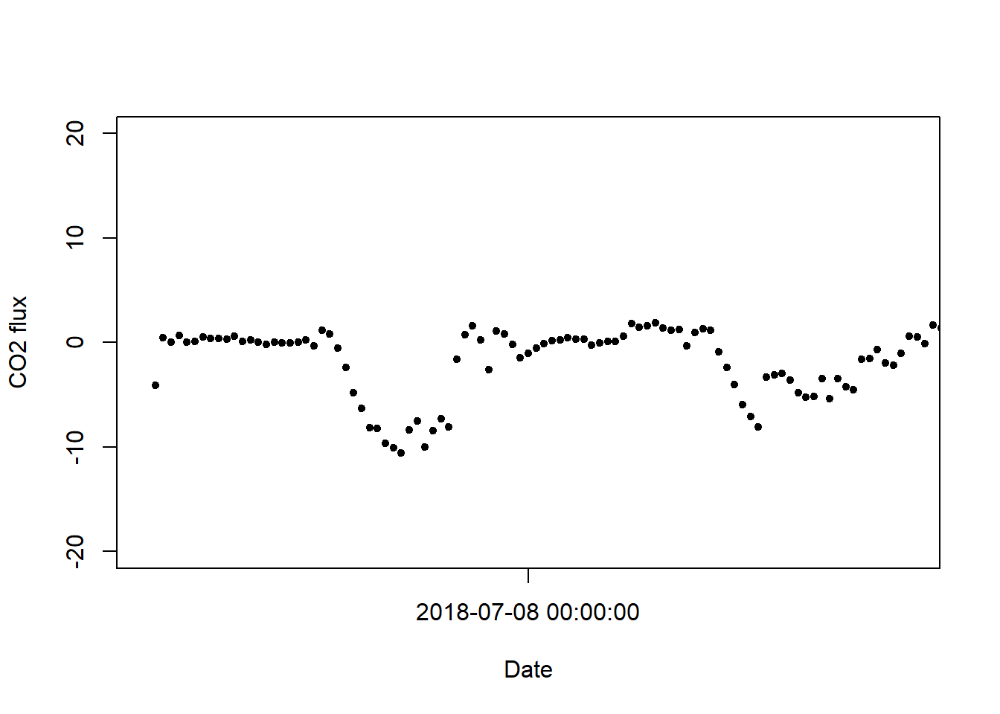

Note the timing of C uptake; the UTC time zone is clear here, where
uptake occurs at times that appear to be during the night.

### Merge flux data with other sensor data

Many of the data sets we would use to interpret and model flux data are
measured as part of the NEON project, but are not present in the eddy
flux data product bundle. In this section, we'll download PAR data and
merge them with the flux data; the steps taken here can be applied to
any of the NEON instrumented (IS) data products.

#### Download PAR data

To get NEON PAR data, use the `loadByProduct()` function from the
`neonUtilities` package. `loadByProduct()` takes the same inputs as
`zipsByProduct()`, but it loads the downloaded data directly into the
current R environment.

Let's download PAR data matching the Niwot Ridge flux data. The inputs
needed are:

-   `dpID`: DP1.00024.001
-   `site`: NIWO
-   `startdate`: 2018-06
-   `enddate`: 2018-07
-   `package`: basic
-   `avg`: 30

The new input here is `avg=30`, which downloads only the 30-minute data.
Since the flux data are at a 30-minute resolution, we can save on
download time by disregarding the 1-minute data files (which are of
course 30 times larger). The `avg` input can be left off if you want to
download all available averaging intervals.


```r
pr <- loadByProduct("DP1.00024.001", site="NIWO", avg=30,
                    startdate="2018-06", enddate="2018-07",
                    package="basic", check.size=F)
```

```
## Input parameter avg is deprecated; use timeIndex to download by time interval.
## Finding available files
## 
  |                                                                            
  |                                                                      |   0%
  |                                                                            
  |===================================                                   |  50%
  |                                                                            
  |======================================================================| 100%
## 
## Downloading files totaling approximately 1.304794 MB
## Downloading 11 files
## 
  |                                                                            
  |                                                                      |   0%
  |                                                                            
  |=======                                                               |  10%
  |                                                                            
  |==============                                                        |  20%
  |                                                                            
  |=====================                                                 |  30%
  |                                                                            
  |============================                                          |  40%
  |                                                                            
  |===================================                                   |  50%
  |                                                                            
  |==========================================                            |  60%
  |                                                                            
  |=================================================                     |  70%
  |                                                                            
  |========================================================              |  80%
  |                                                                            
  |===============================================================       |  90%
  |                                                                            
  |======================================================================| 100%
## 
## Stacking operation across a single core.
## Stacking table PARPAR_30min
## Merged the most recent publication of sensor position files for each site and saved to /stackedFiles
## Copied the most recent publication of variable definition file to /stackedFiles
## Finished: Stacked 1 data tables and 3 metadata tables!
## Stacking took 0.3349941 secs
```

`pr` is another named list, and again, metadata and units can be found
in the `variables` table. The `PARPAR_30min` table contains a
`verticalPosition` field. This field indicates the position on the
tower, with 10 being the first tower level, and 20, 30, etc going up the
tower.

#### Join PAR to flux data

We'll connect PAR data from the tower top to the flux data.


```r
pr.top <- pr$PARPAR_30min[which(pr$PARPAR_30min$verticalPosition==
                                max(pr$PARPAR_30min$verticalPosition)),]
```

`loadByProduct()` automatically converts time stamps when it reads the
data, so here we just need to indicate which time field to use to merge
the flux and PAR data.


```r
timeB <- pr.top$startDateTime
pr.top <- cbind(timeB, pr.top)
```

And merge the two datasets:


```r
fx.pr <- merge(pr.top, flux$NIWO, by="timeB")
```


```r
plot(fx.pr$data.fluxCo2.nsae.flux~fx.pr$PARMean,
     pch=".", ylim=c(-20,20),
     xlab="PAR", ylab="CO2 flux")
```

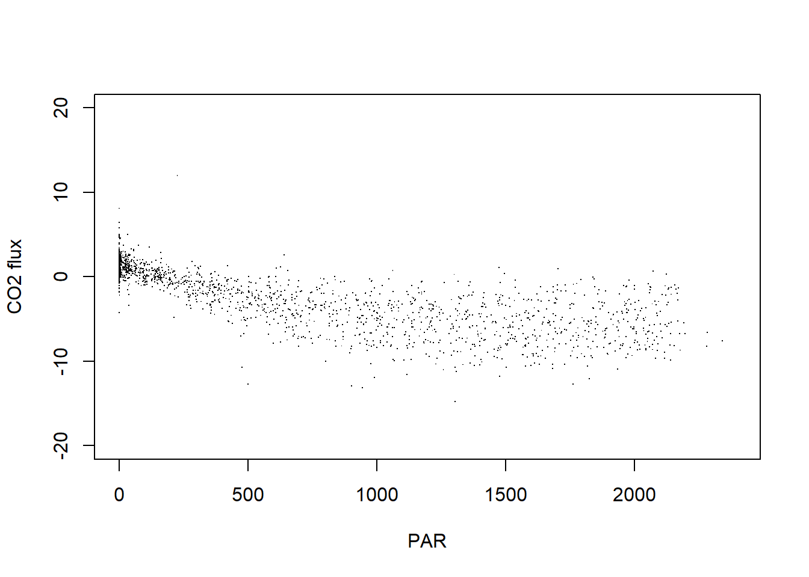

If you're interested in data in the eddy covariance bundle besides the
net flux data, the rest of this tutorial will guide you through how to
get those data out of the bundle.

### Vertical profile data (Level 3)

The Level 3 (`dp03`) data are the spatially interpolated profiles of the
rates of change of CO<sub>2</sub>, H<sub>2</sub>O, and temperature.
Extract the Level 3 data from the HDF5 file using `stackEddy()` with the
same syntax as for the Level 4 data.


```r
prof <- stackEddy(filepath="./data/filesToStack00200/",
                 level="dp03")
```

```
## Extracting data
## 
  |                                                                            
  |                                                                      |   0%
  |                                                                            
  |==================                                                    |  25%
  |                                                                            
  |===================================                                   |  50%
  |                                                                            
  |====================================================                  |  75%
  |                                                                            
  |======================================================================| 100%
## Stacking data tables by month
## 
  |                                                                            
  |                                                                      |   0%
  |                                                                            
  |======                                                                |   8%
  |                                                                            
  |============                                                          |  17%
  |                                                                            
  |==================                                                    |  25%
  |                                                                            
  |=======================                                               |  33%
  |                                                                            
  |=============================                                         |  42%
  |                                                                            
  |===================================                                   |  50%
  |                                                                            
  |=========================================                             |  58%
  |                                                                            
  |===============================================                       |  67%
  |                                                                            
  |====================================================                  |  75%
  |                                                                            
  |==========================================================            |  83%
  |                                                                            
  |================================================================      |  92%
  |                                                                            
  |======================================================================| 100%
## Joining data variables
## 
  |                                                                            
  |                                                                      |   0%
  |                                                                            
  |======                                                                |   8%
  |                                                                            
  |============                                                          |  17%
  |                                                                            
  |==================                                                    |  25%
  |                                                                            
  |=======================                                               |  33%
  |                                                                            
  |=============================                                         |  42%
  |                                                                            
  |===================================                                   |  50%
  |                                                                            
  |=========================================                             |  58%
  |                                                                            
  |===============================================                       |  67%
  |                                                                            
  |====================================================                  |  75%
  |                                                                            
  |==========================================================            |  83%
  |                                                                            
  |================================================================      |  92%
  |                                                                            
  |======================================================================| 100%
```


```r
knitr::kable(head(prof$NIWO))
```

<table>
 <thead>
  <tr>
   <th style="text-align:left;"> timeBgn </th>
   <th style="text-align:left;"> timeEnd </th>
   <th style="text-align:right;"> data.co2Stor.rateRtioMoleDryCo2.X0.1.m </th>
   <th style="text-align:right;"> data.co2Stor.rateRtioMoleDryCo2.X0.2.m </th>
   <th style="text-align:right;"> data.co2Stor.rateRtioMoleDryCo2.X0.3.m </th>
   <th style="text-align:right;"> data.co2Stor.rateRtioMoleDryCo2.X0.4.m </th>
   <th style="text-align:right;"> data.co2Stor.rateRtioMoleDryCo2.X0.5.m </th>
   <th style="text-align:right;"> data.co2Stor.rateRtioMoleDryCo2.X0.6.m </th>
   <th style="text-align:right;"> data.co2Stor.rateRtioMoleDryCo2.X0.7.m </th>
   <th style="text-align:right;"> data.co2Stor.rateRtioMoleDryCo2.X0.8.m </th>
   <th style="text-align:right;"> data.co2Stor.rateRtioMoleDryCo2.X0.9.m </th>
   <th style="text-align:right;"> data.co2Stor.rateRtioMoleDryCo2.X1.m </th>
   <th style="text-align:right;"> data.co2Stor.rateRtioMoleDryCo2.X1.1.m </th>
   <th style="text-align:right;"> data.co2Stor.rateRtioMoleDryCo2.X1.2.m </th>
   <th style="text-align:right;"> data.co2Stor.rateRtioMoleDryCo2.X1.3.m </th>
   <th style="text-align:right;"> data.co2Stor.rateRtioMoleDryCo2.X1.4.m </th>
   <th style="text-align:right;"> data.co2Stor.rateRtioMoleDryCo2.X1.5.m </th>
   <th style="text-align:right;"> data.co2Stor.rateRtioMoleDryCo2.X1.6.m </th>
   <th style="text-align:right;"> data.co2Stor.rateRtioMoleDryCo2.X1.7.m </th>
   <th style="text-align:right;"> data.co2Stor.rateRtioMoleDryCo2.X1.8.m </th>
   <th style="text-align:right;"> data.co2Stor.rateRtioMoleDryCo2.X1.9.m </th>
   <th style="text-align:right;"> data.co2Stor.rateRtioMoleDryCo2.X2.m </th>
   <th style="text-align:right;"> data.co2Stor.rateRtioMoleDryCo2.X2.1.m </th>
   <th style="text-align:right;"> data.co2Stor.rateRtioMoleDryCo2.X2.2.m </th>
   <th style="text-align:right;"> data.co2Stor.rateRtioMoleDryCo2.X2.3.m </th>
   <th style="text-align:right;"> data.co2Stor.rateRtioMoleDryCo2.X2.4.m </th>
   <th style="text-align:right;"> data.co2Stor.rateRtioMoleDryCo2.X2.5.m </th>
   <th style="text-align:right;"> data.co2Stor.rateRtioMoleDryCo2.X2.6.m </th>
   <th style="text-align:right;"> data.co2Stor.rateRtioMoleDryCo2.X2.7.m </th>
   <th style="text-align:right;"> data.co2Stor.rateRtioMoleDryCo2.X2.8.m </th>
   <th style="text-align:right;"> data.co2Stor.rateRtioMoleDryCo2.X2.9.m </th>
   <th style="text-align:right;"> data.co2Stor.rateRtioMoleDryCo2.X3.m </th>
   <th style="text-align:right;"> data.co2Stor.rateRtioMoleDryCo2.X3.1.m </th>
   <th style="text-align:right;"> data.co2Stor.rateRtioMoleDryCo2.X3.2.m </th>
   <th style="text-align:right;"> data.co2Stor.rateRtioMoleDryCo2.X3.3.m </th>
   <th style="text-align:right;"> data.co2Stor.rateRtioMoleDryCo2.X3.4.m </th>
   <th style="text-align:right;"> data.co2Stor.rateRtioMoleDryCo2.X3.5.m </th>
   <th style="text-align:right;"> data.co2Stor.rateRtioMoleDryCo2.X3.6.m </th>
   <th style="text-align:right;"> data.co2Stor.rateRtioMoleDryCo2.X3.7.m </th>
   <th style="text-align:right;"> data.co2Stor.rateRtioMoleDryCo2.X3.8.m </th>
   <th style="text-align:right;"> data.co2Stor.rateRtioMoleDryCo2.X3.9.m </th>
   <th style="text-align:right;"> data.co2Stor.rateRtioMoleDryCo2.X4.m </th>
   <th style="text-align:right;"> data.co2Stor.rateRtioMoleDryCo2.X4.1.m </th>
   <th style="text-align:right;"> data.co2Stor.rateRtioMoleDryCo2.X4.2.m </th>
   <th style="text-align:right;"> data.co2Stor.rateRtioMoleDryCo2.X4.3.m </th>
   <th style="text-align:right;"> data.co2Stor.rateRtioMoleDryCo2.X4.4.m </th>
   <th style="text-align:right;"> data.co2Stor.rateRtioMoleDryCo2.X4.5.m </th>
   <th style="text-align:right;"> data.co2Stor.rateRtioMoleDryCo2.X4.6.m </th>
   <th style="text-align:right;"> data.co2Stor.rateRtioMoleDryCo2.X4.7.m </th>
   <th style="text-align:right;"> data.co2Stor.rateRtioMoleDryCo2.X4.8.m </th>
   <th style="text-align:right;"> data.co2Stor.rateRtioMoleDryCo2.X4.9.m </th>
   <th style="text-align:right;"> data.co2Stor.rateRtioMoleDryCo2.X5.m </th>
   <th style="text-align:right;"> data.co2Stor.rateRtioMoleDryCo2.X5.1.m </th>
   <th style="text-align:right;"> data.co2Stor.rateRtioMoleDryCo2.X5.2.m </th>
   <th style="text-align:right;"> data.co2Stor.rateRtioMoleDryCo2.X5.3.m </th>
   <th style="text-align:right;"> data.co2Stor.rateRtioMoleDryCo2.X5.4.m </th>
   <th style="text-align:right;"> data.co2Stor.rateRtioMoleDryCo2.X5.5.m </th>
   <th style="text-align:right;"> data.co2Stor.rateRtioMoleDryCo2.X5.6.m </th>
   <th style="text-align:right;"> data.co2Stor.rateRtioMoleDryCo2.X5.7.m </th>
   <th style="text-align:right;"> data.co2Stor.rateRtioMoleDryCo2.X5.8.m </th>
   <th style="text-align:right;"> data.co2Stor.rateRtioMoleDryCo2.X5.9.m </th>
   <th style="text-align:right;"> data.co2Stor.rateRtioMoleDryCo2.X6.m </th>
   <th style="text-align:right;"> data.co2Stor.rateRtioMoleDryCo2.X6.1.m </th>
   <th style="text-align:right;"> data.co2Stor.rateRtioMoleDryCo2.X6.2.m </th>
   <th style="text-align:right;"> data.co2Stor.rateRtioMoleDryCo2.X6.3.m </th>
   <th style="text-align:right;"> data.co2Stor.rateRtioMoleDryCo2.X6.4.m </th>
   <th style="text-align:right;"> data.co2Stor.rateRtioMoleDryCo2.X6.5.m </th>
   <th style="text-align:right;"> data.co2Stor.rateRtioMoleDryCo2.X6.6.m </th>
   <th style="text-align:right;"> data.co2Stor.rateRtioMoleDryCo2.X6.7.m </th>
   <th style="text-align:right;"> data.co2Stor.rateRtioMoleDryCo2.X6.8.m </th>
   <th style="text-align:right;"> data.co2Stor.rateRtioMoleDryCo2.X6.9.m </th>
   <th style="text-align:right;"> data.co2Stor.rateRtioMoleDryCo2.X7.m </th>
   <th style="text-align:right;"> data.co2Stor.rateRtioMoleDryCo2.X7.1.m </th>
   <th style="text-align:right;"> data.co2Stor.rateRtioMoleDryCo2.X7.2.m </th>
   <th style="text-align:right;"> data.co2Stor.rateRtioMoleDryCo2.X7.3.m </th>
   <th style="text-align:right;"> data.co2Stor.rateRtioMoleDryCo2.X7.4.m </th>
   <th style="text-align:right;"> data.co2Stor.rateRtioMoleDryCo2.X7.5.m </th>
   <th style="text-align:right;"> data.co2Stor.rateRtioMoleDryCo2.X7.6.m </th>
   <th style="text-align:right;"> data.co2Stor.rateRtioMoleDryCo2.X7.7.m </th>
   <th style="text-align:right;"> data.co2Stor.rateRtioMoleDryCo2.X7.8.m </th>
   <th style="text-align:right;"> data.co2Stor.rateRtioMoleDryCo2.X7.9.m </th>
   <th style="text-align:right;"> data.co2Stor.rateRtioMoleDryCo2.X8.m </th>
   <th style="text-align:right;"> data.co2Stor.rateRtioMoleDryCo2.X8.1.m </th>
   <th style="text-align:right;"> data.co2Stor.rateRtioMoleDryCo2.X8.2.m </th>
   <th style="text-align:right;"> data.co2Stor.rateRtioMoleDryCo2.X8.3.m </th>
   <th style="text-align:right;"> data.co2Stor.rateRtioMoleDryCo2.X8.4.m </th>
   <th style="text-align:right;"> data.h2oStor.rateRtioMoleDryH2o.X0.1.m </th>
   <th style="text-align:right;"> data.h2oStor.rateRtioMoleDryH2o.X0.2.m </th>
   <th style="text-align:right;"> data.h2oStor.rateRtioMoleDryH2o.X0.3.m </th>
   <th style="text-align:right;"> data.h2oStor.rateRtioMoleDryH2o.X0.4.m </th>
   <th style="text-align:right;"> data.h2oStor.rateRtioMoleDryH2o.X0.5.m </th>
   <th style="text-align:right;"> data.h2oStor.rateRtioMoleDryH2o.X0.6.m </th>
   <th style="text-align:right;"> data.h2oStor.rateRtioMoleDryH2o.X0.7.m </th>
   <th style="text-align:right;"> data.h2oStor.rateRtioMoleDryH2o.X0.8.m </th>
   <th style="text-align:right;"> data.h2oStor.rateRtioMoleDryH2o.X0.9.m </th>
   <th style="text-align:right;"> data.h2oStor.rateRtioMoleDryH2o.X1.m </th>
   <th style="text-align:right;"> data.h2oStor.rateRtioMoleDryH2o.X1.1.m </th>
   <th style="text-align:right;"> data.h2oStor.rateRtioMoleDryH2o.X1.2.m </th>
   <th style="text-align:right;"> data.h2oStor.rateRtioMoleDryH2o.X1.3.m </th>
   <th style="text-align:right;"> data.h2oStor.rateRtioMoleDryH2o.X1.4.m </th>
   <th style="text-align:right;"> data.h2oStor.rateRtioMoleDryH2o.X1.5.m </th>
   <th style="text-align:right;"> data.h2oStor.rateRtioMoleDryH2o.X1.6.m </th>
   <th style="text-align:right;"> data.h2oStor.rateRtioMoleDryH2o.X1.7.m </th>
   <th style="text-align:right;"> data.h2oStor.rateRtioMoleDryH2o.X1.8.m </th>
   <th style="text-align:right;"> data.h2oStor.rateRtioMoleDryH2o.X1.9.m </th>
   <th style="text-align:right;"> data.h2oStor.rateRtioMoleDryH2o.X2.m </th>
   <th style="text-align:right;"> data.h2oStor.rateRtioMoleDryH2o.X2.1.m </th>
   <th style="text-align:right;"> data.h2oStor.rateRtioMoleDryH2o.X2.2.m </th>
   <th style="text-align:right;"> data.h2oStor.rateRtioMoleDryH2o.X2.3.m </th>
   <th style="text-align:right;"> data.h2oStor.rateRtioMoleDryH2o.X2.4.m </th>
   <th style="text-align:right;"> data.h2oStor.rateRtioMoleDryH2o.X2.5.m </th>
   <th style="text-align:right;"> data.h2oStor.rateRtioMoleDryH2o.X2.6.m </th>
   <th style="text-align:right;"> data.h2oStor.rateRtioMoleDryH2o.X2.7.m </th>
   <th style="text-align:right;"> data.h2oStor.rateRtioMoleDryH2o.X2.8.m </th>
   <th style="text-align:right;"> data.h2oStor.rateRtioMoleDryH2o.X2.9.m </th>
   <th style="text-align:right;"> data.h2oStor.rateRtioMoleDryH2o.X3.m </th>
   <th style="text-align:right;"> data.h2oStor.rateRtioMoleDryH2o.X3.1.m </th>
   <th style="text-align:right;"> data.h2oStor.rateRtioMoleDryH2o.X3.2.m </th>
   <th style="text-align:right;"> data.h2oStor.rateRtioMoleDryH2o.X3.3.m </th>
   <th style="text-align:right;"> data.h2oStor.rateRtioMoleDryH2o.X3.4.m </th>
   <th style="text-align:right;"> data.h2oStor.rateRtioMoleDryH2o.X3.5.m </th>
   <th style="text-align:right;"> data.h2oStor.rateRtioMoleDryH2o.X3.6.m </th>
   <th style="text-align:right;"> data.h2oStor.rateRtioMoleDryH2o.X3.7.m </th>
   <th style="text-align:right;"> data.h2oStor.rateRtioMoleDryH2o.X3.8.m </th>
   <th style="text-align:right;"> data.h2oStor.rateRtioMoleDryH2o.X3.9.m </th>
   <th style="text-align:right;"> data.h2oStor.rateRtioMoleDryH2o.X4.m </th>
   <th style="text-align:right;"> data.h2oStor.rateRtioMoleDryH2o.X4.1.m </th>
   <th style="text-align:right;"> data.h2oStor.rateRtioMoleDryH2o.X4.2.m </th>
   <th style="text-align:right;"> data.h2oStor.rateRtioMoleDryH2o.X4.3.m </th>
   <th style="text-align:right;"> data.h2oStor.rateRtioMoleDryH2o.X4.4.m </th>
   <th style="text-align:right;"> data.h2oStor.rateRtioMoleDryH2o.X4.5.m </th>
   <th style="text-align:right;"> data.h2oStor.rateRtioMoleDryH2o.X4.6.m </th>
   <th style="text-align:right;"> data.h2oStor.rateRtioMoleDryH2o.X4.7.m </th>
   <th style="text-align:right;"> data.h2oStor.rateRtioMoleDryH2o.X4.8.m </th>
   <th style="text-align:right;"> data.h2oStor.rateRtioMoleDryH2o.X4.9.m </th>
   <th style="text-align:right;"> data.h2oStor.rateRtioMoleDryH2o.X5.m </th>
   <th style="text-align:right;"> data.h2oStor.rateRtioMoleDryH2o.X5.1.m </th>
   <th style="text-align:right;"> data.h2oStor.rateRtioMoleDryH2o.X5.2.m </th>
   <th style="text-align:right;"> data.h2oStor.rateRtioMoleDryH2o.X5.3.m </th>
   <th style="text-align:right;"> data.h2oStor.rateRtioMoleDryH2o.X5.4.m </th>
   <th style="text-align:right;"> data.h2oStor.rateRtioMoleDryH2o.X5.5.m </th>
   <th style="text-align:right;"> data.h2oStor.rateRtioMoleDryH2o.X5.6.m </th>
   <th style="text-align:right;"> data.h2oStor.rateRtioMoleDryH2o.X5.7.m </th>
   <th style="text-align:right;"> data.h2oStor.rateRtioMoleDryH2o.X5.8.m </th>
   <th style="text-align:right;"> data.h2oStor.rateRtioMoleDryH2o.X5.9.m </th>
   <th style="text-align:right;"> data.h2oStor.rateRtioMoleDryH2o.X6.m </th>
   <th style="text-align:right;"> data.h2oStor.rateRtioMoleDryH2o.X6.1.m </th>
   <th style="text-align:right;"> data.h2oStor.rateRtioMoleDryH2o.X6.2.m </th>
   <th style="text-align:right;"> data.h2oStor.rateRtioMoleDryH2o.X6.3.m </th>
   <th style="text-align:right;"> data.h2oStor.rateRtioMoleDryH2o.X6.4.m </th>
   <th style="text-align:right;"> data.h2oStor.rateRtioMoleDryH2o.X6.5.m </th>
   <th style="text-align:right;"> data.h2oStor.rateRtioMoleDryH2o.X6.6.m </th>
   <th style="text-align:right;"> data.h2oStor.rateRtioMoleDryH2o.X6.7.m </th>
   <th style="text-align:right;"> data.h2oStor.rateRtioMoleDryH2o.X6.8.m </th>
   <th style="text-align:right;"> data.h2oStor.rateRtioMoleDryH2o.X6.9.m </th>
   <th style="text-align:right;"> data.h2oStor.rateRtioMoleDryH2o.X7.m </th>
   <th style="text-align:right;"> data.h2oStor.rateRtioMoleDryH2o.X7.1.m </th>
   <th style="text-align:right;"> data.h2oStor.rateRtioMoleDryH2o.X7.2.m </th>
   <th style="text-align:right;"> data.h2oStor.rateRtioMoleDryH2o.X7.3.m </th>
   <th style="text-align:right;"> data.h2oStor.rateRtioMoleDryH2o.X7.4.m </th>
   <th style="text-align:right;"> data.h2oStor.rateRtioMoleDryH2o.X7.5.m </th>
   <th style="text-align:right;"> data.h2oStor.rateRtioMoleDryH2o.X7.6.m </th>
   <th style="text-align:right;"> data.h2oStor.rateRtioMoleDryH2o.X7.7.m </th>
   <th style="text-align:right;"> data.h2oStor.rateRtioMoleDryH2o.X7.8.m </th>
   <th style="text-align:right;"> data.h2oStor.rateRtioMoleDryH2o.X7.9.m </th>
   <th style="text-align:right;"> data.h2oStor.rateRtioMoleDryH2o.X8.m </th>
   <th style="text-align:right;"> data.h2oStor.rateRtioMoleDryH2o.X8.1.m </th>
   <th style="text-align:right;"> data.h2oStor.rateRtioMoleDryH2o.X8.2.m </th>
   <th style="text-align:right;"> data.h2oStor.rateRtioMoleDryH2o.X8.3.m </th>
   <th style="text-align:right;"> data.h2oStor.rateRtioMoleDryH2o.X8.4.m </th>
   <th style="text-align:right;"> data.tempStor.rateTemp.X0.1.m </th>
   <th style="text-align:right;"> data.tempStor.rateTemp.X0.2.m </th>
   <th style="text-align:right;"> data.tempStor.rateTemp.X0.3.m </th>
   <th style="text-align:right;"> data.tempStor.rateTemp.X0.4.m </th>
   <th style="text-align:right;"> data.tempStor.rateTemp.X0.5.m </th>
   <th style="text-align:right;"> data.tempStor.rateTemp.X0.6.m </th>
   <th style="text-align:right;"> data.tempStor.rateTemp.X0.7.m </th>
   <th style="text-align:right;"> data.tempStor.rateTemp.X0.8.m </th>
   <th style="text-align:right;"> data.tempStor.rateTemp.X0.9.m </th>
   <th style="text-align:right;"> data.tempStor.rateTemp.X1.m </th>
   <th style="text-align:right;"> data.tempStor.rateTemp.X1.1.m </th>
   <th style="text-align:right;"> data.tempStor.rateTemp.X1.2.m </th>
   <th style="text-align:right;"> data.tempStor.rateTemp.X1.3.m </th>
   <th style="text-align:right;"> data.tempStor.rateTemp.X1.4.m </th>
   <th style="text-align:right;"> data.tempStor.rateTemp.X1.5.m </th>
   <th style="text-align:right;"> data.tempStor.rateTemp.X1.6.m </th>
   <th style="text-align:right;"> data.tempStor.rateTemp.X1.7.m </th>
   <th style="text-align:right;"> data.tempStor.rateTemp.X1.8.m </th>
   <th style="text-align:right;"> data.tempStor.rateTemp.X1.9.m </th>
   <th style="text-align:right;"> data.tempStor.rateTemp.X2.m </th>
   <th style="text-align:right;"> data.tempStor.rateTemp.X2.1.m </th>
   <th style="text-align:right;"> data.tempStor.rateTemp.X2.2.m </th>
   <th style="text-align:right;"> data.tempStor.rateTemp.X2.3.m </th>
   <th style="text-align:right;"> data.tempStor.rateTemp.X2.4.m </th>
   <th style="text-align:right;"> data.tempStor.rateTemp.X2.5.m </th>
   <th style="text-align:right;"> data.tempStor.rateTemp.X2.6.m </th>
   <th style="text-align:right;"> data.tempStor.rateTemp.X2.7.m </th>
   <th style="text-align:right;"> data.tempStor.rateTemp.X2.8.m </th>
   <th style="text-align:right;"> data.tempStor.rateTemp.X2.9.m </th>
   <th style="text-align:right;"> data.tempStor.rateTemp.X3.m </th>
   <th style="text-align:right;"> data.tempStor.rateTemp.X3.1.m </th>
   <th style="text-align:right;"> data.tempStor.rateTemp.X3.2.m </th>
   <th style="text-align:right;"> data.tempStor.rateTemp.X3.3.m </th>
   <th style="text-align:right;"> data.tempStor.rateTemp.X3.4.m </th>
   <th style="text-align:right;"> data.tempStor.rateTemp.X3.5.m </th>
   <th style="text-align:right;"> data.tempStor.rateTemp.X3.6.m </th>
   <th style="text-align:right;"> data.tempStor.rateTemp.X3.7.m </th>
   <th style="text-align:right;"> data.tempStor.rateTemp.X3.8.m </th>
   <th style="text-align:right;"> data.tempStor.rateTemp.X3.9.m </th>
   <th style="text-align:right;"> data.tempStor.rateTemp.X4.m </th>
   <th style="text-align:right;"> data.tempStor.rateTemp.X4.1.m </th>
   <th style="text-align:right;"> data.tempStor.rateTemp.X4.2.m </th>
   <th style="text-align:right;"> data.tempStor.rateTemp.X4.3.m </th>
   <th style="text-align:right;"> data.tempStor.rateTemp.X4.4.m </th>
   <th style="text-align:right;"> data.tempStor.rateTemp.X4.5.m </th>
   <th style="text-align:right;"> data.tempStor.rateTemp.X4.6.m </th>
   <th style="text-align:right;"> data.tempStor.rateTemp.X4.7.m </th>
   <th style="text-align:right;"> data.tempStor.rateTemp.X4.8.m </th>
   <th style="text-align:right;"> data.tempStor.rateTemp.X4.9.m </th>
   <th style="text-align:right;"> data.tempStor.rateTemp.X5.m </th>
   <th style="text-align:right;"> data.tempStor.rateTemp.X5.1.m </th>
   <th style="text-align:right;"> data.tempStor.rateTemp.X5.2.m </th>
   <th style="text-align:right;"> data.tempStor.rateTemp.X5.3.m </th>
   <th style="text-align:right;"> data.tempStor.rateTemp.X5.4.m </th>
   <th style="text-align:right;"> data.tempStor.rateTemp.X5.5.m </th>
   <th style="text-align:right;"> data.tempStor.rateTemp.X5.6.m </th>
   <th style="text-align:right;"> data.tempStor.rateTemp.X5.7.m </th>
   <th style="text-align:right;"> data.tempStor.rateTemp.X5.8.m </th>
   <th style="text-align:right;"> data.tempStor.rateTemp.X5.9.m </th>
   <th style="text-align:right;"> data.tempStor.rateTemp.X6.m </th>
   <th style="text-align:right;"> data.tempStor.rateTemp.X6.1.m </th>
   <th style="text-align:right;"> data.tempStor.rateTemp.X6.2.m </th>
   <th style="text-align:right;"> data.tempStor.rateTemp.X6.3.m </th>
   <th style="text-align:right;"> data.tempStor.rateTemp.X6.4.m </th>
   <th style="text-align:right;"> data.tempStor.rateTemp.X6.5.m </th>
   <th style="text-align:right;"> data.tempStor.rateTemp.X6.6.m </th>
   <th style="text-align:right;"> data.tempStor.rateTemp.X6.7.m </th>
   <th style="text-align:right;"> data.tempStor.rateTemp.X6.8.m </th>
   <th style="text-align:right;"> data.tempStor.rateTemp.X6.9.m </th>
   <th style="text-align:right;"> data.tempStor.rateTemp.X7.m </th>
   <th style="text-align:right;"> data.tempStor.rateTemp.X7.1.m </th>
   <th style="text-align:right;"> data.tempStor.rateTemp.X7.2.m </th>
   <th style="text-align:right;"> data.tempStor.rateTemp.X7.3.m </th>
   <th style="text-align:right;"> data.tempStor.rateTemp.X7.4.m </th>
   <th style="text-align:right;"> data.tempStor.rateTemp.X7.5.m </th>
   <th style="text-align:right;"> data.tempStor.rateTemp.X7.6.m </th>
   <th style="text-align:right;"> data.tempStor.rateTemp.X7.7.m </th>
   <th style="text-align:right;"> data.tempStor.rateTemp.X7.8.m </th>
   <th style="text-align:right;"> data.tempStor.rateTemp.X7.9.m </th>
   <th style="text-align:right;"> data.tempStor.rateTemp.X8.m </th>
   <th style="text-align:right;"> data.tempStor.rateTemp.X8.1.m </th>
   <th style="text-align:right;"> data.tempStor.rateTemp.X8.2.m </th>
   <th style="text-align:right;"> data.tempStor.rateTemp.X8.3.m </th>
   <th style="text-align:right;"> data.tempStor.rateTemp.X8.4.m </th>
   <th style="text-align:right;"> qfqm.co2Stor.rateRtioMoleDryCo2.X0.1.m </th>
   <th style="text-align:right;"> qfqm.co2Stor.rateRtioMoleDryCo2.X0.2.m </th>
   <th style="text-align:right;"> qfqm.co2Stor.rateRtioMoleDryCo2.X0.3.m </th>
   <th style="text-align:right;"> qfqm.co2Stor.rateRtioMoleDryCo2.X0.4.m </th>
   <th style="text-align:right;"> qfqm.co2Stor.rateRtioMoleDryCo2.X0.5.m </th>
   <th style="text-align:right;"> qfqm.co2Stor.rateRtioMoleDryCo2.X0.6.m </th>
   <th style="text-align:right;"> qfqm.co2Stor.rateRtioMoleDryCo2.X0.7.m </th>
   <th style="text-align:right;"> qfqm.co2Stor.rateRtioMoleDryCo2.X0.8.m </th>
   <th style="text-align:right;"> qfqm.co2Stor.rateRtioMoleDryCo2.X0.9.m </th>
   <th style="text-align:right;"> qfqm.co2Stor.rateRtioMoleDryCo2.X1.m </th>
   <th style="text-align:right;"> qfqm.co2Stor.rateRtioMoleDryCo2.X1.1.m </th>
   <th style="text-align:right;"> qfqm.co2Stor.rateRtioMoleDryCo2.X1.2.m </th>
   <th style="text-align:right;"> qfqm.co2Stor.rateRtioMoleDryCo2.X1.3.m </th>
   <th style="text-align:right;"> qfqm.co2Stor.rateRtioMoleDryCo2.X1.4.m </th>
   <th style="text-align:right;"> qfqm.co2Stor.rateRtioMoleDryCo2.X1.5.m </th>
   <th style="text-align:right;"> qfqm.co2Stor.rateRtioMoleDryCo2.X1.6.m </th>
   <th style="text-align:right;"> qfqm.co2Stor.rateRtioMoleDryCo2.X1.7.m </th>
   <th style="text-align:right;"> qfqm.co2Stor.rateRtioMoleDryCo2.X1.8.m </th>
   <th style="text-align:right;"> qfqm.co2Stor.rateRtioMoleDryCo2.X1.9.m </th>
   <th style="text-align:right;"> qfqm.co2Stor.rateRtioMoleDryCo2.X2.m </th>
   <th style="text-align:right;"> qfqm.co2Stor.rateRtioMoleDryCo2.X2.1.m </th>
   <th style="text-align:right;"> qfqm.co2Stor.rateRtioMoleDryCo2.X2.2.m </th>
   <th style="text-align:right;"> qfqm.co2Stor.rateRtioMoleDryCo2.X2.3.m </th>
   <th style="text-align:right;"> qfqm.co2Stor.rateRtioMoleDryCo2.X2.4.m </th>
   <th style="text-align:right;"> qfqm.co2Stor.rateRtioMoleDryCo2.X2.5.m </th>
   <th style="text-align:right;"> qfqm.co2Stor.rateRtioMoleDryCo2.X2.6.m </th>
   <th style="text-align:right;"> qfqm.co2Stor.rateRtioMoleDryCo2.X2.7.m </th>
   <th style="text-align:right;"> qfqm.co2Stor.rateRtioMoleDryCo2.X2.8.m </th>
   <th style="text-align:right;"> qfqm.co2Stor.rateRtioMoleDryCo2.X2.9.m </th>
   <th style="text-align:right;"> qfqm.co2Stor.rateRtioMoleDryCo2.X3.m </th>
   <th style="text-align:right;"> qfqm.co2Stor.rateRtioMoleDryCo2.X3.1.m </th>
   <th style="text-align:right;"> qfqm.co2Stor.rateRtioMoleDryCo2.X3.2.m </th>
   <th style="text-align:right;"> qfqm.co2Stor.rateRtioMoleDryCo2.X3.3.m </th>
   <th style="text-align:right;"> qfqm.co2Stor.rateRtioMoleDryCo2.X3.4.m </th>
   <th style="text-align:right;"> qfqm.co2Stor.rateRtioMoleDryCo2.X3.5.m </th>
   <th style="text-align:right;"> qfqm.co2Stor.rateRtioMoleDryCo2.X3.6.m </th>
   <th style="text-align:right;"> qfqm.co2Stor.rateRtioMoleDryCo2.X3.7.m </th>
   <th style="text-align:right;"> qfqm.co2Stor.rateRtioMoleDryCo2.X3.8.m </th>
   <th style="text-align:right;"> qfqm.co2Stor.rateRtioMoleDryCo2.X3.9.m </th>
   <th style="text-align:right;"> qfqm.co2Stor.rateRtioMoleDryCo2.X4.m </th>
   <th style="text-align:right;"> qfqm.co2Stor.rateRtioMoleDryCo2.X4.1.m </th>
   <th style="text-align:right;"> qfqm.co2Stor.rateRtioMoleDryCo2.X4.2.m </th>
   <th style="text-align:right;"> qfqm.co2Stor.rateRtioMoleDryCo2.X4.3.m </th>
   <th style="text-align:right;"> qfqm.co2Stor.rateRtioMoleDryCo2.X4.4.m </th>
   <th style="text-align:right;"> qfqm.co2Stor.rateRtioMoleDryCo2.X4.5.m </th>
   <th style="text-align:right;"> qfqm.co2Stor.rateRtioMoleDryCo2.X4.6.m </th>
   <th style="text-align:right;"> qfqm.co2Stor.rateRtioMoleDryCo2.X4.7.m </th>
   <th style="text-align:right;"> qfqm.co2Stor.rateRtioMoleDryCo2.X4.8.m </th>
   <th style="text-align:right;"> qfqm.co2Stor.rateRtioMoleDryCo2.X4.9.m </th>
   <th style="text-align:right;"> qfqm.co2Stor.rateRtioMoleDryCo2.X5.m </th>
   <th style="text-align:right;"> qfqm.co2Stor.rateRtioMoleDryCo2.X5.1.m </th>
   <th style="text-align:right;"> qfqm.co2Stor.rateRtioMoleDryCo2.X5.2.m </th>
   <th style="text-align:right;"> qfqm.co2Stor.rateRtioMoleDryCo2.X5.3.m </th>
   <th style="text-align:right;"> qfqm.co2Stor.rateRtioMoleDryCo2.X5.4.m </th>
   <th style="text-align:right;"> qfqm.co2Stor.rateRtioMoleDryCo2.X5.5.m </th>
   <th style="text-align:right;"> qfqm.co2Stor.rateRtioMoleDryCo2.X5.6.m </th>
   <th style="text-align:right;"> qfqm.co2Stor.rateRtioMoleDryCo2.X5.7.m </th>
   <th style="text-align:right;"> qfqm.co2Stor.rateRtioMoleDryCo2.X5.8.m </th>
   <th style="text-align:right;"> qfqm.co2Stor.rateRtioMoleDryCo2.X5.9.m </th>
   <th style="text-align:right;"> qfqm.co2Stor.rateRtioMoleDryCo2.X6.m </th>
   <th style="text-align:right;"> qfqm.co2Stor.rateRtioMoleDryCo2.X6.1.m </th>
   <th style="text-align:right;"> qfqm.co2Stor.rateRtioMoleDryCo2.X6.2.m </th>
   <th style="text-align:right;"> qfqm.co2Stor.rateRtioMoleDryCo2.X6.3.m </th>
   <th style="text-align:right;"> qfqm.co2Stor.rateRtioMoleDryCo2.X6.4.m </th>
   <th style="text-align:right;"> qfqm.co2Stor.rateRtioMoleDryCo2.X6.5.m </th>
   <th style="text-align:right;"> qfqm.co2Stor.rateRtioMoleDryCo2.X6.6.m </th>
   <th style="text-align:right;"> qfqm.co2Stor.rateRtioMoleDryCo2.X6.7.m </th>
   <th style="text-align:right;"> qfqm.co2Stor.rateRtioMoleDryCo2.X6.8.m </th>
   <th style="text-align:right;"> qfqm.co2Stor.rateRtioMoleDryCo2.X6.9.m </th>
   <th style="text-align:right;"> qfqm.co2Stor.rateRtioMoleDryCo2.X7.m </th>
   <th style="text-align:right;"> qfqm.co2Stor.rateRtioMoleDryCo2.X7.1.m </th>
   <th style="text-align:right;"> qfqm.co2Stor.rateRtioMoleDryCo2.X7.2.m </th>
   <th style="text-align:right;"> qfqm.co2Stor.rateRtioMoleDryCo2.X7.3.m </th>
   <th style="text-align:right;"> qfqm.co2Stor.rateRtioMoleDryCo2.X7.4.m </th>
   <th style="text-align:right;"> qfqm.co2Stor.rateRtioMoleDryCo2.X7.5.m </th>
   <th style="text-align:right;"> qfqm.co2Stor.rateRtioMoleDryCo2.X7.6.m </th>
   <th style="text-align:right;"> qfqm.co2Stor.rateRtioMoleDryCo2.X7.7.m </th>
   <th style="text-align:right;"> qfqm.co2Stor.rateRtioMoleDryCo2.X7.8.m </th>
   <th style="text-align:right;"> qfqm.co2Stor.rateRtioMoleDryCo2.X7.9.m </th>
   <th style="text-align:right;"> qfqm.co2Stor.rateRtioMoleDryCo2.X8.m </th>
   <th style="text-align:right;"> qfqm.co2Stor.rateRtioMoleDryCo2.X8.1.m </th>
   <th style="text-align:right;"> qfqm.co2Stor.rateRtioMoleDryCo2.X8.2.m </th>
   <th style="text-align:right;"> qfqm.co2Stor.rateRtioMoleDryCo2.X8.3.m </th>
   <th style="text-align:right;"> qfqm.co2Stor.rateRtioMoleDryCo2.X8.4.m </th>
   <th style="text-align:right;"> qfqm.h2oStor.rateRtioMoleDryH2o.X0.1.m </th>
   <th style="text-align:right;"> qfqm.h2oStor.rateRtioMoleDryH2o.X0.2.m </th>
   <th style="text-align:right;"> qfqm.h2oStor.rateRtioMoleDryH2o.X0.3.m </th>
   <th style="text-align:right;"> qfqm.h2oStor.rateRtioMoleDryH2o.X0.4.m </th>
   <th style="text-align:right;"> qfqm.h2oStor.rateRtioMoleDryH2o.X0.5.m </th>
   <th style="text-align:right;"> qfqm.h2oStor.rateRtioMoleDryH2o.X0.6.m </th>
   <th style="text-align:right;"> qfqm.h2oStor.rateRtioMoleDryH2o.X0.7.m </th>
   <th style="text-align:right;"> qfqm.h2oStor.rateRtioMoleDryH2o.X0.8.m </th>
   <th style="text-align:right;"> qfqm.h2oStor.rateRtioMoleDryH2o.X0.9.m </th>
   <th style="text-align:right;"> qfqm.h2oStor.rateRtioMoleDryH2o.X1.m </th>
   <th style="text-align:right;"> qfqm.h2oStor.rateRtioMoleDryH2o.X1.1.m </th>
   <th style="text-align:right;"> qfqm.h2oStor.rateRtioMoleDryH2o.X1.2.m </th>
   <th style="text-align:right;"> qfqm.h2oStor.rateRtioMoleDryH2o.X1.3.m </th>
   <th style="text-align:right;"> qfqm.h2oStor.rateRtioMoleDryH2o.X1.4.m </th>
   <th style="text-align:right;"> qfqm.h2oStor.rateRtioMoleDryH2o.X1.5.m </th>
   <th style="text-align:right;"> qfqm.h2oStor.rateRtioMoleDryH2o.X1.6.m </th>
   <th style="text-align:right;"> qfqm.h2oStor.rateRtioMoleDryH2o.X1.7.m </th>
   <th style="text-align:right;"> qfqm.h2oStor.rateRtioMoleDryH2o.X1.8.m </th>
   <th style="text-align:right;"> qfqm.h2oStor.rateRtioMoleDryH2o.X1.9.m </th>
   <th style="text-align:right;"> qfqm.h2oStor.rateRtioMoleDryH2o.X2.m </th>
   <th style="text-align:right;"> qfqm.h2oStor.rateRtioMoleDryH2o.X2.1.m </th>
   <th style="text-align:right;"> qfqm.h2oStor.rateRtioMoleDryH2o.X2.2.m </th>
   <th style="text-align:right;"> qfqm.h2oStor.rateRtioMoleDryH2o.X2.3.m </th>
   <th style="text-align:right;"> qfqm.h2oStor.rateRtioMoleDryH2o.X2.4.m </th>
   <th style="text-align:right;"> qfqm.h2oStor.rateRtioMoleDryH2o.X2.5.m </th>
   <th style="text-align:right;"> qfqm.h2oStor.rateRtioMoleDryH2o.X2.6.m </th>
   <th style="text-align:right;"> qfqm.h2oStor.rateRtioMoleDryH2o.X2.7.m </th>
   <th style="text-align:right;"> qfqm.h2oStor.rateRtioMoleDryH2o.X2.8.m </th>
   <th style="text-align:right;"> qfqm.h2oStor.rateRtioMoleDryH2o.X2.9.m </th>
   <th style="text-align:right;"> qfqm.h2oStor.rateRtioMoleDryH2o.X3.m </th>
   <th style="text-align:right;"> qfqm.h2oStor.rateRtioMoleDryH2o.X3.1.m </th>
   <th style="text-align:right;"> qfqm.h2oStor.rateRtioMoleDryH2o.X3.2.m </th>
   <th style="text-align:right;"> qfqm.h2oStor.rateRtioMoleDryH2o.X3.3.m </th>
   <th style="text-align:right;"> qfqm.h2oStor.rateRtioMoleDryH2o.X3.4.m </th>
   <th style="text-align:right;"> qfqm.h2oStor.rateRtioMoleDryH2o.X3.5.m </th>
   <th style="text-align:right;"> qfqm.h2oStor.rateRtioMoleDryH2o.X3.6.m </th>
   <th style="text-align:right;"> qfqm.h2oStor.rateRtioMoleDryH2o.X3.7.m </th>
   <th style="text-align:right;"> qfqm.h2oStor.rateRtioMoleDryH2o.X3.8.m </th>
   <th style="text-align:right;"> qfqm.h2oStor.rateRtioMoleDryH2o.X3.9.m </th>
   <th style="text-align:right;"> qfqm.h2oStor.rateRtioMoleDryH2o.X4.m </th>
   <th style="text-align:right;"> qfqm.h2oStor.rateRtioMoleDryH2o.X4.1.m </th>
   <th style="text-align:right;"> qfqm.h2oStor.rateRtioMoleDryH2o.X4.2.m </th>
   <th style="text-align:right;"> qfqm.h2oStor.rateRtioMoleDryH2o.X4.3.m </th>
   <th style="text-align:right;"> qfqm.h2oStor.rateRtioMoleDryH2o.X4.4.m </th>
   <th style="text-align:right;"> qfqm.h2oStor.rateRtioMoleDryH2o.X4.5.m </th>
   <th style="text-align:right;"> qfqm.h2oStor.rateRtioMoleDryH2o.X4.6.m </th>
   <th style="text-align:right;"> qfqm.h2oStor.rateRtioMoleDryH2o.X4.7.m </th>
   <th style="text-align:right;"> qfqm.h2oStor.rateRtioMoleDryH2o.X4.8.m </th>
   <th style="text-align:right;"> qfqm.h2oStor.rateRtioMoleDryH2o.X4.9.m </th>
   <th style="text-align:right;"> qfqm.h2oStor.rateRtioMoleDryH2o.X5.m </th>
   <th style="text-align:right;"> qfqm.h2oStor.rateRtioMoleDryH2o.X5.1.m </th>
   <th style="text-align:right;"> qfqm.h2oStor.rateRtioMoleDryH2o.X5.2.m </th>
   <th style="text-align:right;"> qfqm.h2oStor.rateRtioMoleDryH2o.X5.3.m </th>
   <th style="text-align:right;"> qfqm.h2oStor.rateRtioMoleDryH2o.X5.4.m </th>
   <th style="text-align:right;"> qfqm.h2oStor.rateRtioMoleDryH2o.X5.5.m </th>
   <th style="text-align:right;"> qfqm.h2oStor.rateRtioMoleDryH2o.X5.6.m </th>
   <th style="text-align:right;"> qfqm.h2oStor.rateRtioMoleDryH2o.X5.7.m </th>
   <th style="text-align:right;"> qfqm.h2oStor.rateRtioMoleDryH2o.X5.8.m </th>
   <th style="text-align:right;"> qfqm.h2oStor.rateRtioMoleDryH2o.X5.9.m </th>
   <th style="text-align:right;"> qfqm.h2oStor.rateRtioMoleDryH2o.X6.m </th>
   <th style="text-align:right;"> qfqm.h2oStor.rateRtioMoleDryH2o.X6.1.m </th>
   <th style="text-align:right;"> qfqm.h2oStor.rateRtioMoleDryH2o.X6.2.m </th>
   <th style="text-align:right;"> qfqm.h2oStor.rateRtioMoleDryH2o.X6.3.m </th>
   <th style="text-align:right;"> qfqm.h2oStor.rateRtioMoleDryH2o.X6.4.m </th>
   <th style="text-align:right;"> qfqm.h2oStor.rateRtioMoleDryH2o.X6.5.m </th>
   <th style="text-align:right;"> qfqm.h2oStor.rateRtioMoleDryH2o.X6.6.m </th>
   <th style="text-align:right;"> qfqm.h2oStor.rateRtioMoleDryH2o.X6.7.m </th>
   <th style="text-align:right;"> qfqm.h2oStor.rateRtioMoleDryH2o.X6.8.m </th>
   <th style="text-align:right;"> qfqm.h2oStor.rateRtioMoleDryH2o.X6.9.m </th>
   <th style="text-align:right;"> qfqm.h2oStor.rateRtioMoleDryH2o.X7.m </th>
   <th style="text-align:right;"> qfqm.h2oStor.rateRtioMoleDryH2o.X7.1.m </th>
   <th style="text-align:right;"> qfqm.h2oStor.rateRtioMoleDryH2o.X7.2.m </th>
   <th style="text-align:right;"> qfqm.h2oStor.rateRtioMoleDryH2o.X7.3.m </th>
   <th style="text-align:right;"> qfqm.h2oStor.rateRtioMoleDryH2o.X7.4.m </th>
   <th style="text-align:right;"> qfqm.h2oStor.rateRtioMoleDryH2o.X7.5.m </th>
   <th style="text-align:right;"> qfqm.h2oStor.rateRtioMoleDryH2o.X7.6.m </th>
   <th style="text-align:right;"> qfqm.h2oStor.rateRtioMoleDryH2o.X7.7.m </th>
   <th style="text-align:right;"> qfqm.h2oStor.rateRtioMoleDryH2o.X7.8.m </th>
   <th style="text-align:right;"> qfqm.h2oStor.rateRtioMoleDryH2o.X7.9.m </th>
   <th style="text-align:right;"> qfqm.h2oStor.rateRtioMoleDryH2o.X8.m </th>
   <th style="text-align:right;"> qfqm.h2oStor.rateRtioMoleDryH2o.X8.1.m </th>
   <th style="text-align:right;"> qfqm.h2oStor.rateRtioMoleDryH2o.X8.2.m </th>
   <th style="text-align:right;"> qfqm.h2oStor.rateRtioMoleDryH2o.X8.3.m </th>
   <th style="text-align:right;"> qfqm.h2oStor.rateRtioMoleDryH2o.X8.4.m </th>
   <th style="text-align:right;"> qfqm.tempStor.rateTemp.X0.1.m </th>
   <th style="text-align:right;"> qfqm.tempStor.rateTemp.X0.2.m </th>
   <th style="text-align:right;"> qfqm.tempStor.rateTemp.X0.3.m </th>
   <th style="text-align:right;"> qfqm.tempStor.rateTemp.X0.4.m </th>
   <th style="text-align:right;"> qfqm.tempStor.rateTemp.X0.5.m </th>
   <th style="text-align:right;"> qfqm.tempStor.rateTemp.X0.6.m </th>
   <th style="text-align:right;"> qfqm.tempStor.rateTemp.X0.7.m </th>
   <th style="text-align:right;"> qfqm.tempStor.rateTemp.X0.8.m </th>
   <th style="text-align:right;"> qfqm.tempStor.rateTemp.X0.9.m </th>
   <th style="text-align:right;"> qfqm.tempStor.rateTemp.X1.m </th>
   <th style="text-align:right;"> qfqm.tempStor.rateTemp.X1.1.m </th>
   <th style="text-align:right;"> qfqm.tempStor.rateTemp.X1.2.m </th>
   <th style="text-align:right;"> qfqm.tempStor.rateTemp.X1.3.m </th>
   <th style="text-align:right;"> qfqm.tempStor.rateTemp.X1.4.m </th>
   <th style="text-align:right;"> qfqm.tempStor.rateTemp.X1.5.m </th>
   <th style="text-align:right;"> qfqm.tempStor.rateTemp.X1.6.m </th>
   <th style="text-align:right;"> qfqm.tempStor.rateTemp.X1.7.m </th>
   <th style="text-align:right;"> qfqm.tempStor.rateTemp.X1.8.m </th>
   <th style="text-align:right;"> qfqm.tempStor.rateTemp.X1.9.m </th>
   <th style="text-align:right;"> qfqm.tempStor.rateTemp.X2.m </th>
   <th style="text-align:right;"> qfqm.tempStor.rateTemp.X2.1.m </th>
   <th style="text-align:right;"> qfqm.tempStor.rateTemp.X2.2.m </th>
   <th style="text-align:right;"> qfqm.tempStor.rateTemp.X2.3.m </th>
   <th style="text-align:right;"> qfqm.tempStor.rateTemp.X2.4.m </th>
   <th style="text-align:right;"> qfqm.tempStor.rateTemp.X2.5.m </th>
   <th style="text-align:right;"> qfqm.tempStor.rateTemp.X2.6.m </th>
   <th style="text-align:right;"> qfqm.tempStor.rateTemp.X2.7.m </th>
   <th style="text-align:right;"> qfqm.tempStor.rateTemp.X2.8.m </th>
   <th style="text-align:right;"> qfqm.tempStor.rateTemp.X2.9.m </th>
   <th style="text-align:right;"> qfqm.tempStor.rateTemp.X3.m </th>
   <th style="text-align:right;"> qfqm.tempStor.rateTemp.X3.1.m </th>
   <th style="text-align:right;"> qfqm.tempStor.rateTemp.X3.2.m </th>
   <th style="text-align:right;"> qfqm.tempStor.rateTemp.X3.3.m </th>
   <th style="text-align:right;"> qfqm.tempStor.rateTemp.X3.4.m </th>
   <th style="text-align:right;"> qfqm.tempStor.rateTemp.X3.5.m </th>
   <th style="text-align:right;"> qfqm.tempStor.rateTemp.X3.6.m </th>
   <th style="text-align:right;"> qfqm.tempStor.rateTemp.X3.7.m </th>
   <th style="text-align:right;"> qfqm.tempStor.rateTemp.X3.8.m </th>
   <th style="text-align:right;"> qfqm.tempStor.rateTemp.X3.9.m </th>
   <th style="text-align:right;"> qfqm.tempStor.rateTemp.X4.m </th>
   <th style="text-align:right;"> qfqm.tempStor.rateTemp.X4.1.m </th>
   <th style="text-align:right;"> qfqm.tempStor.rateTemp.X4.2.m </th>
   <th style="text-align:right;"> qfqm.tempStor.rateTemp.X4.3.m </th>
   <th style="text-align:right;"> qfqm.tempStor.rateTemp.X4.4.m </th>
   <th style="text-align:right;"> qfqm.tempStor.rateTemp.X4.5.m </th>
   <th style="text-align:right;"> qfqm.tempStor.rateTemp.X4.6.m </th>
   <th style="text-align:right;"> qfqm.tempStor.rateTemp.X4.7.m </th>
   <th style="text-align:right;"> qfqm.tempStor.rateTemp.X4.8.m </th>
   <th style="text-align:right;"> qfqm.tempStor.rateTemp.X4.9.m </th>
   <th style="text-align:right;"> qfqm.tempStor.rateTemp.X5.m </th>
   <th style="text-align:right;"> qfqm.tempStor.rateTemp.X5.1.m </th>
   <th style="text-align:right;"> qfqm.tempStor.rateTemp.X5.2.m </th>
   <th style="text-align:right;"> qfqm.tempStor.rateTemp.X5.3.m </th>
   <th style="text-align:right;"> qfqm.tempStor.rateTemp.X5.4.m </th>
   <th style="text-align:right;"> qfqm.tempStor.rateTemp.X5.5.m </th>
   <th style="text-align:right;"> qfqm.tempStor.rateTemp.X5.6.m </th>
   <th style="text-align:right;"> qfqm.tempStor.rateTemp.X5.7.m </th>
   <th style="text-align:right;"> qfqm.tempStor.rateTemp.X5.8.m </th>
   <th style="text-align:right;"> qfqm.tempStor.rateTemp.X5.9.m </th>
   <th style="text-align:right;"> qfqm.tempStor.rateTemp.X6.m </th>
   <th style="text-align:right;"> qfqm.tempStor.rateTemp.X6.1.m </th>
   <th style="text-align:right;"> qfqm.tempStor.rateTemp.X6.2.m </th>
   <th style="text-align:right;"> qfqm.tempStor.rateTemp.X6.3.m </th>
   <th style="text-align:right;"> qfqm.tempStor.rateTemp.X6.4.m </th>
   <th style="text-align:right;"> qfqm.tempStor.rateTemp.X6.5.m </th>
   <th style="text-align:right;"> qfqm.tempStor.rateTemp.X6.6.m </th>
   <th style="text-align:right;"> qfqm.tempStor.rateTemp.X6.7.m </th>
   <th style="text-align:right;"> qfqm.tempStor.rateTemp.X6.8.m </th>
   <th style="text-align:right;"> qfqm.tempStor.rateTemp.X6.9.m </th>
   <th style="text-align:right;"> qfqm.tempStor.rateTemp.X7.m </th>
   <th style="text-align:right;"> qfqm.tempStor.rateTemp.X7.1.m </th>
   <th style="text-align:right;"> qfqm.tempStor.rateTemp.X7.2.m </th>
   <th style="text-align:right;"> qfqm.tempStor.rateTemp.X7.3.m </th>
   <th style="text-align:right;"> qfqm.tempStor.rateTemp.X7.4.m </th>
   <th style="text-align:right;"> qfqm.tempStor.rateTemp.X7.5.m </th>
   <th style="text-align:right;"> qfqm.tempStor.rateTemp.X7.6.m </th>
   <th style="text-align:right;"> qfqm.tempStor.rateTemp.X7.7.m </th>
   <th style="text-align:right;"> qfqm.tempStor.rateTemp.X7.8.m </th>
   <th style="text-align:right;"> qfqm.tempStor.rateTemp.X7.9.m </th>
   <th style="text-align:right;"> qfqm.tempStor.rateTemp.X8.m </th>
   <th style="text-align:right;"> qfqm.tempStor.rateTemp.X8.1.m </th>
   <th style="text-align:right;"> qfqm.tempStor.rateTemp.X8.2.m </th>
   <th style="text-align:right;"> qfqm.tempStor.rateTemp.X8.3.m </th>
   <th style="text-align:right;"> qfqm.tempStor.rateTemp.X8.4.m </th>
  </tr>
 </thead>
<tbody>
  <tr>
   <td style="text-align:left;"> 2018-06-01 00:00:00 </td>
   <td style="text-align:left;"> 2018-06-01 00:29:59 </td>
   <td style="text-align:right;"> -0.0002682 </td>
   <td style="text-align:right;"> -0.0002682 </td>
   <td style="text-align:right;"> -0.0002682 </td>
   <td style="text-align:right;"> -0.0002682 </td>
   <td style="text-align:right;"> -0.0002682 </td>
   <td style="text-align:right;"> -0.0002682 </td>
   <td style="text-align:right;"> -0.0002682 </td>
   <td style="text-align:right;"> -0.0002682 </td>
   <td style="text-align:right;"> -0.0002682 </td>
   <td style="text-align:right;"> -0.0002682 </td>
   <td style="text-align:right;"> -0.0002682 </td>
   <td style="text-align:right;"> -0.0002682 </td>
   <td style="text-align:right;"> -0.0002682 </td>
   <td style="text-align:right;"> -0.0002682 </td>
   <td style="text-align:right;"> -0.0002682 </td>
   <td style="text-align:right;"> -0.0002682 </td>
   <td style="text-align:right;"> -0.0002682 </td>
   <td style="text-align:right;"> -0.0002682 </td>
   <td style="text-align:right;"> -0.0002682 </td>
   <td style="text-align:right;"> -0.0002682 </td>
   <td style="text-align:right;"> -0.0002682 </td>
   <td style="text-align:right;"> -0.0002682 </td>
   <td style="text-align:right;"> -0.0002682 </td>
   <td style="text-align:right;"> -0.0002682 </td>
   <td style="text-align:right;"> -0.0002682 </td>
   <td style="text-align:right;"> -0.0002682 </td>
   <td style="text-align:right;"> -0.0002682 </td>
   <td style="text-align:right;"> -0.0002682 </td>
   <td style="text-align:right;"> -0.0002682 </td>
   <td style="text-align:right;"> -0.0002682 </td>
   <td style="text-align:right;"> -0.0002682 </td>
   <td style="text-align:right;"> -0.0002682 </td>
   <td style="text-align:right;"> -0.0002682 </td>
   <td style="text-align:right;"> -0.0002682 </td>
   <td style="text-align:right;"> -0.0002682 </td>
   <td style="text-align:right;"> -0.0002682 </td>
   <td style="text-align:right;"> -0.0002682 </td>
   <td style="text-align:right;"> -0.0002682 </td>
   <td style="text-align:right;"> -0.0002682 </td>
   <td style="text-align:right;"> -0.0002682 </td>
   <td style="text-align:right;"> -0.0002682 </td>
   <td style="text-align:right;"> -0.0002682 </td>
   <td style="text-align:right;"> -0.0002682 </td>
   <td style="text-align:right;"> -0.0002682 </td>
   <td style="text-align:right;"> -0.0002682 </td>
   <td style="text-align:right;"> -0.0002682 </td>
   <td style="text-align:right;"> -0.0002682 </td>
   <td style="text-align:right;"> -0.0002682 </td>
   <td style="text-align:right;"> -0.0002682 </td>
   <td style="text-align:right;"> -0.0002682 </td>
   <td style="text-align:right;"> -0.0002682 </td>
   <td style="text-align:right;"> -0.0002682 </td>
   <td style="text-align:right;"> -0.0002682 </td>
   <td style="text-align:right;"> -0.0002682 </td>
   <td style="text-align:right;"> -0.0002682 </td>
   <td style="text-align:right;"> -0.0002682 </td>
   <td style="text-align:right;"> -0.0002682 </td>
   <td style="text-align:right;"> -0.0002682 </td>
   <td style="text-align:right;"> -0.0002682 </td>
   <td style="text-align:right;"> -0.0002682 </td>
   <td style="text-align:right;"> -0.0002682 </td>
   <td style="text-align:right;"> -0.0002682 </td>
   <td style="text-align:right;"> -0.0002682 </td>
   <td style="text-align:right;"> -0.0002682 </td>
   <td style="text-align:right;"> -0.0002682 </td>
   <td style="text-align:right;"> -0.0002682 </td>
   <td style="text-align:right;"> -0.0002682 </td>
   <td style="text-align:right;"> -0.0002682 </td>
   <td style="text-align:right;"> -0.0002682 </td>
   <td style="text-align:right;"> -0.0002682 </td>
   <td style="text-align:right;"> -0.0002682 </td>
   <td style="text-align:right;"> -0.0002682 </td>
   <td style="text-align:right;"> -0.0002682 </td>
   <td style="text-align:right;"> -0.0002682 </td>
   <td style="text-align:right;"> -0.0002682 </td>
   <td style="text-align:right;"> -0.0002682 </td>
   <td style="text-align:right;"> -0.0002682 </td>
   <td style="text-align:right;"> -0.0002682 </td>
   <td style="text-align:right;"> -0.0002682 </td>
   <td style="text-align:right;"> -0.0002682 </td>
   <td style="text-align:right;"> -0.0002682 </td>
   <td style="text-align:right;"> -0.0002682 </td>
   <td style="text-align:right;"> -0.0002682 </td>
   <td style="text-align:right;"> -0.0002682 </td>
   <td style="text-align:right;"> 0.0003159 </td>
   <td style="text-align:right;"> 0.0003159 </td>
   <td style="text-align:right;"> 0.0003159 </td>
   <td style="text-align:right;"> 0.0003159 </td>
   <td style="text-align:right;"> 0.0003159 </td>
   <td style="text-align:right;"> 0.0003159 </td>
   <td style="text-align:right;"> 0.0003159 </td>
   <td style="text-align:right;"> 0.0003159 </td>
   <td style="text-align:right;"> 0.0003159 </td>
   <td style="text-align:right;"> 0.0003159 </td>
   <td style="text-align:right;"> 0.0003159 </td>
   <td style="text-align:right;"> 0.0003159 </td>
   <td style="text-align:right;"> 0.0003159 </td>
   <td style="text-align:right;"> 0.0003159 </td>
   <td style="text-align:right;"> 0.0003159 </td>
   <td style="text-align:right;"> 0.0003159 </td>
   <td style="text-align:right;"> 0.0003159 </td>
   <td style="text-align:right;"> 0.0003159 </td>
   <td style="text-align:right;"> 0.0003159 </td>
   <td style="text-align:right;"> 0.0003159 </td>
   <td style="text-align:right;"> 0.0003159 </td>
   <td style="text-align:right;"> 0.0003159 </td>
   <td style="text-align:right;"> 0.0003159 </td>
   <td style="text-align:right;"> 0.0003159 </td>
   <td style="text-align:right;"> 0.0003159 </td>
   <td style="text-align:right;"> 0.0003159 </td>
   <td style="text-align:right;"> 0.0003159 </td>
   <td style="text-align:right;"> 0.0003159 </td>
   <td style="text-align:right;"> 0.0003159 </td>
   <td style="text-align:right;"> 0.0003159 </td>
   <td style="text-align:right;"> 0.0003159 </td>
   <td style="text-align:right;"> 0.0003159 </td>
   <td style="text-align:right;"> 0.0003159 </td>
   <td style="text-align:right;"> 0.0003159 </td>
   <td style="text-align:right;"> 0.0003159 </td>
   <td style="text-align:right;"> 0.0003159 </td>
   <td style="text-align:right;"> 0.0003159 </td>
   <td style="text-align:right;"> 0.0003159 </td>
   <td style="text-align:right;"> 0.0003159 </td>
   <td style="text-align:right;"> 0.0003159 </td>
   <td style="text-align:right;"> 0.0003159 </td>
   <td style="text-align:right;"> 0.0003159 </td>
   <td style="text-align:right;"> 0.0003159 </td>
   <td style="text-align:right;"> 0.0003159 </td>
   <td style="text-align:right;"> 0.0003159 </td>
   <td style="text-align:right;"> 0.0003159 </td>
   <td style="text-align:right;"> 0.0003159 </td>
   <td style="text-align:right;"> 0.0003159 </td>
   <td style="text-align:right;"> 0.0003159 </td>
   <td style="text-align:right;"> 0.0003159 </td>
   <td style="text-align:right;"> 0.0003159 </td>
   <td style="text-align:right;"> 0.0003159 </td>
   <td style="text-align:right;"> 0.0003159 </td>
   <td style="text-align:right;"> 0.0003159 </td>
   <td style="text-align:right;"> 0.0003159 </td>
   <td style="text-align:right;"> 0.0003159 </td>
   <td style="text-align:right;"> 0.0003159 </td>
   <td style="text-align:right;"> 0.0003159 </td>
   <td style="text-align:right;"> 0.0003159 </td>
   <td style="text-align:right;"> 0.0003159 </td>
   <td style="text-align:right;"> 0.0003159 </td>
   <td style="text-align:right;"> 0.0003159 </td>
   <td style="text-align:right;"> 0.0003159 </td>
   <td style="text-align:right;"> 0.0003159 </td>
   <td style="text-align:right;"> 0.0003159 </td>
   <td style="text-align:right;"> 0.0003159 </td>
   <td style="text-align:right;"> 0.0003159 </td>
   <td style="text-align:right;"> 0.0003159 </td>
   <td style="text-align:right;"> 0.0003159 </td>
   <td style="text-align:right;"> 0.0003159 </td>
   <td style="text-align:right;"> 0.0003159 </td>
   <td style="text-align:right;"> 0.0003159 </td>
   <td style="text-align:right;"> 0.0003159 </td>
   <td style="text-align:right;"> 0.0003159 </td>
   <td style="text-align:right;"> 0.0003159 </td>
   <td style="text-align:right;"> 0.0003159 </td>
   <td style="text-align:right;"> 0.0003159 </td>
   <td style="text-align:right;"> 0.0003159 </td>
   <td style="text-align:right;"> 0.0003159 </td>
   <td style="text-align:right;"> 0.0003159 </td>
   <td style="text-align:right;"> 0.0003159 </td>
   <td style="text-align:right;"> 0.0003159 </td>
   <td style="text-align:right;"> 0.0003159 </td>
   <td style="text-align:right;"> 0.0003159 </td>
   <td style="text-align:right;"> -0.0001014 </td>
   <td style="text-align:right;"> -0.0001014 </td>
   <td style="text-align:right;"> -0.0001014 </td>
   <td style="text-align:right;"> -0.0001014 </td>
   <td style="text-align:right;"> -0.0001014 </td>
   <td style="text-align:right;"> -0.0001051 </td>
   <td style="text-align:right;"> -0.0001112 </td>
   <td style="text-align:right;"> -0.0001172 </td>
   <td style="text-align:right;"> -0.0001233 </td>
   <td style="text-align:right;"> -0.0001294 </td>
   <td style="text-align:right;"> -0.0001354 </td>
   <td style="text-align:right;"> -0.0001415 </td>
   <td style="text-align:right;"> -0.0001476 </td>
   <td style="text-align:right;"> -0.0001537 </td>
   <td style="text-align:right;"> -0.0001597 </td>
   <td style="text-align:right;"> -0.0001658 </td>
   <td style="text-align:right;"> -0.0001719 </td>
   <td style="text-align:right;"> -0.0001779 </td>
   <td style="text-align:right;"> -0.0001840 </td>
   <td style="text-align:right;"> -0.0001857 </td>
   <td style="text-align:right;"> -0.0001870 </td>
   <td style="text-align:right;"> -0.0001882 </td>
   <td style="text-align:right;"> -0.0001895 </td>
   <td style="text-align:right;"> -0.0001907 </td>
   <td style="text-align:right;"> -0.0001919 </td>
   <td style="text-align:right;"> -0.0001932 </td>
   <td style="text-align:right;"> -0.0001944 </td>
   <td style="text-align:right;"> -0.0001956 </td>
   <td style="text-align:right;"> -0.0001969 </td>
   <td style="text-align:right;"> -0.0001981 </td>
   <td style="text-align:right;"> -0.0001994 </td>
   <td style="text-align:right;"> -0.0002006 </td>
   <td style="text-align:right;"> -0.0002018 </td>
   <td style="text-align:right;"> -0.0002031 </td>
   <td style="text-align:right;"> -0.0002043 </td>
   <td style="text-align:right;"> -0.0002055 </td>
   <td style="text-align:right;"> -0.0002068 </td>
   <td style="text-align:right;"> -0.0002080 </td>
   <td style="text-align:right;"> -0.0002093 </td>
   <td style="text-align:right;"> -0.0002105 </td>
   <td style="text-align:right;"> -0.0002117 </td>
   <td style="text-align:right;"> -0.0002130 </td>
   <td style="text-align:right;"> -0.0002142 </td>
   <td style="text-align:right;"> -0.0002154 </td>
   <td style="text-align:right;"> -0.0002172 </td>
   <td style="text-align:right;"> -0.0002190 </td>
   <td style="text-align:right;"> -0.0002208 </td>
   <td style="text-align:right;"> -0.0002225 </td>
   <td style="text-align:right;"> -0.0002243 </td>
   <td style="text-align:right;"> -0.0002261 </td>
   <td style="text-align:right;"> -0.0002278 </td>
   <td style="text-align:right;"> -0.0002296 </td>
   <td style="text-align:right;"> -0.0002314 </td>
   <td style="text-align:right;"> -0.0002332 </td>
   <td style="text-align:right;"> -0.0002349 </td>
   <td style="text-align:right;"> -0.0002367 </td>
   <td style="text-align:right;"> -0.0002385 </td>
   <td style="text-align:right;"> -0.0002402 </td>
   <td style="text-align:right;"> -0.0002420 </td>
   <td style="text-align:right;"> -0.0002438 </td>
   <td style="text-align:right;"> -0.0002456 </td>
   <td style="text-align:right;"> -0.0002473 </td>
   <td style="text-align:right;"> -0.0002491 </td>
   <td style="text-align:right;"> -0.0002509 </td>
   <td style="text-align:right;"> -0.0002526 </td>
   <td style="text-align:right;"> -0.0002544 </td>
   <td style="text-align:right;"> -0.0002562 </td>
   <td style="text-align:right;"> -0.0002580 </td>
   <td style="text-align:right;"> -0.0002597 </td>
   <td style="text-align:right;"> -0.0002615 </td>
   <td style="text-align:right;"> -0.0002633 </td>
   <td style="text-align:right;"> -0.0002651 </td>
   <td style="text-align:right;"> -0.0002668 </td>
   <td style="text-align:right;"> -0.0002686 </td>
   <td style="text-align:right;"> -0.0002704 </td>
   <td style="text-align:right;"> -0.0002721 </td>
   <td style="text-align:right;"> -0.0002739 </td>
   <td style="text-align:right;"> -0.0002757 </td>
   <td style="text-align:right;"> -0.0002775 </td>
   <td style="text-align:right;"> -0.0002792 </td>
   <td style="text-align:right;"> -0.0002810 </td>
   <td style="text-align:right;"> -0.0002828 </td>
   <td style="text-align:right;"> -0.0002845 </td>
   <td style="text-align:right;"> -0.0002863 </td>
   <td style="text-align:right;"> 1 </td>
   <td style="text-align:right;"> 1 </td>
   <td style="text-align:right;"> 1 </td>
   <td style="text-align:right;"> 1 </td>
   <td style="text-align:right;"> 1 </td>
   <td style="text-align:right;"> 1 </td>
   <td style="text-align:right;"> 1 </td>
   <td style="text-align:right;"> 1 </td>
   <td style="text-align:right;"> 1 </td>
   <td style="text-align:right;"> 1 </td>
   <td style="text-align:right;"> 1 </td>
   <td style="text-align:right;"> 1 </td>
   <td style="text-align:right;"> 1 </td>
   <td style="text-align:right;"> 1 </td>
   <td style="text-align:right;"> 1 </td>
   <td style="text-align:right;"> 1 </td>
   <td style="text-align:right;"> 1 </td>
   <td style="text-align:right;"> 1 </td>
   <td style="text-align:right;"> 1 </td>
   <td style="text-align:right;"> 1 </td>
   <td style="text-align:right;"> 1 </td>
   <td style="text-align:right;"> 1 </td>
   <td style="text-align:right;"> 1 </td>
   <td style="text-align:right;"> 1 </td>
   <td style="text-align:right;"> 1 </td>
   <td style="text-align:right;"> 1 </td>
   <td style="text-align:right;"> 1 </td>
   <td style="text-align:right;"> 1 </td>
   <td style="text-align:right;"> 1 </td>
   <td style="text-align:right;"> 1 </td>
   <td style="text-align:right;"> 1 </td>
   <td style="text-align:right;"> 1 </td>
   <td style="text-align:right;"> 1 </td>
   <td style="text-align:right;"> 1 </td>
   <td style="text-align:right;"> 1 </td>
   <td style="text-align:right;"> 1 </td>
   <td style="text-align:right;"> 1 </td>
   <td style="text-align:right;"> 1 </td>
   <td style="text-align:right;"> 1 </td>
   <td style="text-align:right;"> 1 </td>
   <td style="text-align:right;"> 1 </td>
   <td style="text-align:right;"> 1 </td>
   <td style="text-align:right;"> 1 </td>
   <td style="text-align:right;"> 1 </td>
   <td style="text-align:right;"> 1 </td>
   <td style="text-align:right;"> 1 </td>
   <td style="text-align:right;"> 1 </td>
   <td style="text-align:right;"> 1 </td>
   <td style="text-align:right;"> 1 </td>
   <td style="text-align:right;"> 1 </td>
   <td style="text-align:right;"> 1 </td>
   <td style="text-align:right;"> 1 </td>
   <td style="text-align:right;"> 1 </td>
   <td style="text-align:right;"> 1 </td>
   <td style="text-align:right;"> 1 </td>
   <td style="text-align:right;"> 1 </td>
   <td style="text-align:right;"> 1 </td>
   <td style="text-align:right;"> 1 </td>
   <td style="text-align:right;"> 1 </td>
   <td style="text-align:right;"> 1 </td>
   <td style="text-align:right;"> 1 </td>
   <td style="text-align:right;"> 1 </td>
   <td style="text-align:right;"> 1 </td>
   <td style="text-align:right;"> 1 </td>
   <td style="text-align:right;"> 1 </td>
   <td style="text-align:right;"> 1 </td>
   <td style="text-align:right;"> 1 </td>
   <td style="text-align:right;"> 1 </td>
   <td style="text-align:right;"> 1 </td>
   <td style="text-align:right;"> 1 </td>
   <td style="text-align:right;"> 1 </td>
   <td style="text-align:right;"> 1 </td>
   <td style="text-align:right;"> 1 </td>
   <td style="text-align:right;"> 1 </td>
   <td style="text-align:right;"> 1 </td>
   <td style="text-align:right;"> 1 </td>
   <td style="text-align:right;"> 1 </td>
   <td style="text-align:right;"> 1 </td>
   <td style="text-align:right;"> 1 </td>
   <td style="text-align:right;"> 1 </td>
   <td style="text-align:right;"> 1 </td>
   <td style="text-align:right;"> 1 </td>
   <td style="text-align:right;"> 1 </td>
   <td style="text-align:right;"> 1 </td>
   <td style="text-align:right;"> 1 </td>
   <td style="text-align:right;"> 1 </td>
   <td style="text-align:right;"> 1 </td>
   <td style="text-align:right;"> 1 </td>
   <td style="text-align:right;"> 1 </td>
   <td style="text-align:right;"> 1 </td>
   <td style="text-align:right;"> 1 </td>
   <td style="text-align:right;"> 1 </td>
   <td style="text-align:right;"> 1 </td>
   <td style="text-align:right;"> 1 </td>
   <td style="text-align:right;"> 1 </td>
   <td style="text-align:right;"> 1 </td>
   <td style="text-align:right;"> 1 </td>
   <td style="text-align:right;"> 1 </td>
   <td style="text-align:right;"> 1 </td>
   <td style="text-align:right;"> 1 </td>
   <td style="text-align:right;"> 1 </td>
   <td style="text-align:right;"> 1 </td>
   <td style="text-align:right;"> 1 </td>
   <td style="text-align:right;"> 1 </td>
   <td style="text-align:right;"> 1 </td>
   <td style="text-align:right;"> 1 </td>
   <td style="text-align:right;"> 1 </td>
   <td style="text-align:right;"> 1 </td>
   <td style="text-align:right;"> 1 </td>
   <td style="text-align:right;"> 1 </td>
   <td style="text-align:right;"> 1 </td>
   <td style="text-align:right;"> 1 </td>
   <td style="text-align:right;"> 1 </td>
   <td style="text-align:right;"> 1 </td>
   <td style="text-align:right;"> 1 </td>
   <td style="text-align:right;"> 1 </td>
   <td style="text-align:right;"> 1 </td>
   <td style="text-align:right;"> 1 </td>
   <td style="text-align:right;"> 1 </td>
   <td style="text-align:right;"> 1 </td>
   <td style="text-align:right;"> 1 </td>
   <td style="text-align:right;"> 1 </td>
   <td style="text-align:right;"> 1 </td>
   <td style="text-align:right;"> 1 </td>
   <td style="text-align:right;"> 1 </td>
   <td style="text-align:right;"> 1 </td>
   <td style="text-align:right;"> 1 </td>
   <td style="text-align:right;"> 1 </td>
   <td style="text-align:right;"> 1 </td>
   <td style="text-align:right;"> 1 </td>
   <td style="text-align:right;"> 1 </td>
   <td style="text-align:right;"> 1 </td>
   <td style="text-align:right;"> 1 </td>
   <td style="text-align:right;"> 1 </td>
   <td style="text-align:right;"> 1 </td>
   <td style="text-align:right;"> 1 </td>
   <td style="text-align:right;"> 1 </td>
   <td style="text-align:right;"> 1 </td>
   <td style="text-align:right;"> 1 </td>
   <td style="text-align:right;"> 1 </td>
   <td style="text-align:right;"> 1 </td>
   <td style="text-align:right;"> 1 </td>
   <td style="text-align:right;"> 1 </td>
   <td style="text-align:right;"> 1 </td>
   <td style="text-align:right;"> 1 </td>
   <td style="text-align:right;"> 1 </td>
   <td style="text-align:right;"> 1 </td>
   <td style="text-align:right;"> 1 </td>
   <td style="text-align:right;"> 1 </td>
   <td style="text-align:right;"> 1 </td>
   <td style="text-align:right;"> 1 </td>
   <td style="text-align:right;"> 1 </td>
   <td style="text-align:right;"> 1 </td>
   <td style="text-align:right;"> 1 </td>
   <td style="text-align:right;"> 1 </td>
   <td style="text-align:right;"> 1 </td>
   <td style="text-align:right;"> 1 </td>
   <td style="text-align:right;"> 1 </td>
   <td style="text-align:right;"> 1 </td>
   <td style="text-align:right;"> 1 </td>
   <td style="text-align:right;"> 1 </td>
   <td style="text-align:right;"> 1 </td>
   <td style="text-align:right;"> 1 </td>
   <td style="text-align:right;"> 1 </td>
   <td style="text-align:right;"> 1 </td>
   <td style="text-align:right;"> 1 </td>
   <td style="text-align:right;"> 1 </td>
   <td style="text-align:right;"> 1 </td>
   <td style="text-align:right;"> 0 </td>
   <td style="text-align:right;"> 0 </td>
   <td style="text-align:right;"> 0 </td>
   <td style="text-align:right;"> 0 </td>
   <td style="text-align:right;"> 0 </td>
   <td style="text-align:right;"> 0 </td>
   <td style="text-align:right;"> 0 </td>
   <td style="text-align:right;"> 0 </td>
   <td style="text-align:right;"> 0 </td>
   <td style="text-align:right;"> 0 </td>
   <td style="text-align:right;"> 0 </td>
   <td style="text-align:right;"> 0 </td>
   <td style="text-align:right;"> 0 </td>
   <td style="text-align:right;"> 0 </td>
   <td style="text-align:right;"> 0 </td>
   <td style="text-align:right;"> 0 </td>
   <td style="text-align:right;"> 0 </td>
   <td style="text-align:right;"> 0 </td>
   <td style="text-align:right;"> 0 </td>
   <td style="text-align:right;"> 0 </td>
   <td style="text-align:right;"> 0 </td>
   <td style="text-align:right;"> 0 </td>
   <td style="text-align:right;"> 0 </td>
   <td style="text-align:right;"> 0 </td>
   <td style="text-align:right;"> 0 </td>
   <td style="text-align:right;"> 0 </td>
   <td style="text-align:right;"> 0 </td>
   <td style="text-align:right;"> 0 </td>
   <td style="text-align:right;"> 0 </td>
   <td style="text-align:right;"> 0 </td>
   <td style="text-align:right;"> 0 </td>
   <td style="text-align:right;"> 0 </td>
   <td style="text-align:right;"> 0 </td>
   <td style="text-align:right;"> 0 </td>
   <td style="text-align:right;"> 0 </td>
   <td style="text-align:right;"> 0 </td>
   <td style="text-align:right;"> 0 </td>
   <td style="text-align:right;"> 0 </td>
   <td style="text-align:right;"> 0 </td>
   <td style="text-align:right;"> 0 </td>
   <td style="text-align:right;"> 0 </td>
   <td style="text-align:right;"> 0 </td>
   <td style="text-align:right;"> 0 </td>
   <td style="text-align:right;"> 0 </td>
   <td style="text-align:right;"> 0 </td>
   <td style="text-align:right;"> 0 </td>
   <td style="text-align:right;"> 0 </td>
   <td style="text-align:right;"> 0 </td>
   <td style="text-align:right;"> 0 </td>
   <td style="text-align:right;"> 0 </td>
   <td style="text-align:right;"> 0 </td>
   <td style="text-align:right;"> 0 </td>
   <td style="text-align:right;"> 0 </td>
   <td style="text-align:right;"> 0 </td>
   <td style="text-align:right;"> 0 </td>
   <td style="text-align:right;"> 0 </td>
   <td style="text-align:right;"> 0 </td>
   <td style="text-align:right;"> 0 </td>
   <td style="text-align:right;"> 0 </td>
   <td style="text-align:right;"> 0 </td>
   <td style="text-align:right;"> 0 </td>
   <td style="text-align:right;"> 0 </td>
   <td style="text-align:right;"> 0 </td>
   <td style="text-align:right;"> 0 </td>
   <td style="text-align:right;"> 0 </td>
   <td style="text-align:right;"> 0 </td>
   <td style="text-align:right;"> 0 </td>
   <td style="text-align:right;"> 0 </td>
   <td style="text-align:right;"> 0 </td>
   <td style="text-align:right;"> 0 </td>
   <td style="text-align:right;"> 0 </td>
   <td style="text-align:right;"> 0 </td>
   <td style="text-align:right;"> 0 </td>
   <td style="text-align:right;"> 0 </td>
   <td style="text-align:right;"> 0 </td>
   <td style="text-align:right;"> 0 </td>
   <td style="text-align:right;"> 0 </td>
   <td style="text-align:right;"> 0 </td>
   <td style="text-align:right;"> 0 </td>
   <td style="text-align:right;"> 0 </td>
   <td style="text-align:right;"> 0 </td>
   <td style="text-align:right;"> 0 </td>
   <td style="text-align:right;"> 0 </td>
   <td style="text-align:right;"> 0 </td>
  </tr>
  <tr>
   <td style="text-align:left;"> 2018-06-01 00:30:00 </td>
   <td style="text-align:left;"> 2018-06-01 00:59:59 </td>
   <td style="text-align:right;"> 0.0004879 </td>
   <td style="text-align:right;"> 0.0004879 </td>
   <td style="text-align:right;"> 0.0004879 </td>
   <td style="text-align:right;"> 0.0004879 </td>
   <td style="text-align:right;"> 0.0004879 </td>
   <td style="text-align:right;"> 0.0004674 </td>
   <td style="text-align:right;"> 0.0004331 </td>
   <td style="text-align:right;"> 0.0003989 </td>
   <td style="text-align:right;"> 0.0003647 </td>
   <td style="text-align:right;"> 0.0003305 </td>
   <td style="text-align:right;"> 0.0002963 </td>
   <td style="text-align:right;"> 0.0002621 </td>
   <td style="text-align:right;"> 0.0002278 </td>
   <td style="text-align:right;"> 0.0001936 </td>
   <td style="text-align:right;"> 0.0001594 </td>
   <td style="text-align:right;"> 0.0001252 </td>
   <td style="text-align:right;"> 0.0000910 </td>
   <td style="text-align:right;"> 0.0000568 </td>
   <td style="text-align:right;"> 0.0000225 </td>
   <td style="text-align:right;"> 0.0000381 </td>
   <td style="text-align:right;"> 0.0000592 </td>
   <td style="text-align:right;"> 0.0000803 </td>
   <td style="text-align:right;"> 0.0001013 </td>
   <td style="text-align:right;"> 0.0001224 </td>
   <td style="text-align:right;"> 0.0001435 </td>
   <td style="text-align:right;"> 0.0001646 </td>
   <td style="text-align:right;"> 0.0001857 </td>
   <td style="text-align:right;"> 0.0002068 </td>
   <td style="text-align:right;"> 0.0002278 </td>
   <td style="text-align:right;"> 0.0002489 </td>
   <td style="text-align:right;"> 0.0002700 </td>
   <td style="text-align:right;"> 0.0002911 </td>
   <td style="text-align:right;"> 0.0003122 </td>
   <td style="text-align:right;"> 0.0003333 </td>
   <td style="text-align:right;"> 0.0003543 </td>
   <td style="text-align:right;"> 0.0003754 </td>
   <td style="text-align:right;"> 0.0003965 </td>
   <td style="text-align:right;"> 0.0004176 </td>
   <td style="text-align:right;"> 0.0004387 </td>
   <td style="text-align:right;"> 0.0004598 </td>
   <td style="text-align:right;"> 0.0004808 </td>
   <td style="text-align:right;"> 0.0005019 </td>
   <td style="text-align:right;"> 0.0005230 </td>
   <td style="text-align:right;"> 0.0005441 </td>
   <td style="text-align:right;"> 0.0005393 </td>
   <td style="text-align:right;"> 0.0005346 </td>
   <td style="text-align:right;"> 0.0005298 </td>
   <td style="text-align:right;"> 0.0005251 </td>
   <td style="text-align:right;"> 0.0005203 </td>
   <td style="text-align:right;"> 0.0005156 </td>
   <td style="text-align:right;"> 0.0005108 </td>
   <td style="text-align:right;"> 0.0005061 </td>
   <td style="text-align:right;"> 0.0005013 </td>
   <td style="text-align:right;"> 0.0004966 </td>
   <td style="text-align:right;"> 0.0004918 </td>
   <td style="text-align:right;"> 0.0004871 </td>
   <td style="text-align:right;"> 0.0004823 </td>
   <td style="text-align:right;"> 0.0004776 </td>
   <td style="text-align:right;"> 0.0004728 </td>
   <td style="text-align:right;"> 0.0004681 </td>
   <td style="text-align:right;"> 0.0004633 </td>
   <td style="text-align:right;"> 0.0004586 </td>
   <td style="text-align:right;"> 0.0004538 </td>
   <td style="text-align:right;"> 0.0004491 </td>
   <td style="text-align:right;"> 0.0004443 </td>
   <td style="text-align:right;"> 0.0004396 </td>
   <td style="text-align:right;"> 0.0004348 </td>
   <td style="text-align:right;"> 0.0004301 </td>
   <td style="text-align:right;"> 0.0004253 </td>
   <td style="text-align:right;"> 0.0004206 </td>
   <td style="text-align:right;"> 0.0004158 </td>
   <td style="text-align:right;"> 0.0004111 </td>
   <td style="text-align:right;"> 0.0004063 </td>
   <td style="text-align:right;"> 0.0004016 </td>
   <td style="text-align:right;"> 0.0003968 </td>
   <td style="text-align:right;"> 0.0003921 </td>
   <td style="text-align:right;"> 0.0003873 </td>
   <td style="text-align:right;"> 0.0003826 </td>
   <td style="text-align:right;"> 0.0003778 </td>
   <td style="text-align:right;"> 0.0003731 </td>
   <td style="text-align:right;"> 0.0003683 </td>
   <td style="text-align:right;"> 0.0003636 </td>
   <td style="text-align:right;"> 0.0003588 </td>
   <td style="text-align:right;"> 0.0003541 </td>
   <td style="text-align:right;"> -0.0003565 </td>
   <td style="text-align:right;"> -0.0003565 </td>
   <td style="text-align:right;"> -0.0003565 </td>
   <td style="text-align:right;"> -0.0003565 </td>
   <td style="text-align:right;"> -0.0003565 </td>
   <td style="text-align:right;"> -0.0003426 </td>
   <td style="text-align:right;"> -0.0003192 </td>
   <td style="text-align:right;"> -0.0002959 </td>
   <td style="text-align:right;"> -0.0002726 </td>
   <td style="text-align:right;"> -0.0002493 </td>
   <td style="text-align:right;"> -0.0002260 </td>
   <td style="text-align:right;"> -0.0002027 </td>
   <td style="text-align:right;"> -0.0001793 </td>
   <td style="text-align:right;"> -0.0001560 </td>
   <td style="text-align:right;"> -0.0001327 </td>
   <td style="text-align:right;"> -0.0001094 </td>
   <td style="text-align:right;"> -0.0000861 </td>
   <td style="text-align:right;"> -0.0000628 </td>
   <td style="text-align:right;"> -0.0000394 </td>
   <td style="text-align:right;"> -0.0000366 </td>
   <td style="text-align:right;"> -0.0000361 </td>
   <td style="text-align:right;"> -0.0000356 </td>
   <td style="text-align:right;"> -0.0000350 </td>
   <td style="text-align:right;"> -0.0000345 </td>
   <td style="text-align:right;"> -0.0000339 </td>
   <td style="text-align:right;"> -0.0000334 </td>
   <td style="text-align:right;"> -0.0000329 </td>
   <td style="text-align:right;"> -0.0000323 </td>
   <td style="text-align:right;"> -0.0000318 </td>
   <td style="text-align:right;"> -0.0000313 </td>
   <td style="text-align:right;"> -0.0000307 </td>
   <td style="text-align:right;"> -0.0000302 </td>
   <td style="text-align:right;"> -0.0000296 </td>
   <td style="text-align:right;"> -0.0000291 </td>
   <td style="text-align:right;"> -0.0000286 </td>
   <td style="text-align:right;"> -0.0000280 </td>
   <td style="text-align:right;"> -0.0000275 </td>
   <td style="text-align:right;"> -0.0000270 </td>
   <td style="text-align:right;"> -0.0000264 </td>
   <td style="text-align:right;"> -0.0000259 </td>
   <td style="text-align:right;"> -0.0000253 </td>
   <td style="text-align:right;"> -0.0000248 </td>
   <td style="text-align:right;"> -0.0000243 </td>
   <td style="text-align:right;"> -0.0000237 </td>
   <td style="text-align:right;"> -0.0000279 </td>
   <td style="text-align:right;"> -0.0000321 </td>
   <td style="text-align:right;"> -0.0000363 </td>
   <td style="text-align:right;"> -0.0000405 </td>
   <td style="text-align:right;"> -0.0000446 </td>
   <td style="text-align:right;"> -0.0000488 </td>
   <td style="text-align:right;"> -0.0000530 </td>
   <td style="text-align:right;"> -0.0000572 </td>
   <td style="text-align:right;"> -0.0000614 </td>
   <td style="text-align:right;"> -0.0000656 </td>
   <td style="text-align:right;"> -0.0000697 </td>
   <td style="text-align:right;"> -0.0000739 </td>
   <td style="text-align:right;"> -0.0000781 </td>
   <td style="text-align:right;"> -0.0000823 </td>
   <td style="text-align:right;"> -0.0000865 </td>
   <td style="text-align:right;"> -0.0000906 </td>
   <td style="text-align:right;"> -0.0000948 </td>
   <td style="text-align:right;"> -0.0000990 </td>
   <td style="text-align:right;"> -0.0001032 </td>
   <td style="text-align:right;"> -0.0001074 </td>
   <td style="text-align:right;"> -0.0001116 </td>
   <td style="text-align:right;"> -0.0001157 </td>
   <td style="text-align:right;"> -0.0001199 </td>
   <td style="text-align:right;"> -0.0001241 </td>
   <td style="text-align:right;"> -0.0001283 </td>
   <td style="text-align:right;"> -0.0001325 </td>
   <td style="text-align:right;"> -0.0001366 </td>
   <td style="text-align:right;"> -0.0001408 </td>
   <td style="text-align:right;"> -0.0001450 </td>
   <td style="text-align:right;"> -0.0001492 </td>
   <td style="text-align:right;"> -0.0001534 </td>
   <td style="text-align:right;"> -0.0001576 </td>
   <td style="text-align:right;"> -0.0001617 </td>
   <td style="text-align:right;"> -0.0001659 </td>
   <td style="text-align:right;"> -0.0001701 </td>
   <td style="text-align:right;"> -0.0001743 </td>
   <td style="text-align:right;"> -0.0001785 </td>
   <td style="text-align:right;"> -0.0001827 </td>
   <td style="text-align:right;"> -0.0001868 </td>
   <td style="text-align:right;"> -0.0001910 </td>
   <td style="text-align:right;"> -0.0001814 </td>
   <td style="text-align:right;"> -0.0001814 </td>
   <td style="text-align:right;"> -0.0001814 </td>
   <td style="text-align:right;"> -0.0001814 </td>
   <td style="text-align:right;"> -0.0001814 </td>
   <td style="text-align:right;"> -0.0001725 </td>
   <td style="text-align:right;"> -0.0001576 </td>
   <td style="text-align:right;"> -0.0001427 </td>
   <td style="text-align:right;"> -0.0001278 </td>
   <td style="text-align:right;"> -0.0001129 </td>
   <td style="text-align:right;"> -0.0000980 </td>
   <td style="text-align:right;"> -0.0000831 </td>
   <td style="text-align:right;"> -0.0000683 </td>
   <td style="text-align:right;"> -0.0000534 </td>
   <td style="text-align:right;"> -0.0000385 </td>
   <td style="text-align:right;"> -0.0000236 </td>
   <td style="text-align:right;"> -0.0000087 </td>
   <td style="text-align:right;"> 0.0000062 </td>
   <td style="text-align:right;"> 0.0000211 </td>
   <td style="text-align:right;"> 0.0000247 </td>
   <td style="text-align:right;"> 0.0000271 </td>
   <td style="text-align:right;"> 0.0000295 </td>
   <td style="text-align:right;"> 0.0000318 </td>
   <td style="text-align:right;"> 0.0000342 </td>
   <td style="text-align:right;"> 0.0000366 </td>
   <td style="text-align:right;"> 0.0000390 </td>
   <td style="text-align:right;"> 0.0000414 </td>
   <td style="text-align:right;"> 0.0000437 </td>
   <td style="text-align:right;"> 0.0000461 </td>
   <td style="text-align:right;"> 0.0000485 </td>
   <td style="text-align:right;"> 0.0000509 </td>
   <td style="text-align:right;"> 0.0000533 </td>
   <td style="text-align:right;"> 0.0000556 </td>
   <td style="text-align:right;"> 0.0000580 </td>
   <td style="text-align:right;"> 0.0000604 </td>
   <td style="text-align:right;"> 0.0000628 </td>
   <td style="text-align:right;"> 0.0000652 </td>
   <td style="text-align:right;"> 0.0000675 </td>
   <td style="text-align:right;"> 0.0000699 </td>
   <td style="text-align:right;"> 0.0000723 </td>
   <td style="text-align:right;"> 0.0000747 </td>
   <td style="text-align:right;"> 0.0000771 </td>
   <td style="text-align:right;"> 0.0000794 </td>
   <td style="text-align:right;"> 0.0000818 </td>
   <td style="text-align:right;"> 0.0000836 </td>
   <td style="text-align:right;"> 0.0000854 </td>
   <td style="text-align:right;"> 0.0000872 </td>
   <td style="text-align:right;"> 0.0000890 </td>
   <td style="text-align:right;"> 0.0000908 </td>
   <td style="text-align:right;"> 0.0000926 </td>
   <td style="text-align:right;"> 0.0000944 </td>
   <td style="text-align:right;"> 0.0000962 </td>
   <td style="text-align:right;"> 0.0000980 </td>
   <td style="text-align:right;"> 0.0000998 </td>
   <td style="text-align:right;"> 0.0001016 </td>
   <td style="text-align:right;"> 0.0001033 </td>
   <td style="text-align:right;"> 0.0001051 </td>
   <td style="text-align:right;"> 0.0001069 </td>
   <td style="text-align:right;"> 0.0001087 </td>
   <td style="text-align:right;"> 0.0001105 </td>
   <td style="text-align:right;"> 0.0001123 </td>
   <td style="text-align:right;"> 0.0001141 </td>
   <td style="text-align:right;"> 0.0001159 </td>
   <td style="text-align:right;"> 0.0001177 </td>
   <td style="text-align:right;"> 0.0001195 </td>
   <td style="text-align:right;"> 0.0001213 </td>
   <td style="text-align:right;"> 0.0001231 </td>
   <td style="text-align:right;"> 0.0001249 </td>
   <td style="text-align:right;"> 0.0001267 </td>
   <td style="text-align:right;"> 0.0001285 </td>
   <td style="text-align:right;"> 0.0001303 </td>
   <td style="text-align:right;"> 0.0001320 </td>
   <td style="text-align:right;"> 0.0001338 </td>
   <td style="text-align:right;"> 0.0001356 </td>
   <td style="text-align:right;"> 0.0001374 </td>
   <td style="text-align:right;"> 0.0001392 </td>
   <td style="text-align:right;"> 0.0001410 </td>
   <td style="text-align:right;"> 0.0001428 </td>
   <td style="text-align:right;"> 0.0001446 </td>
   <td style="text-align:right;"> 0.0001464 </td>
   <td style="text-align:right;"> 0.0001482 </td>
   <td style="text-align:right;"> 0.0001500 </td>
   <td style="text-align:right;"> 0.0001518 </td>
   <td style="text-align:right;"> 0.0001536 </td>
   <td style="text-align:right;"> 1 </td>
   <td style="text-align:right;"> 1 </td>
   <td style="text-align:right;"> 1 </td>
   <td style="text-align:right;"> 1 </td>
   <td style="text-align:right;"> 1 </td>
   <td style="text-align:right;"> 1 </td>
   <td style="text-align:right;"> 1 </td>
   <td style="text-align:right;"> 1 </td>
   <td style="text-align:right;"> 1 </td>
   <td style="text-align:right;"> 1 </td>
   <td style="text-align:right;"> 1 </td>
   <td style="text-align:right;"> 1 </td>
   <td style="text-align:right;"> 1 </td>
   <td style="text-align:right;"> 1 </td>
   <td style="text-align:right;"> 1 </td>
   <td style="text-align:right;"> 1 </td>
   <td style="text-align:right;"> 1 </td>
   <td style="text-align:right;"> 1 </td>
   <td style="text-align:right;"> 1 </td>
   <td style="text-align:right;"> 1 </td>
   <td style="text-align:right;"> 1 </td>
   <td style="text-align:right;"> 1 </td>
   <td style="text-align:right;"> 1 </td>
   <td style="text-align:right;"> 1 </td>
   <td style="text-align:right;"> 1 </td>
   <td style="text-align:right;"> 1 </td>
   <td style="text-align:right;"> 1 </td>
   <td style="text-align:right;"> 1 </td>
   <td style="text-align:right;"> 1 </td>
   <td style="text-align:right;"> 1 </td>
   <td style="text-align:right;"> 1 </td>
   <td style="text-align:right;"> 1 </td>
   <td style="text-align:right;"> 1 </td>
   <td style="text-align:right;"> 1 </td>
   <td style="text-align:right;"> 1 </td>
   <td style="text-align:right;"> 1 </td>
   <td style="text-align:right;"> 1 </td>
   <td style="text-align:right;"> 1 </td>
   <td style="text-align:right;"> 1 </td>
   <td style="text-align:right;"> 1 </td>
   <td style="text-align:right;"> 1 </td>
   <td style="text-align:right;"> 1 </td>
   <td style="text-align:right;"> 1 </td>
   <td style="text-align:right;"> 1 </td>
   <td style="text-align:right;"> 1 </td>
   <td style="text-align:right;"> 1 </td>
   <td style="text-align:right;"> 1 </td>
   <td style="text-align:right;"> 1 </td>
   <td style="text-align:right;"> 1 </td>
   <td style="text-align:right;"> 1 </td>
   <td style="text-align:right;"> 1 </td>
   <td style="text-align:right;"> 1 </td>
   <td style="text-align:right;"> 1 </td>
   <td style="text-align:right;"> 1 </td>
   <td style="text-align:right;"> 1 </td>
   <td style="text-align:right;"> 1 </td>
   <td style="text-align:right;"> 1 </td>
   <td style="text-align:right;"> 1 </td>
   <td style="text-align:right;"> 1 </td>
   <td style="text-align:right;"> 1 </td>
   <td style="text-align:right;"> 1 </td>
   <td style="text-align:right;"> 1 </td>
   <td style="text-align:right;"> 1 </td>
   <td style="text-align:right;"> 1 </td>
   <td style="text-align:right;"> 1 </td>
   <td style="text-align:right;"> 1 </td>
   <td style="text-align:right;"> 1 </td>
   <td style="text-align:right;"> 1 </td>
   <td style="text-align:right;"> 1 </td>
   <td style="text-align:right;"> 1 </td>
   <td style="text-align:right;"> 1 </td>
   <td style="text-align:right;"> 1 </td>
   <td style="text-align:right;"> 1 </td>
   <td style="text-align:right;"> 1 </td>
   <td style="text-align:right;"> 1 </td>
   <td style="text-align:right;"> 1 </td>
   <td style="text-align:right;"> 1 </td>
   <td style="text-align:right;"> 1 </td>
   <td style="text-align:right;"> 1 </td>
   <td style="text-align:right;"> 1 </td>
   <td style="text-align:right;"> 1 </td>
   <td style="text-align:right;"> 1 </td>
   <td style="text-align:right;"> 1 </td>
   <td style="text-align:right;"> 1 </td>
   <td style="text-align:right;"> 0 </td>
   <td style="text-align:right;"> 0 </td>
   <td style="text-align:right;"> 0 </td>
   <td style="text-align:right;"> 0 </td>
   <td style="text-align:right;"> 0 </td>
   <td style="text-align:right;"> 0 </td>
   <td style="text-align:right;"> 0 </td>
   <td style="text-align:right;"> 0 </td>
   <td style="text-align:right;"> 0 </td>
   <td style="text-align:right;"> 0 </td>
   <td style="text-align:right;"> 0 </td>
   <td style="text-align:right;"> 0 </td>
   <td style="text-align:right;"> 0 </td>
   <td style="text-align:right;"> 0 </td>
   <td style="text-align:right;"> 0 </td>
   <td style="text-align:right;"> 0 </td>
   <td style="text-align:right;"> 0 </td>
   <td style="text-align:right;"> 0 </td>
   <td style="text-align:right;"> 0 </td>
   <td style="text-align:right;"> 0 </td>
   <td style="text-align:right;"> 0 </td>
   <td style="text-align:right;"> 0 </td>
   <td style="text-align:right;"> 0 </td>
   <td style="text-align:right;"> 0 </td>
   <td style="text-align:right;"> 0 </td>
   <td style="text-align:right;"> 0 </td>
   <td style="text-align:right;"> 0 </td>
   <td style="text-align:right;"> 0 </td>
   <td style="text-align:right;"> 0 </td>
   <td style="text-align:right;"> 0 </td>
   <td style="text-align:right;"> 0 </td>
   <td style="text-align:right;"> 0 </td>
   <td style="text-align:right;"> 0 </td>
   <td style="text-align:right;"> 0 </td>
   <td style="text-align:right;"> 0 </td>
   <td style="text-align:right;"> 0 </td>
   <td style="text-align:right;"> 0 </td>
   <td style="text-align:right;"> 0 </td>
   <td style="text-align:right;"> 0 </td>
   <td style="text-align:right;"> 0 </td>
   <td style="text-align:right;"> 0 </td>
   <td style="text-align:right;"> 0 </td>
   <td style="text-align:right;"> 0 </td>
   <td style="text-align:right;"> 0 </td>
   <td style="text-align:right;"> 0 </td>
   <td style="text-align:right;"> 0 </td>
   <td style="text-align:right;"> 0 </td>
   <td style="text-align:right;"> 0 </td>
   <td style="text-align:right;"> 0 </td>
   <td style="text-align:right;"> 0 </td>
   <td style="text-align:right;"> 0 </td>
   <td style="text-align:right;"> 0 </td>
   <td style="text-align:right;"> 0 </td>
   <td style="text-align:right;"> 0 </td>
   <td style="text-align:right;"> 0 </td>
   <td style="text-align:right;"> 0 </td>
   <td style="text-align:right;"> 0 </td>
   <td style="text-align:right;"> 0 </td>
   <td style="text-align:right;"> 0 </td>
   <td style="text-align:right;"> 0 </td>
   <td style="text-align:right;"> 0 </td>
   <td style="text-align:right;"> 0 </td>
   <td style="text-align:right;"> 0 </td>
   <td style="text-align:right;"> 0 </td>
   <td style="text-align:right;"> 0 </td>
   <td style="text-align:right;"> 0 </td>
   <td style="text-align:right;"> 0 </td>
   <td style="text-align:right;"> 0 </td>
   <td style="text-align:right;"> 0 </td>
   <td style="text-align:right;"> 0 </td>
   <td style="text-align:right;"> 0 </td>
   <td style="text-align:right;"> 0 </td>
   <td style="text-align:right;"> 0 </td>
   <td style="text-align:right;"> 0 </td>
   <td style="text-align:right;"> 0 </td>
   <td style="text-align:right;"> 0 </td>
   <td style="text-align:right;"> 0 </td>
   <td style="text-align:right;"> 0 </td>
   <td style="text-align:right;"> 0 </td>
   <td style="text-align:right;"> 0 </td>
   <td style="text-align:right;"> 0 </td>
   <td style="text-align:right;"> 0 </td>
   <td style="text-align:right;"> 0 </td>
   <td style="text-align:right;"> 0 </td>
   <td style="text-align:right;"> 0 </td>
   <td style="text-align:right;"> 0 </td>
   <td style="text-align:right;"> 0 </td>
   <td style="text-align:right;"> 0 </td>
   <td style="text-align:right;"> 0 </td>
   <td style="text-align:right;"> 0 </td>
   <td style="text-align:right;"> 0 </td>
   <td style="text-align:right;"> 0 </td>
   <td style="text-align:right;"> 0 </td>
   <td style="text-align:right;"> 0 </td>
   <td style="text-align:right;"> 0 </td>
   <td style="text-align:right;"> 0 </td>
   <td style="text-align:right;"> 0 </td>
   <td style="text-align:right;"> 0 </td>
   <td style="text-align:right;"> 0 </td>
   <td style="text-align:right;"> 0 </td>
   <td style="text-align:right;"> 0 </td>
   <td style="text-align:right;"> 0 </td>
   <td style="text-align:right;"> 0 </td>
   <td style="text-align:right;"> 0 </td>
   <td style="text-align:right;"> 0 </td>
   <td style="text-align:right;"> 0 </td>
   <td style="text-align:right;"> 0 </td>
   <td style="text-align:right;"> 0 </td>
   <td style="text-align:right;"> 0 </td>
   <td style="text-align:right;"> 0 </td>
   <td style="text-align:right;"> 0 </td>
   <td style="text-align:right;"> 0 </td>
   <td style="text-align:right;"> 0 </td>
   <td style="text-align:right;"> 0 </td>
   <td style="text-align:right;"> 0 </td>
   <td style="text-align:right;"> 0 </td>
   <td style="text-align:right;"> 0 </td>
   <td style="text-align:right;"> 0 </td>
   <td style="text-align:right;"> 0 </td>
   <td style="text-align:right;"> 0 </td>
   <td style="text-align:right;"> 0 </td>
   <td style="text-align:right;"> 0 </td>
   <td style="text-align:right;"> 0 </td>
   <td style="text-align:right;"> 0 </td>
   <td style="text-align:right;"> 0 </td>
   <td style="text-align:right;"> 0 </td>
   <td style="text-align:right;"> 0 </td>
   <td style="text-align:right;"> 0 </td>
   <td style="text-align:right;"> 0 </td>
   <td style="text-align:right;"> 0 </td>
   <td style="text-align:right;"> 0 </td>
   <td style="text-align:right;"> 0 </td>
   <td style="text-align:right;"> 0 </td>
   <td style="text-align:right;"> 0 </td>
   <td style="text-align:right;"> 0 </td>
   <td style="text-align:right;"> 0 </td>
   <td style="text-align:right;"> 0 </td>
   <td style="text-align:right;"> 0 </td>
   <td style="text-align:right;"> 0 </td>
   <td style="text-align:right;"> 0 </td>
   <td style="text-align:right;"> 0 </td>
   <td style="text-align:right;"> 0 </td>
   <td style="text-align:right;"> 0 </td>
   <td style="text-align:right;"> 0 </td>
   <td style="text-align:right;"> 0 </td>
   <td style="text-align:right;"> 0 </td>
   <td style="text-align:right;"> 0 </td>
   <td style="text-align:right;"> 0 </td>
   <td style="text-align:right;"> 0 </td>
   <td style="text-align:right;"> 0 </td>
   <td style="text-align:right;"> 0 </td>
   <td style="text-align:right;"> 0 </td>
   <td style="text-align:right;"> 0 </td>
   <td style="text-align:right;"> 0 </td>
   <td style="text-align:right;"> 0 </td>
   <td style="text-align:right;"> 0 </td>
   <td style="text-align:right;"> 0 </td>
   <td style="text-align:right;"> 0 </td>
   <td style="text-align:right;"> 0 </td>
   <td style="text-align:right;"> 0 </td>
   <td style="text-align:right;"> 0 </td>
   <td style="text-align:right;"> 0 </td>
   <td style="text-align:right;"> 0 </td>
   <td style="text-align:right;"> 0 </td>
   <td style="text-align:right;"> 0 </td>
   <td style="text-align:right;"> 0 </td>
   <td style="text-align:right;"> 0 </td>
   <td style="text-align:right;"> 0 </td>
  </tr>
  <tr>
   <td style="text-align:left;"> 2018-06-01 01:00:00 </td>
   <td style="text-align:left;"> 2018-06-01 01:29:59 </td>
   <td style="text-align:right;"> 0.0005086 </td>
   <td style="text-align:right;"> 0.0005086 </td>
   <td style="text-align:right;"> 0.0005086 </td>
   <td style="text-align:right;"> 0.0005086 </td>
   <td style="text-align:right;"> 0.0005086 </td>
   <td style="text-align:right;"> 0.0005025 </td>
   <td style="text-align:right;"> 0.0004925 </td>
   <td style="text-align:right;"> 0.0004825 </td>
   <td style="text-align:right;"> 0.0004724 </td>
   <td style="text-align:right;"> 0.0004624 </td>
   <td style="text-align:right;"> 0.0004523 </td>
   <td style="text-align:right;"> 0.0004423 </td>
   <td style="text-align:right;"> 0.0004323 </td>
   <td style="text-align:right;"> 0.0004222 </td>
   <td style="text-align:right;"> 0.0004122 </td>
   <td style="text-align:right;"> 0.0004021 </td>
   <td style="text-align:right;"> 0.0003921 </td>
   <td style="text-align:right;"> 0.0003820 </td>
   <td style="text-align:right;"> 0.0003720 </td>
   <td style="text-align:right;"> 0.0003480 </td>
   <td style="text-align:right;"> 0.0003224 </td>
   <td style="text-align:right;"> 0.0002968 </td>
   <td style="text-align:right;"> 0.0002712 </td>
   <td style="text-align:right;"> 0.0002457 </td>
   <td style="text-align:right;"> 0.0002201 </td>
   <td style="text-align:right;"> 0.0001945 </td>
   <td style="text-align:right;"> 0.0001689 </td>
   <td style="text-align:right;"> 0.0001434 </td>
   <td style="text-align:right;"> 0.0001178 </td>
   <td style="text-align:right;"> 0.0000922 </td>
   <td style="text-align:right;"> 0.0000666 </td>
   <td style="text-align:right;"> 0.0000410 </td>
   <td style="text-align:right;"> 0.0000155 </td>
   <td style="text-align:right;"> -0.0000101 </td>
   <td style="text-align:right;"> -0.0000357 </td>
   <td style="text-align:right;"> -0.0000613 </td>
   <td style="text-align:right;"> -0.0000869 </td>
   <td style="text-align:right;"> -0.0001124 </td>
   <td style="text-align:right;"> -0.0001380 </td>
   <td style="text-align:right;"> -0.0001636 </td>
   <td style="text-align:right;"> -0.0001892 </td>
   <td style="text-align:right;"> -0.0002147 </td>
   <td style="text-align:right;"> -0.0002403 </td>
   <td style="text-align:right;"> -0.0002659 </td>
   <td style="text-align:right;"> -0.0002551 </td>
   <td style="text-align:right;"> -0.0002443 </td>
   <td style="text-align:right;"> -0.0002335 </td>
   <td style="text-align:right;"> -0.0002227 </td>
   <td style="text-align:right;"> -0.0002119 </td>
   <td style="text-align:right;"> -0.0002011 </td>
   <td style="text-align:right;"> -0.0001904 </td>
   <td style="text-align:right;"> -0.0001796 </td>
   <td style="text-align:right;"> -0.0001688 </td>
   <td style="text-align:right;"> -0.0001580 </td>
   <td style="text-align:right;"> -0.0001472 </td>
   <td style="text-align:right;"> -0.0001364 </td>
   <td style="text-align:right;"> -0.0001256 </td>
   <td style="text-align:right;"> -0.0001148 </td>
   <td style="text-align:right;"> -0.0001040 </td>
   <td style="text-align:right;"> -0.0000932 </td>
   <td style="text-align:right;"> -0.0000824 </td>
   <td style="text-align:right;"> -0.0000716 </td>
   <td style="text-align:right;"> -0.0000609 </td>
   <td style="text-align:right;"> -0.0000501 </td>
   <td style="text-align:right;"> -0.0000393 </td>
   <td style="text-align:right;"> -0.0000285 </td>
   <td style="text-align:right;"> -0.0000177 </td>
   <td style="text-align:right;"> -0.0000069 </td>
   <td style="text-align:right;"> 0.0000039 </td>
   <td style="text-align:right;"> 0.0000147 </td>
   <td style="text-align:right;"> 0.0000255 </td>
   <td style="text-align:right;"> 0.0000363 </td>
   <td style="text-align:right;"> 0.0000471 </td>
   <td style="text-align:right;"> 0.0000579 </td>
   <td style="text-align:right;"> 0.0000686 </td>
   <td style="text-align:right;"> 0.0000794 </td>
   <td style="text-align:right;"> 0.0000902 </td>
   <td style="text-align:right;"> 0.0001010 </td>
   <td style="text-align:right;"> 0.0001118 </td>
   <td style="text-align:right;"> 0.0001226 </td>
   <td style="text-align:right;"> 0.0001334 </td>
   <td style="text-align:right;"> 0.0001442 </td>
   <td style="text-align:right;"> 0.0001550 </td>
   <td style="text-align:right;"> 0.0001658 </td>
   <td style="text-align:right;"> -0.0002073 </td>
   <td style="text-align:right;"> -0.0002073 </td>
   <td style="text-align:right;"> -0.0002073 </td>
   <td style="text-align:right;"> -0.0002073 </td>
   <td style="text-align:right;"> -0.0002073 </td>
   <td style="text-align:right;"> -0.0002152 </td>
   <td style="text-align:right;"> -0.0002283 </td>
   <td style="text-align:right;"> -0.0002414 </td>
   <td style="text-align:right;"> -0.0002545 </td>
   <td style="text-align:right;"> -0.0002676 </td>
   <td style="text-align:right;"> -0.0002807 </td>
   <td style="text-align:right;"> -0.0002938 </td>
   <td style="text-align:right;"> -0.0003069 </td>
   <td style="text-align:right;"> -0.0003200 </td>
   <td style="text-align:right;"> -0.0003331 </td>
   <td style="text-align:right;"> -0.0003462 </td>
   <td style="text-align:right;"> -0.0003593 </td>
   <td style="text-align:right;"> -0.0003724 </td>
   <td style="text-align:right;"> -0.0003855 </td>
   <td style="text-align:right;"> -0.0003947 </td>
   <td style="text-align:right;"> -0.0004034 </td>
   <td style="text-align:right;"> -0.0004122 </td>
   <td style="text-align:right;"> -0.0004209 </td>
   <td style="text-align:right;"> -0.0004297 </td>
   <td style="text-align:right;"> -0.0004384 </td>
   <td style="text-align:right;"> -0.0004472 </td>
   <td style="text-align:right;"> -0.0004559 </td>
   <td style="text-align:right;"> -0.0004647 </td>
   <td style="text-align:right;"> -0.0004735 </td>
   <td style="text-align:right;"> -0.0004822 </td>
   <td style="text-align:right;"> -0.0004910 </td>
   <td style="text-align:right;"> -0.0004997 </td>
   <td style="text-align:right;"> -0.0005085 </td>
   <td style="text-align:right;"> -0.0005172 </td>
   <td style="text-align:right;"> -0.0005260 </td>
   <td style="text-align:right;"> -0.0005347 </td>
   <td style="text-align:right;"> -0.0005435 </td>
   <td style="text-align:right;"> -0.0005523 </td>
   <td style="text-align:right;"> -0.0005610 </td>
   <td style="text-align:right;"> -0.0005698 </td>
   <td style="text-align:right;"> -0.0005785 </td>
   <td style="text-align:right;"> -0.0005873 </td>
   <td style="text-align:right;"> -0.0005960 </td>
   <td style="text-align:right;"> -0.0006048 </td>
   <td style="text-align:right;"> -0.0005965 </td>
   <td style="text-align:right;"> -0.0005881 </td>
   <td style="text-align:right;"> -0.0005798 </td>
   <td style="text-align:right;"> -0.0005714 </td>
   <td style="text-align:right;"> -0.0005631 </td>
   <td style="text-align:right;"> -0.0005548 </td>
   <td style="text-align:right;"> -0.0005464 </td>
   <td style="text-align:right;"> -0.0005381 </td>
   <td style="text-align:right;"> -0.0005297 </td>
   <td style="text-align:right;"> -0.0005214 </td>
   <td style="text-align:right;"> -0.0005131 </td>
   <td style="text-align:right;"> -0.0005047 </td>
   <td style="text-align:right;"> -0.0004964 </td>
   <td style="text-align:right;"> -0.0004880 </td>
   <td style="text-align:right;"> -0.0004797 </td>
   <td style="text-align:right;"> -0.0004713 </td>
   <td style="text-align:right;"> -0.0004630 </td>
   <td style="text-align:right;"> -0.0004547 </td>
   <td style="text-align:right;"> -0.0004463 </td>
   <td style="text-align:right;"> -0.0004380 </td>
   <td style="text-align:right;"> -0.0004296 </td>
   <td style="text-align:right;"> -0.0004213 </td>
   <td style="text-align:right;"> -0.0004130 </td>
   <td style="text-align:right;"> -0.0004046 </td>
   <td style="text-align:right;"> -0.0003963 </td>
   <td style="text-align:right;"> -0.0003879 </td>
   <td style="text-align:right;"> -0.0003796 </td>
   <td style="text-align:right;"> -0.0003713 </td>
   <td style="text-align:right;"> -0.0003629 </td>
   <td style="text-align:right;"> -0.0003546 </td>
   <td style="text-align:right;"> -0.0003462 </td>
   <td style="text-align:right;"> -0.0003379 </td>
   <td style="text-align:right;"> -0.0003296 </td>
   <td style="text-align:right;"> -0.0003212 </td>
   <td style="text-align:right;"> -0.0003129 </td>
   <td style="text-align:right;"> -0.0003045 </td>
   <td style="text-align:right;"> -0.0002962 </td>
   <td style="text-align:right;"> -0.0002879 </td>
   <td style="text-align:right;"> -0.0002795 </td>
   <td style="text-align:right;"> -0.0002712 </td>
   <td style="text-align:right;"> -0.0002556 </td>
   <td style="text-align:right;"> -0.0002556 </td>
   <td style="text-align:right;"> -0.0002556 </td>
   <td style="text-align:right;"> -0.0002556 </td>
   <td style="text-align:right;"> -0.0002556 </td>
   <td style="text-align:right;"> -0.0002458 </td>
   <td style="text-align:right;"> -0.0002293 </td>
   <td style="text-align:right;"> -0.0002129 </td>
   <td style="text-align:right;"> -0.0001965 </td>
   <td style="text-align:right;"> -0.0001801 </td>
   <td style="text-align:right;"> -0.0001637 </td>
   <td style="text-align:right;"> -0.0001473 </td>
   <td style="text-align:right;"> -0.0001308 </td>
   <td style="text-align:right;"> -0.0001144 </td>
   <td style="text-align:right;"> -0.0000980 </td>
   <td style="text-align:right;"> -0.0000816 </td>
   <td style="text-align:right;"> -0.0000652 </td>
   <td style="text-align:right;"> -0.0000487 </td>
   <td style="text-align:right;"> -0.0000323 </td>
   <td style="text-align:right;"> -0.0000270 </td>
   <td style="text-align:right;"> -0.0000229 </td>
   <td style="text-align:right;"> -0.0000188 </td>
   <td style="text-align:right;"> -0.0000147 </td>
   <td style="text-align:right;"> -0.0000106 </td>
   <td style="text-align:right;"> -0.0000065 </td>
   <td style="text-align:right;"> -0.0000024 </td>
   <td style="text-align:right;"> 0.0000017 </td>
   <td style="text-align:right;"> 0.0000058 </td>
   <td style="text-align:right;"> 0.0000099 </td>
   <td style="text-align:right;"> 0.0000140 </td>
   <td style="text-align:right;"> 0.0000181 </td>
   <td style="text-align:right;"> 0.0000222 </td>
   <td style="text-align:right;"> 0.0000263 </td>
   <td style="text-align:right;"> 0.0000304 </td>
   <td style="text-align:right;"> 0.0000345 </td>
   <td style="text-align:right;"> 0.0000386 </td>
   <td style="text-align:right;"> 0.0000427 </td>
   <td style="text-align:right;"> 0.0000468 </td>
   <td style="text-align:right;"> 0.0000509 </td>
   <td style="text-align:right;"> 0.0000550 </td>
   <td style="text-align:right;"> 0.0000591 </td>
   <td style="text-align:right;"> 0.0000632 </td>
   <td style="text-align:right;"> 0.0000673 </td>
   <td style="text-align:right;"> 0.0000714 </td>
   <td style="text-align:right;"> 0.0000739 </td>
   <td style="text-align:right;"> 0.0000765 </td>
   <td style="text-align:right;"> 0.0000790 </td>
   <td style="text-align:right;"> 0.0000815 </td>
   <td style="text-align:right;"> 0.0000840 </td>
   <td style="text-align:right;"> 0.0000866 </td>
   <td style="text-align:right;"> 0.0000891 </td>
   <td style="text-align:right;"> 0.0000916 </td>
   <td style="text-align:right;"> 0.0000941 </td>
   <td style="text-align:right;"> 0.0000967 </td>
   <td style="text-align:right;"> 0.0000992 </td>
   <td style="text-align:right;"> 0.0001017 </td>
   <td style="text-align:right;"> 0.0001042 </td>
   <td style="text-align:right;"> 0.0001068 </td>
   <td style="text-align:right;"> 0.0001093 </td>
   <td style="text-align:right;"> 0.0001118 </td>
   <td style="text-align:right;"> 0.0001143 </td>
   <td style="text-align:right;"> 0.0001169 </td>
   <td style="text-align:right;"> 0.0001194 </td>
   <td style="text-align:right;"> 0.0001219 </td>
   <td style="text-align:right;"> 0.0001244 </td>
   <td style="text-align:right;"> 0.0001270 </td>
   <td style="text-align:right;"> 0.0001295 </td>
   <td style="text-align:right;"> 0.0001320 </td>
   <td style="text-align:right;"> 0.0001345 </td>
   <td style="text-align:right;"> 0.0001371 </td>
   <td style="text-align:right;"> 0.0001396 </td>
   <td style="text-align:right;"> 0.0001421 </td>
   <td style="text-align:right;"> 0.0001446 </td>
   <td style="text-align:right;"> 0.0001472 </td>
   <td style="text-align:right;"> 0.0001497 </td>
   <td style="text-align:right;"> 0.0001522 </td>
   <td style="text-align:right;"> 0.0001547 </td>
   <td style="text-align:right;"> 0.0001573 </td>
   <td style="text-align:right;"> 0.0001598 </td>
   <td style="text-align:right;"> 0.0001623 </td>
   <td style="text-align:right;"> 0.0001648 </td>
   <td style="text-align:right;"> 0.0001674 </td>
   <td style="text-align:right;"> 0.0001699 </td>
   <td style="text-align:right;"> 0.0001724 </td>
   <td style="text-align:right;"> 1 </td>
   <td style="text-align:right;"> 1 </td>
   <td style="text-align:right;"> 1 </td>
   <td style="text-align:right;"> 1 </td>
   <td style="text-align:right;"> 1 </td>
   <td style="text-align:right;"> 1 </td>
   <td style="text-align:right;"> 1 </td>
   <td style="text-align:right;"> 1 </td>
   <td style="text-align:right;"> 1 </td>
   <td style="text-align:right;"> 1 </td>
   <td style="text-align:right;"> 1 </td>
   <td style="text-align:right;"> 1 </td>
   <td style="text-align:right;"> 1 </td>
   <td style="text-align:right;"> 1 </td>
   <td style="text-align:right;"> 1 </td>
   <td style="text-align:right;"> 1 </td>
   <td style="text-align:right;"> 1 </td>
   <td style="text-align:right;"> 1 </td>
   <td style="text-align:right;"> 1 </td>
   <td style="text-align:right;"> 1 </td>
   <td style="text-align:right;"> 1 </td>
   <td style="text-align:right;"> 1 </td>
   <td style="text-align:right;"> 1 </td>
   <td style="text-align:right;"> 1 </td>
   <td style="text-align:right;"> 1 </td>
   <td style="text-align:right;"> 1 </td>
   <td style="text-align:right;"> 1 </td>
   <td style="text-align:right;"> 1 </td>
   <td style="text-align:right;"> 1 </td>
   <td style="text-align:right;"> 1 </td>
   <td style="text-align:right;"> 1 </td>
   <td style="text-align:right;"> 1 </td>
   <td style="text-align:right;"> 1 </td>
   <td style="text-align:right;"> 1 </td>
   <td style="text-align:right;"> 1 </td>
   <td style="text-align:right;"> 1 </td>
   <td style="text-align:right;"> 1 </td>
   <td style="text-align:right;"> 1 </td>
   <td style="text-align:right;"> 1 </td>
   <td style="text-align:right;"> 1 </td>
   <td style="text-align:right;"> 1 </td>
   <td style="text-align:right;"> 1 </td>
   <td style="text-align:right;"> 1 </td>
   <td style="text-align:right;"> 1 </td>
   <td style="text-align:right;"> 1 </td>
   <td style="text-align:right;"> 1 </td>
   <td style="text-align:right;"> 1 </td>
   <td style="text-align:right;"> 1 </td>
   <td style="text-align:right;"> 1 </td>
   <td style="text-align:right;"> 1 </td>
   <td style="text-align:right;"> 1 </td>
   <td style="text-align:right;"> 1 </td>
   <td style="text-align:right;"> 1 </td>
   <td style="text-align:right;"> 1 </td>
   <td style="text-align:right;"> 1 </td>
   <td style="text-align:right;"> 1 </td>
   <td style="text-align:right;"> 1 </td>
   <td style="text-align:right;"> 1 </td>
   <td style="text-align:right;"> 1 </td>
   <td style="text-align:right;"> 1 </td>
   <td style="text-align:right;"> 1 </td>
   <td style="text-align:right;"> 1 </td>
   <td style="text-align:right;"> 1 </td>
   <td style="text-align:right;"> 1 </td>
   <td style="text-align:right;"> 1 </td>
   <td style="text-align:right;"> 1 </td>
   <td style="text-align:right;"> 1 </td>
   <td style="text-align:right;"> 1 </td>
   <td style="text-align:right;"> 1 </td>
   <td style="text-align:right;"> 1 </td>
   <td style="text-align:right;"> 1 </td>
   <td style="text-align:right;"> 1 </td>
   <td style="text-align:right;"> 1 </td>
   <td style="text-align:right;"> 1 </td>
   <td style="text-align:right;"> 1 </td>
   <td style="text-align:right;"> 1 </td>
   <td style="text-align:right;"> 1 </td>
   <td style="text-align:right;"> 1 </td>
   <td style="text-align:right;"> 1 </td>
   <td style="text-align:right;"> 1 </td>
   <td style="text-align:right;"> 1 </td>
   <td style="text-align:right;"> 1 </td>
   <td style="text-align:right;"> 1 </td>
   <td style="text-align:right;"> 1 </td>
   <td style="text-align:right;"> 0 </td>
   <td style="text-align:right;"> 0 </td>
   <td style="text-align:right;"> 0 </td>
   <td style="text-align:right;"> 0 </td>
   <td style="text-align:right;"> 0 </td>
   <td style="text-align:right;"> 0 </td>
   <td style="text-align:right;"> 0 </td>
   <td style="text-align:right;"> 0 </td>
   <td style="text-align:right;"> 0 </td>
   <td style="text-align:right;"> 0 </td>
   <td style="text-align:right;"> 0 </td>
   <td style="text-align:right;"> 0 </td>
   <td style="text-align:right;"> 0 </td>
   <td style="text-align:right;"> 0 </td>
   <td style="text-align:right;"> 0 </td>
   <td style="text-align:right;"> 0 </td>
   <td style="text-align:right;"> 0 </td>
   <td style="text-align:right;"> 0 </td>
   <td style="text-align:right;"> 0 </td>
   <td style="text-align:right;"> 0 </td>
   <td style="text-align:right;"> 0 </td>
   <td style="text-align:right;"> 0 </td>
   <td style="text-align:right;"> 0 </td>
   <td style="text-align:right;"> 0 </td>
   <td style="text-align:right;"> 0 </td>
   <td style="text-align:right;"> 0 </td>
   <td style="text-align:right;"> 0 </td>
   <td style="text-align:right;"> 0 </td>
   <td style="text-align:right;"> 0 </td>
   <td style="text-align:right;"> 0 </td>
   <td style="text-align:right;"> 0 </td>
   <td style="text-align:right;"> 0 </td>
   <td style="text-align:right;"> 0 </td>
   <td style="text-align:right;"> 0 </td>
   <td style="text-align:right;"> 0 </td>
   <td style="text-align:right;"> 0 </td>
   <td style="text-align:right;"> 0 </td>
   <td style="text-align:right;"> 0 </td>
   <td style="text-align:right;"> 0 </td>
   <td style="text-align:right;"> 0 </td>
   <td style="text-align:right;"> 0 </td>
   <td style="text-align:right;"> 0 </td>
   <td style="text-align:right;"> 0 </td>
   <td style="text-align:right;"> 0 </td>
   <td style="text-align:right;"> 0 </td>
   <td style="text-align:right;"> 0 </td>
   <td style="text-align:right;"> 0 </td>
   <td style="text-align:right;"> 0 </td>
   <td style="text-align:right;"> 0 </td>
   <td style="text-align:right;"> 0 </td>
   <td style="text-align:right;"> 0 </td>
   <td style="text-align:right;"> 0 </td>
   <td style="text-align:right;"> 0 </td>
   <td style="text-align:right;"> 0 </td>
   <td style="text-align:right;"> 0 </td>
   <td style="text-align:right;"> 0 </td>
   <td style="text-align:right;"> 0 </td>
   <td style="text-align:right;"> 0 </td>
   <td style="text-align:right;"> 0 </td>
   <td style="text-align:right;"> 0 </td>
   <td style="text-align:right;"> 0 </td>
   <td style="text-align:right;"> 0 </td>
   <td style="text-align:right;"> 0 </td>
   <td style="text-align:right;"> 0 </td>
   <td style="text-align:right;"> 0 </td>
   <td style="text-align:right;"> 0 </td>
   <td style="text-align:right;"> 0 </td>
   <td style="text-align:right;"> 0 </td>
   <td style="text-align:right;"> 0 </td>
   <td style="text-align:right;"> 0 </td>
   <td style="text-align:right;"> 0 </td>
   <td style="text-align:right;"> 0 </td>
   <td style="text-align:right;"> 0 </td>
   <td style="text-align:right;"> 0 </td>
   <td style="text-align:right;"> 0 </td>
   <td style="text-align:right;"> 0 </td>
   <td style="text-align:right;"> 0 </td>
   <td style="text-align:right;"> 0 </td>
   <td style="text-align:right;"> 0 </td>
   <td style="text-align:right;"> 0 </td>
   <td style="text-align:right;"> 0 </td>
   <td style="text-align:right;"> 0 </td>
   <td style="text-align:right;"> 0 </td>
   <td style="text-align:right;"> 0 </td>
   <td style="text-align:right;"> 0 </td>
   <td style="text-align:right;"> 0 </td>
   <td style="text-align:right;"> 0 </td>
   <td style="text-align:right;"> 0 </td>
   <td style="text-align:right;"> 0 </td>
   <td style="text-align:right;"> 0 </td>
   <td style="text-align:right;"> 0 </td>
   <td style="text-align:right;"> 0 </td>
   <td style="text-align:right;"> 0 </td>
   <td style="text-align:right;"> 0 </td>
   <td style="text-align:right;"> 0 </td>
   <td style="text-align:right;"> 0 </td>
   <td style="text-align:right;"> 0 </td>
   <td style="text-align:right;"> 0 </td>
   <td style="text-align:right;"> 0 </td>
   <td style="text-align:right;"> 0 </td>
   <td style="text-align:right;"> 0 </td>
   <td style="text-align:right;"> 0 </td>
   <td style="text-align:right;"> 0 </td>
   <td style="text-align:right;"> 0 </td>
   <td style="text-align:right;"> 0 </td>
   <td style="text-align:right;"> 0 </td>
   <td style="text-align:right;"> 0 </td>
   <td style="text-align:right;"> 0 </td>
   <td style="text-align:right;"> 0 </td>
   <td style="text-align:right;"> 0 </td>
   <td style="text-align:right;"> 0 </td>
   <td style="text-align:right;"> 0 </td>
   <td style="text-align:right;"> 0 </td>
   <td style="text-align:right;"> 0 </td>
   <td style="text-align:right;"> 0 </td>
   <td style="text-align:right;"> 0 </td>
   <td style="text-align:right;"> 0 </td>
   <td style="text-align:right;"> 0 </td>
   <td style="text-align:right;"> 0 </td>
   <td style="text-align:right;"> 0 </td>
   <td style="text-align:right;"> 0 </td>
   <td style="text-align:right;"> 0 </td>
   <td style="text-align:right;"> 0 </td>
   <td style="text-align:right;"> 0 </td>
   <td style="text-align:right;"> 0 </td>
   <td style="text-align:right;"> 0 </td>
   <td style="text-align:right;"> 0 </td>
   <td style="text-align:right;"> 0 </td>
   <td style="text-align:right;"> 0 </td>
   <td style="text-align:right;"> 0 </td>
   <td style="text-align:right;"> 0 </td>
   <td style="text-align:right;"> 0 </td>
   <td style="text-align:right;"> 0 </td>
   <td style="text-align:right;"> 0 </td>
   <td style="text-align:right;"> 0 </td>
   <td style="text-align:right;"> 0 </td>
   <td style="text-align:right;"> 0 </td>
   <td style="text-align:right;"> 0 </td>
   <td style="text-align:right;"> 0 </td>
   <td style="text-align:right;"> 0 </td>
   <td style="text-align:right;"> 0 </td>
   <td style="text-align:right;"> 0 </td>
   <td style="text-align:right;"> 0 </td>
   <td style="text-align:right;"> 0 </td>
   <td style="text-align:right;"> 0 </td>
   <td style="text-align:right;"> 0 </td>
   <td style="text-align:right;"> 0 </td>
   <td style="text-align:right;"> 0 </td>
   <td style="text-align:right;"> 0 </td>
   <td style="text-align:right;"> 0 </td>
   <td style="text-align:right;"> 0 </td>
   <td style="text-align:right;"> 0 </td>
   <td style="text-align:right;"> 0 </td>
   <td style="text-align:right;"> 0 </td>
   <td style="text-align:right;"> 0 </td>
   <td style="text-align:right;"> 0 </td>
   <td style="text-align:right;"> 0 </td>
   <td style="text-align:right;"> 0 </td>
   <td style="text-align:right;"> 0 </td>
   <td style="text-align:right;"> 0 </td>
   <td style="text-align:right;"> 0 </td>
   <td style="text-align:right;"> 0 </td>
   <td style="text-align:right;"> 0 </td>
   <td style="text-align:right;"> 0 </td>
   <td style="text-align:right;"> 0 </td>
   <td style="text-align:right;"> 0 </td>
   <td style="text-align:right;"> 0 </td>
   <td style="text-align:right;"> 0 </td>
  </tr>
  <tr>
   <td style="text-align:left;"> 2018-06-01 01:30:00 </td>
   <td style="text-align:left;"> 2018-06-01 01:59:59 </td>
   <td style="text-align:right;"> 0.0013277 </td>
   <td style="text-align:right;"> 0.0013277 </td>
   <td style="text-align:right;"> 0.0013277 </td>
   <td style="text-align:right;"> 0.0013277 </td>
   <td style="text-align:right;"> 0.0013277 </td>
   <td style="text-align:right;"> 0.0013735 </td>
   <td style="text-align:right;"> 0.0014499 </td>
   <td style="text-align:right;"> 0.0015263 </td>
   <td style="text-align:right;"> 0.0016027 </td>
   <td style="text-align:right;"> 0.0016790 </td>
   <td style="text-align:right;"> 0.0017554 </td>
   <td style="text-align:right;"> 0.0018318 </td>
   <td style="text-align:right;"> 0.0019082 </td>
   <td style="text-align:right;"> 0.0019845 </td>
   <td style="text-align:right;"> 0.0020609 </td>
   <td style="text-align:right;"> 0.0021373 </td>
   <td style="text-align:right;"> 0.0022137 </td>
   <td style="text-align:right;"> 0.0022900 </td>
   <td style="text-align:right;"> 0.0023664 </td>
   <td style="text-align:right;"> 0.0023013 </td>
   <td style="text-align:right;"> 0.0022204 </td>
   <td style="text-align:right;"> 0.0021396 </td>
   <td style="text-align:right;"> 0.0020587 </td>
   <td style="text-align:right;"> 0.0019778 </td>
   <td style="text-align:right;"> 0.0018970 </td>
   <td style="text-align:right;"> 0.0018161 </td>
   <td style="text-align:right;"> 0.0017353 </td>
   <td style="text-align:right;"> 0.0016544 </td>
   <td style="text-align:right;"> 0.0015735 </td>
   <td style="text-align:right;"> 0.0014927 </td>
   <td style="text-align:right;"> 0.0014118 </td>
   <td style="text-align:right;"> 0.0013310 </td>
   <td style="text-align:right;"> 0.0012501 </td>
   <td style="text-align:right;"> 0.0011692 </td>
   <td style="text-align:right;"> 0.0010884 </td>
   <td style="text-align:right;"> 0.0010075 </td>
   <td style="text-align:right;"> 0.0009267 </td>
   <td style="text-align:right;"> 0.0008458 </td>
   <td style="text-align:right;"> 0.0007649 </td>
   <td style="text-align:right;"> 0.0006841 </td>
   <td style="text-align:right;"> 0.0006032 </td>
   <td style="text-align:right;"> 0.0005224 </td>
   <td style="text-align:right;"> 0.0004415 </td>
   <td style="text-align:right;"> 0.0003606 </td>
   <td style="text-align:right;"> 0.0003730 </td>
   <td style="text-align:right;"> 0.0003853 </td>
   <td style="text-align:right;"> 0.0003976 </td>
   <td style="text-align:right;"> 0.0004099 </td>
   <td style="text-align:right;"> 0.0004222 </td>
   <td style="text-align:right;"> 0.0004345 </td>
   <td style="text-align:right;"> 0.0004468 </td>
   <td style="text-align:right;"> 0.0004591 </td>
   <td style="text-align:right;"> 0.0004714 </td>
   <td style="text-align:right;"> 0.0004837 </td>
   <td style="text-align:right;"> 0.0004960 </td>
   <td style="text-align:right;"> 0.0005083 </td>
   <td style="text-align:right;"> 0.0005206 </td>
   <td style="text-align:right;"> 0.0005329 </td>
   <td style="text-align:right;"> 0.0005452 </td>
   <td style="text-align:right;"> 0.0005575 </td>
   <td style="text-align:right;"> 0.0005698 </td>
   <td style="text-align:right;"> 0.0005821 </td>
   <td style="text-align:right;"> 0.0005944 </td>
   <td style="text-align:right;"> 0.0006067 </td>
   <td style="text-align:right;"> 0.0006190 </td>
   <td style="text-align:right;"> 0.0006313 </td>
   <td style="text-align:right;"> 0.0006436 </td>
   <td style="text-align:right;"> 0.0006559 </td>
   <td style="text-align:right;"> 0.0006682 </td>
   <td style="text-align:right;"> 0.0006805 </td>
   <td style="text-align:right;"> 0.0006928 </td>
   <td style="text-align:right;"> 0.0007051 </td>
   <td style="text-align:right;"> 0.0007174 </td>
   <td style="text-align:right;"> 0.0007297 </td>
   <td style="text-align:right;"> 0.0007420 </td>
   <td style="text-align:right;"> 0.0007543 </td>
   <td style="text-align:right;"> 0.0007666 </td>
   <td style="text-align:right;"> 0.0007789 </td>
   <td style="text-align:right;"> 0.0007912 </td>
   <td style="text-align:right;"> 0.0008035 </td>
   <td style="text-align:right;"> 0.0008158 </td>
   <td style="text-align:right;"> 0.0008281 </td>
   <td style="text-align:right;"> 0.0008404 </td>
   <td style="text-align:right;"> 0.0008527 </td>
   <td style="text-align:right;"> 0.0000313 </td>
   <td style="text-align:right;"> 0.0000313 </td>
   <td style="text-align:right;"> 0.0000313 </td>
   <td style="text-align:right;"> 0.0000313 </td>
   <td style="text-align:right;"> 0.0000313 </td>
   <td style="text-align:right;"> 0.0000337 </td>
   <td style="text-align:right;"> 0.0000378 </td>
   <td style="text-align:right;"> 0.0000418 </td>
   <td style="text-align:right;"> 0.0000459 </td>
   <td style="text-align:right;"> 0.0000499 </td>
   <td style="text-align:right;"> 0.0000540 </td>
   <td style="text-align:right;"> 0.0000580 </td>
   <td style="text-align:right;"> 0.0000620 </td>
   <td style="text-align:right;"> 0.0000661 </td>
   <td style="text-align:right;"> 0.0000701 </td>
   <td style="text-align:right;"> 0.0000742 </td>
   <td style="text-align:right;"> 0.0000782 </td>
   <td style="text-align:right;"> 0.0000823 </td>
   <td style="text-align:right;"> 0.0000863 </td>
   <td style="text-align:right;"> 0.0000849 </td>
   <td style="text-align:right;"> 0.0000830 </td>
   <td style="text-align:right;"> 0.0000810 </td>
   <td style="text-align:right;"> 0.0000791 </td>
   <td style="text-align:right;"> 0.0000771 </td>
   <td style="text-align:right;"> 0.0000751 </td>
   <td style="text-align:right;"> 0.0000732 </td>
   <td style="text-align:right;"> 0.0000712 </td>
   <td style="text-align:right;"> 0.0000692 </td>
   <td style="text-align:right;"> 0.0000673 </td>
   <td style="text-align:right;"> 0.0000653 </td>
   <td style="text-align:right;"> 0.0000634 </td>
   <td style="text-align:right;"> 0.0000614 </td>
   <td style="text-align:right;"> 0.0000594 </td>
   <td style="text-align:right;"> 0.0000575 </td>
   <td style="text-align:right;"> 0.0000555 </td>
   <td style="text-align:right;"> 0.0000536 </td>
   <td style="text-align:right;"> 0.0000516 </td>
   <td style="text-align:right;"> 0.0000496 </td>
   <td style="text-align:right;"> 0.0000477 </td>
   <td style="text-align:right;"> 0.0000457 </td>
   <td style="text-align:right;"> 0.0000437 </td>
   <td style="text-align:right;"> 0.0000418 </td>
   <td style="text-align:right;"> 0.0000398 </td>
   <td style="text-align:right;"> 0.0000379 </td>
   <td style="text-align:right;"> 0.0000349 </td>
   <td style="text-align:right;"> 0.0000319 </td>
   <td style="text-align:right;"> 0.0000290 </td>
   <td style="text-align:right;"> 0.0000260 </td>
   <td style="text-align:right;"> 0.0000230 </td>
   <td style="text-align:right;"> 0.0000201 </td>
   <td style="text-align:right;"> 0.0000171 </td>
   <td style="text-align:right;"> 0.0000141 </td>
   <td style="text-align:right;"> 0.0000112 </td>
   <td style="text-align:right;"> 0.0000082 </td>
   <td style="text-align:right;"> 0.0000052 </td>
   <td style="text-align:right;"> 0.0000023 </td>
   <td style="text-align:right;"> -0.0000007 </td>
   <td style="text-align:right;"> -0.0000037 </td>
   <td style="text-align:right;"> -0.0000066 </td>
   <td style="text-align:right;"> -0.0000096 </td>
   <td style="text-align:right;"> -0.0000126 </td>
   <td style="text-align:right;"> -0.0000155 </td>
   <td style="text-align:right;"> -0.0000185 </td>
   <td style="text-align:right;"> -0.0000215 </td>
   <td style="text-align:right;"> -0.0000244 </td>
   <td style="text-align:right;"> -0.0000274 </td>
   <td style="text-align:right;"> -0.0000304 </td>
   <td style="text-align:right;"> -0.0000333 </td>
   <td style="text-align:right;"> -0.0000363 </td>
   <td style="text-align:right;"> -0.0000393 </td>
   <td style="text-align:right;"> -0.0000422 </td>
   <td style="text-align:right;"> -0.0000452 </td>
   <td style="text-align:right;"> -0.0000482 </td>
   <td style="text-align:right;"> -0.0000511 </td>
   <td style="text-align:right;"> -0.0000541 </td>
   <td style="text-align:right;"> -0.0000571 </td>
   <td style="text-align:right;"> -0.0000600 </td>
   <td style="text-align:right;"> -0.0000630 </td>
   <td style="text-align:right;"> -0.0000660 </td>
   <td style="text-align:right;"> -0.0000689 </td>
   <td style="text-align:right;"> -0.0000719 </td>
   <td style="text-align:right;"> -0.0000749 </td>
   <td style="text-align:right;"> -0.0000778 </td>
   <td style="text-align:right;"> -0.0000808 </td>
   <td style="text-align:right;"> -0.0010983 </td>
   <td style="text-align:right;"> -0.0010983 </td>
   <td style="text-align:right;"> -0.0010983 </td>
   <td style="text-align:right;"> -0.0010983 </td>
   <td style="text-align:right;"> -0.0010983 </td>
   <td style="text-align:right;"> -0.0010630 </td>
   <td style="text-align:right;"> -0.0010043 </td>
   <td style="text-align:right;"> -0.0009456 </td>
   <td style="text-align:right;"> -0.0008868 </td>
   <td style="text-align:right;"> -0.0008281 </td>
   <td style="text-align:right;"> -0.0007693 </td>
   <td style="text-align:right;"> -0.0007106 </td>
   <td style="text-align:right;"> -0.0006519 </td>
   <td style="text-align:right;"> -0.0005931 </td>
   <td style="text-align:right;"> -0.0005344 </td>
   <td style="text-align:right;"> -0.0004756 </td>
   <td style="text-align:right;"> -0.0004169 </td>
   <td style="text-align:right;"> -0.0003582 </td>
   <td style="text-align:right;"> -0.0002994 </td>
   <td style="text-align:right;"> -0.0002907 </td>
   <td style="text-align:right;"> -0.0002876 </td>
   <td style="text-align:right;"> -0.0002845 </td>
   <td style="text-align:right;"> -0.0002814 </td>
   <td style="text-align:right;"> -0.0002783 </td>
   <td style="text-align:right;"> -0.0002751 </td>
   <td style="text-align:right;"> -0.0002720 </td>
   <td style="text-align:right;"> -0.0002689 </td>
   <td style="text-align:right;"> -0.0002658 </td>
   <td style="text-align:right;"> -0.0002627 </td>
   <td style="text-align:right;"> -0.0002595 </td>
   <td style="text-align:right;"> -0.0002564 </td>
   <td style="text-align:right;"> -0.0002533 </td>
   <td style="text-align:right;"> -0.0002502 </td>
   <td style="text-align:right;"> -0.0002471 </td>
   <td style="text-align:right;"> -0.0002439 </td>
   <td style="text-align:right;"> -0.0002408 </td>
   <td style="text-align:right;"> -0.0002377 </td>
   <td style="text-align:right;"> -0.0002346 </td>
   <td style="text-align:right;"> -0.0002315 </td>
   <td style="text-align:right;"> -0.0002283 </td>
   <td style="text-align:right;"> -0.0002252 </td>
   <td style="text-align:right;"> -0.0002221 </td>
   <td style="text-align:right;"> -0.0002190 </td>
   <td style="text-align:right;"> -0.0002159 </td>
   <td style="text-align:right;"> -0.0002160 </td>
   <td style="text-align:right;"> -0.0002161 </td>
   <td style="text-align:right;"> -0.0002162 </td>
   <td style="text-align:right;"> -0.0002163 </td>
   <td style="text-align:right;"> -0.0002164 </td>
   <td style="text-align:right;"> -0.0002165 </td>
   <td style="text-align:right;"> -0.0002166 </td>
   <td style="text-align:right;"> -0.0002167 </td>
   <td style="text-align:right;"> -0.0002168 </td>
   <td style="text-align:right;"> -0.0002169 </td>
   <td style="text-align:right;"> -0.0002170 </td>
   <td style="text-align:right;"> -0.0002171 </td>
   <td style="text-align:right;"> -0.0002173 </td>
   <td style="text-align:right;"> -0.0002174 </td>
   <td style="text-align:right;"> -0.0002175 </td>
   <td style="text-align:right;"> -0.0002176 </td>
   <td style="text-align:right;"> -0.0002177 </td>
   <td style="text-align:right;"> -0.0002178 </td>
   <td style="text-align:right;"> -0.0002179 </td>
   <td style="text-align:right;"> -0.0002180 </td>
   <td style="text-align:right;"> -0.0002181 </td>
   <td style="text-align:right;"> -0.0002182 </td>
   <td style="text-align:right;"> -0.0002183 </td>
   <td style="text-align:right;"> -0.0002184 </td>
   <td style="text-align:right;"> -0.0002185 </td>
   <td style="text-align:right;"> -0.0002186 </td>
   <td style="text-align:right;"> -0.0002188 </td>
   <td style="text-align:right;"> -0.0002189 </td>
   <td style="text-align:right;"> -0.0002190 </td>
   <td style="text-align:right;"> -0.0002191 </td>
   <td style="text-align:right;"> -0.0002192 </td>
   <td style="text-align:right;"> -0.0002193 </td>
   <td style="text-align:right;"> -0.0002194 </td>
   <td style="text-align:right;"> -0.0002195 </td>
   <td style="text-align:right;"> -0.0002196 </td>
   <td style="text-align:right;"> -0.0002197 </td>
   <td style="text-align:right;"> -0.0002198 </td>
   <td style="text-align:right;"> -0.0002199 </td>
   <td style="text-align:right;"> -0.0002200 </td>
   <td style="text-align:right;"> -0.0002201 </td>
   <td style="text-align:right;"> 1 </td>
   <td style="text-align:right;"> 1 </td>
   <td style="text-align:right;"> 1 </td>
   <td style="text-align:right;"> 1 </td>
   <td style="text-align:right;"> 1 </td>
   <td style="text-align:right;"> 1 </td>
   <td style="text-align:right;"> 1 </td>
   <td style="text-align:right;"> 1 </td>
   <td style="text-align:right;"> 1 </td>
   <td style="text-align:right;"> 1 </td>
   <td style="text-align:right;"> 1 </td>
   <td style="text-align:right;"> 1 </td>
   <td style="text-align:right;"> 1 </td>
   <td style="text-align:right;"> 1 </td>
   <td style="text-align:right;"> 1 </td>
   <td style="text-align:right;"> 1 </td>
   <td style="text-align:right;"> 1 </td>
   <td style="text-align:right;"> 1 </td>
   <td style="text-align:right;"> 1 </td>
   <td style="text-align:right;"> 1 </td>
   <td style="text-align:right;"> 1 </td>
   <td style="text-align:right;"> 1 </td>
   <td style="text-align:right;"> 1 </td>
   <td style="text-align:right;"> 1 </td>
   <td style="text-align:right;"> 1 </td>
   <td style="text-align:right;"> 1 </td>
   <td style="text-align:right;"> 1 </td>
   <td style="text-align:right;"> 1 </td>
   <td style="text-align:right;"> 1 </td>
   <td style="text-align:right;"> 1 </td>
   <td style="text-align:right;"> 1 </td>
   <td style="text-align:right;"> 1 </td>
   <td style="text-align:right;"> 1 </td>
   <td style="text-align:right;"> 1 </td>
   <td style="text-align:right;"> 1 </td>
   <td style="text-align:right;"> 1 </td>
   <td style="text-align:right;"> 1 </td>
   <td style="text-align:right;"> 1 </td>
   <td style="text-align:right;"> 1 </td>
   <td style="text-align:right;"> 1 </td>
   <td style="text-align:right;"> 1 </td>
   <td style="text-align:right;"> 1 </td>
   <td style="text-align:right;"> 1 </td>
   <td style="text-align:right;"> 1 </td>
   <td style="text-align:right;"> 1 </td>
   <td style="text-align:right;"> 1 </td>
   <td style="text-align:right;"> 1 </td>
   <td style="text-align:right;"> 1 </td>
   <td style="text-align:right;"> 1 </td>
   <td style="text-align:right;"> 1 </td>
   <td style="text-align:right;"> 1 </td>
   <td style="text-align:right;"> 1 </td>
   <td style="text-align:right;"> 1 </td>
   <td style="text-align:right;"> 1 </td>
   <td style="text-align:right;"> 1 </td>
   <td style="text-align:right;"> 1 </td>
   <td style="text-align:right;"> 1 </td>
   <td style="text-align:right;"> 1 </td>
   <td style="text-align:right;"> 1 </td>
   <td style="text-align:right;"> 1 </td>
   <td style="text-align:right;"> 1 </td>
   <td style="text-align:right;"> 1 </td>
   <td style="text-align:right;"> 1 </td>
   <td style="text-align:right;"> 1 </td>
   <td style="text-align:right;"> 1 </td>
   <td style="text-align:right;"> 1 </td>
   <td style="text-align:right;"> 1 </td>
   <td style="text-align:right;"> 1 </td>
   <td style="text-align:right;"> 1 </td>
   <td style="text-align:right;"> 1 </td>
   <td style="text-align:right;"> 1 </td>
   <td style="text-align:right;"> 1 </td>
   <td style="text-align:right;"> 1 </td>
   <td style="text-align:right;"> 1 </td>
   <td style="text-align:right;"> 1 </td>
   <td style="text-align:right;"> 1 </td>
   <td style="text-align:right;"> 1 </td>
   <td style="text-align:right;"> 1 </td>
   <td style="text-align:right;"> 1 </td>
   <td style="text-align:right;"> 1 </td>
   <td style="text-align:right;"> 1 </td>
   <td style="text-align:right;"> 1 </td>
   <td style="text-align:right;"> 1 </td>
   <td style="text-align:right;"> 1 </td>
   <td style="text-align:right;"> 0 </td>
   <td style="text-align:right;"> 0 </td>
   <td style="text-align:right;"> 0 </td>
   <td style="text-align:right;"> 0 </td>
   <td style="text-align:right;"> 0 </td>
   <td style="text-align:right;"> 0 </td>
   <td style="text-align:right;"> 0 </td>
   <td style="text-align:right;"> 0 </td>
   <td style="text-align:right;"> 0 </td>
   <td style="text-align:right;"> 0 </td>
   <td style="text-align:right;"> 0 </td>
   <td style="text-align:right;"> 0 </td>
   <td style="text-align:right;"> 0 </td>
   <td style="text-align:right;"> 0 </td>
   <td style="text-align:right;"> 0 </td>
   <td style="text-align:right;"> 0 </td>
   <td style="text-align:right;"> 0 </td>
   <td style="text-align:right;"> 0 </td>
   <td style="text-align:right;"> 0 </td>
   <td style="text-align:right;"> 0 </td>
   <td style="text-align:right;"> 0 </td>
   <td style="text-align:right;"> 0 </td>
   <td style="text-align:right;"> 0 </td>
   <td style="text-align:right;"> 0 </td>
   <td style="text-align:right;"> 0 </td>
   <td style="text-align:right;"> 0 </td>
   <td style="text-align:right;"> 0 </td>
   <td style="text-align:right;"> 0 </td>
   <td style="text-align:right;"> 0 </td>
   <td style="text-align:right;"> 0 </td>
   <td style="text-align:right;"> 0 </td>
   <td style="text-align:right;"> 0 </td>
   <td style="text-align:right;"> 0 </td>
   <td style="text-align:right;"> 0 </td>
   <td style="text-align:right;"> 0 </td>
   <td style="text-align:right;"> 0 </td>
   <td style="text-align:right;"> 0 </td>
   <td style="text-align:right;"> 0 </td>
   <td style="text-align:right;"> 0 </td>
   <td style="text-align:right;"> 0 </td>
   <td style="text-align:right;"> 0 </td>
   <td style="text-align:right;"> 0 </td>
   <td style="text-align:right;"> 0 </td>
   <td style="text-align:right;"> 0 </td>
   <td style="text-align:right;"> 0 </td>
   <td style="text-align:right;"> 0 </td>
   <td style="text-align:right;"> 0 </td>
   <td style="text-align:right;"> 0 </td>
   <td style="text-align:right;"> 0 </td>
   <td style="text-align:right;"> 0 </td>
   <td style="text-align:right;"> 0 </td>
   <td style="text-align:right;"> 0 </td>
   <td style="text-align:right;"> 0 </td>
   <td style="text-align:right;"> 0 </td>
   <td style="text-align:right;"> 0 </td>
   <td style="text-align:right;"> 0 </td>
   <td style="text-align:right;"> 0 </td>
   <td style="text-align:right;"> 0 </td>
   <td style="text-align:right;"> 0 </td>
   <td style="text-align:right;"> 0 </td>
   <td style="text-align:right;"> 0 </td>
   <td style="text-align:right;"> 0 </td>
   <td style="text-align:right;"> 0 </td>
   <td style="text-align:right;"> 0 </td>
   <td style="text-align:right;"> 0 </td>
   <td style="text-align:right;"> 0 </td>
   <td style="text-align:right;"> 0 </td>
   <td style="text-align:right;"> 0 </td>
   <td style="text-align:right;"> 0 </td>
   <td style="text-align:right;"> 0 </td>
   <td style="text-align:right;"> 0 </td>
   <td style="text-align:right;"> 0 </td>
   <td style="text-align:right;"> 0 </td>
   <td style="text-align:right;"> 0 </td>
   <td style="text-align:right;"> 0 </td>
   <td style="text-align:right;"> 0 </td>
   <td style="text-align:right;"> 0 </td>
   <td style="text-align:right;"> 0 </td>
   <td style="text-align:right;"> 0 </td>
   <td style="text-align:right;"> 0 </td>
   <td style="text-align:right;"> 0 </td>
   <td style="text-align:right;"> 0 </td>
   <td style="text-align:right;"> 0 </td>
   <td style="text-align:right;"> 0 </td>
   <td style="text-align:right;"> 0 </td>
   <td style="text-align:right;"> 0 </td>
   <td style="text-align:right;"> 0 </td>
   <td style="text-align:right;"> 0 </td>
   <td style="text-align:right;"> 0 </td>
   <td style="text-align:right;"> 0 </td>
   <td style="text-align:right;"> 0 </td>
   <td style="text-align:right;"> 0 </td>
   <td style="text-align:right;"> 0 </td>
   <td style="text-align:right;"> 0 </td>
   <td style="text-align:right;"> 0 </td>
   <td style="text-align:right;"> 0 </td>
   <td style="text-align:right;"> 0 </td>
   <td style="text-align:right;"> 0 </td>
   <td style="text-align:right;"> 0 </td>
   <td style="text-align:right;"> 0 </td>
   <td style="text-align:right;"> 0 </td>
   <td style="text-align:right;"> 0 </td>
   <td style="text-align:right;"> 0 </td>
   <td style="text-align:right;"> 0 </td>
   <td style="text-align:right;"> 0 </td>
   <td style="text-align:right;"> 0 </td>
   <td style="text-align:right;"> 0 </td>
   <td style="text-align:right;"> 0 </td>
   <td style="text-align:right;"> 0 </td>
   <td style="text-align:right;"> 0 </td>
   <td style="text-align:right;"> 0 </td>
   <td style="text-align:right;"> 0 </td>
   <td style="text-align:right;"> 0 </td>
   <td style="text-align:right;"> 0 </td>
   <td style="text-align:right;"> 0 </td>
   <td style="text-align:right;"> 0 </td>
   <td style="text-align:right;"> 0 </td>
   <td style="text-align:right;"> 0 </td>
   <td style="text-align:right;"> 0 </td>
   <td style="text-align:right;"> 0 </td>
   <td style="text-align:right;"> 0 </td>
   <td style="text-align:right;"> 0 </td>
   <td style="text-align:right;"> 0 </td>
   <td style="text-align:right;"> 0 </td>
   <td style="text-align:right;"> 0 </td>
   <td style="text-align:right;"> 0 </td>
   <td style="text-align:right;"> 0 </td>
   <td style="text-align:right;"> 0 </td>
   <td style="text-align:right;"> 0 </td>
   <td style="text-align:right;"> 0 </td>
   <td style="text-align:right;"> 0 </td>
   <td style="text-align:right;"> 0 </td>
   <td style="text-align:right;"> 0 </td>
   <td style="text-align:right;"> 0 </td>
   <td style="text-align:right;"> 0 </td>
   <td style="text-align:right;"> 0 </td>
   <td style="text-align:right;"> 0 </td>
   <td style="text-align:right;"> 0 </td>
   <td style="text-align:right;"> 0 </td>
   <td style="text-align:right;"> 0 </td>
   <td style="text-align:right;"> 0 </td>
   <td style="text-align:right;"> 0 </td>
   <td style="text-align:right;"> 0 </td>
   <td style="text-align:right;"> 0 </td>
   <td style="text-align:right;"> 0 </td>
   <td style="text-align:right;"> 0 </td>
   <td style="text-align:right;"> 0 </td>
   <td style="text-align:right;"> 0 </td>
   <td style="text-align:right;"> 0 </td>
   <td style="text-align:right;"> 0 </td>
   <td style="text-align:right;"> 0 </td>
   <td style="text-align:right;"> 0 </td>
   <td style="text-align:right;"> 0 </td>
   <td style="text-align:right;"> 0 </td>
   <td style="text-align:right;"> 0 </td>
   <td style="text-align:right;"> 0 </td>
   <td style="text-align:right;"> 0 </td>
   <td style="text-align:right;"> 0 </td>
   <td style="text-align:right;"> 0 </td>
   <td style="text-align:right;"> 0 </td>
   <td style="text-align:right;"> 0 </td>
   <td style="text-align:right;"> 0 </td>
   <td style="text-align:right;"> 0 </td>
   <td style="text-align:right;"> 0 </td>
   <td style="text-align:right;"> 0 </td>
   <td style="text-align:right;"> 0 </td>
   <td style="text-align:right;"> 0 </td>
   <td style="text-align:right;"> 0 </td>
  </tr>
  <tr>
   <td style="text-align:left;"> 2018-06-01 02:00:00 </td>
   <td style="text-align:left;"> 2018-06-01 02:29:59 </td>
   <td style="text-align:right;"> 0.0007344 </td>
   <td style="text-align:right;"> 0.0007344 </td>
   <td style="text-align:right;"> 0.0007344 </td>
   <td style="text-align:right;"> 0.0007344 </td>
   <td style="text-align:right;"> 0.0007344 </td>
   <td style="text-align:right;"> 0.0008510 </td>
   <td style="text-align:right;"> 0.0010454 </td>
   <td style="text-align:right;"> 0.0012397 </td>
   <td style="text-align:right;"> 0.0014341 </td>
   <td style="text-align:right;"> 0.0016284 </td>
   <td style="text-align:right;"> 0.0018228 </td>
   <td style="text-align:right;"> 0.0020171 </td>
   <td style="text-align:right;"> 0.0022115 </td>
   <td style="text-align:right;"> 0.0024058 </td>
   <td style="text-align:right;"> 0.0026002 </td>
   <td style="text-align:right;"> 0.0027946 </td>
   <td style="text-align:right;"> 0.0029889 </td>
   <td style="text-align:right;"> 0.0031833 </td>
   <td style="text-align:right;"> 0.0033776 </td>
   <td style="text-align:right;"> 0.0032919 </td>
   <td style="text-align:right;"> 0.0031751 </td>
   <td style="text-align:right;"> 0.0030583 </td>
   <td style="text-align:right;"> 0.0029415 </td>
   <td style="text-align:right;"> 0.0028247 </td>
   <td style="text-align:right;"> 0.0027079 </td>
   <td style="text-align:right;"> 0.0025911 </td>
   <td style="text-align:right;"> 0.0024743 </td>
   <td style="text-align:right;"> 0.0023575 </td>
   <td style="text-align:right;"> 0.0022407 </td>
   <td style="text-align:right;"> 0.0021239 </td>
   <td style="text-align:right;"> 0.0020071 </td>
   <td style="text-align:right;"> 0.0018903 </td>
   <td style="text-align:right;"> 0.0017735 </td>
   <td style="text-align:right;"> 0.0016567 </td>
   <td style="text-align:right;"> 0.0015399 </td>
   <td style="text-align:right;"> 0.0014231 </td>
   <td style="text-align:right;"> 0.0013063 </td>
   <td style="text-align:right;"> 0.0011895 </td>
   <td style="text-align:right;"> 0.0010727 </td>
   <td style="text-align:right;"> 0.0009558 </td>
   <td style="text-align:right;"> 0.0008390 </td>
   <td style="text-align:right;"> 0.0007222 </td>
   <td style="text-align:right;"> 0.0006054 </td>
   <td style="text-align:right;"> 0.0004886 </td>
   <td style="text-align:right;"> 0.0004664 </td>
   <td style="text-align:right;"> 0.0004442 </td>
   <td style="text-align:right;"> 0.0004219 </td>
   <td style="text-align:right;"> 0.0003997 </td>
   <td style="text-align:right;"> 0.0003775 </td>
   <td style="text-align:right;"> 0.0003553 </td>
   <td style="text-align:right;"> 0.0003330 </td>
   <td style="text-align:right;"> 0.0003108 </td>
   <td style="text-align:right;"> 0.0002886 </td>
   <td style="text-align:right;"> 0.0002664 </td>
   <td style="text-align:right;"> 0.0002441 </td>
   <td style="text-align:right;"> 0.0002219 </td>
   <td style="text-align:right;"> 0.0001997 </td>
   <td style="text-align:right;"> 0.0001774 </td>
   <td style="text-align:right;"> 0.0001552 </td>
   <td style="text-align:right;"> 0.0001330 </td>
   <td style="text-align:right;"> 0.0001108 </td>
   <td style="text-align:right;"> 0.0000885 </td>
   <td style="text-align:right;"> 0.0000663 </td>
   <td style="text-align:right;"> 0.0000441 </td>
   <td style="text-align:right;"> 0.0000218 </td>
   <td style="text-align:right;"> -0.0000004 </td>
   <td style="text-align:right;"> -0.0000226 </td>
   <td style="text-align:right;"> -0.0000448 </td>
   <td style="text-align:right;"> -0.0000671 </td>
   <td style="text-align:right;"> -0.0000893 </td>
   <td style="text-align:right;"> -0.0001115 </td>
   <td style="text-align:right;"> -0.0001338 </td>
   <td style="text-align:right;"> -0.0001560 </td>
   <td style="text-align:right;"> -0.0001782 </td>
   <td style="text-align:right;"> -0.0002004 </td>
   <td style="text-align:right;"> -0.0002227 </td>
   <td style="text-align:right;"> -0.0002449 </td>
   <td style="text-align:right;"> -0.0002671 </td>
   <td style="text-align:right;"> -0.0002894 </td>
   <td style="text-align:right;"> -0.0003116 </td>
   <td style="text-align:right;"> -0.0003338 </td>
   <td style="text-align:right;"> -0.0003560 </td>
   <td style="text-align:right;"> -0.0003783 </td>
   <td style="text-align:right;"> -0.0004005 </td>
   <td style="text-align:right;"> -0.0000316 </td>
   <td style="text-align:right;"> -0.0000316 </td>
   <td style="text-align:right;"> -0.0000316 </td>
   <td style="text-align:right;"> -0.0000316 </td>
   <td style="text-align:right;"> -0.0000316 </td>
   <td style="text-align:right;"> -0.0000246 </td>
   <td style="text-align:right;"> -0.0000130 </td>
   <td style="text-align:right;"> -0.0000013 </td>
   <td style="text-align:right;"> 0.0000103 </td>
   <td style="text-align:right;"> 0.0000219 </td>
   <td style="text-align:right;"> 0.0000336 </td>
   <td style="text-align:right;"> 0.0000452 </td>
   <td style="text-align:right;"> 0.0000568 </td>
   <td style="text-align:right;"> 0.0000685 </td>
   <td style="text-align:right;"> 0.0000801 </td>
   <td style="text-align:right;"> 0.0000917 </td>
   <td style="text-align:right;"> 0.0001034 </td>
   <td style="text-align:right;"> 0.0001150 </td>
   <td style="text-align:right;"> 0.0001266 </td>
   <td style="text-align:right;"> 0.0001239 </td>
   <td style="text-align:right;"> 0.0001195 </td>
   <td style="text-align:right;"> 0.0001152 </td>
   <td style="text-align:right;"> 0.0001109 </td>
   <td style="text-align:right;"> 0.0001065 </td>
   <td style="text-align:right;"> 0.0001022 </td>
   <td style="text-align:right;"> 0.0000978 </td>
   <td style="text-align:right;"> 0.0000935 </td>
   <td style="text-align:right;"> 0.0000891 </td>
   <td style="text-align:right;"> 0.0000848 </td>
   <td style="text-align:right;"> 0.0000804 </td>
   <td style="text-align:right;"> 0.0000761 </td>
   <td style="text-align:right;"> 0.0000717 </td>
   <td style="text-align:right;"> 0.0000674 </td>
   <td style="text-align:right;"> 0.0000630 </td>
   <td style="text-align:right;"> 0.0000587 </td>
   <td style="text-align:right;"> 0.0000543 </td>
   <td style="text-align:right;"> 0.0000500 </td>
   <td style="text-align:right;"> 0.0000456 </td>
   <td style="text-align:right;"> 0.0000413 </td>
   <td style="text-align:right;"> 0.0000369 </td>
   <td style="text-align:right;"> 0.0000326 </td>
   <td style="text-align:right;"> 0.0000283 </td>
   <td style="text-align:right;"> 0.0000239 </td>
   <td style="text-align:right;"> 0.0000196 </td>
   <td style="text-align:right;"> 0.0000170 </td>
   <td style="text-align:right;"> 0.0000145 </td>
   <td style="text-align:right;"> 0.0000120 </td>
   <td style="text-align:right;"> 0.0000095 </td>
   <td style="text-align:right;"> 0.0000070 </td>
   <td style="text-align:right;"> 0.0000045 </td>
   <td style="text-align:right;"> 0.0000020 </td>
   <td style="text-align:right;"> -0.0000005 </td>
   <td style="text-align:right;"> -0.0000030 </td>
   <td style="text-align:right;"> -0.0000056 </td>
   <td style="text-align:right;"> -0.0000081 </td>
   <td style="text-align:right;"> -0.0000106 </td>
   <td style="text-align:right;"> -0.0000131 </td>
   <td style="text-align:right;"> -0.0000156 </td>
   <td style="text-align:right;"> -0.0000181 </td>
   <td style="text-align:right;"> -0.0000206 </td>
   <td style="text-align:right;"> -0.0000231 </td>
   <td style="text-align:right;"> -0.0000256 </td>
   <td style="text-align:right;"> -0.0000282 </td>
   <td style="text-align:right;"> -0.0000307 </td>
   <td style="text-align:right;"> -0.0000332 </td>
   <td style="text-align:right;"> -0.0000357 </td>
   <td style="text-align:right;"> -0.0000382 </td>
   <td style="text-align:right;"> -0.0000407 </td>
   <td style="text-align:right;"> -0.0000432 </td>
   <td style="text-align:right;"> -0.0000457 </td>
   <td style="text-align:right;"> -0.0000482 </td>
   <td style="text-align:right;"> -0.0000508 </td>
   <td style="text-align:right;"> -0.0000533 </td>
   <td style="text-align:right;"> -0.0000558 </td>
   <td style="text-align:right;"> -0.0000583 </td>
   <td style="text-align:right;"> -0.0000608 </td>
   <td style="text-align:right;"> -0.0000633 </td>
   <td style="text-align:right;"> -0.0000658 </td>
   <td style="text-align:right;"> -0.0000683 </td>
   <td style="text-align:right;"> -0.0000708 </td>
   <td style="text-align:right;"> -0.0000733 </td>
   <td style="text-align:right;"> -0.0000759 </td>
   <td style="text-align:right;"> -0.0000784 </td>
   <td style="text-align:right;"> -0.0000809 </td>
   <td style="text-align:right;"> -0.0006432 </td>
   <td style="text-align:right;"> -0.0006432 </td>
   <td style="text-align:right;"> -0.0006432 </td>
   <td style="text-align:right;"> -0.0006432 </td>
   <td style="text-align:right;"> -0.0006432 </td>
   <td style="text-align:right;"> -0.0006189 </td>
   <td style="text-align:right;"> -0.0005784 </td>
   <td style="text-align:right;"> -0.0005379 </td>
   <td style="text-align:right;"> -0.0004973 </td>
   <td style="text-align:right;"> -0.0004568 </td>
   <td style="text-align:right;"> -0.0004163 </td>
   <td style="text-align:right;"> -0.0003758 </td>
   <td style="text-align:right;"> -0.0003353 </td>
   <td style="text-align:right;"> -0.0002947 </td>
   <td style="text-align:right;"> -0.0002542 </td>
   <td style="text-align:right;"> -0.0002137 </td>
   <td style="text-align:right;"> -0.0001732 </td>
   <td style="text-align:right;"> -0.0001326 </td>
   <td style="text-align:right;"> -0.0000921 </td>
   <td style="text-align:right;"> -0.0000846 </td>
   <td style="text-align:right;"> -0.0000808 </td>
   <td style="text-align:right;"> -0.0000770 </td>
   <td style="text-align:right;"> -0.0000732 </td>
   <td style="text-align:right;"> -0.0000694 </td>
   <td style="text-align:right;"> -0.0000656 </td>
   <td style="text-align:right;"> -0.0000618 </td>
   <td style="text-align:right;"> -0.0000580 </td>
   <td style="text-align:right;"> -0.0000541 </td>
   <td style="text-align:right;"> -0.0000503 </td>
   <td style="text-align:right;"> -0.0000465 </td>
   <td style="text-align:right;"> -0.0000427 </td>
   <td style="text-align:right;"> -0.0000389 </td>
   <td style="text-align:right;"> -0.0000351 </td>
   <td style="text-align:right;"> -0.0000313 </td>
   <td style="text-align:right;"> -0.0000275 </td>
   <td style="text-align:right;"> -0.0000236 </td>
   <td style="text-align:right;"> -0.0000198 </td>
   <td style="text-align:right;"> -0.0000160 </td>
   <td style="text-align:right;"> -0.0000122 </td>
   <td style="text-align:right;"> -0.0000084 </td>
   <td style="text-align:right;"> -0.0000046 </td>
   <td style="text-align:right;"> -0.0000008 </td>
   <td style="text-align:right;"> 0.0000030 </td>
   <td style="text-align:right;"> 0.0000069 </td>
   <td style="text-align:right;"> 0.0000066 </td>
   <td style="text-align:right;"> 0.0000064 </td>
   <td style="text-align:right;"> 0.0000062 </td>
   <td style="text-align:right;"> 0.0000059 </td>
   <td style="text-align:right;"> 0.0000057 </td>
   <td style="text-align:right;"> 0.0000055 </td>
   <td style="text-align:right;"> 0.0000052 </td>
   <td style="text-align:right;"> 0.0000050 </td>
   <td style="text-align:right;"> 0.0000048 </td>
   <td style="text-align:right;"> 0.0000045 </td>
   <td style="text-align:right;"> 0.0000043 </td>
   <td style="text-align:right;"> 0.0000041 </td>
   <td style="text-align:right;"> 0.0000039 </td>
   <td style="text-align:right;"> 0.0000036 </td>
   <td style="text-align:right;"> 0.0000034 </td>
   <td style="text-align:right;"> 0.0000032 </td>
   <td style="text-align:right;"> 0.0000029 </td>
   <td style="text-align:right;"> 0.0000027 </td>
   <td style="text-align:right;"> 0.0000025 </td>
   <td style="text-align:right;"> 0.0000022 </td>
   <td style="text-align:right;"> 0.0000020 </td>
   <td style="text-align:right;"> 0.0000018 </td>
   <td style="text-align:right;"> 0.0000015 </td>
   <td style="text-align:right;"> 0.0000013 </td>
   <td style="text-align:right;"> 0.0000011 </td>
   <td style="text-align:right;"> 0.0000008 </td>
   <td style="text-align:right;"> 0.0000006 </td>
   <td style="text-align:right;"> 0.0000004 </td>
   <td style="text-align:right;"> 0.0000002 </td>
   <td style="text-align:right;"> -0.0000001 </td>
   <td style="text-align:right;"> -0.0000003 </td>
   <td style="text-align:right;"> -0.0000005 </td>
   <td style="text-align:right;"> -0.0000008 </td>
   <td style="text-align:right;"> -0.0000010 </td>
   <td style="text-align:right;"> -0.0000012 </td>
   <td style="text-align:right;"> -0.0000015 </td>
   <td style="text-align:right;"> -0.0000017 </td>
   <td style="text-align:right;"> -0.0000019 </td>
   <td style="text-align:right;"> -0.0000022 </td>
   <td style="text-align:right;"> -0.0000024 </td>
   <td style="text-align:right;"> 1 </td>
   <td style="text-align:right;"> 1 </td>
   <td style="text-align:right;"> 1 </td>
   <td style="text-align:right;"> 1 </td>
   <td style="text-align:right;"> 1 </td>
   <td style="text-align:right;"> 1 </td>
   <td style="text-align:right;"> 1 </td>
   <td style="text-align:right;"> 1 </td>
   <td style="text-align:right;"> 1 </td>
   <td style="text-align:right;"> 1 </td>
   <td style="text-align:right;"> 1 </td>
   <td style="text-align:right;"> 1 </td>
   <td style="text-align:right;"> 1 </td>
   <td style="text-align:right;"> 1 </td>
   <td style="text-align:right;"> 1 </td>
   <td style="text-align:right;"> 1 </td>
   <td style="text-align:right;"> 1 </td>
   <td style="text-align:right;"> 1 </td>
   <td style="text-align:right;"> 1 </td>
   <td style="text-align:right;"> 1 </td>
   <td style="text-align:right;"> 1 </td>
   <td style="text-align:right;"> 1 </td>
   <td style="text-align:right;"> 1 </td>
   <td style="text-align:right;"> 1 </td>
   <td style="text-align:right;"> 1 </td>
   <td style="text-align:right;"> 1 </td>
   <td style="text-align:right;"> 1 </td>
   <td style="text-align:right;"> 1 </td>
   <td style="text-align:right;"> 1 </td>
   <td style="text-align:right;"> 1 </td>
   <td style="text-align:right;"> 1 </td>
   <td style="text-align:right;"> 1 </td>
   <td style="text-align:right;"> 1 </td>
   <td style="text-align:right;"> 1 </td>
   <td style="text-align:right;"> 1 </td>
   <td style="text-align:right;"> 1 </td>
   <td style="text-align:right;"> 1 </td>
   <td style="text-align:right;"> 1 </td>
   <td style="text-align:right;"> 1 </td>
   <td style="text-align:right;"> 1 </td>
   <td style="text-align:right;"> 1 </td>
   <td style="text-align:right;"> 1 </td>
   <td style="text-align:right;"> 1 </td>
   <td style="text-align:right;"> 1 </td>
   <td style="text-align:right;"> 1 </td>
   <td style="text-align:right;"> 1 </td>
   <td style="text-align:right;"> 1 </td>
   <td style="text-align:right;"> 1 </td>
   <td style="text-align:right;"> 1 </td>
   <td style="text-align:right;"> 1 </td>
   <td style="text-align:right;"> 1 </td>
   <td style="text-align:right;"> 1 </td>
   <td style="text-align:right;"> 1 </td>
   <td style="text-align:right;"> 1 </td>
   <td style="text-align:right;"> 1 </td>
   <td style="text-align:right;"> 1 </td>
   <td style="text-align:right;"> 1 </td>
   <td style="text-align:right;"> 1 </td>
   <td style="text-align:right;"> 1 </td>
   <td style="text-align:right;"> 1 </td>
   <td style="text-align:right;"> 1 </td>
   <td style="text-align:right;"> 1 </td>
   <td style="text-align:right;"> 1 </td>
   <td style="text-align:right;"> 1 </td>
   <td style="text-align:right;"> 1 </td>
   <td style="text-align:right;"> 1 </td>
   <td style="text-align:right;"> 1 </td>
   <td style="text-align:right;"> 1 </td>
   <td style="text-align:right;"> 1 </td>
   <td style="text-align:right;"> 1 </td>
   <td style="text-align:right;"> 1 </td>
   <td style="text-align:right;"> 1 </td>
   <td style="text-align:right;"> 1 </td>
   <td style="text-align:right;"> 1 </td>
   <td style="text-align:right;"> 1 </td>
   <td style="text-align:right;"> 1 </td>
   <td style="text-align:right;"> 1 </td>
   <td style="text-align:right;"> 1 </td>
   <td style="text-align:right;"> 1 </td>
   <td style="text-align:right;"> 1 </td>
   <td style="text-align:right;"> 1 </td>
   <td style="text-align:right;"> 1 </td>
   <td style="text-align:right;"> 1 </td>
   <td style="text-align:right;"> 1 </td>
   <td style="text-align:right;"> 0 </td>
   <td style="text-align:right;"> 0 </td>
   <td style="text-align:right;"> 0 </td>
   <td style="text-align:right;"> 0 </td>
   <td style="text-align:right;"> 0 </td>
   <td style="text-align:right;"> 0 </td>
   <td style="text-align:right;"> 0 </td>
   <td style="text-align:right;"> 0 </td>
   <td style="text-align:right;"> 0 </td>
   <td style="text-align:right;"> 0 </td>
   <td style="text-align:right;"> 0 </td>
   <td style="text-align:right;"> 0 </td>
   <td style="text-align:right;"> 0 </td>
   <td style="text-align:right;"> 0 </td>
   <td style="text-align:right;"> 0 </td>
   <td style="text-align:right;"> 0 </td>
   <td style="text-align:right;"> 0 </td>
   <td style="text-align:right;"> 0 </td>
   <td style="text-align:right;"> 0 </td>
   <td style="text-align:right;"> 0 </td>
   <td style="text-align:right;"> 0 </td>
   <td style="text-align:right;"> 0 </td>
   <td style="text-align:right;"> 0 </td>
   <td style="text-align:right;"> 0 </td>
   <td style="text-align:right;"> 0 </td>
   <td style="text-align:right;"> 0 </td>
   <td style="text-align:right;"> 0 </td>
   <td style="text-align:right;"> 0 </td>
   <td style="text-align:right;"> 0 </td>
   <td style="text-align:right;"> 0 </td>
   <td style="text-align:right;"> 0 </td>
   <td style="text-align:right;"> 0 </td>
   <td style="text-align:right;"> 0 </td>
   <td style="text-align:right;"> 0 </td>
   <td style="text-align:right;"> 0 </td>
   <td style="text-align:right;"> 0 </td>
   <td style="text-align:right;"> 0 </td>
   <td style="text-align:right;"> 0 </td>
   <td style="text-align:right;"> 0 </td>
   <td style="text-align:right;"> 0 </td>
   <td style="text-align:right;"> 0 </td>
   <td style="text-align:right;"> 0 </td>
   <td style="text-align:right;"> 0 </td>
   <td style="text-align:right;"> 0 </td>
   <td style="text-align:right;"> 0 </td>
   <td style="text-align:right;"> 0 </td>
   <td style="text-align:right;"> 0 </td>
   <td style="text-align:right;"> 0 </td>
   <td style="text-align:right;"> 0 </td>
   <td style="text-align:right;"> 0 </td>
   <td style="text-align:right;"> 0 </td>
   <td style="text-align:right;"> 0 </td>
   <td style="text-align:right;"> 0 </td>
   <td style="text-align:right;"> 0 </td>
   <td style="text-align:right;"> 0 </td>
   <td style="text-align:right;"> 0 </td>
   <td style="text-align:right;"> 0 </td>
   <td style="text-align:right;"> 0 </td>
   <td style="text-align:right;"> 0 </td>
   <td style="text-align:right;"> 0 </td>
   <td style="text-align:right;"> 0 </td>
   <td style="text-align:right;"> 0 </td>
   <td style="text-align:right;"> 0 </td>
   <td style="text-align:right;"> 0 </td>
   <td style="text-align:right;"> 0 </td>
   <td style="text-align:right;"> 0 </td>
   <td style="text-align:right;"> 0 </td>
   <td style="text-align:right;"> 0 </td>
   <td style="text-align:right;"> 0 </td>
   <td style="text-align:right;"> 0 </td>
   <td style="text-align:right;"> 0 </td>
   <td style="text-align:right;"> 0 </td>
   <td style="text-align:right;"> 0 </td>
   <td style="text-align:right;"> 0 </td>
   <td style="text-align:right;"> 0 </td>
   <td style="text-align:right;"> 0 </td>
   <td style="text-align:right;"> 0 </td>
   <td style="text-align:right;"> 0 </td>
   <td style="text-align:right;"> 0 </td>
   <td style="text-align:right;"> 0 </td>
   <td style="text-align:right;"> 0 </td>
   <td style="text-align:right;"> 0 </td>
   <td style="text-align:right;"> 0 </td>
   <td style="text-align:right;"> 0 </td>
   <td style="text-align:right;"> 0 </td>
   <td style="text-align:right;"> 0 </td>
   <td style="text-align:right;"> 0 </td>
   <td style="text-align:right;"> 0 </td>
   <td style="text-align:right;"> 0 </td>
   <td style="text-align:right;"> 0 </td>
   <td style="text-align:right;"> 0 </td>
   <td style="text-align:right;"> 0 </td>
   <td style="text-align:right;"> 0 </td>
   <td style="text-align:right;"> 0 </td>
   <td style="text-align:right;"> 0 </td>
   <td style="text-align:right;"> 0 </td>
   <td style="text-align:right;"> 0 </td>
   <td style="text-align:right;"> 0 </td>
   <td style="text-align:right;"> 0 </td>
   <td style="text-align:right;"> 0 </td>
   <td style="text-align:right;"> 0 </td>
   <td style="text-align:right;"> 0 </td>
   <td style="text-align:right;"> 0 </td>
   <td style="text-align:right;"> 0 </td>
   <td style="text-align:right;"> 0 </td>
   <td style="text-align:right;"> 0 </td>
   <td style="text-align:right;"> 0 </td>
   <td style="text-align:right;"> 0 </td>
   <td style="text-align:right;"> 0 </td>
   <td style="text-align:right;"> 0 </td>
   <td style="text-align:right;"> 0 </td>
   <td style="text-align:right;"> 0 </td>
   <td style="text-align:right;"> 0 </td>
   <td style="text-align:right;"> 0 </td>
   <td style="text-align:right;"> 0 </td>
   <td style="text-align:right;"> 0 </td>
   <td style="text-align:right;"> 0 </td>
   <td style="text-align:right;"> 0 </td>
   <td style="text-align:right;"> 0 </td>
   <td style="text-align:right;"> 0 </td>
   <td style="text-align:right;"> 0 </td>
   <td style="text-align:right;"> 0 </td>
   <td style="text-align:right;"> 0 </td>
   <td style="text-align:right;"> 0 </td>
   <td style="text-align:right;"> 0 </td>
   <td style="text-align:right;"> 0 </td>
   <td style="text-align:right;"> 0 </td>
   <td style="text-align:right;"> 0 </td>
   <td style="text-align:right;"> 0 </td>
   <td style="text-align:right;"> 0 </td>
   <td style="text-align:right;"> 0 </td>
   <td style="text-align:right;"> 0 </td>
   <td style="text-align:right;"> 0 </td>
   <td style="text-align:right;"> 0 </td>
   <td style="text-align:right;"> 0 </td>
   <td style="text-align:right;"> 0 </td>
   <td style="text-align:right;"> 0 </td>
   <td style="text-align:right;"> 0 </td>
   <td style="text-align:right;"> 0 </td>
   <td style="text-align:right;"> 0 </td>
   <td style="text-align:right;"> 0 </td>
   <td style="text-align:right;"> 0 </td>
   <td style="text-align:right;"> 0 </td>
   <td style="text-align:right;"> 0 </td>
   <td style="text-align:right;"> 0 </td>
   <td style="text-align:right;"> 0 </td>
   <td style="text-align:right;"> 0 </td>
   <td style="text-align:right;"> 0 </td>
   <td style="text-align:right;"> 0 </td>
   <td style="text-align:right;"> 0 </td>
   <td style="text-align:right;"> 0 </td>
   <td style="text-align:right;"> 0 </td>
   <td style="text-align:right;"> 0 </td>
   <td style="text-align:right;"> 0 </td>
   <td style="text-align:right;"> 0 </td>
   <td style="text-align:right;"> 0 </td>
   <td style="text-align:right;"> 0 </td>
   <td style="text-align:right;"> 0 </td>
   <td style="text-align:right;"> 0 </td>
   <td style="text-align:right;"> 0 </td>
   <td style="text-align:right;"> 0 </td>
   <td style="text-align:right;"> 0 </td>
   <td style="text-align:right;"> 0 </td>
   <td style="text-align:right;"> 0 </td>
   <td style="text-align:right;"> 0 </td>
   <td style="text-align:right;"> 0 </td>
   <td style="text-align:right;"> 0 </td>
   <td style="text-align:right;"> 0 </td>
  </tr>
  <tr>
   <td style="text-align:left;"> 2018-06-01 02:30:00 </td>
   <td style="text-align:left;"> 2018-06-01 02:59:59 </td>
   <td style="text-align:right;"> -0.0009450 </td>
   <td style="text-align:right;"> -0.0009450 </td>
   <td style="text-align:right;"> -0.0009450 </td>
   <td style="text-align:right;"> -0.0009450 </td>
   <td style="text-align:right;"> -0.0009450 </td>
   <td style="text-align:right;"> -0.0007653 </td>
   <td style="text-align:right;"> -0.0004659 </td>
   <td style="text-align:right;"> -0.0001665 </td>
   <td style="text-align:right;"> 0.0001329 </td>
   <td style="text-align:right;"> 0.0004323 </td>
   <td style="text-align:right;"> 0.0007317 </td>
   <td style="text-align:right;"> 0.0010311 </td>
   <td style="text-align:right;"> 0.0013305 </td>
   <td style="text-align:right;"> 0.0016300 </td>
   <td style="text-align:right;"> 0.0019294 </td>
   <td style="text-align:right;"> 0.0022288 </td>
   <td style="text-align:right;"> 0.0025282 </td>
   <td style="text-align:right;"> 0.0028276 </td>
   <td style="text-align:right;"> 0.0031270 </td>
   <td style="text-align:right;"> 0.0030239 </td>
   <td style="text-align:right;"> 0.0028760 </td>
   <td style="text-align:right;"> 0.0027282 </td>
   <td style="text-align:right;"> 0.0025803 </td>
   <td style="text-align:right;"> 0.0024325 </td>
   <td style="text-align:right;"> 0.0022846 </td>
   <td style="text-align:right;"> 0.0021368 </td>
   <td style="text-align:right;"> 0.0019889 </td>
   <td style="text-align:right;"> 0.0018411 </td>
   <td style="text-align:right;"> 0.0016932 </td>
   <td style="text-align:right;"> 0.0015454 </td>
   <td style="text-align:right;"> 0.0013975 </td>
   <td style="text-align:right;"> 0.0012497 </td>
   <td style="text-align:right;"> 0.0011018 </td>
   <td style="text-align:right;"> 0.0009540 </td>
   <td style="text-align:right;"> 0.0008061 </td>
   <td style="text-align:right;"> 0.0006583 </td>
   <td style="text-align:right;"> 0.0005104 </td>
   <td style="text-align:right;"> 0.0003626 </td>
   <td style="text-align:right;"> 0.0002147 </td>
   <td style="text-align:right;"> 0.0000669 </td>
   <td style="text-align:right;"> -0.0000810 </td>
   <td style="text-align:right;"> -0.0002288 </td>
   <td style="text-align:right;"> -0.0003767 </td>
   <td style="text-align:right;"> -0.0005245 </td>
   <td style="text-align:right;"> -0.0005245 </td>
   <td style="text-align:right;"> -0.0005245 </td>
   <td style="text-align:right;"> -0.0005245 </td>
   <td style="text-align:right;"> -0.0005245 </td>
   <td style="text-align:right;"> -0.0005245 </td>
   <td style="text-align:right;"> -0.0005245 </td>
   <td style="text-align:right;"> -0.0005245 </td>
   <td style="text-align:right;"> -0.0005245 </td>
   <td style="text-align:right;"> -0.0005245 </td>
   <td style="text-align:right;"> -0.0005245 </td>
   <td style="text-align:right;"> -0.0005245 </td>
   <td style="text-align:right;"> -0.0005245 </td>
   <td style="text-align:right;"> -0.0005245 </td>
   <td style="text-align:right;"> -0.0005245 </td>
   <td style="text-align:right;"> -0.0005245 </td>
   <td style="text-align:right;"> -0.0005245 </td>
   <td style="text-align:right;"> -0.0005245 </td>
   <td style="text-align:right;"> -0.0005245 </td>
   <td style="text-align:right;"> -0.0005245 </td>
   <td style="text-align:right;"> -0.0005245 </td>
   <td style="text-align:right;"> -0.0005245 </td>
   <td style="text-align:right;"> -0.0005245 </td>
   <td style="text-align:right;"> -0.0005245 </td>
   <td style="text-align:right;"> -0.0005245 </td>
   <td style="text-align:right;"> -0.0005245 </td>
   <td style="text-align:right;"> -0.0005245 </td>
   <td style="text-align:right;"> -0.0005245 </td>
   <td style="text-align:right;"> -0.0005245 </td>
   <td style="text-align:right;"> -0.0005245 </td>
   <td style="text-align:right;"> -0.0005245 </td>
   <td style="text-align:right;"> -0.0005245 </td>
   <td style="text-align:right;"> -0.0005245 </td>
   <td style="text-align:right;"> -0.0005245 </td>
   <td style="text-align:right;"> -0.0005245 </td>
   <td style="text-align:right;"> -0.0005245 </td>
   <td style="text-align:right;"> -0.0005245 </td>
   <td style="text-align:right;"> -0.0005245 </td>
   <td style="text-align:right;"> -0.0005245 </td>
   <td style="text-align:right;"> -0.0005245 </td>
   <td style="text-align:right;"> -0.0005245 </td>
   <td style="text-align:right;"> -0.0001513 </td>
   <td style="text-align:right;"> -0.0001513 </td>
   <td style="text-align:right;"> -0.0001513 </td>
   <td style="text-align:right;"> -0.0001513 </td>
   <td style="text-align:right;"> -0.0001513 </td>
   <td style="text-align:right;"> -0.0001414 </td>
   <td style="text-align:right;"> -0.0001250 </td>
   <td style="text-align:right;"> -0.0001085 </td>
   <td style="text-align:right;"> -0.0000921 </td>
   <td style="text-align:right;"> -0.0000756 </td>
   <td style="text-align:right;"> -0.0000591 </td>
   <td style="text-align:right;"> -0.0000427 </td>
   <td style="text-align:right;"> -0.0000262 </td>
   <td style="text-align:right;"> -0.0000098 </td>
   <td style="text-align:right;"> 0.0000067 </td>
   <td style="text-align:right;"> 0.0000232 </td>
   <td style="text-align:right;"> 0.0000396 </td>
   <td style="text-align:right;"> 0.0000561 </td>
   <td style="text-align:right;"> 0.0000725 </td>
   <td style="text-align:right;"> 0.0000696 </td>
   <td style="text-align:right;"> 0.0000645 </td>
   <td style="text-align:right;"> 0.0000594 </td>
   <td style="text-align:right;"> 0.0000544 </td>
   <td style="text-align:right;"> 0.0000493 </td>
   <td style="text-align:right;"> 0.0000442 </td>
   <td style="text-align:right;"> 0.0000391 </td>
   <td style="text-align:right;"> 0.0000340 </td>
   <td style="text-align:right;"> 0.0000289 </td>
   <td style="text-align:right;"> 0.0000238 </td>
   <td style="text-align:right;"> 0.0000188 </td>
   <td style="text-align:right;"> 0.0000137 </td>
   <td style="text-align:right;"> 0.0000086 </td>
   <td style="text-align:right;"> 0.0000035 </td>
   <td style="text-align:right;"> -0.0000016 </td>
   <td style="text-align:right;"> -0.0000067 </td>
   <td style="text-align:right;"> -0.0000118 </td>
   <td style="text-align:right;"> -0.0000168 </td>
   <td style="text-align:right;"> -0.0000219 </td>
   <td style="text-align:right;"> -0.0000270 </td>
   <td style="text-align:right;"> -0.0000321 </td>
   <td style="text-align:right;"> -0.0000372 </td>
   <td style="text-align:right;"> -0.0000423 </td>
   <td style="text-align:right;"> -0.0000474 </td>
   <td style="text-align:right;"> -0.0000524 </td>
   <td style="text-align:right;"> -0.0000524 </td>
   <td style="text-align:right;"> -0.0000524 </td>
   <td style="text-align:right;"> -0.0000524 </td>
   <td style="text-align:right;"> -0.0000524 </td>
   <td style="text-align:right;"> -0.0000524 </td>
   <td style="text-align:right;"> -0.0000524 </td>
   <td style="text-align:right;"> -0.0000524 </td>
   <td style="text-align:right;"> -0.0000524 </td>
   <td style="text-align:right;"> -0.0000524 </td>
   <td style="text-align:right;"> -0.0000524 </td>
   <td style="text-align:right;"> -0.0000524 </td>
   <td style="text-align:right;"> -0.0000524 </td>
   <td style="text-align:right;"> -0.0000524 </td>
   <td style="text-align:right;"> -0.0000524 </td>
   <td style="text-align:right;"> -0.0000524 </td>
   <td style="text-align:right;"> -0.0000524 </td>
   <td style="text-align:right;"> -0.0000524 </td>
   <td style="text-align:right;"> -0.0000524 </td>
   <td style="text-align:right;"> -0.0000524 </td>
   <td style="text-align:right;"> -0.0000524 </td>
   <td style="text-align:right;"> -0.0000524 </td>
   <td style="text-align:right;"> -0.0000524 </td>
   <td style="text-align:right;"> -0.0000524 </td>
   <td style="text-align:right;"> -0.0000524 </td>
   <td style="text-align:right;"> -0.0000524 </td>
   <td style="text-align:right;"> -0.0000524 </td>
   <td style="text-align:right;"> -0.0000524 </td>
   <td style="text-align:right;"> -0.0000524 </td>
   <td style="text-align:right;"> -0.0000524 </td>
   <td style="text-align:right;"> -0.0000524 </td>
   <td style="text-align:right;"> -0.0000524 </td>
   <td style="text-align:right;"> -0.0000524 </td>
   <td style="text-align:right;"> -0.0000524 </td>
   <td style="text-align:right;"> -0.0000524 </td>
   <td style="text-align:right;"> -0.0000524 </td>
   <td style="text-align:right;"> -0.0000524 </td>
   <td style="text-align:right;"> -0.0000524 </td>
   <td style="text-align:right;"> -0.0000524 </td>
   <td style="text-align:right;"> -0.0000524 </td>
   <td style="text-align:right;"> -0.0000524 </td>
   <td style="text-align:right;"> -0.0010168 </td>
   <td style="text-align:right;"> -0.0010168 </td>
   <td style="text-align:right;"> -0.0010168 </td>
   <td style="text-align:right;"> -0.0010168 </td>
   <td style="text-align:right;"> -0.0010168 </td>
   <td style="text-align:right;"> -0.0009788 </td>
   <td style="text-align:right;"> -0.0009156 </td>
   <td style="text-align:right;"> -0.0008524 </td>
   <td style="text-align:right;"> -0.0007891 </td>
   <td style="text-align:right;"> -0.0007259 </td>
   <td style="text-align:right;"> -0.0006627 </td>
   <td style="text-align:right;"> -0.0005994 </td>
   <td style="text-align:right;"> -0.0005362 </td>
   <td style="text-align:right;"> -0.0004729 </td>
   <td style="text-align:right;"> -0.0004097 </td>
   <td style="text-align:right;"> -0.0003465 </td>
   <td style="text-align:right;"> -0.0002832 </td>
   <td style="text-align:right;"> -0.0002200 </td>
   <td style="text-align:right;"> -0.0001568 </td>
   <td style="text-align:right;"> -0.0001510 </td>
   <td style="text-align:right;"> -0.0001516 </td>
   <td style="text-align:right;"> -0.0001523 </td>
   <td style="text-align:right;"> -0.0001529 </td>
   <td style="text-align:right;"> -0.0001535 </td>
   <td style="text-align:right;"> -0.0001542 </td>
   <td style="text-align:right;"> -0.0001548 </td>
   <td style="text-align:right;"> -0.0001554 </td>
   <td style="text-align:right;"> -0.0001561 </td>
   <td style="text-align:right;"> -0.0001567 </td>
   <td style="text-align:right;"> -0.0001574 </td>
   <td style="text-align:right;"> -0.0001580 </td>
   <td style="text-align:right;"> -0.0001586 </td>
   <td style="text-align:right;"> -0.0001593 </td>
   <td style="text-align:right;"> -0.0001599 </td>
   <td style="text-align:right;"> -0.0001605 </td>
   <td style="text-align:right;"> -0.0001612 </td>
   <td style="text-align:right;"> -0.0001618 </td>
   <td style="text-align:right;"> -0.0001624 </td>
   <td style="text-align:right;"> -0.0001631 </td>
   <td style="text-align:right;"> -0.0001637 </td>
   <td style="text-align:right;"> -0.0001643 </td>
   <td style="text-align:right;"> -0.0001650 </td>
   <td style="text-align:right;"> -0.0001656 </td>
   <td style="text-align:right;"> -0.0001662 </td>
   <td style="text-align:right;"> -0.0001655 </td>
   <td style="text-align:right;"> -0.0001647 </td>
   <td style="text-align:right;"> -0.0001639 </td>
   <td style="text-align:right;"> -0.0001631 </td>
   <td style="text-align:right;"> -0.0001623 </td>
   <td style="text-align:right;"> -0.0001615 </td>
   <td style="text-align:right;"> -0.0001607 </td>
   <td style="text-align:right;"> -0.0001600 </td>
   <td style="text-align:right;"> -0.0001592 </td>
   <td style="text-align:right;"> -0.0001584 </td>
   <td style="text-align:right;"> -0.0001576 </td>
   <td style="text-align:right;"> -0.0001568 </td>
   <td style="text-align:right;"> -0.0001560 </td>
   <td style="text-align:right;"> -0.0001552 </td>
   <td style="text-align:right;"> -0.0001545 </td>
   <td style="text-align:right;"> -0.0001537 </td>
   <td style="text-align:right;"> -0.0001529 </td>
   <td style="text-align:right;"> -0.0001521 </td>
   <td style="text-align:right;"> -0.0001513 </td>
   <td style="text-align:right;"> -0.0001505 </td>
   <td style="text-align:right;"> -0.0001497 </td>
   <td style="text-align:right;"> -0.0001490 </td>
   <td style="text-align:right;"> -0.0001482 </td>
   <td style="text-align:right;"> -0.0001474 </td>
   <td style="text-align:right;"> -0.0001466 </td>
   <td style="text-align:right;"> -0.0001458 </td>
   <td style="text-align:right;"> -0.0001450 </td>
   <td style="text-align:right;"> -0.0001442 </td>
   <td style="text-align:right;"> -0.0001435 </td>
   <td style="text-align:right;"> -0.0001427 </td>
   <td style="text-align:right;"> -0.0001419 </td>
   <td style="text-align:right;"> -0.0001411 </td>
   <td style="text-align:right;"> -0.0001403 </td>
   <td style="text-align:right;"> -0.0001395 </td>
   <td style="text-align:right;"> -0.0001387 </td>
   <td style="text-align:right;"> -0.0001380 </td>
   <td style="text-align:right;"> -0.0001372 </td>
   <td style="text-align:right;"> -0.0001364 </td>
   <td style="text-align:right;"> -0.0001356 </td>
   <td style="text-align:right;"> -0.0001348 </td>
   <td style="text-align:right;"> 1 </td>
   <td style="text-align:right;"> 1 </td>
   <td style="text-align:right;"> 1 </td>
   <td style="text-align:right;"> 1 </td>
   <td style="text-align:right;"> 1 </td>
   <td style="text-align:right;"> 1 </td>
   <td style="text-align:right;"> 1 </td>
   <td style="text-align:right;"> 1 </td>
   <td style="text-align:right;"> 1 </td>
   <td style="text-align:right;"> 1 </td>
   <td style="text-align:right;"> 1 </td>
   <td style="text-align:right;"> 1 </td>
   <td style="text-align:right;"> 1 </td>
   <td style="text-align:right;"> 1 </td>
   <td style="text-align:right;"> 1 </td>
   <td style="text-align:right;"> 1 </td>
   <td style="text-align:right;"> 1 </td>
   <td style="text-align:right;"> 1 </td>
   <td style="text-align:right;"> 1 </td>
   <td style="text-align:right;"> 1 </td>
   <td style="text-align:right;"> 1 </td>
   <td style="text-align:right;"> 1 </td>
   <td style="text-align:right;"> 1 </td>
   <td style="text-align:right;"> 1 </td>
   <td style="text-align:right;"> 1 </td>
   <td style="text-align:right;"> 1 </td>
   <td style="text-align:right;"> 1 </td>
   <td style="text-align:right;"> 1 </td>
   <td style="text-align:right;"> 1 </td>
   <td style="text-align:right;"> 1 </td>
   <td style="text-align:right;"> 1 </td>
   <td style="text-align:right;"> 1 </td>
   <td style="text-align:right;"> 1 </td>
   <td style="text-align:right;"> 1 </td>
   <td style="text-align:right;"> 1 </td>
   <td style="text-align:right;"> 1 </td>
   <td style="text-align:right;"> 1 </td>
   <td style="text-align:right;"> 1 </td>
   <td style="text-align:right;"> 1 </td>
   <td style="text-align:right;"> 1 </td>
   <td style="text-align:right;"> 1 </td>
   <td style="text-align:right;"> 1 </td>
   <td style="text-align:right;"> 1 </td>
   <td style="text-align:right;"> 1 </td>
   <td style="text-align:right;"> 1 </td>
   <td style="text-align:right;"> 1 </td>
   <td style="text-align:right;"> 1 </td>
   <td style="text-align:right;"> 1 </td>
   <td style="text-align:right;"> 1 </td>
   <td style="text-align:right;"> 1 </td>
   <td style="text-align:right;"> 1 </td>
   <td style="text-align:right;"> 1 </td>
   <td style="text-align:right;"> 1 </td>
   <td style="text-align:right;"> 1 </td>
   <td style="text-align:right;"> 1 </td>
   <td style="text-align:right;"> 1 </td>
   <td style="text-align:right;"> 1 </td>
   <td style="text-align:right;"> 1 </td>
   <td style="text-align:right;"> 1 </td>
   <td style="text-align:right;"> 1 </td>
   <td style="text-align:right;"> 1 </td>
   <td style="text-align:right;"> 1 </td>
   <td style="text-align:right;"> 1 </td>
   <td style="text-align:right;"> 1 </td>
   <td style="text-align:right;"> 1 </td>
   <td style="text-align:right;"> 1 </td>
   <td style="text-align:right;"> 1 </td>
   <td style="text-align:right;"> 1 </td>
   <td style="text-align:right;"> 1 </td>
   <td style="text-align:right;"> 1 </td>
   <td style="text-align:right;"> 1 </td>
   <td style="text-align:right;"> 1 </td>
   <td style="text-align:right;"> 1 </td>
   <td style="text-align:right;"> 1 </td>
   <td style="text-align:right;"> 1 </td>
   <td style="text-align:right;"> 1 </td>
   <td style="text-align:right;"> 1 </td>
   <td style="text-align:right;"> 1 </td>
   <td style="text-align:right;"> 1 </td>
   <td style="text-align:right;"> 1 </td>
   <td style="text-align:right;"> 1 </td>
   <td style="text-align:right;"> 1 </td>
   <td style="text-align:right;"> 1 </td>
   <td style="text-align:right;"> 1 </td>
   <td style="text-align:right;"> 0 </td>
   <td style="text-align:right;"> 0 </td>
   <td style="text-align:right;"> 0 </td>
   <td style="text-align:right;"> 0 </td>
   <td style="text-align:right;"> 0 </td>
   <td style="text-align:right;"> 0 </td>
   <td style="text-align:right;"> 0 </td>
   <td style="text-align:right;"> 0 </td>
   <td style="text-align:right;"> 0 </td>
   <td style="text-align:right;"> 0 </td>
   <td style="text-align:right;"> 0 </td>
   <td style="text-align:right;"> 0 </td>
   <td style="text-align:right;"> 0 </td>
   <td style="text-align:right;"> 0 </td>
   <td style="text-align:right;"> 0 </td>
   <td style="text-align:right;"> 0 </td>
   <td style="text-align:right;"> 0 </td>
   <td style="text-align:right;"> 0 </td>
   <td style="text-align:right;"> 0 </td>
   <td style="text-align:right;"> 0 </td>
   <td style="text-align:right;"> 0 </td>
   <td style="text-align:right;"> 0 </td>
   <td style="text-align:right;"> 0 </td>
   <td style="text-align:right;"> 0 </td>
   <td style="text-align:right;"> 0 </td>
   <td style="text-align:right;"> 0 </td>
   <td style="text-align:right;"> 0 </td>
   <td style="text-align:right;"> 0 </td>
   <td style="text-align:right;"> 0 </td>
   <td style="text-align:right;"> 0 </td>
   <td style="text-align:right;"> 0 </td>
   <td style="text-align:right;"> 0 </td>
   <td style="text-align:right;"> 0 </td>
   <td style="text-align:right;"> 0 </td>
   <td style="text-align:right;"> 0 </td>
   <td style="text-align:right;"> 0 </td>
   <td style="text-align:right;"> 0 </td>
   <td style="text-align:right;"> 0 </td>
   <td style="text-align:right;"> 0 </td>
   <td style="text-align:right;"> 0 </td>
   <td style="text-align:right;"> 0 </td>
   <td style="text-align:right;"> 0 </td>
   <td style="text-align:right;"> 0 </td>
   <td style="text-align:right;"> 0 </td>
   <td style="text-align:right;"> 1 </td>
   <td style="text-align:right;"> 1 </td>
   <td style="text-align:right;"> 1 </td>
   <td style="text-align:right;"> 1 </td>
   <td style="text-align:right;"> 1 </td>
   <td style="text-align:right;"> 1 </td>
   <td style="text-align:right;"> 1 </td>
   <td style="text-align:right;"> 1 </td>
   <td style="text-align:right;"> 1 </td>
   <td style="text-align:right;"> 1 </td>
   <td style="text-align:right;"> 1 </td>
   <td style="text-align:right;"> 1 </td>
   <td style="text-align:right;"> 1 </td>
   <td style="text-align:right;"> 1 </td>
   <td style="text-align:right;"> 1 </td>
   <td style="text-align:right;"> 1 </td>
   <td style="text-align:right;"> 1 </td>
   <td style="text-align:right;"> 1 </td>
   <td style="text-align:right;"> 1 </td>
   <td style="text-align:right;"> 1 </td>
   <td style="text-align:right;"> 1 </td>
   <td style="text-align:right;"> 1 </td>
   <td style="text-align:right;"> 1 </td>
   <td style="text-align:right;"> 1 </td>
   <td style="text-align:right;"> 1 </td>
   <td style="text-align:right;"> 1 </td>
   <td style="text-align:right;"> 1 </td>
   <td style="text-align:right;"> 1 </td>
   <td style="text-align:right;"> 1 </td>
   <td style="text-align:right;"> 1 </td>
   <td style="text-align:right;"> 1 </td>
   <td style="text-align:right;"> 1 </td>
   <td style="text-align:right;"> 1 </td>
   <td style="text-align:right;"> 1 </td>
   <td style="text-align:right;"> 1 </td>
   <td style="text-align:right;"> 1 </td>
   <td style="text-align:right;"> 1 </td>
   <td style="text-align:right;"> 1 </td>
   <td style="text-align:right;"> 1 </td>
   <td style="text-align:right;"> 1 </td>
   <td style="text-align:right;"> 0 </td>
   <td style="text-align:right;"> 0 </td>
   <td style="text-align:right;"> 0 </td>
   <td style="text-align:right;"> 0 </td>
   <td style="text-align:right;"> 0 </td>
   <td style="text-align:right;"> 0 </td>
   <td style="text-align:right;"> 0 </td>
   <td style="text-align:right;"> 0 </td>
   <td style="text-align:right;"> 0 </td>
   <td style="text-align:right;"> 0 </td>
   <td style="text-align:right;"> 0 </td>
   <td style="text-align:right;"> 0 </td>
   <td style="text-align:right;"> 0 </td>
   <td style="text-align:right;"> 0 </td>
   <td style="text-align:right;"> 0 </td>
   <td style="text-align:right;"> 0 </td>
   <td style="text-align:right;"> 0 </td>
   <td style="text-align:right;"> 0 </td>
   <td style="text-align:right;"> 0 </td>
   <td style="text-align:right;"> 0 </td>
   <td style="text-align:right;"> 0 </td>
   <td style="text-align:right;"> 0 </td>
   <td style="text-align:right;"> 0 </td>
   <td style="text-align:right;"> 0 </td>
   <td style="text-align:right;"> 0 </td>
   <td style="text-align:right;"> 0 </td>
   <td style="text-align:right;"> 0 </td>
   <td style="text-align:right;"> 0 </td>
   <td style="text-align:right;"> 0 </td>
   <td style="text-align:right;"> 0 </td>
   <td style="text-align:right;"> 0 </td>
   <td style="text-align:right;"> 0 </td>
   <td style="text-align:right;"> 0 </td>
   <td style="text-align:right;"> 0 </td>
   <td style="text-align:right;"> 0 </td>
   <td style="text-align:right;"> 0 </td>
   <td style="text-align:right;"> 0 </td>
   <td style="text-align:right;"> 0 </td>
   <td style="text-align:right;"> 0 </td>
   <td style="text-align:right;"> 0 </td>
   <td style="text-align:right;"> 0 </td>
   <td style="text-align:right;"> 0 </td>
   <td style="text-align:right;"> 0 </td>
   <td style="text-align:right;"> 0 </td>
   <td style="text-align:right;"> 0 </td>
   <td style="text-align:right;"> 0 </td>
   <td style="text-align:right;"> 0 </td>
   <td style="text-align:right;"> 0 </td>
   <td style="text-align:right;"> 0 </td>
   <td style="text-align:right;"> 0 </td>
   <td style="text-align:right;"> 0 </td>
   <td style="text-align:right;"> 0 </td>
   <td style="text-align:right;"> 0 </td>
   <td style="text-align:right;"> 0 </td>
   <td style="text-align:right;"> 0 </td>
   <td style="text-align:right;"> 0 </td>
   <td style="text-align:right;"> 0 </td>
   <td style="text-align:right;"> 0 </td>
   <td style="text-align:right;"> 0 </td>
   <td style="text-align:right;"> 0 </td>
   <td style="text-align:right;"> 0 </td>
   <td style="text-align:right;"> 0 </td>
   <td style="text-align:right;"> 0 </td>
   <td style="text-align:right;"> 0 </td>
   <td style="text-align:right;"> 0 </td>
   <td style="text-align:right;"> 0 </td>
   <td style="text-align:right;"> 0 </td>
   <td style="text-align:right;"> 0 </td>
   <td style="text-align:right;"> 0 </td>
   <td style="text-align:right;"> 0 </td>
   <td style="text-align:right;"> 0 </td>
   <td style="text-align:right;"> 0 </td>
   <td style="text-align:right;"> 0 </td>
   <td style="text-align:right;"> 0 </td>
   <td style="text-align:right;"> 0 </td>
   <td style="text-align:right;"> 0 </td>
   <td style="text-align:right;"> 0 </td>
   <td style="text-align:right;"> 0 </td>
   <td style="text-align:right;"> 0 </td>
   <td style="text-align:right;"> 0 </td>
   <td style="text-align:right;"> 0 </td>
   <td style="text-align:right;"> 0 </td>
   <td style="text-align:right;"> 0 </td>
   <td style="text-align:right;"> 0 </td>
  </tr>
</tbody>
</table>

### Un-interpolated vertical profile data (Level 2)

The Level 2 data are interpolated in time but not in space. They contain
the rates of change at the measurement heights.

Again, they can be extracted from the HDF5 files using `stackEddy()`
with the same syntax:


```r
prof.l2 <- stackEddy(filepath="./data/filesToStack00200/",
                 level="dp02")
```

```
## Extracting data
## 
  |                                                                            
  |                                                                      |   0%
  |                                                                            
  |==================                                                    |  25%
  |                                                                            
  |===================================                                   |  50%
  |                                                                            
  |====================================================                  |  75%
  |                                                                            
  |======================================================================| 100%
## Stacking data tables by month
## 
  |                                                                            
  |                                                                      |   0%
  |                                                                            
  |=                                                                     |   2%
  |                                                                            
  |==                                                                    |   3%
  |                                                                            
  |====                                                                  |   5%
  |                                                                            
  |=====                                                                 |   7%
  |                                                                            
  |======                                                                |   8%
  |                                                                            
  |=======                                                               |  10%
  |                                                                            
  |========                                                              |  12%
  |                                                                            
  |=========                                                             |  13%
  |                                                                            
  |==========                                                            |  15%
  |                                                                            
  |============                                                          |  17%
  |                                                                            
  |=============                                                         |  18%
  |                                                                            
  |==============                                                        |  20%
  |                                                                            
  |===============                                                       |  22%
  |                                                                            
  |================                                                      |  23%
  |                                                                            
  |==================                                                    |  25%
  |                                                                            
  |===================                                                   |  27%
  |                                                                            
  |====================                                                  |  28%
  |                                                                            
  |=====================                                                 |  30%
  |                                                                            
  |======================                                                |  32%
  |                                                                            
  |=======================                                               |  33%
  |                                                                            
  |========================                                              |  35%
  |                                                                            
  |==========================                                            |  37%
  |                                                                            
  |===========================                                           |  38%
  |                                                                            
  |============================                                          |  40%
  |                                                                            
  |=============================                                         |  42%
  |                                                                            
  |==============================                                        |  43%
  |                                                                            
  |================================                                      |  45%
  |                                                                            
  |=================================                                     |  47%
  |                                                                            
  |==================================                                    |  48%
  |                                                                            
  |===================================                                   |  50%
  |                                                                            
  |====================================                                  |  52%
  |                                                                            
  |=====================================                                 |  53%
  |                                                                            
  |======================================                                |  55%
  |                                                                            
  |========================================                              |  57%
  |                                                                            
  |=========================================                             |  58%
  |                                                                            
  |==========================================                            |  60%
  |                                                                            
  |===========================================                           |  62%
  |                                                                            
  |============================================                          |  63%
  |                                                                            
  |==============================================                        |  65%
  |                                                                            
  |===============================================                       |  67%
  |                                                                            
  |================================================                      |  68%
  |                                                                            
  |=================================================                     |  70%
  |                                                                            
  |==================================================                    |  72%
  |                                                                            
  |===================================================                   |  73%
  |                                                                            
  |====================================================                  |  75%
  |                                                                            
  |======================================================                |  77%
  |                                                                            
  |=======================================================               |  78%
  |                                                                            
  |========================================================              |  80%
  |                                                                            
  |=========================================================             |  82%
  |                                                                            
  |==========================================================            |  83%
  |                                                                            
  |============================================================          |  85%
  |                                                                            
  |=============================================================         |  87%
  |                                                                            
  |==============================================================        |  88%
  |                                                                            
  |===============================================================       |  90%
  |                                                                            
  |================================================================      |  92%
  |                                                                            
  |=================================================================     |  93%
  |                                                                            
  |==================================================================    |  95%
  |                                                                            
  |====================================================================  |  97%
  |                                                                            
  |===================================================================== |  98%
  |                                                                            
  |======================================================================| 100%
## Joining data variables
## 
  |                                                                            
  |                                                                      |   0%
  |                                                                            
  |======                                                                |   8%
  |                                                                            
  |============                                                          |  17%
  |                                                                            
  |==================                                                    |  25%
  |                                                                            
  |=======================                                               |  33%
  |                                                                            
  |=============================                                         |  42%
  |                                                                            
  |===================================                                   |  50%
  |                                                                            
  |=========================================                             |  58%
  |                                                                            
  |===============================================                       |  67%
  |                                                                            
  |====================================================                  |  75%
  |                                                                            
  |==========================================================            |  83%
  |                                                                            
  |================================================================      |  92%
  |                                                                            
  |======================================================================| 100%
```


```r
knitr::kable(head(prof.l2$HARV))
```

Note that here, as in the PAR data, there is a `verticalPosition` field.
It has the same meaning as in the PAR data, indicating the tower level
of the measurement.

### Calibrated raw data (Level 1)

Level 1 (`dp01`) data are calibrated, and aggregated in time, but
otherwise untransformed. Use Level 1 data for raw gas concentrations and
atmospheric stable isotopes.

Using `stackEddy()` to extract Level 1 data requires additional inputs.
The Level 1 files are too large to simply pull out all the variables by
default, and they include mutiple averaging intervals, which can't be
merged. So two additional inputs are needed:

-   `avg`: The averaging interval to extract
-   `var`: One or more variables to extract

What variables are available, at what averaging intervals? Another
function in the `neonUtilities` package, `getVarsEddy()`, returns a list
of HDF5 file contents. It requires only one input, a filepath to a
single NEON HDF5 file:


```r
files <- list.files("./data/filesToStack00200")
vars <- getVarsEddy(paste0("./data/filesToStack00200/",
                           files[grep(pattern = paste0("HARV", ".*.", ".*.h5$"),
                                      x = files)][1]))
knitr::kable(head(vars))
```

<table>
 <thead>
  <tr>
   <th style="text-align:left;">   </th>
   <th style="text-align:left;"> site </th>
   <th style="text-align:left;"> level </th>
   <th style="text-align:left;"> category </th>
   <th style="text-align:left;"> system </th>
   <th style="text-align:left;"> hor </th>
   <th style="text-align:left;"> ver </th>
   <th style="text-align:left;"> tmi </th>
   <th style="text-align:left;"> subsys </th>
   <th style="text-align:left;"> name </th>
   <th style="text-align:left;"> otype </th>
   <th style="text-align:left;"> dclass </th>
   <th style="text-align:left;"> dim </th>
   <th style="text-align:left;"> oth </th>
  </tr>
 </thead>
<tbody>
  <tr>
   <td style="text-align:left;"> 5 </td>
   <td style="text-align:left;"> HARV </td>
   <td style="text-align:left;"> dp01 </td>
   <td style="text-align:left;"> data </td>
   <td style="text-align:left;"> amrs </td>
   <td style="text-align:left;"> 000 </td>
   <td style="text-align:left;"> 060 </td>
   <td style="text-align:left;"> 01m </td>
   <td style="text-align:left;"> NA </td>
   <td style="text-align:left;"> angNedXaxs </td>
   <td style="text-align:left;"> H5I_DATASET </td>
   <td style="text-align:left;"> COMPOUND </td>
   <td style="text-align:left;"> 43200 </td>
   <td style="text-align:left;"> NA </td>
  </tr>
  <tr>
   <td style="text-align:left;"> 6 </td>
   <td style="text-align:left;"> HARV </td>
   <td style="text-align:left;"> dp01 </td>
   <td style="text-align:left;"> data </td>
   <td style="text-align:left;"> amrs </td>
   <td style="text-align:left;"> 000 </td>
   <td style="text-align:left;"> 060 </td>
   <td style="text-align:left;"> 01m </td>
   <td style="text-align:left;"> NA </td>
   <td style="text-align:left;"> angNedYaxs </td>
   <td style="text-align:left;"> H5I_DATASET </td>
   <td style="text-align:left;"> COMPOUND </td>
   <td style="text-align:left;"> 43200 </td>
   <td style="text-align:left;"> NA </td>
  </tr>
  <tr>
   <td style="text-align:left;"> 7 </td>
   <td style="text-align:left;"> HARV </td>
   <td style="text-align:left;"> dp01 </td>
   <td style="text-align:left;"> data </td>
   <td style="text-align:left;"> amrs </td>
   <td style="text-align:left;"> 000 </td>
   <td style="text-align:left;"> 060 </td>
   <td style="text-align:left;"> 01m </td>
   <td style="text-align:left;"> NA </td>
   <td style="text-align:left;"> angNedZaxs </td>
   <td style="text-align:left;"> H5I_DATASET </td>
   <td style="text-align:left;"> COMPOUND </td>
   <td style="text-align:left;"> 43200 </td>
   <td style="text-align:left;"> NA </td>
  </tr>
  <tr>
   <td style="text-align:left;"> 9 </td>
   <td style="text-align:left;"> HARV </td>
   <td style="text-align:left;"> dp01 </td>
   <td style="text-align:left;"> data </td>
   <td style="text-align:left;"> amrs </td>
   <td style="text-align:left;"> 000 </td>
   <td style="text-align:left;"> 060 </td>
   <td style="text-align:left;"> 30m </td>
   <td style="text-align:left;"> NA </td>
   <td style="text-align:left;"> angNedXaxs </td>
   <td style="text-align:left;"> H5I_DATASET </td>
   <td style="text-align:left;"> COMPOUND </td>
   <td style="text-align:left;"> 1440 </td>
   <td style="text-align:left;"> NA </td>
  </tr>
  <tr>
   <td style="text-align:left;"> 10 </td>
   <td style="text-align:left;"> HARV </td>
   <td style="text-align:left;"> dp01 </td>
   <td style="text-align:left;"> data </td>
   <td style="text-align:left;"> amrs </td>
   <td style="text-align:left;"> 000 </td>
   <td style="text-align:left;"> 060 </td>
   <td style="text-align:left;"> 30m </td>
   <td style="text-align:left;"> NA </td>
   <td style="text-align:left;"> angNedYaxs </td>
   <td style="text-align:left;"> H5I_DATASET </td>
   <td style="text-align:left;"> COMPOUND </td>
   <td style="text-align:left;"> 1440 </td>
   <td style="text-align:left;"> NA </td>
  </tr>
  <tr>
   <td style="text-align:left;"> 11 </td>
   <td style="text-align:left;"> HARV </td>
   <td style="text-align:left;"> dp01 </td>
   <td style="text-align:left;"> data </td>
   <td style="text-align:left;"> amrs </td>
   <td style="text-align:left;"> 000 </td>
   <td style="text-align:left;"> 060 </td>
   <td style="text-align:left;"> 30m </td>
   <td style="text-align:left;"> NA </td>
   <td style="text-align:left;"> angNedZaxs </td>
   <td style="text-align:left;"> H5I_DATASET </td>
   <td style="text-align:left;"> COMPOUND </td>
   <td style="text-align:left;"> 1440 </td>
   <td style="text-align:left;"> NA </td>
  </tr>
</tbody>
</table>

Inputs to `var` can be any values from the `name` field in the table
returned by `getVarsEddy()`. Let's take a look at CO<sub>2</sub> and
H<sub>2</sub>O, <sup>13</sup>C in CO<sub>2</sub> and <sup>18</sup>O in
H<sub>2</sub>O, at 30-minute aggregation. Let's look at Harvard Forest
for these data, since deeper canopies generally have more interesting
profiles:


```r
iso <- stackEddy(filepath="./data/filesToStack00200/",
               level="dp01", var=c("rtioMoleDryCo2","rtioMoleDryH2o",
                                   "dlta13CCo2","dlta18OH2o"), avg=30)
```

```
## Extracting data
## 
  |                                                                            
  |                                                                      |   0%
  |                                                                            
  |==================                                                    |  25%
  |                                                                            
  |===================================                                   |  50%
  |                                                                            
  |====================================================                  |  75%
  |                                                                            
  |======================================================================| 100%
## Stacking data tables by month
## 
  |                                                                            
  |                                                                      |   0%
  |                                                                            
  |                                                                      |   1%
  |                                                                            
  |=                                                                     |   1%
  |                                                                            
  |=                                                                     |   2%
  |                                                                            
  |==                                                                    |   2%
  |                                                                            
  |==                                                                    |   3%
  |                                                                            
  |===                                                                   |   4%
  |                                                                            
  |===                                                                   |   5%
  |                                                                            
  |====                                                                  |   5%
  |                                                                            
  |====                                                                  |   6%
  |                                                                            
  |=====                                                                 |   7%
  |                                                                            
  |=====                                                                 |   8%
  |                                                                            
  |======                                                                |   8%
  |                                                                            
  |======                                                                |   9%
  |                                                                            
  |=======                                                               |   9%
  |                                                                            
  |=======                                                               |  10%
  |                                                                            
  |=======                                                               |  11%
  |                                                                            
  |========                                                              |  11%
  |                                                                            
  |========                                                              |  12%
  |                                                                            
  |=========                                                             |  12%
  |                                                                            
  |=========                                                             |  13%
  |                                                                            
  |==========                                                            |  14%
  |                                                                            
  |==========                                                            |  15%
  |                                                                            
  |===========                                                           |  15%
  |                                                                            
  |===========                                                           |  16%
  |                                                                            
  |============                                                          |  17%
  |                                                                            
  |============                                                          |  18%
  |                                                                            
  |=============                                                         |  18%
  |                                                                            
  |=============                                                         |  19%
  |                                                                            
  |==============                                                        |  19%
  |                                                                            
  |==============                                                        |  20%
  |                                                                            
  |==============                                                        |  21%
  |                                                                            
  |===============                                                       |  21%
  |                                                                            
  |===============                                                       |  22%
  |                                                                            
  |================                                                      |  22%
  |                                                                            
  |================                                                      |  23%
  |                                                                            
  |=================                                                     |  24%
  |                                                                            
  |=================                                                     |  25%
  |                                                                            
  |==================                                                    |  25%
  |                                                                            
  |==================                                                    |  26%
  |                                                                            
  |===================                                                   |  27%
  |                                                                            
  |===================                                                   |  28%
  |                                                                            
  |====================                                                  |  28%
  |                                                                            
  |====================                                                  |  29%
  |                                                                            
  |=====================                                                 |  29%
  |                                                                            
  |=====================                                                 |  30%
  |                                                                            
  |=====================                                                 |  31%
  |                                                                            
  |======================                                                |  31%
  |                                                                            
  |======================                                                |  32%
  |                                                                            
  |=======================                                               |  32%
  |                                                                            
  |=======================                                               |  33%
  |                                                                            
  |========================                                              |  34%
  |                                                                            
  |========================                                              |  35%
  |                                                                            
  |=========================                                             |  35%
  |                                                                            
  |=========================                                             |  36%
  |                                                                            
  |==========================                                            |  37%
  |                                                                            
  |==========================                                            |  38%
  |                                                                            
  |===========================                                           |  38%
  |                                                                            
  |===========================                                           |  39%
  |                                                                            
  |============================                                          |  39%
  |                                                                            
  |============================                                          |  40%
  |                                                                            
  |============================                                          |  41%
  |                                                                            
  |=============================                                         |  41%
  |                                                                            
  |=============================                                         |  42%
  |                                                                            
  |==============================                                        |  42%
  |                                                                            
  |==============================                                        |  43%
  |                                                                            
  |===============================                                       |  44%
  |                                                                            
  |===============================                                       |  45%
  |                                                                            
  |================================                                      |  45%
  |                                                                            
  |================================                                      |  46%
  |                                                                            
  |=================================                                     |  47%
  |                                                                            
  |=================================                                     |  48%
  |                                                                            
  |==================================                                    |  48%
  |                                                                            
  |==================================                                    |  49%
  |                                                                            
  |===================================                                   |  49%
  |                                                                            
  |===================================                                   |  50%
  |                                                                            
  |===================================                                   |  51%
  |                                                                            
  |====================================                                  |  51%
  |                                                                            
  |====================================                                  |  52%
  |                                                                            
  |=====================================                                 |  52%
  |                                                                            
  |=====================================                                 |  53%
  |                                                                            
  |======================================                                |  54%
  |                                                                            
  |======================================                                |  55%
  |                                                                            
  |=======================================                               |  55%
  |                                                                            
  |=======================================                               |  56%
  |                                                                            
  |========================================                              |  57%
  |                                                                            
  |========================================                              |  58%
  |                                                                            
  |=========================================                             |  58%
  |                                                                            
  |=========================================                             |  59%
  |                                                                            
  |==========================================                            |  59%
  |                                                                            
  |==========================================                            |  60%
  |                                                                            
  |==========================================                            |  61%
  |                                                                            
  |===========================================                           |  61%
  |                                                                            
  |===========================================                           |  62%
  |                                                                            
  |============================================                          |  62%
  |                                                                            
  |============================================                          |  63%
  |                                                                            
  |=============================================                         |  64%
  |                                                                            
  |=============================================                         |  65%
  |                                                                            
  |==============================================                        |  65%
  |                                                                            
  |==============================================                        |  66%
  |                                                                            
  |===============================================                       |  67%
  |                                                                            
  |===============================================                       |  68%
  |                                                                            
  |================================================                      |  68%
  |                                                                            
  |================================================                      |  69%
  |                                                                            
  |=================================================                     |  69%
  |                                                                            
  |=================================================                     |  70%
  |                                                                            
  |=================================================                     |  71%
  |                                                                            
  |==================================================                    |  71%
  |                                                                            
  |==================================================                    |  72%
  |                                                                            
  |===================================================                   |  72%
  |                                                                            
  |===================================================                   |  73%
  |                                                                            
  |====================================================                  |  74%
  |                                                                            
  |====================================================                  |  75%
  |                                                                            
  |=====================================================                 |  75%
  |                                                                            
  |=====================================================                 |  76%
  |                                                                            
  |======================================================                |  77%
  |                                                                            
  |======================================================                |  78%
  |                                                                            
  |=======================================================               |  78%
  |                                                                            
  |=======================================================               |  79%
  |                                                                            
  |========================================================              |  79%
  |                                                                            
  |========================================================              |  80%
  |                                                                            
  |========================================================              |  81%
  |                                                                            
  |=========================================================             |  81%
  |                                                                            
  |=========================================================             |  82%
  |                                                                            
  |==========================================================            |  82%
  |                                                                            
  |==========================================================            |  83%
  |                                                                            
  |===========================================================           |  84%
  |                                                                            
  |===========================================================           |  85%
  |                                                                            
  |============================================================          |  85%
  |                                                                            
  |============================================================          |  86%
  |                                                                            
  |=============================================================         |  87%
  |                                                                            
  |=============================================================         |  88%
  |                                                                            
  |==============================================================        |  88%
  |                                                                            
  |==============================================================        |  89%
  |                                                                            
  |===============================================================       |  89%
  |                                                                            
  |===============================================================       |  90%
  |                                                                            
  |===============================================================       |  91%
  |                                                                            
  |================================================================      |  91%
  |                                                                            
  |================================================================      |  92%
  |                                                                            
  |=================================================================     |  92%
  |                                                                            
  |=================================================================     |  93%
  |                                                                            
  |==================================================================    |  94%
  |                                                                            
  |==================================================================    |  95%
  |                                                                            
  |===================================================================   |  95%
  |                                                                            
  |===================================================================   |  96%
  |                                                                            
  |====================================================================  |  97%
  |                                                                            
  |====================================================================  |  98%
  |                                                                            
  |===================================================================== |  98%
  |                                                                            
  |===================================================================== |  99%
  |                                                                            
  |======================================================================|  99%
  |                                                                            
  |======================================================================| 100%
## Joining data variables
## 
  |                                                                            
  |                                                                      |   0%
  |                                                                            
  |=                                                                     |   2%
  |                                                                            
  |===                                                                   |   4%
  |                                                                            
  |====                                                                  |   6%
  |                                                                            
  |=====                                                                 |   7%
  |                                                                            
  |======                                                                |   9%
  |                                                                            
  |========                                                              |  11%
  |                                                                            
  |=========                                                             |  13%
  |                                                                            
  |==========                                                            |  15%
  |                                                                            
  |============                                                          |  17%
  |                                                                            
  |=============                                                         |  19%
  |                                                                            
  |==============                                                        |  20%
  |                                                                            
  |================                                                      |  22%
  |                                                                            
  |=================                                                     |  24%
  |                                                                            
  |==================                                                    |  26%
  |                                                                            
  |===================                                                   |  28%
  |                                                                            
  |=====================                                                 |  30%
  |                                                                            
  |======================                                                |  31%
  |                                                                            
  |=======================                                               |  33%
  |                                                                            
  |=========================                                             |  35%
  |                                                                            
  |==========================                                            |  37%
  |                                                                            
  |===========================                                           |  39%
  |                                                                            
  |=============================                                         |  41%
  |                                                                            
  |==============================                                        |  43%
  |                                                                            
  |===============================                                       |  44%
  |                                                                            
  |================================                                      |  46%
  |                                                                            
  |==================================                                    |  48%
  |                                                                            
  |===================================                                   |  50%
  |                                                                            
  |====================================                                  |  52%
  |                                                                            
  |======================================                                |  54%
  |                                                                            
  |=======================================                               |  56%
  |                                                                            
  |========================================                              |  57%
  |                                                                            
  |=========================================                             |  59%
  |                                                                            
  |===========================================                           |  61%
  |                                                                            
  |============================================                          |  63%
  |                                                                            
  |=============================================                         |  65%
  |                                                                            
  |===============================================                       |  67%
  |                                                                            
  |================================================                      |  69%
  |                                                                            
  |=================================================                     |  70%
  |                                                                            
  |===================================================                   |  72%
  |                                                                            
  |====================================================                  |  74%
  |                                                                            
  |=====================================================                 |  76%
  |                                                                            
  |======================================================                |  78%
  |                                                                            
  |========================================================              |  80%
  |                                                                            
  |=========================================================             |  81%
  |                                                                            
  |==========================================================            |  83%
  |                                                                            
  |============================================================          |  85%
  |                                                                            
  |=============================================================         |  87%
  |                                                                            
  |==============================================================        |  89%
  |                                                                            
  |================================================================      |  91%
  |                                                                            
  |=================================================================     |  93%
  |                                                                            
  |==================================================================    |  94%
  |                                                                            
  |===================================================================   |  96%
  |                                                                            
  |===================================================================== |  98%
  |                                                                            
  |======================================================================| 100%
```


```r
knitr::kable(head(iso$HARV))
```

Let's plot vertical profiles of CO<sub>2</sub> and <sup>13</sup>C in
CO<sub>2</sub> on a single day.

Here, for convenience, instead of converting the time stamps to a time
format, it's easy to use the character format to extract the ones we
want using `grep()`. And discard the `verticalPosition` values that are
string values - those are the calibration gases.


```r
iso.d <- iso$HARV[grep("2018-06-25", iso$HARV$timeBgn, fixed=T),]
iso.d <- iso.d[-which(is.na(as.numeric(iso.d$verticalPosition))),]
```

```
## Warning in which(is.na(as.numeric(iso.d$verticalPosition))): NAs introduced by
## coercion
```

`ggplot` is well suited to these types of data, let's use it to plot the
profiles.


```r
library(ggplot2)
```


```r
g <- ggplot(iso.d, aes(y=verticalPosition)) + 
  geom_path(aes(x=data.co2Stor.rtioMoleDryCo2.mean, 
                group=timeBgn, col=timeBgn)) + 
  theme(legend.position="none") + 
  xlab("CO2") + ylab("Tower level")
g
```

```
## Warning: Removed 2 row(s) containing missing values (geom_path).
```

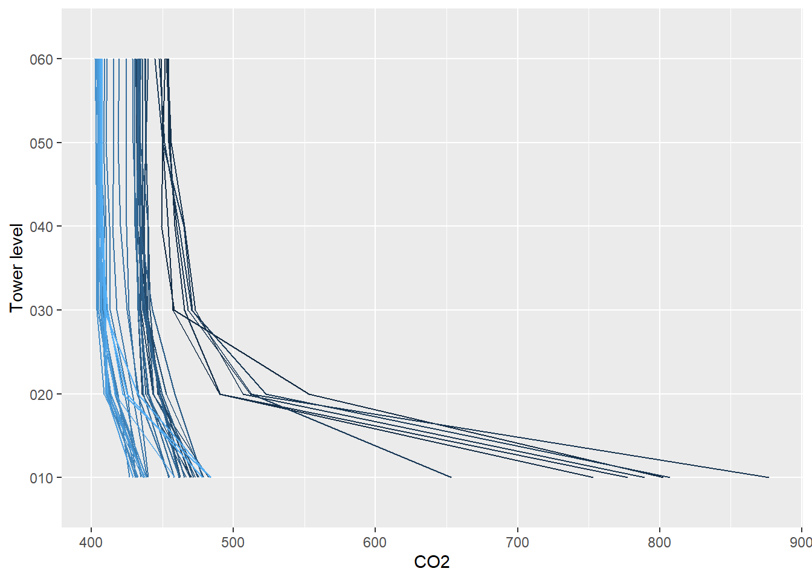


```r
g <- ggplot(iso.d, aes(y=verticalPosition)) + 
  geom_path(aes(x=data.isoCo2.dlta13CCo2.mean, 
                group=timeBgn, col=timeBgn)) + 
  theme(legend.position="none") + 
  xlab("d13C") + ylab("Tower level")
g
```

```
## Warning: Removed 55 row(s) containing missing values (geom_path).
```

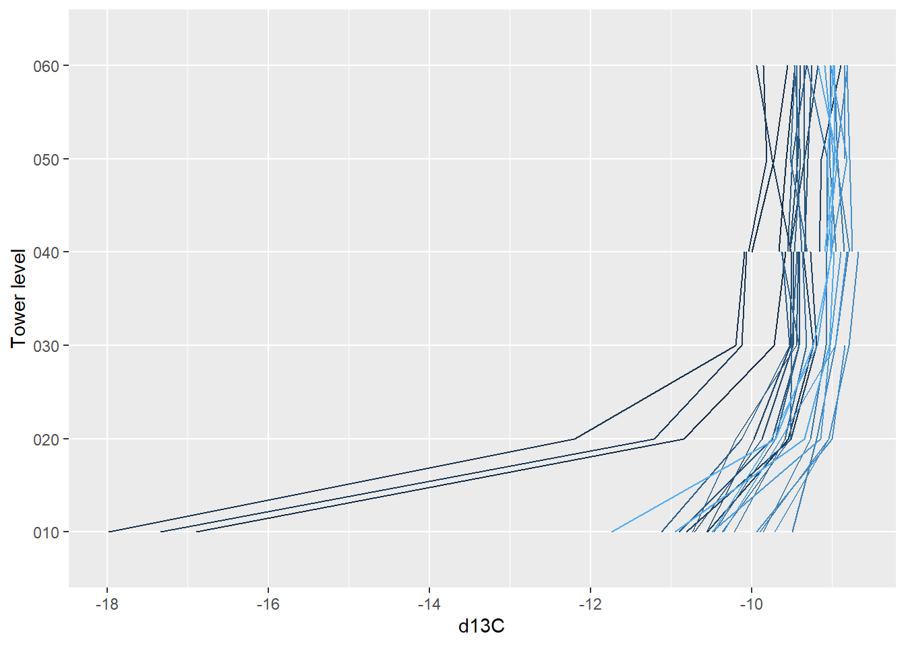

    Warning message:
    “Removed 55 rows containing missing values (geom_path).”


The legends are omitted for space, see if you can work out the times of
day the different colors represent.

### Convert NEON flux data variables to AmeriFlux FP standard

Install and load packages


```r
#Install most  recent version of ffbase from GitHub, this is a package dependency of eddy4R.base

devtools::install_github("edwindj/ffbase", subdir="pkg")
```

```
## Skipping install of 'ffbase' from a github remote, the SHA1 (14f75881) has not changed since last install.
##   Use `force = TRUE` to force installation
```

```r
#Install NEONprocIS.base from GitHub, this package is a dependency of eddy4R.base

devtools::install_github(repo="NEONScience/NEON-IS-data-processing",
                         ref="master",
                         subdir="pack/NEONprocIS.base",
                         dependencies=c(NA, TRUE)[2],
                         repos=c(BiocManager::repositories(),   # for dependencies on Bioconductor packages
                                 "https://cran.rstudio.com/")       # for CRAN
)
```

```
## Skipping install of 'NEONprocIS.base' from a github remote, the SHA1 (169ddfba) has not changed since last install.
##   Use `force = TRUE` to force installation
```

```r
#Install eddy4R.base from GitHub

devtools::install_github(repo="NEONScience/eddy4R",
                         ref="master",
                         subdir="pack/eddy4R.base",
                         dependencies=c(NA, TRUE)[2],
                         repos=c(BiocManager::repositories(),   # for dependencies on Bioconductor packages
                                 "https://cran.rstudio.com/")       # for CRAN
)
```

```
## Skipping install of 'eddy4R.base' from a github remote, the SHA1 (d77bd677) has not changed since last install.
##   Use `force = TRUE` to force installation
```

```r
packReq <- c("rhdf5", "eddy4R.base", "jsonlite", "lubridate")

lapply(packReq, function(x) {
  print(x)
  if(require(x, character.only = TRUE) == FALSE) {
    install.packages(x)
    library(x, character.only = TRUE)
  }})
```

```
## [1] "rhdf5"
```

```
## Loading required package: rhdf5
```

```
## [1] "eddy4R.base"
```

```
## Loading required package: eddy4R.base
```

```
## [1] "jsonlite"
```

```
## Loading required package: jsonlite
```

```
## [1] "lubridate"
```

```
## Loading required package: lubridate
```

```
## 
## Attaching package: 'lubridate'
```

```
## The following objects are masked from 'package:base':
## 
##     date, intersect, setdiff, union
```

```
## [[1]]
## NULL
## 
## [[2]]
## NULL
## 
## [[3]]
## NULL
## 
## [[4]]
## NULL
```

```r
h5disableFileLocking()
```

Select your site of interest from the list of NEON sites below.


```r
site <- "KONZ"
  
  #"BARR","CLBJ","MLBS","DSNY","NIWO","ORNL","OSBS",
  #"SCBI","LENO","TALL","CPER","BART","HARV","BLAN",
  #"SERC","JERC","GUAN","LAJA","STEI","TREE","UNDE",
  #"KONA","KONZ","UKFS","GRSM","DELA","DCFS","NOGP",
  #"WOOD","RMNP","OAES","YELL","MOAB","STER","JORN",
  #"SRER","ONAQ","ABBY","WREF","SJER","SOAP","TEAK",
  #"TOOL","BONA","DEJU","HEAL","PUUM"
```

If you would like to download a set range of dates, define the following
paramemters. If these are not defined, it will default to the entire
record at the site


```r
#define start and end dates, optional, defaults to entire period of site operation. Use %Y-%m-%d format.
dateBgn <- "2020-03-01"
dateEnd <- "2020-05-31"

# Data package from the portal
Pack <- c('basic','expanded')[1]
#The version data for the FP standard conversion processing
ver = paste0("v",format(Sys.time(), "%Y%m%dT%H%m"))
```

Specify Download directory for HDF5 files from the NEON data portal and
output directory to save the resulting csv files. Change save paths to
where you want the files on your computer.


```r
#download directory
DirDnld=tempdir()

#Output directory, change this to where you want to save the output csv
DirOutBase <-paste0("~/eddy/data/Ameriflux/",ver)
```

Specify Data Product number, for the Bundled Eddy-Covariance files, this
is DP4.00200.001


```r
#DP number
dpID <- 'DP4.00200.001'
```

Get metadata from Ameriflux Site Info BADM sheets for the site of
interest


```r
  #Grab a list of all Ameriflux sites, containing site ID and site description
  sites_web <- jsonlite::fromJSON("http://ameriflux-data.lbl.gov/AmeriFlux/SiteSearch.svc/SiteList/AmeriFlux")
  
  #Grab only NEON sites
  sitesNeon <- sites_web[grep(pattern = paste0("NEON.*",site), x = sites_web$SITE_NAME),] #For all NEON sites
  siteNeon <- sites_web[grep(pattern = paste0("NEON.*",site), x = sites_web$SITE_NAME),]
  
  metaSite <- lapply(siteNeon$SITE_ID, function(x) {
    pathSite <- paste0("http://ameriflux-data.lbl.gov/BADM/Anc/SiteInfo/",x)
    tmp <- fromJSON(pathSite)
    return(tmp)
    }) 
```

Use Ameriflux site IDs to name metadata lists


```r
#use NEON ID as list name
  names(metaSite) <- site 
#Use Ameriflux site ID as list name  
  #names(metaSite) <- sitesNeon$SITE_ID 
```

Check if dateBgn is defined, if not make it the initial operations date
"IOCR" of the site


```r
  if(!exists("dateBgn") || is.na(dateBgn) || is.null(dateBgn)){
    dateBgn <- as.Date(metaSite[[site]]$values$GRP_FLUX_MEASUREMENTS[[1]]$FLUX_MEASUREMENTS_DATE_START, "%Y%m%d")
  } else {
    dateBgn <- dateBgn
  }#End of checks for missing dateBgn
  
  #Check if dateEnd is defined, if not make it the system date
  if(!exists("dateEnd") || is.na(dateEnd) || is.null(dateEnd)){
    dateEnd <- as.Date(Sys.Date())
  } else {
    dateEnd <- dateEnd
  }#End of checks for missing dateEnd
```

Grab the UTC time offset from the Ameriflux API


```r
  timeOfstUtc <- as.integer(metaSite[[site]]$values$GRP_UTC_OFFSET[[1]]$UTC_OFFSET)
```

Create the date sequence


```r
  setDate <- seq(from = as.Date(dateBgn), to = as.Date(dateEnd), by = "month")
```

Start processing the site time range specified, verify that the site and
date range are specified as intended


```r
  msg <- paste0("Starting Ameriflux FP standard conversion processing workflow for ", site, " for ", dateBgn, " to ", dateEnd)
  print(msg)
```

```
## [1] "Starting Ameriflux FP standard conversion processing workflow for KONZ for 2020-03-01 to 2020-05-31"
```

Create output directory by checking if the download directory exists and
create it if not


```r
  if(dir.exists(DirDnld) == FALSE) dir.create(DirDnld, recursive = TRUE)
  #Append the site to the base output directory
  DirOut <- paste0(DirOutBase, "/", siteNeon$SITE_ID)
  #Check if directory exists and create if not
  if(!dir.exists(DirOut)) dir.create(DirOut, recursive = TRUE)
```


Download and extract data


```r
#Initialize data List
  dataList <- list()

  #Read data from the API
  dataList <- lapply(setDate, function(x) {
    date <- stringr::str_extract(x, pattern = paste0("[0-9]{4}", "-", "[0-9]{2}"))
    tryCatch(neonUtilities::zipsByProduct(dpID = dpID, site = site, startdate = date, enddate = date, package =      "basic", savepath = DirDnld, check.size = FALSE), error=function(e) NULL)
    files <- list.files(paste0(DirDnld, "/filesToStack00200"))
    utils::unzip(paste0(DirDnld, "/filesToStack00200/", files[grep(pattern = paste0(site,".*.", date, ".*.zip"),     x = files)]), exdir = paste0(DirDnld, "/filesToStack00200"))
    files <- list.files(paste0(DirDnld, "/filesToStack00200"))
    R.utils::gunzip(paste0(DirDnld, "/filesToStack00200/", files[grep(pattern = paste0(site, ".*.", date,            ".*.h5.gz"), x = files)]), remove = FALSE)
    files <- list.files(paste0(DirDnld, "/filesToStack00200"))
    dataIdx <- rhdf5::h5read(file = paste0(DirDnld, "/filesToStack00200/", max(files[grep(pattern =                  paste0(site,".*.", date,".*.h5$"), x = files)])), name = paste0(site, "/"))
                      
    if(!is.null(dataIdx)){ 
       dataIdx$dp0p <- NULL 
       dataIdx$dp02 <- NULL 
       dataIdx$dp03 <- NULL
       dataIdx$dp01$ucrt <- NULL 
       dataIdx$dp04$ucrt <- NULL 
       dataIdx$dp01$data <- lapply(dataIdx$dp01$data,FUN=function(var){ 
         nameTmi <- names(var) 
         var <- var[grepl('_30m',nameTmi)] 
         return(var)})
       dataIdx$dp01$qfqm <- lapply(dataIdx$dp01$qfqm,FUN=function(var){ 
         nameTmi <- names(var)
         var <- var[grepl('_30m',nameTmi)]
         return(var)})
    }
    return(dataIdx)
  })
```

```
## Finding available files
## 
  |                                                                            
  |                                                                      |   0%
  |                                                                            
  |======================================================================| 100%
## 
## Downloading files totaling approximately 83.333588 MB
## Downloading 1 files
## 
  |                                                                            
  |                                                                      |   0%
  |                                                                            
  |======================================================================| 100%
## 1 files successfully downloaded to C:\Users\rohan\AppData\Local\Temp\Rtmp4G7ymj/filesToStack00200
## Finding available files
## 
  |                                                                            
  |                                                                      |   0%
  |                                                                            
  |======================================================================| 100%
## 
## Downloading files totaling approximately 68.719186 MB
## Downloading 1 files
## 
  |                                                                            
  |                                                                      |   0%
  |                                                                            
  |======================================================================| 100%
## 1 files successfully downloaded to C:\Users\rohan\AppData\Local\Temp\Rtmp4G7ymj/filesToStack00200
## Finding available files
## 
  |                                                                            
  |                                                                      |   0%
  |                                                                            
  |======================================================================| 100%
## 
## Downloading files totaling approximately 69.960912 MB
## Downloading 1 files
## 
  |                                                                            
  |                                                                      |   0%
  |                                                                            
  |======================================================================| 100%
## 1 files successfully downloaded to C:\Users\rohan\AppData\Local\Temp\Rtmp4G7ymj/filesToStack00200
```

Add names to list for year/month combinations


```r
names(dataList) <- paste0(lubridate::year(setDate),sprintf("%02d",lubridate::month(setDate)))
```

Remove NULL elements from list


```r
dataList <- dataList[vapply(dataList, Negate(is.null), NA)]
```

Determine tower horizontal & vertical indices


```r
    #Find the tower top level by looking at the vertical index of the turbulent CO2 concentration measurements 
    LvlTowr <- grep(pattern = "_30m", names(dataList[[1]]$dp01$data$co2Turb), value = TRUE)
    LvlTowr <- gsub(x = LvlTowr, pattern = "_30m", replacement = "")
    
    #get tower top level
    LvlTop <- strsplit(LvlTowr,"")
    LvlTop <- base::as.numeric(LvlTop[[1]][6])
    
    #Ameriflux vertical levels based off of https://ameriflux.lbl.gov/data/aboutdata/data-variables/ section 3.3.1 "Indices must be in order, starting with the highest."
    idxVerAmfx <- base::seq(from = 1, to = LvlTop, by = 1)
    #get the sequence from top to first level
    LvlMeas <- base::seq(from = LvlTop, to = 1, by = -1)
    #Recreate NEON naming conventions
    LvlMeas <- paste0("000_0",LvlMeas,"0",sep="")
    #Give NEON naming conventions to Ameriflux vertical levels
    names(idxVerAmfx) <- LvlMeas
    
    #Ameriflux horizontal index
    idxHorAmfx <- 1
```

Subset to the Ameriflux variables to convert


```r
    dataListFlux <- lapply(names(dataList), function(x) {
      data.frame(
        "TIMESTAMP_START" = as.POSIXlt(dataList[[x]]$dp04$data$fluxCo2$turb$timeBgn, format="%Y-%m-%dT%H:%M:%OSZ", tz = "GMT"),
        "TIMESTAMP_END" = as.POSIXlt(dataList[[x]]$dp04$data$fluxCo2$turb$timeEnd, format="%Y-%m-%dT%H:%M:%OSZ", tz = "GMT"),
        # "TIMESTAMP_START" = strftime(as.POSIXlt(dataList[[x]][[idxSite]]$dp04$data$fluxCo2$turb$timeBgn, format="%Y-%m-%dT%H:%M:%OSZ"), format = "%Y%m%d%H%M"),
        # "TIMESTAMP_END" = strftime(as.POSIXlt(dataList[[x]][[idxSite]]$dp04$data$fluxCo2$turb$timeEnd, format="%Y-%m-%dT%H:%M:%OSZ") + 60, format = "%Y%m%d%H%M"),
        "FC"= dataList[[x]]$dp04$data$fluxCo2$turb$flux,
        "SC"= dataList[[x]]$dp04$data$fluxCo2$stor$flux,
        "NEE"= dataList[[x]]$dp04$data$fluxCo2$nsae$flux,
        "LE" = dataList[[x]]$dp04$data$fluxH2o$turb$flux,
        "SLE" = dataList[[x]]$dp04$data$fluxH2o$stor$flux,
        "USTAR" = dataList[[x]]$dp04$data$fluxMome$turb$veloFric,
        
        "H" = dataList[[x]]$dp04$data$fluxTemp$turb$flux,
        "SH" = dataList[[x]]$dp04$data$fluxTemp$stor$flux,
        "FETCH_90" = dataList[[x]]$dp04$data$foot$stat$distXaxs90,
        "FETCH_MAX" = dataList[[x]]$dp04$data$foot$stat$distXaxsMax,
        "V_SIGMA" = dataList[[x]]$dp04$data$foot$stat$veloYaxsHorSd,
        #"W_SIGMA" = dataList[[x]]$dp04$data$foot$stat$veloZaxsHorSd,
        "CO2_1_1_1" = dataList[[x]]$dp01$data$co2Turb[[paste0(LvlTowr,"_30m")]]$rtioMoleDryCo2$mean,
        "H2O_1_1_1" = dataList[[x]]$dp01$data$h2oTurb[[paste0(LvlTowr,"_30m")]]$rtioMoleDryH2o$mean,
        "qfFinlH2oTurbFrt00Samp" = dataList[[x]]$dp01$qfqm$h2oTurb[[paste0(LvlTowr,"_30m")]]$frt00Samp$qfFinl,
        "qfH2O_1_1_1" = dataList[[x]]$dp01$qfqm$h2oTurb[[paste0(LvlTowr,"_30m")]]$rtioMoleDryH2o$qfFinl,
        "qfCO2_1_1_1" = dataList[[x]]$dp01$qfqm$co2Turb[[paste0(LvlTowr,"_30m")]]$rtioMoleDryCo2$qfFinl,
        "qfSC" = dataList[[x]]$dp04$qfqm$fluxCo2$stor$qfFinl,
        "qfSLE" = dataList[[x]]$dp04$qfqm$fluxH2o$stor$qfFinl,
        "qfSH" = dataList[[x]]$dp04$qfqm$fluxTemp$stor$qfFinl,
        "qfT_SONIC" = dataList[[x]]$dp01$qfqm$soni[[paste0(LvlTowr,"_30m")]]$tempSoni$qfFinl,
        "qfWS_1_1_1" = dataList[[x]]$dp01$qfqm$soni[[paste0(LvlTowr,"_30m")]]$veloXaxsYaxsErth$qfFinl,
        rbind.data.frame(lapply(names(idxVerAmfx), function(y) {
          tryCatch({rlog$debug(y)}, error=function(cond){print(y)})
          rpt <- list()
          rpt[[paste0("CO2_1_",idxVerAmfx[y],"_2")]] <- dataList[[x]]$dp01$data$co2Stor[[paste0(y,"_30m")]]$rtioMoleDryCo2$mean
          
          
          rpt[[paste0("H2O_1_",idxVerAmfx[y],"_2")]] <- dataList[[x]]$dp01$data$h2oStor[[paste0(y,"_30m")]]$rtioMoleDryH2o$mean
          rpt[[paste0("CO2_1_",idxVerAmfx[y],"_3")]] <- dataList[[x]]$dp01$data$isoCo2[[paste0(y,"_30m")]]$rtioMoleDryCo2$mean
          
          rpt[[paste0("H2O_1_",idxVerAmfx[y],"_3")]] <- dataList[[x]]$dp01$data$isoCo2[[paste0(y,"_30m")]]$rtioMoleDryH2o$mean
          rpt[[paste0("qfCO2_1_",idxVerAmfx[y],"_2")]] <- dataList[[x]]$dp01$qfqm$co2Stor[[paste0(LvlTowr,"_30m")]]$rtioMoleDryCo2$qfFinl
          rpt[[paste0("qfH2O_1_",idxVerAmfx[y],"_2")]] <- dataList[[x]]$dp01$qfqm$h2oStor[[paste0(LvlTowr,"_30m")]]$rtioMoleDryH2o$qfFinl
          rpt[[paste0("qfCO2_1_",idxVerAmfx[y],"_3")]] <- dataList[[x]]$dp01$qfqm$isoCo2[[paste0(LvlTowr,"_30m")]]$rtioMoleDryCo2$qfFinl
          rpt[[paste0("qfH2O_1_",idxVerAmfx[y],"_3")]] <- dataList[[x]]$dp01$qfqm$isoH2o[[paste0(LvlTowr,"_30m")]]$rtioMoleDryH2o$qfFinl
          
          rpt <- rbind.data.frame(rpt)
          return(rpt)
        }
        )),
        
        
        "WS_1_1_1" = dataList[[x]]$dp01$data$soni[[paste0(LvlTowr,"_30m")]]$veloXaxsYaxsErth$mean,
        "WS_MAX_1_1_1" = dataList[[x]]$dp01$data$soni[[paste0(LvlTowr,"_30m")]]$veloXaxsYaxsErth$max,
        "WD_1_1_1" = dataList[[x]]$dp01$data$soni[[paste0(LvlTowr,"_30m")]]$angZaxsErth$mean,
        "T_SONIC" = dataList[[x]]$dp01$data$soni[[paste0(LvlTowr,"_30m")]]$tempSoni$mean,
        "T_SONIC_SIGMA" = base::sqrt(dataList[[x]]$dp01$data$soni[[paste0(LvlTowr,"_30m")]]$tempSoni$mean)
        , stringsAsFactors = FALSE)
    })
```

```
## [1] "000_040"
## [1] "000_030"
## [1] "000_020"
## [1] "000_010"
```

```
## Warning in base::sqrt(dataList[[x]]$dp01$data$soni[[paste0(LvlTowr, "_30m")]]
## $tempSoni$mean): NaNs produced
```

```
## [1] "000_040"
## [1] "000_030"
## [1] "000_020"
## [1] "000_010"
```

```
## Warning in base::sqrt(dataList[[x]]$dp01$data$soni[[paste0(LvlTowr, "_30m")]]
## $tempSoni$mean): NaNs produced
```

```
## [1] "000_040"
## [1] "000_030"
## [1] "000_020"
## [1] "000_010"
```

```r
    names(dataListFlux) <- names(dataList)
```

Combine the monthly data into a single dataframe, remove lists and clean
memory


```r
    dataDfFlux <- do.call(rbind.data.frame,dataListFlux)
    rm(list=c("dataListFlux","dataList"))
    gc()
```

```
##            used  (Mb) gc trigger  (Mb) max used  (Mb)
## Ncells  1488060  79.5    3173575 169.5  3173575 169.5
## Vcells 16213942 123.8   72281189 551.5 75226210 574.0
```

Regularize timeseries to 30 minutes in case timestamps are missing from
NEON files due to processing errors


```r
    timeRglr <- eddy4R.base::def.rglr(timeMeas = as.POSIXlt(dataDfFlux$TIMESTAMP_START), dataMeas = dataDfFlux, BgnRglr = as.POSIXlt(dataDfFlux$TIMESTAMP_START[1]), EndRglr = as.POSIXlt(dataDfFlux$TIMESTAMP_END[length(dataDfFlux$TIMESTAMP_END)]), TzRglr = "UTC", FreqRglr = 1/(60*30))
    
    #Reassign data to data.frame
    dataDfFlux <- timeRglr$dataRglr
    #Format timestamps
    dataDfFlux$TIMESTAMP_START <- strftime(timeRglr$timeRglr + lubridate::hours(timeOfstUtc), format = "%Y%m%d%H%M")
    dataDfFlux$TIMESTAMP_END <- strftime(timeRglr$timeRglr + lubridate::hours(timeOfstUtc) + lubridate::minutes(30), format = "%Y%m%d%H%M")
```

Define validation times, and remove this data from the dataset. At NEON
sites, validations with a series of gasses of known concentration are
run every 23.5 hours. These values are used to correct for measurment
drift and are run every 23.5 hours to achive daily resolution while also
spreading the impact of lost measurements throughout the day.


```r
    #Remove co2Turb and h2oTurb data based off of qfFlow (qfFinl frt00)
    dataDfFlux$FC[(which(dataDfFlux$qfCO2_1_1_1 == 1))] <- NaN
    dataDfFlux$LE[(which(dataDfFlux$qfH2O_1_1_1 == 1))] <- NaN
    dataDfFlux$USTAR[(which(dataDfFlux$qfWS_1_1_1 == 1))] <- NaN
    dataDfFlux$H[(which(dataDfFlux$qfT_SONIC_1_1_1 == 1))] <- NaN
    dataDfFlux$SC[(which(dataDfFlux$qfSC == 1))] <- NaN
    dataDfFlux$SLE[(which(dataDfFlux$qfSLE == 1))] <- NaN
    dataDfFlux$SH[(which(dataDfFlux$qfSH == 1))] <- NaN
    dataDfFlux$T_SONIC[(which(dataDfFlux$qfT_SONIC_1_1_1 == 1))] <- NaN
    dataDfFlux$T_SONIC_SIGMA[(which(dataDfFlux$qfT_SONIC_1_1_1 == 1))] <- NaN
    dataDfFlux$WS_1_1_1[(which(dataDfFlux$qfWS_1_1_1 == 1))] <- NaN
    dataDfFlux$WS_MAX_1_1_1[(which(dataDfFlux$qfWS_1_1_1 == 1))] <- NaN
    dataDfFlux$WD_1_1_1[(which(dataDfFlux$qfWS_1_1_1 == 1))] <- NaN
    
    dataDfFlux$H2O_1_1_1[(which(dataDfFlux$qfH2O_1_1_1 == 1))] <- NaN
    dataDfFlux$CO2_1_1_1[(which(dataDfFlux$qfCO2_1_1_1 == 1))] <- NaN
    
    lapply(idxVerAmfx, function(x){
      #x <- 1
      dataDfFlux[[paste0("H2O_1_",x,"_2")]][(which(dataDfFlux[[paste0("qfH2O_1_",x,"_2")]] == 1))] <<- NaN
      dataDfFlux[[paste0("H2O_1_",x,"_3")]][(which(dataDfFlux[[paste0("qfH2O_1_",x,"_3")]] == 1))] <<- NaN
      dataDfFlux[[paste0("CO2_1_",x,"_2")]][(which(dataDfFlux[[paste0("qfCO2_1_",x,"_2")]] == 1))] <<- NaN
      dataDfFlux[[paste0("CO2_1_",x,"_3")]][(which(dataDfFlux[[paste0("qfCO2_1_",x,"_3")]] == 1))] <<- NaN
    })
```

```
## $`000_040`
## [1] NaN
## 
## $`000_030`
## [1] NaN
## 
## $`000_020`
## [1] NaN
## 
## $`000_010`
## [1] NaN
```

Remove quality flagging variables from output


```r
    setIdxQf <- grep("qf", names(dataDfFlux))
    dataDfFlux[,setIdxQf] <- NULL
```

Set range thresholds


```r
    #assign list
    Rng <- list()
    
    Rng$Min <- data.frame(
      "FC" = -100,            #[umol m-2 s-1]
      "SC" = -100,            #[umol m-2 s-1]
      "NEE" = -100,            #[umol m-2 s-1]
      "LE" = -500,            #[W m-2]
      "H" = -500,             #[W m-2]
      "USTAR" = 0,            #[m s-1]
      "CO2" = 200,            #[umol mol-1]
      "H2O" = 0,              #[mmol mol-1]
      "WS_1_1_1" = 0,         #[m s-1]
      "WS_MAX_1_1_1" = 0,     #[m s-1]
      "WD_1_1_1" = -0.1,      #[deg]
      "T_SONIC" = -55.0       #[C]
    )
```

Set Max thresholds


```r
    Rng$Max <- data.frame(
      "FC" = 100,            #[umol m-2 s-1]
      "SC" = 100,            #[umol m-2 s-1]
      "NEE" = 100,            #[umol m-2 s-1]
      "LE" = 1000,            #[W m-2]
      "H" = 1000,             #[W m-2]
      "USTAR" = 5,            #[m s-1]
      "CO2" = 800,            #[umol mol-1]
      "H2O" = 100,              #[mmol mol-1]
      "WS_1_1_1" = 50,         #[m s-1]
      "WS_MAX_1_1_1" = 50,     #[m s-1]
      "WD_1_1_1" = 360,      #[deg]
      "T_SONIC" = 45.0       #[C]
    )
```

Grab all CO2/H2O columns to apply same thresholds, replace missing
values with -9999


```r
    nameCO2 <- grep("CO2",names(dataDfFlux),value = TRUE)
    nameH2O <- grep("H2O",names(dataDfFlux),value = TRUE)
    #Apply the CO2/H2O threshold to all variables in HOR_VER_REP
    Rng$Min[nameCO2] <- Rng$Min$CO2
    Rng$Min[nameH2O] <- Rng$Min$H2O
    Rng$Max[nameCO2] <- Rng$Max$CO2
    Rng$Max[nameH2O] <- Rng$Max$H2O
    
    #Apply the range test to the output, and replace values with NaN
    lapply(names(dataDfFlux), function(x) {
      dataDfFlux[which(dataDfFlux[,x]<Rng$Min[[x]] | dataDfFlux[,x]>Rng$Max[[x]]),x] <<- NaN})
```

```
## [[1]]
## [1] NaN
## 
## [[2]]
## [1] NaN
## 
## [[3]]
## [1] NaN
## 
## [[4]]
## [1] NaN
## 
## [[5]]
## [1] NaN
## 
## [[6]]
## [1] NaN
## 
## [[7]]
## [1] NaN
## 
## [[8]]
## [1] NaN
## 
## [[9]]
## [1] NaN
## 
## [[10]]
## [1] NaN
## 
## [[11]]
## [1] NaN
## 
## [[12]]
## [1] NaN
## 
## [[13]]
## [1] NaN
## 
## [[14]]
## [1] NaN
## 
## [[15]]
## [1] NaN
## 
## [[16]]
## [1] NaN
## 
## [[17]]
## [1] NaN
## 
## [[18]]
## [1] NaN
## 
## [[19]]
## [1] NaN
## 
## [[20]]
## [1] NaN
## 
## [[21]]
## [1] NaN
## 
## [[22]]
## [1] NaN
## 
## [[23]]
## [1] NaN
## 
## [[24]]
## [1] NaN
## 
## [[25]]
## [1] NaN
## 
## [[26]]
## [1] NaN
## 
## [[27]]
## [1] NaN
## 
## [[28]]
## [1] NaN
## 
## [[29]]
## [1] NaN
## 
## [[30]]
## [1] NaN
## 
## [[31]]
## [1] NaN
## 
## [[32]]
## [1] NaN
## 
## [[33]]
## [1] NaN
## 
## [[34]]
## [1] NaN
## 
## [[35]]
## [1] NaN
## 
## [[36]]
## [1] NaN
```

```r
    # Delete any NEE that have either FC or SC removed
    dataDfFlux[is.na(dataDfFlux$FC) | is.na(dataDfFlux$SC),"NEE"] <- NaN
    
    #Change NA to -9999
    dataDfFlux[is.na(dataDfFlux)] <- -9999
```

Write output data to csv


```r
    #Create output filename based off of Ameriflux file naming convention
    nameFileOut <- base::paste0(DirOut,"/",siteNeon$SITE_ID,'_HH_',dataDfFlux$TIMESTAMP_START[1],'_',utils::tail(dataDfFlux$TIMESTAMP_END,n=1),'_flux.csv')
    
    #Write output to .csv
    write.csv(x = dataDfFlux, file = nameFileOut, row.names = FALSE)
```

Clean up environment


```r
  rm(list="dataDfFlux")
  gc()
```

```
##            used  (Mb) gc trigger  (Mb) max used  (Mb)
## Ncells  1491008  79.7    3173575 169.5  3173575 169.5
## Vcells 16289063 124.3   57824952 441.2 75226210 574.0
```


```
##  [1] TRUE TRUE TRUE TRUE TRUE TRUE TRUE TRUE TRUE TRUE TRUE TRUE TRUE TRUE
```

## Exercises

### Computational

1)  NEON data are submitted to AmeriFlux quarterly after one year of
    non-quality flagged or otherwise missing data are available. Use the
    workflow above to extend the data coverage of an already submitted
    NEON site by downloading existing data from the AmeriFlux website
    and recently published HDF5 files from the NEON data portal. Process
    the NEON data such that it is in AmeriFlux format and plot the
    entire timerseries.

*Hint: NEON sites start with US-x*

2)  Using metScanR package, find co-located NEON and AmeriFlux sites.
    Download data for an overlapping time period, and compare FC and H
    values by making a scatter plot and seeing how far off the data are
    from a 1:1 line.

<!--chapter:end:05-Fluxes_and_Inter-operability.Rmd-->


# NEON AOP

<iframe width="560" height="315" src="https://www.youtube.com/embed/f5e-X9dMnXs" frameborder="0" allow="accelerometer; autoplay; clipboard-write; encrypted-media; gyroscope; picture-in-picture" allowfullscreen></iframe>

## Learning Objectives
After completing this tutorial, you will be able to:

* Define hyperspectral remote sensing. 
* Explain the fundamental principles of hyperspectral remote sensing data.
* Describe the key attributes that are required to effectively work with 
  hyperspectral remote sensing data in tools like R or Python.
* Describe what a "band" is.

##About Hyperspectral remote sensing

### Mapping the Invisible

<iframe width="560" height="315" src="https://www.youtube.com/embed/3iaFzafWJQE" title="YouTube video player" frameborder="0" allow="accelerometer; autoplay; clipboard-write; encrypted-media; gyroscope; picture-in-picture" allowfullscreen></iframe>

### About Hyperspectral Remote Sensing Data

The electromagnetic spectrum is composed of thousands of bands representing 
different types of light energy. Imaging spectrometers (instruments that collect 
hyperspectral data) break the electromagnetic spectrum into groups of bands 
that support classification of objects by their spectral properties on the 
earth's surface. Hyperspectral data consists of many bands -- up to hundreds of 
bands -- that cover the electromagnetic spectrum.

The NEON imaging spectrometer collects data within the 380nm to 2510nm portions 
of the electromagnetic spectrum within bands that are approximately 5nm in 
width. This results in a hyperspectral data cube that contains approximately 
426 bands - which means big, big data.

## Key Metadata for Hyperspectral Data

### Bands and Wavelengths

A *band* represents a group of wavelengths. For example, the wavelength values 
between 695nm and 700nm might be one band as captured by an imaging spectrometer. 
The imaging spectrometer collects reflected light energy in a pixel for light 
in that band. Often when you work with a multi or hyperspectral dataset, the 
band information is reported as the center wavelength value. This value 
represents the center point value of the wavelengths represented in that band. 
Thus in a band spanning 695-700 nm, the center would be 697.5).


> Imaging spectrometers collect reflected light information within 
    defined bands or regions of the electromagnetic spectrum. Source: National 
    Ecological Observatory Network (NEON)


### Spectral Resolution
The spectral resolution of a dataset that has more than one band, refers to the 
width of each band in the dataset. In the example above, a band was defined as 
spanning 695-700nm. The width or spatial resolution of the band is thus 5 
nanometers. To see an example of this, check out the band widths for the 
<a href="http://landsat.usgs.gov/band_designations_landsat_satellites.php" target="_blank">Landsat sensors</a>.

 
### Full Width Half Max (FWHM)
The full width half max (FWHM) will also often be reported in a multi or 
hyperspectral dataset. This value represents the spread of the band around that 
center point. 


>The Full Width Half Max (FWHM) of a band relates to the distance 
    in nanometers between the band center and the edge of the band. In this 
    case, the FWHM for Band C is 5 nm.


In the illustration above, the band that covers 695-700nm has a FWHM of 5 nm. 
While a general spectral resolution of the sensor is often provided, not all 
sensors create bands of uniform widths. For instance bands 1-9 of Landsat 8 are 
listed below (Courtesy of <a href="http://landsat.usgs.gov" target="_blank">USGS</a>)


| Band | Wavelength range (microns) | Spatial Resolution (m) | Spectral Width (microns)|
|-------------------------------------|------------------|--------------------|----------------|
| Band 1 - Coastal aerosol | 0.43 - 0.45 | 30 | 0.02 |
| Band 2 - Blue | 0.45 - 0.51 | 30 | 0.06 |
| Band 3 - Green | 0.53 - 0.59 | 30 | 0.06 |
| Band 4 - Red | 0.64 - 0.67 | 30 | 0.03 |
| Band 5 - Near Infrared (NIR) | 0.85 - 0.88 | 30 | 0.03 |
| Band 6 - SWIR 1 | 1.57 - 1.65 | 30 | 0.08  |
| Band 7 - SWIR 2 | 2.11 - 2.29 | 30 | 0.18 |
| Band 8 - Panchromatic | 0.50 - 0.68 | 15 | 0.18 |
| Band 9 - Cirrus | 1.36 - 1.38 | 30 | 0.02 |


## Intro to Working with Hyperspectral Remote Sensing Data in HDF5 Format

> Contributors: Felipe Sanchez, Leah A. Wasser, Edmund Hart, Donal O'Leary
> Based on NEON Science Tutorial Series: https://www.neonscience.org/intro-hsi-r-series

In this tutorial, we will explore reading and extracting spatial raster data 
stored within a HDF5 file using R. 

<div id="ds-objectives" markdown="1">

### Learning Objectives
After completing this section, you will be able to:

* Explain how HDF5 data can be used to store spatial data and the associated 
benefits of this format when working with large spatial data cubes.
* Extract metadata from HDF5 files.
* Slice or subset HDF5 data. You will extract one band of pixels. 
* Plot a matrix as an image and a raster.
* Export a final GeoTIFF (spatially projected) that can be used both in further 
analysis and in common GIS tools like QGIS.


### R Libraries to Install:

* **rhdf5**: `install.packages("BiocManager")`, `BiocManager::install("rhdf5")`
* **raster**: `install.packages('raster')`
* **rgdal**: `install.packages('rgdal')`


### Data to Download

<h3><a href="https://ndownloader.figshare.com/files/21754221">
Download NEON Teaching Data Subset: Imaging Spectrometer Data - HDF5 </a></h3>

These hyperspectral remote sensing data provide information on the
<a href="https://www.neonscience.org/" target="_blank"> National Ecological Observatory Network's</a> 
<a href="https://www.neonscience.org/field-sites/field-sites-map/SJER" target="_blank" > San Joaquin 
Exerimental Range field site</a> in March of 2019.
The data were collected over the San Joaquin field site located in California 
(Domain 17) and processed at NEON headquarters. This data subset is derived from 
the mosaic tile named NEON_D17_SJER_DP3_257000_4112000_reflectance.h5. 
The entire dataset can be accessed by request from the 
<a href="http://data.neonscience.org" target="_blank"> NEON Data Portal</a>.

<a href="https://ndownloader.figshare.com/files/21754221" class="link--button link--arrow">
Download Dataset</a>

**Remember** that the example dataset linked here only has 1 out of every 4 bands
included in a full NEON hyperspectral dataset (this substantially reduces the file 
size!). When we refer to bands in this section, we will note the band numbers for 
this example dataset, which are different from NEON production data. To convert 
a band number (b) from this example data subset to the equivalent band in a full 
NEON hyperspectral file (b'), use the following equation: b' = 1+4*(b-1).


## About Hyperspectral Remote Sensing Data

The electromagnetic spectrum is composed of thousands of bands representing 
different types of light energy. Imaging spectrometers (instruments that collect 
hyperspectral data) break the electromagnetic spectrum into groups of bands that 
support classification of objects by their spectral properties on the Earth's 
surface. Hyperspectral data consists of many bands - up to hundreds of bands - 
that cover the electromagnetic spectrum.

The NEON imaging spectrometer (NIS) collects data within the 380 nm to 2510 nm 
portions of the electromagnetic spectrum within bands that are approximately 5 nm 
in width. This results in a hyperspectral data cube that contains approximately 
428 bands - which means BIG DATA. *Remember* that the example dataset used 
here only has 1 out of every 4 bands included in a full NEON hyperspectral dataset 
(this substantially reduces size!). When we refer to bands in this tutorial, 
we will note the band numbers for this example dataset, which may be different 
from NEON production data. 


>A data cube of NEON hyperspectral data. Each layer in the cube 
  represents a band.

 
The HDF5 data model natively compresses data stored within it (makes it smaller) 
and supports data slicing (extracting only the portions of the data that you 
need to work with rather than reading the entire dataset into memory). These 
features in addition to the ability to support spatial data and associated 
metadata make it ideal for working with large data cubes such as those generated 
by imaging spectrometers.


In this section we will explore reading and extracting spatial raster data 
stored within a HDF5 file using R. 

##  Read HDF5 data into R
We will use the `raster` and `rhdf5` packages to read in the HDF5 file that 
contains hyperspectral data for the 
<a href="https://www.neonscience.org/field-sites/field-sites-map/SJER" target="_blank">NEON San Joaquin (SJER) field site</a>. 
Let's start by calling the needed packages and reading in our NEON HDF5 file.  

Please be sure that you have *at least* version 2.10 of `rhdf5` installed. Use: 
`packageVersion("rhdf5")` to check the package version. 


```r
# Load `raster` and `rhdf5` packages and read NIS data into R
library(raster)
```

```
## Loading required package: sp
```

```r
library(rhdf5)
library(rgdal)
```

```
## Please note that rgdal will be retired by the end of 2023,
## plan transition to sf/stars/terra functions using GDAL and PROJ
## at your earliest convenience.
## 
## rgdal: version: 1.5-32, (SVN revision 1176)
## Geospatial Data Abstraction Library extensions to R successfully loaded
## Loaded GDAL runtime: GDAL 3.4.3, released 2022/04/22
## Path to GDAL shared files: C:/Users/rohan/AppData/Local/R/win-library/4.2/rgdal/gdal
## GDAL binary built with GEOS: TRUE 
## Loaded PROJ runtime: Rel. 7.2.1, January 1st, 2021, [PJ_VERSION: 721]
## Path to PROJ shared files: C:/Users/rohan/AppData/Local/R/win-library/4.2/rgdal/proj
## PROJ CDN enabled: FALSE
## Linking to sp version:1.5-0
## To mute warnings of possible GDAL/OSR exportToProj4() degradation,
## use options("rgdal_show_exportToProj4_warnings"="none") before loading sp or rgdal.
```

```r
# Define the file name to be opened
f <- ('./data/NEON_hyperspectral_tutorial_example_subset.h5')
```

<div id="ds-dataTip" markdown="1">
<i class="fa fa-star"></i> **Data Tip:** To update all packages installed in 
R, use `update.packages()`.
</div>


```r
# look at the HDF5 file structure 
head(h5ls(f,all=T))
```

When you look at the structure of the data, take note of the "map info" dataset,
the "Coordinate_System" group, and the "wavelength" and "Reflectance" datasets. The
"Coordinate_System" folder contains the spatial attributes of the data including its
EPSG Code, which is easily converted to a Coordinate Reference System (CRS). 
The CRS documents how the data are physically located on the Earth. The "wavelength" 
dataset contains the middle wavelength values for each band in the data. The 
"Reflectance" dataset contains the image data that we will use for both data processing 
and visualization.

More Information on raster metadata:

* <a href="https://www.neonscience.org/raster-data-r" target="_blank"> Raster Data in R 
- The Basics</a> - this tutorial explains more about how rasters work in R and 
their associated metadata.

* <a href="https://www.neonscience.org/hyper-spec-intro" target="_blank"> About 
Hyperspectral Remote Sensing Data</a> -this tutorial explains more about 
metadata and important concepts associated with multi-band (multi and 
hyperspectral) rasters.

<div id="ds-dataTip" markdown="1">
<i class="fa fa-star"></i>**Data Tip - HDF5 Structure:** Note that the structure
of individual HDF5 files may vary depending on who produced the data. In this
case, the Wavelength and reflectance data within the file are both datasets.
However, the spatial information is contained within a group. Data downloaded from
another organization like NASA, may look different. This is why it's important to
explore the data before diving into using it!
</div>

We can use the `h5readAttributes()` function to read and extract metadata from the 
HDF5 file. Let's start by learning about the wavelengths described within this file.


```r
# get information about the wavelengths of this dataset
wavelengthInfo <- h5readAttributes(f,"/SJER/Reflectance/Metadata/Spectral_Data/Wavelength")
wavelengthInfo
```

```
## $Description
## [1] "Central wavelength of the reflectance bands."
## 
## $Units
## [1] "nanometers"
```

Next, we can use the `h5read` function to read the data contained within the
HDF5 file. Let's read in the wavelengths of the band centers:


```r
# read in the wavelength information from the HDF5 file
wavelengths <- h5read(f,"/SJER/Reflectance/Metadata/Spectral_Data/Wavelength")
head(wavelengths)
```

```
## [1] 381.5437 401.5756 421.6075 441.6394 461.6713 481.7032
```

```r
tail(wavelengths)
```

```
## [1] 2404.764 2424.796 2444.828 2464.860 2484.892 2504.924
```

Which wavelength is band 6 associated with? 

(Hint: look at the wavelengths 
vector that we just imported and check out the data located at index 6 - 
`wavelengths[6]`).


>482 nanometers falls within the blue portion of the electromagnetic spectrum. Source: National Ecological Observatory Network 


Band 6 has a associate wavelength center of 481.7032 nanometers (nm) which is 
in the blue portion of the visible electromagnetic spectrum (~ 400-700 nm). 

### Bands and Wavelengths

A *band* represents 
a group of wavelengths. For example, the wavelength values between 695 nm and 700 nm 
might be one band as captured by an imaging spectrometer. The imaging spectrometer
collects reflected light energy in a pixel for light in that band. Often when you 
work with a multi or hyperspectral dataset, the band information is reported as 
the center wavelength value. This value represents the center point value of the 
wavelengths represented in that  band. Thus in a band spanning 695-700 nm, the 
center would be 697.5 nm). The full width half max (FWHM) will also be reported. 
This value represents the spread of the band around that center point. So, a band 
that covers 800 nm-805 nm might have a FWHM of 5 nm and a wavelength value of 
802.5 nm. 


> Bands represent a range of values (types of light) within the 
    electromagnetic spectrum. Values for each band are often represented as the 
    center point value of each band. Source: National Ecological Observatory 
    Network (NEON)


The HDF5 dataset that we are working with in this activity may contain more 
information than we need to work with. For example, we don't necessarily need 
to process all 107 bands available in this example dataset (or all 426 bands 
available in a full NEON hyperspectral reflectance file, for that matter)
- if we are interested in creating a product like NDVI which only uses bands in 
the near infra-red and red portions of the spectrum. Or we might only be interested 
in a spatial subset of the data - perhaps a region where we have plots in the field.

The HDF5 format allows us to slice (or subset) the data - quickly extracting the 
subset that we need to process. Let's extract one of the green bands in our 
dataset - band 9. 

By the way - what is the center wavelength value associated 
with band 9? 

Hint: `wavelengths[9]`. 

How do we know this band is a green band in the visible portion of the spectrum?

In order to effectively subset our data, let's first read the important 
reflectance metadata stored as *attributes* in the "Reflectance_Data" dataset. 


```r
# First, we need to extract the reflectance metadata:
reflInfo <- h5readAttributes(f, "/SJER/Reflectance/Reflectance_Data")
reflInfo
```

```
## $Cloud_conditions
## [1] "For cloud conditions information see Weather Quality Index dataset."
## 
## $Cloud_type
## [1] "Cloud type may have been selected from multiple flight trajectories."
## 
## $Data_Ignore_Value
## [1] -9999
## 
## $Description
## [1] "Atmospherically corrected reflectance."
## 
## $Dimension_Labels
## [1] "Line, Sample, Wavelength"
## 
## $Dimensions
## [1] 500 500 107
## 
## $Interleave
## [1] "BSQ"
## 
## $Scale_Factor
## [1] 10000
## 
## $Spatial_Extent_meters
## [1]  257500  258000 4112500 4113000
## 
## $Spatial_Resolution_X_Y
## [1] 1 1
## 
## $Units
## [1] "Unitless."
## 
## $Units_Valid_range
## [1]     0 10000
## 
## $dim
## [1] 107 500 500
```

```r
# Next, we read the different dimensions

nRows <- reflInfo$Dimensions[1]
nCols <- reflInfo$Dimensions[2]
nBands <- reflInfo$Dimensions[3]

nRows
```

```
## [1] 500
```

```r
nCols
```

```
## [1] 500
```

```r
nBands
```

```
## [1] 107
```


The HDF5 read function reads data in the order: Bands, Cols, Rows. This is
different from how R reads data. We'll adjust for this later.


```r
# Extract or "slice" data for band 9 from the HDF5 file
b9 <- h5read(f,"/SJER/Reflectance/Reflectance_Data",index=list(9,1:nCols,1:nRows)) 

# what type of object is b9?
class(b9)
```

```
## [1] "array"
```

### A Note About Data Slicing in HDF5
Data slicing allows us to extract and work with subsets of the data rather than 
reading in the entire dataset into memory. Thus, in this case, we can extract and 
plot the green band without reading in all 107 bands of information. The ability 
to slice large datasets makes HDF5 ideal for working with big data. 	

Next, let's convert our data from an array (more than 2 dimensions) to a matrix 
(just 2 dimensions). We need to have our data in a matrix format to plot it.


```r
# convert from array to matrix by selecting only the first band
b9 <- b9[1,,]

# check it
class(b9)
```

```
## [1] "matrix" "array"
```


### Arrays vs. Matrices

Arrays are matrices with more than 2 dimensions. When we say dimension, we are 
talking about the "z" 
associated with the data (imagine a series of tabs in a spreadsheet). Put the other 
way: matrices are arrays with only 2 dimensions. Arrays can have any number of 
dimensions one, two, ten or more. 

Here is a matrix that is 4 x 3 in size (4 rows and 3 columns):

| Metric    | species 1 | species 2 |
|----------------|-----------|-----------|
| total number   | 23        | 45        |
| average weight | 14        | 5         |
| average length | 2.4       | 3.5       |
| average height | 32        | 12        |

### Dimensions in Arrays
An array contains 1 or more dimensions in the "z" direction. For example, let's 
say that we collected the same set of species data for every day in a 30 day month.
We might then have a matrix like the one above for each day for a total of 30 days 
making a 4 x 3 x 30 array (this dataset has more than 2 dimensions). More on R object 
types <a href="http://www.statmethods.net/input/datatypes.html">here</a> 
(links to external site, DataCamp).


> A matrix has only 2 dimensions


>An array has more than 2 dimensions.


Next, let's look at the metadata for the reflectance data. When we do this, take 
note of 1) the scale factor and 2) the data ignore value. Then we can plot the 
band 9 data. Plotting spatial data as a visual "data check" is a good idea to 
make sure processing is being performed correctly and all is well with the image. 


```r
# look at the metadata for the reflectance dataset
h5readAttributes(f,"/SJER/Reflectance/Reflectance_Data")
```

```
## $Cloud_conditions
## [1] "For cloud conditions information see Weather Quality Index dataset."
## 
## $Cloud_type
## [1] "Cloud type may have been selected from multiple flight trajectories."
## 
## $Data_Ignore_Value
## [1] -9999
## 
## $Description
## [1] "Atmospherically corrected reflectance."
## 
## $Dimension_Labels
## [1] "Line, Sample, Wavelength"
## 
## $Dimensions
## [1] 500 500 107
## 
## $Interleave
## [1] "BSQ"
## 
## $Scale_Factor
## [1] 10000
## 
## $Spatial_Extent_meters
## [1]  257500  258000 4112500 4113000
## 
## $Spatial_Resolution_X_Y
## [1] 1 1
## 
## $Units
## [1] "Unitless."
## 
## $Units_Valid_range
## [1]     0 10000
## 
## $dim
## [1] 107 500 500
```

```r
# plot the image
image(b9)
```

<div class="figure">
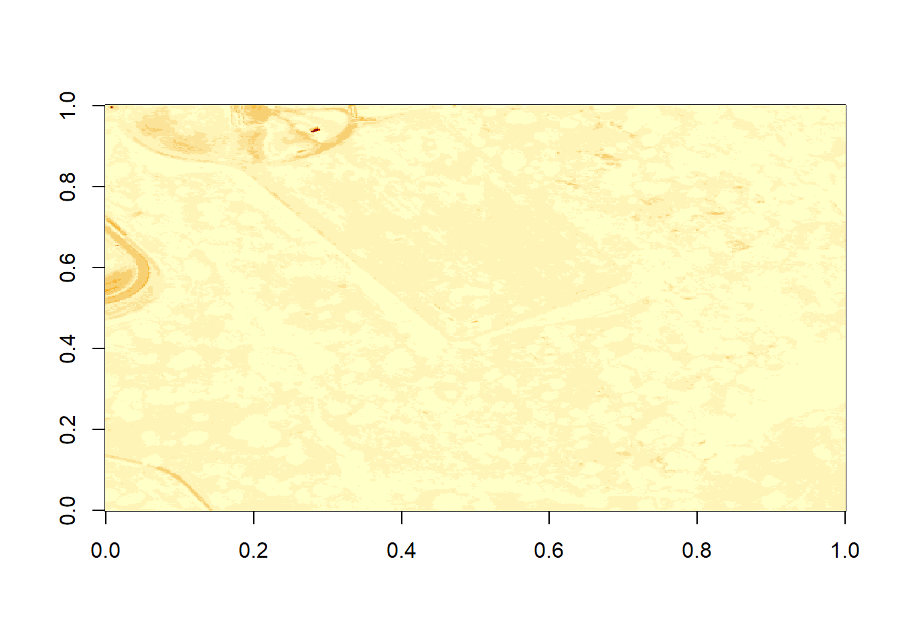
<p class="caption">(\#fig:read-attributes-plot)Plot of reflectance values for band 9 data. This plot shows a very washed out image lacking any detail.</p>
</div>

That is hard to visually interpret.
What happens if we plot a log of the data?

```r
image(log(b9))
```

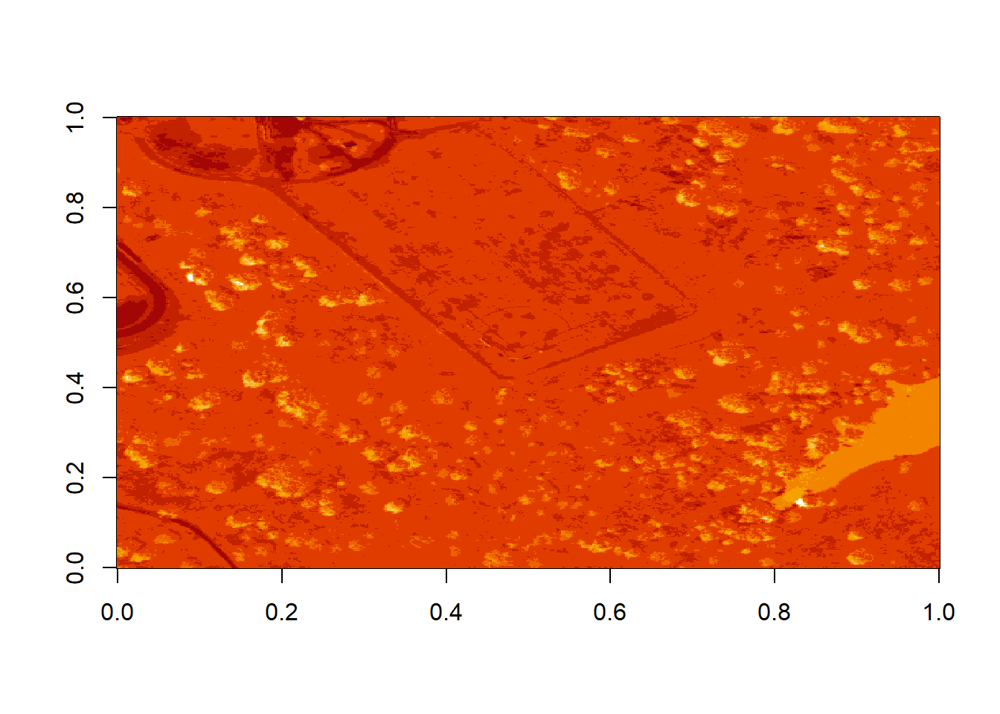

What do you notice about the first image? It's washed out and lacking any detail. What 
could be causing this? It got better when plotting the log of the values, but 
still not great. 

Let's look at the distribution of reflectance values in 
our data to figure out what is going on.


```r
# Plot range of reflectance values as a histogram to view range
# and distribution of values.
hist(b9,breaks=40,col="darkmagenta")
```

<div class="figure">
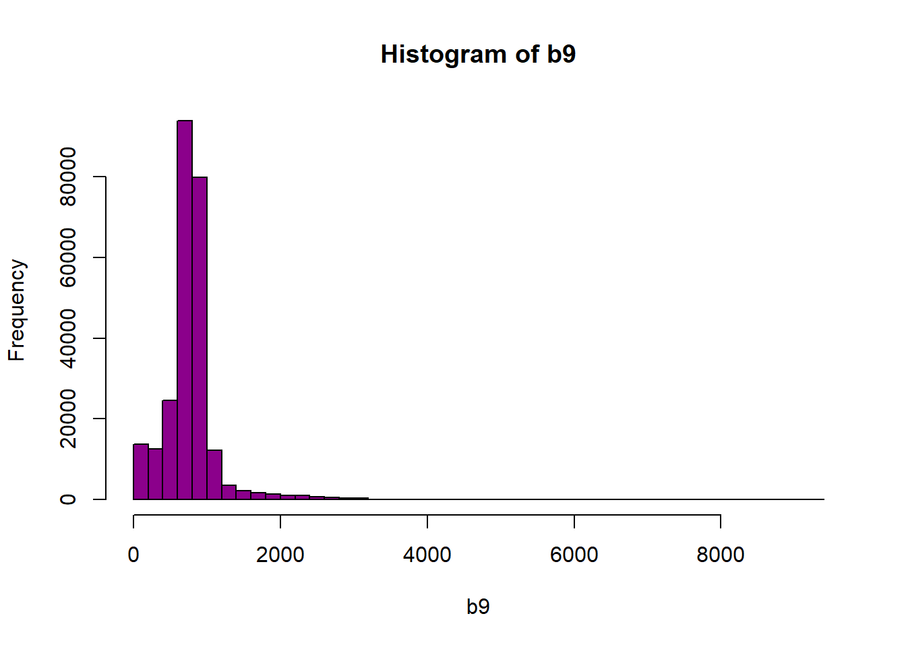
<p class="caption">(\#fig:hist-data-1)Histogram of reflectance values for band 9. The x-axis represents the reflectance values and ranges from 0 to 8000. The frequency of these values is on the y-axis. The histogram shows reflectance values are skewed to the right, where the majority of the values lie between 0 and 1000. We can conclude that reflectance values are not equally distributed across the range of reflectance values, resulting in a washed out image.</p>
</div>

```r
# View values between 0 and 5000
hist(b9,breaks=40,col="darkmagenta",xlim = c(0, 5000))
```

<div class="figure">
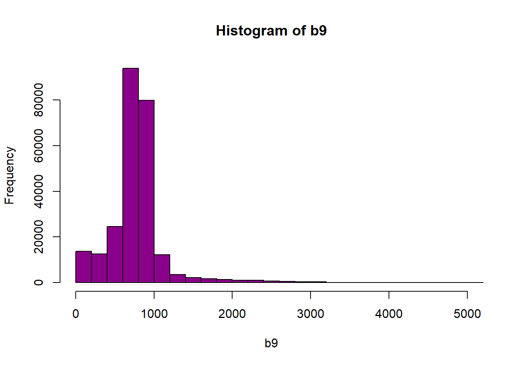
<p class="caption">(\#fig:hist-data-2)Histogram of reflectance values between 0 and 5000 for band 9. Reflectance values are on the x-axis, and the frequency is on the y-axis. The x-axis limit has been set 5000 in order to better visualize the distribution of reflectance values. We can confirm that the majority of the values are indeed within the 0 to 4000 range.</p>
</div>

```r
# View higher values
hist(b9, breaks=40,col="darkmagenta",xlim = c(5000, 15000),ylim=c(0,100))
```

<div class="figure">
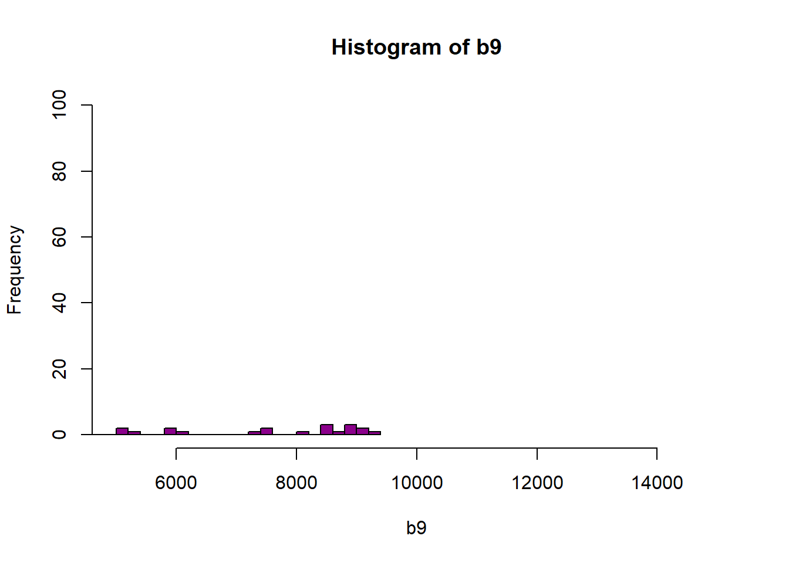
<p class="caption">(\#fig:hist-data-3)Histogram of reflectance values between 5000 and 15000 for band 9. Reflectance values are on the x-axis, and the frequency is on the y-axis. Plot shows that a very few number of pixels have reflectance values larger than 5,000. These values are skewing how the image is being rendered and heavily impacting the way the image is drawn on our monitor.</p>
</div>

As you're examining the histograms above, keep in mind that reflectance values 
range between 0-1. The **data scale factor** in the metadata tells us to divide 
all reflectance values by 10,000. Thus, a value of 5,000 equates to a reflectance 
value of 0.50. Storing data as integers (without decimal places) compared to 
floating points (with decimal places) creates a smaller file. You will see this 
done often when working with remote sensing data. 

Notice in the data that there are some larger reflectance values (>5,000) that 
represent a smaller number of pixels. These pixels are skewing how the image 
renders. 

### Data Ignore Value
Image data in raster 
format will often contain a data ignore value and a scale factor. The data ignore 
value represents pixels where there are no data. Among other causes, no data 
values may be attributed to the sensor not collecting data in that area of the 
image or to processing results which yield null values. 

Remember that the metadata for the `Reflectance` dataset designated -9999 as 
`data ignore value`. Thus, let's set all pixels with a value == -9999 to `NA` 
(no value). If we do this, R won't try to render these pixels.


```r
# there is a no data value in our raster - let's define it
myNoDataValue <- as.numeric(reflInfo$Data_Ignore_Value)
myNoDataValue
```

```
## [1] -9999
```

```r
# set all values equal to -9999 to NA
b9[b9 == myNoDataValue] <- NA

# plot the image now
image(b9)
```

<div class="figure">

<p class="caption">(\#fig:set-values-NA)Plot of reflectance values for band 9 data with values equal to -9999 set to NA. Image data in raster format will often contain no data values, which may be attributed to the sensor not collecting data in that area of the image or to processing results which yield null values. Reflectance datasets designate -9999 as data ignore values. As such, we will reassign -9999 values to NA so R won't try to render these pixels.</p>
</div>

### Reflectance Values and Image Stretch

Our image still looks dark because R is trying to render all reflectance values 
between 0 and 14999 as if they were distributed equally in the histogram. However 
we know they are not distributed equally. There are many more values between 
0-5000 then there are values >5000. 

Images have a distribution of reflectance values. A typical image viewing program 
will render the values by distributing the entire range of reflectance values  
across a range of "shades" that the monitor can render - between 0 and 255. 
However, often the distribution of reflectance values is not linear. For example, 
in the case of our data, most of the reflectance values fall between 0 and 0.5. 
Yet there are a few values >0.8 that are heavily impacting the way the image is 
drawn on our monitor. Imaging processing programs like ENVI, QGIS and ArcGIS (and 
even Adobe Photoshop) allow you to adjust the stretch of the image. This is similar 
to adjusting the contrast and brightness in Photoshop. 

The proper way to adjust our data would be 
what's called an `image stretch`. We will learn how to stretch our image data, 
later. For now, let's plot the values as the log function on the pixel 
reflectance values to factor out those larger values. 


```r
image(log(b9))
```

<div class="figure">

<p class="caption">(\#fig:plot-log)Plot of log transformed reflectance values for the previous b9 image. Applying the log to the image increases the contrast making it look more like an image by factoring out those larger values. While an improvement, the image is still far from great. The proper way to adjust an image is by doing whats called an image stretch.</p>
</div>

The log applied to our image increases the contrast making it look more like an 
image. However, look at the images below. The top one is what our log adjusted 
image looks like when plotted. The bottom on is an RGB version of the same image. 
Notice a difference? 


    </a>
    <a href="https://raw.githubusercontent.com/NEONScience/NEON-Data-Skills/dev-aten/graphics/hyperspectral-general/SJER_Flipped.png">
    
    </a>
    <figcaption>TOP: The image as it should look. BOTTOM: the image that we outputted from the code above. Notice a difference?</figcaption>


### Transpose Image

Notice that there are three data dimensions for this file: Bands x Rows x 
Columns. However, when R reads in the dataset, it reads them as: Columns x 
Bands x Rows. The data are flipped. We can quickly transpose the data to correct 
for this using the `t` or `transpose` command in R.

The orientation is rotated in our log adjusted image. This is because R reads 
in matrices starting from the upper left hand corner. Whereas, most rasters 
read pixels starting from the lower left hand corner. In the next section, we 
will deal with this issue by creating a proper georeferenced (spatially located) 
raster in R. The raster format will read in pixels following the same methods 
as other GIS and imaging processing software like QGIS and ENVI do.


```r
# We need to transpose x and y values in order for our 
# final image to plot properly
b9 <- t(b9)
image(log(b9), main="Transposed Image")
```

<div class="figure">
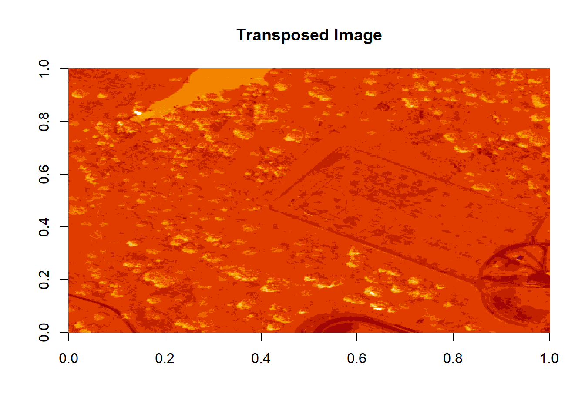
<p class="caption">(\#fig:transpose-data)Plot showing the transposed image of the log transformed reflectance values of b9. The orientation of the image is rotated in our log transformed image, because R reads in the matrices starting from the upper left hand corner.</p>
</div>


## Create a Georeferenced Raster

Next, we will create a proper raster using the `b9` matrix. The raster 
format will allow us to define and manage:

* Image stretch
* Coordinate reference system & spatial reference
* Resolution
* and other raster attributes...

It will also account for the orientation issue discussed above.
 
To create a raster in R, we need a few pieces of information, including: 

* The coordinate reference system (CRS)
* The spatial extent of the image 


### Define Raster CRS

First, we need to define the Coordinate reference system (CRS) of the raster. 
To do that, we can first grab the EPSG code from the HDF5 attributes, and covert the
EPSG to a CRS string. Then we can assign that CRS to the raster object.


```r
# Extract the EPSG from the h5 dataset
myEPSG <- h5read(f, "/SJER/Reflectance/Metadata/Coordinate_System/EPSG Code")

# convert the EPSG code to a CRS string
myCRS <- crs(paste0("+init=epsg:",myEPSG))

# define final raster with projection info 
# note that capitalization will throw errors on a MAC.
# if UTM is all caps it might cause an error!
b9r <- raster(b9, 
        crs=myCRS)

# view the raster attributes
b9r
```

```
## class      : RasterLayer 
## dimensions : 500, 500, 250000  (nrow, ncol, ncell)
## resolution : 0.002, 0.002  (x, y)
## extent     : 0, 1, 0, 1  (xmin, xmax, ymin, ymax)
## crs        : +proj=utm +zone=11 +datum=WGS84 +units=m +no_defs 
## source     : memory
## names      : layer 
## values     : 0, 9210  (min, max)
```

```r
# let's have a look at our properly oriented raster. Take note of the 
# coordinates on the x and y axis.

image(log(b9r), 
      xlab = "UTM Easting", 
      ylab = "UTM Northing",
      main = "Properly Oriented Raster")
```

<div class="figure">
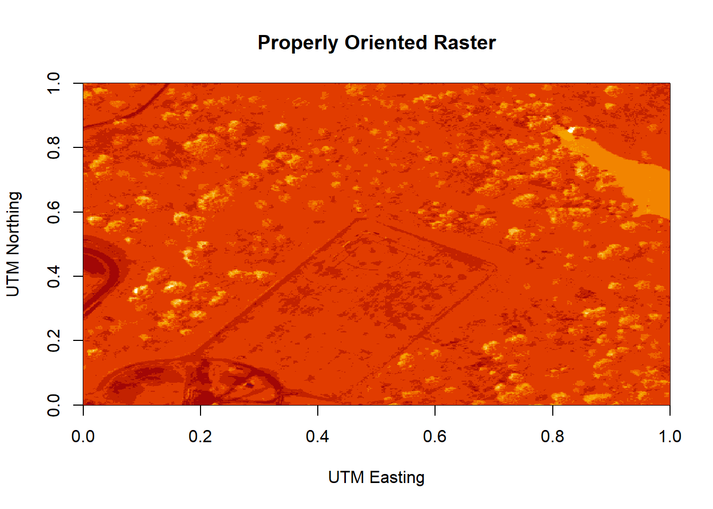
<p class="caption">(\#fig:define-CRS)Plot of the properly oriented raster image of the band 9 data. In order to orient the image correctly, the coordinate reference system was defined and assigned to the raster object. X-axis represents the UTM Easting values, and the Y-axis represents the Northing values.</p>
</div>

Next we define the extents of our raster. The extents will be used to calculate 
the raster's resolution. Fortunately, the spatial extent is provided in the
HDF5 file "Reflectance_Data" group attributes that we saved before as `reflInfo`.


```r
# Grab the UTM coordinates of the spatial extent
xMin <- reflInfo$Spatial_Extent_meters[1]
xMax <- reflInfo$Spatial_Extent_meters[2]
yMin <- reflInfo$Spatial_Extent_meters[3]
yMax <- reflInfo$Spatial_Extent_meters[4]

# define the extent (left, right, top, bottom)
rasExt <- extent(xMin,xMax,yMin,yMax)
rasExt
```

```
## class      : Extent 
## xmin       : 257500 
## xmax       : 258000 
## ymin       : 4112500 
## ymax       : 4113000
```

```r
# assign the spatial extent to the raster
extent(b9r) <- rasExt

# look at raster attributes
b9r
```

```
## class      : RasterLayer 
## dimensions : 500, 500, 250000  (nrow, ncol, ncell)
## resolution : 1, 1  (x, y)
## extent     : 257500, 258000, 4112500, 4113000  (xmin, xmax, ymin, ymax)
## crs        : +proj=utm +zone=11 +datum=WGS84 +units=m +no_defs 
## source     : memory
## names      : layer 
## values     : 0, 9210  (min, max)
```


>The extent of a raster represents the spatial location of each 
		corner. The coordinate units will be determined by the spatial projection/
		coordinate reference system that the data are in. Source: National Ecological
		Observatory Network (NEON) 

<a href="https://www.neonscience.org/raster-data-series" target="_blank"> Learn more about raster attributes including extent, and coordinate reference systems here.</a>

We can adjust the colors of our raster too if we want.


```r
# let's change the colors of our raster and adjust the zlims 
col <- terrain.colors(25)

image(b9r,  
      xlab = "UTM Easting", 
      ylab = "UTM Northing",
      main= "Raster w Custom Colors",
      col=col, 
      zlim=c(0,3000))
```

<div class="figure">
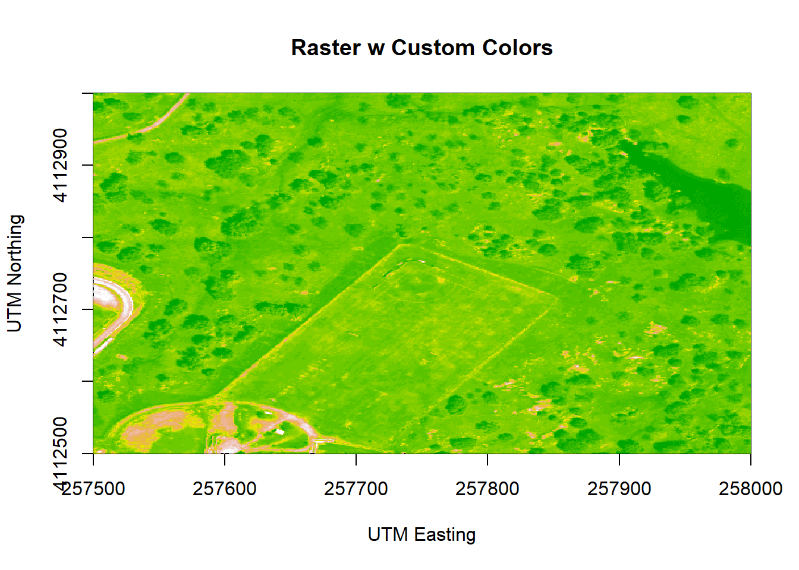
<p class="caption">(\#fig:plot-colors-raster)Plot of the properly oriented raster image of B9 with custom colors. We can adjust the colors of the image by adjusting the z limits, which in this case makes the highly reflective surfaces more vibrant. This color adjustment is more apparent in the bottom left of the image, where the parking lot, buildings and bare surfaces are located. X-axis represents the UTM Easting values, and the Y-axis represents the Northing values.</p>
</div>


We've now created a raster from band 9 reflectance data. We can export the data
as a raster, using the `writeRaster` command. 


```r
# write out the raster as a geotiff
writeRaster(b9r,
            file=paste0(wd,"band9.tif"),
            format="GTiff",
            overwrite=TRUE)

# It's always good practice to close the H5 connection before moving on!
# close the H5 file
H5close()
```


### Challenge: Work with Rasters

Try these three extensions on your own: 

1. Create rasters using other bands in the dataset.

2. Vary the distribution of values in the image to mimic an image stretch. 
e.g. `b9[b9 > 6000 ] <- 6000`

3. Use what you know to extract ALL of the reflectance values for
ONE pixel rather than for an entire band. HINT: this will require you to pick
an x and y value and then all values in the z dimension:
`aPixel<- h5read(f,"Reflectance",index=list(NULL,100,35))`. Plot the spectra 
output.

</div>

***

## Light Detection And Ranging (LiDAR) Data

**A 6:02 introduction video on LiDAR:**

<iframe width="560" height="315" src="https://www.youtube.com/embed/EYbhNSUnIdU" frameborder="0" allow="accelerometer; autoplay; clipboard-write; encrypted-media; gyroscope; picture-in-picture" allowfullscreen></iframe>

**A ~17 minute video lecture by Dr. Tristan Goulden on discrete LiDAR and LiDAT data:**

<iframe width="560" height="315" src="https://www.youtube.com/embed/PRE5KV2_w3Q" frameborder="0" allow="accelerometer; autoplay; clipboard-write; encrypted-media; gyroscope; picture-in-picture" allowfullscreen></iframe>

**A ~35 minute video on LiDAR Uncertainty:**

<iframe width="560" height="315" src="https://www.youtube.com/embed/Cy2pAuv-eUY" frameborder="0" allow="accelerometer; autoplay; clipboard-write; encrypted-media; gyroscope; picture-in-picture" allowfullscreen></iframe>

## Calculating Forest Structural Diversity Metrics from NEON LiDAR Data

> Contributors: Jeff Atkins, Keith Krause, Atticus Stovall
> Authors: Elizabeth LaRue, Donal O'Leary


### Learning Objectives
After completing this tutorial, you will be able to:

* Read a NEON LiDAR file (laz) into R
* Visualize a spatial subset of the LiDAR tile
* Correct a spatial subset of the LiDAR tile for topographic varation
* Calculate 13 structural diversity metrics described in <a href="https://doi.org/10.3390/rs12091407" target="_blank">LaRue, Wagner, et al. (2020) </a>


### R Libraries to Install:

* **lidR**: `install.packages('lidR')`
* **gstat**: `install.packages('gstat')`

**Important Note:**
If you have R version 3.6 or above you'll need to update `data.table`:

```
data.table::update.dev.pkg()
```


### Data to Download

For this tutorial, we will be using two .laz files containing NEON 
AOP point clouds for 1km tiles from the <a href="https://www.neonscience.org/field-sites/field-sites-map/HARV" target="_blank">Harvard Forest (HARV)</a> and 
<a href="https://www.neonscience.org/field-sites/field-sites-map/TEAK" target="_blank">Lower Teakettle (TEAK)</a> sites.

<a href="https://drive.google.com/open?id=1Aemh0IVKvC-LoMj2AXr9k8rDQk77l8k7" target="_blank"> **Link to download .laz files on Google Drive Here.**</a>


### Recommended Skills

For this tutorial, you should have an understanding of Light Detection 
And Ranging (LiDAR) technology, specifically how discrete return lidar 
data are collected and represented in las/laz files. For more information 
on how lidar works, please see NEON's
<a href="https://www.neonscience.org/intro-lidar-r-series" target="_blank"> Introduction to Lidar Tutorial Series.</a>


### Additional Resources

Jean-Romain Roussel, Tristan R.H. Goodbody, Piotr Tompalski have written a fantastic `gitbook` on their `lidR` package [**which can be found here.**](https://jean-romain.github.io/lidRbook/index.html)


If loading some of the packages needed for this tutorial results in non-stop errors, I strongly suggest you run this section using a Docker container,*(e.g. Rocker Project's Geospatial image)*, or one from CyVerse: https://hub.docker.com/r/cyversevice/rstudio-geospatial


## Introduction to Structural Diversity Metrics

Forest structure influences many important ecological processes, including:

  + biogeochemical cycling, 
  + wildfires, 
  + species richness and diversity, 
  + and many others. 
  
Quantifying forest structure, hereafter referred to as "*structural 
diversity*," presents a challenge for many reasons, including difficulty in 
measuring individual trees, limbs, and leaves across large areas. In order 
to overcome this challenge, today's researchers use Light Detection And 
Ranging (LiDAR) technology to measure large areas of forest. It is also 
challenging to calculate meaningful summary metrics of a forest's structure 
that 1) are ecologically relevant and 2) can be used to compare different 
forested locations. In this tutorial, you will be introduced to a few tools 
that will help you to explore and quantify forest structure using LiDAR data 
collected at two field sites of the 
<a href="https://www.neonscience.org/" target="_blank"> 
National Ecological Observatory Network</a>. 

## NEON AOP Discrete Return LIDAR
<a href="https://www.neonscience.org/data-collection/airborne-remote-sensing" target="_blank"> The NEON Airborne Observation Platform (AOP) </a>. 
has several sensors including discrete-return LiDAR, which is useful for measuring forest structural diversity that can be summarized into four categories of metrics: (1) canopy height, (2) canopy cover and openness, and (3) canopy heterogeneity (internal and external), and (4) vegetation area.

We will be comparing the structural diversity of two NEON sites that vary in their structural characteristics. 

First, we will look at <a href="https://www.neonscience.org/field-sites/field-sites-map/HARV" target="_blank">Harvard Forest (HARV)</a>, which is located in Massachusetts. It is a lower elevation, mixed deciduous and evergreen forest dominated by Quercus rubra, Acer rubrum, and Aralia nudicaulis.

Second, we will look at <a href="https://www.neonscience.org/field-sites/field-sites-map/TEAK" target="_blank">Lower Teakettle (TEAK)</a>, which is a high elevation forested NEON site in California. TEAK is an evergreen forest dominated by Abies magnifica, Abies concolor, Pinus jeffreyi, and Pinus contorta. 

As you can imagine, these two forest types will have both similarities and differences in their structural attributes. We can quantify these attributes by calculating several different structural diversity metrics, and comparing 
the results.

### Loading the LIDAR Products
To begin, we first need to load our required R packages, and set our working 
directory to the location where we saved the input LiDAR .laz files that can be 
downloaded from the NEON Data Portal.


```r
library(lidR)
```

```
## 
## Attaching package: 'lidR'
```

```
## The following objects are masked from 'package:raster':
## 
##     projection, projection<-
```

```r
library(gstat)
library(data.table)
```

```
## 
## Attaching package: 'data.table'
```

```
## The following object is masked from 'package:raster':
## 
##     shift
```

```r
library(kableExtra)
```

Next, we will read in the LiDAR data using the `lidR::readLAS()` function. 
Note that this function can read in both `.las` and `.laz` file formats.


```r
# Read in LiDAR data 
#2017 1 km2 tile .laz file type for HARV and TEAK

#Watch out for outlier Z points - this function also allows for the
#ability to filter outlier points well above or below the landscape
#(-drop_z_blow and -drop_z_above). See how we have done this here 
#for you.

HARV <- lidR::readLAS('/Users/rohan/Environmental-Informatics-Using-Research-Infrastructures-and-their-Data/data/NEON_D01_HARV_DP1_727000_4702000_classified_point_cloud_colorized.laz',filter = "-drop_z_below 150 -drop_z_above 325")

TEAK <- lidR::readLAS('/Users/rohan/Environmental-Informatics-Using-Research-Infrastructures-and-their-Data/data/NEON_D17_TEAK_DP1_316000_4091000_classified_point_cloud_colorized.laz',filter = "-drop_z_below 1694 -drop_z_above 2500")
```

Let's check out: 

  1. the extent, 
  2. coordinate system, 
  3. and a 3D plot of each .laz file. 
  
*Note that on Mac computers you may need to install 
XQuartz for 3D plots - see xquartz.org*


```r
summary(HARV)
lidR::plot(HARV)
```
```
class        : LAS (v1.3 format 3)
memory       : 521.6 Mb 
extent       : 727000, 728000, 4702000, 4703000 (xmin, xmax, ymin, ymax)
coord. ref.  : +proj=utm +zone=18 +datum=WGS84 +units=m +no_defs +ellps=WGS84 +towgs84=0,0,0 
area         : 1 km²
points       : 5.94 million points
density      : 5.94 points/m²
File signature:           LASF� 
File source ID:           211 
Global encoding:
 - GPS Time Type: GPS Week Time 
 - Synthetic Return Numbers: no 
 - Well Know Text: CRS is GeoTIFF 
 - Aggregate Model: false 
Project ID - GUID:        00000000-0000-0000-0000-000000000000 
Version:                  1.3
System identifier:        LAStools (c) by rapidlasso GmbH 
Generating software:      lascolor (190812) commercial 
File creation d/y:        278/2019
header size:              235 
Offset to point data:     329 
Num. var. length record:  1 
Point data format:        3 
Point data record length: 34 
Num. of point records:    5944282 
Num. of points by return: 4581566 1255117 104991 2608 0 
Scale factor X Y Z:       0.01 0.01 0.01 
Offset X Y Z:             7e+05 4700000 0 
min X Y Z:                727000 4702000 223.2 
max X Y Z:                728000 4703000 324.99 
Variable length records: 
   Variable length record 1 of 1 
       Description:  
       Tags:
          Key 1024 value 1 
          Key 1025 value 2 
          Key 3072 value 32618 
          Key 4099 value 9001 
```


>1 km-squared point cloud from Harvard Forest showing a gentle slope covered in a continuous canopy of mixed forest.


```r
summary(TEAK)
lidR::plot(TEAK)
```

```
class        : LAS (v1.3 format 3)
memory       : 439.2 Mb 
extent       : 316000, 317000, 4091231, 4092000 (xmin, xmax, ymin, ymax)
coord. ref.  : +proj=utm +zone=11 +datum=WGS84 +units=m +no_defs +ellps=WGS84 +towgs84=0,0,0 
area         : 0.75 km²
points       : 5.01 million points
density      : 6.7 points/m²
File signature:           LASF� 
File source ID:           211 
Global encoding:
 - GPS Time Type: GPS Week Time 
 - Synthetic Return Numbers: no 
 - Well Know Text: CRS is GeoTIFF 
 - Aggregate Model: false 
Project ID - GUID:        00000000-0000-0000-0000-000000000000 
Version:                  1.3
System identifier:        LAStools (c) by rapidlasso GmbH 
Generating software:      lascolor (190812) commercial 
File creation d/y:        206/2019
header size:              235 
Offset to point data:     329 
Num. var. length record:  1 
Point data format:        3 
Point data record length: 34 
Num. of point records:    5006002 
Num. of points by return: 3315380 1182992 416154 91476 0 
Scale factor X Y Z:       0.01 0.01 0.01 
Offset X Y Z:             3e+05 4e+06 0 
min X Y Z:                316000 4091231 2117.03 
max X Y Z:                317000 4092000 2376.98 
Variable length records: 
   Variable length record 1 of 1 
       Description:  
       Tags:
          Key 1024 value 1 
          Key 1025 value 2 
          Key 3072 value 32611 
          Key 4099 value 9001
```


>1 km-squared point cloud from Lower Teakettle showing mountainous terrain covered in a patchy conifer forest, with tall, skinny conifers clearly visible emerging from the discontinuous canopy.


### Normalizing Tree Height to Ground
To begin, we will take a look at the structural diversity of the dense mixed deciduous/evergreen 
forest of HARV. We're going to choose a 40 x 40 m spatial extent for our analysis, but first we 
need to normalize the height values of this LiDAR point cloud from an absolute elevation 
above mean sea level to height above the ground using the `lidR::normalize_height()` function. 

This function relies on spatial interpolation, and therefore we want to perform this step on an area 
that is quite a bit larger than our area of interest to avoid edge effects. 

To be safe, we will clip out an area of 200 x 200 m, normalize it, and then clip out our smaller area of interest.


```r
# Correct for elevation 
#We're going to choose a 40 x 40 m spatial extent, which is the
#extent for NEON base plots. 
#First set the center of where you want the plot to be (note easting 
#and northing works in units of m because these data are in a UTM 
#proejction as shown in the summary above).
x <- 727500 #easting 
y <- 4702500 #northing

#Cut out a 200 x 200 m buffer by adding 100 m to easting and 
#northing coordinates (x,y).
data.200m <- 
   clip_rectangle(HARV,
                    xleft = (x - 100), ybottom = (y - 100),
                    xright = (x + 100), ytop = (y + 100))

#Correct for ground height using a kriging function to interpolate 
#elevation from ground points in the .laz file.
#If the function will not run, then you may need to checkfor outliers
#by adjusting the 'drop_z_' arguments when reading in the .laz files.
dtm <- grid_terrain(data.200m, 1, kriging(k = 10L))
data.200m <- normalize_height(data.200m, dtm)

#Will often give a warning if not all points could be corrected, 
#but visually check to see if it corrected for ground height. 
lidR::plot(data.200m)
#There's only a few uncorrected points and we'll fix these in 
#the next step. 

#Clip 20 m out from each side of the easting and northing 
#coordinates (x,y).
data.40m <- 
   clip_rectangle(data.200m, 
                    xleft = (x - 20), ybottom = (y - 20),
                    xright = (x + 20), ytop = (y + 20))

data.40m@data$Z[data.40m@data$Z <= .5] <- NA  
#This line filters out all z_vals below .5 m as we are less 
#interested in shrubs/trees. 
#You could change it to zero or another height depending on interests. 

#visualize the clipped plot point cloud
lidR::plot(data.40m) 
```


>40 meter by 40 meter point cloud from Harvard Forest showing a cross-section of the forest structure with a complex canopy- and sub-canopy structure with many rounded crowns, characteristic of a deciduous-dominated section of forest.

## Calculating Structural Diversity Metrics
Now that we have our area of interest normalized and clipped, we can proceed with calculating 
our structural diversity metrics. 

### GENERATE CANOPY HEIGHT MODEL (CHM) 
(i.e. a 1 m2 raster grid of vegetations heights)


```r
# Structural diversity metrics


#res argument specifies pixel size in meters and dsmtin is 
#for raster interpolation
chm <- grid_canopy(data.40m, res = 1, dsmtin())  

#visualize CHM
lidR::plot(chm) 
```

#### MEAN OUTER CANOPY HEIGHT (MOCH)


```r
#calculate MOCH, the mean CHM height value
mean.max.canopy.ht <- mean(chm@data@values, na.rm = TRUE) 
```
#### MAX CANOPY HEIGHT


```r
#calculate HMAX, the maximum CHM height value
max.canopy.ht <- max(chm@data@values, na.rm=TRUE) 
```

#### RUMPLE

```r
#calculate rumple, a ratio of outer canopy surface area to 
#ground surface area (1600 m^2)
rumple <- rumple_index(chm) 
```

#### TOP RUGOSITY


```r
#top rugosity, the standard deviation of pixel values in chm and 
#is a measure of outer canopy roughness
top.rugosity <- sd(chm@data@values, na.rm = TRUE) 
```

#### DEEP GAPS & DEEP GAP FRACTION

```r
#number of cells in raster (also area in m2)
cells <- length(chm@data@values) 
chm.0 <- chm
chm.0[is.na(chm.0)] <- 0 #replace NAs with zeros in CHM
#create variable for the number of deep gaps, 1 m^2 canopy gaps
zeros <- which(chm.0@data@values == 0) 
deepgaps <- length(zeros) #number of deep gaps
#deep gap fraction, the number of deep gaps in the chm relative 
#to total number of chm pixels
deepgap.fraction <- deepgaps/cells 
```
#### COVER FRACTION

```r
#cover fraction, the inverse of deep gap fraction
cover.fraction <- 1 - deepgap.fraction 
```
#### HEIGHT SD
The standard deviation of height values for all points in the plot point cloud

```r
#height SD, the standard deviation of height values for all points
#in the plot point cloud
vert.sd <- cloud_metrics(data.40m, sd(Z, na.rm = TRUE)) 


#SD of VERTICAL SD of HEIGHT
#rasterize plot point cloud and calculate the standard deviation 
#of height values at a resolution of 1 m^2
sd.1m2 <- grid_metrics(data.40m, sd(Z), 1)
#standard deviation of the calculated standard deviations 
#from previous line 
#This is a measure of internal and external canopy complexity
sd.sd <- sd(sd.1m2[,3], na.rm = TRUE) 


#some of the next few functions won't handle NAs, so we need 
#to filter these out of a vector of Z points
Zs <- data.40m@data$Z
Zs <- Zs[!is.na(Zs)]
```
#### ENTROPY
Quantifies diversity & evenness of point cloud heights

```r
#by = 1 partitions point cloud in 1 m tall horizontal slices 
#ranges from 0-1, with 1 being more evenly distributed points 
#across the 1 m tall slices 
entro <- entropy(Zs, by = 1) 
```

#### GAP FRACTION PROFILE 
Gap fraction profile, assesses the distribution of gaps in the canopy volume

```r
#dz = 1 partitions point cloud in 1 m horizontal slices 
#z0 is set to a reasonable height based on the age and height of 
#the study sites 
gap_frac <- gap_fraction_profile(Zs, dz = 1, z0=3) 
#defines gap fraction profile as the average gap fraction in each 
#1 m horizontal slice assessed in the previous line
GFP.AOP <- mean(gap_frac$gf) 
```

#### VAI
Leaf area density, assesses leaf area in the canopy volume

```r
#k = 0.5 is a standard extinction coefficient for foliage 
#dz = 1 partitions point cloud in 1 m horizontal slices 
#z0 is set to the same height as gap fraction profile above
LADen<-LAD(Zs, dz = 1, k=0.5, z0=3) 
#vegetation area index, sum of leaf area density values for 
#all horizontal slices assessed in previous line
VAI.AOP <- sum(LADen$lad, na.rm=TRUE) 
```

#### VCI
A vertical complexity index, fixed normalization of entropy metric calculated above

```r
#set zmax comofortably above maximum canopy height
#by = 1 assesses the metric based on 1 m horizontal slices in 
#the canopy
VCI.AOP <- VCI(Zs, by = 1, zmax=100) 
```

We now have 13 different structural diversity metrics.  Let's organize them into a new dataframe:


```r
#OUTPUT CALCULATED METRICS INTO A TABLE
#creates a dataframe row, out.plot, containing plot descriptors 
#and calculated metrics
HARV_structural_diversity <- 
   data.frame(matrix(c(x, y, mean.max.canopy.ht, max.canopy.ht, 
                       rumple, deepgaps,deepgap.fraction,
                       cover.fraction,top.rugosity, vert.sd, 
                       sd.sd, entro,GFP.AOP, VAI.AOP, VCI.AOP),
                     ncol = 15)) 

#provide descriptive names for the calculated metrics
colnames(HARV_structural_diversity) <- 
   c("easting", "northing", "mean.max.canopy.ht.aop",
     "max.canopy.ht.aop", "rumple.aop", "deepgaps.aop",
     "deepgap.fraction.aop","cover.fraction.aop", 
     "top.rugosity.aop", "vert.sd.aop", "sd.sd.aop", 
     "entropy.aop", "GFP.AOP.aop", "VAI.AOP.aop", "VCI.AOP.aop") 

#View the results
HARV_structural_diversity 
```


### Combining Everything Into One Function
Now that we have run through how to measure each structural diversity metric, let's create a 
convenient function to run these a little faster on the TEAK site for a comparison of structural 
diversity with HARV. 


```r
#Let's correct for elevation and measure structural diversity for TEAK
x <- 316400 
y <- 4091700

data.200m <- clip_rectangle(TEAK, 
                              xleft = (x - 100), ybottom = (y - 100),
                              xright = (x + 100), ytop = (y + 100))

dtm <- grid_terrain(data.200m, 1, kriging(k = 10L))
data.200m <- normalize_height(data.200m, dtm)

data.40m <- clip_rectangle(data.200m, 
                             xleft = (x - 20), ybottom = (y - 20),
                             xright = (x + 20), ytop = (y + 20))
data.40m@data$Z[data.40m@data$Z <= .5] <- 0  
plot(data.40m)
```


>40 meter by 40 meter point cloud from Lower Teakettle showing a cross-section of the forest structure with several tall, pointed conifers separated by deep gaps in the canopy.


```r
#Zip up all the code we previously used and write function to 
#run all 13 metrics in a single function. 
structural_diversity_metrics <- function(data.40m) {
   chm <- grid_canopy(data.40m, res = 1, dsmtin()) 
   mean.max.canopy.ht <- mean(chm@data@values, na.rm = TRUE) 
   max.canopy.ht <- max(chm@data@values, na.rm=TRUE) 
   rumple <- rumple_index(chm) 
   top.rugosity <- sd(chm@data@values, na.rm = TRUE) 
   cells <- length(chm@data@values) 
   chm.0 <- chm
   chm.0[is.na(chm.0)] <- 0 
   zeros <- which(chm.0@data@values == 0) 
   deepgaps <- length(zeros) 
   deepgap.fraction <- deepgaps/cells 
   cover.fraction <- 1 - deepgap.fraction 
   vert.sd <- cloud_metrics(data.40m, sd(Z, na.rm = TRUE)) 
   sd.1m2 <- grid_metrics(data.40m, sd(Z), 1) 
   sd.sd <- sd(sd.1m2[,3], na.rm = TRUE) 
   Zs <- data.40m@data$Z
   Zs <- Zs[!is.na(Zs)]
   entro <- entropy(Zs, by = 1) 
   gap_frac <- gap_fraction_profile(Zs, dz = 1, z0=3)
   GFP.AOP <- mean(gap_frac$gf) 
   LADen<-LAD(Zs, dz = 1, k=0.5, z0=3) 
   VAI.AOP <- sum(LADen$lad, na.rm=TRUE) 
   VCI.AOP <- VCI(Zs, by = 1, zmax=100) 
   out.plot <- data.frame(
      matrix(c(x, y, mean.max.canopy.ht,max.canopy.ht, 
               rumple,deepgaps, deepgap.fraction, 
               cover.fraction, top.rugosity, vert.sd, 
               sd.sd, entro, GFP.AOP, VAI.AOP,VCI.AOP),
             ncol = 15)) 
   colnames(out.plot) <- 
      c("easting", "northing", "mean.max.canopy.ht.aop",
        "max.canopy.ht.aop", "rumple.aop", "deepgaps.aop",
        "deepgap.fraction.aop", "cover.fraction.aop",
        "top.rugosity.aop","vert.sd.aop","sd.sd.aop", 
        "entropy.aop", "GFP.AOP.aop",
        "VAI.AOP.aop", "VCI.AOP.aop") 
   print(out.plot)
}

TEAK_structural_diversity <- structural_diversity_metrics(data.40m)
```

### Comparing Metrics Between Forests
How does the structural diversity of the evergreen TEAK forest compare to the mixed deciduous/evergreen forest from HARV? Let's combine the result data.frames for a direct comparison:


```r
combined_results=rbind(HARV_structural_diversity, 
                       TEAK_structural_diversity)

# Add row names for clarity
row.names(combined_results)=c("HARV","TEAK")

# Take a look to compare
combined_results
```


## Matching GEDI waveforms with NEON AOP LiDAR pointclouds

>author: Donal O'Leary

*GEDI has amazing coverage around the globe, but is limited in its spatial resolution. Here, we extract NEON pointcloud data corresponding to individual GEDI waveforms to better understand how the GEDI return waveform gets its shape.*

<div id="ds-objectives" markdown="1">

### Learning Objectives 
After completing this section you will be able to: 

* Search for GEDI data based on a NEON site bounding box
* Extract NEON LiDAR pointcloud data corresponding to a specific GEDI footprint
* Visualize NEON and GEDI LiDAR data together in 3D

### Things You’ll Need To Complete This GEDI Section

### R Packages to Install
Prior to starting the tutorial ensure that the following packages are installed. 

* **raster:** `install.packages("raster")`
* **rGEDI:** `install.packages("rGEDI")`
* **sp:** `install.packages("sp")`
* **sf:** `install.packages("sf")`
* **lidR:** `install.packages("lidR")`
* **neonUtilities:** `install.packages("neonUtilities")`
* **viridis:** `install.packages("viridis")`
* **maptools:** `install.packages("maptools")`


### Example Data Set

#### GEDI Example Data Subset
This dataset has been subset from a full GEDI orbit retaining only the 'shots' that correspond to a single 1km AOP tile, and only the 'datasets' (attributes) that are needed to visualize the GEDI waveform as shown below.
<a href="https://ndownloader.figshare.com/files/24978809" class="link--button link--arrow">
Download GEDI Example Dataset</a>

#### Datum difference between WGS84 and NAD83
This dataset describes the differences between the common WGS84 and NAD83 standards for vertical data in North America.
<a href="https://ndownloader.figshare.com/files/24994703" class="link--button link--arrow">
Download Dataset</a>

#### Datum difference between GEOID12A and NAD83
This dataset describes the differences between the GEOID12A and NAD83 standards for vertical data in North America.
<a href="https://ndownloader.figshare.com/files/24994697" class="link--button link--arrow">
Download Dataset</a>

### Getting Started
In this section we will compare NEON and GEDI LiDAR data by comparing the information that they both capture in the same location. NEON data are actually one of the datasets used by the GEDI mission to calibrate and validate GEDI waveforms, so this makes for a valuable comparison! 

In order to compare these data, we will need to download GEDI data that overlap a NEON site. Fortunately, Carlos Silva et al. have made a convenient R package clled `rGEDI` and <a href="https://cran.r-project.org/web/packages/rGEDI/vignettes/tutorial.html">this excellent tutorial hosted on CRAN</a> desribing how to work with GEDI data in R. 

However, GEDI data are currently only available to download per complete orbit, which means that the vast majority of the orbit's data does not fall within a NEON site. The GEDI orbit datasets come in HDF5 data format, and contain about 7Gb of data, so you may want to run the first few sections of this tutorial to get the GEDI download started, and refresh your memory of HDF5 files with NEON's <a href="https://www.neonscience.org/intro-hdf5-r-series">Intro to HDF5 series</a>.

First, we will load the required libraries and set our working directory:


```r
# devtools::install_git("https://github.com/carlos-alberto-silva/rGEDI", dependencies = TRUE)
# library(rGEDI)
library(raster)
library(sp)
library(sf)
```

```
## Linking to GEOS 3.9.1, GDAL 3.4.3, PROJ 7.2.1; sf_use_s2() is TRUE
```

```r
library(rgl)
library(lidR)
library(neonUtilities)
library(viridis)
```

```
## Loading required package: viridisLite
```

```r
library(maptools)
```

```
## Checking rgeos availability: TRUE
## Please note that 'maptools' will be retired by the end of 2023,
## plan transition at your earliest convenience;
## some functionality will be moved to 'sp'.
```

```r
#wd <- "./data" # This will depend on your local environment
#setwd(wd)
```

Next, we will download a Canopy Height Model (CHM) tile from the Wind River Experiemental Forest (WREF) using the `byTileAOP()` function to use as a preliminary map on which to overlay the GEDI data. There is one particularly interesting mosaic tile which we will select using the `easting` and `northing` arguments. We then load the raster into R and make a simple plot. For more information about CHMs, please see our tutorial <a href="https://www.neonscience.org/chm-dsm-dtm-gridded-lidar-data">What is a CHM?</a>


```r
# Define the SITECODE as a variable because
# we will use it several times in this tutorial
SITECODE <- "WREF"

byTileAOP(dpID = "DP3.30015.001", site = SITECODE, year = 2017, 
          easting = 580000, northing = 5075000, check.size = F,
          savepath = './data')
```

```
## Downloading files totaling approximately 4.035953 MB 
## Downloading 6 files
## 
  |                                                                            
  |                                                                      |   0%
  |                                                                            
  |==============                                                        |  20%
  |                                                                            
  |============================                                          |  40%
  |                                                                            
  |==========================================                            |  60%
  |                                                                            
  |========================================================              |  80%
  |                                                                            
  |======================================================================| 100%
## Successfully downloaded  6  files.
## NEON_D16_WREF_DP3_580000_5075000_CHM.tif downloaded to ./data/DP3.30015.001/neon-aop-products/2017/FullSite/D16/2017_WREF_1/L3/DiscreteLidar/CanopyHeightModelGtif
## NEON_D16_WREF_DP1_580000_5075000_classified_point_cloud.prj downloaded to ./data/DP3.30015.001/neon-aop-products/2017/FullSite/D16/2017_WREF_1/Metadata/DiscreteLidar/TileBoundary/shps
## NEON_D16_WREF_DP1_580000_5075000_classified_point_cloud.dbf downloaded to ./data/DP3.30015.001/neon-aop-products/2017/FullSite/D16/2017_WREF_1/Metadata/DiscreteLidar/TileBoundary/shps
## NEON_D16_WREF_DP1_580000_5075000_classified_point_cloud.shp downloaded to ./data/DP3.30015.001/neon-aop-products/2017/FullSite/D16/2017_WREF_1/Metadata/DiscreteLidar/TileBoundary/shps
## NEON_D16_WREF_DP1_580000_5075000_classified_point_cloud.kml downloaded to ./data/DP3.30015.001/neon-aop-products/2017/FullSite/D16/2017_WREF_1/Metadata/DiscreteLidar/TileBoundary/kmls
## NEON_D16_WREF_DP1_580000_5075000_classified_point_cloud.shx downloaded to ./data/DP3.30015.001/neon-aop-products/2017/FullSite/D16/2017_WREF_1/Metadata/DiscreteLidar/TileBoundary/shps
```

```r
chm <- raster('./data/DP3.30015.001/neon-aop-products/2017/FullSite/D16/2017_WREF_1/L3/DiscreteLidar/CanopyHeightModelGtif/NEON_D16_WREF_DP3_580000_5075000_CHM.tif')

plot(chm)
```

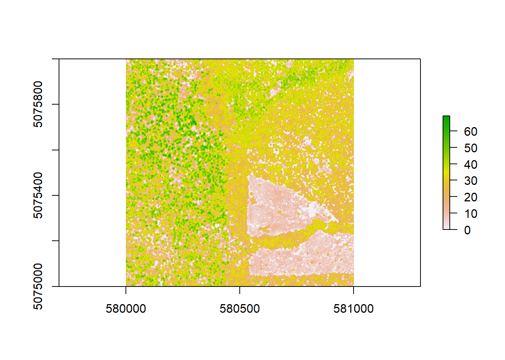

As you can see, this particular CHM is showing a conspicuous, triangle-shaped clearcut in this section of the experimental forest, where the tree canopy is much shorter than the towering 60m+ trees in the undisturbed areas. This variation will give us a variety of forest structures to investigate.

### Downloading GEDI data
This next section on downloading and working with GEDI data is loosely based on the excellent `rGEDI` package tutorial <a href="https://cran.r-project.org/web/packages/rGEDI/vignettes/tutorial.html">posted on CRAN here</a>. If you would prefer to avoid a large download (>7Gb) of a full GEDI orbit, you can forego these steps and use the <a href="https://ndownloader.figshare.com/files/24978809">
example GEDI dataset here</a>, and skip to the `readLevel1B()` function below.

The Global Ecosystem Dynamics Investigation (GEDI) is a NASA mission with the primary data collection being performed by a novel waveform lidar instrument mounted on the International Space Station (ISS). Please see <a href="https://www.sciencedirect.com/science/article/pii/S2666017220300018">this open-access paper</a> published in Science of Remote Sensing that describes this mission in detail. The ISS orbits around the world every 90 minutes, and can be tracked <a href="https://spotthestation.nasa.gov/tracking_map.cfm">on this cool NASA website</a>. 

As described <a href="https://lpdaac.usgs.gov/data/get-started-data/collection-overview/missions/gedi-overview/">here</a> on the Land Processes Distributed Active Archive Center (LP DAAC), "the sole GEDI observable is the waveform from which all other data products are derived. Each waveform is captured with a nominal ~30 m diameter." As of the date of publication, GEDI data are only offered in HDF5 format, with each file containing the data for a full orbit. The LP DAAC has developed a tool that allows researchers to input a bounding box, which will return a list of every orbit that has a "shot" (waveform return) that falls within that box. Unfortunately, at this time, the tool will not subset out the specific shots that fall within that bounding box; you must download the entire orbit (~7Gb). This functionality may be improved in the future.

Our next few steps involve defining our bounding box, requesting the list of GEDI orbits that contain data relevant to that bounding box, and downloading those data. Let's focus on the extent of our CHM that we downloaded above - but we will first need to re-project the CHM from its UTM projection into WGS84. To do so, we will refer to the EPSG code for WGS84. To look up any of these codes, please see the amazing resource <a href="https://spatialreference.org/ref/epsg/4326/">spatialrerference.org</a>.


```r
# Project CHM to WGS84
chm_WGS = projectRaster(chm, crs=CRS("+init=epsg:4326"))

# Study area boundary box coordinates
ul_lat<- extent(chm_WGS)[4]
lr_lat<- extent(chm_WGS)[3]
ul_lon<- extent(chm_WGS)[1]
lr_lon<- extent(chm_WGS)[2]
```

Next, we use that bounding box information as an input to the `gedifinder()` funciton.


```r
# Specifying the optional date range, if desired
daterange=c("2019-03-25", #first date of GEDI availability
           "2020-07-15")

# Get path to GEDI data
# These lines use an API request to determine which orbits are available 
# that intersect the bounding box of interest.
# Note that you still must download the entire orbit and then subset to 
# your area of interest!
gLevel1B <- gedifinder(product="GEDI01_B",
                      ul_lat, ul_lon, lr_lat,lr_lon,
                     version="001",daterange=NULL)
# 
# # View list of available data
 gLevel1B
```

Great! There are several GEDI orbits available that have at least 1 'shot' within our bounding box of interest. For more information about GEDI filename conventions, and other valuable information about GEDI data, <a href="https://lpdaac.usgs.gov/data/get-started-data/collection-overview/missions/gedi-overview/#gedi-temporal-and-spatial-resolution">see this page on the LP DAAC</a>. However, as mentioned before, each of these files are quite large (~7Gb), so let's focus on just the first one for now.


```r
# Downloading GEDI data, if you haven't already
# Note that this will download a large file (>7Gb) which
# can be avoided by using the example dataset provided above.
# wd='./data/'
# if(!file.exists(paste0("./data/",basename(gLevel1B[2])))){
#   gediDownload(filepath=gLevel1B[2],outdir="./data/")
# }
```

Next, we use the rGEDI package to read in the GEDI data. First, we need to make a 'gedi.level1b' object using the `readLevel1B()` function. Next, we extract the geographic position of the center of each shot from the 'gedi.level1b' object using the `getLevel1BGeo()` function, and display the head of the resulting table.

From this point on, we will be using the (much smaller) example subset of GEDI data linked at the top of this section. All functions and processes should also work with a full GEDI dataset downloaded above, if you choose to pursue this research on your own!


```r
gedilevel1b<-readLevel1B(level1Bpath = file.path('./data/NEON_WREF_GEDI_subset.h5'))
#gedilevel1b<-readLevel1B(level1Bpath = file.path(wd, "GEDI01_B_2019206022612_O03482_T00370_02_003_01.h5"))
level1bGeo<-getLevel1BGeo(level1b=gedilevel1b,select=c("elevation_bin0"))
head(level1bGeo)
```

### Plot GEDI footprints on CHM
Let's visualize where the GEDI footprints are located on the CHM tile. To do so, we will need to first convert the GEDI data into a spatial object. For this example, we will use a 'spatial features' object type from the 'sp' package:


```r
# drop any shots with missing latitude/longitude values
level1bGeo = level1bGeo[!is.na(level1bGeo$latitude_bin0)&
                          !is.na(level1bGeo$longitude_bin0),]

# Convert the GEDI data.frame into an 'sf' object
level1bGeo_spdf<-st_as_sf(level1bGeo, 
                          coords = c("longitude_bin0", "latitude_bin0"),
                          crs=CRS("+init=epsg:4326"))


# crop to the CHM that is in WGS84
level1bgeo_WREF=st_crop(level1bGeo_spdf, chm_WGS)
```

Next, project the GEDI geospatial data into the UTM zone that the CHM is within (Zone 10 North). These data come as the point location at the center of the GEDI footprint, so we next convert the GEDI footprint center (lat/long) into a circle using the `buffer()` function. Finally, we can plot the CHM and overlay the GEDI footprint circles, and label with the last three digits of the 'shot' number.


```r
# project to UTM
level1bgeo_WREF_UTM=st_transform(
  level1bgeo_WREF, crs=chm$NEON_D16_WREF_DP3_580000_5075000_CHM@crs)

# buffer the GEDI shot center by a radius of 12.5m 
# to represent the full 25m diameter GEDI footprint
level1bgeo_WREF_UTM_buffer=st_buffer(level1bgeo_WREF_UTM, dist=12.5)

# plot CHM and overlay GEDI data
plot(chm)
plot(level1bgeo_WREF_UTM_buffer, add=T, col="transparent")

# add labes with the last three digits of the GEDI shot_number
pointLabel(st_coordinates(level1bgeo_WREF_UTM),
           labels=level1bgeo_WREF_UTM$shot_number, cex=1)
```

### Extract Waveform for a single Shot
Let's take a look at a waveform for a single GEDI shot. We can select a shot by using its `shot_number` as shown below. Note, however, that the example data subset shots have been re-numbered, and those numbers will not correspond with full orbit GEDI data.


```r
# Extracting GEDI full-waveform for a given shot_number
wf <- getLevel1BWF(gedilevel1b,shot_number = 20)

# or, if using a full GEDI dataset,
# wf <- getLevel1BWF(gedilevel1b,shot_number = level1bgeo_WREF_UTM_buffer$shot_number[which(level1bgeo_WREF_UTM_buffer$shot_number==1786)])

# Save current plotting parameters to revert to
oldpar <- par()

# Set up plotting paramters
par(mfrow = c(1,2), mar=c(4,4,1,1), cex.axis = 1.5)

# Plot filled-in waveform 
plot(wf, relative=FALSE, polygon=TRUE, type="l", lwd=2, col="forestgreen",
     xlab="Waveform Amplitude", ylab="Elevation (m)")
grid() #add a grid to the plot

# Plot a simple line with no fill
plot(wf, relative=TRUE, polygon=FALSE, type="l", lwd=2, col="forestgreen",
     xlab="Waveform Amplitude (%)", ylab="Elevation (m)")
grid()#add a grid to the plot

# Revert plotting parameters to previous values.
par(oldpar)
```

This waveform shows some noise above and below the main ecosystem return, with a fairly dense canopy around 370m elevation, and a characteristic ground return spike at about 340m. While the GEDI data are extremely valuable and offer a near-global coverage, it is hard to get a good sense of what the ecosystem really looks like from this GEDI waveform. Let's download some NEON AOP pointcloud data to pair up with this waveform to get a better sense of what GEDI is reporting.

### Download and Plot NEON AOP LiDAR pointcloud data
Here, we will use the `byTileAOP()` function from the 'neonUtilities' package to download the classified pointcloud mosaic data (DP1.30003.001). Since this is a mosaic tile like the CHM, we can just pass this function the lower left corner of the CHM tile to get the corresponding lidar pointcloud mosaic tile for our analysis.


```r
# Download the pointcloud data if you don't have it already
if (!file.exists('./data/DP1.30003.001/2017/FullSite/D16/2017_WREF_1/L1/DiscreteLidar/ClassifiedPointCloud/NEON_D16_WREF_DP1_580000_5075000_classified_point_cloud.laz')){
  byTileAOP(dpID = "DP1.30003.001", site = SITECODE, year = 2017, 
          easting = extent(chm)[1], northing=extent(chm)[3], 
          check.size = F, savepath = './data/') # Edit savepath as needed
}
```

After downloading the point cloud data, let's read them into our R session using the `readLAS()` function from the `lidaR` package, and plot them in 3D. Note, you may need to update your 'XQuartz' if you are using a Mac.


```r
WREF_LAS=readLAS("./data/DP1.30003.001/2017/FullSite/D16/2017_WREF_1/L1/DiscreteLidar/ClassifiedPointCloud/NEON_D16_WREF_DP1_580000_5075000_classified_point_cloud.laz")

lidR::plot(WREF_LAS)
```


Oh, yikes! There are a lot of outliers above the actual forest, and a few below. Let's use some simple statistics to throw out those outliers. We will first calculate the mean and standard deviation for the verical axis, and then use the 'filter' options of the `readLAS()` function to eliminate the vertical outliers.


```r
# ### remove outlier lidar point outliers using mean and sd statistics
Z_sd=sd(WREF_LAS@data$Z)
Z_mean=mean(WREF_LAS@data$Z)
 
# make filter string in form filter = "-drop_z_below 50 -drop_z_above 1000"
# You can increase or decrease (from 4) the number of sd's to filter outliers
f = paste("-drop_z_below",(Z_mean-4*Z_sd),"-drop_z_above",(Z_mean+4*Z_sd))

# Read in LAS file, trimming off vertical outlier points
WREF_LAS=readLAS("./data/DP1.30003.001/2017/FullSite/D16/2017_WREF_1/L1/DiscreteLidar/ClassifiedPointCloud/NEON_D16_WREF_DP1_580000_5075000_classified_point_cloud.laz",
                 filter = f)

#Plot the full LiDAR point cloud mosaic tile (1km^2)
plot(WREF_LAS)
```


Ahhh, that's better.

### Clip AOP LiDAR Pointcloud to GEDI footprints
We can now use the GEDI footprint circles (that we made using the `buffer()` function) to clip out the NEON AOP LiDAR points that correspond with the GEDI footprints:


```r
# Clip the pointcloud by the GEDI footprints created by buffering above. 
# This makes a 'list' of LAS objects
WREF_GEDI_footprints=lasclip(WREF_LAS, geometry = level1bgeo_WREF_UTM_buffer)

# we can now plot individual footprint clips
plot(WREF_GEDI_footprints[[8]])
```

<iframe width="560" height="315" src="https://www.youtube.com/embed/ERdy6-bqiZI" frameborder="0" allow="accelerometer; autoplay; clipboard-write; encrypted-media; gyroscope; picture-in-picture" allowfullscreen></iframe>

### Plot GEDI Waveform with AOP Pointcloud in 3D space
Now that we can extract individual waveforms, and the AOP LiDAR pointcloud that corresponds with each GEDI waveform, let's see if we can plot them both in 3D space. We already know how to plot the AOP LiDAR points, so let's write a function to draw the GEDI waveform, too, using the `points3d()` function:


```r
for(shot_n in c(20)){

  # First, plot the NEON AOP LiDAR clipped to the GEDI footprint
  # We save the plot as an object 'p' which gives the (x,y) offset for the lower
  # left corner of the plot. The 'rgl' package offsets all (x,y) locations 
  # to this point, so we will need to subtract these values from any other 
  # (x,y) points that we want to add to the plot
  p=plot(WREF_GEDI_footprints[[shot_n]])
  
  # Extract the specific waveform from the GEDI data
  wf <- getLevel1BWF(gedilevel1b,shot_number = level1bgeo_WREF$shot_number[shot_n])
  
  # Make a new data.frame 'd' to convert the waveform data coordinates into 3D space
  d=wf@dt
  
  # normalize rxwaveform to 0-1
  d$rxwaveform=d$rxwaveform-min(d$rxwaveform)
  d$rxwaveform=d$rxwaveform/max(d$rxwaveform)
  
  # Add xy data in UTMs, and offset lower left corner of 'p'
  d$x=st_coordinates(level1bgeo_WREF_UTM[shot_n,])[1]-p[1]
  d$y=st_coordinates(level1bgeo_WREF_UTM[shot_n,])[2]-p[2]
  
  # Make a new column 'x_wf' where we place the GEDI waveform in space with the 
  # NEON AOP LiDAR data, we scale the waveform to 30m in the x-dimension, and 
  # offset by 12.5m (the radius of the GEDI footprint) in the x-dimension.
  d$x_wf=d$x+d$rxwaveform*30+12.5
  
  # Add GEDI points to 3D space in 'green' color
  points3d(x=d$x_wf, y=d$y, z=d$elevation, col="green", add=T)

}
```

<iframe width="560" height="315" src="https://www.youtube.com/embed/DnqbPPVSwTg" frameborder="0" allow="accelerometer; autoplay; clipboard-write; encrypted-media; gyroscope; picture-in-picture" allowfullscreen></iframe>

Whoa, it looks like there is a bad vertical mismatch between those two data sources. This is because the two data sources have a different vertical datum. The NEON AOP data are delivered in the GEOID12A datum, while the GEDI data are delivered in the WGS84 native datum. We will need to convert one to the other to get them to line up correctly.

### Datum, Geoid, and how to best measure the Earth
We are seeing a vertical mismatch between the NEON and GEDI LiDAR data sources because they are using different standards for measuring the Earth. Here, we will briefly describe the main differences between these two datum models, and then show how to correct for this discrepancy.

#### WGS84
As described in <a href="https://en.wikipedia.org/wiki/World_Geodetic_System">this great Wikipedia article</a> the World Geodedic System (WGS) is a global standard for cartography, geodesy, and navigation including GPS. Most people refer to "WGS84," which is the latest revision to this system in 1984. To describe elevation, WGS84 uses an idealized mathematical model to describe the 'oblate spheroid' of the Earth (basically, it looks kind of like a sphere that is wider around the equator and shorter from pole to pole). This model, called a 'datum,' defines the relative elevational surface of the Earth. However, the Earth isn't exactly this idealized shape - it has a lot of undulations caused by topogrophy and local differences in its gravitational field. In the locations where the natural variations of the Earth do not coencide with the mathematical model, it can be harder to accurately describe the elevation of certain landforms and structures. Still, for a global datum, WGS84 does a great job overall.

#### GEOID12A
While WGS84 is a convenient global standard, precisely describing location information is a common problem in geography, and is often remedied by using a local datum or projection. For latitude and longitude spatial information in North America, this is often done by using the <a href="https://www.ngs.noaa.gov/datums/horizontal/north-american-datum-1983.shtml">North American Datum (NAD83)</a> or various Universal Transverse Mercator (UTM) or State Plane projections based on the NAD83 datum. The NAD83 Datum was developed in 1983 as the horizontal and geometric control datum for the United States, Canada, Mexico, and Central America. This is the official datum for the government of the United States of America, and therefore many public datasets that are specific to this geographic region use this datum. In order to further refine the vertical precision over a wide geographic area, we can model the gravitational field of the Earth - this surface is called a "Geoid". <a href="https://geodesy.noaa.gov/GEOID/geoid_def.html">According to NOAA</a>, a geoid can be defined as "the equipotential surface of the Earth’s gravity field which best fits, in a least squares sense, global mean sea level." For a nice description of the North American geoid, please <a href="https://geodesy.noaa.gov/GEOID/geophysics.shtml">see this page on the NOAA website</a> written by Dr. Allen Joel Anderson. As described by Dr. Anderson, this gravitational field is changing all the time, as can global mean sea level (due to melting glaciers, etc.). Therefore local and regional geoids must be updated regularly to reflect these changes, as shown <a href="https://geodesy.noaa.gov/GEOID/models.shtml">in this list of NOAA geoids</a>. One recent standard from 2012 is <<a href="https://geodesy.noaa.gov/GEOID/GEOID12A/">GEOID12A</a> - this is the geoid selected by NEON as the vertical reference for the Z-dimension of our LiDAR data. Note that GEOID12B superscedes GEOID12A, however they are identical everywhere except for Puerto Rico and the US Virgin Islands <a href="https://geodesy.noaa.gov/GEOID/GEOID12B/">according to NOAA</a>. If you are working with any NEON data from Puerto Rico, please be aware that these data are delivered in GEOID12A format and may need to be converted to GEOID12B for some purposes.

For more information about these standards, please see <a href="https://desktop.arcgis.com/en/arcmap/10.3/guide-books/map-projections/about-the-geoid-ellipsoid-spheroid-and-datum-and-h.htm">this ESRI help document</a>.

### Aligning the Vertical Datum
AOP data have a relatively small area of coverage, and are therefore delivered with the coordinate reference system (CRS) in the UTM zone in which they were collected, set to the GEOID12A vertical datum (roughly equaling mean sea level). Meanwhile, GEDI data are global, so they are delivered with the common WGS84 ellipsoidal refrence datum. We need to align these vertical datums to ensure that the two data products line up correctly. However, this is not a trivial step, nor as simple as a reprojection. In this example, we will keep the NEON LiDAR data in its current datum, and convert the vertical position of the GEDI data from WGS84 into GEOID12A vertical position.

NOAA has a useful <a href="https://www.ngs.noaa.gov/INFO/facts/vdatum.shtml">tool called Vdatum</a> that will convert from one datum to another. For this example, we will use Vdatum to convert from WGS84 to NAD83. Seeing as GEOID12A is based on the NAD83 datum, we can first convert the GEDI data's vertical position from WGS84 to NAD83 datum, then apply the offset between NAD83 and GEOID12A. Rather than use the Vdatum tool for each point, we will use a raster created by NEON scientists that reports the vertical difference between WGS84 and NAD83 for all points in the conterminous USA.

You can access this dataset by <a href="https://ndownloader.figshare.com/files/24994703">clicking here to download the WGS84-NAD83 datum offset raster</a>.

### GEOID12A Height Model
GEOID12A is a surface model that is described in terms of its relative height compared to NAD83. You can use <a href="https://www.ngs.noaa.gov/cgi-bin/GEOID_STUFF/geoid12A_prompt1.prl">this interactive webpage</a> to find the geoid height for any location within North America. However, that would be combersome to have to use this webpage for every location. Instead, you can download a <a href="https://www.ngs.noaa.gov/GEOID/GEOID12A/GEOID12A_CONUS.shtml>binary file from the NOAA website</a> that describes this geoid's height, and convert that into a raster similar to the one that we just downloaded above. To simplify things here, we have already gone through the process of downloading the binary file and converting it to a raster for you to download, which can now easily be read into your R environment.

You can access this dataset by <a href="https://ndownloader.figshare.com/files/24994697">clicking here to download the GEOID12A-NAD83 datum offset raster</a>.


```r
GEOID12A_diff_rast=raster("./data/GEOID12A_NAD83_offset.tif")
WGS84_diff_rast=raster("./data/WGS84_NAD83_offset.tif")
```

Now that we have the two offset rasters, let's plot them together to compare their spatial patterns.


```r
par(mfrow=c(2,1), mar=c(2.5,2.5, 3.5,1))
plot(GEOID12A_diff_rast, col=viridis(100),main="GEOID12A minus NAD83 (m)")
plot(WGS84_diff_rast, main="WGS84 minus NAD83 (m)")
```

As you can see, the differences between the GEOID12A geoid, and the NAD83 sphereoid vary quite a lot across space, especially in mountainous areas. The magnitude of these differences is also large, upwards of 35m in some areas. Meanwhile, the differences between the NAD83 and WGS84 sphereoids shows a smooth gradient that is relatively small, with total difference less than 2m across the Conterminous USA. 

### Extract vertical offset for GEDI shots
Now that we know the relative vertical offsets between WGS84, NAD83, and GEOID12A for all of the conterminous USA, we can use the `extract()` function to retrieve those relative offsets for any location. By combining those offsets together, we can finally rectify the vertical position of the NEON and GEDI LiDAR data.

***** DO I need to convert GEDI x/y locations from WGS84 to NAD83?? *****


```r
# Make a new DF to store the GEDI footprint (x,y) locations, and the relative datum/geoid offsets
footprint_df=as.data.frame(
  cbind(level1bgeo_WREF$longitude_lastbin, level1bgeo_WREF$latitude_lastbin))

WGS_NAD_diff <- extract(WGS84_diff_rast, footprint_df)

GEOID12A_NAD_diff <- extract(GEOID12A_diff_rast,footprint_df)

# Add together the offsets to calculate a vector of net differences in elevation
net_diff=WGS_NAD_diff+GEOID12A_NAD_diff
```


### Plot vertically corrected GEDI waveform in 3D

Now that we have a vertical offset for each of the GEDI footprints, let's try again to plot the NEON AOP pointcloud data with the GEDI waveform.


```r
# You can enter whichever shots that you want to plot in the for loop here
#for(shot_n in 1:length(WREF_GEDI_footprints)){
for(shot_n in c(20)){

  # First, plot the NEON AOP LiDAR clipped to the GEDI footprint
  # We save the plot as an object 'p' which gives the (x,y) offset for the lower
  # left corner of the plot. The 'rgl' package offsets all (x,y) locations 
  # to this point, so we will need to subtract these values from any other 
  # (x,y) points that we want to add to the plot
  p=plot(WREF_GEDI_footprints[[shot_n]])
  
  # Extract the specific waveform from the GEDI data
  wf <- getLevel1BWF(gedilevel1b,shot_number = level1bgeo_WREF$shot_number[shot_n])
  
  # Make a new data.frame 'd' to convert the waveform data coordinates into 3D space
  d=wf@dt
  
  # normalize rxwaveform to 0-1
  d$rxwaveform=d$rxwaveform-min(d$rxwaveform)
  d$rxwaveform=d$rxwaveform/max(d$rxwaveform)
  
  # Add xy data in UTMs, and offset lower left corner of 'p'
  d$x=st_coordinates(level1bgeo_WREF_UTM[shot_n,])[1]-p[1]
  d$y=st_coordinates(level1bgeo_WREF_UTM[shot_n,])[2]-p[2]
  
  # Make a new column 'x_wf' where we place the GEDI waveform in space with the 
  # NEON AOP LiDAR data, we scale the waveform to 30m in the x-dimension, and 
  # offset by 12.5m (the radius of the GEDI footprint) in the x-dimension.
  d$x_wf=d$x+d$rxwaveform*30+12.5
  
  # Add GEDI points to 3D space in 'green' color
  # This time, subtracting the elevation difference for that shot
  points3d(x=d$x_wf, y=d$y, z=d$elevation-net_diff[shot_n], col="green", add=T)
  
}
```


### Optional - NEON base plots
You may also be interested to see if any of the GEDI footprints intersect a NEON base plot, which would allow for a direct comparison of the GEDI waveform with many of the datasets which are collected within the base plots, such as the vegetation structure data product containing height, DBH, and species identification of all trees >10cm DBH. While it is statistically pretty unlikely that a GEDI footprint will intersect with your base plot of interest, it is possible that _some_ GEDI footprint will intersetc with _some_ base plot in your study area, so we may as well take a look:


```r
setwd("./data/") # This will depend upon your local environment

# Download the NEON TOS plots polygons directly from the NEON website
download.file(url="https://data.neonscience.org/api/v0/documents/All_NEON_TOS_Plots_V8", 
              destfile="All_NEON_TOS_Plots_V8.zip", mode = 'wb')
unzip("All_NEON_TOS_Plots_V8.zip")
NEON_all_plots <- st_read('All_NEON_TOS_Plots_V8/All_NEON_TOS_Plot_Polygons_V8.shp')
```

```
## Reading layer `All_NEON_TOS_Plot_Polygons_V8' from data source 
##   `C:\Users\rohan\Environmental-Informatics-Using-Research-Infrastructures-and-their-Data\data\All_NEON_TOS_Plots_V8\All_NEON_TOS_Plot_Polygons_V8.shp' 
##   using driver `ESRI Shapefile'
## Simple feature collection with 3841 features and 36 fields
## Geometry type: POLYGON
## Dimension:     XY
## Bounding box:  xmin: -156.6516 ymin: 17.9514 xmax: -66.82358 ymax: 71.3169
## Geodetic CRS:  WGS 84
```

```r
# Select just the WREF site
SITECODE = 'WREF'
base_plots_SPDF <- NEON_all_plots[
  (NEON_all_plots$siteID == SITECODE)&
    (NEON_all_plots$subtype == 'basePlot'),]
rm(NEON_all_plots)

base_crop=st_crop(base_plots_SPDF, extent(chm_WGS))
```

```
## Warning: attribute variables are assumed to be spatially constant throughout all
## geometries
```

```r
plot(chm_WGS)
plot(base_crop$geometry, border = 'blue', add=T)
```


## NEON AOP Written Questions:

*Reminder: these questions are largely based on the assigned video lectures.  I highly recommend you watching or re-watching them before tackling these questions.*

1) What is the overlap in the type of data generated by NEON AOP and PhenoCam.  What metrics from PhenoCam could you apply to NEON AOP data, especially once there are >10 years of aerial data?

2) List 4 challenges to timing AOP flight campaigns.

3) When using NEON AOP data, when should you use `byTileAOP` versus `byFileAOP`?  What additional processing might you need to do if you worked with the `byFileAOP` data?
*Hint: try pulling the data in both formats (this will take a while)*

4) How do the additional bands in NEON AOP improve our contraint of Biodiversity and Ecosystem Structure relative to satelite-derived data?

5) What role do campaigns such as NEON AOP play in 'filling the sampling gap' of essential *in situ* data such as FLUXNET (Eddy Co-Variance) data?

6) List 3 attributes of NEON AOP data that are unique to other publicly served data.
*Hints: Band width? Resolution?  Something else?*

7) Which data product(s) derived from the NEON AOP campaign align with remotely-sensed products from NASA?  
*Hint: start with vegetation indices*

## NEON AOP Coding Lab

For the purpose of this coding lab we will evaluate 2 different forested sites in 2018:

1) Guanica (GUAN) in Puerto Rico:

<iframe width="560" height="315" src="https://www.youtube.com/embed/Rz9kgfPgLPo" frameborder="0" allow="accelerometer; autoplay; clipboard-write; encrypted-media; gyroscope; picture-in-picture" allowfullscreen></iframe>

2) Bartlett Experimental Forest (BART) in New Hampshire:

<iframe width="560" height="315" src="https://www.youtube.com/embed/zK4cEEs-8tQ" frameborder="0" allow="accelerometer; autoplay; clipboard-write; encrypted-media; gyroscope; picture-in-picture" allowfullscreen></iframe>

**1:** How are these two forests similar?  How are they different? *(3-5 sentences)*

*A few places to start if you need them.  You don't have to address these, just in case you need some hints:*
*Climate?  How that could affect vegetation structure?*
*Heterogeniety of the ecossytems?*
*How seasonal are they? (hint:PhenoCam)*
*Something else?*

**2:** Using this NEON tutorial and the tutorials we've covered in this textbook *(hint: you did half of this workflow in your very first coding lab)* pull the NEON AOP derived Canopy Height Model (CHM, `DP3.30015.001`) and High-resolution orthorectified camera imagery mosaic
`DP3.30010.001` for each forest and overlay the NEON TOS Woody Vegetation Structure `DP1.10098.001` basal diameter data product to evaluate how well AOP captures trees in each forest.  
**Generate a labeled 2x2 plot panel including:** 

  * **Each RGB image with basal diameter overlaid**
  
  * **Each CHM with basal diameter overlaid**
  
*Hints/reminders from section 2.9:*
```
<- loadByProduct
<- getLocTOS
<- merge
```
**Write 2-3 sentences summarizing your findings and thoughts.**

**3:** Use the `byTileAOP` function of the `neonUtilities` package to pull a subset of the descrete LiDAR pointcloud for each forest (*Hint: You can feed `byTileAOP` Easting and Northing from your `Vegetation Structure` dataframe(s)*).  Use the `structural_diversity_metrics` function that you defined in section 6.5 of the textbook to process discrete return LiDAR for each site and generte structural diversity metrics.  
  
  * Using `lidR` generate a labeled 2-panel plot of your canopy height model for each forest
  * Using `lidR` generate a labeled 2-panel plot of a cross-section for each forest
  * Use section `6.5.3 Comparing Metrics Between Forests` to compare each forest and generate a a clean summary table via `kable`
  * Using **Table 2** from <a href="https://doi.org/10.3390/rs12091407" target="_blank">LaRue, Wagner, et al. (2020) </a> as a reference, write 1-2 paragraphs summarizing the differences in forest structural diversity between the two forests and how they may relate to your answers to **Question 1**.  

## NEON AOP Culmination Write Up

Write up a 1-page **derived data product or research pipeline proposal** summary of a project that you might want to explore using NEON AOP data. Include the types of NEON (and other data) that you would need to implement this project. Save this summary as you will be refining and adding to your ideas over the course of the semester.  

Suggestions: 

1. Tables or bullet lists of **specific** data products

2. An **overarching high-quality figure** to show how these data align

3. One paragraph summarizing *how* this data or analysis is useful to **you and/or the infrastructure**.

<!--chapter:end:06-NEON_AOP.Rmd-->


# NASA's Earth Observing System (EOS)

> Estimated Time: 3 hours

## Learning Objectives

  * Describe the mission of NASA EOS
  * Describe the roles of DAACs in distributing data
  * Interact with the AppEEARS API to query the list of available products
  * Submit and download submitting a point and area sample requests, download the request 
  * Filter data based on quality


## NASA EOS Project Mission & Design

NASA’s Earth Observing System (EOS) is a coordinated series of polar-orbiting and low inclination satellites for long-term global observations of the land surface, biosphere, solid Earth, atmosphere, and oceans. As a major component of the Earth Science Division of NASA’s Science Mission Directorate, EOS enables an improved understanding of the Earth as an integrated system. 

[**Review NASA EOS's Mission Profile**](https://eospso.nasa.gov/files/mission_profile.pdf)

* Completed Missions

* Current Missions

* Future Missions

<iframe width="560" height="315" src="https://www.youtube.com/embed/pDvRE0iF9ME" frameborder="0" allow="accelerometer; autoplay; encrypted-media; gyroscope; picture-in-picture" allowfullscreen></iframe>

>Credit: NASA's Goddard Space Flight Center

## NASA EOS Earth Data Account:

The EOSDIS Earthdata Login provides a centralized and simplified mechanism for user registration and profile management for all EOSDIS system components. End users may register and edit their profile information in one location allowing them access to the wide array of EOSDIS data and services. The EOSDIS Earthdata Login also helps the EOSDIS program better understand the user demographics and access patterns in support of planning for new value-added features and customized services that can be directed to specific users or user groups resulting in better user experience.

Earthdata Login provides user registration and authentication services and a common set of user information to all EOSDIS data centers in a manner that permits the data center to integrate their additional requirements with the Earthdata Login services. Below is a brief description of services provided by the Earthdata Login.

## **NASA EOS Coding Assignment 1**

*Suggested completion: following lecture 1 on NASA EOS*

**To submit via BBLearn:**

1) Follow the [steps in the NASA EOSDIS documentation](https://urs.earthdata.nasa.gov/documentation) to sign up for an Earth Data account.

2) Write an R script that stores your `user` and `password` called `EARTHDATA_Token.R` and submit the following line of code via .Rmd and PDF:

```
source('./Tokens/EARTHDATA_Token.R') #path will change based on where you stored it
exists('user')
```

## Distributed Active Archive Centers

### LP DAAC

The [Land Processes Distributed Active Archive Center (LP DAAC)](https://lpdaac.usgs.gov/about/) is one of several discipline-specific data centers within the NASA EOS Data and Information System [(EOSDIS)](https://earthdata.nasa.gov/about-eosdis?_ga=2.174168546.1999623198.1596733217-204014717.1592177507).  The LP DAAC operates as a partnership between the U.S. Geological Survey (USGS) and the National Aeronautics and Space Administration (NASA). Data specialists, system engineers, user service representatives, and science communicators work in collaboration to support LP DAAC activities.

**Watch this 4:02 minute video on LP DAAC's 2019-2021 Prosectus**

<iframe width="560" height="315" src="https://www.youtube.com/embed/pCuE007qEqI" frameborder="0" allow="accelerometer; autoplay; encrypted-media; gyroscope; picture-in-picture" allowfullscreen></iframe>

## The LPDAAC Mission: Process, Archive, Distribute, Apply

The LP DAAC processes, archives, and distributes land data products to hundreds of thousands of users in the earth science community. Land data products are made universally accessible and support the ongoing monitoring of Earth’s land dynamics and environmental systems to facilitate interdisciplinary research, education, and decision-making.

**Process:** Raw data collected from specific satellite sensors, such as ASTER onboard NASA’s Terra satellite, are received and processed into a readable and interpretable format here at the LP DAAC, while other data undergo processing in other facilities around the country before arriving to the LP DAAC to be archived and distributed to the public.

**Archive:** The LP DAAC continually archives a wide variety of land remote sensing data products collected by sensors onboard satellites, aircraft, and the International Space Station (ISS). The archive currently totals more than 3.5 petabytes of data, the equivalent of listening to 800 million songs, and distributes data to over 200,000 global users.

**Distribute:** All data products in the archive are distributed free of charge through NASA [Earthdata Search](https://search.earthdata.nasa.gov/search) and [USGS EarthExplorer](https://earthexplorer.usgs.gov/) search and download clients. The LP DAAC also supports tools and services, like the [Application for Extracting and Exploring Analysis Ready Samples (AppEEARS)](https://lpdaacsvc.cr.usgs.gov/appeears/), which allows users to transform and visualize data before download while offering enhanced subsetting and reprojecting capabilities.

### How you can use LP DAAC's data

**Watch this 2:13 minute long video on searching for data at the LP DAAC**

<iframe width="560" height="315" src="https://www.youtube.com/embed/zX-cuTWeh8Y" frameborder="0" allow="accelerometer; autoplay; encrypted-media; gyroscope; picture-in-picture" allowfullscreen></iframe>

## AppEEARS

The Application for Extracting and Exploring Analysis Ready Samples ([AppEEARS](https://lpdaacsvc.cr.usgs.gov/appeears/)) offers a simple and efficient way to access and transform [geospatial data](https://lpdaacsvc.cr.usgs.gov/appeears/products) from a variety of federal data archives in an easy-to-use web application interface. AppEEARS enables users to subset geospatial data spatially, temporally, and by band/layer for point and area samples. AppEEARS returns not only the requested data, but also the associated quality values, and offers interactive visualizations with summary statistics in the web interface. The [AppEEARS API](https://lpdaacsvc.cr.usgs.gov/appeears/api/) offers users **programmatic access** to all features available in AppEEARS, with the exception of visualizations. The API features are demonstrated in this tutorial.

## Hands on: Pulling AppEEARS Data via the API

*The following section was adapted from [LPDAAC's E-Learning Tutorials on the AppEEARS API](https://lpdaac.usgs.gov/resources/e-learning/getting-started-appeears-api-r-point-request/) and modified to request data for NEON sites.*


> Contributing Authors: 
 Material written by Mahsa Jami^1^ and Cole Krehbiel^1^                                                     
 Contact: LPDAAC@usgs.gov   
 Voice: +1-866-573-3222   
 Organization: Land Processes Distributed Active Archive Center (LP DAAC)  
 Website: https://lpdaac.usgs.gov/  
 Date last modified: 06-12-2020      
 
> ^1^ KBR, Inc., contractor to the U.S. Geological Survey, Earth Resources Observation and Science (EROS) Center,  
> Sioux Falls, South Dakota, USA. Work performed under USGS contract G15PD00467 for LP DAAC^2^.  
 
>^2^ LP DAAC Work performed under NASA contract NNG14HH33I.
 
 
Run the following chunk to install any packages you will need for this section:


```r
# Packages you will need for AppEEARS API Tutorials
packages = c('getPass','httr','jsonlite','ggplot2','dplyr','tidyr','readr','geojsonio','geojsonR','rgdal','sp', 'raster', 'rasterVis', 'RColorBrewer', 'jsonlite')


# Identify missing packages
new.packages = packages[!(packages %in% installed.packages()[,"Package"])]

# Loop through and download the required packages
if (length(new.packages)[1]==0){
  message('All packages already installed')
  }else{
  for (i in 1:length(new.packages)){
    message(paste0('Installing: ', new.packages))
    install.packages(new.packages[i])
    }
  }
```

## Getting Started with the AppEEARS API (Point Request)


***

**This section demonstrates how to use R to connect to the AppEEARS API**
The Application for Extracting and Exploring Analysis Ready Samples ([AppEEARS](https://lpdaacsvc.cr.usgs.gov/appeears/)) offers a simple and efficient way to access and transform [geospatial data](https://lpdaacsvc.cr.usgs.gov/appeears/products) from a variety of federal data archives in an easy-to-use web application interface. AppEEARS enables users to subset geospatial data spatially, temporally, and by band/layer for point and area samples. AppEEARS returns not only the requested data, but also the associated quality values, and offers interactive visualizations with summary statistics in the web interface. The [AppEEARS API](https://lpdaacsvc.cr.usgs.gov/appeears/api/) offers users **programmatic access** to all features available in AppEEARS, with the exception of visualizations. The API features are demonstrated in this tutorial.

***
### Example: Submit a point request for multiple NEON sites to extract vegetation and land surface temperature data   

In this tutorial, Connecting to the AppEEARS API, querying the list of available products, submitting a point sample request, downloading the request, working with the AppEEARS Quality API, and loading the results into R for visualization are covered. AppEEARS point requests allow users to subset their desired data using latitude/longitude geographic coordinate pairs (points) for a time period of interest, and for specific data layers within data products. AppEEARS returns the valid data from the parameters defined within the sample request.

#### Data Used in the Example:
- Data layers: 
    - Combined MODIS Leaf Area Index (LAI)  
        - [MCD15A3H.006](https://doi.org/10.5067/MODIS/MCD15A3H.006), 500m, 4 day: 'Lai_500m'      
    - Terra MODIS Land Surface Temperature    
        - [MOD11A2.006](https://doi.org/10.5067/MODIS/MOD11A2.006), 1000m, 8 day: 'LST_Day_1km', 'LST_Night_1km'  

***
## Topics Covered in this section:
1. **Getting Started**  

    1a. Load Packages
    
    1b. Set Up the Output Directory  
    
    1c. Login   
    
2. **Query Available Products**  

    2a. Search and Explore Available Products  
    
    2b. Search and Explore Available Layers  
    
3. **Submit a Point Request**  

    3a. Compile a JSON Object 
    
    3b. Submit a Task Request 
    
    3c. Retrieve Task Status  
    
4. **Download a Request**   

    4a. Explore Files in Request Output
    
    4b. Download Files in a Request (Automation)  
    
5. **Explore AppEEARS Quality API**  

    5a. List Quality Layers    
    
    5b. Show Quality Values  
    
    5c. Decode Quality Values  
    
6. **BONUS: Load Request Output and Visualize**    

    6a. Load CSV     
    
    6b. Plot Results (Line/Scatter Plots)  
    
***
### Prerequisites:
+ A [NASA Earthdata Login](https://urs.earthdata.nasa.gov/) account is required to login to the AppEEARS API and submit a request . You can create an account at the link provided.

+ R and RStudio. 
  These tutorials have been tested on Windows and MAC systems using R Version 4.0.0, RStudio version 1.1.463, and the specifications listed below.      

  + Required packages: 
    + `getPass`  
    + `httr`  
    + `jsonlite`  
    + `warnings` 
  + To read and visualize the tabular data:
    + `dplyr`        
    + `tidyr`
    + `readr`    
    + `ggplot2`

***

#### Getting Started:
  1. Clone/download [AppEEARS API Getting Started in R Repository](https://git.earthdata.nasa.gov/rest/api/latest/projects/LPDUR/repos/appeears-api-getting-started_r/archive?format=zip) from the LP DAAC Data User Resources Repository or pull code from this textbook.
 
  2. If you opted to clone LP DAAC's repo open the `AppEEARS_API_R.Rproj` file to directly open the project. Next, select the `AppEEARS_API_Point_R.Rmd` from the files list and open it. 


***
### AppEEARS Information:
To access AppEEARS, visit: https://lpdaacsvc.cr.usgs.gov/appeears/.

For comprehensive documentation of the full functionality of the AppEEARS API, please see the AppEEARS [API Documentation](https://lpdaacsvc.cr.usgs.gov/appeears/api/).

***
## Getting Started with the AppEEARS API       
### Load Packages
First, load the R packages necessary to run the tutorial. 

```r
# Load necessary packages into R                                               
library(getPass)            # A micro-package for reading passwords
library(httr)               # To send a request to the server/receive a response from the server
library(jsonlite)           # Implements a bidirectional mapping between JSON data and the most important R data types
library(ggplot2)            # Functions for graphing and mapping
library(tidyr)              # Function for working with tabular data
library(dplyr)              # Function for working with tabular data
library(readr)              # Read rectangular data like CSV
```
***
### Set Up the Output Directory
Set your input directory, and create an output directory for the results.


```r
outDir <- file.path('./data/')                 # Create an output directory if it doesn't exist
suppressWarnings(dir.create(outDir))                 
```

***
### Login to Earth Data

To submit a request, you must first login to the AppEEARS API. Use your private `R Script` to enter your NASA Earthdata login Username and Password. 


```r
source('EARTHDATA_Token.R') #path will change based on where you stored it
exists('user')
```

```
## [1] TRUE
```

Decode the username and password to be used to post login request.


```r
secret <- jsonlite::base64_enc(paste(user, password, sep = ":"))  # Encode the string of username and password
```

Next, assign the AppEEARS API URL to a static variable. 


```r
API_URL = "https://appeears.earthdatacloud.nasa.gov/api/"  # Set the AppEEARS API to a variable
```
Use the `httr` package to post your username and password. A successful login will provide you with a token to be used later in this tutorial to submit a request. For more information or if you are experiencing difficulties, please see the [API Documentation](https://lpdaacsvc.cr.usgs.gov/appeears/api/?language=R#login).

```r
# Insert API URL, call login service, set the component of HTTP header, and post the request to the server
response <- httr::POST(paste0(API_URL,"login"), 
                       add_headers("Authorization" = paste("Basic", gsub("\n", "", secret)),
                                   "Content-Type" ="application/x-www-form-urlencoded;charset=UTF-8"),
                       body = "grant_type=client_credentials")

response_content <- content(response)                          # Retrieve the content of the request
token_response <- toJSON(response_content, auto_unbox = TRUE)  # Convert the response to the JSON object
remove(user, password, secret, response)                       # Remove the variables that are not needed anymore 
prettify(token_response)                                       # Print the prettified response
```

```
## {
##     "token_type": "Bearer",
##     "token": "-UXsO38C8yKtS2dkEQr0dpbk397Oa-s8d2MtqzdYmHkzkLAg9hZ9Sx445pu8MqqnGcm_VYFpvHdEaEmJSlhE8g",
##     "expiration": "2022-10-14T19:16:11Z"
## }
## 
```

**Above, you should see a Bearer token. Notice that this token will expire approximately 48 hours after being acquired.**

***
## Query Available Products
The product API provides details about all of the products and layers available in AppEEARS. For more information, please see the [API Documentation](https://lpdaacsvc.cr.usgs.gov/appeears/api/?language=R#product).

Below, call the product API to list all of the products available in AppEEARS.

```r
prods_req <- GET(paste0(API_URL, "product"))             # Request the info of all products from product service
prods_content <- content(prods_req)                      # Retrieve the content of request 
all_Prods <- toJSON(prods_content, auto_unbox = TRUE)    # Convert the info to JSON object
remove(prods_req, prods_content)                         # Remove the variables that are not needed anymore
# prettify(all_Prods)                                      # Print the prettified product response
```
***

## Search and Explore Available Products

Create a list indexed by product name to make it easier to query a specific product.


```r
# Divides information from each product.
divided_products <- split(fromJSON(all_Prods), seq(nrow(fromJSON(all_Prods))))
# Create a list indexed by the product name and version
products <- setNames(divided_products,fromJSON(all_Prods)$ProductAndVersion)
# Print no. products available in AppEEARS
sprintf("AppEEARS currently supports %i products." ,length(products))   
```

```
## [1] "AppEEARS currently supports 159 products."
```

Next, look at the product's names and descriptions. Below, the 'ProductAndVersion' and 'Description' are printed for all products.


```r
# Loop through the products in the list and print the product name and description
for (p in products){                                   
  print(paste0(p$ProductAndVersion," is ",p$Description," from ",p$Source))  
}
```

```
## [1] "GPW_DataQualityInd.411 is Quality of Input Data for Population Count and Density Grids from SEDAC"
## [1] "GPW_UN_Adj_PopCount.411 is UN-adjusted Population Count from SEDAC"
## [1] "GPW_UN_Adj_PopDensity.411 is UN-adjusted Population Density from SEDAC"
## [1] "MCD12Q1.006 is Land Cover Type from LP DAAC"
## [1] "MCD12Q2.006 is Land Cover Dynamics from LP DAAC"
## [1] "MCD12Q1.061 is Land Cover Type from LP DAAC"
## [1] "MCD12Q2.061 is Land Cover Dynamics from LP DAAC"
## [1] "MCD15A2H.006 is Leaf Area Index (LAI) and Fraction of Photosynthetically Active Radiation (FPAR) from LP DAAC"
## [1] "MCD15A2H.061 is Leaf Area Index (LAI) and Fraction of Photosynthetically Active Radiation (FPAR) from LP DAAC"
## [1] "MCD15A3H.006 is Leaf Area Index (LAI) and Fraction of Photosynthetically Active Radiation (FPAR) from LP DAAC"
## [1] "MCD15A3H.061 is Leaf Area Index (LAI) and Fraction of Photosynthetically Active Radiation (FPAR) from LP DAAC"
## [1] "MCD43A1.006 is Bidirectional Reflectance Distribution Function (BRDF) and Albedo from LP DAAC"
## [1] "MCD43A1.061 is Bidirectional Reflectance Distribution Function (BRDF) and Albedo from LP DAAC"
## [1] "MCD43A2.061 is Bidirectional Reflectance Distribution Function (BRDF) and Albedo from LP DAAC"
## [1] "MCD43A3.006 is Bidirectional Reflectance Distribution Function (BRDF) and Albedo from LP DAAC"
## [1] "MCD43A3.061 is Bidirectional Reflectance Distribution Function (BRDF) and Albedo from LP DAAC"
## [1] "MCD43A4.006 is Bidirectional Reflectance Distribution Function (BRDF) and Albedo from LP DAAC"
## [1] "MCD43A4.061 is Bidirectional Reflectance Distribution Function (BRDF) and Albedo from LP DAAC"
## [1] "MCD64A1.006 is Burned Area (fire) from LP DAAC"
## [1] "MCD64A1.061 is Burned Area (fire) from LP DAAC"
## [1] "MOD09A1.006 is Surface Reflectance Bands 1-7 from LP DAAC"
## [1] "MOD09A1.061 is Surface Reflectance Bands 1-7 from LP DAAC"
## [1] "MOD09GA.006 is Surface Reflectance Bands 1-7 from LP DAAC"
## [1] "MOD09GA.061 is Surface Reflectance Bands 1-7 from LP DAAC"
## [1] "MOD09GQ.006 is Surface Reflectance Bands 1-2 from LP DAAC"
## [1] "MOD09GQ.061 is Surface Reflectance Bands 1-2 from LP DAAC"
## [1] "MOD09Q1.006 is Surface Reflectance Bands 1-2 from LP DAAC"
## [1] "MOD09Q1.061 is Surface Reflectance Bands 1-2 from LP DAAC"
## [1] "MOD10A1.006 is Snow Cover (NDSI) from NSIDC DAAC"
## [1] "MOD10A2.006 is Snow Cover from NSIDC DAAC"
## [1] "MOD11A1.006 is Land Surface Temperature & Emissivity (LST&E) from LP DAAC"
## [1] "MOD11A1.061 is Land Surface Temperature & Emissivity (LST&E) from LP DAAC"
## [1] "MOD11A2.006 is Land Surface Temperature & Emissivity (LST&E) from LP DAAC"
## [1] "MOD11A2.061 is Land Surface Temperature & Emissivity (LST&E) from LP DAAC"
## [1] "MOD13A1.006 is Vegetation Indices (NDVI & EVI) from LP DAAC"
## [1] "MOD13A1.061 is Vegetation Indices (NDVI & EVI) from LP DAAC"
## [1] "MOD13A2.006 is Vegetation Indices (NDVI & EVI) from LP DAAC"
## [1] "MOD13A2.061 is Vegetation Indices (NDVI & EVI) from LP DAAC"
## [1] "MOD13A3.006 is Vegetation Indices (NDVI & EVI) from LP DAAC"
## [1] "MOD13A3.061 is Vegetation Indices (NDVI & EVI) from LP DAAC"
## [1] "MOD13Q1.006 is Vegetation Indices (NDVI & EVI) from LP DAAC"
## [1] "MOD13Q1.061 is Vegetation Indices (NDVI & EVI) from LP DAAC"
## [1] "MOD14A2.006 is Thermal Anomalies and Fire from LP DAAC"
## [1] "MOD14A2.061 is Thermal Anomalies and Fire from LP DAAC"
## [1] "MOD15A2H.006 is Leaf Area Index (LAI) and Fraction of Photosynthetically Active Radiation (FPAR) from LP DAAC"
## [1] "MOD15A2H.061 is Leaf Area Index (LAI) and Fraction of Photosynthetically Active Radiation (FPAR) from LP DAAC"
## [1] "MOD16A2.006 is Evapotranspiration (ET & LE) from LP DAAC"
## [1] "MOD16A2.061 is Evapotranspiration (ET & LE) from LP DAAC"
## [1] "MOD16A2GF.006 is Net Evapotranspiration Gap-Filled (ET & LE) from LP DAAC"
## [1] "MOD16A2GF.061 is Net Evapotranspiration Gap-Filled (ET & LE) from LP DAAC"
## [1] "MOD16A3GF.006 is Net Evapotranspiration Gap-Filled (ET & LE) from LP DAAC"
## [1] "MOD16A3GF.061 is Net Evapotranspiration Gap-Filled (ET & LE) from LP DAAC"
## [1] "MOD17A2H.006 is Gross Primary Productivity (GPP) from LP DAAC"
## [1] "MOD17A2H.061 is Gross Primary Productivity (GPP) from LP DAAC"
## [1] "MOD17A2HGF.006 is Gross Primary Productivity (GPP) from LP DAAC"
## [1] "MOD17A2HGF.061 is Gross Primary Productivity (GPP) from LP DAAC"
## [1] "MOD17A3HGF.006 is Net Primary Production (NPP) Gap-Filled from LP DAAC"
## [1] "MOD17A3HGF.061 is Net Primary Production (NPP) Gap-Filled from LP DAAC"
## [1] "MOD21A1D.061 is Temperature and Emissivity (LST&E) from LP DAAC"
## [1] "MOD21A1N.061 is Temperature and Emissivity (LST&E) from LP DAAC"
## [1] "MOD21A2.061 is Temperature and Emissivity (LST&E) from LP DAAC"
## [1] "MOD44B.006 is Vegetation Continuous Fields (VCF) from LP DAAC"
## [1] "MOD44W.006 is Land/Water Mask from LP DAAC"
## [1] "MODOCGA.006 is Ocean Reflectance Bands 8-16 from LP DAAC"
## [1] "MODTBGA.006 is Thermal Bands and Albedo from LP DAAC"
## [1] "MYD09A1.006 is Surface Reflectance Bands 1-7 from LP DAAC"
## [1] "MYD09A1.061 is Surface Reflectance Bands 1-7 from LP DAAC"
## [1] "MYD09GA.006 is Surface Reflectance Bands 1-7 from LP DAAC"
## [1] "MYD09GA.061 is Surface Reflectance Bands 1-7 from LP DAAC"
## [1] "MYD09GQ.006 is Surface Reflectance Bands 1-2 from LP DAAC"
## [1] "MYD09GQ.061 is Surface Reflectance Bands 1-2 from LP DAAC"
## [1] "MYD09Q1.006 is Surface Reflectance Bands 1-2 from LP DAAC"
## [1] "MYD09Q1.061 is Surface Reflectance Bands 1-2 from LP DAAC"
## [1] "MYD10A1.006 is Snow Cover (NDSI) from NSIDC DAAC"
## [1] "MYD10A2.006 is Snow Cover from NSIDC DAAC"
## [1] "MYD11A1.006 is Land Surface Temperature & Emissivity (LST&E) from LP DAAC"
## [1] "MYD11A1.061 is Land Surface Temperature & Emissivity (LST&E) from LP DAAC"
## [1] "MYD11A2.006 is Land Surface Temperature & Emissivity (LST&E) from LP DAAC"
## [1] "MYD11A2.061 is Land Surface Temperature & Emissivity (LST&E) from LP DAAC"
## [1] "MYD13A1.006 is Vegetation Indices (NDVI & EVI) from LP DAAC"
## [1] "MYD13A1.061 is Vegetation Indices (NDVI & EVI) from LP DAAC"
## [1] "MYD13A2.006 is Vegetation Indices (NDVI & EVI) from LP DAAC"
## [1] "MYD13A2.061 is Vegetation Indices (NDVI & EVI) from LP DAAC"
## [1] "MYD13A3.061 is Vegetation Indices (NDVI & EVI) from LP DAAC"
## [1] "MYD13A3.006 is Vegetation Indices (NDVI & EVI) from LP DAAC"
## [1] "MYD13Q1.006 is Vegetation Indices (NDVI & EVI) from LP DAAC"
## [1] "MYD13Q1.061 is Vegetation Indices (NDVI & EVI) from LP DAAC"
## [1] "MYD14A2.006 is Thermal Anomalies and Fire from LP DAAC"
## [1] "MYD14A2.061 is Thermal Anomalies and Fire from LP DAAC"
## [1] "MYD15A2H.006 is Leaf Area Index (LAI) and Fraction of Photosynthetically Active Radiation (FPAR) from LP DAAC"
## [1] "MYD15A2H.061 is Leaf Area Index (LAI) and Fraction of Photosynthetically Active Radiation (FPAR) from LP DAAC"
## [1] "MYD16A2.006 is Evapotranspiration (ET & LE) from LP DAAC"
## [1] "MYD16A2.061 is Evapotranspiration (ET & LE) from LP DAAC"
## [1] "MYD16A2GF.006 is Net Evapotranspiration Gap-Filled (ET & LE) from LP DAAC"
## [1] "MYD16A2GF.061 is Net Evapotranspiration Gap-Filled (ET & LE) from LP DAAC"
## [1] "MYD16A3GF.006 is Net Evapotranspiration Gap-Filled (ET & LE) from LP DAAC"
## [1] "MYD16A3GF.061 is Net Evapotranspiration Gap-Filled (ET & LE) from LP DAAC"
## [1] "MYD17A2H.006 is Gross Primary Productivity (GPP) from LP DAAC"
## [1] "MYD17A2H.061 is Gross Primary Productivity (GPP) from LP DAAC"
## [1] "MYD17A2HGF.006 is Gross Primary Productivity (GPP) Gap-Filled from LP DAAC"
## [1] "MYD17A2HGF.061 is Gross Primary Productivity (GPP) Gap-Filled from LP DAAC"
## [1] "MYD17A3HGF.006 is Net Primary Production (NPP) Gap-Filled from LP DAAC"
## [1] "MYD17A3HGF.061 is Net Primary Production (NPP) Gap-Filled from LP DAAC"
## [1] "MYD21A1D.006 is Land Surface Temperature & Emissivity (LST&E) from LP DAAC"
## [1] "MYD21A1D.061 is Land Surface Temperature & Emissivity (LST&E) from LP DAAC"
## [1] "MYD21A1N.006 is Land Surface Temperature & Emissivity (LST&E) from LP DAAC"
## [1] "MYD21A1N.061 is Land Surface Temperature & Emissivity (LST&E) from LP DAAC"
## [1] "MYD21A2.006 is Land Surface Temperature & Emissivity (LST&E) from LP DAAC"
## [1] "MYD21A2.061 is Land Surface Temperature & Emissivity (LST&E) from LP DAAC"
## [1] "MYDOCGA.006 is Ocean Reflectance Bands 8-16 from LP DAAC"
## [1] "MYDTBGA.006 is Thermal Bands and Albedo from LP DAAC"
## [1] "NASADEM_NC.001 is Elevation from LP DAAC"
## [1] "NASADEM_NUMNC.001 is Source from LP DAAC"
## [1] "SPL3SMP_E.005 is Enhanced L3 Radiometer Soil Moisture from NSIDC DAAC"
## [1] "SPL3SMP.008 is Soil Moisture from NSIDC DAAC"
## [1] "SPL4CMDL.006 is Carbon Net Ecosystem Exchange from NSIDC DAAC"
## [1] "SPL4SMGP.006 is Surface and Root Zone Soil Moisture from NSIDC DAAC"
## [1] "SPL3FTP.003 is Freeze/Thaw State from NSIDC DAAC"
## [1] "SRTMGL1_NC.003 is Elevation (DEM) from LP DAAC"
## [1] "SRTMGL1_NUMNC.003 is Source (DEM) from LP DAAC"
## [1] "SRTMGL3_NC.003 is Elevation (DEM) from LP DAAC"
## [1] "SRTMGL3_NUMNC.003 is Source (DEM) from LP DAAC"
## [1] "ASTGTM_NC.003 is Elevation from LP DAAC"
## [1] "ASTGTM_NUMNC.003 is Source from LP DAAC"
## [1] "ASTWBD_ATTNC.001 is Water Bodies Database Attributes from LP DAAC"
## [1] "ASTWBD_NC.001 is Water Bodies Database Elevation from LP DAAC"
## [1] "VNP09H1.001 is Surface Reflectance from LP DAAC"
## [1] "VNP09A1.001 is Surface Reflectance from LP DAAC"
## [1] "VNP09GA.001 is Surface Reflectance from LP DAAC"
## [1] "VNP13A1.001 is Vegetation Indices (NDVI & EVI) from LP DAAC"
## [1] "VNP13A2.001 is Vegetation Indices (NDVI & EVI) from LP DAAC"
## [1] "VNP13A3.001 is Vegetation Indices (NDVI & EVI) from LP DAAC"
## [1] "VNP14A1.001 is Thermal Anomalies/Fire from LP DAAC"
## [1] "VNP15A2H.001 is Leaf Area Index (LAI) and Fraction of Photosynthetically Active Radiation (FPAR) from LP DAAC"
## [1] "VNP21A1D.001 is Land Surface Temperature & Emissivity Day (LST&E) from LP DAAC"
## [1] "VNP21A1N.001 is Land Surface Temperature & Emissivity Night (LST&E) from LP DAAC"
## [1] "VNP21A2.001 is Land Surface Temperature & Emissivity (LST&E) from LP DAAC"
## [1] "VNP22Q2.001 is Global Land Surface Phenology (GLSP) from LP DAAC"
## [1] "VNP43IA1.001 is BRDF-Albedo Model Parameters from LP DAAC"
## [1] "VNP43IA2.001 is BRDF-Albedo Quality from LP DAAC"
## [1] "VNP43IA3.001 is Albedo (BRDF) from LP DAAC"
## [1] "VNP43IA4.001 is Nadir BRDF-Adjusted Reflectance from LP DAAC"
## [1] "VNP43MA1.001 is BRDF-Albedo Model Parameters from LP DAAC"
## [1] "VNP43MA2.001 is BRDF-Albedo Quality from LP DAAC"
## [1] "VNP43MA3.001 is Albedo (BRDF) from LP DAAC"
## [1] "VNP43MA4.001 is Nadir BRDF-Adjusted Reflectance from LP DAAC"
## [1] "DAYMET.004 is Daily Surface Weather Data for North America from ORNL"
## [1] "ECO2LSTE.001 is Land Surface Temperature & Emissivity (LST&E) from LP DAAC"
## [1] "ECO2CLD.001 is Cloud Mask from LP DAAC"
## [1] "ECO3ETPTJPL.001 is Evapotranspiration PT-JPL from LP DAAC"
## [1] "ECO3ANCQA.001 is L3/L4 Ancillary Data Quality Assurance (QA) Flags from LP DAAC"
## [1] "ECO4ESIPTJPL.001 is Evaporative Stress Index PT-JPL from LP DAAC"
## [1] "ECO4WUE.001 is Water Use Efficiency from LP DAAC"
## [1] "ECO1BGEO.001 is Geolocation from LP DAAC"
## [1] "ECO1BMAPRAD.001 is Resampled Radiance from LP DAAC"
## [1] "ECO3ETALEXI.001 is Evapotranspiration dis-ALEXI from LP DAAC"
## [1] "ECO4ESIALEXI.001 is Evaporative Stress Index dis-ALEXI from LP DAAC"
## [1] "HLSS30.020 is Land Surface Reflectance from LP DAAC"
## [1] "HLSL30.020 is Land Surface Reflectance from LP DAAC"
```

The product service provides many useful details, including if a product is currently available in AppEEARS, a description, and information on the spatial and temporal resolution. Below, the product details are retrieved using 'ProductAndVersion'. 


```r
# Convert the MCD15A3H.006 info to JSON object and print the prettified info
prettify(toJSON(products$"MCD15A3H.006")) 
```

```
## [
##     {
##         "Product": "MCD15A3H",
##         "Platform": "Combined MODIS",
##         "Description": "Leaf Area Index (LAI) and Fraction of Photosynthetically Active Radiation (FPAR)",
##         "RasterType": "Tile",
##         "Resolution": "500m",
##         "TemporalGranularity": "4 day",
##         "Version": "006",
##         "Available": true,
##         "DocLink": "https://doi.org/10.5067/MODIS/MCD15A3H.006",
##         "Source": "LP DAAC",
##         "TemporalExtentStart": "2002-07-04",
##         "TemporalExtentEnd": "Present",
##         "Deleted": false,
##         "DOI": "10.5067/MODIS/MCD15A3H.006",
##         "ProductAndVersion": "MCD15A3H.006"
##     }
## ]
## 
```

Also, the products can be searched using their description. Below, search for products containing Leaf Area Index in their description and make a list of their productAndVersion.


```r
LAI_Products <- list()                                        # Create an empty list 
for (p in products){                                          # Loop through the product list
  if (grepl('Leaf Area Index', p$Description )){              # Look through the product description for a keyword 
    LAI_Products <- append(LAI_Products, p$ProductAndVersion) # Append the LAI products to the list
  }
}
LAI_Products
```

```
## [[1]]
## [1] "MCD15A2H.006"
## 
## [[2]]
## [1] "MCD15A2H.061"
## 
## [[3]]
## [1] "MCD15A3H.006"
## 
## [[4]]
## [1] "MCD15A3H.061"
## 
## [[5]]
## [1] "MOD15A2H.006"
## 
## [[6]]
## [1] "MOD15A2H.061"
## 
## [[7]]
## [1] "MYD15A2H.006"
## 
## [[8]]
## [1] "MYD15A2H.061"
## 
## [[9]]
## [1] "VNP15A2H.001"
```

Using the info above, Create a list of desired products.  


```r
desired_products <- c('MCD15A3H.006','MOD11A2.006')   # Create a vector of desired products 
desired_products
```

```
## [1] "MCD15A3H.006" "MOD11A2.006"
```

***

## Search and Explore Available Layers 

This API call will list all of the layers available for a given product. Each product is referenced by its `ProductAndVersion` property which is also referred to as the product_id. First, request the layers for the `MCD15A3H.006` product.


```r
# Request layers for the 1st product in the list: MCD15A3H.006
MCD15A3H_req <- GET(paste0(API_URL,"product/", desired_products[1]))  # Request the info of a product from product URL
MCD15A3H_content <- content(MCD15A3H_req)                             # Retrieve content of the request 
MCD15A3H_response <- toJSON(MCD15A3H_content, auto_unbox = TRUE)      # Convert the content to JSON object
remove(MCD15A3H_req, MCD15A3H_content)                                # Remove the variables that are not needed anymore
#prettify(MCD15A3H_response)                                          # Print the prettified response
names(fromJSON(MCD15A3H_response))                                    # print the layer's names    
```

```
## [1] "FparExtra_QC"    "FparLai_QC"      "FparStdDev_500m" "Fpar_500m"      
## [5] "LaiStdDev_500m"  "Lai_500m"
```
Next, request the layers for the `MOD11A2.006` product.

```r
MOD11_req <- GET(paste0(API_URL,"product/", desired_products[2]))  # Request the info of a product from product URL
MOD11_content <- content(MOD11_req)                                # Retrieve content of the request
MOD11_response <- toJSON(MOD11_content, auto_unbox = TRUE)         # Convert the content to JSON object
remove(MOD11_req, MOD11_content)                                   # Remove the variables that are not needed anymore
names(fromJSON(MOD11_response))                                    # print the layer names
```

```
##  [1] "Clear_sky_days"   "Clear_sky_nights" "Day_view_angl"    "Day_view_time"   
##  [5] "Emis_31"          "Emis_32"          "LST_Day_1km"      "LST_Night_1km"   
##  [9] "Night_view_angl"  "Night_view_time"  "QC_Day"           "QC_Night"
```

Lastly, select the desired layers and pertinent products and make a data frame using this information. This data frame will be inserted into the nested data frame that will be used to create a JSON object to submit a request in [Section 3](#section3).


```r
desired_layers <- c("LST_Day_1km","LST_Night_1km","Lai_500m")   # Create a vector of desired layers
desired_prods <- c("MOD11A2.006","MOD11A2.006","MCD15A3H.006")  # Create a vector of products including the desired layers
# Create a data frame including the desired data products and layers
layers <- data.frame(product = desired_prods, layer = desired_layers) 
```
***
## Submit a Point Request
The Submit task API call provides a way to submit a new request to be processed. It can accept data via JSON or query string. In the example below, create a JSON object and submit a request. Tasks in AppEEARS correspond to each request associated with your user account. Therefore, each of the calls to this service requires an authentication token.

***
### Compile a JSON Object
In this section, begin by setting up the information needed for a nested data frame that will be later converted to a JSON object for submitting an AppEEARS point request.
For detailed information on required JSON parameters, see the [API Documentation](https://lpdaacsvc.cr.usgs.gov/appeears/api/?language=R#tasks).

For point requests, beside the date range and desired layers information, the coordinates property must also be inside the task object. Optionally, set `id` and `category` properties to further identify your selected coordinates.

We'll start by requesting point-based data for `NEON.D17.SOAP` and `NEON.D17.SJER`:


```r
startDate <- "01-01-2020"       # Start of the date range for  which to extract data: MM-DD-YYYY
endDate <- "10-01-2020"         # End of the date range for  which to extract data: MM-DD-YYYY
recurring <- FALSE              # Specify True for a recurring date range
#yearRange <- [2000,2016]       # If recurring = True, set yearRange, change start/end date to MM-DD

lat <- c(37.0334, 37.1088)        # Latitude of the point sites 
lon <- c(-119.2622, -119.7323)    # Longitude of the point sites
id <- c("0","1")                      # ID for the point sites
category <- c("SOAP", "SJER") # Category for point sites

taskName <- 'NEON SOAP SJER Vegetation'           # Enter name of the task here
taskType <- 'point'                    # Specify the task type, it can be either "area" or "point"
```

To be able to successfully submit a task, the JSON object should be structured in a certain way. The code chunk below uses the information from the previous chunk to create a nested data frame. This nested data frame will be converted to JSON object that can be used to complete the request. 


```r
# Create a data frame including the date range for the request
date <- data.frame(startDate = startDate, endDate = endDate)
# Create a data frame including lat and long coordinates. ID and category name is optional.
coordinates <- data.frame(id = id, longitude = lon, latitude = lat, category = category)

task_info <- list(date,layers, coordinates)               # Create a list of data frames 
names(task_info) <- c("dates", "layers", "coordinates")   # Assign names

task <- list(task_info, taskName, taskType)               # Create a nested list 
names(task) <- c("params", "task_name", "task_type")      # Assign names 
remove(date, layers, coordinates, task_info)              # Remove the variables that are not needed anymore
```
`toJSON` function from `jsonlite` package converts the type of data frame to a string that can be recognized as a JSON object to be submitted as a point request.  

```r
task_json <- toJSON(task,auto_unbox = TRUE)   # Convert to JSON object
```
***
### Submit a Task Request
Token information is needed to submit a request. Below the login token is assigned to a variable.

```r
token <- paste("Bearer", fromJSON(token_response)$token)     # Save login token to a variable
```

Below, post a call to the API **task service**, using the `task_json` created above.

```r
# Post the point request to the API task service
response <- POST(paste0(API_URL, "task"), 
                 body = task_json , 
                 encode = "json", 
                 add_headers(Authorization = token, "Content-Type" = "application/json"))

task_content <- content(response)                                 # Retrieve content of the request 
task_response <- prettify(toJSON(task_content, auto_unbox = TRUE))# Convert the content to JSON object
remove(response, task_content)                                    # Remove the variables that are not needed anymore
task_response                                                     # Print the prettified task response
```

```
## {
##     "task_id": "239d2148-6e07-4f78-b137-2bfbae15f6a6",
##     "status": "pending"
## }
## 
```
***
### Retrieve Task Status
This API call will list all of the requests associated with your user account, automatically sorted by date descending with the most recent requests listed first.
The AppEEARS API contains some helpful formatting resources. Below, limit the API response to 2 entries for the last 2 requests and set pretty to True to format the response as an organized JSON object to make it easier to read. Additional information on AppEEARS API
[retrieve task](https://lpdaacsvc.cr.usgs.gov/appeears/api/?language=R#retrieve-task), [pagination](https://lpdaacsvc.cr.usgs.gov/appeears/api/?language=R#pagination), and [formatting](https://lpdaacsvc.cr.usgs.gov/appeears/api/?language=R#formatting) can be found in the API documentation.


```r
params <- list(limit = 2, pretty = TRUE)                            # Set up query parameters
# Request the task status of last 2 requests from task URL
response_req <- GET(paste0(API_URL,"task"), query = params, add_headers(Authorization = token))
response_content <- content(response_req)                           # Retrieve content of the request
status_response <- toJSON(response_content, auto_unbox = TRUE)      # Convert the content to JSON object
remove(response_req, response_content)                              # Remove the variables that are not needed anymore                         
prettify(status_response)                                           # Print the prettified response
```

```
## [
##     {
##         "params": {
##             "dates": [
##                 {
##                     "endDate": "10-01-2020",
##                     "startDate": "01-01-2020"
##                 }
##             ],
##             "layers": [
##                 {
##                     "layer": "LST_Day_1km",
##                     "product": "MOD11A2.006"
##                 },
##                 {
##                     "layer": "LST_Night_1km",
##                     "product": "MOD11A2.006"
##                 },
##                 {
##                     "layer": "Lai_500m",
##                     "product": "MCD15A3H.006"
##                 }
##             ]
##         },
##         "status": "pending",
##         "created": "2022-10-09T21:34:28.475495",
##         "task_id": "239d2148-6e07-4f78-b137-2bfbae15f6a6",
##         "updated": "2022-10-09T21:34:28.642196",
##         "user_id": "rdb273@nau.edu",
##         "estimate": {
##             "request_size": 204
##         },
##         "has_swath": false,
##         "task_name": "NEON SOAP SJER Vegetation",
##         "task_type": "point",
##         "api_version": "v1",
##         "svc_version": "3.13",
##         "web_version": {
## 
##         },
##         "has_nsidc_daac": false,
##         "expires_on": "2022-11-08T21:34:28.642196"
##     },
##     {
##         "error": {
## 
##         },
##         "params": {
##             "dates": [
##                 {
##                     "endDate": "10-01-2020",
##                     "startDate": "01-01-2020"
##                 }
##             ],
##             "layers": [
##                 {
##                     "layer": "LST_Day_1km",
##                     "product": "MOD11A2.006"
##                 },
##                 {
##                     "layer": "LST_Night_1km",
##                     "product": "MOD11A2.006"
##                 },
##                 {
##                     "layer": "Lai_500m",
##                     "product": "MCD15A3H.006"
##                 }
##             ]
##         },
##         "status": "done",
##         "created": "2022-09-29T00:01:49.833402",
##         "task_id": "f6cd3e97-1424-4401-9440-434a19b53c5c",
##         "updated": "2022-09-29T00:10:11.803810",
##         "user_id": "rdb273@nau.edu",
##         "attempts": 1,
##         "estimate": {
##             "request_size": 204
##         },
##         "retry_at": {
## 
##         },
##         "completed": "2022-09-29T00:10:11.792231",
##         "has_swath": false,
##         "task_name": "NEON SOAP SJER Vegetation",
##         "task_type": "point",
##         "api_version": "v1",
##         "svc_version": "3.12",
##         "web_version": {
## 
##         },
##         "size_category": "0",
##         "has_nsidc_daac": false,
##         "expires_on": "2022-10-29T00:10:11.803810"
##     }
## ]
## 
```

The task_id that was generated when submitting your request can also be used to retrieve a task status. 

```r
task_id <- fromJSON(task_response)$task_id                 # Extract the task_id of submitted point request
# Request the task status of a task with the provided task_id from task URL
status_req <- GET(paste0(API_URL,"task/", task_id), add_headers(Authorization = token)) 
status_content <- content(status_req)                       # Retrieve content of the request       
statusResponse <-toJSON(status_content, auto_unbox = TRUE)  # Convert the content to JSON object
stat <- fromJSON(statusResponse)$status                     # Assign the task status to a variable  
remove(status_req, status_content)                          # Remove the variables that are not needed anymore
prettify(statusResponse)                                    # Print the prettified response
```

```
## {
##     "params": {
##         "dates": [
##             {
##                 "endDate": "10-01-2020",
##                 "startDate": "01-01-2020"
##             }
##         ],
##         "layers": [
##             {
##                 "layer": "LST_Day_1km",
##                 "product": "MOD11A2.006"
##             },
##             {
##                 "layer": "LST_Night_1km",
##                 "product": "MOD11A2.006"
##             },
##             {
##                 "layer": "Lai_500m",
##                 "product": "MCD15A3H.006"
##             }
##         ],
##         "coordinates": [
##             {
##                 "id": "0",
##                 "category": "SOAP",
##                 "latitude": 37.0334,
##                 "longitude": -119.2622
##             },
##             {
##                 "id": "1",
##                 "category": "SJER",
##                 "latitude": 37.1088,
##                 "longitude": -119.7323
##             }
##         ]
##     },
##     "status": "pending",
##     "created": "2022-10-09T21:34:28.475495",
##     "task_id": "239d2148-6e07-4f78-b137-2bfbae15f6a6",
##     "updated": "2022-10-09T21:34:28.642196",
##     "user_id": "rdb273@nau.edu",
##     "estimate": {
##         "request_size": 204
##     },
##     "has_swath": false,
##     "task_name": "NEON SOAP SJER Vegetation",
##     "task_type": "point",
##     "api_version": "v1",
##     "svc_version": "3.13",
##     "web_version": {
## 
##     },
##     "has_nsidc_daac": false,
##     "expires_on": "2022-11-08T21:34:28.642196"
## }
## 
```

Retrieve the task status every 5 seconds. The task status should be `done` to be able to download the output.

```r
while (stat != 'done') {
  Sys.sleep(5)
  # Request the task status and retrieve content of request from task URL
  stat_content <- content(GET(paste0(API_URL,"task/", task_id), add_headers(Authorization = token)))
  stat <-fromJSON(toJSON(stat_content, auto_unbox = TRUE))$status    # Get the status
  remove(stat_content) 
  print(stat)
}
```

***
## Download a Request

### Explore Files in Request Output 

Before downloading the request output, examine the files contained in the request output.

```r
# Request the task bundle info from API bundle URL
response <- GET(paste0(API_URL, "bundle/", task_id), add_headers(Authorization = token))
response_content <- content(response)                          # Retrieve content of the request
bundle_response <- toJSON(response_content, auto_unbox = TRUE)  # Convert the content to JSON object
prettify(bundle_response)                                       # Print the prettified response
```

```
## {
##     "message": "Document not found: {'task_id': '239d2148-6e07-4f78-b137-2bfbae15f6a6'}"
## }
## 
```
***
## Download Files in a Request (Automation) 
The bundle API provides information about completed tasks. For any completed task, a bundle can be queried to return the files contained as a part of the task request. Below, call the bundle API and return all of the output files. Next, read the contents of the bundle in JSON format and loop through file_id to automate downloading all of the output files into the output directory. For more information, please see [AppEEARS API Documentation](https://lpdaacsvc.cr.usgs.gov/appeears/api/?language=R#bundle).

```r
bundle <- fromJSON(bundle_response)$files
for (id in bundle$file_id){
  # retrieve the filename from the file_id
  filename <- bundle[bundle$file_id == id,]$file_name     
  # create a destination directory to store the file in
  filepath <- paste(outDir,filename, sep = "/")
  suppressWarnings(dir.create(dirname(filepath)))
  # write the file to disk using the destination directory and file name 
  response <- GET(paste0(API_URL, "bundle/", task_id, "/", id),
                  write_disk(filepath, overwrite = TRUE),
                  progress(),
                  add_headers(Authorization = token))
  }
```

***
## Explore AppEEARS Quality Service
The quality API provides quality details about all of the data products available in AppEEARS. Below are examples of how to query the quality API for listing quality products, layers, and values. The final example ([Section 5c.](#decode)) demonstrates how AppEEARS quality services can be leveraged to decode pertinent quality values for your data. For more information visit [AppEEARS API documentation](https://lpdaacsvc.cr.usgs.gov/appeears/api/?language=R#quality).

First, reset pagination to include offset which allows you to set the number of results to skip before starting to return entries. Next, make a call to list all of the data product layers and the associated quality product and layer information.


```r
params <- list(limit = 6, offset = 20, pretty = TRUE)     # Set up the query parameters
q_req <- GET(paste0(API_URL, "quality"), query = params)  # Request the quality info from quality API_URL
q_content <- content(q_req)                               # Retrieve the content of request
q_response <- toJSON(q_content, auto_unbox = TRUE)        # Convert the info to JSON object
remove(params, q_req, q_content)                          # Remove the variables that are not needed 
prettify(q_response)                                      # Print the prettified quality information
```

```
## [
##     {
##         "ProductAndVersion": "HLSS30.020",
##         "Layer": "B10",
##         "QualityProductAndVersion": "HLSS30.020",
##         "QualityLayers": [
##             "Fmask"
##         ],
##         "Continuous": false,
##         "VisibleToWorker": true
##     },
##     {
##         "ProductAndVersion": "HLSS30.020",
##         "Layer": "B11",
##         "QualityProductAndVersion": "HLSS30.020",
##         "QualityLayers": [
##             "Fmask"
##         ],
##         "Continuous": false,
##         "VisibleToWorker": true
##     },
##     {
##         "ProductAndVersion": "HLSS30.020",
##         "Layer": "B12",
##         "QualityProductAndVersion": "HLSS30.020",
##         "QualityLayers": [
##             "Fmask"
##         ],
##         "Continuous": false,
##         "VisibleToWorker": true
##     },
##     {
##         "ProductAndVersion": "ASTGTM_NC.003",
##         "Layer": "ASTER_GDEM_DEM",
##         "QualityProductAndVersion": "ASTGTM_NUMNC.003",
##         "QualityLayers": [
##             "ASTER_GDEM_NUM"
##         ],
##         "Continuous": false,
##         "VisibleToWorker": true
##     },
##     {
##         "ProductAndVersion": "CU_LC08.001",
##         "Layer": "SRB1",
##         "QualityProductAndVersion": "CU_LC08.001",
##         "QualityLayers": [
##             "PIXELQA"
##         ],
##         "Continuous": false,
##         "VisibleToWorker": true
##     },
##     {
##         "ProductAndVersion": "CU_LC08.001",
##         "Layer": "SRB2",
##         "QualityProductAndVersion": "CU_LC08.001",
##         "QualityLayers": [
##             "PIXELQA"
##         ],
##         "Continuous": false,
##         "VisibleToWorker": true
##     }
## ]
## 
```
***
### List Quality Layers 
This API call will list all of the quality layer information for a product. For more information visit [AppEEARS API documentation](https://lpdaacsvc.cr.usgs.gov/appeears/api/?language=R#quality)


```r
productAndVersion <- 'MCD15A3H.006'                            # Assign ProductAndVersion to a variable 
# Request the quality info from quality API for a specific product
MCD15A3H_req <- GET(paste0(API_URL, "quality/", productAndVersion))
MCD15A3H_content <- content(MCD15A3H_req)                      # Retrieve the content of request
MCD15A3H_quality <- toJSON(MCD15A3H_content, auto_unbox = TRUE)# Convert the info to JSON object
remove(MCD15A3H_req, MCD15A3H_content)                         # Remove the variables that are not needed anymore
prettify(MCD15A3H_quality)                                     # Print the prettified quality information
```

```
## [
##     {
##         "ProductAndVersion": "MCD15A3H.006",
##         "Layer": "Fpar_500m",
##         "QualityProductAndVersion": "MCD15A3H.006",
##         "QualityLayers": [
##             "FparLai_QC",
##             "FparExtra_QC"
##         ],
##         "VisibleToWorker": true
##     },
##     {
##         "ProductAndVersion": "MCD15A3H.006",
##         "Layer": "FparStdDev_500m",
##         "QualityProductAndVersion": "MCD15A3H.006",
##         "QualityLayers": [
##             "FparLai_QC",
##             "FparExtra_QC"
##         ],
##         "VisibleToWorker": true
##     },
##     {
##         "ProductAndVersion": "MCD15A3H.006",
##         "Layer": "Lai_500m",
##         "QualityProductAndVersion": "MCD15A3H.006",
##         "QualityLayers": [
##             "FparLai_QC",
##             "FparExtra_QC"
##         ],
##         "VisibleToWorker": true
##     },
##     {
##         "ProductAndVersion": "MCD15A3H.006",
##         "Layer": "LaiStdDev_500m",
##         "QualityProductAndVersion": "MCD15A3H.006",
##         "QualityLayers": [
##             "FparLai_QC",
##             "FparExtra_QC"
##         ],
##         "VisibleToWorker": true
##     }
## ]
## 
```
***
### Inspect Quality Values 
This API call will list all of the values for a given quality layer. 

```r
quality_layer <- 'FparLai_QC'                                 # assign a quality layer to a variable
# Request the specified quality layer info from quality API
quality_req <- GET(paste0(API_URL, "quality/",  productAndVersion, "/", quality_layer, sep = ""))
quality_content <- content(quality_req)                        # Retrieve the content of request
quality_response <- toJSON(quality_content, auto_unbox = TRUE) # Convert the info to JSON object
remove(quality_req, quality_content)                           # Remove the variables that are not needed 
prettify(quality_response)                                     # Print the quality response as a data frame
```

```
## [
##     {
##         "ProductAndVersion": "MCD15A3H.006",
##         "QualityLayer": "FparLai_QC",
##         "Name": "MODLAND",
##         "Value": 0,
##         "Description": "Good quality (main algorithm with or without saturation)",
##         "Acceptable": true
##     },
##     {
##         "ProductAndVersion": "MCD15A3H.006",
##         "QualityLayer": "FparLai_QC",
##         "Name": "MODLAND",
##         "Value": 1,
##         "Description": "Other Quality (back-up algorithm or fill values)",
##         "Acceptable": false
##     },
##     {
##         "ProductAndVersion": "MCD15A3H.006",
##         "QualityLayer": "FparLai_QC",
##         "Name": "Sensor",
##         "Value": 0,
##         "Description": "Terra",
##         "Acceptable": {
## 
##         }
##     },
##     {
##         "ProductAndVersion": "MCD15A3H.006",
##         "QualityLayer": "FparLai_QC",
##         "Name": "Sensor",
##         "Value": 1,
##         "Description": "Aqua",
##         "Acceptable": {
## 
##         }
##     },
##     {
##         "ProductAndVersion": "MCD15A3H.006",
##         "QualityLayer": "FparLai_QC",
##         "Name": "DeadDetector",
##         "Value": 0,
##         "Description": "Detectors apparently fine for up to 50% of channels 1, 2",
##         "Acceptable": {
## 
##         }
##     },
##     {
##         "ProductAndVersion": "MCD15A3H.006",
##         "QualityLayer": "FparLai_QC",
##         "Name": "DeadDetector",
##         "Value": 1,
##         "Description": "Dead detectors caused >50% adjacent detector retrieval",
##         "Acceptable": {
## 
##         }
##     },
##     {
##         "ProductAndVersion": "MCD15A3H.006",
##         "QualityLayer": "FparLai_QC",
##         "Name": "CloudState",
##         "Value": 0,
##         "Description": "Significant clouds NOT present (clear)",
##         "Acceptable": {
## 
##         }
##     },
##     {
##         "ProductAndVersion": "MCD15A3H.006",
##         "QualityLayer": "FparLai_QC",
##         "Name": "CloudState",
##         "Value": 1,
##         "Description": "Significant clouds WERE present",
##         "Acceptable": {
## 
##         }
##     },
##     {
##         "ProductAndVersion": "MCD15A3H.006",
##         "QualityLayer": "FparLai_QC",
##         "Name": "CloudState",
##         "Value": 2,
##         "Description": "Mixed cloud present in pixel",
##         "Acceptable": {
## 
##         }
##     },
##     {
##         "ProductAndVersion": "MCD15A3H.006",
##         "QualityLayer": "FparLai_QC",
##         "Name": "CloudState",
##         "Value": 3,
##         "Description": "Cloud state not defined, assumed clear",
##         "Acceptable": {
## 
##         }
##     },
##     {
##         "ProductAndVersion": "MCD15A3H.006",
##         "QualityLayer": "FparLai_QC",
##         "Name": "SCF_QC",
##         "Value": 0,
##         "Description": "Main (RT) method used, best result possible (no saturation)",
##         "Acceptable": {
## 
##         }
##     },
##     {
##         "ProductAndVersion": "MCD15A3H.006",
##         "QualityLayer": "FparLai_QC",
##         "Name": "SCF_QC",
##         "Value": 1,
##         "Description": "Main (RT) method used with saturation. Good, very usable",
##         "Acceptable": {
## 
##         }
##     },
##     {
##         "ProductAndVersion": "MCD15A3H.006",
##         "QualityLayer": "FparLai_QC",
##         "Name": "SCF_QC",
##         "Value": 2,
##         "Description": "Main (RT) method failed due to bad geometry, empirical algorithm used",
##         "Acceptable": {
## 
##         }
##     },
##     {
##         "ProductAndVersion": "MCD15A3H.006",
##         "QualityLayer": "FparLai_QC",
##         "Name": "SCF_QC",
##         "Value": 3,
##         "Description": "Main (RT) method failed due to problems other than geometry, empirical algorithm used",
##         "Acceptable": {
## 
##         }
##     },
##     {
##         "ProductAndVersion": "MCD15A3H.006",
##         "QualityLayer": "FparLai_QC",
##         "Name": "SCF_QC",
##         "Value": 4,
##         "Description": "Pixel not produced at all, value couldn't be retrieved (possible reasons: bad L1B data, unusable MOD09GA data)",
##         "Acceptable": {
## 
##         }
##     }
## ]
## 
```
***
## Decode Quality Values
This API call will decode the bits for a given quality value. 

```r
quality_value <- 1                        # Assign a quality value to a variable 
# Request and retrieve information for provided quality value from quality API URL 
response <- content(GET(paste0(API_URL, "quality/", productAndVersion, "/", quality_layer, "/", quality_value)))
q_response <- toJSON(response, auto_unbox = TRUE)     # Convert the info to JSON object
remove(response)                                      # Remove the variables that are not needed anymore
prettify(q_response)                                  # Print the prettified response
```

```
## {
##     "Binary Representation": "0b00000001",
##     "MODLAND": {
##         "bits": "0b1",
##         "description": "Other Quality (back-up algorithm or fill values)"
##     },
##     "Sensor": {
##         "bits": "0b0",
##         "description": "Terra"
##     },
##     "DeadDetector": {
##         "bits": "0b0",
##         "description": "Detectors apparently fine for up to 50% of channels 1, 2"
##     },
##     "CloudState": {
##         "bits": "0b00",
##         "description": "Significant clouds NOT present (clear)"
##     },
##     "SCF_QC": {
##         "bits": "0b000",
##         "description": "Main (RT) method used, best result possible (no saturation)"
##     }
## }
## 
```
***
## Load Request Output and Visualize

Here, load the CSV file containing the results from your request using `readr` package, and create some basic visualizations using the `ggplot2` package.

## Load a CSV
Use the `readr` package to load the CSV file containing the results from the AppEEARS request.

```r
# Make a list of csv files in the output directory
files <- list.files(outDir, pattern = "\\MOD11A2-006-results.csv$") 
# Read the MOD11A2 results
df <- read_csv(paste0(outDir,"/", files))
```
Select the MOD11A2.006 LST Day column for the data from `SOAP` using the `dplyr` package.

```r
lst_SOAP <- df %>%
  # Filter df
  filter(Category == "SOAP") %>%  
  # Select desired columns
  select(Latitude, Longitude, Date ,MOD11A2_006_LST_Day_1km, MOD11A2_006_LST_Night_1km) 
```
Extract information for LST_DAY_1KM from MOD11_response of product service call from earlier in the tutorial.

```r
#fromJSON(MOD11_response)$LST_Day_1km                        # Extract all the info for LST_Day_1km layer

fillValue <- fromJSON(MOD11_response)$LST_Day_1km$FillValue  # Assign fill value to a variable
unit <- fromJSON(MOD11_response)$LST_Day_1km$Units           # Assign unit to a variable
sprintf("Fill value for LST_DAY_1KM is: %i" ,fillValue)      # Print LST_DAY_1KM fill value
```

```
## [1] "Fill value for LST_DAY_1KM is: 0"
```

```r
sprintf("Unit for LST_DAY_1KM is: %s" ,unit)                 # Print LST_DAY_1KM unit 
```

```
## [1] "Unit for LST_DAY_1KM is: Kelvin"
```
***
## Plot Results (Line/Scatter Plots)
Next, plot a time series of daytime LST for the selected point. Below, filter the LST data to exclude fill values. 

```r
lst_SOAP <- lst_SOAP %>%
  # exclude NoData
  filter(MOD11A2_006_LST_Day_1km != fillValue)%>%
  filter(MOD11A2_006_LST_Night_1km != fillValue)
```
Next, plot LST Day as a time series with some additional formatting using `ggplot2`.

```r
ggplot(lst_SOAP)+
  geom_line(aes(x= Date, y = MOD11A2_006_LST_Day_1km), size=1, color="blue")+
  geom_point(aes(x= Date, y = MOD11A2_006_LST_Day_1km), shape=18 , size = 3, color="blue")+
  labs(title = "Time Series",
       x = "Date",
       y = sprintf( "LST_Day_1km (%s)", unit))+
  scale_x_date(date_breaks = "16 day")+ 
  scale_y_continuous(limits = c(250, 325), breaks = seq(250, 325, 10))+
  theme(plot.title = element_text(face = "bold",size = rel(2.5),hjust = 0.5),
        axis.title = element_text(face = "bold",size = rel(1)),
        panel.background = element_rect(fill = "lightgray", colour = "black"),
        axis.text.x = element_text(face ="bold",color="black", angle= 315 , size = 10),
        axis.text.y = element_text(face ="bold",color="black", angle= 0, size = 10)
        )
```

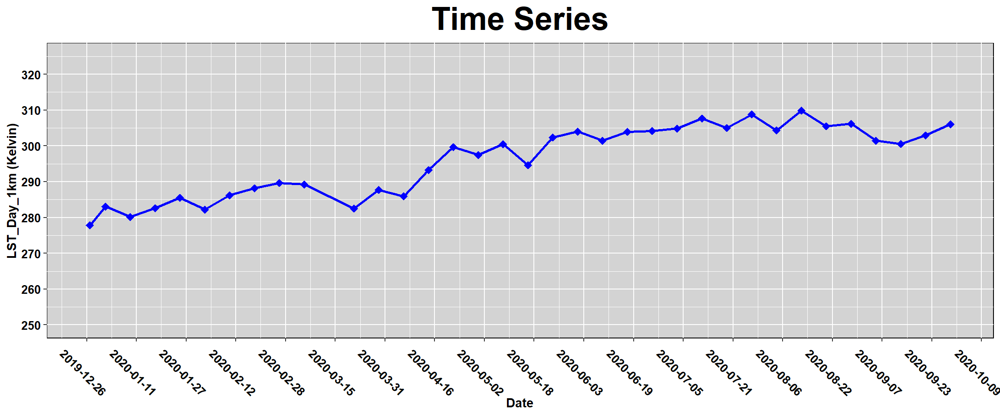

Using the `tidyr` package, the LST Day and Night values for Grand Canyon NP are being gathered in a single column to be used to make a plot including both  `LST_Day_1km` and `LST_Night_1km`.

```r
lst_SOAP_DN <- tidyr::gather(lst_SOAP, key = Tstat , value = LST, MOD11A2_006_LST_Day_1km, MOD11A2_006_LST_Night_1km)
lst_SOAP_DN[1:5,]                     # print the five first observations 
```

```
## # A tibble: 5 × 5
##   Latitude Longitude Date       Tstat                     LST
##      <dbl>     <dbl> <date>     <chr>                   <dbl>
## 1     37.0     -119. 2019-12-27 MOD11A2_006_LST_Day_1km  278.
## 2     37.0     -119. 2020-01-01 MOD11A2_006_LST_Day_1km  283.
## 3     37.0     -119. 2020-01-09 MOD11A2_006_LST_Day_1km  280.
## 4     37.0     -119. 2020-01-17 MOD11A2_006_LST_Day_1km  283.
## 5     37.0     -119. 2020-01-25 MOD11A2_006_LST_Day_1km  285.
```

Next, plot LST Day and Night as a time series with some additional formatting.


```r
ggplot(lst_SOAP_DN)+
  geom_line(aes(x= Date, y = LST, color = Tstat), size=1)+
  geom_point(aes(x= Date, y = LST, color = Tstat), shape=18 , size = 3)+
  scale_fill_manual(values=c("red", "blue"))+
  scale_color_manual(values=c('red','blue'))+
  labs(title = "Time Series",
       x = "Date",
       y = sprintf( "LST_Day_1km (%s)",unit))+
  scale_x_date(date_breaks = "16 day")+  
  scale_y_continuous(limits = c(250, 325), breaks = seq(250, 325, 10))+
  theme(plot.title = element_text(face = "bold",size = rel(2.5), hjust = 0.5),
        axis.title = element_text(face = "bold",size = rel(1)),
        panel.background = element_rect(fill = "lightgray", colour = "black"),
        axis.text.x = element_text(face ="bold",color="black", angle= 315 , size = 10),
        axis.text.y = element_text(face ="bold",color="black", angle= 0, size = 10),
        legend.position = "bottom",
        legend.title = element_blank()
        )
```

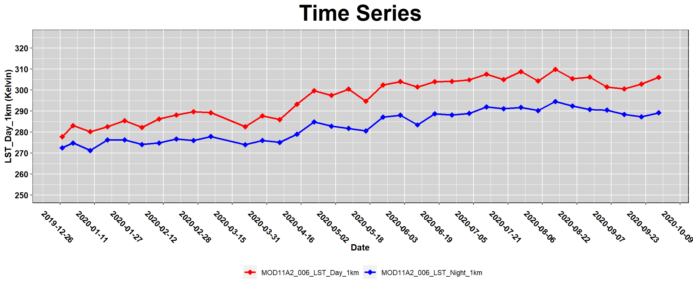

Finally, bring in the daytime LST data from `SJER` , and compare with daytime LST at `SOAP` , shown below in a scatterplot using `ggplot2` package. 
Here, the `dplyr` is used to extract the LST_DAY_1km for `SJER`.  

```r
lst_SJER <- df %>%
  filter(MOD11A2_006_LST_Day_1km != fillValue) %>%        # Filter fill value 
  filter(Category == "SJER")%>%                           # Filter SJER national park
  select(Date, MOD11A2_006_LST_Day_1km)                   # Select desired columns
```
Make a scatterplot.

```r
ggplot()+
  geom_point(aes(x=lst_SOAP$MOD11A2_006_LST_Day_1km, y=lst_SJER$MOD11A2_006_LST_Day_1km[-11]), shape=18 , size = 3, color="blue")+
  labs(title = "MODIS LST: SOAP vs. SJER, 2020",
       x = sprintf("SOAP: LST_Day_1km (%s)",unit),
       y = sprintf( "SJER: LST_Day_1km (%s)",unit))+
  theme(plot.title = element_text(face = "bold",size = rel(1.5), hjust = 0.5),
        axis.title = element_text(face = "bold",size = rel(1)),
        panel.background = element_rect(fill = "lightgray", colour = "black"),
        axis.text.x = element_text(face ="bold",color="black", size = 10),
        axis.text.y = element_text(face ="bold",color="black", size = 10)
  )
```

This example can provide a template to use for your own research workflows. Leveraging the AppEEARS API for searching, extracting, and formatting analysis ready data, and loading it directly into R means that you can keep your entire research workflow in a single software program, from start to finish.


## Submit an Area Request

*The following section was adapted from [LPDAAC's E-Learning Tutorials on the AppEEARS API](https://lpdaac.usgs.gov/resources/e-learning/getting-started-appeears-api-r-area-request/) and modified to request data for NEON sites.*


> Contributing Authors: 

>Contact Information  
 Material written by Mahsa Jami^1^ and Cole Krehbiel^1^                                                     
 Contact: LPDAAC@usgs.gov   
 Voice: +1-866-573-3222   
 Organization: Land Processes Distributed Active Archive Center (LP DAAC)  
 Website: https://lpdaac.usgs.gov/  
 Date last modified: 06-12-2020      
 
 >^1^ KBR, Inc., contractor to the U.S. Geological Survey, Earth Resources Observation and Science (EROS) Center,  
 Sioux Falls, South Dakota, USA. Work performed under USGS contract G15PD00467 for LP DAAC^2^.  
 
 >^2^ LP DAAC Work performed under NASA contract NNG14HH33I.

**This tutorial demonstrates how to use R to connect to the AppEEARS API**
The Application for Extracting and Exploring Analysis Ready Samples ([AppEEARS](https://lpdaacsvc.cr.usgs.gov/appeears/)) offers a simple and efficient way to access and transform [geospatial data](https://lpdaacsvc.cr.usgs.gov/appeears/products) from a variety of federal data archives in an easy-to-use web application interface. AppEEARS enables users to subset geospatial data spatially, temporally, and by band/layer for point and area samples. AppEEARS returns not only the requested data, but also the associated quality values, and offers interactive visualizations with summary statistics in the web interface. The [AppEEARS API](https://lpdaacsvc.cr.usgs.gov/appeears/api/) offers users **programmatic access** to all features available in AppEEARS, with the exception of visualizations. The API features are demonstrated in this tutorial.

## Submit an area request using a NEON site boundary as the region of interest for extracting elevation, vegetation and land surface temperature data    

In this section: 
  * Connecting to the AppEEARS API, 
  * Querying the list of available products, 
  * Submitting an area sample request, downloading the request, 
  * Working with the AppEEARS Quality API, and 
  * Loading the results into R for visualization. 
  
AppEEARS area sample requests allow users to subset their desired data by spatial area via vector polygons (shapefiles or GeoJSONs). Users can also reproject and reformat the output data. AppEEARS returns the valid data from the parameters defined within the sample request.       

#### Data Used in this Example:
- Data layers: 
    - NASA MEaSUREs Shuttle Radar Topography Mission (SRTM) Version 3 Digital Elevation Model  
        - [SRTMGL1_NC.003](https://doi.org/10.5067/MEaSUREs/SRTM/SRTMGL1.003), 30m, static: 'SRTM_DEM' 
    - Combined MODIS Leaf Area Index (LAI)  
        - [MCD15A3H.006](https://doi.org/10.5067/MODIS/MCD15A3H.006), 500m, 4 day: 'Lai_500m'      
    - Terra MODIS Land Surface Temperature    
        - [MOD11A2.006](https://doi.org/10.5067/MODIS/MOD11A2.006), 1000m, 8 day: 'LST_Day_1km', 'LST_Night_1km'  

***
### Topics Covered in this Tutorial

**Getting Started**             
  * Load Packages                       
  * Login     
  
**Query Available Products**             
  * Search and Explore Available Products           
  * Search and Explore Available Layers             

**Submit an Area Request**               
  * Load a Shapefile            
  * Search and Explore Available Projections           
  * Compile a JSON Object                    
  * Submit a Task Request          
  * Retrieve Task Status           
**Download a Request**                       
  * Explore Files in Request Output             
  * Download Files in a Request (Automation)             
**Explore AppEEARS Quality Service**         
  * List Quality Layers             
  * Show Quality Values                     
  * Decode Quality Values                   
**BONUS: Load Request Output and Visualize**                          
  * Load a GeoTIFF                  
  * Plot a GeoTIFF                     

***
### Prerequisites:
+ A [NASA Earthdata Login](https://urs.earthdata.nasa.gov/) account is required to login to the AppEEARS API and submit a request . You can create an account at the link provided.

+ Install R and RStudio. 
  These tutorials have been tested on Windows and Mac systems using R Version 4.0.0, RStudio version 1.1.463, and the specifications listed below. 

  + Required packages: 
    + `getPass`  
    + `httr`  
    + `jsonlite`  
    + `geojsonio`  
    + `geojsonR`  
    + `rgdal`
    + `sp`
    + `warnings` 
  + To read and visualize the GeoTIFF:
    + `raster`           
    + `rasterVis`           
    + `RColorBrewer`    
    + `ggplot2`    

***
### Procedures:
#### Getting Started:
  1. Clone/download [AppEEARS API Getting Started in R Repository](https://git.earthdata.nasa.gov/rest/api/latest/projects/LPDUR/repos/appeears-api-getting-started_r/archive?format=zip) from the LP DAAC Data User Resources Repository or use the code in this textbook.  
  
  2. Open the `AppEEARS_API_R.Rproj` file to directly open the project. Next, select the `AppEEARS_API_AREA_R.Rmd` from the files list and open it. 


***
### AppEEARS Information:
To access AppEEARS, visit: https://lpdaacsvc.cr.usgs.gov/appeears/.

For comprehensive documentation of the full functionality of the AppEEARS API, please see the AppEEARS [API Documentation](https://lpdaacsvc.cr.usgs.gov/appeears/api/).

***
## Getting Started with an Area Request     
### Load Packages for an Area Request

First, load the R packages necessary to run the tutorial. 

```r
# Load necessary packages into R                                               
library(httr)              # To send a request to the server/receive a response from the server
library(jsonlite)          # Implements a bidirectional mapping between JSON data and the most important R data types
library(geojsonio)         # Convert data from various R classes to 'GeoJSON' 
library(geojsonR)          # Functions for processing GeoJSON objects
library(rgdal)             # Functions for spatial data input/output
library(sp)                # classes and methods for spatial data types
library(raster)            # Classes and methods for raster data
library(rasterVis)         # Advanced plotting functions for raster objects 
library(ggplot2)           # Functions for graphing and mapping
library(RColorBrewer)      # Creates nice color schemes
```
***
## Set Up the Output Directory
Create an output directory for the results.

```r
outDir <- './data/'               # Create an output directory if it doesn't exist
```
Next, assign the AppEEARS API URL to a static variable. 

```r
API_URL = 'https://lpdaacsvc.cr.usgs.gov/appeears/api/'  # Set the AppEEARS API to a variable
```
***
## Load your Earth Data Token
To submit a request, you must first login to the AppEEARS API. Use your `token` script to import your credentials.

```r
source('EARTHDATA_Token.R') #path will change based on where you stored it
```
Decode the username and password to be used to post login request.

```r
secret <- jsonlite::base64_enc(paste(user, password, sep = ":"))  # Encode the string of username and password
```
Next, assign the AppEEARS API URL to a static variable. 

```r
API_URL = 'https://appeears.earthdatacloud.nasa.gov/api/'     # Set the AppEEARS API to a variable
```
Use the `httr` package to post your username and password. A successful login will provide you with a token to be used later in this tutorial to submit a request. For more information or if you are experiencing difficulties, please see the [API Documentation](https://lpdaacsvc.cr.usgs.gov/appeears/api/?language=R#login).

```r
# Insert API URL, call login service, set the component of HTTP header, and post the request to the server
response <- httr::POST(paste0(API_URL,"login"), add_headers("Authorization" = paste("Basic", gsub("\n", "", secret)),
                                                 "Content-Type" =
                                                   "application/x-www-form-urlencoded;charset=UTF-8"), 
                 body = "grant_type=client_credentials")

response_content <- content(response)                          # Retrieve the content of the request
token_response <- toJSON(response_content, auto_unbox = TRUE)  # Convert the response to the JSON object
remove(user, password, secret, response)                       # Remove the variables that are not needed anymore 
prettify(token_response)                                       # Print the prettified response
```

```
## {
##     "token_type": "Bearer",
##     "token": "-UXsO38C8yKtS2dkEQr0dpbk397Oa-s8d2MtqzdYmHkzkLAg9hZ9Sx445pu8MqqnGcm_VYFpvHdEaEmJSlhE8g",
##     "expiration": "2022-10-14T19:16:11Z"
## }
## 
```

**Above, you should see a Bearer token. Notice that this token will expire approximately 48 hours after being acquired.**

***
## Query Available Products
The product API provides details about all of the products and layers available in AppEEARS. For more information, please see the [API Documentation](https://lpdaacsvc.cr.usgs.gov/appeears/api/?language=R#product).

Below, call the product API to list all of the products available in AppEEARS.

```r
prods_req <- GET(paste0(API_URL, "product"))             # Request the info of all products from product service
prods_content <- content(prods_req)                      # Retrieve the content of request 
all_Prods <- toJSON(prods_content, auto_unbox = TRUE)    # Convert the info to JSON object
remove(prods_req, prods_content)                         # Remove the variables that are not needed anymore
# prettify(all_Prods)                                      # Print the prettified product response
```
***
## Search and Explore Available Products
Create a list indexed by product name to make it easier to query a specific product.

```r
# divides information from each product.
divided_products <- split(fromJSON(all_Prods), seq(nrow(fromJSON(all_Prods))))
# Create a list indexed by the product name and version
products <- setNames(divided_products,fromJSON(all_Prods)$ProductAndVersion)
# Print no. products available in AppEEARS
sprintf("AppEEARS currently supports %i products." ,length(products))   
```

```
## [1] "AppEEARS currently supports 159 products."
```

Next, look at the product's names and descriptions. Below, the 'ProductAndVersion' and 'Description' are printed for all products.

```r
# Loop through the products in the list and Print the product name and description
for (p in products){                                   
  print(paste0(p$ProductAndVersion," is ",p$Description," from ",p$Source))  
}
```

```
## [1] "GPW_DataQualityInd.411 is Quality of Input Data for Population Count and Density Grids from SEDAC"
## [1] "GPW_UN_Adj_PopCount.411 is UN-adjusted Population Count from SEDAC"
## [1] "GPW_UN_Adj_PopDensity.411 is UN-adjusted Population Density from SEDAC"
## [1] "MCD12Q1.006 is Land Cover Type from LP DAAC"
## [1] "MCD12Q2.006 is Land Cover Dynamics from LP DAAC"
## [1] "MCD12Q1.061 is Land Cover Type from LP DAAC"
## [1] "MCD12Q2.061 is Land Cover Dynamics from LP DAAC"
## [1] "MCD15A2H.006 is Leaf Area Index (LAI) and Fraction of Photosynthetically Active Radiation (FPAR) from LP DAAC"
## [1] "MCD15A2H.061 is Leaf Area Index (LAI) and Fraction of Photosynthetically Active Radiation (FPAR) from LP DAAC"
## [1] "MCD15A3H.006 is Leaf Area Index (LAI) and Fraction of Photosynthetically Active Radiation (FPAR) from LP DAAC"
## [1] "MCD15A3H.061 is Leaf Area Index (LAI) and Fraction of Photosynthetically Active Radiation (FPAR) from LP DAAC"
## [1] "MCD43A1.006 is Bidirectional Reflectance Distribution Function (BRDF) and Albedo from LP DAAC"
## [1] "MCD43A1.061 is Bidirectional Reflectance Distribution Function (BRDF) and Albedo from LP DAAC"
## [1] "MCD43A2.061 is Bidirectional Reflectance Distribution Function (BRDF) and Albedo from LP DAAC"
## [1] "MCD43A3.006 is Bidirectional Reflectance Distribution Function (BRDF) and Albedo from LP DAAC"
## [1] "MCD43A3.061 is Bidirectional Reflectance Distribution Function (BRDF) and Albedo from LP DAAC"
## [1] "MCD43A4.006 is Bidirectional Reflectance Distribution Function (BRDF) and Albedo from LP DAAC"
## [1] "MCD43A4.061 is Bidirectional Reflectance Distribution Function (BRDF) and Albedo from LP DAAC"
## [1] "MCD64A1.006 is Burned Area (fire) from LP DAAC"
## [1] "MCD64A1.061 is Burned Area (fire) from LP DAAC"
## [1] "MOD09A1.006 is Surface Reflectance Bands 1-7 from LP DAAC"
## [1] "MOD09A1.061 is Surface Reflectance Bands 1-7 from LP DAAC"
## [1] "MOD09GA.006 is Surface Reflectance Bands 1-7 from LP DAAC"
## [1] "MOD09GA.061 is Surface Reflectance Bands 1-7 from LP DAAC"
## [1] "MOD09GQ.006 is Surface Reflectance Bands 1-2 from LP DAAC"
## [1] "MOD09GQ.061 is Surface Reflectance Bands 1-2 from LP DAAC"
## [1] "MOD09Q1.006 is Surface Reflectance Bands 1-2 from LP DAAC"
## [1] "MOD09Q1.061 is Surface Reflectance Bands 1-2 from LP DAAC"
## [1] "MOD10A1.006 is Snow Cover (NDSI) from NSIDC DAAC"
## [1] "MOD10A2.006 is Snow Cover from NSIDC DAAC"
## [1] "MOD11A1.006 is Land Surface Temperature & Emissivity (LST&E) from LP DAAC"
## [1] "MOD11A1.061 is Land Surface Temperature & Emissivity (LST&E) from LP DAAC"
## [1] "MOD11A2.006 is Land Surface Temperature & Emissivity (LST&E) from LP DAAC"
## [1] "MOD11A2.061 is Land Surface Temperature & Emissivity (LST&E) from LP DAAC"
## [1] "MOD13A1.006 is Vegetation Indices (NDVI & EVI) from LP DAAC"
## [1] "MOD13A1.061 is Vegetation Indices (NDVI & EVI) from LP DAAC"
## [1] "MOD13A2.006 is Vegetation Indices (NDVI & EVI) from LP DAAC"
## [1] "MOD13A2.061 is Vegetation Indices (NDVI & EVI) from LP DAAC"
## [1] "MOD13A3.006 is Vegetation Indices (NDVI & EVI) from LP DAAC"
## [1] "MOD13A3.061 is Vegetation Indices (NDVI & EVI) from LP DAAC"
## [1] "MOD13Q1.006 is Vegetation Indices (NDVI & EVI) from LP DAAC"
## [1] "MOD13Q1.061 is Vegetation Indices (NDVI & EVI) from LP DAAC"
## [1] "MOD14A2.006 is Thermal Anomalies and Fire from LP DAAC"
## [1] "MOD14A2.061 is Thermal Anomalies and Fire from LP DAAC"
## [1] "MOD15A2H.006 is Leaf Area Index (LAI) and Fraction of Photosynthetically Active Radiation (FPAR) from LP DAAC"
## [1] "MOD15A2H.061 is Leaf Area Index (LAI) and Fraction of Photosynthetically Active Radiation (FPAR) from LP DAAC"
## [1] "MOD16A2.006 is Evapotranspiration (ET & LE) from LP DAAC"
## [1] "MOD16A2.061 is Evapotranspiration (ET & LE) from LP DAAC"
## [1] "MOD16A2GF.006 is Net Evapotranspiration Gap-Filled (ET & LE) from LP DAAC"
## [1] "MOD16A2GF.061 is Net Evapotranspiration Gap-Filled (ET & LE) from LP DAAC"
## [1] "MOD16A3GF.006 is Net Evapotranspiration Gap-Filled (ET & LE) from LP DAAC"
## [1] "MOD16A3GF.061 is Net Evapotranspiration Gap-Filled (ET & LE) from LP DAAC"
## [1] "MOD17A2H.006 is Gross Primary Productivity (GPP) from LP DAAC"
## [1] "MOD17A2H.061 is Gross Primary Productivity (GPP) from LP DAAC"
## [1] "MOD17A2HGF.006 is Gross Primary Productivity (GPP) from LP DAAC"
## [1] "MOD17A2HGF.061 is Gross Primary Productivity (GPP) from LP DAAC"
## [1] "MOD17A3HGF.006 is Net Primary Production (NPP) Gap-Filled from LP DAAC"
## [1] "MOD17A3HGF.061 is Net Primary Production (NPP) Gap-Filled from LP DAAC"
## [1] "MOD21A1D.061 is Temperature and Emissivity (LST&E) from LP DAAC"
## [1] "MOD21A1N.061 is Temperature and Emissivity (LST&E) from LP DAAC"
## [1] "MOD21A2.061 is Temperature and Emissivity (LST&E) from LP DAAC"
## [1] "MOD44B.006 is Vegetation Continuous Fields (VCF) from LP DAAC"
## [1] "MOD44W.006 is Land/Water Mask from LP DAAC"
## [1] "MODOCGA.006 is Ocean Reflectance Bands 8-16 from LP DAAC"
## [1] "MODTBGA.006 is Thermal Bands and Albedo from LP DAAC"
## [1] "MYD09A1.006 is Surface Reflectance Bands 1-7 from LP DAAC"
## [1] "MYD09A1.061 is Surface Reflectance Bands 1-7 from LP DAAC"
## [1] "MYD09GA.006 is Surface Reflectance Bands 1-7 from LP DAAC"
## [1] "MYD09GA.061 is Surface Reflectance Bands 1-7 from LP DAAC"
## [1] "MYD09GQ.006 is Surface Reflectance Bands 1-2 from LP DAAC"
## [1] "MYD09GQ.061 is Surface Reflectance Bands 1-2 from LP DAAC"
## [1] "MYD09Q1.006 is Surface Reflectance Bands 1-2 from LP DAAC"
## [1] "MYD09Q1.061 is Surface Reflectance Bands 1-2 from LP DAAC"
## [1] "MYD10A1.006 is Snow Cover (NDSI) from NSIDC DAAC"
## [1] "MYD10A2.006 is Snow Cover from NSIDC DAAC"
## [1] "MYD11A1.006 is Land Surface Temperature & Emissivity (LST&E) from LP DAAC"
## [1] "MYD11A1.061 is Land Surface Temperature & Emissivity (LST&E) from LP DAAC"
## [1] "MYD11A2.006 is Land Surface Temperature & Emissivity (LST&E) from LP DAAC"
## [1] "MYD11A2.061 is Land Surface Temperature & Emissivity (LST&E) from LP DAAC"
## [1] "MYD13A1.006 is Vegetation Indices (NDVI & EVI) from LP DAAC"
## [1] "MYD13A1.061 is Vegetation Indices (NDVI & EVI) from LP DAAC"
## [1] "MYD13A2.006 is Vegetation Indices (NDVI & EVI) from LP DAAC"
## [1] "MYD13A2.061 is Vegetation Indices (NDVI & EVI) from LP DAAC"
## [1] "MYD13A3.061 is Vegetation Indices (NDVI & EVI) from LP DAAC"
## [1] "MYD13A3.006 is Vegetation Indices (NDVI & EVI) from LP DAAC"
## [1] "MYD13Q1.006 is Vegetation Indices (NDVI & EVI) from LP DAAC"
## [1] "MYD13Q1.061 is Vegetation Indices (NDVI & EVI) from LP DAAC"
## [1] "MYD14A2.006 is Thermal Anomalies and Fire from LP DAAC"
## [1] "MYD14A2.061 is Thermal Anomalies and Fire from LP DAAC"
## [1] "MYD15A2H.006 is Leaf Area Index (LAI) and Fraction of Photosynthetically Active Radiation (FPAR) from LP DAAC"
## [1] "MYD15A2H.061 is Leaf Area Index (LAI) and Fraction of Photosynthetically Active Radiation (FPAR) from LP DAAC"
## [1] "MYD16A2.006 is Evapotranspiration (ET & LE) from LP DAAC"
## [1] "MYD16A2.061 is Evapotranspiration (ET & LE) from LP DAAC"
## [1] "MYD16A2GF.006 is Net Evapotranspiration Gap-Filled (ET & LE) from LP DAAC"
## [1] "MYD16A2GF.061 is Net Evapotranspiration Gap-Filled (ET & LE) from LP DAAC"
## [1] "MYD16A3GF.006 is Net Evapotranspiration Gap-Filled (ET & LE) from LP DAAC"
## [1] "MYD16A3GF.061 is Net Evapotranspiration Gap-Filled (ET & LE) from LP DAAC"
## [1] "MYD17A2H.006 is Gross Primary Productivity (GPP) from LP DAAC"
## [1] "MYD17A2H.061 is Gross Primary Productivity (GPP) from LP DAAC"
## [1] "MYD17A2HGF.006 is Gross Primary Productivity (GPP) Gap-Filled from LP DAAC"
## [1] "MYD17A2HGF.061 is Gross Primary Productivity (GPP) Gap-Filled from LP DAAC"
## [1] "MYD17A3HGF.006 is Net Primary Production (NPP) Gap-Filled from LP DAAC"
## [1] "MYD17A3HGF.061 is Net Primary Production (NPP) Gap-Filled from LP DAAC"
## [1] "MYD21A1D.006 is Land Surface Temperature & Emissivity (LST&E) from LP DAAC"
## [1] "MYD21A1D.061 is Land Surface Temperature & Emissivity (LST&E) from LP DAAC"
## [1] "MYD21A1N.006 is Land Surface Temperature & Emissivity (LST&E) from LP DAAC"
## [1] "MYD21A1N.061 is Land Surface Temperature & Emissivity (LST&E) from LP DAAC"
## [1] "MYD21A2.006 is Land Surface Temperature & Emissivity (LST&E) from LP DAAC"
## [1] "MYD21A2.061 is Land Surface Temperature & Emissivity (LST&E) from LP DAAC"
## [1] "MYDOCGA.006 is Ocean Reflectance Bands 8-16 from LP DAAC"
## [1] "MYDTBGA.006 is Thermal Bands and Albedo from LP DAAC"
## [1] "NASADEM_NC.001 is Elevation from LP DAAC"
## [1] "NASADEM_NUMNC.001 is Source from LP DAAC"
## [1] "SPL3SMP_E.005 is Enhanced L3 Radiometer Soil Moisture from NSIDC DAAC"
## [1] "SPL3SMP.008 is Soil Moisture from NSIDC DAAC"
## [1] "SPL4CMDL.006 is Carbon Net Ecosystem Exchange from NSIDC DAAC"
## [1] "SPL4SMGP.006 is Surface and Root Zone Soil Moisture from NSIDC DAAC"
## [1] "SPL3FTP.003 is Freeze/Thaw State from NSIDC DAAC"
## [1] "SRTMGL1_NC.003 is Elevation (DEM) from LP DAAC"
## [1] "SRTMGL1_NUMNC.003 is Source (DEM) from LP DAAC"
## [1] "SRTMGL3_NC.003 is Elevation (DEM) from LP DAAC"
## [1] "SRTMGL3_NUMNC.003 is Source (DEM) from LP DAAC"
## [1] "ASTGTM_NC.003 is Elevation from LP DAAC"
## [1] "ASTGTM_NUMNC.003 is Source from LP DAAC"
## [1] "ASTWBD_ATTNC.001 is Water Bodies Database Attributes from LP DAAC"
## [1] "ASTWBD_NC.001 is Water Bodies Database Elevation from LP DAAC"
## [1] "VNP09H1.001 is Surface Reflectance from LP DAAC"
## [1] "VNP09A1.001 is Surface Reflectance from LP DAAC"
## [1] "VNP09GA.001 is Surface Reflectance from LP DAAC"
## [1] "VNP13A1.001 is Vegetation Indices (NDVI & EVI) from LP DAAC"
## [1] "VNP13A2.001 is Vegetation Indices (NDVI & EVI) from LP DAAC"
## [1] "VNP13A3.001 is Vegetation Indices (NDVI & EVI) from LP DAAC"
## [1] "VNP14A1.001 is Thermal Anomalies/Fire from LP DAAC"
## [1] "VNP15A2H.001 is Leaf Area Index (LAI) and Fraction of Photosynthetically Active Radiation (FPAR) from LP DAAC"
## [1] "VNP21A1D.001 is Land Surface Temperature & Emissivity Day (LST&E) from LP DAAC"
## [1] "VNP21A1N.001 is Land Surface Temperature & Emissivity Night (LST&E) from LP DAAC"
## [1] "VNP21A2.001 is Land Surface Temperature & Emissivity (LST&E) from LP DAAC"
## [1] "VNP22Q2.001 is Global Land Surface Phenology (GLSP) from LP DAAC"
## [1] "VNP43IA1.001 is BRDF-Albedo Model Parameters from LP DAAC"
## [1] "VNP43IA2.001 is BRDF-Albedo Quality from LP DAAC"
## [1] "VNP43IA3.001 is Albedo (BRDF) from LP DAAC"
## [1] "VNP43IA4.001 is Nadir BRDF-Adjusted Reflectance from LP DAAC"
## [1] "VNP43MA1.001 is BRDF-Albedo Model Parameters from LP DAAC"
## [1] "VNP43MA2.001 is BRDF-Albedo Quality from LP DAAC"
## [1] "VNP43MA3.001 is Albedo (BRDF) from LP DAAC"
## [1] "VNP43MA4.001 is Nadir BRDF-Adjusted Reflectance from LP DAAC"
## [1] "DAYMET.004 is Daily Surface Weather Data for North America from ORNL"
## [1] "ECO2LSTE.001 is Land Surface Temperature & Emissivity (LST&E) from LP DAAC"
## [1] "ECO2CLD.001 is Cloud Mask from LP DAAC"
## [1] "ECO3ETPTJPL.001 is Evapotranspiration PT-JPL from LP DAAC"
## [1] "ECO3ANCQA.001 is L3/L4 Ancillary Data Quality Assurance (QA) Flags from LP DAAC"
## [1] "ECO4ESIPTJPL.001 is Evaporative Stress Index PT-JPL from LP DAAC"
## [1] "ECO4WUE.001 is Water Use Efficiency from LP DAAC"
## [1] "ECO1BGEO.001 is Geolocation from LP DAAC"
## [1] "ECO1BMAPRAD.001 is Resampled Radiance from LP DAAC"
## [1] "ECO3ETALEXI.001 is Evapotranspiration dis-ALEXI from LP DAAC"
## [1] "ECO4ESIALEXI.001 is Evaporative Stress Index dis-ALEXI from LP DAAC"
## [1] "HLSS30.020 is Land Surface Reflectance from LP DAAC"
## [1] "HLSL30.020 is Land Surface Reflectance from LP DAAC"
```
The product service provides many useful details, including if a product is currently available in AppEEARS, a description, and information on the spatial and temporal resolution. Below, the product details are retrieved using 'ProductAndVersion'. 

```r
# Convert the MCD15A3H.006 info to JSON object and print the prettified info
prettify(toJSON(products$"MCD15A3H.006")) 
```

```
## [
##     {
##         "Product": "MCD15A3H",
##         "Platform": "Combined MODIS",
##         "Description": "Leaf Area Index (LAI) and Fraction of Photosynthetically Active Radiation (FPAR)",
##         "RasterType": "Tile",
##         "Resolution": "500m",
##         "TemporalGranularity": "4 day",
##         "Version": "006",
##         "Available": true,
##         "DocLink": "https://doi.org/10.5067/MODIS/MCD15A3H.006",
##         "Source": "LP DAAC",
##         "TemporalExtentStart": "2002-07-04",
##         "TemporalExtentEnd": "Present",
##         "Deleted": false,
##         "DOI": "10.5067/MODIS/MCD15A3H.006",
##         "ProductAndVersion": "MCD15A3H.006"
##     }
## ]
## 
```
Below, search for products containing Leaf Area Index in their description.


```r
LAI_Products <- list()                                        # Create an empty list 
for (p in products){                                          # Loop through the product list
  if (grepl('Leaf Area Index', p$Description )){              # Look through the product description for a keyword 
    LAI_Products <- append(LAI_Products, p$ProductAndVersion) # Append the LAI products to the list
  }
}
LAI_Products
```

```
## [[1]]
## [1] "MCD15A2H.006"
## 
## [[2]]
## [1] "MCD15A2H.061"
## 
## [[3]]
## [1] "MCD15A3H.006"
## 
## [[4]]
## [1] "MCD15A3H.061"
## 
## [[5]]
## [1] "MOD15A2H.006"
## 
## [[6]]
## [1] "MOD15A2H.061"
## 
## [[7]]
## [1] "MYD15A2H.006"
## 
## [[8]]
## [1] "MYD15A2H.061"
## 
## [[9]]
## [1] "VNP15A2H.001"
```

Using the info above, Create a list of desired products.  


```r
desired_products <- c('MCD15A3H.006','MOD11A2.006','SRTMGL1_NC.003')   # Create a list of desired products 
desired_products
```

```
## [1] "MCD15A3H.006"   "MOD11A2.006"    "SRTMGL1_NC.003"
```

***
## Search and Explore Available Layers
This API call will list all of the layers available for a given product. Each product is referenced by its `ProductAndVersion` property which is also referred to as the product_id. First, request the layers for the `MCD15A3H.006` product.


```r
# Request layers for the 1st product in the list: MCD15A3H.006
MCD15A3H_req <- GET(paste0(API_URL,"product/", desired_products[1]))  # Request the info of a product from product URL
MCD15A3H_content <- content(MCD15A3H_req)                             # Retrieve content of the request 
MCD15A3H_response <- toJSON(MCD15A3H_content, auto_unbox = TRUE)      # Convert the content to JSON object
remove(MCD15A3H_req, MCD15A3H_content)                                # Remove the variables that are not needed anymore
#prettify(MCD15A3H_response)                                          # Print the prettified response
names(fromJSON(MCD15A3H_response))                                    # print the layer's names    
```

```
## [1] "FparExtra_QC"    "FparLai_QC"      "FparStdDev_500m" "Fpar_500m"      
## [5] "LaiStdDev_500m"  "Lai_500m"
```
Next, request the layers for the `MOD11A2.006` product.

```r
MOD11_req <- GET(paste0(API_URL,"product/", desired_products[2]))  # Request the info of a product from product URL
MOD11_content <- content(MOD11_req)                                # Retrieve content of the request
MOD11_response <- toJSON(MOD11_content, auto_unbox = TRUE)         # Convert the content to JSON object
remove(MOD11_req, MOD11_content)                                   # Remove the variables that are not needed anymore
names(fromJSON(MOD11_response))                                    # print the layer names
```

```
##  [1] "Clear_sky_days"   "Clear_sky_nights" "Day_view_angl"    "Day_view_time"   
##  [5] "Emis_31"          "Emis_32"          "LST_Day_1km"      "LST_Night_1km"   
##  [9] "Night_view_angl"  "Night_view_time"  "QC_Day"           "QC_Night"
```
Next, request the layers for the`SRTMGL1_NC.003` product.

```r
SRTMGL1_req <- GET(paste0(API_URL,"product/", desired_products[3]))# Request the info of a product from product URL
SRTMGL1_content <- content(SRTMGL1_req)                            # Retrieve content of the request  
SRTMGL1_response <- toJSON(SRTMGL1_content, auto_unbox = TRUE)     # Convert the content to JSON object
remove(SRTMGL1_req, SRTMGL1_content)                               # Remove the variables that are not needed anymore
names(fromJSON(SRTMGL1_response))
```

```
## [1] "SRTMGL1_DEM"
```

Lastly, select the desired layers and pertinent products and make a data frame using this information. This list will be inserted into the JSON file used to submit a request.

```r
# Create a vector of desired layers
desired_layers <- c("LST_Day_1km","LST_Night_1km","Lai_500m","SRTMGL1_DEM")     
# Create a vector of products including the desired layers
desired_prods <- c("MOD11A2.006","MOD11A2.006","MCD15A3H.006","SRTMGL1_NC.003") 
# Create a data frame including the desired data products and layers
layers <- data.frame(product = desired_prods, layer = desired_layers)              
```

***
## Submit an Area Request
The Submit task API call provides a way to submit a new request to be processed. It can accept data via JSON or query string. In the example below, create a JSON object and submit a request. Tasks in AppEEARS correspond to each request associated with your user account. Therefore, each of the calls to this service requires an authentication token.

***
### Load a Shapefile
In this section, begin by loading a shapefile using the `rgdal` package. The shapefile is publicly available for download from the [NPS website](https://irma.nps.gov/DataStore/Reference/Profile/2224545?lnv=True).

```r
onaq <- readOGR(dsn= "./ONAQ_extent", layer = "D15_ONAQ_C1_P1_v2")
```

```
## OGR data source with driver: ESRI Shapefile 
## Source: "C:\Users\rohan\Environmental-Informatics-Using-Research-Infrastructures-and-their-Data\ONAQ_extent", layer: "D15_ONAQ_C1_P1_v2"
## with 1 features
## It has 1 fields
```

```r
onaq_wgs84 <- spTransform(onaq, CRS("+proj=longlat +datum=WGS84 +no_defs +ellps=WGS84 +towgs84=0,0,0"))
```

convert the Spatial data frame to GeoJSON using `geojson_json` from `geojsonio` package, which makes it easy to create the geospatial data in and out of GeoJSON format.

```r
onaq_json <- geojsonio::geojson_json(onaq_wgs84, geometry = "polygon")    # Convert the data frame to GeoJSON
```

```
## Warning: 'geojsonlint' not installed, skipping GeoJSON linting
```
Next, the GeoJSON object can be read as a list using the `FROM_GeoJson` function from `geojsonR` package.  

```r
onaq_js <- geojsonR::FROM_GeoJson(onaq_json)                    # Read the GeoJSON 
```
***
## Search and Explore Available Projections
The spatial API provides some helper services used to support submitting area task requests. The call below will retrieve the list of supported projections in AppEEARS. For more information, please see the [AppEEARS API](https://lpdaacsvc.cr.usgs.gov/appeears/api/?language=R#spatial)


```r
proj_req <- GET(paste0(API_URL, "spatial/proj"))          # Request the projection info from API_URL            
proj_content <- content(proj_req)                         # Retrieve content of the request
proj_response <- toJSON(proj_content, auto_unbox = TRUE)  # Convert the content to JSON object
remove(proj_req, proj_content)                            # Remove the variables that are not needed 
projs <- fromJSON(proj_response)                          # Read the projects as a R object
projection <- projs[projs$Name=="geographic",]            # Choose the projection for your output
```
***
## Compile a JSON Object
In this section, begin by setting up the information needed for a nested data list that will be later converted to a JSON object for submitting an AppEEARS area request.For detailed information on required JSON parameters, see the [API Documentation](https://lpdaacsvc.cr.usgs.gov/appeears/api/?language=R#tasks).


```r
taskName <- 'NEON-ONAQ'    # Enter name of the task, 'ONAQ' used here
taskType <- 'area'            # Type of task, it can be either "area" or "point"

projection <- projection$Name # Set output projection 

outFormat <- 'geotiff'        # Set output file format type. it can be either 'geotiff' or 'netcdf4'

startDate <- '01-01-2018'     # Start of the date range for which to extract data: MM-DD-YYYY
endDate <- '12-31-2019'       # End of the date range for which to extract data: MM-DD-YYYY
recurring <- FALSE            # Specify True for a recurring date range
#yearRange = [2000,2016]      # If recurring = True, set yearRange, change start/end date to MM-DD
```
To be able to successfully submit a task, the JSON object should be structured in a certain way. The code chunk below uses the information from the previous chunk to create a nested data frame. This nested data frame will be converted to JSON object that can be used to complete the request. 

```r
# Create a data frame including the date range for the request
date <- data.frame(startDate = startDate, endDate = endDate)

# Create a list including the projection and add the output format info
out <- list(projection )
names(out) <- c("projection")
out$format$type <- outFormat

# Change the GeoJSON format for successful task submission
onaq_js$features[[1]]$geometry$coordinates <- list(onaq_js$features[[1]]$geometry$coordinates)

task_info <- list(date, layers, out, onaq_js)                 # Create a list of data frames 
names(task_info) <- c("dates", "layers", "output", "geo")       # Assign names

task <- list(task_info, taskName, taskType)                     # Create a nested list 
names(task) <- c("params", "task_name", "task_type")            # Assign names  
```
`toJSON` function from `jsonlite` package converts the type of data frame to a string that can be recognized as a JSON object to be submitted as an area request.

```r
task_json <- jsonlite::toJSON(task,auto_unbox = TRUE, digits = 10)
```
***
## Submit a Task Request 
Token information is needed to submit a request. Below the login token is assigned to a variable.

```r
token <- paste("Bearer", fromJSON(token_response)$token)     # Save login token to a variable
```
Below, post a call to the API task service, using the `task_json` created above.

```r
# Post the point request to the API task service
response <- POST(paste0(API_URL, "task"), body = task_json , encode = "json", 
                 add_headers(Authorization = token, "Content-Type" = "application/json"))

task_content <- content(response)                           # Retrieve content of the request 
task_response <- toJSON(task_content, auto_unbox = TRUE)    # Convert the content to JSON and prettify it
prettify(task_response)                                     # Print the task response
```
A JSON downloaded from a previous request containing the information from that request can also be used if available

```r
# task <- jsonlite::toJSON(jsonlite::read_json("LST-request.json"), digits = 10, auto_unbox = TRUE)
# response <- POST(paste0(API_URL,"task"), body = task, encode = "json", 
#                        add_headers(Authorization = token, "Content-Type" = "application/json"))
# task_response <- prettify(toJSON(content(response), auto_unbox = TRUE))
# task_response
```
***
## Retrieve Task Status
This API call will list all of the requests associated with your user account, automatically sorted by date, with the most recent requests listed first.

The AppEEARS API contains some helpful formatting resources. Below, limit the API response to 2 entries for the last 2 requests and set pretty to True to format the response as an organized JSON, making it easier to read. Additional information on AppEEARS API
[retrieve task](https://lpdaacsvc.cr.usgs.gov/appeears/api/?language=R#retrieve-task), [pagination](https://lpdaacsvc.cr.usgs.gov/appeears/api/?language=R#pagination), and [formatting](https://lpdaacsvc.cr.usgs.gov/appeears/api/?language=R#formatting) can be found in the API documentation.


```r
params <- list(limit = 2, pretty = TRUE)                            # Set up query parameters
# Request the task status of last 2 requests from task URL
response_req <- GET(paste0(API_URL,"task"), query = params, add_headers(Authorization = token))
response_content <- content(response_req)                           # Retrieve content of the request
status_response <- toJSON(response_content, auto_unbox = TRUE)      # Convert the content to JSON object
remove(response_req, response_content)                              # Remove the variables that are not needed anymore     
prettify(status_response)                                           # Print the prettified response
```

```
## {
##     "message": "You don't have the permission to access the requested resource. It is either read-protected or not readable by the server."
## }
## 
```

The task_id that was generated when submitting your request can also be used to retrieve a task status. 
Notice, this could get longer because of the number of vertices in the shapefile that will be printed.

```r
# task_id <- fromJSON(task_response)$task_id                 # Extract the task_id of submitted point request
# # Request the task status of a task with the provided task_id from task URL
# status_req <- GET(paste0(API_URL,"task/", task_id), add_headers(Authorization = token)) 
# status_content <- content(status_req)                       # Retrieve content of the request       
# statusResponse <-toJSON(status_content, auto_unbox = TRUE)  # Convert the content to JSON object
# remove(status_req, status_content)                          # Remove the variables that are not needed 
# prettify(statusResponse)                                    # Print the prettified response
```
Retrieve the task status every 60 seconds. The task status should be `done` to be able to download the output.

```r
# Request the task status of last request from task URL
stat_req <- GET(paste0(API_URL,"task"), query = list(limit = 1), add_headers(Authorization = token))
stat_content <- content(stat_req)                           # Retrieve content of the request
stat_response <- toJSON(stat_content, auto_unbox = TRUE)    # Convert the content to JSON object
stat <- fromJSON(stat_response)$status                      # Assign the task status to a variable
remove(stat_req, stat_content)                              # Remove the variables that are not needed      
```
***  
## Download a Request
### Explore Files in Request Output 
Before downloading the request output, examine the files contained in the request output.

```r
task_id <- fromJSON(task_response)[[1]]
response <- GET(paste0(API_URL, "bundle/", task_id), add_headers(Authorization = token))
bundle_response <- prettify(toJSON(content(response), auto_unbox = TRUE))
```

***
## Download Files in a Request (Automation) 
The bundle API provides information about completed tasks. For any completed task, a bundle can be queried to return the files contained as a part of the task request. Below, call the bundle API and return all of the output files. Next, read the contents of the bundle in JSON format and loop through file_id to automate downloading all of the output files into the output directory. For more information, please see [AppEEARS API Documentation](https://lpdaacsvc.cr.usgs.gov/appeears/api/?language=R#bundle).

```r
bundle <- fromJSON(bundle_response)$files
for (id in bundle$file_id){
  # retrieve the filename from the file_id
  filename <- bundle[bundle$file_id == id,]$file_name           
  # create a destination directory to store the file in
  filepath <- paste(outDir,filename, sep = "/")
  suppressWarnings(dir.create(dirname(filepath)))
  # write the file to disk using the destination directory and file name 
  response <- GET(paste0(API_URL, "bundle/", task_id, "/", id), 
                  write_disk(filepath, overwrite = TRUE), progress(),
                  add_headers(Authorization = token))
}
```

Now, take a look at "R_output" directory. Separate folders are made for each product and the outputs are saved in these folders. 


```r
# List of directories in the R_output directory
list.dirs(outDir)
```

```
##  [1] "./data/"                                                                                                       
##  [2] "./data//__MACOSX"                                                                                              
##  [3] "./data//__MACOSX/All_NEON_TOS_Plots_V8"                                                                        
##  [4] "./data//All_NEON_TOS_Plots_V8"                                                                                 
##  [5] "./data//AOPTerrestrial"                                                                                        
##  [6] "./data//DP3.30015.001"                                                                                         
##  [7] "./data//DP3.30015.001/neon-aop-products"                                                                       
##  [8] "./data//DP3.30015.001/neon-aop-products/2017"                                                                  
##  [9] "./data//DP3.30015.001/neon-aop-products/2017/FullSite"                                                         
## [10] "./data//DP3.30015.001/neon-aop-products/2017/FullSite/D16"                                                     
## [11] "./data//DP3.30015.001/neon-aop-products/2017/FullSite/D16/2017_WREF_1"                                         
## [12] "./data//DP3.30015.001/neon-aop-products/2017/FullSite/D16/2017_WREF_1/L3"                                      
## [13] "./data//DP3.30015.001/neon-aop-products/2017/FullSite/D16/2017_WREF_1/L3/DiscreteLidar"                        
## [14] "./data//DP3.30015.001/neon-aop-products/2017/FullSite/D16/2017_WREF_1/L3/DiscreteLidar/CanopyHeightModelGtif"  
## [15] "./data//DP3.30015.001/neon-aop-products/2017/FullSite/D16/2017_WREF_1/Metadata"                                
## [16] "./data//DP3.30015.001/neon-aop-products/2017/FullSite/D16/2017_WREF_1/Metadata/DiscreteLidar"                  
## [17] "./data//DP3.30015.001/neon-aop-products/2017/FullSite/D16/2017_WREF_1/Metadata/DiscreteLidar/TileBoundary"     
## [18] "./data//DP3.30015.001/neon-aop-products/2017/FullSite/D16/2017_WREF_1/Metadata/DiscreteLidar/TileBoundary/kmls"
## [19] "./data//DP3.30015.001/neon-aop-products/2017/FullSite/D16/2017_WREF_1/Metadata/DiscreteLidar/TileBoundary/shps"
## [20] "./data//filesToStack00200"                                                                                     
## [21] "./data//pointreyes"                                                                                            
## [22] "./data//pointreyesclear"                                                                                       
## [23] "./data//pointreyesfoggy"                                                                                       
## [24] "./data//SJER"                                                                                                  
## [25] "./data//SOAP"
```
Below, the list of relative path and file names is assigned to a variable and part of the list is printed.

```r
relative_path <- bundle$file_name            # Assign relative path to a variable
```

Later in this tutorial, the `SRTMGL1_NC` GeoTIFF is loaded for visulalization. Below, the directory to this file is assigned to a variable.

```r
SRTMGL1_NC_dir <- ('./data/NASADEM_NC.001_NASADEM_HGT_doy2000042_aid0001.tif')           # Assign absolute path to a variable
SRTMGL1_NC_dir                                                             # Print the absolute path
```

```
## [1] "./data/NASADEM_NC.001_NASADEM_HGT_doy2000042_aid0001.tif"
```
***
## Explore AppEEARS Quality Service
The quality API provides quality details about all of the data products available in AppEEARS. Below are examples of how to query the quality API for listing quality products, layers, and values. The final example demonstrates how AppEEARS quality services can be leveraged to decode pertinent quality values for your data. For more information visit [AppEEARS API documentation](https://lpdaacsvc.cr.usgs.gov/appeears/api/?language=R#quality)

First, reset pagination to include offset which allows you to set the number of results to skip before starting to return entries. Next, make a call to list all of the data product layers and the associated quality product and layer information.

```r
params <- list(limit = 6, offset = 20, pretty = TRUE)          # Assign query to a variable
# Request the specified quality layer info from quality API
quality_req <- GET(paste0(API_URL, "quality"), query = params)
quality_content <- content(quality_req)                        # Retrieve the content of request
quality_response <- toJSON(quality_content, auto_unbox = TRUE) # Convert the info to JSON object
remove(quality_req, quality_content)                           # Remove the variables that are not needed 
prettify(quality_response)
```

```
## [
##     {
##         "ProductAndVersion": "HLSS30.020",
##         "Layer": "B10",
##         "QualityProductAndVersion": "HLSS30.020",
##         "QualityLayers": [
##             "Fmask"
##         ],
##         "Continuous": false,
##         "VisibleToWorker": true
##     },
##     {
##         "ProductAndVersion": "HLSS30.020",
##         "Layer": "B11",
##         "QualityProductAndVersion": "HLSS30.020",
##         "QualityLayers": [
##             "Fmask"
##         ],
##         "Continuous": false,
##         "VisibleToWorker": true
##     },
##     {
##         "ProductAndVersion": "HLSS30.020",
##         "Layer": "B12",
##         "QualityProductAndVersion": "HLSS30.020",
##         "QualityLayers": [
##             "Fmask"
##         ],
##         "Continuous": false,
##         "VisibleToWorker": true
##     },
##     {
##         "ProductAndVersion": "ASTGTM_NC.003",
##         "Layer": "ASTER_GDEM_DEM",
##         "QualityProductAndVersion": "ASTGTM_NUMNC.003",
##         "QualityLayers": [
##             "ASTER_GDEM_NUM"
##         ],
##         "Continuous": false,
##         "VisibleToWorker": true
##     },
##     {
##         "ProductAndVersion": "CU_LC08.001",
##         "Layer": "SRB1",
##         "QualityProductAndVersion": "CU_LC08.001",
##         "QualityLayers": [
##             "PIXELQA"
##         ],
##         "Continuous": false,
##         "VisibleToWorker": true
##     },
##     {
##         "ProductAndVersion": "CU_LC08.001",
##         "Layer": "SRB2",
##         "QualityProductAndVersion": "CU_LC08.001",
##         "QualityLayers": [
##             "PIXELQA"
##         ],
##         "Continuous": false,
##         "VisibleToWorker": true
##     }
## ]
## 
```
***
## List Quality Layers 
This API call will list all of the quality layer information for a product. For more information visit [AppEEARS API documentation](https://lpdaacsvc.cr.usgs.gov/appeears/api/?language=R#quality)


```r
productAndVersion <- 'MCD15A3H.006'                                  # Assign productAndVersion to a variable
MCD15A3H_q_req <- GET(paste0(API_URL, "quality/", productAndVersion))# Request quality info for a product
MCD15A3H_q_content <- content(MCD15A3H_q_req)                        # Retrieve the content of request
MCD15A3H_quality <- toJSON(MCD15A3H_q_content, auto_unbox = TRUE)    # Convert the info to JSON object
remove(MCD15A3H_q_req, MCD15A3H_q_content)
prettify(MCD15A3H_quality)
```

```
## [
##     {
##         "ProductAndVersion": "MCD15A3H.006",
##         "Layer": "Fpar_500m",
##         "QualityProductAndVersion": "MCD15A3H.006",
##         "QualityLayers": [
##             "FparLai_QC",
##             "FparExtra_QC"
##         ],
##         "VisibleToWorker": true
##     },
##     {
##         "ProductAndVersion": "MCD15A3H.006",
##         "Layer": "FparStdDev_500m",
##         "QualityProductAndVersion": "MCD15A3H.006",
##         "QualityLayers": [
##             "FparLai_QC",
##             "FparExtra_QC"
##         ],
##         "VisibleToWorker": true
##     },
##     {
##         "ProductAndVersion": "MCD15A3H.006",
##         "Layer": "Lai_500m",
##         "QualityProductAndVersion": "MCD15A3H.006",
##         "QualityLayers": [
##             "FparLai_QC",
##             "FparExtra_QC"
##         ],
##         "VisibleToWorker": true
##     },
##     {
##         "ProductAndVersion": "MCD15A3H.006",
##         "Layer": "LaiStdDev_500m",
##         "QualityProductAndVersion": "MCD15A3H.006",
##         "QualityLayers": [
##             "FparLai_QC",
##             "FparExtra_QC"
##         ],
##         "VisibleToWorker": true
##     }
## ]
## 
```
***
## Show Quality Values 
This API call will list all of the values for a given quality layer. 

```r
quality_layer <- 'FparLai_QC'                                 # assign a quality layer to a variable
# Request the specified quality layer info from quality API
quality_req <- GET(paste0(API_URL, "quality/",  productAndVersion, "/", quality_layer, sep = ""))
quality_content <- content(quality_req)                        # Retrieve the content of request
quality_response <- toJSON(quality_content, auto_unbox = TRUE) # Convert the info to JSON object
remove(quality_req, quality_content)                           # Remove the variables that are not needed 
prettify(quality_response)                                     # Print the quality response as a data frame
```

```
## [
##     {
##         "ProductAndVersion": "MCD15A3H.006",
##         "QualityLayer": "FparLai_QC",
##         "Name": "MODLAND",
##         "Value": 0,
##         "Description": "Good quality (main algorithm with or without saturation)",
##         "Acceptable": true
##     },
##     {
##         "ProductAndVersion": "MCD15A3H.006",
##         "QualityLayer": "FparLai_QC",
##         "Name": "MODLAND",
##         "Value": 1,
##         "Description": "Other Quality (back-up algorithm or fill values)",
##         "Acceptable": false
##     },
##     {
##         "ProductAndVersion": "MCD15A3H.006",
##         "QualityLayer": "FparLai_QC",
##         "Name": "Sensor",
##         "Value": 0,
##         "Description": "Terra",
##         "Acceptable": {
## 
##         }
##     },
##     {
##         "ProductAndVersion": "MCD15A3H.006",
##         "QualityLayer": "FparLai_QC",
##         "Name": "Sensor",
##         "Value": 1,
##         "Description": "Aqua",
##         "Acceptable": {
## 
##         }
##     },
##     {
##         "ProductAndVersion": "MCD15A3H.006",
##         "QualityLayer": "FparLai_QC",
##         "Name": "DeadDetector",
##         "Value": 0,
##         "Description": "Detectors apparently fine for up to 50% of channels 1, 2",
##         "Acceptable": {
## 
##         }
##     },
##     {
##         "ProductAndVersion": "MCD15A3H.006",
##         "QualityLayer": "FparLai_QC",
##         "Name": "DeadDetector",
##         "Value": 1,
##         "Description": "Dead detectors caused >50% adjacent detector retrieval",
##         "Acceptable": {
## 
##         }
##     },
##     {
##         "ProductAndVersion": "MCD15A3H.006",
##         "QualityLayer": "FparLai_QC",
##         "Name": "CloudState",
##         "Value": 0,
##         "Description": "Significant clouds NOT present (clear)",
##         "Acceptable": {
## 
##         }
##     },
##     {
##         "ProductAndVersion": "MCD15A3H.006",
##         "QualityLayer": "FparLai_QC",
##         "Name": "CloudState",
##         "Value": 1,
##         "Description": "Significant clouds WERE present",
##         "Acceptable": {
## 
##         }
##     },
##     {
##         "ProductAndVersion": "MCD15A3H.006",
##         "QualityLayer": "FparLai_QC",
##         "Name": "CloudState",
##         "Value": 2,
##         "Description": "Mixed cloud present in pixel",
##         "Acceptable": {
## 
##         }
##     },
##     {
##         "ProductAndVersion": "MCD15A3H.006",
##         "QualityLayer": "FparLai_QC",
##         "Name": "CloudState",
##         "Value": 3,
##         "Description": "Cloud state not defined, assumed clear",
##         "Acceptable": {
## 
##         }
##     },
##     {
##         "ProductAndVersion": "MCD15A3H.006",
##         "QualityLayer": "FparLai_QC",
##         "Name": "SCF_QC",
##         "Value": 0,
##         "Description": "Main (RT) method used, best result possible (no saturation)",
##         "Acceptable": {
## 
##         }
##     },
##     {
##         "ProductAndVersion": "MCD15A3H.006",
##         "QualityLayer": "FparLai_QC",
##         "Name": "SCF_QC",
##         "Value": 1,
##         "Description": "Main (RT) method used with saturation. Good, very usable",
##         "Acceptable": {
## 
##         }
##     },
##     {
##         "ProductAndVersion": "MCD15A3H.006",
##         "QualityLayer": "FparLai_QC",
##         "Name": "SCF_QC",
##         "Value": 2,
##         "Description": "Main (RT) method failed due to bad geometry, empirical algorithm used",
##         "Acceptable": {
## 
##         }
##     },
##     {
##         "ProductAndVersion": "MCD15A3H.006",
##         "QualityLayer": "FparLai_QC",
##         "Name": "SCF_QC",
##         "Value": 3,
##         "Description": "Main (RT) method failed due to problems other than geometry, empirical algorithm used",
##         "Acceptable": {
## 
##         }
##     },
##     {
##         "ProductAndVersion": "MCD15A3H.006",
##         "QualityLayer": "FparLai_QC",
##         "Name": "SCF_QC",
##         "Value": 4,
##         "Description": "Pixel not produced at all, value couldn't be retrieved (possible reasons: bad L1B data, unusable MOD09GA data)",
##         "Acceptable": {
## 
##         }
##     }
## ]
## 
```
***
## Decode Quality Values
This API call will decode the bits for a given quality value. 

```r
quality_value <- 1                        # Assign a quality value to a variable 
# Request and retrieve information for provided quality value from quality API URL 
response <- content(GET(paste0(API_URL, "quality/", productAndVersion, "/", quality_layer, "/", quality_value)))
q_response <- toJSON(response, auto_unbox = TRUE)     # Convert the info to JSON object
remove(response)                                      # Remove the variables that are not needed anymore
prettify(q_response)                                  # Print the prettified response
```

```
## {
##     "Binary Representation": "0b00000001",
##     "MODLAND": {
##         "bits": "0b1",
##         "description": "Other Quality (back-up algorithm or fill values)"
##     },
##     "Sensor": {
##         "bits": "0b0",
##         "description": "Terra"
##     },
##     "DeadDetector": {
##         "bits": "0b0",
##         "description": "Detectors apparently fine for up to 50% of channels 1, 2"
##     },
##     "CloudState": {
##         "bits": "0b00",
##         "description": "Significant clouds NOT present (clear)"
##     },
##     "SCF_QC": {
##         "bits": "0b000",
##         "description": "Main (RT) method used, best result possible (no saturation)"
##     }
## }
## 
```
***
## BONUS: Load Request Output and Visualize
Here, load one of the output GeoTIFFs and show some basic visualizations using the `rasterVis` and `ggplot2` packages.

## Load a GeoTIFF
First, created a raster object by calling the raster() function from the `raster` package.

```r
# Create a raster object using the directory previously extracted
dem <- raster(SRTMGL1_NC_dir)
```
***
## Plot a GeoTIFF
Make a plot of DEM data and add some additional parameters to the plot. 


```r
gplot(dem) +
  geom_raster(aes(fill = value)) +
  scale_fill_distiller(name = "Elevation (m)", palette = "BrBG", na.value=NA) +
  coord_fixed(expand = F, ratio = 1) +
  labs(title = "SRTM DEM: NEON SOAP")+
  theme(plot.title = element_text(face = "bold",size = rel(2),hjust = 0.5),
        axis.title.x = element_blank(), 
        axis.title.y = element_blank(),
        panel.border = element_rect(fill = NA , color = "black", size = 0.8),
        panel.background = element_rect(fill = "white", colour = "#6D9EC1",size = 2, linetype = "solid"),
        panel.grid.major = element_line(size = 0.001, linetype = 'solid',colour = "gray"),
        panel.grid.minor = element_line(size = 0.001, linetype = 'solid',colour = "gray"))
```

This example can provide a template to use for your own research workflows. Leveraging the AppEEARS API for searching, extracting, and formatting analysis ready data, and loading it directly into R means that you can keep your entire research workflow in a single software program, from start to finish.

## NASA EOS Coding Lab #2

1. Choose two NEON sites in *different* ecoregions.  Then complete the following for **each** of your two NEON sites:

2. Using your Earth Data account submit a point-based request to AppEEARS to pull 250m NDVI from AQUA and TERA for 2017, 2018, & 2019.

  *Hint: How might you decide on the lat/lon to submit?  Metadata for the site?  NEON TOS data?*
  
3. Use QA/QC values to filter out 'poor quality'.

  *Hint: Look at the QA/QC files that accompany your request*
  
4. Plot 3 years of NDVI from MODIS AQUA and TERA as a timeseries.

5. Constrain a 3-week window for 'peak greeness' from MODIS and highlight it on your timeseries plot.

6. Pull the canopy-level gcc90 from PhenoCam for the same site and the same time period as above.

  *Hint: Check the numbering of your PhenoCam on the [PhenoCam gallery](https://phenocam.sr.unh.edu/webcam/gallery/) *
  
7. Plot the PhenoCam and MODIS timeseries on the same plot.


8. Constrain a 3-week window for 'peak greeness' from PhenoCam and highlight it on your timeseries.
  *Hint: Remember our PhenoCam discussions regarding early 'extra green' leaves?  You'll need to use some logic for this, not just a `max` *
  
9. Find the timing of the AOP flights that have occured at your sites over the same time period.  Add those dates as a vertical line.


**BONUS:** If you'd like to submit an area-based request instead you can do so using the shapefiles for each NEON site [in this folder](https://drive.google.com/drive/folders/19MJee-UKY-McbxDuYYCINhWRbqn4bbGO?usp=sharing)

## NASA EOS Written Questions
1) How does the scientific method of Earth Science differ from that of traditional/classical labratory sciences?

## NASA EOS Culmination Write Up

Write up a 1-page **derived data product or research pipeline proposal** summary of a project that you might want to explore using NASA EOS data. Include the types of data that you would need to implement this project and how you would retrieve them. Save this summary as you will be refining and adding to your ideas over the course of the semester.  

Suggestions: 

1. Tables or bullet lists of **specific** data products

2. An **overarching high-quality figure** to show how these data align

3. One paragraph summarizing *how* this data or analysis is useful to **you and/or the infrastructure**.

<!--chapter:end:07-NASA_EOS.Rmd-->

# USGS National Water Information System (NWIS)


**United States Geological Survey's National Water Information System (NWIS)**


## USGS Mission:

> Changes to the natural world combined with growing human demands put our health and safety, national security, and economy at risk. We are focused on some of the most significant issues society faces, and our science is making a substantial contribution to the well-being of the Nation and the world. 

You can explore [USGS Missions and programs here.](https://www.usgs.gov/science/mission-areas)


## USGS Water Resources Mission:

>Water information is fundamental to national and local economic well-being, protection of life and property, and effective management of the Nation’s water resources. The USGS works with partners to monitor, assess, conduct targeted research, and deliver information on a wide range of water resources and conditions including streamflow, groundwater, water quality, and water use and availability.


The United States Geological Survey (USGS) has collected water-resources data at approximately 1.5 million sites in **all 50 States, the District of Columbia, Puerto Rico, the Virgin Islands, Guam, American Samoa and the Commonwealth of the Northern Mariana Islands**.


A map of collection sites [can be found here](https://maps.waterdata.usgs.gov/mapper/index.html)

## Types of USGS NWIS Data

The types of data collected are varied, but generally fit into the broad categories of surface water and groundwater. 

**Surface-water data**, such as gage height (stage) and streamflow (discharge), are collected at major rivers, lakes, and reservoirs. 

**Groundwater data**, such as water level, are collected at wells and springs.

**Water-quality data** are available for both surface water and groundwater. Examples of water-quality data collected are temperature, specific conductance, pH, nutrients, pesticides, and volatile organic compounds.

The [NWIS web site](https://waterdata.usgs.gov/nwis) serves current and historical data. Data are retrieved by category of data, such as surface water, groundwater, or water quality, and by geographic area. 


<iframe width="560" height="315" src="https://www.youtube.com/embed/Tv3tzbv5OBs" frameborder="0" allow="accelerometer; autoplay; clipboard-write; encrypted-media; gyroscope; picture-in-picture" allowfullscreen></iframe>


## USGS R Packages: Collaborative and reproducible data analysis using R

> Contributors: Jordan Read, Lindsay Carr
> Adapted from USGS ['Getting Started with USGS R Packages' course materials](https://owi.usgs.gov/R/training-curriculum/usgs-packages/GettingStartedUSGS/)

Recently, the USGS has built a suite of software packages and tutorials for R users to to interact with their data and streamline workflows.  Here we have adapted course materials from thier USGS R packages course materials written and developed by Lindsay R. Carr.  


The common workflow for completing the data processing pipeline is subject to human error at every step: accessing data, analyzing data, and producing final figures. Multi-site analyses are especially error-prone because the same workflow needs to be repeated many times. This course teaches a modular approach to the common data analysis workflow by building on basic R data analysis skills and leveraging existing USGS R packages that can create advanced, reproducible workflows, such as for accessing gridded climate data, analyzing high frequency water observations, and for taking full advantage of the USGS ScienceBase repository. The USGS packages covered in this course span a variety of applications: accessing web data, accessing personally stored data, and releasing data for publication. 

The modular workflows taught in this section will prepare researchers to create automated, robust data processing workflows through more efficient code development. Following the course, students will be capable of integrating these packages into their own scientific workflows. 

### Suggested prerequisite knowledge

This course assumes a moderate to advanced knowledge of the statistical programming language R. If you're interested in using USGS packages for data analysis but have no R experience, please visit the [Introduction to R curriculum](/intro-curriculum) available at this site.

1. Experience using R to import, view, and summarize data
2. Recommended: experience creating simple plots in R
3. Recommended: familiarity with RStudio

### Course outline

<table class='gmisc_table' style='border-collapse: collapse; margin-top: 1em; margin-bottom: 1em;' >
<thead>
<tr><td colspan='3' style='text-align: left;'>
<caption>Summary of Modules</caption></td></tr>
<tr>
<th style='font-weight: 900; border-bottom: 1px solid grey; border-top: 2px solid grey; text-align: center;'>Module</th>
<th style='font-weight: 900; border-bottom: 1px solid grey; border-top: 2px solid grey; text-align: center;'>Description</th>
<th style='font-weight: 900; border-bottom: 1px solid grey; border-top: 2px solid grey; text-align: center;'>Duration</th>
</tr>
</thead>
<tbody>
<tr>
<td style='padding-bottom: 0.5em; padding-right: 0.5em; padding-top: 0.5em; text-align: left;'>dataRetrieval</td>
<td style='padding-bottom: 0.5em; padding-right: 0.5em; padding-top: 0.5em; text-align: left;'>Accessing time series data.</td>
<td style='padding-bottom: 0.5em; padding-right: 0.5em; padding-top: 0.5em; text-align: left;'>2 hours</td>
</tr>
<tr style='background-color: #f7f7f7;'>
<td style='padding-bottom: 0.5em; padding-right: 0.5em; padding-top: 0.5em; background-color: #f7f7f7; text-align: left;'>geoknife</td>
<td style='padding-bottom: 0.5em; padding-right: 0.5em; padding-top: 0.5em; background-color: #f7f7f7; text-align: left;'>Accessing gridded data.</td>
<td style='padding-bottom: 0.5em; padding-right: 0.5em; padding-top: 0.5em; background-color: #f7f7f7; text-align: left;'>1 hour</td>
</tr>
<tr>
<td style='padding-bottom: 0.5em; padding-right: 0.5em; padding-top: 0.5em; border-bottom: 2px solid grey; text-align: left;'>Application</td>
<td style='padding-bottom: 0.5em; padding-right: 0.5em; padding-top: 0.5em; border-bottom: 2px solid grey; text-align: left;'>Use the packages introduced in previous modules to create and use a robust modular workflow.</td>
<td style='padding-bottom: 0.5em; padding-right: 0.5em; padding-top: 0.5em; border-bottom: 2px solid grey; text-align: left;'>1.5 hour</td>
</tr>
</tbody>
</table>

### Software requirements

See the [R installation instructions page](/installr) for how to install/upgrade R and RStudio, add GRAN to your settings, and install some basic packages. Then, execute these lines so that you have the most up-to-date version of the packages used in this course.


```r
install.packages(c('dataRetrieval', 'geoknife'))
```


### Lesson Summary

This lesson will focus on finding and retrieving hydrologic time series data using the USGS R package, `dataRetrieval`. The package was created to make querying and downloading hydrologic data from the web easier, less error-prone, and reproducible. The package allows users to easily access data stored in the USGS National Water Information System (NWIS) and the multi-agency database, Water Quality Portal (WQP). NWIS only contains data collected by or for the USGS. Conversely, WQP is a database that aggregates water quality data from multiple agencies, including USGS, Environmental Protection Agency (EPA), US Department of Agriculture (USDA), and many state, tribal, and local agencies.

`dataRetrieval` functions take user-defined arguments and construct web service calls. The web service returns the data as XML (a standard data structure), and `dataRetrieval` takes care of parsing that into a useable R data.frame, complete with metadata. When web services change, `dataRetrieval` users aren't affected because the package maintainers will update the functions to handle these modifications. This is what makes `dataRetrieval` so user-friendly. 

Neither NWIS nor WQP are static databases. Users should be aware that data is constantly being added, so a query one week might return differing amounts of data from the next. For more information about NWIS, please visit [waterdata.usgs.gov/nwis](waterdata.usgs.gov/nwis). For more information about WQP, visit their site www.waterqualitydata.us or read about WQP for aquatic research applications in the publication, *[Water quality data for national-scale aquatic research: The Water Quality Portal](http://onlinelibrary.wiley.com/doi/10.1002/2016WR019993/abstract)*. 

### Lesson Objectives

Learn about data available in the National Water Information System (NWIS) and Water Quality Portal (WQP). Discover how to construct your retrieval calls to get exactly what you are looking for, and access information stored as metadata in the R object.

By the end of this lesson, the learner will be able to:

1. Investigate what data are available in National Water Information System (NWIS) and Water Quality Portal (WQP) through package functions.
2. Construct function calls to pull a variety of NWIS and WQP data.
3. Access metadata information from retrieval call output.

### Lesson Resources

- USGS publication: [The dataRetrieval R package](https://pubs.usgs.gov/tm/04/a10/pdf/tm4A10_appendix_1.pdf)
- Source code: [dataRetrieval on GitHub](https://github.com/USGS-R/dataRetrieval)
- Report a bug or suggest a feature: [dataRetrieval issues on GitHub](https://github.com/USGS-R/dataRetrieval/issues)
- USGS Presentation: [dataRetrieval Tutorial](https://owi.usgs.gov/R/dataRetrieval.html#1)


### Lesson Slide Deck


## Introduction to USGS R Packages


Before continuing with this lesson, you should make sure that the `dataRetrieval` package is installed and loaded. If you haven't recently updated, you could reinstall the package by running `install.packages('dataRetrieval')` or go to the "Update" button in the "Packages" tab in RStudio.


```r
# load the dataRetrival package
library(dataRetrieval)
```

There is an overwhelming amount of data and information stored in the National Water Information System (NWIS). This lesson will attempt to give an overview of what you can access. If you need more detail on a subject or have a question that is not answered here, please visit the [NWIS help system](https://help.waterdata.usgs.gov/). 

## Data available

**Data types:** NWIS and WQP store a lot of water information. NWIS contains streamflow, peak flow, rating curves, groundwater, and water quality data. As can be assumed from the name, WQP only contains water quality data. 

**Time series types:** the databases store water data at various reporting frequencies, and have different language to describe these. There are 3 main types: unit value, daily value, and discrete. WQP only contains discrete data.

1. _instantaneous value_ (sometimes called _unit value_) data is reported at the frequency in which it was collected, and includes real-time data. It is generally available from 2007-present. 
2. _daily value_ data aggregated to a daily statistic (e.g. mean daily, minimum daily, or maximum daily).
This is available for streamflow, groundwater levels, and water quality sensors.
3. _discrete_ data collected at a specific point in time, and is not a continuous time series. This includes most water quality data, groundwater levels, rating curves, surface water measurements, and peak flow.

**Metadata types:** both NWIS and WQP contain metadata describing the site at which the data was collected (e.g. latitude, longitude, elevation, etc), and include information about the type of data being used (e.g. units, dissolved or not, collection method, etc). 

## Common NWIS function arguments

*_`siteNumber`_* All NWIS data are stored based on the geographic location of the equipment used to collected the data. These are known as streamgages and they take continuous timeseries measurements for a number of water quality and quantity parameters. Streamgages are identified based on an 8-digit (surface water) or 15-digit (groundwater) code. In `dataRetrieval`, we refer to this as the `siteNumber`. Any time you use a `siteNumber` in `dataRetrieval`, make sure it is a string and not numeric. Oftentimes, NWIS sites have leading zeroes which are dropped when treated as a numeric value. 

*_`parameterCd`_* NWIS uses 5-digit codes to refer to specific data of interest called parameter codes, `parameterCd` in `dataRetrieval`. For example, you use the code '00060' to specify discharge data. If you'd like to explore the full list, see the [Parameter Groups Table](https://help.waterdata.usgs.gov/code/parameter_cd_query?fmt=rdb&inline=true&group_cd=%). The package also has a built in parameter code table that you can use by executing `parameterCdFile` in your console.

*_`service`_* Identifier referring to the time series frequencies explained above, or the type of data that should be returned. For more information, visit the [Water Services website](https://waterservices.usgs.gov/rest/Site-Service.html#outputDataTypeCd).

  - instaneous = "iv"
  - daily values = "dv"
  - groundwater levels = "gwlevels"
  - water quality = "qw"
  - statistics = "stat"
  - site = "site"

*_`startDate`_* and *_`endDate`_* Strings in the format "YYYY-MM-DDTHH:SS:MM", either as a date or character class. The start and end date-times are inclusive.

*_`stateCd`_* Two character abbreviation for a US state or territory. Execute `state.abb` in the console to get a vector of US state abbreviations. Territories include: 

- AS  (American Samoa)
- GU  (Guam)
- MP  (Northern Mariana Islands)
- PR  (Puerto Rico)
- VI  (U.S. Virgin Islands)

For more query parameters, visit [NWIS service documentation](https://waterservices.usgs.gov/rest/Site-Service.html#Service).

## Discovering NWIS data

In some cases, users might have specific sites and data that they are pulling with `dataRetrieval` but what if you wanted to know what data exists in the database before trying to download it? You can use the function `whatNWISdata`, described below. Another option is to download the data using `readNWISdata`, and see the first and last available dates of that data with the arguments `seriesCatalogOutput=TRUE` and `service="site"`. Downloading data will be covered in the next section, [readNWIS](/usgs-packages/dataRetrieval-readNWIS).

### whatNWISdata

`whatNWISdata` will return a data.frame specifying the types of data available for a specified major filter that fits your querying criteria. You can add queries by the data service, USGS parameter code, or statistics code. You need at least one "major filter" in order for the query to work. "Major filters" include `siteNumber`, `stateCd`, `huc`, `bBox`, or `countyCd`.

In this example, let's find South Carolina stream temperature data. We specify the state, South Carolina, using the `stateCd` argument and South Carolina's two letter abbreviation, SC.


```r
data_sc <- whatNWISdata(stateCd="SC")
nrow(data_sc)
```

```
## [1] 203526
```

Let's look at the dataframe returned from `whatNWISdata`:


```r
head(data_sc)
```

```
##   agency_cd  site_no                station_nm site_tp_cd dec_lat_va
## 1      USGS 02110400 BUCK CREEK NEAR LONGS, SC         ST    33.9535
## 2      USGS 02110400 BUCK CREEK NEAR LONGS, SC         ST    33.9535
## 3      USGS 02110400 BUCK CREEK NEAR LONGS, SC         ST    33.9535
## 4      USGS 02110400 BUCK CREEK NEAR LONGS, SC         ST    33.9535
## 5      USGS 02110400 BUCK CREEK NEAR LONGS, SC         ST    33.9535
## 6      USGS 02110400 BUCK CREEK NEAR LONGS, SC         ST    33.9535
##   dec_long_va coord_acy_cd dec_coord_datum_cd alt_va alt_acy_va alt_datum_cd
## 1   -78.71974            S              NAD83    5.3       0.01       NAVD88
## 2   -78.71974            S              NAD83    5.3       0.01       NAVD88
## 3   -78.71974            S              NAD83    5.3       0.01       NAVD88
## 4   -78.71974            S              NAD83    5.3       0.01       NAVD88
## 5   -78.71974            S              NAD83    5.3       0.01       NAVD88
## 6   -78.71974            S              NAD83    5.3       0.01       NAVD88
##     huc_cd data_type_cd parm_cd stat_cd  ts_id loc_web_ds medium_grp_cd
## 1 03040206           ad    <NA>    <NA>      0       <NA>           wat
## 2 03040206           dv   00010   00001 124327       <NA>           wat
## 3 03040206           dv   00010   00002 124328       <NA>           wat
## 4 03040206           dv   00010   00003 124329       <NA>           wat
## 5 03040206           dv   00045   00006 124351       <NA>           wat
## 6 03040206           dv   00060   00001 124348       <NA>           wat
##   parm_grp_cd  srs_id access_cd begin_date   end_date count_nu
## 1        <NA>       0         0 2006-01-01 2021-01-01       16
## 2        <NA> 1645597         0 2005-10-01 2022-10-09     6110
## 3        <NA> 1645597         0 2005-10-01 2022-10-09     6110
## 4        <NA> 1645597         0 2005-10-01 2022-10-09     6110
## 5        <NA> 1644459         0 2006-01-06 2022-10-08     5886
## 6        <NA> 1645423         0 2005-11-17 2019-08-17     4394
```

The data returned from this query can give you information about the data available for each site including, date of first and last record (`begin_date`, `end_date`), number of records (`count_nu`), site altitude (`alt_va`), corresponding hydrologic unit code (`huc_cd`), and parameter units (`parameter_units`). These columns allow even more specification of data requirements before actually downloading the data. This function returns one row per unique combination of site number, dates, parameter, etc. In order to just get the sites, use `unique`:


```r
sites_sc <- unique(data_sc$site_no)
length(sites_sc)
```

```
## [1] 10168
```

To be more specific, let's say we only want stream sites. This requires the `siteType` argument and the abbreviation "ST" for stream. See other siteTypes [here](https://help.waterdata.usgs.gov/code/site_tp_query?fmt=html). We also only want to use sites that have temperature data (USGS parameter code is 00010). Use the argument `parameterCd` and enter the code as a character string, otherwise leading zeroes will be dropped. Recall that you can see a table of all parameter codes by executing `parameterCdFile` in your console.


```r
data_sc_stream_temp <- whatNWISdata(stateCd="SC", siteType="ST", parameterCd="00010")
nrow(data_sc_stream_temp)
```

```
## [1] 683
```

We are now down to just 683 rows of data, much less than our original 203,526 rows. Downloading NWIS data will be covered in the next section, [readNWIS](/usgs-packages/dataRetrieval-readNWIS).

The `whatNWISdata` function can also be very useful for making quick maps with site locations, see the columns `dec_lat_va` and `dec_long_va` (decimal latitude and longitude value). For instance,


```r
# SC stream temperature sites
library(maps)
map('state', regions='south carolina')
title(main="South Carolina Stream Temp Sites")
points(x=data_sc_stream_temp$dec_long_va, 
       y=data_sc_stream_temp$dec_lat_va)
```

<div class="figure">
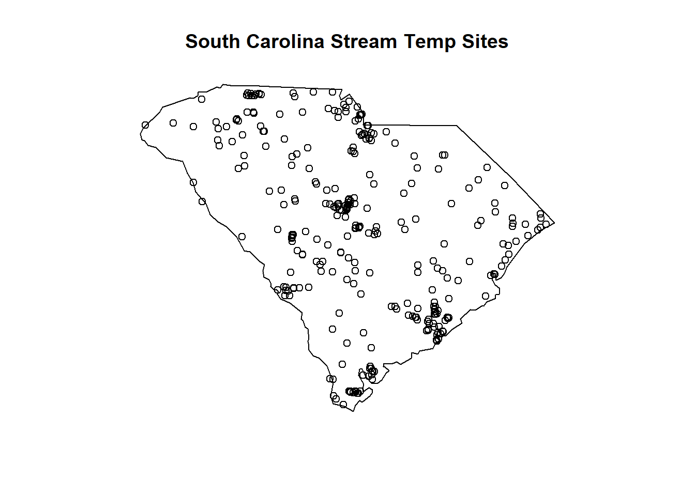
<p class="caption">(\#fig:sc_streamtemp_data_map)Geographic locations of NWIS South Carolina stream sites with temperature data</p>
</div>


Continuing with the South Carolina temperature data example, let's look for the mean daily stream temperature.  


```r
# Average daily SC stream temperature data
data_sc_stream_temp_avg <- whatNWISdata(
  stateCd="SC", 
  siteType="ST",
  parameterCd="00010",
  service="dv",
  statCd="00003")
nrow(data_sc_stream_temp_avg)
```

```
## [1] 99
```

Let's apply an additional filter to these data using the `filter` function from `dplyr`. Imagine that the trend analysis you are conducting requires a minimum of 300 records and the most recent data needs to be no earlier than 1975.


```r
# Useable average daily SC stream temperature data
library(dplyr)
data_sc_stream_temp_avg_applicable <- data_sc_stream_temp_avg %>% 
  filter(count_nu >= 300, end_date >= "1975-01-01")
nrow(data_sc_stream_temp_avg_applicable)
```

```
## [1] 97
```

This means you would have 97 sites to work with for your study.

## Common WQP function arguments

*_`countrycode`_*, *_`statecode`_*, and *_`countycode`_* These geopolitical filters can be specified by a two letter abbreviation, state name, or Federal Information Processing Standard (FIPS) code. If you are using the FIPS code for a state or county, it must be preceded by the FIPS code of the larger geopolitical filter. For example, the FIPS code for the United States is `US`, and the FIPS code for South Carolina is `45`. When querying with the statecode, you can enter `statecode="US:45"`. The same rule extends to county FIPS; for example, you can use `countycode="45:001"` to query Abbeville County, South Carolina. You can find all state and county codes and abbreviations by executing `stateCd` or `countyCd` in your console.

*_`siteType`_* Specify the hydrologic location the sample was taken, e.g. streams, lakes, groundwater sources. These should be listed as a string. Available types can be found [here](https://www.waterqualitydata.us/Codes/Sitetype?mimeType=xml).

*_`organization`_* The ID of the reporting organization. All USGS science centers are written "USGS-" and then the two-letter state abbrevation. For example, the Wisconsin Water Science Center would be written "USGS-WI". For all available organization IDs, please see [this list of org ids](https://www.waterqualitydata.us/Codes/Organization?mimeType=xml). The id is listed in the "value" field, but they are accompanied by the organization name in the "desc" (description) field. 
*_`siteid`_* This is the unique identification number associated with a data collection station. Site IDs for the same location may differ depending on the reporting organization. The site ID string is written as the agency code then the site number separated by a hyphen. For example, the USGS site 01594440 would be written as "USGS-01594440".

*_`characteristicName`_* and *_`characteristicType`_* Unlike NWIS, WQP does not have codes for each parameter. Instead, you need to search based on the name of the water quality constituent (referred to as `characteristicName` in `dataRetrieval`) or a group of parameters (`characteristicType` in `dataRetrieval`). For example, "Nitrate" is a `characteristicName` and "Nutrient" is the `characteristicType` that it fits into. For a complete list of water quality types and names, see [characteristicType list](https://www.waterqualitydata.us/Codes/Characteristictype?mimeType=xml) and [characteristicName list](https://www.waterqualitydata.us/Codes/Characteristicname?mimeType=xml). 

*_`startDate`_* and *_`endDate`_* Arguments specifying the beginning and ending of the period of record you are interested in. For the `dataRetrieval` functions, these can be a date or character class in the form YYYY-MM-DD. For example, `startDate = as.Date("2010-01-01")` or `startDate = "2010-01-01"` could both be your input arguments.

## Discovering WQP data

WQP has millions of records, and if you aren't careful, your query could take hours because of the amount of data that met your criteria. To avoid this, you can query just for the number of records and number of sites that meet your criteria using the argument `querySummary=TRUE` in the function, `readWQPdata`. See the [lesson on downloading WQP data](/usgs-packages/readWQP) to learn more about getting data. You can also use `whatWQPsites` to get the site information that matches your criteria.

Let's follow a similar pattern to NWIS data discovery sections and explore available stream temperature data in South Carolina.

### readWQPdata + querySummary

`readWQPdata` is the function used to actually download WQP data. In this application, we are just querying for a count of sites and results that match our criteria. Since WQP expect state and county codes as their FIPS code, you will need to use the string "US:45" for South Carolina. 


```r
wqpcounts_sc <- readWQPdata(statecode="US:45", querySummary = TRUE)
names(wqpcounts_sc)
```

```
##  [1] "content-type"              "content-length"           
##  [3] "connection"                "server"                   
##  [5] "date"                      "content-disposition"      
##  [7] "total-site-count"          "nwis-site-count"          
##  [9] "storet-site-count"         "total-activity-count"     
## [11] "nwis-activity-count"       "storet-activity-count"    
## [13] "total-result-count"        "nwis-result-count"        
## [15] "storet-result-count"       "x-frame-options"          
## [17] "x-content-type-options"    "x-xss-protection"         
## [19] "strict-transport-security" "x-cache"                  
## [21] "via"                       "x-amz-cf-pop"             
## [23] "x-amz-cf-id"
```

This returns a list with 23 different items, including total number of sites, breakdown of the number of sites by source (BioData, NWIS, STORET), total number of records, and breakdown of records count by source. Let's just look at total number of sites and total number of records.


```r
wqpcounts_sc[['total-site-count']]
```

```
## [1] 7607
```

```r
wqpcounts_sc[['total-result-count']]
```

```
## [1] 4018586
```

This doesn't provide any information about the sites, just the total number. I know that with 4,018,586 results, I will want to add more criteria before trying to download. Let's continue to add query parameters before moving to `whatWQPsites`.


```r
# specify that you only want data from streams
wqpcounts_sc_stream <- readWQPdata(statecode="US:45", siteType="Stream",
                                  querySummary = TRUE)
wqpcounts_sc_stream[['total-site-count']]
```

```
## [1] 2257
```

```r
wqpcounts_sc_stream[['total-result-count']]
```

```
## [1] 2011036
```

2,011,036 results are still a lot to download. Let's add more levels of criteria:


```r
# specify that you want water temperature data and it should be from 1975 or later
wqpcounts_sc_stream_temp <- readWQPdata(statecode="US:45", siteType="Stream",
                                       characteristicName="Temperature, water",
                                       startDate="1975-01-01",
                                       querySummary = TRUE)
wqpcounts_sc_stream_temp[['total-site-count']]
```

```
## [1] 1683
```

```r
wqpcounts_sc_stream_temp[['total-result-count']]
```

```
## [1] 148463
```

148,463 is little more manageble. We can also easily compare avilable stream temperature and lake temperature data.


```r
wqpcounts_sc_lake_temp <- readWQPdata(statecode="US:45", 
                                      siteType="Lake, Reservoir, Impoundment",
                                      characteristicName="Temperature, water",
                                      startDate="1975-01-01",
                                      querySummary = TRUE)
# comparing site counts
wqpcounts_sc_stream_temp[['total-site-count']]
```

```
## [1] 1683
```

```r
wqpcounts_sc_lake_temp[['total-site-count']]
```

```
## [1] 712
```

```r
# comparing result counts
wqpcounts_sc_stream_temp[['total-result-count']]
```

```
## [1] 148463
```

```r
wqpcounts_sc_lake_temp[['total-result-count']]
```

```
## [1] 60607
```

From these query results, it looks like South Carolina has much more stream data than it does lake data.

Now, let's try our South Carolina stream temperature query with `whatWQPsites` and see if we can narrow the results at all.

### whatWQPsites

`whatWQPsites` gives back site information that matches your search criteria. You can use any of the regular WQP web service arguments here. We are going to use `whatWQPsites` with the final criteria of the last query summary call - state, site type, parameter, and the earliest start date. This should return the same amount of sites as the last `readWQPdata` query did, 1,683.


```r
# Getting the number of sites and results for stream 
# temperature measurements in South Carolina after 1975.
wqpsites_sc_stream_temp <- whatWQPsites(statecode="US:45", siteType="Stream",
                                       characteristicName="Temperature, water",
                                       startDate="1975-01-01")
# number of sites
nrow(wqpsites_sc_stream_temp)
```

```
## [1] 1683
```

```r
# names of available columns
names(wqpsites_sc_stream_temp)
```

```
##  [1] "OrganizationIdentifier"                         
##  [2] "OrganizationFormalName"                         
##  [3] "MonitoringLocationIdentifier"                   
##  [4] "MonitoringLocationName"                         
##  [5] "MonitoringLocationTypeName"                     
##  [6] "MonitoringLocationDescriptionText"              
##  [7] "HUCEightDigitCode"                              
##  [8] "DrainageAreaMeasure.MeasureValue"               
##  [9] "DrainageAreaMeasure.MeasureUnitCode"            
## [10] "ContributingDrainageAreaMeasure.MeasureValue"   
## [11] "ContributingDrainageAreaMeasure.MeasureUnitCode"
## [12] "LatitudeMeasure"                                
## [13] "LongitudeMeasure"                               
## [14] "SourceMapScaleNumeric"                          
## [15] "HorizontalAccuracyMeasure.MeasureValue"         
## [16] "HorizontalAccuracyMeasure.MeasureUnitCode"      
## [17] "HorizontalCollectionMethodName"                 
## [18] "HorizontalCoordinateReferenceSystemDatumName"   
## [19] "VerticalMeasure.MeasureValue"                   
## [20] "VerticalMeasure.MeasureUnitCode"                
## [21] "VerticalAccuracyMeasure.MeasureValue"           
## [22] "VerticalAccuracyMeasure.MeasureUnitCode"        
## [23] "VerticalCollectionMethodName"                   
## [24] "VerticalCoordinateReferenceSystemDatumName"     
## [25] "CountryCode"                                    
## [26] "StateCode"                                      
## [27] "CountyCode"                                     
## [28] "AquiferName"                                    
## [29] "LocalAqfrName"                                  
## [30] "FormationTypeText"                              
## [31] "AquiferTypeName"                                
## [32] "ConstructionDateText"                           
## [33] "WellDepthMeasure.MeasureValue"                  
## [34] "WellDepthMeasure.MeasureUnitCode"               
## [35] "WellHoleDepthMeasure.MeasureValue"              
## [36] "WellHoleDepthMeasure.MeasureUnitCode"           
## [37] "ProviderName"
```

Similar to what we did with the NWIS functions, we can filter the sites further using the available metadata in `wqpsites_sc_stream_temp`. We are going to imagine that for our study the sites must have an associated drainage area and cannot be below sea level. Using `dplyr::filter`:


```r
# Filtering the number of sites and results for stream temperature 
# measurements in South Carolina after 1975 to also have an
# associated drainage area and collected above sea level.
wqpsites_sc_stream_temp_applicable <- wqpsites_sc_stream_temp %>% 
  filter(!is.na(DrainageAreaMeasure.MeasureValue),
         VerticalMeasure.MeasureValue > 0)

nrow(wqpsites_sc_stream_temp_applicable)
```

```
## [1] 72
```

This brings the count down to a much more manageable 72 sites. Now we are ready to download this data.

## readNWIS functions

We have learned how to discover data available in NWIS, but now we will look at how to retrieve data. There are many functions to do this, see the table below for a description of each. Each variation of `readNWIS` is accessing a different web service. For a definition and more information on each of these services, please see https://waterservices.usgs.gov/rest/. Also, refer to the previous lesson for a description of the major arguments to `readNWIS` functions.

<table class='gmisc_table' style='border-collapse: collapse; margin-top: 1em; margin-bottom: 1em;' >
<thead>
<tr><td colspan='3' style='text-align: left;'>
<caption>Table 1. readNWIS function definitions</caption></td></tr>
<tr>
<th style='font-weight: 900; border-bottom: 1px solid grey; border-top: 2px solid grey; text-align: center;'>Function</th>
<th style='font-weight: 900; border-bottom: 1px solid grey; border-top: 2px solid grey; text-align: center;'>Description</th>
<th style='font-weight: 900; border-bottom: 1px solid grey; border-top: 2px solid grey; text-align: center;'>Arguments</th>
</tr>
</thead>
<tbody>
<tr>
<td style='padding-bottom: 0.5em; padding-right: 0.5em; padding-top: 0.5em; text-align: left;'><a href="#readnwisdata">readNWISdata</a></td>
<td style='padding-bottom: 0.5em; padding-right: 0.5em; padding-top: 0.5em; text-align: left;'>Most general NWIS data import function. User must explicitly define the service parameter. More flexible than the other functions.</td>
<td style='padding-bottom: 0.5em; padding-right: 0.5em; padding-top: 0.5em; text-align: left;'>..., asDateTime, convertType, tz</td>
</tr>
<tr style='background-color: #f7f7f7;'>
<td style='padding-bottom: 0.5em; padding-right: 0.5em; padding-top: 0.5em; background-color: #f7f7f7; text-align: left;'><a href="#readnwisdv">readNWISdv</a></td>
<td style='padding-bottom: 0.5em; padding-right: 0.5em; padding-top: 0.5em; background-color: #f7f7f7; text-align: left;'>Returns time-series data summarized to a day. Default is mean daily.</td>
<td style='padding-bottom: 0.5em; padding-right: 0.5em; padding-top: 0.5em; background-color: #f7f7f7; text-align: left;'>siteNumbers, parameterCd, startDate, endDate, statCd</td>
</tr>
<tr>
<td style='padding-bottom: 0.5em; padding-right: 0.5em; padding-top: 0.5em; text-align: left;'><a href="#readnwisgwl">readNWISgwl</a></td>
<td style='padding-bottom: 0.5em; padding-right: 0.5em; padding-top: 0.5em; text-align: left;'>Groundwater levels.</td>
<td style='padding-bottom: 0.5em; padding-right: 0.5em; padding-top: 0.5em; text-align: left;'>siteNumbers, startDate, endDate, parameterCd, convertType, tz</td>
</tr>
<tr style='background-color: #f7f7f7;'>
<td style='padding-bottom: 0.5em; padding-right: 0.5em; padding-top: 0.5em; background-color: #f7f7f7; text-align: left;'><a href="#readnwismeas">readNWISmeas</a></td>
<td style='padding-bottom: 0.5em; padding-right: 0.5em; padding-top: 0.5em; background-color: #f7f7f7; text-align: left;'>Surface water measurements.</td>
<td style='padding-bottom: 0.5em; padding-right: 0.5em; padding-top: 0.5em; background-color: #f7f7f7; text-align: left;'>siteNumbers, startDate, endDate, tz, expanded, convertType</td>
</tr>
<tr>
<td style='padding-bottom: 0.5em; padding-right: 0.5em; padding-top: 0.5em; text-align: left;'><a href="#readnwispcode">readNWISpCode</a></td>
<td style='padding-bottom: 0.5em; padding-right: 0.5em; padding-top: 0.5em; text-align: left;'>Metadata information for one or many parameter codes.</td>
<td style='padding-bottom: 0.5em; padding-right: 0.5em; padding-top: 0.5em; text-align: left;'>parameterCd</td>
</tr>
<tr style='background-color: #f7f7f7;'>
<td style='padding-bottom: 0.5em; padding-right: 0.5em; padding-top: 0.5em; background-color: #f7f7f7; text-align: left;'><a href="#readnwispeak">readNWISpeak</a></td>
<td style='padding-bottom: 0.5em; padding-right: 0.5em; padding-top: 0.5em; background-color: #f7f7f7; text-align: left;'>Annual maximum instantaneous streamflows and gage heights.</td>
<td style='padding-bottom: 0.5em; padding-right: 0.5em; padding-top: 0.5em; background-color: #f7f7f7; text-align: left;'>siteNumbers, startDate, endDate, asDateTime, convertType</td>
</tr>
<tr>
<td style='padding-bottom: 0.5em; padding-right: 0.5em; padding-top: 0.5em; text-align: left;'><a href="#readnwisqw">readNWISqw</a></td>
<td style='padding-bottom: 0.5em; padding-right: 0.5em; padding-top: 0.5em; text-align: left;'>Discrete water quality data.</td>
<td style='padding-bottom: 0.5em; padding-right: 0.5em; padding-top: 0.5em; text-align: left;'>siteNumbers, parameterCd, startDate, endDate, expanded, reshape, tz</td>
</tr>
<tr style='background-color: #f7f7f7;'>
<td style='padding-bottom: 0.5em; padding-right: 0.5em; padding-top: 0.5em; background-color: #f7f7f7; text-align: left;'><a href="#readnwisrating">readNWISrating</a></td>
<td style='padding-bottom: 0.5em; padding-right: 0.5em; padding-top: 0.5em; background-color: #f7f7f7; text-align: left;'>Rating table information for active stream gages</td>
<td style='padding-bottom: 0.5em; padding-right: 0.5em; padding-top: 0.5em; background-color: #f7f7f7; text-align: left;'>siteNumber, type, convertType</td>
</tr>
<tr>
<td style='padding-bottom: 0.5em; padding-right: 0.5em; padding-top: 0.5em; text-align: left;'><a href="#readnwissite">readNWISsite</a></td>
<td style='padding-bottom: 0.5em; padding-right: 0.5em; padding-top: 0.5em; text-align: left;'>Site metadata information</td>
<td style='padding-bottom: 0.5em; padding-right: 0.5em; padding-top: 0.5em; text-align: left;'>siteNumbers</td>
</tr>
<tr style='background-color: #f7f7f7;'>
<td style='padding-bottom: 0.5em; padding-right: 0.5em; padding-top: 0.5em; background-color: #f7f7f7; text-align: left;'><a href="#readnwisstat">readNWISstat</a></td>
<td style='padding-bottom: 0.5em; padding-right: 0.5em; padding-top: 0.5em; background-color: #f7f7f7; text-align: left;'>Daily, monthly, or annual statistics for time-series data. Default is mean daily.</td>
<td style='padding-bottom: 0.5em; padding-right: 0.5em; padding-top: 0.5em; background-color: #f7f7f7; text-align: left;'>siteNumbers, parameterCd, startDate, endDate, convertType, statReportType, statType</td>
</tr>
<tr>
<td style='padding-bottom: 0.5em; padding-right: 0.5em; padding-top: 0.5em; text-align: left;'><a href="#readnwisuse">readNWISuse</a></td>
<td style='padding-bottom: 0.5em; padding-right: 0.5em; padding-top: 0.5em; text-align: left;'>Data from the USGS National Water Use Program.</td>
<td style='padding-bottom: 0.5em; padding-right: 0.5em; padding-top: 0.5em; text-align: left;'>stateCd, countyCd, years, categories, convertType, transform</td>
</tr>
<tr style='background-color: #f7f7f7;'>
<td style='padding-bottom: 0.5em; padding-right: 0.5em; padding-top: 0.5em; background-color: #f7f7f7; border-bottom: 2px solid grey; text-align: left;'><a href="#readnwisuv">readNWISuv</a></td>
<td style='padding-bottom: 0.5em; padding-right: 0.5em; padding-top: 0.5em; background-color: #f7f7f7; border-bottom: 2px solid grey; text-align: left;'>Returns time-series data reported from the USGS Instantaneous Values Web Service.</td>
<td style='padding-bottom: 0.5em; padding-right: 0.5em; padding-top: 0.5em; background-color: #f7f7f7; border-bottom: 2px solid grey; text-align: left;'>siteNumbers, parameterCd, startDate, endDate, tz</td>
</tr>
</tbody>
</table>

\html{<br>}

Each service-specific function is a wrapper for the more flexible `readNWISdata`. They set a default for the service argument and have limited user defined arguments. All `readNWIS` functions require a "major filter" as an argument, but `readNWISdata` can accept any major filter while others are limited to site numbers or state/county codes (see Table 1 for more info). 

Other major filters that can be used in `readNWISdata` include hydrologic unit codes (`huc`) and bounding boxes (`bBox`). More information about major filters can be found in the [NWIS web services documentation](https://waterservices.usgs.gov/rest/Site-Service.html#Major_Filters).

The following are examples of how to use each of the readNWIS family of functions. Don't forget to load the `dataRetrieval` library if you are in a new session.

1. [readNWISdata, county major filter](#readnwisdata-county)
2. [readNWISdata, huc major filter](#readnwisdata-huc)
3. [readNWISdata, bbox major filter](#readnwisdata-bbox)
4. [readNWISdv](#readnwisdv)
5. [readNWISgwl](#readnwisgwl)
6. [readNWISmeas](#readnwismeas)
7. [readNWISpCode](#readnwispcode)
8. [readNWISpeak](#readnwispeak)
9. [readNWISqw, multiple sites](#readnwisqw-multsite)
10. [readNWISqw, multiple parameters](#readnwisqw-multparm)
11. [readNWISrating, using base table](#readnwisrating)
12. [readNWISrating, corrected table](#readnwisrating)
13. [readNWISrating, shift table](#readnwisrating)
14. [readNWISsite](#readnwissite)
15. [readNWISstat](#readnwisstat)
16. [readNWISuse](#readnwisuse)
17. [readNWISuv](#readnwisuv)


### readNWISdata

This function is the generic, catch-all for pulling down NWIS data. It can accept a number of arguments, but the argument name must be included. To use this function, you need to specify at list one major filter (state, county, site number, huc, or bounding box) and the NWIS service (daily value, instantaneous, groundwater, etc). The rest are optional query parameters. Follow along with the three examples below or see `?readNWISdata` for more information.

<a name="readnwisdata-county"></a>

**Historic mean daily streamflow for sites in Maui County, Hawaii.**


```r
# Major filter: Maui County 
## need to also include the state when using counties as the major filter
# Service: daily value, dv
# Parameter code: streamflow in cfs, 00060

MauiCo_avgdailyQ <- readNWISdata(stateCd="Hawaii", countyCd="Maui", service="dv", parameterCd="00060")
head(MauiCo_avgdailyQ)
```

```
##   agency_cd  site_no   dateTime X_00060_00003 X_00060_00003_cd tz_cd
## 1      USGS 16400000 2022-10-11          15.1                P   UTC
## 2      USGS 16401000 1929-08-31          18.0                A   UTC
## 3      USGS 16402000 1957-07-31          51.0                A   UTC
## 4      USGS 16403000 1957-06-30           5.5                A   UTC
## 5      USGS 16403600 1970-09-30           2.4                A   UTC
## 6      USGS 16403900 1996-09-30           1.3                A   UTC
```

```r
# How many sites are returned?
length(unique(MauiCo_avgdailyQ$site_no))
```

```
## [1] 134
```

<a name="readnwisdata-huc"></a>

**Historic minimum water temperatures for the HUC8 corresponding to the island of Maui, Hawaii.**

To see all HUCs available, visit https://water.usgs.gov/GIS/huc_name.html. The default statistic for daily values in `readNWISdata` is to return the max (00001), min (00002), and mean (00003). We will specify the minimum only for this example. You will need to use the statistic code, not the name. For all the available statistic codes, see the [statType web service documentation](https://waterservices.usgs.gov/rest/Statistics-Service.html#statType) and [NWIS table mapping statistic names to codes](https://help.waterdata.usgs.gov/stat_code). Caution! In `readNWISdata` and `readNWISdv` the argument is called `statCd`, but in `readNWISstat` the argument is `statType`.


```r
# Major filter: HUC 8 for Maui, 20020000
# Service: daily value, dv
# Statistic: minimum, 00002
# Parameter code: water temperature in deg C, 00010

MauiHUC8_mindailyT <- readNWISdata(huc="20020000", service="dv", statCd="00002", parameterCd="00010")
head(MauiHUC8_mindailyT)
```

```
##   agency_cd  site_no   dateTime X_00010_00002 X_00010_00002_cd tz_cd
## 1      USGS 16508000 2003-11-24          17.4                A   UTC
## 2      USGS 16516000 2003-11-24          16.3                A   UTC
## 3      USGS 16520000 2004-04-14          17.5                A   UTC
## 4      USGS 16527000 2004-01-13          15.4                A   UTC
## 5      USGS 16555000 2004-01-13          16.4                A   UTC
## 6      USGS 16618000 2022-10-11          20.5                P   UTC
```

```r
# How many sites are returned?
length(unique(MauiHUC8_mindailyT$site_no))
```

```
## [1] 47
```

<a name="readnwisdata-bbox"></a>

**Total nitrogen in mg/L for last 30 days around Great Salt Lake in Utah.**

This example uses `Sys.Date` to get the most recent date, so your dates will differ. To get any data around Great Salt Lake, we will use a bounding box as the major filter. The bounding box must be a vector of decimal numbers indicating the western longitude, southern latitude, eastern longitude, and northern latitude. The vector must be in that order.


```r
# Major filter: bounding box around Great Salt Lake 
# Service: water quality, qw
# Parameter code: total nitrogen in mg/L, 00600
# Beginning: this past 30 days, use Sys.Date()

prev30days <- Sys.Date() - 30
SaltLake_totalN <- readNWISdata(bBox=c(-113.0428, 40.6474, -112.0265, 41.7018), service="qw", 
                           parameterCd="00600", startDate=prev30days)
# This service returns a lot of columns:
names(SaltLake_totalN)
```

```
##  [1] "agency_cd"                           "site_no"                            
##  [3] "sample_dt"                           "sample_tm"                          
##  [5] "sample_end_dt"                       "sample_end_tm"                      
##  [7] "tm_datum_rlbty_cd"                   "coll_ent_cd"                        
##  [9] "medium_cd"                           "tu_id"                              
## [11] "body_part_id"                        "p00010"                             
## [13] "p00020"                              "p00025"                             
## [15] "p00061"                              "p00065"                             
## [17] "p00095"                              "p00098"                             
## [19] "p00191"                              "p00300"                             
## [21] "p00301"                              "p00400"                             
## [23] "p00480"                              "p30207"                             
## [25] "p30209"                              "p30211"                             
## [27] "p50280"                              "p70305"                             
## [29] "p71820"                              "p71999"                             
## [31] "p72012"                              "p72013"                             
## [33] "p72020"                              "p72104"                             
## [35] "p72219"                              "p72220"                             
## [37] "p72263"                              "p82398"                             
## [39] "p84164"                              "p84171"                             
## [41] "p84182"                              "p99105"                             
## [43] "p99111"                              "p99156"                             
## [45] "p99159"                              "p99206"                             
## [47] "sample_start_time_datum_cd_reported" "sample_end_time_datum_cd_reported"  
## [49] "startDateTime"                       "tz_cd"
```

```r
# How many sites are returned?
length(unique(SaltLake_totalN$site_no))
```

```
## [1] 12
```

### readNWISdv

This function is the daily value service function. It has a limited number of arguments and requires a site number and parameter code. Follow along with the example below or see `?readNWISdv` for more information.

<a name="readnwisdv"></a>

**Minimum and maximum pH daily data for a site on the Missouri River near Townsend, MT.**


```r
# Remember, you can always use whatNWISdata to see what is available at the site before querying
mt_available <- whatNWISdata(siteNumber="462107111312301", service="dv", parameterCd="00400")
head(mt_available)
```

```
##   agency_cd         site_no                                 station_nm
## 4      USGS 462107111312301 Missouri River ab Canyon Ferry nr Townsend
## 5      USGS 462107111312301 Missouri River ab Canyon Ferry nr Townsend
## 6      USGS 462107111312301 Missouri River ab Canyon Ferry nr Townsend
##   site_tp_cd dec_lat_va dec_long_va coord_acy_cd dec_coord_datum_cd alt_va
## 4         ST   46.35188   -111.5239            S              NAD83   3790
## 5         ST   46.35188   -111.5239            S              NAD83   3790
## 6         ST   46.35188   -111.5239            S              NAD83   3790
##   alt_acy_va alt_datum_cd   huc_cd data_type_cd parm_cd stat_cd ts_id
## 4         20       NGVD29 10030101           dv   00400   00001 82218
## 5         20       NGVD29 10030101           dv   00400   00002 82219
## 6         20       NGVD29 10030101           dv   00400   00008 82220
##   loc_web_ds medium_grp_cd parm_grp_cd   srs_id access_cd begin_date   end_date
## 4         NA           wat        <NA> 17028275         0 2010-08-18 2011-09-21
## 5         NA           wat        <NA> 17028275         0 2010-08-18 2011-09-21
## 6         NA           wat        <NA> 17028275         0 2010-08-18 2011-09-21
##   count_nu
## 4       72
## 5       72
## 6       72
```

```r
# Major filter: site number, 462107111312301
# Statistic: minimum and maximum, 00001 and 00002
# Parameter: pH, 00400
mt_site_pH <- readNWISdv(siteNumber="462107111312301", parameterCd="00400", 
                         statCd=c("00001", "00002"))
head(mt_site_pH)
```

```
##   agency_cd         site_no       Date X_00400_00001 X_00400_00001_cd
## 1      USGS 462107111312301 2010-08-18           8.9                A
## 2      USGS 462107111312301 2010-08-19           8.9                A
## 3      USGS 462107111312301 2010-08-20           8.9                A
## 4      USGS 462107111312301 2010-08-21           8.9                A
## 5      USGS 462107111312301 2010-08-22           8.8                A
## 6      USGS 462107111312301 2010-08-23           8.9                A
##   X_00400_00002 X_00400_00002_cd
## 1           8.3                A
## 2           8.3                A
## 3           8.4                A
## 4           8.4                A
## 5           8.4                A
## 6           8.4                A
```

### readNWISgwl

This function is the groundwater level service function. It has a limited number of arguments and requires a site number. Follow along with the example below or see `?readNWISgwl` for more information.

<a name="readnwisgwl"></a>

**Historic groundwater levels for a site near Portland, Oregon.**


```r
# Major filter: site number, 452840122302202
or_site_gwl <- readNWISgwl(siteNumbers="452840122302202")
head(or_site_gwl)
```

```
##   agency_cd         site_no site_tp_cd     lev_dt lev_tm lev_tz_cd_reported
## 1      USGS 452840122302202         GW 1988-03-14   <NA>                UTC
## 2      USGS 452840122302202         GW 1988-03-14   <NA>                UTC
## 3      USGS 452840122302202         GW 1988-03-14   <NA>                UTC
## 4      USGS 452840122302202         GW 1988-04-05  17:50                UTC
## 5      USGS 452840122302202         GW 1988-04-05  17:50                UTC
## 6      USGS 452840122302202         GW 1988-04-05  17:50                UTC
##   lev_va sl_lev_va sl_datum_cd lev_status_cd lev_agency_cd lev_dt_acy_cd
## 1     NA    232.07      NGVD29             1          <NA>             D
## 2     NA    235.56      NAVD88             1          <NA>             D
## 3   9.78        NA        <NA>             1          <NA>             D
## 4     NA    233.08      NGVD29             1          <NA>             m
## 5     NA    236.57      NAVD88             1          <NA>             m
## 6   8.77        NA        <NA>             1          <NA>             m
##   lev_acy_cd lev_src_cd lev_meth_cd lev_age_cd parameter_cd        lev_dateTime
## 1       <NA>       <NA>           Z          A        62610                <NA>
## 2       <NA>       <NA>           Z          A        62611                <NA>
## 3       <NA>       <NA>           Z          A        72019                <NA>
## 4       <NA>       <NA>           S          A        62610 1988-04-05 17:50:00
## 5       <NA>       <NA>           S          A        62611 1988-04-05 17:50:00
## 6       <NA>       <NA>           S          A        72019 1988-04-05 17:50:00
##   lev_tz_cd
## 1       UTC
## 2       UTC
## 3       UTC
## 4       UTC
## 5       UTC
## 6       UTC
```

### readNWISmeas

This function is the field measurement service function which pulls manual measurements for streamflow and gage height. It has a limited number of arguments and requires a site number. Follow along with the example below or see `?readNWISmeas` for more information.

<a name="readnwismeas"></a>

**Historic surface water measurements for a site near Dade City, Florida.**


```r
# Major filter: site number, 02311500
fl_site_meas <- readNWISmeas(siteNumbers="02311500")
# Names of columns returned:
names(fl_site_meas)
```

```
##  [1] "agency_cd"                 "site_no"                  
##  [3] "measurement_nu"            "measurement_dt"           
##  [5] "measurement_tm"            "q_meas_used_fg"           
##  [7] "party_nm"                  "site_visit_coll_agency_cd"
##  [9] "gage_height_va"            "discharge_va"             
## [11] "measured_rating_diff"      "gage_va_change"           
## [13] "gage_va_time"              "control_type_cd"          
## [15] "discharge_cd"              "measurement_dateTime"     
## [17] "tz_cd"
```

### readNWISpCode

This function returns the parameter information associated with a parameter code. It only has one argument - the parameter code. See the example below or `?readNWISpCode` for more information.

<a name="readnwispcode"></a>

**Get information about the parameters gage height, specific conductance, and total phosphorus.**

This function only has one argument, the parameter code. You can supply one or multiple and you will get a dataframe with information about each parameter.


```r
# gage height, 00065
readNWISpCode("00065")
```

```
##    parameter_cd parameter_group_nm      parameter_nm casrn      srsname
## 48        00065           Physical Gage height, feet       Height, gage
##    parameter_units
## 48              ft
```

```r
# specific conductance and total phosphorus, 00095 and 00665
readNWISpCode(c("00095", "00665"))
```

```
##     parameter_cd parameter_group_nm
## 63         00095           Physical
## 210        00665           Nutrient
##                                                                                   parameter_nm
## 63  Specific conductance, water, unfiltered, microsiemens per centimeter at 25 degrees Celsius
## 210                          Phosphorus, water, unfiltered, milligrams per liter as phosphorus
##         casrn              srsname parameter_units
## 63            Specific conductance      uS/cm @25C
## 210 7723-14-0           Phosphorus       mg/l as P
```

### readNWISpeak

This function is the peak flow service function. It has a limited number of arguments and requires a site number. Follow along with the example below or see `?readNWISpeak` for more information.

The default settings will return data where the date of the peak flow is known. To see peak flows with incomplete dates, change `convertType` to `FALSE`. This allows the date column to come through as character, keeping any incomplete or incorrect dates.

<a name="readnwispeak"></a>

**Peak flow values for a site near Cassia, Florida.**


```r
# Major filter: site number, 02235200
fl_site_peak <- readNWISpeak(siteNumbers="02235200")
fl_site_peak$peak_dt
```

```
##  [1] "1962-10-06" "1964-09-13" "1965-08-11" "1966-08-15" "1967-08-30"
##  [6] "1968-09-01" "1968-10-22" "1969-10-05" "1971-02-10" "1972-04-02"
## [11] "1973-09-16" "1974-09-07" "1975-09-01" "1976-06-06" NA          
## [16] "1978-08-08" "1979-09-29" "1980-04-04" "1981-09-18" "1982-04-12"
## [21] "1983-04-24" "1984-04-11" "1985-09-21" "1986-01-14" "1987-04-01"
## [26] "1988-09-11" "1989-01-24" "1990-02-27" "1991-06-02" "1991-10-08"
## [31] "1993-03-27" "1994-09-12" "1994-11-18" "1995-10-12" "1996-10-12"
## [36] "1998-02-21" "1998-10-05" "1999-10-08" "2001-09-17" "2002-08-16"
## [41] "2003-03-10" "2004-09-13" "2004-10-01" "2005-10-25" "2007-07-21"
## [46] "2008-08-26" "2009-05-26" "2010-03-16" "2011-04-07" "2012-08-30"
## [51] "2012-10-08" "2014-07-31" "2015-09-20" "2016-02-06" "2017-09-12"
## [56] "2018-07-06" "2019-08-17" "2020-07-17" "2020-10-04"
```

```r
# Compare complete with incomplete/incorrect dates
fl_site_peak_incomp <- readNWISpeak(siteNumbers="02235200", convertType = FALSE)
fl_site_peak_incomp$peak_dt[is.na(fl_site_peak$peak_dt)]
```

```
## [1] "1977-00-00"
```

### readNWISqw

This function is the water quality service function. It has a limited number of arguments and requires a site number and a parameter code. Follow along with the two examples below or see `?readNWISqw` for more information.

<a name="readnwisqw-multsite"></a>

**Dissolved oxygen for two sites near the Columbia River in Oregon for water year 2016**


```r
# Major filter: site numbers, 455415119314601 and 454554119121801
# Parameter: dissolved oxygen in mg/L, 00300
# Begin date: October 1, 2015
# End date: September 30, 2016

or_site_do <- readNWISqw(siteNumbers=c("455415119314601", "454554119121801"), parameterCd="00300",
                        startDate="2015-10-01", endDate="2016-09-30")
ncol(or_site_do)
```

```
## [1] 36
```

```r
head(or_site_do[,c("site_no","sample_dt","result_va")])
```

```
##           site_no  sample_dt result_va
## 1 455415119314601 2015-10-28       0.7
## 2 455415119314601 2016-01-20       0.1
## 3 455415119314601 2016-03-18       0.1
## 4 455415119314601 2016-04-21       0.4
## 5 455415119314601 2016-06-22       0.5
## 6 455415119314601 2016-07-28       0.0
```

<a name="readnwisqw-multparm"></a>

**Post Clean Water Act lead and mercury levels in McGaw, Ohio.**


```r
# Major filter: site number, 03237280
# Parameter: mercury and lead in micrograms/liter, 71890 and 01049
# Begin date: January 1, 1972

oh_site_cwa <- readNWISqw(siteNumbers="03237280", 
                          parameterCd=c("71890", "01049"),
                          startDate="1972-01-01")
nrow(oh_site_cwa)
```

```
## [1] 76
```

```r
ncol(oh_site_cwa)
```

```
## [1] 36
```

```r
head(oh_site_cwa[,c("parm_cd","sample_dt","result_va")])
```

```
##   parm_cd  sample_dt result_va
## 1   01049 1972-06-20       0.0
## 2   01049 1973-06-21        NA
## 3   71890 1973-06-21       0.5
## 4   01049 1973-10-31        NA
## 5   71890 1973-10-31       0.5
## 6   01049 1980-03-04      10.0
```

### readNWISrating

This function is the rating curve service function. It has a limited number of arguments and requires a site number. Follow along with the three examples below or see `?readNWISrating` for more information.

There are three different types of rating tables that can be accessed using the argument `type`. They are `base`, `corr` (corrected), and `exsa` (shifts). For `type=="base"` (the default), the result is a data frame with 3 columns: `INDEP`, `DEP`, and `STOR`. For `type=="corr"`, the resulting data frame will have 3 columns: `INDEP`, `CORR`, and `CORRINDEP`. For `type=="exsa"`, the data frame will have 4 columns: `INDEP`, `DEP`, `STOR`, and `SHIFT`. See below for definitions of each column.

- `INDEP` is the gage height in feet
- `DEP` is the streamflow in cubic feet per second
- `STOR` "*" indicates a fixed point of the rating curve, `NA` for non-fixed points
- `SHIFT` indicates shifting in rating for the corresponding `INDEP` value
- `CORR` are the corrected values of `INDEP`
- `CORRINDEP` are the corrected values of `CORR`

There are also a number of attributes associated with the data.frame returned - `url`, `queryTime`, `comment`, `siteInfo`, and `RATING`. `RATING` will only be included when `type` is `base`. See [this section](#accessing-attributes) for how to access attributes of `dataRetrieval` data frames.

<a name="readnwisrating"></a>

**Rating tables for Mississippi River at St. Louis, MO**


```r
# Major filter: site number, 07010000
# Type: default, base 

miss_rating_base <- readNWISrating(siteNumber="07010000")
head(miss_rating_base)
```

```
##    INDEP      DEP STOR
## 1 -10.95  30000.0    *
## 2   9.40 188188.6    *
## 3  17.89 293140.6    *
## 4  25.00 400400.0    *
## 5  30.00 501300.0    *
## 6  34.34 600000.0    *
```


```r
# Major filter: site number, 07010000
# Type: corr 

miss_rating_corr <- readNWISrating(siteNumber="07010000", type="corr")
head(miss_rating_corr)
```

```
##    INDEP CORR CORRINDEP
## 1 -10.95    0    -10.95
## 2 -10.94    0    -10.94
## 3 -10.93    0    -10.93
## 4 -10.92    0    -10.92
## 5 -10.91    0    -10.91
## 6 -10.90    0    -10.90
```


```r
# Major filter: site number, 07010000
# Type: exsa 

miss_rating_exsa <- readNWISrating(siteNumber="07010000", type="exsa")
head(miss_rating_exsa)
```

```
##    INDEP SHIFT      DEP STOR
## 1 -10.95     0 30000.00    *
## 2 -10.94     0 30041.15 <NA>
## 3 -10.93     0 30082.33 <NA>
## 4 -10.92     0 30123.54 <NA>
## 5 -10.91     0 30164.78 <NA>
## 6 -10.90     0 30206.06 <NA>
```

### readNWISsite

This function is pulls data from a USGS site file. It only has one argument - the site number. Follow along with the example below or see `?readNWISsite` for more information.

<a name="readnwissite"></a>

**Get metadata information for a site in Bronx, NY**


```r
# site number, 01302020

readNWISsite(siteNumbers="01302020")
```

```
##   agency_cd  site_no                                     station_nm site_tp_cd
## 1      USGS 01302020 BRONX RIVER AT NY BOTANICAL GARDEN AT BRONX NY         ST
##     lat_va  long_va dec_lat_va dec_long_va coord_meth_cd coord_acy_cd
## 1 405144.3 735227.8   40.86231   -73.87439             N            1
##   coord_datum_cd dec_coord_datum_cd district_cd state_cd county_cd country_cd
## 1          NAD83              NAD83          36       36       005         US
##   land_net_ds       map_nm map_scale_fc alt_va alt_meth_cd alt_acy_va
## 1          NA FLUSHING, NY        24000  49.86           X       0.08
##   alt_datum_cd   huc_cd basin_cd topo_cd                 instruments_cd
## 1       NAVD88 02030102     <NA>    <NA> YNNNYNNNNYNNNNNNNNNNNNNNNNNNNN
##   construction_dt inventory_dt drain_area_va contrib_drain_area_va tz_cd
## 1              NA           NA          38.4                    NA   EST
##   local_time_fg reliability_cd gw_file_cd nat_aqfr_cd aqfr_cd aqfr_type_cd
## 1             N           <NA>       <NA>        <NA>    <NA>         <NA>
##   well_depth_va hole_depth_va depth_src_cd project_no
## 1            NA            NA         <NA>       <NA>
```

### readNWISstat

This function is the statistics service function. It has a limited number of arguments and requires a site number and parameter code. Follow along with the example below or see `?readNWISstat` for more information.

The [NWIS Statistics web service](https://waterservices.usgs.gov/rest/Statistics-Service.html) is currently in Beta mode, so use at your own discretion. Additionally, "mean" is the only `statType` that can be used for annual or monthly report types at this time.

<a name="readnwisstat"></a>

**Historic annual average discharge near Mississippi River outlet**


```r
# Major filter: site number, 07374525
# Parameter: discharge in cfs, 00060
# Time division: annual
# Statistic: average, "mean"

mississippi_avgQ <- readNWISstat(siteNumbers="07374525", parameterCd="00060", 
                                 statReportType="annual", statType="mean")
head(mississippi_avgQ)
```

```
##   agency_cd  site_no parameter_cd ts_id loc_web_ds year_nu mean_va
## 1      USGS 07374525        00060 61182         NA    2009  618800
## 2      USGS 07374525        00060 61182         NA    2010  563700
## 3      USGS 07374525        00060 61182         NA    2012  362100
## 4      USGS 07374525        00060 61182         NA    2014  489000
## 5      USGS 07374525        00060 61182         NA    2015  625800
## 6      USGS 07374525        00060 61182         NA    2020  706300
```

### readNWISuse

This function is the water use service function. The water use data web service requires a state and/or county as the major filter. The default will return all years and all categories available. The following table shows the water-use categories and their corresponding abbreviation for county and state data. Note that categories have changed over time, and vary by data sets requested. National and site-specific data sets exist, but only county/state data are available through this service. Please visit the [USGS National Water Use Information Program website](https://water.usgs.gov/watuse/) for more information.

<table class='gmisc_table' style='border-collapse: collapse; margin-top: 1em; margin-bottom: 1em;' >
<thead>
<tr><td colspan='2' style='text-align: left;'>
<caption>Table 2. Water-use category names and abbreviations.</caption></td></tr>
<tr>
<th style='font-weight: 900; border-bottom: 1px solid grey; border-top: 2px solid grey; text-align: center;'>Name</th>
<th style='font-weight: 900; border-bottom: 1px solid grey; border-top: 2px solid grey; text-align: center;'>Abbreviation</th>
</tr>
</thead>
<tbody>
<tr>
<td style='padding-bottom: 0.5em; padding-right: 0.5em; padding-top: 0.5em; text-align: left;'>Aquaculture</td>
<td style='padding-bottom: 0.5em; padding-right: 0.5em; padding-top: 0.5em; text-align: left;'>AQ</td>
</tr>
<tr style='background-color: #f7f7f7;'>
<td style='padding-bottom: 0.5em; padding-right: 0.5em; padding-top: 0.5em; background-color: #f7f7f7; text-align: left;'>Commercial</td>
<td style='padding-bottom: 0.5em; padding-right: 0.5em; padding-top: 0.5em; background-color: #f7f7f7; text-align: left;'>CO</td>
</tr>
<tr>
<td style='padding-bottom: 0.5em; padding-right: 0.5em; padding-top: 0.5em; text-align: left;'>Domestic</td>
<td style='padding-bottom: 0.5em; padding-right: 0.5em; padding-top: 0.5em; text-align: left;'>DO</td>
</tr>
<tr style='background-color: #f7f7f7;'>
<td style='padding-bottom: 0.5em; padding-right: 0.5em; padding-top: 0.5em; background-color: #f7f7f7; text-align: left;'>Hydroelectric Power</td>
<td style='padding-bottom: 0.5em; padding-right: 0.5em; padding-top: 0.5em; background-color: #f7f7f7; text-align: left;'>HY</td>
</tr>
<tr>
<td style='padding-bottom: 0.5em; padding-right: 0.5em; padding-top: 0.5em; text-align: left;'>Irrigation, Crop</td>
<td style='padding-bottom: 0.5em; padding-right: 0.5em; padding-top: 0.5em; text-align: left;'>IC</td>
</tr>
<tr style='background-color: #f7f7f7;'>
<td style='padding-bottom: 0.5em; padding-right: 0.5em; padding-top: 0.5em; background-color: #f7f7f7; text-align: left;'>Irrigation, Golf Courses</td>
<td style='padding-bottom: 0.5em; padding-right: 0.5em; padding-top: 0.5em; background-color: #f7f7f7; text-align: left;'>IG</td>
</tr>
<tr>
<td style='padding-bottom: 0.5em; padding-right: 0.5em; padding-top: 0.5em; text-align: left;'>Industrial</td>
<td style='padding-bottom: 0.5em; padding-right: 0.5em; padding-top: 0.5em; text-align: left;'>IN</td>
</tr>
<tr style='background-color: #f7f7f7;'>
<td style='padding-bottom: 0.5em; padding-right: 0.5em; padding-top: 0.5em; background-color: #f7f7f7; text-align: left;'>Total Irrigation</td>
<td style='padding-bottom: 0.5em; padding-right: 0.5em; padding-top: 0.5em; background-color: #f7f7f7; text-align: left;'>IT</td>
</tr>
<tr>
<td style='padding-bottom: 0.5em; padding-right: 0.5em; padding-top: 0.5em; text-align: left;'>Livestock (Animal Specialties)</td>
<td style='padding-bottom: 0.5em; padding-right: 0.5em; padding-top: 0.5em; text-align: left;'>LA</td>
</tr>
<tr style='background-color: #f7f7f7;'>
<td style='padding-bottom: 0.5em; padding-right: 0.5em; padding-top: 0.5em; background-color: #f7f7f7; text-align: left;'>Livestock</td>
<td style='padding-bottom: 0.5em; padding-right: 0.5em; padding-top: 0.5em; background-color: #f7f7f7; text-align: left;'>LI</td>
</tr>
<tr>
<td style='padding-bottom: 0.5em; padding-right: 0.5em; padding-top: 0.5em; text-align: left;'>Livestock (Stock)</td>
<td style='padding-bottom: 0.5em; padding-right: 0.5em; padding-top: 0.5em; text-align: left;'>LS</td>
</tr>
<tr style='background-color: #f7f7f7;'>
<td style='padding-bottom: 0.5em; padding-right: 0.5em; padding-top: 0.5em; background-color: #f7f7f7; text-align: left;'>Mining</td>
<td style='padding-bottom: 0.5em; padding-right: 0.5em; padding-top: 0.5em; background-color: #f7f7f7; text-align: left;'>MI</td>
</tr>
<tr>
<td style='padding-bottom: 0.5em; padding-right: 0.5em; padding-top: 0.5em; text-align: left;'>Other Industrial</td>
<td style='padding-bottom: 0.5em; padding-right: 0.5em; padding-top: 0.5em; text-align: left;'>OI</td>
</tr>
<tr style='background-color: #f7f7f7;'>
<td style='padding-bottom: 0.5em; padding-right: 0.5em; padding-top: 0.5em; background-color: #f7f7f7; text-align: left;'>Thermoelectric Power (Closed-loop cooling)</td>
<td style='padding-bottom: 0.5em; padding-right: 0.5em; padding-top: 0.5em; background-color: #f7f7f7; text-align: left;'>PC</td>
</tr>
<tr>
<td style='padding-bottom: 0.5em; padding-right: 0.5em; padding-top: 0.5em; text-align: left;'>Fossil-fuel Thermoelectric Power</td>
<td style='padding-bottom: 0.5em; padding-right: 0.5em; padding-top: 0.5em; text-align: left;'>PF</td>
</tr>
<tr style='background-color: #f7f7f7;'>
<td style='padding-bottom: 0.5em; padding-right: 0.5em; padding-top: 0.5em; background-color: #f7f7f7; text-align: left;'>Geothermal Thermoelectric Power</td>
<td style='padding-bottom: 0.5em; padding-right: 0.5em; padding-top: 0.5em; background-color: #f7f7f7; text-align: left;'>PG</td>
</tr>
<tr>
<td style='padding-bottom: 0.5em; padding-right: 0.5em; padding-top: 0.5em; text-align: left;'>Nuclear Thermoelectric Power</td>
<td style='padding-bottom: 0.5em; padding-right: 0.5em; padding-top: 0.5em; text-align: left;'>PN</td>
</tr>
<tr style='background-color: #f7f7f7;'>
<td style='padding-bottom: 0.5em; padding-right: 0.5em; padding-top: 0.5em; background-color: #f7f7f7; text-align: left;'>Thermoelectric Power (Once-through cooling)</td>
<td style='padding-bottom: 0.5em; padding-right: 0.5em; padding-top: 0.5em; background-color: #f7f7f7; text-align: left;'>PO</td>
</tr>
<tr>
<td style='padding-bottom: 0.5em; padding-right: 0.5em; padding-top: 0.5em; text-align: left;'>Public Supply</td>
<td style='padding-bottom: 0.5em; padding-right: 0.5em; padding-top: 0.5em; text-align: left;'>PS</td>
</tr>
<tr style='background-color: #f7f7f7;'>
<td style='padding-bottom: 0.5em; padding-right: 0.5em; padding-top: 0.5em; background-color: #f7f7f7; text-align: left;'>Total Power</td>
<td style='padding-bottom: 0.5em; padding-right: 0.5em; padding-top: 0.5em; background-color: #f7f7f7; text-align: left;'>PT</td>
</tr>
<tr>
<td style='padding-bottom: 0.5em; padding-right: 0.5em; padding-top: 0.5em; text-align: left;'>Total Thermoelectric Power</td>
<td style='padding-bottom: 0.5em; padding-right: 0.5em; padding-top: 0.5em; text-align: left;'>PT</td>
</tr>
<tr style='background-color: #f7f7f7;'>
<td style='padding-bottom: 0.5em; padding-right: 0.5em; padding-top: 0.5em; background-color: #f7f7f7; text-align: left;'>Reservoir Evaporation</td>
<td style='padding-bottom: 0.5em; padding-right: 0.5em; padding-top: 0.5em; background-color: #f7f7f7; text-align: left;'>RE</td>
</tr>
<tr>
<td style='padding-bottom: 0.5em; padding-right: 0.5em; padding-top: 0.5em; text-align: left;'>Total Population</td>
<td style='padding-bottom: 0.5em; padding-right: 0.5em; padding-top: 0.5em; text-align: left;'>TP</td>
</tr>
<tr style='background-color: #f7f7f7;'>
<td style='padding-bottom: 0.5em; padding-right: 0.5em; padding-top: 0.5em; background-color: #f7f7f7; border-bottom: 2px solid grey; text-align: left;'>Wastewater Treatment</td>
<td style='padding-bottom: 0.5em; padding-right: 0.5em; padding-top: 0.5em; background-color: #f7f7f7; border-bottom: 2px solid grey; text-align: left;'>WW</td>
</tr>
</tbody>
</table>

Follow along with the example below or see `?readNWISuse` for more information.

<a name="readnwisuse"></a>

**Las Vegas historic water use**


```r
# Major filter: Clark County, NV
# Water-use category: public supply, PS
vegas_wu <- readNWISuse(stateCd="NV", countyCd="Clark", categories="PS")
ncol(vegas_wu)
```

```
## [1] 26
```

```r
names(vegas_wu)
```

```
##  [1] "state_cd"                                                                
##  [2] "state_name"                                                              
##  [3] "county_cd"                                                               
##  [4] "county_nm"                                                               
##  [5] "year"                                                                    
##  [6] "Public.Supply.population.served.by.groundwater..in.thousands"            
##  [7] "Public.Supply.population.served.by.surface.water..in.thousands"          
##  [8] "Public.Supply.total.population.served..in.thousands"                     
##  [9] "Public.Supply.self.supplied.groundwater.withdrawals..fresh..in.Mgal.d"   
## [10] "Public.Supply.self.supplied.groundwater.withdrawals..saline..in.Mgal.d"  
## [11] "Public.Supply.total.self.supplied.withdrawals..groundwater..in.Mgal.d"   
## [12] "Public.Supply.self.supplied.surface.water.withdrawals..fresh..in.Mgal.d" 
## [13] "Public.Supply.self.supplied.surface.water.withdrawals..saline..in.Mgal.d"
## [14] "Public.Supply.total.self.supplied.withdrawals..surface.water..in.Mgal.d" 
## [15] "Public.Supply.total.self.supplied.withdrawals..fresh..in.Mgal.d"         
## [16] "Public.Supply.total.self.supplied.withdrawals..saline..in.Mgal.d"        
## [17] "Public.Supply.total.self.supplied.withdrawals..total..in.Mgal.d"         
## [18] "Public.Supply.deliveries.to.domestic..in.Mgal.d"                         
## [19] "Public.Supply.deliveries.to.commercial..in.Mgal.d"                       
## [20] "Public.Supply.deliveries.to.industrial..in.Mgal.d"                       
## [21] "Public.Supply.deliveries.to.thermoelectric..in.Mgal.d"                   
## [22] "Public.Supply.total.deliveries..in.Mgal.d"                               
## [23] "Public.Supply.public.use.and.losses..in.Mgal.d"                          
## [24] "Public.Supply.per.capita.use..in.gallons.person.day"                     
## [25] "Public.Supply.reclaimed.wastewater..in.Mgal.d"                           
## [26] "Public.Supply.number.of.facilities"
```

```r
head(vegas_wu[,1:7])
```

```
##   state_cd state_name county_cd    county_nm year
## 1       32     Nevada       003 Clark County 1985
## 2       32     Nevada       003 Clark County 1990
## 3       32     Nevada       003 Clark County 1995
## 4       32     Nevada       003 Clark County 2000
## 5       32     Nevada       003 Clark County 2005
## 6       32     Nevada       003 Clark County 2010
##   Public.Supply.population.served.by.groundwater..in.thousands
## 1                                                      149.770
## 2                                                      108.140
## 3                                                      128.010
## 4                                                      176.850
## 5                                                            -
## 6                                                            -
##   Public.Supply.population.served.by.surface.water..in.thousands
## 1                                                        402.210
## 2                                                        618.000
## 3                                                        844.060
## 4                                                       1169.600
## 5                                                              -
## 6                                                              -
```

### readNWISuv

This function is the unit value (or instantaneous) service function. It has a limited number of arguments and requires a site number and parameter code. Follow along with the example below or see `?readNWISuv` for more information.

<a name="readnwisuv"></a>

**Turbidity and discharge for April 2016 near Lake Tahoe in California.**


```r
# Major filter: site number, 10336676
# Parameter: discharge in cfs and turbidity in FNU, 00060 and 63680
# Begin date: April 1, 2016
# End date: April 30, 2016

ca_site_do <- readNWISuv(siteNumbers="10336676", parameterCd=c("00060", "63680"),
                         startDate="2016-04-01", endDate="2016-04-30")
nrow(ca_site_do)
```

```
## [1] 2880
```

```r
head(ca_site_do)
```

```
##   agency_cd  site_no            dateTime X_00060_00000 X_00060_00000_cd
## 1      USGS 10336676 2016-04-01 07:00:00          28.9                A
## 2      USGS 10336676 2016-04-01 07:15:00          28.2                A
## 3      USGS 10336676 2016-04-01 07:30:00          28.2                A
## 4      USGS 10336676 2016-04-01 07:45:00          28.9                A
## 5      USGS 10336676 2016-04-01 08:00:00          28.9                A
## 6      USGS 10336676 2016-04-01 08:15:00          28.2                A
##   X_63680_00000 X_63680_00000_cd tz_cd
## 1           1.2                A   UTC
## 2           1.3                A   UTC
## 3           1.2                A   UTC
## 4           1.1                A   UTC
## 5           1.2                A   UTC
## 6           1.3                A   UTC
```

## Additional Features

### Accessing attributes

`dataRetrieval` returns a lot of useful information as "attributes" to the data returned. This includes site metadata information, the NWIS url used, date and time the query was performed, and more. First, you want to use `attributes()` to see what information is available. It returns a list of all the metadata information. Then you can use `attr()` to actually get that information. Let's use the base rating table example from before to illustrate this. It has a special attribute called "RATING".


```r
# Major filter: site number, 07010000
# Type: default, base 
miss_rating_base <- readNWISrating(siteNumber="07010000")

# how many attributes are there and what are they?
length(attributes(miss_rating_base))
```

```
## [1] 9
```

```r
names(attributes(miss_rating_base))
```

```
## [1] "row.names"  "names"      "class"      "queryTime"  "url"       
## [6] "headerInfo" "comment"    "RATING"     "siteInfo"
```

```r
# look at the site info
attr(miss_rating_base, "siteInfo")
```

```
##   agency_cd  site_no                         station_nm site_tp_cd   lat_va
## 1      USGS 07010000 Mississippi River at St. Louis, MO         ST 383744.4
##    long_va dec_lat_va dec_long_va coord_meth_cd coord_acy_cd coord_datum_cd
## 1 901047.2     38.629   -90.17978             N            5          NAD83
##   dec_coord_datum_cd district_cd state_cd county_cd country_cd
## 1              NAD83          29       29       510         US
##               land_net_ds       map_nm map_scale_fc alt_va alt_meth_cd
## 1       S   T45N  R07E  5 GRANITE CITY        24000 379.58           L
##   alt_acy_va alt_datum_cd   huc_cd basin_cd topo_cd
## 1       0.05       NAVD88 07140101     <NA>    <NA>
##                   instruments_cd construction_dt inventory_dt drain_area_va
## 1 NNNNYNNNNNNNNNNNNNNNNNNNNNNNNN              NA     19891229        697000
##   contrib_drain_area_va tz_cd local_time_fg reliability_cd gw_file_cd
## 1                    NA   CST             Y              C   NNNNNNNN
##   nat_aqfr_cd aqfr_cd aqfr_type_cd well_depth_va hole_depth_va depth_src_cd
## 1        <NA>    <NA>         <NA>            NA            NA         <NA>
##   project_no
## 1       <NA>
```

```r
# now look at the special RATING attribute
attr(miss_rating_base, "RATING")
```

```
## [1] "ID=19.0"                                                            
## [2] "TYPE=STGQ"                                                          
## [3] "NAME=stage-discharge"                                               
## [4] "AGING=Working"                                                      
## [5] "REMARKS= developed for persistent trend to right of rating below 25"
## [6] "EXPANSION=logarithmic"                                              
## [7] "OFFSET1=-2.800000E+01"
```

All attributes are an R object once you extract them. They can be lists, data.frames, vectors, etc. If we want to use information from one of the attributes, index it just like you would any other object of that type. For example, we want the drainage area for this Mississippi site:


```r
# save site info metadata as its own object
miss_site_info <- attr(miss_rating_base, "siteInfo")
class(miss_site_info)
```

```
## [1] "data.frame"
```

```r
# extract the drainage area
miss_site_info$drain_area_va
```

```
## [1] 697000
```

### Using lists as input

`readNWISdata` allows users to give a list of named arguments as the input to the call. This is especially handy if you would like to build up a list of arguments and use it in multiple calls. This only works in `readNWISdata`, none of the other `readNWIS...` functions have this ability.


```r
chicago_q_args <- list(siteNumbers=c("05537500", "05536358", "05531045"),
                       startDate="2015-10-01",
                       endDate="2015-12-31",
                       parameterCd="00060")

# query for unit value data with those arguments
chicago_q_uv <- readNWISdata(chicago_q_args, service="uv")
nrow(chicago_q_uv)
```

```
## [1] 14488
```

```r
# same query but for daily values
chicago_q_dv <- readNWISdata(chicago_q_args, service="dv")
nrow(chicago_q_dv)
```

```
## [1] 151
```

### Helper functions

There are currently 3 helper functions: renameNWIScolumns, addWaterYear, and zeroPad. `renameNWIScolumns` takes some of the default column names and makes them more human-readable (e.g. "X_00060_00000" becomes "Flow_Inst"). `addWaterYear` adds an additional column of integers indicating the water year. `zeroPad` is used to add leading zeros to any string that is missing them, and is not restricted to `dataRetrieval` output.

**renameNWIScolumns**

`renameNWIScolumns` can be used in two ways: it can be a standalone function following the `dataRetrieval` call or it can be piped (as long as `magrittr` or `dplyr` are loaded). Both examples are shown below. Note that `renameNWIScolumns` is intended for use with columns named using pcodes. It does not work with all possible data returned.


```r
# get discharge and temperature data for July 2016 in Ft Worth, TX
ftworth_qt_july <- readNWISuv(siteNumbers="08048000", parameterCd=c("00060", "00010"), 
                              startDate="2016-07-01", endDate="2016-07-31")
names(ftworth_qt_july)
```

```
## [1] "agency_cd"        "site_no"          "dateTime"         "X_00010_00000"   
## [5] "X_00010_00000_cd" "X_00060_00000"    "X_00060_00000_cd" "tz_cd"
```

```r
# now rename columns
ftworth_qt_july_renamed <- renameNWISColumns(ftworth_qt_july)
names(ftworth_qt_july_renamed)
```

```
## [1] "agency_cd"     "site_no"       "dateTime"      "Wtemp_Inst"   
## [5] "Wtemp_Inst_cd" "Flow_Inst"     "Flow_Inst_cd"  "tz_cd"
```

Now try with a pipe. Remember to load a packge that uses `%>%`.


```r
library(magrittr)

# get discharge and temperature data for July 2016 in Ft Worth, TX
# pipe straight into rename function
ftworth_qt_july_pipe <- readNWISuv(siteNumbers="08048000", parameterCd=c("00060", "00010"), 
                                   startDate="2016-07-01", endDate="2016-07-31") %>% 
  renameNWISColumns()

names(ftworth_qt_july_pipe)
```

```
## [1] "agency_cd"     "site_no"       "dateTime"      "Wtemp_Inst"   
## [5] "Wtemp_Inst_cd" "Flow_Inst"     "Flow_Inst_cd"  "tz_cd"
```

**addWaterYear**

Similar to `renameNWIScolumns`, `addWaterYear` can be used as a standalone function or with a pipe. This function defines a water year as October 1 of the previous year to September 30 of the current year. Additionally, `addWaterYear` is limited to data.frames with date columns titled "dateTime", "Date", "ActivityStartDate", and "ActivityEndDate".


```r
# mean daily discharge on the Colorado River in Grand Canyon National Park for fall of 2014
# The dates in Sept should be water year 2014, but the dates in Oct and Nov are water year 2015
co_river_q_fall <- readNWISdv(siteNumber="09403850", parameterCd="00060", 
                              startDate="2014-09-28", endDate="2014-11-30")
head(co_river_q_fall)
```

```
##   agency_cd  site_no       Date X_00060_00003 X_00060_00003_cd
## 1      USGS 09403850 2014-09-28        319.00                A
## 2      USGS 09403850 2014-09-29        411.00                A
## 3      USGS 09403850 2014-09-30        375.00                A
## 4      USGS 09403850 2014-10-01         26.40                A
## 5      USGS 09403850 2014-10-02         10.80                A
## 6      USGS 09403850 2014-10-03          5.98                A
```

```r
# now add the water year column
co_river_q_fall_wy <- addWaterYear(co_river_q_fall)
head(co_river_q_fall_wy)
```

```
##   agency_cd  site_no       Date waterYear X_00060_00003 X_00060_00003_cd
## 1      USGS 09403850 2014-09-28      2014        319.00                A
## 2      USGS 09403850 2014-09-29      2014        411.00                A
## 3      USGS 09403850 2014-09-30      2014        375.00                A
## 4      USGS 09403850 2014-10-01      2015         26.40                A
## 5      USGS 09403850 2014-10-02      2015         10.80                A
## 6      USGS 09403850 2014-10-03      2015          5.98                A
```

```r
unique(co_river_q_fall_wy$waterYear)
```

```
## [1] 2014 2015
```

Now try with a pipe. 


```r
# mean daily discharge on the Colorado River in Grand Canyon National Park for fall of 2014
# pipe straight into rename function
co_river_q_fall_pipe <- readNWISdv(siteNumber="09403850", parameterCd="00060", 
                              startDate="2014-09-01", endDate="2014-11-30") %>% 
  addWaterYear()

names(co_river_q_fall_pipe)
```

```
## [1] "agency_cd"        "site_no"          "Date"             "waterYear"       
## [5] "X_00060_00003"    "X_00060_00003_cd"
```

```r
head(co_river_q_fall_pipe)
```

```
##   agency_cd  site_no       Date waterYear X_00060_00003 X_00060_00003_cd
## 1      USGS 09403850 2014-09-01      2014          3.79              A e
## 2      USGS 09403850 2014-09-02      2014          3.50              A e
## 3      USGS 09403850 2014-09-03      2014          3.54              A e
## 4      USGS 09403850 2014-09-04      2014          3.63              A e
## 5      USGS 09403850 2014-09-05      2014          3.85              A e
## 6      USGS 09403850 2014-09-06      2014          3.76              A e
```

**zeroPad**

`zeroPad` is designed to work on any string, so it is not specific to `dataRetrieval` data.frame output like the previous helper functions. Oftentimes, when reading in Excel or other local data, leading zeros are dropped from site numbers. This function allows you to put them back in. `x` is the string you would like to pad, and `padTo` is the total number of characters the string should have. For instance if an 8-digit site number was read in as numeric, we could pad that by:


```r
siteNum <- 02121500
class(siteNum)
```

```
## [1] "numeric"
```

```r
siteNum
```

```
## [1] 2121500
```

```r
siteNum_fix <- zeroPad(siteNum, 8)
class(siteNum_fix)
```

```
## [1] "character"
```

```r
siteNum_fix
```

```
## [1] "02121500"
```

The next lesson looks at how to use `dataRetrieval` functions for Water Quality Portal retrievals.

## readWQP functions

After discovering Water Quality Portal (WQP) data in the [data discovery section](/dataRetrieval-discovery), we can now read it in using the desired parameters. There are two functions to do this in `dataRetrieval`. Table 1 describes them below. 

<table class='gmisc_table' style='border-collapse: collapse; margin-top: 1em; margin-bottom: 1em;' >
<thead>
<tr><td colspan='3' style='text-align: left;'>
<caption>Table 1. readWQP function definitions</caption></td></tr>
<tr>
<th style='font-weight: 900; border-bottom: 1px solid grey; border-top: 2px solid grey; text-align: center;'>Function</th>
<th style='font-weight: 900; border-bottom: 1px solid grey; border-top: 2px solid grey; text-align: center;'>Description</th>
<th style='font-weight: 900; border-bottom: 1px solid grey; border-top: 2px solid grey; text-align: center;'>Arguments</th>
</tr>
</thead>
<tbody>
<tr>
<td style='padding-bottom: 0.5em; padding-right: 0.5em; padding-top: 0.5em; text-align: left;'><a href="#readwqpdata">readWQPdata</a></td>
<td style='padding-bottom: 0.5em; padding-right: 0.5em; padding-top: 0.5em; text-align: left;'>Most general WQP data import function. Users must define each parameter.</td>
<td style='padding-bottom: 0.5em; padding-right: 0.5em; padding-top: 0.5em; text-align: left;'>..., querySummary, tz, ignore_attributes</td>
</tr>
<tr style='background-color: #f7f7f7;'>
<td style='padding-bottom: 0.5em; padding-right: 0.5em; padding-top: 0.5em; background-color: #f7f7f7; border-bottom: 2px solid grey; text-align: left;'><a href="#readwqpqw">readWQPqw</a></td>
<td style='padding-bottom: 0.5em; padding-right: 0.5em; padding-top: 0.5em; background-color: #f7f7f7; border-bottom: 2px solid grey; text-align: left;'>Used for querying by site numbers and parameter codes only.</td>
<td style='padding-bottom: 0.5em; padding-right: 0.5em; padding-top: 0.5em; background-color: #f7f7f7; border-bottom: 2px solid grey; text-align: left;'>siteNumbers, parameterCd, startDate, endDate, tz, querySummary</td>
</tr>
</tbody>
</table>

\html{<br>}

The main difference between these two functions is that `readWQPdata` is general and accepts any of the paremeters described in the [WQP Web Services Guide](https://www.waterqualitydata.us/webservices_documentation/#WQPWebServicesGuide-Submitting). In contrast, `readWQPqw` has five arguments and users can only use this if they know the site number(s) and parameter code(s) for which they want data.

The following are examples of how to use each of the readWQP family of functions. Don't forget to load the `dataRetrieval` library if you are in a new session.

1. [readWQPdata, state, site type, and characteristic name](#readwqpdata-state)
2. [readWQPdata, county and characteristic group](#readwqpdata-county)
3. [readWQPdata, bbox, characteristic name, and start date](#readwqpdata-bbox)
4. [readWQPqw](#readwqpqw)

### readWQPdata

The generic function used to pull Water Quality Portal data. This function is very flexible. You can specify any of the parameters from the [WQP Web Service Guide](https://www.waterqualitydata.us/webservices_documentation/#WQPWebServicesGuide-Submitting). To learn what the possible values for each, see the [table of domain values](https://www.waterqualitydata.us/webservices_documentation/#WQPWebServicesGuide-Domain). Follow along with the three examples below or see `?readWQPdata` for more information.

<a name="readwqpdata-state"></a>

**Phosphorus data in Wisconsin lakes for water year 2010**


```r
# This takes about 3 minutes to complete.
WI_lake_phosphorus_2010 <- readWQPdata(statecode="WI", 
                                       siteType="Lake, Reservoir, Impoundment", 
                                       characteristicName="Phosphorus", 
                                       startDate="2009-10-01", endDate="2010-09-30")

# What columns are available?
names(WI_lake_phosphorus_2010)
```

```
##  [1] "OrganizationIdentifier"                           
##  [2] "OrganizationFormalName"                           
##  [3] "ActivityIdentifier"                               
##  [4] "ActivityTypeCode"                                 
##  [5] "ActivityMediaName"                                
##  [6] "ActivityMediaSubdivisionName"                     
##  [7] "ActivityStartDate"                                
##  [8] "ActivityStartTime.Time"                           
##  [9] "ActivityStartTime.TimeZoneCode"                   
## [10] "ActivityEndDate"                                  
## [11] "ActivityEndTime.Time"                             
## [12] "ActivityEndTime.TimeZoneCode"                     
## [13] "ActivityDepthHeightMeasure.MeasureValue"          
## [14] "ActivityDepthHeightMeasure.MeasureUnitCode"       
## [15] "ActivityDepthAltitudeReferencePointText"          
## [16] "ActivityTopDepthHeightMeasure.MeasureValue"       
## [17] "ActivityTopDepthHeightMeasure.MeasureUnitCode"    
## [18] "ActivityBottomDepthHeightMeasure.MeasureValue"    
## [19] "ActivityBottomDepthHeightMeasure.MeasureUnitCode" 
## [20] "ProjectIdentifier"                                
## [21] "ActivityConductingOrganizationText"               
## [22] "MonitoringLocationIdentifier"                     
## [23] "ActivityCommentText"                              
## [24] "SampleAquifer"                                    
## [25] "HydrologicCondition"                              
## [26] "HydrologicEvent"                                  
## [27] "SampleCollectionMethod.MethodIdentifier"          
## [28] "SampleCollectionMethod.MethodIdentifierContext"   
## [29] "SampleCollectionMethod.MethodName"                
## [30] "SampleCollectionEquipmentName"                    
## [31] "ResultDetectionConditionText"                     
## [32] "CharacteristicName"                               
## [33] "ResultSampleFractionText"                         
## [34] "ResultMeasureValue"                               
## [35] "ResultMeasure.MeasureUnitCode"                    
## [36] "MeasureQualifierCode"                             
## [37] "ResultStatusIdentifier"                           
## [38] "StatisticalBaseCode"                              
## [39] "ResultValueTypeName"                              
## [40] "ResultWeightBasisText"                            
## [41] "ResultTimeBasisText"                              
## [42] "ResultTemperatureBasisText"                       
## [43] "ResultParticleSizeBasisText"                      
## [44] "PrecisionValue"                                   
## [45] "ResultCommentText"                                
## [46] "USGSPCode"                                        
## [47] "ResultDepthHeightMeasure.MeasureValue"            
## [48] "ResultDepthHeightMeasure.MeasureUnitCode"         
## [49] "ResultDepthAltitudeReferencePointText"            
## [50] "SubjectTaxonomicName"                             
## [51] "SampleTissueAnatomyName"                          
## [52] "ResultAnalyticalMethod.MethodIdentifier"          
## [53] "ResultAnalyticalMethod.MethodIdentifierContext"   
## [54] "ResultAnalyticalMethod.MethodName"                
## [55] "MethodDescriptionText"                            
## [56] "LaboratoryName"                                   
## [57] "AnalysisStartDate"                                
## [58] "ResultLaboratoryCommentText"                      
## [59] "DetectionQuantitationLimitTypeName"               
## [60] "DetectionQuantitationLimitMeasure.MeasureValue"   
## [61] "DetectionQuantitationLimitMeasure.MeasureUnitCode"
## [62] "PreparationStartDate"                             
## [63] "ProviderName"                                     
## [64] "ActivityStartDateTime"                            
## [65] "ActivityEndDateTime"
```

```r
#How much data is returned?
nrow(WI_lake_phosphorus_2010)
```

```
## [1] 495
```

<a name="readwqpdata-county"></a>

**All nutrient data in Napa County, California**


```r
# Use empty character strings to specify that you want the historic record.
# This takes about 3 minutes to run.
Napa_lake_nutrients_Aug2010 <- readWQPdata(statecode="CA", countycode="055", 
                                           characteristicType="Nutrient")

#How much data is returned?
nrow(Napa_lake_nutrients_Aug2010)
```

```
## [1] 5579
```

<a name="readwqpdata-bbox"></a>

**Everglades water temperature data since 2016**


```r
# Bounding box defined by a vector of Western-most longitude, Southern-most latitude, 
# Eastern-most longitude, and Northern-most longitude.
# This takes about 3 minutes to run.
Everglades_temp_2016_present <- readWQPdata(bBox=c(-81.70, 25.08, -80.30, 26.51),  
                                            characteristicName="Temperature, water",
                                            startDate="2016-01-01")

#How much data is returned?
nrow(Everglades_temp_2016_present)
```

```
## [1] 23856
```

### readWQPqw

This function has a limited number of arguments - it can only be used for pulling WQP data by site number and parameter code. By default, dates are set to pull the entire record available. When specifying USGS sites as `siteNumbers` to `readWQP` functions, precede the number with "USGS-". See the example below or `?readWQPqw` for more information.

<a name="readwqpqw"></a>

**Dissolved oxygen data since 2010 for 2 South Carolina USGS sites**


```r
# Using a few USGS sites, get dissolved oxygen data
# This takes ~ 30 seconds to complete.
SC_do_data_since2010 <- readWQPqw(siteNumbers = c("USGS-02146110", "USGS-325427080014600"),
                                  parameterCd = "00300", startDate = "2010-01-01")

# How much data was returned?
nrow(SC_do_data_since2010)
```

```
## [1] 20
```

```r
# What are the DO values and the dates the sample was collected?
head(SC_do_data_since2010[, c("ResultMeasureValue", "ActivityStartDate")])
```

```
##   ResultMeasureValue ActivityStartDate
## 1                5.8        2010-09-26
## 2                5.9        2010-04-08
## 3                5.0        2011-09-06
## 4                7.2        2011-03-09
## 5                4.8        2011-09-06
## 6                6.4        2011-10-18
```

## Attributes and metadata

Similar to the data frames returned from `readNWIS` functions, there are attributes (aka metadata) attached to the data. Use `attributes` to see all of them and `attr` to extract a particular attribute.


```r
# What are the attributes available?
wqp_attributes <- attributes(Everglades_temp_2016_present)
names(wqp_attributes)
```

```
## [1] "names"        "class"        "row.names"    "siteInfo"     "variableInfo"
## [6] "queryTime"    "url"
```

```r
# Look at the variableInfo attribute
head(attr(Everglades_temp_2016_present, "variableInfo"))
```

```
##   characteristicName param_units valueType
## 1 Temperature, water       deg C      <NA>
## 2 Temperature, water       deg C      <NA>
## 3 Temperature, water       deg C      <NA>
## 4 Temperature, water       deg C      <NA>
## 5 Temperature, water       deg C      <NA>
## 6 Temperature, water       deg C      <NA>
```

Let's make a quick map to look at the stations that collected the Everglades data:


```r
siteInfo <- attr(Everglades_temp_2016_present, "siteInfo")

library(maps)
map('state', regions='florida')
title(main="Everglade Sites")
points(x=siteInfo$dec_lon_va, 
       y=siteInfo$dec_lat_va)
# Add a rectangle to see where your original query bounding box in relation to sites
rect(-81.70, 25.08, -80.30, 26.51, col = NA, border = 'red')
```

<div class="figure">
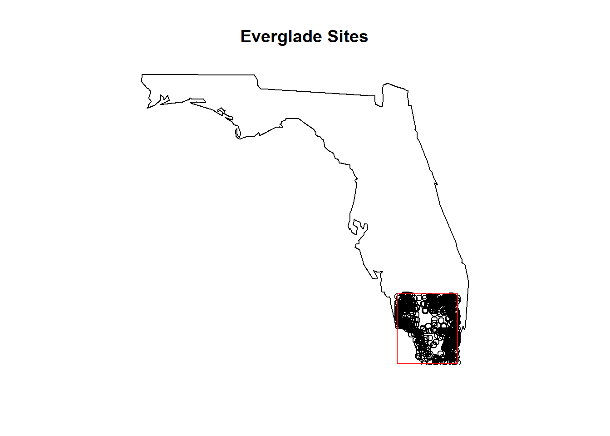
<p class="caption">(\#fig:unnamed-chunk-8)A map of NWIS site locations in the Everglades</p>
</div>

You can now find and download Water Quality Portal data from R! 

## USGS Coding Lab Exercises

### Just how dry was the 2020 monsoon?


Recently NOAA published a press release demonstrating that 2020 was *both* the hottest *and* driest summer on record for Arizona.  In this lab we will look at USGS NWIS stream gauge and preciptitation data to investigate just how anomalous 2020 data are. 

**1:** Use the `readNWISstat` function to retrieve the following statewide data for 2015-2020:
1. Precipitation total (inches/week)
2. Streamflow (ft^3/s)

**2:** Create two timeseries plots (one for preciptitation, one for streamflow), where color is a function of year (e.g. the x axis is month, the y axis is precipitation, legend shows color by year).

**3.** Calculate the monthly mean precipitation and streamflow from 2015-2019, and use that mean to calculate a 2020 anomaly timeseries.  Create two new plots (like #2 above) with the 2015-2019 mean as a thick black line, and 2020 anomaly as a thin red line.


## geoKnife - Introduction

## Lesson Summary

This lesson will explore how to find and download large gridded datasets via the R package `geoknife`. The package was created to allow easy access to data stored in the [Geo Data Portal (GDP)](https://cida.usgs.gov/gdp/), or any gridded dataset available through the [OPeNDAP](https://www.opendap.org/) protocol DAP2 that meets some basic metadata requirements. `geoknife` refers to the gridded dataset as the `fabric`, the spatial feature of interest as the `stencil`, and the subset algorithm parameters as the `knife` (see below).


## Lesson Objectives

Explore and query large gridded datasets for efficient and reproducible large-scale analyses.

By the end of this lesson, the learner will be able to:

1. Explain the differences between remote and local processing.
2. Differentiate the three main concepts of this package: fabric, stencil, and knife.
3. Use this package to retrieve pre-processed data from the Geo Data Portal (GDP) via geoknife.

## Lesson Resources

- Publication: [geoknife: reproducible web-processing of large gridded datasets](http://onlinelibrary.wiley.com/doi/10.1111/ecog.01880/abstract)
- Tutorial (vignette): [geoknife vignette](https://cran.r-project.org/web/packages/geoknife/vignettes/geoknife.html)
- An overview of [remote processing basics](https://cida.usgs.gov/gdp/how-to-gdp/) with the Geo Data Portal
- A blog post on [visualizing Tropical Storm Colin rainfall](https://waterdata.usgs.gov/blog/ts-colin-precip/) with geoknife
- Source code: [geoknife on GitHub](https://github.com/USGS-R/geoknife)
- Report a bug or suggest a feature: [geoknife issues on GitHub](https://github.com/USGS-R/geoknife/issues)

## Remote processing

The USGS Geo Data Portal is designed to perform web-service processing on large gridded datasets. `geoknife` allows R users to take advantage of these services by processing large data, such as data available in the GDP catalog or a user-defined dataset, on the web. This type of workflow has three main advantages: 

1. it allows the user to avoid downloading large datasets, 
2. it avoids reinventing the wheel for the creation and optimization of complex geoprocessing algorithms, and 
3. computing resources are dedicated elsewhere, so geoknife operations do not have much of an impact on a local computer.

## geoknife components: fabric, stencil, knife

The main components of a geoknife workflow are the "fabric", "stencil", and "knife". These three components go into the final element, the geoknife "job" (geojob), which defines what the user needs from the processing, allows tracking of the processing status, and methods to dowload the results. The fabric is the gridded web dataset to be processed, the stencil is the feature of interest, and the knife is the processing algorithm parameters. Each of the `geoknife` components is created using a corresponding function: fabrics are created using `webdata()`, stencils are created using `webgeom()` or `simplegeom()`, and knives are created using `webprocess()`. 

This lesson will focus on discovering what options exist for each of those components. The next lesson will teach you how to construct each component and put it together to get the processed data. Before continuing this lesson, load the geoknife library (install if necessary).


```r
# load the geoknife package
library(geoknife)
```

```
## 
## Attaching package: 'geoknife'
```

```
## The following object is masked from 'package:dplyr':
## 
##     id
```

```
## The following object is masked from 'package:stats':
## 
##     start
```

```
## The following object is masked from 'package:graphics':
## 
##     title
```

```
## The following object is masked from 'package:base':
## 
##     url
```

## Available webdata

### GDP datasets

To learn what data is available through GDP, you can explore the [online catalog](https://cida.usgs.gov/gdp/) or use the function `query`. Note that the access pattern for determining available fabrics differs slightly from stencils and knives. Running `query("webdata")` will return every dataset available through GDP:


```r
all_webdata <- query("webdata")
head(all_webdata)
```

```
## An object of class "datagroup":
## [1] 4km Monthly Parameter-elevation Regressions on Independent Slopes Model Monthly Climate Data for the Continental United States. January 2012 Shapshot 
##   url: https://cida.usgs.gov/thredds/dodsC/prism 
## [2] 4km Monthly Parameter-elevation Regressions on Independent Slopes Model Monthly Climate Data for the Continental United States. January 2022 Snapshot 
##   url: https://cida.usgs.gov/thredds/dodsC/prism_v2 
## [3] ACCESS 1980-1999 
##   url: https://cida.usgs.gov/thredds/dodsC/notaro_ACCESS_1980_1999 
## [4] ACCESS 2040-2059 
##   url: https://cida.usgs.gov/thredds/dodsC/notaro_ACCESS_2040_2059 
## [5] ACCESS 2080-2099 
##   url: https://cida.usgs.gov/thredds/dodsC/notaro_ACCESS_2080_2099 
## [6] Bias Corrected Constructed Analogs V2 Daily Future CMIP5 Climate Projections 
##   url: https://cida.usgs.gov/thredds/dodsC/cmip5_bcca/future
```

```r
length(all_webdata)
```

```
## [1] 532
```

Notice that the object returned is a special `geoknife` class of `datagroup`. There are specific `geoknife` functions that only operate on an object of this class, see `?title` and `?abstract`. These two functions are used to extract metadata information about each of the available GDP datasets. With 532 datasets available, it is likely that reading through each to find ones that are of interest to you would be time consuming. You can use `grep` along with the functions `title` and `abstract` to figure out which datasets you would like to use for processing. 

Let's say that we were interested in evapotranspiration data. To search for which GDP datasets might contain evapotranspiration data, you can use the titles and abstracts.


```r
# notice that you cannot perform a grep on all_webdata - it is because it is a special class
# `grep("evapotranspiration", all_webdata)` will fail
# you need to perform pattern matching on vectors

all_titles <- title(all_webdata)
which_titles <- grep("evapotranspiration", all_titles)
evap_titles <- all_titles[which_titles]
head(evap_titles)
```

```
## [1] "Monthly Conterminous U.S. actual evapotranspiration data"
## [2] "Yearly Conterminous U.S. actual evapotranspiration data"
```

```r
all_abstracts <- abstract(all_webdata)
which_abstracts <- grep("evapotranspiration", all_abstracts)
evap_abstracts <- all_abstracts[which_abstracts]
evap_abstracts[1]
```

```
## [1] "Reference evapotranspiration (ET0), like potential evapotranspiration, is a measure of  atmospheric evaporative demand. It was used in the context of this study to evaluate drought  conditions that can lead to wildfire activity in Alaska using the Evaporative Demand Drought  Index (EDDI) and the Standardized Precipitation Evapotranspiration Index (SPEI). The ET0 data are  on a 20km grid with daily temporal resolution and were computed using the meteorological inputs  from the dynamically downscaled ERA-Interim reanalysis and two global climate model projections  (CCSM4 and GFDL-CM3). The model projections are from CMIP5 and use the RCP8.5 scenario. The  dynamically downscaled data are available at https://registry.opendata.aws/wrf-alaska-snap/.  The ET0 was computed following the American Society of Civil Engineers Standardized Reference  Evapotranspiration Equation based on the downscaled daily temperature, humidity and winds. The  full details of the computation of ET0, an evaluation of the underlying data, and the assessment  of the fire indices are described in Ziel et al. (2020; https://doi.org/10.3390/f11050516)."
```

13 possible datasets to look through is a lot more manageable than 532. Let's say the dataset titled "Yearly Conterminous U.S. actual evapotranspiration data" interested us enough to explore more. We have now identified a fabric of interest.

We might want to know more about the dataset, such as what variables and time periods are available. To actually create the fabric, you will need to use `webdata` and supply the appropriate datagroup object as the input. This should result in an object with a class of `webdata`. The following functions will operate only on an object of class `webdata`.


```r
evap_fabric <- webdata(all_webdata["Yearly Conterminous U.S. actual evapotranspiration data"])
class(evap_fabric)
```

```
## [1] "webdata"
## attr(,"package")
## [1] "geoknife"
```

Now that we have a defined fabric, we can explore what variables and time period are within that data. First, we use `query` to determine what variables exist. You'll notice that the function `variable` returns NA. This is fine when you are just exploring available data; however, exploring available times requires that the variable be defined because sometimes individual variables within a dataset can have different time ranges. Thus, we need to set which variable from the dataset will be used. Then, we can explore times that are available in the data. Using `query()` is helpful when exploring datasets, but is unecessary if you already know what times and variables you'd like to access. 


```r
# no variables defined yet
variables(evap_fabric)
```

```
## [1] NA
```

```r
# find what variables are available
query(evap_fabric, "variables")
```

```
## [1] "et"
```

```r
# trying to find available times before setting the variable results in an error
# `query(evap_fabric, "times")` will fail

# only one variable, "et"
variables(evap_fabric) <- "et"
variables(evap_fabric)
```

```
## [1] "et"
```

```r
# now that the variable is set, we can explore available times
query(evap_fabric, "times")
```

```
## [1] "2000-01-01 UTC" "2021-01-01 UTC"
```

### Datasets not in GDP

Any gridded dataset available online that follows OPeNDAP protocol and some additional conventions can be used with `geoknife`. These datasets can be found through web searches or other catalogs and require finding out the OPeNDAP endpoint (URL) for the dataset. This url is used as the input to the argument `url` in `webdata`. Please email the GDP development team (gdp@usgs.gov) with questions abvout these specifics. 

There are hundreds (or potentially thousands) of additional OPeNDAP datasets that will work with geoknife, but need to be found through web searches or catalogs (e.g., [www.esrl.noaa.gov/psd/thredds/dodsC/Datasets](www.esrl.noaa.gov/psd/thredds/dodsC/Datasets) and [apdrc.soest.hawaii.edu/data/data.php](http://apdrc.soest.hawaii.edu/data/data.php) ). 

We searched NOAA’s OPenDAP data catalog and found data from the [Center for Operational Oceanographic Products and Services THREDDS server](https://opendap.co-ops.nos.noaa.gov/thredds/catalog.html). It includes forecasts for water levels, water currents, water temperatures, and salinity levels for Delaware Bay. Since it is forecasted data, the times associated with the data will change. To create a webdata object from this dataset, just use the OPeNDAP url. Then query variables and time as we did before.


```r
DelBay_fabric <- webdata(url="https://opendap.co-ops.nos.noaa.gov/thredds/dodsC/DBOFS/fmrc/Aggregated_7_day_DBOFS_Fields_Forecast_best.ncd")
query(DelBay_fabric, "variables")
```

```
##  [1] "zeta"  "u"     "v"     "w"     "temp"  "Pair"  "Uwind" "Vwind" "h"    
## [10] "f"     "pm"    "pn"    "angle"
```

```r
# need to set the variable(s) in order to query the times
variables(DelBay_fabric) <- "temp"
query(DelBay_fabric, "times")
```

```
## [1] "2022-10-04 UTC" "2022-10-14 UTC"
```

The first example we've included here uses aggregated data, meaning there is a single URL for all the data of this type on the server. Some data that you encounter might be non-aggregated, meaning there are multiple URLs to access the same data. In these cases, you will need to create more than one geojob and join data at the end.

Here is a second example of using a non-GDP dataset which is not aggregated in times or variables. This data was found under the [data section on Unidata's THREDDS server](https://thredds.ucar.edu/thredds). This example includes water vapor at 8km resolution at national extent from [here](https://thredds.ucar.edu/thredds/catalog/satellite/WV/catalog.html). 


```r
wv_fabric <- webdata(url="https://thredds.ucar.edu/thredds/dodsC/satellite/WV/SUPER-NATIONAL_8km/current/SUPER-NATIONAL_8km_WV_20200904_1330.gini")
query(wv_fabric, "variables")
```

```
## character(0)
```

```r
# need to set the variable(s) in order to query the times
variables(wv_fabric) <- "IR_WV"
query(wv_fabric, "times") # Note the times of this dataset include only a single timestep, since the data collection has a file for each time
```

```
## POSIXct of length 0
```
The url used here for `webdata()` contains the date and the time, so we would need to construct a loop through multiple timesteps in order to assemble a time series from this data source. 

## Available webgeoms
Now that we have explored options for our webdata, let's look at what options exist for geospatial features.

The next component to `geoknife` jobs is the spatial extent of the data, a.k.a. the stencil. The stencil is defined by using either of the functions `simplegeom` or `webgeom`. `simplegeom` is used to explicitly define an area by the user, but `webgeom` is used to specify an existing web feature service (WFS) as the geospatial extent. Defining your stencil using `simplegeom` will be covered in the next lesson. This lesson will just show you how to learn what available webgeoms exist. Users can use any WFS url to create their stencil, but there are a number of features that exist through GDP already. To determine what features exist, you can create a default webgeom object and then query its geom name, attributes, and values. This will return all available GDP default features. 


```r
# setup a default stencil by using webgeom and not supplying any arguments
default_stencil <- webgeom()

# now determine what geoms are available with the default
default_geoms <- query(default_stencil, "geoms")
length(default_geoms)
```

```
## [1] 25
```

```r
head(default_geoms)
```

```
## [1] "sample:Alaska"                  "upload:CIDA_TEST_2"            
## [3] "sample:CONUS_Climate_Divisions" "derivative:CONUS_States"       
## [5] "sample:CONUS_states"            "sample:CSC_Boundaries"
```

You will notice a pattern with the names of the geoms: a category followed by `:`, and then a specific name. These category-name combinations are the strings you would use to define your geom. Additionally, `webgeom` can accept a URL that points directly to a WFS. The categories you should be familiar with are `sample` and `upload`. `sample` geoms are any that are available through `geoknife` by default. `upload` geoms are custom shapefiles that someone uploaded through GDP. If you would like to upload a specific shapefile to GDP, go to the [advanced spatial section in GDP](https://cida.usgs.gov/gdp/client/#!advanced/spatial). **Be aware that uploaded shapefiles are wiped from the server at regular intervals (could be as often as weekly)**. To use your own shapefile: upload it as a zip shapefile, execute your job and then save the output; re-upload your shapefile the next time you need it on GDP if it has expired.

Similar to fabrics where you could not query times without setting the variables, you cannot query attributes of stencils before defining the geoms. Likewise, you cannot query for values of a stencil until you have set the attributes. Attributes give the metadata associated with the stencil and it's geom. Values tell you the individual spatial features available in that attribute of the geom. 


```r
# add a geom to see what values are available
geom(default_stencil)
```

```
## [1] NA
```

```r
geom(default_stencil) <- "sample:CONUS_states"

# now that geom is set, you can query for available attributes
query(default_stencil, "attributes")
```

```
## [1] "STATE" "FIPS"
```

```r
attribute(default_stencil) <- "STATE"

# now that attribute is set, you can query for available values
STATE_values <- query(default_stencil, "values")
head(STATE_values)
```

```
## [1] "Alabama"     "Arizona"     "Arkansas"    "California"  "Colorado"   
## [6] "Connecticut"
```

```r
# switch the stencil to see the differences
ecoreg_stencil <- default_stencil
geom(ecoreg_stencil) <- "sample:Ecoregions_Level_III"
query(ecoreg_stencil, "attributes")
```

```
## [1] "LEVEL3_NAM"
```

```r
attribute(ecoreg_stencil) <- "LEVEL3_NAM"
ecoreg_values <- query(ecoreg_stencil, "values")
head(ecoreg_values)
```

```
## [1] "Ahklun And Kilbuck Mountains" "Alaska Peninsula Mountains"  
## [3] "Alaska Range"                 "Aleutian Islands"            
## [5] "Arctic Coastal Plain"         "Arctic Foothills"
```

```r
# now set the values to the Driftless Area and Blue Ridge ecoregions
values(ecoreg_stencil) <- ecoreg_values[c(12, 33)]
values(ecoreg_stencil)
```

```
## [1] "Blue Ridge"     "Driftless Area"
```

There are some built-in templates that allow stencils to be defined more specifically. Currently, the package only supports US States, Level III Ecoregions, or HUC8s. Below are shortcuts to setting the geom, attribute, and values. 


```r
# creating geoms from the available templates
webgeom('state::Wisconsin')
```

```
## An object of class "webgeom":
## url: https://labs.waterdata.usgs.gov/gdp_web/geoserver/wfs 
## geom: sample:CONUS_states 
## attribute: STATE 
## values: Wisconsin 
## wfs version: 1.1.0
```

```r
webgeom('state::Wisconsin,Maine') # multiple states separated by comma
```

```
## An object of class "webgeom":
## url: https://labs.waterdata.usgs.gov/gdp_web/geoserver/wfs 
## geom: sample:CONUS_states 
## attribute: STATE 
## values: Wisconsin, Maine 
## wfs version: 1.1.0
```

```r
webgeom('HUC8::09020306,14060009') # multiple HUCs separated by comma
```

```
## An object of class "webgeom":
## url: https://labs.waterdata.usgs.gov/gdp_web/geoserver/wfs 
## geom: sample:simplified_huc8 
## attribute: HUC_8 
## values: 09020306, 14060009 
## wfs version: 1.1.0
```

```r
webgeom('ecoregion::Colorado Plateaus,Driftless Area') # multiple ecoregions separated by comma
```

```
## An object of class "webgeom":
## url: https://labs.waterdata.usgs.gov/gdp_web/geoserver/wfs 
## geom: sample:Ecoregions_Level_III 
## attribute: LEVEL3_NAM 
## values: Colorado Plateaus, Driftless Area 
## wfs version: 1.1.0
```

## Available webprocesses

The final component to a geojob is the process algorithm used to aggregate the data across the defined stencil. Web process algorithms can be defined by the user, but let's explore the defaults available through GDP.


```r
# setup a default knife by using webprocess and not supplying any arguments
default_knife <- webprocess()

# now determine what web processing algorithms are available with the default
default_algorithms <- query(default_knife, 'algorithms')
length(default_algorithms)
```

```
## [1] 6
```

```r
head(default_algorithms)
```

```
## $`Timeseries Service Subset`
## [1] "gov.usgs.cida.gdp.wps.algorithm.FeatureTimeSeriesAlgorithm"
## 
## $`Categorical Coverage Fraction`
## [1] "gov.usgs.cida.gdp.wps.algorithm.FeatureCategoricalGridCoverageAlgorithm"
## 
## $`OPeNDAP Subset`
## [1] "gov.usgs.cida.gdp.wps.algorithm.FeatureCoverageOPeNDAPIntersectionAlgorithm"
## 
## $`Area Grid Statistics (unweighted)`
## [1] "gov.usgs.cida.gdp.wps.algorithm.FeatureGridStatisticsAlgorithm"
## 
## $`Area Grid Statistics (weighted)`
## [1] "gov.usgs.cida.gdp.wps.algorithm.FeatureWeightedGridStatisticsAlgorithm"
## 
## $`WCS Subset`
## [1] "gov.usgs.cida.gdp.wps.algorithm.FeatureCoverageIntersectionAlgorithm"
```

From this list, you can define which algorithm you would like the webprocess component to use. Definitions of each of the default algorithms can be found in the Geo Data Portal Algorithm Summaries section of the [GDP process documentation](https://cida.usgs.gov/gdp/client/#!advanced/process). For example, we want to use the OPeNDAP subsetting algorithm, "OPeNDAP Subset", which downloads a spatiotemporal chunk of data without any spatial processing. 


```r
# algorithm actually has a default of the weighted average
algorithm(default_knife)
```

```
## $`Area Grid Statistics (weighted)`
## [1] "gov.usgs.cida.gdp.wps.algorithm.FeatureWeightedGridStatisticsAlgorithm"
```

```r
# change the algorithm to OPeNDAP's subset
algorithm(default_knife) <- default_algorithms['OPeNDAP Subset']
algorithm(default_knife)
```

```
## $`OPeNDAP Subset`
## [1] "gov.usgs.cida.gdp.wps.algorithm.FeatureCoverageOPeNDAPIntersectionAlgorithm"
```

Now that we can explore all of our options, we will learn how to construct each component and execute a geojob in the next lesson.

## Setting up a geojob

A `geojob` is the object that contains all of the necessary processing information to execute a data request to GDP. The `geojob` is made up of the `stencil`, `fabric`, and `knife`.

To create a `geojob`, use the function `geoknife` and give the three components as arguments. `stencil` and `fabric` must be indicated, but `knife` has a default. Any additional arguments are specifications for the webprocessing step. See `?'webprocess-class'` for options. This portion of the lesson will not discuss all of the options. 


```r
# load the geoknife package
library(geoknife)
```

Let's setup a `geojob` to find the unweighted annual evapotranspiration rates for the state of Indiana using the annual evapotranspiration data we saw in the previous section. Since we have seen the URL and know the available variables and times, we can set all of that directly in the `webdata` function. Note: the times field must be a vector of start then end date, and be class `POSIXct` or character.


```r
# create fabric
evap_fabric <- webdata(times = c("2005-01-01", "2015-01-01"),
                         variables = "et",
                         url = 'https://cida.usgs.gov/thredds/dodsC/ssebopeta/yearly')

# create stencil
evap_stencil <- webgeom('state::Indiana')

# create knife (which defaults to weighted)
evap_knife <- webprocess()
# find unweighted algorithm
all_algorithms <- query(evap_knife, 'algorithms')
unw_algorithm <- all_algorithms[grep('unweighted', names(all_algorithms))]
# set knife algorithm to unweighted
algorithm(evap_knife) <- unw_algorithm

# create the geojob
evap_geojob <- geoknife(evap_stencil, evap_fabric, evap_knife)
```


```
## Process Accepted
```

## Checking the geojob status

The geojob has been created and started on the server. Now, you can check to see if the processing is complete by using `check`.


```r
check(evap_geojob)
```

```
## $status
## [1] "Process successful"
## 
## $URL
## [1] "https://labs.waterdata.usgs.gov:443/gdp-process-wps/RetrieveResultServlet?id=ab2aaf27-1755-4829-a69d-1564a1e12626OUTPUT"
## 
## $statusType
## [1] "ProcessSucceeded"
## 
## $percentComplete
## [1] "100"
```

Other helpful functions to get status information about the job are `running` (returns `TRUE`/`FALSE` to say if the job is still processing), `error` (returns `TRUE`/`FALSE` to say if there was an error during the processing), and `successful` (returns `TRUE`/`FALSE` indicating whether the job process was able to complete without any issues). Only one of these can return `TRUE` at a time.


```r
running(evap_geojob)
```

```
## [1] FALSE
```

```r
error(evap_geojob)
```

```
## [1] FALSE
```

```r
successful(evap_geojob)
```

```
## [1] TRUE
```

The results of all the status checks say that our job was successful. These status checks are useful if you put a geojob in a script and want to fail gracefully when there is an error in the job.

## Getting geojob data

Since this job has finished processing and was successful, you can now get the data. You'll notice that `evap_geojob` does not actually contain any data. It only contains information about the job that you submitted. To get the data, you need to use `result` or `download`. The feature summary algorithms will return simple tabular data, so you can use `result` to automatically take the output and parse it into an R `data.frame`. We used a feature summary algorithm in the evapotranspiration example, which returned tabular data. So, let's use `result` to get the `geojob` output.


```r
evap_data <- result(evap_geojob)
nrow(evap_data)
```

```
## [1] 11
```

```r
head(evap_data)
```

```
##     DateTime  Indiana variable statistic
## 1 2005-01-01 603.7376       et      MEAN
## 2 2006-01-01 688.1866       et      MEAN
## 3 2007-01-01 576.3254       et      MEAN
## 4 2008-01-01 691.2009       et      MEAN
## 5 2009-01-01 689.2706       et      MEAN
## 6 2010-01-01 630.4045       et      MEAN
```

There are additional algorithms that return subsets of the raw data as netcdf or geotiff formats. These formats will require you to handle the output manually using `download`. Use this function to download the output to a file and then read it using your preferred data parsing method. `download` can also be used for tabular data if you have a parsing method that differs from what is used in `result`. See `?download` for more information.

## `wait` and `email`

This was not a computationally or spatially intensive request, so the job finished almost immediately. However, if we had setup a more complex job, it could still be running. Even though the processing of these large gridded datasets uses resources on a remote server, your workflow needs to account for processing time before using the results. There are a few scenarios to consider:

1. You are manually executing a job and manually checking it.
2. You are running a script that kicks off a `geoknife` process followed by lines of code that use the returned data. 
3. You are running a long `geoknife` process and want to be able to close R/RStudio and come back to a completed job later. 

For the first scenario, the workflow from above was fine. If you are manually checking that the job has completed before trying to extract results, then nothing should fail.

For the second scenario, your code will fail because it will continue to execute the code line by line after starting the job. So, your code will fail at the code that gets the data (`result`/`download`) since the job is still running. You can prevent scripts from continuing until the job is complete by using the function `wait`. This function makes a call to GDP at specified intervals to see if the job is complete, and allows the code to continue once the job is complete. This function has two arguments: the `geojob` object and `sleep.time`. `sleep.time` defines the interval at which to check the status of the job in seconds (the default for `sleep.time` is 5 seconds). Please try to adjust `sleep.time` to limit the number of calls to GDP, e.g. if you know the job will take about an hour, set `sleep.time=120` (2 min) because every 5 seconds would be excessive. 


```r
# typical wait workflow
evap_geojob <- geoknife(evap_stencil, evap_fabric, evap_knife)
wait(evap_geojob, sleep.time = 20)
evap_data <- result(evap_geojob)
```

If you know ahead of time that your process will be long, you can tell the job to wait when defining your knife (the default is to not wait). `sleep.time` can be specified as an argument to `webprocess`. The following is functionally the same as the use of `wait()` from above.


```r
# create knife with the args wait and sleep.time
evap_knife <- webprocess(wait=TRUE, sleep.time=20)

# follow the same code from before to get the unweighted algorithm
all_algorithms <- query(evap_knife, 'algorithms')
unw_algorithm <- all_algorithms[grep('unweighted', names(all_algorithms))]
algorithm(evap_knife) <- unw_algorithm

# create geojob using knife w/ wait
evap_geojob <- geoknife(evap_stencil, evap_fabric, evap_knife)

# get result
evap_data <- result(evap_geojob)
```

As for the third scenario, if you have a job that will take a long time and plan to close R in the interim, you can specify the argument `email` when creating the knife. Then when you use your new knife in the `geoknife` call, it will send an email with appropriate information upon job completion (you will see `gdp_data@usgs.gov` as the sender). 


```r
# example of how to specify an email address to get a job completion alert
knife_willemail <- webprocess(email='fake.email@gmail.com')
knife_willemail
```

```
## An object of class "webprocess":
## url: https://labs.waterdata.usgs.gov/gdp-process-wps/WebProcessingService 
## algorithm: Area Grid Statistics (weighted) 
## web processing service version: 1.0.0 
## process inputs: 
##    SUMMARIZE_TIMESTEP: false
##    SUMMARIZE_FEATURE_ATTRIBUTE: false
##    DELIMITER: COMMA
##    REQUIRE_FULL_COVERAGE: true
##    STATISTICS: 
##    GROUP_BY: 
## wait: FALSE 
## email: fake.email@gmail.com
```

The email alert will contain the completed job URL. Since this process requires you to leave R and get information from an email, it is often only recommended if you don't plan to do further analysis in R, or you use `saveRDS` to save the `geojob` object so you can load it in a later session. Otherwise, we recommend using the `wait()` function in a script. Use the URL as a string in this workflow to get your results:


```r
geojob <- geojob("my url as a string")
check(geojob)
mydata <- result(geojob)
```

## Putting it all together, mapping precipitation from Tropical Storm Colin

The following example is slightly modified from the blog post [here](https://waterdata.usgs.gov/blog/ts-colin-precip/) and shows a workflow for accessing rainfall data for the time period covering Tropical Storm Colin and visualizing the total rainfall per county during the time range. 

Define a function to retrieve precip data using geoknife

```r
getPrecip <- function(states, startDate, endDate){
    
    # use fips data from maps package
    counties_fips <- maps::county.fips %>% 
        mutate(statecounty=as.character(polyname)) %>% # character to split into state & county
        tidyr::separate(polyname, c('statename', 'county'), ',') %>%
        mutate(fips = sprintf('%05d', fips)) %>% # fips need 5 digits to join w/ geoknife result
        dplyr::filter(statename %in% states) 
    
    stencil <- webgeom(geom = 'sample:Counties',
                       attribute = 'FIPS',
                       values = counties_fips$fips)
    
    fabric <- webdata(url = 'https://cida.usgs.gov/thredds/dodsC/UofIMETDATA', 
                      variables = "precipitation_amount", 
                      times = c(startDate, endDate))
    
    job <- geoknife(stencil, fabric, wait = TRUE, REQUIRE_FULL_COVERAGE=FALSE)
    check(job)
    precipData_result <- result(job, with.units=TRUE)
    precipData <- precipData_result %>% 
        select(-variable, -statistic, -units) %>% 
        gather(key = fips, value = precipVal, -DateTime) %>%
        left_join(counties_fips, by="fips") #join w/ counties data
    
    return(precipData)
    
}
# Function to map cumulative precipitation data using R package maps:
precipMap <- function(precipData, startDate, endDate){
  cols <- colorRampPalette(brewer.pal(9,'Blues'))(9)
  precip_breaks <- c(seq(0,80,by = 10), 200)
  
  precipData_cols <- precipData %>% 
    group_by(statename, statecounty) %>% 
    summarize(cumprecip = sum(precipVal)) %>% 
    mutate(cols = cut(cumprecip, breaks = precip_breaks, labels = cols, right=FALSE)) %>%
    mutate(cols = as.character(cols))
  
  par(mar = c(0,0,3,0))
  
  map('county', regions = precipData_cols$statecounty, 
      fill = TRUE, col = precipData_cols$cols, exact=TRUE)
  
  legend(x = "bottomright", fill = cols, cex = 0.7, bty = 'n', 
         title = "Cumulative\nPrecipitation (mm)",
         legend = c(paste('<', precip_breaks[-c(1,length(precip_breaks))]), 
                    paste('>', tail(precip_breaks,2)[1]))) # greater
  graphics::title("Cumulative Precipitation from Tropical Storm Colin",
                  line = 2, cex.main=1.2)  #title was being masked by geoknife
  mtext(side = 3, line = 1, cex = 0.9, 
        text= paste("By county from", startDate, "to", endDate))
}

# Now, we can use those functions to fetch data for specific counties and time periods.
# TS Colin made landfall on June 6th and moved into open ocean on June 7th. Use these dates as the start and end times in our 
# function (need to account for timezone, +5 UTC). We can visualize the path of the storm by mapping cumulative precipitation for each county.
library(dplyr)
library(tidyr)
library(geoknife) #order matters because 'query' is masked by a function in dplyr
library(RColorBrewer)
library(maps)
library(conflicted)

conflict_prefer("select", "dplyr")
conflict_prefer("filter", "dplyr")

statesTSColin <- c('florida', 'alabama', 'georgia', 
                   'south carolina', 'north carolina')
startTSColin <- "2016-06-06 05:00:00"
endTSColin <- "2016-06-08 05:00:00"

precipData <- getPrecip(states = statesTSColin, 
                        startDate = startTSColin, 
                        endDate = endTSColin)
precipMap(precipData, 
          startDate = startTSColin, 
          endDate = endTSColin)
```

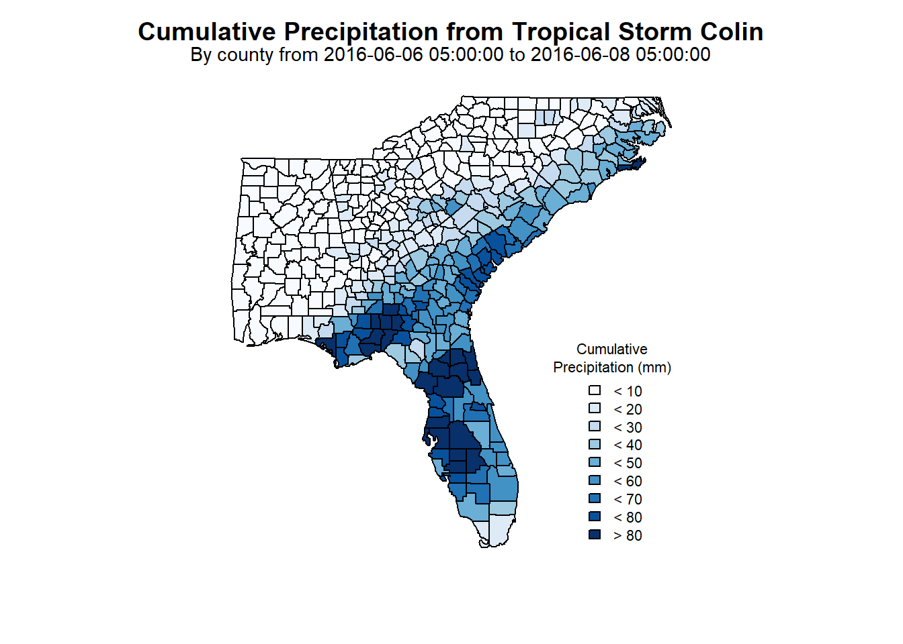

## USGS NWIS Culmination Write Up

Write up a 1-page **derived data product or research pipeline proposal** summary of a project that you might want to explore using USGS NWIS and USGS GDP data. Include the types of data that you would need to implement this project and how you would retrieve them. Save this summary as you will be refining and adding to your ideas over the course of the semester.  

Suggestions: 

1. Tables or bullet lists of **specific** data products

2. An **overarching high-quality figure** to show how these data align

3. One paragraph summarizing *how* this data or analysis is useful to **you and/or the infrastructure**.

<!--chapter:end:08-USGS.Rmd-->

# Frequently Asked Questions: {-}

## Where can I find due dates for assignments?

*All assignment deadlines can be found in BBLearn.  Within this textbook we have suggestions for the timing of all writen questions, coding labs and final culmination writes ups.  All material by infrastructure is due before we begin the next infrastructure.*


## How do I submit assignments?

*All assignments (except the very first git assignment) are submitted via BBLearn as both .Rmds and .pdfs*

## Do I still have to submit written exercises as .Rmd and .pdf?

*Yes.*

## What's better for code, conciseness or readability?

`Readability > Conciseness`

*I personally almost always use dplyr, my thoughts, pulled largely from Dr. Derek Sonderegger's Statistical Computing Course are below:*

The pipe command in `dplyr` `%>%` allows for very readable code. The idea is that the `%>%` operator works by translating the command *a* `%>%` *f(b)* to the expression *f(a,b)*. This operator works on **any function** and was introduced in the `magrittr` package. The beauty of this comes when you have a suite of functions that take input arguments of the same type as their output.  They are human readable!

For example if we wanted to start with *x*, and first apply function *f()*, then *g()*, and then *h()*, the usual R command would be *h(g(f(x)))* which is hard to read because you have to start reading at the innermost set of parentheses. Using the pipe command `%>%`, this sequence of operations becomes *x* `%>%` *f()* `%>%` *g()* `%>%` *h()*.

Dr. Hadley Wickham (aka R genius) gave the following example of readability:
```
bopping(
  scooping_up(
    hopping_through(foo_foo),
    field_mice),
  head)
```
is more readably written:

```
foo_foo %>% 
  hopping_through(forest) %>%
  scooping_up( field_mice) %>%
  bopping( head )
```

In dplyr, all the functions take a data set as its first argument and outputs an appropriately modified data set. This allows me to chain together commands in a readable fashion.  Then in 3 months I don't have to wonder what on earth I was doing last time I opened this project, if I filtered the data, etc etc.  Your future self will sincerely thank your past self.

## How find I find resources to navigate the NEON Data Portal?

A fantastic powerpoint giving you step-by-step directions [can be found here](https://www.neonscience.org/sites/default/files/Access_NEON_Data_%20Visual_Guide_6Feb2020.pptx).

## How can I best prepare for class and succeed?

1. Read the textbook, click on linked resources including videos, review materials as we go or read ahead.

2. Complete assignments as we go or ahead of time. Do not wait until the last minute.

3. Pick a 'coding buddy' and help each other tackle errors that arise.

4. Reach out to your instructors if you need clarification on assignments.

# Fall 2020 IGNITE Session

<iframe width="560" height="315" src="https://www.youtube.com/embed/zOGxBkqw0E8" frameborder="0" allow="accelerometer; autoplay; clipboard-write; encrypted-media; gyroscope; picture-in-picture" allowfullscreen></iframe>


<!--chapter:end:15_FAQ.Rmd-->

